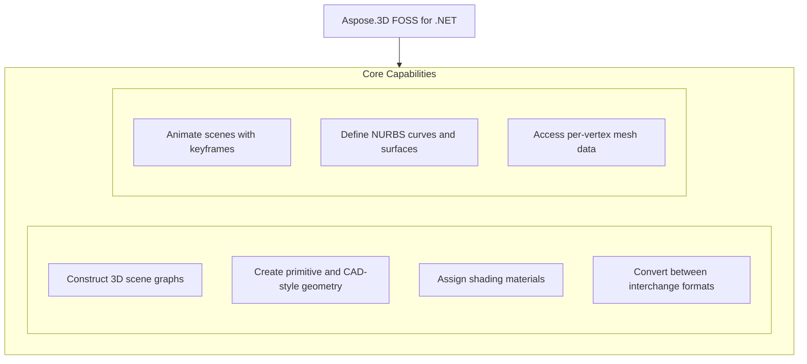

# Aspose.3D FOSS for .NET

[](https://www.nuget.org/packages/Aspose.3D.FOSS/) [](LICENSE) [](https://github.com/aspose-3d-foss/Aspose.3D-FOSS-for-.NET/graphs/contributors)

[](https://products.aspose.org/3d/net/)

Aspose.3D FOSS for .NET is a .NET library for working with 3D files and scenes, supporting formats such as OBJ, STL, GLTF, and Collada. It enables developers to load, manipulate, and export 3D content by providing classes like `Scene` and `Node` to manage scene graphs, entities, materials, and animations. Users in engineering, game development, and visualization use it to convert 3D models between formats, build scenes programmatically, and inspect scene properties without requiring a 3D modeling application. The library runs on netcoreapp3.1 and has no external dependencies.

## Navigation

- [At a Glance](#at-a-glance)
- [Key Capabilities](#key-capabilities)
- [Installation](#installation)
- [Dependencies](#dependencies)
- [Quick Start](#quick-start)
- [Additional Examples](#additional-examples)
- [API Reference](#api-reference)
- [Documentation & Resources](#documentation--resources)
- [Scope and Limitations](#scope-and-limitations)
- [Development and Testing](#development-and-testing)
- [License](#license)

## At a Glance



## Key Capabilities

- **Construct 3D scene graphs.** Construct 3D scene graphs using the `Scene` and `Node` classes, where `Scene` provides root access and node management while `Node` supports child relationships, transforms, and entity containment.
- **Create primitive and CAD-style geometry.** Create primitive and CAD-style geometry by generating shapes like `Box` through the Entities namespace and attaching them as child nodes to build structured scene hierarchies.
- **Assign shading materials.** Assign shading materials such as Lambert and physically based rendering materials using the Shading namespace to define surface appearance for geometry.
- **Convert between interchange formats.** Convert between interchange formats including COLLADA, OBJ, STL, and FBX by loading from files or streams and saving with format-specific options.
- **Animate scenes with keyframes.** Animate scenes with keyframes using animation clips from the Animation namespace and deformation support from the Deformers namespace to drive dynamic behavior.
- **Define NURBS curves and surfaces.** Define NURBS curves and surfaces through the Entities namespace to support precise parametric modeling in 3D scenes.
- **Access per-vertex mesh data.** Access per-vertex mesh data including positions, normals, and texture coordinates through the Entities namespace to inspect or modify geometry at the vertex level.

## Installation

Install the published package from NuGet (`Aspose.3D.FOSS`, version 26.1.0):

```bash
dotnet add package Aspose.3D.FOSS
```

To work from a source checkout instead, install the clone with pip:

```bash
git clone https://github.com/aspose-3d-foss/Aspose.3D-FOSS-for-.NET.git
cd Aspose.3D-FOSS-for-.NET
pip install .
```

## Dependencies

### Required Package Dependencies

No required third-party package dependencies; in `src/main/Aspose.ThreeD/Aspose.ThreeD.csproj`, no `PackageReference` a consumer would install is declared.

### Native and System Requirements

- Requires .NET `netcoreapp3.1` (`TargetFramework` in `src/main/Aspose.ThreeD/Aspose.ThreeD.csproj`).

## Quick Start

Build a scene from a primitive, assign a material, and save it to COLLADA through a stream using Aspose.3D.FOSS 26.1.0 for netcoreapp3.1.

```csharp
using Aspose.ThreeD;
using Aspose.ThreeD.Entities;
using Aspose.ThreeD.Formats;

var scene = new Scene();
var box = new Box(2, 2, 2);
scene.RootNode.CreateChildNode("BoxNode", box);

using var stream = new MemoryStream();
var options = new ColladaSaveOptions();
scene.Save(stream, options);
```

Load an existing glTF scene and re-save it as an OBJ using Aspose.3D.FOSS 26.1.0 for netcoreapp3.1.

```csharp
using Aspose.ThreeD;

var scene = Scene.FromFile("input.gltf");
scene.Save("output.obj", FileFormat.WavefrontOBJ);
```

## Additional Examples

Additional worked examples cover loading an existing scene and converting between formats.

### Load OBJ with custom options and export to STL using Aspose.3D.FOSS 26.1.0 for netcoreapp3.1

```csharp
using Aspose.ThreeD;
using Aspose.ThreeD.Formats;

var scene = new Scene();
var opts = new ObjLoadOptions();
opts.FlipCoordinateSystem = true;
opts.NormalizeNormal = true;
scene.Open("mesh.obj", opts);

scene.Save("mesh.stl");
```

<details>
<summary>View Additional Examples</summary>

### Convert a Lambert material to PBR using Aspose.3D.FOSS 26.1.0 for netcoreapp3.1

```csharp
using Aspose.ThreeD.Shading;

var lambert = new LambertMaterial("Body");
var pbr = PbrMaterial.FromMaterial(lambert);
```

### Handle an unrecognized 3D file format by catching `ArgumentException` using Aspose.3D.FOSS 26.1.0 for netcoreapp3.1

```csharp
using Aspose.ThreeD;

var scene = new Scene();
try
{
    scene.Open("unknown.xyz");
}
catch (ArgumentException)
{
    // No matching FileFormat could be resolved for the extension.
}
```


Save a scene to COLLADA through a stream:

</details>

## API Reference

Aspose.3D.FOSS for .NET provides 3D scene manipulation through the `Scene` class, which hosts a hierarchy of `Node` objects and uses `FileFormat` for loading and saving. The library organizes functionality into dedicated namespaces including Entities, Shading, Animation, Deformers, Formats, Profiles, Render, and Utilities.

The verified public surface has 293 types.

<details>
<summary>View the Complete Public API Surface</summary>

### Core API

| Class | Description |
| --- | --- |
| `A3DObject` | The base class of all Aspose.ThreeD objects, all sub classes will support dynamic properties. |
| `AnimationChannel` | The Aspose.ThreeD.Animation.AnimationChannel class represents an animation channel that controls how properties change over time using keyframe sequences. |
| `AnimationClip` | The Animation clip is a collection of animations. |
| `AnimationNode` | Aspose.3D's supports animation hierarchy, each animation can be composed by several animations and animation's key-frame definition. |
| `BindPoint` | A BindPoint is usually created on an object's property, some property types contains multiple component fields(like a Vector3 field), will generate channel for each component field and connects the field to one or more keyframe sequence instance(s) through the channels. |
| `Extrapolation` | The Aspose.ThreeD.Animation.Extrapolation class defines how animation behavior is extended beyond the defined keyframe range. |
| `KeyFrame` | The Aspose.ThreeD.Animation.KeyFrame class represents a single keyframe that stores a value and interpolation parameters at a specific time. |
| `KeyframeSequence` | The Aspose.ThreeD.Animation.KeyframeSequence class holds a collection of keyframes that define how a property animates over time. |
| `AssetInfo` | Information of asset. |
| `AxisSystem` | Axis system is an combination of coordinate system, up vector and front vector. |
| `BonePose` | The  contains the transformation matrix for a bone node |
| `CustomObject` | Represents custom object data |
| `Bone` | A bone defines the subset of the geometry's control point, and defined blend weight for each control point. |
| `Deformer` | Base class for  and |
| `MorphTargetChannel` | A MorphTargetChannel is used by  to organize the target geometries. |
| `MorphTargetDeformer` | MorphTargetDeformer provides per-vertex animation. |
| `SkinDeformer` | A skin deformer contains multiple bones to work, each bone blends a part of the geometry by control point's weights. |
| `BooleanOperand` | This class encapsulates the transformed mesh as Boolean operation's operand. |
| `BooleanOperator` | The Aspose.ThreeD.Entities.BooleanOperator class performs boolean operations such as union, intersection, or difference between two 3D entities. |
| `Box` | Box. |
| `Camera` | The camera describes the eye point of the viewer looking at the scene. |
| `Circle` | A  curve consists of a set of points in the edge of the circle shape. |
| `CompositeCurve` | A  is consisting of several curve segments. |
| `Curve` | The base class of all curve implementations. |
| `Cylinder` | Parameterized Cylinder. |
| `Dish` | Parameterized dish. |
| `Ellipse` | An Ellipse defines a set of points that form the shape of ellipse. |
| `EndPoint` | The end point to trim the curve, can be a parameter value or a Cartesian point. |
| `Frustum` | The base class of Camera and Light |
| `Geometry` | The base class of all renderable geometric objects (like Mesh, Box, Cylinder and etc.). |
| `HalfSpace` | represents a infinity space which is split by a plane, this can be used with |
| `IIndexedVertexElement` | VertexElement with indices data. |
| `IMeshConvertible` | Entities that implemented this interface can be converted to mesh |
| `IOrientable` | Orientable entities shall implement this interface. |
| `Light` | The light illuminates the scene. |
| `Line` | A polyline is a path defined by a set of points with segments, and connected by edges, which means it can also be a set of connected line segments. |
| `LinearExtrusion` | Linear extrusion takes a 2D shape as input and extends the shape in the 3rd dimension. |
| `Mesh` | A mesh is made of many n-sided polygons. |
| `NurbsCurve` | NURBS curve is a curve represented by NURBS(Non-uniform rational basis spline), A NURBS curve is defined by its control points, a set of weighted control points and a knot vector The w component in co |
| `NurbsDirection` | A 3D surface has two direction, the U and V, the NurbsDirection defines data for each direction. |
| `NurbsSurface` | is a surface represented by NURBS(Non-uniform rational basis spline), A  is defined by two  and . |
| `Patch` | A  is a parametric modeling surface, similar to , it's also defined by two , the  and . |
| `PatchDirection` | Patch's U and V direction. |
| `Plane` | Parameterized plane. |
| `PointCloud` | The point cloud contains no topology information but only the control points and the vertex elements. |
| `PolygonBuilder` | A helper class to build polygon for |
| `PolygonModifier` | The Aspose.ThreeD.Entities.PolygonModifier class provides functionality to modify polygonal geometry in a 3D scene. |
| `Primitive` | Base class for all primitives |
| `Pyramid` | Parameterized pyramid. |
| `RectangularTorus` | Parameterized rectangular torus. |
| `RevolvedAreaSolid` | This class represents a solid model by revolving a cross section provided by a profile about an axis. |
| `Segment` | A segment in composite curve. |
| `Shape` | The shape describes the deformation on a set of control points, which is similar to the cluster deformer in Maya. |
| `Skeleton` | The Skeleton is mainly used by CAD software to help designer to manipulate the transformation of skeletal structure, it's usually useless outside the CAD softwares. |
| `Sphere` | Parameterized sphere. |
| `SweptAreaSolid` | A SweptAreaSolid constructs a geometry by sweeping a profile along a directrix. |
| `Torus` | Parameterized torus. |
| `TransformedCurve` | A TransformedCurve gives a curve a placement by using a transformation matrix. |
| `TriMesh` | A TriMesh contains raw data that can be used by GPU directly. |
| `TrimmedCurve` | A bounded curve that trimmed the basis curve at both ends. |
| `VertexElement` | Base class of vertex elements. |
| `VertexElementBinormal` | The Aspose.ThreeD.Entities.VertexElementBinormal class stores binormal data for each vertex in a 3D mesh. |
| `VertexElementDoublesTemplate` | A helper class for defining concrete implementations. |
| `VertexElementEdgeCrease` | Defines the edge crease for specified components |
| `VertexElementFVector` | A helper class for defining concrete implementations. |
| `VertexElementHole` | Defines if specified polygon is hole |
| `VertexElementIntsTemplate` | A helper class for defining concrete implementations. |
| `VertexElementMaterial` | Defines material index for specified components. |
| `VertexElementNormal` | The Aspose.ThreeD.Entities.VertexElementNormal class stores normal vectors for each vertex in a 3D mesh. |
| `VertexElementPolygonGroup` | Defines polygon group for specified components to group related polygons together. |
| `VertexElementSmoothingGroup` | A smoothing group is a group of polygons in a polygon mesh which should appear to form a smooth surface. |
| `VertexElementSpecular` | Defines specular color for specified components. |
| `VertexElementTangent` | The Aspose.ThreeD.Entities.VertexElementTangent class stores tangent vectors for each vertex in a 3D mesh. |
| `VertexElementTemplate` | A helper class for defining concrete implementations. |
| `VertexElementUV` | Defines the UV coordinates for specified components. |
| `VertexElementUserData` | Defines custom user data for specified components. |
| `VertexElementVector4` | A helper class for defining concrete implementations. |
| `VertexElementVertexColor` | Defines the vertex color for specified components |
| `VertexElementVertexCrease` | Defines the vertex crease for specified components |
| `VertexElementVisibility` | Defines if specified components is visible |
| `VertexElementWeight` | Defines blend weight for specified components. |
| `Entity` | The base class of all entities. |
| `ExportException` | Export exception |
| `FileFormat` | File format definition |
| `FileFormatType` | File format type |
| `A3dwSaveOptions` | Save options for A3DW format. |
| `AmfSaveOptions` | Save options for AMF |
| `Chunk` | Represents a 3DS chunk header. |
| `ColladaSaveOptions` | Save options for Collada format |
| `Discreet3dsLoadOptions` | Load options for 3DS file. |
| `Discreet3dsSaveOptions` | Save options for 3DS file. |
| `DracoFormat` | Google Draco format |
| `DracoSaveOptions` | Save options for Google draco files |
| `FbxLoadOptions` | Load options for FBX format |
| `FbxSaveOptions` | Save options for FBX format |
| `ClassType` | The class definitions . |
| `EnumType` | The Aspose.ThreeD.Formats.GLTF.EnumType class defines the type of an enumeration used in GLTF asset serialization. |
| `EnumValue` | The Aspose.ThreeD.Formats.GLTF.EnumValue class represents a specific value within a GLTF enumeration. |
| `GLTF.Property` | The Aspose.ThreeD.Formats.GLTF.Property class represents a named property with a value in a GLTF asset. |
| `PropertyTable` | The Aspose.ThreeD.Formats.GLTF.PropertyTable class groups related GLTF properties into a structured table. |
| `StructuralMetadata` | This class provides support for EXT_structural_metadata, only used in glTF. |
| `GltfLoadOptions` | Load options for glTF format |
| `GltfSaveOptions` | Save options for glTF format |
| `Html5SaveOptions` | Save options for HTML5 |
| `IOConfig` | IO config for serialization/deserialization. |
| `JtLoadOptions` | Load options for Siemens JT |
| `LoadOptions` | The base class to configure options in file loading for different types |
| `Microsoft3MFFormat` | File format instance for Microsoft 3MF with 3MF related utilities. |
| `Microsoft3MFSaveOptions` | The Aspose.ThreeD.Formats.Microsoft3MFSaveOptions class provides options for saving 3D scenes to the Microsoft 3MF format. |
| `ObjLoadOptions` | Load options for Wavefront OBJ format |
| `ObjSaveOptions` | Save options for Wavefront OBJ format |
| `PdfFormat` | Adobe's Portable Document Format |
| `PdfLoadOptions` | Options for PDF loading |
| `PdfSaveOptions` | The save options in PDF exporting. |
| `PlyFormat` | The PLY format. |
| `PlyLoadOptions` | The Aspose.ThreeD.Formats.PlyLoadOptions class specifies settings used when loading PLY files. |
| `PlySaveOptions` | The Aspose.ThreeD.Formats.PlySaveOptions class specifies settings used when saving 3D scenes to the PLY format. |
| `RvmFormat` | The RVM Format |
| `RvmLoadOptions` | Load options for AVEVA Plant Design Management System's RVM file. |
| `RvmSaveOptions` | Save options for Aveva PDMS RVM file. |
| `SaveOptions` | The base class to configure options in file saving for different types |
| `StlLoadOptions` | Load options for STL format |
| `StlSaveOptions` | Save options for STL format |
| `U3dLoadOptions` | Load options for universal 3d |
| `U3dSaveOptions` | Save options for universal 3d |
| `UsdSaveOptions` | Save options for USD/USDZ formats. |
| `XLoadOptions` | The Load options for DirectX X files. |
| `GlobalTransform` | Global transform is similar to  but it's immutable while it represents the final evaluated transformation. |
| `Group` | A  represents the logical relationships of . |
| `INamedObject` | Object that has a name |
| `ImageRenderOptions` | Options for  and |
| `ImportException` | Import exception |
| `License` | License management class (not available in FOSS version) |
| `Metered` | Metered license management class (not available in FOSS version) |
| `Node` | Represents an element in the scene graph. |
| `Pose` | The pose is used to store transformation matrix when the geometry is skinned. |
| `ArbitraryProfile` | This class allows you to construct a 2D profile directly from arbitrary curve. |
| `CShape` | IFC compatible C-shape profile that defined by parameters. |
| `CenterLineProfile` | IFC compatible center line profile |
| `CircleShape` | IFC compatible circle profile, which can be used to construct a mesh through |
| `EllipseShape` | IFC compatible ellipse profile. |
| `FontFile` | Font file contains definitions for glyphs, this is used to create text profile. |
| `HShape` | The  provides the defining parameters of an 'H' or 'I' shape. |
| `HollowCircleShape` | IFC compatible hollow circle profile. |
| `HollowRectangleShape` | IFC compatible hollow rectangular shape with both inner/outer rounding corners. |
| `LShape` | IFC compatible L-shape profile that defined by parameters. |
| `MirroredProfile` | IFC compatible mirror profile. |
| `ParameterizedProfile` | The base class of all parameterized profiles. |
| `Profile` | 2D Profile in xy plane |
| `RectangleShape` | IFC compatible rectangular shape with rounding corners. |
| `TShape` | IFC compatible T-shape defined by parameters. |
| `Text` | Text profile, this profile describes contours using font and text. |
| `TrapeziumShape` | IFC compatible Trapezium shape defined by parameters. |
| `UShape` | IFC compatible U-shape defined by parameters. |
| `ZShape` | IFC compatible Z-shape profile that defined by parameters. |
| `ThreeD.Property` | Class to hold user-defined properties. |
| `PropertyCollection` | The collection of properties. |
| `CubeFaceData` | Data for each face of the cube map texture. |
| `DescriptorSetUpdater` | This class allows to update the  in a chain operation. |
| `DriverException` | The exception raised by internal rendering drivers. |
| `EntityRenderer` | Subclass this to implement rendering for different kind of entities. |
| `EntityRendererKey` | The key of registered entity renderer |
| `GLSLSource` | The source code of shaders in GLSL |
| `IBuffer` | The base interface of all managed buffers used in rendering |
| `ICommandList` | Encodes a sequence of commands which will be sent to GPU to render. |
| `IDescriptorSet` | The descriptor sets describes different resources that can be used to bind to the render pipeline like buffers, textures |
| `IIndexBuffer` | The index buffer describes the geometry used in rendering pipeline. |
| `IPipeline` | Pipeline interface |
| `IRenderQueue` | Entity renderer uses this queue to manage render tasks. |
| `IRenderTarget` | The base interface of render target |
| `IRenderTexture` | The interface of render texture |
| `IRenderWindow` | Render window interface |
| `ITexture1D` | 1D texture |
| `ITexture2D` | 2D texture |
| `ITextureCodec` | Codec for textures |
| `ITextureCubemap` | Cube map texture |
| `ITextureDecoder` | External texture decoder should implement this interface for decoding. |
| `ITextureEncoder` | External texture encoder should implement this interface for encoding. |
| `ITextureUnit` | represents a texture in the memory that shared between GPU and CPU and can be sampled by the shader, where the  only represents a reference to an external file. |
| `IVertexBuffer` | The vertex buffer holds the polygon vertex data that will be sent to rendering pipeline |
| `InitializationException` | Initialization exception |
| `PixelMapping` | The Aspose.ThreeD.Render.PixelMapping class controls the mapping of pixel data in rendering pipelines. |
| `PostProcessing` | The post-processing effects |
| `PushConstant` | A utility to provide data to shader through push constant. |
| `RenderFactory` | RenderFactory creates all resources that represented in rendering pipeline. |
| `RenderParameters` | Describe the parameters of the render target |
| `RenderResource` | Render resource base class |
| `RenderState` | Render state for building the pipeline The changes made on render state will not affect the created pipeline instances. |
| `Renderer` | The context about renderer. |
| `RendererVariableManager` | This class manages variables used in rendering |
| `SPIRVSource` | The compiled shader in SPIR-V format. |
| `ShaderException` | Shader related exceptions |
| `ShaderProgram` | The shader program |
| `ShaderSet` | Shader programs for each kind of materials |
| `ShaderSource` | The source code of shader |
| `ShaderVariable` | Shader variable |
| `StencilState` | Stencil states per face. |
| `TextureCodec` | Class to manage encoders and decoders for textures. |
| `TextureData` | This class contains the raw data and format definition of a texture. |
| `Viewport` | A  contains at least one viewport for rendering the scene. |
| `WindowHandle` | Encapsulated window handle for different platforms. |
| `Scene` | A scene is a top-level object that contains the nodes, geometries, materials, textures, animation, poses, sub-scenes and etc. |
| `SceneObject` | The root class of objects that will be stored inside a scene. |
| `LambertMaterial` | Material for lambert shading model |
| `Material` | Material defines the parameters necessary for visual appearance of geometry. |
| `PbrMaterial` | Material for physically based rendering based on albedo color/metallic/roughness |
| `PbrSpecularMaterial` | Material for physically based rendering based on diffuse color/specular/glossiness |
| `PhongMaterial` | Material for blinn-phong shading model. |
| `ShaderMaterial` | A shader material allows to describe the material by external rendering engine or shader language. |
| `ShaderTechnique` | A shader technique represents a concrete rendering implementation. |
| `Texture` | This class defines the texture from an external file. |
| `TextureBase` | Base class for all concrete textures. |
| `TextureSlot` | Texture slot in Material, can be enumerated through material instance. |
| `Transform` | A transform contains information that allow access to object's translate/scale/rotation or transform matrix at minimum cost This is used by local transform. |
| `TrialException` | Trial exception |
| `BoundingBox` | The axis-aligned bounding box |
| `BoundingBox2D` | The Aspose.ThreeD.Utilities.BoundingBox2D class represents a two-dimensional bounding box used for spatial calculations. |
| `FMatrix4` | The Aspose.ThreeD.Utilities.FMatrix4 class represents a 4x4 matrix of single-precision floating-point numbers. |
| `FVector2` | The Aspose.ThreeD.Utilities.FVector2 class represents a two-dimensional vector of single-precision floating-point numbers. |
| `FVector3` | Represents a 3D vector |
| `FVector4` | The Aspose.ThreeD.Utilities.FVector4 class represents a four-dimensional vector of single-precision floating-point numbers. |
| `FileSystem` | File system encapsulation. |
| `IArrayList` | Aspose.3D has its own highly optimized implementation of List{T} for better loading/saving performance Only this interface is exposed for user with IList{T} compatible and similar interfaces. |
| `IOExtension` | The Aspose.ThreeD.Utilities.IOExtension class provides utility methods for file input and output operations. |
| `MathUtils` | The Aspose.ThreeD.Utilities.MathUtils class offers common mathematical helper functions for 3D calculations. |
| `Matrix4` | The Aspose.ThreeD.Utilities.Matrix4 class represents a 4x4 matrix of double-precision floating-point numbers. |
| `ParseException` | The Aspose.ThreeD.Utilities.ParseException class represents an error that occurs during parsing of 3D data. |
| `Quaternion` | Quaternion is usually used to perform rotation in computer graphics. |
| `Rect` | The Aspose.ThreeD.Utilities.Rect class defines a rectangle using absolute coordinates. |
| `RelativeRectangle` | The Aspose.ThreeD.Utilities.RelativeRectangle class defines a rectangle using relative coordinate values. |
| `SemanticAttribute` | The Aspose.ThreeD.Utilities.SemanticAttribute class specifies the semantic meaning of a vertex attribute. |
| `TransformBuilder` | The Aspose.ThreeD.Utilities.TransformBuilder class provides methods to construct transformation matrices. |
| `Vector2` | The Aspose.ThreeD.Utilities.Vector2 class represents a two-dimensional vector of double-precision floating-point numbers. |
| `Vector3` | The Aspose.ThreeD.Utilities.Vector3 class represents a three-dimensional vector of double-precision floating-point numbers. |
| `Vector4` | The Aspose.ThreeD.Utilities.Vector4 class represents a four-dimensional vector of double-precision floating-point numbers. |
| `Vertex` | The Aspose.ThreeD.Utilities.Vertex class represents a single vertex in a 3D mesh with associated attributes. |
| `VertexDeclaration` | The Aspose.ThreeD.Utilities.VertexDeclaration class describes the layout and structure of vertex data. |
| `VertexField` | The Aspose.ThreeD.Utilities.VertexField class defines a single field within a vertex declaration. |
| `Watermark` | The Aspose.ThreeD.Utilities.Watermark class provides functionality to embed or extract watermark information in 3D files. |

#### Enumerations

| Enumeration | Description |
| --- | --- |
| `ExtrapolationType` | Extrapolation type. |
| `Interpolation` | The key frame's interpolation type. |
| `StepMode` | Interpolation step mode. |
| `WeightedMode` | Weighted mode. |
| `Axis` | Axis |
| `CoordinateSystem` | Coordinate system |
| `BoneLinkMode` | A bone's link mode refers to the way in which a bone is connected or linked to its parent bone within a hierarchical structure. |
| `ApertureMode` | Camera aperture modes. |
| `BooleanOperation` | Mesh's Boolean operation |
| `CurveDimension` | The dimension of the curves. |
| `LightType` | Light types. |
| `MappingMode` | Mapping mode |
| `NurbsType` | NURBS types. |
| `PatchDirectionType` | Patch direction's types. |
| `ProjectionType` | Camera's projection types. |
| `ReferenceMode` | defines how mapping information is stored and referenced by. |
| `RotationMode` | The frustum's rotation mode |
| `SkeletonType` | The Aspose.ThreeD.Entities.SkeletonType class specifies the type and structure of a skeleton used for skeletal animation. |
| `SplitMeshPolicy` | Share vertex/control point data between sub-meshes or each sub-mesh has its own compacted data. |
| `TextureMapping` | The texture mapping type for Describes which kind of texture mapping is used. |
| `VertexElementType` | The type of the vertex element, defined how it will be used in modeling. |
| `FileContentType` | File content type |
| `ColladaTransformStyle` | The node's transformation style of node |
| `DracoCompressionLevel` | Compression level for draco file |
| `GltfEmbeddedImageFormat` | How glTF exporter will embed the textures during the exporting. |
| `PdfLightingScheme` | LightingScheme specifies the lighting to apply to 3D artwork. |
| `PdfRenderMode` | Render mode specifies the style in which the 3D artwork is rendered. |
| `PoseType` | Pose type. |
| `PropertyFlags` | Property's flags |
| `BlendFactor` | Blend factor specify pixel arithmetic. |
| `CompareFunction` | Compare function for depth/stencil testing |
| `CubeFace` | Cube face selection |
| `CullFaceMode` | Cull face mode |
| `DrawOperation` | The primitive types to render |
| `EntityRendererFeatures` | The extra features that the entity renderer will provide |
| `FrontFace` | Front face winding |
| `IndexDataType` | The data type of the elements in |
| `PixelFormat` | The pixel's format used in texture unit. |
| `PixelMapMode` | The Aspose.ThreeD.Render.PixelMapMode class defines how pixel maps are interpreted during rendering operations. |
| `PolygonMode` | Polygon mode |
| `PresetShaders` | This defines the preset internal shaders used by the renderer. |
| `RenderQueueGroupId` | The group id of render queue |
| `RenderStage` | The render stage |
| `ShaderStage` | Shader stage |
| `StencilAction` | Stencil action |
| `TextureType` | The type of the |
| `AlphaSource` | Defines whether the texture contains the alpha channel. |
| `TextureFilter` | Filter options during texture sampling. |
| `WrapMode` | Texture's wrap mode. |
| `BoundingBoxExtent` | The extent of the bounding box |
| `ComposeOrder` | The order to compose transform matrix |
| `RotationOrder` | The order controls which rx ry rz are applied in the transformation matrix. |
| `VertexFieldDataType` | Vertex field's data type |
| `VertexFieldSemantic` | The semantic of the vertex field |

#### Detailed Member Reference

### Scene

The `Scene` class serves as the primary entry point, owning a `RootNode` hierarchy and providing static `FromFile` and `FromStream` methods along with instance Save methods for format-aware loading and saving through the `FileFormat` registry.

- `A3DObject`: Initializes a new instance of the A3DObject class with no name.
- `AnimationClips`: Gets all AnimationClip defined in the scene.
- `AssetInfo`: Gets or sets the top-level asset information
- `Clear`: Clears the scene content and restores the default settings.
- `CreateAnimationClip`: A shorthand function to create and register the The first AnimationClip will be assigned to the
- `CurrentAnimationClip`: Gets or sets the active AnimationClip
- `FindProperty`: Finds the property.
- `FromFile`: Opens the scene from given path using specified file format.
- `FromStream`: Opens the scene from given stream using specified file format.
- `GetAnimationClip`: Gets a named AnimationClip
- `GetProperty`: Get the value of specified property
- `Library`: Objects that not directly used in scene hierarchy can be defined in Library.
- `Name`: Gets or sets the name.
- `Open`: Opens the scene from given stream using specified file format.
- `Poses`: Gets all Pose used in this scene.
- `Properties`: Gets the collection of all properties.
- `RemoveProperty`: Removes a dynamic property.
- `Render`: Render the scene into external file from given camera's perspective.
- `RootNode`: Gets the root node of the scene.
- `Save`: Saves the scene to stream using specified file format.
- `Scene`: Initializes a new instance of the Scene class.
- `SceneObject`: Initialize an SceneObject with a default name
- `SetProperty`: Sets the value of specified property
- `SubScenes`: Gets all sub-scenes
- `Version`: Version of the Aspose.3D library.

### Entities

The `Aspose.ThreeD.Entities` namespace contains classes for creating and managing geometric primitives, meshes, and other scene objects that populate the node hierarchy.

### Shading

The `Aspose.ThreeD.Shading` namespace provides material classes such as `LambertMaterial` and `PbrMaterial` for defining surface appearance, with support for converting legacy materials to physically based rendering equivalents.

### Animation

The `Aspose.ThreeD.Animation` namespace supports animation clips and pose management within a scene, enabling time-based transformations of scene objects.

### Deformers

The `Aspose.ThreeD.Deformers` namespace contains classes for applying mesh deformation operations such as morph targets and skinning to 3D geometry.

### Formats

The `Aspose.ThreeD.Formats` namespace includes format-specific options and settings for importing and exporting 3D files in various supported formats.

### FileFormat

The `Aspose.ThreeD.FileFormat` class provides a registry of supported 3D file formats and their identifiers, enabling format-aware loading and saving operations.

- `AMF`: Defined as `FileFormat`.
- `ASE`: Defined as `FileFormat`.
- `Aspose3DWeb`: Defined as `FileFormat`.
- `Blender`: Defined as `FileFormat`.
- `CanExport`: Gets whether Aspose.3D supports export scene to current file format.
- `CanImport`: Gets whether Aspose.3D supports import scene from current file format.
- `Collada`: Defined as `FileFormat`.
- `ContentType`: Gets file format content type
- `CreateLoadOptions`: Create a default load options for this file format
- `CreateSaveOptions`: Create a default save options for this file format
- `DXF`: Defined as `FileFormat`.
- `Detect`: Detects file format from file name, file must be readable so Aspose.3D can detect file format through file header.
- `Draco`: Defined as `Formats.DracoFormat`.
- `Extension`: Gets the extension name of this type.
- `Extensions`: Gets the extension names of this type.
- `FBX6100ASCII`: Defined as `FileFormat`.
- `FBX6100Binary`: Defined as `FileFormat`.
- `FBX7200ASCII`: Defined as `FileFormat`.
- `FBX7200Binary`: Defined as `FileFormat`.
- `FBX7300ASCII`: Defined as `FileFormat`.
- `FBX7300Binary`: Defined as `FileFormat`.
- `FBX7400ASCII`: Defined as `FileFormat`.
- `FBX7400Binary`: Defined as `FileFormat`.
- `FBX7500ASCII`: Defined as `FileFormat`.
- `FBX7500Binary`: Defined as `FileFormat`.
- `FBX7600ASCII`: Defined as `FileFormat`.
- `FBX7600Binary`: Defined as `FileFormat`.
- `FBX7700ASCII`: Defined as `FileFormat`.
- `FBX7700Binary`: Defined as `FileFormat`.
- `FileFormatType`: Gets file format type
- `Formats`: Access to all supported formats
- `GLTF`: Defined as `FileFormat`.
- `GLTF2`: Defined as `FileFormat`.
- `GLTF2_Binary`: Defined as `FileFormat`.
- `GLTF_Binary`: Defined as `FileFormat`.
- `GetFormatByExtension`: Gets the preferred file format from the file extension name The extension name should starts with a dot('.').
- `HTML5`: Defined as `FileFormat`.
- `IFC`: Defined as `FileFormat`.
- `MayaASCII`: Defined as `FileFormat`.
- `MayaBinary`: Defined as `FileFormat`.
- `Microsoft3MF`: Defined as `Formats.Microsoft3MFFormat`.
- `PDF`: Defined as `Formats.PdfFormat`.
- `PLY`: Defined as `Formats.PlyFormat`.
- `Pcd`: Defined as `FileFormat`.
- `PcdBinary`: Defined as `FileFormat`.
- `RvmBinary`: Defined as `Formats.RvmFormat`.
- `RvmText`: Defined as `Formats.RvmFormat`.
- `STLASCII`: Defined as `FileFormat`.
- `STLBinary`: Defined as `FileFormat`.
- `SiemensJT8`: Defined as `FileFormat`.
- `SiemensJT9`: Defined as `FileFormat`.
- `ToString`: Formats to string
- `USD`: Defined as `FileFormat`.
- `USDA`: Defined as `FileFormat`.
- `USDZ`: Defined as `FileFormat`.
- `Universal3D`: Defined as `FileFormat`.
- `VRML`: Defined as `FileFormat`.
- `Version`: Gets file format version
- `WavefrontOBJ`: Defined as `FileFormat`.
- `XBinary`: Defined as `FileFormat`.
- `XText`: Defined as `FileFormat`.
- `Xyz`: Defined as `FileFormat`.
- `Zip`: Defined as `FileFormat`.

### Profiles

The `Aspose.ThreeD.Profiles` namespace contains classes for managing 3D printing profiles and related settings.

### Render

The `Aspose.ThreeD.Render` namespace provides rendering capabilities for generating images and visualizations from 3D scenes.

### Utilities

The `Aspose.ThreeD.Utilities` namespace contains helper classes and extension methods that support common 3D operations and scene manipulation tasks.

### ThreeD

The `Aspose.ThreeD` namespace serves as the root namespace for the library, containing core types and serving as the primary import target for 3D scene manipulation.

### Aspose

The Aspose namespace provides the top-level container for all Aspose product families, including Aspose.3D.FOSS for .NET.

</details>

## Documentation & Resources

- **[Getting started guide](https://docs.aspose.org/3d/net/)** — Installation, walkthroughs, and feature guides for this library.
- **[How-to articles and FAQ](https://kb.aspose.org/3d/net/)** — Task-focused how-tos and answers to common questions.
- **[Full API reference](https://reference.aspose.org/3d/net/)** — Complete, generated reference documentation for every public type. It covers all 293 verified public types; the [API Reference](#api-reference) section above covers the essentials.
- **[Implementation progress notes](docs/foss-net-progress.md)** — Current FOSS-edition implementation status, in the repository.
- **[Release 26.2.0 notes](docs/release-26.2.0.md)** — Change log for this release, in the repository.
- **[AGENTS.md](AGENTS.md)** — Implementation status and development guidelines for contributors.
- Found a bug or have a feature request? [Open an issue](https://github.com/aspose-3d-foss/Aspose.3D-FOSS-for-.NET/issues).

## Scope and Limitations

Aspose.3D FOSS for .NET version 26.1.0 targets netcoreapp3.1 and provides a subset of the Aspose.3D API surface for 3D scene manipulation, supporting import and export of formats such as PLY through the `Scene.Open` and `Scene.Save` methods, while omitting rendering, advanced mesh processing, NURBS evaluation, and metadata handling features.

- Rendering is not implemented in this FOSS build — `Scene.Render`, `RenderFactory`, and the `IRenderTarget`/`IRenderWindow` rendering pipeline all throw NotImplementedException.
- `PolygonModifier` operations and most `TriMesh` raw-buffer conversion helpers throw NotImplementedException, so mesh post-processing utilities beyond basic scene-graph construction are not functional.
- NURBS evaluation and conversion to mesh are not functional — `NurbsCurve.Evaluate`/`EvaluateAt` and `NurbsSurface.ToMesh` throw NotImplementedException.
- 3MF production-extension metadata handling is not implemented — `Microsoft3MFFormat`'s `IsBuildable`, `GetTransformForBuild`, `SetBuildable`, and object type accessors are not functional, though core 3MF geometry import/export works.
- RVM attribute data does not load — `RvmFormat.LoadAttributes` is not implemented, though core RVM geometry import/export works.
- `Text` watermarking is not currently functional in this FOSS build.

These limitations don't apply to [Aspose.3D for .NET — Enterprise Edition](https://products.aspose.com/3d/net/). Aspose.3D FOSS for .NET provides open-source 3D processing capabilities for .NET Core applications targeting netcoreapp3.1, while Aspose.3D commercial edition extends this with additional file format support, advanced rendering features, and commercial licensing options.

## Development and Testing

Clone the repository and run the test suite with the .NET SDK, or build the converter project directly.

```bash
git clone https://github.com/aspose-3d-foss/Aspose.3D-FOSS-for-.NET.git
cd Aspose.3D-FOSS-for-.NET
dotnet test src/test/Aspose.ThreeD.Tests/Aspose.ThreeD.Tests.csproj
```

```bash
dotnet build src/converter/Converter.csproj
```

See [AGENTS.md](AGENTS.md) in the repository root for current implementation status and
development guidelines.

## License

This project is licensed under the [MIT License](LICENSE). The MIT License permits use, copying, modification, distribution, sublicensing, and commercial use, provided its copyright and permission notice are retained. The software is provided without warranty.
