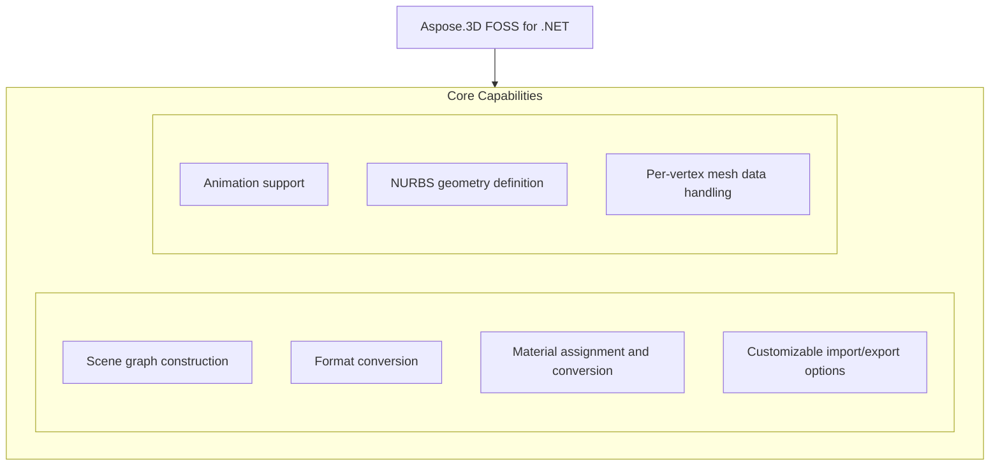

# Aspose.3D FOSS for .NET

[](https://www.nuget.org/packages/Aspose.3D.FOSS/) [](LICENSE) [](https://github.com/aspose-3d-foss/Aspose.3D-FOSS-for-.NET/graphs/contributors)

[](https://products.aspose.org/3d/net/)

Aspose.3D FOSS for .NET is a free and open-source library that enables developers to create, read, convert, and manipulate 3D scenes and models in .NET applications. It supports a wide range of 3D file formats including FBX, STL, OBJ, GLTF, Collada, and many others, allowing seamless import and export operations without requiring external dependencies. Developers working with 3D content in domains such as game development, CAD visualization, and simulation benefit from its programmatic control over geometry, materials, nodes, and scene hierarchy. The library exposes core functionality through namespaces like `Aspose.ThreeD.Entities`, `Aspose.ThreeD.Profiles`, `Aspose.ThreeD.Shading`, `Aspose.ThreeD.Formats`, and `Aspose.ThreeD.Animation`, and targets netcoreapp3.1 and later.

## Navigation

- [At a Glance](#at-a-glance)
- [Key Capabilities](#key-capabilities)
- [Installation](#installation)
- [Dependencies](#dependencies)
- [Quick Start](#quick-start)
- [Additional Examples](#additional-examples)
- [API Reference](#api-reference)
- [Documentation & Resources](#documentation--resources)
- [Scope and Limitations](#scope-and-limitations)
- [Development and Testing](#development-and-testing)
- [License](#license)

## At a Glance



## Key Capabilities

- **Scene graph construction.** Create and manipulate scene graphs by constructing a new `Scene`, adding child nodes with primitives like `Box`, and assigning materials directly during node creation.
- **Format conversion.** Convert between 3D formats such as glTF and OBJ by loading a scene from a file and saving it to a different format using `FileFormat.WavefrontOBJ`.
- **Material assignment and conversion.** Assign and convert materials by creating a `LambertMaterial` with custom diffuse color and converting it to a physically based rendering material using `PbrMaterial.FromMaterial`.
- **Customizable import/export options.** Customize import and export behavior through options like `ObjLoadOptions` for coordinate system flipping and normal normalization, and `ColladaSaveOptions` for export.
- **Animation support.** Handle animation data including bones, poses, and deformers through the Animation, Deformers, `BonePose`, `Pose`, and `PoseType` classes provided by `Aspose.ThreeD.Animation`.
- **NURBS geometry definition.** Define NURBS geometry using the `CustomObject` class from `Aspose.ThreeD.CustomObject` to create parametric surfaces for 3D modeling.
- **Per-vertex mesh data handling.** Access and manage per-vertex mesh data through the Entities namespace, which includes primitives and mesh objects that store vertex positions, normals, and texture coordinates.

## Installation

Install the published package from NuGet (`Aspose.3D.FOSS`, version 26.1.0):

```bash
dotnet add package Aspose.3D.FOSS
```

To work from a source checkout instead, build the clone with dotnet build:

```bash
git clone https://github.com/aspose-3d-foss/Aspose.3D-FOSS-for-.NET.git
cd Aspose.3D-FOSS-for-.NET
dotnet build
```

## Dependencies

### Required Package Dependencies

No required third-party package dependencies; in `src/main/Aspose.ThreeD/Aspose.ThreeD.csproj`, no `PackageReference` a consumer would install is declared.

### Native and System Requirements

- Requires .NET `netcoreapp3.1` (`TargetFramework` in `src/main/Aspose.ThreeD/Aspose.ThreeD.csproj`).

## Quick Start

Create a new scene with a box primitive, apply a Lambert material, and export it to FBX format using Aspose.3D.FOSS version 26.1.0 for netcoreapp3.1.

```csharp
using Aspose.ThreeD;
using Aspose.ThreeD.Entities;
using Aspose.ThreeD.Shading;

// Create a new scene and add a box primitive to the root node
var scene = new Scene();
var material = new LambertMaterial("Body")
{
    DiffuseColor = new Vector3(0.6, 0.6, 0.6),
};
scene.RootNode.CreateChildNode("Box", new Box(2, 2, 2), material);

// Save to FBX
scene.Save("output.fbx", FileFormat.FBX7400Binary);
```

Load an existing GLTF file into a scene and convert it to OBJ format using Aspose.3D.FOSS version 26.1.0 for netcoreapp3.1.

```csharp
using Aspose.ThreeD;

var scene = Scene.FromFile("input.gltf");
scene.Save("output.obj", FileFormat.WavefrontOBJ);
```

## Additional Examples

The Aspose.3D FOSS for .NET library supports material conversion, scene loading, format conversion, and error handling for unrecognized formats.

### Create a box node and export to Collada format

```csharp
using Aspose.ThreeD;
using Aspose.ThreeD.Entities;
using Aspose.ThreeD.Formats;

var scene = new Scene();
var box = new Box(2, 2, 2);
scene.RootNode.CreateChildNode("BoxNode", box);

using var stream = new MemoryStream();
var options = new ColladaSaveOptions();
scene.Save(stream, options);
```

<details>
<summary>View Additional Examples</summary>

### Convert a Lambert material to `PbrMaterial`

```csharp
using Aspose.ThreeD.Shading;

var lambert = new LambertMaterial("Body");
var pbr = PbrMaterial.FromMaterial(lambert);
```

### Load an OBJ file and save as STL

```csharp
using Aspose.ThreeD;
using Aspose.ThreeD.Formats;

var scene = new Scene();
var opts = new ObjLoadOptions();
opts.FlipCoordinateSystem = true;
opts.NormalizeNormal = true;
scene.Open("mesh.obj", opts);

scene.Save("mesh.stl");
```

### Catch an exception for an unrecognized file format

```csharp
using Aspose.ThreeD;

var scene = new Scene();
try
{
    scene.Open("unknown.xyz");
}
catch (ArgumentException)
{
    // No matching FileFormat could be resolved for the extension.
}
```


Handle an unrecognized file format:

</details>

## API Reference

Aspose.3D FOSS for .NET provides core 3D scene management through the `Aspose.ThreeD.Scene` class, which serves as the primary entry point for loading, creating, and saving 3D content, and the `Aspose.ThreeD.Node` class, which represents individual objects within a scene hierarchy. The `Scene` class contains the scene graph through its `RootNode` property and manages assets like materials, animations, and geometry via its Library and `ChildNodes` collections.

The verified public surface has 293 types.

<details>
<summary>View the Complete Public API Surface</summary>

### Core API

| Class | Description |
| --- | --- |
| `A3DObject` | The base class of all Aspose.ThreeD objects, all sub classes will support dynamic properties. |
| `AnimationChannel` | AnimationChannel represents an animation channel that controls a property of an object over time using a sequence of keyframes. |
| `AnimationClip` | The Animation clip is a collection of animations. |
| `AnimationNode` | Aspose.3D's supports animation hierarchy, each animation can be composed by several animations and animation's key-frame definition. |
| `BindPoint` | A BindPoint is usually created on an object's property, some property types contains multiple component fields(like a Vector3 field), will generate channel for each component field and connects the field to one or more keyframe sequence instance(s) through the channels. |
| `Extrapolation` | Extrapolation defines how animation values are extended beyond the defined keyframe range using a repeat count and extrapolation type. |
| `KeyFrame` | KeyFrame stores a single keyframe with a time, value, and interpolation parameters for animation curves. |
| `KeyframeSequence` | KeyframeSequence holds a collection of keyframes that define how a property changes over time. |
| `AssetInfo` | Information of asset. |
| `AxisSystem` | Axis system is an combination of coordinate system, up vector and front vector. |
| `BonePose` | The  contains the transformation matrix for a bone node |
| `CustomObject` | Represents custom object data |
| `Bone` | A bone defines the subset of the geometry's control point, and defined blend weight for each control point. |
| `Deformer` | Base class for  and |
| `MorphTargetChannel` | A MorphTargetChannel is used by  to organize the target geometries. |
| `MorphTargetDeformer` | MorphTargetDeformer provides per-vertex animation. |
| `SkinDeformer` | A skin deformer contains multiple bones to work, each bone blends a part of the geometry by control point's weights. |
| `BooleanOperand` | This class encapsulates the transformed mesh as Boolean operation's operand. |
| `BooleanOperator` | BooleanOperator performs boolean operations such as union, intersection, or difference between two 3D entities. |
| `Box` | Box. |
| `Camera` | The camera describes the eye point of the viewer looking at the scene. |
| `Circle` | A  curve consists of a set of points in the edge of the circle shape. |
| `CompositeCurve` | A  is consisting of several curve segments. |
| `Curve` | The base class of all curve implementations. |
| `Cylinder` | Parameterized Cylinder. |
| `Dish` | Parameterized dish. |
| `Ellipse` | An Ellipse defines a set of points that form the shape of ellipse. |
| `EndPoint` | The end point to trim the curve, can be a parameter value or a Cartesian point. |
| `Frustum` | The base class of Camera and Light |
| `Geometry` | The base class of all renderable geometric objects (like Mesh, Box, Cylinder and etc.). |
| `HalfSpace` | represents a infinity space which is split by a plane, this can be used with |
| `IIndexedVertexElement` | VertexElement with indices data. |
| `IMeshConvertible` | Entities that implemented this interface can be converted to mesh |
| `IOrientable` | Orientable entities shall implement this interface. |
| `Light` | The light illuminates the scene. |
| `Line` | A polyline is a path defined by a set of points with segments, and connected by edges, which means it can also be a set of connected line segments. |
| `LinearExtrusion` | Linear extrusion takes a 2D shape as input and extends the shape in the 3rd dimension. |
| `Mesh` | A mesh is made of many n-sided polygons. |
| `NurbsCurve` | NURBS curve is a curve represented by NURBS(Non-uniform rational basis spline), A NURBS curve is defined by its control points, a set of weighted control points and a knot vector The w component in co |
| `NurbsDirection` | A 3D surface has two direction, the U and V, the NurbsDirection defines data for each direction. |
| `NurbsSurface` | is a surface represented by NURBS(Non-uniform rational basis spline), A  is defined by two  and . |
| `Patch` | A  is a parametric modeling surface, similar to , it's also defined by two , the  and . |
| `PatchDirection` | Patch's U and V direction. |
| `Plane` | Parameterized plane. |
| `PointCloud` | The point cloud contains no topology information but only the control points and the vertex elements. |
| `PolygonBuilder` | A helper class to build polygon for |
| `PolygonModifier` | PolygonModifier provides functionality to modify polygonal meshes by altering their structure or attributes. |
| `Primitive` | Base class for all primitives |
| `Pyramid` | Parameterized pyramid. |
| `RectangularTorus` | Parameterized rectangular torus. |
| `RevolvedAreaSolid` | This class represents a solid model by revolving a cross section provided by a profile about an axis. |
| `Segment` | A segment in composite curve. |
| `Shape` | The shape describes the deformation on a set of control points, which is similar to the cluster deformer in Maya. |
| `Skeleton` | The Skeleton is mainly used by CAD software to help designer to manipulate the transformation of skeletal structure, it's usually useless outside the CAD softwares. |
| `Sphere` | Parameterized sphere. |
| `SweptAreaSolid` | A SweptAreaSolid constructs a geometry by sweeping a profile along a directrix. |
| `Torus` | Parameterized torus. |
| `TransformedCurve` | A TransformedCurve gives a curve a placement by using a transformation matrix. |
| `TriMesh` | A TriMesh contains raw data that can be used by GPU directly. |
| `TrimmedCurve` | A bounded curve that trimmed the basis curve at both ends. |
| `VertexElement` | Base class of vertex elements. |
| `VertexElementBinormal` | VertexElementBinormal stores binormal data for each vertex in a mesh, used for lighting and normal mapping calculations. |
| `VertexElementDoublesTemplate` | A helper class for defining concrete implementations. |
| `VertexElementEdgeCrease` | Defines the edge crease for specified components |
| `VertexElementFVector` | A helper class for defining concrete implementations. |
| `VertexElementHole` | Defines if specified polygon is hole |
| `VertexElementIntsTemplate` | A helper class for defining concrete implementations. |
| `VertexElementMaterial` | Defines material index for specified components. |
| `VertexElementNormal` | VertexElementNormal stores normal vectors for each vertex in a mesh, essential for lighting computations. |
| `VertexElementPolygonGroup` | Defines polygon group for specified components to group related polygons together. |
| `VertexElementSmoothingGroup` | A smoothing group is a group of polygons in a polygon mesh which should appear to form a smooth surface. |
| `VertexElementSpecular` | Defines specular color for specified components. |
| `VertexElementTangent` | VertexElementTangent stores tangent vectors for each vertex in a mesh, used for normal mapping and advanced lighting. |
| `VertexElementTemplate` | A helper class for defining concrete implementations. |
| `VertexElementUV` | Defines the UV coordinates for specified components. |
| `VertexElementUserData` | Defines custom user data for specified components. |
| `VertexElementVector4` | A helper class for defining concrete implementations. |
| `VertexElementVertexColor` | Defines the vertex color for specified components |
| `VertexElementVertexCrease` | Defines the vertex crease for specified components |
| `VertexElementVisibility` | Defines if specified components is visible |
| `VertexElementWeight` | Defines blend weight for specified components. |
| `Entity` | The base class of all entities. |
| `ExportException` | Export exception |
| `FileFormat` | File format definition |
| `FileFormatType` | File format type |
| `A3dwSaveOptions` | Save options for A3DW format. |
| `AmfSaveOptions` | Save options for AMF |
| `Chunk` | Represents a 3DS chunk header. |
| `ColladaSaveOptions` | Save options for Collada format |
| `Discreet3dsLoadOptions` | Load options for 3DS file. |
| `Discreet3dsSaveOptions` | Save options for 3DS file. |
| `DracoFormat` | Google Draco format |
| `DracoSaveOptions` | Save options for Google draco files |
| `FbxLoadOptions` | Load options for FBX format |
| `FbxSaveOptions` | Save options for FBX format |
| `ClassType` | The class definitions . |
| `EnumType` | EnumType defines the type of an enumeration used in a GLTF property table. |
| `EnumValue` | EnumValue represents a specific value within a GLTF enumeration. |
| `GLTF.Property` | Property describes a named attribute with a type and optional default value in a GLTF property table. |
| `PropertyTable` | PropertyTable groups a set of properties and their values for extended GLTF metadata. |
| `StructuralMetadata` | This class provides support for EXT_structural_metadata, only used in glTF. |
| `GltfLoadOptions` | Load options for glTF format |
| `GltfSaveOptions` | Save options for glTF format |
| `Html5SaveOptions` | Save options for HTML5 |
| `IOConfig` | IO config for serialization/deserialization. |
| `JtLoadOptions` | Load options for Siemens JT |
| `LoadOptions` | The base class to configure options in file loading for different types |
| `Microsoft3MFFormat` | File format instance for Microsoft 3MF with 3MF related utilities. |
| `Microsoft3MFSaveOptions` | Microsoft3MFSaveOptions controls how a 3D scene is saved to the Microsoft 3MF format. |
| `ObjLoadOptions` | Load options for Wavefront OBJ format |
| `ObjSaveOptions` | Save options for Wavefront OBJ format |
| `PdfFormat` | Adobe's Portable Document Format |
| `PdfLoadOptions` | Options for PDF loading |
| `PdfSaveOptions` | The save options in PDF exporting. |
| `PlyFormat` | The PLY format. |
| `PlyLoadOptions` | PlyLoadOptions specifies settings used when loading a PLY file into a 3D scene. |
| `PlySaveOptions` | PlySaveOptions controls how a 3D scene is exported to the PLY file format. |
| `RvmFormat` | The RVM Format |
| `RvmLoadOptions` | Load options for AVEVA Plant Design Management System's RVM file. |
| `RvmSaveOptions` | Save options for Aveva PDMS RVM file. |
| `SaveOptions` | The base class to configure options in file saving for different types |
| `StlLoadOptions` | Load options for STL format |
| `StlSaveOptions` | Save options for STL format |
| `U3dLoadOptions` | Load options for universal 3d |
| `U3dSaveOptions` | Save options for universal 3d |
| `UsdSaveOptions` | Save options for USD/USDZ formats. |
| `XLoadOptions` | The Load options for DirectX X files. |
| `GlobalTransform` | Global transform is similar to  but it's immutable while it represents the final evaluated transformation. |
| `Group` | A  represents the logical relationships of . |
| `INamedObject` | Object that has a name |
| `ImageRenderOptions` | Options for  and |
| `ImportException` | Import exception |
| `License` | License management class (not available in FOSS version) |
| `Metered` | Metered license management class (not available in FOSS version) |
| `Node` | Represents an element in the scene graph. |
| `Pose` | The pose is used to store transformation matrix when the geometry is skinned. |
| `ArbitraryProfile` | This class allows you to construct a 2D profile directly from arbitrary curve. |
| `CShape` | IFC compatible C-shape profile that defined by parameters. |
| `CenterLineProfile` | IFC compatible center line profile |
| `CircleShape` | IFC compatible circle profile, which can be used to construct a mesh through |
| `EllipseShape` | IFC compatible ellipse profile. |
| `FontFile` | Font file contains definitions for glyphs, this is used to create text profile. |
| `HShape` | The  provides the defining parameters of an 'H' or 'I' shape. |
| `HollowCircleShape` | IFC compatible hollow circle profile. |
| `HollowRectangleShape` | IFC compatible hollow rectangular shape with both inner/outer rounding corners. |
| `LShape` | IFC compatible L-shape profile that defined by parameters. |
| `MirroredProfile` | IFC compatible mirror profile. |
| `ParameterizedProfile` | The base class of all parameterized profiles. |
| `Profile` | 2D Profile in xy plane |
| `RectangleShape` | IFC compatible rectangular shape with rounding corners. |
| `TShape` | IFC compatible T-shape defined by parameters. |
| `Text` | Text profile, this profile describes contours using font and text. |
| `TrapeziumShape` | IFC compatible Trapezium shape defined by parameters. |
| `UShape` | IFC compatible U-shape defined by parameters. |
| `ZShape` | IFC compatible Z-shape profile that defined by parameters. |
| `ThreeD.Property` | Class to hold user-defined properties. |
| `PropertyCollection` | The collection of properties. |
| `CubeFaceData` | Data for each face of the cube map texture. |
| `DescriptorSetUpdater` | This class allows to update the  in a chain operation. |
| `DriverException` | The exception raised by internal rendering drivers. |
| `EntityRenderer` | Subclass this to implement rendering for different kind of entities. |
| `EntityRendererKey` | The key of registered entity renderer |
| `GLSLSource` | The source code of shaders in GLSL |
| `IBuffer` | The base interface of all managed buffers used in rendering |
| `ICommandList` | Encodes a sequence of commands which will be sent to GPU to render. |
| `IDescriptorSet` | The descriptor sets describes different resources that can be used to bind to the render pipeline like buffers, textures |
| `IIndexBuffer` | The index buffer describes the geometry used in rendering pipeline. |
| `IPipeline` | Pipeline interface |
| `IRenderQueue` | Entity renderer uses this queue to manage render tasks. |
| `IRenderTarget` | The base interface of render target |
| `IRenderTexture` | The interface of render texture |
| `IRenderWindow` | Render window interface |
| `ITexture1D` | 1D texture |
| `ITexture2D` | 2D texture |
| `ITextureCodec` | Codec for textures |
| `ITextureCubemap` | Cube map texture |
| `ITextureDecoder` | External texture decoder should implement this interface for decoding. |
| `ITextureEncoder` | External texture encoder should implement this interface for encoding. |
| `ITextureUnit` | represents a texture in the memory that shared between GPU and CPU and can be sampled by the shader, where the  only represents a reference to an external file. |
| `IVertexBuffer` | The vertex buffer holds the polygon vertex data that will be sent to rendering pipeline |
| `InitializationException` | Initialization exception |
| `PixelMapping` | PixelMapping specifies the mapping between texture coordinates and pixel data for rendering. |
| `PostProcessing` | The post-processing effects |
| `PushConstant` | A utility to provide data to shader through push constant. |
| `RenderFactory` | RenderFactory creates all resources that represented in rendering pipeline. |
| `RenderParameters` | Describe the parameters of the render target |
| `RenderResource` | Render resource base class |
| `RenderState` | Render state for building the pipeline The changes made on render state will not affect the created pipeline instances. |
| `Renderer` | The context about renderer. |
| `RendererVariableManager` | This class manages variables used in rendering |
| `SPIRVSource` | The compiled shader in SPIR-V format. |
| `ShaderException` | Shader related exceptions |
| `ShaderProgram` | The shader program |
| `ShaderSet` | Shader programs for each kind of materials |
| `ShaderSource` | The source code of shader |
| `ShaderVariable` | Shader variable |
| `StencilState` | Stencil states per face. |
| `TextureCodec` | Class to manage encoders and decoders for textures. |
| `TextureData` | This class contains the raw data and format definition of a texture. |
| `Viewport` | A  contains at least one viewport for rendering the scene. |
| `WindowHandle` | Encapsulated window handle for different platforms. |
| `Scene` | A scene is a top-level object that contains the nodes, geometries, materials, textures, animation, poses, sub-scenes and etc. |
| `SceneObject` | The root class of objects that will be stored inside a scene. |
| `LambertMaterial` | Material for lambert shading model |
| `Material` | Material defines the parameters necessary for visual appearance of geometry. |
| `PbrMaterial` | Material for physically based rendering based on albedo color/metallic/roughness |
| `PbrSpecularMaterial` | Material for physically based rendering based on diffuse color/specular/glossiness |
| `PhongMaterial` | Material for blinn-phong shading model. |
| `ShaderMaterial` | A shader material allows to describe the material by external rendering engine or shader language. |
| `ShaderTechnique` | A shader technique represents a concrete rendering implementation. |
| `Texture` | This class defines the texture from an external file. |
| `TextureBase` | Base class for all concrete textures. |
| `TextureSlot` | Texture slot in Material, can be enumerated through material instance. |
| `Transform` | A transform contains information that allow access to object's translate/scale/rotation or transform matrix at minimum cost This is used by local transform. |
| `TrialException` | Trial exception |
| `BoundingBox` | The axis-aligned bounding box |
| `BoundingBox2D` | BoundingBox2D represents a two-dimensional bounding box defined by minimum and maximum coordinates. |
| `FMatrix4` | FMatrix4 provides a 4x4 matrix structure using single-precision floating-point numbers for geometric transformations. |
| `FVector2` | FVector2 represents a two-dimensional vector using single-precision floating-point components. |
| `FVector3` | Represents a 3D vector |
| `FVector4` | FVector4 represents a four-dimensional vector using single-precision floating-point components. |
| `FileSystem` | File system encapsulation. |
| `IArrayList` | Aspose.3D has its own highly optimized implementation of List{T} for better loading/saving performance Only this interface is exposed for user with IList{T} compatible and similar interfaces. |
| `IOExtension` | IOExtension provides utility methods for handling file I/O operations and path manipulations. |
| `MathUtils` | MathUtils offers common mathematical helper functions for 3D calculations. |
| `Matrix4` | Matrix4 provides a 4x4 matrix structure using double-precision floating-point numbers for geometric transformations. |
| `ParseException` | ParseException is thrown when an error occurs during parsing of a 3D file format. |
| `Quaternion` | Quaternion is usually used to perform rotation in computer graphics. |
| `Rect` | Rect defines a rectangle using integer coordinates for layout and rendering operations. |
| `RelativeRectangle` | RelativeRectangle represents a rectangle whose dimensions and position can be specified as relative values. |
| `SemanticAttribute` | SemanticAttribute associates a semantic meaning with a vertex field for shader binding. |
| `TransformBuilder` | TransformBuilder constructs transformation matrices from translation, rotation, and scale components. |
| `Vector2` | Vector2 represents a two-dimensional vector using double-precision floating-point components. |
| `Vector3` | Vector3 represents a three-dimensional vector using double-precision floating-point components. |
| `Vector4` | Vector4 represents a four-dimensional vector using double-precision floating-point components. |
| `Vertex` | Vertex encapsulates the position and other attributes of a single point in a 3D mesh. |
| `VertexDeclaration` | VertexDeclaration describes the layout and types of fields in a vertex structure. |
| `VertexField` | VertexField defines a single attribute within a vertex, such as position, normal, or texture coordinate. |
| `Watermark` | Watermark embeds identifying information into a 3D file during save operations. |

#### Enumerations

| Enumeration | Description |
| --- | --- |
| `ExtrapolationType` | Extrapolation type. |
| `Interpolation` | The key frame's interpolation type. |
| `StepMode` | Interpolation step mode. |
| `WeightedMode` | Weighted mode. |
| `Axis` | Axis |
| `CoordinateSystem` | Coordinate system |
| `BoneLinkMode` | A bone's link mode refers to the way in which a bone is connected or linked to its parent bone within a hierarchical structure. |
| `ApertureMode` | Camera aperture modes. |
| `BooleanOperation` | Mesh's Boolean operation |
| `CurveDimension` | The dimension of the curves. |
| `LightType` | Light types. |
| `MappingMode` | Mapping mode |
| `NurbsType` | NURBS types. |
| `PatchDirectionType` | Patch direction's types. |
| `ProjectionType` | Camera's projection types. |
| `ReferenceMode` | defines how mapping information is stored and referenced by. |
| `RotationMode` | The frustum's rotation mode |
| `SkeletonType` | SkeletonType specifies the type of skeleton used for character animation in a 3D scene. |
| `SplitMeshPolicy` | Share vertex/control point data between sub-meshes or each sub-mesh has its own compacted data. |
| `TextureMapping` | The texture mapping type for Describes which kind of texture mapping is used. |
| `VertexElementType` | The type of the vertex element, defined how it will be used in modeling. |
| `FileContentType` | File content type |
| `ColladaTransformStyle` | The node's transformation style of node |
| `DracoCompressionLevel` | Compression level for draco file |
| `GltfEmbeddedImageFormat` | How glTF exporter will embed the textures during the exporting. |
| `PdfLightingScheme` | LightingScheme specifies the lighting to apply to 3D artwork. |
| `PdfRenderMode` | Render mode specifies the style in which the 3D artwork is rendered. |
| `PoseType` | Pose type. |
| `PropertyFlags` | Property's flags |
| `BlendFactor` | Blend factor specify pixel arithmetic. |
| `CompareFunction` | Compare function for depth/stencil testing |
| `CubeFace` | Cube face selection |
| `CullFaceMode` | Cull face mode |
| `DrawOperation` | The primitive types to render |
| `EntityRendererFeatures` | The extra features that the entity renderer will provide |
| `FrontFace` | Front face winding |
| `IndexDataType` | The data type of the elements in |
| `PixelFormat` | The pixel's format used in texture unit. |
| `PixelMapMode` | PixelMapMode defines how pixel data is mapped during rendering operations. |
| `PolygonMode` | Polygon mode |
| `PresetShaders` | This defines the preset internal shaders used by the renderer. |
| `RenderQueueGroupId` | The group id of render queue |
| `RenderStage` | The render stage |
| `ShaderStage` | Shader stage |
| `StencilAction` | Stencil action |
| `TextureType` | The type of the |
| `AlphaSource` | Defines whether the texture contains the alpha channel. |
| `TextureFilter` | Filter options during texture sampling. |
| `WrapMode` | Texture's wrap mode. |
| `BoundingBoxExtent` | The extent of the bounding box |
| `ComposeOrder` | The order to compose transform matrix |
| `RotationOrder` | The order controls which rx ry rz are applied in the transformation matrix. |
| `VertexFieldDataType` | Vertex field's data type |
| `VertexFieldSemantic` | The semantic of the vertex field |

#### Detailed Member Reference

### Scene

The `Aspose.ThreeD.Scene` class enables loading existing 3D files from disk or streams, creating new scenes from scratch, and saving results in various formats; it provides access to the scene graph through `RootNode`, manages materials and animations via Library and `AnimationClips`, and supports property inspection and modification through Properties and `FindProperty` methods.

- `A3DObject`: Initializes a new instance of the A3DObject class with no name.
- `AnimationClips`: Gets all AnimationClip defined in the scene.
- `AssetInfo`: Gets or sets the top-level asset information
- `Clear`: Clears the scene content and restores the default settings.
- `CreateAnimationClip`: A shorthand function to create and register the The first AnimationClip will be assigned to the
- `CurrentAnimationClip`: Gets or sets the active AnimationClip
- `FindProperty`: Finds the property.
- `FromFile`: Opens the scene from given path using specified file format.
- `FromStream`: Opens the scene from given stream using specified file format.
- `GetAnimationClip`: Gets a named AnimationClip
- `GetProperty`: Get the value of specified property
- `Library`: Objects that not directly used in scene hierarchy can be defined in Library.
- `Name`: Gets or sets the name.
- `Open`: Opens the scene from given stream using specified file format.
- `Poses`: Gets all Pose used in this scene.
- `Properties`: Gets the collection of all properties.
- `RemoveProperty`: Removes a dynamic property.
- `Render`: Render the scene into external file from given camera's perspective.
- `RootNode`: Gets the root node of the scene.
- `Save`: Saves the scene to stream using specified file format.
- `Scene`: Initializes a new instance of the Scene class.
- `SceneObject`: Initialize an SceneObject with a default name
- `SetProperty`: Sets the value of specified property
- `SubScenes`: Gets all sub-scenes
- `Version`: Version of the Aspose.3D library.

### Node

The `Aspose.ThreeD.Node` class represents an object in the 3D scene graph, containing geometry through its Entities collection, child nodes via `ChildNodes`, and transformation state through `Transform`; it supports material assignment, visibility control, and scene graph traversal using methods like Accept, `AddChildNode`, and `SelectObjects`.

- `A3DObject`: Initializes a new instance of the A3DObject class with no name.
- `Accept`: Walks through all descendant nodes(including the current node) and call the visitor with the node.
- `AddChildNode`: Add a child node to this node
- `AddEntity`: Add an entity to the node.
- `AssetInfo`: Per-node asset info
- `ChildNodes`: Gets the children nodes.
- `CreateChildNode`: Creates a child node
- `Entities`: Gets all node entities.
- `Entity`: Gets or sets the first entity attached to this node, if sets, will clear other entities.
- `EvaluateGlobalTransform`: Evaluate the global transform, include the geometric transform or not.
- `Excluded`: Gets or sets whether to exclude this node and all child nodes/entities during exporting.
- `FindProperty`: Finds the property.
- `GetBoundingBox`: Calculate the bounding box of the node
- `GetChild`: Gets the child node at specified index.
- `GetEntity`: Gets the first entity that matches the specified type T.
- `GetProperty`: Get the value of specified property
- `GlobalTransform`: Gets the global transform.
- `Material`: Gets or sets the first material associated with this node, if sets, will clear other materials
- `Materials`: Gets the materials associated with this node.
- `Merge`: Detach everything under the node and attach them to current node.
- `MetaDatas`: Gets the meta data defined in this node.
- `Name`: Gets or sets the name.
- `Node`: Initializes a new instance of the Node class.
- `ParentNode`: Gets or sets the parent node.
- `Properties`: Gets the collection of all properties.
- `RemoveProperty`: Removes a dynamic property.
- `Scene`: Gets the scene that this object belongs to
- `SceneObject`: Initialize an SceneObject with a default name
- `SelectObjects`: Select multiple objects under current node using XPath-like query syntax.
- `SelectSingleObject`: Select single object under current node using XPath-like query syntax.
- `SetProperty`: Sets the value of specified property
- `ToString`: Gets the string representation of this node.
- `Transform`: Gets the local transform.
- `Visible`: Gets or sets to show the node

### FileFormat

The `Aspose.ThreeD.FileFormat` class defines supported 3D file formats such as FBX, OBJ, STL, and GLTF, enabling explicit format specification when saving scenes to ensure correct output encoding and compatibility.

- `AMF`: Defined as `FileFormat`.
- `ASE`: Defined as `FileFormat`.
- `Aspose3DWeb`: Defined as `FileFormat`.
- `Blender`: Defined as `FileFormat`.
- `CanExport`: Gets whether Aspose.3D supports export scene to current file format.
- `CanImport`: Gets whether Aspose.3D supports import scene from current file format.
- `Collada`: Defined as `FileFormat`.
- `ContentType`: Gets file format content type
- `CreateLoadOptions`: Create a default load options for this file format
- `CreateSaveOptions`: Create a default save options for this file format
- `DXF`: Defined as `FileFormat`.
- `Detect`: Detects file format from file name, file must be readable so Aspose.3D can detect file format through file header.
- `Draco`: Defined as `Formats.DracoFormat`.
- `Extension`: Gets the extension name of this type.
- `Extensions`: Gets the extension names of this type.
- `FBX6100ASCII`: Defined as `FileFormat`.
- `FBX6100Binary`: Defined as `FileFormat`.
- `FBX7200ASCII`: Defined as `FileFormat`.
- `FBX7200Binary`: Defined as `FileFormat`.
- `FBX7300ASCII`: Defined as `FileFormat`.
- `FBX7300Binary`: Defined as `FileFormat`.
- `FBX7400ASCII`: Defined as `FileFormat`.
- `FBX7400Binary`: Defined as `FileFormat`.
- `FBX7500ASCII`: Defined as `FileFormat`.
- `FBX7500Binary`: Defined as `FileFormat`.
- `FBX7600ASCII`: Defined as `FileFormat`.
- `FBX7600Binary`: Defined as `FileFormat`.
- `FBX7700ASCII`: Defined as `FileFormat`.
- `FBX7700Binary`: Defined as `FileFormat`.
- `FileFormatType`: Gets file format type
- `Formats`: Access to all supported formats
- `GLTF`: Defined as `FileFormat`.
- `GLTF2`: Defined as `FileFormat`.
- `GLTF2_Binary`: Defined as `FileFormat`.
- `GLTF_Binary`: Defined as `FileFormat`.
- `GetFormatByExtension`: Gets the preferred file format from the file extension name The extension name should starts with a dot('.').
- `HTML5`: Defined as `FileFormat`.
- `IFC`: Defined as `FileFormat`.
- `MayaASCII`: Defined as `FileFormat`.
- `MayaBinary`: Defined as `FileFormat`.
- `Microsoft3MF`: Defined as `Formats.Microsoft3MFFormat`.
- `PDF`: Defined as `Formats.PdfFormat`.
- `PLY`: Defined as `Formats.PlyFormat`.
- `Pcd`: Defined as `FileFormat`.
- `PcdBinary`: Defined as `FileFormat`.
- `RvmBinary`: Defined as `Formats.RvmFormat`.
- `RvmText`: Defined as `Formats.RvmFormat`.
- `STLASCII`: Defined as `FileFormat`.
- `STLBinary`: Defined as `FileFormat`.
- `SiemensJT8`: Defined as `FileFormat`.
- `SiemensJT9`: Defined as `FileFormat`.
- `ToString`: Formats to string
- `USD`: Defined as `FileFormat`.
- `USDA`: Defined as `FileFormat`.
- `USDZ`: Defined as `FileFormat`.
- `Universal3D`: Defined as `FileFormat`.
- `VRML`: Defined as `FileFormat`.
- `Version`: Gets file format version
- `WavefrontOBJ`: Defined as `FileFormat`.
- `XBinary`: Defined as `FileFormat`.
- `XText`: Defined as `FileFormat`.
- `Xyz`: Defined as `FileFormat`.
- `Zip`: Defined as `FileFormat`.

### Shading

The `Aspose.ThreeD.Shading` namespace provides material types including `LambertMaterial` and `PbrMaterial`, allowing developers to define surface appearance for 3D entities; it supports creating physically based rendering materials from standard materials using conversion methods.

### Entities

The `Aspose.ThreeD.Entities` namespace includes primitive geometry types such as `Box`, `Sphere`, and `Cylinder`, which can be added to nodes using `CreateChildNode` or `AddEntity` to build 3D scenes programmatically.

### Animation

The `Aspose.ThreeD.Animation` and `Aspose.ThreeD.Deformers` namespaces provide support for skeletal animation and mesh deformation, enabling complex character animation workflows through animation clips and deformation operators.

### Formats

The `Aspose.ThreeD.Formats` namespace includes loader and saver classes such as `ObjLoadOptions` and `ColladaSaveOptions`, allowing fine-grained control over import and export behavior through format-specific options.

### CustomObject

The `Aspose.ThreeD.CustomObject` class serves as a base for user-defined 3D entities, enabling developers to implement custom geometry or behavior by extending the core object model.

- `A3DObject`: Initializes a new instance of the A3DObject class with no name.
- `CustomObject`: Initializes a new instance of the CustomObject class
- `FindProperty`: Finds the property.
- `GetProperty`: Get the value of specified property
- `Name`: Gets or sets the name.
- `Properties`: Gets the collection of all properties.
- `RemoveProperty`: Removes a dynamic property.
- `SetProperty`: Sets the value of specified property

### Utilities

The `Aspose.ThreeD.Utilities` namespace provides helper methods and tools for common 3D operations such as coordinate system conversion, bounding box calculations, and other utility functions.

### ThreeD.Property

The `Aspose.ThreeD.Property` class represents metadata properties attached to 3D objects, supporting custom data storage and retrieval through name-value pairs.

- `GetBindPoint`: Gets the property bind point on specified animation instance.
- `GetExtra`: Gets extra data of the property associated by name.
- `GetKeyframeSequence`: Gets the keyframe sequence on specified animation instance.
- `Name`: Gets the name of the property.
- `SetExtra`: Sets extra data of the property associated by name.
- `ToString`: Returns a string that represents the current property.
- `Value`: Gets or sets the value.
- `ValueType`: Gets the type of the property value.

### PropertyCollection

The `Aspose.ThreeD.PropertyCollection` class manages a collection of properties associated with a 3D object, providing methods to add, remove, and query properties by name.

- `Count`: Gets the count of declared properties.
- `FindProperty`: Finds the property.
- `GetEnumerator`: Returns an enumerator that iterates through the collection.
- `RemoveProperty`: Removes a dynamic property.

### Transform

The `Aspose.ThreeD.Transform` class encapsulates transformation data including translation, rotation, and scale, used by nodes to define their position and orientation in 3D space.

- `A3DObject`: Initializes a new instance of the A3DObject class with no name.
- `EulerAngles`: Gets or sets the rotation represented in Euler angles, measured in degree
- `FindProperty`: Finds the property.
- `GeometricRotation`: Gets or sets the geometric Euler rotation(measured in degree).
- `GeometricScaling`: Gets or sets the geometric scaling.
- `GeometricTranslation`: Gets or sets the geometric translation.
- `GetProperty`: Get the value of specified property
- `Name`: Gets or sets the name.
- `PostRotation`: Gets or sets the post-rotation represented in degree
- `PreRotation`: Gets or sets the pre-rotation represented in degree
- `Properties`: Gets the collection of all properties.
- `RemoveProperty`: Removes a dynamic property.
- `Rotation`: Gets or sets the rotation represented in quaternion.
- `RotationOffset`: Gets or sets the rotation offset
- `RotationPivot`: Gets or sets the rotation pivot
- `Scaling`: Gets or sets the scaling
- `ScalingOffset`: Gets or sets the scaling offset
- `ScalingPivot`: Gets or sets the scaling pivot
- `SetEulerAngles`: Sets the Euler angles in degrees of current transform.
- `SetGeometricRotation`: Sets the geometric Euler rotation(measured in degree).
- `SetGeometricScaling`: Sets the geometric scaling.
- `SetGeometricTranslation`: Sets the geometric translation.
- `SetPostRotation`: Sets the post-rotation represented in degree
- `SetPreRotation`: Sets the pre-rotation represented in degree
- `SetProperty`: Sets the value of specified property
- `SetRotation`: Sets the rotation(as quaternion components) of current transform.
- `SetScale`: Sets the scale of current transform.
- `SetTranslation`: Sets the translation of current transform.
- `TransformMatrix`: Gets or sets the transform matrix.
- `Translation`: Gets or sets the translation

</details>

## Documentation & Resources

- **[Getting started guide](https://docs.aspose.org/3d/net/)** — The getting started guide covers installation, step-by-step walkthroughs, and feature introductions for Aspose.3D FOSS for .NET.
- **[How-to articles and FAQ](https://kb.aspose.org/3d/net/)** — The how-to articles and FAQ provide task-focused instructions and answers to frequently asked questions for Aspose.3D FOSS for .NET.
- **[Full API reference](https://reference.aspose.org/3d/net/)** — The full API reference delivers complete, generated documentation for every public type in Aspose.3D FOSS for .NET. It covers all 293 verified public types; the [API Reference](#api-reference) section above covers the essentials.
- **[Implementation progress notes](docs/foss-net-progress.md)** — The implementation progress notes document the current state of the FOSS edition implementation within the repository.
- **[Release 26.2.0 notes](docs/release-26.2.0.md)** — The release 26.2.0 notes present the change log for this specific release of Aspose.3D FOSS for .NET.
- **[AGENTS.md](AGENTS.md)** — `AGENTS.md` outlines implementation status and development guidelines for contributors to the repository.
- Found a bug or have a feature request? [Open an issue](https://github.com/aspose-3d-foss/Aspose.3D-FOSS-for-.NET/issues).

## Scope and Limitations

Aspose.3D FOSS for .NET version 26.1.0 targets netcoreapp3.1 and provides a subset of the Aspose.3D API surface for 3D scene construction, file I/O, and basic entity manipulation, with rendering, advanced mesh processing, and certain format-specific features disabled in this open-source edition.

- Rendering is not implemented in this FOSS build — `Scene.Render`, `RenderFactory`, and the `IRenderTarget`/`IRenderWindow` rendering pipeline all throw `NotImplementedException`, and the `Aspose.ThreeD.Render` and `Aspose.ThreeD.ImageRenderOptions` types are present only for API compatibility.
- The `Aspose.ThreeD.CustomObject` type is present for API compatibility but its core functionality is not implemented in this FOSS build.
- `Mesh` post-processing utilities such as `Aspose.ThreeD.Entities.PolygonModifier` and most `Aspose.ThreeD.Entities.TriMesh` raw-buffer conversion helpers throw `NotImplementedException`, limiting functionality beyond basic scene-graph construction.
- PDF and Google Draco import and export are genuinely not functional in this FOSS build — `Aspose.ThreeD.Formats.PdfFormat` and `Aspose.ThreeD.Formats.DracoFormat` have no reader/writer implementation anywhere in the codebase.
- `License` and trial-management APIs `Aspose.ThreeD.License` and `Aspose.ThreeD.Metered` are present for API-surface compatibility but are not applicable to this open-source edition.
- `Text` watermarking is not currently functional in this FOSS build — the `Aspose.ThreeD.Utilities.Watermark` type is present but throws `NotImplementedException` when used.

These limitations don't apply to [Aspose.3D for .NET — Enterprise Edition](https://products.aspose.com/3d/net/). Aspose.3D.FOSS provides open-source access to core 3D functionality for .NET developers targeting netcoreapp3.1, while Aspose.3D commercial edition extends this with additional formats, performance optimizations, and commercial support.

## Development and Testing

Build the Aspose.3D.FOSS library and its console converter tool using the .NET SDK by running dotnet build on the respective project files.

Clone the repository and run the test suite with the .NET SDK:

The console converter tool builds separately as a project reference to the library:

```bash
dotnet build src/converter/Converter.csproj
```

See [AGENTS.md](AGENTS.md) in the repository root for current implementation status and
development guidelines.

## License

This project is licensed under the [MIT License](LICENSE). The MIT License permits use, copying, modification, distribution, sublicensing, and commercial use, provided its copyright and permission notice are retained. The software is provided without warranty.
