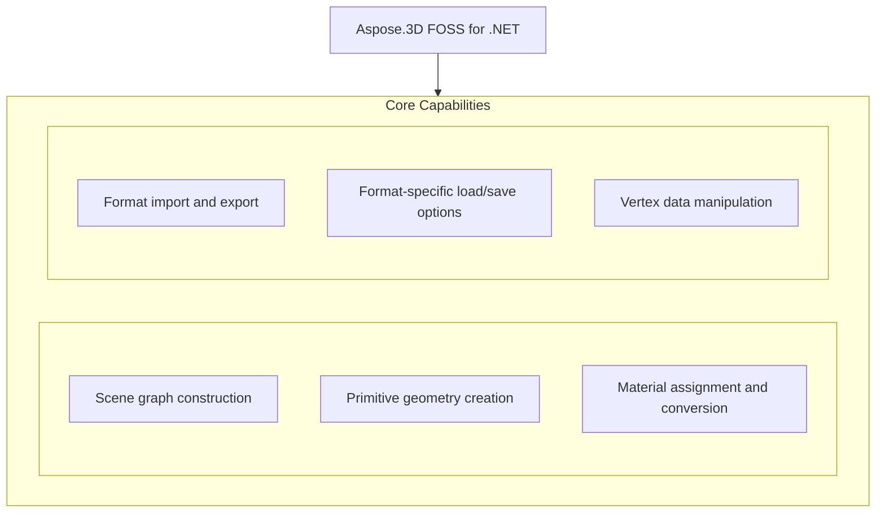

# Aspose.3D FOSS for .NET

[](https://www.nuget.org/packages/Aspose.3D.FOSS/) [](LICENSE) [](https://github.com/aspose-3d-foss/Aspose.3D-FOSS-for-.NET/graphs/contributors)

[](https://products.aspose.org/3d/net/)

Aspose.3D FOSS for .NET is a free and open-source library that enables developers to create, read, convert, and manipulate 3D scenes and models in .NET applications. It supports common 3D formats such as FBX, OBJ, STL, and GLTF, allowing users to load existing files, modify scene hierarchies, and export to target formats without requiring a commercial license. Developers working with 3D content in .NET Core or .NET 5+ projects use this library to integrate 3D modeling capabilities, including primitive geometry creation, material assignment, and scene graph manipulation. The package targets netcoreapp3.1 and is distributed under the MIT license.

## Navigation

- [At a Glance](#at-a-glance)
- [Key Capabilities](#key-capabilities)
- [Installation](#installation)
- [Dependencies](#dependencies)
- [Quick Start](#quick-start)
- [Additional Examples](#additional-examples)
- [API Reference](#api-reference)
- [Documentation & Resources](#documentation--resources)
- [Scope and Limitations](#scope-and-limitations)
- [Development and Testing](#development-and-testing)
- [License](#license)

## At a Glance



## Key Capabilities

- **Scene graph construction.** Create and manage a hierarchical 3D scene graph using `Scene` and `Node` objects, where each `Scene` initializes with a `RootNode` and child nodes are added via `Node.CreateChildNode()` or `Node.AddChildNode()` to carry entities, transforms, and materials.
- **Primitive geometry creation.** Generate primitive geometry such as boxes, cylinders, spheres, and IFC-compatible 2D profiles like `LShape`, `TShape`, and `RectangleShape` directly within the scene graph using classes from the `Aspose.ThreeD.Entities` namespace.
- **Material assignment and conversion.** Assign and convert shading materials including `LambertMaterial`, `PhongMaterial`, and `PbrMaterial` to nodes, with support for converting legacy materials to physically based rendering via `PbrMaterial.FromMaterial()`.
- **Format import and export.** Import and export scenes across multiple formats including FBX, glTF, Wavefront OBJ, STL, COLLADA, U3D, 3MF, RVM, AMF, and HTML5 viewer exports using `Scene.FromFile()`, `Scene.Open()`, and `Scene.Save()` with corresponding `FileFormat` constants.
- **Format-specific load/save options.** Apply format-specific load and save options such as coordinate system flipping and normal normalization for OBJ, or stream-based saving with COLLADA save options, through dedicated options classes like `ObjLoadOptions` and `ColladaSaveOptions`.
- **Vertex data manipulation.** Manipulate per-vertex mesh data including normals, UV coordinates, vertex colors, tangents, binormals, smoothing groups, and custom user data using `VertexDeclaration` and `VertexElement` subclasses from the `Aspose.ThreeD.Entities` namespace.

## Installation

Install the published package from NuGet (`Aspose.3D.FOSS`, version 26.1.0):

```bash
dotnet add package Aspose.3D.FOSS
```

To work from a source checkout instead, build the clone with dotnet build:

```bash
git clone https://github.com/aspose-3d-foss/Aspose.3D-FOSS-for-.NET.git
cd Aspose.3D-FOSS-for-.NET
dotnet build
```

## Dependencies

### Required Package Dependencies

No required third-party package dependencies; in `src/main/Aspose.ThreeD/Aspose.ThreeD.csproj`, no `PackageReference` a consumer would install is declared.

### Native and System Requirements

- Requires .NET `netcoreapp3.1` (`TargetFramework` in `src/main/Aspose.ThreeD/Aspose.ThreeD.csproj`).

## Quick Start

Create a new scene with a box primitive, assign a Lambert material, and save it as FBX using Aspose.3D.FOSS version 26.1.0 for netcoreapp3.1.

```csharp
using Aspose.ThreeD;
using Aspose.ThreeD.Entities;
using Aspose.ThreeD.Shading;

// Create a new scene and add a box primitive to the root node
var scene = new Scene();
var material = new LambertMaterial("Body")
{
    DiffuseColor = new Vector3(0.6, 0.6, 0.6),
};
scene.RootNode.CreateChildNode("Box", new Box(2, 2, 2), material);

// Save to FBX
scene.Save("output.fbx", FileFormat.FBX7400Binary);
```

Load a GLTF file into a scene and export it to OBJ format using Aspose.3D.FOSS version 26.1.0 for netcoreapp3.1.

```csharp
using Aspose.ThreeD;

var scene = Scene.FromFile("input.gltf");
scene.Save("output.obj", FileFormat.WavefrontOBJ);
```

## Additional Examples

The Aspose.3D FOSS for .NET library supports material conversion, format conversion, and stream-based saving. The following examples demonstrate these workflows.

### Load OBJ with custom options and export to STL

```csharp
using Aspose.ThreeD;
using Aspose.ThreeD.Formats;

var scene = new Scene();
var opts = new ObjLoadOptions();
opts.FlipCoordinateSystem = true;
opts.NormalizeNormal = true;
scene.Open("mesh.obj", opts);

scene.Save("mesh.stl");
```

<details>
<summary>View Additional Examples</summary>

### Convert a Lambert material to PBR using Aspose.3D.FOSS

```csharp
using Aspose.ThreeD.Shading;

var lambert = new LambertMaterial("Body");
var pbr = PbrMaterial.FromMaterial(lambert);
```

### Save a scene to COLLADA through a stream

```csharp
using Aspose.ThreeD;
using Aspose.ThreeD.Entities;
using Aspose.ThreeD.Formats;

var scene = new Scene();
var box = new Box(2, 2, 2);
scene.RootNode.CreateChildNode("BoxNode", box);

using var stream = new MemoryStream();
var options = new ColladaSaveOptions();
scene.Save(stream, options);
```

### Handle unsupported file formats with exception handling

```csharp
using Aspose.ThreeD;

var scene = new Scene();
try
{
    scene.Open("unknown.xyz");
}
catch (ArgumentException)
{
    // No matching FileFormat could be resolved for the extension.
}
```

</details>

## API Reference

Aspose.3D.FOSS for .NET provides core 3D scene management through the `Scene` and `Node` classes, where `Scene` acts as the container for the entire 3D hierarchy and `Node` represents individual elements within that hierarchy.

The verified public surface has 293 types.

<details>
<summary>View the Complete Public API Surface</summary>

### Core API

| Class | Description |
| --- | --- |
| `A3DObject` | The base class of all Aspose.ThreeD objects, all sub classes will support dynamic properties. |
| `AnimationChannel` | Represents an animation channel that controls how properties change over time in Aspose.3D FOSS for .NET. |
| `AnimationClip` | The Animation clip is a collection of animations. |
| `AnimationNode` | Aspose.3D's supports animation hierarchy, each animation can be composed by several animations and animation's key-frame definition. |
| `BindPoint` | A BindPoint is usually created on an object's property, some property types contains multiple component fields(like a Vector3 field), will generate channel for each component field and connects the field to one or more keyframe sequence instance(s) through the channels. |
| `Extrapolation` | Defines how animation behavior is extended beyond the defined keyframe range in Aspose.3D FOSS for .NET. |
| `KeyFrame` | Represents a single keyframe containing time, value, and interpolation parameters for animation curves in Aspose.3D FOSS for .NET. |
| `KeyframeSequence` | Represents a sequence of keyframes that define an animation curve in Aspose.3D FOSS for .NET. |
| `AssetInfo` | Information of asset. |
| `AxisSystem` | Axis system is an combination of coordinate system, up vector and front vector. |
| `BonePose` | The  contains the transformation matrix for a bone node |
| `CustomObject` | Represents custom object data |
| `Bone` | A bone defines the subset of the geometry's control point, and defined blend weight for each control point. |
| `Deformer` | Base class for  and |
| `MorphTargetChannel` | A MorphTargetChannel is used by  to organize the target geometries. |
| `MorphTargetDeformer` | MorphTargetDeformer provides per-vertex animation. |
| `SkinDeformer` | A skin deformer contains multiple bones to work, each bone blends a part of the geometry by control point's weights. |
| `BooleanOperand` | This class encapsulates the transformed mesh as Boolean operation's operand. |
| `BooleanOperator` | Performs boolean operations between geometric entities in Aspose.3D FOSS for .NET. |
| `Box` | Box. |
| `Camera` | The camera describes the eye point of the viewer looking at the scene. |
| `Circle` | A  curve consists of a set of points in the edge of the circle shape. |
| `CompositeCurve` | A  is consisting of several curve segments. |
| `Curve` | The base class of all curve implementations. |
| `Cylinder` | Parameterized Cylinder. |
| `Dish` | Parameterized dish. |
| `Ellipse` | An Ellipse defines a set of points that form the shape of ellipse. |
| `EndPoint` | The end point to trim the curve, can be a parameter value or a Cartesian point. |
| `Frustum` | The base class of Camera and Light |
| `Geometry` | The base class of all renderable geometric objects (like Mesh, Box, Cylinder and etc.). |
| `HalfSpace` | represents a infinity space which is split by a plane, this can be used with |
| `IIndexedVertexElement` | VertexElement with indices data. |
| `IMeshConvertible` | Entities that implemented this interface can be converted to mesh |
| `IOrientable` | Orientable entities shall implement this interface. |
| `Light` | The light illuminates the scene. |
| `Line` | A polyline is a path defined by a set of points with segments, and connected by edges, which means it can also be a set of connected line segments. |
| `LinearExtrusion` | Linear extrusion takes a 2D shape as input and extends the shape in the 3rd dimension. |
| `Mesh` | A mesh is made of many n-sided polygons. |
| `NurbsCurve` | NURBS curve is a curve represented by NURBS(Non-uniform rational basis spline), A NURBS curve is defined by its control points, a set of weighted control points and a knot vector The w component in co |
| `NurbsDirection` | A 3D surface has two direction, the U and V, the NurbsDirection defines data for each direction. |
| `NurbsSurface` | is a surface represented by NURBS(Non-uniform rational basis spline), A  is defined by two  and . |
| `Patch` | A  is a parametric modeling surface, similar to , it's also defined by two , the  and . |
| `PatchDirection` | Patch's U and V direction. |
| `Plane` | Parameterized plane. |
| `PointCloud` | The point cloud contains no topology information but only the control points and the vertex elements. |
| `PolygonBuilder` | A helper class to build polygon for |
| `PolygonModifier` | Provides functionality to modify polygonal geometry in Aspose.3D FOSS for .NET. |
| `Primitive` | Base class for all primitives |
| `Pyramid` | Parameterized pyramid. |
| `RectangularTorus` | Parameterized rectangular torus. |
| `RevolvedAreaSolid` | This class represents a solid model by revolving a cross section provided by a profile about an axis. |
| `Segment` | A segment in composite curve. |
| `Shape` | The shape describes the deformation on a set of control points, which is similar to the cluster deformer in Maya. |
| `Skeleton` | The Skeleton is mainly used by CAD software to help designer to manipulate the transformation of skeletal structure, it's usually useless outside the CAD softwares. |
| `Sphere` | Parameterized sphere. |
| `SweptAreaSolid` | A SweptAreaSolid constructs a geometry by sweeping a profile along a directrix. |
| `Torus` | Parameterized torus. |
| `TransformedCurve` | A TransformedCurve gives a curve a placement by using a transformation matrix. |
| `TriMesh` | A TriMesh contains raw data that can be used by GPU directly. |
| `TrimmedCurve` | A bounded curve that trimmed the basis curve at both ends. |
| `VertexElement` | Base class of vertex elements. |
| `VertexElementBinormal` | Represents a vertex element storing binormal data for 3D geometry in Aspose.3D FOSS for .NET. |
| `VertexElementDoublesTemplate` | A helper class for defining concrete implementations. |
| `VertexElementEdgeCrease` | Defines the edge crease for specified components |
| `VertexElementFVector` | A helper class for defining concrete implementations. |
| `VertexElementHole` | Defines if specified polygon is hole |
| `VertexElementIntsTemplate` | A helper class for defining concrete implementations. |
| `VertexElementMaterial` | Defines material index for specified components. |
| `VertexElementNormal` | Represents a vertex element storing normal data for 3D geometry in Aspose.3D FOSS for .NET. |
| `VertexElementPolygonGroup` | Defines polygon group for specified components to group related polygons together. |
| `VertexElementSmoothingGroup` | A smoothing group is a group of polygons in a polygon mesh which should appear to form a smooth surface. |
| `VertexElementSpecular` | Defines specular color for specified components. |
| `VertexElementTangent` | Represents a vertex element storing tangent data for 3D geometry in Aspose.3D FOSS for .NET. |
| `VertexElementTemplate` | A helper class for defining concrete implementations. |
| `VertexElementUV` | Defines the UV coordinates for specified components. |
| `VertexElementUserData` | Defines custom user data for specified components. |
| `VertexElementVector4` | A helper class for defining concrete implementations. |
| `VertexElementVertexColor` | Defines the vertex color for specified components |
| `VertexElementVertexCrease` | Defines the vertex crease for specified components |
| `VertexElementVisibility` | Defines if specified components is visible |
| `VertexElementWeight` | Defines blend weight for specified components. |
| `Entity` | The base class of all entities. |
| `ExportException` | Export exception |
| `FileFormat` | File format definition |
| `FileFormatType` | File format type |
| `A3dwSaveOptions` | Save options for A3DW format. |
| `AmfSaveOptions` | Save options for AMF |
| `Chunk` | Represents a 3DS chunk header. |
| `ColladaSaveOptions` | Save options for Collada format |
| `Discreet3dsLoadOptions` | Load options for 3DS file. |
| `Discreet3dsSaveOptions` | Save options for 3DS file. |
| `DracoFormat` | Google Draco format |
| `DracoSaveOptions` | Save options for Google draco files |
| `FbxLoadOptions` | Load options for FBX format |
| `FbxSaveOptions` | Save options for FBX format |
| `ClassType` | The class definitions . |
| `EnumType` | Defines the type of an enumeration in GLTF format for Aspose.3D FOSS for .NET. |
| `EnumValue` | Represents a single value within a GLTF enumeration in Aspose.3D FOSS for .NET. |
| `GLTF.Property` | Represents a named property with a value in GLTF format for Aspose.3D FOSS for .NET. |
| `PropertyTable` | Groups related GLTF properties into a table structure in Aspose.3D FOSS for .NET. |
| `StructuralMetadata` | This class provides support for EXT_structural_metadata, only used in glTF. |
| `GltfLoadOptions` | Load options for glTF format |
| `GltfSaveOptions` | Save options for glTF format |
| `Html5SaveOptions` | Save options for HTML5 |
| `IOConfig` | IO config for serialization/deserialization. |
| `JtLoadOptions` | Load options for Siemens JT |
| `LoadOptions` | The base class to configure options in file loading for different types |
| `Microsoft3MFFormat` | File format instance for Microsoft 3MF with 3MF related utilities. |
| `Microsoft3MFSaveOptions` | Controls how 3MF documents are saved in Aspose.3D FOSS for .NET. |
| `ObjLoadOptions` | Load options for Wavefront OBJ format |
| `ObjSaveOptions` | Save options for Wavefront OBJ format |
| `PdfFormat` | Adobe's Portable Document Format |
| `PdfLoadOptions` | Options for PDF loading |
| `PdfSaveOptions` | The save options in PDF exporting. |
| `PlyFormat` | The PLY format. |
| `PlyLoadOptions` | Specifies options for loading PLY files in Aspose.3D FOSS for .NET. |
| `PlySaveOptions` | Specifies options for saving PLY files in Aspose.3D FOSS for .NET. |
| `RvmFormat` | The RVM Format |
| `RvmLoadOptions` | Load options for AVEVA Plant Design Management System's RVM file. |
| `RvmSaveOptions` | Save options for Aveva PDMS RVM file. |
| `SaveOptions` | The base class to configure options in file saving for different types |
| `StlLoadOptions` | Load options for STL format |
| `StlSaveOptions` | Save options for STL format |
| `U3dLoadOptions` | Load options for universal 3d |
| `U3dSaveOptions` | Save options for universal 3d |
| `UsdSaveOptions` | Save options for USD/USDZ formats. |
| `XLoadOptions` | The Load options for DirectX X files. |
| `GlobalTransform` | Global transform is similar to  but it's immutable while it represents the final evaluated transformation. |
| `Group` | A  represents the logical relationships of . |
| `INamedObject` | Object that has a name |
| `ImageRenderOptions` | Options for  and |
| `ImportException` | Import exception |
| `License` | License management class (not available in FOSS version) |
| `Metered` | Metered license management class (not available in FOSS version) |
| `Node` | Represents an element in the scene graph. |
| `Pose` | The pose is used to store transformation matrix when the geometry is skinned. |
| `ArbitraryProfile` | This class allows you to construct a 2D profile directly from arbitrary curve. |
| `CShape` | IFC compatible C-shape profile that defined by parameters. |
| `CenterLineProfile` | IFC compatible center line profile |
| `CircleShape` | IFC compatible circle profile, which can be used to construct a mesh through |
| `EllipseShape` | IFC compatible ellipse profile. |
| `FontFile` | Font file contains definitions for glyphs, this is used to create text profile. |
| `HShape` | The  provides the defining parameters of an 'H' or 'I' shape. |
| `HollowCircleShape` | IFC compatible hollow circle profile. |
| `HollowRectangleShape` | IFC compatible hollow rectangular shape with both inner/outer rounding corners. |
| `LShape` | IFC compatible L-shape profile that defined by parameters. |
| `MirroredProfile` | IFC compatible mirror profile. |
| `ParameterizedProfile` | The base class of all parameterized profiles. |
| `Profile` | 2D Profile in xy plane |
| `RectangleShape` | IFC compatible rectangular shape with rounding corners. |
| `TShape` | IFC compatible T-shape defined by parameters. |
| `Text` | Text profile, this profile describes contours using font and text. |
| `TrapeziumShape` | IFC compatible Trapezium shape defined by parameters. |
| `UShape` | IFC compatible U-shape defined by parameters. |
| `ZShape` | IFC compatible Z-shape profile that defined by parameters. |
| `ThreeD.Property` | Class to hold user-defined properties. |
| `PropertyCollection` | The collection of properties. |
| `CubeFaceData` | Data for each face of the cube map texture. |
| `DescriptorSetUpdater` | This class allows to update the  in a chain operation. |
| `DriverException` | The exception raised by internal rendering drivers. |
| `EntityRenderer` | Subclass this to implement rendering for different kind of entities. |
| `EntityRendererKey` | The key of registered entity renderer |
| `GLSLSource` | The source code of shaders in GLSL |
| `IBuffer` | The base interface of all managed buffers used in rendering |
| `ICommandList` | Encodes a sequence of commands which will be sent to GPU to render. |
| `IDescriptorSet` | The descriptor sets describes different resources that can be used to bind to the render pipeline like buffers, textures |
| `IIndexBuffer` | The index buffer describes the geometry used in rendering pipeline. |
| `IPipeline` | Pipeline interface |
| `IRenderQueue` | Entity renderer uses this queue to manage render tasks. |
| `IRenderTarget` | The base interface of render target |
| `IRenderTexture` | The interface of render texture |
| `IRenderWindow` | Render window interface |
| `ITexture1D` | 1D texture |
| `ITexture2D` | 2D texture |
| `ITextureCodec` | Codec for textures |
| `ITextureCubemap` | Cube map texture |
| `ITextureDecoder` | External texture decoder should implement this interface for decoding. |
| `ITextureEncoder` | External texture encoder should implement this interface for encoding. |
| `ITextureUnit` | represents a texture in the memory that shared between GPU and CPU and can be sampled by the shader, where the  only represents a reference to an external file. |
| `IVertexBuffer` | The vertex buffer holds the polygon vertex data that will be sent to rendering pipeline |
| `InitializationException` | Initialization exception |
| `PixelMapping` | Defines how texture coordinates map to pixels during rendering in Aspose.3D FOSS for .NET. |
| `PostProcessing` | The post-processing effects |
| `PushConstant` | A utility to provide data to shader through push constant. |
| `RenderFactory` | RenderFactory creates all resources that represented in rendering pipeline. |
| `RenderParameters` | Describe the parameters of the render target |
| `RenderResource` | Render resource base class |
| `RenderState` | Render state for building the pipeline The changes made on render state will not affect the created pipeline instances. |
| `Renderer` | The context about renderer. |
| `RendererVariableManager` | This class manages variables used in rendering |
| `SPIRVSource` | The compiled shader in SPIR-V format. |
| `ShaderException` | Shader related exceptions |
| `ShaderProgram` | The shader program |
| `ShaderSet` | Shader programs for each kind of materials |
| `ShaderSource` | The source code of shader |
| `ShaderVariable` | Shader variable |
| `StencilState` | Stencil states per face. |
| `TextureCodec` | Class to manage encoders and decoders for textures. |
| `TextureData` | This class contains the raw data and format definition of a texture. |
| `Viewport` | A  contains at least one viewport for rendering the scene. |
| `WindowHandle` | Encapsulated window handle for different platforms. |
| `Scene` | A scene is a top-level object that contains the nodes, geometries, materials, textures, animation, poses, sub-scenes and etc. |
| `SceneObject` | The root class of objects that will be stored inside a scene. |
| `LambertMaterial` | Material for lambert shading model |
| `Material` | Material defines the parameters necessary for visual appearance of geometry. |
| `PbrMaterial` | Material for physically based rendering based on albedo color/metallic/roughness |
| `PbrSpecularMaterial` | Material for physically based rendering based on diffuse color/specular/glossiness |
| `PhongMaterial` | Material for blinn-phong shading model. |
| `ShaderMaterial` | A shader material allows to describe the material by external rendering engine or shader language. |
| `ShaderTechnique` | A shader technique represents a concrete rendering implementation. |
| `Texture` | This class defines the texture from an external file. |
| `TextureBase` | Base class for all concrete textures. |
| `TextureSlot` | Texture slot in Material, can be enumerated through material instance. |
| `Transform` | A transform contains information that allow access to object's translate/scale/rotation or transform matrix at minimum cost This is used by local transform. |
| `TrialException` | Trial exception |
| `BoundingBox` | The axis-aligned bounding box |
| `BoundingBox2D` | Represents a two-dimensional bounding box in Aspose.3D FOSS for .NET. |
| `FMatrix4` | Represents a 4x4 matrix of single-precision floating-point values in Aspose.3D FOSS for .NET. |
| `FVector2` | Represents a two-dimensional vector of single-precision floating-point values in Aspose.3D FOSS for .NET. |
| `FVector3` | Represents a 3D vector |
| `FVector4` | Represents a four-dimensional vector of single-precision floating-point values in Aspose.3D FOSS for .NET. |
| `FileSystem` | File system encapsulation. |
| `IArrayList` | Aspose.3D has its own highly optimized implementation of List{T} for better loading/saving performance Only this interface is exposed for user with IList{T} compatible and similar interfaces. |
| `IOExtension` | Provides input and output extension methods for file operations in Aspose.3D FOSS for .NET. |
| `MathUtils` | Offers utility methods for common mathematical operations in Aspose.3D FOSS for .NET. |
| `Matrix4` | Represents a 4x4 matrix of double-precision floating-point values in Aspose.3D FOSS for .NET. |
| `ParseException` | Represents an error that occurs during parsing of 3D data in Aspose.3D FOSS for .NET. |
| `Quaternion` | Quaternion is usually used to perform rotation in computer graphics. |
| `Rect` | Represents a rectangle defined by position and size in Aspose.3D FOSS for .NET. |
| `RelativeRectangle` | Represents a rectangle with relative coordinates in Aspose.3D FOSS for .NET. |
| `SemanticAttribute` | Defines semantic meaning for vertex attributes in Aspose.3D FOSS for .NET. |
| `TransformBuilder` | Assists in constructing transformation matrices in Aspose.3D FOSS for .NET. |
| `Vector2` | Represents a two-dimensional vector of double-precision floating-point values in Aspose.3D FOSS for .NET. |
| `Vector3` | Represents a three-dimensional vector of double-precision floating-point values in Aspose.3D FOSS for .NET. |
| `Vector4` | Represents a four-dimensional vector of double-precision floating-point values in Aspose.3D FOSS for .NET. |
| `Vertex` | Represents a single vertex in a 3D mesh in Aspose.3D FOSS for .NET. |
| `VertexDeclaration` | Describes the layout of vertex data in Aspose.3D FOSS for .NET. |
| `VertexField` | Represents a single field within a vertex declaration in Aspose.3D FOSS for .NET. |
| `Watermark` | Represents a watermark that can be applied to 3D scenes in Aspose.3D FOSS for .NET. |

#### Enumerations

| Enumeration | Description |
| --- | --- |
| `ExtrapolationType` | Extrapolation type. |
| `Interpolation` | The key frame's interpolation type. |
| `StepMode` | Interpolation step mode. |
| `WeightedMode` | Weighted mode. |
| `Axis` | Axis |
| `CoordinateSystem` | Coordinate system |
| `BoneLinkMode` | A bone's link mode refers to the way in which a bone is connected or linked to its parent bone within a hierarchical structure. |
| `ApertureMode` | Camera aperture modes. |
| `BooleanOperation` | Mesh's Boolean operation |
| `CurveDimension` | The dimension of the curves. |
| `LightType` | Light types. |
| `MappingMode` | Mapping mode |
| `NurbsType` | NURBS types. |
| `PatchDirectionType` | Patch direction's types. |
| `ProjectionType` | Camera's projection types. |
| `ReferenceMode` | defines how mapping information is stored and referenced by. |
| `RotationMode` | The frustum's rotation mode |
| `SkeletonType` | Specifies the type of skeleton used for skeletal animation in Aspose.3D FOSS for .NET. |
| `SplitMeshPolicy` | Share vertex/control point data between sub-meshes or each sub-mesh has its own compacted data. |
| `TextureMapping` | The texture mapping type for Describes which kind of texture mapping is used. |
| `VertexElementType` | The type of the vertex element, defined how it will be used in modeling. |
| `FileContentType` | File content type |
| `ColladaTransformStyle` | The node's transformation style of node |
| `DracoCompressionLevel` | Compression level for draco file |
| `GltfEmbeddedImageFormat` | How glTF exporter will embed the textures during the exporting. |
| `PdfLightingScheme` | LightingScheme specifies the lighting to apply to 3D artwork. |
| `PdfRenderMode` | Render mode specifies the style in which the 3D artwork is rendered. |
| `PoseType` | Pose type. |
| `PropertyFlags` | Property's flags |
| `BlendFactor` | Blend factor specify pixel arithmetic. |
| `CompareFunction` | Compare function for depth/stencil testing |
| `CubeFace` | Cube face selection |
| `CullFaceMode` | Cull face mode |
| `DrawOperation` | The primitive types to render |
| `EntityRendererFeatures` | The extra features that the entity renderer will provide |
| `FrontFace` | Front face winding |
| `IndexDataType` | The data type of the elements in |
| `PixelFormat` | The pixel's format used in texture unit. |
| `PixelMapMode` | Determines how pixel maps are interpreted during rendering in Aspose.3D FOSS for .NET. |
| `PolygonMode` | Polygon mode |
| `PresetShaders` | This defines the preset internal shaders used by the renderer. |
| `RenderQueueGroupId` | The group id of render queue |
| `RenderStage` | The render stage |
| `ShaderStage` | Shader stage |
| `StencilAction` | Stencil action |
| `TextureType` | The type of the |
| `AlphaSource` | Defines whether the texture contains the alpha channel. |
| `TextureFilter` | Filter options during texture sampling. |
| `WrapMode` | Texture's wrap mode. |
| `BoundingBoxExtent` | The extent of the bounding box |
| `ComposeOrder` | The order to compose transform matrix |
| `RotationOrder` | The order controls which rx ry rz are applied in the transformation matrix. |
| `VertexFieldDataType` | Vertex field's data type |
| `VertexFieldSemantic` | The semantic of the vertex field |

#### Detailed Member Reference

### Scene

The `Scene` class serves as the primary entry point, owning a `RootNode` hierarchy and providing static `FromFile` and `FromStream` methods for loading scenes as well as instance Save methods for exporting, with support for animation clips, asset information, and scene properties through its API surface.

- `A3DObject`: Initializes a new instance of the A3DObject class with no name.
- `AnimationClips`: Gets all AnimationClip defined in the scene.
- `AssetInfo`: Gets or sets the top-level asset information
- `Clear`: Clears the scene content and restores the default settings.
- `CreateAnimationClip`: A shorthand function to create and register the The first AnimationClip will be assigned to the
- `CurrentAnimationClip`: Gets or sets the active AnimationClip
- `FindProperty`: Finds the property.
- `FromFile`: Opens the scene from given path using specified file format.
- `FromStream`: Opens the scene from given stream using specified file format.
- `GetAnimationClip`: Gets a named AnimationClip
- `GetProperty`: Get the value of specified property
- `Library`: Objects that not directly used in scene hierarchy can be defined in Library.
- `Name`: Gets or sets the name.
- `Open`: Opens the scene from given stream using specified file format.
- `Poses`: Gets all Pose used in this scene.
- `Properties`: Gets the collection of all properties.
- `RemoveProperty`: Removes a dynamic property.
- `Render`: Render the scene into external file from given camera's perspective.
- `RootNode`: Gets the root node of the scene.
- `Save`: Saves the scene to stream using specified file format.
- `Scene`: Initializes a new instance of the Scene class.
- `SceneObject`: Initialize an SceneObject with a default name
- `SetProperty`: Sets the value of specified property
- `SubScenes`: Gets all sub-scenes
- `Version`: Version of the Aspose.3D library.

### Entities

The `Aspose.ThreeD.Entities` namespace provides geometric primitives such as `Box` and methods to add them to nodes, enabling construction of 3D geometry within a scene hierarchy.

### Shading

The `Aspose.ThreeD.Shading` namespace enables material definition and manipulation, including creating Lambert materials and converting them to physically based rendering materials for realistic rendering.

### Formats

The `Aspose.ThreeD.Formats` namespace supports loading and saving 3D files in various formats including FBX, OBJ, STL, and Collada, with format-specific options such as coordinate system flipping and normal normalization.

</details>

## Documentation & Resources

- **[Getting started guide](https://docs.aspose.org/3d/net/)** — The getting started guide covers installation, step-by-step walkthroughs, and feature introductions for Aspose.3D FOSS for .NET.
- **[How-to articles and FAQ](https://kb.aspose.org/3d/net/)** — How-to articles and the FAQ provide task-focused instructions and answers to frequently asked questions for Aspose.3D FOSS for .NET.
- **[Full API reference](https://reference.aspose.org/3d/net/)** — The full API reference delivers complete, generated documentation for every public type in Aspose.3D FOSS for .NET. It covers all 293 verified public types; the [API Reference](#api-reference) section above covers the essentials.
- **[Implementation progress notes](docs/foss-net-progress.md)** — Implementation progress notes detail the current FOSS-edition implementation status within the repository.
- **[Release 26.2.0 notes](docs/release-26.2.0.md)** — Release 26.2.0 notes document changes introduced in that release, as maintained in the repository.
- Found a bug or have a feature request? [Open an issue](https://github.com/aspose-3d-foss/Aspose.3D-FOSS-for-.NET/issues).

## Scope and Limitations

Aspose.3D FOSS for .NET version 26.1.0 supports reading and writing common 3D formats such as PLY through the `Scene.Open` and `Scene.Save` APIs on the netcoreapp3.1 target framework, but excludes rendering, advanced mesh processing, NURBS evaluation, and metadata handling.

- Rendering is not implemented in this FOSS build — `Scene.Render`, `RenderFactory`, and the `IRenderTarget`/`IRenderWindow` rendering pipeline all throw NotImplementedException.
- `PolygonModifier` and most `TriMesh` raw-buffer conversion helpers throw NotImplementedException, so mesh post-processing utilities beyond basic scene-graph construction are not functional.
- NURBS evaluation is not functional — `NurbsCurve.Evaluate`/`EvaluateAt` and `NurbsSurface.ToMesh` throw NotImplementedException.
- `Text` watermarking is not currently functional in this FOSS build.
- `License` and trial-management APIs (`License`, `Metered`) are present for API-surface compatibility but are not applicable to this open-source edition.
- PDF and Google Draco import/export are genuinely not functional — `PdfFormat` and `DracoFormat` have no reader/writer implementation anywhere in the codebase.

These limitations don't apply to [Aspose.3D for .NET — Enterprise Edition](https://products.aspose.com/3d/net/). Aspose.3D FOSS for .NET provides open-source access to core 3D file format capabilities, while Aspose.3D commercial edition adds advanced features such as scene optimization, custom material support, and enhanced export formats.

## Development and Testing

Clone the repository and run the test suite with the .NET SDK, or build the console converter tool separately as a project reference to the library.

```bash
git clone https://github.com/aspose-3d-foss/Aspose.3D-FOSS-for-.NET.git
cd Aspose.3D-FOSS-for-.NET
dotnet test src/test/Aspose.ThreeD.Tests/Aspose.ThreeD.Tests.csproj
```

```bash
dotnet build src/converter/Converter.csproj
```

## License

This project is licensed under the [MIT License](LICENSE). The MIT License permits use, copying, modification, distribution, sublicensing, and commercial use, provided its copyright and permission notice are retained. The software is provided without warranty.
