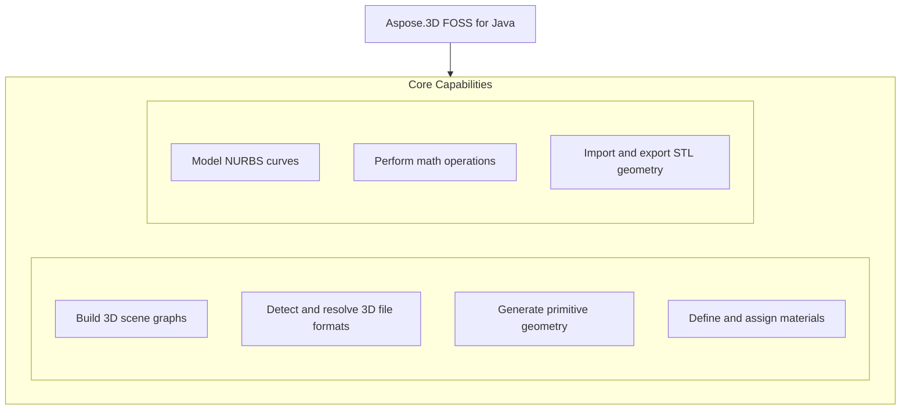

# Aspose.3D FOSS for Java

[](LICENSE) [](https://github.com/aspose-3d-foss/Aspose.3D-FOSS-for-Java/graphs/contributors)

[](https://products.aspose.org/3d/java/)

Aspose.3D FOSS for Java is a Java library for working with 3D scenes, nodes, and entities. It enables developers to load, manipulate, and save 3D models in formats such as STL using classes like `Scene`, `Node`, and `Entity`. The library supports creating geometric primitives like `Box`, `Cylinder`, `Sphere`, `Dish`, and `NurbsCurve`, and applying materials like `PbrMaterial` to nodes. It is intended for Java developers building applications that require 3D model processing without external runtime dependencies, and it runs on Java 21 and later.

## Navigation

- [At a Glance](#at-a-glance)
- [Key Capabilities](#key-capabilities)
- [Installation](#installation)
- [Dependencies](#dependencies)
- [API Reference](#api-reference)
- [Documentation & Resources](#documentation--resources)
- [Scope and Limitations](#scope-and-limitations)
- [Development and Testing](#development-and-testing)
- [License](#license)

## At a Glance



## Key Capabilities

- **Build 3D scene graphs.** Build 3D scene graphs using `Scene`, `Node`, and `Entity`, attaching geometry through `Node.addEntity` or `Node.createChildNode` and organizing them into a parent-child hierarchy.
- **Detect and resolve 3D file formats.** Detect a 3D file's format automatically or resolve an explicit format from a file path or binary stream using `FileFormat.detect` and `FileFormat.getFormatByExtension`.
- **Generate primitive geometry.** Generate primitive solids as ready-to-use geometry—`Box`, `Cylinder`, `Sphere`, and `Dish` each implement toMesh to produce a `Mesh`—and IFC-style 2D profiles such as `CircleShape` and `EllipseShape`.
- **Define and assign materials.** Define materials with `PbrMaterial`—supporting albedo, metallic/roughness, occlusion, and emissive channels—and assign them per node via `Node.setMaterial`.
- **Model NURBS curves.** Model NURBS curves through `NurbsCurve`, exposing control points, knot vectors, and degree/order data.
- **Perform math operations.** Work with the transform and geometry math that underlies every scene operation—`Vector2`, `Vector3`, `Vector4`, `Matrix4`, `Quaternion`, and `BoundingBox`.
- **Import and export STL geometry.** Import and export STL geometry (binary or ASCII) with `StlLoadOptions` or `StlSaveOptions`, dispatched through `Scene.fromFile` or `Scene.save`.

## Installation

Install the published package from Maven Central (`org.aspose:aspose-3d-foss`, version 26.5.0):

```bash
mvn dependency:get -Dartifact=org.aspose:aspose-3d-foss:26.5.0
```

## Dependencies

### Required Package Dependencies

No required third-party package dependencies; in `pom.xml`, every `<dependency>` the POM declares is `test`, `provided` or optional.

### Native and System Requirements

- Requires Java `21` (`maven.compiler.target` in `pom.xml`).

### Development Dependencies

- `org.junit.jupiter:junit-jupiter 5.10.0`

## API Reference

The Aspose.3D FOSS for Java library centers on the `Scene` class, which loads and saves 3D content with automatic format detection, and exposes the scene graph through its root node. `Node` and `Entity` form the core building blocks for constructing and traversing the scene hierarchy.

The verified public surface has 266 types.

<details>
<summary>View the Complete Public API Surface</summary>

### Core API

| Class | Description |
| --- | --- |
| `A3DObject` | A3DObject represents a base object in Aspose.3D FOSS for Java that supports named properties and can be retrieved or modified through its property collection. |
| `A3dwSaveOptions` | Options for A3DW saving. |
| `AmfSaveOptions` | Options for AMF saving. |
| `AnimationChannel` | Animation channel. |
| `AnimationClip` | AnimationClip defines a container for animation data that can be applied to 3D scenes or objects over time. |
| `AnimationNode` | Animation node. |
| `ArbitraryProfile` | This class allows you to construct a 2D profile directly from arbitrary curve. |
| `ArrayListAdapter` | ArrayListAdapter provides a wrapper to support list operations for collections used within Aspose.3D FOSS for Java. |
| `AssetInfo` | AssetInfo stores metadata about a 3D file such as author, creation date, copyright, and application details. |
| `AxisSystem` | AxisSystem defines a coordinate system using three mutually perpendicular axes to describe spatial orientation. |
| `Bone` | A bone defines the subset of the geometry's control point, and defined blend weight for each control point. |
| `BonePose` | The BonePose contains the transformation matrix for a bone node / |
| `BooleanOperand` | This class encapsulates the transformed mesh as Boolean operation's operand. |
| `BooleanOperator` | Boolean operator allows you to apply Boolean operation on two IMeshConvertible instances. |
| `BoundingBox` | The axis-aligned bounding box / |
| `BoundingBox2D` | The axis-aligned bounding box for Vector2 / |
| `Box` | Box primitive. |
| `CShape` | IFC compatible C-shape profile that defined by parameters. |
| `Camera` | Camera represents a viewing device in a 3D scene that determines how geometry is projected onto a 2D plane. |
| `Cancellation` | Cancellation provides a mechanism to signal and handle cancellation of long-running operations in Aspose.3D FOSS for Java. |
| `CenterLineProfile` | IFC compatible center line profile. |
| `Circle` | A Circle curve consists of a set of points in the edge of the circle shape. |
| `CircleShape` | IFC compatible circle profile, which can be used to construct a mesh through LinearExtrusion. |
| `ColladaSaveOptions` | ColladaSaveOptions allows configuration of options when saving a 3D scene to the COLLADA format. |
| `CompositeCurve` | A CompositeCurve is consisting of several curve segments. |
| `CryptoUtils` | Utility class for cryptographic operations. |
| `CullFaceMode` | What face to cull. |
| `Curve` | The base class of all curve implementations. |
| `CustomObject` | CustomObject enables developers to implement custom 3D entities by extending base functionality in Aspose.3D FOSS for Java. |
| `Cylinder` | Parameterized Cylinder. |
| `Deformer` | Deformer represents an object capable of modifying the shape of a mesh through vertex manipulation. |
| `Discreet3dsLoadOptions` | Load options for 3DS file. |
| `Discreet3dsSaveOptions` | Save options for 3DS file. |
| `Dish` | Parameterized dish. |
| `DracoFormat` | Google Draco format Example: The following code shows how to encode and decode a Mesh to/from byte array: Mesh mesh = (new Sphere()).toMesh(); //encode mesh into D |
| `DracoSaveOptions` | Options for Draco compression. |
| `DrawOperation` | DrawOperation describes a single drawing command used during rendering of 3D geometry. |
| `DummyFileSystem` | DummyFileSystem provides a minimal file system implementation for scenarios where file I/O is not required. |
| `Ellipse` | An Ellipse defines a set of points that form the shape of ellipse. |
| `EllipseShape` | IFC compatible ellipse profile, which can be used to construct a mesh through LinearExtrusion. |
| `EndPoint` | The end point to trim the curve, can be a parameter value or a Cartesian point. |
| `Entity` | Entity represents a fundamental 3D object such as a mesh or primitive that can be added to a scene. |
| `EntityRendererKey` | The key of registered entity renderer. |
| `Enumerable` | Generic enumerable interface for collection of type T / |
| `Enumerator` | Generic enumerator for collection of type T / |
| `EventCallback` | Event callback interface for handling events with arguments. |
| `ExportException` | ExportException is thrown when an error occurs during the export of a 3D scene to a file format. |
| `Extrapolation` | Extrapolation defines how to do when sampled value is out of the range which defined by the first and last key-frames. |
| `FMatrix4` | FMatrix4 represents a 4x4 floating-point matrix used for 3D transformations and projections. |
| `FVector2` | FVector2 represents a two-component floating-point vector used for 2D coordinates or directions. |
| `FVector3` | FVector3 represents a three-component floating-point vector used for 3D positions, directions, or colors. |
| `FVector4` | FVector4 represents a four-component floating-point vector commonly used for homogeneous coordinates or quaternions. |
| `FbxLoadOptions` | Load options for FBX format. |
| `FbxSaveOptions` | Save options for FBX format. |
| `FileFormat` | FileFormat identifies a supported 3D file format and provides methods to detect and load files by extension. |
| `FileFormatType` | FileFormatType enumerates the supported 3D file format types used for import and export operations. |
| `FileStream` | File stream for reading and writing files. |
| `FileSystem` | File system encapsulation. |
| `FileSystemFactory` | Factory for creating file system instances. |
| `Frustum` | The base class of Camera and Light / |
| `Geometry` | Geometry encapsulates vertex and index data used to define the shape of a 3D object. |
| `GlobalTransform` | Global transform is similar to Transform but it's immutable while it represents the final evaluated transformation. |
| `GltfLoadOptions` | Load options for glTF format. |
| `GltfSaveOptions` | Save options for glTF format. |
| `Group` | A Group represents the logical relationships of Node. |
| `HShape` | The HShape provides the defining parameters of an 'H' or 'I' shape. |
| `HalfSpace` | HalfSpace represents a infinity space which is split by a plane, this can be used with BooleanOperator. |
| `HollowCircleShape` | IFC compatible hollow circle profile. |
| `HollowRectangleShape` | IFC compatible hollow rectangular shape with both inner/outer rounding corners. |
| `Html5SaveOptions` | Options for HTML5 saving. |
| `IBuffer` | IBuffer defines an interface for managing raw data buffers used in rendering or geometry processing. |
| `IDescriptorSet` | IDescriptorSet provides an interface for grouping shader resources used during rendering. |
| `IIndexBuffer` | IIndexBuffer defines an interface for managing index data used to define primitive connectivity in geometry. |
| `IIndexedVertexElement` | VertexElement with indices data. |
| `IMeshConvertible` | IMeshConvertible is an interface implemented by objects that can be converted into mesh geometry. |
| `INamedObject` | INamedObject defines an interface for objects that can be assigned a human-readable name. |
| `IOConfig` | IO config for serialization/deserialization. |
| `IOExtension` | Utilities to write matrix/vector to binary writer. |
| `IOrientable` | Orientable entities shall implement this interface. |
| `IPipeline` | IPipeline defines an interface for managing a sequence of rendering operations or data transformations. |
| `IRenderQueue` | IRenderQueue defines an interface for managing draw calls and rendering order during scene rendering. |
| `IRenderTarget` | IRenderTarget defines an interface for objects that can receive rendered output, such as windows or textures. |
| `IRenderTexture` | IRenderTexture defines an interface for textures used as rendering targets in the graphics pipeline. |
| `IRenderWindow` | IRenderWindow defines an interface for a window surface used to display rendered 3D content. |
| `ITextureUnit` | ITextureUnit defines an interface for managing texture bindings and parameters during rendering. |
| `IVertexBuffer` | IVertexBuffer defines an interface for managing vertex data used in rendering 3D geometry. |
| `ImageRenderOptions` | ImageRenderOptions controls how a 3D scene is rendered to an image, including resolution and format settings. |
| `ImportException` | ImportException is thrown when an error occurs during the import of a 3D file into a scene. |
| `InitializationException` | Initialization exception / |
| `JtLoadOptions` | Options for JPEG2000 loading. |
| `KeyFrame` | KeyFrame represents a single keyframe in an animation curve, storing time, value, and tangent information. |
| `KeyframeSequence` | The sequence of key-frames, it describes the transformation of a sampled value over time. |
| `LShape` | IFC compatible L-shape profile that defined by parameters. |
| `LambertMaterial` | Material for lambert shading model. |
| `License` | License management class (not available in FOSS version). |
| `Light` | Light defines a light source in a scene, including its color, intensity, and falloff properties. |
| `Line` | A polyline is a path defined by a set of points with getControlPoints(), and connected by getSegments(), which means it can also be a set of connected line segments. |
| `LinearExtrusion` | Linear extrusion takes a 2D shape as input and extends the shape in the 3rd dimension. |
| `LoadOptions` | The base class to configure options in file loading for different types. |
| `LocalFileSystem` | LocalFileSystem provides file system access to local directories and files for loading and saving assets. |
| `Material` | Material defines the parameters necessary for visual appearance of geometry. |
| `MaterialConverter` | Custom converter to convert the geometry's original material to GLTF's PBR material. |
| `MathUtils` | Utility class with mathematical functions. |
| `Matrix4` | Matrix4 represents a 4x4 transformation matrix used for 3D geometry operations. |
| `MemoryFileSystem` | MemoryFileSystem provides an in-memory file system for temporary asset storage during processing. |
| `MemoryStream` | Memory stream for reading and writing data in memory. |
| `Mesh` | Mesh defines the geometric structure of a 3D object using vertices, normals, and index buffers. |
| `Metered` | Metered license management class (not available in FOSS version). |
| `Microsoft3MFSaveOptions` | Microsoft3MFSaveOptions configures settings for saving 3D scenes to the Microsoft 3MF format. |
| `MirroredProfile` | IFC compatible mirror profile. |
| `MorphTargetChannel` | A MorphTargetChannel is used by MorphTargetDeformer to organize the target geometries. |
| `MorphTargetDeformer` | MorphTargetDeformer provides per-vertex animation. |
| `Node` | Node represents an object in the scene hierarchy, capable of holding geometry, materials, and child nodes. |
| `NodeVisitor` | A callback to travel through the whole node hierarchy. |
| `NotImplementedException` | Exception thrown when a feature is not implemented. |
| `NurbsCurve` | NURBS curve is a curve represented by NURBS(Non-uniform rational basis spline), A NURBS curve is defined by its getOrder(), a set of weighted Geometry.getControlPoints() and a getKnotVectors() The w c |
| `NurbsDirection` | NurbsDirection indicates the parametric direction of a NURBS surface or curve. |
| `ObjLoadOptions` | ObjLoadOptions specifies options for loading OBJ files, such as handling of materials and geometry. |
| `ObjSaveOptions` | ObjSaveOptions configures settings for exporting 3D scenes to the OBJ format. |
| `ObjectProperty` | Concrete property implementation for Object values. |
| `ParameterizedProfile` | The base class of all parameterized profiles. |
| `ParseException` | ParseException is thrown when a file cannot be parsed due to invalid or unsupported content. |
| `PbrMaterial` | Material for physically based rendering based on albedo color/metallic/roughness. |
| `PbrSpecularMaterial` | Material for physically based rendering based on diffuse color/specular/glossiness / |
| `PdfLoadOptions` | Options for PDF loading. |
| `PdfSaveOptions` | The save options in PDF exporting. |
| `PhongMaterial` | Material for blinn-phong shading model. |
| `Plane` | Parameterized plane. |
| `PlyLoadOptions` | PlyLoadOptions specifies options for loading PLY files, including handling of vertex properties. |
| `PlySaveOptions` | PlySaveOptions configures settings for exporting 3D scenes to the PLY format. |
| `PointCloud` | A point cloud represents a collection of points in 3D space. |
| `PolygonModifier` | Polygon modifier utilities. |
| `Pose` | The pose is used to store transformation matrix when the geometry is skinned. |
| `Primitive` | Base class for all primitives. |
| `Profile` | 2D Profile in xy plane. |
| `Property` | Class to hold user-defined properties. |
| `PropertyCollection` | PropertyCollection manages a set of named properties associated with a 3D object. |
| `Pyramid` | Parameterized pyramid. |
| `Quaternion` | Quaternion represents a four-dimensional vector used to describe 3D rotations. |
| `Rect` | A class to represent the rectangle / |
| `RectangleShape` | IFC compatible rectangular shape with rounding corners. |
| `RectangularTorus` | Parameterized rectangular torus. |
| `RelativeRectangle` | Relative rectangle The formula between relative component to absolute value is: Scale * (Reference Width) + offset So if we want it to represent an absolute value, leave all scale fields zero, and use offset fields instead. |
| `RenderFactory` | RenderFactory creates and manages rendering resources for 3D scenes. |
| `RenderParameters` | RenderParameters defines the configuration for rendering a 3D scene. |
| `RenderQueueGroupId` | RenderQueueGroupId identifies a group of render operations within a rendering pipeline. |
| `RenderResource` | RenderResource encapsulates GPU-accessible assets used during rendering. |
| `RenderStage` | RenderStage represents a distinct phase in the rendering pipeline, such as geometry or lighting. |
| `RenderState` | RenderState holds the current configuration of the rendering pipeline, including shaders and buffers. |
| `Renderer` | Renderer executes the rendering process for a 3D scene using configured resources and parameters. |
| `RendererException` | RendererException is thrown when an error occurs during the rendering process. |
| `RendererVariableManager` | RendererVariableManager manages variables used by the renderer, such as uniforms and attributes. |
| `RevolvedAreaSolid` | This class represents a solid model by revolving a cross section provided by a profile about an axis. |
| `RvmLoadOptions` | Load options for AVEVA Plant Design Management System's RVM file. |
| `RvmSaveOptions` | Save options for Aveva PDMS RVM file. |
| `SaveOptions` | The base class to configure options in file saving for different types. |
| `Scene` | Scene represents a complete 3D environment containing nodes, geometry, lights, and materials. |
| `SceneObject` | SceneObject is the base class for all objects that can be included in a 3D scene. |
| `Segment` | Segment of CompositeCurve. |
| `ShaderMaterial` | A shader material that allows describing the material by external rendering engine or shader language. |
| `ShaderProgram` | ShaderProgram defines a complete shader pipeline for rendering geometry with custom effects. |
| `ShaderSource` | ShaderSource encapsulates the source code and type of a shader program. |
| `ShaderTechnique` | A shader technique represents a concrete rendering implementation. |
| `Shape` | The shape describes the deformation on a set of control points, which is similar to the cluster deformer in Maya. |
| `Skeleton` | A skeleton defines a hierarchical structure of bones for skinning. |
| `SkinDeformer` | A skin deformer contains multiple bones to work, each bone blends a part of the geometry by control point's weights. |
| `Sphere` | Parameterized sphere. |
| `StlLoadOptions` | Load options for STL. |
| `StlSaveOptions` | Save options for STL. |
| `Stream` | Created by lexchou on 12/14/2016. |
| `Struct` | Struct defines a structured data type used in shader programs and property definitions. |
| `Structs` | Base class of struct array. |
| `TShape` | IFC compatible T-shape defined by parameters. |
| `Texture` | This class defines the texture from an external file. |
| `TextureBase` | Base class for all concrete textures. |
| `TextureData` | TextureData holds the pixel data and metadata for a texture used in rendering. |
| `TextureSlot` | Texture slot in Material, can be enumerated through material instance. |
| `Torus` | Parameterized torus. |
| `Transform` | Transform encapsulates position, rotation, and scale for positioning objects in 3D space. |
| `TransformBuilder` | Utility class for building transformation matrices. |
| `TrapeziumShape` | IFC compatible Trapezium shape defined by parameters. |
| `TriMesh` | A TriMesh contains raw data that can be used by GPU directly. |
| `TrialException` | Trial exception for evaluation mode. |
| `U3dLoadOptions` | Options for U3D loading. |
| `U3dSaveOptions` | Save options for universal 3d. |
| `UShape` | IFC compatible U-shape defined by parameters. |
| `UsdSaveOptions` | Options for USD saving. |
| `Vector2` | Vector2 represents a two-dimensional vector with floating-point components used for 2D geometry operations in Aspose.3D FOSS for Java. |
| `Vector3` | Vector3 represents a three-dimensional vector with floating-point components used for 3D geometry operations in Aspose.3D FOSS for Java. |
| `Vector4` | Vector4 represents a four-dimensional vector with floating-point components used for homogeneous coordinates and other 3D operations in Aspose.3D FOSS for Java. |
| `Version` | Version provides version information about the Aspose.3D FOSS for Java library. |
| `Vertex` | Vertex reference, used to access the raw vertex in TriMesh. |
| `VertexDeclaration` | VertexDeclaration defines the structure and layout of vertex data used for rendering 3D geometry in Aspose.3D FOSS for Java. |
| `VertexElement` | Base class for all vertex element types. |
| `VertexElementBinormal` | VertexElementBinormal stores binormal data for each vertex used in lighting and shading calculations in Aspose.3D FOSS for Java. |
| `VertexElementDoublesTemplate` | VertexElementDoublesTemplate provides a template for vertex elements containing double-precision floating-point values in Aspose.3D FOSS for Java. |
| `VertexElementEdgeCrease` | VertexElementEdgeCrease stores edge crease values used for controlling subdivision surface behavior in Aspose.3D FOSS for Java. |
| `VertexElementFVector` | VertexElementFVector stores floating-point vector data for vertex attributes in Aspose.3D FOSS for Java. |
| `VertexElementHole` | VertexElementHole stores hole information used in polygonal mesh processing in Aspose.3D FOSS for Java. |
| `VertexElementIntsTemplate` | VertexElementIntsTemplate provides a template for vertex elements containing integer values in Aspose.3D FOSS for Java. |
| `VertexElementMaterial` | VertexElementMaterial stores material indices associated with vertices in Aspose.3D FOSS for Java. |
| `VertexElementNormal` | VertexElementNormal stores normal vectors used for lighting calculations in Aspose.3D FOSS for Java. |
| `VertexElementPolygonGroup` | VertexElementPolygonGroup stores polygon group information used for organizing mesh topology in Aspose.3D FOSS for Java. |
| `VertexElementSmoothingGroup` | VertexElementSmoothingGroup stores smoothing group indices used for controlling face shading in Aspose.3D FOSS for Java. |
| `VertexElementSpecular` | VertexElementSpecular stores specular color or intensity data for vertex lighting in Aspose.3D FOSS for Java. |
| `VertexElementTangent` | VertexElementTangent stores tangent vectors used for normal mapping in Aspose.3D FOSS for Java. |
| `VertexElementTemplate` | VertexElementTemplate defines a base template for constructing vertex element types in Aspose.3D FOSS for Java. |
| `VertexElementUV` | VertexElementUV stores texture coordinate data for vertices in Aspose.3D FOSS for Java. |
| `VertexElementUserData` | VertexElementUserData stores custom user-defined data associated with vertices in Aspose.3D FOSS for Java. |
| `VertexElementVector4` | VertexElementVector4 stores four-component vector data for vertex attributes in Aspose.3D FOSS for Java. |
| `VertexElementVertexColor` | VertexElementVertexColor stores per-vertex color data in Aspose.3D FOSS for Java. |
| `VertexElementVertexCrease` | VertexElementVertexCrease stores vertex crease values used for controlling subdivision surface behavior in Aspose.3D FOSS for Java. |
| `VertexElementVisibility` | VertexElementVisibility stores visibility flags for vertices in Aspose.3D FOSS for Java. |
| `VertexElementWeight` | VertexElementWeight stores skinning weight values used for skeletal animation in Aspose.3D FOSS for Java. |
| `VertexField` | VertexField represents a single field within a vertex declaration in Aspose.3D FOSS for Java. |
| `Watermark` | Utility to encode/decode blind watermark to/from a mesh. |
| `WeightedMode` | Weighted mode. |
| `WindowHandle` | WindowHandle encapsulates a platform-specific window handle used for rendering output in Aspose.3D FOSS for Java. |
| `XLoadOptions` | Options for X (DirectX) loading. |
| `ZShape` | IFC compatible Z-shape profile defined by parameters. |
| `ZipFileSystem` | ZipFileSystem provides a virtual file system implementation backed by ZIP archives in Aspose.3D FOSS for Java. |

#### Enumerations

| Enumeration | Description |
| --- | --- |
| `AlphaSource` | Defines whether the texture contains the alpha channel. |
| `ApertureMode` | Camera aperture modes. |
| `Axis` | Axis represents a single axis in 3D space, typically used to define orientation or direction. |
| `BindPoint` | Animation binding point. |
| `BlendFactor` | Blend factor specify pixel arithmetic. |
| `BoneLinkMode` | A bone's link mode refers to the way in which a bone is connected or linked to its parent bone within a hierarchical structure. |
| `BooleanOperation` | Mesh's Boolean operation / |
| `BoundingBoxExtent` | The extent of the bounding box. |
| `ColladaTransformStyle` | ColladaTransformStyle specifies how transformation matrices are represented in COLLADA files during export. |
| `CompareFunction` | The compare function used in depth/stencil testing. |
| `ComposeOrder` | The order to compose transform matrix. |
| `CoordinateSystem` | CoordinateSystem defines the orientation and handedness of a 3D coordinate system used in geometry processing. |
| `CubeFace` | CubeFace identifies one of the six faces of a cube used in texture mapping or geometry operations. |
| `CurveDimension` | The dimension of the curves. |
| `DracoCompressionLevel` | Compression level for Draco format. |
| `ExtrapolationType` | Extrapolation type. |
| `FileContentType` | FileContentType specifies the type of content stored in a file, such as geometry, animation, or material data. |
| `FrontFace` | Define front- and back-facing polygons. |
| `GltfEmbeddedImageFormat` | How glTF exporter will embed the textures during the exporting. |
| `IndexDataType` | IndexDataType specifies the data type used for index buffers in mesh geometry. |
| `Interpolation` | Interpolation defines the method used to calculate values between keyframes during animation. |
| `LightType` | LightType categorizes light sources by their behavior, such as point, directional, or spot lights. |
| `MappingMode` | MappingMode specifies how texture coordinates are mapped onto geometry surfaces. |
| `NurbsType` | NURBS types. |
| `PatchDirection` | The direction of a patch. |
| `PatchDirectionType` | The type of patch direction. |
| `PdfLightingScheme` | LightingScheme specifies the lighting to apply to 3D artwork. |
| `PdfRenderMode` | Render mode specifies the style in which the 3D artwork is rendered. |
| `PolygonMode` | The polygon rasterization mode. |
| `PoseType` | Pose type. |
| `PresetShaders` | PresetShaders provides predefined shader programs for common rendering scenarios. |
| `ProjectionType` | Camera's projection types. |
| `ReferenceMode` | ReferenceMode determines how external references are handled during scene loading. |
| `RotationMode` | The frustum's rotation mode / |
| `RotationOrder` | The order controls which rx ry rz are applied in the transformation matrix. |
| `SkeletonType` | The type of skeleton. |
| `SplitMeshPolicy` | Share vertex/control point data between sub-meshes or each sub-mesh has its own compacted data. |
| `StepMode` | Interpolation step mode. |
| `TextureFilter` | Filter options during texture sampling. |
| `TextureMapping` | TextureMapping specifies how a texture is applied to a surface, including UV channel and tiling. |
| `TextureType` | TextureType indicates the purpose of a texture, such as albedo, normal, or roughness. |
| `VertexElementType` | VertexElementType enumerates the supported types of vertex elements in Aspose.3D FOSS for Java. |
| `VertexFieldDataType` | Vertex field's data type. |
| `VertexFieldSemantic` | The semantic of the vertex field. |
| `WrapMode` | Texture's wrap mode. |

#### Detailed Member Reference

### com

The top-level package namespace com organizes the Aspose.3D FOSS for Java API under the `com.aspose` and `com.aspose.threed` sub-packages.

### aspose

The `com.aspose` package serves as the root namespace for Aspose's 3D functionality, exposing the `com.aspose.threed` module that contains all 3D-specific types.

### threed

The `com.aspose.threed` package provides core types such as `Scene` for managing 3D content, `Node` and `Entity` for scene graph construction, `Box`, `Cylinder`, `Sphere`, and `Dish` for primitive geometry, `PbrMaterial` for physically based materials, `NurbsCurve` for parametric curves, `Vector2`, `Vector3`, and `Vector4` for mathematical vectors, `Matrix4` and `Quaternion` for transformations, `BoundingBox` for spatial bounds, and `StlLoadOptions` and `StlSaveOptions` for STL format I/O.


`Scene` is the central entry point: `Scene.fromFile` loads geometry with automatic format
detection, `getRootNode()` exposes the scene graph for building or traversal, and `Scene.save`
writes it back out. The full 266-type public surface is listed below by module, with curated
detail following for the classes used most often.

- `Scene` — `Scene.fromFile(path)` / `Scene.fromStream(stream, ...)` with format auto-detection;
  `save(path[, format | options])`; `getRootNode()`.

- `Node` — `addEntity(entity)`, `addChildNode(node)`, `createChildNode(name, entity[, material])`,
  `getChildNodes()`, `getVisible()`/`setVisible(...)`, `getAssetInfo()`/`setAssetInfo(...)`,
  `setMaterial(material)`.

- `Entity`, `SceneObject`, `A3DObject` — the base hierarchy every scene object derives from.

- `Group` — a container node for organizing child nodes without its own geometry.

- `Mesh` — control points, polygons, and per-vertex elements; `IMeshConvertible.toMesh()` is
  implemented by `Box`, `Cylinder`, `Sphere`, and `Dish` (see
  [Scope and Limitations](#scope-and-limitations) for the primitives whose `toMesh()` is not yet
  implemented).

- `NurbsCurve` — `getControlPoints()`, `getKnotVectors()`, `getDegree()`/`setDegree(...)`,
  `getOrder()`/`setOrder(...)`, `getCurveType()`/`setCurveType(...)`, `getRational()`/
  `setRational(...)`.

- `BoundingBox` — minimum/maximum extents for a mesh or node.

- `Material` — the base material type shared by all material kinds.

- `PbrMaterial` — `getAlbedo()`/`setAlbedo(...)`, `getMetallicFactor()`/`setMetallicFactor(...)`,
  `getRoughnessFactor()`/`setRoughnessFactor(...)`, `getEmissiveColor()`/`setEmissiveColor(...)`,
  `getOcclusionFactor()`/`setOcclusionFactor(...)`, plus texture-slot accessors
  (`getAlbedoTexture()`, `getNormalTexture()`, `getMetallicRoughness()`, and others).

- `TextureData` — raw texture bytes backing a texture slot.

- `ObjLoadOptions` — options for importing Wavefront OBJ geometry.

- `StlLoadOptions` / `StlSaveOptions` — `FileContentType` (binary or ASCII) controls STL import
  and export.

- `FileFormat` — `detect(fileName)`, `getFormatByExtension(...)`, format constants such as
  `FileFormat.STLASCII`, `FileFormat.STL_BINARY`, and `FileFormat.WAVEFRONTOBJ`.

- `Vector2` / `Vector3` / `Vector4` / `FVector3` / `FVector4` — component vectors used throughout
  the geometry and transform APIs.

- `Matrix4`, `Quaternion`, `Transform`, `GlobalTransform` — node positioning: translation,
  rotation, and scale.

- `ImportException`, `ExportException`, `ParseException` — thrown during format import/export and
  parsing.

</details>

## Documentation & Resources

- **[Getting started guide](https://docs.aspose.org/3d/java/)** — The getting started guide covers installation, step-by-step walkthroughs, and feature guides for using the Aspose.3D FOSS for Java library.
- Found a bug or have a feature request? [Open an issue](https://github.com/aspose-3d-foss/Aspose.3D-FOSS-for-Java/issues).

- **[Getting started guide](https://docs.aspose.org/3d/java/)** — installation, walkthroughs, and feature guides for this FOSS library.
- **[How-to guides & FAQ](https://kb.aspose.org/3d/java/)** — task-focused answers for common 3D-processing questions.
- **[Full API reference](https://reference.aspose.org/3d/java/)** — the complete, browsable reference for all 266 public types (the [API reference](#api-reference) section above covers the essentials).
- **[Publishing guide](PUBLISHING.md)** — how this package is released to Maven Central, in the repository.
- **[API diff for 26.1.0](docs/api-diff-26.1.0.md)** — API changes for that release, in the repository.
- **[Directory structures](docs/directory-structures.md)** — repository layout notes, in the repository.
- **[Implementation progress notes](docs/foss-java-progress.md)** — current FOSS-edition implementation status, in the repository.
- Found a bug or have a feature request? [Open an issue](https://github.com/aspose-3d-foss/Aspose.3D-FOSS-for-Java/issues) on GitHub — this is also the place for community & support and further reading pointers.

## Scope and Limitations

Aspose.3D FOSS for Java provides a free and open-source subset of the Aspose.3D for Java API, targeting Java developers who need to work with 3D scenes, primitives, and the STL format using the package at version 26.5.0 on Java 21 or newer.

- Only STL import and export are fully functional in the published 26.5.0 package, while other recognized formats have stub implementations and may return success without producing valid output.
- OBJ import is present in the upstream source but not in the published Maven Central artifact, and several formats fail silently rather than raising an exception when used.
- `Primitive`-shape mesh conversion is only implemented for `Box`, `Cylinder`, `Sphere`, and `Dish`, while other primitives expose conversion methods that are not yet functional.
- NURBS curve sampling is not implemented despite full control-point, knot, and degree data being exposed.
- `PbrSpecularMaterial` accessors are unimplemented, and developers must use the alternative `PbrMaterial` API instead.
- Licensing, trial, DRM-related functionality, cryptographic helpers, and ZIP-packaged file-system read/write are excluded, and scene rendering is not implemented in this edition.

These limitations don't apply to [Aspose.3D for Java — Enterprise Edition](https://products.aspose.com/3d/java/). This FOSS package provides core 3D file format support for Java applications, while Aspose.3D for Java — commercial edition adds advanced features such as scene graph manipulation, material editing, and export to additional formats including OBJ, A3DW, and U3D.

## Development and Testing

Build and test Aspose.3D FOSS for Java using Maven with JDK 21, as defined by the project's Maven configuration and CI workflow at .github/workflows/.

Releases run through the [maven-central-release workflow](.github/workflows/maven-central-release.yml).

This is a Maven project; build and test it from source:

**Project status:** this is a work-in-progress port — see [TODO.md](TODO.md) for current
progress. [AGENTS.md](AGENTS.md) documents the API-compatibility rules this port follows for
anyone contributing changes.

The test suite ([`src/test/java/com/aspose/threed/`](src/test/java/com/aspose/threed/)) covers
scene construction, vector math, format detection, STL round-tripping, glTF option handling, and
NURBS curve data. See [FILE_FORMATS.md](FILE_FORMATS.md) for format-support notes.

## License

This project is licensed under the [MIT License](LICENSE). The MIT License permits use, copying, modification, distribution, sublicensing, and commercial use, provided its copyright and permission notice are retained. The software is provided without warranty.
