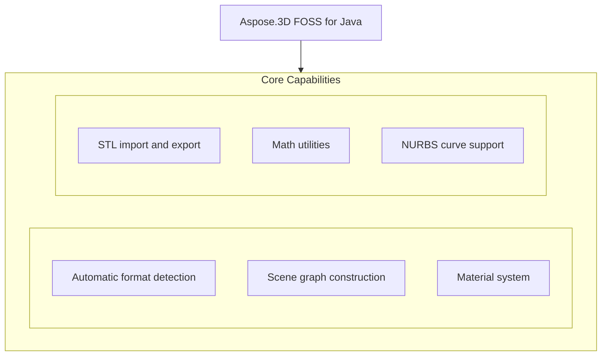

# Aspose.3D FOSS for Java

[](LICENSE) [](https://github.com/aspose-3d-foss/Aspose.3D-FOSS-for-Java/graphs/contributors)

[](https://products.aspose.org/3d/java/)

Aspose.3D FOSS for Java is a Java library that enables developers to read, create, and manipulate 3D scenes and geometry. It supports automatic format detection and explicit format resolution for file I/O, with full support for loading and saving STL files. Users can build scenes from scratch using primitives like `Mesh`, `Box`, and `Cylinder`, apply materials such as `LambertMaterial` and `PbrMaterial`, and work with mathematical utilities including `Vector3` and `Matrix4`. The library is distributed under the MIT license, requires no external dependencies, and targets Java 21 runtime environments.

## Navigation

- [At a Glance](#at-a-glance)
- [Key Capabilities](#key-capabilities)
- [Installation](#installation)
- [Dependencies](#dependencies)
- [Quick Start](#quick-start)
- [Additional Examples](#additional-examples)
- [API Reference](#api-reference)
- [Documentation & Resources](#documentation--resources)
- [Scope and Limitations](#scope-and-limitations)
- [Development and Testing](#development-and-testing)
- [License](#license)

## At a Glance



## Key Capabilities

- **Automatic format detection.** Detect a 3D file's format automatically or resolve an explicit format from a file path or binary stream using `FileFormat.getFormatByExtension`.
- **Scene graph construction.** Build a scene graph from scratch using `Scene`, `Node.createChildNode`, and `Mesh` with control points and polygons.
- **Material system.** Apply materials such as `LambertMaterial` and `PbrMaterial` with configurable diffuse and ambient colors, transparency, metallic factor, and roughness factor.
- **STL import and export.** Import and export STL files in ASCII or binary form using `Scene.fromFile` and `FileFormat.STLASCII`, with support for reading control points and polygon counts from loaded meshes.
- **Math utilities.** Use `Vector3`, `Matrix4`, and `BoundingBox` math utilities including static operations like `Vector3.add` and instance methods like dot and cross products.
- **NURBS curve support.** Work with `NurbsCurve` objects by setting order and inspecting degree, dimension, and curve type through `CurveDimension` and `NurbsType`.

## Installation

Install the published package from Maven Central (`org.aspose:aspose-3d-foss`, version 26.5.0):

```bash
mvn dependency:get -Dartifact=org.aspose:aspose-3d-foss:26.5.0
```

## Dependencies

### Required Package Dependencies

No required third-party package dependencies; in `pom.xml`, every `<dependency>` the POM declares is `test`, `provided` or optional.

### Native and System Requirements

- Requires Java `21` (`maven.compiler.target` in `pom.xml`).

### Development Dependencies

- `org.junit.jupiter:junit-jupiter 5.10.0`

## Quick Start

Load an STL file and re-save it in ASCII STL format using the automatic format detection for input.

```java
import com.aspose.threed.FileFormat;
import com.aspose.threed.Scene;

Scene scene = Scene.fromFile("input/cube.stl");
scene.save("output.stl", FileFormat.STLASCII);
```

Create a tetrahedron mesh programmatically and save it as an STL file without specifying an output format.

```java
import com.aspose.threed.Mesh;
import com.aspose.threed.Node;
import com.aspose.threed.Scene;

Scene scene = new Scene();
Mesh mesh = new Mesh("TestMesh");

mesh.addControlPoint(0, 0, 0);
mesh.addControlPoint(1, 0, 0);
mesh.addControlPoint(0, 1, 0);
mesh.addControlPoint(0, 0, 1);

mesh.createPolygon(new int[]{0, 1, 2});
mesh.createPolygon(new int[]{0, 1, 3});
mesh.createPolygon(new int[]{0, 2, 3});
mesh.createPolygon(new int[]{1, 2, 3});

scene.getRootNode().createChildNode("TestNode", mesh);
scene.save("output.stl");
```

## Additional Examples

The following examples demonstrate loading and inspecting scenes, building scene graphs, creating materials, constructing NURBS curves, and performing vector math using the package version 26.5.0 on Java 21.

### Load an STL file from a stream and inspect mesh data

```java
FileInputStream stream = new FileInputStream(new File("testdata/input/cube.stl"));
Scene scene = new Scene();
FileFormat format = FileFormat.getFormatByExtension(".stl");
scene.open(Stream.wrap(stream), format);
stream.close();

Node node = scene.getRootNode().getChildNodes().get(0);
Mesh mesh = (Mesh) node.getEntities().get(0);
System.out.println(mesh.getControlPoints().size());
System.out.println(mesh.getPolygonCount());
```

<details>
<summary>View Additional Examples</summary>

### Create a child node in the scene graph and inspect its name and count

```java
Scene scene = new Scene();
Node node = scene.getRootNode().createChildNode("TestNode");
System.out.println(node.getName());
System.out.println(scene.getRootNode().getChildNodes().size());
```

### Create a Lambert material with custom diffuse, ambient, and transparency settings

```java
import com.aspose.threed.LambertMaterial;
import com.aspose.threed.Vector3;

LambertMaterial material = new LambertMaterial("Body");
material.setDiffuseColor(new Vector3(0.8, 0.2, 0.2));
material.setAmbientColor(new Vector3(0.1, 0.1, 0.1));
material.setTransparency(0.0);
```

### Create a PBR material with albedo, metallic, and roughness properties

```java
import com.aspose.threed.PbrMaterial;

PbrMaterial pbr = new PbrMaterial();
pbr.setAlbedo(new Vector3(1, 1, 1));
pbr.setMetallicFactor(0.5);
pbr.setRoughnessFactor(0.3);
```

### Construct a NURBS curve and inspect its degree, dimension, and type

```java
import com.aspose.threed.CurveDimension;
import com.aspose.threed.NurbsCurve;
import com.aspose.threed.NurbsType;

NurbsCurve curve = new NurbsCurve();
curve.setOrder(4);
System.out.println(curve.getDegree());
System.out.println(curve.getDimension());
System.out.println(curve.getCurveType());
```

### Perform vector addition, dot product, and cross product with `Vector3`

```java
import com.aspose.threed.Vector3;

Vector3 a = new Vector3(1, 0, 0);
Vector3 b = new Vector3(0, 1, 0);
Vector3 sum = Vector3.add(a, b); // add is static; dot/cross below are instance methods
double dot = a.dot(b);
Vector3 cross = a.cross(b);
```

</details>

## API Reference

Aspose.3D FOSS for Java provides the package at version 26.5.0 for Java 21, with `com.aspose.threed` as the root namespace for its 3D scene graph and file I/O APIs.

The verified public surface has 266 types.

<details>
<summary>View the Complete Public API Surface</summary>

### Core API

| Class | Description |
| --- | --- |
| `A3DObject` | A3DObject is the base class for all objects in Aspose.3D FOSS for Java that supports property management and naming. |
| `A3dwSaveOptions` | Options for A3DW saving. |
| `AmfSaveOptions` | Options for AMF saving. |
| `AnimationChannel` | Animation channel. |
| `AnimationClip` | AnimationClip represents a container for animation data that can be applied to 3D scenes. |
| `AnimationNode` | Animation node. |
| `ArbitraryProfile` | This class allows you to construct a 2D profile directly from arbitrary curve. |
| `ArrayListAdapter` | ArrayListAdapter provides a wrapper to support list operations in Aspose.3D FOSS for Java. |
| `AssetInfo` | AssetInfo holds metadata about a 3D file such as author, creation date, and application details. |
| `AxisSystem` | AxisSystem specifies the coordinate system used in a 3D scene including axis orientation and handedness. |
| `Bone` | A bone defines the subset of the geometry's control point, and defined blend weight for each control point. |
| `BonePose` | The BonePose contains the transformation matrix for a bone node / |
| `BooleanOperand` | This class encapsulates the transformed mesh as Boolean operation's operand. |
| `BooleanOperator` | Boolean operator allows you to apply Boolean operation on two IMeshConvertible instances. |
| `BoundingBox` | The axis-aligned bounding box / |
| `BoundingBox2D` | The axis-aligned bounding box for Vector2 / |
| `Box` | Box primitive. |
| `CShape` | IFC compatible C-shape profile that defined by parameters. |
| `Camera` | Camera represents a viewing device in a 3D scene that determines how the scene is projected onto a 2D surface. |
| `Cancellation` | Cancellation provides a mechanism to signal and handle cancellation of long-running operations. |
| `CenterLineProfile` | IFC compatible center line profile. |
| `Circle` | A Circle curve consists of a set of points in the edge of the circle shape. |
| `CircleShape` | IFC compatible circle profile, which can be used to construct a mesh through LinearExtrusion. |
| `ColladaSaveOptions` | ColladaSaveOptions controls how a 3D scene is exported to the COLLADA format. |
| `CompositeCurve` | A CompositeCurve is consisting of several curve segments. |
| `CryptoUtils` | Utility class for cryptographic operations. |
| `CullFaceMode` | What face to cull. |
| `Curve` | The base class of all curve implementations. |
| `CustomObject` | CustomObject allows users to define and manage custom 3D objects within Aspose.3D FOSS for Java. |
| `Cylinder` | Parameterized Cylinder. |
| `Deformer` | Deformer represents an object that modifies the geometry of a mesh through vertex manipulation. |
| `Discreet3dsLoadOptions` | Load options for 3DS file. |
| `Discreet3dsSaveOptions` | Save options for 3DS file. |
| `Dish` | Parameterized dish. |
| `DracoFormat` | Google Draco format Example: The following code shows how to encode and decode a Mesh to/from byte array: Mesh mesh = (new Sphere()).toMesh(); //encode mesh into D |
| `DracoSaveOptions` | Options for Draco compression. |
| `DrawOperation` | DrawOperation describes a single drawing command used during rendering of 3D geometry. |
| `DummyFileSystem` | DummyFileSystem provides a minimal file system implementation for testing or embedded scenarios. |
| `Ellipse` | An Ellipse defines a set of points that form the shape of ellipse. |
| `EllipseShape` | IFC compatible ellipse profile, which can be used to construct a mesh through LinearExtrusion. |
| `EndPoint` | The end point to trim the curve, can be a parameter value or a Cartesian point. |
| `Entity` | Entity is a base class for all scene elements that can be rendered or manipulated in a 3D scene. |
| `EntityRendererKey` | The key of registered entity renderer. |
| `Enumerable` | Generic enumerable interface for collection of type T / |
| `Enumerator` | Generic enumerator for collection of type T / |
| `EventCallback` | Event callback interface for handling events with arguments. |
| `ExportException` | ExportException is thrown when an error occurs during the export of a 3D scene to a file format. |
| `Extrapolation` | Extrapolation defines how to do when sampled value is out of the range which defined by the first and last key-frames. |
| `FMatrix4` | FMatrix4 represents a 4x4 matrix of single-precision floating-point numbers used for transformations. |
| `FVector2` | FVector2 represents a 2D vector of single-precision floating-point numbers. |
| `FVector3` | FVector3 represents a 3D vector of single-precision floating-point numbers. |
| `FVector4` | FVector4 represents a 4D vector of single-precision floating-point numbers. |
| `FbxLoadOptions` | Load options for FBX format. |
| `FbxSaveOptions` | Save options for FBX format. |
| `FileFormat` | FileFormat identifies a supported 3D file format and its properties for import or export operations. |
| `FileFormatType` | FileFormatType enumerates the different types of file formats supported by Aspose.3D FOSS for Java. |
| `FileStream` | File stream for reading and writing files. |
| `FileSystem` | File system encapsulation. |
| `FileSystemFactory` | Factory for creating file system instances. |
| `Frustum` | The base class of Camera and Light / |
| `Geometry` | Geometry encapsulates vertex and index data used to define the shape of a 3D object. |
| `GlobalTransform` | Global transform is similar to Transform but it's immutable while it represents the final evaluated transformation. |
| `GltfLoadOptions` | Load options for glTF format. |
| `GltfSaveOptions` | Save options for glTF format. |
| `Group` | A Group represents the logical relationships of Node. |
| `HShape` | The HShape provides the defining parameters of an 'H' or 'I' shape. |
| `HalfSpace` | HalfSpace represents a infinity space which is split by a plane, this can be used with BooleanOperator. |
| `HollowCircleShape` | IFC compatible hollow circle profile. |
| `HollowRectangleShape` | IFC compatible hollow rectangular shape with both inner/outer rounding corners. |
| `Html5SaveOptions` | Options for HTML5 saving. |
| `IBuffer` | IBuffer is an interface for managing raw data buffers used in rendering pipelines. |
| `IDescriptorSet` | IDescriptorSet defines a collection of resources used by a rendering pipeline stage. |
| `IIndexBuffer` | IIndexBuffer manages index data used to define the order of vertices in rendering operations. |
| `IIndexedVertexElement` | VertexElement with indices data. |
| `IMeshConvertible` | IMeshConvertible is an interface that allows an object to be converted into mesh geometry. |
| `INamedObject` | INamedObject is an interface for objects that can be assigned a unique name within a scene. |
| `IOConfig` | IO config for serialization/deserialization. |
| `IOExtension` | Utilities to write matrix/vector to binary writer. |
| `IOrientable` | Orientable entities shall implement this interface. |
| `IPipeline` | IPipeline defines the sequence of operations and resources used to render 3D content. |
| `IRenderQueue` | IRenderQueue manages a list of renderable items to be processed in a rendering pass. |
| `IRenderTarget` | IRenderTarget represents a destination where rendered output can be drawn, such as a window or texture. |
| `IRenderTexture` | IRenderTexture is a render target that writes output to a texture instead of a window. |
| `IRenderWindow` | IRenderWindow provides an interface for rendering content to a window on the screen. |
| `ITextureUnit` | ITextureUnit represents a single texture binding point in a rendering pipeline. |
| `IVertexBuffer` | IVertexBuffer manages vertex data used for rendering 3D geometry. |
| `ImageRenderOptions` | ImageRenderOptions controls how a 3D scene is rendered to an image file. |
| `ImportException` | ImportException is thrown when an error occurs during the import of a 3D file. |
| `InitializationException` | Initialization exception / |
| `JtLoadOptions` | Options for JPEG2000 loading. |
| `KeyFrame` | KeyFrame represents a single keyframe in an animation curve, storing time, value, and tangent information. |
| `KeyframeSequence` | The sequence of key-frames, it describes the transformation of a sampled value over time. |
| `LShape` | IFC compatible L-shape profile that defined by parameters. |
| `LambertMaterial` | Material for lambert shading model. |
| `License` | License management class (not available in FOSS version). |
| `Light` | Light defines a light source in a scene, including properties such as color, intensity, and falloff. |
| `Line` | A polyline is a path defined by a set of points with getControlPoints(), and connected by getSegments(), which means it can also be a set of connected line segments. |
| `LinearExtrusion` | Linear extrusion takes a 2D shape as input and extends the shape in the 3rd dimension. |
| `LoadOptions` | The base class to configure options in file loading for different types. |
| `LocalFileSystem` | LocalFileSystem provides file system access to the local file system for reading and writing assets. |
| `Material` | Material defines the parameters necessary for visual appearance of geometry. |
| `MaterialConverter` | Custom converter to convert the geometry's original material to GLTF's PBR material. |
| `MathUtils` | Utility class with mathematical functions. |
| `Matrix4` | Matrix4 represents a 4x4 transformation matrix used for 3D geometry operations. |
| `MemoryFileSystem` | MemoryFileSystem provides an in-memory file system for temporary asset storage during processing. |
| `MemoryStream` | Memory stream for reading and writing data in memory. |
| `Mesh` | Mesh defines the geometric structure of a 3D object, including vertices, normals, and faces. |
| `Metered` | Metered license management class (not available in FOSS version). |
| `Microsoft3MFSaveOptions` | Microsoft3MFSaveOptions configures settings for saving scenes to the Microsoft 3MF format. |
| `MirroredProfile` | IFC compatible mirror profile. |
| `MorphTargetChannel` | A MorphTargetChannel is used by MorphTargetDeformer to organize the target geometries. |
| `MorphTargetDeformer` | MorphTargetDeformer provides per-vertex animation. |
| `Node` | Node represents an element in the scene graph that can hold geometry, transforms, and properties. |
| `NodeVisitor` | A callback to travel through the whole node hierarchy. |
| `NotImplementedException` | Exception thrown when a feature is not implemented. |
| `NurbsCurve` | NURBS curve is a curve represented by NURBS(Non-uniform rational basis spline), A NURBS curve is defined by its getOrder(), a set of weighted Geometry.getControlPoints() and a getKnotVectors() The w c |
| `NurbsDirection` | NurbsDirection specifies the parametric direction of a NURBS curve or surface. |
| `ObjLoadOptions` | ObjLoadOptions provides configuration options for loading OBJ files. |
| `ObjSaveOptions` | ObjSaveOptions provides configuration options for saving scenes to OBJ files. |
| `ObjectProperty` | Concrete property implementation for Object values. |
| `ParameterizedProfile` | The base class of all parameterized profiles. |
| `ParseException` | ParseException is thrown when an error occurs during parsing of a 3D file format. |
| `PbrMaterial` | Material for physically based rendering based on albedo color/metallic/roughness. |
| `PbrSpecularMaterial` | Material for physically based rendering based on diffuse color/specular/glossiness / |
| `PdfLoadOptions` | Options for PDF loading. |
| `PdfSaveOptions` | The save options in PDF exporting. |
| `PhongMaterial` | Material for blinn-phong shading model. |
| `Plane` | Parameterized plane. |
| `PlyLoadOptions` | PlyLoadOptions provides configuration options for loading PLY files. |
| `PlySaveOptions` | PlySaveOptions provides configuration options for saving scenes to PLY files. |
| `PointCloud` | A point cloud represents a collection of points in 3D space. |
| `PolygonModifier` | Polygon modifier utilities. |
| `Pose` | The pose is used to store transformation matrix when the geometry is skinned. |
| `Primitive` | Base class for all primitives. |
| `Profile` | 2D Profile in xy plane. |
| `Property` | Class to hold user-defined properties. |
| `PropertyCollection` | PropertyCollection holds a set of named properties associated with a 3D object. |
| `Pyramid` | Parameterized pyramid. |
| `Quaternion` | Quaternion represents a four-dimensional vector used to describe 3D rotations. |
| `Rect` | A class to represent the rectangle / |
| `RectangleShape` | IFC compatible rectangular shape with rounding corners. |
| `RectangularTorus` | Parameterized rectangular torus. |
| `RelativeRectangle` | Relative rectangle The formula between relative component to absolute value is: Scale * (Reference Width) + offset So if we want it to represent an absolute value, leave all scale fields zero, and use offset fields instead. |
| `RenderFactory` | RenderFactory creates and manages rendering resources for the renderer. |
| `RenderParameters` | RenderParameters specifies settings that control the rendering process. |
| `RenderQueueGroupId` | RenderQueueGroupId identifies a group of render operations within the rendering pipeline. |
| `RenderResource` | RenderResource is the base class for all resources used during rendering. |
| `RenderStage` | RenderStage represents a distinct phase in the rendering pipeline. |
| `RenderState` | RenderState encapsulates the current configuration of the rendering pipeline. |
| `Renderer` | Renderer executes the rendering process using configured resources and parameters. |
| `RendererException` | RendererException is thrown when an error occurs during rendering. |
| `RendererVariableManager` | RendererVariableManager manages variables used by the renderer during rendering. |
| `RevolvedAreaSolid` | This class represents a solid model by revolving a cross section provided by a profile about an axis. |
| `RvmLoadOptions` | Load options for AVEVA Plant Design Management System's RVM file. |
| `RvmSaveOptions` | Save options for Aveva PDMS RVM file. |
| `SaveOptions` | The base class to configure options in file saving for different types. |
| `Scene` | Scene represents a complete 3D scene containing nodes, geometry, lights, and cameras. |
| `SceneObject` | SceneObject is the base class for all objects that can appear in a scene. |
| `Segment` | Segment of CompositeCurve. |
| `ShaderMaterial` | A shader material that allows describing the material by external rendering engine or shader language. |
| `ShaderProgram` | ShaderProgram defines a complete shader program composed of vertex and fragment shaders. |
| `ShaderSource` | ShaderSource holds the source code for a shader program. |
| `ShaderTechnique` | A shader technique represents a concrete rendering implementation. |
| `Shape` | The shape describes the deformation on a set of control points, which is similar to the cluster deformer in Maya. |
| `Skeleton` | A skeleton defines a hierarchical structure of bones for skinning. |
| `SkinDeformer` | A skin deformer contains multiple bones to work, each bone blends a part of the geometry by control point's weights. |
| `Sphere` | Parameterized sphere. |
| `StlLoadOptions` | Load options for STL. |
| `StlSaveOptions` | Save options for STL. |
| `Stream` | Created by lexchou on 12/14/2016. |
| `Struct` | Struct represents a structured data container used in scene properties. |
| `Structs` | Base class of struct array. |
| `TShape` | IFC compatible T-shape defined by parameters. |
| `Texture` | This class defines the texture from an external file. |
| `TextureBase` | Base class for all concrete textures. |
| `TextureData` | TextureData stores the pixel data and metadata for a texture. |
| `TextureSlot` | Texture slot in Material, can be enumerated through material instance. |
| `Torus` | Parameterized torus. |
| `Transform` | Transform encapsulates translation, rotation, and scale for positioning objects in 3D space. |
| `TransformBuilder` | Utility class for building transformation matrices. |
| `TrapeziumShape` | IFC compatible Trapezium shape defined by parameters. |
| `TriMesh` | A TriMesh contains raw data that can be used by GPU directly. |
| `TrialException` | Trial exception for evaluation mode. |
| `U3dLoadOptions` | Options for U3D loading. |
| `U3dSaveOptions` | Save options for universal 3d. |
| `UShape` | IFC compatible U-shape defined by parameters. |
| `UsdSaveOptions` | Options for USD saving. |
| `Vector2` | Vector2 represents a two-dimensional vector with floating-point components for 2D geometry operations in Aspose.3D FOSS for Java. |
| `Vector3` | Vector3 represents a three-dimensional vector with floating-point components for 3D geometry operations in Aspose.3D FOSS for Java. |
| `Vector4` | Vector4 represents a four-dimensional vector with floating-point components for advanced 3D transformations in Aspose.3D FOSS for Java. |
| `Version` | Version provides version information about the Aspose.3D FOSS for Java library. |
| `Vertex` | Vertex reference, used to access the raw vertex in TriMesh. |
| `VertexDeclaration` | VertexDeclaration defines the structure of vertex data for mesh geometry in Aspose.3D FOSS for Java. |
| `VertexElement` | Base class for all vertex element types. |
| `VertexElementBinormal` | VertexElementBinormal stores binormal data per vertex for lighting calculations in mesh geometry. |
| `VertexElementDoublesTemplate` | VertexElementDoublesTemplate provides a template for vertex elements containing double-precision floating-point values. |
| `VertexElementEdgeCrease` | VertexElementEdgeCrease stores edge crease values used for controlling subdivision surface behavior. |
| `VertexElementFVector` | VertexElementFVector stores floating-point vector data per vertex for custom vertex attributes. |
| `VertexElementHole` | VertexElementHole identifies holes in polygonal geometry for rendering and processing. |
| `VertexElementIntsTemplate` | VertexElementIntsTemplate provides a template for vertex elements containing integer values. |
| `VertexElementMaterial` | VertexElementMaterial assigns material indices to vertices for rendering with specific materials. |
| `VertexElementNormal` | VertexElementNormal stores normal vectors per vertex for lighting calculations in mesh geometry. |
| `VertexElementPolygonGroup` | VertexElementPolygonGroup organizes polygons into logical groups for rendering and processing. |
| `VertexElementSmoothingGroup` | VertexElementSmoothingGroup defines smoothing groups to control how normals are interpolated across polygon faces. |
| `VertexElementSpecular` | VertexElementSpecular stores specular color or intensity values per vertex for lighting effects. |
| `VertexElementTangent` | VertexElementTangent stores tangent vectors per vertex for normal mapping and advanced lighting. |
| `VertexElementTemplate` | VertexElementTemplate defines the base structure for all vertex element types in Aspose.3D FOSS for Java. |
| `VertexElementUV` | VertexElementUV stores texture coordinate data per vertex for mapping textures onto geometry. |
| `VertexElementUserData` | VertexElementUserData allows storing custom user-defined data per vertex for application-specific purposes. |
| `VertexElementVector4` | VertexElementVector4 stores four-component vector data per vertex for specialized vertex attributes. |
| `VertexElementVertexColor` | VertexElementVertexColor stores per-vertex color data for vertex coloring effects. |
| `VertexElementVertexCrease` | VertexElementVertexCrease stores vertex crease values used for controlling local sharpness in subdivision surfaces. |
| `VertexElementVisibility` | VertexElementVisibility controls the visibility state of individual vertices during rendering. |
| `VertexElementWeight` | VertexElementWeight stores skinning weights per vertex for skeletal animation. |
| `VertexField` | VertexField describes a single field within a vertex declaration, such as position or normal. |
| `Watermark` | Utility to encode/decode blind watermark to/from a mesh. |
| `WeightedMode` | Weighted mode. |
| `WindowHandle` | WindowHandle encapsulates a platform-specific window handle for rendering output in Aspose.3D FOSS for Java. |
| `XLoadOptions` | Options for X (DirectX) loading. |
| `ZShape` | IFC compatible Z-shape profile defined by parameters. |
| `ZipFileSystem` | ZipFileSystem provides a file system abstraction for reading and writing ZIP archives in Aspose.3D FOSS for Java. |

#### Enumerations

| Enumeration | Description |
| --- | --- |
| `AlphaSource` | Defines whether the texture contains the alpha channel. |
| `ApertureMode` | Camera aperture modes. |
| `Axis` | Axis defines a single axis in 3D space with direction and magnitude. |
| `BindPoint` | Animation binding point. |
| `BlendFactor` | Blend factor specify pixel arithmetic. |
| `BoneLinkMode` | A bone's link mode refers to the way in which a bone is connected or linked to its parent bone within a hierarchical structure. |
| `BooleanOperation` | Mesh's Boolean operation / |
| `BoundingBoxExtent` | The extent of the bounding box. |
| `ColladaTransformStyle` | ColladaTransformStyle specifies how transformation data is represented in COLLADA exports. |
| `CompareFunction` | The compare function used in depth/stencil testing. |
| `ComposeOrder` | The order to compose transform matrix. |
| `CoordinateSystem` | CoordinateSystem defines the orientation and handedness of axes in a 3D coordinate system. |
| `CubeFace` | CubeFace identifies one of the six faces of a cube map texture. |
| `CurveDimension` | The dimension of the curves. |
| `DracoCompressionLevel` | Compression level for Draco format. |
| `ExtrapolationType` | Extrapolation type. |
| `FileContentType` | FileContentType specifies the MIME type of a file being loaded or saved in Aspose.3D FOSS for Java. |
| `FrontFace` | Define front- and back-facing polygons. |
| `GltfEmbeddedImageFormat` | How glTF exporter will embed the textures during the exporting. |
| `IndexDataType` | IndexDataType specifies the data type used for vertex indices in a mesh. |
| `Interpolation` | Interpolation defines the method used to calculate values between keyframes during animation. |
| `LightType` | LightType categorizes the kind of light source, such as point, directional, or spot light. |
| `MappingMode` | MappingMode describes how texture coordinates are mapped onto a surface. |
| `NurbsType` | NURBS types. |
| `PatchDirection` | The direction of a patch. |
| `PatchDirectionType` | The type of patch direction. |
| `PdfLightingScheme` | LightingScheme specifies the lighting to apply to 3D artwork. |
| `PdfRenderMode` | Render mode specifies the style in which the 3D artwork is rendered. |
| `PolygonMode` | The polygon rasterization mode. |
| `PoseType` | Pose type. |
| `PresetShaders` | PresetShaders contains predefined shader programs for common rendering scenarios. |
| `ProjectionType` | Camera's projection types. |
| `ReferenceMode` | ReferenceMode determines how external references are handled during scene loading. |
| `RotationMode` | The frustum's rotation mode / |
| `RotationOrder` | The order controls which rx ry rz are applied in the transformation matrix. |
| `SkeletonType` | The type of skeleton. |
| `SplitMeshPolicy` | Share vertex/control point data between sub-meshes or each sub-mesh has its own compacted data. |
| `StepMode` | Interpolation step mode. |
| `TextureFilter` | Filter options during texture sampling. |
| `TextureMapping` | TextureMapping defines how a texture is applied to a surface. |
| `TextureType` | TextureType specifies the kind of texture, such as diffuse, normal, or specular. |
| `VertexElementType` | VertexElementType enumerates the supported types of vertex elements in mesh geometry. |
| `VertexFieldDataType` | Vertex field's data type. |
| `VertexFieldSemantic` | The semantic of the vertex field. |
| `WrapMode` | Texture's wrap mode. |

#### Detailed Member Reference

### threed

The `com.aspose.threed` namespace hosts the core 3D scene graph classes including `Scene`, `Node`, `Entity`, and primitive types like `Box` and `Mesh`, along with material classes such as `LambertMaterial` and `PhongMaterial`, and format-specific load and save options resolved via `FileFormat`.

</details>

## Documentation & Resources

- **[Getting started guide](https://docs.aspose.org/3d/java/)** — The getting started guide covers installation, step-by-step walkthroughs, and feature introductions for Aspose.3D FOSS for Java.
- **[How-to guides & FAQ](https://kb.aspose.org/3d/java/)** — The how-to guides and FAQ provide task-focused answers for common 3D processing questions encountered when using Aspose.3D FOSS for Java.
- **[FILE_FORMATS.md](FILE_FORMATS.md)** — `FILE_FORMATS.md` documents the support status for each 3D file format available in Aspose.3D FOSS for Java.
- **[TODO.md](TODO.md)** — `TODO.md` outlines the current porting progress and planned work for Aspose.3D FOSS for Java.
- **[Contributor guide](AGENTS.md)** — The contributor guide provides architecture notes and coding conventions for developers contributing to Aspose.3D FOSS for Java.
- **[Publishing guide](PUBLISHING.md)** — The publishing guide explains how Aspose.3D FOSS for Java is built and released to Maven Central.
- **[API diff since 26.1.0](docs/api-diff-26.1.0.md)** — The API diff since 26.1.0 details changes in the public API surface between those versions of Aspose.3D FOSS for Java.
- **[directory structures](docs/directory-structures.md)** — The directory structures document describes the layout and organization of source files within the Aspose.3D FOSS for Java repository.
- **[project progress](docs/foss-java-progress.md)** — The project progress document tracks the implementation status of features and classes from the commercial Aspose.3D for Java library.
- Found a bug or have a feature request? [Open an issue](https://github.com/aspose-3d-foss/Aspose.3D-FOSS-for-Java/issues).

This library's public API is engineered to match Aspose.3D for Java's package structure
(`com.aspose.threed.*`), method signatures, and class names, within the capabilities this
edition implements. Because the API design is shared, the commercial edition's
[developer documentation](https://docs.aspose.com/3d/java/) and
[API reference](https://reference.aspose.com/3d/java/) are useful supplementary resources
within the supported feature set.

## Scope and Limitations

Aspose.3D FOSS for Java provides open-source support for 3D scene manipulation in Java applications, focusing exclusively on the STL format for import and export operations, and targeting Java 21 runtime environments.

- Only STL import and export (ASCII and binary) is fully functional; Wavefront OBJ import is not supported despite format detection.
- Save options classes exist for other formats such as Collada, glTF, FBX-family, AMF, and Draco, but their encoders are not wired up in this FOSS build.
- Draco encoding and decoding, `Scene.render`, and `Camera.moveForward` explicitly throw UnsupportedOperationException.
- toMesh conversion is not implemented for several parametric primitives including `Pyramid`, `Torus`, `RectangularTorus`, `RevolvedAreaSolid`, and `LinearExtrusion`.

These limitations don't apply to [Aspose.3D for Java — Enterprise Edition](https://products.aspose.com/3d/java/). This package provides open-source access to Aspose.3D functionality for Java developers, while Aspose.3D for Java — commercial edition adds additional file format support, advanced conversion options, and commercial licensing terms.

## Development and Testing

Build and test from source using Maven with the commands shown below; the project targets Java 21 and uses the artifact at version 26.5.0.

Releases run through the [maven-central-release workflow](.github/workflows/maven-central-release.yml).

```bash
mvn clean package
mvn test
```

Releases are published via the
[Maven Central release workflow](.github/workflows/maven-central-release.yml).

## License

This project is licensed under the [MIT License](LICENSE). The MIT License permits use, copying, modification, distribution, sublicensing, and commercial use, provided its copyright and permission notice are retained. The software is provided without warranty.
