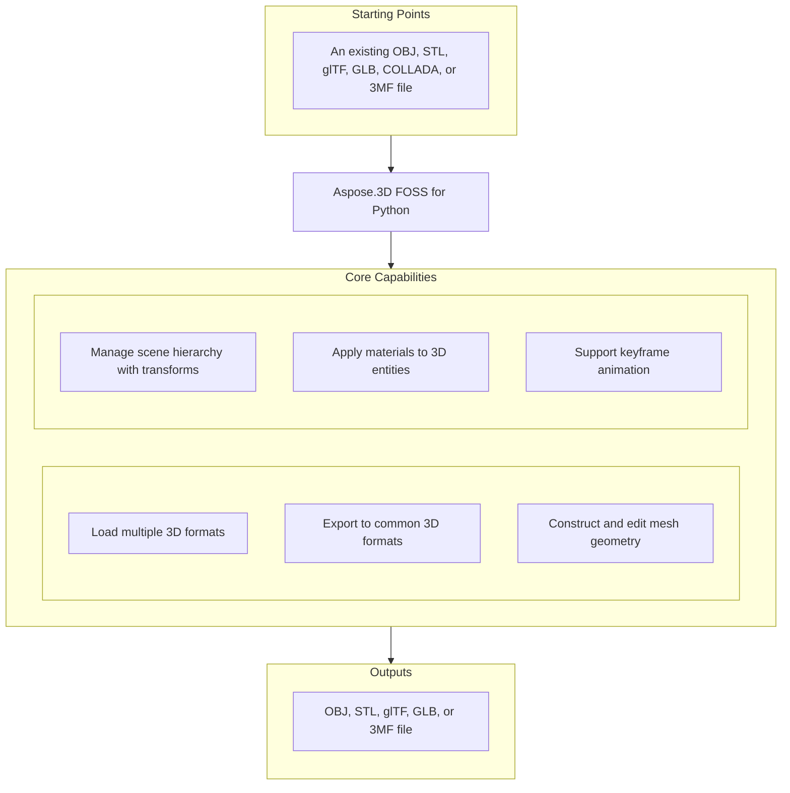

# Aspose.3D FOSS for Python

[](https://pypi.org/project/aspose-3d-foss/)  [](LICENSE) [](https://github.com/aspose-3d-foss/Aspose.3D-FOSS-for-Python/graphs/contributors)

[](https://products.aspose.org/3d/python/)

Aspose.3D FOSS for Python is a Python library for creating, reading, converting, and saving 3D scenes in formats such as `.obj`, `.stl`, `.gltf`, `.glb`, `.dae`, `.3mf`, and `.fbx`. It enables developers to programmatically build 3D geometry using primitives like `Box` and `Sphere`, attach materials, and manage scene hierarchy through `Scene`, `Node`, and `Mesh` objects. Users can inspect and modify scene content, including animations, bounding boxes, and transforms, then export results to disk or in-memory streams. The package supports Python versions 3.7 through 3.12 and is distributed under the MIT license.

## Navigation

- [At a Glance](#at-a-glance)
- [Key Capabilities](#key-capabilities)
- [Installation](#installation)
- [Dependencies](#dependencies)
- [Quick Start](#quick-start)
- [Additional Examples](#additional-examples)
- [API Reference](#api-reference)
- [Documentation & Resources](#documentation--resources)
- [Scope and Limitations](#scope-and-limitations)
- [Development and Testing](#development-and-testing)
- [License](#license)

## At a Glance



## Key Capabilities

- **Load multiple 3D formats.** Aspose.3D FOSS for Python reads 3D models from `.obj`, `.stl`, `.gltf`, `.glb`, `.dae`, and `.3mf` files by loading them into an `aspose.threed.Scene` object using `Scene.open` or `Scene.from_file`.
- **Export to common 3D formats.** Aspose.3D FOSS for Python exports 3D scenes to `.obj`, `.stl`, `.gltf`, `.glb`, and `.3mf` formats by calling `Scene.save` on an `aspose.threed.Scene` instance with appropriate save options.
- **Construct and edit mesh geometry.** Aspose.3D FOSS for Python constructs 3D geometry primitives such as `Box` and `Sphere`, converts them to `Mesh` via `to_mesh`, and adds them to a scene by assigning the resulting `Mesh` to a `Node.entity`.
- **Manage scene hierarchy with transforms.** Aspose.3D FOSS for Python organizes scene content hierarchically using `aspose.threed.Node` objects, where each `Node` can hold an entity and materials, and supports adding child nodes and evaluating global transforms.
- **Apply materials to 3D entities.** Aspose.3D FOSS for Python applies materials from `aspose.threed.shading` such as `LambertMaterial` and `PbrMaterial` to scene entities, setting properties like `diffuse_color`, `metallic_factor`, and `roughness_factor` before saving the scene.
- **Support keyframe animation.** Aspose.3D FOSS for Python supports animation by creating `aspose.threed.AnimationClip` objects via `Scene.create_animation_clip`, populating them with `aspose.threed.AnimationNode` and `aspose.threed.KeyframeSequence` instances to define time-based transformations.

## Installation

Install the published package from PyPI (`aspose-3d-foss`, version 26.1.0):

```bash
pip install aspose-3d-foss
```

To work from a source checkout instead, install the clone with pip:

```bash
git clone https://github.com/aspose-3d-foss/Aspose.3D-FOSS-for-Python.git
cd Aspose.3D-FOSS-for-Python
pip install .
```

Verify the install:

```bash
python -c "import aspose.threed"
```

The package supports Python 3.7, 3.8, 3.9, 3.10, 3.11, and 3.12 and declares `python_requires` as `>=3.7`.

## Dependencies

### Required Package Dependencies

No required third-party package dependencies; in `setup.py`, the `install_requires` list is empty.

### Native and System Requirements

- Requires Python 3.7 or later (`python_requires=">=3.7"` in `setup.py`).

### Development Dependencies

- `pytest>=7.0.0` (extra `dev`)

## Quick Start

Create a 3D scene from scratch by importing the `Scene` class and building a box mesh with a Lambert material, then saving it as a GLTF file.

```python
from aspose.threed import Scene
from aspose.threed.entities import Box
from aspose.threed.shading import LambertMaterial
from aspose.threed.utilities import Vector3

scene = Scene()
box = Box(length=2.0, width=1.0, height=1.0)
material = LambertMaterial()
material.diffuse_color = Vector3(0.2, 0.6, 0.9)

scene.root_node.create_child_node("Crate", entity=box.to_mesh(), material=material)
scene.save("crate.gltf")
```

## Additional Examples

Create a sphere with a metallic material and save it as STL, build a custom mesh and export it as text-based GLTF, generate a triangle mesh and output it as ASCII STL, inspect control point counts from a `Box` entity, and construct a cube mesh for 3MF export.

### Build a custom mesh and export it as text-based GLTF

```python
import io
import json
from aspose.threed import Scene, FileFormat
from aspose.threed.entities import Mesh
from aspose.threed.utilities import Vector3, Vector4
from aspose.threed.formats.gltf import GltfSaveOptions
from aspose.threed.shading import PbrMaterial

scene = Scene()
mesh = Mesh("TestMesh")
mesh.control_points.add(Vector4(0.0, 0.0, 0.0, 1.0))
mesh.control_points.add(Vector4(1.0, 0.0, 0.0, 1.0))
mesh.control_points.add(Vector4(0.0, 1.0, 0.0, 1.0))
mesh.create_polygon(0, 1, 2)

albedo = Vector3(0.8, 0.2, 0.3)
material = PbrMaterial("RedMaterial", albedo)
material.metallic_factor = 0.5
material.roughness_factor = 0.7

node = scene.root_node.create_child_node("TestNode")
node.entity = mesh
node.material = material

stream = io.BytesIO()
# Pass the detected FileFormat into the constructor explicitly: unlike
# StlFormat, GltfFormat.create_save_options() does not set file_format on the
# options it returns, and a bare stream (no filename) gives scene.save()
# nothing else to detect the format from.
options = GltfSaveOptions(FileFormat.get_format_by_extension(".gltf"))
options.binary_mode = False
scene.save(stream, options)

stream.seek(0)
gltf_data = json.loads(stream.read().decode("utf-8"))
print(gltf_data["materials"][0]["pbrMetallicRoughness"])
```

<details>
<summary>View Additional Examples</summary>

### Create a sphere with a metallic material and save it as STL

```python
from aspose.threed import Scene
from aspose.threed.entities import Sphere
from aspose.threed.shading import PbrMaterial
from aspose.threed.utilities import Vector3

scene = Scene()
sphere = Sphere()
material = PbrMaterial(albedo=Vector3(0.8, 0.1, 0.1))
material.metallic_factor = 0.9
material.roughness_factor = 0.2

scene.root_node.create_child_node("Ball", entity=sphere.to_mesh(), material=material)
scene.save("ball.stl")
```

### Generate a triangle mesh and output it as ASCII STL

```python
import io
from aspose.threed import Scene, FileFormat
from aspose.threed.entities import Mesh
from aspose.threed.utilities import Vector4

scene = Scene()
mesh = Mesh("triangle")
mesh.control_points.add(Vector4(0.0, 0.0, 0.0, 1.0))
mesh.control_points.add(Vector4(1.0, 0.0, 0.0, 1.0))
mesh.control_points.add(Vector4(1.0, 1.0, 0.0, 1.0))
mesh.create_polygon(0, 1, 2)

node = scene.root_node.create_child_node("triangle_node")
node.entity = mesh

stream = io.StringIO()
# Use FileFormat.get_format_by_extension(...).create_save_options() rather than
# StlSaveOptions() directly: a default-constructed options object has no
# file_format set, and scene.save() cannot infer the format from a bare stream
# (only filename-based saves fall back to extension detection).
options = FileFormat.get_format_by_extension(".stl").create_save_options()
options.binary_mode = False
scene.save(stream, options)
print(stream.getvalue())
```

### Inspect control point counts from a `Box` entity

```python
from aspose.threed.entities import Box

box = Box(10, 20, 30)
mesh = box.to_mesh()
print(f"Control points: {len(mesh.control_points)}")
```

### Construct a cube mesh for 3MF export

```python
import io
from aspose.threed import Scene
from aspose.threed.entities import Mesh
from aspose.threed.utilities import Vector4
from aspose.threed.formats import ThreeMfSaveOptions

scene = Scene()
mesh = Mesh("cube")
for point in [
    Vector4(0, 0, 0, 1), Vector4(1, 0, 0, 1), Vector4(1, 1, 0, 1), Vector4(0, 1, 0, 1),
    Vector4(0, 0, 1, 1), Vector4(1, 0, 1, 1), Vector4(1, 1, 1, 1), Vector4(0, 1, 1, 1),
]:
    mesh.control_points.add(point)

mesh.create_polygon(0, 1, 2)
mesh.create_polygon(0, 2, 3)
mesh.create_polygon(4, 7, 6)
mesh.create_polygon(4, 6, 5)
mesh.create_polygon(0, 4, 5)
mesh.create_polygon(0, 5, 1)
mesh.create_polygon(2, 6, 7)
mesh.create_polygon(2, 7, 3)
mesh.create_polygon(0, 3, 7)
mesh.create_polygon(0, 7, 4)
mesh.create_polygon(1, 5, 6)
mesh.create_polygon(1, 6, 2)

node = scene.root_node.create_child_node("cube")
node.entity = mesh

stream = io.BytesIO()
options = ThreeMfSaveOptions()
options.enable_compression = False
scene.save(stream, options)
```

</details>

## API Reference

The aspose-3d-foss package exposes `aspose.threed.Scene` as the primary entry point for loading, manipulating, and saving 3D scenes, and `aspose.threed.FileFormat` for inspecting and selecting supported file formats.

The verified public surface has 337 types.

<details>
<summary>View the Complete Public API Surface</summary>

### Core API

| Class | Description |
| --- | --- |
| `A3DObject` | The A3DObject class represents a base object in Aspose.3D FOSS for Python that supports named properties and can be extended by other types. |
| `AnimationChannel` | The AnimationChannel class represents a single animated property channel that holds keyframe data and interpolation settings. |
| `AnimationClip` | The AnimationClip class represents a container for animation data that defines a time range and associated animation nodes. |
| `AnimationNode` | The AnimationNode class represents a node in an animation hierarchy that can bind channels and contain sub-animations. |
| `ArrayListAdapter` | Adapter class that wraps List[T] and implements IArrayList[T]. |
| `AssetInfo` | The AssetInfo class holds metadata about a 3D asset such as author, creation time, coordinate system, and unit scale. |
| `Axis` | The coordinate axis. |
| `AxisSystem` | Axis system is an combination of coordinate system, up vector and front vector. |
| `BindPoint` | The BindPoint class represents a binding point that connects animation channels to specific properties of an object. |
| `BonePose` | The BonePose class represents the transformation pose of a bone in a skeleton used for skinning animations. |
| `BoundingBox2D` | The axis-aligned bounding box for Vector2 |
| `BoundingBoxExtent` | The extent of the bounding box |
| `Box` | The Box class represents a box primitive with configurable dimensions and segmentation for 3D modeling. |
| `Camera` | The Camera class represents a camera entity used for rendering 3D scenes from a specific viewpoint. |
| `Circle` | The Circle class represents a circular primitive defined by radius and segmentation for 3D modeling. |
| `ComposeOrder` | The order to compose transform matrix |
| `CoordinateSystem` | The left handed or right handed coordinate system. |
| `Curve` | The Curve class represents a parametric curve entity in 3D space used for geometry or animation paths. |
| `CustomObject` | The CustomObject class represents a user-defined object that extends A3DObject with custom behavior. |
| `Cylinder` | The Cylinder class represents a cylindrical primitive with configurable height, radius, and segmentation. |
| `Dish` | The Dish class represents a dish-shaped primitive used for modeling curved surfaces. |
| `Ellipse` | The Ellipse class represents an elliptical primitive defined by radii and segmentation for 3D modeling. |
| `Entity` | The Entity class represents a renderable or manipulable object in a 3D scene such as a mesh or curve. |
| `ExportException` | Exceptions when Aspose.3D failed to export the scene to file. |
| `Extrapolation` | The Extrapolation class defines how animation values are extended beyond the defined keyframe range. |
| `FMatrix4` | Matrix 4x4 with all component in float type |
| `FileContentType` | File content type |
| `FileFormat` | The FileFormat class provides utilities for identifying and working with supported 3D file formats. |
| `FileFormatType` | File format type |
| `Frustum` | The Frustum class represents a truncated pyramid primitive used for modeling viewing volumes. |
| `Geometry` | The Geometry class represents a base class for geometric entities such as meshes and primitives. |
| `GlobalTransform` | The GlobalTransform class represents a transformation matrix applied to an object in world space. |
| `Group` | A Group represents the logical relationships of Node. |
| `INamedObject` | The INamedObject class defines an interface for objects that can be assigned a name in Aspose.3D FOSS for Python. |
| `IOExtension` | Utilities to write matrix/vector to binary writer |
| `ImageRenderOptions` | The ImageRenderOptions class holds settings for rendering a 3D scene to an image format. |
| `ImportException` | Exception when Aspose.3D failed to open the specified source. |
| `KeyFrame` | The KeyFrame class represents a single keyframe with a time value and associated data for animation. |
| `KeyframeSequence` | The KeyframeSequence class represents a sequence of keyframes used to define animated values over time. |
| `Light` | The Light class represents a light entity that illuminates objects in a 3D scene. |
| `LinearExtrusion` | The LinearExtrusion class represents a 3D entity created by extruding a 2D profile along a straight path. |
| `MathUtils` | A set of useful mathematical utilities. |
| `Mesh` | The Mesh class represents a polygonal mesh geometry composed of vertices and polygons. |
| `Node` | The Node class represents a transformable node in a scene hierarchy that can hold entities and child nodes. |
| `ParseException` | Exception when Aspose.3D failed to parse the input. |
| `Plane` | The Plane class represents a planar primitive used for modeling flat surfaces. |
| `PolygonBuilder` | The PolygonBuilder class provides utilities for constructing polygonal meshes programmatically. |
| `Pose` | The Pose class represents a snapshot of transformations for a set of nodes used in animation or skinning. |
| `Primitive` | The Primitive class represents a basic geometric shape such as a box, cylinder, or sphere. |
| `Property` | The Property class represents a named value that can be attached to an object for metadata or configuration. |
| `PropertyCollection` | The PropertyCollection class represents a container for managing a collection of named properties. |
| `PropertyFlags` | Property's flags |
| `Rect` | A class to represent the rectangle |
| `RelativeRectangle` | Relative rectangle |
| `RotationOrder` | The order controls which rx ry rz are applied in the transformation matrix. |
| `Scene` | The Scene class represents a complete 3D scene containing nodes, entities, animations, and asset metadata. |
| `SceneObject` | The SceneObject class represents a base class for objects that belong to a 3D scene hierarchy. |
| `SemanticAttribute` | Allow user to use their own structure for static declaration of VertexDeclaration |
| `Sphere` | The Sphere class represents a sphere primitive in Aspose.3D FOSS for Python, defined by radius and angular segments. |
| `Transform` | The Transform class encapsulates geometric transformations such as translation, rotation, and scaling for 3D objects in Aspose.3D FOSS for Python. |
| `TransformBuilder` | The TransformBuilder is used to build transform matrix by a chain of transformations. |
| `TrialException` | This is raised in Scene.Open/Scene.Save when no licenses are applied. |
| `Vertex` | Vertex reference, used to access the raw vertex in TriMesh. |
| `VertexDeclaration` | The declaration of a custom defined vertex's structure |
| `VertexField` | Vertex's field memory layout description. |
| `VertexFieldDataType` | Vertex field's data type |
| `VertexFieldSemantic` | The semantic of the vertex field |
| `Bone` | The Bone class represents a bone in skeletal animation, containing transform and weight information for skinning in Aspose.3D FOSS for Python. |
| `BoneLinkMode` | The BoneLinkMode class enumerates the supported bone linking modes for skin deformation in Aspose.3D FOSS for Python. |
| `Deformer` | The Deformer class serves as the base class for mesh deformation operators in Aspose.3D FOSS for Python. |
| `MorphTargetChannel` | The MorphTargetChannel class manages the influence of morph targets on a mesh in Aspose.3D FOSS for Python. |
| `MorphTargetDeformer` | The MorphTargetDeformer class applies morph target animations to a mesh in Aspose.3D FOSS for Python. |
| `SkinDeformer` | The SkinDeformer class applies skeletal animation to a mesh by linking bones to vertices in Aspose.3D FOSS for Python. |
| `ApertureMode` | Camera aperture modes. |
| `BooleanOperand` | This class encapsulates the transformed mesh as Boolean operation's operand. |
| `BooleanOperation` | The BooleanOperation class defines the supported boolean operations for solid modeling in Aspose.3D FOSS for Python. |
| `BooleanOperator` | Boolean operator allows you to apply Boolean operation on two IMeshConvertible instances. |
| `CompositeCurve` | A CompositeCurve is consisting of several curve segments. |
| `CurveDimension` | The CurveDimension class specifies the dimensionality of a curve in Aspose.3D FOSS for Python. |
| `EndPoint` | The end point to trim the curve, can be a parameter value or a Cartesian point. |
| `HalfSpace` | HalfSpace represents a infinity space which is split by a plane, this can be used with BooleanOperator |
| `IIndexedVertexElement` | The IIndexedVertexElement interface represents a vertex element with indexed data in Aspose.3D FOSS for Python. |
| `IMeshConvertible` | Entities that implemented this interface can be converted to Mesh |
| `IOrientable` | Orientable entities shall implement this interface. |
| `LightType` | Light types. |
| `Line` | A polyline is a path defined by a set of points with control_points, and connected by segments. |
| `MappingMode` | The MappingMode class enumerates the supported texture mapping modes in Aspose.3D FOSS for Python. |
| `NurbsCurve` | The NurbsCurve class represents a non-uniform rational B-spline curve in Aspose.3D FOSS for Python. |
| `NurbsDirection` | The NurbsDirection class describes the properties of a NURBS direction in Aspose.3D FOSS for Python. |
| `NurbsSurface` | The NurbsSurface class represents a non-uniform rational B-spline surface in Aspose.3D FOSS for Python. |
| `NurbsType` | The NurbsType class enumerates the supported NURBS curve types in Aspose.3D FOSS for Python. |
| `Patch` | The Patch class represents a parametric surface patch in Aspose.3D FOSS for Python. |
| `PatchDirection` | The PatchDirection class specifies the direction of a surface patch in Aspose.3D FOSS for Python. |
| `PatchDirectionType` | The PatchDirectionType class enumerates the supported surface patch directions in Aspose.3D FOSS for Python. |
| `PointCloud` | The PointCloud class represents a collection of unconnected vertices in Aspose.3D FOSS for Python. |
| `InvalidOperationException` | The InvalidOperationException class is raised when an invalid operation is performed during polygon construction in Aspose.3D FOSS for Python. |
| `PolygonModifier` | The PolygonModifier class provides utilities for modifying polygonal meshes in Aspose.3D FOSS for Python. |
| `ProjectionType` | Camera's projection types. |
| `Pyramid` | Parameterized pyramid. |
| `RectangularTorus` | Parameterized rectangular torus entity. |
| `ReferenceMode` | The ReferenceMode class enumerates the supported reference modes for mesh data in Aspose.3D FOSS for Python. |
| `RevolvedAreaSolid` | RevolvedAreaSolid entity. |
| `RotationMode` | The frustum's rotation mode. |
| `Shape` | Base class for all shape entities. |
| `Skeleton` | The Skeleton is mainly used by CAD software to help designer to manipulate the transformation of skeletal structure, it's usually useless outside the CAD softwares. |
| `SkeletonType` | Skeleton type enum. |
| `SplitMeshPolicy` | Share vertex/control point data between sub-meshes or each sub-mesh has its own compacted data. |
| `SweptAreaSolid` | SweptAreaSolid entity. |
| `TextureMapping` | The TextureMapping class defines how textures are mapped onto 3D geometry in Aspose.3D FOSS for Python. |
| `Torus` | Parameterized torus entity. |
| `TransformedCurve` | TransformedCurve entity. |
| `TriMesh` | TriMesh is a triangle mesh that stores triangles. |
| `TrimmedCurve` | TrimmedCurve entity. |
| `VertexElement` | The VertexElement class represents a generic vertex element in Aspose.3D FOSS for Python. |
| `VertexElementBinormal` | The VertexElementBinormal class represents binormal data for vertices in Aspose.3D FOSS for Python. |
| `VertexElementDoublesTemplate` | A helper class for defining concrete implementations. |
| `VertexElementEdgeCrease` | Defines the edge crease values for specified components. |
| `VertexElementFVector` | The VertexElementFVector class represents floating-point vector data for vertices in Aspose.3D FOSS for Python. |
| `VertexElementHole` | Defines the hole information for specified components. |
| `VertexElementIntsTemplate` | A helper class for defining concrete implementations with int data. |
| `VertexElementMaterial` | Defines the material for specified components. |
| `VertexElementNormal` | The VertexElementNormal class represents normal vectors for vertices in Aspose.3D FOSS for Python. |
| `VertexElementPolygonGroup` | Defines the polygon group for specified components. |
| `VertexElementSmoothingGroup` | The VertexElementSmoothingGroup class represents smoothing group data for vertices in Aspose.3D FOSS for Python. |
| `VertexElementSpecular` | Defines the specular color for specified components. |
| `VertexElementTangent` | The VertexElementTangent class represents tangent vectors for vertices in Aspose.3D FOSS for Python. |
| `VertexElementTemplate` | A helper class for defining concrete implementations of vertex elements with typed data. |
| `VertexElementType` | The VertexElementType class enumerates the supported vertex element types in Aspose.3D FOSS for Python. |
| `VertexElementUV` | The VertexElementUV class represents texture coordinate data for vertices in Aspose.3D FOSS for Python. |
| `VertexElementUserData` | Defines the user data for specified components. |
| `VertexElementVector4` | Defines the vector4 data for specified components. |
| `VertexElementVertexColor` | The VertexElementVertexColor class represents per-vertex color data in Aspose.3D FOSS for Python. |
| `VertexElementVertexCrease` | Defines the vertex crease values for specified components. |
| `VertexElementVisibility` | Defines the visibility for specified components. |
| `VertexElementWeight` | Defines the weight for specified components. |
| `A3dwSaveOptions` | Save options for A3DW |
| `AmfSaveOptions` | Save options for AMF |
| `BasicLoadOptions` | Simple LoadOptions subclass for basic loading options. |
| `ColladaLoadOptions` | Load options for Collada |
| `ColladaSaveOptions` | Save options for collada |
| `ColladaTransformStyle` | The node's transformation style of node |
| `Discreet3dsLoadOptions` | Load options for Discreet 3DS |
| `Discreet3dsSaveOptions` | Save options for Discreet 3DS |
| `DracoCompressionLevel` | Compression level for draco file |
| `DracoFormat` | Google Draco format |
| `DracoSaveOptions` | Save options for Draco |
| `Exporter` | The Exporter class provides functionality to export 3D scenes to various file formats in Aspose.3D FOSS for Python. |
| `FbxLoadOptions` | Load options for FBX |
| `FbxSaveOptions` | Save options for FBX |
| `FormatDetector` | The FormatDetector class identifies the file format of a given 3D file in Aspose.3D FOSS for Python. |
| `GltfEmbeddedImageFormat` | Embedded image format for GLTF |
| `formats.GltfLoadOptions` | Load options for glTF |
| `formats.GltfSaveOptions` | Save options for glTF |
| `Html5SaveOptions` | Save options for HTML5 |
| `IOConfig` | The IOConfig class holds input/output configuration options for file operations in Aspose.3D FOSS for Python. |
| `IOService` | The IOService class provides core input/output services for file handling in Aspose.3D FOSS for Python. |
| `Importer` | The Importer class provides functionality to import 3D scenes from various file formats in Aspose.3D FOSS for Python. |
| `JtLoadOptions` | Load options for JT |
| `LoadOptions` | LoadOptions provides configuration options for loading 3D scenes in Aspose.3D FOSS for Python. |
| `Microsoft3MFFormat` | Microsoft 3MF format |
| `Microsoft3MFSaveOptions` | Save options for Microsoft 3MF |
| `formats.ObjLoadOptions` | Load options for OBJ |
| `formats.ObjSaveOptions` | Save options for OBJ |
| `PdfFormat` | Adobe's Portable Document Format |
| `PdfLightingScheme` | Lighting scheme for PDF export |
| `PdfLoadOptions` | Load options for PDF |
| `PdfRenderMode` | Render mode for PDF export |
| `PdfSaveOptions` | Save options for PDF |
| `Plugin` | Plugin is an abstract base class that defines the interface for format plugins in Aspose.3D FOSS for Python. |
| `PlyFormat` | PLY format |
| `PlyLoadOptions` | Load options for PLY |
| `PlySaveOptions` | Save options for PLY |
| `RvmFormat` | RVM format |
| `RvmLoadOptions` | Load options for RVM |
| `RvmSaveOptions` | Save options for RVM |
| `SaveOptions` | SaveOptions provides configuration options for saving 3D scenes in Aspose.3D FOSS for Python. |
| `formats.StlLoadOptions` | Load options for STL |
| `formats.StlSaveOptions` | Save options for STL |
| `ThreeMfFormat` | ThreeMfFormat represents the 3MF file format and its capabilities for import and export in Aspose.3D FOSS for Python. |
| `ThreeMfLoadOptions` | ThreeMfLoadOptions provides configuration options specific to loading 3MF files in Aspose.3D FOSS for Python. |
| `ThreeMfSaveOptions` | ThreeMfSaveOptions provides configuration options specific to saving 3MF files in Aspose.3D FOSS for Python. |
| `U3dLoadOptions` | Load options for U3D |
| `U3dSaveOptions` | Save options for U3D |
| `UsdSaveOptions` | Save options for USD |
| `XLoadOptions` | Load options for X format |
| `ColladaExporter` | ColladaExporter exports 3D scenes to the COLLADA format in Aspose.3D FOSS for Python. |
| `ColladaFormat` | ColladaFormat represents the COLLADA file format and its import/export capabilities in Aspose.3D FOSS for Python. |
| `ColladaFormatDetector` | ColladaFormatDetector identifies COLLADA files by their content in Aspose.3D FOSS for Python. |
| `ColladaImporter` | ColladaImporter imports 3D scenes from the COLLADA format in Aspose.3D FOSS for Python. |
| `ColladaPlugin` | ColladaPlugin provides access to COLLADA format support including importers, exporters, and format detection in Aspose.3D FOSS for Python. |
| `FbxExporter` | FbxExporter saves 3D scenes to the FBX format in Aspose.3D FOSS for Python. |
| `FbxFormat` | FbxFormat represents the FBX file format and its import/export capabilities in Aspose.3D FOSS for Python. |
| `FbxFormatDetector` | FbxFormatDetector identifies FBX files by their content in Aspose.3D FOSS for Python. |
| `FbxImporter` | FbxImporter loads 3D scenes from the FBX format in Aspose.3D FOSS for Python. |
| `FbxPlugin` | FbxPlugin provides access to FBX format support including importers, exporters, and format detection in Aspose.3D FOSS for Python. |
| `BinaryTokenizer` | BinaryTokenizer parses binary FBX files into tokens for further processing in Aspose.3D FOSS for Python. |
| `binary_tokenizer.Token` | Token represents a single parsed element from a binary FBX file in Aspose.3D FOSS for Python. |
| `binary_tokenizer.TokenType` | TokenType defines the categories of tokens that can appear in binary FBX files in Aspose.3D FOSS for Python. |
| `FbxElement` | FbxElement represents a parsed FBX element with its properties and child elements in Aspose.3D FOSS for Python. |
| `FbxParser` | FbxParser reads and interprets the structure of FBX files in Aspose.3D FOSS for Python. |
| `FbxScope` | FbxScope defines the scope context for parsing FBX elements in Aspose.3D FOSS for Python. |
| `FbxTokenizer` | FbxTokenizer breaks down ASCII FBX files into tokens for parsing in Aspose.3D FOSS for Python. |
| `tokenizer.Token` | Token represents a lexical unit extracted from an ASCII FBX file in Aspose.3D FOSS for Python. |
| `tokenizer.TokenType` | TokenType specifies the kinds of tokens produced when parsing ASCII FBX files in Aspose.3D FOSS for Python. |
| `GltfExporter` | GltfExporter writes 3D scenes to the glTF format in Aspose.3D FOSS for Python. |
| `GltfFormat` | GltfFormat represents the glTF file format and its import/export capabilities in Aspose.3D FOSS for Python. |
| `GltfFormatDetector` | GltfFormatDetector identifies glTF files by their content in Aspose.3D FOSS for Python. |
| `GltfImporter` | GltfImporter reads 3D scenes from the glTF format in Aspose.3D FOSS for Python. |
| `gltf.GltfLoadOptions` | GltfLoadOptions provides configuration options specific to loading glTF files in Aspose.3D FOSS for Python. |
| `GltfPlugin` | GltfPlugin provides access to glTF format support including importers, exporters, and format detection in Aspose.3D FOSS for Python. |
| `gltf.GltfSaveOptions` | GltfSaveOptions provides configuration options specific to saving glTF files in Aspose.3D FOSS for Python. |
| `ObjExporter` | ObjExporter writes 3D scenes to the OBJ format in Aspose.3D FOSS for Python. |
| `ObjFormat` | ObjFormat represents the OBJ file format and its import/export capabilities in Aspose.3D FOSS for Python. |
| `ObjFormatDetector` | ObjFormatDetector identifies OBJ files by their content in Aspose.3D FOSS for Python. |
| `ObjImporter` | ObjImporter reads 3D scenes from the OBJ format in Aspose.3D FOSS for Python. |
| `obj.ObjLoadOptions` | ObjLoadOptions provides configuration options specific to loading OBJ files in Aspose.3D FOSS for Python. |
| `ObjPlugin` | ObjPlugin provides access to OBJ format support including importers, exporters, and format detection in Aspose.3D FOSS for Python. |
| `obj.ObjSaveOptions` | ObjSaveOptions provides configuration options specific to saving OBJ files in Aspose.3D FOSS for Python. |
| `StlExporter` | StlExporter writes 3D scenes to the STL format in Aspose.3D FOSS for Python. |
| `StlFormat` | The StlFormat class represents the STL file format and provides properties and methods for working with STL files in Aspose.3D FOSS for Python. |
| `StlFormatDetector` | The StlFormatDetector class detects whether a given input stream contains an STL file format. |
| `StlImporter` | The StlImporter class imports geometry data from STL files into a scene object. |
| `stl.StlLoadOptions` | The StlLoadOptions class provides configuration options for loading STL files, including coordinate system flipping and scaling. |
| `StlPlugin` | The StlPlugin class acts as a plugin for handling STL file format operations such as importing, exporting, and format detection. |
| `stl.StlSaveOptions` | The StlSaveOptions class provides configuration options for saving scenes to STL files, including binary mode, coordinate system flipping, and scaling. |
| `ThreeMfExporter` | The ThreeMfExporter class exports scenes to the 3MF file format. |
| `ThreeMfFormatDetector` | The ThreeMfFormatDetector class detects whether a given input stream contains a 3MF file format. |
| `ThreeMfImporter` | The ThreeMfImporter class imports geometry data from 3MF files into a scene object. |
| `ThreeMfPlugin` | The ThreeMfPlugin class acts as a plugin for handling 3MF file format operations such as importing, exporting, and format detection. |
| `ArbitraryProfile` | This class allows you to construct a 2D profile directly from arbitrary curve. |
| `CShape` | IFC compatible C-shape profile that defined by parameters. |
| `CenterLineProfile` | IFC compatible center line profile. |
| `CircleShape` | IFC compatible circle profile. |
| `EllipseShape` | IFC compatible ellipse profile. |
| `FontFile` | Font file contains definitions for glyphs, this is used to create text profile. |
| `HShape` | IFC compatible H-shape profile. |
| `HollowCircleShape` | IFC compatible hollow circle profile. |
| `HollowRectangleShape` | IFC compatible hollow rectangular shape with both inner/outer rounding corners. |
| `LShape` | IFC compatible L-shape profile that defined by parameters. |
| `MirroredProfile` | IFC compatible mirror profile. |
| `ParameterizedProfile` | The base class of all parameterized profiles. |
| `Profile` | 2D Profile in xy plane. |
| `RectangleShape` | IFC compatible rectangle profile. |
| `TShape` | IFC compatible T-shape defined by parameters. |
| `Text` | Text profile, this profile describes contours using font and text. |
| `TrapeziumShape` | IFC compatible Trapezium shape defined by parameters. |
| `UShape` | IFC compatible U-shape defined by parameters. |
| `ZShape` | IFC compatible Z-shape profile that defined by parameters. |
| `BlendFactor` | Blend factor specify pixel arithmetic. |
| `CompareFunction` | Compare function for depth/stencil testing. |
| `CubeFace` | Cube face enumeration. |
| `CullFaceMode` | Cull face mode for face culling. |
| `DescriptorSetUpdater` | Descriptor set updater for shader resources. |
| `DrawOperation` | Draw operation type. |
| `DriverException` | Exception thrown when rendering driver fails. |
| `EntityRenderer` | Base class for rendering entities. |
| `EntityRendererFeatures` | Features supported by an entity renderer. |
| `EntityRendererKey` | The key of registered entity renderer. |
| `FrontFace` | Front face winding order. |
| `GLSLSource` | GLSL shader source. |
| `IBuffer` | Interface for vertex/index buffer. |
| `ICommandList` | Interface for command list. |
| `IDescriptorSet` | Interface for descriptor set. |
| `IIndexBuffer` | Interface for index buffer. |
| `IPipeline` | Interface for graphics pipeline. |
| `IRenderQueue` | Interface for render queue. |
| `IRenderTarget` | Interface for render target. |
| `IRenderTexture` | Interface for render texture. |
| `IRenderWindow` | Interface for render window. |
| `ITexture1D` | Interface for 1D texture. |
| `ITexture2D` | Interface for 2D texture. |
| `ITextureCodec` | Interface for texture codec. |
| `ITextureCubemap` | Interface for cubemap texture. |
| `ITextureDecoder` | Interface for texture decoder. |
| `ITextureEncoder` | Interface for texture encoder. |
| `ITextureUnit` | Interface for texture unit. |
| `IVertexBuffer` | Interface for vertex buffer. |
| `IndexDataType` | Data type for indices. |
| `InitializationException` | Exception thrown when rendering initialization fails. |
| `PixelFormat` | Pixel format for render targets. |
| `PixelMapMode` | Pixel mapping mode. |
| `PixelMapping` | Pixel mapping configuration. |
| `PolygonMode` | Polygon rendering mode. |
| `PostProcessing` | Post-processing effect. |
| `PresetShaders` | Predefined shaders. |
| `PushConstant` | Push constant for shaders. |
| `RenderFactory` | RenderFactory creates all resources that represented in rendering pipeline. |
| `RenderParameters` | Parameters for rendering. |
| `RenderQueueGroupId` | Render queue group ID. |
| `RenderResource` | Base class for render resources. |
| `RenderStage` | Render stage in the pipeline. |
| `RenderState` | Render state configuration. |
| `Renderer` | The context about renderer. |
| `RendererVariableManager` | Manages renderer variables. |
| `SPIRVSource` | SPIRV shader source. |
| `ShaderException` | Exception thrown when shader compilation/linking fails. |
| `ShaderProgram` | Shader program. |
| `ShaderSet` | Set of shaders for rendering. |
| `ShaderSource` | Shader source code. |
| `ShaderStage` | Shader stage. |
| `ShaderVariable` | Shader variable. |
| `StencilAction` | Stencil action. |
| `StencilState` | Stencil state configuration. |
| `TextureCodec` | Texture codec. |
| `TextureData` | Texture data. |
| `TextureType` | Texture type. |
| `Viewport` | Viewport for rendering. |
| `WindowHandle` | Window handle for render window. |
| `AlphaSource` | Source of alpha channel for textures. |
| `LambertMaterial` | The LambertMaterial class represents a Lambertian material with properties for ambient, diffuse, emissive, transparency, and transparent colors. |
| `Material` | The Material class serves as the base class for all material types and provides methods for managing textures. |
| `PbrMaterial` | The PbrMaterial class represents a physically based rendering material with properties such as albedo, metallic factor, roughness, and emissive color. |
| `PbrSpecularMaterial` | Material for physically based rendering based on diffuse color/specular/glossiness. |
| `PhongMaterial` | The PhongMaterial class represents a Phong shading material that extends LambertMaterial with reflection and specular properties. |
| `ShaderMaterial` | A shader material allows to describe the material by external rendering engine or shader language. |
| `ShaderTechnique` | A technique in shader material describes the concrete rendering details. |
| `Texture` | This class defines the texture from an external file. |
| `TextureBase` | Base class for all texture types. |
| `TextureFilter` | Texture filter type. |
| `TextureSlot` | Texture slot name. |
| `WrapMode` | Wrap mode for texture coordinates. |
| `BoundingBox` | The BoundingBox class represents an axis-aligned bounding box in 3D space. |
| `FVector2` | The FVector2 class represents a 2D vector with single-precision floating-point components. |
| `FVector3` | The FVector3 class represents a 3D vector with single-precision floating-point components. |
| `FVector4` | The FVector4 class represents a 4D vector with single-precision floating-point components. |
| `FileSystem` | File system encapsulation. |
| `Matrix4` | The Matrix4 class represents a 4x4 transformation matrix used for 3D operations. |
| `Quaternion` | The Quaternion class represents a quaternion used for 3D rotation operations. |
| `Vector2` | The Vector2 class represents a 2D vector with double-precision floating-point components. |
| `Vector3` | The Vector3 class represents a 3D vector with double-precision floating-point components. |
| `Vector4` | The Vector4 class represents a 4D vector with double-precision floating-point components. |
| `Watermark` | Utility to encode/decode blind watermark to/from a mesh. |

#### Enumerations

| Enumeration | Description |
| --- | --- |
| `ExtrapolationType` | The ExtrapolationType class defines the enumeration of methods used to extrapolate animation values. |
| `Interpolation` | The Interpolation class defines the enumeration of methods used to interpolate between keyframes. |
| `PoseType` | The PoseType class defines the enumeration of pose types used in animation and skinning workflows. |
| `StepMode` | The StepMode class enumerates the supported step modes for file format conversion in Aspose.3D FOSS for Python. |
| `WeightedMode` | The WeightedMode class enumerates the supported weighting modes for morph target deformation in Aspose.3D FOSS for Python. |

#### Detailed Member Reference

### Scene

The `aspose.threed.Scene` class provides methods such as `Scene.open`, `Scene.from_file`, `Scene.save`, `Scene.create_animation_clip`, `Scene.get_animation_clip`, `Scene.render`, `Scene.clear`, `Scene.sub_scenes`, `Scene.library`, `Scene.asset_info`, `Scene.root_node`, `Scene.poses`, and `Scene.current_animation_clip` to manage 3D content and its metadata, and supports loading and saving via `FileFormat` options.

- `animation_clips`: Defined as `def animation_clips(self) -> List['AnimationClip']`.
- `asset_info`: Defined as `def asset_info(self) -> AssetInfo`.
- `clear`: Defined as `def clear(self)`.
- `create_animation_clip`: Defined as `def create_animation_clip(self, name: str) -> 'AnimationClip'`.
- `current_animation_clip`: Defined as `def current_animation_clip(self) -> Optional['AnimationClip']`.
- `from_file`: Defined as `def from_file(file_name: str)`.
- `get_animation_clip`: Defined as `def get_animation_clip(self, name: str) -> Optional['AnimationClip']`.
- `library`: Defined as `def library(self) -> List[CustomObject]`.
- `open`: Defined as `def open(self, file_or_stream, options=None)`.
- `poses`: Defined as `def poses(self) -> List`.
- `render`: Defined as `def render(self, camera, file_name_or_bitmap, size=None, format=None, options=None)`.
- `root_node`: Defined as `def root_node(self)`.
- `save`: Defined as `def save(self, file_or_stream, format_or_options=None)`.
- `sub_scenes`: Defined as `def sub_scenes(self) -> List['Scene']`.

### Node

The `aspose.threed.Node` class represents a node in the scene hierarchy and exposes properties such as `Node.transform`, `Node.parent_node`, `Node.child_nodes`, `Node.entities`, `Node.entity`, `Node.material`, `Node.materials`, `Node.visible`, `Node.excluded`, `Node.global_transform`, `Node.evaluate_global_transform`, `Node.get_bounding_box`, `Node.add_child_node`, `Node.create_child_node`, `Node.add_entity`, `Node.get_child`, `Node.get_entity`, `Node.select_objects`, `Node.select_single_object`, `Node.meta_datas`, and `Node.merge` to navigate and modify the scene graph.

- `add_child_node`: Defined as `def add_child_node(self, node: 'Node')`.
- `add_entity`: Defined as `def add_entity(self, entity: 'Entity')`.
- `asset_info`: Defined as `def asset_info(self)`.
- `child_nodes`: Defined as `def child_nodes(self) -> List['Node']`.
- `create_child_node`: Defined as `def create_child_node(self, node_name: Optional[str]=None, entity=None, material=None) -> 'Node'`.
- `entities`: Defined as `def entities(self) -> List['Entity']`.
- `entity`: Defined as `def entity(self) -> Optional['Entity']`.
- `evaluate_global_transform`: Defined as `def evaluate_global_transform(self, with_geometric_transform: bool) -> Matrix4`.
- `excluded`: Defined as `def excluded(self) -> bool`.
- `get_bounding_box`: Defined as `def get_bounding_box(self) -> BoundingBox`.
- `get_child`: Defined as `def get_child(self, index_or_name)`.
- `get_entity`: Defined as `def get_entity(self, entity_type: type)`.
- `global_transform`: Defined as `def global_transform(self) -> GlobalTransform`.
- `material`: Defined as `def material(self) -> Optional['Material']`.
- `materials`: Defined as `def materials(self) -> List['Material']`.
- `merge`: Defined as `def merge(self, node: 'Node')`.
- `meta_datas`: Defined as `def meta_datas(self) -> List`.
- `parent_node`: Defined as `def parent_node(self) -> Optional['Node']`.
- `select_objects`: Defined as `def select_objects(self, path: str)`.
- `select_single_object`: Defined as `def select_single_object(self, path: str)`.
- `transform`: Defined as `def transform(self) -> Transform`.
- `visible`: Defined as `def visible(self) -> bool`.

### Mesh

The `aspose.threed.Mesh` class and `aspose.threed.PolygonBuilder` class provide low-level mesh construction and modification capabilities, including `control_points`, `to_mesh`, `create_polygon`, and `create_save_options` for building polygonal geometry programmatically.

- `control_points`: Defined as `def control_points(self) -> ArrayListAdapter[Vector4]`.
- `create_polygon`: Defined as `def create_polygon(self, *args)`.
- `difference`: Defined as `def difference(a: 'Mesh', b: 'Mesh') -> 'Mesh'`.
- `do_boolean`: Defined as `def do_boolean(op: BooleanOperation, a: 'Mesh', transform_a: Optional[Matrix4], b: 'Mesh', transform_b: Optional[Matrix4]) -> 'Mesh'`.
- `edges`: Defined as `def edges(self) -> ArrayListAdapter[int]`.
- `get_bounding_box`: Defined as `def get_bounding_box(self)`.
- `get_entity_renderer_key`: Defined as `def get_entity_renderer_key(self)`.
- `get_polygon_size`: Defined as `def get_polygon_size(self, index: int) -> int`.
- `intersect`: Defined as `def intersect(a: 'Mesh', b: 'Mesh') -> 'Mesh'`.
- `is_manifold`: Defined as `def is_manifold(self) -> bool`.
- `optimize`: Defined as `def optimize(self, vertex_elements: bool=False, tolerance_control_point: float=1e-09, tolerance_normal: float=1e-09, tolerance_uv: float=1e-09) -> 'Mesh'`.
- `polygon_count`: Defined as `def polygon_count(self) -> int`.
- `polygons`: Defined as `def polygons(self) -> List[List[int]]`.
- `to_mesh`: Defined as `def to_mesh(self) -> 'Mesh'`.
- `triangulate`: Defined as `def triangulate(self) -> 'Mesh'`.
- `union`: Defined as `def union(a: 'Mesh', b: 'Mesh') -> 'Mesh'`.

### shading

The `aspose.threed.shading` module exposes material types such as `aspose.threed.shading.LambertMaterial`, `aspose.threed.shading.PhongMaterial`, and `aspose.threed.shading.PbrMaterial` with properties like `diffuse_color`, `metallic_factor`, and `roughness_factor` to define surface appearance for rendering.

### animation

The `aspose.threed.animation` module supports animation via `aspose.threed.AnimationClip`, `aspose.threed.AnimationNode`, and `aspose.threed.KeyframeSequence` to define time-based transformations and properties for 3D entities.

### entities

The `aspose.threed.entities` module provides primitive shapes such as `aspose.threed.Box`, `aspose.threed.Sphere`, `aspose.threed.Cylinder`, and `aspose.threed.Primitive` that can be instantiated and added to a scene as mesh entities.

### formats

The `aspose.threed.formats` module supports import and export for formats including `aspose.threed.formats.obj`, `aspose.threed.formats.stl`, `aspose.threed.formats.gltf`, `aspose.threed.formats.collada`, and `aspose.threed.formats.threemf`, with dedicated load and save options per format.

### utilities

The `aspose.threed.utilities` module provides common data types such as `aspose.threed.utilities.Vector3` and `aspose.threed.utilities.Vector4` for representing 3D and 4D vectors used in geometry, transforms, and shading.

</details>

## Documentation & Resources

- **[Getting started guide](https://docs.aspose.org/3d/python/)** — The Aspose.3D FOSS for Python documentation at version 26.1.0 covers API reference material for the aspose-3d-foss package, including scene management, node traversal, mesh creation, and format conversion for Python versions 3.7 through 3.12.
- **[How-to guides & FAQ](https://kb.aspose.org/3d/python/)** — The Aspose.3D FOSS for Python knowledge base at version 26.1.0 provides step-by-step guides and troubleshooting examples for common tasks such as loading 3D models, inspecting scene hierarchies, and exporting to various formats using Python 3.7 or higher.
- Found a bug or have a feature request? [Open an issue](https://github.com/aspose-3d-foss/Aspose.3D-FOSS-for-Python/issues).

## Scope and Limitations

Aspose.3D FOSS for Python version 26.1.0 supports reading and writing OBJ, STL, glTF, 3MF, and COLLADA files on Python 3.7 through 3.12, and provides basic scene inspection and node manipulation capabilities.

- No file format registers an importer or exporter for PDF, PLY, RVM, U3D, JT, AMF, HTML5, A3DW, USD, or Draco in this build — `PdfSaveOptions`, `PlyLoadOptions`, `DracoSaveOptions`, and similar option classes exist as public types, but `Scene.open`() and `Scene.save`() cannot detect or dispatch any of these extensions, and raise a RuntimeError if you try.
- FBX support is experimental: `FbxImporter` has a real, working ASCII/binary tokenizer and parser, but no bundled test opens a real `.fbx` fixture through it, and `FbxExporter.save`() and `save_to_stream()` both raise NotImplementedError outright, so FBX is import-only at best.
- COLLADA import works, but COLLADA export is not reachable through `Scene.save`() because `IOService`'s exporter lookup fails before it ever reaches `ColladaExporter`.
- `Scene.render`() and the entire `aspose.threed.render` module (`Renderer`, `RenderFactory`, `Viewport`, and related classes) raise NotImplementedError — this library does not render scenes to images.
- `Texture` and `TextureBase` raise NotImplementedError on construction, so an image-backed texture cannot be created; material color and factor properties (`diffuse_color`, `metallic_factor`, and similar) work independently of texture assignment.
- `Watermark.encode_watermark`() and `decode_watermark()`, every `TransformBuilder` method, `Mesh.do_boolean`() and related Boolean operations, `NurbsCurve.evaluate`() and `NurbsSurface.to_mesh`(), `PointCloud.from_geometry`() methods, and `AxisSystem` methods all raise NotImplementedError.

These limitations don't apply to [Aspose.3D for Python — Enterprise Edition](https://products.aspose.com/3d/python-net/). Aspose.3D FOSS for Python provides open-source access to core 3d processing capabilities, while the commercial edition extends this with additional file format support, advanced rendering features, and commercial licensing options.

## Development and Testing

Aspose.3D FOSS for Python version 26.1.0 supports Python versions 3.7 through 3.12 and can be tested using the unittest framework against the tests directory.

The suite covers 34 test files under `tests/`. Releases run through the [publish workflow](.github/workflows/publish.yml).

```bash
python3 -m pip install -e .
python3 -m unittest discover tests/
```

```bash
python -m unittest tests.test_obj_importer
```

## License

This project is licensed under the [MIT License](LICENSE). The MIT License permits use, copying, modification, distribution, sublicensing, and commercial use, provided its copyright and permission notice are retained. The software is provided without warranty.
