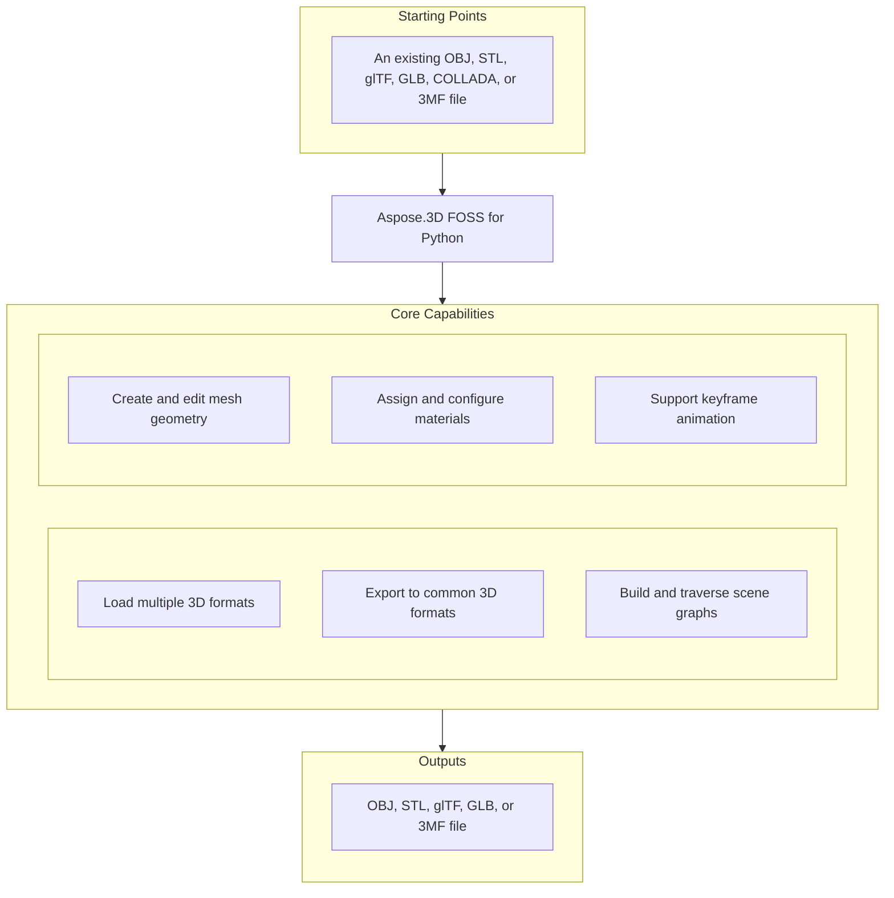

# Aspose.3D FOSS for Python

[](https://pypi.org/project/aspose-3d-foss/)  [](LICENSE) [](https://github.com/aspose-3d-foss/Aspose.3D-FOSS-for-Python/graphs/contributors)

[](https://products.aspose.org/3d/python/)

Aspose.3D FOSS for Python is a pure-Python, MIT-licensed library for working with 3D documents. It supports reading and writing OBJ, STL, glTF/GLB, COLLADA, and 3MF files through a `Scene`/`Node`/`Mesh` object graph. The library requires no native runtime or external SDK and is compatible with Python versions 3.7 through 3.12.

## Navigation

- [At a Glance](#at-a-glance)
- [Key Capabilities](#key-capabilities)
- [Installation](#installation)
- [Dependencies](#dependencies)
- [Quick Start](#quick-start)
- [Additional Examples](#additional-examples)
- [API Reference](#api-reference)
- [Documentation & Resources](#documentation--resources)
- [Scope and Limitations](#scope-and-limitations)
- [Development and Testing](#development-and-testing)
- [License](#license)

## At a Glance



## Key Capabilities

- **Load multiple 3D formats.** Read `.obj`, `.stl`, `.gltf`, `.glb`, `.dae`, and `.3mf` files using `Scene.open`, which auto-detects the format from the file extension or an explicit `FileFormat` instance.
- **Export to common 3D formats.** Export scenes to `.obj`, `.stl`, `.gltf`, `.glb`, and `.3mf` using `Scene.save` with format-specific save options such as `GltfSaveOptions` and `ThreeMfSaveOptions`.
- **Build and traverse scene graphs.** Build and traverse a scene graph using `Node.create_child_node`, `Node.add_entity`, and `Node.child_nodes`, where each node carries an independent `Transform` and can hold an `Entity`.
- **Create and edit mesh geometry.** Create and edit mesh geometry directly through `Mesh.control_points` and `Mesh.create_polygon`, or generate editable meshes from primitives like `Box` and `Sphere` using their `to_mesh` method.
- **Assign and configure materials.** Assign `LambertMaterial`, `PhongMaterial`, or `PbrMaterial` to nodes and configure diffuse, metallic, and roughness properties to control rendering appearance.
- **Support keyframe animation.** Construct keyframe animations using `AnimationClip`, `AnimationNode`, and `KeyframeSequence`, and store skeletal bind-pose data with `Pose`.

## Installation

Install the published package from PyPI (`aspose-3d-foss`, version 26.1.0):

```bash
pip install aspose-3d-foss
```

To work from a source checkout instead, install the clone with pip:

```bash
git clone https://github.com/aspose-3d-foss/Aspose.3D-FOSS-for-Python.git
cd Aspose.3D-FOSS-for-Python
pip install .
```

Verify the install:

```bash
python -c "import aspose.threed"
```

The package supports Python 3.7, 3.8, 3.9, 3.10, 3.11, and 3.12 and declares `python_requires` as `>=3.7`.

## Dependencies

### Required Package Dependencies

No required third-party package dependencies; in `setup.py`, the `install_requires` list is empty.

### Native and System Requirements

- Requires Python 3.7 or later (`python_requires=">=3.7"` in `setup.py`).

### Development Dependencies

- `pytest>=7.0.0` (extra `dev`)

## Quick Start

Import an existing 3D file and inspect its geometry by reading the scene and traversing its nodes.

```python
from aspose.threed import Scene
from aspose.threed.entities import Box
from aspose.threed.shading import LambertMaterial
from aspose.threed.utilities import Vector3

scene = Scene()
box = Box(length=2.0, width=1.0, height=1.0)
material = LambertMaterial()
material.diffuse_color = Vector3(0.2, 0.6, 0.9)

scene.root_node.create_child_node("Crate", entity=box.to_mesh(), material=material)
scene.save("crate.gltf")
```

Build a 3D scene from scratch using primitives, assign materials, and export it to a standard format.

```python
from aspose.threed import Scene
from aspose.threed.entities import Sphere
from aspose.threed.shading import PbrMaterial
from aspose.threed.utilities import Vector3

scene = Scene()
sphere = Sphere()
material = PbrMaterial(albedo=Vector3(0.8, 0.1, 0.1))
material.metallic_factor = 0.9
material.roughness_factor = 0.2

scene.root_node.create_child_node("Ball", entity=sphere.to_mesh(), material=material)
scene.save("ball.stl")
```

## Additional Examples

The following examples demonstrate converting between formats, assigning materials, and exporting meshes to common 3D file formats.

### Export a mesh with a PBR material to text-based glTF and inspect the material JSON

```python
import io
import json
from aspose.threed import Scene, FileFormat
from aspose.threed.entities import Mesh
from aspose.threed.utilities import Vector3, Vector4
from aspose.threed.formats.gltf import GltfSaveOptions
from aspose.threed.shading import PbrMaterial

scene = Scene()
mesh = Mesh("TestMesh")
mesh.control_points.add(Vector4(0.0, 0.0, 0.0, 1.0))
mesh.control_points.add(Vector4(1.0, 0.0, 0.0, 1.0))
mesh.control_points.add(Vector4(0.0, 1.0, 0.0, 1.0))
mesh.create_polygon(0, 1, 2)

albedo = Vector3(0.8, 0.2, 0.3)
material = PbrMaterial("RedMaterial", albedo)
material.metallic_factor = 0.5
material.roughness_factor = 0.7

node = scene.root_node.create_child_node("TestNode")
node.entity = mesh
node.material = material

stream = io.BytesIO()
# Pass the detected FileFormat into the constructor explicitly: unlike
# StlFormat, GltfFormat.create_save_options() does not set file_format on the
# options it returns, and a bare stream (no filename) gives scene.save()
# nothing else to detect the format from.
options = GltfSaveOptions(FileFormat.get_format_by_extension(".gltf"))
options.binary_mode = False
scene.save(stream, options)

stream.seek(0)
gltf_data = json.loads(stream.read().decode("utf-8"))
print(gltf_data["materials"][0]["pbrMetallicRoughness"])
```

<details>
<summary>View Additional Examples</summary>

### Export a triangle mesh to ASCII STL using an in-memory string stream

```python
import io
from aspose.threed import Scene, FileFormat
from aspose.threed.entities import Mesh
from aspose.threed.utilities import Vector4

scene = Scene()
mesh = Mesh("triangle")
mesh.control_points.add(Vector4(0.0, 0.0, 0.0, 1.0))
mesh.control_points.add(Vector4(1.0, 0.0, 0.0, 1.0))
mesh.control_points.add(Vector4(1.0, 1.0, 0.0, 1.0))
mesh.create_polygon(0, 1, 2)

node = scene.root_node.create_child_node("triangle_node")
node.entity = mesh

stream = io.StringIO()
# Use FileFormat.get_format_by_extension(...).create_save_options() rather than
# StlSaveOptions() directly: a default-constructed options object has no
# file_format set, and scene.save() cannot infer the format from a bare stream
# (only filename-based saves fall back to extension detection).
options = FileFormat.get_format_by_extension(".stl").create_save_options()
options.binary_mode = False
scene.save(stream, options)
print(stream.getvalue())
```

### Triangulate a `Box` primitive and count its control points

```python
from aspose.threed.entities import Box

box = Box(10, 20, 30)
mesh = box.to_mesh()
print(f"Control points: {len(mesh.control_points)}")
```

### Build a cube mesh and export it to 3MF without compression

```python
import io
from aspose.threed import Scene
from aspose.threed.entities import Mesh
from aspose.threed.utilities import Vector4
from aspose.threed.formats import ThreeMfSaveOptions

scene = Scene()
mesh = Mesh("cube")
for point in [
    Vector4(0, 0, 0, 1), Vector4(1, 0, 0, 1), Vector4(1, 1, 0, 1), Vector4(0, 1, 0, 1),
    Vector4(0, 0, 1, 1), Vector4(1, 0, 1, 1), Vector4(1, 1, 1, 1), Vector4(0, 1, 1, 1),
]:
    mesh.control_points.add(point)

mesh.create_polygon(0, 1, 2)
mesh.create_polygon(0, 2, 3)
mesh.create_polygon(4, 7, 6)
mesh.create_polygon(4, 6, 5)
mesh.create_polygon(0, 4, 5)
mesh.create_polygon(0, 5, 1)
mesh.create_polygon(2, 6, 7)
mesh.create_polygon(2, 7, 3)
mesh.create_polygon(0, 3, 7)
mesh.create_polygon(0, 7, 4)
mesh.create_polygon(1, 5, 6)
mesh.create_polygon(1, 6, 2)

node = scene.root_node.create_child_node("cube")
node.entity = mesh

stream = io.BytesIO()
options = ThreeMfSaveOptions()
options.enable_compression = False
scene.save(stream, options)
```

</details>

## API Reference

The aspose-3d-foss package exposes `aspose.threed.Scene` as the primary entry point for loading, saving, and manipulating 3D scenes, and `aspose.threed.Node` as the core container for scene graph elements, transforms, and entities. `Scene` provides high-level operations like `Scene.open` and `Scene.save`, while `Node` exposes `Scene.root_node`, child nodes, and their associated `Transform` and `Mesh` components.

The verified public surface has 337 types.

<details>
<summary>View the Complete Public API Surface</summary>

### Core API

| Class | Description |
| --- | --- |
| `A3DObject` | The A3DObject class represents a base object in Aspose.3D FOSS for Python that supports named properties and can be queried for property values using its name, properties, get_property, set_property, find_property, and remove_property methods. |
| `AnimationChannel` | The AnimationChannel class represents a single channel of animation data in Aspose.3D FOSS for Python, defined by its keyframe_sequence, default_value, and component_type. |
| `AnimationClip` | The AnimationClip class represents a container for animation data in Aspose.3D FOSS for Python, holding multiple animations, a description, start and stop times, and supporting named properties. |
| `AnimationNode` | The AnimationNode class represents a node in an animation hierarchy in Aspose.3D FOSS for Python, supporting named properties, sub-animations, bind points, and keyframe sequences. |
| `ArrayListAdapter` | Adapter class that wraps List[T] and implements IArrayList[T]. |
| `AssetInfo` | The AssetInfo class represents metadata about a 3D asset in Aspose.3D FOSS for Python, including author, title, creation time, coordinate system, and unit scale factor. |
| `Axis` | The coordinate axis. |
| `AxisSystem` | Axis system is an combination of coordinate system, up vector and front vector. |
| `BindPoint` | The BindPoint class represents a binding point for animation channels in Aspose.3D FOSS for Python, associated with a property and supporting named properties and keyframe sequences. |
| `BonePose` | The BonePose class represents the pose of a bone in Aspose.3D FOSS for Python, defined by its transformation matrix, whether it is local, and its associated node. |
| `BoundingBox2D` | The axis-aligned bounding box for Vector2 |
| `BoundingBoxExtent` | The extent of the bounding box |
| `Box` | The Box class represents a box primitive in Aspose.3D FOSS for Python, defined by its length, height, and height segments. |
| `Camera` | The Camera class represents a camera entity in Aspose.3D FOSS for Python, inheriting from Entity and used for rendering views. |
| `Circle` | The Circle class represents a circle primitive in Aspose.3D FOSS for Python, defined as a planar closed curve. |
| `ComposeOrder` | The order to compose transform matrix |
| `CoordinateSystem` | The left handed or right handed coordinate system. |
| `Curve` | The Curve class represents a curve entity in Aspose.3D FOSS for Python, used to define parametric or piecewise linear geometry. |
| `CustomObject` | The CustomObject class represents a user-defined object in Aspose.3D FOSS for Python, extending A3DObject with custom behavior. |
| `Cylinder` | The Cylinder class represents a cylinder primitive in Aspose.3D FOSS for Python, defined by its radius and height. |
| `Dish` | The Dish class represents a dish primitive in Aspose.3D FOSS for Python, a portion of a sphere defined by its radius and angular extent. |
| `Ellipse` | The Ellipse class represents an ellipse primitive in Aspose.3D FOSS for Python, defined by its major and minor radii. |
| `Entity` | The Entity class represents a renderable or manipulable object in Aspose.3D FOSS for Python, such as a mesh or geometry, contained within a scene node. |
| `ExportException` | Exceptions when Aspose.3D failed to export the scene to file. |
| `Extrapolation` | The Extrapolation class represents extrapolation behavior for animation curves in Aspose.3D FOSS for Python. |
| `FMatrix4` | Matrix 4x4 with all component in float type |
| `FileContentType` | File content type |
| `FileFormat` | The FileFormat class represents a 3D file format in Aspose.3D FOSS for Python, supporting format detection by extension and format-specific operations. |
| `FileFormatType` | File format type |
| `Frustum` | The Frustum class represents a frustum primitive in Aspose.3D FOSS for Python, commonly used for view volumes and clipping. |
| `Geometry` | The Geometry class represents geometric data in Aspose.3D FOSS for Python, such as vertices and polygons, used by renderable entities. |
| `GlobalTransform` | The GlobalTransform class represents a global transformation matrix in Aspose.3D FOSS for Python, used to position and orient objects in 3D space. |
| `Group` | A Group represents the logical relationships of Node. |
| `INamedObject` | The INamedObject class represents an object in Aspose.3D FOSS for Python that can be identified by a name. |
| `IOExtension` | Utilities to write matrix/vector to binary writer |
| `ImageRenderOptions` | The ImageRenderOptions class represents rendering options for image output in Aspose.3D FOSS for Python, supporting settings such as compression and material properties. |
| `ImportException` | Exception when Aspose.3D failed to open the specified source. |
| `KeyFrame` | The KeyFrame class represents a single keyframe in Aspose.3D FOSS for Python, containing a value and time stamp for animation. |
| `KeyframeSequence` | The KeyframeSequence class represents a sequence of keyframes in Aspose.3D FOSS for Python, used to define animation curves. |
| `Light` | The Light class represents a light entity in Aspose.3D FOSS for Python, inheriting from Camera and used to illuminate scenes. |
| `LinearExtrusion` | The LinearExtrusion class represents a linear extrusion entity in Aspose.3D FOSS for Python, created by extruding a profile along a straight path. |
| `MathUtils` | A set of useful mathematical utilities. |
| `Mesh` | The Mesh class represents a polygonal mesh in Aspose.3D FOSS for Python, containing vertices, polygons, and supporting operations such as to_mesh and control_points. |
| `Node` | The Node class represents a node in the scene hierarchy in Aspose.3D FOSS for Python, containing an entity, child nodes, and transformation data. |
| `ParseException` | Exception when Aspose.3D failed to parse the input. |
| `Plane` | The Plane class represents a plane primitive in Aspose.3D FOSS for Python, defined as an infinite flat surface. |
| `PolygonBuilder` | The PolygonBuilder class represents a utility in Aspose.3D FOSS for Python for constructing polygonal meshes programmatically. |
| `Pose` | The Pose class represents a named pose in Aspose.3D FOSS for Python, used to store and apply transformation states to nodes. |
| `Primitive` | The Primitive class represents a basic geometric primitive in Aspose.3D FOSS for Python, such as a box, cylinder, or sphere. |
| `Property` | The Property class represents a named property in Aspose.3D FOSS for Python, used to store metadata or configuration values. |
| `PropertyCollection` | The PropertyCollection class represents a collection of named properties in Aspose.3D FOSS for Python, used to manage object metadata. |
| `PropertyFlags` | Property's flags |
| `Rect` | A class to represent the rectangle |
| `RelativeRectangle` | Relative rectangle |
| `RotationOrder` | The order controls which rx ry rz are applied in the transformation matrix. |
| `Scene` | The Scene class represents a 3D scene in Aspose.3D FOSS for Python, containing nodes, entities, and animation data. |
| `SceneObject` | The SceneObject class represents an object in a 3D scene in Aspose.3D FOSS for Python, supporting named properties and scene hierarchy. |
| `SemanticAttribute` | Allow user to use their own structure for static declaration of VertexDeclaration |
| `Sphere` | The Sphere class represents a sphere primitive in Aspose.3D FOSS for Python. |
| `Transform` | The Transform class encapsulates geometric transformations such as translation, rotation, and scaling for nodes in Aspose.3D FOSS for Python. |
| `TransformBuilder` | The TransformBuilder is used to build transform matrix by a chain of transformations. |
| `TrialException` | This is raised in Scene.Open/Scene.Save when no licenses are applied. |
| `Vertex` | Vertex reference, used to access the raw vertex in TriMesh. |
| `VertexDeclaration` | The declaration of a custom defined vertex's structure |
| `VertexField` | Vertex's field memory layout description. |
| `VertexFieldDataType` | Vertex field's data type |
| `VertexFieldSemantic` | The semantic of the vertex field |
| `Bone` | The Bone class represents a bone used in skeletal animation within Aspose.3D FOSS for Python. |
| `BoneLinkMode` | The BoneLinkMode class defines enumeration values for bone linking behavior in Aspose.3D FOSS for Python. |
| `Deformer` | The Deformer class serves as the base class for mesh deformation operations in Aspose.3D FOSS for Python. |
| `MorphTargetChannel` | The MorphTargetChannel class manages weights and targets for morph target animation in Aspose.3D FOSS for Python. |
| `MorphTargetDeformer` | The MorphTargetDeformer class applies morph target deformations to meshes in Aspose.3D FOSS for Python. |
| `SkinDeformer` | The SkinDeformer class applies skinning deformations using bone weights in Aspose.3D FOSS for Python. |
| `ApertureMode` | Camera aperture modes. |
| `BooleanOperand` | This class encapsulates the transformed mesh as Boolean operation's operand. |
| `BooleanOperation` | The BooleanOperation class defines enumeration values for boolean operations on geometries in Aspose.3D FOSS for Python. |
| `BooleanOperator` | Boolean operator allows you to apply Boolean operation on two IMeshConvertible instances. |
| `CompositeCurve` | A CompositeCurve is consisting of several curve segments. |
| `CurveDimension` | The CurveDimension class specifies the dimensionality of curves in Aspose.3D FOSS for Python. |
| `EndPoint` | The end point to trim the curve, can be a parameter value or a Cartesian point. |
| `HalfSpace` | HalfSpace represents a infinity space which is split by a plane, this can be used with BooleanOperator |
| `IIndexedVertexElement` | The IIndexedVertexElement interface represents a vertex element with indexed data in Aspose.3D FOSS for Python. |
| `IMeshConvertible` | Entities that implemented this interface can be converted to Mesh |
| `IOrientable` | Orientable entities shall implement this interface. |
| `LightType` | Light types. |
| `Line` | A polyline is a path defined by a set of points with control_points, and connected by segments. |
| `MappingMode` | The MappingMode class defines enumeration values for texture mapping modes in Aspose.3D FOSS for Python. |
| `NurbsCurve` | The NurbsCurve class represents a NURBS curve geometry in Aspose.3D FOSS for Python. |
| `NurbsDirection` | The NurbsDirection class defines properties for a NURBS direction in Aspose.3D FOSS for Python. |
| `NurbsSurface` | The NurbsSurface class represents a NURBS surface geometry in Aspose.3D FOSS for Python. |
| `NurbsType` | The NurbsType class defines enumeration values for NURBS curve types in Aspose.3D FOSS for Python. |
| `Patch` | The Patch class represents a patch geometry in Aspose.3D FOSS for Python. |
| `PatchDirection` | The PatchDirection class defines enumeration values for patch directions in Aspose.3D FOSS for Python. |
| `PatchDirectionType` | The PatchDirectionType class defines enumeration values for patch direction types in Aspose.3D FOSS for Python. |
| `PointCloud` | The PointCloud class represents a collection of points without connectivity in Aspose.3D FOSS for Python. |
| `InvalidOperationException` | The InvalidOperationException class is raised when an invalid operation is performed during polygon construction in Aspose.3D FOSS for Python. |
| `PolygonModifier` | The PolygonModifier class provides static methods to modify polygonal meshes in Aspose.3D FOSS for Python. |
| `ProjectionType` | Camera's projection types. |
| `Pyramid` | Parameterized pyramid. |
| `RectangularTorus` | Parameterized rectangular torus entity. |
| `ReferenceMode` | The ReferenceMode class defines enumeration values for reference modes in Aspose.3D FOSS for Python. |
| `RevolvedAreaSolid` | RevolvedAreaSolid entity. |
| `RotationMode` | The frustum's rotation mode. |
| `Shape` | Base class for all shape entities. |
| `Skeleton` | The Skeleton is mainly used by CAD software to help designer to manipulate the transformation of skeletal structure, it's usually useless outside the CAD softwares. |
| `SkeletonType` | Skeleton type enum. |
| `SplitMeshPolicy` | Share vertex/control point data between sub-meshes or each sub-mesh has its own compacted data. |
| `SweptAreaSolid` | SweptAreaSolid entity. |
| `TextureMapping` | The TextureMapping class defines enumeration values for texture mapping types in Aspose.3D FOSS for Python. |
| `Torus` | Parameterized torus entity. |
| `TransformedCurve` | TransformedCurve entity. |
| `TriMesh` | TriMesh is a triangle mesh that stores triangles. |
| `TrimmedCurve` | TrimmedCurve entity. |
| `VertexElement` | The VertexElement class represents a generic vertex element in Aspose.3D FOSS for Python. |
| `VertexElementBinormal` | The VertexElementBinormal class represents binormal data for vertices in Aspose.3D FOSS for Python. |
| `VertexElementDoublesTemplate` | A helper class for defining concrete implementations. |
| `VertexElementEdgeCrease` | Defines the edge crease values for specified components. |
| `VertexElementFVector` | The VertexElementFVector class represents a vertex element containing floating-point vectors in Aspose.3D FOSS for Python. |
| `VertexElementHole` | Defines the hole information for specified components. |
| `VertexElementIntsTemplate` | A helper class for defining concrete implementations with int data. |
| `VertexElementMaterial` | Defines the material for specified components. |
| `VertexElementNormal` | The VertexElementNormal class represents normal vectors for vertices in Aspose.3D FOSS for Python. |
| `VertexElementPolygonGroup` | Defines the polygon group for specified components. |
| `VertexElementSmoothingGroup` | The VertexElementSmoothingGroup class represents smoothing group data for vertices in Aspose.3D FOSS for Python. |
| `VertexElementSpecular` | Defines the specular color for specified components. |
| `VertexElementTangent` | The VertexElementTangent class represents tangent vectors for vertices in Aspose.3D FOSS for Python. |
| `VertexElementTemplate` | A helper class for defining concrete implementations of vertex elements with typed data. |
| `VertexElementType` | The VertexElementType class defines enumeration values for vertex element types in Aspose.3D FOSS for Python. |
| `VertexElementUV` | The VertexElementUV class represents UV texture coordinates for vertices in Aspose.3D FOSS for Python. |
| `VertexElementUserData` | Defines the user data for specified components. |
| `VertexElementVector4` | Defines the vector4 data for specified components. |
| `VertexElementVertexColor` | The VertexElementVertexColor class represents per-vertex color data in Aspose.3D FOSS for Python. |
| `VertexElementVertexCrease` | Defines the vertex crease values for specified components. |
| `VertexElementVisibility` | Defines the visibility for specified components. |
| `VertexElementWeight` | Defines the weight for specified components. |
| `A3dwSaveOptions` | Save options for A3DW |
| `AmfSaveOptions` | Save options for AMF |
| `BasicLoadOptions` | Simple LoadOptions subclass for basic loading options. |
| `ColladaLoadOptions` | Load options for Collada |
| `ColladaSaveOptions` | Save options for collada |
| `ColladaTransformStyle` | The node's transformation style of node |
| `Discreet3dsLoadOptions` | Load options for Discreet 3DS |
| `Discreet3dsSaveOptions` | Save options for Discreet 3DS |
| `DracoCompressionLevel` | Compression level for draco file |
| `DracoFormat` | Google Draco format |
| `DracoSaveOptions` | Save options for Draco |
| `Exporter` | The Exporter class provides functionality to export scenes to various 3D formats in Aspose.3D FOSS for Python. |
| `FbxLoadOptions` | Load options for FBX |
| `FbxSaveOptions` | Save options for FBX |
| `FormatDetector` | The FormatDetector class detects the format of a 3D file in Aspose.3D FOSS for Python. |
| `GltfEmbeddedImageFormat` | Embedded image format for GLTF |
| `formats.GltfLoadOptions` | Load options for glTF |
| `formats.GltfSaveOptions` | Save options for glTF |
| `Html5SaveOptions` | Save options for HTML5 |
| `IOConfig` | The IOConfig class holds input/output configuration options for file operations in Aspose.3D FOSS for Python. |
| `IOService` | The IOService class provides core input and output services for file handling in Aspose.3D FOSS for Python. |
| `Importer` | The Importer class provides functionality to import scenes from various 3D formats in Aspose.3D FOSS for Python. |
| `JtLoadOptions` | Load options for JT |
| `LoadOptions` | LoadOptions configures how 3D scenes are loaded from files or streams. |
| `Microsoft3MFFormat` | Microsoft 3MF format |
| `Microsoft3MFSaveOptions` | Save options for Microsoft 3MF |
| `formats.ObjLoadOptions` | Load options for OBJ |
| `formats.ObjSaveOptions` | Save options for OBJ |
| `PdfFormat` | Adobe's Portable Document Format |
| `PdfLightingScheme` | Lighting scheme for PDF export |
| `PdfLoadOptions` | Load options for PDF |
| `PdfRenderMode` | Render mode for PDF export |
| `PdfSaveOptions` | Save options for PDF |
| `Plugin` | Plugin serves as the base class for format plugins that provide import, export, and format detection capabilities. |
| `PlyFormat` | PLY format |
| `PlyLoadOptions` | Load options for PLY |
| `PlySaveOptions` | Save options for PLY |
| `RvmFormat` | RVM format |
| `RvmLoadOptions` | Load options for RVM |
| `RvmSaveOptions` | Save options for RVM |
| `SaveOptions` | SaveOptions configures how 3D scenes are saved to files or streams. |
| `formats.StlLoadOptions` | Load options for STL |
| `formats.StlSaveOptions` | Save options for STL |
| `ThreeMfFormat` | ThreeMfFormat represents the 3MF file format and supports importing and exporting 3D models with metadata. |
| `ThreeMfLoadOptions` | ThreeMfLoadOptions provides configuration options specific to loading 3MF files. |
| `ThreeMfSaveOptions` | ThreeMfSaveOptions provides configuration options specific to saving 3MF files, including compression and coordinate system settings. |
| `U3dLoadOptions` | Load options for U3D |
| `U3dSaveOptions` | Save options for U3D |
| `UsdSaveOptions` | Save options for USD |
| `XLoadOptions` | Load options for X format |
| `ColladaExporter` | ColladaExporter writes 3D scenes to COLLADA files in the DAE format. |
| `ColladaFormat` | ColladaFormat defines the COLLADA file format and its supported properties such as extensions and content type. |
| `ColladaFormatDetector` | ColladaFormatDetector identifies whether a file is a valid COLLADA format by inspecting its content. |
| `ColladaImporter` | ColladaImporter reads 3D scenes from COLLADA files in the DAE format. |
| `ColladaPlugin` | ColladaPlugin provides access to COLLADA format support including importers, exporters, and format detectors. |
| `FbxExporter` | FbxExporter writes 3D scenes to Autodesk FBX files. |
| `FbxFormat` | FbxFormat defines the Autodesk FBX file format and its supported properties such as extensions and content type. |
| `FbxFormatDetector` | FbxFormatDetector identifies whether a file is a valid FBX format by inspecting its content. |
| `FbxImporter` | FbxImporter reads 3D scenes from Autodesk FBX files. |
| `FbxPlugin` | FbxPlugin provides access to FBX format support including importers, exporters, and format detectors. |
| `BinaryTokenizer` | BinaryTokenizer parses binary FBX files into structured tokens for further processing. |
| `binary_tokenizer.Token` | Token represents a single parsed element from a binary FBX file. |
| `binary_tokenizer.TokenType` | TokenType defines the categories of tokens that can appear in a binary FBX file. |
| `FbxElement` | FbxElement models a single element in the hierarchical structure of an FBX file. |
| `FbxParser` | FbxParser reads and interprets the internal structure of FBX files. |
| `FbxScope` | FbxScope defines a lexical scope within the FBX file structure for organizing elements. |
| `FbxTokenizer` | FbxTokenizer breaks down text-based FBX files into a sequence of tokens. |
| `tokenizer.Token` | Token represents a single lexical unit in a text-based FBX file. |
| `tokenizer.TokenType` | TokenType enumerates the possible kinds of tokens in a text-based FBX file. |
| `GltfExporter` | GltfExporter writes 3D scenes to glTF files in either JSON or binary format. |
| `GltfFormat` | GltfFormat defines the glTF file format and its supported properties such as extensions and content type. |
| `GltfFormatDetector` | GltfFormatDetector identifies whether a file is a valid glTF format by inspecting its content. |
| `GltfImporter` | GltfImporter reads 3D scenes from glTF files. |
| `gltf.GltfLoadOptions` | GltfLoadOptions provides configuration options specific to loading glTF files. |
| `GltfPlugin` | GltfPlugin provides access to glTF format support including importers, exporters, and format detectors. |
| `gltf.GltfSaveOptions` | GltfSaveOptions provides configuration options specific to saving glTF files. |
| `ObjExporter` | ObjExporter writes 3D scenes to Wavefront OBJ files. |
| `ObjFormat` | ObjFormat defines the Wavefront OBJ file format and its supported properties such as extensions and content type. |
| `ObjFormatDetector` | ObjFormatDetector identifies whether a file is a valid OBJ format by inspecting its content. |
| `ObjImporter` | ObjImporter reads 3D scenes from Wavefront OBJ files. |
| `obj.ObjLoadOptions` | ObjLoadOptions provides configuration options specific to loading OBJ files. |
| `ObjPlugin` | ObjPlugin provides access to OBJ format support including importers, exporters, and format detectors. |
| `obj.ObjSaveOptions` | ObjSaveOptions provides configuration options specific to saving OBJ files. |
| `StlExporter` | StlExporter writes 3D scenes to STL files for 3D printing and CAD applications. |
| `StlFormat` | StlFormat represents the STL file format and provides methods to detect, import, and export STL files, including support for binary and ASCII modes through its options. |
| `StlFormatDetector` | StlFormatDetector identifies whether a given input stream contains an STL file by inspecting its content. |
| `StlImporter` | StlImporter reads STL files and converts them into a scene graph representation. |
| `stl.StlLoadOptions` | StlLoadOptions configures how STL files are loaded, including options to flip the coordinate system and apply a uniform scale factor. |
| `StlPlugin` | StlPlugin acts as a plugin entry point for STL format support, providing access to importers, exporters, format detectors, and load/save options. |
| `stl.StlSaveOptions` | StlSaveOptions controls how STL files are saved, supporting binary mode, coordinate system flipping, and uniform scaling. |
| `ThreeMfExporter` | ThreeMfExporter writes scene graphs to 3MF format files. |
| `ThreeMfFormatDetector` | ThreeMfFormatDetector determines whether an input stream contains a 3MF file by analyzing its content. |
| `ThreeMfImporter` | ThreeMfImporter parses 3MF files and constructs an internal scene representation. |
| `ThreeMfPlugin` | ThreeMfPlugin serves as the plugin interface for 3MF format support, exposing importers, exporters, format detectors, and configuration options. |
| `ArbitraryProfile` | This class allows you to construct a 2D profile directly from arbitrary curve. |
| `CShape` | IFC compatible C-shape profile that defined by parameters. |
| `CenterLineProfile` | IFC compatible center line profile. |
| `CircleShape` | IFC compatible circle profile. |
| `EllipseShape` | IFC compatible ellipse profile. |
| `FontFile` | Font file contains definitions for glyphs, this is used to create text profile. |
| `HShape` | IFC compatible H-shape profile. |
| `HollowCircleShape` | IFC compatible hollow circle profile. |
| `HollowRectangleShape` | IFC compatible hollow rectangular shape with both inner/outer rounding corners. |
| `LShape` | IFC compatible L-shape profile that defined by parameters. |
| `MirroredProfile` | IFC compatible mirror profile. |
| `ParameterizedProfile` | The base class of all parameterized profiles. |
| `Profile` | 2D Profile in xy plane. |
| `RectangleShape` | IFC compatible rectangle profile. |
| `TShape` | IFC compatible T-shape defined by parameters. |
| `Text` | Text profile, this profile describes contours using font and text. |
| `TrapeziumShape` | IFC compatible Trapezium shape defined by parameters. |
| `UShape` | IFC compatible U-shape defined by parameters. |
| `ZShape` | IFC compatible Z-shape profile that defined by parameters. |
| `BlendFactor` | Blend factor specify pixel arithmetic. |
| `CompareFunction` | Compare function for depth/stencil testing. |
| `CubeFace` | Cube face enumeration. |
| `CullFaceMode` | Cull face mode for face culling. |
| `DescriptorSetUpdater` | Descriptor set updater for shader resources. |
| `DrawOperation` | Draw operation type. |
| `DriverException` | Exception thrown when rendering driver fails. |
| `EntityRenderer` | Base class for rendering entities. |
| `EntityRendererFeatures` | Features supported by an entity renderer. |
| `EntityRendererKey` | The key of registered entity renderer. |
| `FrontFace` | Front face winding order. |
| `GLSLSource` | GLSL shader source. |
| `IBuffer` | Interface for vertex/index buffer. |
| `ICommandList` | Interface for command list. |
| `IDescriptorSet` | Interface for descriptor set. |
| `IIndexBuffer` | Interface for index buffer. |
| `IPipeline` | Interface for graphics pipeline. |
| `IRenderQueue` | Interface for render queue. |
| `IRenderTarget` | Interface for render target. |
| `IRenderTexture` | Interface for render texture. |
| `IRenderWindow` | Interface for render window. |
| `ITexture1D` | Interface for 1D texture. |
| `ITexture2D` | Interface for 2D texture. |
| `ITextureCodec` | Interface for texture codec. |
| `ITextureCubemap` | Interface for cubemap texture. |
| `ITextureDecoder` | Interface for texture decoder. |
| `ITextureEncoder` | Interface for texture encoder. |
| `ITextureUnit` | Interface for texture unit. |
| `IVertexBuffer` | Interface for vertex buffer. |
| `IndexDataType` | Data type for indices. |
| `InitializationException` | Exception thrown when rendering initialization fails. |
| `PixelFormat` | Pixel format for render targets. |
| `PixelMapMode` | Pixel mapping mode. |
| `PixelMapping` | Pixel mapping configuration. |
| `PolygonMode` | Polygon rendering mode. |
| `PostProcessing` | Post-processing effect. |
| `PresetShaders` | Predefined shaders. |
| `PushConstant` | Push constant for shaders. |
| `RenderFactory` | RenderFactory creates all resources that represented in rendering pipeline. |
| `RenderParameters` | Parameters for rendering. |
| `RenderQueueGroupId` | Render queue group ID. |
| `RenderResource` | Base class for render resources. |
| `RenderStage` | Render stage in the pipeline. |
| `RenderState` | Render state configuration. |
| `Renderer` | The context about renderer. |
| `RendererVariableManager` | Manages renderer variables. |
| `SPIRVSource` | SPIRV shader source. |
| `ShaderException` | Exception thrown when shader compilation/linking fails. |
| `ShaderProgram` | Shader program. |
| `ShaderSet` | Set of shaders for rendering. |
| `ShaderSource` | Shader source code. |
| `ShaderStage` | Shader stage. |
| `ShaderVariable` | Shader variable. |
| `StencilAction` | Stencil action. |
| `StencilState` | Stencil state configuration. |
| `TextureCodec` | Texture codec. |
| `TextureData` | Texture data. |
| `TextureType` | Texture type. |
| `Viewport` | Viewport for rendering. |
| `WindowHandle` | Window handle for render window. |
| `AlphaSource` | Source of alpha channel for textures. |
| `LambertMaterial` | LambertMaterial defines a non-shiny material model with configurable ambient, diffuse, emissive, and transparency properties. |
| `Material` | Material is the base class for all shading models and supports texture assignment and retrieval. |
| `PbrMaterial` | PbrMaterial implements a physically based rendering model with albedo, metallic, roughness, emissive, normal, and occlusion properties. |
| `PbrSpecularMaterial` | Material for physically based rendering based on diffuse color/specular/glossiness. |
| `PhongMaterial` | PhongMaterial extends LambertMaterial with specular reflection properties including shininess, specular color, and reflection factor. |
| `ShaderMaterial` | A shader material allows to describe the material by external rendering engine or shader language. |
| `ShaderTechnique` | A technique in shader material describes the concrete rendering details. |
| `Texture` | This class defines the texture from an external file. |
| `TextureBase` | Base class for all texture types. |
| `TextureFilter` | Texture filter type. |
| `TextureSlot` | Texture slot name. |
| `WrapMode` | Wrap mode for texture coordinates. |
| `BoundingBox` | BoundingBox represents an axis-aligned bounding box in 3D space with a center point and extent. |
| `FVector2` | FVector2 represents a two-dimensional vector of single-precision floating-point components. |
| `FVector3` | FVector3 represents a three-dimensional vector of single-precision floating-point components. |
| `FVector4` | FVector4 represents a four-dimensional vector of single-precision floating-point components. |
| `FileSystem` | File system encapsulation. |
| `Matrix4` | Matrix4 represents a 4x4 transformation matrix used for 3D geometry operations. |
| `Quaternion` | Quaternion represents a unit quaternion used for 3D rotation operations. |
| `Vector2` | Vector2 represents a two-dimensional vector of double-precision floating-point components. |
| `Vector3` | Vector3 represents a three-dimensional vector of double-precision floating-point components. |
| `Vector4` | Vector4 represents a four-dimensional vector of double-precision floating-point components. |
| `Watermark` | Utility to encode/decode blind watermark to/from a mesh. |

#### Enumerations

| Enumeration | Description |
| --- | --- |
| `ExtrapolationType` | The ExtrapolationType class represents the enumeration of extrapolation modes for animation curves in Aspose.3D FOSS for Python. |
| `Interpolation` | The Interpolation class represents the enumeration of interpolation modes for animation keyframes in Aspose.3D FOSS for Python. |
| `PoseType` | The PoseType class represents the enumeration of pose types in Aspose.3D FOSS for Python, such as bind pose or rest pose. |
| `StepMode` | The StepMode class defines enumeration values for step mode settings in Aspose.3D FOSS for Python. |
| `WeightedMode` | The WeightedMode class defines enumeration values for weighted mode settings in Aspose.3D FOSS for Python. |

#### Detailed Member Reference

### Scene

`Scene` serves as the top-level container for 3D content, supporting `Scene.open` and `Scene.save` to load from or write to files, with `FileFormat` supporting formats like `FileFormat.WAVEFRONT_OBJ`, `FileFormat.GLTF2`, `FileFormat.FBX7400ASCII`, and `FileFormat.MICROSOFT_3MF_FORMAT`, and offering `Scene.create_animation_clip`, `Scene.animation_clips`, `Scene.sub_scenes`, `Scene.render`, and `Scene.clear` for scene management.

- `animation_clips`: Defined as `def animation_clips(self) -> List['AnimationClip']`.
- `asset_info`: Defined as `def asset_info(self) -> AssetInfo`.
- `clear`: Defined as `def clear(self)`.
- `create_animation_clip`: Defined as `def create_animation_clip(self, name: str) -> 'AnimationClip'`.
- `current_animation_clip`: Defined as `def current_animation_clip(self) -> Optional['AnimationClip']`.
- `from_file`: Defined as `def from_file(file_name: str)`.
- `get_animation_clip`: Defined as `def get_animation_clip(self, name: str) -> Optional['AnimationClip']`.
- `library`: Defined as `def library(self) -> List[CustomObject]`.
- `open`: Defined as `def open(self, file_or_stream, options=None)`.
- `poses`: Defined as `def poses(self) -> List`.
- `render`: Defined as `def render(self, camera, file_name_or_bitmap, size=None, format=None, options=None)`.
- `root_node`: Defined as `def root_node(self)`.
- `save`: Defined as `def save(self, file_or_stream, format_or_options=None)`.
- `sub_scenes`: Defined as `def sub_scenes(self) -> List['Scene']`.

### Node

`Node` represents an element in the scene graph, holding a `Transform` via `Node.transform`, optional `Mesh`-derived entities via `Node.entity`, and zero or more `Material` instances via `Node.material`, with methods like `Node.add_child_node`, `Node.get_child`, `Node.select_objects`, and `Node.evaluate_global_transform` for scene traversal and manipulation.

- `add_child_node`: Defined as `def add_child_node(self, node: 'Node')`.
- `add_entity`: Defined as `def add_entity(self, entity: 'Entity')`.
- `asset_info`: Defined as `def asset_info(self)`.
- `child_nodes`: Defined as `def child_nodes(self) -> List['Node']`.
- `create_child_node`: Defined as `def create_child_node(self, node_name: Optional[str]=None, entity=None, material=None) -> 'Node'`.
- `entities`: Defined as `def entities(self) -> List['Entity']`.
- `entity`: Defined as `def entity(self) -> Optional['Entity']`.
- `evaluate_global_transform`: Defined as `def evaluate_global_transform(self, with_geometric_transform: bool) -> Matrix4`.
- `excluded`: Defined as `def excluded(self) -> bool`.
- `get_bounding_box`: Defined as `def get_bounding_box(self) -> BoundingBox`.
- `get_child`: Defined as `def get_child(self, index_or_name)`.
- `get_entity`: Defined as `def get_entity(self, entity_type: type)`.
- `global_transform`: Defined as `def global_transform(self) -> GlobalTransform`.
- `material`: Defined as `def material(self) -> Optional['Material']`.
- `materials`: Defined as `def materials(self) -> List['Material']`.
- `merge`: Defined as `def merge(self, node: 'Node')`.
- `meta_datas`: Defined as `def meta_datas(self) -> List`.
- `parent_node`: Defined as `def parent_node(self) -> Optional['Node']`.
- `select_objects`: Defined as `def select_objects(self, path: str)`.
- `select_single_object`: Defined as `def select_single_object(self, path: str)`.
- `transform`: Defined as `def transform(self) -> Transform`.
- `visible`: Defined as `def visible(self) -> bool`.

### Mesh

`Mesh` provides geometric data through `control_points` and polygon definitions, with `PolygonBuilder` enabling programmatic mesh construction via member `create_polygon` and member `to_mesh`, supporting direct integration with `Node` entities.

- `control_points`: Defined as `def control_points(self) -> ArrayListAdapter[Vector4]`.
- `create_polygon`: Defined as `def create_polygon(self, *args)`.
- `difference`: Defined as `def difference(a: 'Mesh', b: 'Mesh') -> 'Mesh'`.
- `do_boolean`: Defined as `def do_boolean(op: BooleanOperation, a: 'Mesh', transform_a: Optional[Matrix4], b: 'Mesh', transform_b: Optional[Matrix4]) -> 'Mesh'`.
- `edges`: Defined as `def edges(self) -> ArrayListAdapter[int]`.
- `get_bounding_box`: Defined as `def get_bounding_box(self)`.
- `get_entity_renderer_key`: Defined as `def get_entity_renderer_key(self)`.
- `get_polygon_size`: Defined as `def get_polygon_size(self, index: int) -> int`.
- `intersect`: Defined as `def intersect(a: 'Mesh', b: 'Mesh') -> 'Mesh'`.
- `is_manifold`: Defined as `def is_manifold(self) -> bool`.
- `optimize`: Defined as `def optimize(self, vertex_elements: bool=False, tolerance_control_point: float=1e-09, tolerance_normal: float=1e-09, tolerance_uv: float=1e-09) -> 'Mesh'`.
- `polygon_count`: Defined as `def polygon_count(self) -> int`.
- `polygons`: Defined as `def polygons(self) -> List[List[int]]`.
- `to_mesh`: Defined as `def to_mesh(self) -> 'Mesh'`.
- `triangulate`: Defined as `def triangulate(self) -> 'Mesh'`.
- `union`: Defined as `def union(a: 'Mesh', b: 'Mesh') -> 'Mesh'`.

### shading

Shading support is exposed via `Node.material`, which holds material properties such as `diffuse_color`, `metallic_factor`, and `roughness_factor`, and integrates with the `aspose.threed.shading` module for advanced material definitions.

### AnimationClip

`AnimationClip` enables keyframe-based animation through `KeyframeSequence` and `AnimationNode`, with `Scene.create_animation_clip` and `Scene.current_animation_clip` managing animation state, and `AnimationClip` exposing member `KeyframeSequence` for time-based property interpolation.

- `animations`: Defined as `def animations(self) -> List['AnimationNode']`.
- `create_animation_node`: Defined as `def create_animation_node(self, node_name: str) -> 'AnimationNode'`.
- `description`: Defined as `def description(self) -> str`.
- `name`: Defined as `def name(self) -> str`.
- `properties`: Defined as `def properties(self)`.
- `start`: Defined as `def start(self) -> float`.
- `stop`: Defined as `def stop(self) -> float`.

</details>

## Documentation & Resources

- **[Getting started guide](https://docs.aspose.org/3d/python/)** — The getting started guide covers installation, walkthroughs, and feature guides for this library.
- **[How-to guides & FAQ](https://kb.aspose.org/3d/python/)** — The how-to guides and FAQ provide task-focused answers for common 3D-processing questions.
- **[Full API reference](https://reference.aspose.org/3d/python/)** — The full API reference offers the complete, browsable reference for all 305 public types. It covers all 337 verified public types; the [API Reference](#api-reference) section above covers the essentials.
- Found a bug or have a feature request? [Open an issue](https://github.com/aspose-3d-foss/Aspose.3D-FOSS-for-Python/issues).

## Scope and Limitations

Aspose.3D FOSS for Python supports reading and writing 3D models in formats such as OBJ, STL, glTF, and COLLADA, and provides core mesh and scene manipulation capabilities for the 3d family of formats.

- This library is limited to the 3d family of formats and does not support importing or exporting PDF, PLY, RVM, U3D, JT, AMF, HTML5, A3DW, USD, or Draco.
- COLLADA import works for `.dae` files, but COLLADA export is not reachable through `Scene.save`() because the exporter lookup fails before `ColladaExporter` is ever consulted.
- The `aspose.threed.render` module, including `Renderer`, `RenderFactory`, `Viewport`, and related classes, raises NotImplementedError — this library does not render scenes to images.
- `Texture` and `TextureBase` raise NotImplementedError on construction, so an image-backed texture cannot be created, although material color and factor properties work independently of texture assignment.
- `Mesh.do_boolean`(), `Mesh.union`(), `Mesh.difference`(), and `Mesh.intersect`() raise NotImplementedError — Boolean/CSG mesh operations are not implemented, even though `BooleanOperator` and `BooleanOperand` exist as configuration holders.
- NURBS curves and surfaces can be configured but not sampled or converted to a `Mesh` because `NurbsCurve.evaluate`() and `NurbsSurface.to_mesh`() raise NotImplementedError.

These limitations don't apply to [Aspose.3D for Python — Enterprise Edition](https://products.aspose.com/3d/python-net/). The commercial Aspose.3D FOSS for Python package extends this open-source offering with additional file format support, advanced rendering capabilities, and enterprise-grade support options.

## Development and Testing

The test suite covers 33 test files under tests/ and exercises OBJ, STL, glTF, COLLADA, and 3MF import/export, polygon triangulation, and format-detection behavior.

The suite covers 34 test files under `tests/`. Releases run through the [publish workflow](.github/workflows/publish.yml).

```bash
python3 -m pip install -e .
python3 -m unittest discover tests/
```

```bash
python -m unittest tests.test_obj_importer
```

## License

This project is licensed under the [MIT License](LICENSE). The MIT License permits use, copying, modification, distribution, sublicensing, and commercial use, provided its copyright and permission notice are retained. The software is provided without warranty.
