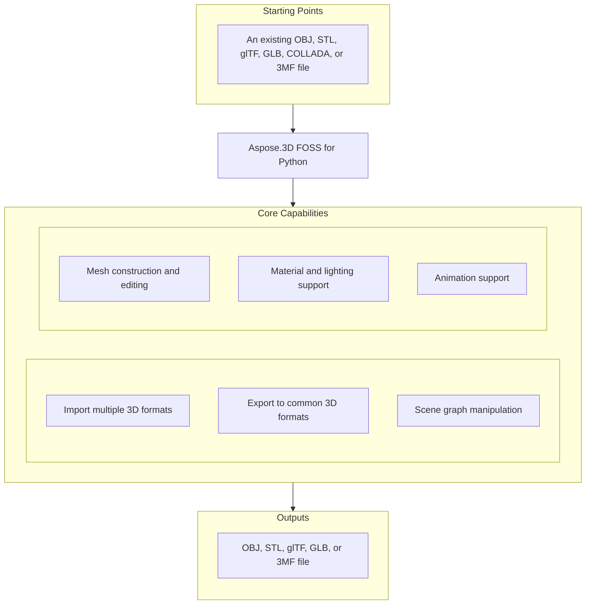

# Aspose.3D FOSS for Python

[](https://pypi.org/project/aspose-3d-foss/)  [](LICENSE) [](https://github.com/aspose-3d-foss/Aspose.3D-FOSS-for-Python/graphs/contributors)

[](https://products.aspose.org/3d/python/)

Aspose.3D FOSS for Python is a Python library for creating, reading, converting, and saving 3D scenes using formats such as `.obj`, `.stl`, `.gltf`, `.glb`, `.dae`, `.3mf`, and `.fbx`. It solves the problem of programmatically building and manipulating 3D geometry and materials without requiring a native 3D application, supporting tasks like mesh construction, scene composition, and export to common 3D formats. Developers use it to generate 3D assets for visualization, simulation, and interoperability in Python applications. The library runs on Python versions 3.7 through 3.12 and has no external dependencies.

## Navigation

- [At a Glance](#at-a-glance)
- [Key Capabilities](#key-capabilities)
- [Installation](#installation)
- [Dependencies](#dependencies)
- [Quick Start](#quick-start)
- [Additional Examples](#additional-examples)
- [API Reference](#api-reference)
- [Documentation & Resources](#documentation--resources)
- [Scope and Limitations](#scope-and-limitations)
- [Development and Testing](#development-and-testing)
- [License](#license)

## At a Glance



## Key Capabilities

- **Import multiple 3D formats.** Import scenes from OBJ, STL, glTF, GLB, COLLADA, and 3MF files using `Scene.open()` with automatic format detection from the file extension or an explicit `FileFormat` argument.
- **Export to common 3D formats.** Export scenes to OBJ, STL, glTF, GLB, and 3MF files using `Scene.save()` with format-specific `SaveOptions` subclasses that support coordinate flipping, unit scaling, and compression settings.
- **Scene graph manipulation.** Build and traverse a scene graph using `Node.create_child_node()`, `Node.add_entity()`, and `Node.child_nodes`, where each node carries an independent `Transform` with translation, rotation, and scaling properties.
- **Mesh construction and editing.** Construct and edit mesh geometry directly through `Mesh.control_points` and `Mesh.create_polygon()`, or generate editable meshes from parameterized primitives like `Box` and `Sphere` using their `to_mesh()` method.
- **Material and lighting support.** Assign `LambertMaterial`, `PhongMaterial`, or `PbrMaterial` to nodes and configure diffuse, specular, emissive, and PBR albedo, metallic factor, and roughness factor properties directly.
- **Animation support.** Build keyframe animation using `AnimationClip`, `AnimationNode`, and `KeyframeSequence` to define time-based transformations and store skeletal bind-pose data with `Pose`.

## Installation

Install the published package from PyPI (`aspose-3d-foss`, version 26.1.0):

```bash
pip install aspose-3d-foss
```

To work from a source checkout instead, install the clone with pip:

```bash
git clone https://github.com/aspose-3d-foss/Aspose.3D-FOSS-for-Python.git
cd Aspose.3D-FOSS-for-Python
pip install .
```

Verify the install:

```bash
python -c "import aspose.threed"
```

The package supports Python 3.7, 3.8, 3.9, 3.10, 3.11, and 3.12 and declares `python_requires` as `>=3.7`.

## Dependencies

### Required Package Dependencies

No required third-party package dependencies; in `setup.py`, the `install_requires` list is empty.

### Native and System Requirements

- Requires Python 3.7 or later (`python_requires=">=3.7"` in `setup.py`).

### Development Dependencies

- `pytest>=7.0.0` (extra `dev`)

## Quick Start

Build a scene from scratch and export it to glTF.

```python
from aspose.threed import Scene
from aspose.threed.entities import Box
from aspose.threed.shading import LambertMaterial
from aspose.threed.utilities import Vector3

scene = Scene()
box = Box(length=2.0, width=1.0, height=1.0)
material = LambertMaterial()
material.diffuse_color = Vector3(0.2, 0.6, 0.9)

scene.root_node.create_child_node("Crate", entity=box.to_mesh(), material=material)
scene.save("crate.gltf")
```

## Additional Examples

More real, verified snippets are collected below, each demonstrating one operation without obscuring the primary installation and quick-start path.

### Build a mesh, assign `PbrMaterial`, and export to ASCII glTF

```python
import io
import json
from aspose.threed import Scene, FileFormat
from aspose.threed.entities import Mesh
from aspose.threed.utilities import Vector3, Vector4
from aspose.threed.formats.gltf import GltfSaveOptions
from aspose.threed.shading import PbrMaterial

scene = Scene()
mesh = Mesh("TestMesh")
mesh.control_points.add(Vector4(0.0, 0.0, 0.0, 1.0))
mesh.control_points.add(Vector4(1.0, 0.0, 0.0, 1.0))
mesh.control_points.add(Vector4(0.0, 1.0, 0.0, 1.0))
mesh.create_polygon(0, 1, 2)

albedo = Vector3(0.8, 0.2, 0.3)
material = PbrMaterial("RedMaterial", albedo)
material.metallic_factor = 0.5
material.roughness_factor = 0.7

node = scene.root_node.create_child_node("TestNode")
node.entity = mesh
node.material = material

stream = io.BytesIO()
# Pass the detected FileFormat into the constructor explicitly: unlike
# StlFormat, GltfFormat.create_save_options() does not set file_format on the
# options it returns, and a bare stream (no filename) gives scene.save()
# nothing else to detect the format from.
options = GltfSaveOptions(FileFormat.get_format_by_extension(".gltf"))
options.binary_mode = False
scene.save(stream, options)

stream.seek(0)
gltf_data = json.loads(stream.read().decode("utf-8"))
print(gltf_data["materials"][0]["pbrMetallicRoughness"])
```

<details>
<summary>View Additional Examples</summary>

### Create a sphere with `PbrMaterial` and save as STL

```python
from aspose.threed import Scene
from aspose.threed.entities import Sphere
from aspose.threed.shading import PbrMaterial
from aspose.threed.utilities import Vector3

scene = Scene()
sphere = Sphere()
material = PbrMaterial(albedo=Vector3(0.8, 0.1, 0.1))
material.metallic_factor = 0.9
material.roughness_factor = 0.2

scene.root_node.create_child_node("Ball", entity=sphere.to_mesh(), material=material)
scene.save("ball.stl")
```

### Open a glTF file and print its node hierarchy

```python
from aspose.threed import Scene

scene = Scene()
scene.open("model.gltf")

def walk(node, depth=0):
    print("  " * depth + (node.name or "(unnamed)"))
    for child in node.child_nodes:
        walk(child, depth + 1)

walk(scene.root_node)
```

### Construct a triangle mesh and export to ASCII STL

```python
import io
from aspose.threed import Scene, FileFormat
from aspose.threed.entities import Mesh
from aspose.threed.utilities import Vector4

scene = Scene()
mesh = Mesh("triangle")
mesh.control_points.add(Vector4(0.0, 0.0, 0.0, 1.0))
mesh.control_points.add(Vector4(1.0, 0.0, 0.0, 1.0))
mesh.control_points.add(Vector4(1.0, 1.0, 0.0, 1.0))
mesh.create_polygon(0, 1, 2)

node = scene.root_node.create_child_node("triangle_node")
node.entity = mesh

stream = io.StringIO()
# Use FileFormat.get_format_by_extension(...).create_save_options() rather than
# StlSaveOptions() directly: a default-constructed options object has no
# file_format set, and scene.save() cannot infer the format from a bare stream
# (only filename-based saves fall back to extension detection).
options = FileFormat.get_format_by_extension(".stl").create_save_options()
options.binary_mode = False
scene.save(stream, options)
print(stream.getvalue())
```

### Generate a `Box` mesh and count its control points

```python
from aspose.threed.entities import Box

box = Box(10, 20, 30)
mesh = box.to_mesh()
print(f"Control points: {len(mesh.control_points)}")
```

### Build a cube mesh and save as uncompressed 3MF

```python
import io
from aspose.threed import Scene
from aspose.threed.entities import Mesh
from aspose.threed.utilities import Vector4
from aspose.threed.formats import ThreeMfSaveOptions

scene = Scene()
mesh = Mesh("cube")
for point in [
    Vector4(0, 0, 0, 1), Vector4(1, 0, 0, 1), Vector4(1, 1, 0, 1), Vector4(0, 1, 0, 1),
    Vector4(0, 0, 1, 1), Vector4(1, 0, 1, 1), Vector4(1, 1, 1, 1), Vector4(0, 1, 1, 1),
]:
    mesh.control_points.add(point)

mesh.create_polygon(0, 1, 2)
mesh.create_polygon(0, 2, 3)
mesh.create_polygon(4, 7, 6)
mesh.create_polygon(4, 6, 5)
mesh.create_polygon(0, 4, 5)
mesh.create_polygon(0, 5, 1)
mesh.create_polygon(2, 6, 7)
mesh.create_polygon(2, 7, 3)
mesh.create_polygon(0, 3, 7)
mesh.create_polygon(0, 7, 4)
mesh.create_polygon(1, 5, 6)
mesh.create_polygon(1, 6, 2)

node = scene.root_node.create_child_node("cube")
node.entity = mesh

stream = io.BytesIO()
options = ThreeMfSaveOptions()
options.enable_compression = False
scene.save(stream, options)
```

</details>

## API Reference

The verified public surface has 337 types.

The verified public surface has 337 types.

<details>
<summary>View the Complete Public API Surface</summary>

### Core API

| Class | Description |
| --- | --- |
| `A3DObject` | A3DObject serves as the base class for named objects that can hold properties and support property management operations. |
| `AnimationChannel` | AnimationChannel represents a single animated property channel that stores keyframe sequences and interpolation settings. |
| `AnimationClip` | AnimationClip defines a time-bounded animation sequence containing multiple animation nodes and supporting metadata. |
| `AnimationNode` | AnimationNode represents a node in an animation hierarchy that can bind to scene nodes and contain sub-animations. |
| `ArrayListAdapter` | Adapter class that wraps List[T] and implements IArrayList[T]. |
| `AssetInfo` | AssetInfo stores metadata about a 3D asset such as author, creation time, coordinate system, and unit scale factor. |
| `Axis` | The coordinate axis. |
| `AxisSystem` | Axis system is an combination of coordinate system, up vector and front vector. |
| `BindPoint` | BindPoint associates an animation channel with a specific property of a scene object. |
| `BonePose` | BonePose captures the transformation matrix of a bone at a specific pose, indicating whether it is in local space. |
| `BoundingBox2D` | The axis-aligned bounding box for Vector2 |
| `BoundingBoxExtent` | The extent of the bounding box |
| `Box` | Box is a primitive shape defined by its length, height, and segment counts for tessellation. |
| `Camera` | Camera represents a viewing entity in a 3D scene with perspective or orthographic projection capabilities. |
| `Circle` | Circle is a primitive shape defined by its radius and segment count for smooth rendering. |
| `ComposeOrder` | The order to compose transform matrix |
| `CoordinateSystem` | The left handed or right handed coordinate system. |
| `Curve` | Curve is an entity that represents a parametric curve in three-dimensional space. |
| `CustomObject` | CustomObject allows users to define and encapsulate custom 3D objects with user-specified behavior. |
| `Cylinder` | Cylinder is a primitive shape defined by its radius, height, and segment counts for radial and axial tessellation. |
| `Dish` | Dish is a primitive shape representing a spherical cap defined by inner and outer radii and segment counts. |
| `Ellipse` | Ellipse is a primitive shape defined by its major and minor radii and segment count for smooth rendering. |
| `Entity` | Entity is a scene object that can be rendered and typically contains geometric data such as meshes or curves. |
| `ExportException` | Exceptions when Aspose.3D failed to export the scene to file. |
| `Extrapolation` | Extrapolation defines how animation values are computed beyond the defined keyframe range. |
| `FMatrix4` | Matrix 4x4 with all component in float type |
| `FileContentType` | File content type |
| `FileFormat` | FileFormat provides utilities for identifying and working with supported 3D file formats by extension. |
| `FileFormatType` | File format type |
| `Frustum` | Frustum is a primitive shape representing a truncated pyramid or cone used for viewing volumes. |
| `Geometry` | Geometry is an entity that encapsulates mesh-based or parametric geometric data for rendering. |
| `GlobalTransform` | GlobalTransform represents a complete transformation matrix combining translation, rotation, and scaling. |
| `Group` | A Group represents the logical relationships of Node. |
| `INamedObject` | INamedObject is an interface for objects that can be identified by a unique name within a scene. |
| `IOExtension` | Utilities to write matrix/vector to binary writer |
| `ImageRenderOptions` | ImageRenderOptions controls the rendering of a 3D scene to an image, including resolution and compression settings. |
| `ImportException` | Exception when Aspose.3D failed to open the specified source. |
| `KeyFrame` | KeyFrame represents a single keyframe with a time stamp and associated value for animation curves. |
| `KeyframeSequence` | KeyframeSequence stores a collection of keyframes and associated interpolation and extrapolation settings. |
| `Light` | Light is a camera subclass that represents a light source in the 3D scene with configurable properties. |
| `LinearExtrusion` | LinearExtrusion is an entity that generates a 3D shape by extruding a 2D profile along a straight path. |
| `MathUtils` | A set of useful mathematical utilities. |
| `Mesh` | Mesh is a geometry subclass that stores vertex positions, normals, texture coordinates, and polygon definitions. |
| `Node` | Node is a scene object that forms the hierarchical structure of a scene, potentially containing entities and child nodes. |
| `ParseException` | Exception when Aspose.3D failed to parse the input. |
| `Plane` | Plane is a primitive shape representing an infinite flat surface defined by size and segment counts. |
| `PolygonBuilder` | PolygonBuilder provides utilities for constructing polygonal meshes programmatically. |
| `Pose` | Pose represents a collection of bone poses that define a specific configuration of a skeleton. |
| `Primitive` | Primitive is a geometry subclass that provides built-in shapes such as box, cylinder, and sphere. |
| `Property` | Property represents a single named value that can be attached to an A3DObject. |
| `PropertyCollection` | PropertyCollection manages a collection of properties associated with an A3DObject. |
| `PropertyFlags` | Property's flags |
| `Rect` | A class to represent the rectangle |
| `RelativeRectangle` | Relative rectangle |
| `RotationOrder` | The order controls which rx ry rz are applied in the transformation matrix. |
| `Scene` | Scene is the top-level container for a 3D model, organizing nodes, animations, and asset metadata. |
| `SceneObject` | SceneObject is the base class for all objects that can be placed in a scene hierarchy. |
| `SemanticAttribute` | Allow user to use their own structure for static declaration of VertexDeclaration |
| `Sphere` | The Sphere class represents a sphere primitive that can be converted to a mesh with configurable segments and dimensions. |
| `Transform` | The Transform class encapsulates transformation properties including translation, rotation, and scaling for 3D objects. |
| `TransformBuilder` | The TransformBuilder is used to build transform matrix by a chain of transformations. |
| `TrialException` | This is raised in Scene.Open/Scene.Save when no licenses are applied. |
| `Vertex` | Vertex reference, used to access the raw vertex in TriMesh. |
| `VertexDeclaration` | The declaration of a custom defined vertex's structure |
| `VertexField` | Vertex's field memory layout description. |
| `VertexFieldDataType` | Vertex field's data type |
| `VertexFieldSemantic` | The semantic of the vertex field |
| `Bone` | The Bone class represents a bone in a skeletal animation system with transform and weight information. |
| `BoneLinkMode` | The BoneLinkMode enumeration defines how bones are linked to nodes in a skeletal structure. |
| `Deformer` | The Deformer class serves as a base for mesh deformation operations that modify vertex positions. |
| `MorphTargetChannel` | The MorphTargetChannel class controls the influence of morph target shapes on a mesh through weighted blending. |
| `MorphTargetDeformer` | The MorphTargetDeformer class applies morph target animations by blending between base geometry and target shapes. |
| `SkinDeformer` | The SkinDeformer class implements skinning deformation by binding vertices to bones with weighted influences. |
| `ApertureMode` | Camera aperture modes. |
| `BooleanOperand` | This class encapsulates the transformed mesh as Boolean operation's operand. |
| `BooleanOperation` | The BooleanOperation class performs boolean operations such as union, intersection, and difference on 3D geometries. |
| `BooleanOperator` | Boolean operator allows you to apply Boolean operation on two IMeshConvertible instances. |
| `CompositeCurve` | A CompositeCurve is consisting of several curve segments. |
| `CurveDimension` | The CurveDimension enumeration specifies the dimensional characteristics of curve entities. |
| `EndPoint` | The end point to trim the curve, can be a parameter value or a Cartesian point. |
| `HalfSpace` | HalfSpace represents a infinity space which is split by a plane, this can be used with BooleanOperator |
| `IIndexedVertexElement` | The IIndexedVertexElement interface defines vertex elements that reference vertex data through an index array. |
| `IMeshConvertible` | Entities that implemented this interface can be converted to Mesh |
| `IOrientable` | Orientable entities shall implement this interface. |
| `LightType` | Light types. |
| `Line` | A polyline is a path defined by a set of points with control_points, and connected by segments. |
| `MappingMode` | The MappingMode enumeration determines how texture coordinates are mapped onto 3D surfaces. |
| `NurbsCurve` | The NurbsCurve class represents a Non-Uniform Rational B-Spline curve defined by control points and knot vectors. |
| `NurbsDirection` | The NurbsDirection class describes the properties of a single direction in a NURBS surface or curve. |
| `NurbsSurface` | The NurbsSurface class represents a NURBS surface defined by control points, knot vectors, and degrees in two directions. |
| `NurbsType` | The NurbsType enumeration specifies the type and characteristics of NURBS curves and surfaces. |
| `Patch` | The Patch class represents a parametric surface patch used in NURBS geometry definitions. |
| `PatchDirection` | The PatchDirection enumeration identifies the U or V direction parameter in a surface patch. |
| `PatchDirectionType` | The PatchDirectionType enumeration specifies the type of parameterization in a surface patch direction. |
| `PointCloud` | The PointCloud class represents a collection of 3D points without connectivity information. |
| `InvalidOperationException` | The InvalidOperationException is raised when an invalid operation is attempted during polygon construction. |
| `PolygonModifier` | The PolygonModifier class provides static methods to modify polygonal geometry such as triangulation. |
| `ProjectionType` | Camera's projection types. |
| `Pyramid` | Parameterized pyramid. |
| `RectangularTorus` | Parameterized rectangular torus entity. |
| `ReferenceMode` | The ReferenceMode enumeration specifies how vertex indices reference vertex data in mesh elements. |
| `RevolvedAreaSolid` | RevolvedAreaSolid entity. |
| `RotationMode` | The frustum's rotation mode. |
| `Shape` | Base class for all shape entities. |
| `Skeleton` | The Skeleton is mainly used by CAD software to help designer to manipulate the transformation of skeletal structure, it's usually useless outside the CAD softwares. |
| `SkeletonType` | Skeleton type enum. |
| `SplitMeshPolicy` | Share vertex/control point data between sub-meshes or each sub-mesh has its own compacted data. |
| `SweptAreaSolid` | SweptAreaSolid entity. |
| `TextureMapping` | The TextureMapping class defines how textures are applied to 3D surfaces including coordinate generation. |
| `Torus` | Parameterized torus entity. |
| `TransformedCurve` | TransformedCurve entity. |
| `TriMesh` | TriMesh is a triangle mesh that stores triangles. |
| `TrimmedCurve` | TrimmedCurve entity. |
| `VertexElement` | The VertexElement class represents a generic element of vertex data associated with a mesh. |
| `VertexElementBinormal` | The VertexElementBinormal class stores binormal vectors for each vertex in a mesh. |
| `VertexElementDoublesTemplate` | A helper class for defining concrete implementations. |
| `VertexElementEdgeCrease` | Defines the edge crease values for specified components. |
| `VertexElementFVector` | The VertexElementFVector class represents a vertex element containing floating-point vector data. |
| `VertexElementHole` | Defines the hole information for specified components. |
| `VertexElementIntsTemplate` | A helper class for defining concrete implementations with int data. |
| `VertexElementMaterial` | Defines the material for specified components. |
| `VertexElementNormal` | The VertexElementNormal class stores normal vectors for each vertex in a mesh. |
| `VertexElementPolygonGroup` | Defines the polygon group for specified components. |
| `VertexElementSmoothingGroup` | The VertexElementSmoothingGroup class assigns smoothing group identifiers to mesh faces. |
| `VertexElementSpecular` | Defines the specular color for specified components. |
| `VertexElementTangent` | The VertexElementTangent class stores tangent vectors for each vertex in a mesh. |
| `VertexElementTemplate` | A helper class for defining concrete implementations of vertex elements with typed data. |
| `VertexElementType` | The VertexElementType enumeration identifies the data type and purpose of vertex elements. |
| `VertexElementUV` | The VertexElementUV class stores texture coordinate pairs for each vertex in a mesh. |
| `VertexElementUserData` | Defines the user data for specified components. |
| `VertexElementVector4` | Defines the vector4 data for specified components. |
| `VertexElementVertexColor` | The VertexElementVertexColor class stores per-vertex color information for mesh rendering. |
| `VertexElementVertexCrease` | Defines the vertex crease values for specified components. |
| `VertexElementVisibility` | Defines the visibility for specified components. |
| `VertexElementWeight` | Defines the weight for specified components. |
| `A3dwSaveOptions` | Save options for A3DW |
| `AmfSaveOptions` | Save options for AMF |
| `BasicLoadOptions` | Simple LoadOptions subclass for basic loading options. |
| `ColladaLoadOptions` | Load options for Collada |
| `ColladaSaveOptions` | Save options for collada |
| `ColladaTransformStyle` | The node's transformation style of node |
| `Discreet3dsLoadOptions` | Load options for Discreet 3DS |
| `Discreet3dsSaveOptions` | Save options for Discreet 3DS |
| `DracoCompressionLevel` | Compression level for draco file |
| `DracoFormat` | Google Draco format |
| `DracoSaveOptions` | Save options for Draco |
| `Exporter` | The Exporter class provides methods to save 3D scenes to various file formats. |
| `FbxLoadOptions` | Load options for FBX |
| `FbxSaveOptions` | Save options for FBX |
| `FormatDetector` | The FormatDetector class analyzes file content to determine the 3D format of a scene file. |
| `GltfEmbeddedImageFormat` | Embedded image format for GLTF |
| `formats.GltfLoadOptions` | Load options for glTF |
| `formats.GltfSaveOptions` | Save options for glTF |
| `Html5SaveOptions` | Save options for HTML5 |
| `IOConfig` | The IOConfig class holds configuration options for input and output operations. |
| `IOService` | The IOService class provides core input and output functionality for 3D file operations. |
| `Importer` | The Importer class loads 3D scenes from various file formats into memory. |
| `JtLoadOptions` | Load options for JT |
| `LoadOptions` | LoadOptions configures how 3D scenes are loaded from files or streams, accepting an IOConfig to control input behavior. |
| `Microsoft3MFFormat` | Microsoft 3MF format |
| `Microsoft3MFSaveOptions` | Save options for Microsoft 3MF |
| `formats.ObjLoadOptions` | Load options for OBJ |
| `formats.ObjSaveOptions` | Save options for OBJ |
| `PdfFormat` | Adobe's Portable Document Format |
| `PdfLightingScheme` | Lighting scheme for PDF export |
| `PdfLoadOptions` | Load options for PDF |
| `PdfRenderMode` | Render mode for PDF export |
| `PdfSaveOptions` | Save options for PDF |
| `Plugin` | Plugin serves as an abstract base for format-specific plugins that provide exporters, importers, format detectors, and load/save options. |
| `PlyFormat` | PLY format |
| `PlyLoadOptions` | Load options for PLY |
| `PlySaveOptions` | Save options for PLY |
| `RvmFormat` | RVM format |
| `RvmLoadOptions` | Load options for RVM |
| `RvmSaveOptions` | Save options for RVM |
| `SaveOptions` | SaveOptions configures how 3D scenes are saved to files or streams, accepting an IOConfig to control output behavior. |
| `formats.StlLoadOptions` | Load options for STL |
| `formats.StlSaveOptions` | Save options for STL |
| `ThreeMfFormat` | ThreeMfFormat represents the 3MF file format, supporting import and export of 3D models with metadata and scene hierarchy. |
| `ThreeMfLoadOptions` | ThreeMfLoadOptions extends LoadOptions to provide 3MF-specific settings such as coordinate system flipping during import. |
| `ThreeMfSaveOptions` | ThreeMfSaveOptions extends SaveOptions to provide 3MF-specific settings such as compression, unit scaling, and coordinate system flipping during export. |
| `U3dLoadOptions` | Load options for U3D |
| `U3dSaveOptions` | Save options for U3D |
| `UsdSaveOptions` | Save options for USD |
| `XLoadOptions` | Load options for X format |
| `ColladaExporter` | ColladaExporter converts in-memory 3D scenes into COLLADA format files for interoperability with other 3D applications. |
| `ColladaFormat` | ColladaFormat defines the COLLADA file format, including its extension, content type, and supported operations for import and export. |
| `ColladaFormatDetector` | ColladaFormatDetector identifies COLLADA files by inspecting their content to determine format compatibility. |
| `ColladaImporter` | ColladaImporter reads COLLADA format files and loads their content into an in-memory 3D scene representation. |
| `ColladaPlugin` | ColladaPlugin provides a plugin interface for COLLADA format support, exposing exporters, importers, format detectors, and load/save options. |
| `FbxExporter` | FbxExporter saves 3D scenes to Autodesk FBX format files, supporting both file paths and stream outputs. |
| `FbxFormat` | FbxFormat defines the Autodesk FBX file format, including its extension, content type, and supported operations for import and export. |
| `FbxFormatDetector` | FbxFormatDetector identifies FBX files by inspecting their content to determine format compatibility. |
| `FbxImporter` | FbxImporter reads Autodesk FBX format files and loads their content into an in-memory 3D scene representation. |
| `FbxPlugin` | FbxPlugin provides a plugin interface for FBX format support, exposing exporters, importers, format detectors, and load/save options. |
| `BinaryTokenizer` | BinaryTokenizer parses binary FBX files into a sequence of tokens for further processing by the FBX parser. |
| `binary_tokenizer.Token` | Token represents a single parsed element from an FBX binary stream, including its type and value. |
| `binary_tokenizer.TokenType` | TokenType enumerates the possible categories of tokens that can appear in an FBX binary stream. |
| `FbxElement` | FbxElement models a single element in the FBX file structure, containing properties and child elements. |
| `FbxParser` | FbxParser processes binary FBX data using a tokenizer to build a hierarchical representation of the file. |
| `FbxScope` | FbxScope defines a lexical scope within the FBX file structure, grouping related elements and properties. |
| `FbxTokenizer` | FbxTokenizer breaks down ASCII FBX files into a sequence of tokens for parsing by the FBX parser. |
| `tokenizer.Token` | Token represents a single parsed element from an FBX ASCII stream, including its type and value. |
| `tokenizer.TokenType` | TokenType enumerates the possible categories of tokens that can appear in an FBX ASCII stream. |
| `GltfExporter` | GltfExporter converts in-memory 3D scenes into glTF format files for efficient transmission and rendering. |
| `GltfFormat` | GltfFormat defines the glTF file format, including its extension, content type, and supported operations for import and export. |
| `GltfFormatDetector` | GltfFormatDetector identifies glTF files by inspecting their content to determine format compatibility. |
| `GltfImporter` | GltfImporter reads glTF format files and loads their content into an in-memory 3D scene representation. |
| `gltf.GltfLoadOptions` | GltfLoadOptions extends LoadOptions to provide glTF-specific settings for controlling import behavior. |
| `GltfPlugin` | GltfPlugin provides a plugin interface for glTF format support, exposing exporters, importers, format detectors, and load/save options. |
| `gltf.GltfSaveOptions` | GltfSaveOptions extends SaveOptions to provide glTF-specific settings for controlling export behavior. |
| `ObjExporter` | ObjExporter saves 3D scenes to Wavefront OBJ format files, supporting both file paths and stream outputs. |
| `ObjFormat` | ObjFormat defines the Wavefront OBJ file format, including its extension, content type, and supported operations for import and export. |
| `ObjFormatDetector` | ObjFormatDetector identifies OBJ files by inspecting their content to determine format compatibility. |
| `ObjImporter` | ObjImporter reads Wavefront OBJ format files and loads their content into an in-memory 3D scene representation. |
| `obj.ObjLoadOptions` | ObjLoadOptions extends LoadOptions to provide OBJ-specific settings for controlling import behavior. |
| `ObjPlugin` | ObjPlugin provides a plugin interface for OBJ format support, exposing exporters, importers, format detectors, and load/save options. |
| `obj.ObjSaveOptions` | ObjSaveOptions extends SaveOptions to provide OBJ-specific settings for controlling export behavior. |
| `StlExporter` | StlExporter saves 3D scenes to STL format files, supporting both file paths and stream outputs. |
| `StlFormat` | StlFormat represents the STL file format and provides methods to detect, import, and export STL files. |
| `StlFormatDetector` | StlFormatDetector identifies whether a file stream or buffer contains an STL file. |
| `StlImporter` | StlImporter reads geometry and scene data from STL files and populates a Scene object. |
| `stl.StlLoadOptions` | StlLoadOptions controls how STL files are loaded, including coordinate system flipping and scaling. |
| `StlPlugin` | StlPlugin provides access to STL format capabilities such as importers, exporters, and format detection. |
| `stl.StlSaveOptions` | StlSaveOptions controls how STL files are saved, including binary mode, coordinate system flipping, and scaling. |
| `ThreeMfExporter` | ThreeMfExporter writes a Scene to a 3MF file stream. |
| `ThreeMfFormatDetector` | ThreeMfFormatDetector determines whether a file stream or buffer contains a 3MF file. |
| `ThreeMfImporter` | ThreeMfImporter reads geometry, materials, and scene hierarchy from a 3MF file into a Scene. |
| `ThreeMfPlugin` | ThreeMfPlugin exposes 3MF format support including importers, exporters, and format detection. |
| `ArbitraryProfile` | This class allows you to construct a 2D profile directly from arbitrary curve. |
| `CShape` | IFC compatible C-shape profile that defined by parameters. |
| `CenterLineProfile` | IFC compatible center line profile. |
| `CircleShape` | IFC compatible circle profile. |
| `EllipseShape` | IFC compatible ellipse profile. |
| `FontFile` | Font file contains definitions for glyphs, this is used to create text profile. |
| `HShape` | IFC compatible H-shape profile. |
| `HollowCircleShape` | IFC compatible hollow circle profile. |
| `HollowRectangleShape` | IFC compatible hollow rectangular shape with both inner/outer rounding corners. |
| `LShape` | IFC compatible L-shape profile that defined by parameters. |
| `MirroredProfile` | IFC compatible mirror profile. |
| `ParameterizedProfile` | The base class of all parameterized profiles. |
| `Profile` | 2D Profile in xy plane. |
| `RectangleShape` | IFC compatible rectangle profile. |
| `TShape` | IFC compatible T-shape defined by parameters. |
| `Text` | Text profile, this profile describes contours using font and text. |
| `TrapeziumShape` | IFC compatible Trapezium shape defined by parameters. |
| `UShape` | IFC compatible U-shape defined by parameters. |
| `ZShape` | IFC compatible Z-shape profile that defined by parameters. |
| `BlendFactor` | Blend factor specify pixel arithmetic. |
| `CompareFunction` | Compare function for depth/stencil testing. |
| `CubeFace` | Cube face enumeration. |
| `CullFaceMode` | Cull face mode for face culling. |
| `DescriptorSetUpdater` | Descriptor set updater for shader resources. |
| `DrawOperation` | Draw operation type. |
| `DriverException` | Exception thrown when rendering driver fails. |
| `EntityRenderer` | Base class for rendering entities. |
| `EntityRendererFeatures` | Features supported by an entity renderer. |
| `EntityRendererKey` | The key of registered entity renderer. |
| `FrontFace` | Front face winding order. |
| `GLSLSource` | GLSL shader source. |
| `IBuffer` | Interface for vertex/index buffer. |
| `ICommandList` | Interface for command list. |
| `IDescriptorSet` | Interface for descriptor set. |
| `IIndexBuffer` | Interface for index buffer. |
| `IPipeline` | Interface for graphics pipeline. |
| `IRenderQueue` | Interface for render queue. |
| `IRenderTarget` | Interface for render target. |
| `IRenderTexture` | Interface for render texture. |
| `IRenderWindow` | Interface for render window. |
| `ITexture1D` | Interface for 1D texture. |
| `ITexture2D` | Interface for 2D texture. |
| `ITextureCodec` | Interface for texture codec. |
| `ITextureCubemap` | Interface for cubemap texture. |
| `ITextureDecoder` | Interface for texture decoder. |
| `ITextureEncoder` | Interface for texture encoder. |
| `ITextureUnit` | Interface for texture unit. |
| `IVertexBuffer` | Interface for vertex buffer. |
| `IndexDataType` | Data type for indices. |
| `InitializationException` | Exception thrown when rendering initialization fails. |
| `PixelFormat` | Pixel format for render targets. |
| `PixelMapMode` | Pixel mapping mode. |
| `PixelMapping` | Pixel mapping configuration. |
| `PolygonMode` | Polygon rendering mode. |
| `PostProcessing` | Post-processing effect. |
| `PresetShaders` | Predefined shaders. |
| `PushConstant` | Push constant for shaders. |
| `RenderFactory` | RenderFactory creates all resources that represented in rendering pipeline. |
| `RenderParameters` | Parameters for rendering. |
| `RenderQueueGroupId` | Render queue group ID. |
| `RenderResource` | Base class for render resources. |
| `RenderStage` | Render stage in the pipeline. |
| `RenderState` | Render state configuration. |
| `Renderer` | The context about renderer. |
| `RendererVariableManager` | Manages renderer variables. |
| `SPIRVSource` | SPIRV shader source. |
| `ShaderException` | Exception thrown when shader compilation/linking fails. |
| `ShaderProgram` | Shader program. |
| `ShaderSet` | Set of shaders for rendering. |
| `ShaderSource` | Shader source code. |
| `ShaderStage` | Shader stage. |
| `ShaderVariable` | Shader variable. |
| `StencilAction` | Stencil action. |
| `StencilState` | Stencil state configuration. |
| `TextureCodec` | Texture codec. |
| `TextureData` | Texture data. |
| `TextureType` | Texture type. |
| `Viewport` | Viewport for rendering. |
| `WindowHandle` | Window handle for render window. |
| `AlphaSource` | Source of alpha channel for textures. |
| `LambertMaterial` | LambertMaterial defines a simple shading model with ambient, diffuse, emissive, and transparency properties. |
| `Material` | Material represents a surface appearance definition that can be assigned to 3D entities. |
| `PbrMaterial` | PbrMaterial implements physically based rendering with albedo, metallic, roughness, and emissive properties. |
| `PbrSpecularMaterial` | Material for physically based rendering based on diffuse color/specular/glossiness. |
| `PhongMaterial` | PhongMaterial extends LambertMaterial with specular reflection properties for shiny surface rendering. |
| `ShaderMaterial` | A shader material allows to describe the material by external rendering engine or shader language. |
| `ShaderTechnique` | A technique in shader material describes the concrete rendering details. |
| `Texture` | This class defines the texture from an external file. |
| `TextureBase` | Base class for all texture types. |
| `TextureFilter` | Texture filter type. |
| `TextureSlot` | Texture slot name. |
| `WrapMode` | Wrap mode for texture coordinates. |
| `BoundingBox` | BoundingBox describes the axis-aligned spatial extent of a 3D object or scene. |
| `FVector2` | FVector2 represents a two-component floating-point vector used for 2D coordinates or directions. |
| `FVector3` | FVector3 represents a three-component floating-point vector used for 3D positions, directions, or colors. |
| `FVector4` | FVector4 represents a four-component floating-point vector used for homogeneous coordinates or quaternions. |
| `FileSystem` | File system encapsulation. |
| `Matrix4` | Matrix4 defines a 4x4 transformation matrix used for 3D geometry operations. |
| `Quaternion` | Quaternion represents a four-component rotation used to describe 3D orientations. |
| `Vector2` | Vector2 represents a two-component vector used for 2D coordinates or offsets. |
| `Vector3` | Vector3 represents a three-component vector used for 3D positions, directions, or colors. |
| `Vector4` | Vector4 represents a four-component vector used for homogeneous coordinates or quaternions. |
| `Watermark` | Utility to encode/decode blind watermark to/from a mesh. |

#### Enumerations

| Enumeration | Description |
| --- | --- |
| `ExtrapolationType` | ExtrapolationType is an enumeration specifying the behavior of animation extrapolation beyond keyframe boundaries. |
| `Interpolation` | Interpolation is an enumeration specifying how values are interpolated between keyframes in animations. |
| `PoseType` | PoseType is an enumeration indicating whether a pose is a bind pose or an animation pose. |
| `StepMode` | The StepMode enumeration defines the step mode options for STEP file import and export operations. |
| `WeightedMode` | The WeightedMode enumeration specifies how weights are applied during morph target deformation operations. |

#### Detailed Member Reference

### Scene

The `aspose.threed.Scene` class provides `Scene.open()` and `Scene.save()` methods to load and write 3D scenes, with `Scene.root_node` exposing the top-level node and `Scene.animation_clips` managing animation data.

- `animation_clips`: Defined as `def animation_clips(self) -> List['AnimationClip']`.
- `asset_info`: Defined as `def asset_info(self) -> AssetInfo`.
- `clear`: Defined as `def clear(self)`.
- `create_animation_clip`: Defined as `def create_animation_clip(self, name: str) -> 'AnimationClip'`.
- `current_animation_clip`: Defined as `def current_animation_clip(self) -> Optional['AnimationClip']`.
- `from_file`: Defined as `def from_file(file_name: str)`.
- `get_animation_clip`: Defined as `def get_animation_clip(self, name: str) -> Optional['AnimationClip']`.
- `library`: Defined as `def library(self) -> List[CustomObject]`.
- `open`: Defined as `def open(self, file_or_stream, options=None)`.
- `poses`: Defined as `def poses(self) -> List`.
- `render`: Defined as `def render(self, camera, file_name_or_bitmap, size=None, format=None, options=None)`.
- `root_node`: Defined as `def root_node(self)`.
- `save`: Defined as `def save(self, file_or_stream, format_or_options=None)`.
- `sub_scenes`: Defined as `def sub_scenes(self) -> List['Scene']`.

### Node

The `aspose.threed.Node` class represents a transformable element in the scene graph, supporting `Node.add_child_node()` and `Node.create_child_node()` to build hierarchies, with `Node.entities` holding mesh and other geometric data.

- `add_child_node`: Defined as `def add_child_node(self, node: 'Node')`.
- `add_entity`: Defined as `def add_entity(self, entity: 'Entity')`.
- `asset_info`: Defined as `def asset_info(self)`.
- `child_nodes`: Defined as `def child_nodes(self) -> List['Node']`.
- `create_child_node`: Defined as `def create_child_node(self, node_name: Optional[str]=None, entity=None, material=None) -> 'Node'`.
- `entities`: Defined as `def entities(self) -> List['Entity']`.
- `entity`: Defined as `def entity(self) -> Optional['Entity']`.
- `evaluate_global_transform`: Defined as `def evaluate_global_transform(self, with_geometric_transform: bool) -> Matrix4`.
- `excluded`: Defined as `def excluded(self) -> bool`.
- `get_bounding_box`: Defined as `def get_bounding_box(self) -> BoundingBox`.
- `get_child`: Defined as `def get_child(self, index_or_name)`.
- `get_entity`: Defined as `def get_entity(self, entity_type: type)`.
- `global_transform`: Defined as `def global_transform(self) -> GlobalTransform`.
- `material`: Defined as `def material(self) -> Optional['Material']`.
- `materials`: Defined as `def materials(self) -> List['Material']`.
- `merge`: Defined as `def merge(self, node: 'Node')`.
- `meta_datas`: Defined as `def meta_datas(self) -> List`.
- `parent_node`: Defined as `def parent_node(self) -> Optional['Node']`.
- `select_objects`: Defined as `def select_objects(self, path: str)`.
- `select_single_object`: Defined as `def select_single_object(self, path: str)`.
- `transform`: Defined as `def transform(self) -> Transform`.
- `visible`: Defined as `def visible(self) -> bool`.

### Mesh

The `aspose.threed.Mesh` class stores vertex positions, polygon definitions, and geometric properties, with `Mesh.control_points` providing access to vertices and `Mesh.polygon_count` reporting the number of faces.

- `control_points`: Defined as `def control_points(self) -> ArrayListAdapter[Vector4]`.
- `create_polygon`: Defined as `def create_polygon(self, *args)`.
- `difference`: Defined as `def difference(a: 'Mesh', b: 'Mesh') -> 'Mesh'`.
- `do_boolean`: Defined as `def do_boolean(op: BooleanOperation, a: 'Mesh', transform_a: Optional[Matrix4], b: 'Mesh', transform_b: Optional[Matrix4]) -> 'Mesh'`.
- `edges`: Defined as `def edges(self) -> ArrayListAdapter[int]`.
- `get_bounding_box`: Defined as `def get_bounding_box(self)`.
- `get_entity_renderer_key`: Defined as `def get_entity_renderer_key(self)`.
- `get_polygon_size`: Defined as `def get_polygon_size(self, index: int) -> int`.
- `intersect`: Defined as `def intersect(a: 'Mesh', b: 'Mesh') -> 'Mesh'`.
- `is_manifold`: Defined as `def is_manifold(self) -> bool`.
- `optimize`: Defined as `def optimize(self, vertex_elements: bool=False, tolerance_control_point: float=1e-09, tolerance_normal: float=1e-09, tolerance_uv: float=1e-09) -> 'Mesh'`.
- `polygon_count`: Defined as `def polygon_count(self) -> int`.
- `polygons`: Defined as `def polygons(self) -> List[List[int]]`.
- `to_mesh`: Defined as `def to_mesh(self) -> 'Mesh'`.
- `triangulate`: Defined as `def triangulate(self) -> 'Mesh'`.
- `union`: Defined as `def union(a: 'Mesh', b: 'Mesh') -> 'Mesh'`.

### shading

The `aspose.threed.shading` module provides material and rendering properties such as `diffuse_color` and `metallic_factor` used to define surface appearance in 3D scenes.

### entities

The `aspose.threed.entities` module contains geometric primitive classes and utilities like `PolygonModifier` for modifying mesh topology and structure.

### AnimationClip

The `aspose.threed.AnimationClip` class defines a time-bounded animation sequence with `AnimationClip.start` and `AnimationClip.stop` marking the timeline, and `AnimationClip.animations` containing the keyframe data.

- `animations`: Defined as `def animations(self) -> List['AnimationNode']`.
- `create_animation_node`: Defined as `def create_animation_node(self, node_name: str) -> 'AnimationNode'`.
- `description`: Defined as `def description(self) -> str`.
- `name`: Defined as `def name(self) -> str`.
- `properties`: Defined as `def properties(self)`.
- `start`: Defined as `def start(self) -> float`.
- `stop`: Defined as `def stop(self) -> float`.

### AnimationNode

The `aspose.threed.AnimationNode` class represents a node within an animation clip, with `AnimationNode.bind_points` linking animated properties to target objects.

- `bind_points`: Defined as `def bind_points(self) -> List['BindPoint']`.
- `create_bind_point`: Defined as `def create_bind_point(self, obj: 'A3DObject', prop_name: str) -> 'BindPoint'`.
- `find_bind_point`: Defined as `def find_bind_point(self, target: 'A3DObject', name: str) -> 'BindPoint'`.
- `get_bind_point`: Defined as `def get_bind_point(self, target: 'A3DObject', prop_name: str, create: bool) -> 'BindPoint'`.
- `get_keyframe_sequence`: Defined as `def get_keyframe_sequence(self, target: 'A3DObject', prop_name: str, channel_name: str=None, create: bool=True) -> 'KeyframeSequence'`.
- `name`: Defined as `def name(self) -> str`.
- `properties`: Defined as `def properties(self)`.
- `sub_animations`: Defined as `def sub_animations(self) -> List['AnimationNode']`.

### KeyframeSequence

The `aspose.threed.KeyframeSequence` class holds a sequence of keyframes for animating a single property, supporting interpolation between keyframe values over time.

- `add`: Defined as `def add(self, time: float, value: float, interpolation: Interpolation=Interpolation.LINEAR)`.
- `bind_point`: Defined as `def bind_point(self) -> 'BindPoint'`.
- `key_frames`: Defined as `def key_frames(self) -> List['KeyFrame']`.
- `name`: Defined as `def name(self) -> str`.
- `post_behavior`: Defined as `def post_behavior(self) -> Extrapolation`.
- `pre_behavior`: Defined as `def pre_behavior(self) -> Extrapolation`.
- `properties`: Defined as `def properties(self)`.
- `reset`: Defined as `def reset(self)`.

### formats

The `aspose.threed.formats` module provides format-specific loaders and savers, with `get_format_by_extension()` enabling format detection and support for OBJ, GLB, and other 3D file types.

### utilities

The `aspose.threed.utilities` module includes helper types such as `Vector3` for geometric calculations and stream utilities like `BytesIO` and `StringIO` for in-memory data handling.

### render

The `aspose.threed.render` module provides rendering capabilities, with `Scene.render()` enabling direct rendering of the scene graph to image or display targets.

### deformers

The `aspose.threed.deformers` module contains classes for mesh deformation operations such as morphing and skinning, supporting advanced animation techniques.

</details>

## Documentation & Resources

- **[Getting started guide](https://docs.aspose.org/3d/python/)** — Installation, walkthroughs, and feature guides for this library.
- **[How-to guides & FAQ](https://kb.aspose.org/3d/python/)** — Task-focused answers for common 3D-processing questions.
- **[Full API reference](https://reference.aspose.org/3d/python/)** — The complete, browsable reference for all 305 public types. It covers all 337 verified public types; the [API Reference](#api-reference) section above covers the essentials.
- **[Implementation progress notes](docs/foss-python-progress.md)** — Current FOSS-edition porting status, in the repository.
- **[Release process](docs/releasing.md)** — How a version of aspose-3d-foss is tagged and published to PyPI, in the repository.
- **[Scene/Node/Entity/Transform](docs/IMPLEMENTATION_SUMMARY.md)** — Historical development records for `Scene`, `Node`, `Entity`, and `Transform` support.
- **[OBJ importer](docs/OBJ_IMPORTER_IMPLEMENTATION.md)** — Historical development records for the OBJ importer implementation.
- **[STL import/export](docs/STL_IMPORT_IMPLEMENTATION.md)** — Historical development records for the STL import and export implementation.
- **[FBX parser](docs/FBX_IMPLEMENTATION_SUMMARY.md)** — Historical development records for the FBX parser implementation.
- **[PyPI packaging readiness](docs/PYPI_READINESS.md)** — Historical development records for PyPI packaging readiness.
- Found a bug or have a feature request? [Open an issue](https://github.com/aspose-3d-foss/Aspose.3D-FOSS-for-Python/issues).

## Scope and Limitations

Aspose.3D FOSS for Python 26.1.0 supports reading and writing OBJ, STL, glTF, and COLLADA files, and provides basic scene graph navigation and mesh inspection capabilities for those formats.

- No file format registers an importer or exporter for PDF, PLY, RVM, U3D, JT, AMF, HTML5, A3DW, USD, or Draco in this build — `PdfSaveOptions`, `PlyLoadOptions`, `DracoSaveOptions`, and similar option classes exist as public types, but `Scene.open()` and `Scene.save()` cannot detect or dispatch any of these extensions and raise a RuntimeError if you try.
- FBX support is experimental: `FbxImporter` has a working tokenizer and parser but no bundled test opens a real `.fbx` fixture through it, and `FbxExporter.save()` and `save_to_stream()` both raise NotImplementedError outright, so FBX is import-only at best.
- COLLADA import works, but COLLADA export is not reachable through `Scene.save()` because `IOService`'s exporter lookup reaches `FbxExporter` before `ColladaExporter`, so the lookup fails before a working `ColladaExporter` is ever consulted.
- Always import a format's load/save options class from its own format submodule, never from the shared top-level `aspose.threed.formats` package — for OBJ, STL, glTF, and COLLADA specifically, the top-level package name resolves to a broken duplicate with no working base class, which format detection silently rejects.
- `Scene.render()` and the entire `aspose.threed.render` module (`Renderer`, `RenderFactory`, `Viewport`, and related classes) raise NotImplementedError, and `Texture` and `TextureBase` raise NotImplementedError on construction, so this library does not render scenes to images or create image-backed textures.
- `Watermark.encode_watermark()` and `decode_watermark()`, every `TransformBuilder` method, `Mesh.do_boolean()` and its Boolean/CSG variants, `NurbsCurve.evaluate()` and `evaluate_at()`, `NurbsSurface.to_mesh()`, `PointCloud.from_geometry()` and `from_geometry_with_density()`, and every `AxisSystem` method raise NotImplementedError.

These limitations don't apply to [Aspose.3D for Python — Enterprise Edition](https://products.aspose.com/3d/python-net/). Aspose.3D FOSS for Python provides open-source 3D processing capabilities, while Aspose.3D commercial edition adds advanced features such as support for additional file formats, enhanced performance, and commercial licensing options.

## Development and Testing

Install the package in editable mode and run the full test suite with unittest, or execute a specific test file directly.

The suite covers 34 test files under `tests/`. Releases run through the [publish workflow](.github/workflows/publish.yml).

```bash
python3 -m pip install -e .
python3 -m unittest discover tests/
```

```bash
python -m unittest tests.test_obj_importer
```

## License

This project is licensed under the [MIT License](LICENSE). The MIT License permits use, copying, modification, distribution, sublicensing, and commercial use, provided its copyright and permission notice are retained. The software is provided without warranty.
