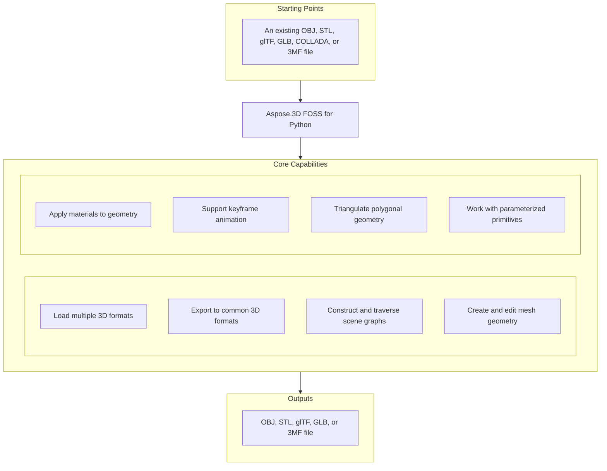

# Aspose.3D FOSS for Python

[](https://pypi.org/project/aspose-3d-foss/)  [](LICENSE) [](https://github.com/aspose-3d-foss/Aspose.3D-FOSS-for-Python/graphs/contributors)

[](https://products.aspose.org/3d/python/)

Aspose.3D FOSS for Python is a Python library for working with 3D documents, supporting import and export of formats including `.obj`, `.stl`, `.gltf`, `.glb`, `.dae`, `.3mf`, and `.fbx`. It enables developers to create, manipulate, and inspect 3D scenes using classes such as `aspose.threed.Scene`, `aspose.threed.Node`, `aspose.threed.Mesh`, and `aspose.threed.A3DObject`. The library is suitable for Python developers building applications that process 3D geometry, metadata, and materials without requiring a full commercial suite. It requires Python 3.7 or higher and is distributed under the MIT license.

## Navigation

- [At a Glance](#at-a-glance)
- [Key Capabilities](#key-capabilities)
- [Installation](#installation)
- [Dependencies](#dependencies)
- [Quick Start](#quick-start)
- [Additional Examples](#additional-examples)
- [API Reference](#api-reference)
- [Documentation & Resources](#documentation--resources)
- [Scope and Limitations](#scope-and-limitations)
- [Development and Testing](#development-and-testing)
- [License](#license)

## At a Glance



## Key Capabilities

- **Load multiple 3D formats.** Aspose.3D FOSS for Python reads `.obj`, `.stl`, `.gltf`, `.glb`, `.dae`, and `.3mf` files using `Scene.open`(), which auto-detects the format from the file extension or an explicit `FileFormat` instance.
- **Export to common 3D formats.** Aspose.3D FOSS for Python writes scenes to `.obj`, `.stl`, `.gltf`, `.glb`, and `.3mf` files using `Scene.save`() with format-specific save options provided by `FileFormat.create_save_options`().
- **Construct and traverse scene graphs.** Aspose.3D FOSS for Python builds and traverses a scene graph using `Node.create_child_node`(), `Node.add_entity`(), and `Node.child_nodes`, where each node carries an independent `Transform` with translation, rotation, and scaling properties.
- **Create and edit mesh geometry.** Aspose.3D FOSS for Python authoring and editing mesh data directly through `Mesh.control_points`, `Mesh.create_polygon`(), and `Mesh.to_mesh`() from primitives, as demonstrated in examples for building custom geometry and exporting to `.stl` and `.gltf`.
- **Apply materials to geometry.** Aspose.3D FOSS for Python assigns `LambertMaterial`, `PhongMaterial`, or `PbrMaterial` to nodes, setting diffuse, metallic, and roughness properties directly, as shown in examples that export scenes with shaded primitives to `.gltf` and `.stl`.
- **Support keyframe animation.** Aspose.3D FOSS for Python constructs keyframe animations using `AnimationClip`, `AnimationNode`, and `KeyframeSequence`, and stores skeletal bind-pose data with `Pose`.
- **Triangulate polygonal geometry.** Aspose.3D FOSS for Python triangulates arbitrary polygon data into triangle fans using `PolygonModifier.triangulate`() and builds polygon geometry with `PolygonBuilder`.
- **Work with parameterized primitives.** Aspose.3D FOSS for Python constructs parameterized primitives such as `Box`, `Sphere`, and `Cylinder`, and converts them to editable `Mesh` geometry by calling their `to_mesh()` method.

## Installation

Install the published package from PyPI (`aspose-3d-foss`, version 26.1.0):

```bash
pip install aspose-3d-foss
```

To work from a source checkout instead, install the clone with pip:

```bash
git clone https://github.com/aspose-3d-foss/Aspose.3D-FOSS-for-Python.git
cd Aspose.3D-FOSS-for-Python
pip install .
```

Verify the install:

```bash
python -c "import aspose.threed"
```

The package supports Python 3.7, 3.8, 3.9, 3.10, 3.11, and 3.12 and declares `python_requires` as `>=3.7`.

## Dependencies

### Required Package Dependencies

No required third-party package dependencies; in `setup.py`, the `install_requires` list is empty.

### Native and System Requirements

- Requires Python 3.7 or later (`python_requires=">=3.7"` in `setup.py`).

### Development Dependencies

- `pytest>=7.0.0` (extra `dev`)

## Quick Start

Create a box primitive, assign a Lambert material, and export the scene to glTF.

```python
from aspose.threed import Scene
from aspose.threed.entities import Box
from aspose.threed.shading import LambertMaterial
from aspose.threed.utilities import Vector3

scene = Scene()
box = Box(length=2.0, width=1.0, height=1.0)
material = LambertMaterial()
material.diffuse_color = Vector3(0.2, 0.6, 0.9)

scene.root_node.create_child_node("Crate", entity=box.to_mesh(), material=material)
scene.save("crate.gltf")
```

## Additional Examples

The following examples demonstrate common workflows: creating primitives with materials, building meshes from control points, exporting to various formats, and inspecting mesh geometry.

### Build a mesh, assign a PBR material, and export to glTF JSON

```python
import io
import json
from aspose.threed import Scene, FileFormat
from aspose.threed.entities import Mesh
from aspose.threed.utilities import Vector3, Vector4
from aspose.threed.formats.gltf import GltfSaveOptions
from aspose.threed.shading import PbrMaterial

scene = Scene()
mesh = Mesh("TestMesh")
mesh.control_points.add(Vector4(0.0, 0.0, 0.0, 1.0))
mesh.control_points.add(Vector4(1.0, 0.0, 0.0, 1.0))
mesh.control_points.add(Vector4(0.0, 1.0, 0.0, 1.0))
mesh.create_polygon(0, 1, 2)

albedo = Vector3(0.8, 0.2, 0.3)
material = PbrMaterial("RedMaterial", albedo)
material.metallic_factor = 0.5
material.roughness_factor = 0.7

node = scene.root_node.create_child_node("TestNode")
node.entity = mesh
node.material = material

stream = io.BytesIO()
# Pass the detected FileFormat into the constructor explicitly: unlike
# StlFormat, GltfFormat.create_save_options() does not set file_format on the
# options it returns, and a bare stream (no filename) gives scene.save()
# nothing else to detect the format from.
options = GltfSaveOptions(FileFormat.get_format_by_extension(".gltf"))
options.binary_mode = False
scene.save(stream, options)

stream.seek(0)
gltf_data = json.loads(stream.read().decode("utf-8"))
print(gltf_data["materials"][0]["pbrMetallicRoughness"])
```

<details>
<summary>View Additional Examples</summary>

### Create a sphere with a PBR material and save it as STL

```python
from aspose.threed import Scene
from aspose.threed.entities import Sphere
from aspose.threed.shading import PbrMaterial
from aspose.threed.utilities import Vector3

scene = Scene()
sphere = Sphere()
material = PbrMaterial(albedo=Vector3(0.8, 0.1, 0.1))
material.metallic_factor = 0.9
material.roughness_factor = 0.2

scene.root_node.create_child_node("Ball", entity=sphere.to_mesh(), material=material)
scene.save("ball.stl")
```

### Build a triangle mesh and export it to ASCII STL

```python
import io
from aspose.threed import Scene, FileFormat
from aspose.threed.entities import Mesh
from aspose.threed.utilities import Vector4

scene = Scene()
mesh = Mesh("triangle")
mesh.control_points.add(Vector4(0.0, 0.0, 0.0, 1.0))
mesh.control_points.add(Vector4(1.0, 0.0, 0.0, 1.0))
mesh.control_points.add(Vector4(1.0, 1.0, 0.0, 1.0))
mesh.create_polygon(0, 1, 2)

node = scene.root_node.create_child_node("triangle_node")
node.entity = mesh

stream = io.StringIO()
# Use FileFormat.get_format_by_extension(...).create_save_options() rather than
# StlSaveOptions() directly: a default-constructed options object has no
# file_format set, and scene.save() cannot infer the format from a bare stream
# (only filename-based saves fall back to extension detection).
options = FileFormat.get_format_by_extension(".stl").create_save_options()
options.binary_mode = False
scene.save(stream, options)
print(stream.getvalue())
```

### Convert a `Box` primitive to a mesh and count control points

```python
from aspose.threed.entities import Box

box = Box(10, 20, 30)
mesh = box.to_mesh()
print(f"Control points: {len(mesh.control_points)}")
```

### Build a cube mesh and export it to uncompressed 3MF

```python
import io
from aspose.threed import Scene
from aspose.threed.entities import Mesh
from aspose.threed.utilities import Vector4
from aspose.threed.formats import ThreeMfSaveOptions

scene = Scene()
mesh = Mesh("cube")
for point in [
    Vector4(0, 0, 0, 1), Vector4(1, 0, 0, 1), Vector4(1, 1, 0, 1), Vector4(0, 1, 0, 1),
    Vector4(0, 0, 1, 1), Vector4(1, 0, 1, 1), Vector4(1, 1, 1, 1), Vector4(0, 1, 1, 1),
]:
    mesh.control_points.add(point)

mesh.create_polygon(0, 1, 2)
mesh.create_polygon(0, 2, 3)
mesh.create_polygon(4, 7, 6)
mesh.create_polygon(4, 6, 5)
mesh.create_polygon(0, 4, 5)
mesh.create_polygon(0, 5, 1)
mesh.create_polygon(2, 6, 7)
mesh.create_polygon(2, 7, 3)
mesh.create_polygon(0, 3, 7)
mesh.create_polygon(0, 7, 4)
mesh.create_polygon(1, 5, 6)
mesh.create_polygon(1, 6, 2)

node = scene.root_node.create_child_node("cube")
node.entity = mesh

stream = io.BytesIO()
options = ThreeMfSaveOptions()
options.enable_compression = False
scene.save(stream, options)
```

</details>

## API Reference

The primary entry point is the `aspose.threed.Scene` class, which loads and saves scene graphs built from `aspose.threed.Node` objects, each containing a `Transform`, an optional `Mesh`-derived `Entity`, and zero or more `Material` instances. The `aspose.threed.FileFormat` class provides format-specific import and export capabilities.

The verified public surface has 337 types.

<details>
<summary>View the Complete Public API Surface</summary>

### Core API

| Class | Description |
| --- | --- |
| `A3DObject` | The A3DObject class represents a base object in the scene hierarchy that supports named properties and can be queried for property values. |
| `AnimationChannel` | The AnimationChannel class represents a single animated property channel that stores keyframe sequences and default values. |
| `AnimationClip` | The AnimationClip class represents a container for animation data that defines a time range and contains animation nodes. |
| `AnimationNode` | The AnimationNode class represents a node in an animation hierarchy that can hold bind points and sub-animations. |
| `ArrayListAdapter` | Adapter class that wraps List[T] and implements IArrayList[T]. |
| `AssetInfo` | The AssetInfo class holds metadata about a 3D asset such as author, creation time, coordinate system, and unit scale factor. |
| `Axis` | The coordinate axis. |
| `AxisSystem` | Axis system is an combination of coordinate system, up vector and front vector. |
| `BindPoint` | The BindPoint class represents a binding location that connects animation channels to scene properties. |
| `BonePose` | The BonePose class represents the transformation state of a bone in either local or world space. |
| `BoundingBox2D` | The axis-aligned bounding box for Vector2 |
| `BoundingBoxExtent` | The extent of the bounding box |
| `Box` | The Box class represents a box primitive with configurable dimensions and segmentation. |
| `Camera` | The Camera class represents a camera entity that defines a view frustum for rendering. |
| `Circle` | The Circle class represents a circular primitive defined by radius and segmentation. |
| `ComposeOrder` | The order to compose transform matrix |
| `CoordinateSystem` | The left handed or right handed coordinate system. |
| `Curve` | The Curve class represents a parametric curve entity in three-dimensional space. |
| `CustomObject` | The CustomObject class represents a user-defined object that extends the base A3DObject functionality. |
| `Cylinder` | The Cylinder class represents a cylindrical primitive with configurable height and segmentation. |
| `Dish` | The Dish class represents a dish-shaped primitive with configurable radii and segmentation. |
| `Ellipse` | The Ellipse class represents an elliptical primitive defined by radii and segmentation. |
| `Entity` | The Entity class represents a renderable or manipulable object in a scene that can be assigned to nodes. |
| `ExportException` | Exceptions when Aspose.3D failed to export the scene to file. |
| `Extrapolation` | The Extrapolation class defines how animation values are computed beyond the defined keyframe range. |
| `FMatrix4` | Matrix 4x4 with all component in float type |
| `FileContentType` | File content type |
| `FileFormat` | The FileFormat class provides utilities for identifying and working with supported 3D file formats. |
| `FileFormatType` | File format type |
| `Frustum` | The Frustum class represents a truncated pyramid primitive used for defining camera view volumes. |
| `Geometry` | The Geometry class represents a geometric entity that can be converted to mesh data for rendering. |
| `GlobalTransform` | The GlobalTransform class represents a complete transformation matrix applied to an object in world space. |
| `Group` | A Group represents the logical relationships of Node. |
| `INamedObject` | The INamedObject interface defines a contract for objects that can be assigned a name. |
| `IOExtension` | Utilities to write matrix/vector to binary writer |
| `ImageRenderOptions` | The ImageRenderOptions class holds settings that control how a scene is rendered to an image. |
| `ImportException` | Exception when Aspose.3D failed to open the specified source. |
| `KeyFrame` | The KeyFrame class represents a single keyframe with a time value and associated data. |
| `KeyframeSequence` | The KeyframeSequence class represents a sequence of keyframes used to define animated values over time. |
| `Light` | The Light class represents a light source entity that inherits camera properties for rendering illumination. |
| `LinearExtrusion` | The LinearExtrusion class represents a 3D shape created by extruding a 2D profile along a straight path. |
| `MathUtils` | A set of useful mathematical utilities. |
| `Mesh` | The Mesh class represents a polygonal mesh geometry composed of vertices and polygons. |
| `Node` | The Node class represents a transformable container in the scene hierarchy that can hold entities. |
| `ParseException` | Exception when Aspose.3D failed to parse the input. |
| `Plane` | The Plane class represents an infinite planar primitive used for geometric operations. |
| `PolygonBuilder` | The PolygonBuilder class provides utilities for constructing polygonal meshes programmatically. |
| `Pose` | The Pose class represents a static transformation pose that can be applied to scene objects. |
| `Primitive` | The Primitive class represents a basic geometric shape that can be used to construct more complex models. |
| `Property` | The Property class represents a single named property with a value and type information. |
| `PropertyCollection` | The PropertyCollection class represents a collection of named properties associated with an object. |
| `PropertyFlags` | Property's flags |
| `Rect` | A class to represent the rectangle |
| `RelativeRectangle` | Relative rectangle |
| `RotationOrder` | The order controls which rx ry rz are applied in the transformation matrix. |
| `Scene` | The Scene class represents a complete 3D scene containing nodes, entities, and animation data. |
| `SceneObject` | The SceneObject class represents an object that belongs to a scene and can participate in the scene hierarchy. |
| `SemanticAttribute` | Allow user to use their own structure for static declaration of VertexDeclaration |
| `Sphere` | The Sphere class represents a sphere primitive in Aspose.3D FOSS for Python. |
| `Transform` | The Transform class encapsulates geometric transformations such as translation, rotation, and scaling for 3D objects in Aspose.3D FOSS for Python. |
| `TransformBuilder` | The TransformBuilder is used to build transform matrix by a chain of transformations. |
| `TrialException` | This is raised in Scene.Open/Scene.Save when no licenses are applied. |
| `Vertex` | Vertex reference, used to access the raw vertex in TriMesh. |
| `VertexDeclaration` | The declaration of a custom defined vertex's structure |
| `VertexField` | Vertex's field memory layout description. |
| `VertexFieldDataType` | Vertex field's data type |
| `VertexFieldSemantic` | The semantic of the vertex field |
| `Bone` | The Bone class represents a bone used in skeletal animation within Aspose.3D FOSS for Python. |
| `BoneLinkMode` | The BoneLinkMode class defines enumeration values for bone linking behavior in Aspose.3D FOSS for Python. |
| `Deformer` | The Deformer class serves as the base class for mesh deformation operations in Aspose.3D FOSS for Python. |
| `MorphTargetChannel` | The MorphTargetChannel class manages weights and targets for morph target animation in Aspose.3D FOSS for Python. |
| `MorphTargetDeformer` | The MorphTargetDeformer class applies morph target deformations to meshes in Aspose.3D FOSS for Python. |
| `SkinDeformer` | The SkinDeformer class enables skinning deformation by associating bones with mesh vertices in Aspose.3D FOSS for Python. |
| `ApertureMode` | Camera aperture modes. |
| `BooleanOperand` | This class encapsulates the transformed mesh as Boolean operation's operand. |
| `BooleanOperation` | The BooleanOperation class defines enumeration values for boolean operations on 3D entities in Aspose.3D FOSS for Python. |
| `BooleanOperator` | Boolean operator allows you to apply Boolean operation on two IMeshConvertible instances. |
| `CompositeCurve` | A CompositeCurve is consisting of several curve segments. |
| `CurveDimension` | The CurveDimension class specifies the dimensionality of curves in Aspose.3D FOSS for Python. |
| `EndPoint` | The end point to trim the curve, can be a parameter value or a Cartesian point. |
| `HalfSpace` | HalfSpace represents a infinity space which is split by a plane, this can be used with BooleanOperator |
| `IIndexedVertexElement` | The IIndexedVertexElement interface represents an indexed vertex element in Aspose.3D FOSS for Python. |
| `IMeshConvertible` | Entities that implemented this interface can be converted to Mesh |
| `IOrientable` | Orientable entities shall implement this interface. |
| `LightType` | Light types. |
| `Line` | A polyline is a path defined by a set of points with control_points, and connected by segments. |
| `MappingMode` | The MappingMode class defines enumeration values for texture mapping modes in Aspose.3D FOSS for Python. |
| `NurbsCurve` | The NurbsCurve class represents a non-uniform rational B-spline curve in Aspose.3D FOSS for Python. |
| `NurbsDirection` | The NurbsDirection class describes the properties of a NURBS direction in Aspose.3D FOSS for Python. |
| `NurbsSurface` | The NurbsSurface class represents a non-uniform rational B-spline surface in Aspose.3D FOSS for Python. |
| `NurbsType` | The NurbsType class defines enumeration values for NURBS types in Aspose.3D FOSS for Python. |
| `Patch` | The Patch class represents a patch geometry in Aspose.3D FOSS for Python. |
| `PatchDirection` | The PatchDirection class specifies the direction of a patch in Aspose.3D FOSS for Python. |
| `PatchDirectionType` | The PatchDirectionType class defines enumeration values for patch direction types in Aspose.3D FOSS for Python. |
| `PointCloud` | The PointCloud class represents a collection of points in 3D space in Aspose.3D FOSS for Python. |
| `InvalidOperationException` | The InvalidOperationException class is raised when an invalid operation is performed during polygon building in Aspose.3D FOSS for Python. |
| `PolygonModifier` | The PolygonModifier class provides utilities for modifying polygonal meshes in Aspose.3D FOSS for Python. |
| `ProjectionType` | Camera's projection types. |
| `Pyramid` | Parameterized pyramid. |
| `RectangularTorus` | Parameterized rectangular torus entity. |
| `ReferenceMode` | The ReferenceMode class defines enumeration values for reference modes in Aspose.3D FOSS for Python. |
| `RevolvedAreaSolid` | RevolvedAreaSolid entity. |
| `RotationMode` | The frustum's rotation mode. |
| `Shape` | Base class for all shape entities. |
| `Skeleton` | The Skeleton is mainly used by CAD software to help designer to manipulate the transformation of skeletal structure, it's usually useless outside the CAD softwares. |
| `SkeletonType` | Skeleton type enum. |
| `SplitMeshPolicy` | Share vertex/control point data between sub-meshes or each sub-mesh has its own compacted data. |
| `SweptAreaSolid` | SweptAreaSolid entity. |
| `TextureMapping` | The TextureMapping class defines enumeration values for texture mapping strategies in Aspose.3D FOSS for Python. |
| `Torus` | Parameterized torus entity. |
| `TransformedCurve` | TransformedCurve entity. |
| `TriMesh` | TriMesh is a triangle mesh that stores triangles. |
| `TrimmedCurve` | TrimmedCurve entity. |
| `VertexElement` | The VertexElement class serves as the base class for vertex element definitions in Aspose.3D FOSS for Python. |
| `VertexElementBinormal` | The VertexElementBinormal class represents binormal data for vertices in Aspose.3D FOSS for Python. |
| `VertexElementDoublesTemplate` | A helper class for defining concrete implementations. |
| `VertexElementEdgeCrease` | Defines the edge crease values for specified components. |
| `VertexElementFVector` | The VertexElementFVector class represents floating-point vector data for vertices in Aspose.3D FOSS for Python. |
| `VertexElementHole` | Defines the hole information for specified components. |
| `VertexElementIntsTemplate` | A helper class for defining concrete implementations with int data. |
| `VertexElementMaterial` | Defines the material for specified components. |
| `VertexElementNormal` | The VertexElementNormal class represents normal vectors for vertices in Aspose.3D FOSS for Python. |
| `VertexElementPolygonGroup` | Defines the polygon group for specified components. |
| `VertexElementSmoothingGroup` | The VertexElementSmoothingGroup class represents smoothing group data for vertices in Aspose.3D FOSS for Python. |
| `VertexElementSpecular` | Defines the specular color for specified components. |
| `VertexElementTangent` | The VertexElementTangent class represents tangent vectors for vertices in Aspose.3D FOSS for Python. |
| `VertexElementTemplate` | A helper class for defining concrete implementations of vertex elements with typed data. |
| `VertexElementType` | The VertexElementType class defines enumeration values for vertex element types in Aspose.3D FOSS for Python. |
| `VertexElementUV` | The VertexElementUV class represents UV texture coordinates for vertices in Aspose.3D FOSS for Python. |
| `VertexElementUserData` | Defines the user data for specified components. |
| `VertexElementVector4` | Defines the vector4 data for specified components. |
| `VertexElementVertexColor` | The VertexElementVertexColor class represents vertex color data in Aspose.3D FOSS for Python. |
| `VertexElementVertexCrease` | Defines the vertex crease values for specified components. |
| `VertexElementVisibility` | Defines the visibility for specified components. |
| `VertexElementWeight` | Defines the weight for specified components. |
| `A3dwSaveOptions` | Save options for A3DW |
| `AmfSaveOptions` | Save options for AMF |
| `BasicLoadOptions` | Simple LoadOptions subclass for basic loading options. |
| `ColladaLoadOptions` | Load options for Collada |
| `ColladaSaveOptions` | Save options for collada |
| `ColladaTransformStyle` | The node's transformation style of node |
| `Discreet3dsLoadOptions` | Load options for Discreet 3DS |
| `Discreet3dsSaveOptions` | Save options for Discreet 3DS |
| `DracoCompressionLevel` | Compression level for draco file |
| `DracoFormat` | Google Draco format |
| `DracoSaveOptions` | Save options for Draco |
| `Exporter` | The Exporter class provides functionality to export 3D scenes to various file formats in Aspose.3D FOSS for Python. |
| `FbxLoadOptions` | Load options for FBX |
| `FbxSaveOptions` | Save options for FBX |
| `FormatDetector` | The FormatDetector class identifies the format of a 3D file in Aspose.3D FOSS for Python. |
| `GltfEmbeddedImageFormat` | Embedded image format for GLTF |
| `formats.GltfLoadOptions` | Load options for glTF |
| `formats.GltfSaveOptions` | Save options for glTF |
| `Html5SaveOptions` | Save options for HTML5 |
| `IOConfig` | The IOConfig class holds input/output configuration options for file operations in Aspose.3D FOSS for Python. |
| `IOService` | The IOService class provides core input/output services for file handling in Aspose.3D FOSS for Python. |
| `Importer` | The Importer class provides functionality to import 3D scenes from various file formats in Aspose.3D FOSS for Python. |
| `JtLoadOptions` | Load options for JT |
| `LoadOptions` | LoadOptions provides configuration for loading 3D scenes and inherits from IOConfig. |
| `Microsoft3MFFormat` | Microsoft 3MF format |
| `Microsoft3MFSaveOptions` | Save options for Microsoft 3MF |
| `formats.ObjLoadOptions` | Load options for OBJ |
| `formats.ObjSaveOptions` | Save options for OBJ |
| `PdfFormat` | Adobe's Portable Document Format |
| `PdfLightingScheme` | Lighting scheme for PDF export |
| `PdfLoadOptions` | Load options for PDF |
| `PdfRenderMode` | Render mode for PDF export |
| `PdfSaveOptions` | Save options for PDF |
| `Plugin` | Plugin is an abstract base class that defines the contract for format plugins in Aspose.3D FOSS for Python. |
| `PlyFormat` | PLY format |
| `PlyLoadOptions` | Load options for PLY |
| `PlySaveOptions` | Save options for PLY |
| `RvmFormat` | RVM format |
| `RvmLoadOptions` | Load options for RVM |
| `RvmSaveOptions` | Save options for RVM |
| `SaveOptions` | SaveOptions provides configuration for saving 3D scenes and inherits from IOConfig. |
| `formats.StlLoadOptions` | Load options for STL |
| `formats.StlSaveOptions` | Save options for STL |
| `ThreeMfFormat` | ThreeMfFormat represents the 3MF file format and supports importing and exporting 3D models with metadata. |
| `ThreeMfLoadOptions` | ThreeMfLoadOptions configures how 3MF files are loaded, including coordinate system flipping. |
| `ThreeMfSaveOptions` | ThreeMfSaveOptions configures how 3MF files are saved, including options for compression, coordinate system flipping, and unit scaling. |
| `U3dLoadOptions` | Load options for U3D |
| `U3dSaveOptions` | Save options for U3D |
| `UsdSaveOptions` | Save options for USD |
| `XLoadOptions` | Load options for X format |
| `ColladaExporter` | ColladaExporter writes 3D scenes to COLLADA files using the exporter interface. |
| `ColladaFormat` | ColladaFormat represents the COLLADA file format and supports importing and exporting 3D scenes. |
| `ColladaFormatDetector` | ColladaFormatDetector identifies COLLADA files by inspecting their content. |
| `ColladaImporter` | ColladaImporter reads 3D scenes from COLLADA files using the importer interface. |
| `ColladaPlugin` | ColladaPlugin provides access to COLLADA format components including importer, exporter, format detector, and load/save options. |
| `FbxExporter` | FbxExporter writes 3D scenes to FBX files and supports saving to streams. |
| `FbxFormat` | FbxFormat represents the FBX file format and supports importing and exporting 3D scenes. |
| `FbxFormatDetector` | FbxFormatDetector identifies FBX files by inspecting their content. |
| `FbxImporter` | FbxImporter reads 3D scenes from FBX files using the importer interface. |
| `FbxPlugin` | FbxPlugin provides access to FBX format components including importer, exporter, format detector, and load/save options. |
| `BinaryTokenizer` | BinaryTokenizer parses binary FBX files into tokens for further processing. |
| `binary_tokenizer.Token` | Token represents a single parsed element from a binary FBX file. |
| `binary_tokenizer.TokenType` | TokenType defines the categories of tokens that can appear in binary FBX files. |
| `FbxElement` | FbxElement represents a parsed element in an FBX file with its properties and child elements. |
| `FbxParser` | FbxParser reads and interprets the structure of FBX files. |
| `FbxScope` | FbxScope defines a lexical scope within an FBX file during parsing. |
| `FbxTokenizer` | FbxTokenizer breaks down text-based FBX files into tokens for parsing. |
| `tokenizer.Token` | Token represents a single parsed element from a text-based FBX file. |
| `tokenizer.TokenType` | TokenType defines the categories of tokens that can appear in text-based FBX files. |
| `GltfExporter` | GltfExporter writes 3D scenes to glTF files. |
| `GltfFormat` | GltfFormat represents the glTF file format and supports importing and exporting 3D scenes. |
| `GltfFormatDetector` | GltfFormatDetector identifies glTF files by inspecting their content. |
| `GltfImporter` | GltfImporter reads 3D scenes from glTF files using the importer interface. |
| `gltf.GltfLoadOptions` | GltfLoadOptions configures how glTF files are loaded. |
| `GltfPlugin` | GltfPlugin provides access to glTF format components including importer, exporter, format detector, and load/save options. |
| `gltf.GltfSaveOptions` | GltfSaveOptions configures how glTF files are saved. |
| `ObjExporter` | ObjExporter writes 3D scenes to OBJ files. |
| `ObjFormat` | ObjFormat represents the OBJ file format and supports importing and exporting 3D scenes. |
| `ObjFormatDetector` | ObjFormatDetector identifies OBJ files by inspecting their content. |
| `ObjImporter` | ObjImporter reads 3D scenes from OBJ files using the importer interface. |
| `obj.ObjLoadOptions` | ObjLoadOptions configures how OBJ files are loaded. |
| `ObjPlugin` | ObjPlugin provides access to OBJ format components including importer, exporter, format detector, and load/save options. |
| `obj.ObjSaveOptions` | ObjSaveOptions configures how OBJ files are saved. |
| `StlExporter` | StlExporter writes 3D scenes to STL files. |
| `StlFormat` | StlFormat represents the STL file format plugin for Aspose.3D FOSS for Python, supporting import and export operations with the .stl extension. |
| `StlFormatDetector` | StlFormatDetector identifies whether a given file stream or path corresponds to the STL format. |
| `StlImporter` | StlImporter reads STL files and converts them into a scene graph representation. |
| `stl.StlLoadOptions` | StlLoadOptions provides configuration options for loading STL files, including coordinate system flipping and scaling. |
| `StlPlugin` | StlPlugin serves as the entry point for handling STL format operations, exposing factory methods for importers, exporters, and options. |
| `stl.StlSaveOptions` | StlSaveOptions provides configuration options for saving scenes to STL files, including binary mode, coordinate system flipping, and scaling. |
| `ThreeMfExporter` | ThreeMfExporter writes scene graphs to 3MF format files. |
| `ThreeMfFormatDetector` | ThreeMfFormatDetector determines whether a file stream or path corresponds to the 3MF format. |
| `ThreeMfImporter` | ThreeMfImporter reads 3MF files and converts them into a scene graph representation. |
| `ThreeMfPlugin` | ThreeMfPlugin serves as the entry point for handling 3MF format operations, exposing factory methods for importers, exporters, and options. |
| `ArbitraryProfile` | This class allows you to construct a 2D profile directly from arbitrary curve. |
| `CShape` | IFC compatible C-shape profile that defined by parameters. |
| `CenterLineProfile` | IFC compatible center line profile. |
| `CircleShape` | IFC compatible circle profile. |
| `EllipseShape` | IFC compatible ellipse profile. |
| `FontFile` | Font file contains definitions for glyphs, this is used to create text profile. |
| `HShape` | IFC compatible H-shape profile. |
| `HollowCircleShape` | IFC compatible hollow circle profile. |
| `HollowRectangleShape` | IFC compatible hollow rectangular shape with both inner/outer rounding corners. |
| `LShape` | IFC compatible L-shape profile that defined by parameters. |
| `MirroredProfile` | IFC compatible mirror profile. |
| `ParameterizedProfile` | The base class of all parameterized profiles. |
| `Profile` | 2D Profile in xy plane. |
| `RectangleShape` | IFC compatible rectangle profile. |
| `TShape` | IFC compatible T-shape defined by parameters. |
| `Text` | Text profile, this profile describes contours using font and text. |
| `TrapeziumShape` | IFC compatible Trapezium shape defined by parameters. |
| `UShape` | IFC compatible U-shape defined by parameters. |
| `ZShape` | IFC compatible Z-shape profile that defined by parameters. |
| `BlendFactor` | Blend factor specify pixel arithmetic. |
| `CompareFunction` | Compare function for depth/stencil testing. |
| `CubeFace` | Cube face enumeration. |
| `CullFaceMode` | Cull face mode for face culling. |
| `DescriptorSetUpdater` | Descriptor set updater for shader resources. |
| `DrawOperation` | Draw operation type. |
| `DriverException` | Exception thrown when rendering driver fails. |
| `EntityRenderer` | Base class for rendering entities. |
| `EntityRendererFeatures` | Features supported by an entity renderer. |
| `EntityRendererKey` | The key of registered entity renderer. |
| `FrontFace` | Front face winding order. |
| `GLSLSource` | GLSL shader source. |
| `IBuffer` | Interface for vertex/index buffer. |
| `ICommandList` | Interface for command list. |
| `IDescriptorSet` | Interface for descriptor set. |
| `IIndexBuffer` | Interface for index buffer. |
| `IPipeline` | Interface for graphics pipeline. |
| `IRenderQueue` | Interface for render queue. |
| `IRenderTarget` | Interface for render target. |
| `IRenderTexture` | Interface for render texture. |
| `IRenderWindow` | Interface for render window. |
| `ITexture1D` | Interface for 1D texture. |
| `ITexture2D` | Interface for 2D texture. |
| `ITextureCodec` | Interface for texture codec. |
| `ITextureCubemap` | Interface for cubemap texture. |
| `ITextureDecoder` | Interface for texture decoder. |
| `ITextureEncoder` | Interface for texture encoder. |
| `ITextureUnit` | Interface for texture unit. |
| `IVertexBuffer` | Interface for vertex buffer. |
| `IndexDataType` | Data type for indices. |
| `InitializationException` | Exception thrown when rendering initialization fails. |
| `PixelFormat` | Pixel format for render targets. |
| `PixelMapMode` | Pixel mapping mode. |
| `PixelMapping` | Pixel mapping configuration. |
| `PolygonMode` | Polygon rendering mode. |
| `PostProcessing` | Post-processing effect. |
| `PresetShaders` | Predefined shaders. |
| `PushConstant` | Push constant for shaders. |
| `RenderFactory` | RenderFactory creates all resources that represented in rendering pipeline. |
| `RenderParameters` | Parameters for rendering. |
| `RenderQueueGroupId` | Render queue group ID. |
| `RenderResource` | Base class for render resources. |
| `RenderStage` | Render stage in the pipeline. |
| `RenderState` | Render state configuration. |
| `Renderer` | The context about renderer. |
| `RendererVariableManager` | Manages renderer variables. |
| `SPIRVSource` | SPIRV shader source. |
| `ShaderException` | Exception thrown when shader compilation/linking fails. |
| `ShaderProgram` | Shader program. |
| `ShaderSet` | Set of shaders for rendering. |
| `ShaderSource` | Shader source code. |
| `ShaderStage` | Shader stage. |
| `ShaderVariable` | Shader variable. |
| `StencilAction` | Stencil action. |
| `StencilState` | Stencil state configuration. |
| `TextureCodec` | Texture codec. |
| `TextureData` | Texture data. |
| `TextureType` | Texture type. |
| `Viewport` | Viewport for rendering. |
| `WindowHandle` | Window handle for render window. |
| `AlphaSource` | Source of alpha channel for textures. |
| `LambertMaterial` | LambertMaterial defines a non-reflective shading model with configurable ambient, diffuse, emissive, and transparency properties. |
| `Material` | Material represents a base class for surface shading properties in Aspose.3D FOSS for Python. |
| `PbrMaterial` | PbrMaterial defines a physically based rendering material model with albedo, metallic, roughness, and occlusion properties. |
| `PbrSpecularMaterial` | Material for physically based rendering based on diffuse color/specular/glossiness. |
| `PhongMaterial` | PhongMaterial extends LambertMaterial to include specular reflection properties for shiny surface rendering. |
| `ShaderMaterial` | A shader material allows to describe the material by external rendering engine or shader language. |
| `ShaderTechnique` | A technique in shader material describes the concrete rendering details. |
| `Texture` | This class defines the texture from an external file. |
| `TextureBase` | Base class for all texture types. |
| `TextureFilter` | Texture filter type. |
| `TextureSlot` | Texture slot name. |
| `WrapMode` | Wrap mode for texture coordinates. |
| `BoundingBox` | BoundingBox represents an axis-aligned bounding box in three-dimensional space. |
| `FVector2` | FVector2 represents a two-dimensional vector with single-precision floating-point components. |
| `FVector3` | FVector3 represents a three-dimensional vector with single-precision floating-point components. |
| `FVector4` | FVector4 represents a four-dimensional vector with single-precision floating-point components. |
| `FileSystem` | File system encapsulation. |
| `Matrix4` | Matrix4 represents a 4x4 transformation matrix used for 3D geometry operations. |
| `Quaternion` | Quaternion represents a unit quaternion used for 3D rotation operations. |
| `Vector2` | Vector2 represents a two-dimensional vector with double-precision floating-point components. |
| `Vector3` | Vector3 represents a three-dimensional vector with double-precision floating-point components. |
| `Vector4` | Vector4 represents a four-dimensional vector with double-precision floating-point components. |
| `Watermark` | Utility to encode/decode blind watermark to/from a mesh. |

#### Enumerations

| Enumeration | Description |
| --- | --- |
| `ExtrapolationType` | The ExtrapolationType class enumerates supported methods for extrapolating animation values. |
| `Interpolation` | The Interpolation class enumerates supported methods for interpolating between keyframes. |
| `PoseType` | The PoseType class enumerates the types of poses supported in the animation system. |
| `StepMode` | The StepMode class defines enumeration values for step mode settings in Aspose.3D FOSS for Python. |
| `WeightedMode` | The WeightedMode class defines enumeration values for weighted mode settings in Aspose.3D FOSS for Python. |

#### Detailed Member Reference

### Scene

The `aspose.threed.Scene` class provides `Scene.open`() and `Scene.save`() methods to load and write scene graphs, and exposes `Scene.root_node`, `Scene.animation_clips`, `Scene.poses`, `Scene.library`, `Scene.sub_scenes`, `Scene.current_animation_clip`, `Scene.asset_info`, `Scene.clear`, and `Scene.create_animation_clip` to inspect and manipulate the scene graph.

- `animation_clips`: Defined as `def animation_clips(self) -> List['AnimationClip']`.
- `asset_info`: Defined as `def asset_info(self) -> AssetInfo`.
- `clear`: Defined as `def clear(self)`.
- `create_animation_clip`: Defined as `def create_animation_clip(self, name: str) -> 'AnimationClip'`.
- `current_animation_clip`: Defined as `def current_animation_clip(self) -> Optional['AnimationClip']`.
- `from_file`: Defined as `def from_file(file_name: str)`.
- `get_animation_clip`: Defined as `def get_animation_clip(self, name: str) -> Optional['AnimationClip']`.
- `library`: Defined as `def library(self) -> List[CustomObject]`.
- `open`: Defined as `def open(self, file_or_stream, options=None)`.
- `poses`: Defined as `def poses(self) -> List`.
- `render`: Defined as `def render(self, camera, file_name_or_bitmap, size=None, format=None, options=None)`.
- `root_node`: Defined as `def root_node(self)`.
- `save`: Defined as `def save(self, file_or_stream, format_or_options=None)`.
- `sub_scenes`: Defined as `def sub_scenes(self) -> List['Scene']`.

### Node

The `aspose.threed.Node` class represents nodes in the scene graph, each holding a `Transform`, an optional `Mesh`-derived `Entity`, and zero or more `Material` instances, with methods such as `Node.add_child_node`, `Node.add_entity`, `Node.get_child`, `Node.select_objects`, `Node.evaluate_global_transform`, `Node.get_bounding_box`, `Node.global_transform`, `Node.transform`, `Node.material`, `Node.materials`, `Node.child_nodes`, `Node.entities`, `Node.entity`, `Node.parent_node`, `Node.meta_datas`, `Node.excluded`, `Node.visible`, `Node.create_child_node`, and `Node.merge`.

- `add_child_node`: Defined as `def add_child_node(self, node: 'Node')`.
- `add_entity`: Defined as `def add_entity(self, entity: 'Entity')`.
- `asset_info`: Defined as `def asset_info(self)`.
- `child_nodes`: Defined as `def child_nodes(self) -> List['Node']`.
- `create_child_node`: Defined as `def create_child_node(self, node_name: Optional[str]=None, entity=None, material=None) -> 'Node'`.
- `entities`: Defined as `def entities(self) -> List['Entity']`.
- `entity`: Defined as `def entity(self) -> Optional['Entity']`.
- `evaluate_global_transform`: Defined as `def evaluate_global_transform(self, with_geometric_transform: bool) -> Matrix4`.
- `excluded`: Defined as `def excluded(self) -> bool`.
- `get_bounding_box`: Defined as `def get_bounding_box(self) -> BoundingBox`.
- `get_child`: Defined as `def get_child(self, index_or_name)`.
- `get_entity`: Defined as `def get_entity(self, entity_type: type)`.
- `global_transform`: Defined as `def global_transform(self) -> GlobalTransform`.
- `material`: Defined as `def material(self) -> Optional['Material']`.
- `materials`: Defined as `def materials(self) -> List['Material']`.
- `merge`: Defined as `def merge(self, node: 'Node')`.
- `meta_datas`: Defined as `def meta_datas(self) -> List`.
- `parent_node`: Defined as `def parent_node(self) -> Optional['Node']`.
- `select_objects`: Defined as `def select_objects(self, path: str)`.
- `select_single_object`: Defined as `def select_single_object(self, path: str)`.
- `transform`: Defined as `def transform(self) -> Transform`.
- `visible`: Defined as `def visible(self) -> bool`.

### Mesh

The `aspose.threed.Mesh` class and `aspose.threed.PolygonBuilder` class support mesh construction and modification, with `aspose.threed.entities.PolygonModifier` providing static methods such as triangulate to convert polygonal geometry.

- `control_points`: Defined as `def control_points(self) -> ArrayListAdapter[Vector4]`.
- `create_polygon`: Defined as `def create_polygon(self, *args)`.
- `difference`: Defined as `def difference(a: 'Mesh', b: 'Mesh') -> 'Mesh'`.
- `do_boolean`: Defined as `def do_boolean(op: BooleanOperation, a: 'Mesh', transform_a: Optional[Matrix4], b: 'Mesh', transform_b: Optional[Matrix4]) -> 'Mesh'`.
- `edges`: Defined as `def edges(self) -> ArrayListAdapter[int]`.
- `get_bounding_box`: Defined as `def get_bounding_box(self)`.
- `get_entity_renderer_key`: Defined as `def get_entity_renderer_key(self)`.
- `get_polygon_size`: Defined as `def get_polygon_size(self, index: int) -> int`.
- `intersect`: Defined as `def intersect(a: 'Mesh', b: 'Mesh') -> 'Mesh'`.
- `is_manifold`: Defined as `def is_manifold(self) -> bool`.
- `optimize`: Defined as `def optimize(self, vertex_elements: bool=False, tolerance_control_point: float=1e-09, tolerance_normal: float=1e-09, tolerance_uv: float=1e-09) -> 'Mesh'`.
- `polygon_count`: Defined as `def polygon_count(self) -> int`.
- `polygons`: Defined as `def polygons(self) -> List[List[int]]`.
- `to_mesh`: Defined as `def to_mesh(self) -> 'Mesh'`.
- `triangulate`: Defined as `def triangulate(self) -> 'Mesh'`.
- `union`: Defined as `def union(a: 'Mesh', b: 'Mesh') -> 'Mesh'`.

### shading

The `aspose.threed.shading` module provides material classes including `aspose.threed.shading.LambertMaterial`, `aspose.threed.shading.PhongMaterial`, and `aspose.threed.shading.PbrMaterial` for defining surface appearance.

### AnimationClip

The `aspose.threed.AnimationClip` class, along with `aspose.threed.AnimationNode`, `aspose.threed.KeyframeSequence`, and `aspose.threed.Pose`, supports animation definition and playback in the scene graph.

- `animations`: Defined as `def animations(self) -> List['AnimationNode']`.
- `create_animation_node`: Defined as `def create_animation_node(self, node_name: str) -> 'AnimationNode'`.
- `description`: Defined as `def description(self) -> str`.
- `name`: Defined as `def name(self) -> str`.
- `properties`: Defined as `def properties(self)`.
- `start`: Defined as `def start(self) -> float`.
- `stop`: Defined as `def stop(self) -> float`.

### entities

The `aspose.threed.entities` module provides primitive shape classes such as `aspose.threed.Box`, `aspose.threed.Sphere`, and `aspose.threed.Cylinder` for procedural geometry generation.

### formats

The `aspose.threed.formats` module supports input formats including `.obj`, `.stl`, `.gltf`, `.glb`, `.dae`, and `.3mf`, with format-specific load and save options provided by the `aspose.threed.FileFormat` class.

### utilities

The `aspose.threed.utilities` module provides common data types such as `aspose.threed.utilities.Vector3` and `aspose.threed.utilities.Vector4` for geometric calculations.

</details>

## Documentation & Resources

- **[Getting started guide](https://docs.aspose.org/3d/python/)** — The getting started guide covers installation, walkthroughs, and feature guides for this library.
- **[How-to guides & FAQ](https://kb.aspose.org/3d/python/)** — The how-to guides and FAQ provide task-focused answers for common 3D-processing questions.
- **[Full API reference](https://reference.aspose.org/3d/python/)** — The full API reference offers the complete, browsable reference for all 305 public types. It covers all 337 verified public types; the [API Reference](#api-reference) section above covers the essentials.
- **[Implementation progress notes](docs/foss-python-progress.md)** — The implementation progress notes describe the current FOSS-edition porting status.
- **[Release process](docs/releasing.md)** — The release process document explains how a version of aspose-3d-foss is tagged and published to PyPI.
- **[Scene/Node/Entity/Transform](docs/IMPLEMENTATION_SUMMARY.md)** — The implementation summary provides historical development notes for `Scene`, `Node`, `Entity`, and `Transform`.
- **[OBJ importer](docs/OBJ_IMPORTER_IMPLEMENTATION.md)** — The OBJ importer implementation notes describe the historical development of the OBJ importer.
- **[STL import/export](docs/STL_IMPORT_IMPLEMENTATION.md)** — The STL import implementation notes describe the historical development of STL import and export.
- **[FBX parser](docs/FBX_IMPLEMENTATION_SUMMARY.md)** — The FBX implementation summary provides historical development notes for the FBX parser.
- **[PyPI packaging readiness](docs/PYPI_READINESS.md)** — The PyPI readiness notes describe the packaging readiness for distribution on PyPI.
- Found a bug or have a feature request? [Open an issue](https://github.com/aspose-3d-foss/Aspose.3D-FOSS-for-Python/issues).

## Scope and Limitations

Aspose.3D FOSS for Python provides read and write support for OBJ, STL, glTF, and COLLADA, plus basic scene inspection and node manipulation, targeting Python 3.7 through 3.12.

- No file format registers an importer or exporter for PDF, PLY, RVM, U3D, JT, AMF, HTML5, A3DW, USD, or Draco in this build — `PdfSaveOptions`, `PlyLoadOptions`, `DracoSaveOptions`, and similar option classes exist as public types, but `Scene.open`() and `Scene.save`() cannot detect or dispatch any of these extensions, and raise a RuntimeError if you try.
- FBX support is experimental: `FbxImporter` has a working tokenizer and parser but no bundled test opens a real `.fbx` fixture through it, and `FbxExporter.save`() and `save_to_stream()` both raise NotImplementedError outright, so FBX is import-only at best.
- COLLADA import works, but COLLADA export is not reachable through `Scene.save`() because `IOService`'s exporter lookup reaches `FbxExporter` before `ColladaExporter`, so the lookup fails before a working `ColladaExporter` is ever consulted.
- Import load and save options classes from their format-specific submodules (`aspose.threed.formats.obj`, `aspose.threed.formats.stl`, `aspose.threed.formats.gltf`, `aspose.threed.formats.collada`), not from the shared top-level `aspose.threed.formats` package, because the top-level package resolves to a broken duplicate for OBJ, STL, glTF, and COLLADA.
- `Scene.render`() and the entire `aspose.threed.render` module (`Renderer`, `RenderFactory`, `Viewport`, and related classes) raise NotImplementedError, and `Texture` and `TextureBase` raise NotImplementedError on construction, so image-backed textures cannot be created.
- Boolean/CSG mesh operations, NURBS sampling, point cloud generation, axis system handling, and watermark encoding/decoding all raise NotImplementedError, and `TransformBuilder` methods are unavailable; use `Transform`'s translation, rotation, and scaling properties instead.

These limitations don't apply to [Aspose.3D for Python — Enterprise Edition](https://products.aspose.com/3d/python-net/). This package is the open-source variant; the commercial product adds additional file format support, advanced rendering capabilities, and enterprise-grade support options.

## Development and Testing

Install the package in editable mode and run the test suite using the unittest module against the tests directory. The suite covers 34 test files under tests/. Releases run through the publish workflow.

The suite covers 34 test files under `tests/`. Releases run through the [publish workflow](.github/workflows/publish.yml).

```bash
python3 -m pip install -e .
python3 -m unittest discover tests/
```

```bash
python -m unittest tests.test_obj_importer
```

## License

This project is licensed under the [MIT License](LICENSE). The MIT License permits use, copying, modification, distribution, sublicensing, and commercial use, provided its copyright and permission notice are retained. The software is provided without warranty.
