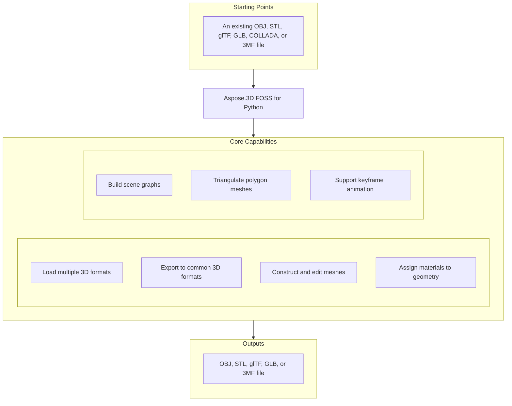

# Aspose.3D FOSS for Python

[](https://pypi.org/project/aspose-3d-foss/)  [](LICENSE) [](https://github.com/aspose-3d-foss/Aspose.3D-FOSS-for-Python/graphs/contributors)

[](https://products.aspose.org/3d/python/)

Aspose.3D FOSS for Python is a Python library for creating, reading, converting, and saving 3D scenes in formats including `.obj`, `.stl`, `.gltf`, `.glb`, `.dae`, and `.3mf`. It solves the problem of programmatically manipulating 3D geometry and materials without requiring a native 3D application, supporting tasks such as mesh construction, scene graph editing, and material assignment. Developers use it to automate 3D content generation, preprocessing for rendering pipelines, and format conversion in Python applications running on versions 3.7 through 3.12. The library is dependency-free and distributed under the MIT license.

## Navigation

- [At a Glance](#at-a-glance)
- [Key Capabilities](#key-capabilities)
- [Installation](#installation)
- [Dependencies](#dependencies)
- [Quick Start](#quick-start)
- [Additional Examples](#additional-examples)
- [API Reference](#api-reference)
- [Documentation & Resources](#documentation--resources)
- [Scope and Limitations](#scope-and-limitations)
- [Development and Testing](#development-and-testing)
- [License](#license)

## At a Glance



## Key Capabilities

- **Load multiple 3D formats.** Aspose.3D FOSS for Python reads 3D models from `.obj`, `.stl`, `.gltf`, `.glb`, `.dae`, and `.3mf` files using the `aspose.threed.Scene` class, supporting both file paths and streams for input operations.
- **Export to common 3D formats.** Aspose.3D FOSS for Python exports 3D scenes to `.obj`, `.stl`, `.gltf`, `.glb`, and `.3mf` formats, allowing customization through format-specific save options such as `binary_mode` for STL and `enable_compression` for 3MF.
- **Construct and edit meshes.** Aspose.3D FOSS for Python constructs meshes programmatically by adding control points and polygons, as demonstrated by creating a triangle or cube mesh and assigning it to a node's entity property.
- **Assign materials to geometry.** Aspose.3D FOSS for Python applies materials to 3D entities by assigning a `LambertMaterial` or `PbrMaterial` to a node, with properties such as `diffuse_color`, `metallic_factor`, and `roughness_factor` controlling appearance.
- **Build scene graphs.** Aspose.3D FOSS for Python organizes scene hierarchy using `aspose.threed.Scene`, `aspose.threed.Node`, and `aspose.threed.Transform`, enabling operations like adding child nodes, setting global transforms, and retrieving bounding boxes.
- **Triangulate polygon meshes.** Aspose.3D FOSS for Python builds polygonal geometry using `aspose.threed.PolygonBuilder`, which provides methods to add vertices and create polygons for custom mesh construction.
- **Support keyframe animation.** Aspose.3D FOSS for Python supports animation through `aspose.threed.AnimationClip`, `aspose.threed.AnimationNode`, `aspose.threed.KeyframeSequence`, and `aspose.threed.Pose`, enabling scene-level animation management and pose-based transformations.

## Installation

Install the published package from PyPI (`aspose-3d-foss`, version 26.1.0):

```bash
pip install aspose-3d-foss
```

To work from a source checkout instead, install the clone with pip:

```bash
git clone https://github.com/aspose-3d-foss/Aspose.3D-FOSS-for-Python.git
cd Aspose.3D-FOSS-for-Python
pip install .
```

Verify the install:

```bash
python -c "import aspose.threed"
```

The package supports Python 3.7, 3.8, 3.9, 3.10, 3.11, and 3.12 and declares `python_requires` as `>=3.7`.

## Dependencies

### Required Package Dependencies

No required third-party package dependencies; in `setup.py`, the `install_requires` list is empty.

### Native and System Requirements

- Requires Python 3.7 or later (`python_requires=">=3.7"` in `setup.py`).

### Development Dependencies

- `pytest>=7.0.0` (extra `dev`)

## Quick Start

Create a box primitive with a Lambert material and save it as glTF.

```python
from aspose.threed import Scene
from aspose.threed.entities import Box
from aspose.threed.shading import LambertMaterial
from aspose.threed.utilities import Vector3

scene = Scene()
box = Box(length=2.0, width=1.0, height=1.0)
material = LambertMaterial()
material.diffuse_color = Vector3(0.2, 0.6, 0.9)

scene.root_node.create_child_node("Crate", entity=box.to_mesh(), material=material)
scene.save("crate.gltf")
```

## Additional Examples

Aspose.3D FOSS for Python supports creating 3D scenes, building meshes, and saving to formats like STL, glTF, and 3MF.

### Build a triangle mesh with a PBR material and export to text-based glTF

```python
import io
import json
from aspose.threed import Scene, FileFormat
from aspose.threed.entities import Mesh
from aspose.threed.utilities import Vector3, Vector4
from aspose.threed.formats.gltf import GltfSaveOptions
from aspose.threed.shading import PbrMaterial

scene = Scene()
mesh = Mesh("TestMesh")
mesh.control_points.add(Vector4(0.0, 0.0, 0.0, 1.0))
mesh.control_points.add(Vector4(1.0, 0.0, 0.0, 1.0))
mesh.control_points.add(Vector4(0.0, 1.0, 0.0, 1.0))
mesh.create_polygon(0, 1, 2)

albedo = Vector3(0.8, 0.2, 0.3)
material = PbrMaterial("RedMaterial", albedo)
material.metallic_factor = 0.5
material.roughness_factor = 0.7

node = scene.root_node.create_child_node("TestNode")
node.entity = mesh
node.material = material

stream = io.BytesIO()
# Pass the detected FileFormat into the constructor explicitly: unlike
# StlFormat, GltfFormat.create_save_options() does not set file_format on the
# options it returns, and a bare stream (no filename) gives scene.save()
# nothing else to detect the format from.
options = GltfSaveOptions(FileFormat.get_format_by_extension(".gltf"))
options.binary_mode = False
scene.save(stream, options)

stream.seek(0)
gltf_data = json.loads(stream.read().decode("utf-8"))
print(gltf_data["materials"][0]["pbrMetallicRoughness"])
```

<details>
<summary>View Additional Examples</summary>

### Create a sphere with a metallic red material and save it as STL

```python
from aspose.threed import Scene
from aspose.threed.entities import Sphere
from aspose.threed.shading import PbrMaterial
from aspose.threed.utilities import Vector3

scene = Scene()
sphere = Sphere()
material = PbrMaterial(albedo=Vector3(0.8, 0.1, 0.1))
material.metallic_factor = 0.9
material.roughness_factor = 0.2

scene.root_node.create_child_node("Ball", entity=sphere.to_mesh(), material=material)
scene.save("ball.stl")
```

### Generate a triangle mesh and output it as ASCII STL to an in-memory stream

```python
import io
from aspose.threed import Scene, FileFormat
from aspose.threed.entities import Mesh
from aspose.threed.utilities import Vector4

scene = Scene()
mesh = Mesh("triangle")
mesh.control_points.add(Vector4(0.0, 0.0, 0.0, 1.0))
mesh.control_points.add(Vector4(1.0, 0.0, 0.0, 1.0))
mesh.control_points.add(Vector4(1.0, 1.0, 0.0, 1.0))
mesh.create_polygon(0, 1, 2)

node = scene.root_node.create_child_node("triangle_node")
node.entity = mesh

stream = io.StringIO()
# Use FileFormat.get_format_by_extension(...).create_save_options() rather than
# StlSaveOptions() directly: a default-constructed options object has no
# file_format set, and scene.save() cannot infer the format from a bare stream
# (only filename-based saves fall back to extension detection).
options = FileFormat.get_format_by_extension(".stl").create_save_options()
options.binary_mode = False
scene.save(stream, options)
print(stream.getvalue())
```

### Construct a box primitive and inspect its control point count

```python
from aspose.threed.entities import Box

box = Box(10, 20, 30)
mesh = box.to_mesh()
print(f"Control points: {len(mesh.control_points)}")
```

### Build a cube mesh and save it uncompressed to a 3MF stream

```python
import io
from aspose.threed import Scene
from aspose.threed.entities import Mesh
from aspose.threed.utilities import Vector4
from aspose.threed.formats import ThreeMfSaveOptions

scene = Scene()
mesh = Mesh("cube")
for point in [
    Vector4(0, 0, 0, 1), Vector4(1, 0, 0, 1), Vector4(1, 1, 0, 1), Vector4(0, 1, 0, 1),
    Vector4(0, 0, 1, 1), Vector4(1, 0, 1, 1), Vector4(1, 1, 1, 1), Vector4(0, 1, 1, 1),
]:
    mesh.control_points.add(point)

mesh.create_polygon(0, 1, 2)
mesh.create_polygon(0, 2, 3)
mesh.create_polygon(4, 7, 6)
mesh.create_polygon(4, 6, 5)
mesh.create_polygon(0, 4, 5)
mesh.create_polygon(0, 5, 1)
mesh.create_polygon(2, 6, 7)
mesh.create_polygon(2, 7, 3)
mesh.create_polygon(0, 3, 7)
mesh.create_polygon(0, 7, 4)
mesh.create_polygon(1, 5, 6)
mesh.create_polygon(1, 6, 2)

node = scene.root_node.create_child_node("cube")
node.entity = mesh

stream = io.BytesIO()
options = ThreeMfSaveOptions()
options.enable_compression = False
scene.save(stream, options)
```

</details>

## API Reference

The aspose-3d-foss package exposes `aspose.threed.Scene` as the primary entry point for loading, manipulating, and saving 3D scenes, with `aspose.threed.Node` and `aspose.threed.Mesh` providing hierarchical and geometric access respectively.

The verified public surface has 337 types.

<details>
<summary>View the Complete Public API Surface</summary>

### Core API

| Class | Description |
| --- | --- |
| `A3DObject` | The A3DObject class serves as the base for all objects in Aspose.3D FOSS for Python that can hold named properties and support property lookup, modification, and removal operations. |
| `AnimationChannel` | The AnimationChannel class represents a single animated property channel that stores keyframe sequences and default values for interpolation. |
| `AnimationClip` | The AnimationClip class defines a time-bounded animation sequence containing multiple animation nodes and supporting named descriptions and time range settings. |
| `AnimationNode` | The AnimationNode class represents a node in an animation hierarchy that can bind animation channels and contain sub-animations. |
| `ArrayListAdapter` | Adapter class that wraps List[T] and implements IArrayList[T]. |
| `AssetInfo` | The AssetInfo class holds metadata about a 3D asset such as author, creation time, coordinate system, and unit scale factor. |
| `Axis` | The coordinate axis. |
| `AxisSystem` | Axis system is an combination of coordinate system, up vector and front vector. |
| `BindPoint` | The BindPoint class represents a binding location in an animation system that connects animation channels to specific properties. |
| `BonePose` | The BonePose class defines a pose for a bone node in a skeleton, storing its transformation matrix and whether it is in local space. |
| `BoundingBox2D` | The axis-aligned bounding box for Vector2 |
| `BoundingBoxExtent` | The extent of the bounding box |
| `Box` | The Box class represents a box-shaped primitive geometry with configurable length, height, and segment counts. |
| `Camera` | The Camera class represents a camera entity in a 3D scene capable of rendering views with perspective or orthographic projections. |
| `Circle` | The Circle class represents a circular primitive geometry defined by control points and interpolation settings. |
| `ComposeOrder` | The order to compose transform matrix |
| `CoordinateSystem` | The left handed or right handed coordinate system. |
| `Curve` | The Curve class represents a parametric curve entity in a 3D scene, typically used for path definitions and animation paths. |
| `CustomObject` | The CustomObject class serves as a generic container for user-defined 3D objects that extend the base A3DObject functionality. |
| `Cylinder` | The Cylinder class represents a cylindrical primitive geometry with configurable height, radius, and segment counts. |
| `Dish` | The Dish class represents a dish-shaped primitive geometry, typically used for modeling spherical caps or dish-like surfaces. |
| `Ellipse` | The Ellipse class represents an elliptical primitive geometry defined by control points and interpolation settings. |
| `Entity` | The Entity class represents a renderable or manipulable object in a 3D scene, such as meshes, lights, or cameras. |
| `ExportException` | Exceptions when Aspose.3D failed to export the scene to file. |
| `Extrapolation` | The Extrapolation class provides settings for how animation values are computed beyond the defined keyframe range. |
| `FMatrix4` | Matrix 4x4 with all component in float type |
| `FileContentType` | File content type |
| `FileFormat` | The FileFormat class provides utilities for identifying and working with supported 3D file formats by extension. |
| `FileFormatType` | File format type |
| `Frustum` | The Frustum class represents a truncated pyramid-shaped primitive geometry commonly used for viewing volumes. |
| `Geometry` | The Geometry class represents a geometric entity in a 3D scene that can be rendered, such as meshes or primitives. |
| `GlobalTransform` | The GlobalTransform class encapsulates the combined transformation matrix that defines an object's position, rotation, and scale in world space. |
| `Group` | A Group represents the logical relationships of Node. |
| `INamedObject` | The INamedObject interface defines a contract for objects that can be identified by a name within the scene hierarchy. |
| `IOExtension` | Utilities to write matrix/vector to binary writer |
| `ImageRenderOptions` | The ImageRenderOptions class controls rendering settings for exporting 3D scenes to image formats, including resolution and compression. |
| `ImportException` | Exception when Aspose.3D failed to open the specified source. |
| `KeyFrame` | The KeyFrame class represents a single keyframe in an animation sequence, storing a value and its associated time. |
| `KeyframeSequence` | The KeyframeSequence class manages a collection of keyframes used to define animated values over time. |
| `Light` | The Light class represents a light source entity in a 3D scene, inheriting camera properties for rendering illumination. |
| `LinearExtrusion` | The LinearExtrusion class represents a 3D entity created by extruding a 2D profile along a straight path. |
| `MathUtils` | A set of useful mathematical utilities. |
| `Mesh` | The Mesh class represents a polygonal mesh geometry composed of vertices, edges, and faces for rendering. |
| `Node` | The Node class represents a transformable object in the scene hierarchy that can contain geometry, lights, cameras, or child nodes. |
| `ParseException` | Exception when Aspose.3D failed to parse the input. |
| `Plane` | The Plane class represents a planar primitive geometry defined by size and segment counts. |
| `PolygonBuilder` | The PolygonBuilder class provides utilities for constructing polygonal meshes from geometric primitives. |
| `Pose` | The Pose class represents a snapshot of bone transformations used in skeletal animation systems. |
| `Primitive` | The Primitive class represents a basic geometric shape such as a box, cylinder, or sphere that can be used as a building block in scenes. |
| `Property` | The Property class represents a single named property that can store typed values on scene objects. |
| `PropertyCollection` | The PropertyCollection class manages a collection of named properties attached to an object for customization and metadata. |
| `PropertyFlags` | Property's flags |
| `Rect` | A class to represent the rectangle |
| `RelativeRectangle` | Relative rectangle |
| `RotationOrder` | The order controls which rx ry rz are applied in the transformation matrix. |
| `Scene` | The Scene class represents a complete 3D scene containing nodes, entities, animations, and asset metadata. |
| `SceneObject` | The SceneObject class serves as the base for all objects that can be part of a 3D scene hierarchy. |
| `SemanticAttribute` | Allow user to use their own structure for static declaration of VertexDeclaration |
| `Sphere` | The Sphere class represents a sphere primitive in Aspose.3D FOSS for Python, defined by radius and angular segments. |
| `Transform` | The Transform class encapsulates geometric transformations such as translation, rotation, and scaling for 3D objects in Aspose.3D FOSS for Python. |
| `TransformBuilder` | The TransformBuilder is used to build transform matrix by a chain of transformations. |
| `TrialException` | This is raised in Scene.Open/Scene.Save when no licenses are applied. |
| `Vertex` | Vertex reference, used to access the raw vertex in TriMesh. |
| `VertexDeclaration` | The declaration of a custom defined vertex's structure |
| `VertexField` | Vertex's field memory layout description. |
| `VertexFieldDataType` | Vertex field's data type |
| `VertexFieldSemantic` | The semantic of the vertex field |
| `Bone` | The Bone class represents a bone in a skeletal animation system within Aspose.3D FOSS for Python. |
| `BoneLinkMode` | The BoneLinkMode class defines enumeration values that specify how bones link to nodes in Aspose.3D FOSS for Python. |
| `Deformer` | The Deformer class serves as the base class for mesh deformation operations in Aspose.3D FOSS for Python. |
| `MorphTargetChannel` | The MorphTargetChannel class manages a single channel of morph target animation weights in Aspose.3D FOSS for Python. |
| `MorphTargetDeformer` | The MorphTargetDeformer class applies morph target animations to meshes in Aspose.3D FOSS for Python. |
| `SkinDeformer` | The SkinDeformer class enables skinning deformation by binding vertices to bones in Aspose.3D FOSS for Python. |
| `ApertureMode` | Camera aperture modes. |
| `BooleanOperand` | This class encapsulates the transformed mesh as Boolean operation's operand. |
| `BooleanOperation` | The BooleanOperation class defines enumeration values for boolean operations on 3D entities in Aspose.3D FOSS for Python. |
| `BooleanOperator` | Boolean operator allows you to apply Boolean operation on two IMeshConvertible instances. |
| `CompositeCurve` | A CompositeCurve is consisting of several curve segments. |
| `CurveDimension` | The CurveDimension class specifies the dimensionality of curves in Aspose.3D FOSS for Python. |
| `EndPoint` | The end point to trim the curve, can be a parameter value or a Cartesian point. |
| `HalfSpace` | HalfSpace represents a infinity space which is split by a plane, this can be used with BooleanOperator |
| `IIndexedVertexElement` | The IIndexedVertexElement interface represents a vertex element with indexed data in Aspose.3D FOSS for Python. |
| `IMeshConvertible` | Entities that implemented this interface can be converted to Mesh |
| `IOrientable` | Orientable entities shall implement this interface. |
| `LightType` | Light types. |
| `Line` | A polyline is a path defined by a set of points with control_points, and connected by segments. |
| `MappingMode` | The MappingMode class defines enumeration values that control texture mapping modes in Aspose.3D FOSS for Python. |
| `NurbsCurve` | The NurbsCurve class represents a non-uniform rational B-spline curve in Aspose.3D FOSS for Python. |
| `NurbsDirection` | The NurbsDirection class describes the properties of a NURBS direction in Aspose.3D FOSS for Python. |
| `NurbsSurface` | The NurbsSurface class represents a non-uniform rational B-spline surface in Aspose.3D FOSS for Python. |
| `NurbsType` | The NurbsType class defines enumeration values that specify NURBS curve or surface types in Aspose.3D FOSS for Python. |
| `Patch` | The Patch class represents a parametric surface patch in Aspose.3D FOSS for Python. |
| `PatchDirection` | The PatchDirection class specifies the direction of a surface patch in Aspose.3D FOSS for Python. |
| `PatchDirectionType` | The PatchDirectionType class defines enumeration values for patch direction types in Aspose.3D FOSS for Python. |
| `PointCloud` | The PointCloud class represents a collection of points in 3D space in Aspose.3D FOSS for Python. |
| `InvalidOperationException` | The InvalidOperationException class is raised when an invalid operation is performed during polygon construction in Aspose.3D FOSS for Python. |
| `PolygonModifier` | The PolygonModifier class provides utilities for modifying polygonal meshes in Aspose.3D FOSS for Python. |
| `ProjectionType` | Camera's projection types. |
| `Pyramid` | Parameterized pyramid. |
| `RectangularTorus` | Parameterized rectangular torus entity. |
| `ReferenceMode` | The ReferenceMode class defines enumeration values that control reference modes in Aspose.3D FOSS for Python. |
| `RevolvedAreaSolid` | RevolvedAreaSolid entity. |
| `RotationMode` | The frustum's rotation mode. |
| `Shape` | Base class for all shape entities. |
| `Skeleton` | The Skeleton is mainly used by CAD software to help designer to manipulate the transformation of skeletal structure, it's usually useless outside the CAD softwares. |
| `SkeletonType` | Skeleton type enum. |
| `SplitMeshPolicy` | Share vertex/control point data between sub-meshes or each sub-mesh has its own compacted data. |
| `SweptAreaSolid` | SweptAreaSolid entity. |
| `TextureMapping` | The TextureMapping class defines enumeration values for texture coordinate mapping in Aspose.3D FOSS for Python. |
| `Torus` | Parameterized torus entity. |
| `TransformedCurve` | TransformedCurve entity. |
| `TriMesh` | TriMesh is a triangle mesh that stores triangles. |
| `TrimmedCurve` | TrimmedCurve entity. |
| `VertexElement` | The VertexElement class represents a generic vertex element in Aspose.3D FOSS for Python. |
| `VertexElementBinormal` | The VertexElementBinormal class represents binormal data for vertices in Aspose.3D FOSS for Python. |
| `VertexElementDoublesTemplate` | A helper class for defining concrete implementations. |
| `VertexElementEdgeCrease` | Defines the edge crease values for specified components. |
| `VertexElementFVector` | The VertexElementFVector class represents floating-point vector vertex data in Aspose.3D FOSS for Python. |
| `VertexElementHole` | Defines the hole information for specified components. |
| `VertexElementIntsTemplate` | A helper class for defining concrete implementations with int data. |
| `VertexElementMaterial` | Defines the material for specified components. |
| `VertexElementNormal` | The VertexElementNormal class represents normal vectors for vertices in Aspose.3D FOSS for Python. |
| `VertexElementPolygonGroup` | Defines the polygon group for specified components. |
| `VertexElementSmoothingGroup` | The VertexElementSmoothingGroup class represents smoothing group data for vertices in Aspose.3D FOSS for Python. |
| `VertexElementSpecular` | Defines the specular color for specified components. |
| `VertexElementTangent` | The VertexElementTangent class represents tangent vectors for vertices in Aspose.3D FOSS for Python. |
| `VertexElementTemplate` | A helper class for defining concrete implementations of vertex elements with typed data. |
| `VertexElementType` | The VertexElementType class defines enumeration values for vertex element types in Aspose.3D FOSS for Python. |
| `VertexElementUV` | The VertexElementUV class represents texture coordinate data for vertices in Aspose.3D FOSS for Python. |
| `VertexElementUserData` | Defines the user data for specified components. |
| `VertexElementVector4` | Defines the vector4 data for specified components. |
| `VertexElementVertexColor` | The VertexElementVertexColor class represents vertex color data in Aspose.3D FOSS for Python. |
| `VertexElementVertexCrease` | Defines the vertex crease values for specified components. |
| `VertexElementVisibility` | Defines the visibility for specified components. |
| `VertexElementWeight` | Defines the weight for specified components. |
| `A3dwSaveOptions` | Save options for A3DW |
| `AmfSaveOptions` | Save options for AMF |
| `BasicLoadOptions` | Simple LoadOptions subclass for basic loading options. |
| `ColladaLoadOptions` | Load options for Collada |
| `ColladaSaveOptions` | Save options for collada |
| `ColladaTransformStyle` | The node's transformation style of node |
| `Discreet3dsLoadOptions` | Load options for Discreet 3DS |
| `Discreet3dsSaveOptions` | Save options for Discreet 3DS |
| `DracoCompressionLevel` | Compression level for draco file |
| `DracoFormat` | Google Draco format |
| `DracoSaveOptions` | Save options for Draco |
| `Exporter` | The Exporter class provides functionality to export 3D scenes to various file formats in Aspose.3D FOSS for Python. |
| `FbxLoadOptions` | Load options for FBX |
| `FbxSaveOptions` | Save options for FBX |
| `FormatDetector` | The FormatDetector class identifies the format of a 3D file in Aspose.3D FOSS for Python. |
| `GltfEmbeddedImageFormat` | Embedded image format for GLTF |
| `formats.GltfLoadOptions` | Load options for glTF |
| `formats.GltfSaveOptions` | Save options for glTF |
| `Html5SaveOptions` | Save options for HTML5 |
| `IOConfig` | The IOConfig class holds input/output configuration options for file operations in Aspose.3D FOSS for Python. |
| `IOService` | The IOService class provides core input/output services for file handling in Aspose.3D FOSS for Python. |
| `Importer` | The Importer class provides functionality to import 3D scenes from various file formats in Aspose.3D FOSS for Python. |
| `JtLoadOptions` | Load options for JT |
| `LoadOptions` | The LoadOptions class provides configuration options for loading 3D scenes in Aspose.3D FOSS for Python. |
| `Microsoft3MFFormat` | Microsoft 3MF format |
| `Microsoft3MFSaveOptions` | Save options for Microsoft 3MF |
| `formats.ObjLoadOptions` | Load options for OBJ |
| `formats.ObjSaveOptions` | Save options for OBJ |
| `PdfFormat` | Adobe's Portable Document Format |
| `PdfLightingScheme` | Lighting scheme for PDF export |
| `PdfLoadOptions` | Load options for PDF |
| `PdfRenderMode` | Render mode for PDF export |
| `PdfSaveOptions` | Save options for PDF |
| `Plugin` | The Plugin class serves as an abstract base for format plugins that provide import, export, and format detection capabilities in Aspose.3D FOSS for Python. |
| `PlyFormat` | PLY format |
| `PlyLoadOptions` | Load options for PLY |
| `PlySaveOptions` | Save options for PLY |
| `RvmFormat` | RVM format |
| `RvmLoadOptions` | Load options for RVM |
| `RvmSaveOptions` | Save options for RVM |
| `SaveOptions` | The SaveOptions class provides configuration options for saving 3D scenes in Aspose.3D FOSS for Python. |
| `formats.StlLoadOptions` | Load options for STL |
| `formats.StlSaveOptions` | Save options for STL |
| `ThreeMfFormat` | The ThreeMfFormat class represents the 3MF file format and provides methods to import and export 3MF files in Aspose.3D FOSS for Python. |
| `ThreeMfLoadOptions` | The ThreeMfLoadOptions class allows customization of loading behavior for 3MF files in Aspose.3D FOSS for Python. |
| `ThreeMfSaveOptions` | The ThreeMfSaveOptions class allows customization of saving behavior for 3MF files in Aspose.3D FOSS for Python. |
| `U3dLoadOptions` | Load options for U3D |
| `U3dSaveOptions` | Save options for U3D |
| `UsdSaveOptions` | Save options for USD |
| `XLoadOptions` | Load options for X format |
| `ColladaExporter` | The ColladaExporter class enables exporting 3D scenes to the COLLADA format in Aspose.3D FOSS for Python. |
| `ColladaFormat` | The ColladaFormat class represents the COLLADA file format and provides methods to import and export COLLADA files in Aspose.3D FOSS for Python. |
| `ColladaFormatDetector` | The ColladaFormatDetector class detects whether a file is in the COLLADA format in Aspose.3D FOSS for Python. |
| `ColladaImporter` | The ColladaImporter class enables importing 3D scenes from the COLLADA format in Aspose.3D FOSS for Python. |
| `ColladaPlugin` | The ColladaPlugin class provides COLLADA format support by exposing importers, exporters, and format detectors in Aspose.3D FOSS for Python. |
| `FbxExporter` | The FbxExporter class enables exporting 3D scenes to the FBX format in Aspose.3D FOSS for Python. |
| `FbxFormat` | The FbxFormat class represents the FBX file format and provides methods to import and export FBX files in Aspose.3D FOSS for Python. |
| `FbxFormatDetector` | The FbxFormatDetector class detects whether a file is in the FBX format in Aspose.3D FOSS for Python. |
| `FbxImporter` | The FbxImporter class enables importing 3D scenes from the FBX format in Aspose.3D FOSS for Python. |
| `FbxPlugin` | The FbxPlugin class provides FBX format support by exposing importers, exporters, and format detectors in Aspose.3D FOSS for Python. |
| `BinaryTokenizer` | The BinaryTokenizer class tokenizes binary FBX files for parsing in Aspose.3D FOSS for Python. |
| `binary_tokenizer.Token` | The Token class represents a single token in the binary FBX tokenizer in Aspose.3D FOSS for Python. |
| `binary_tokenizer.TokenType` | The TokenType class defines the types of tokens used in the binary FBX tokenizer in Aspose.3D FOSS for Python. |
| `FbxElement` | The FbxElement class represents a parsed element in the FBX file structure in Aspose.3D FOSS for Python. |
| `FbxParser` | The FbxParser class parses binary FBX files into a structured representation in Aspose.3D FOSS for Python. |
| `FbxScope` | The FbxScope class defines a scope context during FBX parsing in Aspose.3D FOSS for Python. |
| `FbxTokenizer` | The FbxTokenizer class tokenizes text-based FBX files for parsing in Aspose.3D FOSS for Python. |
| `tokenizer.Token` | The Token class represents a single token in the text-based FBX tokenizer in Aspose.3D FOSS for Python. |
| `tokenizer.TokenType` | The TokenType class defines the types of tokens used in the text-based FBX tokenizer in Aspose.3D FOSS for Python. |
| `GltfExporter` | The GltfExporter class enables exporting 3D scenes to the glTF format in Aspose.3D FOSS for Python. |
| `GltfFormat` | The GltfFormat class represents the glTF file format and provides methods to import and export glTF files in Aspose.3D FOSS for Python. |
| `GltfFormatDetector` | The GltfFormatDetector class detects whether a file is in the glTF format in Aspose.3D FOSS for Python. |
| `GltfImporter` | The GltfImporter class enables importing 3D scenes from the glTF format in Aspose.3D FOSS for Python. |
| `gltf.GltfLoadOptions` | The GltfLoadOptions class allows customization of loading behavior for glTF files in Aspose.3D FOSS for Python. |
| `GltfPlugin` | The GltfPlugin class provides glTF format support by exposing importers, exporters, and format detectors in Aspose.3D FOSS for Python. |
| `gltf.GltfSaveOptions` | The GltfSaveOptions class allows customization of saving behavior for glTF files in Aspose.3D FOSS for Python. |
| `ObjExporter` | The ObjExporter class enables exporting 3D scenes to the OBJ format in Aspose.3D FOSS for Python. |
| `ObjFormat` | The ObjFormat class represents the OBJ file format and provides methods to import and export OBJ files in Aspose.3D FOSS for Python. |
| `ObjFormatDetector` | The ObjFormatDetector class detects whether a file is in the OBJ format in Aspose.3D FOSS for Python. |
| `ObjImporter` | The ObjImporter class enables importing 3D scenes from the OBJ format in Aspose.3D FOSS for Python. |
| `obj.ObjLoadOptions` | The ObjLoadOptions class allows customization of loading behavior for OBJ files in Aspose.3D FOSS for Python. |
| `ObjPlugin` | The ObjPlugin class provides OBJ format support by exposing importers, exporters, and format detectors in Aspose.3D FOSS for Python. |
| `obj.ObjSaveOptions` | The ObjSaveOptions class allows customization of saving behavior for OBJ files in Aspose.3D FOSS for Python. |
| `StlExporter` | The StlExporter class enables exporting 3D scenes to the STL format in Aspose.3D FOSS for Python. |
| `StlFormat` | The StlFormat class represents the STL file format and provides properties such as extension, content type, and version, along with methods to create load and save options and detect supported formats. |
| `StlFormatDetector` | The StlFormatDetector class detects whether a given input stream or file contains STL format data by inspecting its content. |
| `StlImporter` | The StlImporter class imports scenes from STL files and supports detection of the STL format via its import_scene and supports_format methods. |
| `stl.StlLoadOptions` | The StlLoadOptions class provides configuration options for loading STL files, including coordinate system flipping and scaling. |
| `StlPlugin` | The StlPlugin class acts as a plugin for the STL format, offering access to importers, exporters, format detectors, and methods to create load and save options. |
| `stl.StlSaveOptions` | The StlSaveOptions class provides configuration options for saving scenes to STL files, including binary mode, coordinate system flipping, and scaling. |
| `ThreeMfExporter` | The ThreeMfExporter class exports scenes to the 3MF format and supports format detection via its export and supports_format methods. |
| `ThreeMfFormatDetector` | The ThreeMfFormatDetector class detects whether a given input stream or file contains 3MF format data by inspecting its content. |
| `ThreeMfImporter` | The ThreeMfImporter class imports scenes from 3MF files and supports detection of the 3MF format via its import_scene and supports_format methods. |
| `ThreeMfPlugin` | The ThreeMfPlugin class acts as a plugin for the 3MF format, offering access to importers, exporters, format detectors, and methods to create load and save options. |
| `ArbitraryProfile` | This class allows you to construct a 2D profile directly from arbitrary curve. |
| `CShape` | IFC compatible C-shape profile that defined by parameters. |
| `CenterLineProfile` | IFC compatible center line profile. |
| `CircleShape` | IFC compatible circle profile. |
| `EllipseShape` | IFC compatible ellipse profile. |
| `FontFile` | Font file contains definitions for glyphs, this is used to create text profile. |
| `HShape` | IFC compatible H-shape profile. |
| `HollowCircleShape` | IFC compatible hollow circle profile. |
| `HollowRectangleShape` | IFC compatible hollow rectangular shape with both inner/outer rounding corners. |
| `LShape` | IFC compatible L-shape profile that defined by parameters. |
| `MirroredProfile` | IFC compatible mirror profile. |
| `ParameterizedProfile` | The base class of all parameterized profiles. |
| `Profile` | 2D Profile in xy plane. |
| `RectangleShape` | IFC compatible rectangle profile. |
| `TShape` | IFC compatible T-shape defined by parameters. |
| `Text` | Text profile, this profile describes contours using font and text. |
| `TrapeziumShape` | IFC compatible Trapezium shape defined by parameters. |
| `UShape` | IFC compatible U-shape defined by parameters. |
| `ZShape` | IFC compatible Z-shape profile that defined by parameters. |
| `BlendFactor` | Blend factor specify pixel arithmetic. |
| `CompareFunction` | Compare function for depth/stencil testing. |
| `CubeFace` | Cube face enumeration. |
| `CullFaceMode` | Cull face mode for face culling. |
| `DescriptorSetUpdater` | Descriptor set updater for shader resources. |
| `DrawOperation` | Draw operation type. |
| `DriverException` | Exception thrown when rendering driver fails. |
| `EntityRenderer` | Base class for rendering entities. |
| `EntityRendererFeatures` | Features supported by an entity renderer. |
| `EntityRendererKey` | The key of registered entity renderer. |
| `FrontFace` | Front face winding order. |
| `GLSLSource` | GLSL shader source. |
| `IBuffer` | Interface for vertex/index buffer. |
| `ICommandList` | Interface for command list. |
| `IDescriptorSet` | Interface for descriptor set. |
| `IIndexBuffer` | Interface for index buffer. |
| `IPipeline` | Interface for graphics pipeline. |
| `IRenderQueue` | Interface for render queue. |
| `IRenderTarget` | Interface for render target. |
| `IRenderTexture` | Interface for render texture. |
| `IRenderWindow` | Interface for render window. |
| `ITexture1D` | Interface for 1D texture. |
| `ITexture2D` | Interface for 2D texture. |
| `ITextureCodec` | Interface for texture codec. |
| `ITextureCubemap` | Interface for cubemap texture. |
| `ITextureDecoder` | Interface for texture decoder. |
| `ITextureEncoder` | Interface for texture encoder. |
| `ITextureUnit` | Interface for texture unit. |
| `IVertexBuffer` | Interface for vertex buffer. |
| `IndexDataType` | Data type for indices. |
| `InitializationException` | Exception thrown when rendering initialization fails. |
| `PixelFormat` | Pixel format for render targets. |
| `PixelMapMode` | Pixel mapping mode. |
| `PixelMapping` | Pixel mapping configuration. |
| `PolygonMode` | Polygon rendering mode. |
| `PostProcessing` | Post-processing effect. |
| `PresetShaders` | Predefined shaders. |
| `PushConstant` | Push constant for shaders. |
| `RenderFactory` | RenderFactory creates all resources that represented in rendering pipeline. |
| `RenderParameters` | Parameters for rendering. |
| `RenderQueueGroupId` | Render queue group ID. |
| `RenderResource` | Base class for render resources. |
| `RenderStage` | Render stage in the pipeline. |
| `RenderState` | Render state configuration. |
| `Renderer` | The context about renderer. |
| `RendererVariableManager` | Manages renderer variables. |
| `SPIRVSource` | SPIRV shader source. |
| `ShaderException` | Exception thrown when shader compilation/linking fails. |
| `ShaderProgram` | Shader program. |
| `ShaderSet` | Set of shaders for rendering. |
| `ShaderSource` | Shader source code. |
| `ShaderStage` | Shader stage. |
| `ShaderVariable` | Shader variable. |
| `StencilAction` | Stencil action. |
| `StencilState` | Stencil state configuration. |
| `TextureCodec` | Texture codec. |
| `TextureData` | Texture data. |
| `TextureType` | Texture type. |
| `Viewport` | Viewport for rendering. |
| `WindowHandle` | Window handle for render window. |
| `AlphaSource` | Source of alpha channel for textures. |
| `LambertMaterial` | The LambertMaterial class represents a Lambert shading material with properties for ambient, diffuse, emissive, transparency, and transparent colors. |
| `Material` | The Material class is the base class for all shading materials and provides methods to get and set textures. |
| `PbrMaterial` | The PbrMaterial class represents a physically based rendering material with properties such as albedo, metallic factor, roughness, emissive color, and various texture maps. |
| `PbrSpecularMaterial` | Material for physically based rendering based on diffuse color/specular/glossiness. |
| `PhongMaterial` | The PhongMaterial class represents a Phong shading material extending LambertMaterial with properties for reflection, shininess, and specular color and factor. |
| `ShaderMaterial` | A shader material allows to describe the material by external rendering engine or shader language. |
| `ShaderTechnique` | A technique in shader material describes the concrete rendering details. |
| `Texture` | This class defines the texture from an external file. |
| `TextureBase` | Base class for all texture types. |
| `TextureFilter` | Texture filter type. |
| `TextureSlot` | Texture slot name. |
| `WrapMode` | Wrap mode for texture coordinates. |
| `BoundingBox` | The BoundingBox class represents an axis-aligned bounding box and provides a center property. |
| `FVector2` | The FVector2 class represents a two-dimensional vector of single-precision floating-point components. |
| `FVector3` | The FVector3 class represents a three-dimensional vector of single-precision floating-point components. |
| `FVector4` | The FVector4 class represents a four-dimensional vector of single-precision floating-point components. |
| `FileSystem` | File system encapsulation. |
| `Matrix4` | The Matrix4 class represents a 4x4 matrix used for 3D transformations. |
| `Quaternion` | The Quaternion class represents a quaternion used for 3D rotations. |
| `Vector2` | The Vector2 class represents a two-dimensional vector of double-precision floating-point components. |
| `Vector3` | The Vector3 class represents a three-dimensional vector of double-precision floating-point components. |
| `Vector4` | The Vector4 class represents a four-dimensional vector of double-precision floating-point components. |
| `Watermark` | Utility to encode/decode blind watermark to/from a mesh. |

#### Enumerations

| Enumeration | Description |
| --- | --- |
| `ExtrapolationType` | The ExtrapolationType class defines enumeration values that specify how animation curves behave outside their keyframe range. |
| `Interpolation` | The Interpolation class defines enumeration values that specify how animation values are interpolated between keyframes. |
| `PoseType` | The PoseType class defines enumeration values that specify the type of pose being represented in skeletal animation. |
| `StepMode` | The StepMode class defines enumeration values that control the step mode behavior in Aspose.3D FOSS for Python. |
| `WeightedMode` | The WeightedMode class defines enumeration values that specify how weights are applied in Aspose.3D FOSS for Python. |

#### Detailed Member Reference

### threed

The `aspose.threed` module provides core scene management through `Scene`, which supports opening files, traversing the node hierarchy via `root_node` and `child_nodes`, and saving results in supported formats.

### shading

The `aspose.threed.shading` module exposes material types including `LambertMaterial`, `PhongMaterial`, and `PbrMaterial` to define surface appearance for 3D entities.

### utilities

The `aspose.threed.utilities` module provides `Vector3` and `Vector4` for representing 3D positions, directions, and homogeneous coordinates.

### entities

The `aspose.threed.entities` module offers primitive shapes such as `Box`, `Sphere`, and `Cylinder` that can be converted to `Mesh` instances for scene inclusion.

### formats

The `aspose.threed.formats` module provides format-specific classes including `ObjFormat`, `StlFormat`, `GltfFormat`, and `ThreeMfFormat` to control loading and saving behavior.

</details>

## Documentation & Resources

- **[Getting started guide](https://docs.aspose.org/3d/python/)** — The Aspose.3D FOSS for Python documentation covers loading, inspecting, and converting 3D scenes using the aspose-3d-foss package version 26.1.0 on Python versions 3.7 through 3.12.
- **[How-to guides & FAQ](https://kb.aspose.org/3d/python/)** — The Aspose.3D FOSS for Python knowledge base provides troubleshooting guidance and worked examples for common tasks such as reading scene hierarchies, modifying meshes, and saving to various 3D formats.
- **[Full API reference](https://reference.aspose.org/3d/python/)** — The Aspose.3D FOSS for Python API reference lists all public classes, methods, and properties including `Scene`, `root_node`, entity, `control_points`, `create_child_node`, `create_polygon`, save, and decode. The enterprise edition includes additional features not available in the FOSS version. It covers all 337 verified public types; the [API Reference](#api-reference) section above covers the essentials.
- Found a bug or have a feature request? [Open an issue](https://github.com/aspose-3d-foss/Aspose.3D-FOSS-for-Python/issues).

## Scope and Limitations

Aspose.3D FOSS for Python version 26.1.0 supports loading and saving common 3D formats such as OBJ, STL, glTF, and COLLADA, and provides basic scene navigation, node manipulation, and mesh inspection capabilities for those formats.

- No file format registers an importer or exporter for PDF, PLY, RVM, U3D, JT, AMF, HTML5, A3DW, USD, or Draco in this build — `PdfSaveOptions`, `PlyLoadOptions`, `DracoSaveOptions`, and similar option classes exist as public types, but `Scene.open`() and `Scene.save`() cannot detect or dispatch any of these extensions, and raise a RuntimeError if you try.
- FBX support is experimental: `FbxImporter` has a working tokenizer and parser but no bundled test opens a real `.fbx` fixture through it, and `FbxExporter.save`() and `save_to_stream()` both raise NotImplementedError outright, so FBX is import-only at best.
- COLLADA import works, but COLLADA export is not reachable through `Scene.save`() because `IOService`'s exporter lookup reaches `FbxExporter` (whose `supports_format()` raises unconditionally) before it ever reaches `ColladaExporter`.
- `Scene.render`() and the entire `aspose.threed.render` module (`Renderer`, `RenderFactory`, `Viewport`, and related classes) raise NotImplementedError — this library does not render scenes to images.
- `Texture` and `TextureBase` raise NotImplementedError on construction, so an image-backed texture cannot be created; material color and factor properties (`diffuse_color`, `metallic_factor`, `roughness_factor`, and similar) work independently of texture assignment.
- `Watermark.encode_watermark`() and `decode_watermark()`, every `TransformBuilder` method, `Mesh.do_boolean`() and its boolean variants, `NurbsCurve.evaluate`() and `evaluate_at()`, `NurbsSurface.to_mesh`(), `PointCloud.from_geometry`() and `from_geometry_with_density()`, and `AxisSystem` on every method raise NotImplementedError.

These limitations don't apply to [Aspose.3D for Python — Enterprise Edition](https://products.aspose.com/3d/python-net/). Aspose.3D FOSS for Python provides open-source 3D processing capabilities, while the commercial edition adds advanced features such as support for more file formats, enhanced performance, and commercial licensing.

## Development and Testing

Build and test Aspose.3D FOSS for Python using the assets in the tests/ directory and the CI workflows in .github/workflows/; the package requires Python >=3.7 and supports versions 3.7, 3.8, 3.9, 3.10, 3.11, and 3.12.

The suite covers 34 test files under `tests/`. Releases run through the [publish workflow](.github/workflows/publish.yml).

## License

This project is licensed under the [MIT License](LICENSE). The MIT License permits use, copying, modification, distribution, sublicensing, and commercial use, provided its copyright and permission notice are retained. The software is provided without warranty.
