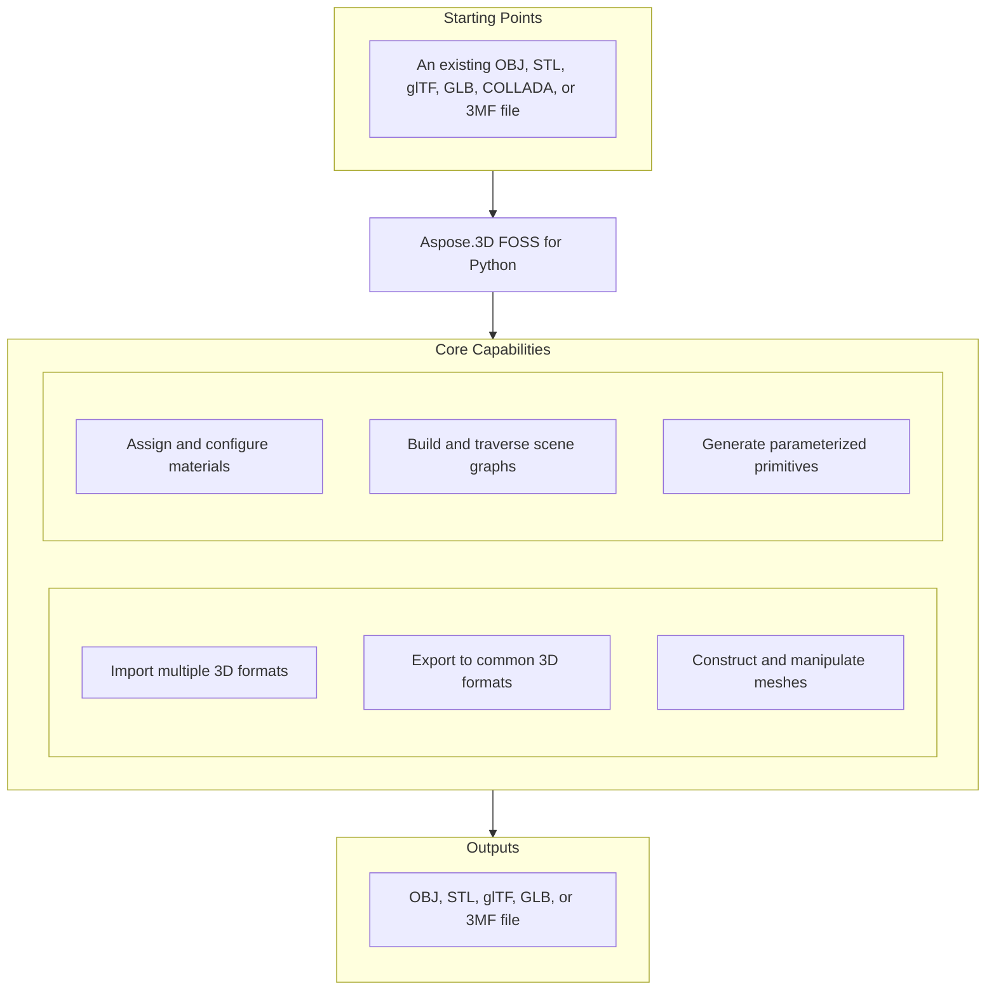

# Aspose.3D FOSS for Python

[](https://pypi.org/project/aspose-3d-foss/)  [](LICENSE) [](https://github.com/aspose-3d-foss/Aspose.3D-FOSS-for-Python/graphs/contributors)

[](https://products.aspose.org/3d/python/)

Aspose.3D FOSS for Python is a Python library for working with 3D documents, supporting formats such as `.obj`, `.stl`, `.gltf`, `.glb`, `.3mf`, `.fbx`, and `.dae`. It enables developers to create, read, convert, and save 3D scenes and geometric primitives like `Box`, `Sphere`, and `Cylinder`, as well as build custom meshes using `Mesh` and `PolygonBuilder`. Users can manage scene hierarchy with `Node`, apply materials from `aspose.threed.shading`, and handle animations through `AnimationClip` and related classes. The package targets Python 3.7 through 3.12 and is distributed under the MIT license.

## Navigation

- [At a Glance](#at-a-glance)
- [Key Capabilities](#key-capabilities)
- [Installation](#installation)
- [Dependencies](#dependencies)
- [Quick Start](#quick-start)
- [Additional Examples](#additional-examples)
- [API Reference](#api-reference)
- [Documentation & Resources](#documentation--resources)
- [Scope and Limitations](#scope-and-limitations)
- [Development and Testing](#development-and-testing)
- [License](#license)

## At a Glance



## Key Capabilities

- **Import multiple 3D formats.** Read OBJ, STL, glTF, GLB, COLLADA, and 3MF files using `Scene.open`, which auto-detects the format from the file extension or an explicit `FileFormat`.
- **Export to common 3D formats.** Write scenes to OBJ, STL, glTF, GLB, and 3MF files using `Scene.save` with format-specific `SaveOptions` for coordinate flipping, unit scaling, and compression settings.
- **Construct and manipulate meshes.** Build and edit mesh geometry directly through `Mesh.control_points`, `Mesh.create_polygon`, and `Mesh.polygons`, or construct polygons using `PolygonBuilder.begin`, `add_vertex`, and end.
- **Assign and configure materials.** Assign `LambertMaterial`, `PhongMaterial`, or `PbrMaterial` to nodes and configure diffuse, metallic, and roughness properties directly through shading module classes.
- **Build and traverse scene graphs.** Organize scene hierarchy with `Node.create_child_node` and `Node.add_child_node`, where each node holds its own `Transform` for translation, rotation, and scaling independent of attached entities.
- **Generate parameterized primitives.** Create parameterized primitives such as `Box`, `Sphere`, and `Cylinder` and convert them to editable `Mesh` geometry by calling their `to_mesh` method.
- **Support keyframe animation.** Construct keyframe animations using `AnimationClip`, `AnimationNode`, and `KeyframeSequence`, and store skeletal bind-pose data with `Pose`.

## Installation

Install the published package from PyPI (`aspose-3d-foss`, version 26.1.0):

```bash
pip install aspose-3d-foss
```

To work from a source checkout instead, install the clone with pip:

```bash
git clone https://github.com/aspose-3d-foss/Aspose.3D-FOSS-for-Python.git
cd Aspose.3D-FOSS-for-Python
pip install .
```

Verify the install:

```bash
python -c "import aspose.threed"
```

The package supports Python 3.7, 3.8, 3.9, 3.10, 3.11, and 3.12 and declares `python_requires` as `>=3.7`.

## Dependencies

### Required Package Dependencies

No required third-party package dependencies; in `setup.py`, the `install_requires` list is empty.

### Native and System Requirements

- Requires Python 3.7 or later (`python_requires=">=3.7"` in `setup.py`).

### Development Dependencies

- `pytest>=7.0.0` (extra `dev`)

## Quick Start

Import an OBJ file and inspect its geometry by reading control points and polygons from each entity.

```python
from aspose.threed import Scene
from aspose.threed.entities import Box
from aspose.threed.shading import LambertMaterial
from aspose.threed.utilities import Vector3

scene = Scene()
box = Box(length=2.0, width=1.0, height=1.0)
material = LambertMaterial()
material.diffuse_color = Vector3(0.2, 0.6, 0.9)

scene.root_node.create_child_node("Crate", entity=box.to_mesh(), material=material)
scene.save("crate.gltf")
```

Build a 3D scene from scratch by creating a sphere with a PBR material and saving it as an STL file.

```python
from aspose.threed import Scene
from aspose.threed.entities import Sphere
from aspose.threed.shading import PbrMaterial
from aspose.threed.utilities import Vector3

scene = Scene()
sphere = Sphere()
material = PbrMaterial(albedo=Vector3(0.8, 0.1, 0.1))
material.metallic_factor = 0.9
material.roughness_factor = 0.2

scene.root_node.create_child_node("Ball", entity=sphere.to_mesh(), material=material)
scene.save("ball.stl")
```

## Additional Examples

More real, verified snippets are collected below, each demonstrating one operation without obscuring the primary installation and quick-start path.

### Construct a mesh vertex by vertex, attach a PBR material, write the scene to an in-memory glTF stream, and read the exported material back out of the glTF JSON

```python
import io
import json
from aspose.threed import Scene, FileFormat
from aspose.threed.entities import Mesh
from aspose.threed.utilities import Vector3, Vector4
from aspose.threed.formats.gltf import GltfSaveOptions
from aspose.threed.shading import PbrMaterial

scene = Scene()
mesh = Mesh("TestMesh")
mesh.control_points.add(Vector4(0.0, 0.0, 0.0, 1.0))
mesh.control_points.add(Vector4(1.0, 0.0, 0.0, 1.0))
mesh.control_points.add(Vector4(0.0, 1.0, 0.0, 1.0))
mesh.create_polygon(0, 1, 2)

albedo = Vector3(0.8, 0.2, 0.3)
material = PbrMaterial("RedMaterial", albedo)
material.metallic_factor = 0.5
material.roughness_factor = 0.7

node = scene.root_node.create_child_node("TestNode")
node.entity = mesh
node.material = material

stream = io.BytesIO()
# Pass the detected FileFormat into the constructor explicitly: unlike
# StlFormat, GltfFormat.create_save_options() does not set file_format on the
# options it returns, and a bare stream (no filename) gives scene.save()
# nothing else to detect the format from.
options = GltfSaveOptions(FileFormat.get_format_by_extension(".gltf"))
options.binary_mode = False
scene.save(stream, options)

stream.seek(0)
gltf_data = json.loads(stream.read().decode("utf-8"))
print(gltf_data["materials"][0]["pbrMetallicRoughness"])
```

<details>
<summary>View Additional Examples</summary>

### Build a triangle mesh and export it to ASCII STL using an in-memory stream

```python
import io
from aspose.threed import Scene, FileFormat
from aspose.threed.entities import Mesh
from aspose.threed.utilities import Vector4

scene = Scene()
mesh = Mesh("triangle")
mesh.control_points.add(Vector4(0.0, 0.0, 0.0, 1.0))
mesh.control_points.add(Vector4(1.0, 0.0, 0.0, 1.0))
mesh.control_points.add(Vector4(1.0, 1.0, 0.0, 1.0))
mesh.create_polygon(0, 1, 2)

node = scene.root_node.create_child_node("triangle_node")
node.entity = mesh

stream = io.StringIO()
# Use FileFormat.get_format_by_extension(...).create_save_options() rather than
# StlSaveOptions() directly: a default-constructed options object has no
# file_format set, and scene.save() cannot infer the format from a bare stream
# (only filename-based saves fall back to extension detection).
options = FileFormat.get_format_by_extension(".stl").create_save_options()
options.binary_mode = False
scene.save(stream, options)
print(stream.getvalue())
```

### Convert a `Box` primitive to a `Mesh` and count the resulting control points

```python
from aspose.threed.entities import Box

box = Box(10, 20, 30)
mesh = box.to_mesh()
print(f"Control points: {len(mesh.control_points)}")
```

### Construct a cube mesh and export it to 3MF without compression using an in-memory stream

```python
import io
from aspose.threed import Scene
from aspose.threed.entities import Mesh
from aspose.threed.utilities import Vector4
from aspose.threed.formats import ThreeMfSaveOptions

scene = Scene()
mesh = Mesh("cube")
for point in [
    Vector4(0, 0, 0, 1), Vector4(1, 0, 0, 1), Vector4(1, 1, 0, 1), Vector4(0, 1, 0, 1),
    Vector4(0, 0, 1, 1), Vector4(1, 0, 1, 1), Vector4(1, 1, 1, 1), Vector4(0, 1, 1, 1),
]:
    mesh.control_points.add(point)

mesh.create_polygon(0, 1, 2)
mesh.create_polygon(0, 2, 3)
mesh.create_polygon(4, 7, 6)
mesh.create_polygon(4, 6, 5)
mesh.create_polygon(0, 4, 5)
mesh.create_polygon(0, 5, 1)
mesh.create_polygon(2, 6, 7)
mesh.create_polygon(2, 7, 3)
mesh.create_polygon(0, 3, 7)
mesh.create_polygon(0, 7, 4)
mesh.create_polygon(1, 5, 6)
mesh.create_polygon(1, 6, 2)

node = scene.root_node.create_child_node("cube")
node.entity = mesh

stream = io.BytesIO()
options = ThreeMfSaveOptions()
options.enable_compression = False
scene.save(stream, options)
```

</details>

## API Reference

The aspose-3d-foss package exposes `aspose.threed.Scene` as the primary entry point for loading, saving, and manipulating 3D scenes, and `aspose.threed.FileFormat` for discovering and configuring supported file formats.

The verified public surface has 337 types.

<details>
<summary>View the Complete Public API Surface</summary>

### Core API

| Class | Description |
| --- | --- |
| `A3DObject` | The A3DObject class serves as the base for all objects in Aspose.3D FOSS for Python and provides property management through its name and properties members. |
| `AnimationChannel` | The AnimationChannel class represents a single animated property channel and holds its keyframe sequence, default value, and component type. |
| `AnimationClip` | The AnimationClip class defines a time-bounded animation sequence with a start and stop time, a description, and a collection of animation nodes. |
| `AnimationNode` | The AnimationNode class represents a node in an animation hierarchy and supports bind points and sub-animations. |
| `ArrayListAdapter` | Adapter class that wraps List[T] and implements IArrayList[T]. |
| `AssetInfo` | The AssetInfo class stores metadata about a 3D asset such as author, creation time, coordinate system, and unit scale factor. |
| `Axis` | The coordinate axis. |
| `AxisSystem` | Axis system is an combination of coordinate system, up vector and front vector. |
| `BindPoint` | The BindPoint class binds an animation channel to a property and manages associated keyframe sequences and channels. |
| `BonePose` | The BonePose class represents the pose of a bone during animation and stores its transformation matrix and local flag. |
| `BoundingBox2D` | The axis-aligned bounding box for Vector2 |
| `BoundingBoxExtent` | The extent of the bounding box |
| `Box` | The Box class defines a box primitive with length, height, and segment counts for mesh generation. |
| `Camera` | The Camera class represents a camera entity in a 3D scene and inherits from Entity. |
| `Circle` | The Circle class defines a circle primitive for use in 3D geometry. |
| `ComposeOrder` | The order to compose transform matrix |
| `CoordinateSystem` | The left handed or right handed coordinate system. |
| `Curve` | The Curve class represents a parametric curve entity in a 3D scene. |
| `CustomObject` | The CustomObject class allows users to define custom 3D objects extending A3DObject. |
| `Cylinder` | The Cylinder class defines a cylinder primitive with geometric parameters for mesh generation. |
| `Dish` | The Dish class defines a dish primitive for 3D modeling. |
| `Ellipse` | The Ellipse class defines an ellipse primitive for use in 3D geometry. |
| `Entity` | The Entity class represents a renderable or manipulable object in a 3D scene and inherits from SceneObject. |
| `ExportException` | Exceptions when Aspose.3D failed to export the scene to file. |
| `Extrapolation` | The Extrapolation class provides settings for how animation values are extended beyond keyframe ranges. |
| `FMatrix4` | Matrix 4x4 with all component in float type |
| `FileContentType` | File content type |
| `FileFormat` | The FileFormat class provides utilities for identifying and working with supported 3D file formats. |
| `FileFormatType` | File format type |
| `Frustum` | The Frustum class defines a frustum primitive commonly used for view volumes in 3D graphics. |
| `Geometry` | The Geometry class represents geometric data such as vertices and polygons and serves as a base for mesh and primitives. |
| `GlobalTransform` | The GlobalTransform class encapsulates the global transformation matrix of an object in a scene. |
| `Group` | A Group represents the logical relationships of Node. |
| `INamedObject` | The INamedObject interface defines a contract for objects that can be identified by a name. |
| `IOExtension` | Utilities to write matrix/vector to binary writer |
| `ImageRenderOptions` | The ImageRenderOptions class controls rendering settings when exporting a scene to an image format. |
| `ImportException` | Exception when Aspose.3D failed to open the specified source. |
| `KeyFrame` | The KeyFrame class represents a single keyframe in an animation sequence with time and value data. |
| `KeyframeSequence` | The KeyframeSequence class manages a sequence of keyframes for animation channels. |
| `Light` | The Light class represents a light source entity in a 3D scene and inherits from Camera. |
| `LinearExtrusion` | The LinearExtrusion class defines a linear extrusion entity created by extruding a profile along a path. |
| `MathUtils` | A set of useful mathematical utilities. |
| `Mesh` | The Mesh class represents polygonal mesh geometry and inherits from Geometry. |
| `Node` | The Node class represents a node in the scene hierarchy and can contain child nodes and an entity. |
| `ParseException` | Exception when Aspose.3D failed to parse the input. |
| `Plane` | The Plane class defines a plane primitive for 3D modeling. |
| `PolygonBuilder` | The PolygonBuilder class provides utilities for constructing polygonal meshes programmatically. |
| `Pose` | The Pose class represents a specific pose configuration of a 3D object and supports named identification. |
| `Primitive` | The Primitive class represents basic geometric primitives such as box, cylinder, and sphere. |
| `Property` | The Property class represents a single property with a name and value for object metadata. |
| `PropertyCollection` | The PropertyCollection class manages a collection of properties associated with an object. |
| `PropertyFlags` | Property's flags |
| `Rect` | A class to represent the rectangle |
| `RelativeRectangle` | Relative rectangle |
| `RotationOrder` | The order controls which rx ry rz are applied in the transformation matrix. |
| `Scene` | The Scene class represents a complete 3D scene with a root node and asset metadata. |
| `SceneObject` | The SceneObject class serves as the base for all objects that can appear in a 3D scene. |
| `SemanticAttribute` | Allow user to use their own structure for static declaration of VertexDeclaration |
| `Sphere` | The Sphere class represents a sphere primitive in Aspose.3D FOSS for Python, defined by radius and angular segments. |
| `Transform` | The Transform class encapsulates geometric transformations such as translation, rotation, and scaling for 3D objects in Aspose.3D FOSS for Python. |
| `TransformBuilder` | The TransformBuilder is used to build transform matrix by a chain of transformations. |
| `TrialException` | This is raised in Scene.Open/Scene.Save when no licenses are applied. |
| `Vertex` | Vertex reference, used to access the raw vertex in TriMesh. |
| `VertexDeclaration` | The declaration of a custom defined vertex's structure |
| `VertexField` | Vertex's field memory layout description. |
| `VertexFieldDataType` | Vertex field's data type |
| `VertexFieldSemantic` | The semantic of the vertex field |
| `Bone` | The Bone class represents a bone in a skeletal animation system within Aspose.3D FOSS for Python. |
| `BoneLinkMode` | The BoneLinkMode class defines enumeration values that specify how bones link to nodes in Aspose.3D FOSS for Python. |
| `Deformer` | The Deformer class serves as a base class for mesh deformation operations in Aspose.3D FOSS for Python. |
| `MorphTargetChannel` | The MorphTargetChannel class manages the influence of morph targets on a mesh in Aspose.3D FOSS for Python. |
| `MorphTargetDeformer` | The MorphTargetDeformer class applies morph target animations to meshes in Aspose.3D FOSS for Python. |
| `SkinDeformer` | The SkinDeformer class enables skinning deformation by binding a mesh to a skeleton in Aspose.3D FOSS for Python. |
| `ApertureMode` | Camera aperture modes. |
| `BooleanOperand` | This class encapsulates the transformed mesh as Boolean operation's operand. |
| `BooleanOperation` | The BooleanOperation class defines enumeration values for boolean operations on 3D entities in Aspose.3D FOSS for Python. |
| `BooleanOperator` | Boolean operator allows you to apply Boolean operation on two IMeshConvertible instances. |
| `CompositeCurve` | A CompositeCurve is consisting of several curve segments. |
| `CurveDimension` | The CurveDimension class specifies the dimensionality of curves in Aspose.3D FOSS for Python. |
| `EndPoint` | The end point to trim the curve, can be a parameter value or a Cartesian point. |
| `HalfSpace` | HalfSpace represents a infinity space which is split by a plane, this can be used with BooleanOperator |
| `IIndexedVertexElement` | The IIndexedVertexElement class provides an interface for indexed vertex elements in Aspose.3D FOSS for Python. |
| `IMeshConvertible` | Entities that implemented this interface can be converted to Mesh |
| `IOrientable` | Orientable entities shall implement this interface. |
| `LightType` | Light types. |
| `Line` | A polyline is a path defined by a set of points with control_points, and connected by segments. |
| `MappingMode` | The MappingMode class defines enumeration values that control texture mapping modes in Aspose.3D FOSS for Python. |
| `NurbsCurve` | The NurbsCurve class represents a non-uniform rational B-spline curve in Aspose.3D FOSS for Python. |
| `NurbsDirection` | The NurbsDirection class describes the properties of a NURBS direction in Aspose.3D FOSS for Python. |
| `NurbsSurface` | The NurbsSurface class represents a non-uniform rational B-spline surface in Aspose.3D FOSS for Python. |
| `NurbsType` | The NurbsType class defines enumeration values that specify NURBS curve or surface types in Aspose.3D FOSS for Python. |
| `Patch` | The Patch class represents a parametric surface patch in Aspose.3D FOSS for Python. |
| `PatchDirection` | The PatchDirection class specifies the direction of a patch in Aspose.3D FOSS for Python. |
| `PatchDirectionType` | The PatchDirectionType class defines enumeration values for patch direction types in Aspose.3D FOSS for Python. |
| `PointCloud` | The PointCloud class represents a collection of points in 3D space in Aspose.3D FOSS for Python. |
| `InvalidOperationException` | The InvalidOperationException class is raised when an invalid operation is performed during polygon building in Aspose.3D FOSS for Python. |
| `PolygonModifier` | The PolygonModifier class provides utilities for modifying polygonal meshes in Aspose.3D FOSS for Python. |
| `ProjectionType` | Camera's projection types. |
| `Pyramid` | Parameterized pyramid. |
| `RectangularTorus` | Parameterized rectangular torus entity. |
| `ReferenceMode` | The ReferenceMode class defines enumeration values that control reference modes in Aspose.3D FOSS for Python. |
| `RevolvedAreaSolid` | RevolvedAreaSolid entity. |
| `RotationMode` | The frustum's rotation mode. |
| `Shape` | Base class for all shape entities. |
| `Skeleton` | The Skeleton is mainly used by CAD software to help designer to manipulate the transformation of skeletal structure, it's usually useless outside the CAD softwares. |
| `SkeletonType` | Skeleton type enum. |
| `SplitMeshPolicy` | Share vertex/control point data between sub-meshes or each sub-mesh has its own compacted data. |
| `SweptAreaSolid` | SweptAreaSolid entity. |
| `TextureMapping` | The TextureMapping class defines how textures are mapped onto 3D geometry in Aspose.3D FOSS for Python. |
| `Torus` | Parameterized torus entity. |
| `TransformedCurve` | TransformedCurve entity. |
| `TriMesh` | TriMesh is a triangle mesh that stores triangles. |
| `TrimmedCurve` | TrimmedCurve entity. |
| `VertexElement` | The VertexElement class serves as a base class for vertex element definitions in Aspose.3D FOSS for Python. |
| `VertexElementBinormal` | The VertexElementBinormal class represents binormal data for vertices in Aspose.3D FOSS for Python. |
| `VertexElementDoublesTemplate` | A helper class for defining concrete implementations. |
| `VertexElementEdgeCrease` | Defines the edge crease values for specified components. |
| `VertexElementFVector` | The VertexElementFVector class represents floating-point vector vertex data in Aspose.3D FOSS for Python. |
| `VertexElementHole` | Defines the hole information for specified components. |
| `VertexElementIntsTemplate` | A helper class for defining concrete implementations with int data. |
| `VertexElementMaterial` | Defines the material for specified components. |
| `VertexElementNormal` | The VertexElementNormal class represents normal vectors for vertices in Aspose.3D FOSS for Python. |
| `VertexElementPolygonGroup` | Defines the polygon group for specified components. |
| `VertexElementSmoothingGroup` | The VertexElementSmoothingGroup class represents smoothing group data for vertices in Aspose.3D FOSS for Python. |
| `VertexElementSpecular` | Defines the specular color for specified components. |
| `VertexElementTangent` | The VertexElementTangent class represents tangent vectors for vertices in Aspose.3D FOSS for Python. |
| `VertexElementTemplate` | A helper class for defining concrete implementations of vertex elements with typed data. |
| `VertexElementType` | The VertexElementType class defines enumeration values for vertex element types in Aspose.3D FOSS for Python. |
| `VertexElementUV` | The VertexElementUV class represents UV texture coordinate data for vertices in Aspose.3D FOSS for Python. |
| `VertexElementUserData` | Defines the user data for specified components. |
| `VertexElementVector4` | Defines the vector4 data for specified components. |
| `VertexElementVertexColor` | The VertexElementVertexColor class represents per-vertex color data in Aspose.3D FOSS for Python. |
| `VertexElementVertexCrease` | Defines the vertex crease values for specified components. |
| `VertexElementVisibility` | Defines the visibility for specified components. |
| `VertexElementWeight` | Defines the weight for specified components. |
| `A3dwSaveOptions` | Save options for A3DW |
| `AmfSaveOptions` | Save options for AMF |
| `BasicLoadOptions` | Simple LoadOptions subclass for basic loading options. |
| `ColladaLoadOptions` | Load options for Collada |
| `ColladaSaveOptions` | Save options for collada |
| `ColladaTransformStyle` | The node's transformation style of node |
| `Discreet3dsLoadOptions` | Load options for Discreet 3DS |
| `Discreet3dsSaveOptions` | Save options for Discreet 3DS |
| `DracoCompressionLevel` | Compression level for draco file |
| `DracoFormat` | Google Draco format |
| `DracoSaveOptions` | Save options for Draco |
| `Exporter` | The Exporter class provides functionality to export 3D scenes to various file formats in Aspose.3D FOSS for Python. |
| `FbxLoadOptions` | Load options for FBX |
| `FbxSaveOptions` | Save options for FBX |
| `FormatDetector` | The FormatDetector class identifies the format of a 3D file in Aspose.3D FOSS for Python. |
| `GltfEmbeddedImageFormat` | Embedded image format for GLTF |
| `formats.GltfLoadOptions` | Load options for glTF |
| `formats.GltfSaveOptions` | Save options for glTF |
| `Html5SaveOptions` | Save options for HTML5 |
| `IOConfig` | The IOConfig class holds input/output configuration options for file operations in Aspose.3D FOSS for Python. |
| `IOService` | The IOService class provides core input/output services for file handling in Aspose.3D FOSS for Python. |
| `Importer` | The Importer class provides functionality to import 3D scenes from various file formats in Aspose.3D FOSS for Python. |
| `JtLoadOptions` | Load options for JT |
| `LoadOptions` | LoadOptions provides configuration for loading 3D scenes and inherits from IOConfig. |
| `Microsoft3MFFormat` | Microsoft 3MF format |
| `Microsoft3MFSaveOptions` | Save options for Microsoft 3MF |
| `formats.ObjLoadOptions` | Load options for OBJ |
| `formats.ObjSaveOptions` | Save options for OBJ |
| `PdfFormat` | Adobe's Portable Document Format |
| `PdfLightingScheme` | Lighting scheme for PDF export |
| `PdfLoadOptions` | Load options for PDF |
| `PdfRenderMode` | Render mode for PDF export |
| `PdfSaveOptions` | Save options for PDF |
| `Plugin` | Plugin is an abstract base class that defines the interface for format plugins in Aspose.3D FOSS for Python. |
| `PlyFormat` | PLY format |
| `PlyLoadOptions` | Load options for PLY |
| `PlySaveOptions` | Save options for PLY |
| `RvmFormat` | RVM format |
| `RvmLoadOptions` | Load options for RVM |
| `RvmSaveOptions` | Save options for RVM |
| `SaveOptions` | SaveOptions provides configuration for saving 3D scenes and inherits from IOConfig. |
| `formats.StlLoadOptions` | Load options for STL |
| `formats.StlSaveOptions` | Save options for STL |
| `ThreeMfFormat` | ThreeMfFormat represents the 3MF file format and supports importing and exporting 3D models with metadata. |
| `ThreeMfLoadOptions` | ThreeMfLoadOptions configures how 3MF files are loaded, including coordinate system flipping. |
| `ThreeMfSaveOptions` | ThreeMfSaveOptions configures how 3MF files are saved, including compression, coordinate system flipping, and build settings. |
| `U3dLoadOptions` | Load options for U3D |
| `U3dSaveOptions` | Save options for U3D |
| `UsdSaveOptions` | Save options for USD |
| `XLoadOptions` | Load options for X format |
| `ColladaExporter` | ColladaExporter exports scenes to the COLLADA format. |
| `ColladaFormat` | ColladaFormat represents the COLLADA file format and supports importing and exporting 3D models. |
| `ColladaFormatDetector` | ColladaFormatDetector identifies COLLADA files by inspecting their content. |
| `ColladaImporter` | ColladaImporter imports scenes from the COLLADA format. |
| `ColladaPlugin` | ColladaPlugin provides access to COLLADA format capabilities including importers, exporters, and format detectors. |
| `FbxExporter` | FbxExporter saves scenes to the FBX format using file paths or streams. |
| `FbxFormat` | FbxFormat represents the FBX file format and supports importing and exporting 3D models. |
| `FbxFormatDetector` | FbxFormatDetector identifies FBX files by inspecting their content. |
| `FbxImporter` | FbxImporter loads scenes from the FBX format. |
| `FbxPlugin` | FbxPlugin provides access to FBX format capabilities including importers, exporters, and format detectors. |
| `BinaryTokenizer` | BinaryTokenizer parses binary FBX files into tokens for further processing. |
| `binary_tokenizer.Token` | Token represents a parsed element from a binary FBX file. |
| `binary_tokenizer.TokenType` | TokenType defines the categories of tokens used in binary FBX parsing. |
| `FbxElement` | FbxElement represents a parsed FBX element with its properties and child elements. |
| `FbxParser` | FbxParser reads and interprets the structure of FBX files. |
| `FbxScope` | FbxScope defines a scope or namespace for FBX elements during parsing. |
| `FbxTokenizer` | FbxTokenizer breaks down text-based FBX files into tokens for parsing. |
| `tokenizer.Token` | Token represents a lexical unit extracted from an FBX file. |
| `tokenizer.TokenType` | TokenType specifies the type of each token in text-based FBX parsing. |
| `GltfExporter` | GltfExporter saves scenes to the glTF format. |
| `GltfFormat` | GltfFormat represents the glTF file format and supports importing and exporting 3D models. |
| `GltfFormatDetector` | GltfFormatDetector identifies glTF files by inspecting their content. |
| `GltfImporter` | GltfImporter loads scenes from the glTF format. |
| `gltf.GltfLoadOptions` | GltfLoadOptions configures how glTF files are loaded. |
| `GltfPlugin` | GltfPlugin provides access to glTF format capabilities including importers, exporters, and format detectors. |
| `gltf.GltfSaveOptions` | GltfSaveOptions configures how glTF files are saved. |
| `ObjExporter` | ObjExporter saves scenes to the OBJ format. |
| `ObjFormat` | ObjFormat represents the OBJ file format and supports importing and exporting 3D models. |
| `ObjFormatDetector` | ObjFormatDetector identifies OBJ files by inspecting their content. |
| `ObjImporter` | ObjImporter loads scenes from the OBJ format. |
| `obj.ObjLoadOptions` | ObjLoadOptions configures how OBJ files are loaded. |
| `ObjPlugin` | ObjPlugin provides access to OBJ format capabilities including importers, exporters, and format detectors. |
| `obj.ObjSaveOptions` | ObjSaveOptions configures how OBJ files are saved. |
| `StlExporter` | StlExporter saves scenes to the STL format. |
| `StlFormat` | The StlFormat class represents the STL file format and provides methods to detect, import, and export STL files, including properties for file extension, content type, and version. |
| `StlFormatDetector` | The StlFormatDetector class identifies whether a given input stream contains an STL file by inspecting its content. |
| `StlImporter` | The StlImporter class imports geometry and scene data from STL files into an Aspose.3D Scene object. |
| `stl.StlLoadOptions` | The StlLoadOptions class allows configuration of options when loading an STL file, such as scaling the model or flipping the coordinate system. |
| `StlPlugin` | The StlPlugin class provides a plugin interface for handling STL files, enabling retrieval of importers, exporters, format detectors, and load/save options. |
| `stl.StlSaveOptions` | The StlSaveOptions class allows configuration of options when saving a scene to an STL file, such as enabling binary mode, scaling, or flipping the coordinate system. |
| `ThreeMfExporter` | The ThreeMfExporter class exports a scene to the 3MF file format. |
| `ThreeMfFormatDetector` | The ThreeMfFormatDetector class determines whether a given input stream contains a 3MF file by inspecting its content. |
| `ThreeMfImporter` | The ThreeMfImporter class imports geometry and scene data from 3MF files into an Aspose.3D Scene object. |
| `ThreeMfPlugin` | The ThreeMfPlugin class provides a plugin interface for handling 3MF files, enabling retrieval of importers, exporters, format detectors, and load/save options. |
| `ArbitraryProfile` | This class allows you to construct a 2D profile directly from arbitrary curve. |
| `CShape` | IFC compatible C-shape profile that defined by parameters. |
| `CenterLineProfile` | IFC compatible center line profile. |
| `CircleShape` | IFC compatible circle profile. |
| `EllipseShape` | IFC compatible ellipse profile. |
| `FontFile` | Font file contains definitions for glyphs, this is used to create text profile. |
| `HShape` | IFC compatible H-shape profile. |
| `HollowCircleShape` | IFC compatible hollow circle profile. |
| `HollowRectangleShape` | IFC compatible hollow rectangular shape with both inner/outer rounding corners. |
| `LShape` | IFC compatible L-shape profile that defined by parameters. |
| `MirroredProfile` | IFC compatible mirror profile. |
| `ParameterizedProfile` | The base class of all parameterized profiles. |
| `Profile` | 2D Profile in xy plane. |
| `RectangleShape` | IFC compatible rectangle profile. |
| `TShape` | IFC compatible T-shape defined by parameters. |
| `Text` | Text profile, this profile describes contours using font and text. |
| `TrapeziumShape` | IFC compatible Trapezium shape defined by parameters. |
| `UShape` | IFC compatible U-shape defined by parameters. |
| `ZShape` | IFC compatible Z-shape profile that defined by parameters. |
| `BlendFactor` | Blend factor specify pixel arithmetic. |
| `CompareFunction` | Compare function for depth/stencil testing. |
| `CubeFace` | Cube face enumeration. |
| `CullFaceMode` | Cull face mode for face culling. |
| `DescriptorSetUpdater` | Descriptor set updater for shader resources. |
| `DrawOperation` | Draw operation type. |
| `DriverException` | Exception thrown when rendering driver fails. |
| `EntityRenderer` | Base class for rendering entities. |
| `EntityRendererFeatures` | Features supported by an entity renderer. |
| `EntityRendererKey` | The key of registered entity renderer. |
| `FrontFace` | Front face winding order. |
| `GLSLSource` | GLSL shader source. |
| `IBuffer` | Interface for vertex/index buffer. |
| `ICommandList` | Interface for command list. |
| `IDescriptorSet` | Interface for descriptor set. |
| `IIndexBuffer` | Interface for index buffer. |
| `IPipeline` | Interface for graphics pipeline. |
| `IRenderQueue` | Interface for render queue. |
| `IRenderTarget` | Interface for render target. |
| `IRenderTexture` | Interface for render texture. |
| `IRenderWindow` | Interface for render window. |
| `ITexture1D` | Interface for 1D texture. |
| `ITexture2D` | Interface for 2D texture. |
| `ITextureCodec` | Interface for texture codec. |
| `ITextureCubemap` | Interface for cubemap texture. |
| `ITextureDecoder` | Interface for texture decoder. |
| `ITextureEncoder` | Interface for texture encoder. |
| `ITextureUnit` | Interface for texture unit. |
| `IVertexBuffer` | Interface for vertex buffer. |
| `IndexDataType` | Data type for indices. |
| `InitializationException` | Exception thrown when rendering initialization fails. |
| `PixelFormat` | Pixel format for render targets. |
| `PixelMapMode` | Pixel mapping mode. |
| `PixelMapping` | Pixel mapping configuration. |
| `PolygonMode` | Polygon rendering mode. |
| `PostProcessing` | Post-processing effect. |
| `PresetShaders` | Predefined shaders. |
| `PushConstant` | Push constant for shaders. |
| `RenderFactory` | RenderFactory creates all resources that represented in rendering pipeline. |
| `RenderParameters` | Parameters for rendering. |
| `RenderQueueGroupId` | Render queue group ID. |
| `RenderResource` | Base class for render resources. |
| `RenderStage` | Render stage in the pipeline. |
| `RenderState` | Render state configuration. |
| `Renderer` | The context about renderer. |
| `RendererVariableManager` | Manages renderer variables. |
| `SPIRVSource` | SPIRV shader source. |
| `ShaderException` | Exception thrown when shader compilation/linking fails. |
| `ShaderProgram` | Shader program. |
| `ShaderSet` | Set of shaders for rendering. |
| `ShaderSource` | Shader source code. |
| `ShaderStage` | Shader stage. |
| `ShaderVariable` | Shader variable. |
| `StencilAction` | Stencil action. |
| `StencilState` | Stencil state configuration. |
| `TextureCodec` | Texture codec. |
| `TextureData` | Texture data. |
| `TextureType` | Texture type. |
| `Viewport` | Viewport for rendering. |
| `WindowHandle` | Window handle for render window. |
| `AlphaSource` | Source of alpha channel for textures. |
| `LambertMaterial` | The LambertMaterial class represents a Lambertian shading material with properties for ambient, diffuse, emissive, and transparency colors. |
| `Material` | The Material class serves as the base for all material types and supports texture assignment and retrieval. |
| `PbrMaterial` | The PbrMaterial class represents a physically based rendering material with properties for albedo, emissive, metallic, roughness, normal, and occlusion textures. |
| `PbrSpecularMaterial` | Material for physically based rendering based on diffuse color/specular/glossiness. |
| `PhongMaterial` | The PhongMaterial class represents a Phong shading material extending LambertMaterial with properties for specular and reflection colors and shininess. |
| `ShaderMaterial` | A shader material allows to describe the material by external rendering engine or shader language. |
| `ShaderTechnique` | A technique in shader material describes the concrete rendering details. |
| `Texture` | This class defines the texture from an external file. |
| `TextureBase` | Base class for all texture types. |
| `TextureFilter` | Texture filter type. |
| `TextureSlot` | Texture slot name. |
| `WrapMode` | Wrap mode for texture coordinates. |
| `BoundingBox` | The BoundingBox class represents an axis-aligned bounding box in 3D space with a center point. |
| `FVector2` | The FVector2 class represents a 2D vector with single-precision floating-point components. |
| `FVector3` | The FVector3 class represents a 3D vector with single-precision floating-point components. |
| `FVector4` | The FVector4 class represents a 4D vector with single-precision floating-point components. |
| `FileSystem` | File system encapsulation. |
| `Matrix4` | The Matrix4 class represents a 4x4 transformation matrix used for 3D geometry operations. |
| `Quaternion` | The Quaternion class represents a quaternion used for 3D rotation operations. |
| `Vector2` | The Vector2 class represents a 2D vector with double-precision floating-point components. |
| `Vector3` | The Vector3 class represents a 3D vector with double-precision floating-point components. |
| `Vector4` | The Vector4 class represents a 4D vector with double-precision floating-point components. |
| `Watermark` | Utility to encode/decode blind watermark to/from a mesh. |

#### Enumerations

| Enumeration | Description |
| --- | --- |
| `ExtrapolationType` | The ExtrapolationType class defines enumeration values for animation extrapolation modes. |
| `Interpolation` | The Interpolation class defines enumeration values for animation interpolation methods. |
| `PoseType` | The PoseType class defines enumeration values for different types of poses in animation. |
| `StepMode` | The StepMode class defines enumeration values that control the step mode behavior in Aspose.3D FOSS for Python. |
| `WeightedMode` | The WeightedMode class defines enumeration values that control weighted mode behavior in Aspose.3D FOSS for Python. |

#### Detailed Member Reference

### Scene

The `Scene` class provides `Scene.open`() and `Scene.save`() methods to load and write 3D scenes, and exposes `Scene.root_node`, `Scene.animation_clips`, `Scene.sub_scenes`, `Scene.library`, `Scene.render`, `Scene.clear`, `Scene.get_animation_clip`, `Scene.create_animation_clip`, `Scene.current_animation_clip`, `Scene.asset_info`, and `Scene.poses` for scene graph and animation management.

- `animation_clips`: Defined as `def animation_clips(self) -> List['AnimationClip']`.
- `asset_info`: Defined as `def asset_info(self) -> AssetInfo`.
- `clear`: Defined as `def clear(self)`.
- `create_animation_clip`: Defined as `def create_animation_clip(self, name: str) -> 'AnimationClip'`.
- `current_animation_clip`: Defined as `def current_animation_clip(self) -> Optional['AnimationClip']`.
- `from_file`: Defined as `def from_file(file_name: str)`.
- `get_animation_clip`: Defined as `def get_animation_clip(self, name: str) -> Optional['AnimationClip']`.
- `library`: Defined as `def library(self) -> List[CustomObject]`.
- `open`: Defined as `def open(self, file_or_stream, options=None)`.
- `poses`: Defined as `def poses(self) -> List`.
- `render`: Defined as `def render(self, camera, file_name_or_bitmap, size=None, format=None, options=None)`.
- `root_node`: Defined as `def root_node(self)`.
- `save`: Defined as `def save(self, file_or_stream, format_or_options=None)`.
- `sub_scenes`: Defined as `def sub_scenes(self) -> List['Scene']`.

### Node

The `Node` class represents a transformable node in the scene graph, exposing `Node.transform` for local transformations, `Node.child_nodes` for hierarchy, `Node.entities` for attached geometry, `Node.materials` for materials, `Node.visible`, `Node.excluded`, `Node.get_bounding_box`, `Node.evaluate_global_transform`, `Node.add_child_node`, `Node.create_child_node`, `Node.add_entity`, `Node.get_child`, `Node.get_entity`, `Node.select_objects`, `Node.select_single_object`, `Node.meta_datas`, `Node.parent_node`, and `Node.merge`.

- `add_child_node`: Defined as `def add_child_node(self, node: 'Node')`.
- `add_entity`: Defined as `def add_entity(self, entity: 'Entity')`.
- `asset_info`: Defined as `def asset_info(self)`.
- `child_nodes`: Defined as `def child_nodes(self) -> List['Node']`.
- `create_child_node`: Defined as `def create_child_node(self, node_name: Optional[str]=None, entity=None, material=None) -> 'Node'`.
- `entities`: Defined as `def entities(self) -> List['Entity']`.
- `entity`: Defined as `def entity(self) -> Optional['Entity']`.
- `evaluate_global_transform`: Defined as `def evaluate_global_transform(self, with_geometric_transform: bool) -> Matrix4`.
- `excluded`: Defined as `def excluded(self) -> bool`.
- `get_bounding_box`: Defined as `def get_bounding_box(self) -> BoundingBox`.
- `get_child`: Defined as `def get_child(self, index_or_name)`.
- `get_entity`: Defined as `def get_entity(self, entity_type: type)`.
- `global_transform`: Defined as `def global_transform(self) -> GlobalTransform`.
- `material`: Defined as `def material(self) -> Optional['Material']`.
- `materials`: Defined as `def materials(self) -> List['Material']`.
- `merge`: Defined as `def merge(self, node: 'Node')`.
- `meta_datas`: Defined as `def meta_datas(self) -> List`.
- `parent_node`: Defined as `def parent_node(self) -> Optional['Node']`.
- `select_objects`: Defined as `def select_objects(self, path: str)`.
- `select_single_object`: Defined as `def select_single_object(self, path: str)`.
- `transform`: Defined as `def transform(self) -> Transform`.
- `visible`: Defined as `def visible(self) -> bool`.

### Mesh

The `Mesh` class holds vertex and polygon data for geometry, exposing `Mesh.control_points` for vertex positions, `Mesh.to_mesh` for conversion, and `PolygonBuilder.create_polygon` and `PolygonBuilder.create_child_node` for procedural mesh construction.

- `control_points`: Defined as `def control_points(self) -> ArrayListAdapter[Vector4]`.
- `create_polygon`: Defined as `def create_polygon(self, *args)`.
- `difference`: Defined as `def difference(a: 'Mesh', b: 'Mesh') -> 'Mesh'`.
- `do_boolean`: Defined as `def do_boolean(op: BooleanOperation, a: 'Mesh', transform_a: Optional[Matrix4], b: 'Mesh', transform_b: Optional[Matrix4]) -> 'Mesh'`.
- `edges`: Defined as `def edges(self) -> ArrayListAdapter[int]`.
- `get_bounding_box`: Defined as `def get_bounding_box(self)`.
- `get_entity_renderer_key`: Defined as `def get_entity_renderer_key(self)`.
- `get_polygon_size`: Defined as `def get_polygon_size(self, index: int) -> int`.
- `intersect`: Defined as `def intersect(a: 'Mesh', b: 'Mesh') -> 'Mesh'`.
- `is_manifold`: Defined as `def is_manifold(self) -> bool`.
- `optimize`: Defined as `def optimize(self, vertex_elements: bool=False, tolerance_control_point: float=1e-09, tolerance_normal: float=1e-09, tolerance_uv: float=1e-09) -> 'Mesh'`.
- `polygon_count`: Defined as `def polygon_count(self) -> int`.
- `polygons`: Defined as `def polygons(self) -> List[List[int]]`.
- `to_mesh`: Defined as `def to_mesh(self) -> 'Mesh'`.
- `triangulate`: Defined as `def triangulate(self) -> 'Mesh'`.
- `union`: Defined as `def union(a: 'Mesh', b: 'Mesh') -> 'Mesh'`.

### shading

The shading module provides material types such as `LambertMaterial` and `PbrMaterial`, supporting `diffuse_color`, `metallic_factor`, and `roughness_factor` properties for realistic rendering.

### entities

The entities module offers primitive shapes like `Box` and `Sphere`, which can be instantiated and converted to `Mesh` instances for inclusion in a scene graph.

### formats

The formats module supports import and export of formats such as GLTF and STL, with `FileFormat.GLTF2` and `FileFormat.WAVEFRONT_OBJ` providing format-specific load and save options.

### animation

The animation module enables keyframe animation through `AnimationClip` and `AnimationNode`, supporting `Scene.animation_clips` and `Scene.create_animation_clip` for scene-level animation management.

### utilities

The utilities module provides common math types such as `Vector3` and `Vector4` for representing 3D positions, directions, and homogeneous coordinates.

</details>

## Documentation & Resources

- **[Getting started guide](https://docs.aspose.org/3d/python/)** — The getting started guide covers installation, walkthroughs, and feature guides for this library.
- **[How-to guides & FAQ](https://kb.aspose.org/3d/python/)** — The how-to guides and FAQ provide task-focused answers for common 3D-processing questions.
- **[Full API reference](https://reference.aspose.org/3d/python/)** — The full API reference is the complete, browsable reference for all 337 verified public types. It covers all 337 verified public types; the [API Reference](#api-reference) section above covers the essentials.
- Found a bug or have a feature request? [Open an issue](https://github.com/aspose-3d-foss/Aspose.3D-FOSS-for-Python/issues).

## Scope and Limitations

Aspose.3D FOSS for Python version 26.1.0 supports reading and writing OBJ, STL, glTF, and COLLADA 3D formats on Python 3.7 through 3.12, with no external runtime dependencies beyond the Python standard library.

- No file format registers an importer or exporter for PDF, PLY, RVM, U3D, JT, AMF, HTML5, A3DW, USD, or Draco in this build — `PdfSaveOptions`, `PlyLoadOptions`, `DracoSaveOptions`, and similar option classes exist as public types, but `Scene.open`() and `Scene.save`() cannot detect or dispatch any of these extensions, and raise a RuntimeError if you try.
- FBX support is experimental: `FbxImporter` has a real, working ASCII/binary tokenizer and parser, but no bundled test opens a real `.fbx` fixture through it, and `FbxExporter.save`() and `save_to_stream()` both raise NotImplementedError outright, so FBX is import-only at best.
- COLLADA import works, but COLLADA export is not reachable through `Scene.save`() because `IOService`'s exporter lookup fails before it ever reaches `ColladaExporter`.
- `Scene.render`() and the entire `aspose.threed.render` module (`Renderer`, `RenderFactory`, `Viewport`, and related classes) raise NotImplementedError — this library does not render scenes to images.
- `Texture` and `TextureBase` raise NotImplementedError on construction, so an image-backed texture cannot be created, though material color and factor properties such as `diffuse_color`, `metallic_factor`, and `roughness_factor` work independently of texture assignment.
- `Watermark.encode_watermark`() and `decode_watermark()`, every `TransformBuilder` method, `Mesh.do_boolean`() and its boolean variants, `NurbsCurve.evaluate`() and `evaluate_at()`, `NurbsSurface.to_mesh`(), `PointCloud.from_geometry`() and `from_geometry_with_density()`, and every `AxisSystem` method raise NotImplementedError.

These limitations don't apply to [Aspose.3D for Python — Enterprise Edition](https://products.aspose.com/3d/python-net/). Aspose.3D FOSS for Python provides open-source 3D processing capabilities, while Aspose.3D for Python — commercial edition adds advanced features such as support for more file formats, enhanced performance, and commercial licensing.

## Development and Testing

Install the package in editable mode and run the test suite using the repository's own assets.

The suite covers 34 test files under `tests/`. Releases run through the [publish workflow](.github/workflows/publish.yml).

```bash
python3 -m pip install -e .
python3 -m unittest discover tests/
```

```bash
python -m unittest tests.test_obj_importer
```

## License

This project is licensed under the [MIT License](LICENSE). The MIT License permits use, copying, modification, distribution, sublicensing, and commercial use, provided its copyright and permission notice are retained. The software is provided without warranty.
