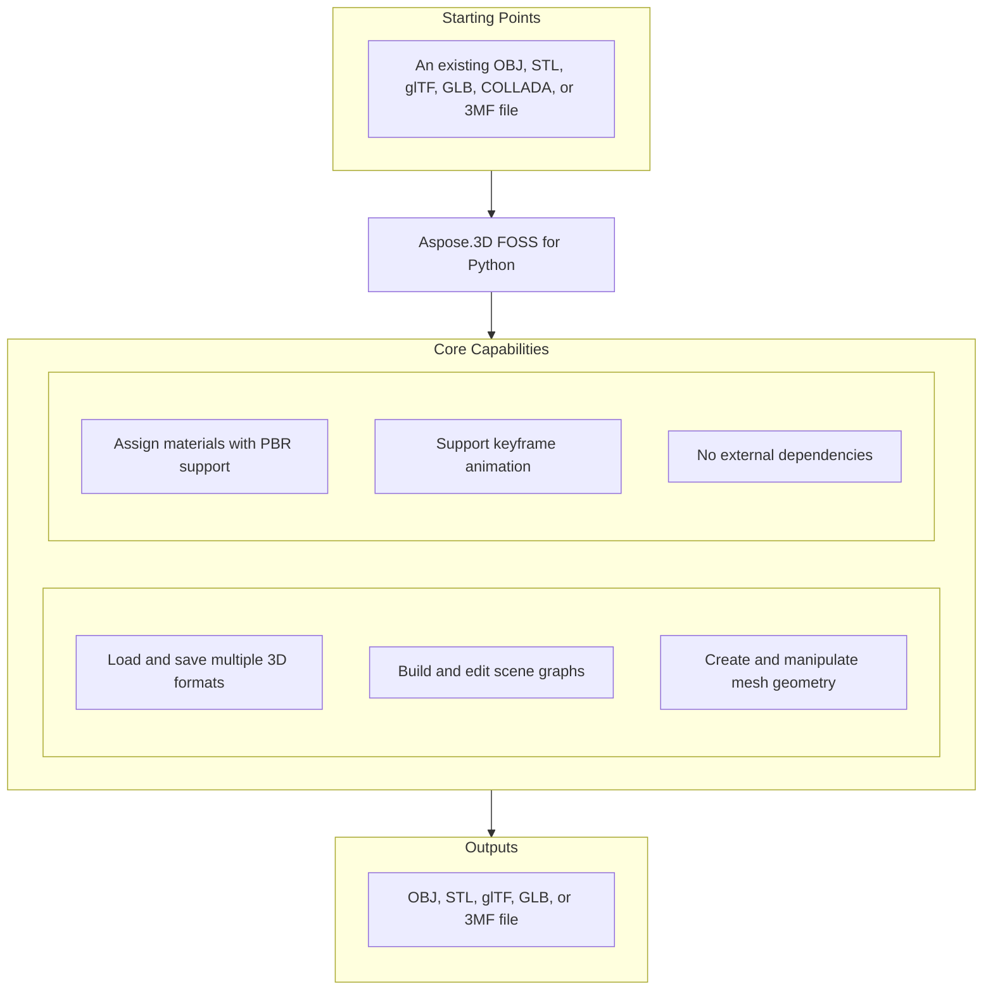

# Aspose.3D FOSS for Python

[](https://pypi.org/project/aspose-3d-foss/)  [](LICENSE) [](https://github.com/aspose-3d-foss/Aspose.3D-FOSS-for-Python/graphs/contributors)

[](https://products.aspose.org/3d/python/)

Aspose.3D FOSS for Python version 26.1.0 is a Python library that enables developers to read, write, and convert 3D documents in formats including `.obj`, `.stl`, `.gltf`, `.glb`, `.dae`, `.3mf`, and `.fbx`. It solves the problem of integrating 3D content processing into Python applications without requiring external dependencies or proprietary runtimes. Users across engineering, gaming, and visualization domains use it to build 3D pipelines, automate model conversions, and inspect scene hierarchies programmatically. The library supports Python versions 3.7 through 3.12 and is distributed under the MIT license.

## Navigation

- [At a Glance](#at-a-glance)
- [Key Capabilities](#key-capabilities)
- [Installation](#installation)
- [Dependencies](#dependencies)
- [Quick Start](#quick-start)
- [Additional Examples](#additional-examples)
- [API Reference](#api-reference)
- [Documentation & Resources](#documentation--resources)
- [Scope and Limitations](#scope-and-limitations)
- [Development and Testing](#development-and-testing)
- [License](#license)

## At a Glance



## Key Capabilities

- **Load and save multiple 3D formats.** Load and save multiple 3D formats by opening files with `Scene.open()` and saving with `Scene.save()` for `.obj`, `.stl`, `.gltf`, `.glb`, `.dae`, and `.3mf`, each format using its own `SaveOptions` subclass for coordinate flipping, unit scaling, and compression settings.
- **Build and edit scene graphs.** Build and edit scene graphs by creating child nodes with `Node.create_child_node()`, attaching entities and materials, and traversing the hierarchy via `Node.child_nodes`, where each node maintains its own transform independent of its content.
- **Create and manipulate mesh geometry.** Create and manipulate mesh geometry by constructing `Mesh` objects, adding control points and polygons with `Mesh.control_points.add()` and `Mesh.create_polygon()`, converting primitives with `Box.to_mesh()` or `Sphere.to_mesh()`, and saving to formats like `.stl` or `.3mf` via appropriate `SaveOptions`.
- **Assign materials with PBR support.** Assign materials with PBR support by creating `PbrMaterial` with albedo, `metallic_factor`, and `roughness_factor` properties, or use `LambertMaterial` and `PhongMaterial` with `diffuse_color`, then attach them to nodes alongside mesh entities.
- **Support keyframe animation.** Support keyframe animation by constructing `AnimationClip` objects with name, description, start, and stop properties, adding `AnimationNode` instances via `AnimationClip.create_animation_node()`, and populating `KeyframeSequence` with key frames that reference `BonePose` matrices and bind points.
- **No external dependencies.** No external dependencies are required because the package supports Python versions 3.7 through 3.12 with a minimum requirement of >=3.7.

## Installation

Install the published package from PyPI (`aspose-3d-foss`, version 26.1.0):

```bash
pip install aspose-3d-foss
```

To work from a source checkout instead, install the clone with pip:

```bash
git clone https://github.com/aspose-3d-foss/Aspose.3D-FOSS-for-Python.git
cd Aspose.3D-FOSS-for-Python
pip install .
```

Verify the install:

```bash
python -c "import aspose.threed"
```

The package supports Python 3.7, 3.8, 3.9, 3.10, 3.11, and 3.12 and declares `python_requires` as `>=3.7`.

## Dependencies

### Required Package Dependencies

No required third-party package dependencies; in `setup.py`, the `install_requires` list is empty.

### Native and System Requirements

- Requires Python 3.7 or later (`python_requires=">=3.7"` in `setup.py`).

### Development Dependencies

- `pytest>=7.0.0` (extra `dev`)

## Quick Start

Create a textured crate using a `Box` primitive and a Lambert material, then export it as a GLTF file.

```python
from aspose.threed import Scene
from aspose.threed.entities import Box
from aspose.threed.shading import LambertMaterial
from aspose.threed.utilities import Vector3

scene = Scene()
box = Box(length=2.0, width=1.0, height=1.0)
material = LambertMaterial()
material.diffuse_color = Vector3(0.2, 0.6, 0.9)

scene.root_node.create_child_node("Crate", entity=box.to_mesh(), material=material)
scene.save("crate.gltf")
```

Build a metallic sphere with a PBR material and save it in STL format for 3D printing workflows.

```python
from aspose.threed import Scene
from aspose.threed.entities import Sphere
from aspose.threed.shading import PbrMaterial
from aspose.threed.utilities import Vector3

scene = Scene()
sphere = Sphere()
material = PbrMaterial(albedo=Vector3(0.8, 0.1, 0.1))
material.metallic_factor = 0.9
material.roughness_factor = 0.2

scene.root_node.create_child_node("Ball", entity=sphere.to_mesh(), material=material)
scene.save("ball.stl")
```

## Additional Examples

Create scenes from primitives or control points, assign materials, and export to glTF, STL, or 3MF formats.

### Create a triangle mesh with a PBR material and export to glTF

```python
import io
import json
from aspose.threed import Scene, FileFormat
from aspose.threed.entities import Mesh
from aspose.threed.utilities import Vector3, Vector4
from aspose.threed.formats.gltf import GltfSaveOptions
from aspose.threed.shading import PbrMaterial

scene = Scene()
mesh = Mesh("TestMesh")
mesh.control_points.add(Vector4(0.0, 0.0, 0.0, 1.0))
mesh.control_points.add(Vector4(1.0, 0.0, 0.0, 1.0))
mesh.control_points.add(Vector4(0.0, 1.0, 0.0, 1.0))
mesh.create_polygon(0, 1, 2)

albedo = Vector3(0.8, 0.2, 0.3)
material = PbrMaterial("RedMaterial", albedo)
material.metallic_factor = 0.5
material.roughness_factor = 0.7

node = scene.root_node.create_child_node("TestNode")
node.entity = mesh
node.material = material

stream = io.BytesIO()
# Pass the detected FileFormat into the constructor explicitly: unlike
# StlFormat, GltfFormat.create_save_options() does not set file_format on the
# options it returns, and a bare stream (no filename) gives scene.save()
# nothing else to detect the format from.
options = GltfSaveOptions(FileFormat.get_format_by_extension(".gltf"))
options.binary_mode = False
scene.save(stream, options)

stream.seek(0)
gltf_data = json.loads(stream.read().decode("utf-8"))
print(gltf_data["materials"][0]["pbrMetallicRoughness"])
```

<details>
<summary>View Additional Examples</summary>

### Open a glTF file and walk its scene graph hierarchy

```python
from aspose.threed import Scene

scene = Scene()
scene.open("model.gltf")

def walk(node, depth=0):
    print("  " * depth + (node.name or "(unnamed)"))
    for child in node.child_nodes:
        walk(child, depth + 1)

walk(scene.root_node)
```

### Build a triangle mesh and export to ASCII STL format

```python
import io
from aspose.threed import Scene, FileFormat
from aspose.threed.entities import Mesh
from aspose.threed.utilities import Vector4

scene = Scene()
mesh = Mesh("triangle")
mesh.control_points.add(Vector4(0.0, 0.0, 0.0, 1.0))
mesh.control_points.add(Vector4(1.0, 0.0, 0.0, 1.0))
mesh.control_points.add(Vector4(1.0, 1.0, 0.0, 1.0))
mesh.create_polygon(0, 1, 2)

node = scene.root_node.create_child_node("triangle_node")
node.entity = mesh

stream = io.StringIO()
# Use FileFormat.get_format_by_extension(...).create_save_options() rather than
# StlSaveOptions() directly: a default-constructed options object has no
# file_format set, and scene.save() cannot infer the format from a bare stream
# (only filename-based saves fall back to extension detection).
options = FileFormat.get_format_by_extension(".stl").create_save_options()
options.binary_mode = False
scene.save(stream, options)
print(stream.getvalue())
```

### Convert a `Box` primitive to a mesh and count its control points

```python
from aspose.threed.entities import Box

box = Box(10, 20, 30)
mesh = box.to_mesh()
print(f"Control points: {len(mesh.control_points)}")
```

### Build a cube mesh and export to uncompressed 3MF format

```python
import io
from aspose.threed import Scene
from aspose.threed.entities import Mesh
from aspose.threed.utilities import Vector4
from aspose.threed.formats import ThreeMfSaveOptions

scene = Scene()
mesh = Mesh("cube")
for point in [
    Vector4(0, 0, 0, 1), Vector4(1, 0, 0, 1), Vector4(1, 1, 0, 1), Vector4(0, 1, 0, 1),
    Vector4(0, 0, 1, 1), Vector4(1, 0, 1, 1), Vector4(1, 1, 1, 1), Vector4(0, 1, 1, 1),
]:
    mesh.control_points.add(point)

mesh.create_polygon(0, 1, 2)
mesh.create_polygon(0, 2, 3)
mesh.create_polygon(4, 7, 6)
mesh.create_polygon(4, 6, 5)
mesh.create_polygon(0, 4, 5)
mesh.create_polygon(0, 5, 1)
mesh.create_polygon(2, 6, 7)
mesh.create_polygon(2, 7, 3)
mesh.create_polygon(0, 3, 7)
mesh.create_polygon(0, 7, 4)
mesh.create_polygon(1, 5, 6)
mesh.create_polygon(1, 6, 2)

node = scene.root_node.create_child_node("cube")
node.entity = mesh

stream = io.BytesIO()
options = ThreeMfSaveOptions()
options.enable_compression = False
scene.save(stream, options)
```

</details>

## API Reference

Aspose.3D FOSS for Python provides the `aspose.threed.Scene` class as the main entry point for loading, manipulating, and saving 3D scenes, with `aspose.threed.Node` forming the hierarchical structure of the scene graph. Each node can hold geometry via `aspose.threed.Mesh`, materials, and child nodes, while supporting animation, rendering, and export through dedicated modules.

The verified public surface has 337 types.

<details>
<summary>View the Complete Public API Surface</summary>

### Core API

| Class | Description |
| --- | --- |
| `A3DObject` | A3DObject serves as the base class for named objects that can hold properties and support property lookup, addition, and removal operations. |
| `AnimationChannel` | AnimationChannel represents a single animated property channel that stores a sequence of keyframes and a default value. |
| `AnimationClip` | AnimationClip groups multiple animation nodes and defines a time range with start and stop times for a specific animation sequence. |
| `AnimationNode` | AnimationNode represents a node in an animation hierarchy that can contain bind points and sub-animations. |
| `ArrayListAdapter` | Adapter class that wraps List[T] and implements IArrayList[T]. |
| `AssetInfo` | AssetInfo stores metadata about a 3D asset such as author, creation time, coordinate system, and unit scale factor. |
| `Axis` | The coordinate axis. |
| `AxisSystem` | Axis system is an combination of coordinate system, up vector and front vector. |
| `BindPoint` | BindPoint defines how an animation channel is bound to a specific property of an object within an animation node. |
| `BonePose` | BonePose stores the transformation matrix and local-space flag for a bone at a specific pose in skeletal animation. |
| `BoundingBox2D` | The axis-aligned bounding box for Vector2 |
| `BoundingBoxExtent` | The extent of the bounding box |
| `Box` | Box is a primitive shape defined by its length, height, and segment counts for tessellation. |
| `Camera` | Camera is an entity that defines a view frustum and projection parameters for rendering a 3D scene. |
| `Circle` | Circle is a primitive shape defined by its radius and tessellation segments. |
| `ComposeOrder` | The order to compose transform matrix |
| `CoordinateSystem` | The left handed or right handed coordinate system. |
| `Curve` | Curve is an entity that represents a parametric curve in three-dimensional space. |
| `CustomObject` | CustomObject is a generic container for user-defined 3D objects that extend the A3DObject base class. |
| `Cylinder` | Cylinder is a primitive shape defined by its radius, height, and tessellation segments. |
| `Dish` | Dish is a primitive shape representing a spherical cap defined by its radii and tessellation segments. |
| `Ellipse` | Ellipse is a primitive shape defined by its major and minor radii and tessellation segments. |
| `Entity` | Entity is a scene object that can be assigned to a node and typically represents geometric content. |
| `ExportException` | Exceptions when Aspose.3D failed to export the scene to file. |
| `Extrapolation` | Extrapolation defines how animation values are computed outside the defined keyframe range. |
| `FMatrix4` | Matrix 4x4 with all component in float type |
| `FileContentType` | File content type |
| `FileFormat` | FileFormat provides methods to identify supported file formats and retrieve format information by file extension. |
| `FileFormatType` | File format type |
| `Frustum` | Frustum is a primitive shape representing a truncated pyramid or cone used for view volume definitions. |
| `Geometry` | Geometry is an entity that encapsulates vertex and polygon data for rendering 3D shapes. |
| `GlobalTransform` | GlobalTransform represents a transformation matrix applied to an object in world space. |
| `Group` | A Group represents the logical relationships of Node. |
| `INamedObject` | INamedObject is an interface for objects that have a name property. |
| `IOExtension` | Utilities to write matrix/vector to binary writer |
| `ImageRenderOptions` | ImageRenderOptions controls rendering settings such as compression and output format when generating images. |
| `ImportException` | Exception when Aspose.3D failed to open the specified source. |
| `KeyFrame` | KeyFrame represents a single keyframe with a time value and an associated value for animation. |
| `KeyframeSequence` | KeyframeSequence is a collection of keyframes used to define animated values over time. |
| `Light` | Light is a camera entity that defines illumination properties such as color and intensity. |
| `LinearExtrusion` | LinearExtrusion is an entity that creates a 3D shape by extruding a 2D profile along a straight path. |
| `MathUtils` | A set of useful mathematical utilities. |
| `Mesh` | Mesh is a geometry entity that stores vertex positions, normals, texture coordinates, and polygon definitions. |
| `Node` | Node is a scene object that can hold an entity and transform it within the scene hierarchy. |
| `ParseException` | Exception when Aspose.3D failed to parse the input. |
| `Plane` | Plane is a primitive shape defined by its width, length, and tessellation segments. |
| `PolygonBuilder` | PolygonBuilder is a utility class for constructing polygonal meshes programmatically. |
| `Pose` | Pose represents a collection of bone poses used in skeletal animation systems. |
| `Primitive` | Primitive is a geometry entity that represents basic geometric shapes such as box, cylinder, and sphere. |
| `Property` | Property represents a named value that can be attached to an A3DObject. |
| `PropertyCollection` | PropertyCollection is a container for managing a set of properties associated with an object. |
| `PropertyFlags` | Property's flags |
| `Rect` | A class to represent the rectangle |
| `RelativeRectangle` | Relative rectangle |
| `RotationOrder` | The order controls which rx ry rz are applied in the transformation matrix. |
| `Scene` | Scene is a scene object that serves as the root container for all 3D content including nodes, entities, and animations. |
| `SceneObject` | SceneObject is the base class for all objects that can be part of a 3D scene hierarchy. |
| `SemanticAttribute` | Allow user to use their own structure for static declaration of VertexDeclaration |
| `Sphere` | The Sphere class represents a parametric sphere primitive that can be converted to a mesh with configurable segmentation. |
| `Transform` | The Transform class encapsulates the geometric transformation properties of a node, including translation, rotation, and scaling. |
| `TransformBuilder` | The TransformBuilder is used to build transform matrix by a chain of transformations. |
| `TrialException` | This is raised in Scene.Open/Scene.Save when no licenses are applied. |
| `Vertex` | Vertex reference, used to access the raw vertex in TriMesh. |
| `VertexDeclaration` | The declaration of a custom defined vertex's structure |
| `VertexField` | Vertex's field memory layout description. |
| `VertexFieldDataType` | Vertex field's data type |
| `VertexFieldSemantic` | The semantic of the vertex field |
| `Bone` | The Bone class represents a bone in a skeletal animation system, defining its transform and associated vertex weights. |
| `BoneLinkMode` | The BoneLinkMode enumeration defines how a bone influences vertices in skin deformation. |
| `Deformer` | The Deformer class is the base class for all mesh deformation operators that modify vertex data. |
| `MorphTargetChannel` | The MorphTargetChannel class controls the influence of morph target shapes on a mesh through weighted blending. |
| `MorphTargetDeformer` | The MorphTargetDeformer class applies morph target animations by blending between base geometry and target shapes. |
| `SkinDeformer` | The SkinDeformer class implements skeletal skinning by mapping bones to vertex influence sets. |
| `ApertureMode` | Camera aperture modes. |
| `BooleanOperand` | This class encapsulates the transformed mesh as Boolean operation's operand. |
| `BooleanOperation` | The BooleanOperation class performs constructive solid geometry operations such as union, intersection, and difference on meshes. |
| `BooleanOperator` | Boolean operator allows you to apply Boolean operation on two IMeshConvertible instances. |
| `CompositeCurve` | A CompositeCurve is consisting of several curve segments. |
| `CurveDimension` | The CurveDimension enumeration specifies the dimensional characteristics of a curve entity. |
| `EndPoint` | The end point to trim the curve, can be a parameter value or a Cartesian point. |
| `HalfSpace` | HalfSpace represents a infinity space which is split by a plane, this can be used with BooleanOperator |
| `IIndexedVertexElement` | The IIndexedVertexElement interface defines a vertex element that uses an index buffer to reference vertex data. |
| `IMeshConvertible` | Entities that implemented this interface can be converted to Mesh |
| `IOrientable` | Orientable entities shall implement this interface. |
| `LightType` | Light types. |
| `Line` | A polyline is a path defined by a set of points with control_points, and connected by segments. |
| `MappingMode` | The MappingMode enumeration describes how texture coordinates are mapped onto a surface. |
| `NurbsCurve` | The NurbsCurve class represents a non-uniform rational B-spline curve defined by control points and knot vectors. |
| `NurbsDirection` | The NurbsDirection class defines the properties of a NURBS curve direction in a surface or curve entity. |
| `NurbsSurface` | The NurbsSurface class represents a non-uniform rational B-spline surface defined by control points and knot vectors in two directions. |
| `NurbsType` | The NurbsType enumeration specifies the classification of a NURBS curve or surface. |
| `Patch` | The Patch class represents a parametric surface patch used in NURBS and other surface representations. |
| `PatchDirection` | The PatchDirection enumeration indicates the parametric direction of a surface patch. |
| `PatchDirectionType` | The PatchDirectionType enumeration specifies the type of parametric direction for a surface patch. |
| `PointCloud` | The PointCloud class represents a collection of unconnected vertices without polygonal connectivity. |
| `InvalidOperationException` | The InvalidOperationException is raised when an invalid operation is attempted during polygon construction. |
| `PolygonModifier` | The PolygonModifier class provides static methods to modify polygonal geometry, such as triangulation and smoothing. |
| `ProjectionType` | Camera's projection types. |
| `Pyramid` | Parameterized pyramid. |
| `RectangularTorus` | Parameterized rectangular torus entity. |
| `ReferenceMode` | The ReferenceMode enumeration defines how vertex indices reference shared geometry data. |
| `RevolvedAreaSolid` | RevolvedAreaSolid entity. |
| `RotationMode` | The frustum's rotation mode. |
| `Shape` | Base class for all shape entities. |
| `Skeleton` | The Skeleton is mainly used by CAD software to help designer to manipulate the transformation of skeletal structure, it's usually useless outside the CAD softwares. |
| `SkeletonType` | Skeleton type enum. |
| `SplitMeshPolicy` | Share vertex/control point data between sub-meshes or each sub-mesh has its own compacted data. |
| `SweptAreaSolid` | SweptAreaSolid entity. |
| `TextureMapping` | The TextureMapping class defines how texture coordinates are assigned to a mesh surface. |
| `Torus` | Parameterized torus entity. |
| `TransformedCurve` | TransformedCurve entity. |
| `TriMesh` | TriMesh is a triangle mesh that stores triangles. |
| `TrimmedCurve` | TrimmedCurve entity. |
| `VertexElement` | The VertexElement class is the base for all vertex attribute elements such as normals, texture coordinates, and colors. |
| `VertexElementBinormal` | The VertexElementBinormal class stores binormal vectors per vertex for advanced lighting calculations. |
| `VertexElementDoublesTemplate` | A helper class for defining concrete implementations. |
| `VertexElementEdgeCrease` | Defines the edge crease values for specified components. |
| `VertexElementFVector` | The VertexElementFVector class represents a vertex element containing floating-point vector data. |
| `VertexElementHole` | Defines the hole information for specified components. |
| `VertexElementIntsTemplate` | A helper class for defining concrete implementations with int data. |
| `VertexElementMaterial` | Defines the material for specified components. |
| `VertexElementNormal` | The VertexElementNormal class stores per-vertex normal vectors for lighting computations. |
| `VertexElementPolygonGroup` | Defines the polygon group for specified components. |
| `VertexElementSmoothingGroup` | The VertexElementSmoothingGroup class assigns smoothing groups to vertices for rendering optimization. |
| `VertexElementSpecular` | Defines the specular color for specified components. |
| `VertexElementTangent` | The VertexElementTangent class stores tangent vectors per vertex for normal mapping. |
| `VertexElementTemplate` | A helper class for defining concrete implementations of vertex elements with typed data. |
| `VertexElementType` | The VertexElementType enumeration identifies the data type and purpose of a vertex element. |
| `VertexElementUV` | The VertexElementUV class stores two-dimensional texture coordinate pairs per vertex. |
| `VertexElementUserData` | Defines the user data for specified components. |
| `VertexElementVector4` | Defines the vector4 data for specified components. |
| `VertexElementVertexColor` | The VertexElementVertexColor class stores per-vertex color information for rendering. |
| `VertexElementVertexCrease` | Defines the vertex crease values for specified components. |
| `VertexElementVisibility` | Defines the visibility for specified components. |
| `VertexElementWeight` | Defines the weight for specified components. |
| `A3dwSaveOptions` | Save options for A3DW |
| `AmfSaveOptions` | Save options for AMF |
| `BasicLoadOptions` | Simple LoadOptions subclass for basic loading options. |
| `ColladaLoadOptions` | Load options for Collada |
| `ColladaSaveOptions` | Save options for collada |
| `ColladaTransformStyle` | The node's transformation style of node |
| `Discreet3dsLoadOptions` | Load options for Discreet 3DS |
| `Discreet3dsSaveOptions` | Save options for Discreet 3DS |
| `DracoCompressionLevel` | Compression level for draco file |
| `DracoFormat` | Google Draco format |
| `DracoSaveOptions` | Save options for Draco |
| `Exporter` | The Exporter class provides methods to save a scene to various 3D file formats. |
| `FbxLoadOptions` | Load options for FBX |
| `FbxSaveOptions` | Save options for FBX |
| `FormatDetector` | The FormatDetector class analyzes file content to determine the appropriate import format. |
| `GltfEmbeddedImageFormat` | Embedded image format for GLTF |
| `formats.GltfLoadOptions` | Load options for glTF |
| `formats.GltfSaveOptions` | Save options for glTF |
| `Html5SaveOptions` | Save options for HTML5 |
| `IOConfig` | The IOConfig class holds configuration options for input and output operations. |
| `IOService` | The IOService class provides low-level input and output operations for file handling. |
| `Importer` | The Importer class loads 3D scenes from supported file formats into a Scene object. |
| `JtLoadOptions` | Load options for JT |
| `LoadOptions` | LoadOptions configures how 3D scenes are loaded from files or streams in Aspose.3D FOSS for Python. |
| `Microsoft3MFFormat` | Microsoft 3MF format |
| `Microsoft3MFSaveOptions` | Save options for Microsoft 3MF |
| `formats.ObjLoadOptions` | Load options for OBJ |
| `formats.ObjSaveOptions` | Save options for OBJ |
| `PdfFormat` | Adobe's Portable Document Format |
| `PdfLightingScheme` | Lighting scheme for PDF export |
| `PdfLoadOptions` | Load options for PDF |
| `PdfRenderMode` | Render mode for PDF export |
| `PdfSaveOptions` | Save options for PDF |
| `Plugin` | Plugin serves as an abstract base class for format plugins that provide import, export, and format detection capabilities in Aspose.3D FOSS for Python. |
| `PlyFormat` | PLY format |
| `PlyLoadOptions` | Load options for PLY |
| `PlySaveOptions` | Save options for PLY |
| `RvmFormat` | RVM format |
| `RvmLoadOptions` | Load options for RVM |
| `RvmSaveOptions` | Save options for RVM |
| `SaveOptions` | SaveOptions configures how 3D scenes are saved to files or streams in Aspose.3D FOSS for Python. |
| `formats.StlLoadOptions` | Load options for STL |
| `formats.StlSaveOptions` | Save options for STL |
| `ThreeMfFormat` | ThreeMfFormat represents the 3MF file format and provides methods to inspect, import, and export 3MF documents in Aspose.3D FOSS for Python. |
| `ThreeMfLoadOptions` | ThreeMfLoadOptions provides configuration options specific to loading 3MF files in Aspose.3D FOSS for Python. |
| `ThreeMfSaveOptions` | ThreeMfSaveOptions provides configuration options specific to saving 3MF files in Aspose.3D FOSS for Python. |
| `U3dLoadOptions` | Load options for U3D |
| `U3dSaveOptions` | Save options for U3D |
| `UsdSaveOptions` | Save options for USD |
| `XLoadOptions` | Load options for X format |
| `ColladaExporter` | ColladaExporter writes 3D scenes to COLLADA files in Aspose.3D FOSS for Python. |
| `ColladaFormat` | ColladaFormat describes the COLLADA file format and supports detection, import, and export operations in Aspose.3D FOSS for Python. |
| `ColladaFormatDetector` | ColladaFormatDetector identifies COLLADA files by examining their content in Aspose.3D FOSS for Python. |
| `ColladaImporter` | ColladaImporter reads 3D scenes from COLLADA files in Aspose.3D FOSS for Python. |
| `ColladaPlugin` | ColladaPlugin provides the COLLADA format plugin implementation in Aspose.3D FOSS for Python. |
| `FbxExporter` | FbxExporter writes 3D scenes to FBX files in Aspose.3D FOSS for Python. |
| `FbxFormat` | FbxFormat describes the FBX file format and supports detection, import, and export operations in Aspose.3D FOSS for Python. |
| `FbxFormatDetector` | FbxFormatDetector identifies FBX files by examining their content in Aspose.3D FOSS for Python. |
| `FbxImporter` | FbxImporter reads 3D scenes from FBX files in Aspose.3D FOSS for Python. |
| `FbxPlugin` | FbxPlugin provides the FBX format plugin implementation in Aspose.3D FOSS for Python. |
| `BinaryTokenizer` | BinaryTokenizer parses binary tokens from FBX files in Aspose.3D FOSS for Python. |
| `binary_tokenizer.Token` | Token represents a single parsed token from an FBX binary stream in Aspose.3D FOSS for Python. |
| `binary_tokenizer.TokenType` | TokenType defines the categories of tokens used in FBX binary parsing in Aspose.3D FOSS for Python. |
| `FbxElement` | FbxElement represents a parsed element in an FBX file structure in Aspose.3D FOSS for Python. |
| `FbxParser` | FbxParser reads and interprets the hierarchical structure of FBX files in Aspose.3D FOSS for Python. |
| `FbxScope` | FbxScope manages the scope of elements during FBX parsing in Aspose.3D FOSS for Python. |
| `FbxTokenizer` | FbxTokenizer breaks down FBX text streams into tokens in Aspose.3D FOSS for Python. |
| `tokenizer.Token` | Token represents a single parsed token from an FBX text stream in Aspose.3D FOSS for Python. |
| `tokenizer.TokenType` | TokenType defines the categories of tokens used in FBX text parsing in Aspose.3D FOSS for Python. |
| `GltfExporter` | GltfExporter writes 3D scenes to glTF files in Aspose.3D FOSS for Python. |
| `GltfFormat` | GltfFormat describes the glTF file format and supports detection, import, and export operations in Aspose.3D FOSS for Python. |
| `GltfFormatDetector` | GltfFormatDetector identifies glTF files by examining their content in Aspose.3D FOSS for Python. |
| `GltfImporter` | GltfImporter reads 3D scenes from glTF files in Aspose.3D FOSS for Python. |
| `gltf.GltfLoadOptions` | GltfLoadOptions provides configuration options specific to loading glTF files in Aspose.3D FOSS for Python. |
| `GltfPlugin` | GltfPlugin provides the glTF format plugin implementation in Aspose.3D FOSS for Python. |
| `gltf.GltfSaveOptions` | GltfSaveOptions provides configuration options specific to saving glTF files in Aspose.3D FOSS for Python. |
| `ObjExporter` | ObjExporter writes 3D scenes to OBJ files in Aspose.3D FOSS for Python. |
| `ObjFormat` | ObjFormat describes the OBJ file format and supports detection, import, and export operations in Aspose.3D FOSS for Python. |
| `ObjFormatDetector` | ObjFormatDetector identifies OBJ files by examining their content in Aspose.3D FOSS for Python. |
| `ObjImporter` | ObjImporter reads 3D scenes from OBJ files in Aspose.3D FOSS for Python. |
| `obj.ObjLoadOptions` | ObjLoadOptions provides configuration options specific to loading OBJ files in Aspose.3D FOSS for Python. |
| `ObjPlugin` | ObjPlugin provides the OBJ format plugin implementation in Aspose.3D FOSS for Python. |
| `obj.ObjSaveOptions` | ObjSaveOptions provides configuration options specific to saving OBJ files in Aspose.3D FOSS for Python. |
| `StlExporter` | StlExporter writes 3D scenes to STL files in Aspose.3D FOSS for Python. |
| `StlFormat` | StlFormat represents the STL file format and provides methods to detect, import, and export STL files. |
| `StlFormatDetector` | StlFormatDetector identifies whether a file stream or buffer contains data in the STL format. |
| `StlImporter` | StlImporter reads geometry and scene data from STL files and populates a Scene object. |
| `stl.StlLoadOptions` | StlLoadOptions controls how STL files are loaded, including coordinate system flipping and scaling. |
| `StlPlugin` | StlPlugin provides access to the STL format's importer, exporter, format detector, and load/save options. |
| `stl.StlSaveOptions` | StlSaveOptions controls how STL files are saved, including binary mode, coordinate system flipping, and scaling. |
| `ThreeMfExporter` | ThreeMfExporter writes a Scene to a 3MF file format. |
| `ThreeMfFormatDetector` | ThreeMfFormatDetector determines whether a file stream or buffer contains data in the 3MF format. |
| `ThreeMfImporter` | ThreeMfImporter reads geometry and scene data from 3MF files and populates a Scene object. |
| `ThreeMfPlugin` | ThreeMfPlugin provides access to the 3MF format's importer, exporter, format detector, and load/save options. |
| `ArbitraryProfile` | This class allows you to construct a 2D profile directly from arbitrary curve. |
| `CShape` | IFC compatible C-shape profile that defined by parameters. |
| `CenterLineProfile` | IFC compatible center line profile. |
| `CircleShape` | IFC compatible circle profile. |
| `EllipseShape` | IFC compatible ellipse profile. |
| `FontFile` | Font file contains definitions for glyphs, this is used to create text profile. |
| `HShape` | IFC compatible H-shape profile. |
| `HollowCircleShape` | IFC compatible hollow circle profile. |
| `HollowRectangleShape` | IFC compatible hollow rectangular shape with both inner/outer rounding corners. |
| `LShape` | IFC compatible L-shape profile that defined by parameters. |
| `MirroredProfile` | IFC compatible mirror profile. |
| `ParameterizedProfile` | The base class of all parameterized profiles. |
| `Profile` | 2D Profile in xy plane. |
| `RectangleShape` | IFC compatible rectangle profile. |
| `TShape` | IFC compatible T-shape defined by parameters. |
| `Text` | Text profile, this profile describes contours using font and text. |
| `TrapeziumShape` | IFC compatible Trapezium shape defined by parameters. |
| `UShape` | IFC compatible U-shape defined by parameters. |
| `ZShape` | IFC compatible Z-shape profile that defined by parameters. |
| `BlendFactor` | Blend factor specify pixel arithmetic. |
| `CompareFunction` | Compare function for depth/stencil testing. |
| `CubeFace` | Cube face enumeration. |
| `CullFaceMode` | Cull face mode for face culling. |
| `DescriptorSetUpdater` | Descriptor set updater for shader resources. |
| `DrawOperation` | Draw operation type. |
| `DriverException` | Exception thrown when rendering driver fails. |
| `EntityRenderer` | Base class for rendering entities. |
| `EntityRendererFeatures` | Features supported by an entity renderer. |
| `EntityRendererKey` | The key of registered entity renderer. |
| `FrontFace` | Front face winding order. |
| `GLSLSource` | GLSL shader source. |
| `IBuffer` | Interface for vertex/index buffer. |
| `ICommandList` | Interface for command list. |
| `IDescriptorSet` | Interface for descriptor set. |
| `IIndexBuffer` | Interface for index buffer. |
| `IPipeline` | Interface for graphics pipeline. |
| `IRenderQueue` | Interface for render queue. |
| `IRenderTarget` | Interface for render target. |
| `IRenderTexture` | Interface for render texture. |
| `IRenderWindow` | Interface for render window. |
| `ITexture1D` | Interface for 1D texture. |
| `ITexture2D` | Interface for 2D texture. |
| `ITextureCodec` | Interface for texture codec. |
| `ITextureCubemap` | Interface for cubemap texture. |
| `ITextureDecoder` | Interface for texture decoder. |
| `ITextureEncoder` | Interface for texture encoder. |
| `ITextureUnit` | Interface for texture unit. |
| `IVertexBuffer` | Interface for vertex buffer. |
| `IndexDataType` | Data type for indices. |
| `InitializationException` | Exception thrown when rendering initialization fails. |
| `PixelFormat` | Pixel format for render targets. |
| `PixelMapMode` | Pixel mapping mode. |
| `PixelMapping` | Pixel mapping configuration. |
| `PolygonMode` | Polygon rendering mode. |
| `PostProcessing` | Post-processing effect. |
| `PresetShaders` | Predefined shaders. |
| `PushConstant` | Push constant for shaders. |
| `RenderFactory` | RenderFactory creates all resources that represented in rendering pipeline. |
| `RenderParameters` | Parameters for rendering. |
| `RenderQueueGroupId` | Render queue group ID. |
| `RenderResource` | Base class for render resources. |
| `RenderStage` | Render stage in the pipeline. |
| `RenderState` | Render state configuration. |
| `Renderer` | The context about renderer. |
| `RendererVariableManager` | Manages renderer variables. |
| `SPIRVSource` | SPIRV shader source. |
| `ShaderException` | Exception thrown when shader compilation/linking fails. |
| `ShaderProgram` | Shader program. |
| `ShaderSet` | Set of shaders for rendering. |
| `ShaderSource` | Shader source code. |
| `ShaderStage` | Shader stage. |
| `ShaderVariable` | Shader variable. |
| `StencilAction` | Stencil action. |
| `StencilState` | Stencil state configuration. |
| `TextureCodec` | Texture codec. |
| `TextureData` | Texture data. |
| `TextureType` | Texture type. |
| `Viewport` | Viewport for rendering. |
| `WindowHandle` | Window handle for render window. |
| `AlphaSource` | Source of alpha channel for textures. |
| `LambertMaterial` | LambertMaterial defines a simple shading model with ambient, diffuse, emissive, and transparency properties. |
| `Material` | Material represents a surface appearance definition that can be applied to 3D entities. |
| `PbrMaterial` | PbrMaterial defines a physically based rendering material with albedo, metallic, roughness, and emissive properties. |
| `PbrSpecularMaterial` | Material for physically based rendering based on diffuse color/specular/glossiness. |
| `PhongMaterial` | PhongMaterial extends LambertMaterial with specular reflection properties for shiny surface rendering. |
| `ShaderMaterial` | A shader material allows to describe the material by external rendering engine or shader language. |
| `ShaderTechnique` | A technique in shader material describes the concrete rendering details. |
| `Texture` | This class defines the texture from an external file. |
| `TextureBase` | Base class for all texture types. |
| `TextureFilter` | Texture filter type. |
| `TextureSlot` | Texture slot name. |
| `WrapMode` | Wrap mode for texture coordinates. |
| `BoundingBox` | BoundingBox represents the axis-aligned bounding box of a 3D object or scene. |
| `FVector2` | FVector2 represents a two-dimensional vector with single-precision floating-point components. |
| `FVector3` | FVector3 represents a three-dimensional vector with single-precision floating-point components. |
| `FVector4` | FVector4 represents a four-dimensional vector with single-precision floating-point components. |
| `FileSystem` | File system encapsulation. |
| `Matrix4` | Matrix4 represents a 4x4 transformation matrix used for 3D geometry operations. |
| `Quaternion` | Quaternion represents a four-element quaternion used for 3D rotation and orientation. |
| `Vector2` | Vector2 represents a two-dimensional vector with double-precision floating-point components. |
| `Vector3` | Vector3 represents a three-dimensional vector with double-precision floating-point components. |
| `Vector4` | Vector4 represents a four-dimensional vector with double-precision floating-point components. |
| `Watermark` | Utility to encode/decode blind watermark to/from a mesh. |

#### Enumerations

| Enumeration | Description |
| --- | --- |
| `ExtrapolationType` | ExtrapolationType is an enumeration that specifies the behavior of animation extrapolation. |
| `Interpolation` | Interpolation is an enumeration that defines methods for calculating values between keyframes. |
| `PoseType` | PoseType is an enumeration that specifies the type of pose in skeletal animation. |
| `StepMode` | The StepMode enumeration defines the available modes for exporting scenes to STEP format. |
| `WeightedMode` | The WeightedMode enumeration specifies how weights are applied during morph target deformation. |

#### Detailed Member Reference

### Scene

The `aspose.threed.Scene` class serves as the root container for 3D content, offering methods like `Scene.open` and `Scene.save` to load and persist scenes, and exposing `Scene.root_node`, `Scene.library`, and `Scene.animation_clips` to inspect and modify the scene graph and its assets.

- `animation_clips`: Defined as `def animation_clips(self) -> List['AnimationClip']`.
- `asset_info`: Defined as `def asset_info(self) -> AssetInfo`.
- `clear`: Defined as `def clear(self)`.
- `create_animation_clip`: Defined as `def create_animation_clip(self, name: str) -> 'AnimationClip'`.
- `current_animation_clip`: Defined as `def current_animation_clip(self) -> Optional['AnimationClip']`.
- `from_file`: Defined as `def from_file(file_name: str)`.
- `get_animation_clip`: Defined as `def get_animation_clip(self, name: str) -> Optional['AnimationClip']`.
- `library`: Defined as `def library(self) -> List[CustomObject]`.
- `open`: Defined as `def open(self, file_or_stream, options=None)`.
- `poses`: Defined as `def poses(self) -> List`.
- `render`: Defined as `def render(self, camera, file_name_or_bitmap, size=None, format=None, options=None)`.
- `root_node`: Defined as `def root_node(self)`.
- `save`: Defined as `def save(self, file_or_stream, format_or_options=None)`.
- `sub_scenes`: Defined as `def sub_scenes(self) -> List['Scene']`.

### Node

The `aspose.threed.Node` class represents a transformable element in the scene hierarchy, supporting operations to build trees and exposing properties to access spatial transforms, materials, and attached geometry.

- `add_child_node`: Defined as `def add_child_node(self, node: 'Node')`.
- `add_entity`: Defined as `def add_entity(self, entity: 'Entity')`.
- `asset_info`: Defined as `def asset_info(self)`.
- `child_nodes`: Defined as `def child_nodes(self) -> List['Node']`.
- `create_child_node`: Defined as `def create_child_node(self, node_name: Optional[str]=None, entity=None, material=None) -> 'Node'`.
- `entities`: Defined as `def entities(self) -> List['Entity']`.
- `entity`: Defined as `def entity(self) -> Optional['Entity']`.
- `evaluate_global_transform`: Defined as `def evaluate_global_transform(self, with_geometric_transform: bool) -> Matrix4`.
- `excluded`: Defined as `def excluded(self) -> bool`.
- `get_bounding_box`: Defined as `def get_bounding_box(self) -> BoundingBox`.
- `get_child`: Defined as `def get_child(self, index_or_name)`.
- `get_entity`: Defined as `def get_entity(self, entity_type: type)`.
- `global_transform`: Defined as `def global_transform(self) -> GlobalTransform`.
- `material`: Defined as `def material(self) -> Optional['Material']`.
- `materials`: Defined as `def materials(self) -> List['Material']`.
- `merge`: Defined as `def merge(self, node: 'Node')`.
- `meta_datas`: Defined as `def meta_datas(self) -> List`.
- `parent_node`: Defined as `def parent_node(self) -> Optional['Node']`.
- `select_objects`: Defined as `def select_objects(self, path: str)`.
- `select_single_object`: Defined as `def select_single_object(self, path: str)`.
- `transform`: Defined as `def transform(self) -> Transform`.
- `visible`: Defined as `def visible(self) -> bool`.

### Mesh

The `aspose.threed.Mesh` class defines polygonal geometry with control points and polygons, supporting operations like `Mesh.triangulate`, `Mesh.do_boolean`, and `Mesh.optimize` to modify and analyze mesh topology and structure.

- `control_points`: Defined as `def control_points(self) -> ArrayListAdapter[Vector4]`.
- `create_polygon`: Defined as `def create_polygon(self, *args)`.
- `difference`: Defined as `def difference(a: 'Mesh', b: 'Mesh') -> 'Mesh'`.
- `do_boolean`: Defined as `def do_boolean(op: BooleanOperation, a: 'Mesh', transform_a: Optional[Matrix4], b: 'Mesh', transform_b: Optional[Matrix4]) -> 'Mesh'`.
- `edges`: Defined as `def edges(self) -> ArrayListAdapter[int]`.
- `get_bounding_box`: Defined as `def get_bounding_box(self)`.
- `get_entity_renderer_key`: Defined as `def get_entity_renderer_key(self)`.
- `get_polygon_size`: Defined as `def get_polygon_size(self, index: int) -> int`.
- `intersect`: Defined as `def intersect(a: 'Mesh', b: 'Mesh') -> 'Mesh'`.
- `is_manifold`: Defined as `def is_manifold(self) -> bool`.
- `optimize`: Defined as `def optimize(self, vertex_elements: bool=False, tolerance_control_point: float=1e-09, tolerance_normal: float=1e-09, tolerance_uv: float=1e-09) -> 'Mesh'`.
- `polygon_count`: Defined as `def polygon_count(self) -> int`.
- `polygons`: Defined as `def polygons(self) -> List[List[int]]`.
- `to_mesh`: Defined as `def to_mesh(self) -> 'Mesh'`.
- `triangulate`: Defined as `def triangulate(self) -> 'Mesh'`.
- `union`: Defined as `def union(a: 'Mesh', b: 'Mesh') -> 'Mesh'`.

### entities

The `aspose.threed.entities` module provides geometric primitives and modifiers such as `PolygonModifier` to create and transform mesh-based entities for inclusion in a scene graph.

### shading

The `aspose.threed.shading` module supports material definitions and rendering properties including `diffuse_color`, `metallic_factor`, and `roughness_factor` to control how surfaces appear under lighting.

### formats

The `aspose.threed.formats` module enables import and export of 3D formats through format-specific load and save options, with `Scene.get_format_by_extension` identifying supported file types.

### utilities

The `aspose.threed.utilities` module supplies helper types such as `Vector3` and utility functions for common mathematical and data operations used in 3D processing.

### animation

The `aspose.threed.animation` module supports animation clips and keyframe-based transformations, with `Scene.animation_clips` and `Scene.current_animation_clip` managing animated behavior in a scene.

### deformers

The `aspose.threed.deformers` module provides tools for mesh deformation, enabling non-rigid transformations of geometry within a scene.

### render

The `aspose.threed.render` module supports rendering scenes to images or streams, with `Scene.render` producing visual output using the scene's geometry, materials, and lighting.

</details>

## Documentation & Resources

- **[Getting started guide](https://docs.aspose.org/3d/python/)** — The getting started guide covers installation, step-by-step walkthroughs, and feature introductions for using Aspose.3D FOSS for Python.
- **[How-to guides & FAQ](https://kb.aspose.org/3d/python/)** — The how-to guides and FAQ provide task-focused answers for common 3D processing questions encountered when working with Aspose.3D FOSS for Python.
- **[Full API reference](https://reference.aspose.org/3d/python/)** — The full API reference offers a complete, browsable reference for all 305 public types in Aspose.3D FOSS for Python. It covers all 337 verified public types; the [API Reference](#api-reference) section above covers the essentials.
- Found a bug or have a feature request? [Open an issue](https://github.com/aspose-3d-foss/Aspose.3D-FOSS-for-Python/issues).

## Scope and Limitations

Aspose.3D FOSS for Python version 26.1.0 supports loading and saving common 3D formats such as OBJ, STL, glTF, and COLLADA, and provides basic scene and entity inspection capabilities through the `Scene`, `Node`, and `Mesh` APIs.

- No file format registers an importer or exporter for PDF, PLY, RVM, U3D, JT, AMF, HTML5, A3DW, USD, or Draco in this build — `PdfSaveOptions`, `PlyLoadOptions`, `DracoSaveOptions`, and similar option classes exist as public types, but `Scene.open()` and `Scene.save()` cannot detect or dispatch any of these extensions and raise a RuntimeError if you try.
- FBX support is experimental: `FbxImporter` has a working tokenizer and parser but no bundled test opens a real `.fbx` file through it, and `FbxExporter.save()` and `save_to_stream()` both raise NotImplementedError outright, so FBX is import-only at best.
- COLLADA import works, but COLLADA export is not reachable through `Scene.save()` because `IOService`'s exporter lookup reaches `FbxExporter` (whose `supports_format()` raises unconditionally) before it ever reaches `ColladaExporter`.
- Always import a format's load/save options class from its own format submodule, never from the shared top-level `aspose.threed.formats` package — for OBJ, STL, glTF, and COLLADA specifically, the top-level package name resolves to a broken duplicate with no working base class, which format detection silently rejects.
- `Scene.render()` and the entire `aspose.threed.render` module (`Renderer`, `RenderFactory`, `Viewport`, and related classes) raise NotImplementedError, and `Texture` and `TextureBase` raise NotImplementedError on construction, so image-backed textures cannot be created.
- Boolean/CSG mesh operations, NURBS sampling, point cloud generation, and axis system handling raise NotImplementedError, and `TransformBuilder` methods are unavailable; use `Transform`'s translation, rotation, and scaling properties instead.

These limitations don't apply to [Aspose.3D for Python — Enterprise Edition](https://products.aspose.com/3d/python-net/). Aspose.3D FOSS for Python provides open-source 3D processing capabilities; the commercial Aspose.3D commercial edition adds advanced features such as support for more file formats, enhanced performance, and priority technical support.

## Development and Testing

Install the package in editable mode and run the full test suite with unittest, or execute a specific test file directly.

The suite covers 34 test files under `tests/`. Releases run through the [publish workflow](.github/workflows/publish.yml).

```bash
python3 -m pip install -e .
python3 -m unittest discover tests/
```

```bash
python -m unittest tests.test_obj_importer
```

## License

This project is licensed under the [MIT License](LICENSE). The MIT License permits use, copying, modification, distribution, sublicensing, and commercial use, provided its copyright and permission notice are retained. The software is provided without warranty.
