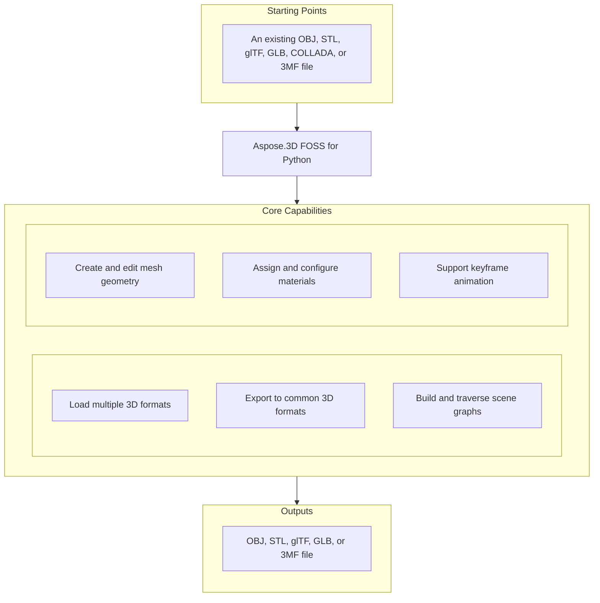

# Aspose.3D FOSS for Python

[](https://pypi.org/project/aspose-3d-foss/)  [](LICENSE) [](https://github.com/aspose-3d-foss/Aspose.3D-FOSS-for-Python/graphs/contributors)

[](https://products.aspose.org/3d/python/)

Aspose.3D FOSS for Python is a Python library for creating, reading, converting, and saving 3D scenes using formats such as `.obj`, `.stl`, `.gltf`, `.glb`, `.dae`, `.3mf`, and `.fbx`. It enables developers to programmatically build 3D geometry using primitives like `Box`, `Sphere`, and `Cylinder`, assign materials, and export scenes to supported formats. Users can inspect and manipulate scene hierarchies through classes like `Scene`, `Node`, `Entity`, and `Mesh`, and manage animations using `AnimationClip`, `AnimationNode`, and `KeyframeSequence`. The library supports Python versions 3.7 through 3.12 and requires Python >=3.7.

## Navigation

- [At a Glance](#at-a-glance)
- [Key Capabilities](#key-capabilities)
- [Installation](#installation)
- [Dependencies](#dependencies)
- [Quick Start](#quick-start)
- [Additional Examples](#additional-examples)
- [API Reference](#api-reference)
- [Documentation & Resources](#documentation--resources)
- [Scope and Limitations](#scope-and-limitations)
- [Development and Testing](#development-and-testing)
- [License](#license)

## At a Glance



## Key Capabilities

- **Load multiple 3D formats.** Aspose.3D FOSS for Python reads `.obj`, `.stl`, `.gltf`, `.glb`, `.dae`, and `.3mf` files using `Scene.open`() with automatic format detection from the file extension or an explicit `FileFormat` instance.
- **Export to common 3D formats.** Aspose.3D FOSS for Python writes scenes to `.obj`, `.stl`, `.gltf`, `.glb`, and `.3mf` files using `Scene.save`() with dedicated save options for each format.
- **Build and traverse scene graphs.** Aspose.3D FOSS for Python builds and traverses a scene graph using `Node` and `Entity` objects, where each `Node` carries an independent `Transform` describing translation, rotation, and scaling.
- **Create and edit mesh geometry.** Aspose.3D FOSS for Python authoring and editing of mesh geometry is supported through `Mesh.control_points` and `Mesh.create_polygon`(), and parameterized primitives like `Box` and `Sphere` can be converted to `Mesh` using their `to_mesh()` method.
- **Assign and configure materials.** Aspose.3D FOSS for Python assigns materials such as `LambertMaterial` and `PbrMaterial` to nodes, supporting diffuse color, metallic factor, and roughness factor properties for realistic rendering.
- **Support keyframe animation.** Aspose.3D FOSS for Python supports keyframe animation through `AnimationClip`, `AnimationNode`, and `KeyframeSequence`, and stores skeletal bind-pose data using `Pose` objects.

## Installation

Install the published package from PyPI (`aspose-3d-foss`, version 26.1.0):

```bash
pip install aspose-3d-foss
```

To work from a source checkout instead, install the clone with pip:

```bash
git clone https://github.com/aspose-3d-foss/Aspose.3D-FOSS-for-Python.git
cd Aspose.3D-FOSS-for-Python
pip install .
```

Verify the install:

```bash
python -c "import aspose.threed"
```

The package supports Python 3.7, 3.8, 3.9, 3.10, 3.11, and 3.12 and declares `python_requires` as `>=3.7`.

## Dependencies

### Required Package Dependencies

No required third-party package dependencies; in `setup.py`, the `install_requires` list is empty.

### Native and System Requirements

- Requires Python 3.7 or later (`python_requires=">=3.7"` in `setup.py`).

### Development Dependencies

- `pytest>=7.0.0` (extra `dev`)

## Quick Start

Import an OBJ file and inspect its geometry by reading the control points and polygon count for each entity.

```python
from aspose.threed import Scene
from aspose.threed.entities import Box
from aspose.threed.shading import LambertMaterial
from aspose.threed.utilities import Vector3

scene = Scene()
box = Box(length=2.0, width=1.0, height=1.0)
material = LambertMaterial()
material.diffuse_color = Vector3(0.2, 0.6, 0.9)

scene.root_node.create_child_node("Crate", entity=box.to_mesh(), material=material)
scene.save("crate.gltf")
```

Build a scene from scratch using a sphere with a PBR material and save it as an STL file.

```python
from aspose.threed import Scene
from aspose.threed.entities import Sphere
from aspose.threed.shading import PbrMaterial
from aspose.threed.utilities import Vector3

scene = Scene()
sphere = Sphere()
material = PbrMaterial(albedo=Vector3(0.8, 0.1, 0.1))
material.metallic_factor = 0.9
material.roughness_factor = 0.2

scene.root_node.create_child_node("Ball", entity=sphere.to_mesh(), material=material)
scene.save("ball.stl")
```

## Additional Examples

More real, verified snippets are collected below, each demonstrating one operation without obscuring the primary installation and quick-start path.

### Construct a mesh vertex by vertex, attach a PBR material, write the scene to an in-memory glTF stream, and read the exported material back out of the glTF JSON

```python
import io
import json
from aspose.threed import Scene, FileFormat
from aspose.threed.entities import Mesh
from aspose.threed.utilities import Vector3, Vector4
from aspose.threed.formats.gltf import GltfSaveOptions
from aspose.threed.shading import PbrMaterial

scene = Scene()
mesh = Mesh("TestMesh")
mesh.control_points.add(Vector4(0.0, 0.0, 0.0, 1.0))
mesh.control_points.add(Vector4(1.0, 0.0, 0.0, 1.0))
mesh.control_points.add(Vector4(0.0, 1.0, 0.0, 1.0))
mesh.create_polygon(0, 1, 2)

albedo = Vector3(0.8, 0.2, 0.3)
material = PbrMaterial("RedMaterial", albedo)
material.metallic_factor = 0.5
material.roughness_factor = 0.7

node = scene.root_node.create_child_node("TestNode")
node.entity = mesh
node.material = material

stream = io.BytesIO()
# Pass the detected FileFormat into the constructor explicitly: unlike
# StlFormat, GltfFormat.create_save_options() does not set file_format on the
# options it returns, and a bare stream (no filename) gives scene.save()
# nothing else to detect the format from.
options = GltfSaveOptions(FileFormat.get_format_by_extension(".gltf"))
options.binary_mode = False
scene.save(stream, options)

stream.seek(0)
gltf_data = json.loads(stream.read().decode("utf-8"))
print(gltf_data["materials"][0]["pbrMetallicRoughness"])
```

<details>
<summary>View Additional Examples</summary>

### Build a triangle mesh and export it to ASCII STL using `FileFormat.get_format_by_extension`(...).create_save_options() to ensure the format is correctly inferred from the stream

```python
import io
from aspose.threed import Scene, FileFormat
from aspose.threed.entities import Mesh
from aspose.threed.utilities import Vector4

scene = Scene()
mesh = Mesh("triangle")
mesh.control_points.add(Vector4(0.0, 0.0, 0.0, 1.0))
mesh.control_points.add(Vector4(1.0, 0.0, 0.0, 1.0))
mesh.control_points.add(Vector4(1.0, 1.0, 0.0, 1.0))
mesh.create_polygon(0, 1, 2)

node = scene.root_node.create_child_node("triangle_node")
node.entity = mesh

stream = io.StringIO()
# Use FileFormat.get_format_by_extension(...).create_save_options() rather than
# StlSaveOptions() directly: a default-constructed options object has no
# file_format set, and scene.save() cannot infer the format from a bare stream
# (only filename-based saves fall back to extension detection).
options = FileFormat.get_format_by_extension(".stl").create_save_options()
options.binary_mode = False
scene.save(stream, options)
print(stream.getvalue())
```

### Convert a `Box` primitive to a mesh and count its control points using the `to_mesh()` method

```python
from aspose.threed.entities import Box

box = Box(10, 20, 30)
mesh = box.to_mesh()
print(f"Control points: {len(mesh.control_points)}")
```

### Construct a cube mesh and export it to 3MF without compression using `ThreeMfSaveOptions`

```python
import io
from aspose.threed import Scene
from aspose.threed.entities import Mesh
from aspose.threed.utilities import Vector4
from aspose.threed.formats import ThreeMfSaveOptions

scene = Scene()
mesh = Mesh("cube")
for point in [
    Vector4(0, 0, 0, 1), Vector4(1, 0, 0, 1), Vector4(1, 1, 0, 1), Vector4(0, 1, 0, 1),
    Vector4(0, 0, 1, 1), Vector4(1, 0, 1, 1), Vector4(1, 1, 1, 1), Vector4(0, 1, 1, 1),
]:
    mesh.control_points.add(point)

mesh.create_polygon(0, 1, 2)
mesh.create_polygon(0, 2, 3)
mesh.create_polygon(4, 7, 6)
mesh.create_polygon(4, 6, 5)
mesh.create_polygon(0, 4, 5)
mesh.create_polygon(0, 5, 1)
mesh.create_polygon(2, 6, 7)
mesh.create_polygon(2, 7, 3)
mesh.create_polygon(0, 3, 7)
mesh.create_polygon(0, 7, 4)
mesh.create_polygon(1, 5, 6)
mesh.create_polygon(1, 6, 2)

node = scene.root_node.create_child_node("cube")
node.entity = mesh

stream = io.BytesIO()
options = ThreeMfSaveOptions()
options.enable_compression = False
scene.save(stream, options)
```

</details>

## API Reference

The aspose-3d-foss package provides the `aspose.threed.Scene` class as the main entry point for loading, saving, and manipulating 3D scenes, and `aspose.threed.FileFormat` for format detection and options creation. `Scene` instances hold a hierarchy of `aspose.threed.Node` objects, each with a `Transform`, optional `Mesh` entities, and `Material` references.

The verified public surface has 337 types.

<details>
<summary>View the Complete Public API Surface</summary>

### Core API

| Class | Description |
| --- | --- |
| `A3DObject` | The A3DObject class serves as the base for all objects in Aspose.3D FOSS for Python and provides property management through its name and properties members. |
| `AnimationChannel` | The AnimationChannel class represents a single animated property channel and holds its keyframe sequence, default value, and component type. |
| `AnimationClip` | The AnimationClip class defines a time-bounded animation sequence containing multiple animation nodes and supporting description and timing metadata. |
| `AnimationNode` | The AnimationNode class represents a node in an animation hierarchy and manages bind points and sub-animations for skeletal or transform animation. |
| `ArrayListAdapter` | Adapter class that wraps List[T] and implements IArrayList[T]. |
| `AssetInfo` | The AssetInfo class stores metadata about a 3D asset such as author, creation time, coordinate system, and unit scale factor. |
| `Axis` | The coordinate axis. |
| `AxisSystem` | Axis system is an combination of coordinate system, up vector and front vector. |
| `BindPoint` | The BindPoint class defines how an animation channel is bound to a specific property of a scene object and manages associated keyframe sequences. |
| `BonePose` | The BonePose class represents the pose of a bone during animation and stores its transformation matrix and local or world space flag. |
| `BoundingBox2D` | The axis-aligned bounding box for Vector2 |
| `BoundingBoxExtent` | The extent of the bounding box |
| `Box` | The Box class represents a box primitive with configurable length, height, and segment counts for mesh generation. |
| `Camera` | The Camera class defines a camera entity used for rendering and provides view and projection configuration. |
| `Circle` | The Circle class represents a circular primitive with configurable resolution and radius for mesh generation. |
| `ComposeOrder` | The order to compose transform matrix |
| `CoordinateSystem` | The left handed or right handed coordinate system. |
| `Curve` | The Curve class represents a parametric curve entity in three-dimensional space. |
| `CustomObject` | The CustomObject class allows embedding user-defined objects within a scene while inheriting common A3DObject behavior. |
| `Cylinder` | The Cylinder class represents a cylindrical primitive with configurable radius, height, and segment counts. |
| `Dish` | The Dish class represents a dish-shaped primitive with configurable radii and segment counts. |
| `Ellipse` | The Ellipse class represents an elliptical primitive with configurable radii and resolution. |
| `Entity` | The Entity class serves as the base for all renderable or geometric objects in a scene and inherits from SceneObject. |
| `ExportException` | Exceptions when Aspose.3D failed to export the scene to file. |
| `Extrapolation` | The Extrapolation class defines how animation values are extended beyond the keyframe range. |
| `FMatrix4` | Matrix 4x4 with all component in float type |
| `FileContentType` | File content type |
| `FileFormat` | The FileFormat class provides utilities for identifying and working with supported 3D file formats. |
| `FileFormatType` | File format type |
| `Frustum` | The Frustum class represents a truncated pyramid primitive commonly used for camera view volumes. |
| `Geometry` | The Geometry class serves as the base for all geometric entities and provides mesh-like data structures. |
| `GlobalTransform` | The GlobalTransform class encapsulates the combined transformation matrix applied to a scene object. |
| `Group` | A Group represents the logical relationships of Node. |
| `INamedObject` | The INamedObject class defines an interface for objects that can be identified by a name. |
| `IOExtension` | Utilities to write matrix/vector to binary writer |
| `ImageRenderOptions` | The ImageRenderOptions class controls rendering settings for exporting a scene to image formats. |
| `ImportException` | Exception when Aspose.3D failed to open the specified source. |
| `KeyFrame` | The KeyFrame class represents a single keyframe in an animation sequence with a time and value. |
| `KeyframeSequence` | The KeyframeSequence class manages a collection of keyframes used for animating a property. |
| `Light` | The Light class represents a light source entity that inherits from Camera and provides illumination configuration. |
| `LinearExtrusion` | The LinearExtrusion class represents a 3D shape created by extruding a 2D profile along a straight path. |
| `MathUtils` | A set of useful mathematical utilities. |
| `Mesh` | The Mesh class represents a polygonal mesh entity composed of vertices and polygons. |
| `Node` | The Node class represents a transformable node in the scene hierarchy and can contain child nodes and an entity. |
| `ParseException` | Exception when Aspose.3D failed to parse the input. |
| `Plane` | The Plane class represents a planar primitive with configurable size and segment counts. |
| `PolygonBuilder` | The PolygonBuilder class provides utilities for constructing polygonal geometry programmatically. |
| `Pose` | The Pose class represents a specific pose configuration of a scene object and supports named identification. |
| `Primitive` | The Primitive class serves as the base for built-in geometric primitives such as box, cylinder, and sphere. |
| `Property` | The Property class represents a single named property with a value and type information. |
| `PropertyCollection` | The PropertyCollection class manages a collection of properties associated with an object. |
| `PropertyFlags` | Property's flags |
| `Rect` | A class to represent the rectangle |
| `RelativeRectangle` | Relative rectangle |
| `RotationOrder` | The order controls which rx ry rz are applied in the transformation matrix. |
| `Scene` | The Scene class represents a complete 3D scene containing nodes, entities, animations, and asset metadata. |
| `SceneObject` | The SceneObject class serves as the base for all objects that can be placed in a scene and inherits from A3DObject. |
| `SemanticAttribute` | Allow user to use their own structure for static declaration of VertexDeclaration |
| `Sphere` | The Sphere class represents a sphere primitive in Aspose.3D FOSS for Python. |
| `Transform` | The Transform class represents transformation properties such as translation, rotation, and scaling for 3D objects in Aspose.3D FOSS for Python. |
| `TransformBuilder` | The TransformBuilder is used to build transform matrix by a chain of transformations. |
| `TrialException` | This is raised in Scene.Open/Scene.Save when no licenses are applied. |
| `Vertex` | Vertex reference, used to access the raw vertex in TriMesh. |
| `VertexDeclaration` | The declaration of a custom defined vertex's structure |
| `VertexField` | Vertex's field memory layout description. |
| `VertexFieldDataType` | Vertex field's data type |
| `VertexFieldSemantic` | The semantic of the vertex field |
| `Bone` | The Bone class represents a bone used in skeletal animation within Aspose.3D FOSS for Python. |
| `BoneLinkMode` | The BoneLinkMode class defines enumeration values for bone linking modes in Aspose.3D FOSS for Python. |
| `Deformer` | The Deformer class serves as a base class for mesh deformation operations in Aspose.3D FOSS for Python. |
| `MorphTargetChannel` | The MorphTargetChannel class manages weights and targets for morph target animation in Aspose.3D FOSS for Python. |
| `MorphTargetDeformer` | The MorphTargetDeformer class applies morph target deformations to meshes in Aspose.3D FOSS for Python. |
| `SkinDeformer` | The SkinDeformer class applies skinning deformations using bone weights in Aspose.3D FOSS for Python. |
| `ApertureMode` | Camera aperture modes. |
| `BooleanOperand` | This class encapsulates the transformed mesh as Boolean operation's operand. |
| `BooleanOperation` | The BooleanOperation class defines enumeration values for boolean operations on 3D entities in Aspose.3D FOSS for Python. |
| `BooleanOperator` | Boolean operator allows you to apply Boolean operation on two IMeshConvertible instances. |
| `CompositeCurve` | A CompositeCurve is consisting of several curve segments. |
| `CurveDimension` | The CurveDimension class specifies the dimensionality of curves in Aspose.3D FOSS for Python. |
| `EndPoint` | The end point to trim the curve, can be a parameter value or a Cartesian point. |
| `HalfSpace` | HalfSpace represents a infinity space which is split by a plane, this can be used with BooleanOperator |
| `IIndexedVertexElement` | The IIndexedVertexElement interface represents an indexed vertex element in Aspose.3D FOSS for Python. |
| `IMeshConvertible` | Entities that implemented this interface can be converted to Mesh |
| `IOrientable` | Orientable entities shall implement this interface. |
| `LightType` | Light types. |
| `Line` | A polyline is a path defined by a set of points with control_points, and connected by segments. |
| `MappingMode` | The MappingMode class defines enumeration values for texture mapping modes in Aspose.3D FOSS for Python. |
| `NurbsCurve` | The NurbsCurve class represents a NURBS curve geometry in Aspose.3D FOSS for Python. |
| `NurbsDirection` | The NurbsDirection class defines properties for a NURBS direction in Aspose.3D FOSS for Python. |
| `NurbsSurface` | The NurbsSurface class represents a NURBS surface geometry in Aspose.3D FOSS for Python. |
| `NurbsType` | The NurbsType class defines enumeration values for NURBS types in Aspose.3D FOSS for Python. |
| `Patch` | The Patch class represents a patch geometry in Aspose.3D FOSS for Python. |
| `PatchDirection` | The PatchDirection class defines properties for patch directions in Aspose.3D FOSS for Python. |
| `PatchDirectionType` | The PatchDirectionType class defines enumeration values for patch direction types in Aspose.3D FOSS for Python. |
| `PointCloud` | The PointCloud class represents a collection of points in 3D space in Aspose.3D FOSS for Python. |
| `InvalidOperationException` | The InvalidOperationException class is raised when an invalid operation occurs during polygon building in Aspose.3D FOSS for Python. |
| `PolygonModifier` | The PolygonModifier class provides utilities for modifying polygonal meshes in Aspose.3D FOSS for Python. |
| `ProjectionType` | Camera's projection types. |
| `Pyramid` | Parameterized pyramid. |
| `RectangularTorus` | Parameterized rectangular torus entity. |
| `ReferenceMode` | The ReferenceMode class defines enumeration values for reference modes in Aspose.3D FOSS for Python. |
| `RevolvedAreaSolid` | RevolvedAreaSolid entity. |
| `RotationMode` | The frustum's rotation mode. |
| `Shape` | Base class for all shape entities. |
| `Skeleton` | The Skeleton is mainly used by CAD software to help designer to manipulate the transformation of skeletal structure, it's usually useless outside the CAD softwares. |
| `SkeletonType` | Skeleton type enum. |
| `SplitMeshPolicy` | Share vertex/control point data between sub-meshes or each sub-mesh has its own compacted data. |
| `SweptAreaSolid` | SweptAreaSolid entity. |
| `TextureMapping` | The TextureMapping class defines enumeration values for texture mapping types in Aspose.3D FOSS for Python. |
| `Torus` | Parameterized torus entity. |
| `TransformedCurve` | TransformedCurve entity. |
| `TriMesh` | TriMesh is a triangle mesh that stores triangles. |
| `TrimmedCurve` | TrimmedCurve entity. |
| `VertexElement` | The VertexElement class represents a generic vertex element in Aspose.3D FOSS for Python. |
| `VertexElementBinormal` | The VertexElementBinormal class represents binormal data for vertices in Aspose.3D FOSS for Python. |
| `VertexElementDoublesTemplate` | A helper class for defining concrete implementations. |
| `VertexElementEdgeCrease` | Defines the edge crease values for specified components. |
| `VertexElementFVector` | The VertexElementFVector class represents floating-point vector vertex data in Aspose.3D FOSS for Python. |
| `VertexElementHole` | Defines the hole information for specified components. |
| `VertexElementIntsTemplate` | A helper class for defining concrete implementations with int data. |
| `VertexElementMaterial` | Defines the material for specified components. |
| `VertexElementNormal` | The VertexElementNormal class represents normal vectors for vertices in Aspose.3D FOSS for Python. |
| `VertexElementPolygonGroup` | Defines the polygon group for specified components. |
| `VertexElementSmoothingGroup` | The VertexElementSmoothingGroup class represents smoothing group data for vertices in Aspose.3D FOSS for Python. |
| `VertexElementSpecular` | Defines the specular color for specified components. |
| `VertexElementTangent` | The VertexElementTangent class represents tangent vectors for vertices in Aspose.3D FOSS for Python. |
| `VertexElementTemplate` | A helper class for defining concrete implementations of vertex elements with typed data. |
| `VertexElementType` | The VertexElementType class defines enumeration values for vertex element types in Aspose.3D FOSS for Python. |
| `VertexElementUV` | The VertexElementUV class represents UV texture coordinates for vertices in Aspose.3D FOSS for Python. |
| `VertexElementUserData` | Defines the user data for specified components. |
| `VertexElementVector4` | Defines the vector4 data for specified components. |
| `VertexElementVertexColor` | The VertexElementVertexColor class represents vertex color data in Aspose.3D FOSS for Python. |
| `VertexElementVertexCrease` | Defines the vertex crease values for specified components. |
| `VertexElementVisibility` | Defines the visibility for specified components. |
| `VertexElementWeight` | Defines the weight for specified components. |
| `A3dwSaveOptions` | Save options for A3DW |
| `AmfSaveOptions` | Save options for AMF |
| `BasicLoadOptions` | Simple LoadOptions subclass for basic loading options. |
| `ColladaLoadOptions` | Load options for Collada |
| `ColladaSaveOptions` | Save options for collada |
| `ColladaTransformStyle` | The node's transformation style of node |
| `Discreet3dsLoadOptions` | Load options for Discreet 3DS |
| `Discreet3dsSaveOptions` | Save options for Discreet 3DS |
| `DracoCompressionLevel` | Compression level for draco file |
| `DracoFormat` | Google Draco format |
| `DracoSaveOptions` | Save options for Draco |
| `Exporter` | The Exporter class provides functionality to export 3D scenes to various file formats in Aspose.3D FOSS for Python. |
| `FbxLoadOptions` | Load options for FBX |
| `FbxSaveOptions` | Save options for FBX |
| `FormatDetector` | The FormatDetector class detects the format of a 3D file in Aspose.3D FOSS for Python. |
| `GltfEmbeddedImageFormat` | Embedded image format for GLTF |
| `formats.GltfLoadOptions` | Load options for glTF |
| `formats.GltfSaveOptions` | Save options for glTF |
| `Html5SaveOptions` | Save options for HTML5 |
| `IOConfig` | The IOConfig class holds input/output configuration options for file operations in Aspose.3D FOSS for Python. |
| `IOService` | The IOService class provides core input/output services for file handling in Aspose.3D FOSS for Python. |
| `Importer` | The Importer class provides functionality to import 3D scenes from various file formats in Aspose.3D FOSS for Python. |
| `JtLoadOptions` | Load options for JT |
| `LoadOptions` | LoadOptions provides configuration options for loading 3D scenes in Aspose.3D FOSS for Python. |
| `Microsoft3MFFormat` | Microsoft 3MF format |
| `Microsoft3MFSaveOptions` | Save options for Microsoft 3MF |
| `formats.ObjLoadOptions` | Load options for OBJ |
| `formats.ObjSaveOptions` | Save options for OBJ |
| `PdfFormat` | Adobe's Portable Document Format |
| `PdfLightingScheme` | Lighting scheme for PDF export |
| `PdfLoadOptions` | Load options for PDF |
| `PdfRenderMode` | Render mode for PDF export |
| `PdfSaveOptions` | Save options for PDF |
| `Plugin` | Plugin serves as an abstract base class for format plugins that support loading, saving, and detection of 3D file formats in Aspose.3D FOSS for Python. |
| `PlyFormat` | PLY format |
| `PlyLoadOptions` | Load options for PLY |
| `PlySaveOptions` | Save options for PLY |
| `RvmFormat` | RVM format |
| `RvmLoadOptions` | Load options for RVM |
| `RvmSaveOptions` | Save options for RVM |
| `SaveOptions` | SaveOptions provides configuration options for saving 3D scenes in Aspose.3D FOSS for Python. |
| `formats.StlLoadOptions` | Load options for STL |
| `formats.StlSaveOptions` | Save options for STL |
| `ThreeMfFormat` | ThreeMfFormat represents the 3MF file format and supports importing and exporting 3D models with metadata in Aspose.3D FOSS for Python. |
| `ThreeMfLoadOptions` | ThreeMfLoadOptions provides configuration options specific to loading 3MF files in Aspose.3D FOSS for Python. |
| `ThreeMfSaveOptions` | ThreeMfSaveOptions provides configuration options specific to saving 3MF files in Aspose.3D FOSS for Python. |
| `U3dLoadOptions` | Load options for U3D |
| `U3dSaveOptions` | Save options for U3D |
| `UsdSaveOptions` | Save options for USD |
| `XLoadOptions` | Load options for X format |
| `ColladaExporter` | ColladaExporter exports 3D scenes to the COLLADA format in Aspose.3D FOSS for Python. |
| `ColladaFormat` | ColladaFormat represents the COLLADA file format and supports importing and exporting 3D models in Aspose.3D FOSS for Python. |
| `ColladaFormatDetector` | ColladaFormatDetector identifies COLLADA files by their content in Aspose.3D FOSS for Python. |
| `ColladaImporter` | ColladaImporter imports 3D scenes from the COLLADA format in Aspose.3D FOSS for Python. |
| `ColladaPlugin` | ColladaPlugin provides access to COLLADA format capabilities including importers, exporters, and format detectors in Aspose.3D FOSS for Python. |
| `FbxExporter` | FbxExporter saves 3D scenes to the FBX format in Aspose.3D FOSS for Python. |
| `FbxFormat` | FbxFormat represents the FBX file format and supports importing and exporting 3D models in Aspose.3D FOSS for Python. |
| `FbxFormatDetector` | FbxFormatDetector identifies FBX files by their content in Aspose.3D FOSS for Python. |
| `FbxImporter` | FbxImporter loads 3D scenes from the FBX format in Aspose.3D FOSS for Python. |
| `FbxPlugin` | FbxPlugin provides access to FBX format capabilities including importers, exporters, and format detectors in Aspose.3D FOSS for Python. |
| `BinaryTokenizer` | BinaryTokenizer parses binary FBX files into tokens for further processing in Aspose.3D FOSS for Python. |
| `binary_tokenizer.Token` | Token represents a parsed element from a binary FBX file in Aspose.3D FOSS for Python. |
| `binary_tokenizer.TokenType` | TokenType defines the categories of tokens used in binary FBX parsing in Aspose.3D FOSS for Python. |
| `FbxElement` | FbxElement represents a parsed FBX element with its properties and child elements in Aspose.3D FOSS for Python. |
| `FbxParser` | FbxParser reads and interprets binary FBX data into structured elements in Aspose.3D FOSS for Python. |
| `FbxScope` | FbxScope manages the hierarchical context during FBX parsing in Aspose.3D FOSS for Python. |
| `FbxTokenizer` | FbxTokenizer breaks down text-based FBX files into tokens for parsing in Aspose.3D FOSS for Python. |
| `tokenizer.Token` | Token represents a lexical unit extracted from a text-based FBX file in Aspose.3D FOSS for Python. |
| `tokenizer.TokenType` | TokenType specifies the kinds of tokens produced during text-based FBX tokenization in Aspose.3D FOSS for Python. |
| `GltfExporter` | GltfExporter exports 3D scenes to the glTF format in Aspose.3D FOSS for Python. |
| `GltfFormat` | GltfFormat represents the glTF file format and supports importing and exporting 3D models in Aspose.3D FOSS for Python. |
| `GltfFormatDetector` | GltfFormatDetector identifies glTF files by their content in Aspose.3D FOSS for Python. |
| `GltfImporter` | GltfImporter loads 3D scenes from the glTF format in Aspose.3D FOSS for Python. |
| `gltf.GltfLoadOptions` | GltfLoadOptions provides configuration options specific to loading glTF files in Aspose.3D FOSS for Python. |
| `GltfPlugin` | GltfPlugin provides access to glTF format capabilities including importers, exporters, and format detectors in Aspose.3D FOSS for Python. |
| `gltf.GltfSaveOptions` | GltfSaveOptions provides configuration options specific to saving glTF files in Aspose.3D FOSS for Python. |
| `ObjExporter` | ObjExporter saves 3D scenes to the OBJ format in Aspose.3D FOSS for Python. |
| `ObjFormat` | ObjFormat represents the OBJ file format and supports importing and exporting 3D models in Aspose.3D FOSS for Python. |
| `ObjFormatDetector` | ObjFormatDetector identifies OBJ files by their content in Aspose.3D FOSS for Python. |
| `ObjImporter` | ObjImporter loads 3D scenes from the OBJ format in Aspose.3D FOSS for Python. |
| `obj.ObjLoadOptions` | ObjLoadOptions provides configuration options specific to loading OBJ files in Aspose.3D FOSS for Python. |
| `ObjPlugin` | ObjPlugin provides access to OBJ format capabilities including importers, exporters, and format detectors in Aspose.3D FOSS for Python. |
| `obj.ObjSaveOptions` | ObjSaveOptions provides configuration options specific to saving OBJ files in Aspose.3D FOSS for Python. |
| `StlExporter` | StlExporter saves 3D scenes to the STL format in Aspose.3D FOSS for Python. |
| `StlFormat` | The StlFormat class represents the STL file format and provides properties and methods for handling STL files in Aspose.3D FOSS for Python. |
| `StlFormatDetector` | The StlFormatDetector class detects whether a given input stream contains an STL file format. |
| `StlImporter` | The StlImporter class imports geometry data from STL files into a scene object. |
| `stl.StlLoadOptions` | The StlLoadOptions class provides configuration options for loading STL files, including coordinate system flipping and scaling. |
| `StlPlugin` | The StlPlugin class acts as a plugin for the STL file format, offering access to importers, exporters, and format detection capabilities. |
| `stl.StlSaveOptions` | The StlSaveOptions class provides configuration options for saving scenes to STL files, including binary mode, coordinate system flipping, and scaling. |
| `ThreeMfExporter` | The ThreeMfExporter class exports scene data to the 3MF file format. |
| `ThreeMfFormatDetector` | The ThreeMfFormatDetector class detects whether a given input stream contains a 3MF file format. |
| `ThreeMfImporter` | The ThreeMfImporter class imports geometry data from 3MF files into a scene object. |
| `ThreeMfPlugin` | The ThreeMfPlugin class acts as a plugin for the 3MF file format, offering access to importers, exporters, and format detection capabilities. |
| `ArbitraryProfile` | This class allows you to construct a 2D profile directly from arbitrary curve. |
| `CShape` | IFC compatible C-shape profile that defined by parameters. |
| `CenterLineProfile` | IFC compatible center line profile. |
| `CircleShape` | IFC compatible circle profile. |
| `EllipseShape` | IFC compatible ellipse profile. |
| `FontFile` | Font file contains definitions for glyphs, this is used to create text profile. |
| `HShape` | IFC compatible H-shape profile. |
| `HollowCircleShape` | IFC compatible hollow circle profile. |
| `HollowRectangleShape` | IFC compatible hollow rectangular shape with both inner/outer rounding corners. |
| `LShape` | IFC compatible L-shape profile that defined by parameters. |
| `MirroredProfile` | IFC compatible mirror profile. |
| `ParameterizedProfile` | The base class of all parameterized profiles. |
| `Profile` | 2D Profile in xy plane. |
| `RectangleShape` | IFC compatible rectangle profile. |
| `TShape` | IFC compatible T-shape defined by parameters. |
| `Text` | Text profile, this profile describes contours using font and text. |
| `TrapeziumShape` | IFC compatible Trapezium shape defined by parameters. |
| `UShape` | IFC compatible U-shape defined by parameters. |
| `ZShape` | IFC compatible Z-shape profile that defined by parameters. |
| `BlendFactor` | Blend factor specify pixel arithmetic. |
| `CompareFunction` | Compare function for depth/stencil testing. |
| `CubeFace` | Cube face enumeration. |
| `CullFaceMode` | Cull face mode for face culling. |
| `DescriptorSetUpdater` | Descriptor set updater for shader resources. |
| `DrawOperation` | Draw operation type. |
| `DriverException` | Exception thrown when rendering driver fails. |
| `EntityRenderer` | Base class for rendering entities. |
| `EntityRendererFeatures` | Features supported by an entity renderer. |
| `EntityRendererKey` | The key of registered entity renderer. |
| `FrontFace` | Front face winding order. |
| `GLSLSource` | GLSL shader source. |
| `IBuffer` | Interface for vertex/index buffer. |
| `ICommandList` | Interface for command list. |
| `IDescriptorSet` | Interface for descriptor set. |
| `IIndexBuffer` | Interface for index buffer. |
| `IPipeline` | Interface for graphics pipeline. |
| `IRenderQueue` | Interface for render queue. |
| `IRenderTarget` | Interface for render target. |
| `IRenderTexture` | Interface for render texture. |
| `IRenderWindow` | Interface for render window. |
| `ITexture1D` | Interface for 1D texture. |
| `ITexture2D` | Interface for 2D texture. |
| `ITextureCodec` | Interface for texture codec. |
| `ITextureCubemap` | Interface for cubemap texture. |
| `ITextureDecoder` | Interface for texture decoder. |
| `ITextureEncoder` | Interface for texture encoder. |
| `ITextureUnit` | Interface for texture unit. |
| `IVertexBuffer` | Interface for vertex buffer. |
| `IndexDataType` | Data type for indices. |
| `InitializationException` | Exception thrown when rendering initialization fails. |
| `PixelFormat` | Pixel format for render targets. |
| `PixelMapMode` | Pixel mapping mode. |
| `PixelMapping` | Pixel mapping configuration. |
| `PolygonMode` | Polygon rendering mode. |
| `PostProcessing` | Post-processing effect. |
| `PresetShaders` | Predefined shaders. |
| `PushConstant` | Push constant for shaders. |
| `RenderFactory` | RenderFactory creates all resources that represented in rendering pipeline. |
| `RenderParameters` | Parameters for rendering. |
| `RenderQueueGroupId` | Render queue group ID. |
| `RenderResource` | Base class for render resources. |
| `RenderStage` | Render stage in the pipeline. |
| `RenderState` | Render state configuration. |
| `Renderer` | The context about renderer. |
| `RendererVariableManager` | Manages renderer variables. |
| `SPIRVSource` | SPIRV shader source. |
| `ShaderException` | Exception thrown when shader compilation/linking fails. |
| `ShaderProgram` | Shader program. |
| `ShaderSet` | Set of shaders for rendering. |
| `ShaderSource` | Shader source code. |
| `ShaderStage` | Shader stage. |
| `ShaderVariable` | Shader variable. |
| `StencilAction` | Stencil action. |
| `StencilState` | Stencil state configuration. |
| `TextureCodec` | Texture codec. |
| `TextureData` | Texture data. |
| `TextureType` | Texture type. |
| `Viewport` | Viewport for rendering. |
| `WindowHandle` | Window handle for render window. |
| `AlphaSource` | Source of alpha channel for textures. |
| `LambertMaterial` | The LambertMaterial class represents a Lambertian material with properties for ambient, diffuse, emissive, and transparency colors. |
| `Material` | The Material class serves as the base class for all shading materials in Aspose.3D FOSS for Python. |
| `PbrMaterial` | The PbrMaterial class represents a physically based rendering material with properties such as albedo, metallic factor, roughness, and emissive color. |
| `PbrSpecularMaterial` | Material for physically based rendering based on diffuse color/specular/glossiness. |
| `PhongMaterial` | The PhongMaterial class represents a Phong shading material extending LambertMaterial with reflection and specular properties. |
| `ShaderMaterial` | A shader material allows to describe the material by external rendering engine or shader language. |
| `ShaderTechnique` | A technique in shader material describes the concrete rendering details. |
| `Texture` | This class defines the texture from an external file. |
| `TextureBase` | Base class for all texture types. |
| `TextureFilter` | Texture filter type. |
| `TextureSlot` | Texture slot name. |
| `WrapMode` | Wrap mode for texture coordinates. |
| `BoundingBox` | The BoundingBox class represents an axis-aligned bounding box used to describe the spatial extent of geometry. |
| `FVector2` | The FVector2 class represents a two-dimensional vector with single-precision floating-point components. |
| `FVector3` | The FVector3 class represents a three-dimensional vector with single-precision floating-point components. |
| `FVector4` | The FVector4 class represents a four-dimensional vector with single-precision floating-point components. |
| `FileSystem` | File system encapsulation. |
| `Matrix4` | The Matrix4 class represents a 4x4 transformation matrix used for 3D geometry operations. |
| `Quaternion` | The Quaternion class represents a quaternion used for 3D rotation operations. |
| `Vector2` | The Vector2 class represents a two-dimensional vector with double-precision floating-point components. |
| `Vector3` | The Vector3 class represents a three-dimensional vector with double-precision floating-point components. |
| `Vector4` | The Vector4 class represents a four-dimensional vector with double-precision floating-point components. |
| `Watermark` | Utility to encode/decode blind watermark to/from a mesh. |

#### Enumerations

| Enumeration | Description |
| --- | --- |
| `ExtrapolationType` | The ExtrapolationType class enumerates supported methods for extrapolating animation values outside the keyframe range. |
| `Interpolation` | The Interpolation class enumerates supported methods for interpolating keyframe values over time. |
| `PoseType` | The PoseType class enumerates the types of poses supported in the scene. |
| `StepMode` | The StepMode class defines enumeration values for step mode settings in Aspose.3D FOSS for Python. |
| `WeightedMode` | The WeightedMode class defines enumeration values for weighted mode settings in Aspose.3D FOSS for Python. |

#### Detailed Member Reference

### Scene

The `aspose.threed.Scene` class provides `Scene.open`() and `Scene.save`() to load and write 3D scenes, `Scene.root_node` to access the top-level node, `Scene.animation_clips` to manage animation data, `Scene.library` for shared resources, `Scene.sub_scenes` for hierarchical organization, `Scene.render` for visualization, `Scene.clear` to reset the scene, `Scene.create_animation_clip`() and `Scene.get_animation_clip`() for animation handling, `Scene.current_animation_clip` to inspect active clips, `Scene.poses` for pose-based animation, and `Scene.asset_info` for metadata, supporting formats like `FileFormat.WAVEFRONT_OBJ`, `FileFormat.GLTF2`, `FileFormat.FBX7400ASCII`, and `FileFormat.MICROSOFT_3MF_FORMAT` via `FileFormat.detect`, `FileFormat.get_format_by_extension`, `FileFormat.can_import`, `FileFormat.can_export`, `FileFormat.extensions`, `FileFormat.extension`, `FileFormat.file_format_type`, `FileFormat.version`, `FileFormat.formats`, `FileFormat.create_load_options`, and `FileFormat.create_save_options`.

- `animation_clips`: Defined as `def animation_clips(self) -> List['AnimationClip']`.
- `asset_info`: Defined as `def asset_info(self) -> AssetInfo`.
- `clear`: Defined as `def clear(self)`.
- `create_animation_clip`: Defined as `def create_animation_clip(self, name: str) -> 'AnimationClip'`.
- `current_animation_clip`: Defined as `def current_animation_clip(self) -> Optional['AnimationClip']`.
- `from_file`: Defined as `def from_file(file_name: str)`.
- `get_animation_clip`: Defined as `def get_animation_clip(self, name: str) -> Optional['AnimationClip']`.
- `library`: Defined as `def library(self) -> List[CustomObject]`.
- `open`: Defined as `def open(self, file_or_stream, options=None)`.
- `poses`: Defined as `def poses(self) -> List`.
- `render`: Defined as `def render(self, camera, file_name_or_bitmap, size=None, format=None, options=None)`.
- `root_node`: Defined as `def root_node(self)`.
- `save`: Defined as `def save(self, file_or_stream, format_or_options=None)`.
- `sub_scenes`: Defined as `def sub_scenes(self) -> List['Scene']`.

### Node

The `aspose.threed.Node` class provides `Node.add_child_node`() and `Node.create_child_node`() to build the scene hierarchy, `Node.transform` to access the `Node.transform`, `Node.material` and `Node.materials` to assign materials, `Node.entities` and `Node.entity` to manage `Mesh`-derived entities, `Node.child_nodes` and `Node.get_child`() to traverse children, `Node.parent_node` to navigate upward, `Node.global_transform` and `Node.evaluate_global_transform` for world-space transforms, `Node.get_bounding_box`() for spatial queries, `Node.select_objects`() and `Node.select_single_object`() for object selection, `Node.visible` and `Node.excluded` for visibility control, `Node.meta_datas` for custom data, and `Node.add_entity` and `Node.merge` for entity management.

- `add_child_node`: Defined as `def add_child_node(self, node: 'Node')`.
- `add_entity`: Defined as `def add_entity(self, entity: 'Entity')`.
- `asset_info`: Defined as `def asset_info(self)`.
- `child_nodes`: Defined as `def child_nodes(self) -> List['Node']`.
- `create_child_node`: Defined as `def create_child_node(self, node_name: Optional[str]=None, entity=None, material=None) -> 'Node'`.
- `entities`: Defined as `def entities(self) -> List['Entity']`.
- `entity`: Defined as `def entity(self) -> Optional['Entity']`.
- `evaluate_global_transform`: Defined as `def evaluate_global_transform(self, with_geometric_transform: bool) -> Matrix4`.
- `excluded`: Defined as `def excluded(self) -> bool`.
- `get_bounding_box`: Defined as `def get_bounding_box(self) -> BoundingBox`.
- `get_child`: Defined as `def get_child(self, index_or_name)`.
- `get_entity`: Defined as `def get_entity(self, entity_type: type)`.
- `global_transform`: Defined as `def global_transform(self) -> GlobalTransform`.
- `material`: Defined as `def material(self) -> Optional['Material']`.
- `materials`: Defined as `def materials(self) -> List['Material']`.
- `merge`: Defined as `def merge(self, node: 'Node')`.
- `meta_datas`: Defined as `def meta_datas(self) -> List`.
- `parent_node`: Defined as `def parent_node(self) -> Optional['Node']`.
- `select_objects`: Defined as `def select_objects(self, path: str)`.
- `select_single_object`: Defined as `def select_single_object(self, path: str)`.
- `transform`: Defined as `def transform(self) -> Transform`.
- `visible`: Defined as `def visible(self) -> bool`.

### Mesh

The `aspose.threed.Mesh` class provides `control_points` to access vertex data, `to_mesh` to convert geometry, and `PolygonBuilder.create_polygon`() to construct polygonal faces, supporting mesh creation and modification through the `aspose.threed.PolygonBuilder` class.

- `control_points`: Defined as `def control_points(self) -> ArrayListAdapter[Vector4]`.
- `create_polygon`: Defined as `def create_polygon(self, *args)`.
- `difference`: Defined as `def difference(a: 'Mesh', b: 'Mesh') -> 'Mesh'`.
- `do_boolean`: Defined as `def do_boolean(op: BooleanOperation, a: 'Mesh', transform_a: Optional[Matrix4], b: 'Mesh', transform_b: Optional[Matrix4]) -> 'Mesh'`.
- `edges`: Defined as `def edges(self) -> ArrayListAdapter[int]`.
- `get_bounding_box`: Defined as `def get_bounding_box(self)`.
- `get_entity_renderer_key`: Defined as `def get_entity_renderer_key(self)`.
- `get_polygon_size`: Defined as `def get_polygon_size(self, index: int) -> int`.
- `intersect`: Defined as `def intersect(a: 'Mesh', b: 'Mesh') -> 'Mesh'`.
- `is_manifold`: Defined as `def is_manifold(self) -> bool`.
- `optimize`: Defined as `def optimize(self, vertex_elements: bool=False, tolerance_control_point: float=1e-09, tolerance_normal: float=1e-09, tolerance_uv: float=1e-09) -> 'Mesh'`.
- `polygon_count`: Defined as `def polygon_count(self) -> int`.
- `polygons`: Defined as `def polygons(self) -> List[List[int]]`.
- `to_mesh`: Defined as `def to_mesh(self) -> 'Mesh'`.
- `triangulate`: Defined as `def triangulate(self) -> 'Mesh'`.
- `union`: Defined as `def union(a: 'Mesh', b: 'Mesh') -> 'Mesh'`.

### shading

The `aspose.threed.shading` module provides material properties such as `diffuse_color`, `metallic_factor`, and `roughness_factor`, accessible via `Node.material` to assign shading characteristics to scene entities.

### AnimationClip

The `aspose.threed.AnimationClip` class provides animation data through `KeyframeSequence` and `AnimationNode`, accessible via `Scene.animation_clips`, `Scene.create_animation_clip`(), and `Scene.get_animation_clip`(), supporting keyframe-based animation via `KeyframeSequence` and `AnimationNode` hierarchies.

- `animations`: Defined as `def animations(self) -> List['AnimationNode']`.
- `create_animation_node`: Defined as `def create_animation_node(self, node_name: str) -> 'AnimationNode'`.
- `description`: Defined as `def description(self) -> str`.
- `name`: Defined as `def name(self) -> str`.
- `properties`: Defined as `def properties(self)`.
- `start`: Defined as `def start(self) -> float`.
- `stop`: Defined as `def stop(self) -> float`.

</details>

## Documentation & Resources

- **[Getting started guide](https://docs.aspose.org/3d/python/)** — The getting started guide covers installation, walkthroughs, and feature guides for this library.
- **[How-to guides & FAQ](https://kb.aspose.org/3d/python/)** — The how-to guides and FAQ provide task-focused answers for common 3D-processing questions.
- **[Full API reference](https://reference.aspose.org/3d/python/)** — The full API reference is the complete, browsable reference for all 305 public types. It covers all 337 verified public types; the [API Reference](#api-reference) section above covers the essentials.
- Found a bug or have a feature request? [Open an issue](https://github.com/aspose-3d-foss/Aspose.3D-FOSS-for-Python/issues).

## Scope and Limitations

Aspose.3D FOSS for Python provides read and write support for OBJ, STL, glTF, and COLLADA (DAE) 3D formats in the 3d family, targeting Python 3.7 through 3.12, and is distributed as the aspose-3d-foss package at version 26.1.0.

- The library supports only the 3d family of formats and does not provide importers or exporters for PDF, PLY, RVM, U3D, JT, AMF, HTML5, A3DW, USD, or Draco.
- COLLADA (`.dae`) import works, but COLLADA export is not reachable through `Scene.save`() because the exporter lookup fails before `ColladaExporter` is consulted.
- The `aspose.threed.render` module, including `Renderer`, `RenderFactory`, and `Viewport`, raises NotImplementedError and cannot render scenes to images.
- `Texture` and `TextureBase` raise NotImplementedError on construction, so image-backed textures cannot be created, although material color and factor properties work independently.
- `Mesh.do_boolean`, `Mesh.union`, `Mesh.difference`, and `Mesh.intersect` raise NotImplementedError, so Boolean or CSG mesh operations are not implemented.
- NURBS curves and surfaces can be configured but cannot be sampled or converted to a `Mesh` because `NurbsCurve.evaluate` and `NurbsSurface.to_mesh` raise NotImplementedError.

These limitations don't apply to [Aspose.3D for Python — Enterprise Edition](https://products.aspose.com/3d/python-net/). Aspose.3D FOSS for Python provides open-source access to core 3D file format capabilities, while the commercial edition extends this with additional formats, advanced rendering features, and commercial support.

## Development and Testing

Install the package in editable mode and run the test suite using the repository's own assets.

The suite covers 34 test files under `tests/`. Releases run through the [publish workflow](.github/workflows/publish.yml).

```bash
python3 -m pip install -e .
python3 -m unittest discover tests/
```

```bash
python -m unittest tests.test_obj_importer
```

## License

This project is licensed under the [MIT License](LICENSE). The MIT License permits use, copying, modification, distribution, sublicensing, and commercial use, provided its copyright and permission notice are retained. The software is provided without warranty.
