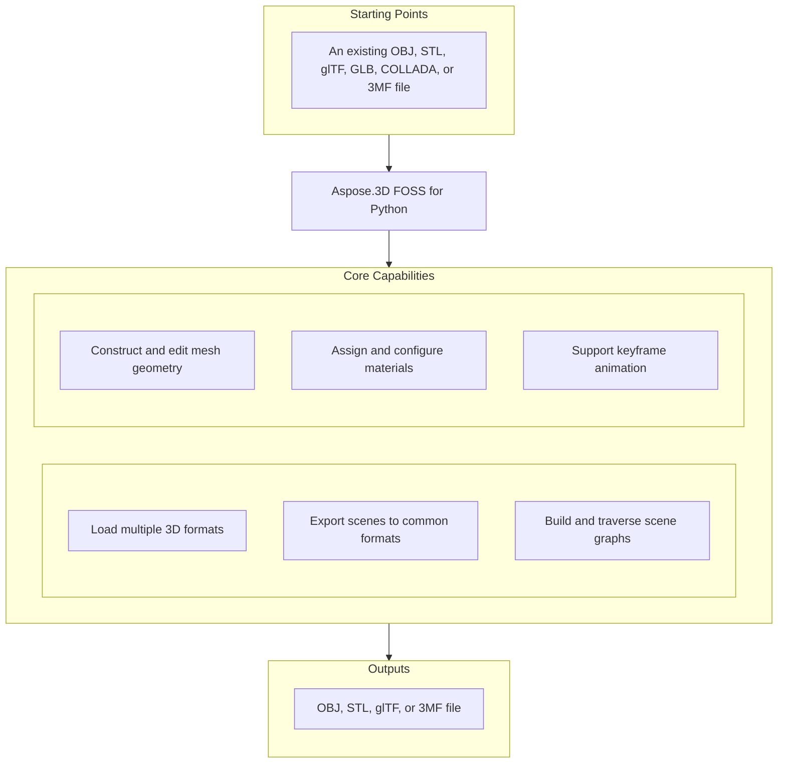

# Aspose.3D FOSS for Python

[](https://pypi.org/project/aspose-3d-foss/)  [](LICENSE) [](https://github.com/aspose-3d-foss/Aspose.3D-FOSS-for-Python/graphs/contributors)

[](https://products.aspose.org/3d/python/)

Aspose.3D FOSS for Python is a pure-Python, MIT-licensed library for loading, constructing, and exporting 3D scenes. It reads and writes OBJ, STL, glTF/GLB, COLLADA, and 3MF files, plus imports FBX, through a `Scene`/`Node`/`Mesh` object graph, with no native runtime or external SDK to install.

## Navigation

- [At a Glance](#at-a-glance)
- [Key Capabilities](#key-capabilities)
- [Installation](#installation)
- [Dependencies](#dependencies)
- [Quick Start](#quick-start)
- [Additional Examples](#additional-examples)
- [API Reference](#api-reference)
- [Documentation & Resources](#documentation--resources)
- [Scope and Limitations](#scope-and-limitations)
- [Development and Testing](#development-and-testing)
- [License](#license)

## At a Glance



## Key Capabilities

- **Load multiple 3D formats.** Read `.3mf`, `.dae`, `.glb`, `.gltf`, `.obj`, and `.stl` files using `aspose.threed.Scene.open`, which auto-detects the format from the file extension or an explicit `aspose.threed.FileFormat`.
- **Export scenes to common formats.** Export scenes to `.3mf`, `.gltf`, `.obj`, and `.stl` using `aspose.threed.Scene.save` with format-specific `SaveOptions` subclasses such as `ObjSaveOptions`, `GltfSaveOptions`, and `StlSaveOptions`, where `aspose.threed.FileFormat` provides format detection, extension lists, and save option factories.
- **Build and traverse scene graphs.** Build and traverse a scene graph using `aspose.threed.Node.create_child_node`, `aspose.threed.Node.add_entity`, and `aspose.threed.Node.child_nodes`, where each node carries an independent `aspose.threed.Transform` with translation, rotation, and scaling properties.
- **Construct and edit mesh geometry.** Create and edit mesh geometry directly through `aspose.threed.Mesh.control_points` and `aspose.threed.Mesh.create_polygon`, or generate meshes from primitives like `Box` using `aspose.threed.Mesh.to_mesh`, with control points represented as `aspose.threed.utilities.Vector4`.
- **Assign and configure materials.** Assign material properties to nodes using `aspose.threed.shading.LambertMaterial` for diffuse lighting or `aspose.threed.shading.PbrMaterial` for physically based rendering with albedo, metallic, and roughness factors.
- **Support keyframe animation.** Construct animation data using `aspose.threed.AnimationClip`, `aspose.threed.AnimationNode`, and `aspose.threed.KeyframeSequence`, and store skeletal bind-pose information with `aspose.threed.Pose`.

## Installation

Install the published package from PyPI (`aspose-3d-foss`, version 26.1.0):

```bash
pip install aspose-3d-foss
```

To work from a source checkout instead, install the clone with pip:

```bash
git clone https://github.com/aspose-3d-foss/Aspose.3D-FOSS-for-Python.git
cd Aspose.3D-FOSS-for-Python
pip install .
```

Verify the install:

```bash
python -c "import aspose.threed"
```

The package supports Python 3.7, 3.8, 3.9, 3.10, 3.11, and 3.12 and declares `python_requires` as `>=3.7`.

## Dependencies

### Required Package Dependencies

No required third-party package dependencies; in `setup.py`, the `install_requires` list is empty.

### Native and System Requirements

- Requires Python 3.7 or later (`python_requires=">=3.7"` in `setup.py`).

### Development Dependencies

- `pytest>=7.0.0` (extra `dev`)

## Quick Start

Open an existing 3D file and inspect its geometry by reading control points and polygons from each entity.

```python
from aspose.threed import Scene
from aspose.threed.entities import Box
from aspose.threed.shading import LambertMaterial
from aspose.threed.utilities import Vector3

scene = Scene()
box = Box(length=2.0, width=1.0, height=1.0)
material = LambertMaterial()
material.diffuse_color = Vector3(0.2, 0.6, 0.9)

scene.root_node.create_child_node("Crate", entity=box.to_mesh(), material=material)
scene.save("crate.gltf")
```

Create a 3D scene from scratch by building a sphere with a PBR material and saving it as an STL file.

```python
from aspose.threed import Scene
from aspose.threed.entities import Sphere
from aspose.threed.shading import PbrMaterial
from aspose.threed.utilities import Vector3

scene = Scene()
sphere = Sphere()
material = PbrMaterial(albedo=Vector3(0.8, 0.1, 0.1))
material.metallic_factor = 0.9
material.roughness_factor = 0.2

scene.root_node.create_child_node("Ball", entity=sphere.to_mesh(), material=material)
scene.save("ball.stl")
```

## Additional Examples

The following examples demonstrate common workflows in Aspose.3D FOSS for Python: creating scenes, assigning materials, and exporting to industry formats.

### Create a mesh, assign a PBR material, and export to glTF

```python
import io
import json
from aspose.threed import Scene, FileFormat
from aspose.threed.entities import Mesh
from aspose.threed.utilities import Vector3, Vector4
from aspose.threed.formats.gltf import GltfSaveOptions
from aspose.threed.shading import PbrMaterial

scene = Scene()
mesh = Mesh("TestMesh")
mesh.control_points.add(Vector4(0.0, 0.0, 0.0, 1.0))
mesh.control_points.add(Vector4(1.0, 0.0, 0.0, 1.0))
mesh.control_points.add(Vector4(0.0, 1.0, 0.0, 1.0))
mesh.create_polygon(0, 1, 2)

albedo = Vector3(0.8, 0.2, 0.3)
material = PbrMaterial("RedMaterial", albedo)
material.metallic_factor = 0.5
material.roughness_factor = 0.7

node = scene.root_node.create_child_node("TestNode")
node.entity = mesh
node.material = material

stream = io.BytesIO()
# Pass the detected FileFormat into the constructor explicitly: unlike
# StlFormat, GltfFormat.create_save_options() does not set file_format on the
# options it returns, and a bare stream (no filename) gives scene.save()
# nothing else to detect the format from.
options = GltfSaveOptions(FileFormat.get_format_by_extension(".gltf"))
options.binary_mode = False
scene.save(stream, options)

stream.seek(0)
gltf_data = json.loads(stream.read().decode("utf-8"))
print(gltf_data["materials"][0]["pbrMetallicRoughness"])
```

<details>
<summary>View Additional Examples</summary>

### Build a triangle mesh and export to ASCII STL

```python
import io
from aspose.threed import Scene, FileFormat
from aspose.threed.entities import Mesh
from aspose.threed.utilities import Vector4

scene = Scene()
mesh = Mesh("triangle")
mesh.control_points.add(Vector4(0.0, 0.0, 0.0, 1.0))
mesh.control_points.add(Vector4(1.0, 0.0, 0.0, 1.0))
mesh.control_points.add(Vector4(1.0, 1.0, 0.0, 1.0))
mesh.create_polygon(0, 1, 2)

node = scene.root_node.create_child_node("triangle_node")
node.entity = mesh

stream = io.StringIO()
# Use FileFormat.get_format_by_extension(...).create_save_options() rather than
# StlSaveOptions() directly: a default-constructed options object has no
# file_format set, and scene.save() cannot infer the format from a bare stream
# (only filename-based saves fall back to extension detection).
options = FileFormat.get_format_by_extension(".stl").create_save_options()
options.binary_mode = False
scene.save(stream, options)
print(stream.getvalue())
```

### Convert a `Box` primitive to a mesh and count control points

```python
from aspose.threed.entities import Box

box = Box(10, 20, 30)
mesh = box.to_mesh()
print(f"Control points: {len(mesh.control_points)}")
```

### Construct a cube mesh and export to uncompressed 3MF

```python
import io
from aspose.threed import Scene
from aspose.threed.entities import Mesh
from aspose.threed.utilities import Vector4
from aspose.threed.formats import ThreeMfSaveOptions

scene = Scene()
mesh = Mesh("cube")
for point in [
    Vector4(0, 0, 0, 1), Vector4(1, 0, 0, 1), Vector4(1, 1, 0, 1), Vector4(0, 1, 0, 1),
    Vector4(0, 0, 1, 1), Vector4(1, 0, 1, 1), Vector4(1, 1, 1, 1), Vector4(0, 1, 1, 1),
]:
    mesh.control_points.add(point)

mesh.create_polygon(0, 1, 2)
mesh.create_polygon(0, 2, 3)
mesh.create_polygon(4, 7, 6)
mesh.create_polygon(4, 6, 5)
mesh.create_polygon(0, 4, 5)
mesh.create_polygon(0, 5, 1)
mesh.create_polygon(2, 6, 7)
mesh.create_polygon(2, 7, 3)
mesh.create_polygon(0, 3, 7)
mesh.create_polygon(0, 7, 4)
mesh.create_polygon(1, 5, 6)
mesh.create_polygon(1, 6, 2)

node = scene.root_node.create_child_node("cube")
node.entity = mesh

stream = io.BytesIO()
options = ThreeMfSaveOptions()
options.enable_compression = False
scene.save(stream, options)
```

</details>

## API Reference

The aspose-3d-foss package exposes `aspose.threed.Scene` as the primary entry point for loading, building, and saving 3D scenes; each `Scene` contains one or more `Node` objects, each of which carries a `Transform` and optional `Mesh`-derived geometry.

The verified public surface has 337 types.

<details>
<summary>View the Complete Public API Surface</summary>

### Core API

| Class | Description |
| --- | --- |
| `A3DObject` | The A3DObject class represents a base object in Aspose.3D FOSS for Python that supports named properties and can be extended by other types. |
| `AnimationChannel` | The AnimationChannel class represents a single animated property channel that holds keyframe data and interpolation settings. |
| `AnimationClip` | The AnimationClip class represents a container for animation data that defines a sequence of keyframes over a time range. |
| `AnimationNode` | The AnimationNode class represents a node in an animation hierarchy that can bind animation channels to properties. |
| `ArrayListAdapter` | Adapter class that wraps List[T] and implements IArrayList[T]. |
| `AssetInfo` | The AssetInfo class holds metadata about a 3D asset such as author, creation time, coordinate system, and unit scale. |
| `Axis` | The coordinate axis. |
| `AxisSystem` | Axis system is an combination of coordinate system, up vector and front vector. |
| `BindPoint` | The BindPoint class represents a binding point that connects animation channels to specific properties on a node. |
| `BonePose` | The BonePose class represents the transformation pose of a bone in a skeleton during animation. |
| `BoundingBox2D` | The axis-aligned bounding box for Vector2 |
| `BoundingBoxExtent` | The extent of the bounding box |
| `Box` | The Box class represents a box primitive with configurable dimensions and segmentation. |
| `Camera` | The Camera class represents a camera entity used for rendering 3D scenes from a specific viewpoint. |
| `Circle` | The Circle class represents a circular primitive defined by radius and segmentation. |
| `ComposeOrder` | The order to compose transform matrix |
| `CoordinateSystem` | The left handed or right handed coordinate system. |
| `Curve` | The Curve class represents a parametric curve entity in a 3D scene. |
| `CustomObject` | The CustomObject class represents a user-defined object that extends the A3DObject base class. |
| `Cylinder` | The Cylinder class represents a cylindrical primitive with configurable height, radius, and segmentation. |
| `Dish` | The Dish class represents a dish-shaped primitive defined by radii and segmentation. |
| `Ellipse` | The Ellipse class represents an elliptical primitive defined by radii and segmentation. |
| `Entity` | The Entity class represents a renderable or manipulable object in a 3D scene such as a mesh or curve. |
| `ExportException` | Exceptions when Aspose.3D failed to export the scene to file. |
| `Extrapolation` | The Extrapolation class defines how animation values are extended beyond the defined keyframe range. |
| `FMatrix4` | Matrix 4x4 with all component in float type |
| `FileContentType` | File content type |
| `FileFormat` | The FileFormat class provides utilities for identifying and working with supported 3D file formats. |
| `FileFormatType` | File format type |
| `Frustum` | The Frustum class represents a truncated pyramid primitive used for viewing volumes. |
| `Geometry` | The Geometry class represents a geometric entity that can be rendered, such as a mesh or primitive. |
| `GlobalTransform` | The GlobalTransform class represents a global transformation matrix applied to a scene object. |
| `Group` | A Group represents the logical relationships of Node. |
| `INamedObject` | The INamedObject class defines an interface for objects that can be assigned a name in Aspose.3D FOSS for Python. |
| `IOExtension` | Utilities to write matrix/vector to binary writer |
| `ImageRenderOptions` | The ImageRenderOptions class holds settings for rendering a 3D scene to an image format. |
| `ImportException` | Exception when Aspose.3D failed to open the specified source. |
| `KeyFrame` | The KeyFrame class represents a single keyframe with a time value and associated data. |
| `KeyframeSequence` | The KeyframeSequence class represents a sequence of keyframes used to animate a property over time. |
| `Light` | The Light class represents a light entity that illuminates objects in a 3D scene. |
| `LinearExtrusion` | The LinearExtrusion class represents a 3D shape created by extruding a 2D profile along a straight path. |
| `MathUtils` | A set of useful mathematical utilities. |
| `Mesh` | The Mesh class represents a polygonal mesh geometry composed of vertices and polygons. |
| `Node` | The Node class represents a transformable node in a scene hierarchy that can hold entities and child nodes. |
| `ParseException` | Exception when Aspose.3D failed to parse the input. |
| `Plane` | The Plane class represents an infinite planar primitive used for geometric construction. |
| `PolygonBuilder` | The PolygonBuilder class provides utilities for constructing polygonal meshes programmatically. |
| `Pose` | The Pose class represents a snapshot of transformations for a set of nodes in a skeleton or hierarchy. |
| `Primitive` | The Primitive class represents a basic geometric shape such as a box, cylinder, or sphere. |
| `Property` | The Property class represents a named value that can be attached to an object for metadata or configuration. |
| `PropertyCollection` | The PropertyCollection class represents a container for managing a collection of properties on an object. |
| `PropertyFlags` | Property's flags |
| `Rect` | A class to represent the rectangle |
| `RelativeRectangle` | Relative rectangle |
| `RotationOrder` | The order controls which rx ry rz are applied in the transformation matrix. |
| `Scene` | The Scene class represents a complete 3D scene containing nodes, entities, animations, and asset metadata. |
| `SceneObject` | The SceneObject class represents an object that belongs to a 3D scene and can be part of the scene hierarchy. |
| `SemanticAttribute` | Allow user to use their own structure for static declaration of VertexDeclaration |
| `Sphere` | The Sphere class represents a sphere primitive in Aspose.3D FOSS for Python, defined by radius and angular segments. |
| `Transform` | The Transform class encapsulates geometric transformations such as translation, rotation, and scaling for 3D objects in Aspose.3D FOSS for Python. |
| `TransformBuilder` | The TransformBuilder is used to build transform matrix by a chain of transformations. |
| `TrialException` | This is raised in Scene.Open/Scene.Save when no licenses are applied. |
| `Vertex` | Vertex reference, used to access the raw vertex in TriMesh. |
| `VertexDeclaration` | The declaration of a custom defined vertex's structure |
| `VertexField` | Vertex's field memory layout description. |
| `VertexFieldDataType` | Vertex field's data type |
| `VertexFieldSemantic` | The semantic of the vertex field |
| `Bone` | The Bone class represents a bone in a skeletal animation system within Aspose.3D FOSS for Python. |
| `BoneLinkMode` | The BoneLinkMode class defines enumeration values that specify how bones link to nodes in Aspose.3D FOSS for Python. |
| `Deformer` | The Deformer class serves as a base class for mesh deformation operations in Aspose.3D FOSS for Python. |
| `MorphTargetChannel` | The MorphTargetChannel class manages a single channel of morph target animation weights in Aspose.3D FOSS for Python. |
| `MorphTargetDeformer` | The MorphTargetDeformer class applies morph target animations to a mesh in Aspose.3D FOSS for Python. |
| `SkinDeformer` | The SkinDeformer class applies skeletal skinning to a mesh in Aspose.3D FOSS for Python. |
| `ApertureMode` | Camera aperture modes. |
| `BooleanOperand` | This class encapsulates the transformed mesh as Boolean operation's operand. |
| `BooleanOperation` | The BooleanOperation class defines enumeration values for boolean operations on 3D entities in Aspose.3D FOSS for Python. |
| `BooleanOperator` | Boolean operator allows you to apply Boolean operation on two IMeshConvertible instances. |
| `CompositeCurve` | A CompositeCurve is consisting of several curve segments. |
| `CurveDimension` | The CurveDimension class specifies the dimensionality of curves in Aspose.3D FOSS for Python. |
| `EndPoint` | The end point to trim the curve, can be a parameter value or a Cartesian point. |
| `HalfSpace` | HalfSpace represents a infinity space which is split by a plane, this can be used with BooleanOperator |
| `IIndexedVertexElement` | The IIndexedVertexElement class represents an indexed vertex element in Aspose.3D FOSS for Python. |
| `IMeshConvertible` | Entities that implemented this interface can be converted to Mesh |
| `IOrientable` | Orientable entities shall implement this interface. |
| `LightType` | Light types. |
| `Line` | A polyline is a path defined by a set of points with control_points, and connected by segments. |
| `MappingMode` | The MappingMode class defines enumeration values that control texture mapping modes in Aspose.3D FOSS for Python. |
| `NurbsCurve` | The NurbsCurve class represents a NURBS curve geometry in Aspose.3D FOSS for Python. |
| `NurbsDirection` | The NurbsDirection class defines properties of a NURBS direction in Aspose.3D FOSS for Python. |
| `NurbsSurface` | The NurbsSurface class represents a NURBS surface geometry in Aspose.3D FOSS for Python. |
| `NurbsType` | The NurbsType class defines enumeration values that specify NURBS curve types in Aspose.3D FOSS for Python. |
| `Patch` | The Patch class represents a patch geometry in Aspose.3D FOSS for Python. |
| `PatchDirection` | The PatchDirection class defines properties of a patch direction in Aspose.3D FOSS for Python. |
| `PatchDirectionType` | The PatchDirectionType class defines enumeration values for patch direction types in Aspose.3D FOSS for Python. |
| `PointCloud` | The PointCloud class represents a collection of points in 3D space in Aspose.3D FOSS for Python. |
| `InvalidOperationException` | The InvalidOperationException class is raised when an invalid operation is performed during polygon building in Aspose.3D FOSS for Python. |
| `PolygonModifier` | The PolygonModifier class provides utilities for modifying polygonal meshes in Aspose.3D FOSS for Python. |
| `ProjectionType` | Camera's projection types. |
| `Pyramid` | Parameterized pyramid. |
| `RectangularTorus` | Parameterized rectangular torus entity. |
| `ReferenceMode` | The ReferenceMode class defines enumeration values that control reference modes in Aspose.3D FOSS for Python. |
| `RevolvedAreaSolid` | RevolvedAreaSolid entity. |
| `RotationMode` | The frustum's rotation mode. |
| `Shape` | Base class for all shape entities. |
| `Skeleton` | The Skeleton is mainly used by CAD software to help designer to manipulate the transformation of skeletal structure, it's usually useless outside the CAD softwares. |
| `SkeletonType` | Skeleton type enum. |
| `SplitMeshPolicy` | Share vertex/control point data between sub-meshes or each sub-mesh has its own compacted data. |
| `SweptAreaSolid` | SweptAreaSolid entity. |
| `TextureMapping` | The TextureMapping class defines enumeration values for texture mapping strategies in Aspose.3D FOSS for Python. |
| `Torus` | Parameterized torus entity. |
| `TransformedCurve` | TransformedCurve entity. |
| `TriMesh` | TriMesh is a triangle mesh that stores triangles. |
| `TrimmedCurve` | TrimmedCurve entity. |
| `VertexElement` | The VertexElement class serves as a base class for vertex element definitions in Aspose.3D FOSS for Python. |
| `VertexElementBinormal` | The VertexElementBinormal class represents binormal data for vertices in Aspose.3D FOSS for Python. |
| `VertexElementDoublesTemplate` | A helper class for defining concrete implementations. |
| `VertexElementEdgeCrease` | Defines the edge crease values for specified components. |
| `VertexElementFVector` | The VertexElementFVector class represents floating-point vector vertex data in Aspose.3D FOSS for Python. |
| `VertexElementHole` | Defines the hole information for specified components. |
| `VertexElementIntsTemplate` | A helper class for defining concrete implementations with int data. |
| `VertexElementMaterial` | Defines the material for specified components. |
| `VertexElementNormal` | The VertexElementNormal class represents normal vector data for vertices in Aspose.3D FOSS for Python. |
| `VertexElementPolygonGroup` | Defines the polygon group for specified components. |
| `VertexElementSmoothingGroup` | The VertexElementSmoothingGroup class represents smoothing group data for vertices in Aspose.3D FOSS for Python. |
| `VertexElementSpecular` | Defines the specular color for specified components. |
| `VertexElementTangent` | The VertexElementTangent class represents tangent vector data for vertices in Aspose.3D FOSS for Python. |
| `VertexElementTemplate` | A helper class for defining concrete implementations of vertex elements with typed data. |
| `VertexElementType` | The VertexElementType class defines enumeration values for vertex element types in Aspose.3D FOSS for Python. |
| `VertexElementUV` | The VertexElementUV class represents UV coordinate data for vertices in Aspose.3D FOSS for Python. |
| `VertexElementUserData` | Defines the user data for specified components. |
| `VertexElementVector4` | Defines the vector4 data for specified components. |
| `VertexElementVertexColor` | The VertexElementVertexColor class represents vertex color data in Aspose.3D FOSS for Python. |
| `VertexElementVertexCrease` | Defines the vertex crease values for specified components. |
| `VertexElementVisibility` | Defines the visibility for specified components. |
| `VertexElementWeight` | Defines the weight for specified components. |
| `A3dwSaveOptions` | Save options for A3DW |
| `AmfSaveOptions` | Save options for AMF |
| `BasicLoadOptions` | Simple LoadOptions subclass for basic loading options. |
| `ColladaLoadOptions` | Load options for Collada |
| `ColladaSaveOptions` | Save options for collada |
| `ColladaTransformStyle` | The node's transformation style of node |
| `Discreet3dsLoadOptions` | Load options for Discreet 3DS |
| `Discreet3dsSaveOptions` | Save options for Discreet 3DS |
| `DracoCompressionLevel` | Compression level for draco file |
| `DracoFormat` | Google Draco format |
| `DracoSaveOptions` | Save options for Draco |
| `Exporter` | The Exporter class provides functionality to export 3D scenes to various file formats in Aspose.3D FOSS for Python. |
| `FbxLoadOptions` | Load options for FBX |
| `FbxSaveOptions` | Save options for FBX |
| `FormatDetector` | The FormatDetector class detects the format of a 3D file in Aspose.3D FOSS for Python. |
| `GltfEmbeddedImageFormat` | Embedded image format for GLTF |
| `formats.GltfLoadOptions` | Load options for glTF |
| `formats.GltfSaveOptions` | Save options for glTF |
| `Html5SaveOptions` | Save options for HTML5 |
| `IOConfig` | The IOConfig class holds input/output configuration options for file operations in Aspose.3D FOSS for Python. |
| `IOService` | The IOService class provides core input/output services for file handling in Aspose.3D FOSS for Python. |
| `Importer` | The Importer class provides functionality to import 3D scenes from various file formats in Aspose.3D FOSS for Python. |
| `JtLoadOptions` | Load options for JT |
| `LoadOptions` | The aspose.threed.formats.LoadOptions class provides configuration options for loading 3D scenes. |
| `Microsoft3MFFormat` | Microsoft 3MF format |
| `Microsoft3MFSaveOptions` | Save options for Microsoft 3MF |
| `formats.ObjLoadOptions` | Load options for OBJ |
| `formats.ObjSaveOptions` | Save options for OBJ |
| `PdfFormat` | Adobe's Portable Document Format |
| `PdfLightingScheme` | Lighting scheme for PDF export |
| `PdfLoadOptions` | Load options for PDF |
| `PdfRenderMode` | Render mode for PDF export |
| `PdfSaveOptions` | Save options for PDF |
| `Plugin` | The aspose.threed.formats.Plugin class serves as an abstract base for format plugins that provide import, export, and format detection capabilities. |
| `PlyFormat` | PLY format |
| `PlyLoadOptions` | Load options for PLY |
| `PlySaveOptions` | Save options for PLY |
| `RvmFormat` | RVM format |
| `RvmLoadOptions` | Load options for RVM |
| `RvmSaveOptions` | Save options for RVM |
| `SaveOptions` | The aspose.threed.formats.SaveOptions class provides configuration options for saving 3D scenes. |
| `formats.StlLoadOptions` | Load options for STL |
| `formats.StlSaveOptions` | Save options for STL |
| `ThreeMfFormat` | The aspose.threed.formats.ThreeMfFormat class represents the 3MF file format and supports importing and exporting 3D models. |
| `ThreeMfLoadOptions` | The aspose.threed.formats.ThreeMfLoadOptions class provides configuration options specific to loading 3MF files. |
| `ThreeMfSaveOptions` | The aspose.threed.formats.ThreeMfSaveOptions class provides configuration options specific to saving 3MF files. |
| `U3dLoadOptions` | Load options for U3D |
| `U3dSaveOptions` | Save options for U3D |
| `UsdSaveOptions` | Save options for USD |
| `XLoadOptions` | Load options for X format |
| `ColladaExporter` | The aspose.threed.formats.collada.ColladaExporter.ColladaExporter class exports 3D scenes to the COLLADA format. |
| `ColladaFormat` | The aspose.threed.formats.collada.ColladaFormat.ColladaFormat class represents the COLLADA file format and supports importing and exporting 3D models. |
| `ColladaFormatDetector` | The aspose.threed.formats.collada.ColladaFormatDetector.ColladaFormatDetector class detects whether a file is in the COLLADA format. |
| `ColladaImporter` | The aspose.threed.formats.collada.ColladaImporter.ColladaImporter class imports 3D scenes from the COLLADA format. |
| `ColladaPlugin` | The aspose.threed.formats.collada.ColladaPlugin.ColladaPlugin class provides COLLADA format support through import, export, and format detection. |
| `FbxExporter` | The aspose.threed.formats.fbx.FbxExporter.FbxExporter class exports 3D scenes to the FBX format. |
| `FbxFormat` | The aspose.threed.formats.fbx.FbxFormat.FbxFormat class represents the FBX file format and supports importing and exporting 3D models. |
| `FbxFormatDetector` | The aspose.threed.formats.fbx.FbxFormatDetector.FbxFormatDetector class detects whether a file is in the FBX format. |
| `FbxImporter` | The aspose.threed.formats.fbx.FbxImporter.FbxImporter class imports 3D scenes from the FBX format. |
| `FbxPlugin` | The aspose.threed.formats.fbx.FbxPlugin.FbxPlugin class provides FBX format support through import, export, and format detection. |
| `BinaryTokenizer` | The aspose.threed.formats.fbx.binary_tokenizer.BinaryTokenizer class tokenizes binary FBX files. |
| `binary_tokenizer.Token` | The aspose.threed.formats.fbx.binary_tokenizer.Token class represents a single token in a binary FBX file. |
| `binary_tokenizer.TokenType` | The aspose.threed.formats.fbx.binary_tokenizer.TokenType class defines the types of tokens used in binary FBX files. |
| `FbxElement` | The aspose.threed.formats.fbx.parser.FbxElement class represents an element in a parsed FBX file. |
| `FbxParser` | The aspose.threed.formats.fbx.parser.FbxParser class parses binary FBX files into structured elements. |
| `FbxScope` | The aspose.threed.formats.fbx.parser.FbxScope class defines the scope of an FBX element during parsing. |
| `FbxTokenizer` | The aspose.threed.formats.fbx.tokenizer.FbxTokenizer class tokenizes text-based FBX files. |
| `tokenizer.Token` | The aspose.threed.formats.fbx.tokenizer.Token class represents a single token in a text-based FBX file. |
| `tokenizer.TokenType` | The aspose.threed.formats.fbx.tokenizer.TokenType class defines the types of tokens used in text-based FBX files. |
| `GltfExporter` | The aspose.threed.formats.gltf.GltfExporter class exports 3D scenes to the glTF format. |
| `GltfFormat` | The aspose.threed.formats.gltf.GltfFormat class represents the glTF file format and supports importing and exporting 3D models. |
| `GltfFormatDetector` | The aspose.threed.formats.gltf.GltfFormatDetector class detects whether a file is in the glTF format. |
| `GltfImporter` | The aspose.threed.formats.gltf.GltfImporter class imports 3D scenes from the glTF format. |
| `gltf.GltfLoadOptions` | The aspose.threed.formats.gltf.GltfLoadOptions class provides configuration options specific to loading glTF files. |
| `GltfPlugin` | The aspose.threed.formats.gltf.GltfPlugin class provides glTF format support through import, export, and format detection. |
| `gltf.GltfSaveOptions` | The aspose.threed.formats.gltf.GltfSaveOptions class provides configuration options specific to saving glTF files. |
| `ObjExporter` | The aspose.threed.formats.obj.ObjExporter class exports 3D scenes to the OBJ format. |
| `ObjFormat` | The aspose.threed.formats.obj.ObjFormat class represents the OBJ file format and supports importing and exporting 3D models. |
| `ObjFormatDetector` | The aspose.threed.formats.obj.ObjFormatDetector class detects whether a file is in the OBJ format. |
| `ObjImporter` | The aspose.threed.formats.obj.ObjImporter class imports 3D scenes from the OBJ format. |
| `obj.ObjLoadOptions` | The aspose.threed.formats.obj.ObjLoadOptions class provides configuration options specific to loading OBJ files. |
| `ObjPlugin` | The aspose.threed.formats.obj.ObjPlugin.ObjPlugin class provides OBJ format support through import, export, and format detection. |
| `obj.ObjSaveOptions` | The aspose.threed.formats.obj.ObjSaveOptions class provides configuration options specific to saving OBJ files. |
| `StlExporter` | The aspose.threed.formats.stl.StlExporter class exports 3D scenes to the STL format. |
| `StlFormat` | The StlFormat class represents the STL file format and provides methods to detect, import, and export STL files, including support for binary and ASCII modes through its associated options. |
| `StlFormatDetector` | The StlFormatDetector class identifies whether a given file stream or buffer contains data in the STL format by inspecting its content. |
| `StlImporter` | The StlImporter class imports geometry and scene data from STL files into an Aspose.3D Scene object. |
| `stl.StlLoadOptions` | The StlLoadOptions class allows configuration of how STL files are loaded, including options to flip the coordinate system and apply a uniform scale factor. |
| `StlPlugin` | The StlPlugin class acts as a plugin for the STL format, providing access to importers, exporters, format detectors, and load/save options for STL files. |
| `stl.StlSaveOptions` | The StlSaveOptions class controls how scenes are exported to STL files, supporting binary mode, coordinate system flipping, and scaling adjustments. |
| `ThreeMfExporter` | The ThreeMfExporter class exports scenes to the 3MF file format, preserving geometry, materials, and scene hierarchy. |
| `ThreeMfFormatDetector` | The ThreeMfFormatDetector class determines whether a file stream or buffer contains data in the 3MF format by analyzing its content. |
| `ThreeMfImporter` | The ThreeMfImporter class imports scenes and geometry from 3MF files into an Aspose.3D Scene object. |
| `ThreeMfPlugin` | The ThreeMfPlugin class serves as the plugin for the 3MF format, offering access to importers, exporters, format detectors, and load/save options. |
| `ArbitraryProfile` | This class allows you to construct a 2D profile directly from arbitrary curve. |
| `CShape` | IFC compatible C-shape profile that defined by parameters. |
| `CenterLineProfile` | IFC compatible center line profile. |
| `CircleShape` | IFC compatible circle profile. |
| `EllipseShape` | IFC compatible ellipse profile. |
| `FontFile` | Font file contains definitions for glyphs, this is used to create text profile. |
| `HShape` | IFC compatible H-shape profile. |
| `HollowCircleShape` | IFC compatible hollow circle profile. |
| `HollowRectangleShape` | IFC compatible hollow rectangular shape with both inner/outer rounding corners. |
| `LShape` | IFC compatible L-shape profile that defined by parameters. |
| `MirroredProfile` | IFC compatible mirror profile. |
| `ParameterizedProfile` | The base class of all parameterized profiles. |
| `Profile` | 2D Profile in xy plane. |
| `RectangleShape` | IFC compatible rectangle profile. |
| `TShape` | IFC compatible T-shape defined by parameters. |
| `Text` | Text profile, this profile describes contours using font and text. |
| `TrapeziumShape` | IFC compatible Trapezium shape defined by parameters. |
| `UShape` | IFC compatible U-shape defined by parameters. |
| `ZShape` | IFC compatible Z-shape profile that defined by parameters. |
| `BlendFactor` | Blend factor specify pixel arithmetic. |
| `CompareFunction` | Compare function for depth/stencil testing. |
| `CubeFace` | Cube face enumeration. |
| `CullFaceMode` | Cull face mode for face culling. |
| `DescriptorSetUpdater` | Descriptor set updater for shader resources. |
| `DrawOperation` | Draw operation type. |
| `DriverException` | Exception thrown when rendering driver fails. |
| `EntityRenderer` | Base class for rendering entities. |
| `EntityRendererFeatures` | Features supported by an entity renderer. |
| `EntityRendererKey` | The key of registered entity renderer. |
| `FrontFace` | Front face winding order. |
| `GLSLSource` | GLSL shader source. |
| `IBuffer` | Interface for vertex/index buffer. |
| `ICommandList` | Interface for command list. |
| `IDescriptorSet` | Interface for descriptor set. |
| `IIndexBuffer` | Interface for index buffer. |
| `IPipeline` | Interface for graphics pipeline. |
| `IRenderQueue` | Interface for render queue. |
| `IRenderTarget` | Interface for render target. |
| `IRenderTexture` | Interface for render texture. |
| `IRenderWindow` | Interface for render window. |
| `ITexture1D` | Interface for 1D texture. |
| `ITexture2D` | Interface for 2D texture. |
| `ITextureCodec` | Interface for texture codec. |
| `ITextureCubemap` | Interface for cubemap texture. |
| `ITextureDecoder` | Interface for texture decoder. |
| `ITextureEncoder` | Interface for texture encoder. |
| `ITextureUnit` | Interface for texture unit. |
| `IVertexBuffer` | Interface for vertex buffer. |
| `IndexDataType` | Data type for indices. |
| `InitializationException` | Exception thrown when rendering initialization fails. |
| `PixelFormat` | Pixel format for render targets. |
| `PixelMapMode` | Pixel mapping mode. |
| `PixelMapping` | Pixel mapping configuration. |
| `PolygonMode` | Polygon rendering mode. |
| `PostProcessing` | Post-processing effect. |
| `PresetShaders` | Predefined shaders. |
| `PushConstant` | Push constant for shaders. |
| `RenderFactory` | RenderFactory creates all resources that represented in rendering pipeline. |
| `RenderParameters` | Parameters for rendering. |
| `RenderQueueGroupId` | Render queue group ID. |
| `RenderResource` | Base class for render resources. |
| `RenderStage` | Render stage in the pipeline. |
| `RenderState` | Render state configuration. |
| `Renderer` | The context about renderer. |
| `RendererVariableManager` | Manages renderer variables. |
| `SPIRVSource` | SPIRV shader source. |
| `ShaderException` | Exception thrown when shader compilation/linking fails. |
| `ShaderProgram` | Shader program. |
| `ShaderSet` | Set of shaders for rendering. |
| `ShaderSource` | Shader source code. |
| `ShaderStage` | Shader stage. |
| `ShaderVariable` | Shader variable. |
| `StencilAction` | Stencil action. |
| `StencilState` | Stencil state configuration. |
| `TextureCodec` | Texture codec. |
| `TextureData` | Texture data. |
| `TextureType` | Texture type. |
| `Viewport` | Viewport for rendering. |
| `WindowHandle` | Window handle for render window. |
| `AlphaSource` | Source of alpha channel for textures. |
| `LambertMaterial` | The LambertMaterial class defines a simple shading material with ambient, diffuse, emissive, and transparency properties for 3D rendering. |
| `Material` | The Material class is the base class for all shading materials in Aspose.3D, supporting texture assignment and common material properties. |
| `PbrMaterial` | The PbrMaterial class implements physically based rendering with albedo, metallic, roughness, emissive, and occlusion properties for realistic shading. |
| `PbrSpecularMaterial` | Material for physically based rendering based on diffuse color/specular/glossiness. |
| `PhongMaterial` | The PhongMaterial class extends LambertMaterial to add specular highlights and reflection properties for Phong shading. |
| `ShaderMaterial` | A shader material allows to describe the material by external rendering engine or shader language. |
| `ShaderTechnique` | A technique in shader material describes the concrete rendering details. |
| `Texture` | This class defines the texture from an external file. |
| `TextureBase` | Base class for all texture types. |
| `TextureFilter` | Texture filter type. |
| `TextureSlot` | Texture slot name. |
| `WrapMode` | Wrap mode for texture coordinates. |
| `BoundingBox` | The BoundingBox class represents an axis-aligned bounding box in 3D space, providing access to its center and extent. |
| `FVector2` | The FVector2 class represents a two-dimensional vector with single-precision floating-point components. |
| `FVector3` | The FVector3 class represents a three-dimensional vector with single-precision floating-point components. |
| `FVector4` | The FVector4 class represents a four-dimensional vector with single-precision floating-point components. |
| `FileSystem` | File system encapsulation. |
| `Matrix4` | The Matrix4 class represents a 4x4 transformation matrix used for 3D geometry operations such as translation, rotation, and scaling. |
| `Quaternion` | The Quaternion class represents a quaternion used for smooth 3D rotations and orientation interpolation. |
| `Vector2` | The Vector2 class represents a two-dimensional vector with double-precision floating-point components. |
| `Vector3` | The Vector3 class represents a three-dimensional vector with double-precision floating-point components. |
| `Vector4` | The Vector4 class represents a four-dimensional vector with double-precision floating-point components. |
| `Watermark` | Utility to encode/decode blind watermark to/from a mesh. |

#### Enumerations

| Enumeration | Description |
| --- | --- |
| `ExtrapolationType` | The ExtrapolationType class defines the enumeration of supported extrapolation modes for animation. |
| `Interpolation` | The Interpolation class defines the enumeration of supported interpolation methods for animation keyframes. |
| `PoseType` | The PoseType class defines the enumeration of supported pose types in animation systems. |
| `StepMode` | The StepMode class defines enumeration values that control the step mode behavior in Aspose.3D FOSS for Python. |
| `WeightedMode` | The WeightedMode class defines enumeration values that specify how weights are applied in Aspose.3D FOSS for Python. |

#### Detailed Member Reference

### Scene

The `Scene` class provides `Scene.open`() and `Scene.save`() to load and write 3D scenes, exposes `Scene.root_node` as the top-level container, and maintains `Scene.library`, `Scene.sub_scenes`, `Scene.animation_clips`, `Scene.current_animation_clip`, `Scene.poses`, `Scene.asset_info`, and `Scene.render` for scene management and rendering.

- `animation_clips`: Defined as `def animation_clips(self) -> List['AnimationClip']`.
- `asset_info`: Defined as `def asset_info(self) -> AssetInfo`.
- `clear`: Defined as `def clear(self)`.
- `create_animation_clip`: Defined as `def create_animation_clip(self, name: str) -> 'AnimationClip'`.
- `current_animation_clip`: Defined as `def current_animation_clip(self) -> Optional['AnimationClip']`.
- `from_file`: Defined as `def from_file(file_name: str)`.
- `get_animation_clip`: Defined as `def get_animation_clip(self, name: str) -> Optional['AnimationClip']`.
- `library`: Defined as `def library(self) -> List[CustomObject]`.
- `open`: Defined as `def open(self, file_or_stream, options=None)`.
- `poses`: Defined as `def poses(self) -> List`.
- `render`: Defined as `def render(self, camera, file_name_or_bitmap, size=None, format=None, options=None)`.
- `root_node`: Defined as `def root_node(self)`.
- `save`: Defined as `def save(self, file_or_stream, format_or_options=None)`.
- `sub_scenes`: Defined as `def sub_scenes(self) -> List['Scene']`.

### Mesh

The `Mesh` class holds `Mesh.control_points` and supports `Mesh.to_mesh`() for geometry conversion, while `PolygonBuilder` enables `Mesh.create_polygon`() and `Mesh.create_child_node`() to construct polygonal geometry programmatically using `Vector4` coordinates.

- `control_points`: Defined as `def control_points(self) -> ArrayListAdapter[Vector4]`.
- `create_polygon`: Defined as `def create_polygon(self, *args)`.
- `difference`: Defined as `def difference(a: 'Mesh', b: 'Mesh') -> 'Mesh'`.
- `do_boolean`: Defined as `def do_boolean(op: BooleanOperation, a: 'Mesh', transform_a: Optional[Matrix4], b: 'Mesh', transform_b: Optional[Matrix4]) -> 'Mesh'`.
- `edges`: Defined as `def edges(self) -> ArrayListAdapter[int]`.
- `get_bounding_box`: Defined as `def get_bounding_box(self)`.
- `get_entity_renderer_key`: Defined as `def get_entity_renderer_key(self)`.
- `get_polygon_size`: Defined as `def get_polygon_size(self, index: int) -> int`.
- `intersect`: Defined as `def intersect(a: 'Mesh', b: 'Mesh') -> 'Mesh'`.
- `is_manifold`: Defined as `def is_manifold(self) -> bool`.
- `optimize`: Defined as `def optimize(self, vertex_elements: bool=False, tolerance_control_point: float=1e-09, tolerance_normal: float=1e-09, tolerance_uv: float=1e-09) -> 'Mesh'`.
- `polygon_count`: Defined as `def polygon_count(self) -> int`.
- `polygons`: Defined as `def polygons(self) -> List[List[int]]`.
- `to_mesh`: Defined as `def to_mesh(self) -> 'Mesh'`.
- `triangulate`: Defined as `def triangulate(self) -> 'Mesh'`.
- `union`: Defined as `def union(a: 'Mesh', b: 'Mesh') -> 'Mesh'`.

### PbrMaterial

`PbrMaterial` provides `metallic_factor` and `roughness_factor` properties for physically based rendering, and can be assigned to `Node.material` or `Node.materials`; it inherits from `LambertMaterial` and supports `diffuse_color` for base appearance.

- `albedo`: Defined as `def albedo(self) -> 'Vector3'`.
- `albedo_texture`: Defined as `def albedo_texture(self)`.
- `emissive_color`: Defined as `def emissive_color(self) -> 'Vector3'`.
- `emissive_texture`: Defined as `def emissive_texture(self)`.
- `from_material`: Defined as `def from_material(material: 'Material') -> 'PbrMaterial'`.
- `metallic_factor`: Defined as `def metallic_factor(self) -> float`.
- `metallic_roughness`: Defined as `def metallic_roughness(self)`.
- `normal_texture`: Defined as `def normal_texture(self)`.
- `occlusion_factor`: Defined as `def occlusion_factor(self) -> float`.
- `occlusion_texture`: Defined as `def occlusion_texture(self)`.
- `roughness_factor`: Defined as `def roughness_factor(self) -> float`.
- `transparency`: Defined as `def transparency(self) -> float`.

</details>

## Documentation & Resources

- **[Getting started guide](https://docs.aspose.org/3d/python/)** — The getting started guide covers installation, walkthroughs, and feature guides for this library.
- **[How-to guides & FAQ](https://kb.aspose.org/3d/python/)** — The how-to guides and FAQ provide task-focused answers for common 3D-processing questions.
- **[Full API reference](https://reference.aspose.org/3d/python/)** — The full API reference offers the complete, browsable reference for all 305 public types. It covers all 337 verified public types; the [API Reference](#api-reference) section above covers the essentials.
- Found a bug or have a feature request? [Open an issue](https://github.com/aspose-3d-foss/Aspose.3D-FOSS-for-Python/issues).

## Scope and Limitations

Aspose.3D FOSS for Python version 26.1.0 supports reading and writing OBJ, STL, glTF, and COLLADA 3D formats, and provides core scene graph and mesh manipulation capabilities for Python applications targeting versions 3.7 through 3.12.

- No file format registers an importer or exporter for PDF, PLY, RVM, U3D, JT, AMF, HTML5, A3DW, USD, or Draco in this build — `PdfSaveOptions`, `PlyLoadOptions`, `DracoSaveOptions`, and similar option classes exist as public types, but `Scene.open`() and `Scene.save`() cannot detect or dispatch any of these extensions, and raise a RuntimeError if you try.
- FBX support is experimental: `FbxImporter` has a real, working ASCII/binary tokenizer and parser, but no bundled test opens a real `.fbx` fixture through it, and `FbxExporter.save`() and `save_to_stream()` both raise NotImplementedError outright, so FBX is import-only at best.
- COLLADA import works, but COLLADA export is not reachable through `Scene.save`() because `IOService`'s exporter lookup walks its registered exporters in order and reaches `FbxExporter` before it ever reaches `ColladaExporter`, so the lookup itself fails before a real, working `ColladaExporter` is ever consulted.
- Always import a format's load/save options class from its own format submodule, never from the shared top-level `aspose.threed.formats` package — for OBJ, STL, glTF, and COLLADA specifically, the top-level package name resolves to a broken duplicate with no working base class, which format detection silently rejects.
- `Scene.render`() and the entire `aspose.threed.render` module (`Renderer`, `RenderFactory`, `Viewport`, and related classes) raise NotImplementedError, and `Texture` and `TextureBase` raise NotImplementedError on construction, so an image-backed texture cannot be created.
- `Watermark.encode_watermark`() and `decode_watermark()` and every `TransformBuilder` method raise NotImplementedError, `Mesh.do_boolean`(), `union()`, `difference()`, and `intersect()` raise NotImplementedError, `NurbsCurve.evaluate`() and `evaluate_at()` and `NurbsSurface.to_mesh`() raise NotImplementedError, `PointCloud.from_geometry`() and `from_geometry_with_density()` raise NotImplementedError, and `AxisSystem` raises NotImplementedError on every method, including construction.

These limitations don't apply to [Aspose.3D for Python — Enterprise Edition](https://products.aspose.com/3d/python-net/). Aspose.3D FOSS for Python provides open-source access to core 3D file format capabilities, while the commercial edition extends this with additional formats, advanced rendering features, and commercial support.

## Development and Testing

Install the package in editable mode and run the test suite with the built-in unittest module, or execute a single test file directly.

The suite covers 34 test files under `tests/`. Releases run through the [publish workflow](.github/workflows/publish.yml).

```bash
python3 -m pip install -e .
python3 -m unittest discover tests/
```

```bash
python -m unittest tests.test_obj_importer
```

## License

This project is licensed under the [MIT License](LICENSE). The MIT License permits use, copying, modification, distribution, sublicensing, and commercial use, provided its copyright and permission notice are retained. The software is provided without warranty.
