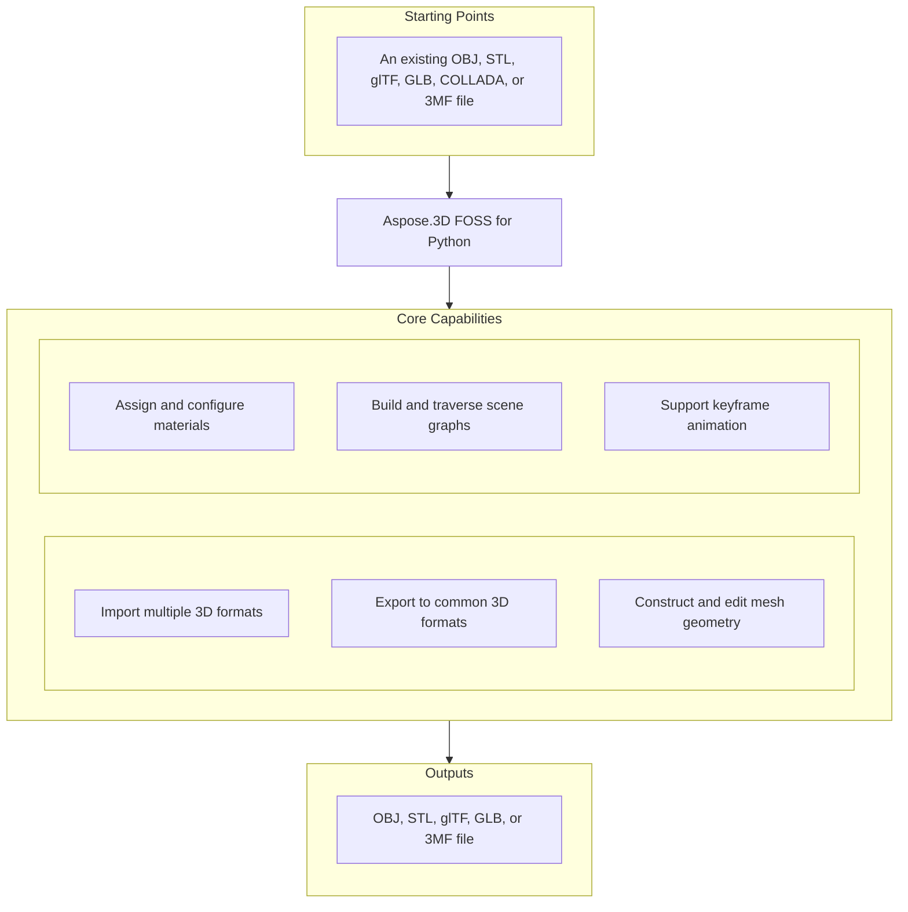

# Aspose.3D FOSS for Python

[](https://pypi.org/project/aspose-3d-foss/)  [](LICENSE) [](https://github.com/aspose-3d-foss/Aspose.3D-FOSS-for-Python/graphs/contributors)

[](https://products.aspose.org/3d/python/)

Aspose.3D FOSS for Python is a Python library for creating, reading, converting, and saving 3D scenes in formats such as `.obj`, `.stl`, `.gltf`, `.glb`, `.dae`, `.3mf`, and `.fbx`. It solves the problem of programmatically building and manipulating 3D geometry and materials without requiring a native 3D application, supporting primitives like `Box` and `Sphere` as well as custom `Mesh` entities. Developers use it to generate assets for visualization, simulation, and 3D printing workflows by composing nodes, applying materials like `LambertMaterial` and `PbrMaterial`, and saving scenes to disk or streams. The package requires Python 3.7 or higher and is compatible with versions 3.7 through 3.12.

## Navigation

- [At a Glance](#at-a-glance)
- [Key Capabilities](#key-capabilities)
- [Installation](#installation)
- [Dependencies](#dependencies)
- [Quick Start](#quick-start)
- [Additional Examples](#additional-examples)
- [API Reference](#api-reference)
- [Documentation & Resources](#documentation--resources)
- [Scope and Limitations](#scope-and-limitations)
- [Development and Testing](#development-and-testing)
- [License](#license)

## At a Glance



## Key Capabilities

- **Import multiple 3D formats.** Read `.obj`, `.stl`, `.gltf`, `.glb`, `.dae`, and `.3mf` files using `aspose.threed.Scene.open`, which auto-detects the format from the file extension or an explicit `FileFormat`.
- **Export to common 3D formats.** Write scenes to `.obj`, `.stl`, `.gltf`, `.glb`, and `.3mf` using `aspose.threed.Scene.save`, with format-specific `SaveOptions` for coordinate flipping, unit scaling, and compression settings.
- **Construct and edit mesh geometry.** Build and edit mesh geometry directly via `aspose.threed.Mesh.control_points` and `aspose.threed.Mesh.create_polygon`, or generate editable meshes from parameterized primitives like `Box` and `Sphere` using their `to_mesh` methods.
- **Assign and configure materials.** Assign material properties to scene entities using `LambertMaterial` and `PbrMaterial`, setting diffuse, emissive, albedo, metallic, and roughness factors directly.
- **Build and traverse scene graphs.** Construct and traverse a scene graph using `aspose.threed.Node.create_child_node` and `aspose.threed.Node.entity`, where each node carries an independent `Transform` for translation, rotation, and scaling.
- **Support keyframe animation.** Create and manage keyframe animations using `AnimationClip`, `AnimationNode`, and `KeyframeSequence`, and store skeletal bind-pose data with `Pose`.

## Installation

Install the published package from PyPI (`aspose-3d-foss`, version 26.1.0):

```bash
pip install aspose-3d-foss
```

To work from a source checkout instead, install the clone with pip:

```bash
git clone https://github.com/aspose-3d-foss/Aspose.3D-FOSS-for-Python.git
cd Aspose.3D-FOSS-for-Python
pip install .
```

Verify the install:

```bash
python -c "import aspose.threed"
```

The package supports Python 3.7, 3.8, 3.9, 3.10, 3.11, and 3.12 and declares `python_requires` as `>=3.7`.

## Dependencies

### Required Package Dependencies

No required third-party package dependencies; in `setup.py`, the `install_requires` list is empty.

### Native and System Requirements

- Requires Python 3.7 or later (`python_requires=">=3.7"` in `setup.py`).

### Development Dependencies

- `pytest>=7.0.0` (extra `dev`)

## Quick Start

Import an OBJ file and inspect its geometry by reading the vertex and polygon counts for each entity.

```python
from aspose.threed import Scene
from aspose.threed.entities import Box
from aspose.threed.shading import LambertMaterial
from aspose.threed.utilities import Vector3

scene = Scene()
box = Box(length=2.0, width=1.0, height=1.0)
material = LambertMaterial()
material.diffuse_color = Vector3(0.2, 0.6, 0.9)

scene.root_node.create_child_node("Crate", entity=box.to_mesh(), material=material)
scene.save("crate.gltf")
```

Build a 3D scene from scratch by creating a sphere with a PBR material and saving it as an STL file.

```python
from aspose.threed import Scene
from aspose.threed.entities import Sphere
from aspose.threed.shading import PbrMaterial
from aspose.threed.utilities import Vector3

scene = Scene()
sphere = Sphere()
material = PbrMaterial(albedo=Vector3(0.8, 0.1, 0.1))
material.metallic_factor = 0.9
material.roughness_factor = 0.2

scene.root_node.create_child_node("Ball", entity=sphere.to_mesh(), material=material)
scene.save("ball.stl")
```

## Additional Examples

The following examples demonstrate common workflows in Aspose.3D FOSS for Python, including exporting to glTF, STL, and 3MF formats, converting primitives to meshes, and inspecting exported content.

### Export a scene with a PBR material to text-based glTF and inspect the material JSON

```python
import io
import json
from aspose.threed import Scene, FileFormat
from aspose.threed.entities import Mesh
from aspose.threed.utilities import Vector3, Vector4
from aspose.threed.formats.gltf import GltfSaveOptions
from aspose.threed.shading import PbrMaterial

scene = Scene()
mesh = Mesh("TestMesh")
mesh.control_points.add(Vector4(0.0, 0.0, 0.0, 1.0))
mesh.control_points.add(Vector4(1.0, 0.0, 0.0, 1.0))
mesh.control_points.add(Vector4(0.0, 1.0, 0.0, 1.0))
mesh.create_polygon(0, 1, 2)

albedo = Vector3(0.8, 0.2, 0.3)
material = PbrMaterial("RedMaterial", albedo)
material.metallic_factor = 0.5
material.roughness_factor = 0.7

node = scene.root_node.create_child_node("TestNode")
node.entity = mesh
node.material = material

stream = io.BytesIO()
# Pass the detected FileFormat into the constructor explicitly: unlike
# StlFormat, GltfFormat.create_save_options() does not set file_format on the
# options it returns, and a bare stream (no filename) gives scene.save()
# nothing else to detect the format from.
options = GltfSaveOptions(FileFormat.get_format_by_extension(".gltf"))
options.binary_mode = False
scene.save(stream, options)

stream.seek(0)
gltf_data = json.loads(stream.read().decode("utf-8"))
print(gltf_data["materials"][0]["pbrMetallicRoughness"])
```

<details>
<summary>View Additional Examples</summary>

### Export a triangle mesh to text-based STL using an in-memory stream

```python
import io
from aspose.threed import Scene, FileFormat
from aspose.threed.entities import Mesh
from aspose.threed.utilities import Vector4

scene = Scene()
mesh = Mesh("triangle")
mesh.control_points.add(Vector4(0.0, 0.0, 0.0, 1.0))
mesh.control_points.add(Vector4(1.0, 0.0, 0.0, 1.0))
mesh.control_points.add(Vector4(1.0, 1.0, 0.0, 1.0))
mesh.create_polygon(0, 1, 2)

node = scene.root_node.create_child_node("triangle_node")
node.entity = mesh

stream = io.StringIO()
# Use FileFormat.get_format_by_extension(...).create_save_options() rather than
# StlSaveOptions() directly: a default-constructed options object has no
# file_format set, and scene.save() cannot infer the format from a bare stream
# (only filename-based saves fall back to extension detection).
options = FileFormat.get_format_by_extension(".stl").create_save_options()
options.binary_mode = False
scene.save(stream, options)
print(stream.getvalue())
```

### Convert a `Box` primitive to a mesh and count its control points

```python
from aspose.threed.entities import Box

box = Box(10, 20, 30)
mesh = box.to_mesh()
print(f"Control points: {len(mesh.control_points)}")
```

### Build a cube mesh and export it to 3MF without compression

```python
import io
from aspose.threed import Scene
from aspose.threed.entities import Mesh
from aspose.threed.utilities import Vector4
from aspose.threed.formats import ThreeMfSaveOptions

scene = Scene()
mesh = Mesh("cube")
for point in [
    Vector4(0, 0, 0, 1), Vector4(1, 0, 0, 1), Vector4(1, 1, 0, 1), Vector4(0, 1, 0, 1),
    Vector4(0, 0, 1, 1), Vector4(1, 0, 1, 1), Vector4(1, 1, 1, 1), Vector4(0, 1, 1, 1),
]:
    mesh.control_points.add(point)

mesh.create_polygon(0, 1, 2)
mesh.create_polygon(0, 2, 3)
mesh.create_polygon(4, 7, 6)
mesh.create_polygon(4, 6, 5)
mesh.create_polygon(0, 4, 5)
mesh.create_polygon(0, 5, 1)
mesh.create_polygon(2, 6, 7)
mesh.create_polygon(2, 7, 3)
mesh.create_polygon(0, 3, 7)
mesh.create_polygon(0, 7, 4)
mesh.create_polygon(1, 5, 6)
mesh.create_polygon(1, 6, 2)

node = scene.root_node.create_child_node("cube")
node.entity = mesh

stream = io.BytesIO()
options = ThreeMfSaveOptions()
options.enable_compression = False
scene.save(stream, options)
```

</details>

## API Reference

The aspose-3d-foss package exposes `Scene` as the primary entry point for loading, saving, and manipulating 3D scenes, with `Node` and `Mesh` forming the core graph and geometry types.

The verified public surface has 337 types.

<details>
<summary>View the Complete Public API Surface</summary>

### Core API

| Class | Description |
| --- | --- |
| `A3DObject` | The A3DObject class serves as the base for objects that can hold named properties and support property lookup, modification, and removal operations. |
| `AnimationChannel` | The AnimationChannel class represents a single animated property channel with a keyframe sequence, default value, and component type. |
| `AnimationClip` | The AnimationClip class defines a named animation segment with a start and stop time, optional description, and a collection of animation nodes. |
| `AnimationNode` | The AnimationNode class represents a node in an animation hierarchy that can hold bind points and sub-animations. |
| `ArrayListAdapter` | Adapter class that wraps List[T] and implements IArrayList[T]. |
| `AssetInfo` | The AssetInfo class stores metadata about a 3D asset such as author, creation time, coordinate system, and unit scale factor. |
| `Axis` | The coordinate axis. |
| `AxisSystem` | Axis system is an combination of coordinate system, up vector and front vector. |
| `BindPoint` | The BindPoint class binds an animation channel to a property and manages associated keyframe sequences and channels. |
| `BonePose` | The BonePose class represents the transformation of a bone node in either local or world space. |
| `BoundingBox2D` | The axis-aligned bounding box for Vector2 |
| `BoundingBoxExtent` | The extent of the bounding box |
| `Box` | The Box class defines a box primitive with length, height, and segment counts for mesh generation. |
| `Camera` | The Camera class represents a camera entity capable of rendering a 3D scene from a specific viewpoint. |
| `Circle` | The Circle class defines a circular primitive for use in 3D geometry. |
| `ComposeOrder` | The order to compose transform matrix |
| `CoordinateSystem` | The left handed or right handed coordinate system. |
| `Curve` | The Curve class represents a parametric curve entity in three-dimensional space. |
| `CustomObject` | The CustomObject class serves as a generic container for user-defined 3D objects. |
| `Cylinder` | The Cylinder class defines a cylindrical primitive with radius, height, and segment counts. |
| `Dish` | The Dish class defines a dish-shaped primitive for 3D modeling. |
| `Ellipse` | The Ellipse class defines an elliptical primitive for use in 3D geometry. |
| `Entity` | The Entity class represents a renderable or manipulable object in a 3D scene such as a mesh or curve. |
| `ExportException` | Exceptions when Aspose.3D failed to export the scene to file. |
| `Extrapolation` | The Extrapolation class provides settings for how animation values are extended beyond their defined keyframe range. |
| `FMatrix4` | Matrix 4x4 with all component in float type |
| `FileContentType` | File content type |
| `FileFormat` | The FileFormat class provides methods to identify and work with supported 3D file formats by extension. |
| `FileFormatType` | File format type |
| `Frustum` | The Frustum class defines a truncated pyramid primitive used for view frustum geometry. |
| `Geometry` | The Geometry class represents a geometric entity that can be rendered and manipulated in a 3D scene. |
| `GlobalTransform` | The GlobalTransform class encapsulates the global transformation matrix of an object in a 3D scene. |
| `Group` | A Group represents the logical relationships of Node. |
| `INamedObject` | The INamedObject interface defines an object that can be identified by a name. |
| `IOExtension` | Utilities to write matrix/vector to binary writer |
| `ImageRenderOptions` | The ImageRenderOptions class holds settings for rendering a 3D scene to an image format. |
| `ImportException` | Exception when Aspose.3D failed to open the specified source. |
| `KeyFrame` | The KeyFrame class represents a single keyframe with a time and value for animation interpolation. |
| `KeyframeSequence` | The KeyframeSequence class manages a sequence of keyframes used for animation interpolation. |
| `Light` | The Light class represents a light source entity that illuminates objects in a 3D scene. |
| `LinearExtrusion` | The LinearExtrusion class defines a 3D entity created by extruding a 2D profile along a straight path. |
| `MathUtils` | A set of useful mathematical utilities. |
| `Mesh` | The Mesh class represents a polygonal mesh geometry composed of vertices and polygons. |
| `Node` | The Node class represents a transformable node in a scene hierarchy that can contain child nodes and an entity. |
| `ParseException` | Exception when Aspose.3D failed to parse the input. |
| `Plane` | The Plane class defines a planar primitive for 3D modeling. |
| `PolygonBuilder` | The PolygonBuilder class provides utilities for constructing polygonal meshes from geometric primitives. |
| `Pose` | The Pose class represents a snapshot of node transformations at a specific time in an animation. |
| `Primitive` | The Primitive class represents a basic geometric shape such as a box, cylinder, or sphere. |
| `Property` | The Property class represents a single named property with a value and type. |
| `PropertyCollection` | The PropertyCollection class manages a collection of properties associated with an object. |
| `PropertyFlags` | Property's flags |
| `Rect` | A class to represent the rectangle |
| `RelativeRectangle` | Relative rectangle |
| `RotationOrder` | The order controls which rx ry rz are applied in the transformation matrix. |
| `Scene` | The Scene class represents a complete 3D scene containing nodes, entities, animations, and asset metadata. |
| `SceneObject` | The SceneObject class serves as the base for objects that belong to a 3D scene and can be part of the scene hierarchy. |
| `SemanticAttribute` | Allow user to use their own structure for static declaration of VertexDeclaration |
| `Sphere` | The Sphere class represents a sphere primitive in Aspose.3D FOSS for Python, defined by radius and angular segments. |
| `Transform` | The Transform class encapsulates geometric transformations such as translation, rotation, and scaling for 3D entities in Aspose.3D FOSS for Python. |
| `TransformBuilder` | The TransformBuilder is used to build transform matrix by a chain of transformations. |
| `TrialException` | This is raised in Scene.Open/Scene.Save when no licenses are applied. |
| `Vertex` | Vertex reference, used to access the raw vertex in TriMesh. |
| `VertexDeclaration` | The declaration of a custom defined vertex's structure |
| `VertexField` | Vertex's field memory layout description. |
| `VertexFieldDataType` | Vertex field's data type |
| `VertexFieldSemantic` | The semantic of the vertex field |
| `Bone` | The Bone class represents a bone in a skeletal animation system, storing transform and weight information for skinning in Aspose.3D FOSS for Python. |
| `BoneLinkMode` | The BoneLinkMode class defines enumeration values that specify how bones are linked to nodes in a skeleton hierarchy in Aspose.3D FOSS for Python. |
| `Deformer` | The Deformer class is the base class for mesh deformation operators such as skinning and morphing in Aspose.3D FOSS for Python. |
| `MorphTargetChannel` | The MorphTargetChannel class manages a single channel of morph target deformation, including target references and weight values in Aspose.3D FOSS for Python. |
| `MorphTargetDeformer` | The MorphTargetDeformer class applies morph target animations to a mesh by blending vertex positions in Aspose.3D FOSS for Python. |
| `SkinDeformer` | The SkinDeformer class applies skeletal animation to a mesh by deforming vertices based on bone influences in Aspose.3D FOSS for Python. |
| `ApertureMode` | Camera aperture modes. |
| `BooleanOperand` | This class encapsulates the transformed mesh as Boolean operation's operand. |
| `BooleanOperation` | The BooleanOperation class defines enumeration values for boolean operations such as union, intersection, and difference in Aspose.3D FOSS for Python. |
| `BooleanOperator` | Boolean operator allows you to apply Boolean operation on two IMeshConvertible instances. |
| `CompositeCurve` | A CompositeCurve is consisting of several curve segments. |
| `CurveDimension` | The CurveDimension class defines enumeration values that specify the dimensionality of curve geometry in Aspose.3D FOSS for Python. |
| `EndPoint` | The end point to trim the curve, can be a parameter value or a Cartesian point. |
| `HalfSpace` | HalfSpace represents a infinity space which is split by a plane, this can be used with BooleanOperator |
| `IIndexedVertexElement` | The IIndexedVertexElement class represents a vertex element that uses an index buffer to reference vertex data in Aspose.3D FOSS for Python. |
| `IMeshConvertible` | Entities that implemented this interface can be converted to Mesh |
| `IOrientable` | Orientable entities shall implement this interface. |
| `LightType` | Light types. |
| `Line` | A polyline is a path defined by a set of points with control_points, and connected by segments. |
| `MappingMode` | The MappingMode class defines enumeration values that specify how texture coordinates are mapped to geometry in Aspose.3D FOSS for Python. |
| `NurbsCurve` | The NurbsCurve class represents a non-uniform rational B-spline curve geometry in Aspose.3D FOSS for Python. |
| `NurbsDirection` | The NurbsDirection class defines properties of a NURBS direction used in surface construction in Aspose.3D FOSS for Python. |
| `NurbsSurface` | The NurbsSurface class represents a non-uniform rational B-spline surface geometry in Aspose.3D FOSS for Python. |
| `NurbsType` | The NurbsType class defines enumeration values that specify the type of NURBS curve or surface in Aspose.3D FOSS for Python. |
| `Patch` | The Patch class represents a parametric surface patch geometry in Aspose.3D FOSS for Python. |
| `PatchDirection` | The PatchDirection class defines enumeration values that specify the direction of a surface patch in Aspose.3D FOSS for Python. |
| `PatchDirectionType` | The PatchDirectionType class defines enumeration values that classify surface patch directions in Aspose.3D FOSS for Python. |
| `PointCloud` | The PointCloud class represents a collection of unconnected vertices without polygon connectivity in Aspose.3D FOSS for Python. |
| `InvalidOperationException` | The InvalidOperationException class is raised when an invalid operation is attempted during polygon construction in Aspose.3D FOSS for Python. |
| `PolygonModifier` | The PolygonModifier class provides static methods to modify polygonal meshes such as triangulation in Aspose.3D FOSS for Python. |
| `ProjectionType` | Camera's projection types. |
| `Pyramid` | Parameterized pyramid. |
| `RectangularTorus` | Parameterized rectangular torus entity. |
| `ReferenceMode` | The ReferenceMode class defines enumeration values that specify how references are resolved during scene loading in Aspose.3D FOSS for Python. |
| `RevolvedAreaSolid` | RevolvedAreaSolid entity. |
| `RotationMode` | The frustum's rotation mode. |
| `Shape` | Base class for all shape entities. |
| `Skeleton` | The Skeleton is mainly used by CAD software to help designer to manipulate the transformation of skeletal structure, it's usually useless outside the CAD softwares. |
| `SkeletonType` | Skeleton type enum. |
| `SplitMeshPolicy` | Share vertex/control point data between sub-meshes or each sub-mesh has its own compacted data. |
| `SweptAreaSolid` | SweptAreaSolid entity. |
| `TextureMapping` | The TextureMapping class defines enumeration values that specify how textures are mapped onto geometry in Aspose.3D FOSS for Python. |
| `Torus` | Parameterized torus entity. |
| `TransformedCurve` | TransformedCurve entity. |
| `TriMesh` | TriMesh is a triangle mesh that stores triangles. |
| `TrimmedCurve` | TrimmedCurve entity. |
| `VertexElement` | The VertexElement class is the base class for vertex data elements such as normals, UVs, and colors in Aspose.3D FOSS for Python. |
| `VertexElementBinormal` | The VertexElementBinormal class represents binormal vector data associated with mesh vertices in Aspose.3D FOSS for Python. |
| `VertexElementDoublesTemplate` | A helper class for defining concrete implementations. |
| `VertexElementEdgeCrease` | Defines the edge crease values for specified components. |
| `VertexElementFVector` | The VertexElementFVector class represents a vertex element containing floating-point vector data in Aspose.3D FOSS for Python. |
| `VertexElementHole` | Defines the hole information for specified components. |
| `VertexElementIntsTemplate` | A helper class for defining concrete implementations with int data. |
| `VertexElementMaterial` | Defines the material for specified components. |
| `VertexElementNormal` | The VertexElementNormal class represents normal vector data associated with mesh vertices in Aspose.3D FOSS for Python. |
| `VertexElementPolygonGroup` | Defines the polygon group for specified components. |
| `VertexElementSmoothingGroup` | The VertexElementSmoothingGroup class represents smoothing group data associated with mesh vertices in Aspose.3D FOSS for Python. |
| `VertexElementSpecular` | Defines the specular color for specified components. |
| `VertexElementTangent` | The VertexElementTangent class represents tangent vector data associated with mesh vertices in Aspose.3D FOSS for Python. |
| `VertexElementTemplate` | A helper class for defining concrete implementations of vertex elements with typed data. |
| `VertexElementType` | The VertexElementType class defines enumeration values that specify the type of vertex element in Aspose.3D FOSS for Python. |
| `VertexElementUV` | The VertexElementUV class represents texture coordinate data associated with mesh vertices in Aspose.3D FOSS for Python. |
| `VertexElementUserData` | Defines the user data for specified components. |
| `VertexElementVector4` | Defines the vector4 data for specified components. |
| `VertexElementVertexColor` | The VertexElementVertexColor class represents per-vertex color data in Aspose.3D FOSS for Python. |
| `VertexElementVertexCrease` | Defines the vertex crease values for specified components. |
| `VertexElementVisibility` | Defines the visibility for specified components. |
| `VertexElementWeight` | Defines the weight for specified components. |
| `A3dwSaveOptions` | Save options for A3DW |
| `AmfSaveOptions` | Save options for AMF |
| `BasicLoadOptions` | Simple LoadOptions subclass for basic loading options. |
| `ColladaLoadOptions` | Load options for Collada |
| `ColladaSaveOptions` | Save options for collada |
| `ColladaTransformStyle` | The node's transformation style of node |
| `Discreet3dsLoadOptions` | Load options for Discreet 3DS |
| `Discreet3dsSaveOptions` | Save options for Discreet 3DS |
| `DracoCompressionLevel` | Compression level for draco file |
| `DracoFormat` | Google Draco format |
| `DracoSaveOptions` | Save options for Draco |
| `Exporter` | The Exporter class provides methods to save 3D scenes to various file formats in Aspose.3D FOSS for Python. |
| `FbxLoadOptions` | Load options for FBX |
| `FbxSaveOptions` | Save options for FBX |
| `FormatDetector` | The FormatDetector class analyzes file content to detect the 3D file format in Aspose.3D FOSS for Python. |
| `GltfEmbeddedImageFormat` | Embedded image format for GLTF |
| `formats.GltfLoadOptions` | Load options for glTF |
| `formats.GltfSaveOptions` | Save options for glTF |
| `Html5SaveOptions` | Save options for HTML5 |
| `IOConfig` | The IOConfig class holds configuration options for input and output operations in Aspose.3D FOSS for Python. |
| `IOService` | The IOService class provides low-level input and output services for reading and writing 3D data in Aspose.3D FOSS for Python. |
| `Importer` | The Importer class provides methods to load 3D scenes from various file formats in Aspose.3D FOSS for Python. |
| `JtLoadOptions` | Load options for JT |
| `LoadOptions` | The aspose.threed.formats.LoadOptions class provides configuration options for loading 3D scenes. |
| `Microsoft3MFFormat` | Microsoft 3MF format |
| `Microsoft3MFSaveOptions` | Save options for Microsoft 3MF |
| `formats.ObjLoadOptions` | Load options for OBJ |
| `formats.ObjSaveOptions` | Save options for OBJ |
| `PdfFormat` | Adobe's Portable Document Format |
| `PdfLightingScheme` | Lighting scheme for PDF export |
| `PdfLoadOptions` | Load options for PDF |
| `PdfRenderMode` | Render mode for PDF export |
| `PdfSaveOptions` | Save options for PDF |
| `Plugin` | The aspose.threed.formats.Plugin class serves as an abstract base for format plugins that provide import, export, and detection capabilities. |
| `PlyFormat` | PLY format |
| `PlyLoadOptions` | Load options for PLY |
| `PlySaveOptions` | Save options for PLY |
| `RvmFormat` | RVM format |
| `RvmLoadOptions` | Load options for RVM |
| `RvmSaveOptions` | Save options for RVM |
| `SaveOptions` | The aspose.threed.formats.SaveOptions class provides configuration options for saving 3D scenes. |
| `formats.StlLoadOptions` | Load options for STL |
| `formats.StlSaveOptions` | Save options for STL |
| `ThreeMfFormat` | The aspose.threed.formats.ThreeMfFormat class represents the 3D Manufacturing Format (3MF) file format and its capabilities. |
| `ThreeMfLoadOptions` | The aspose.threed.formats.ThreeMfLoadOptions class provides configuration options specific to loading 3MF files. |
| `ThreeMfSaveOptions` | The aspose.threed.formats.ThreeMfSaveOptions class provides configuration options specific to saving 3MF files. |
| `U3dLoadOptions` | Load options for U3D |
| `U3dSaveOptions` | Save options for U3D |
| `UsdSaveOptions` | Save options for USD |
| `XLoadOptions` | Load options for X format |
| `ColladaExporter` | The aspose.threed.formats.collada.ColladaExporter.ColladaExporter class exports 3D scenes to the COLLADA format. |
| `ColladaFormat` | The aspose.threed.formats.collada.ColladaFormat.ColladaFormat class represents the COLLADA file format and its capabilities. |
| `ColladaFormatDetector` | The aspose.threed.formats.collada.ColladaFormatDetector.ColladaFormatDetector class detects whether a file is in the COLLADA format. |
| `ColladaImporter` | The aspose.threed.formats.collada.ColladaImporter.ColladaImporter class imports 3D scenes from the COLLADA format. |
| `ColladaPlugin` | The aspose.threed.formats.collada.ColladaPlugin.ColladaPlugin class provides COLLADA format support as a plugin. |
| `FbxExporter` | The aspose.threed.formats.fbx.FbxExporter.FbxExporter class exports 3D scenes to the FBX format. |
| `FbxFormat` | The aspose.threed.formats.fbx.FbxFormat.FbxFormat class represents the FBX file format and its capabilities. |
| `FbxFormatDetector` | The aspose.threed.formats.fbx.FbxFormatDetector.FbxFormatDetector class detects whether a file is in the FBX format. |
| `FbxImporter` | The aspose.threed.formats.fbx.FbxImporter.FbxImporter class imports 3D scenes from the FBX format. |
| `FbxPlugin` | The aspose.threed.formats.fbx.FbxPlugin.FbxPlugin class provides FBX format support as a plugin. |
| `BinaryTokenizer` | The aspose.threed.formats.fbx.binary_tokenizer.BinaryTokenizer class tokenizes binary FBX files. |
| `binary_tokenizer.Token` | The aspose.threed.formats.fbx.binary_tokenizer.Token class represents a single token from a binary FBX file. |
| `binary_tokenizer.TokenType` | The aspose.threed.formats.fbx.binary_tokenizer.TokenType class defines the types of tokens used in binary FBX files. |
| `FbxElement` | The aspose.threed.formats.fbx.parser.FbxElement class represents an element in a parsed FBX file. |
| `FbxParser` | The aspose.threed.formats.fbx.parser.FbxParser class parses FBX files into structured elements. |
| `FbxScope` | The aspose.threed.formats.fbx.parser.FbxScope class defines a scope within an FBX file during parsing. |
| `FbxTokenizer` | The aspose.threed.formats.fbx.tokenizer.FbxTokenizer class tokenizes text-based FBX files. |
| `tokenizer.Token` | The aspose.threed.formats.fbx.tokenizer.Token class represents a single token from a text-based FBX file. |
| `tokenizer.TokenType` | The aspose.threed.formats.fbx.tokenizer.TokenType class defines the types of tokens used in text-based FBX files. |
| `GltfExporter` | The aspose.threed.formats.gltf.GltfExporter class exports 3D scenes to the glTF format. |
| `GltfFormat` | The aspose.threed.formats.gltf.GltfFormat class represents the glTF file format and its capabilities. |
| `GltfFormatDetector` | The aspose.threed.formats.gltf.GltfFormatDetector class detects whether a file is in the glTF format. |
| `GltfImporter` | The aspose.threed.formats.gltf.GltfImporter class imports 3D scenes from the glTF format. |
| `gltf.GltfLoadOptions` | The aspose.threed.formats.gltf.GltfLoadOptions class provides configuration options specific to loading glTF files. |
| `GltfPlugin` | The aspose.threed.formats.gltf.GltfPlugin class provides glTF format support as a plugin. |
| `gltf.GltfSaveOptions` | The aspose.threed.formats.gltf.GltfSaveOptions class provides configuration options specific to saving glTF files. |
| `ObjExporter` | The aspose.threed.formats.obj.ObjExporter class exports 3D scenes to the OBJ format. |
| `ObjFormat` | The aspose.threed.formats.obj.ObjFormat class represents the OBJ file format and its capabilities. |
| `ObjFormatDetector` | The aspose.threed.formats.obj.ObjFormatDetector class detects whether a file is in the OBJ format. |
| `ObjImporter` | The aspose.threed.formats.obj.ObjImporter class imports 3D scenes from the OBJ format. |
| `obj.ObjLoadOptions` | The aspose.threed.formats.obj.ObjLoadOptions class provides configuration options specific to loading OBJ files. |
| `ObjPlugin` | The aspose.threed.formats.obj.ObjPlugin.ObjPlugin class provides OBJ format support as a plugin. |
| `obj.ObjSaveOptions` | The aspose.threed.formats.obj.ObjSaveOptions class provides configuration options specific to saving OBJ files. |
| `StlExporter` | The aspose.threed.formats.stl.StlExporter class exports 3D scenes to the STL format. |
| `StlFormat` | The StlFormat class represents the STL file format and provides methods to detect, import, and export STL files, including support for binary and ASCII representations. |
| `StlFormatDetector` | The StlFormatDetector class identifies whether a given input stream contains an STL file by inspecting its content. |
| `StlImporter` | The StlImporter class imports geometry and scene data from STL files into an Aspose.3D Scene object. |
| `stl.StlLoadOptions` | The StlLoadOptions class allows configuration of how STL files are loaded, including coordinate system flipping and scaling adjustments. |
| `StlPlugin` | The StlPlugin class acts as a plugin for STL format support, providing access to importers, exporters, format detectors, and load/save options. |
| `stl.StlSaveOptions` | The StlSaveOptions class controls how scenes are saved to STL files, supporting binary mode, coordinate system flipping, and scaling. |
| `ThreeMfExporter` | The ThreeMfExporter class exports scenes to the 3MF file format, preserving geometry, materials, and scene hierarchy. |
| `ThreeMfFormatDetector` | The ThreeMfFormatDetector class detects whether a given input stream contains a 3MF file by inspecting its content. |
| `ThreeMfImporter` | The ThreeMfImporter class imports geometry and scene data from 3MF files into an Aspose.3D Scene object. |
| `ThreeMfPlugin` | The ThreeMfPlugin class acts as a plugin for 3MF format support, providing access to importers, exporters, format detectors, and load/save options. |
| `ArbitraryProfile` | This class allows you to construct a 2D profile directly from arbitrary curve. |
| `CShape` | IFC compatible C-shape profile that defined by parameters. |
| `CenterLineProfile` | IFC compatible center line profile. |
| `CircleShape` | IFC compatible circle profile. |
| `EllipseShape` | IFC compatible ellipse profile. |
| `FontFile` | Font file contains definitions for glyphs, this is used to create text profile. |
| `HShape` | IFC compatible H-shape profile. |
| `HollowCircleShape` | IFC compatible hollow circle profile. |
| `HollowRectangleShape` | IFC compatible hollow rectangular shape with both inner/outer rounding corners. |
| `LShape` | IFC compatible L-shape profile that defined by parameters. |
| `MirroredProfile` | IFC compatible mirror profile. |
| `ParameterizedProfile` | The base class of all parameterized profiles. |
| `Profile` | 2D Profile in xy plane. |
| `RectangleShape` | IFC compatible rectangle profile. |
| `TShape` | IFC compatible T-shape defined by parameters. |
| `Text` | Text profile, this profile describes contours using font and text. |
| `TrapeziumShape` | IFC compatible Trapezium shape defined by parameters. |
| `UShape` | IFC compatible U-shape defined by parameters. |
| `ZShape` | IFC compatible Z-shape profile that defined by parameters. |
| `BlendFactor` | Blend factor specify pixel arithmetic. |
| `CompareFunction` | Compare function for depth/stencil testing. |
| `CubeFace` | Cube face enumeration. |
| `CullFaceMode` | Cull face mode for face culling. |
| `DescriptorSetUpdater` | Descriptor set updater for shader resources. |
| `DrawOperation` | Draw operation type. |
| `DriverException` | Exception thrown when rendering driver fails. |
| `EntityRenderer` | Base class for rendering entities. |
| `EntityRendererFeatures` | Features supported by an entity renderer. |
| `EntityRendererKey` | The key of registered entity renderer. |
| `FrontFace` | Front face winding order. |
| `GLSLSource` | GLSL shader source. |
| `IBuffer` | Interface for vertex/index buffer. |
| `ICommandList` | Interface for command list. |
| `IDescriptorSet` | Interface for descriptor set. |
| `IIndexBuffer` | Interface for index buffer. |
| `IPipeline` | Interface for graphics pipeline. |
| `IRenderQueue` | Interface for render queue. |
| `IRenderTarget` | Interface for render target. |
| `IRenderTexture` | Interface for render texture. |
| `IRenderWindow` | Interface for render window. |
| `ITexture1D` | Interface for 1D texture. |
| `ITexture2D` | Interface for 2D texture. |
| `ITextureCodec` | Interface for texture codec. |
| `ITextureCubemap` | Interface for cubemap texture. |
| `ITextureDecoder` | Interface for texture decoder. |
| `ITextureEncoder` | Interface for texture encoder. |
| `ITextureUnit` | Interface for texture unit. |
| `IVertexBuffer` | Interface for vertex buffer. |
| `IndexDataType` | Data type for indices. |
| `InitializationException` | Exception thrown when rendering initialization fails. |
| `PixelFormat` | Pixel format for render targets. |
| `PixelMapMode` | Pixel mapping mode. |
| `PixelMapping` | Pixel mapping configuration. |
| `PolygonMode` | Polygon rendering mode. |
| `PostProcessing` | Post-processing effect. |
| `PresetShaders` | Predefined shaders. |
| `PushConstant` | Push constant for shaders. |
| `RenderFactory` | RenderFactory creates all resources that represented in rendering pipeline. |
| `RenderParameters` | Parameters for rendering. |
| `RenderQueueGroupId` | Render queue group ID. |
| `RenderResource` | Base class for render resources. |
| `RenderStage` | Render stage in the pipeline. |
| `RenderState` | Render state configuration. |
| `Renderer` | The context about renderer. |
| `RendererVariableManager` | Manages renderer variables. |
| `SPIRVSource` | SPIRV shader source. |
| `ShaderException` | Exception thrown when shader compilation/linking fails. |
| `ShaderProgram` | Shader program. |
| `ShaderSet` | Set of shaders for rendering. |
| `ShaderSource` | Shader source code. |
| `ShaderStage` | Shader stage. |
| `ShaderVariable` | Shader variable. |
| `StencilAction` | Stencil action. |
| `StencilState` | Stencil state configuration. |
| `TextureCodec` | Texture codec. |
| `TextureData` | Texture data. |
| `TextureType` | Texture type. |
| `Viewport` | Viewport for rendering. |
| `WindowHandle` | Window handle for render window. |
| `AlphaSource` | Source of alpha channel for textures. |
| `LambertMaterial` | The LambertMaterial class represents a Lambertian shading material with properties for ambient, diffuse, emissive, and transparency colors. |
| `Material` | The Material class serves as the base for all shading materials and supports texture assignment and retrieval. |
| `PbrMaterial` | The PbrMaterial class represents a physically based rendering material with albedo, metallic, roughness, emissive, and occlusion properties. |
| `PbrSpecularMaterial` | Material for physically based rendering based on diffuse color/specular/glossiness. |
| `PhongMaterial` | The PhongMaterial class represents a Phong shading material extending LambertMaterial with specular reflection properties. |
| `ShaderMaterial` | A shader material allows to describe the material by external rendering engine or shader language. |
| `ShaderTechnique` | A technique in shader material describes the concrete rendering details. |
| `Texture` | This class defines the texture from an external file. |
| `TextureBase` | Base class for all texture types. |
| `TextureFilter` | Texture filter type. |
| `TextureSlot` | Texture slot name. |
| `WrapMode` | Wrap mode for texture coordinates. |
| `BoundingBox` | The BoundingBox class represents an axis-aligned bounding box in 3D space with a center point and extent. |
| `FVector2` | The FVector2 class represents a 2D vector with single-precision floating-point components. |
| `FVector3` | The FVector3 class represents a 3D vector with single-precision floating-point components. |
| `FVector4` | The FVector4 class represents a 4D vector with single-precision floating-point components. |
| `FileSystem` | File system encapsulation. |
| `Matrix4` | The Matrix4 class represents a 4x4 transformation matrix used for 3D geometry operations. |
| `Quaternion` | The Quaternion class represents a quaternion used for 3D rotation operations. |
| `Vector2` | The Vector2 class represents a 2D vector with double-precision floating-point components. |
| `Vector3` | The Vector3 class represents a 3D vector with double-precision floating-point components. |
| `Vector4` | The Vector4 class represents a 4D vector with double-precision floating-point components. |
| `Watermark` | Utility to encode/decode blind watermark to/from a mesh. |

#### Enumerations

| Enumeration | Description |
| --- | --- |
| `ExtrapolationType` | The ExtrapolationType class defines enumeration values for specifying how animation curves behave outside their keyframe range. |
| `Interpolation` | The Interpolation class defines enumeration values for specifying how animation values are interpolated between keyframes. |
| `PoseType` | The PoseType class defines enumeration values for specifying the type of a pose in an animation. |
| `StepMode` | The StepMode class defines enumeration values for the STEP file format export mode in Aspose.3D FOSS for Python. |
| `WeightedMode` | The WeightedMode class defines enumeration values that control how weights are applied during morph target deformation in Aspose.3D FOSS for Python. |

#### Detailed Member Reference

### Scene

The `Scene` class provides `Scene.open`() and `Scene.save`() to load and write 3D scenes, `Scene.root_node` to access the top-level node, `Scene.animation_clips` to manage animation clips, `Scene.library` for shared resources, `Scene.sub_scenes` for hierarchical organization, `Scene.clear` to reset the scene, `Scene.create_animation_clip`() and `Scene.get_animation_clip`() for animation handling, `Scene.current_animation_clip` to inspect the active clip, `Scene.poses` for pose data, and `Scene.render` for rendering support.

- `animation_clips`: Defined as `def animation_clips(self) -> List['AnimationClip']`.
- `asset_info`: Defined as `def asset_info(self) -> AssetInfo`.
- `clear`: Defined as `def clear(self)`.
- `create_animation_clip`: Defined as `def create_animation_clip(self, name: str) -> 'AnimationClip'`.
- `current_animation_clip`: Defined as `def current_animation_clip(self) -> Optional['AnimationClip']`.
- `from_file`: Defined as `def from_file(file_name: str)`.
- `get_animation_clip`: Defined as `def get_animation_clip(self, name: str) -> Optional['AnimationClip']`.
- `library`: Defined as `def library(self) -> List[CustomObject]`.
- `open`: Defined as `def open(self, file_or_stream, options=None)`.
- `poses`: Defined as `def poses(self) -> List`.
- `render`: Defined as `def render(self, camera, file_name_or_bitmap, size=None, format=None, options=None)`.
- `root_node`: Defined as `def root_node(self)`.
- `save`: Defined as `def save(self, file_or_stream, format_or_options=None)`.
- `sub_scenes`: Defined as `def sub_scenes(self) -> List['Scene']`.

### shading

The shading module exposes `LambertMaterial` and `PbrMaterial` to define surface appearance, with `LambertMaterial` supporting `ambient_color`, `diffuse_color`, `emissive_color`, transparency, and `transparent_color`, and `PbrMaterial` exposing albedo, `albedo_texture`, `emissive_color`, `metallic_factor`, and `roughness_factor`.

### entities

The entities module provides primitive shapes such as `Box` and `Sphere`, and the entities module itself serves as the namespace for entity-related functionality.

### formats

The formats module exposes `FileFormat` and `FileFormatType` to identify and select file formats, with `FileFormat.get_format_by_extension`() enabling format discovery by file extension.

### animation

The animation module provides `AnimationClip`, `AnimationNode`, and `KeyframeSequence` to define and manage time-based transformations and properties.

### utilities

The utilities module exposes `Vector3` and `Vector4` for 3D and 4D vector math operations.

</details>

## Documentation & Resources

- **[Getting started guide](https://docs.aspose.org/3d/python/)** — The getting started guide covers installation, walkthroughs, and feature guides for aspose-3d-foss.
- **[How-to guides & FAQ](https://kb.aspose.org/3d/python/)** — The how-to guides and FAQ provide task-focused answers for common 3D-processing questions.
- **[Full API reference](https://reference.aspose.org/3d/python/)** — The full API reference offers the complete, browsable reference for all 305 public types. It covers all 337 verified public types; the [API Reference](#api-reference) section above covers the essentials.
- Found a bug or have a feature request? [Open an issue](https://github.com/aspose-3d-foss/Aspose.3D-FOSS-for-Python/issues).

## Scope and Limitations

Aspose.3D FOSS for Python version 26.1.0 supports reading and writing OBJ, STL, glTF, and COLLADA files, and provides basic scene graph inspection and node manipulation capabilities for these formats.

- No file format registers an importer or exporter for PDF, PLY, RVM, U3D, JT, AMF, HTML5, A3DW, USD, or Draco in this build — `PdfSaveOptions`, `PlyLoadOptions`, `DracoSaveOptions`, and similar option classes exist as public types, but `Scene.open`() and `Scene.save`() cannot detect or dispatch any of these extensions, and raise a RuntimeError if you try.
- FBX support is experimental: `FbxImporter` has a real, working ASCII/binary tokenizer and parser, but no bundled test opens a real `.fbx` fixture through it, and `FbxExporter.save`() and `save_to_stream()` both raise NotImplementedError outright, so FBX is import-only at best.
- COLLADA import works, but COLLADA export is not reachable through `Scene.save`() because `IOService`'s exporter lookup walks its registered exporters in order and reaches `FbxExporter` before it ever reaches `ColladaExporter`, so the lookup itself fails before a real, working `ColladaExporter` is ever consulted.
- `Scene.render`() and the entire `aspose.threed.render` module (`Renderer`, `RenderFactory`, `Viewport`, and related classes) raise NotImplementedError — this library does not render scenes to images.
- `Texture` and `TextureBase` raise NotImplementedError on construction, so an image-backed texture cannot be created; material color and factor properties (`diffuse_color`, albedo, `metallic_factor`, and similar) work independently of texture assignment.
- `Watermark.encode_watermark`() and `decode_watermark()`, every `TransformBuilder` method, `Mesh.do_boolean`() and its aliases, `NurbsCurve.evaluate`() and `evaluate_at()`, `NurbsSurface.to_mesh`(), `PointCloud.from_geometry`() and `from_geometry_with_density()`, and every `AxisSystem` method raise NotImplementedError.

These limitations don't apply to [Aspose.3D for Python — Enterprise Edition](https://products.aspose.com/3d/python-net/). Aspose.3D FOSS for Python provides open-source 3D processing capabilities, while Aspose.3D commercial edition adds advanced features such as support for more file formats, enhanced performance, and commercial licensing options.

## Development and Testing

Install the package in editable mode and run the test suite using the repository's own assets.

The suite covers 34 test files under `tests/`. Releases run through the [publish workflow](.github/workflows/publish.yml).

```bash
python3 -m pip install -e .
python3 -m unittest discover tests/
```

```bash
python -m unittest tests.test_obj_importer
```

## License

This project is licensed under the [MIT License](LICENSE). The MIT License permits use, copying, modification, distribution, sublicensing, and commercial use, provided its copyright and permission notice are retained. The software is provided without warranty.
