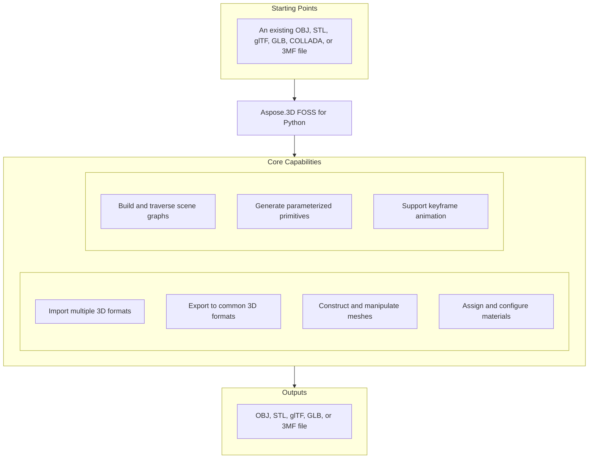

# Aspose.3D FOSS for Python

[](https://pypi.org/project/aspose-3d-foss/)  [](LICENSE) [](https://github.com/aspose-3d-foss/Aspose.3D-FOSS-for-Python/graphs/contributors)

[](https://products.aspose.org/3d/python/)

Aspose.3D FOSS for Python is a Python library that enables developers to create, read, convert, and save 3D scenes using formats such as `.obj`, `.stl`, `.gltf`, `.glb`, `.3mf`, and `.dae`. It supports building 3D geometry from primitives like `Box`, `Sphere`, and `Cylinder`, and provides full control over scene structure through `Scene`, `Node`, `Mesh`, and material objects. Users can generate meshes programmatically, apply shading and materials, and export scenes to various 3D formats for visualization or further processing. The library targets Python developers working on CAD, gaming, simulation, and visualization workflows who need a free and open-source 3D processing toolkit.

## Navigation

- [At a Glance](#at-a-glance)
- [Key Capabilities](#key-capabilities)
- [Installation](#installation)
- [Dependencies](#dependencies)
- [Quick Start](#quick-start)
- [Additional Examples](#additional-examples)
- [API Reference](#api-reference)
- [Documentation & Resources](#documentation--resources)
- [Scope and Limitations](#scope-and-limitations)
- [Development and Testing](#development-and-testing)
- [License](#license)

## At a Glance



## Key Capabilities

- **Import multiple 3D formats.** Import multiple 3D formats including OBJ, STL, glTF, GLB, COLLADA, and 3MF using `Scene.open`, which auto-detects the format from the file extension or an explicit `FileFormat`.
- **Export to common 3D formats.** Export scenes to OBJ, STL, glTF, GLB, and 3MF using `Scene.save` with format-specific `SaveOptions` subclasses that support coordinate flipping, unit scaling, and compression settings.
- **Construct and manipulate meshes.** Construct and manipulate meshes by adding control points and polygons through `Mesh.control_points` and `Mesh.create_polygon`, or by converting primitives with `to_mesh`.
- **Assign and configure materials.** Assign and configure materials such as `LambertMaterial`, `PhongMaterial`, and `PbrMaterial` by setting diffuse, metallic, and roughness properties directly on a node.
- **Build and traverse scene graphs.** Build and traverse scene graphs using `Node.create_child_node`, `Node.add_entity`, and `Node.child_nodes`, where each node maintains an independent `Transform` with translation, rotation, and scaling.
- **Generate parameterized primitives.** Generate parameterized primitives including `Box`, `Sphere`, and `Cylinder` by instantiating them with dimensions and converting them to editable `Mesh` geometry via `to_mesh`.
- **Support keyframe animation.** Support keyframe animation by creating `AnimationClip`, `AnimationNode`, and `KeyframeSequence` objects, and storing skeletal bind-pose data with `Pose`.

## Installation

Install the published package from PyPI (`aspose-3d-foss`, version 26.1.0):

```bash
pip install aspose-3d-foss
```

To work from a source checkout instead, install the clone with pip:

```bash
git clone https://github.com/aspose-3d-foss/Aspose.3D-FOSS-for-Python.git
cd Aspose.3D-FOSS-for-Python
pip install .
```

Verify the install:

```bash
python -c "import aspose.threed"
```

The package supports Python 3.7, 3.8, 3.9, 3.10, 3.11, and 3.12 and declares `python_requires` as `>=3.7`.

## Dependencies

### Required Package Dependencies

No required third-party package dependencies; in `setup.py`, the `install_requires` list is empty.

### Native and System Requirements

- Requires Python 3.7 or later (`python_requires=">=3.7"` in `setup.py`).

### Development Dependencies

- `pytest>=7.0.0` (extra `dev`)

## Quick Start

Import an existing file and inspect its geometry by reading the control points and polygons of each entity.

```python
from aspose.threed import Scene
from aspose.threed.entities import Box
from aspose.threed.shading import LambertMaterial
from aspose.threed.utilities import Vector3

scene = Scene()
box = Box(length=2.0, width=1.0, height=1.0)
material = LambertMaterial()
material.diffuse_color = Vector3(0.2, 0.6, 0.9)

scene.root_node.create_child_node("Crate", entity=box.to_mesh(), material=material)
scene.save("crate.gltf")
```

Build a 3D scene from scratch by creating primitives, assigning materials, and saving the result to a supported format.

```python
from aspose.threed import Scene
from aspose.threed.entities import Sphere
from aspose.threed.shading import PbrMaterial
from aspose.threed.utilities import Vector3

scene = Scene()
sphere = Sphere()
material = PbrMaterial(albedo=Vector3(0.8, 0.1, 0.1))
material.metallic_factor = 0.9
material.roughness_factor = 0.2

scene.root_node.create_child_node("Ball", entity=sphere.to_mesh(), material=material)
scene.save("ball.stl")
```

## Additional Examples

Create scenes from scratch, assign materials, and export to glTF, STL, and 3MF formats using in-memory streams.

### Export a scene with a PBR material to glTF and inspect the material JSON

```python
import io
import json
from aspose.threed import Scene, FileFormat
from aspose.threed.entities import Mesh
from aspose.threed.utilities import Vector3, Vector4
from aspose.threed.formats.gltf import GltfSaveOptions
from aspose.threed.shading import PbrMaterial

scene = Scene()
mesh = Mesh("TestMesh")
mesh.control_points.add(Vector4(0.0, 0.0, 0.0, 1.0))
mesh.control_points.add(Vector4(1.0, 0.0, 0.0, 1.0))
mesh.control_points.add(Vector4(0.0, 1.0, 0.0, 1.0))
mesh.create_polygon(0, 1, 2)

albedo = Vector3(0.8, 0.2, 0.3)
material = PbrMaterial("RedMaterial", albedo)
material.metallic_factor = 0.5
material.roughness_factor = 0.7

node = scene.root_node.create_child_node("TestNode")
node.entity = mesh
node.material = material

stream = io.BytesIO()
# Pass the detected FileFormat into the constructor explicitly: unlike
# StlFormat, GltfFormat.create_save_options() does not set file_format on the
# options it returns, and a bare stream (no filename) gives scene.save()
# nothing else to detect the format from.
options = GltfSaveOptions(FileFormat.get_format_by_extension(".gltf"))
options.binary_mode = False
scene.save(stream, options)

stream.seek(0)
gltf_data = json.loads(stream.read().decode("utf-8"))
print(gltf_data["materials"][0]["pbrMetallicRoughness"])
```

<details>
<summary>View Additional Examples</summary>

### Export a triangle mesh to ASCII STL using an in-memory `StringIO` stream

```python
import io
from aspose.threed import Scene, FileFormat
from aspose.threed.entities import Mesh
from aspose.threed.utilities import Vector4

scene = Scene()
mesh = Mesh("triangle")
mesh.control_points.add(Vector4(0.0, 0.0, 0.0, 1.0))
mesh.control_points.add(Vector4(1.0, 0.0, 0.0, 1.0))
mesh.control_points.add(Vector4(1.0, 1.0, 0.0, 1.0))
mesh.create_polygon(0, 1, 2)

node = scene.root_node.create_child_node("triangle_node")
node.entity = mesh

stream = io.StringIO()
# Use FileFormat.get_format_by_extension(...).create_save_options() rather than
# StlSaveOptions() directly: a default-constructed options object has no
# file_format set, and scene.save() cannot infer the format from a bare stream
# (only filename-based saves fall back to extension detection).
options = FileFormat.get_format_by_extension(".stl").create_save_options()
options.binary_mode = False
scene.save(stream, options)
print(stream.getvalue())
```

### Triangulate a `Box` primitive and count its control points

```python
from aspose.threed.entities import Box

box = Box(10, 20, 30)
mesh = box.to_mesh()
print(f"Control points: {len(mesh.control_points)}")
```

### Build a cube mesh and export it to 3MF without compression

```python
import io
from aspose.threed import Scene
from aspose.threed.entities import Mesh
from aspose.threed.utilities import Vector4
from aspose.threed.formats import ThreeMfSaveOptions

scene = Scene()
mesh = Mesh("cube")
for point in [
    Vector4(0, 0, 0, 1), Vector4(1, 0, 0, 1), Vector4(1, 1, 0, 1), Vector4(0, 1, 0, 1),
    Vector4(0, 0, 1, 1), Vector4(1, 0, 1, 1), Vector4(1, 1, 1, 1), Vector4(0, 1, 1, 1),
]:
    mesh.control_points.add(point)

mesh.create_polygon(0, 1, 2)
mesh.create_polygon(0, 2, 3)
mesh.create_polygon(4, 7, 6)
mesh.create_polygon(4, 6, 5)
mesh.create_polygon(0, 4, 5)
mesh.create_polygon(0, 5, 1)
mesh.create_polygon(2, 6, 7)
mesh.create_polygon(2, 7, 3)
mesh.create_polygon(0, 3, 7)
mesh.create_polygon(0, 7, 4)
mesh.create_polygon(1, 5, 6)
mesh.create_polygon(1, 6, 2)

node = scene.root_node.create_child_node("cube")
node.entity = mesh

stream = io.BytesIO()
options = ThreeMfSaveOptions()
options.enable_compression = False
scene.save(stream, options)
```

</details>

## API Reference

The aspose-3d-foss package provides 3D scene manipulation capabilities through the `aspose.threed.Scene` class, which serves as the primary entry point for loading, saving, and managing 3D content. The `Scene` class contains a hierarchy of `Node` objects, each of which can hold geometry, materials, and transformations.

The verified public surface has 337 types.

<details>
<summary>View the Complete Public API Surface</summary>

### Core API

| Class | Description |
| --- | --- |
| `A3DObject` | The A3DObject class serves as the base for objects that can hold named properties and support property lookup, addition, and removal operations. |
| `AnimationChannel` | The AnimationChannel class represents a single animated property channel that stores keyframe sequences and default values for interpolation. |
| `AnimationClip` | The AnimationClip class defines a time-bounded animation sequence containing multiple animation nodes and supporting named clips with start and stop times. |
| `AnimationNode` | The AnimationNode class represents a node in an animation hierarchy that can bind to scene nodes and contain sub-animations and bind points. |
| `ArrayListAdapter` | Adapter class that wraps List[T] and implements IArrayList[T]. |
| `AssetInfo` | The AssetInfo class holds metadata about a 3D asset such as author, creation time, coordinate system, and unit scale factor. |
| `Axis` | The coordinate axis. |
| `AxisSystem` | Axis system is an combination of coordinate system, up vector and front vector. |
| `BindPoint` | The BindPoint class defines a binding location that associates a scene property with one or more animation channels. |
| `BonePose` | The BonePose class represents the transformation matrix and local-space flag for a bone in a skeletal pose. |
| `BoundingBox2D` | The axis-aligned bounding box for Vector2 |
| `BoundingBoxExtent` | The extent of the bounding box |
| `Box` | The Box class defines a rectangular prism primitive with configurable length, height, and segment counts. |
| `Camera` | The Camera class represents a viewing frustum entity used for rendering scenes from a specific perspective. |
| `Circle` | The Circle class defines a planar circular primitive with configurable resolution and radius. |
| `ComposeOrder` | The order to compose transform matrix |
| `CoordinateSystem` | The left handed or right handed coordinate system. |
| `Curve` | The Curve class represents a parametric curve entity defined by control points and interpolation settings. |
| `CustomObject` | The CustomObject class serves as a generic container for user-defined 3D objects that extend the base A3DObject functionality. |
| `Cylinder` | The Cylinder class defines a cylindrical primitive with configurable radius, height, and segment counts. |
| `Dish` | The Dish class defines a spherical cap primitive with configurable radii and segment counts. |
| `Ellipse` | The Ellipse class defines a two-dimensional elliptical primitive with configurable radii and resolution. |
| `Entity` | The Entity class represents a renderable or transformable object in a scene that can be attached to nodes. |
| `ExportException` | Exceptions when Aspose.3D failed to export the scene to file. |
| `Extrapolation` | The Extrapolation class defines how animation values are computed beyond the defined keyframe range. |
| `FMatrix4` | Matrix 4x4 with all component in float type |
| `FileContentType` | File content type |
| `FileFormat` | The FileFormat class provides utilities for identifying and working with supported 3D file formats by extension. |
| `FileFormatType` | File format type |
| `Frustum` | The Frustum class defines a truncated pyramid primitive commonly used for camera view volumes. |
| `Geometry` | The Geometry class represents a geometric entity that can be rendered and supports mesh-based representations. |
| `GlobalTransform` | The GlobalTransform class encapsulates the combined translation, rotation, and scaling of an object in world space. |
| `Group` | A Group represents the logical relationships of Node. |
| `INamedObject` | The INamedObject interface defines a contract for objects that can be identified by a unique name. |
| `IOExtension` | Utilities to write matrix/vector to binary writer |
| `ImageRenderOptions` | The ImageRenderOptions class configures rendering parameters for exporting scenes to image formats. |
| `ImportException` | Exception when Aspose.3D failed to open the specified source. |
| `KeyFrame` | The KeyFrame class represents a single time-stamped value in an animation keyframe sequence. |
| `KeyframeSequence` | The KeyframeSequence class manages a collection of keyframes used for animating a specific property over time. |
| `Light` | The Light class represents a light source entity that inherits camera properties and illuminates scene geometry. |
| `LinearExtrusion` | The LinearExtrusion class defines a 3D shape created by extruding a 2D profile along a straight path. |
| `MathUtils` | A set of useful mathematical utilities. |
| `Mesh` | The Mesh class represents a polygonal mesh geometry composed of vertices and polygons for rendering. |
| `Node` | The Node class represents a transformable container in the scene hierarchy that can hold entities and child nodes. |
| `ParseException` | Exception when Aspose.3D failed to parse the input. |
| `Plane` | The Plane class defines an infinite planar primitive with configurable size and segment counts. |
| `PolygonBuilder` | The PolygonBuilder class provides utilities for constructing polygonal meshes from vertex data. |
| `Pose` | The Pose class represents a snapshot of bone transformations used for skeletal animation and skinning. |
| `Primitive` | The Primitive class defines basic geometric shapes such as boxes, cylinders, and spheres for scene construction. |
| `Property` | The Property class represents a named value that can be attached to scene objects for metadata storage. |
| `PropertyCollection` | The PropertyCollection class manages a group of properties associated with a scene object. |
| `PropertyFlags` | Property's flags |
| `Rect` | A class to represent the rectangle |
| `RelativeRectangle` | Relative rectangle |
| `RotationOrder` | The order controls which rx ry rz are applied in the transformation matrix. |
| `Scene` | The Scene class represents a complete 3D scene containing nodes, entities, animations, and asset metadata. |
| `SceneObject` | The SceneObject class serves as the base for all objects that can be part of a scene hierarchy. |
| `SemanticAttribute` | Allow user to use their own structure for static declaration of VertexDeclaration |
| `Sphere` | The aspose.threed.Sphere class represents a sphere primitive with configurable radius, segment counts, and angular ranges, and can be converted to a mesh via to_mesh. |
| `Transform` | The aspose.threed.Transform class encapsulates geometric transformations including translation, rotation, and scaling, with support for pivot points and offset adjustments. |
| `TransformBuilder` | The TransformBuilder is used to build transform matrix by a chain of transformations. |
| `TrialException` | This is raised in Scene.Open/Scene.Save when no licenses are applied. |
| `Vertex` | Vertex reference, used to access the raw vertex in TriMesh. |
| `VertexDeclaration` | The declaration of a custom defined vertex's structure |
| `VertexField` | Vertex's field memory layout description. |
| `VertexFieldDataType` | Vertex field's data type |
| `VertexFieldSemantic` | The semantic of the vertex field |
| `Bone` | The aspose.threed.deformers.Bone class represents a bone in a skeletal animation system, storing its transform and associated vertex weights. |
| `BoneLinkMode` | The aspose.threed.deformers.BoneLinkMode enumeration defines how bones are linked to nodes in a hierarchy during skinning. |
| `Deformer` | The aspose.threed.deformers.Deformer class serves as the base for mesh deformation operators such as skinning and morphing. |
| `MorphTargetChannel` | The aspose.threed.deformers.MorphTargetChannel class manages the influence of a single morph target on a mesh via weighted blending. |
| `MorphTargetDeformer` | The aspose.threed.deformers.MorphTargetDeformer class applies shape blending by combining multiple morph targets on a mesh. |
| `SkinDeformer` | The aspose.threed.deformers.SkinDeformer class implements skeletal animation by deforming a mesh based on attached bones and their weights. |
| `ApertureMode` | Camera aperture modes. |
| `BooleanOperand` | This class encapsulates the transformed mesh as Boolean operation's operand. |
| `BooleanOperation` | The aspose.threed.entities.BooleanOperation class performs constructive solid geometry operations such as union, intersection, and difference on meshes. |
| `BooleanOperator` | Boolean operator allows you to apply Boolean operation on two IMeshConvertible instances. |
| `CompositeCurve` | A CompositeCurve is consisting of several curve segments. |
| `CurveDimension` | The aspose.threed.entities.CurveDimension class specifies the dimensionality of a curve, such as 2D or 3D. |
| `EndPoint` | The end point to trim the curve, can be a parameter value or a Cartesian point. |
| `HalfSpace` | HalfSpace represents a infinity space which is split by a plane, this can be used with BooleanOperator |
| `IIndexedVertexElement` | The aspose.threed.entities.IIndexedVertexElement interface defines a vertex element that uses an index buffer to reference per-vertex data. |
| `IMeshConvertible` | Entities that implemented this interface can be converted to Mesh |
| `IOrientable` | Orientable entities shall implement this interface. |
| `LightType` | Light types. |
| `Line` | A polyline is a path defined by a set of points with control_points, and connected by segments. |
| `MappingMode` | The aspose.threed.entities.MappingMode enumeration defines how texture coordinates are mapped onto a surface. |
| `NurbsCurve` | The aspose.threed.entities.NurbsCurve class represents a non-uniform rational B-spline curve defined by control points, knots, and degree. |
| `NurbsDirection` | The aspose.threed.entities.NurbsDirection class describes the properties of a NURBS curve or surface along a single parametric direction. |
| `NurbsSurface` | The aspose.threed.entities.NurbsSurface class represents a NURBS surface defined by control points, knot vectors, and degrees in two parametric directions. |
| `NurbsType` | The aspose.threed.entities.NurbsType enumeration specifies the type of NURBS curve or surface, such as periodic or open. |
| `Patch` | The aspose.threed.entities.Patch class represents a parametric surface patch used in surface modeling. |
| `PatchDirection` | The aspose.threed.entities.PatchDirection enumeration indicates the parametric direction (U or V) of a surface patch. |
| `PatchDirectionType` | The aspose.threed.entities.PatchDirectionType enumeration specifies the type of a patch direction, such as linear or periodic. |
| `PointCloud` | The aspose.threed.entities.PointCloud class represents a collection of unconnected points in three-dimensional space. |
| `InvalidOperationException` | The aspose.threed.entities.PolygonBuilder.InvalidOperationException is raised when an invalid operation is attempted during polygon construction. |
| `PolygonModifier` | The aspose.threed.entities.PolygonModifier class provides utilities to modify polygonal meshes, such as triangulation and face flipping. |
| `ProjectionType` | Camera's projection types. |
| `Pyramid` | Parameterized pyramid. |
| `RectangularTorus` | Parameterized rectangular torus entity. |
| `ReferenceMode` | The aspose.threed.entities.ReferenceMode enumeration defines how references to external resources are handled during file I/O. |
| `RevolvedAreaSolid` | RevolvedAreaSolid entity. |
| `RotationMode` | The frustum's rotation mode. |
| `Shape` | Base class for all shape entities. |
| `Skeleton` | The Skeleton is mainly used by CAD software to help designer to manipulate the transformation of skeletal structure, it's usually useless outside the CAD softwares. |
| `SkeletonType` | Skeleton type enum. |
| `SplitMeshPolicy` | Share vertex/control point data between sub-meshes or each sub-mesh has its own compacted data. |
| `SweptAreaSolid` | SweptAreaSolid entity. |
| `TextureMapping` | The aspose.threed.entities.TextureMapping class defines how textures are applied to a mesh, including coordinate generation and wrapping. |
| `Torus` | Parameterized torus entity. |
| `TransformedCurve` | TransformedCurve entity. |
| `TriMesh` | TriMesh is a triangle mesh that stores triangles. |
| `TrimmedCurve` | TrimmedCurve entity. |
| `VertexElement` | The aspose.threed.entities.VertexElement class is the base for all vertex attribute elements such as normals, UVs, and colors. |
| `VertexElementBinormal` | The aspose.threed.entities.VertexElementBinormal class stores binormal vectors per vertex for lighting calculations. |
| `VertexElementDoublesTemplate` | A helper class for defining concrete implementations. |
| `VertexElementEdgeCrease` | Defines the edge crease values for specified components. |
| `VertexElementFVector` | The aspose.threed.entities.VertexElementFVector class represents a vertex element containing floating-point vector data. |
| `VertexElementHole` | Defines the hole information for specified components. |
| `VertexElementIntsTemplate` | A helper class for defining concrete implementations with int data. |
| `VertexElementMaterial` | Defines the material for specified components. |
| `VertexElementNormal` | The aspose.threed.entities.VertexElementNormal class stores per-vertex normal vectors for shading. |
| `VertexElementPolygonGroup` | Defines the polygon group for specified components. |
| `VertexElementSmoothingGroup` | The aspose.threed.entities.VertexElementSmoothingGroup class assigns smoothing groups to faces for rendering optimization. |
| `VertexElementSpecular` | Defines the specular color for specified components. |
| `VertexElementTangent` | The aspose.threed.entities.VertexElementTangent class stores per-vertex tangent vectors for normal mapping. |
| `VertexElementTemplate` | A helper class for defining concrete implementations of vertex elements with typed data. |
| `VertexElementType` | The aspose.threed.entities.VertexElementType enumeration identifies the type of a vertex element, such as position, normal, or UV. |
| `VertexElementUV` | The aspose.threed.entities.VertexElementUV class stores per-vertex texture coordinate pairs. |
| `VertexElementUserData` | Defines the user data for specified components. |
| `VertexElementVector4` | Defines the vector4 data for specified components. |
| `VertexElementVertexColor` | The aspose.threed.entities.VertexElementVertexColor class stores per-vertex color data for rendering. |
| `VertexElementVertexCrease` | Defines the vertex crease values for specified components. |
| `VertexElementVisibility` | Defines the visibility for specified components. |
| `VertexElementWeight` | Defines the weight for specified components. |
| `A3dwSaveOptions` | Save options for A3DW |
| `AmfSaveOptions` | Save options for AMF |
| `BasicLoadOptions` | Simple LoadOptions subclass for basic loading options. |
| `ColladaLoadOptions` | Load options for Collada |
| `ColladaSaveOptions` | Save options for collada |
| `ColladaTransformStyle` | The node's transformation style of node |
| `Discreet3dsLoadOptions` | Load options for Discreet 3DS |
| `Discreet3dsSaveOptions` | Save options for Discreet 3DS |
| `DracoCompressionLevel` | Compression level for draco file |
| `DracoFormat` | Google Draco format |
| `DracoSaveOptions` | Save options for Draco |
| `Exporter` | The aspose.threed.formats.Exporter class provides functionality to export scenes to various 3D file formats. |
| `FbxLoadOptions` | Load options for FBX |
| `FbxSaveOptions` | Save options for FBX |
| `FormatDetector` | The aspose.threed.formats.FormatDetector class analyzes a file stream to determine its 3D format. |
| `GltfEmbeddedImageFormat` | Embedded image format for GLTF |
| `formats.GltfLoadOptions` | Load options for glTF |
| `formats.GltfSaveOptions` | Save options for glTF |
| `Html5SaveOptions` | Save options for HTML5 |
| `IOConfig` | The aspose.threed.formats.IOConfig class holds configuration options for importing or exporting 3D files. |
| `IOService` | The aspose.threed.formats.IOService class provides core I/O operations for reading and writing 3D data. |
| `Importer` | The aspose.threed.formats.Importer class provides functionality to import scenes from various 3D file formats. |
| `JtLoadOptions` | Load options for JT |
| `LoadOptions` | The aspose.threed.formats.LoadOptions class provides configuration options for loading 3D scenes and inherits from IOConfig. |
| `Microsoft3MFFormat` | Microsoft 3MF format |
| `Microsoft3MFSaveOptions` | Save options for Microsoft 3MF |
| `formats.ObjLoadOptions` | Load options for OBJ |
| `formats.ObjSaveOptions` | Save options for OBJ |
| `PdfFormat` | Adobe's Portable Document Format |
| `PdfLightingScheme` | Lighting scheme for PDF export |
| `PdfLoadOptions` | Load options for PDF |
| `PdfRenderMode` | Render mode for PDF export |
| `PdfSaveOptions` | Save options for PDF |
| `Plugin` | The aspose.threed.formats.Plugin class serves as an abstract base for format plugins that provide exporters, importers, format detectors, and load/save options. |
| `PlyFormat` | PLY format |
| `PlyLoadOptions` | Load options for PLY |
| `PlySaveOptions` | Save options for PLY |
| `RvmFormat` | RVM format |
| `RvmLoadOptions` | Load options for RVM |
| `RvmSaveOptions` | Save options for RVM |
| `SaveOptions` | The aspose.threed.formats.SaveOptions class provides configuration options for saving 3D scenes and inherits from IOConfig. |
| `formats.StlLoadOptions` | Load options for STL |
| `formats.StlSaveOptions` | Save options for STL |
| `ThreeMfFormat` | The aspose.threed.formats.ThreeMfFormat class represents the 3MF file format and supports importing and exporting 3D models with metadata and build configurations. |
| `ThreeMfLoadOptions` | The aspose.threed.formats.ThreeMfLoadOptions class provides configuration options specific to loading 3MF files and inherits from LoadOptions. |
| `ThreeMfSaveOptions` | The aspose.threed.formats.ThreeMfSaveOptions class provides configuration options specific to saving 3MF files and inherits from SaveOptions. |
| `U3dLoadOptions` | Load options for U3D |
| `U3dSaveOptions` | Save options for U3D |
| `UsdSaveOptions` | Save options for USD |
| `XLoadOptions` | Load options for X format |
| `ColladaExporter` | The aspose.threed.formats.collada.ColladaExporter.ColladaExporter class exports 3D scenes to the COLLADA format. |
| `ColladaFormat` | The aspose.threed.formats.collada.ColladaFormat.ColladaFormat class represents the COLLADA file format and supports importing and exporting 3D scenes. |
| `ColladaFormatDetector` | The aspose.threed.formats.collada.ColladaFormatDetector.ColladaFormatDetector class detects whether a file is in the COLLADA format. |
| `ColladaImporter` | The aspose.threed.formats.collada.ColladaImporter.ColladaImporter class imports 3D scenes from the COLLADA format. |
| `ColladaPlugin` | The aspose.threed.formats.collada.ColladaPlugin.ColladaPlugin class provides COLLADA format support by exposing exporters, importers, format detectors, and load/save options. |
| `FbxExporter` | The aspose.threed.formats.fbx.FbxExporter.FbxExporter class exports 3D scenes to the FBX format. |
| `FbxFormat` | The aspose.threed.formats.fbx.FbxFormat.FbxFormat class represents the FBX file format and supports importing and exporting 3D scenes. |
| `FbxFormatDetector` | The aspose.threed.formats.fbx.FbxFormatDetector.FbxFormatDetector class detects whether a file is in the FBX format. |
| `FbxImporter` | The aspose.threed.formats.fbx.FbxImporter.FbxImporter class imports 3D scenes from the FBX format. |
| `FbxPlugin` | The aspose.threed.formats.fbx.FbxPlugin.FbxPlugin class provides FBX format support by exposing exporters, importers, format detectors, and load/save options. |
| `BinaryTokenizer` | The aspose.threed.formats.fbx.binary_tokenizer.BinaryTokenizer class tokenizes binary FBX files into structured tokens for parsing. |
| `binary_tokenizer.Token` | The aspose.threed.formats.fbx.binary_tokenizer.Token class represents a single token extracted from a binary FBX file. |
| `binary_tokenizer.TokenType` | The aspose.threed.formats.fbx.binary_tokenizer.TokenType class defines the type of a token in a binary FBX file. |
| `FbxElement` | The aspose.threed.formats.fbx.parser.FbxElement class represents a parsed element in an FBX file structure. |
| `FbxParser` | The aspose.threed.formats.fbx.parser.FbxParser class parses FBX files into a hierarchical structure of elements and scopes. |
| `FbxScope` | The aspose.threed.formats.fbx.parser.FbxScope class represents a scope in the parsed FBX file structure. |
| `FbxTokenizer` | The aspose.threed.formats.fbx.tokenizer.FbxTokenizer class tokenizes text-based FBX files into structured tokens for parsing. |
| `tokenizer.Token` | The aspose.threed.formats.fbx.tokenizer.Token class represents a single token extracted from a text-based FBX file. |
| `tokenizer.TokenType` | The aspose.threed.formats.fbx.tokenizer.TokenType class defines the type of a token in a text-based FBX file. |
| `GltfExporter` | The aspose.threed.formats.gltf.GltfExporter class exports 3D scenes to the glTF format. |
| `GltfFormat` | The aspose.threed.formats.gltf.GltfFormat class represents the glTF file format and supports importing and exporting 3D scenes. |
| `GltfFormatDetector` | The aspose.threed.formats.gltf.GltfFormatDetector class detects whether a file is in the glTF format. |
| `GltfImporter` | The aspose.threed.formats.gltf.GltfImporter class imports 3D scenes from the glTF format. |
| `gltf.GltfLoadOptions` | The aspose.threed.formats.gltf.GltfLoadOptions class provides configuration options specific to loading glTF files and inherits from LoadOptions. |
| `GltfPlugin` | The aspose.threed.formats.gltf.GltfPlugin class provides glTF format support by exposing exporters, importers, format detectors, and load/save options. |
| `gltf.GltfSaveOptions` | The aspose.threed.formats.gltf.GltfSaveOptions class provides configuration options specific to saving glTF files and inherits from SaveOptions. |
| `ObjExporter` | The aspose.threed.formats.obj.ObjExporter class exports 3D scenes to the OBJ format. |
| `ObjFormat` | The aspose.threed.formats.obj.ObjFormat class represents the OBJ file format and supports importing and exporting 3D scenes. |
| `ObjFormatDetector` | The aspose.threed.formats.obj.ObjFormatDetector class detects whether a file is in the OBJ format. |
| `ObjImporter` | The aspose.threed.formats.obj.ObjImporter class imports 3D scenes from the OBJ format. |
| `obj.ObjLoadOptions` | The aspose.threed.formats.obj.ObjLoadOptions class provides configuration options specific to loading OBJ files and inherits from LoadOptions. |
| `ObjPlugin` | The aspose.threed.formats.obj.ObjPlugin.ObjPlugin class provides OBJ format support by exposing exporters, importers, format detectors, and load/save options. |
| `obj.ObjSaveOptions` | The aspose.threed.formats.obj.ObjSaveOptions class provides configuration options specific to saving OBJ files and inherits from SaveOptions. |
| `StlExporter` | The aspose.threed.formats.stl.StlExporter class exports 3D scenes to the STL format. |
| `StlFormat` | The StlFormat class represents the STL file format and provides properties and methods to inspect and work with STL files, including support for importing and exporting. |
| `StlFormatDetector` | The StlFormatDetector class detects whether a given input stream or file contains data in the STL format. |
| `StlImporter` | The StlImporter class enables importing geometry and scene data from STL files into an Aspose.3D scene. |
| `stl.StlLoadOptions` | The StlLoadOptions class provides configuration options for loading STL files, such as coordinate system flipping and scaling. |
| `StlPlugin` | The StlPlugin class acts as a plugin for the STL format, exposing factory methods to obtain importers, exporters, format detectors, and load/save options. |
| `stl.StlSaveOptions` | The StlSaveOptions class provides configuration options for saving scenes to STL files, including binary mode, coordinate system flipping, and scaling. |
| `ThreeMfExporter` | The ThreeMfExporter class exports scenes to the 3MF file format. |
| `ThreeMfFormatDetector` | The ThreeMfFormatDetector class detects whether a given input stream or file contains data in the 3MF format. |
| `ThreeMfImporter` | The ThreeMfImporter class enables importing geometry and scene data from 3MF files into an Aspose.3D scene. |
| `ThreeMfPlugin` | The ThreeMfPlugin class acts as a plugin for the 3MF format, exposing factory methods to obtain importers, exporters, format detectors, and load/save options. |
| `ArbitraryProfile` | This class allows you to construct a 2D profile directly from arbitrary curve. |
| `CShape` | IFC compatible C-shape profile that defined by parameters. |
| `CenterLineProfile` | IFC compatible center line profile. |
| `CircleShape` | IFC compatible circle profile. |
| `EllipseShape` | IFC compatible ellipse profile. |
| `FontFile` | Font file contains definitions for glyphs, this is used to create text profile. |
| `HShape` | IFC compatible H-shape profile. |
| `HollowCircleShape` | IFC compatible hollow circle profile. |
| `HollowRectangleShape` | IFC compatible hollow rectangular shape with both inner/outer rounding corners. |
| `LShape` | IFC compatible L-shape profile that defined by parameters. |
| `MirroredProfile` | IFC compatible mirror profile. |
| `ParameterizedProfile` | The base class of all parameterized profiles. |
| `Profile` | 2D Profile in xy plane. |
| `RectangleShape` | IFC compatible rectangle profile. |
| `TShape` | IFC compatible T-shape defined by parameters. |
| `Text` | Text profile, this profile describes contours using font and text. |
| `TrapeziumShape` | IFC compatible Trapezium shape defined by parameters. |
| `UShape` | IFC compatible U-shape defined by parameters. |
| `ZShape` | IFC compatible Z-shape profile that defined by parameters. |
| `BlendFactor` | Blend factor specify pixel arithmetic. |
| `CompareFunction` | Compare function for depth/stencil testing. |
| `CubeFace` | Cube face enumeration. |
| `CullFaceMode` | Cull face mode for face culling. |
| `DescriptorSetUpdater` | Descriptor set updater for shader resources. |
| `DrawOperation` | Draw operation type. |
| `DriverException` | Exception thrown when rendering driver fails. |
| `EntityRenderer` | Base class for rendering entities. |
| `EntityRendererFeatures` | Features supported by an entity renderer. |
| `EntityRendererKey` | The key of registered entity renderer. |
| `FrontFace` | Front face winding order. |
| `GLSLSource` | GLSL shader source. |
| `IBuffer` | Interface for vertex/index buffer. |
| `ICommandList` | Interface for command list. |
| `IDescriptorSet` | Interface for descriptor set. |
| `IIndexBuffer` | Interface for index buffer. |
| `IPipeline` | Interface for graphics pipeline. |
| `IRenderQueue` | Interface for render queue. |
| `IRenderTarget` | Interface for render target. |
| `IRenderTexture` | Interface for render texture. |
| `IRenderWindow` | Interface for render window. |
| `ITexture1D` | Interface for 1D texture. |
| `ITexture2D` | Interface for 2D texture. |
| `ITextureCodec` | Interface for texture codec. |
| `ITextureCubemap` | Interface for cubemap texture. |
| `ITextureDecoder` | Interface for texture decoder. |
| `ITextureEncoder` | Interface for texture encoder. |
| `ITextureUnit` | Interface for texture unit. |
| `IVertexBuffer` | Interface for vertex buffer. |
| `IndexDataType` | Data type for indices. |
| `InitializationException` | Exception thrown when rendering initialization fails. |
| `PixelFormat` | Pixel format for render targets. |
| `PixelMapMode` | Pixel mapping mode. |
| `PixelMapping` | Pixel mapping configuration. |
| `PolygonMode` | Polygon rendering mode. |
| `PostProcessing` | Post-processing effect. |
| `PresetShaders` | Predefined shaders. |
| `PushConstant` | Push constant for shaders. |
| `RenderFactory` | RenderFactory creates all resources that represented in rendering pipeline. |
| `RenderParameters` | Parameters for rendering. |
| `RenderQueueGroupId` | Render queue group ID. |
| `RenderResource` | Base class for render resources. |
| `RenderStage` | Render stage in the pipeline. |
| `RenderState` | Render state configuration. |
| `Renderer` | The context about renderer. |
| `RendererVariableManager` | Manages renderer variables. |
| `SPIRVSource` | SPIRV shader source. |
| `ShaderException` | Exception thrown when shader compilation/linking fails. |
| `ShaderProgram` | Shader program. |
| `ShaderSet` | Set of shaders for rendering. |
| `ShaderSource` | Shader source code. |
| `ShaderStage` | Shader stage. |
| `ShaderVariable` | Shader variable. |
| `StencilAction` | Stencil action. |
| `StencilState` | Stencil state configuration. |
| `TextureCodec` | Texture codec. |
| `TextureData` | Texture data. |
| `TextureType` | Texture type. |
| `Viewport` | Viewport for rendering. |
| `WindowHandle` | Window handle for render window. |
| `AlphaSource` | Source of alpha channel for textures. |
| `LambertMaterial` | The LambertMaterial class represents a Lambertian shading material with properties for ambient, diffuse, emissive, and transparency colors. |
| `Material` | The Material class serves as the base class for all shading materials and provides texture management capabilities. |
| `PbrMaterial` | The PbrMaterial class represents a physically based rendering material with albedo, metallic, roughness, emissive, and occlusion properties. |
| `PbrSpecularMaterial` | Material for physically based rendering based on diffuse color/specular/glossiness. |
| `PhongMaterial` | The PhongMaterial class represents a Phong shading material extending LambertMaterial with specular reflection properties. |
| `ShaderMaterial` | A shader material allows to describe the material by external rendering engine or shader language. |
| `ShaderTechnique` | A technique in shader material describes the concrete rendering details. |
| `Texture` | This class defines the texture from an external file. |
| `TextureBase` | Base class for all texture types. |
| `TextureFilter` | Texture filter type. |
| `TextureSlot` | Texture slot name. |
| `WrapMode` | Wrap mode for texture coordinates. |
| `BoundingBox` | The BoundingBox class represents an axis-aligned bounding box in 3D space. |
| `FVector2` | The FVector2 class represents a 2D vector with single-precision floating-point components. |
| `FVector3` | The FVector3 class represents a 3D vector with single-precision floating-point components. |
| `FVector4` | The FVector4 class represents a 4D vector with single-precision floating-point components. |
| `FileSystem` | File system encapsulation. |
| `Matrix4` | The Matrix4 class represents a 4x4 matrix used for 3D transformations. |
| `Quaternion` | The Quaternion class represents a quaternion used for 3D rotations. |
| `Vector2` | The Vector2 class represents a 2D vector with double-precision floating-point components. |
| `Vector3` | The Vector3 class represents a 3D vector with double-precision floating-point components. |
| `Vector4` | The Vector4 class represents a 4D vector with double-precision floating-point components. |
| `Watermark` | Utility to encode/decode blind watermark to/from a mesh. |

#### Enumerations

| Enumeration | Description |
| --- | --- |
| `ExtrapolationType` | The ExtrapolationType class enumerates supported methods for extending animation behavior outside keyframe bounds. |
| `Interpolation` | The Interpolation class enumerates supported methods for calculating intermediate values between keyframes. |
| `PoseType` | The PoseType class enumerates the different kinds of poses supported in skeletal animation systems. |
| `StepMode` | The aspose.threed.StepMode enumeration defines how step data is interpreted during file import or export operations. |
| `WeightedMode` | The aspose.threed.WeightedMode enumeration specifies how weights are applied in skinning or morphing operations. |

#### Detailed Member Reference

### Scene

The `Scene` class provides methods such as `Scene.open`, `Scene.save`, `Scene.from_file`, `Scene.clear`, `Scene.get_animation_clip`, `Scene.create_animation_clip`, `Scene.render`, `Scene.root_node`, `Scene.sub_scenes`, `Scene.library`, `Scene.asset_info`, `Scene.poses`, and `Scene.current_animation_clip` to manage 3D scenes and their contents.

- `animation_clips`: Defined as `def animation_clips(self) -> List['AnimationClip']`.
- `asset_info`: Defined as `def asset_info(self) -> AssetInfo`.
- `clear`: Defined as `def clear(self)`.
- `create_animation_clip`: Defined as `def create_animation_clip(self, name: str) -> 'AnimationClip'`.
- `current_animation_clip`: Defined as `def current_animation_clip(self) -> Optional['AnimationClip']`.
- `from_file`: Defined as `def from_file(file_name: str)`.
- `get_animation_clip`: Defined as `def get_animation_clip(self, name: str) -> Optional['AnimationClip']`.
- `library`: Defined as `def library(self) -> List[CustomObject]`.
- `open`: Defined as `def open(self, file_or_stream, options=None)`.
- `poses`: Defined as `def poses(self) -> List`.
- `render`: Defined as `def render(self, camera, file_name_or_bitmap, size=None, format=None, options=None)`.
- `root_node`: Defined as `def root_node(self)`.
- `save`: Defined as `def save(self, file_or_stream, format_or_options=None)`.
- `sub_scenes`: Defined as `def sub_scenes(self) -> List['Scene']`.

### Node

The `Node` class represents an element in the scene graph with properties such as `Node.transform`, `Node.parent_node`, `Node.child_nodes`, `Node.entities`, `Node.entity`, `Node.material`, `Node.materials`, `Node.global_transform`, `Node.evaluate_global_transform`, `Node.get_bounding_box`, `Node.visible`, `Node.excluded`, `Node.meta_datas`, `Node.asset_info`, `Node.add_child_node`, `Node.create_child_node`, `Node.add_entity`, `Node.get_child`, `Node.get_entity`, `Node.select_objects`, `Node.select_single_object`, and `Node.merge`.

- `add_child_node`: Defined as `def add_child_node(self, node: 'Node')`.
- `add_entity`: Defined as `def add_entity(self, entity: 'Entity')`.
- `asset_info`: Defined as `def asset_info(self)`.
- `child_nodes`: Defined as `def child_nodes(self) -> List['Node']`.
- `create_child_node`: Defined as `def create_child_node(self, node_name: Optional[str]=None, entity=None, material=None) -> 'Node'`.
- `entities`: Defined as `def entities(self) -> List['Entity']`.
- `entity`: Defined as `def entity(self) -> Optional['Entity']`.
- `evaluate_global_transform`: Defined as `def evaluate_global_transform(self, with_geometric_transform: bool) -> Matrix4`.
- `excluded`: Defined as `def excluded(self) -> bool`.
- `get_bounding_box`: Defined as `def get_bounding_box(self) -> BoundingBox`.
- `get_child`: Defined as `def get_child(self, index_or_name)`.
- `get_entity`: Defined as `def get_entity(self, entity_type: type)`.
- `global_transform`: Defined as `def global_transform(self) -> GlobalTransform`.
- `material`: Defined as `def material(self) -> Optional['Material']`.
- `materials`: Defined as `def materials(self) -> List['Material']`.
- `merge`: Defined as `def merge(self, node: 'Node')`.
- `meta_datas`: Defined as `def meta_datas(self) -> List`.
- `parent_node`: Defined as `def parent_node(self) -> Optional['Node']`.
- `select_objects`: Defined as `def select_objects(self, path: str)`.
- `select_single_object`: Defined as `def select_single_object(self, path: str)`.
- `transform`: Defined as `def transform(self) -> Transform`.
- `visible`: Defined as `def visible(self) -> bool`.

### Mesh

The `Mesh` class provides geometry data and operations including `Mesh.control_points`, `Mesh.polygons`, `Mesh.polygon_count`, `Mesh.edges`, `Mesh.get_polygon_size`, `Mesh.create_polygon`, `Mesh.to_mesh`, `Mesh.triangulate`, `Mesh.optimize`, `Mesh.get_bounding_box`, `Mesh.get_entity_renderer_key`, `Mesh.union`, `Mesh.intersect`, `Mesh.difference`, and `Mesh.do_boolean`.

- `control_points`: Defined as `def control_points(self) -> ArrayListAdapter[Vector4]`.
- `create_polygon`: Defined as `def create_polygon(self, *args)`.
- `difference`: Defined as `def difference(a: 'Mesh', b: 'Mesh') -> 'Mesh'`.
- `do_boolean`: Defined as `def do_boolean(op: BooleanOperation, a: 'Mesh', transform_a: Optional[Matrix4], b: 'Mesh', transform_b: Optional[Matrix4]) -> 'Mesh'`.
- `edges`: Defined as `def edges(self) -> ArrayListAdapter[int]`.
- `get_bounding_box`: Defined as `def get_bounding_box(self)`.
- `get_entity_renderer_key`: Defined as `def get_entity_renderer_key(self)`.
- `get_polygon_size`: Defined as `def get_polygon_size(self, index: int) -> int`.
- `intersect`: Defined as `def intersect(a: 'Mesh', b: 'Mesh') -> 'Mesh'`.
- `is_manifold`: Defined as `def is_manifold(self) -> bool`.
- `optimize`: Defined as `def optimize(self, vertex_elements: bool=False, tolerance_control_point: float=1e-09, tolerance_normal: float=1e-09, tolerance_uv: float=1e-09) -> 'Mesh'`.
- `polygon_count`: Defined as `def polygon_count(self) -> int`.
- `polygons`: Defined as `def polygons(self) -> List[List[int]]`.
- `to_mesh`: Defined as `def to_mesh(self) -> 'Mesh'`.
- `triangulate`: Defined as `def triangulate(self) -> 'Mesh'`.
- `union`: Defined as `def union(a: 'Mesh', b: 'Mesh') -> 'Mesh'`.

### shading

The `aspose.threed.shading` module supports material definitions and rendering properties such as `diffuse_color`, `metallic_factor`, and `roughness_factor`.

### animation

The `aspose.threed.animation` module provides support for animation clips and keyframe-based motion within a scene.

### entities

The `aspose.threed.entities` module includes primitive geometry types and modifiers such as `PolygonModifier` for working with mesh entities.

### formats

The `aspose.threed.formats` module provides format-specific loaders and savers, with support for common 3D file formats through methods like `Scene.open` and `Scene.save`, and format options such as `enable_compression` and `enable_materials`.

### utilities

The `aspose.threed.utilities` module includes helper types such as `Vector3` and utility functions for common operations.

### render

The `aspose.threed.render` module provides rendering capabilities for 3D scenes.

### deformers

The `aspose.threed.deformers` module supports mesh deformation operations.

### profiles

The `aspose.threed.profiles` module provides support for profile-based geometry generation.

### aspose

The top-level aspose module exposes the `aspose.threed` package and its submodules for 3D scene processing.

</details>

## Documentation & Resources

- **[Getting started guide](https://docs.aspose.org/3d/python/)** — The getting started guide covers installation, walkthroughs, and feature guides for this library.
- **[How-to guides & FAQ](https://kb.aspose.org/3d/python/)** — The how-to guides and FAQ provide task-focused answers for common 3D-processing questions.
- **[Full API reference](https://reference.aspose.org/3d/python/)** — The full API reference is the complete, browsable reference for all 305 public types. It covers all 337 verified public types; the [API Reference](#api-reference) section above covers the essentials.
- **[Implementation progress notes](docs/foss-python-progress.md)** — The implementation progress notes describe the current FOSS-edition porting status.
- **[Release process](docs/releasing.md)** — The release process explains how a version of aspose-3d-foss is tagged and published to PyPI.
- **[Scene/Node/Entity/Transform](docs/IMPLEMENTATION_SUMMARY.md)** — The internal format-implementation notes cover `Scene`, `Node`, `Entity`, and `Transform` development history.
- **[OBJ importer](docs/OBJ_IMPORTER_IMPLEMENTATION.md)** — The OBJ importer notes describe the historical development of OBJ import functionality.
- **[STL import/export](docs/STL_IMPORT_IMPLEMENTATION.md)** — The STL import/export notes describe the historical development of STL import and export functionality.
- **[FBX parser](docs/FBX_IMPLEMENTATION_SUMMARY.md)** — The FBX parser notes describe the historical development of FBX parsing functionality.
- **[PyPI packaging readiness](docs/PYPI_READINESS.md)** — The PyPI packaging readiness notes describe the historical development of PyPI packaging.
- Found a bug or have a feature request? [Open an issue](https://github.com/aspose-3d-foss/Aspose.3D-FOSS-for-Python/issues).

## Scope and Limitations

Aspose.3D FOSS for Python version 26.1.0 supports reading and writing OBJ, STL, glTF, and COLLADA files, and provides basic scene graph inspection and node manipulation capabilities for these formats.

- No file format registers an importer or exporter for PDF, PLY, RVM, U3D, JT, AMF, HTML5, A3DW, USD, or Draco in this build — `PdfSaveOptions`, `PlyLoadOptions`, `DracoSaveOptions`, and similar option classes exist as public types, but `Scene.open`() and `Scene.save`() cannot detect or dispatch any of these extensions and raise a RuntimeError if you try.
- FBX support is experimental: `FbxImporter` has a real, working ASCII/binary tokenizer and parser, but no bundled test opens a real `.fbx` fixture through it, and `FbxExporter.save`() and `save_to_stream()` both raise NotImplementedError outright, so FBX is import-only at best.
- COLLADA import works, but COLLADA export is not reachable through `Scene.save`() because `IOService`'s exporter lookup reaches `FbxExporter` before `ColladaExporter`, so the lookup fails before a working `ColladaExporter` is ever consulted.
- Import COLLADA load/save options only from their exact submodule path (`aspose.threed.formats.collada.ColladaLoadOptions`), not from the shared top-level `aspose.threed.formats` package, because the top-level package name resolves to a broken duplicate that format detection silently rejects.
- `Scene.render`() and the entire `aspose.threed.render` module (`Renderer`, `RenderFactory`, `Viewport`, and related classes) raise NotImplementedError, and `Texture` and `TextureBase` raise NotImplementedError on construction, so image-backed textures cannot be created.
- `Watermark.encode_watermark`() and `decode_watermark()` and every `TransformBuilder` method raise NotImplementedError, `Mesh.do_boolean`(), `union()`, `difference()`, and `intersect()` raise NotImplementedError, `NurbsCurve.evaluate`() and `evaluate_at()` and `NurbsSurface.to_mesh`() raise NotImplementedError, `PointCloud.from_geometry`() and `from_geometry_with_density()` raise NotImplementedError, and `AxisSystem` raises NotImplementedError on every method including construction.

These limitations don't apply to [Aspose.3D for Python — Enterprise Edition](https://products.aspose.com/3d/python-net/). Aspose.3D FOSS for Python provides open-source 3D processing capabilities, while the commercial Aspose.3D commercial edition adds advanced features such as support for more file formats, enhanced performance, and technical support.

## Development and Testing

Install the package in editable mode and run the test suite using the repository's own test infrastructure.

The suite covers 34 test files under `tests/`. Releases run through the [publish workflow](.github/workflows/publish.yml).

```bash
python3 -m pip install -e .
python3 -m unittest discover tests/
```

```bash
python -m unittest tests.test_obj_importer
```

## License

This project is licensed under the [MIT License](LICENSE). The MIT License permits use, copying, modification, distribution, sublicensing, and commercial use, provided its copyright and permission notice are retained. The software is provided without warranty.
