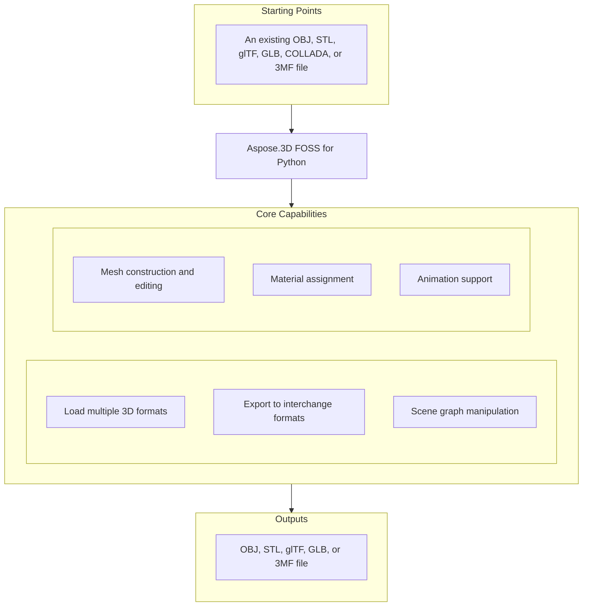

# Aspose.3D FOSS for Python

[](https://pypi.org/project/aspose-3d-foss/)  [](LICENSE) [](https://github.com/aspose-3d-foss/Aspose.3D-FOSS-for-Python/graphs/contributors)

[](https://products.aspose.org/3d/python/)

Aspose.3D FOSS for Python is a Python library for working with 3D files, supporting formats such as `.obj`, `.stl`, `.gltf`, `.glb`, `.dae`, `.3mf`, and `.fbx`. It enables developers to create, read, convert, and inspect 3D scenes using classes like `Scene`, `Node`, `Transform`, `Entity`, `Mesh`, and shading materials. Users can build scenes programmatically, attach geometry and materials to nodes, and save the results to disk or in-memory streams. The library is suitable for Python developers building tools for 3D content processing, CAD visualization, or game asset pipelines.

## Navigation

- [At a Glance](#at-a-glance)
- [Key Capabilities](#key-capabilities)
- [Installation](#installation)
- [Dependencies](#dependencies)
- [Quick Start](#quick-start)
- [Additional Examples](#additional-examples)
- [API Reference](#api-reference)
- [Documentation & Resources](#documentation--resources)
- [Scope and Limitations](#scope-and-limitations)
- [Development and Testing](#development-and-testing)
- [License](#license)

## At a Glance



## Key Capabilities

- **Load multiple 3D formats.** Load OBJ, STL, glTF, GLB, COLLADA, and 3MF files using `Scene.open`() with automatic format detection from the file extension or an explicit `FileFormat` instance.
- **Export to interchange formats.** Export scenes to OBJ, STL, glTF, GLB, and 3MF formats using `Scene.save`() with dedicated `SaveOptions` subclasses for format-specific settings.
- **Scene graph manipulation.** Manipulate the scene graph by creating child nodes with `Node.create_child_node`(), attaching entities and materials, and inspecting or modifying the `Transform` attached to each node.
- **Mesh construction and editing.** Construct meshes programmatically using `Mesh.control_points` and `Mesh.create_polygon`(), or generate them from parameterized primitives like `Box` and `Sphere` via their `to_mesh()` method.
- **Material assignment.** Assign `LambertMaterial`, `PhongMaterial`, or `PbrMaterial` to nodes and configure diffuse, emissive, metallic, and roughness properties directly.
- **Animation support.** Build keyframe animations using `AnimationClip`, `AnimationNode`, and `KeyframeSequence`, and store skeletal bind-pose data with `Pose`.

## Installation

Install the published package from PyPI (`aspose-3d-foss`, version 26.1.0):

```bash
pip install aspose-3d-foss
```

To work from a source checkout instead, install the clone with pip:

```bash
git clone https://github.com/aspose-3d-foss/Aspose.3D-FOSS-for-Python.git
cd Aspose.3D-FOSS-for-Python
pip install .
```

Verify the install:

```bash
python -c "import aspose.threed"
```

The package supports Python 3.7, 3.8, 3.9, 3.10, 3.11, and 3.12 and declares `python_requires` as `>=3.7`.

## Dependencies

### Required Package Dependencies

No required third-party package dependencies; in `setup.py`, the `install_requires` list is empty.

### Native and System Requirements

- Requires Python 3.7 or later (`python_requires=">=3.7"` in `setup.py`).

### Development Dependencies

- `pytest>=7.0.0` (extra `dev`)

## Quick Start

Import an OBJ file and inspect its geometry by reading the control points and polygons of each entity.

```python
from aspose.threed import Scene
from aspose.threed.entities import Box
from aspose.threed.shading import LambertMaterial
from aspose.threed.utilities import Vector3

scene = Scene()
box = Box(length=2.0, width=1.0, height=1.0)
material = LambertMaterial()
material.diffuse_color = Vector3(0.2, 0.6, 0.9)

scene.root_node.create_child_node("Crate", entity=box.to_mesh(), material=material)
scene.save("crate.gltf")
```

Build a 3D scene from scratch by creating a sphere entity with a PBR material and saving it as an STL file.

```python
from aspose.threed import Scene
from aspose.threed.entities import Sphere
from aspose.threed.shading import PbrMaterial
from aspose.threed.utilities import Vector3

scene = Scene()
sphere = Sphere()
material = PbrMaterial(albedo=Vector3(0.8, 0.1, 0.1))
material.metallic_factor = 0.9
material.roughness_factor = 0.2

scene.root_node.create_child_node("Ball", entity=sphere.to_mesh(), material=material)
scene.save("ball.stl")
```

## Additional Examples

More real, verified snippets are collected below, each demonstrating one operation without obscuring the primary installation and quick-start path.

### Construct a mesh vertex by vertex, attach a PBR material, write the scene to an in-memory glTF stream, and read the exported material back out of the glTF JSON

```python
import io
import json
from aspose.threed import Scene, FileFormat
from aspose.threed.entities import Mesh
from aspose.threed.utilities import Vector3, Vector4
from aspose.threed.formats.gltf import GltfSaveOptions
from aspose.threed.shading import PbrMaterial

scene = Scene()
mesh = Mesh("TestMesh")
mesh.control_points.add(Vector4(0.0, 0.0, 0.0, 1.0))
mesh.control_points.add(Vector4(1.0, 0.0, 0.0, 1.0))
mesh.control_points.add(Vector4(0.0, 1.0, 0.0, 1.0))
mesh.create_polygon(0, 1, 2)

albedo = Vector3(0.8, 0.2, 0.3)
material = PbrMaterial("RedMaterial", albedo)
material.metallic_factor = 0.5
material.roughness_factor = 0.7

node = scene.root_node.create_child_node("TestNode")
node.entity = mesh
node.material = material

stream = io.BytesIO()
# Pass the detected FileFormat into the constructor explicitly: unlike
# StlFormat, GltfFormat.create_save_options() does not set file_format on the
# options it returns, and a bare stream (no filename) gives scene.save()
# nothing else to detect the format from.
options = GltfSaveOptions(FileFormat.get_format_by_extension(".gltf"))
options.binary_mode = False
scene.save(stream, options)

stream.seek(0)
gltf_data = json.loads(stream.read().decode("utf-8"))
print(gltf_data["materials"][0]["pbrMetallicRoughness"])
```

<details>
<summary>View Additional Examples</summary>

### Build a triangle mesh and export it to ASCII STL using a `StringIO` stream

```python
import io
from aspose.threed import Scene, FileFormat
from aspose.threed.entities import Mesh
from aspose.threed.utilities import Vector4

scene = Scene()
mesh = Mesh("triangle")
mesh.control_points.add(Vector4(0.0, 0.0, 0.0, 1.0))
mesh.control_points.add(Vector4(1.0, 0.0, 0.0, 1.0))
mesh.control_points.add(Vector4(1.0, 1.0, 0.0, 1.0))
mesh.create_polygon(0, 1, 2)

node = scene.root_node.create_child_node("triangle_node")
node.entity = mesh

stream = io.StringIO()
# Use FileFormat.get_format_by_extension(...).create_save_options() rather than
# StlSaveOptions() directly: a default-constructed options object has no
# file_format set, and scene.save() cannot infer the format from a bare stream
# (only filename-based saves fall back to extension detection).
options = FileFormat.get_format_by_extension(".stl").create_save_options()
options.binary_mode = False
scene.save(stream, options)
print(stream.getvalue())
```

### Convert a `Box` primitive to a `Mesh` and inspect the number of control points

```python
from aspose.threed.entities import Box

box = Box(10, 20, 30)
mesh = box.to_mesh()
print(f"Control points: {len(mesh.control_points)}")
```

### Construct a cube mesh and export it to 3MF using a `BytesIO` stream

```python
import io
from aspose.threed import Scene
from aspose.threed.entities import Mesh
from aspose.threed.utilities import Vector4
from aspose.threed.formats import ThreeMfSaveOptions

scene = Scene()
mesh = Mesh("cube")
for point in [
    Vector4(0, 0, 0, 1), Vector4(1, 0, 0, 1), Vector4(1, 1, 0, 1), Vector4(0, 1, 0, 1),
    Vector4(0, 0, 1, 1), Vector4(1, 0, 1, 1), Vector4(1, 1, 1, 1), Vector4(0, 1, 1, 1),
]:
    mesh.control_points.add(point)

mesh.create_polygon(0, 1, 2)
mesh.create_polygon(0, 2, 3)
mesh.create_polygon(4, 7, 6)
mesh.create_polygon(4, 6, 5)
mesh.create_polygon(0, 4, 5)
mesh.create_polygon(0, 5, 1)
mesh.create_polygon(2, 6, 7)
mesh.create_polygon(2, 7, 3)
mesh.create_polygon(0, 3, 7)
mesh.create_polygon(0, 7, 4)
mesh.create_polygon(1, 5, 6)
mesh.create_polygon(1, 6, 2)

node = scene.root_node.create_child_node("cube")
node.entity = mesh

stream = io.BytesIO()
options = ThreeMfSaveOptions()
options.enable_compression = False
scene.save(stream, options)
```


More real, verified snippets are collected below, each demonstrating one operation without
obscuring the primary installation and quick-start path.

</details>

## API Reference

The `aspose.threed.Scene` class serves as the primary entry point for loading, saving, and manipulating 3D scenes. It manages a hierarchy of `Node` objects, each of which can contain geometry, materials, and animation data.

The verified public surface has 337 types.

<details>
<summary>View the Complete Public API Surface</summary>

### Core API

| Class | Description |
| --- | --- |
| `A3DObject` | A3DObject serves as the base class for all 3D objects in Aspose.3D FOSS for Python, providing common functionality such as property management and naming. |
| `AnimationChannel` | AnimationChannel represents a single animated property channel, storing keyframe sequences and default values for interpolation. |
| `AnimationClip` | AnimationClip defines a time-bounded animation sequence containing multiple animation nodes and supporting description metadata. |
| `AnimationNode` | AnimationNode organizes animation channels and sub-animations, enabling hierarchical animation structures within a scene. |
| `ArrayListAdapter` | Adapter class that wraps List[T] and implements IArrayList[T]. |
| `AssetInfo` | AssetInfo stores metadata about a 3D asset such as author, creation time, coordinate system, and unit scale factor. |
| `Axis` | The coordinate axis. |
| `AxisSystem` | Axis system is an combination of coordinate system, up vector and front vector. |
| `BindPoint` | BindPoint associates animation channels with specific properties of an object, enabling targeted animation binding. |
| `BonePose` | BonePose captures the transformation matrix and local orientation of a bone during skeletal animation. |
| `BoundingBox2D` | The axis-aligned bounding box for Vector2 |
| `BoundingBoxExtent` | The extent of the bounding box |
| `Box` | Box is a primitive shape defined by length, height, and segment counts for mesh generation. |
| `Camera` | Camera represents a viewing frustum in the scene, supporting perspective or orthographic projection settings. |
| `Circle` | Circle is a planar primitive shape defined by radius and segment count for smooth rendering. |
| `ComposeOrder` | The order to compose transform matrix |
| `CoordinateSystem` | The left handed or right handed coordinate system. |
| `Curve` | Curve is an entity that represents a parametric curve in 3D space, typically used for path definitions. |
| `CustomObject` | CustomObject allows users to define and manage their own custom 3D object types within the scene. |
| `Cylinder` | Cylinder is a primitive shape defined by radius, height, and segment counts for top, bottom, and side. |
| `Dish` | Dish is a primitive shape representing a spherical cap, defined by inner and outer radii and segment counts. |
| `Ellipse` | Ellipse is a planar primitive shape defined by major and minor radii and segment count for smooth rendering. |
| `Entity` | Entity is a scene object that can be rendered, such as meshes, curves, or primitives, attached to nodes. |
| `ExportException` | Exceptions when Aspose.3D failed to export the scene to file. |
| `Extrapolation` | Extrapolation defines how animation values are computed beyond the defined keyframe range. |
| `FMatrix4` | Matrix 4x4 with all component in float type |
| `FileContentType` | File content type |
| `FileFormat` | FileFormat provides methods to identify and work with supported 3D file formats by extension. |
| `FileFormatType` | File format type |
| `Frustum` | Frustum is a primitive shape representing a truncated pyramid or cone, often used for view volumes. |
| `Geometry` | Geometry is an entity that defines the shape of a 3D object through vertices, polygons, and materials. |
| `GlobalTransform` | GlobalTransform stores the combined transformation matrix representing an object's position, rotation, and scale in world space. |
| `Group` | A Group represents the logical relationships of Node. |
| `INamedObject` | INamedObject is an interface that provides naming capabilities for scene objects. |
| `IOExtension` | Utilities to write matrix/vector to binary writer |
| `ImageRenderOptions` | ImageRenderOptions controls how a scene is rendered to an image, including resolution and compression settings. |
| `ImportException` | Exception when Aspose.3D failed to open the specified source. |
| `KeyFrame` | KeyFrame represents a single keyframe with a time value and associated value for animation interpolation. |
| `KeyframeSequence` | KeyframeSequence manages a collection of keyframes for a single animated property. |
| `Light` | Light is a camera subclass that defines a light source in the scene with configurable properties. |
| `LinearExtrusion` | LinearExtrusion is an entity that creates a 3D shape by extruding a 2D profile along a straight path. |
| `MathUtils` | A set of useful mathematical utilities. |
| `Mesh` | Mesh is a geometry subclass that stores vertices, polygons, and materials for rendering. |
| `Node` | Node is a scene object that holds transformation and can contain child nodes and entities. |
| `ParseException` | Exception when Aspose.3D failed to parse the input. |
| `Plane` | Plane is a primitive shape representing an infinite or bounded flat surface. |
| `PolygonBuilder` | PolygonBuilder provides utilities for constructing polygonal meshes programmatically. |
| `Pose` | Pose represents a specific configuration of a skeleton, including bone transformations. |
| `Primitive` | Primitive is a geometry subclass that provides built-in shapes such as box, cylinder, and sphere. |
| `Property` | Property represents a named value that can be attached to scene objects for customization. |
| `PropertyCollection` | PropertyCollection manages a set of properties associated with a scene object. |
| `PropertyFlags` | Property's flags |
| `Rect` | A class to represent the rectangle |
| `RelativeRectangle` | Relative rectangle |
| `RotationOrder` | The order controls which rx ry rz are applied in the transformation matrix. |
| `Scene` | Scene is the top-level container for all 3D objects, animations, and assets in Aspose.3D FOSS for Python. |
| `SceneObject` | SceneObject is the base class for all objects that can be placed within a scene. |
| `SemanticAttribute` | Allow user to use their own structure for static declaration of VertexDeclaration |
| `Sphere` | The Sphere class represents a parametric sphere primitive that can be converted to a mesh using its to_mesh method. |
| `Transform` | The Transform class encapsulates transformation properties such as translation, rotation, and scaling for 3D objects. |
| `TransformBuilder` | The TransformBuilder is used to build transform matrix by a chain of transformations. |
| `TrialException` | This is raised in Scene.Open/Scene.Save when no licenses are applied. |
| `Vertex` | Vertex reference, used to access the raw vertex in TriMesh. |
| `VertexDeclaration` | The declaration of a custom defined vertex's structure |
| `VertexField` | Vertex's field memory layout description. |
| `VertexFieldDataType` | Vertex field's data type |
| `VertexFieldSemantic` | The semantic of the vertex field |
| `Bone` | The Bone class represents a bone in a skeletal animation system, including its transform and associated weights. |
| `BoneLinkMode` | The BoneLinkMode enumeration defines how a bone is linked to its parent in a hierarchy during skinning. |
| `Deformer` | The Deformer class serves as a base for mesh deformation mechanisms such as skinning and morphing. |
| `MorphTargetChannel` | The MorphTargetChannel class controls the influence of morph targets on a mesh through weighted blending. |
| `MorphTargetDeformer` | The MorphTargetDeformer class applies morph target animations to a mesh by combining multiple shape targets. |
| `SkinDeformer` | The SkinDeformer class implements skeletal skinning by associating bones with mesh vertices and their weights. |
| `ApertureMode` | Camera aperture modes. |
| `BooleanOperand` | This class encapsulates the transformed mesh as Boolean operation's operand. |
| `BooleanOperation` | The BooleanOperation class performs boolean operations such as union, intersection, and difference on 3D geometries. |
| `BooleanOperator` | Boolean operator allows you to apply Boolean operation on two IMeshConvertible instances. |
| `CompositeCurve` | A CompositeCurve is consisting of several curve segments. |
| `CurveDimension` | The CurveDimension enumeration indicates whether a curve is two-dimensional or three-dimensional. |
| `EndPoint` | The end point to trim the curve, can be a parameter value or a Cartesian point. |
| `HalfSpace` | HalfSpace represents a infinity space which is split by a plane, this can be used with BooleanOperator |
| `IIndexedVertexElement` | The IIndexedVertexElement interface defines a vertex element that uses an index buffer to reference vertex data. |
| `IMeshConvertible` | Entities that implemented this interface can be converted to Mesh |
| `IOrientable` | Orientable entities shall implement this interface. |
| `LightType` | Light types. |
| `Line` | A polyline is a path defined by a set of points with control_points, and connected by segments. |
| `MappingMode` | The MappingMode enumeration specifies how texture coordinates are mapped onto a surface. |
| `NurbsCurve` | The NurbsCurve class represents a non-uniform rational B-spline curve defined by control points and knot vectors. |
| `NurbsDirection` | The NurbsDirection class describes the properties of a NURBS curve or surface in a single parametric direction. |
| `NurbsSurface` | The NurbsSurface class represents a NURBS surface defined by control points, knot vectors, and degrees in two directions. |
| `NurbsType` | The NurbsType enumeration specifies the type of NURBS curve or surface being represented. |
| `Patch` | The Patch class represents a parametric surface patch used in geometric modeling. |
| `PatchDirection` | The PatchDirection enumeration indicates the parametric direction of a surface patch. |
| `PatchDirectionType` | The PatchDirectionType enumeration specifies the type of parametric direction for a surface patch. |
| `PointCloud` | The PointCloud class represents a collection of unconnected points in three-dimensional space. |
| `InvalidOperationException` | The InvalidOperationException is raised when an invalid operation is attempted during polygon construction. |
| `PolygonModifier` | The PolygonModifier class provides utilities for modifying polygonal meshes, such as triangulation. |
| `ProjectionType` | Camera's projection types. |
| `Pyramid` | Parameterized pyramid. |
| `RectangularTorus` | Parameterized rectangular torus entity. |
| `ReferenceMode` | The ReferenceMode enumeration defines how geometry references are handled during scene operations. |
| `RevolvedAreaSolid` | RevolvedAreaSolid entity. |
| `RotationMode` | The frustum's rotation mode. |
| `Shape` | Base class for all shape entities. |
| `Skeleton` | The Skeleton is mainly used by CAD software to help designer to manipulate the transformation of skeletal structure, it's usually useless outside the CAD softwares. |
| `SkeletonType` | Skeleton type enum. |
| `SplitMeshPolicy` | Share vertex/control point data between sub-meshes or each sub-mesh has its own compacted data. |
| `SweptAreaSolid` | SweptAreaSolid entity. |
| `TextureMapping` | The TextureMapping class defines how textures are applied to 3D surfaces using UV coordinates. |
| `Torus` | Parameterized torus entity. |
| `TransformedCurve` | TransformedCurve entity. |
| `TriMesh` | TriMesh is a triangle mesh that stores triangles. |
| `TrimmedCurve` | TrimmedCurve entity. |
| `VertexElement` | The VertexElement class is the base for all vertex element types that describe per-vertex attributes. |
| `VertexElementBinormal` | The VertexElementBinormal class stores binormal vectors for each vertex in a mesh. |
| `VertexElementDoublesTemplate` | A helper class for defining concrete implementations. |
| `VertexElementEdgeCrease` | Defines the edge crease values for specified components. |
| `VertexElementFVector` | The VertexElementFVector class represents a vertex element containing floating-point vector data. |
| `VertexElementHole` | Defines the hole information for specified components. |
| `VertexElementIntsTemplate` | A helper class for defining concrete implementations with int data. |
| `VertexElementMaterial` | Defines the material for specified components. |
| `VertexElementNormal` | The VertexElementNormal class stores normal vectors for each vertex in a mesh. |
| `VertexElementPolygonGroup` | Defines the polygon group for specified components. |
| `VertexElementSmoothingGroup` | The VertexElementSmoothingGroup class assigns smoothing group identifiers to mesh faces. |
| `VertexElementSpecular` | Defines the specular color for specified components. |
| `VertexElementTangent` | The VertexElementTangent class stores tangent vectors for each vertex in a mesh. |
| `VertexElementTemplate` | A helper class for defining concrete implementations of vertex elements with typed data. |
| `VertexElementType` | The VertexElementType enumeration identifies the type of vertex element stored in a mesh. |
| `VertexElementUV` | The VertexElementUV class stores texture coordinate pairs for each vertex in a mesh. |
| `VertexElementUserData` | Defines the user data for specified components. |
| `VertexElementVector4` | Defines the vector4 data for specified components. |
| `VertexElementVertexColor` | The VertexElementVertexColor class stores per-vertex color information for a mesh. |
| `VertexElementVertexCrease` | Defines the vertex crease values for specified components. |
| `VertexElementVisibility` | Defines the visibility for specified components. |
| `VertexElementWeight` | Defines the weight for specified components. |
| `A3dwSaveOptions` | Save options for A3DW |
| `AmfSaveOptions` | Save options for AMF |
| `BasicLoadOptions` | Simple LoadOptions subclass for basic loading options. |
| `ColladaLoadOptions` | Load options for Collada |
| `ColladaSaveOptions` | Save options for collada |
| `ColladaTransformStyle` | The node's transformation style of node |
| `Discreet3dsLoadOptions` | Load options for Discreet 3DS |
| `Discreet3dsSaveOptions` | Save options for Discreet 3DS |
| `DracoCompressionLevel` | Compression level for draco file |
| `DracoFormat` | Google Draco format |
| `DracoSaveOptions` | Save options for Draco |
| `Exporter` | The Exporter class provides functionality to save 3D scenes to various file formats. |
| `FbxLoadOptions` | Load options for FBX |
| `FbxSaveOptions` | Save options for FBX |
| `FormatDetector` | The FormatDetector class analyzes file content to determine the appropriate format for loading. |
| `GltfEmbeddedImageFormat` | Embedded image format for GLTF |
| `formats.GltfLoadOptions` | Load options for glTF |
| `formats.GltfSaveOptions` | Save options for glTF |
| `Html5SaveOptions` | Save options for HTML5 |
| `IOConfig` | The IOConfig class holds configuration options for input and output operations in Aspose.3D. |
| `IOService` | The IOService class provides core input and output services for reading and writing 3D data. |
| `Importer` | The Importer class loads 3D scenes from files or streams into memory for manipulation. |
| `JtLoadOptions` | Load options for JT |
| `LoadOptions` | LoadOptions provides configuration options for loading 3D scenes and inherits from IOConfig. |
| `Microsoft3MFFormat` | Microsoft 3MF format |
| `Microsoft3MFSaveOptions` | Save options for Microsoft 3MF |
| `formats.ObjLoadOptions` | Load options for OBJ |
| `formats.ObjSaveOptions` | Save options for OBJ |
| `PdfFormat` | Adobe's Portable Document Format |
| `PdfLightingScheme` | Lighting scheme for PDF export |
| `PdfLoadOptions` | Load options for PDF |
| `PdfRenderMode` | Render mode for PDF export |
| `PdfSaveOptions` | Save options for PDF |
| `Plugin` | Plugin is an abstract base class that defines the interface for format plugins in Aspose.3D. |
| `PlyFormat` | PLY format |
| `PlyLoadOptions` | Load options for PLY |
| `PlySaveOptions` | Save options for PLY |
| `RvmFormat` | RVM format |
| `RvmLoadOptions` | Load options for RVM |
| `RvmSaveOptions` | Save options for RVM |
| `SaveOptions` | SaveOptions provides configuration options for saving 3D scenes and inherits from IOConfig. |
| `formats.StlLoadOptions` | Load options for STL |
| `formats.StlSaveOptions` | Save options for STL |
| `ThreeMfFormat` | ThreeMfFormat represents the 3MF file format and provides methods to detect, import, and export 3MF files. |
| `ThreeMfLoadOptions` | ThreeMfLoadOptions provides configuration options specific to loading 3MF files and extends LoadOptions. |
| `ThreeMfSaveOptions` | ThreeMfSaveOptions provides configuration options specific to saving 3MF files and extends SaveOptions. |
| `U3dLoadOptions` | Load options for U3D |
| `U3dSaveOptions` | Save options for U3D |
| `UsdSaveOptions` | Save options for USD |
| `XLoadOptions` | Load options for X format |
| `ColladaExporter` | ColladaExporter handles exporting 3D scenes to the COLLADA file format. |
| `ColladaFormat` | ColladaFormat represents the COLLADA file format and provides methods to detect, import, and export COLLADA files. |
| `ColladaFormatDetector` | ColladaFormatDetector identifies COLLADA files by examining their content. |
| `ColladaImporter` | ColladaImporter handles importing 3D scenes from the COLLADA file format. |
| `ColladaPlugin` | ColladaPlugin provides format support for COLLADA files by implementing the Plugin interface. |
| `FbxExporter` | FbxExporter handles exporting 3D scenes to the FBX file format. |
| `FbxFormat` | FbxFormat represents the FBX file format and provides methods to detect, import, and export FBX files. |
| `FbxFormatDetector` | FbxFormatDetector identifies FBX files by examining their content. |
| `FbxImporter` | FbxImporter handles importing 3D scenes from the FBX file format. |
| `FbxPlugin` | FbxPlugin provides format support for FBX files by implementing the Plugin interface. |
| `BinaryTokenizer` | BinaryTokenizer reads and tokenizes binary FBX files. |
| `binary_tokenizer.Token` | Token represents a single token extracted by the BinaryTokenizer during FBX parsing. |
| `binary_tokenizer.TokenType` | TokenType defines the categories of tokens used in binary FBX files. |
| `FbxElement` | FbxElement represents a single element in the hierarchical structure of an FBX file. |
| `FbxParser` | FbxParser reads and interprets the structure of FBX files. |
| `FbxScope` | FbxScope defines a scope or namespace within the FBX file structure. |
| `FbxTokenizer` | FbxTokenizer reads and tokenizes text-based FBX files. |
| `tokenizer.Token` | Token represents a single token extracted by the FbxTokenizer during FBX parsing. |
| `tokenizer.TokenType` | TokenType defines the categories of tokens used in text-based FBX files. |
| `GltfExporter` | GltfExporter handles exporting 3D scenes to the glTF file format. |
| `GltfFormat` | GltfFormat represents the glTF file format and provides methods to detect, import, and export glTF files. |
| `GltfFormatDetector` | GltfFormatDetector identifies glTF files by examining their content. |
| `GltfImporter` | GltfImporter handles importing 3D scenes from the glTF file format. |
| `gltf.GltfLoadOptions` | GltfLoadOptions provides configuration options specific to loading glTF files and extends LoadOptions. |
| `GltfPlugin` | GltfPlugin provides format support for glTF files by implementing the Plugin interface. |
| `gltf.GltfSaveOptions` | GltfSaveOptions provides configuration options specific to saving glTF files and extends SaveOptions. |
| `ObjExporter` | ObjExporter handles exporting 3D scenes to the OBJ file format. |
| `ObjFormat` | ObjFormat represents the OBJ file format and provides methods to detect, import, and export OBJ files. |
| `ObjFormatDetector` | ObjFormatDetector identifies OBJ files by examining their content. |
| `ObjImporter` | ObjImporter handles importing 3D scenes from the OBJ file format. |
| `obj.ObjLoadOptions` | ObjLoadOptions provides configuration options specific to loading OBJ files and extends LoadOptions. |
| `ObjPlugin` | ObjPlugin provides format support for OBJ files by implementing the Plugin interface. |
| `obj.ObjSaveOptions` | ObjSaveOptions provides configuration options specific to saving OBJ files and extends SaveOptions. |
| `StlExporter` | StlExporter handles exporting 3D scenes to the STL file format. |
| `StlFormat` | StlFormat represents the STL file format and provides methods to detect, import, and export STL files, including support for binary and ASCII representations. |
| `StlFormatDetector` | StlFormatDetector identifies whether a given input stream or file contains an STL file by inspecting its content. |
| `StlImporter` | StlImporter reads STL files and converts their content into a scene graph that Aspose.3D can process. |
| `stl.StlLoadOptions` | StlLoadOptions controls how STL files are loaded, including options to scale the geometry and flip the coordinate system. |
| `StlPlugin` | StlPlugin provides a unified interface for loading and saving STL files, including access to format-specific importers, exporters, and options. |
| `stl.StlSaveOptions` | StlSaveOptions controls how STL files are saved, including options to use binary format, scale the geometry, and flip the coordinate system. |
| `ThreeMfExporter` | ThreeMfExporter writes scene graphs to 3MF files, preserving geometry, materials, and metadata according to the 3MF specification. |
| `ThreeMfFormatDetector` | ThreeMfFormatDetector determines whether a given input stream or file contains a 3MF file by inspecting its content. |
| `ThreeMfImporter` | ThreeMfImporter reads 3MF files and converts their content into a scene graph that Aspose.3D can process. |
| `ThreeMfPlugin` | ThreeMfPlugin provides a unified interface for loading and saving 3MF files, including access to format-specific importers, exporters, and options. |
| `ArbitraryProfile` | This class allows you to construct a 2D profile directly from arbitrary curve. |
| `CShape` | IFC compatible C-shape profile that defined by parameters. |
| `CenterLineProfile` | IFC compatible center line profile. |
| `CircleShape` | IFC compatible circle profile. |
| `EllipseShape` | IFC compatible ellipse profile. |
| `FontFile` | Font file contains definitions for glyphs, this is used to create text profile. |
| `HShape` | IFC compatible H-shape profile. |
| `HollowCircleShape` | IFC compatible hollow circle profile. |
| `HollowRectangleShape` | IFC compatible hollow rectangular shape with both inner/outer rounding corners. |
| `LShape` | IFC compatible L-shape profile that defined by parameters. |
| `MirroredProfile` | IFC compatible mirror profile. |
| `ParameterizedProfile` | The base class of all parameterized profiles. |
| `Profile` | 2D Profile in xy plane. |
| `RectangleShape` | IFC compatible rectangle profile. |
| `TShape` | IFC compatible T-shape defined by parameters. |
| `Text` | Text profile, this profile describes contours using font and text. |
| `TrapeziumShape` | IFC compatible Trapezium shape defined by parameters. |
| `UShape` | IFC compatible U-shape defined by parameters. |
| `ZShape` | IFC compatible Z-shape profile that defined by parameters. |
| `BlendFactor` | Blend factor specify pixel arithmetic. |
| `CompareFunction` | Compare function for depth/stencil testing. |
| `CubeFace` | Cube face enumeration. |
| `CullFaceMode` | Cull face mode for face culling. |
| `DescriptorSetUpdater` | Descriptor set updater for shader resources. |
| `DrawOperation` | Draw operation type. |
| `DriverException` | Exception thrown when rendering driver fails. |
| `EntityRenderer` | Base class for rendering entities. |
| `EntityRendererFeatures` | Features supported by an entity renderer. |
| `EntityRendererKey` | The key of registered entity renderer. |
| `FrontFace` | Front face winding order. |
| `GLSLSource` | GLSL shader source. |
| `IBuffer` | Interface for vertex/index buffer. |
| `ICommandList` | Interface for command list. |
| `IDescriptorSet` | Interface for descriptor set. |
| `IIndexBuffer` | Interface for index buffer. |
| `IPipeline` | Interface for graphics pipeline. |
| `IRenderQueue` | Interface for render queue. |
| `IRenderTarget` | Interface for render target. |
| `IRenderTexture` | Interface for render texture. |
| `IRenderWindow` | Interface for render window. |
| `ITexture1D` | Interface for 1D texture. |
| `ITexture2D` | Interface for 2D texture. |
| `ITextureCodec` | Interface for texture codec. |
| `ITextureCubemap` | Interface for cubemap texture. |
| `ITextureDecoder` | Interface for texture decoder. |
| `ITextureEncoder` | Interface for texture encoder. |
| `ITextureUnit` | Interface for texture unit. |
| `IVertexBuffer` | Interface for vertex buffer. |
| `IndexDataType` | Data type for indices. |
| `InitializationException` | Exception thrown when rendering initialization fails. |
| `PixelFormat` | Pixel format for render targets. |
| `PixelMapMode` | Pixel mapping mode. |
| `PixelMapping` | Pixel mapping configuration. |
| `PolygonMode` | Polygon rendering mode. |
| `PostProcessing` | Post-processing effect. |
| `PresetShaders` | Predefined shaders. |
| `PushConstant` | Push constant for shaders. |
| `RenderFactory` | RenderFactory creates all resources that represented in rendering pipeline. |
| `RenderParameters` | Parameters for rendering. |
| `RenderQueueGroupId` | Render queue group ID. |
| `RenderResource` | Base class for render resources. |
| `RenderStage` | Render stage in the pipeline. |
| `RenderState` | Render state configuration. |
| `Renderer` | The context about renderer. |
| `RendererVariableManager` | Manages renderer variables. |
| `SPIRVSource` | SPIRV shader source. |
| `ShaderException` | Exception thrown when shader compilation/linking fails. |
| `ShaderProgram` | Shader program. |
| `ShaderSet` | Set of shaders for rendering. |
| `ShaderSource` | Shader source code. |
| `ShaderStage` | Shader stage. |
| `ShaderVariable` | Shader variable. |
| `StencilAction` | Stencil action. |
| `StencilState` | Stencil state configuration. |
| `TextureCodec` | Texture codec. |
| `TextureData` | Texture data. |
| `TextureType` | Texture type. |
| `Viewport` | Viewport for rendering. |
| `WindowHandle` | Window handle for render window. |
| `AlphaSource` | Source of alpha channel for textures. |
| `LambertMaterial` | LambertMaterial defines a simple shading model with ambient, diffuse, emissive, and transparency properties for 3D surfaces. |
| `Material` | Material represents a surface appearance definition in a 3D scene, supporting texture assignment and basic rendering properties. |
| `PbrMaterial` | PbrMaterial defines a physically based rendering material model with albedo, metallic, roughness, and occlusion properties. |
| `PbrSpecularMaterial` | Material for physically based rendering based on diffuse color/specular/glossiness. |
| `PhongMaterial` | PhongMaterial extends LambertMaterial with specular reflection properties to simulate shiny surfaces. |
| `ShaderMaterial` | A shader material allows to describe the material by external rendering engine or shader language. |
| `ShaderTechnique` | A technique in shader material describes the concrete rendering details. |
| `Texture` | This class defines the texture from an external file. |
| `TextureBase` | Base class for all texture types. |
| `TextureFilter` | Texture filter type. |
| `TextureSlot` | Texture slot name. |
| `WrapMode` | Wrap mode for texture coordinates. |
| `BoundingBox` | BoundingBox describes the axis-aligned bounding volume of a 3D object using its minimum and maximum corner points. |
| `FVector2` | FVector2 represents a two-dimensional vector of single-precision floating-point numbers. |
| `FVector3` | FVector3 represents a three-dimensional vector of single-precision floating-point numbers. |
| `FVector4` | FVector4 represents a four-dimensional vector of single-precision floating-point numbers. |
| `FileSystem` | File system encapsulation. |
| `Matrix4` | Matrix4 represents a 4x4 matrix of single-precision floating-point numbers used for 3D transformations. |
| `Quaternion` | Quaternion represents a four-element structure used to describe 3D rotations without gimbal lock. |
| `Vector2` | Vector2 represents a two-dimensional vector of double-precision floating-point numbers. |
| `Vector3` | Vector3 represents a three-dimensional vector of double-precision floating-point numbers. |
| `Vector4` | Vector4 represents a four-dimensional vector of double-precision floating-point numbers. |
| `Watermark` | Utility to encode/decode blind watermark to/from a mesh. |

#### Enumerations

| Enumeration | Description |
| --- | --- |
| `ExtrapolationType` | ExtrapolationType is an enumeration specifying the behavior of animation extrapolation beyond keyframes. |
| `Interpolation` | Interpolation is an enumeration specifying how values are interpolated between keyframes. |
| `PoseType` | PoseType is an enumeration that categorizes the purpose of a pose in animation. |
| `StepMode` | The StepMode enumeration defines the step mode options used when importing or exporting STEP files. |
| `WeightedMode` | The WeightedMode enumeration specifies how weights are applied during morph target deformation operations. |

#### Detailed Member Reference

### Scene

The `aspose.threed.Scene` class provides methods such as `Scene.open`() and `Scene.save`() to load and write 3D files, and exposes properties like `Scene.root_node`, `Scene.animation_clips`, and `Scene.poses` to access the scene graph and animation data.

- `animation_clips`: Defined as `def animation_clips(self) -> List['AnimationClip']`.
- `asset_info`: Defined as `def asset_info(self) -> AssetInfo`.
- `clear`: Defined as `def clear(self)`.
- `create_animation_clip`: Defined as `def create_animation_clip(self, name: str) -> 'AnimationClip'`.
- `current_animation_clip`: Defined as `def current_animation_clip(self) -> Optional['AnimationClip']`.
- `from_file`: Defined as `def from_file(file_name: str)`.
- `get_animation_clip`: Defined as `def get_animation_clip(self, name: str) -> Optional['AnimationClip']`.
- `library`: Defined as `def library(self) -> List[CustomObject]`.
- `open`: Defined as `def open(self, file_or_stream, options=None)`.
- `poses`: Defined as `def poses(self) -> List`.
- `render`: Defined as `def render(self, camera, file_name_or_bitmap, size=None, format=None, options=None)`.
- `root_node`: Defined as `def root_node(self)`.
- `save`: Defined as `def save(self, file_or_stream, format_or_options=None)`.
- `sub_scenes`: Defined as `def sub_scenes(self) -> List['Scene']`.

### Node

The `aspose.threed.Node` class represents an element in the scene hierarchy, supporting operations like `Node.create_child_node`() and `Node.add_entity`() to build the scene graph, and properties such as `Node.transform`, `Node.material`, and `Node.global_transform` to control its position and appearance.

- `add_child_node`: Defined as `def add_child_node(self, node: 'Node')`.
- `add_entity`: Defined as `def add_entity(self, entity: 'Entity')`.
- `asset_info`: Defined as `def asset_info(self)`.
- `child_nodes`: Defined as `def child_nodes(self) -> List['Node']`.
- `create_child_node`: Defined as `def create_child_node(self, node_name: Optional[str]=None, entity=None, material=None) -> 'Node'`.
- `entities`: Defined as `def entities(self) -> List['Entity']`.
- `entity`: Defined as `def entity(self) -> Optional['Entity']`.
- `evaluate_global_transform`: Defined as `def evaluate_global_transform(self, with_geometric_transform: bool) -> Matrix4`.
- `excluded`: Defined as `def excluded(self) -> bool`.
- `get_bounding_box`: Defined as `def get_bounding_box(self) -> BoundingBox`.
- `get_child`: Defined as `def get_child(self, index_or_name)`.
- `get_entity`: Defined as `def get_entity(self, entity_type: type)`.
- `global_transform`: Defined as `def global_transform(self) -> GlobalTransform`.
- `material`: Defined as `def material(self) -> Optional['Material']`.
- `materials`: Defined as `def materials(self) -> List['Material']`.
- `merge`: Defined as `def merge(self, node: 'Node')`.
- `meta_datas`: Defined as `def meta_datas(self) -> List`.
- `parent_node`: Defined as `def parent_node(self) -> Optional['Node']`.
- `select_objects`: Defined as `def select_objects(self, path: str)`.
- `select_single_object`: Defined as `def select_single_object(self, path: str)`.
- `transform`: Defined as `def transform(self) -> Transform`.
- `visible`: Defined as `def visible(self) -> bool`.

### Mesh

The `aspose.threed.Mesh` class stores geometric data including control points and polygons, and provides methods like `Mesh.create_polygon`() and `Mesh.triangulate`() to modify the mesh, as well as properties such as `Mesh.control_points` and `Mesh.polygon_count` to inspect its structure.

- `control_points`: Defined as `def control_points(self) -> ArrayListAdapter[Vector4]`.
- `create_polygon`: Defined as `def create_polygon(self, *args)`.
- `difference`: Defined as `def difference(a: 'Mesh', b: 'Mesh') -> 'Mesh'`.
- `do_boolean`: Defined as `def do_boolean(op: BooleanOperation, a: 'Mesh', transform_a: Optional[Matrix4], b: 'Mesh', transform_b: Optional[Matrix4]) -> 'Mesh'`.
- `edges`: Defined as `def edges(self) -> ArrayListAdapter[int]`.
- `get_bounding_box`: Defined as `def get_bounding_box(self)`.
- `get_entity_renderer_key`: Defined as `def get_entity_renderer_key(self)`.
- `get_polygon_size`: Defined as `def get_polygon_size(self, index: int) -> int`.
- `intersect`: Defined as `def intersect(a: 'Mesh', b: 'Mesh') -> 'Mesh'`.
- `is_manifold`: Defined as `def is_manifold(self) -> bool`.
- `optimize`: Defined as `def optimize(self, vertex_elements: bool=False, tolerance_control_point: float=1e-09, tolerance_normal: float=1e-09, tolerance_uv: float=1e-09) -> 'Mesh'`.
- `polygon_count`: Defined as `def polygon_count(self) -> int`.
- `polygons`: Defined as `def polygons(self) -> List[List[int]]`.
- `to_mesh`: Defined as `def to_mesh(self) -> 'Mesh'`.
- `triangulate`: Defined as `def triangulate(self) -> 'Mesh'`.
- `union`: Defined as `def union(a: 'Mesh', b: 'Mesh') -> 'Mesh'`.

### Primitive

The `aspose.threed.Primitive` class serves as a base for built-in geometric shapes and supports conversion to `Mesh` via `Primitive.to_mesh`(), while exposing properties such as `Primitive.cast_shadows` and `Primitive.receive_shadows` to control rendering behavior.

- `cast_shadows`: Defined as `def cast_shadows(self) -> bool`.
- `receive_shadows`: Defined as `def receive_shadows(self) -> bool`.
- `to_mesh`: Defined as `def to_mesh(self)`.

### shading

The `aspose.threed.shading` module provides classes and utilities for defining material appearance, including properties like `diffuse_color`, `metallic_factor`, and `roughness_factor` that control how surfaces interact with light.

### AnimationClip

The `aspose.threed.AnimationClip` class defines a sequence of animation keyframes, exposing properties such as `AnimationClip.name`, `AnimationClip.description`, and `AnimationClip.animations` to manage animation metadata and structure.

- `animations`: Defined as `def animations(self) -> List['AnimationNode']`.
- `create_animation_node`: Defined as `def create_animation_node(self, node_name: str) -> 'AnimationNode'`.
- `description`: Defined as `def description(self) -> str`.
- `name`: Defined as `def name(self) -> str`.
- `properties`: Defined as `def properties(self)`.
- `start`: Defined as `def start(self) -> float`.
- `stop`: Defined as `def stop(self) -> float`.

### AnimationNode

The `aspose.threed.AnimationNode` class represents a node within an animation clip and supports operations like `AnimationClip.create_animation_node`() to build animation hierarchies for transforming entities over time.

- `bind_points`: Defined as `def bind_points(self) -> List['BindPoint']`.
- `create_bind_point`: Defined as `def create_bind_point(self, obj: 'A3DObject', prop_name: str) -> 'BindPoint'`.
- `find_bind_point`: Defined as `def find_bind_point(self, target: 'A3DObject', name: str) -> 'BindPoint'`.
- `get_bind_point`: Defined as `def get_bind_point(self, target: 'A3DObject', prop_name: str, create: bool) -> 'BindPoint'`.
- `get_keyframe_sequence`: Defined as `def get_keyframe_sequence(self, target: 'A3DObject', prop_name: str, channel_name: str=None, create: bool=True) -> 'KeyframeSequence'`.
- `name`: Defined as `def name(self) -> str`.
- `properties`: Defined as `def properties(self)`.
- `sub_animations`: Defined as `def sub_animations(self) -> List['AnimationNode']`.

### KeyframeSequence

The `aspose.threed.KeyframeSequence` class holds a series of keyframes that define how a property changes over time, supporting operations such as member add to append keyframes and member `key_frames` to access the underlying data.

- `add`: Defined as `def add(self, time: float, value: float, interpolation: Interpolation=Interpolation.LINEAR)`.
- `bind_point`: Defined as `def bind_point(self) -> 'BindPoint'`.
- `key_frames`: Defined as `def key_frames(self) -> List['KeyFrame']`.
- `name`: Defined as `def name(self) -> str`.
- `post_behavior`: Defined as `def post_behavior(self) -> Extrapolation`.
- `pre_behavior`: Defined as `def pre_behavior(self) -> Extrapolation`.
- `properties`: Defined as `def properties(self)`.
- `reset`: Defined as `def reset(self)`.

### Pose

The `aspose.threed.Pose` class represents a transformation pose used in animation and skinning, exposing properties such as member `bone_poses` to retrieve the bone transformations.

- `add_bone_pose`: Defined as `def add_bone_pose(self, node: Node, matrix: Matrix4, local_matrix: bool=False)`.
- `bone_poses`: Defined as `def bone_poses(self)`.
- `pose_type`: Defined as `def pose_type(self) -> PoseType`.

### FileFormat

The `aspose.threed.FileFormat` class provides utilities for working with file formats, including member `get_format_by_extension()` to identify supported formats and member extensions to list all supported extensions.

- `FBX7400ASCII`: Defined as `def FBX7400ASCII()`.
- `GLTF2`: Defined as `def GLTF2()`.
- `MICROSOFT_3MF_FORMAT`: Defined as `def MICROSOFT_3MF_FORMAT()`.
- `WAVEFRONT_OBJ`: Defined as `def WAVEFRONT_OBJ()`.
- `can_export`: Defined as `def can_export(self) -> bool`.
- `can_import`: Defined as `def can_import(self) -> bool`.
- `content_type`: Defined as `def content_type(self) -> str`.
- `create_load_options`: Defined as `def create_load_options(self) -> 'LoadOptions'`.
- `create_save_options`: Defined as `def create_save_options(self) -> 'SaveOptions'`.
- `detect`: Defined as `def detect(stream: 'io._IOBase'=None, file_name: Optional[str]=None) -> Optional['FileFormat']`.
- `extension`: Defined as `def extension(self) -> str`.
- `extensions`: Defined as `def extensions(self) -> List[str]`.
- `file_format_type`: Defined as `def file_format_type(self)`.
- `formats`: Defined as `def formats(self) -> List['FileFormat']`.
- `get_format_by_extension`: Defined as `def get_format_by_extension(extension_name: str) -> Optional['FileFormat']`.
- `version`: Defined as `def version(self) -> str`.

### Transform

The `aspose.threed.Transform` class encapsulates translation, rotation, and scaling, and supports operations like member `set_translation`, `set_rotation`, and `set_scale` to configure the transformation.

- `euler_angles`: Defined as `def euler_angles(self) -> Vector3`.
- `geometric_rotation`: Defined as `def geometric_rotation(self) -> Vector3`.
- `geometric_scaling`: Defined as `def geometric_scaling(self) -> Vector3`.
- `geometric_translation`: Defined as `def geometric_translation(self) -> Vector3`.
- `post_rotation`: Defined as `def post_rotation(self) -> Vector3`.
- `pre_rotation`: Defined as `def pre_rotation(self) -> Vector3`.
- `rotation`: Defined as `def rotation(self) -> Quaternion`.
- `rotation_offset`: Defined as `def rotation_offset(self) -> Vector3`.
- `rotation_pivot`: Defined as `def rotation_pivot(self) -> Vector3`.
- `scaling`: Defined as `def scaling(self) -> Vector3`.
- `scaling_offset`: Defined as `def scaling_offset(self) -> Vector3`.
- `scaling_pivot`: Defined as `def scaling_pivot(self) -> Vector3`.
- `set_euler_angles`: Defined as `def set_euler_angles(self, rx: float, ry: float, rz: float) -> 'Transform'`.
- `set_geometric_rotation`: Defined as `def set_geometric_rotation(self, rx: float, ry: float, rz: float) -> 'Transform'`.
- `set_geometric_scaling`: Defined as `def set_geometric_scaling(self, sx: float, sy: float, sz: float) -> 'Transform'`.
- `set_geometric_translation`: Defined as `def set_geometric_translation(self, x: float, y: float, z: float) -> 'Transform'`.
- `set_post_rotation`: Defined as `def set_post_rotation(self, rx: float, ry: float, rz: float) -> 'Transform'`.
- `set_pre_rotation`: Defined as `def set_pre_rotation(self, rx: float, ry: float, rz: float) -> 'Transform'`.
- `set_rotation`: Defined as `def set_rotation(self, rw: float, rx: float, ry: float, rz: float) -> 'Transform'`.
- `set_scale`: Defined as `def set_scale(self, sx: float, sy: float, sz: float) -> 'Transform'`.
- `set_translation`: Defined as `def set_translation(self, tx: float, ty: float, tz: float) -> 'Transform'`.
- `transform_matrix`: Defined as `def transform_matrix(self) -> Matrix4`.
- `translation`: Defined as `def translation(self) -> Vector3`.

### PolygonBuilder

The `aspose.threed.PolygonBuilder` class simplifies mesh construction by providing methods like member begin and end to define faces and member `add_vertex` to manage vertex data during geometry creation.

- `add_vertex`: Defined as `def add_vertex(self, index: int)`.
- `begin`: Defined as `def begin(self)`.
- `end`: Defined as `def end(self)`.

</details>

## Documentation & Resources

- **[Getting started guide](https://docs.aspose.org/3d/python/)** — The getting started guide covers installation, basic walkthroughs, and feature introductions for Aspose.3D FOSS for Python.
- **[How-to guides & FAQ](https://kb.aspose.org/3d/python/)** — The how-to guides and FAQ provide task-focused answers for common 3D-processing questions encountered while using Aspose.3D FOSS for Python.
- **[Full API reference](https://reference.aspose.org/3d/python/)** — The full API reference offers a complete, browsable reference for all 305 public types in Aspose.3D FOSS for Python. It covers all 337 verified public types; the [API Reference](#api-reference) section above covers the essentials.
- Found a bug or have a feature request? [Open an issue](https://github.com/aspose-3d-foss/Aspose.3D-FOSS-for-Python/issues).

## Scope and Limitations

Aspose.3D FOSS for Python 26.1.0 supports reading and writing OBJ, STL, glTF, and COLLADA files, and provides basic scene graph navigation and mesh inspection capabilities for those formats.

- No file format registers an importer or exporter for PDF, PLY, RVM, U3D, JT, AMF, HTML5, A3DW, USD, or Draco in this build — `PdfSaveOptions`, `PlyLoadOptions`, `DracoSaveOptions`, and similar option classes exist as public types, but `Scene.open`() and `Scene.save`() cannot detect or dispatch any of these extensions and raise a RuntimeError if you try.
- FBX support is experimental: `FbxImporter` has a working tokenizer and parser but no bundled test opens a real `.fbx` fixture through it, and `FbxExporter.save`() and `save_to_stream()` both raise NotImplementedError outright, so FBX is import-only at best.
- COLLADA import works, but COLLADA export is not reachable through `Scene.save`() because `IOService`'s exporter lookup reaches `FbxExporter` before `ColladaExporter`, so the lookup fails before a working `ColladaExporter` is ever consulted.
- Always import a format's load/save options class from its own format submodule, never from the shared top-level `aspose.threed.formats` package — for OBJ, STL, glTF, and COLLADA specifically, the top-level package name resolves to a broken duplicate with no working base class, which format detection silently rejects.
- `Scene.render`() and the entire `aspose.threed.render` module (`Renderer`, `RenderFactory`, `Viewport`, and related classes) raise NotImplementedError, and `Texture` and `TextureBase` raise NotImplementedError on construction, so this library does not render scenes to images or create image-backed textures.
- `Watermark.encode_watermark`() and `decode_watermark()`, every `TransformBuilder` method, `Mesh.do_boolean`() and its Boolean/CSG variants, `NurbsCurve.evaluate`() and `evaluate_at()`, `NurbsSurface.to_mesh`(), `PointCloud.from_geometry`() and `from_geometry_with_density()`, and every `AxisSystem` method raise NotImplementedError.

These limitations don't apply to [Aspose.3D for Python — Enterprise Edition](https://products.aspose.com/3d/python-net/). Aspose.3D FOSS for Python provides open-source 3D processing capabilities, while Aspose.3D commercial edition adds advanced features such as support for additional file formats, enhanced performance, and commercial licensing options.

## Development and Testing

Install the package in editable mode and run the full test suite with unittest, or execute a specific test file directly.

The suite covers 34 test files under `tests/`. Releases run through the [publish workflow](.github/workflows/publish.yml).

```bash
python3 -m pip install -e .
python3 -m unittest discover tests/
```

```bash
python -m unittest tests.test_obj_importer
```

## License

This project is licensed under the [MIT License](LICENSE). The MIT License permits use, copying, modification, distribution, sublicensing, and commercial use, provided its copyright and permission notice are retained. The software is provided without warranty.
