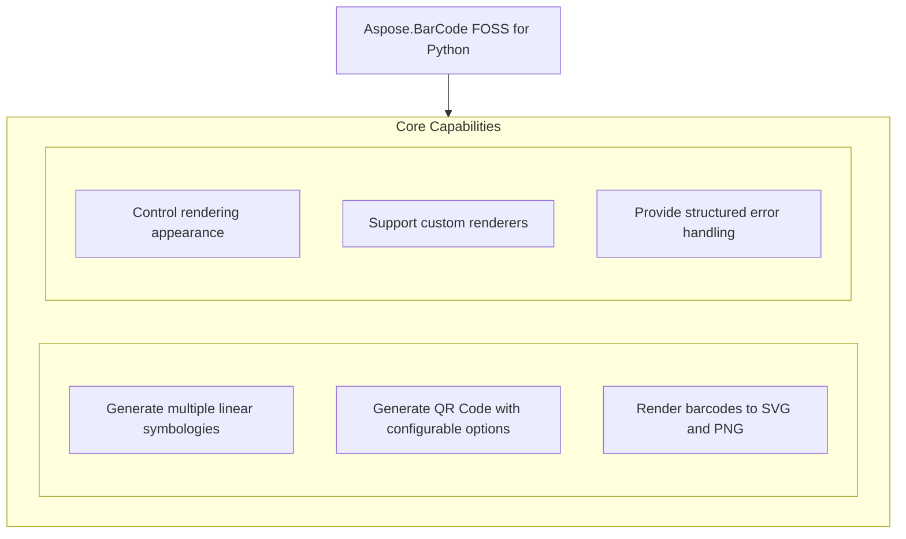

# Aspose.BarCode FOSS for Python

 [](LICENSE) [](https://github.com/aspose-barcode-foss/Aspose.BarCode-FOSS-for-Python/graphs/contributors)

[](https://products.aspose.org/barcode/python/)

Aspose.BarCode FOSS for Python generates and renders barcodes in Python applications, supporting common symbologies such as code128, code39, code39ext, ean13, ean8, upca, upce, and qr. Developers use it to convert data into scannable barcodes and export them as SVG or PNG using methods like `to_svg`, `to_png`, and render with renderers such as `SvgRenderer`, `PngRenderer`, and `PdfRenderer`. The library provides fine-grained control over rendering through `RenderOptions` and QR-specific settings via `QrOptions`, `QrErrorCorrectionLevel`, and `QrEncodeMode`. It is designed for Python 3.12 and above, is distributed under the MIT license, and depends on Pillow>=10.1.0.

## Navigation

- [At a Glance](#at-a-glance)
- [Key Capabilities](#key-capabilities)
- [Installation](#installation)
- [Dependencies](#dependencies)
- [Quick Start](#quick-start)
- [Additional Examples](#additional-examples)
- [API Reference](#api-reference)
- [Documentation & Resources](#documentation--resources)
- [Scope and Limitations](#scope-and-limitations)
- [Development and Testing](#development-and-testing)
- [License](#license)

## At a Glance



## Key Capabilities

- **Generate multiple linear symbologies.** Generate linear barcodes using code128, code39, code39ext, ean13, ean8, upca, and upce symbologies with built-in support for encoding options and check digits.
- **Generate QR Code with configurable options.** Generate QR codes with configurable error correction levels, encoding modes, and options through the `QrOptions` class.
- **Render barcodes to SVG and PNG.** Render barcodes directly to SVG strings or PNG bytes using the `to_svg` and `to_png` methods on the `Barcode` class.
- **Control rendering appearance.** Adjust scale, DPI, module width, and text visibility in generated output via the `RenderOptions` class.
- **Support custom renderers.** Use custom renderers like `SvgRenderer`, `PngRenderer`, and `PdfRenderer` with the render method to produce output artifacts with structured data access.
- **Provide structured error handling.** Handle errors with structured exception types including `BarcodeError`, `EncodingError`, `RenderingError`, `InvalidInputError`, `SymbologyNotFoundError`, `UnsupportedCapabilityError`, and `UnsupportedFeatureError`.

## Installation

`aspose-barcode-foss` is not yet published on PyPI; build it from a source checkout instead, verified against this revision:

```bash
git clone https://github.com/aspose-barcode-foss/Aspose.BarCode-FOSS-for-Python.git
cd Aspose.BarCode-FOSS-for-Python
pip install .
```

The package declares `python_requires` as `>=3.12`.

## Dependencies

### Required Package Dependencies

- `Pillow>=10.1.0`

### Native and System Requirements

- Requires Python 3.12 or later (`python_requires=">=3.12"` in `pyproject.toml`).

## Quick Start

Create a Code 128 barcode for the text Hello-World and render it to both SVG and PNG formats.

```python
from aspose_barcode_foss import code128

barcode = code128("Hello-World")
svg = barcode.to_svg()   # -> str
png = barcode.to_png()   # -> bytes
```

## Additional Examples

Create barcodes with generic and symbology-specific entry points, configure encoding options, and render to PNG or SVG formats.

### Generate a QR barcode and render it to PNG

```python
from aspose_barcode_foss import generate

barcode = generate("qr", "https://example.com")
png = barcode.to_png()
```

<details>
<summary>View Additional Examples</summary>

### Configure QR encoding with error correction and mode settings

```python
from aspose_barcode_foss import qr, QrOptions, QrErrorCorrectionLevel, QrEncodeMode

barcode = qr(
    "PAYLOAD",
    encode=QrOptions(
        error_correction_level=QrErrorCorrectionLevel.H,
        encoding_mode=QrEncodeMode.AUTO,
    ),
)
```

### Generate a Code 39 barcode with an added check digit

```python
from aspose_barcode_foss import code39, Code39Options

barcode = code39("ABC-123", encode=Code39Options(add_check_digit=True))
```

### Render a Code 128 barcode to SVG and PNG with custom options

```python
from aspose_barcode_foss import code128, RenderOptions

barcode = code128("Hello-World")
svg = barcode.to_svg(options=RenderOptions(scale=2.0, show_text=True))
png = barcode.to_png(options=RenderOptions(dpi=300, module_width=3.0))
```

### Render a Code 128 barcode using a dedicated SVG renderer

```python
from aspose_barcode_foss import code128, SvgRenderer, RenderOptions

renderer = SvgRenderer()
barcode = code128("Hello-World")
artifact = barcode.render(renderer, options=RenderOptions(scale=3.0))
svg = artifact.data
```


Runnable scripts are available in the [`examples`](examples/) directory
(`all_symbologies.py`, `render_options.py`, `error_handling.py`, `quickstart.py`). Additional
worked examples cover the generic entry point and per-symbology encoding options below.

Runnable example scripts and what each one demonstrates are listed in
[`examples/README.md`](examples/README.md).

</details>

## API Reference

Aspose.BarCode FOSS for Python provides barcode generation and rendering through the `aspose_barcode_foss.Barcode` class, which serves as the main entry point and is returned by the `generate()` function and per-symbology helpers. The `Barcode` class exposes `to_png()`, `to_svg()`, and `to_pdf()` methods to produce rendered output in those formats.

The verified public surface has 51 types.

<details>
<summary>View the Complete Public API Surface</summary>

### Core API

| Class | Description |
| --- | --- |
| `Barcode` | Public barcode object returned by the high-level API. |
| `aspose_barcode_foss.BarcodeError` | The aspose_barcode_foss.BarcodeError class represents an error that occurs during barcode processing. |
| `aspose_barcode_foss.Code128Options` | The aspose_barcode_foss.Code128Options class provides configuration options for generating Code 128 barcodes. |
| `aspose_barcode_foss.Code39Options` | The aspose_barcode_foss.Code39Options class provides configuration options for generating Code 39 barcodes. |
| `aspose_barcode_foss.Ean13Options` | The aspose_barcode_foss.Ean13Options class provides configuration options for generating EAN-13 barcodes. |
| `aspose_barcode_foss.Ean8Options` | The aspose_barcode_foss.Ean8Options class provides configuration options for generating EAN-8 barcodes. |
| `aspose_barcode_foss.EncodeOptions` | The aspose_barcode_foss.EncodeOptions class provides common configuration options for barcode encoding. |
| `aspose_barcode_foss.EncodingError` | The aspose_barcode_foss.EncodingError class represents an error that occurs during barcode encoding. |
| `aspose_barcode_foss.InvalidInputError` | The aspose_barcode_foss.InvalidInputError class represents an error that occurs when input data is invalid. |
| `aspose_barcode_foss.PdfRenderer` | The aspose_barcode_foss.PdfRenderer class renders barcodes to PDF format. |
| `aspose_barcode_foss.PngRenderer` | The aspose_barcode_foss.PngRenderer class renders barcodes to PNG image format. |
| `aspose_barcode_foss.QrOptions` | The aspose_barcode_foss.QrOptions class provides configuration options for generating QR barcodes. |
| `aspose_barcode_foss.RenderOptions` | The aspose_barcode_foss.RenderOptions class provides common configuration options for rendering barcodes. |
| `aspose_barcode_foss.Renderer` | The aspose_barcode_foss.Renderer class serves as the base class for barcode rendering implementations. |
| `aspose_barcode_foss.RenderingError` | The aspose_barcode_foss.RenderingError class represents an error that occurs during barcode rendering. |
| `aspose_barcode_foss.ResolvedRenderOptions` | The aspose_barcode_foss.ResolvedRenderOptions class holds resolved rendering configuration options. |
| `aspose_barcode_foss.SvgRenderer` | The aspose_barcode_foss.SvgRenderer class renders barcodes to SVG format. |
| `aspose_barcode_foss.SymbologyNotFoundError` | The aspose_barcode_foss.SymbologyNotFoundError class represents an error when a symbology is not found. |
| `aspose_barcode_foss.UnsupportedCapabilityError` | The aspose_barcode_foss.UnsupportedCapabilityError class represents an error for unsupported capabilities. |
| `aspose_barcode_foss.UnsupportedFeatureError` | The aspose_barcode_foss.UnsupportedFeatureError class represents an error for unsupported features. |
| `aspose_barcode_foss.UpcaOptions` | The aspose_barcode_foss.UpcaOptions class provides configuration options for generating UPC-A barcodes. |
| `aspose_barcode_foss.UpceOptions` | The aspose_barcode_foss.UpceOptions class provides configuration options for generating UPC-E barcodes. |
| `exceptions.BarcodeError` | The aspose_barcode_foss.exceptions.BarcodeError class represents an error that occurs during barcode processing. |
| `exceptions.EncodingError` | The aspose_barcode_foss.exceptions.EncodingError class represents an error that occurs during barcode encoding. |
| `exceptions.InvalidInputError` | The aspose_barcode_foss.exceptions.InvalidInputError class represents an error when input data is invalid. |
| `exceptions.RenderingError` | The aspose_barcode_foss.exceptions.RenderingError class represents an error that occurs during barcode rendering. |
| `exceptions.SymbologyNotFoundError` | The aspose_barcode_foss.exceptions.SymbologyNotFoundError class represents an error when a symbology is not found. |
| `exceptions.UnsupportedCapabilityError` | The aspose_barcode_foss.exceptions.UnsupportedCapabilityError class represents an error for unsupported capabilities. |
| `exceptions.UnsupportedFeatureError` | The aspose_barcode_foss.exceptions.UnsupportedFeatureError class represents an error for unsupported features. |
| `options.Code128Options` | The aspose_barcode_foss.options.Code128Options class provides configuration options for generating Code 128 barcodes. |
| `options.Code39Options` | The aspose_barcode_foss.options.Code39Options class provides configuration options for generating Code 39 barcodes. |
| `options.Ean13Options` | The aspose_barcode_foss.options.Ean13Options class provides configuration options for generating EAN-13 barcodes. |
| `options.Ean8Options` | The aspose_barcode_foss.options.Ean8Options class provides configuration options for generating EAN-8 barcodes. |
| `options.EncodeOptions` | The aspose_barcode_foss.options.EncodeOptions class provides common configuration options for barcode encoding. |
| `options.QrOptions` | QrOptions provides configuration settings specific to QR barcode generation. |
| `options.RenderOptions` | RenderOptions defines common rendering parameters used when generating barcode images. |
| `options.ResolvedRenderOptions` | ResolvedRenderOptions holds the final resolved rendering settings after applying all configuration layers. |
| `options.UpcaOptions` | UpcaOptions provides configuration settings specific to UPCA barcode generation. |
| `options.UpceOptions` | UpceOptions provides configuration settings specific to UPCE barcode generation. |
| `renderers.PdfRenderer` | PdfRenderer enables rendering barcodes directly into PDF documents. |
| `renderers.PngRenderer` | PngRenderer enables rendering barcodes as PNG image files. |
| `renderers.Renderer` | Renderer is the base class for all barcode rendering backends in Aspose.BarCode FOSS for Python. |
| `renderers.SvgRenderer` | SvgRenderer enables rendering barcodes as SVG vector images. |

#### Enumerations

| Enumeration | Description |
| --- | --- |
| `aspose_barcode_foss.Code128EncodeMode` | The aspose_barcode_foss.Code128EncodeMode class specifies the encoding mode for Code 128 barcodes. |
| `aspose_barcode_foss.Code39EncodeMode` | The aspose_barcode_foss.Code39EncodeMode class specifies the encoding mode for Code 39 barcodes. |
| `aspose_barcode_foss.QrEncodeMode` | The aspose_barcode_foss.QrEncodeMode class specifies the encoding mode for QR barcodes. |
| `aspose_barcode_foss.QrErrorCorrectionLevel` | The aspose_barcode_foss.QrErrorCorrectionLevel class specifies the error correction level for QR barcodes. |
| `options.Code128EncodeMode` | The aspose_barcode_foss.options.Code128EncodeMode class specifies the encoding mode for Code 128 barcodes. |
| `options.Code39EncodeMode` | The aspose_barcode_foss.options.Code39EncodeMode class specifies the encoding mode for Code 39 barcodes. |
| `options.QrEncodeMode` | The aspose_barcode_foss.options.QrEncodeMode class specifies the encoding mode for QR barcodes. |
| `options.QrErrorCorrectionLevel` | QrErrorCorrectionLevel represents the error correction level for QR codes, supporting AUTO and H levels. |

#### Detailed Member Reference

### aspose_barcode_foss

The `aspose_barcode_foss` package exposes the `generate()` function to create barcodes and the `aspose_barcode_foss.Barcode` class that holds the generated data and rendering methods.

### Barcode

The `aspose_barcode_foss.Barcode` class provides `render()`, `to_png()`, `to_svg()`, and `to_pdf()` methods to produce rendered output in PNG, SVG, and PDF formats.

- `render`: Render the barcode with the provided renderer.
- `to_pdf`: Render the barcode as PDF when the backend is available.
- `to_png`: Render the barcode as PNG.
- `to_svg`: Render the barcode as SVG.

### code128

The `aspose_barcode_foss.code128` module provides the `code128()` helper to generate Code 128 barcodes, along with `Code128EncodeMode` and `Code128Options` to control encoding behavior and options.

### code39

The `aspose_barcode_foss.code39` module provides the `code39()` helper to generate Code 39 barcodes, with `Code39EncodeMode` and `Code39Options` for encoding control, plus code39ext for extended Code 39 support.

### ean13

The `aspose_barcode_foss.ean13` module provides the `ean13()` helper to generate EAN-13 barcodes, with `Ean13Options` to configure rendering parameters.

### ean8

The `aspose_barcode_foss.ean8` module provides the `ean8()` helper to generate EAN-8 barcodes, with `Ean8Options` to configure rendering parameters.

### qr

The `aspose_barcode_foss.qr` module provides the `qr()` helper to generate QR codes, with `QrEncodeMode`, `QrErrorCorrectionLevel`, and `QrOptions` to control encoding and error correction.

### renderers

The `aspose_barcode_foss.renderers` module exposes `Renderer` as the base class and `PngRenderer`, `SvgRenderer`, and `PdfRenderer` as concrete renderers for their respective output formats.

### options

The `aspose_barcode_foss.options` module provides `EncodeOptions`, `RenderOptions`, and `ResolvedRenderOptions` base classes, plus per-symbology options such as `Code128EncodeMode`, `Code128Options`, `Code39EncodeMode`, `Code39Options`, `Ean13Options`, `Ean8Options`, `QrEncodeMode`, `QrErrorCorrectionLevel`, `QrOptions`, `UpcaOptions`, and `UpceOptions`.

### exceptions

The `aspose_barcode_foss.exceptions` module defines `BarcodeError`, `EncodingError`, `RenderingError`, `InvalidInputError`, `SymbologyNotFoundError`, `UnsupportedCapabilityError`, and `UnsupportedFeatureError` to represent errors during barcode generation and rendering.

</details>

## Documentation & Resources

- **[Getting started guide](https://docs.aspose.org/barcode/python/)** — The getting started guide introduces core concepts and walks through basic usage of Aspose.BarCode FOSS for Python, including creating barcodes and saving them in common formats.
- **[How-to articles and FAQ](https://kb.aspose.org/barcode/python/)** — How-to articles and the FAQ provide practical examples and answers for common tasks such as barcode recognition, format selection, and handling edge cases.
- **[Full API reference](https://reference.aspose.org/barcode/python/)** — The full API reference documents all classes, methods, and properties available in aspose-barcode-foss, including AUTO, H, data, render, `to_png`, and `to_svg`. It covers all 51 verified public types; the [API Reference](#api-reference) section above covers the essentials.
- Found a bug or have a feature request? [Open an issue](https://github.com/aspose-barcode-foss/Aspose.BarCode-FOSS-for-Python/issues).

## Scope and Limitations

Aspose.BarCode FOSS for Python version 0.1.0 provides barcode generation capabilities for Python 3.12 and later under the MIT license, supporting PNG and SVG output formats for all symbologies.

- The library does not support reading or decoding existing barcode images for any symbology.
- PDF rendering is not implemented; calling `Barcode.to_pdf()` or `PdfRenderer.render()` raises `NotImplementedError`.
- ECI normalization and validation are not implemented despite `EncodeOptions` exposing an `eci_assignment_number` field.
- GS1 data parsing and validation are not implemented despite `EncodeOptions` exposing a `gs1_enabled` field.

## Development and Testing

Build and test the package using the assets in the tests/ and examples/ directories, ensuring compatibility with Python 3.12 or later, and verify functionality with the AUTO, H, data, render, `to_png`, and `to_svg` members.

The suite covers 48 test files under `tests/`.

## License

This project is licensed under the [MIT License](LICENSE). The MIT License permits use, copying, modification, distribution, sublicensing, and commercial use, provided its copyright and permission notice are retained. The software is provided without warranty.
