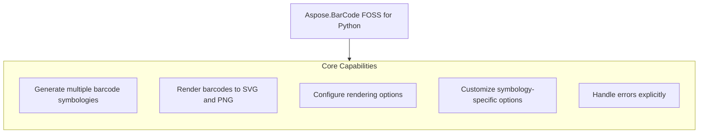

# Aspose.BarCode FOSS for Python

 [](LICENSE) [](https://github.com/aspose-barcode-foss/Aspose.BarCode-FOSS-for-Python/graphs/contributors)

[](https://products.aspose.org/barcode/python/)

Aspose.BarCode FOSS for Python generates and renders barcodes in Python applications, supporting formats such as code128, code39, ean13, ean8, upca, upce, and qr. It solves the problem of embedding machine-readable codes in documents and labels by providing a simple API to create barcodes and export them as SVG or PNG. Developers working with inventory, logistics, or identification systems use it to convert data strings into scannable barcodes programmatically. The generate function accepts a format name and data string, and the resulting barcode object provides `to_png` and `to_svg` methods to render the barcode with customizable options.

## Navigation

- [At a Glance](#at-a-glance)
- [Key Capabilities](#key-capabilities)
- [Installation](#installation)
- [Dependencies](#dependencies)
- [Quick Start](#quick-start)
- [Additional Examples](#additional-examples)
- [API Reference](#api-reference)
- [Documentation & Resources](#documentation--resources)
- [Scope and Limitations](#scope-and-limitations)
- [Development and Testing](#development-and-testing)
- [License](#license)

## At a Glance


```mermaid
flowchart TD
  PRODUCT["Aspose.BarCode FOSS for Python"]
  subgraph Capabilities["Core Capabilities"]
    direction TB
    c1["Generate multiple barcode symbologies"]
    c2["Render barcodes to SVG and PNG"]
    c3["Configure rendering options"]
    c4["Customize symbology-specific options"]
    c5["Handle errors explicitly"]
  end
  PRODUCT --> Capabilities
```

## Key Capabilities

- **Generate multiple barcode symbologies.** Generate barcodes using built-in symbologies including code128, code39, ean13, ean8, upca, upce, and qr by calling their respective factory functions and obtain a `Barcode` instance ready for rendering.
- **Render barcodes to SVG and PNG.** Render a `Barcode` instance to vector or raster formats by invoking `to_svg` to produce an SVG string or `to_png` to produce PNG bytes, using `SvgRenderer` and `PngRenderer` internally.
- **Configure rendering options.** Adjust rendering behavior such as scale, DPI, module width, and text visibility by passing a `RenderOptions` instance to the `to_png` or `to_svg` methods.
- **Customize symbology-specific options.** Tune symbology-specific settings like error correction level and encoding mode for qr codes, or options such as adding a check digit for code39, by providing `QrErrorCorrectionLevel`, `Code128EncodeMode`, or `Code39Options` during construction.
- **Handle errors explicitly.** Catch and respond to barcode generation or rendering problems by handling `BarcodeError`, `EncodingError`, `RenderingError`, and `InvalidInputError` exceptions raised by the library.

## Installation

`aspose-barcode-foss` is not yet published on PyPI, and no build or install command succeeds for this revision; work from the source checkout instead, verified against this revision:

```bash
git clone https://github.com/aspose-barcode-foss/Aspose.BarCode-FOSS-for-Python.git
cd Aspose.BarCode-FOSS-for-Python
export PYTHONPATH="src:.:$PYTHONPATH"
```

The package declares `python_requires` as `>=3.12`.

## Dependencies

### Required Package Dependencies

- `Pillow>=10.1.0`

### Native and System Requirements

- Requires Python 3.12 or later (`python_requires=">=3.12"` in `pyproject.toml`).

## Quick Start

Create a Code 128 barcode from a string and render it to both SVG and PNG formats.

```python
from aspose_barcode_foss import code128

barcode = code128("Hello-World")
svg = barcode.to_svg()   # -> str
png = barcode.to_png()   # -> bytes
```

## Additional Examples

The following workflows demonstrate generating barcodes, configuring encoding options, and rendering to PNG or SVG formats.

### Render a Code 128 barcode to SVG and PNG with custom options

```python
from aspose_barcode_foss import code128, RenderOptions

barcode = code128("Hello-World")
svg = barcode.to_svg(options=RenderOptions(scale=2.0, show_text=True))
png = barcode.to_png(options=RenderOptions(dpi=300, module_width=3.0))
```

<details>
<summary>View Additional Examples</summary>

### Generate a QR barcode and render it to PNG

```python
from aspose_barcode_foss import generate

barcode = generate("qr", "https://example.com")
png = barcode.to_png()
```

### Configure QR encoding with error correction and mode settings

```python
from aspose_barcode_foss import qr, QrOptions, QrErrorCorrectionLevel, QrEncodeMode

barcode = qr(
    "PAYLOAD",
    encode=QrOptions(
        error_correction_level=QrErrorCorrectionLevel.H,
        encoding_mode=QrEncodeMode.AUTO,
    ),
)
```

### Generate a Code 39 barcode with an added check digit

```python
from aspose_barcode_foss import code39, Code39Options

barcode = code39("ABC-123", encode=Code39Options(add_check_digit=True))
```

### Render a Code 128 barcode using a dedicated SVG renderer

```python
from aspose_barcode_foss import code128, SvgRenderer, RenderOptions

renderer = SvgRenderer()
barcode = code128("Hello-World")
artifact = barcode.render(renderer, options=RenderOptions(scale=3.0))
svg = artifact.data
```


Runnable scripts are available in the [`examples`](examples/) directory
(`all_symbologies.py`, `render_options.py`, `error_handling.py`, `quickstart.py`). Additional
worked examples cover the generic entry point and per-symbology encoding options below.

</details>

## API Reference

The aspose-barcode-foss package provides barcode generation and rendering capabilities through the `aspose_barcode_foss.Barcode` class, which serves as the central interface for working with barcodes. This class is returned by the `generate()` function and all per-symbology helpers, and exposes methods to render barcodes to PNG, SVG, or PDF formats.

The verified public surface has 51 types.

<details>
<summary>View the Complete Public API Surface</summary>

### Core API

| Class | Description |
| --- | --- |
| `Barcode` | Public barcode object returned by the high-level API. |
| `aspose_barcode_foss.BarcodeError` | The aspose_barcode_foss.BarcodeError class represents a base exception for barcode-related errors in Aspose.BarCode FOSS for Python. |
| `aspose_barcode_foss.Code128Options` | The aspose_barcode_foss.Code128Options class holds configuration settings specific to Code 128 barcode generation. |
| `aspose_barcode_foss.Code39Options` | The aspose_barcode_foss.Code39Options class contains options that control the appearance and behavior of Code 39 barcodes. |
| `aspose_barcode_foss.Ean13Options` | The aspose_barcode_foss.Ean13Options class provides settings for generating EAN-13 barcodes. |
| `aspose_barcode_foss.Ean8Options` | The aspose_barcode_foss.Ean8Options class provides settings for generating EAN-8 barcodes. |
| `aspose_barcode_foss.EncodeOptions` | The aspose_barcode_foss.EncodeOptions class defines common encoding parameters used across multiple barcode symbologies. |
| `aspose_barcode_foss.EncodingError` | The aspose_barcode_foss.EncodingError class indicates an error that occurred during the encoding process of a barcode. |
| `aspose_barcode_foss.InvalidInputError` | The aspose_barcode_foss.InvalidInputError class signals that the input provided for barcode generation is invalid. |
| `aspose_barcode_foss.PdfRenderer` | The aspose_barcode_foss.PdfRenderer class renders barcodes into PDF format. |
| `aspose_barcode_foss.PngRenderer` | The aspose_barcode_foss.PngRenderer class renders barcodes into PNG image format. |
| `aspose_barcode_foss.QrOptions` | The aspose_barcode_foss.QrOptions class holds configuration options for generating QR codes. |
| `aspose_barcode_foss.RenderOptions` | The aspose_barcode_foss.RenderOptions class provides general rendering settings applicable to all barcode types. |
| `aspose_barcode_foss.Renderer` | The aspose_barcode_foss.Renderer class serves as the base class for all barcode rendering implementations. |
| `aspose_barcode_foss.RenderingError` | The aspose_barcode_foss.RenderingError class indicates an error that occurred during the rendering of a barcode. |
| `aspose_barcode_foss.ResolvedRenderOptions` | The aspose_barcode_foss.ResolvedRenderOptions class represents the final set of rendering options after applying defaults and overrides. |
| `aspose_barcode_foss.SvgRenderer` | The aspose_barcode_foss.SvgRenderer class renders barcodes into SVG format. |
| `aspose_barcode_foss.SymbologyNotFoundError` | The aspose_barcode_foss.SymbologyNotFoundError class indicates that the requested barcode symbology is not supported. |
| `aspose_barcode_foss.UnsupportedCapabilityError` | The aspose_barcode_foss.UnsupportedCapabilityError class signals that a requested capability is not supported by the current configuration. |
| `aspose_barcode_foss.UnsupportedFeatureError` | The aspose_barcode_foss.UnsupportedFeatureError class indicates that a requested feature is not supported. |
| `aspose_barcode_foss.UpcaOptions` | The aspose_barcode_foss.UpcaOptions class provides settings for generating UPC-A barcodes. |
| `aspose_barcode_foss.UpceOptions` | The aspose_barcode_foss.UpceOptions class provides settings for generating UPC-E barcodes. |
| `exceptions.BarcodeError` | The aspose_barcode_foss.exceptions.BarcodeError class represents a base exception for barcode-related errors in Aspose.BarCode FOSS for Python. |
| `exceptions.EncodingError` | The aspose_barcode_foss.exceptions.EncodingError class indicates an error that occurred during the encoding process of a barcode. |
| `exceptions.InvalidInputError` | The aspose_barcode_foss.exceptions.InvalidInputError class signals that the input provided for barcode generation is invalid. |
| `exceptions.RenderingError` | The aspose_barcode_foss.exceptions.RenderingError class indicates an error that occurred during the rendering of a barcode. |
| `exceptions.SymbologyNotFoundError` | The aspose_barcode_foss.exceptions.SymbologyNotFoundError class indicates that the requested barcode symbology is not supported. |
| `exceptions.UnsupportedCapabilityError` | The aspose_barcode_foss.exceptions.UnsupportedCapabilityError class signals that a requested capability is not supported by the current configuration. |
| `exceptions.UnsupportedFeatureError` | The aspose_barcode_foss.exceptions.UnsupportedFeatureError class indicates that a requested feature is not supported. |
| `options.Code128Options` | The aspose_barcode_foss.options.Code128Options class holds configuration settings specific to Code 128 barcode generation. |
| `options.Code39Options` | The aspose_barcode_foss.options.Code39Options class contains options that control the appearance and behavior of Code 39 barcodes. |
| `options.Ean13Options` | The aspose_barcode_foss.options.Ean13Options class provides settings for generating EAN-13 barcodes. |
| `options.Ean8Options` | The aspose_barcode_foss.options.Ean8Options class provides settings for generating EAN-8 barcodes. |
| `options.EncodeOptions` | The aspose_barcode_foss.options.EncodeOptions class defines common encoding parameters used across multiple barcode symbologies. |
| `options.QrOptions` | QrOptions provides configuration settings specific to QR barcode generation. |
| `options.RenderOptions` | RenderOptions defines common rendering parameters used when generating barcodes. |
| `options.ResolvedRenderOptions` | ResolvedRenderOptions holds the final resolved rendering settings after applying all overrides. |
| `options.UpcaOptions` | UpcaOptions provides configuration settings specific to UPCA barcode generation. |
| `options.UpceOptions` | UpceOptions provides configuration settings specific to UPCE barcode generation. |
| `renderers.PdfRenderer` | PdfRenderer generates barcodes and embeds them into PDF documents. |
| `renderers.PngRenderer` | PngRenderer renders barcodes as PNG images using the to_png method. |
| `renderers.Renderer` | Renderer is the base class for all barcode rendering implementations and provides the render method. |
| `renderers.SvgRenderer` | SvgRenderer renders barcodes as SVG images using the to_svg method. |

#### Enumerations

| Enumeration | Description |
| --- | --- |
| `aspose_barcode_foss.Code128EncodeMode` | The aspose_barcode_foss.Code128EncodeMode class specifies the encoding mode used for Code 128 barcodes. |
| `aspose_barcode_foss.Code39EncodeMode` | The aspose_barcode_foss.Code39EncodeMode class defines the encoding mode for Code 39 barcodes. |
| `aspose_barcode_foss.QrEncodeMode` | The aspose_barcode_foss.QrEncodeMode class specifies the encoding mode used for QR codes. |
| `aspose_barcode_foss.QrErrorCorrectionLevel` | The aspose_barcode_foss.QrErrorCorrectionLevel class defines the error correction level for QR codes. |
| `options.Code128EncodeMode` | The aspose_barcode_foss.options.Code128EncodeMode class specifies the encoding mode used for Code 128 barcodes. |
| `options.Code39EncodeMode` | The aspose_barcode_foss.options.Code39EncodeMode class defines the encoding mode for Code 39 barcodes. |
| `options.QrEncodeMode` | The aspose_barcode_foss.options.QrEncodeMode class specifies the encoding mode used for QR codes. |
| `options.QrErrorCorrectionLevel` | QrErrorCorrectionLevel represents the error correction level for QR codes, supporting AUTO and H levels. |

#### Detailed Member Reference

### Barcode

The `aspose_barcode_foss.Barcode` class provides methods to render barcodes to PNG, SVG, or PDF formats through its `to_png()`, `to_svg()`, and `to_pdf()` methods, and supports direct rendering via the `render()` method.

- `render`: Render the barcode with the provided renderer.
- `to_pdf`: Render the barcode as PDF when the backend is available.
- `to_png`: Render the barcode as PNG.
- `to_svg`: Render the barcode as SVG.

### generate

The `aspose_barcode_foss.generate` function creates a `Barcode` instance from a given data string and symbology configuration.

### code128

The `aspose_barcode_foss.code128` helper constructs a `Barcode` instance configured for Code 128 symbology using the provided data string.

### qr

The `aspose_barcode_foss.qr` helper constructs a `Barcode` instance configured for QR Code symbology using the provided data string.

### code39

The `aspose_barcode_foss.code39` helper constructs a `Barcode` instance configured for Code 39 symbology using the provided data string.

### ean13

The `aspose_barcode_foss.ean13` helper constructs a `Barcode` instance configured for EAN-13 symbology using the provided data string.

### ean8

The `aspose_barcode_foss.ean8` helper constructs a `Barcode` instance configured for EAN-8 symbology using the provided data string.

### upca

The `aspose_barcode_foss.upca` helper constructs a `Barcode` instance configured for UPC-A symbology using the provided data string.

### upce

The `aspose_barcode_foss.upce` helper constructs a `Barcode` instance configured for UPC-E symbology using the provided data string.

### renderers.SvgRenderer

The `aspose_barcode_foss.SvgRenderer` and `aspose_barcode_foss.renderers.SvgRenderer` classes provide SVG rendering capabilities for barcode output.

### renderers.PngRenderer

The `aspose_barcode_foss.PngRenderer` and `aspose_barcode_foss.renderers.PngRenderer` classes provide PNG rendering capabilities for barcode output.

### aspose_barcode_foss.RenderOptions

The `aspose_barcode_foss.RenderOptions` and `aspose_barcode_foss.ResolvedRenderOptions` classes provide configuration options for barcode rendering behavior.

</details>

## Documentation & Resources

- **[Getting started guide](https://docs.aspose.org/barcode/python/)** — The getting started guide covers installation, step-by-step walkthroughs, and feature introductions for aspose-barcode-foss.
- **[How-to articles and FAQ](https://kb.aspose.org/barcode/python/)** — How-to articles and the FAQ provide task-focused instructions and answers to frequently asked questions about aspose-barcode-foss.
- **[Full API reference](https://reference.aspose.org/barcode/python/)** — The full API reference documents every public type, including classes like AUTO, H, and methods such as data, render, `to_png`, and `to_svg`. It covers all 51 verified public types; the [API Reference](#api-reference) section above covers the essentials.
- Found a bug or have a feature request? [Open an issue](https://github.com/aspose-barcode-foss/Aspose.BarCode-FOSS-for-Python/issues).

## Scope and Limitations

Aspose.BarCode FOSS for Python creates barcodes for all supported symbologies using the member AUTO or member H encoding modes, and exports them as PNG or SVG images via the member `to_png` or member `to_svg` methods.

- The library does not read or decode existing barcode images for any symbology.
- PDF rendering is not implemented — calling member render with PDF output or using member `to_pdf` raises `NotImplementedError`.
- ECI (Extended Channel Interpretation) normalization and validation are not implemented despite `EncodeOptions` exposing an `eci_assignment_number` field on every symbology's options type.
- GS1 data parsing and validation are not implemented despite `EncodeOptions` exposing a `gs1_enabled` field on every symbology's options type.

## Development and Testing

The toolchain requires Python >=3.12 and uses the repository's own tests/ and examples/ assets for validation and demonstration; the package is named aspose-barcode-foss at version 0.1.0 under the MIT license.

The suite covers 48 test files under `tests/`.

Runnable example scripts and what each one demonstrates are listed in
[`examples/README.md`](examples/README.md).

## License

This project is licensed under the [MIT License](LICENSE). The MIT License permits use, copying, modification, distribution, sublicensing, and commercial use, provided its copyright and permission notice are retained. The software is provided without warranty.
