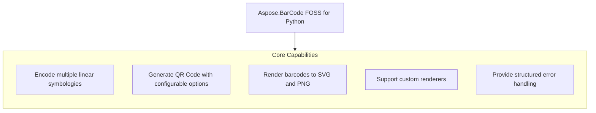

# Aspose.BarCode FOSS for Python

 [](LICENSE) [](https://github.com/aspose-barcode-foss/Aspose.BarCode-FOSS-for-Python/graphs/contributors)

[](https://products.aspose.org/barcode/python/)

Aspose.BarCode FOSS for Python generates and renders barcodes in Python applications, supporting formats such as code128, code39, code39ext, ean13, ean8, upca, upce, and qr. It solves the problem of embedding machine-readable codes in documents and labels by providing a simple API to create barcodes and export them as SVG or PNG. Developers use it to automate barcode generation in reports, inventory systems, and packaging workflows.

## Navigation

- [At a Glance](#at-a-glance)
- [Key Capabilities](#key-capabilities)
- [Installation](#installation)
- [Dependencies](#dependencies)
- [Quick Start](#quick-start)
- [Additional Examples](#additional-examples)
- [API Reference](#api-reference)
- [Documentation & Resources](#documentation--resources)
- [Scope and Limitations](#scope-and-limitations)
- [Development and Testing](#development-and-testing)
- [License](#license)

## At a Glance


```mermaid
flowchart TD
  PRODUCT["Aspose.BarCode FOSS for Python"]
  subgraph Capabilities["Core Capabilities"]
    direction TB
    c1["Encode multiple linear symbologies"]
    c2["Generate QR Code with configurable options"]
    c3["Render barcodes to SVG and PNG"]
    c4["Support custom renderers"]
    c5["Provide structured error handling"]
  end
  PRODUCT --> Capabilities
```

## Key Capabilities

- **Encode multiple linear symbologies.** Encode linear barcodes using Code 128, Code 39, Code 39 Extended, EAN-13, EAN-8, UPC-A, and UPC-E symbologies, with automatic check-digit computation or explicit validation where applicable.
- **Generate QR Code with configurable options.** Generate QR Code (Model 2) barcodes spanning versions 1-40 with configurable error correction level and encoding mode through the `QrOptions` class.
- **Render barcodes to SVG and PNG.** The `to_svg` and `to_png` methods render barcodes to SVG and PNG formats, with rendering control via `RenderOptions` for scale, DPI, module dimensions, colors, and text display.
- **Support custom renderers.** Pass a `Renderer` subclass instance to the render method to support custom rendering, returning an artifact containing the rendered output data.
- **Provide structured error handling.** `BarcodeError`, `EncodingError`, `RenderingError`, and `SymbologyNotFoundError` exception types provide structured error handling for distinct failure scenarios.

## Installation

`aspose-barcode-foss` is not yet published on PyPI; build it from a source checkout instead, verified against this revision:

```bash
git clone https://github.com/aspose-barcode-foss/Aspose.BarCode-FOSS-for-Python.git
cd Aspose.BarCode-FOSS-for-Python
pip install .
```

The package declares `python_requires` as `>=3.12`.

## Dependencies

### Required Package Dependencies

- `Pillow>=10.1.0`

### Native and System Requirements

- Requires Python 3.12 or later (`python_requires=">=3.12"` in `pyproject.toml`).

## Quick Start

Create a Code 128 barcode from a string and render it to both SVG and PNG formats using the `to_svg` and `to_png` methods.

```python
from aspose_barcode_foss import code128

barcode = code128("Hello-World")
svg = barcode.to_svg()   # -> str
png = barcode.to_png()   # -> bytes
```

## Additional Examples

The library supports multiple barcode symbologies and rendering formats through a unified API. Each example demonstrates a distinct workflow for generating and exporting barcodes.

### Export the Same Barcode as SVG and PNG with Custom Render Options

```python
from aspose_barcode_foss import code128, RenderOptions

barcode = code128("Hello-World")
svg = barcode.to_svg(options=RenderOptions(scale=2.0, show_text=True))
png = barcode.to_png(options=RenderOptions(dpi=300, module_width=3.0))
```

<details>
<summary>View Additional Examples</summary>

### Generate a QR Barcode and Export It as PNG

```python
from aspose_barcode_foss import generate

barcode = generate("qr", "https://example.com")
png = barcode.to_png()
```

### Encode a QR Barcode with High Error Correction and Automatic Mode

```python
from aspose_barcode_foss import qr, QrOptions, QrErrorCorrectionLevel, QrEncodeMode

barcode = qr(
    "PAYLOAD",
    encode=QrOptions(
        error_correction_level=QrErrorCorrectionLevel.H,
        encoding_mode=QrEncodeMode.AUTO,
    ),
)
```

### Generate a Code 39 Barcode with an Added Check Digit

```python
from aspose_barcode_foss import code39, Code39Options

barcode = code39("ABC-123", encode=Code39Options(add_check_digit=True))
```

### Render a Code 128 Barcode Using a Dedicated SVG Renderer Instance

```python
from aspose_barcode_foss import code128, SvgRenderer, RenderOptions

renderer = SvgRenderer()
barcode = code128("Hello-World")
artifact = barcode.render(renderer, options=RenderOptions(scale=3.0))
svg = artifact.data
```

Runnable scripts are available in the [`examples`](examples/) directory
(`all_symbologies.py`, `render_options.py`, `error_handling.py`, `quickstart.py`). Additional
worked examples cover the generic entry point and per-symbology encoding options below.

Runnable example scripts and what each one demonstrates are listed in
[`examples/README.md`](examples/README.md).

</details>

## API Reference

The `Barcode` class serves as the primary entry point for barcode generation and is returned by the `generate()` function as well as per-symbology helpers such as `code128()`, `code39()`, and `qr()`. It exposes `to_png()`, `to_svg()`, and `render()` methods to produce rendered output in the desired format.

The verified public surface has 51 types.

<details>
<summary>View the Complete Public API Surface</summary>

### Core API

| Class | Description |
| --- | --- |
| `Barcode` | Public barcode object returned by the high-level API. |
| `aspose_barcode_foss.BarcodeError` | aspose_barcode_foss.BarcodeError represents a base exception for barcode-related errors. |
| `aspose_barcode_foss.Code128Options` | aspose_barcode_foss.Code128Options provides configuration settings for generating Code 128 barcodes. |
| `aspose_barcode_foss.Code39Options` | aspose_barcode_foss.Code39Options provides configuration settings for generating Code 39 barcodes. |
| `aspose_barcode_foss.Ean13Options` | aspose_barcode_foss.Ean13Options provides configuration settings for generating EAN-13 barcodes. |
| `aspose_barcode_foss.Ean8Options` | aspose_barcode_foss.Ean8Options provides configuration settings for generating EAN-8 barcodes. |
| `aspose_barcode_foss.EncodeOptions` | aspose_barcode_foss.EncodeOptions defines common encoding parameters for barcode generation. |
| `aspose_barcode_foss.EncodingError` | aspose_barcode_foss.EncodingError indicates an error that occurs during barcode encoding. |
| `aspose_barcode_foss.InvalidInputError` | aspose_barcode_foss.InvalidInputError indicates that the provided input is invalid for barcode generation. |
| `aspose_barcode_foss.PdfRenderer` | aspose_barcode_foss.PdfRenderer generates barcode images in PDF format. |
| `aspose_barcode_foss.PngRenderer` | aspose_barcode_foss.PngRenderer generates barcode images in PNG format. |
| `aspose_barcode_foss.QrOptions` | aspose_barcode_foss.QrOptions provides configuration settings for generating QR barcodes. |
| `aspose_barcode_foss.RenderOptions` | aspose_barcode_foss.RenderOptions defines common rendering parameters for barcode output. |
| `aspose_barcode_foss.Renderer` | aspose_barcode_foss.Renderer is the base class for barcode image rendering implementations. |
| `aspose_barcode_foss.RenderingError` | aspose_barcode_foss.RenderingError indicates an error that occurs during barcode rendering. |
| `aspose_barcode_foss.ResolvedRenderOptions` | aspose_barcode_foss.ResolvedRenderOptions holds the final resolved rendering settings. |
| `aspose_barcode_foss.SvgRenderer` | aspose_barcode_foss.SvgRenderer generates barcode images in SVG format. |
| `aspose_barcode_foss.SymbologyNotFoundError` | aspose_barcode_foss.SymbologyNotFoundError indicates that the requested barcode symbology is not supported. |
| `aspose_barcode_foss.UnsupportedCapabilityError` | aspose_barcode_foss.UnsupportedCapabilityError indicates that a requested capability is not supported. |
| `aspose_barcode_foss.UnsupportedFeatureError` | aspose_barcode_foss.UnsupportedFeatureError indicates that a requested feature is not supported. |
| `aspose_barcode_foss.UpcaOptions` | aspose_barcode_foss.UpcaOptions provides configuration settings for generating UPC-A barcodes. |
| `aspose_barcode_foss.UpceOptions` | aspose_barcode_foss.UpceOptions provides configuration settings for generating UPC-E barcodes. |
| `exceptions.BarcodeError` | aspose_barcode_foss.exceptions.BarcodeError represents a base exception for barcode-related errors. |
| `exceptions.EncodingError` | aspose_barcode_foss.exceptions.EncodingError indicates an error that occurs during barcode encoding. |
| `exceptions.InvalidInputError` | aspose_barcode_foss.exceptions.InvalidInputError indicates that the provided input is invalid for barcode generation. |
| `exceptions.RenderingError` | aspose_barcode_foss.exceptions.RenderingError indicates an error that occurs during barcode rendering. |
| `exceptions.SymbologyNotFoundError` | aspose_barcode_foss.exceptions.SymbologyNotFoundError indicates that the requested barcode symbology is not supported. |
| `exceptions.UnsupportedCapabilityError` | aspose_barcode_foss.exceptions.UnsupportedCapabilityError indicates that a requested capability is not supported. |
| `exceptions.UnsupportedFeatureError` | aspose_barcode_foss.exceptions.UnsupportedFeatureError indicates that a requested feature is not supported. |
| `options.Code128Options` | aspose_barcode_foss.options.Code128Options provides configuration settings for generating Code 128 barcodes. |
| `options.Code39Options` | aspose_barcode_foss.options.Code39Options provides configuration settings for generating Code 39 barcodes. |
| `options.Ean13Options` | aspose_barcode_foss.options.Ean13Options provides configuration settings for generating EAN-13 barcodes. |
| `options.Ean8Options` | aspose_barcode_foss.options.Ean8Options provides configuration settings for generating EAN-8 barcodes. |
| `options.EncodeOptions` | aspose_barcode_foss.options.EncodeOptions defines common encoding parameters for barcode generation. |
| `options.QrOptions` | QrOptions provides configuration settings specific to QR barcode generation. |
| `options.RenderOptions` | RenderOptions defines common rendering parameters used when generating barcodes. |
| `options.ResolvedRenderOptions` | ResolvedRenderOptions holds the final resolved rendering settings after applying defaults and overrides. |
| `options.UpcaOptions` | UpcaOptions provides configuration settings specific to UPCA barcode generation. |
| `options.UpceOptions` | UpceOptions provides configuration settings specific to UPCE barcode generation. |
| `renderers.PdfRenderer` | PdfRenderer renders barcodes into PDF documents. |
| `renderers.PngRenderer` | PngRenderer renders barcodes as PNG images. |
| `renderers.Renderer` | Renderer is the base class for all barcode rendering implementations. |
| `renderers.SvgRenderer` | SvgRenderer renders barcodes as SVG images. |

#### Enumerations

| Enumeration | Description |
| --- | --- |
| `aspose_barcode_foss.Code128EncodeMode` | aspose_barcode_foss.Code128EncodeMode specifies the encoding mode for Code 128 barcodes. |
| `aspose_barcode_foss.Code39EncodeMode` | aspose_barcode_foss.Code39EncodeMode specifies the encoding mode for Code 39 barcodes. |
| `aspose_barcode_foss.QrEncodeMode` | aspose_barcode_foss.QrEncodeMode specifies the encoding mode for QR barcodes. |
| `aspose_barcode_foss.QrErrorCorrectionLevel` | aspose_barcode_foss.QrErrorCorrectionLevel defines the error correction level for QR barcodes. |
| `options.Code128EncodeMode` | aspose_barcode_foss.options.Code128EncodeMode specifies the encoding mode for Code 128 barcodes. |
| `options.Code39EncodeMode` | aspose_barcode_foss.options.Code39EncodeMode specifies the encoding mode for Code 39 barcodes. |
| `options.QrEncodeMode` | aspose_barcode_foss.options.QrEncodeMode specifies the encoding mode for QR barcodes. |
| `options.QrErrorCorrectionLevel` | QrErrorCorrectionLevel represents the error correction level for QR codes, supporting AUTO and H levels. |

#### Detailed Member Reference

### code128

The `aspose_barcode_foss.code128()` function creates a `Barcode` instance configured for Code 128 symbology, accepting `Code128EncodeMode` and `Code128Options` to control encoding behavior and options.

### code39

The `aspose_barcode_foss.code39()` function creates a `Barcode` instance configured for Code 39 symbology, accepting `Code39EncodeMode` and `Code39Options` to control encoding behavior and options.

### qr

The `aspose_barcode_foss.qr()` function creates a `Barcode` instance configured for QR Code symbology, accepting `QrEncodeMode`, `QrErrorCorrectionLevel`, and `QrOptions` to control encoding mode, error correction, and other options.

### generate

The `aspose_barcode_foss.generate()` function constructs a `Barcode` instance for a given symbology and data, returning a fully configured object ready for rendering.

### to_svg

The `aspose_barcode_foss.Barcode.to_svg()` method renders the barcode to an SVG image, using `RenderOptions` and `SvgRenderer` to control output appearance and format.

### to_png

The `aspose_barcode_foss.Barcode.to_png()` method renders the barcode to a PNG image, using `RenderOptions` and `PngRenderer` to control output appearance and format.

</details>

## Documentation & Resources

- **[Getting started guide](https://docs.aspose.org/barcode/python/)** — The getting started guide covers installation, step-by-step walkthroughs, and feature guides for this library.
- **[How-to articles and FAQ](https://kb.aspose.org/barcode/python/)** — How-to articles and the FAQ provide task-focused instructions and answers to common questions.
- **[Full API reference](https://reference.aspose.org/barcode/python/)** — The full API reference documents every public type, including classes like AUTO, H, and methods such as data, render, `to_png`, and `to_svg`. It covers all 51 verified public types; the [API Reference](#api-reference) section above covers the essentials.
- Found a bug or have a feature request? [Open an issue](https://github.com/aspose-barcode-foss/Aspose.BarCode-FOSS-for-Python/issues).

## Scope and Limitations

Aspose.BarCode FOSS for Python is a Python library for generating (encoding) barcodes in PNG and SVG formats across all supported symbologies, targeting Python 3.12 and later under the MIT license.

- PDF rendering is not implemented — calling `aspose_barcode_foss.Barcode.to_pdf()` or `aspose_barcode_foss.PdfRenderer.render()` raises NotImplementedError.
- ECI normalization and validation and GS1 data parsing and validation are not implemented in this FOSS build, even though `aspose_barcode_foss.EncodeOptions` exposes fields related to these features on every symbology's options type.
- The library only generates (encodes) barcodes — it does not read or decode existing barcode images for any symbology, and PDF rendering is not implemented and raises `NotImplementedError` when invoked.
- SVG and PNG rendering are implemented for every symbology, but PDF rendering is not implemented and raises `NotImplementedError` when invoked.

## Development and Testing

The toolchain requires Python 3.12 or later and uses the repository's own test suite in tests/ to validate functionality. Contributors must ensure all tests pass before submitting changes, following the rules defined by the project's testing standards. Runnable example scripts and what each one demonstrates are listed in the examples/README.md file. The examples/ directory provides runnable samples that demonstrate member AUTO, member H, member data, member render, member `to_png`, and member `to_svg` usage. Running the test suite from the repository root verifies that the package behaves as expected across supported scenarios.

The suite covers 48 test files under `tests/`.

## License

This project is licensed under the [MIT License](LICENSE). The MIT License permits use, copying, modification, distribution, sublicensing, and commercial use, provided its copyright and permission notice are retained. The software is provided without warranty.
