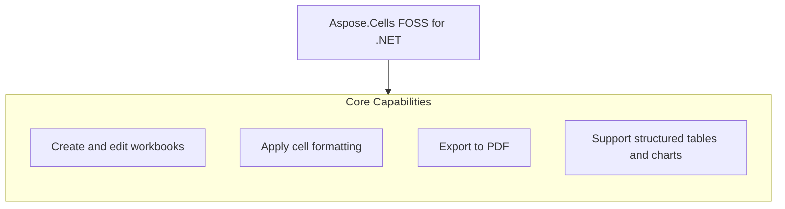

# Aspose.Cells FOSS for .NET

[](https://www.nuget.org/packages/Aspose.Cells.FOSS/) [](License/LICENSE.txt) [](https://github.com/aspose-cells-foss/Aspose.Cells-FOSS-for-.NET/graphs/contributors)

[](https://products.aspose.org/cells/net/)

Aspose.Cells FOSS for .NET is a free, open-source library for creating, editing, and converting Excel workbooks and worksheets in .NET applications. It enables developers to generate reports, process spreadsheets, and export to PDF without requiring Microsoft Excel, supporting formats such as XLSX and PDF through classes like `Workbook`, `Worksheet`, `Cell`, `Style`, `Font`, `Borders`, `PageSetup`, and `PdfSaveOptions`. Users can load files with repair options via `LoadOptions` and inspect diagnostics via `LoadDiagnostics` to detect potential data loss or repairs. The library targets netstandard2.0 and is versioned 26.9.0.0, licensed under the MIT license.

## Navigation

- [At a Glance](#at-a-glance)
- [Key Capabilities](#key-capabilities)
- [Installation](#installation)
- [Dependencies](#dependencies)
- [Quick Start](#quick-start)
- [Additional Examples](#additional-examples)
- [API Reference](#api-reference)
- [Documentation & Resources](#documentation--resources)
- [Scope and Limitations](#scope-and-limitations)
- [License](#license)

## At a Glance



## Key Capabilities

- **Create and edit workbooks.** Create a new workbook with `Workbook()` or load an existing file with `Workbook`(fileName), then populate cells via `Worksheet.Cells` and write values with `Cell.PutValue`, formulas with `Cell.Formula`, and save the result with `Workbook.Save`.
- **Apply cell formatting.** Apply formatting to cells using `Style`, `Font`, and `Borders` through `Cell.GetStyle` and `Cell.SetStyle`, setting properties such as background color, font weight, border style, and fill pattern to customize appearance.
- **Add data validation and conditional formatting.** Enforce data entry rules with `ValidationCollection.Add` and `Validation`, supporting types such as whole-number, decimal, list, and date validation, and highlight data patterns using `ConditionalFormattingCollection` to apply conditional rules.
- **Export to PDF.** Export a workbook to PDF using `Workbook.Save` with `PdfSaveOptions`, configuring options such as `OnePagePerSheet` and page geometry through `Worksheet.PageSetup` to control layout and output fidelity.
- **Support structured tables and charts.** Build structured Excel tables with `ListObject` and render data visually using `ChartCollection` and `Chart` to create bar, line, pie, and other chart types directly on worksheets.
- **Configure page layout and print settings.** Set page layout and print options for a worksheet using `PageSetup` to define `PaperSizeType` such as A4, `PageOrientationType` such as Landscape, and other print-related settings to prepare documents for output.

## Installation

Install the published package from NuGet (`Aspose.Cells.FOSS`, version 26.9.0.0):

```bash
dotnet add package Aspose.Cells.FOSS
```

To work from a source checkout instead, install the clone with pip:

```bash
git clone https://github.com/aspose-cells-foss/Aspose.Cells-FOSS-for-.NET.git
cd Aspose.Cells-FOSS-for-.NET
pip install .
```

## Dependencies

### Required Package Dependencies

- `SkiaSharp 2.88.8`

### Native and System Requirements

- Requires .NET `netstandard2.0` (`TargetFramework` in `src/Aspose.Cells_FOSS/Aspose.Cells_FOSS.csproj`).

## Quick Start

Create a new workbook, populate and style cells, and save the file as `products.xlsx`.

```csharp
using Aspose.Cells_FOSS;

var workbook = new Workbook();
var sheet = workbook.Worksheets[0];

sheet.Name = "Products";
sheet.Cells["A1"].PutValue("Product");
sheet.Cells["B1"].PutValue("Price");
sheet.Cells["A2"].PutValue("Apple");
sheet.Cells["B2"].PutValue(2.99m);
sheet.Cells["A3"].PutValue("Orange");
sheet.Cells["B3"].PutValue(1.99m);
sheet.Cells["B4"].Formula = "=SUM(B2:B3)";

var headerStyle = sheet.Cells["A1"].GetStyle();
headerStyle.Font.IsBold = true;
headerStyle.Font.Color = Color.FromArgb(255, 255, 255, 255);
headerStyle.Pattern = FillPattern.Solid;
headerStyle.ForegroundColor = Color.FromArgb(255, 34, 120, 212);
sheet.Cells["A1"].SetStyle(headerStyle);
sheet.Cells["B1"].SetStyle(headerStyle);

workbook.Save("products.xlsx");
```

Open an existing `report.xlsx` workbook, configure page layout, and export it to PDF.

```csharp
using Aspose.Cells_FOSS;

var workbook = new Workbook("report.xlsx");
var sheet = workbook.Worksheets[0];

sheet.PageSetup.PaperSize = PaperSizeType.PaperA4;
sheet.PageSetup.Orientation = PageOrientationType.Landscape;

workbook.Save("report.pdf", new PdfSaveOptions
{
    OnePagePerSheet = true
});
```

## Additional Examples

Aspose.Cells FOSS for .NET supports workbook recovery diagnostics and export to PDF. Example 002 demonstrates loading a workbook with recovery options and saving the updated file.

<details>
<summary>View Additional Examples</summary>

### Load a workbook with recovery diagnostics and save the updated file

```csharp
using System;
using Aspose.Cells_FOSS;

var loadOptions = new LoadOptions
{
    TryRepairPackage = true,
    TryRepairXml = true,
    StrictMode = false
};

var workbook = new Workbook("input.xlsx", loadOptions);

if (workbook.LoadDiagnostics.HasDataLossRisk)
{
    Console.WriteLine("Potential data loss risk detected during load.");
}

workbook.Worksheets[0].Cells["A1"].PutValue("Updated");
workbook.Save("updated.xlsx");
```


Export a worksheet to PDF:

More runnable snippets adapted from the sample projects under [`samples/`](samples/README.md) are collected below.

</details>

## API Reference

Aspose.Cells FOSS for .NET exposes its public API under the `Aspose.Cells_FOSS` namespace, with `Workbook` as the root object and `Worksheet`, `Cells`, and `Cell` as the types most developers interact with day to day. The package targets netstandard2.0 and is versioned at 26.9.0.0.

The verified public surface has 98 types.

<details>
<summary>View the Complete Public API Surface</summary>

### Core API

| Class | Description |
| --- | --- |
| `AutoFilter` | Represents auto filter. |
| `AutoFilterColorFilter` | Represents auto filter color filter. |
| `AutoFilterCustomFilter` | Represents auto filter custom filter. |
| `AutoFilterCustomFilterCollection` | Represents a collection of auto filter custom filter objects. |
| `AutoFilterDynamicFilter` | Represents auto filter dynamic filter. |
| `AutoFilterSortCondition` | Represents auto filter sort condition. |
| `AutoFilterSortConditionCollection` | Represents a collection of auto filter sort condition objects. |
| `AutoFilterSortState` | Represents auto filter sort state. |
| `AutoFilterTop10` | Represents auto filter top10. |
| `Border` | Represents border. |
| `Borders` | Represents borders. |
| `CalculationProperties` | Represents calculation properties. |
| `Cell` | Represents a single worksheet cell and exposes value, formula, and style operations. |
| `CellArea` | Represents cell area. |
| `Cells` | Provides access to worksheet cells, rows, columns, and merged ranges. |
| `CellsException` | Represents an error that occurs during cells. |
| `Chart` | Represents a chart embedded in a worksheet. |
| `ChartCollection` | Represents collection of charts on a worksheet. |
| `Color` | Represents color. |
| `Column` | Represents column. |
| `ColumnCollection` | Represents a collection of column objects. |
| `Comment` | Represents a worksheet comment (legacy note) anchored to a single cell. |
| `CommentCollection` | Represents the collection of comments (legacy notes) on a worksheet. |
| `ConditionalFormattingCollection` | Represents a collection of conditional formatting objects. |
| `CoreDocumentProperties` | Represents core document properties. |
| `DefinedName` | Represents defined name. |
| `DefinedNameCollection` | Represents a collection of defined name objects. |
| `DocumentProperties` | Represents document properties. |
| `ExtendedDocumentProperties` | Represents extended document properties. |
| `FilterColumn` | Represents filter column. |
| `FilterColumnCollection` | Represents a collection of filter column objects. |
| `FilterValueCollection` | Represents a collection of filter value objects. |
| `Font` | Represents font. |
| `FontSetting` | Represents a range of characters within a cell's rich text. |
| `FormatCondition` | Represents format condition. |
| `FormatConditionCollection` | Represents a collection of format condition objects. |
| `FormulaException` | Represents an error that occurs during formula. |
| `Hyperlink` | Represents hyperlink. |
| `HyperlinkCollection` | Encapsulates the hyperlinks defined for a worksheet. |
| `IWarningCallback` | Defines a callback that receives load warnings. |
| `InvalidFileFormatException` | Represents an error that occurs during invalid file format. |
| `ListColumn` | Represents a single column in an Excel table. |
| `ListColumnCollection` | Represents the ordered collection of columns in an Excel table. |
| `ListObject` | Represents an Excel table (structured reference / ListObject). |
| `ListObjectCollection` | Represents the collection of Excel tables on a worksheet. |
| `LoadDiagnostics` | Represents load diagnostics. |
| `LoadIssue` | Represents load issue. |
| `LoadOptions` | Specifies how a workbook should be loaded. |
| `NumberFormat` | Provides number format operations. |
| `PageSetup` | Represents worksheet print and page-layout settings. |
| `PdfSaveOptions` | Options controlling XLSX-to-PDF rendering. |
| `Picture` | Represents a picture (image) anchored to a worksheet. |
| `PictureCollection` | Represents collection of pictures anchored to a worksheet. |
| `Row` | Represents row. |
| `RowCollection` | Represents a collection of row objects. |
| `SaveOptions` | Specifies how a workbook should be saved. |
| `Shape` | Represents a drawing object (auto shape) anchored to a worksheet. |
| `ShapeCollection` | Represents collection of drawing objects (shapes) on a worksheet. |
| `Style` | Represents a mutable cell style facade that can be applied to one or more cells. |
| `StyleException` | Represents an error that occurs during style. |
| `StyleFlag` | Represents flags which indicate applied formatting properties. |
| `UnsupportedFeatureException` | Represents an error that occurs during unsupported feature. |
| `Validation` | Represents validation. |
| `ValidationCollection` | Represents a collection of validation objects. |
| `WarningInfo` | Represents warning info. |
| `Workbook` | Represents the root spreadsheet object used to create, load, modify, and save an XLSX workbook. |
| `WorkbookLoadException` | Represents an error that occurs during workbook load. |
| `WorkbookProperties` | Represents workbook properties. |
| `WorkbookProtection` | Represents workbook protection. |
| `WorkbookSaveException` | Represents an error that occurs during workbook save. |
| `WorkbookSettings` | Represents workbook-level settings that affect date handling and display formatting. |
| `WorkbookView` | Represents workbook view. |
| `Worksheet` | Encapsulates a single worksheet and its supported v0.1 worksheet features. |
| `WorksheetCollection` | Encapsulates the workbook's worksheets and active-sheet state. |
| `WorksheetProtection` | Represents worksheet protection. |

#### Enumerations

| Enumeration | Description |
| --- | --- |
| `AutoShapeType` | Specifies the type of an auto shape (preset geometry). |
| `BorderStyleType` | Specifies border style type. |
| `CellValueType` | Specifies cell value type. |
| `ChartType` | Specifies the chart type. |
| `DiagnosticSeverity` | Specifies diagnostic severity. |
| `FillPattern` | Specifies fill pattern. |
| `FilterOperatorType` | Specifies filter operator type. |
| `FontUnderlineType` | Enumerates font underline types. |
| `FormatConditionType` | Specifies format condition type. |
| `HorizontalAlignmentType` | Specifies horizontal alignment type. |
| `ImageType` | Represents the format of an image stored in a worksheet. |
| `LoadFormat` | Specifies load format. |
| `OperatorType` | Specifies operator type. |
| `PageOrientationType` | Specifies page orientation type. |
| `PaperSizeType` | Specifies paper size type. |
| `SaveFormat` | Specifies save format. |
| `TableStyleType` | Represents the built-in Excel table style types. |
| `TargetModeType` | Specifies target mode type. |
| `TotalsCalculation` | Represents the aggregation function shown in a table totals row cell. |
| `ValidationAlertType` | Specifies validation alert type. |
| `ValidationType` | Specifies validation type. |
| `VerticalAlignmentType` | Specifies vertical alignment type. |
| `VisibilityType` | Specifies visibility type. |

#### Detailed Member Reference

### Workbook

The `Workbook` class serves as the entry point for creating, loading, and saving spreadsheet documents, providing access to Worksheets, Settings, Properties, `DocumentProperties`, `DefinedNames`, and `LoadDiagnostics`, and exposing constructors for file, stream, and options-based initialization along with Save and Dispose methods.

- `DefinedNames`: Gets the workbook-defined names collection.
- `Dispose`: Releases resources associated with the workbook instance.
- `DocumentProperties`: Gets the document properties facade for core and extended metadata.
- `LoadDiagnostics`: Gets diagnostics collected while loading the current workbook.
- `Properties`: Gets workbook metadata and view settings exposed by the supported public API.
- `Save`: Saves the workbook to an XLSX file using default save options.
- `Settings`: Gets workbook-level settings such as the date system and display culture.
- `Workbook`: Initializes a new workbook with one default worksheet.
- `Worksheets`: Gets the worksheets in workbook order.

### Style

The `Style` class enables formatting control through properties such as `Borders`, Pattern, `ForegroundColor`, `BackgroundColor`, `NumberFormat`, `HorizontalAlignment`, `VerticalAlignment`, `WrapText`, `IsLocked`, and `IsHidden`, and supports copying from a source style as well as equality and hash code operations.

- `BackgroundColor`: Gets or sets the fill background color.
- `Borders`: Gets or sets border settings.
- `Copy`: Copies data from another style object.
- `Custom`: Gets or sets the custom number format code.
- `Equals`: Determines whether two style instances are equal.
- `Font`: Gets or sets the font settings.
- `ForegroundColor`: Gets or sets the fill foreground color.
- `GetHashCode`: Serves as a hash function for a style object.
- `HorizontalAlignment`: Gets or sets the horizontal alignment.
- `IndentLevel`: Gets or sets the indentation level.
- `IsHidden`: Gets or sets whether the cell formula is hidden when worksheet protection is enabled.
- `IsLocked`: Gets or sets whether the cell is locked when worksheet protection is enabled.
- `Number`: Gets or sets the numeric format identifier.
- `NumberFormat`: Gets or sets the resolved number format string.
- `Pattern`: Gets or sets the fill pattern.
- `QuotePrefix`: Gets or sets whether the cell value starts with a single quote mark.
- `ReadingOrder`: Gets or sets the reading order.
- `RelativeIndent`: Gets or sets the relative indent.
- `ShrinkToFit`: Gets or sets whether the cell content shrinks to fit.
- `Style`: Initializes a new style with default font and border objects.
- `TextRotation`: Gets or sets the text rotation.
- `VerticalAlignment`: Gets or sets the vertical alignment.
- `WrapText`: Gets or sets whether text wraps within the cell.

### Validation

The `Validation` class defines data validation rules with properties for Areas, Type, Operator, Formula1, Formula2, `AlertStyle`, and `InCellDropDown`, and supports adding or removing cell areas, while `ValidationCollection` manages a collection of validations with methods to add, retrieve, and remove validations by cell or area.

- `AddArea`: Adds the specified item.
- `AlertStyle`: Gets or sets the alert style.
- `Areas`: Gets the areas.
- `ErrorMessage`: Gets or sets the error message.
- `ErrorTitle`: Gets or sets the error title.
- `Formula1`: Gets or sets the formula1.
- `Formula2`: Gets or sets the formula2.
- `IgnoreBlank`: Gets or sets a value indicating whether ignore blank.
- `InCellDropDown`: Gets or sets a value indicating whether in cell drop down.
- `InputMessage`: Gets or sets the input message.
- `InputTitle`: Gets or sets the input title.
- `Operator`: Gets or sets the operator.
- `RemoveArea`: Removes the specified item.
- `ShowError`: Gets or sets a value indicating whether show error.
- `ShowInput`: Gets or sets a value indicating whether show input.
- `Type`: Gets or sets the type.

### PdfSaveOptions

`PdfSaveOptions` controls PDF export behavior with properties such as `SaveFormat`, `OnePagePerSheet`, `AllColumnsInOnePagePerSheet`, and `DefaultFont`, and works in conjunction with `PageSetup` to define per-sheet layout and print settings for export operations.

- `AllColumnsInOnePagePerSheet`: Gets or sets whether all columns of each worksheet are rendered on a single page width.
- `CompactStyles`: Gets or sets whether equivalent styles should be compacted during save.
- `DefaultFont`: Gets or sets the fallback font family used when a cell's configured font cannot be resolved on the host system.
- `OnePagePerSheet`: Gets or sets whether all content of each worksheet is rendered onto a single PDF page.
- `PdfSaveOptions`: Initializes a new instance of the PdfSaveOptions class with SaveFormat set to Pdf.
- `PreserveRecoveryMetadata`: Gets or sets whether recovery metadata should be preserved in the saved workbook.
- `SaveFormat`: Gets or sets the output file format.
- `UseSharedStrings`: Gets or sets whether shared strings should be used for string cells.
- `ValidateBeforeSave`: Gets or sets whether the workbook should be validated before save.

### ListObject

`ListObject` represents a table in a worksheet with properties such as `DisplayName`, `TableStyleType`, `ShowTotals`, and `ListColumns`, and supports resizing, toggling auto-filter display, and converting to a regular range, while `Chart` provides chart-specific properties like Name, `ChartType`, and position coordinates.

- `Comment`: Gets or sets an optional comment for the table.
- `ConvertToRange`: Removes the table structure, leaving the cell data in place.
- `DisplayName`: Gets or sets the user-visible table name.
- `EndColumn`: Gets the zero-based column index of the last column.
- `EndRow`: Gets the zero-based row index of the last row (last data or totals row).
- `ListColumns`: Gets the collection of columns in this table.
- `RemoveAutoFilter`: Hides the autoFilter drop-down buttons from the table header row.
- `Resize`: Resizes the table to the specified range, rebuilding columns from header cells.
- `ShowAutoFilter`: Shows the autoFilter drop-down buttons on the table header row.
- `ShowHeaderRow`: Gets or sets whether the first row of the table range is a header row.
- `ShowTableStyleColumnStripes`: Gets or sets whether alternating column stripes are shown.
- `ShowTableStyleFirstColumn`: Gets or sets whether the first column receives banding or highlight formatting.
- `ShowTableStyleLastColumn`: Gets or sets whether the last column receives banding or highlight formatting.
- `ShowTableStyleRowStripes`: Gets or sets whether alternating row stripes are shown.
- `ShowTotals`: Gets or sets whether the last row of the table range is a totals row.
- `StartColumn`: Gets the zero-based column index of the first column.
- `StartRow`: Gets the zero-based row index of the first row (header or first data row).
- `TableStyleName`: Gets or sets the raw table style name used in the SpreadsheetML tableStyleInfo element.
- `TableStyleType`: Gets or sets the built-in table style type.


- `CellsException` - base type for the library's exceptions
- `WorkbookLoadException` / `WorkbookSaveException` - raised for a failed load or save
- `InvalidFileFormatException` - the input is not a recognized XLSX package
- `StyleException` / `FormulaException` / `UnsupportedFeatureException`

</details>

## Documentation & Resources

- **[Getting started guide](https://docs.aspose.org/cells/net/)** — The getting started guide covers installation, step-by-step walkthroughs, and an overview of key features for `Aspose.Cells.FOSS` version 26.9.0.0 targeting netstandard2.0.
- **[How-to guides & FAQ](https://kb.aspose.org/cells/net/)** — The how-to guides and FAQ provide task-focused answers for common spreadsheet operations and troubleshooting questions when using `Aspose.Cells.FOSS`.
- **[Full API reference](https://reference.aspose.org/cells/net/)** — The full API reference offers a complete browsable reference for all public types in `Aspose.Cells.FOSS` version 26.9.0.0. It covers all 98 verified public types; the [API Reference](#api-reference) section above covers the essentials.
- **[Contributor guide](agents.md)** — The contributor guide describes the repository layout, build commands, verification notes, and conventions for developers contributing to Aspose.Cells-FOSS-for-.NET.
- Found a bug or have a feature request? [Open an issue](https://github.com/aspose-cells-foss/Aspose.Cells-FOSS-for-.NET/issues).

## Scope and Limitations

Aspose.Cells FOSS for .NET version 26.9.0.0 targets netstandard2.0 and provides read and write capabilities for XLSX files and export to PDF, supporting structured tables and charts without formula calculation, image or HTML export, print execution, macros, or pivot tables.

- Load support is limited to XLSX files, and legacy formats such as XLS, ODS, and CSV are not loaded.
- Save support currently covers XLSX and PDF output, with no image or HTML rendering available in this checkout.
- The library does not parse, evaluate, or recalculate formulas; `Cell.Formula` stores the formula as a string only.
- `Worksheet.PageSetup` configures print settings, but the library itself does not send workbooks to a printer.
- The public API has no VBA-project or macro-related types, so macro-enabled workbooks round-trip only their non-macro content.
- Structured tables and charts are supported, but pivot tables are not part of the public API surface.

These limitations don't apply to [Aspose.Cells for .NET — Enterprise Edition](https://products.aspose.com/cells/net/). Aspose.Cells FOSS for .NET provides core spreadsheet functionality, while Aspose.Cells for .NET commercial edition adds advanced features such as comprehensive charting, pivot tables, macros, and document protection capabilities.

## License

This project is licensed under the [MIT License](License/LICENSE.txt). The MIT License permits use, copying, modification, distribution, sublicensing, and commercial use, provided its copyright and permission notice are retained. The software is provided without warranty.
