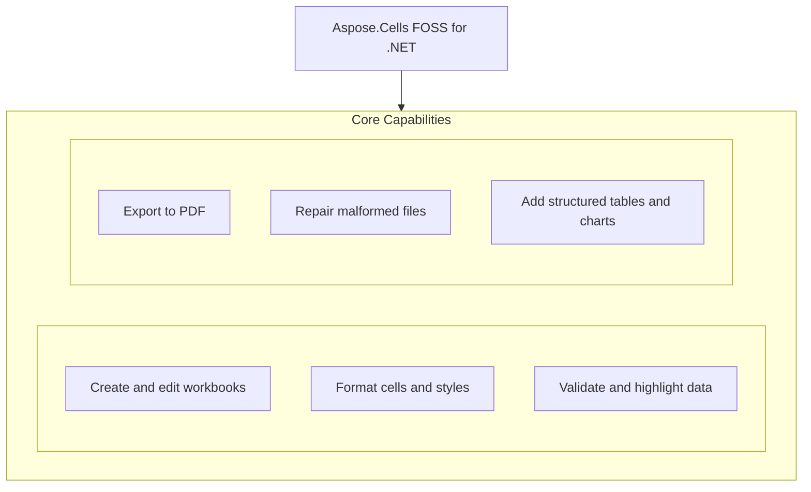

# Aspose.Cells FOSS for .NET

[](https://www.nuget.org/packages/Aspose.Cells.FOSS/) [](License/LICENSE.txt) [](https://github.com/aspose-cells-foss/Aspose.Cells-FOSS-for-.NET/graphs/contributors)

[](https://products.aspose.org/cells/net/)

Aspose.Cells FOSS for .NET is a free, open-source library that enables developers to create, read, convert, and manipulate Excel spreadsheets programmatically in .NET applications. It supports loading workbooks with repair options for corrupted files, applying styles to cells, and saving documents in XLSX and PDF formats. Users can configure page layout, add data validation, and inspect load diagnostics to detect potential data loss or repairs. The library targets netstandard2.0 and exposes core types such as `Workbook`, `Worksheet`, `Style`, `LoadOptions`, `PdfSaveOptions`, and `PageSetup`.

## Navigation

- [At a Glance](#at-a-glance)
- [Key Capabilities](#key-capabilities)
- [Installation](#installation)
- [Dependencies](#dependencies)
- [Quick Start](#quick-start)
- [Additional Examples](#additional-examples)
- [API Reference](#api-reference)
- [Documentation & Resources](#documentation--resources)
- [Scope and Limitations](#scope-and-limitations)
- [License](#license)

## At a Glance



## Key Capabilities

- **Create and edit workbooks.** Create a new workbook with the `Aspose.Cells_FOSS.Workbook` constructor or load an existing file, then edit worksheets through the `Workbook.Worksheets` collection and save the result.
- **Format cells and styles.** Apply fonts and styles to cells using `Aspose.Cells_FOSS.Style` and `Aspose.Cells_FOSS.Font` to control background, foreground, bold, color, and number formatting.
- **Validate and highlight data.** Enforce data entry rules with `Aspose.Cells_FOSS.ValidationCollection` and highlight values using `Aspose.Cells_FOSS.FormatConditionCollection` for conditional formatting.
- **Export to PDF.** Export a workbook to PDF using `Aspose.Cells_FOSS.PdfSaveOptions` to control page geometry, orientation, and one-page-per-sheet layout.
- **Repair malformed files.** Repair malformed Excel files by configuring `Aspose.Cells_FOSS.LoadOptions` with repair flags and inspecting `Aspose.Cells_FOSS.LoadDiagnostics` for potential data loss.
- **Add structured tables and charts.** Add structured Excel tables with `Aspose.Cells_FOSS.ListObject` and create charts using `Aspose.Cells_FOSS.ChartCollection` to visualize data.

## Installation

Install the published package from NuGet (`Aspose.Cells.FOSS`, version 26.9.0.0):

```bash
dotnet add package Aspose.Cells.FOSS
```

To work from a source checkout instead, build the clone with dotnet build:

```bash
git clone https://github.com/aspose-cells-foss/Aspose.Cells-FOSS-for-.NET.git
cd Aspose.Cells-FOSS-for-.NET
dotnet build
```

## Dependencies

### Required Package Dependencies

- `SkiaSharp 2.88.8`

### Native and System Requirements

- Requires .NET `netstandard2.0` (`TargetFramework` in `src/Aspose.Cells_FOSS/Aspose.Cells_FOSS.csproj`).

## Quick Start

Create a new workbook, populate a sheet with product data, apply header styling, and save the file as `products.xlsx` using `Aspose.Cells.FOSS` version 26.9.0.0 targeting netstandard2.0.

```csharp
using Aspose.Cells_FOSS;

var workbook = new Workbook();
var sheet = workbook.Worksheets[0];

sheet.Name = "Products";
sheet.Cells["A1"].PutValue("Product");
sheet.Cells["B1"].PutValue("Price");
sheet.Cells["A2"].PutValue("Apple");
sheet.Cells["B2"].PutValue(2.99m);
sheet.Cells["A3"].PutValue("Orange");
sheet.Cells["B3"].PutValue(1.99m);
sheet.Cells["B4"].Formula = "=SUM(B2:B3)";

var headerStyle = sheet.Cells["A1"].GetStyle();
headerStyle.Font.IsBold = true;
headerStyle.Font.Color = Color.FromArgb(255, 255, 255, 255);
headerStyle.Pattern = FillPattern.Solid;
headerStyle.ForegroundColor = Color.FromArgb(255, 34, 120, 212);
sheet.Cells["A1"].SetStyle(headerStyle);
sheet.Cells["B1"].SetStyle(headerStyle);

workbook.Save("products.xlsx");
```

Load a potentially corrupted Excel file with repair options enabled, check for data loss risk, update a cell, and save the repaired workbook as `updated.xlsx` using `Aspose.Cells.FOSS` version 26.9.0.0 targeting netstandard2.0.

```csharp
using System;
using Aspose.Cells_FOSS;

var loadOptions = new LoadOptions
{
    TryRepairPackage = true,
    TryRepairXml = true,
    StrictMode = false
};

var workbook = new Workbook("input.xlsx", loadOptions);

if (workbook.LoadDiagnostics.HasDataLossRisk)
{
    Console.WriteLine("Potential data loss risk detected during load.");
}

workbook.Worksheets[0].Cells["A1"].PutValue("Updated");
workbook.Save("updated.xlsx");
```

## Additional Examples

Load a workbook and convert it to PDF with A4 landscape settings, or export a worksheet to PDF with one page per sheet.

### Convert an Excel file to PDF with A4 landscape layout and one page per sheet

```csharp
using Aspose.Cells_FOSS;

var workbook = new Workbook("report.xlsx");
var sheet = workbook.Worksheets[0];

sheet.PageSetup.PaperSize = PaperSizeType.PaperA4;
sheet.PageSetup.Orientation = PageOrientationType.Landscape;

workbook.Save("report.pdf", new PdfSaveOptions
{
    OnePagePerSheet = true
});
```

Load a workbook with recovery diagnostics:

More runnable snippets adapted from the sample projects under [`samples/`](samples/README.md) are collected below.

## API Reference

Aspose.Cells FOSS for .NET exposes its public API under the `Aspose.Cells_FOSS` namespace, with `Workbook` as the root object and `Worksheet`, `Cells`, and `Cell` as the types most developers interact with day to day. The API supports reading, writing, and manipulating spreadsheet content through these core classes.

The verified public surface has 98 types.

<details>
<summary>View the Complete Public API Surface</summary>

### Core API

| Class | Description |
| --- | --- |
| `AutoFilter` | Represents auto filter. |
| `AutoFilterColorFilter` | Represents auto filter color filter. |
| `AutoFilterCustomFilter` | Represents auto filter custom filter. |
| `AutoFilterCustomFilterCollection` | Represents a collection of auto filter custom filter objects. |
| `AutoFilterDynamicFilter` | Represents auto filter dynamic filter. |
| `AutoFilterSortCondition` | Represents auto filter sort condition. |
| `AutoFilterSortConditionCollection` | Represents a collection of auto filter sort condition objects. |
| `AutoFilterSortState` | Represents auto filter sort state. |
| `AutoFilterTop10` | Represents auto filter top10. |
| `Border` | Represents border. |
| `Borders` | Represents borders. |
| `CalculationProperties` | Represents calculation properties. |
| `Cell` | Represents a single worksheet cell and exposes value, formula, and style operations. |
| `CellArea` | Represents cell area. |
| `Cells` | Provides access to worksheet cells, rows, columns, and merged ranges. |
| `CellsException` | Represents an error that occurs during cells. |
| `Chart` | Represents a chart embedded in a worksheet. |
| `ChartCollection` | Represents collection of charts on a worksheet. |
| `Color` | Represents color. |
| `Column` | Represents column. |
| `ColumnCollection` | Represents a collection of column objects. |
| `Comment` | Represents a worksheet comment (legacy note) anchored to a single cell. |
| `CommentCollection` | Represents the collection of comments (legacy notes) on a worksheet. |
| `ConditionalFormattingCollection` | Represents a collection of conditional formatting objects. |
| `CoreDocumentProperties` | Represents core document properties. |
| `DefinedName` | Represents defined name. |
| `DefinedNameCollection` | Represents a collection of defined name objects. |
| `DocumentProperties` | Represents document properties. |
| `ExtendedDocumentProperties` | Represents extended document properties. |
| `FilterColumn` | Represents filter column. |
| `FilterColumnCollection` | Represents a collection of filter column objects. |
| `FilterValueCollection` | Represents a collection of filter value objects. |
| `Font` | Represents font. |
| `FontSetting` | Represents a range of characters within a cell's rich text. |
| `FormatCondition` | Represents format condition. |
| `FormatConditionCollection` | Represents a collection of format condition objects. |
| `FormulaException` | Represents an error that occurs during formula. |
| `Hyperlink` | Represents hyperlink. |
| `HyperlinkCollection` | Encapsulates the hyperlinks defined for a worksheet. |
| `IWarningCallback` | Defines a callback that receives load warnings. |
| `InvalidFileFormatException` | Represents an error that occurs during invalid file format. |
| `ListColumn` | Represents a single column in an Excel table. |
| `ListColumnCollection` | Represents the ordered collection of columns in an Excel table. |
| `ListObject` | Represents an Excel table (structured reference / ListObject). |
| `ListObjectCollection` | Represents the collection of Excel tables on a worksheet. |
| `LoadDiagnostics` | Represents load diagnostics. |
| `LoadIssue` | Represents load issue. |
| `LoadOptions` | Specifies how a workbook should be loaded. |
| `NumberFormat` | Provides number format operations. |
| `PageSetup` | Represents worksheet print and page-layout settings. |
| `PdfSaveOptions` | Options controlling XLSX-to-PDF rendering. |
| `Picture` | Represents a picture (image) anchored to a worksheet. |
| `PictureCollection` | Represents collection of pictures anchored to a worksheet. |
| `Row` | Represents row. |
| `RowCollection` | Represents a collection of row objects. |
| `SaveOptions` | Specifies how a workbook should be saved. |
| `Shape` | Represents a drawing object (auto shape) anchored to a worksheet. |
| `ShapeCollection` | Represents collection of drawing objects (shapes) on a worksheet. |
| `Style` | Represents a mutable cell style facade that can be applied to one or more cells. |
| `StyleException` | Represents an error that occurs during style. |
| `StyleFlag` | Represents flags which indicate applied formatting properties. |
| `UnsupportedFeatureException` | Represents an error that occurs during unsupported feature. |
| `Validation` | Represents validation. |
| `ValidationCollection` | Represents a collection of validation objects. |
| `WarningInfo` | Represents warning info. |
| `Workbook` | Represents the root spreadsheet object used to create, load, modify, and save an XLSX workbook. |
| `WorkbookLoadException` | Represents an error that occurs during workbook load. |
| `WorkbookProperties` | Represents workbook properties. |
| `WorkbookProtection` | Represents workbook protection. |
| `WorkbookSaveException` | Represents an error that occurs during workbook save. |
| `WorkbookSettings` | Represents workbook-level settings that affect date handling and display formatting. |
| `WorkbookView` | Represents workbook view. |
| `Worksheet` | Encapsulates a single worksheet and its supported v0.1 worksheet features. |
| `WorksheetCollection` | Encapsulates the workbook's worksheets and active-sheet state. |
| `WorksheetProtection` | Represents worksheet protection. |

#### Enumerations

| Enumeration | Description |
| --- | --- |
| `AutoShapeType` | Specifies the type of an auto shape (preset geometry). |
| `BorderStyleType` | Specifies border style type. |
| `CellValueType` | Specifies cell value type. |
| `ChartType` | Specifies the chart type. |
| `DiagnosticSeverity` | Specifies diagnostic severity. |
| `FillPattern` | Specifies fill pattern. |
| `FilterOperatorType` | Specifies filter operator type. |
| `FontUnderlineType` | Enumerates font underline types. |
| `FormatConditionType` | Specifies format condition type. |
| `HorizontalAlignmentType` | Specifies horizontal alignment type. |
| `ImageType` | Represents the format of an image stored in a worksheet. |
| `LoadFormat` | Specifies load format. |
| `OperatorType` | Specifies operator type. |
| `PageOrientationType` | Specifies page orientation type. |
| `PaperSizeType` | Specifies paper size type. |
| `SaveFormat` | Specifies save format. |
| `TableStyleType` | Represents the built-in Excel table style types. |
| `TargetModeType` | Specifies target mode type. |
| `TotalsCalculation` | Represents the aggregation function shown in a table totals row cell. |
| `ValidationAlertType` | Specifies validation alert type. |
| `ValidationType` | Specifies validation type. |
| `VerticalAlignmentType` | Specifies vertical alignment type. |
| `VisibilityType` | Specifies visibility type. |

#### Detailed Member Reference

### Workbook

The `Workbook` class serves as the primary entry point for working with spreadsheet files, providing constructors that accept file paths, streams, and load options, and exposing properties such as Worksheets, `DefinedNames`, Properties, `DocumentProperties`, and `LoadDiagnostics`.

- `DefinedNames`: Gets the workbook-defined names collection.
- `Dispose`: Releases resources associated with the workbook instance.
- `DocumentProperties`: Gets the document properties facade for core and extended metadata.
- `LoadDiagnostics`: Gets diagnostics collected while loading the current workbook.
- `Properties`: Gets workbook metadata and view settings exposed by the supported public API.
- `Save`: Saves the workbook to an XLSX file using default save options.
- `Settings`: Gets workbook-level settings such as the date system and display culture.
- `Workbook`: Initializes a new workbook with one default worksheet.
- `Worksheets`: Gets the worksheets in workbook order.

### Cell

The `Cell` class represents an individual cell in a worksheet and provides methods such as `PutValue` and `GetStyle`, along with properties including Value, `StringValue`, `DisplayStringValue`, Formula, and Type.

- `Characters`: Returns a rich-text character range within the cell text.
- `DisplayStringValue`: Gets the display text generated from the cell value, style, and workbook culture.
- `Formula`: Gets or sets the cell formula.
- `GetCharacters`: Returns all rich-text character ranges in the cell text.
- `GetStyle`: Gets a detached copy of the cell style.
- `IsRichText`: Indicates whether the cell string contains rich-text formatting runs.
- `PutValue`: Sets the cell value to a string.
- `SetCharacters`: Sets rich-text formatting runs for the current cell text.
- `SetStyle`: Replaces the cell style with the supplied style object.
- `StringValue`: Gets a stable string representation of the cell value without applying style-based display formatting.
- `Type`: Gets the current logical cell value type.
- `Value`: Gets or sets the logical cell value.

### Style

The `Style` class enables formatting control through properties such as `Font`, `Borders`, Pattern, `ForegroundColor`, `BackgroundColor`, `NumberFormat`, `HorizontalAlignment`, `VerticalAlignment`, `WrapText`, `IsLocked`, and `IsHidden`.

- `BackgroundColor`: Gets or sets the fill background color.
- `Borders`: Gets or sets border settings.
- `Copy`: Copies data from another style object.
- `Custom`: Gets or sets the custom number format code.
- `Equals`: Determines whether two style instances are equal.
- `Font`: Gets or sets the font settings.
- `ForegroundColor`: Gets or sets the fill foreground color.
- `GetHashCode`: Serves as a hash function for a style object.
- `HorizontalAlignment`: Gets or sets the horizontal alignment.
- `IndentLevel`: Gets or sets the indentation level.
- `IsHidden`: Gets or sets whether the cell formula is hidden when worksheet protection is enabled.
- `IsLocked`: Gets or sets whether the cell is locked when worksheet protection is enabled.
- `Number`: Gets or sets the numeric format identifier.
- `NumberFormat`: Gets or sets the resolved number format string.
- `Pattern`: Gets or sets the fill pattern.
- `QuotePrefix`: Gets or sets whether the cell value starts with a single quote mark.
- `ReadingOrder`: Gets or sets the reading order.
- `RelativeIndent`: Gets or sets the relative indent.
- `ShrinkToFit`: Gets or sets whether the cell content shrinks to fit.
- `Style`: Initializes a new style with default font and border objects.
- `TextRotation`: Gets or sets the text rotation.
- `VerticalAlignment`: Gets or sets the vertical alignment.
- `WrapText`: Gets or sets whether text wraps within the cell.

### ValidationCollection

The `ValidationCollection` class manages data validation rules on a worksheet, offering methods such as Add, `GetValidationInCell`, `RemoveACell`, and `RemoveArea`, and exposing a Count property.

- `Add`: Adds the specified item.
- `Count`: Gets the number of items.
- `GetValidationInCell`: Gets the validation in cell.
- `RemoveACell`: Removes the specified item.
- `RemoveArea`: Removes the specified item.

### FormatConditionCollection

The `FormatConditionCollection` class provides conditional formatting capabilities through methods such as Add, `AddCondition`, `AddArea`, `GetCellArea`, `RemoveArea`, and `RemoveCondition`, and exposes Count and `RangeCount` properties.

- `Add`: Adds the specified item.
- `AddArea`: Adds the specified item.
- `AddCondition`: Adds the specified item.
- `Count`: Gets the number of items.
- `GetCellArea`: Gets the cell area.
- `RangeCount`: Gets the range count.
- `RemoveArea`: Removes the specified item.
- `RemoveCondition`: Removes the specified item.

### LoadOptions

The `LoadOptions` class configures how a workbook is loaded, offering properties such as `StrictMode`, `TryRepairPackage`, `TryRepairXml`, `WarningCallback`, Issues, `HasRepairs`, and `HasDataLossRisk`.

- `LoadFormat`: Gets or sets the expected input format.
- `PreserveUnsupportedParts`: Gets or sets whether unsupported parts should be preserved when possible.
- `StrictMode`: Gets or sets whether loading should reject ambiguous repairs.
- `TryRepairPackage`: Gets or sets whether package-level repairs are allowed during load.
- `TryRepairXml`: Gets or sets whether XML-level repairs are allowed during load.
- `WarningCallback`: Gets or sets a warning callback that receives recoverable-load diagnostics.

### PdfSaveOptions

The `PdfSaveOptions` class controls PDF export behavior with properties such as `SaveFormat`, `OnePagePerSheet`, `AllColumnsInOnePagePerSheet`, and `DefaultFont`.

- `AllColumnsInOnePagePerSheet`: Gets or sets whether all columns of each worksheet are rendered on a single page width.
- `CompactStyles`: Gets or sets whether equivalent styles should be compacted during save.
- `DefaultFont`: Gets or sets the fallback font family used when a cell's configured font cannot be resolved on the host system.
- `OnePagePerSheet`: Gets or sets whether all content of each worksheet is rendered onto a single PDF page.
- `PdfSaveOptions`: Initializes a new instance of the PdfSaveOptions class with SaveFormat set to Pdf.
- `PreserveRecoveryMetadata`: Gets or sets whether recovery metadata should be preserved in the saved workbook.
- `SaveFormat`: Gets or sets the output file format.
- `UseSharedStrings`: Gets or sets whether shared strings should be used for string cells.
- `ValidateBeforeSave`: Gets or sets whether the workbook should be validated before save.

### ListObject

The `ListObject` class represents an Excel table, providing methods such as Resize, `ShowAutoFilter`, `RemoveAutoFilter`, and `ConvertToRange`, and exposing properties including `DisplayName`, `TableStyleType`, `ShowTotals`, and `ListColumns`.

- `Comment`: Gets or sets an optional comment for the table.
- `ConvertToRange`: Removes the table structure, leaving the cell data in place.
- `DisplayName`: Gets or sets the user-visible table name.
- `EndColumn`: Gets the zero-based column index of the last column.
- `EndRow`: Gets the zero-based row index of the last row (last data or totals row).
- `ListColumns`: Gets the collection of columns in this table.
- `RemoveAutoFilter`: Hides the autoFilter drop-down buttons from the table header row.
- `Resize`: Resizes the table to the specified range, rebuilding columns from header cells.
- `ShowAutoFilter`: Shows the autoFilter drop-down buttons on the table header row.
- `ShowHeaderRow`: Gets or sets whether the first row of the table range is a header row.
- `ShowTableStyleColumnStripes`: Gets or sets whether alternating column stripes are shown.
- `ShowTableStyleFirstColumn`: Gets or sets whether the first column receives banding or highlight formatting.
- `ShowTableStyleLastColumn`: Gets or sets whether the last column receives banding or highlight formatting.
- `ShowTableStyleRowStripes`: Gets or sets whether alternating row stripes are shown.
- `ShowTotals`: Gets or sets whether the last row of the table range is a totals row.
- `StartColumn`: Gets the zero-based column index of the first column.
- `StartRow`: Gets the zero-based row index of the first row (header or first data row).
- `TableStyleName`: Gets or sets the raw table style name used in the SpreadsheetML tableStyleInfo element.
- `TableStyleType`: Gets or sets the built-in table style type.

### ChartCollection

The `ChartCollection` class manages chart objects on a worksheet, offering an Add method that accepts chart type, data range, and positioning parameters, and exposing a Count property.

- `Add`: Adds a new chart of the specified type to the worksheet.
- `Count`: Gets the number of charts on the worksheet.

### Worksheet

The `Worksheet` class represents a single worksheet, exposing properties such as Name, `VisibilityType`, `ShowGridlines`, `RightToLeft`, Zoom, `Cells`, Hyperlinks, Validations, `ConditionalFormattings`, `PageSetup`, Protection, `AutoFilter`, `ListObjects`, Pictures, Shapes, Charts, and Comments.

- `AutoFilter`: Gets auto-filter settings for the worksheet.
- `Cells`: Gets the cell grid facade for the worksheet.
- `Charts`: Gets the collection of charts on this worksheet.
- `Comments`: Gets the collection of comments (legacy notes) on this worksheet.
- `ConditionalFormattings`: Gets the worksheet conditional formatting collection.
- `Hyperlinks`: Gets the worksheet hyperlink collection.
- `ListObjects`: Gets the collection of Excel tables on this worksheet.
- `Name`: Gets or sets the worksheet name.
- `PageSetup`: Gets page setup settings for the worksheet.
- `Pictures`: Gets the collection of pictures on this worksheet.
- `Protect`: Marks the worksheet as protected using the current protection settings.
- `Protection`: Gets worksheet protection settings.
- `RightToLeft`: Gets or sets whether the worksheet view is right-to-left.
- `Shapes`: Gets the collection of drawing objects (shapes) on this worksheet.
- `ShowGridlines`: Gets or sets whether gridlines are shown in the worksheet view.
- `ShowRowColumnHeaders`: Gets or sets whether row and column headers are shown in the worksheet view.
- `ShowZeros`: Gets or sets whether zero values are shown in the worksheet view.
- `TabColor`: Gets or sets the worksheet tab color.
- `Unprotect`: Clears worksheet protection and resets supported protection flags.
- `Validations`: Gets the worksheet data validation collection.
- `VisibilityType`: Gets or sets the worksheet visibility state.
- `Zoom`: Gets or sets the worksheet zoom percentage.

### HyperlinkCollection

The `HyperlinkCollection` class manages hyperlinks on a worksheet, offering methods such as Add and `RemoveAt`, and exposing a Count property.

- `Add`: Adds a hyperlink anchored at a cell or rectangular range specified by its top-left A1 reference.
- `Capacity`: Gets or sets the number of elements the collection can contain before resizing.
- `Clear`: Removes all hyperlinks from the worksheet.
- `Count`: Gets the number of hyperlinks in the worksheet.
- `RemoveAt`: Removes the hyperlink at the specified zero-based index.

### DefinedNameCollection

The `DefinedNameCollection` class manages named ranges at the workbook level, offering methods such as Add and `RemoveAt`, and exposing a Count property.

- `Add`: Adds the specified item.
- `Count`: Gets the number of items.
- `GetEnumerator`: Returns an enumerator that iterates through the collection.
- `RemoveAt`: Removes the specified item.


The public API is exposed under the `Aspose.Cells_FOSS` namespace, with `Workbook` as the root object and `Worksheet`, `Cells`, and `Cell` as the types most developers interact with day to day. The table below summarizes the supported public surface present in this checkout.

- `Workbook`
  - Constructors: `Workbook()`, `Workbook(fileName)`, `Workbook(stream)`, `Workbook(fileName, options)`, `Workbook(stream, options)`
  - `Save(fileName)`, `Save(fileName, format)`, `Save(fileName, options)`, `Save(stream, format)`, `Save(stream, options)`, `Dispose()`
  - Properties: `Worksheets: WorksheetCollection`, `Settings: WorkbookSettings`, `Properties: WorkbookProperties`, `DocumentProperties: DocumentProperties`, `DefinedNames: DefinedNameCollection`, `LoadDiagnostics: LoadDiagnostics`
- `Worksheet`
  - `Protect()`, `Unprotect()`
  - Properties: `Name: string`, `VisibilityType: VisibilityType`, `ShowGridlines: bool`, `RightToLeft: bool`, `Zoom: int`, `Cells: Cells`, `Hyperlinks: HyperlinkCollection`, `Validations: ValidationCollection`, `ConditionalFormattings: ConditionalFormattingCollection`, `PageSetup: PageSetup`, `Protection: WorksheetProtection`, `AutoFilter: AutoFilter`, `ListObjects: ListObjectCollection`, `Pictures: PictureCollection`, `Shapes: ShapeCollection`, `Charts: ChartCollection`, `Comments: CommentCollection`
- `LoadOptions` / `LoadDiagnostics`
  - Properties: `StrictMode: bool`, `TryRepairPackage: bool`, `TryRepairXml: bool`, `WarningCallback: IWarningCallback`, `Issues: IReadOnlyList<LoadIssue>`, `HasRepairs: bool`, `HasDataLossRisk: bool`

- `Cell`
  - `PutValue(value)`, `PutValue(value, isConverted)`, `PutValue(value, isConverted, setStyle)`, `GetStyle()`, `GetStyle(checkBorders)`, `SetStyle(style)`, `SetStyle(style, explicitFlag)`, `SetStyle(style, flag)`
  - Properties: `Value: object`, `StringValue: string`, `DisplayStringValue: string`, `Formula: string`, `Type: CellValueType`
- `Cells`
  - `Merge(firstRow, firstColumn, totalRows, totalColumns)`
  - Properties: `Rows: RowCollection`, `Style: Style`, `Columns: ColumnCollection`, `MergedCells: IReadOnlyList<CellArea>`
- `Style`
  - `Copy(source)`, `Equals(obj)`, `GetHashCode()`
  - Properties: `Font: Font`, `Borders: Borders`, `Pattern: FillPattern`, `ForegroundColor: Color`, `BackgroundColor: Color`, `NumberFormat: string`, `HorizontalAlignment: HorizontalAlignmentType`, `VerticalAlignment: VerticalAlignmentType`, `WrapText: bool`, `IsLocked: bool`, `IsHidden: bool`
- `SaveOptions` / `PdfSaveOptions`
  - Properties: `SaveFormat: SaveFormat`, `OnePagePerSheet: bool`, `AllColumnsInOnePagePerSheet: bool`, `DefaultFont: string`

- `ValidationCollection`
  - `Add(area)`, `GetValidationInCell(row, column)`, `RemoveACell(row, column)`, `RemoveArea(cellArea)`
  - Properties: `Count: int`
- `Validation`
  - `AddArea(area)`, `RemoveArea(area)`
  - Properties: `Areas: IReadOnlyList<CellArea>`, `Type: ValidationType`, `Operator: OperatorType`, `Formula1: string`, `Formula2: string`, `AlertStyle: ValidationAlertType`, `InCellDropDown: bool`
- `ConditionalFormattingCollection`
  - `Add()`, `RemoveAt(index)`, `RemoveArea(startRow, startColumn, totalRows, totalColumns)`
  - Properties: `Count: int`
- `FormatConditionCollection`
  - `Add(area, type, operatorType, formula1, formula2)`, `AddCondition(type)`, `AddCondition(type, operatorType, formula1, formula2)`, `AddArea(area)`, `GetCellArea(index)`, `RemoveArea(index)`, `RemoveCondition(index)`
  - Properties: `Count: int`, `RangeCount: int`
- `ListObjectCollection`
  - `Add(startRow, startColumn, endRow, endColumn, hasHeaders)`, `Add(startCellName, endCellName, hasHeaders)`, `RemoveAt(index)`
  - Properties: `Count: int`
- `ListObject`
  - `Resize(startRow, startColumn, endRow, endColumn, hasHeaders)`, `ShowAutoFilter()`, `RemoveAutoFilter()`, `ConvertToRange()`
  - Properties: `DisplayName: string`, `TableStyleType: TableStyleType`, `ShowTotals: bool`, `ListColumns: ListColumnCollection`

- `HyperlinkCollection`
  - `Add(cellName, totalRows, totalColumns, address)`, `Add(firstRow, firstColumn, totalRows, totalColumns, address)`, `Add(startCellName, endCellName, address, textToDisplay, screenTip)`, `RemoveAt(index)`, `Clear()`
  - Properties: `Count: int`
- `DefinedNameCollection`
  - `Add(name, formula)`, `Add(name, formula, localSheetIndex)`, `RemoveAt(index)`
  - Properties: `Count: int`
- `ChartCollection`
  - `Add(type, dataRange, upperLeftRow, upperLeftColumn, lowerRightRow, lowerRightColumn)`
  - Properties: `Count: int`
- `Chart`
  - Properties: `Name: string`, `ChartType: ChartType`, `UpperLeftRow: int`, `UpperLeftColumn: int`, `LowerRightRow: int`, `LowerRightColumn: int`, `ExtentCx: long`, `ExtentCy: long`

- `CellsException` - base type for the library's exceptions
- `WorkbookLoadException` / `WorkbookSaveException` - raised for a failed load or save
- `InvalidFileFormatException` - the input is not a recognized XLSX package
- `StyleException` / `FormulaException` / `UnsupportedFeatureException`

</details>

## Documentation & Resources

- **[Getting started guide](https://docs.aspose.org/cells/net/)** — The getting started guide covers installation, step-by-step walkthroughs, and feature introductions for `Aspose.Cells.FOSS` targeting netstandard2.0.
- **[How-to guides & FAQ](https://kb.aspose.org/cells/net/)** — The how-to guides and FAQ provide task-focused answers for common spreadsheet operations using `Aspose.Cells.FOSS` version 26.9.0.0.
- **[Full API reference](https://reference.aspose.org/cells/net/)** — The full API reference offers a complete browsable reference for all public types in `Aspose.Cells.FOSS` for .NET. It covers all 98 verified public types; the [API Reference](#api-reference) section above covers the essentials.
- Found a bug or have a feature request? [Open an issue](https://github.com/aspose-cells-foss/Aspose.Cells-FOSS-for-.NET/issues).

## Scope and Limitations

Aspose.Cells FOSS for .NET version 26.9.0.0 targets netstandard2.0 and provides read and write capabilities for XLSX files and export to PDF, supporting structured tables and charts without formula calculation, image or HTML export, print execution, macros, VBA, or pivot tables.

- Load support is limited to XLSX using `LoadFormat`.Auto or `LoadFormat`.Xlsx, and legacy formats such as XLS, ODS, and CSV are not loaded.
- Save support currently covers XLSX and PDF only, with no image or HTML rendering output available in this checkout.
- The library does not parse, evaluate, or recalculate formulas; `Cell.Formula` stores the formula as a string without computation.
- `Worksheet.PageSetup` configures how a spreadsheet application would print the file, but the library itself does not send workbooks to a printer.
- The public API has no VBA-project or macro-related types, so macro-enabled workbooks round-trip only their non-macro content.
- Pivot tables are not part of the public API surface, while structured tables and charts are supported.

These limitations don't apply to [Aspose.Cells for .NET — Enterprise Edition](https://products.aspose.com/cells/net/). Aspose.Cells FOSS for .NET provides core spreadsheet processing capabilities, while Aspose.Cells commercial edition adds advanced features such as comprehensive charting, pivot tables, macros, and support for additional file formats including DOCX, HTML, and SVG.

## License

This project is licensed under the [MIT License](License/LICENSE.txt). The MIT License permits use, copying, modification, distribution, sublicensing, and commercial use, provided its copyright and permission notice are retained. The software is provided without warranty.
