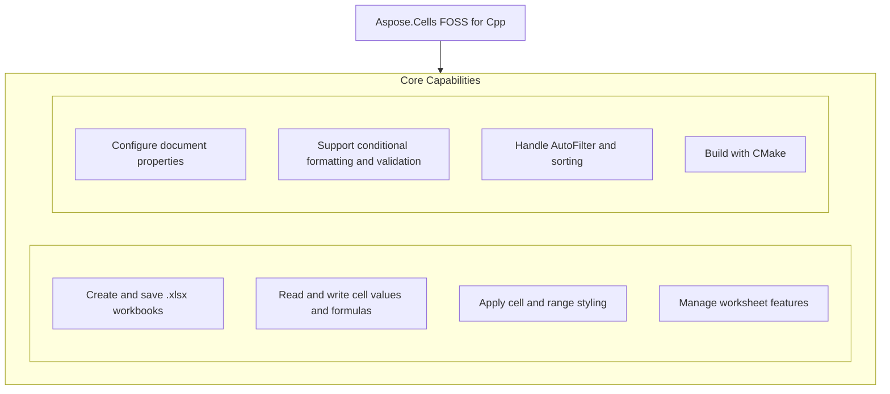

# Aspose.Cells FOSS for Cpp

[](License/LICENSE.txt) [](https://github.com/aspose-cells-foss/Aspose.Cells-FOSS-for-Cpp/graphs/contributors)

[](https://products.aspose.org/cells/cpp/)

Aspose.Cells FOSS for Cpp is a free, open-source, MIT-licensed C++ library for creating, loading, editing, and saving Excel .xlsx workbooks without requiring Microsoft Excel. It exposes an Aspose.Cells-compatible API surface for common XLSX scenarios — the same `Workbook`, `Worksheet`, and `Cell` object shape used by Aspose's commercial spreadsheet products — built as a dependency-free, header-and-source C++17 library with no external runtime dependencies.

## Navigation

- [At a Glance](#at-a-glance)
- [Key Capabilities](#key-capabilities)
- [Installation](#installation)
- [Dependencies](#dependencies)
- [Quick Start](#quick-start)
- [API Reference](#api-reference)
- [Documentation & Resources](#documentation--resources)
- [Scope and Limitations](#scope-and-limitations)
- [License](#license)

## At a Glance



## Key Capabilities

- **Create and save .xlsx workbooks.** Create a blank workbook with the default worksheet or load an existing file from a path or in-memory stream, then save it as an .xlsx file using the `SaveFormat` enumeration.
- **Read and write cell values and formulas.** Insert or retrieve cell values of multiple types including strings, integers, doubles, booleans, and dates using `PutValue` and `GetValue`, and manage formulas with `SetFormula` and `GetFormula`.
- **Apply cell and range styling.** Apply comprehensive styling to cells and ranges by setting font properties, foreground and background colors, fill patterns, and borders through the `Style` object.
- **Manage worksheet features.** Control worksheet visibility, zoom, gridlines, headers, right-to-left layout, and protection state, while also configuring page setup and hyperlink collections.
- **Configure document properties.** Access and modify core and extended document properties such as author, title, keywords, and custom metadata through the workbook's property collections.
- **Support conditional formatting and validation.** Define conditional formatting rules and data validation constraints over cell ranges to enforce input rules and visually highlight values based on criteria.
- **Handle AutoFilter and sorting.** Apply `AutoFilter` to a cell range and configure custom filters and sort conditions to organize and display data according to user-defined rules.
- **Build with CMake.** Build the library using CMake version 3.16 or higher with C++17 support and no external dependencies by cloning the repository and running the standard configure command.

## Installation

`aspose_cells_foss_cpp` is not yet published on any package registry; build it from a source checkout instead, verified against this revision:

```bash
git clone https://github.com/aspose-cells-foss/Aspose.Cells-FOSS-for-Cpp.git
cd Aspose.Cells-FOSS-for-Cpp
cmake -S . -B build
```

## Dependencies

### Required Package Dependencies

No required third-party package dependencies; in `Aspose.Cells.Foss.Cpp/CMakeLists.txt`, no dependency is on the library target's public link interface, so a consumer links nothing beyond the library itself.

### Native and System Requirements

- Requires C++ `17` (`CMAKE_CXX_STANDARD` in `Aspose.Cells.Foss.Cpp/CMakeLists.txt`).

## Quick Start

This example creates a workbook, populates a worksheet with product data and a SUM formula, applies header styling, and saves the file as `products.xlsx`.

```cpp
#include "aspose/cells_foss/Workbook.h"
#include "aspose/cells_foss/WorksheetCollection.h"
#include "aspose/cells_foss/Worksheet.h"
#include "aspose/cells_foss/Cell.h"
#include "aspose/cells_foss/Style.h"
#include "aspose/cells_foss/Color.h"
#include "aspose/cells_foss/Font.h"

using namespace Aspose::Cells_FOSS;

int main() {
    Workbook workbook;
    Worksheet& sheet = workbook.GetWorksheets()[0];

    sheet.SetName("Products");
    sheet.GetCells()["A1"].PutValue("Product");
    sheet.GetCells()["B1"].PutValue("Price");
    sheet.GetCells()["A2"].PutValue("Apple");
    sheet.GetCells()["B2"].PutValue(2.99);
    sheet.GetCells()["A3"].PutValue("Orange");
    sheet.GetCells()["B3"].PutValue(1.99);
    sheet.GetCells()["B4"].SetFormula("=SUM(B2:B3)");

    Style headerStyle = sheet.GetCells()["A1"].GetStyle();
    Font font;
    font.SetBold(true);
    font.SetColor(Color::FromArgb(255, 255, 255, 255));
    headerStyle.SetFont(font);
    headerStyle.SetPattern(FillPattern::Solid);
    headerStyle.SetForegroundColor(Color::FromArgb(255, 34, 120, 212));
    sheet.GetCells()["A1"].SetStyle(headerStyle);
    sheet.GetCells()["B1"].SetStyle(headerStyle);

    workbook.Save("products.xlsx");
    return 0;
}
```

## API Reference

Aspose.Cells FOSS for Cpp provides the `Workbook` class as the primary entry point for working with spreadsheet files, with `Worksheet`, `Cells`, and `Cell` forming the core object graph for accessing and manipulating cell data. The library supports reading, writing, and converting spreadsheet formats through dedicated classes such as `LoadFormat` and `SaveFormat`, and includes supporting modules for formatting, validation, and document properties.

The verified public surface has 195 types.

<details>
<summary>View the Complete Public API Surface</summary>

### Core API

| Class | Description |
| --- | --- |
| `AutoFilter` | Aspose.Cells_FOSS.AutoFilter represents an auto-filter applied to a range of cells in a worksheet, enabling filtering and sorting operations on tabular data. |
| `AutoFilterColorFilter` | Aspose.Cells_FOSS.AutoFilterColorFilter represents a color-based filter condition used in an auto-filter to include or exclude cells by their background or font color. |
| `AutoFilterCustomFilter` | Aspose.Cells_FOSS.AutoFilterCustomFilter represents a custom filter condition defined by an operator and a value for filtering cell contents. |
| `AutoFilterCustomFilterCollection` | Aspose.Cells_FOSS.AutoFilterCustomFilterCollection is a collection of custom filter conditions that can be applied together using logical AND or OR logic. |
| `AutoFilterCustomFilterCollection.Iterator` | Aspose.Cells_FOSS.AutoFilterCustomFilterCollection.Iterator provides sequential access to each custom filter condition stored in the collection. |
| `AutoFilterDynamicFilter` | Aspose.Cells_FOSS.AutoFilterDynamicFilter represents a dynamic filter condition such as above average or today, used to filter data based on computed criteria. |
| `AutoFilterSortCondition` | Aspose.Cells_FOSS.AutoFilterSortCondition defines a sorting rule for an auto-filtered range, including sort direction, sort by type, and optional custom lists or icon sets. |
| `AutoFilterSortConditionCollection` | Aspose.Cells_FOSS.AutoFilterSortConditionCollection holds a sequence of sort conditions applied to an auto-filtered range in order of priority. |
| `AutoFilterSortConditionCollection.Iterator` | Aspose.Cells_FOSS.AutoFilterSortConditionCollection.Iterator enables iteration over the sort conditions contained in the collection. |
| `AutoFilterSortState` | Aspose.Cells_FOSS.AutoFilterSortState stores the overall sorting configuration for an auto-filtered range, including the reference area and applied sort conditions. |
| `AutoFilterSupport` | Aspose.Cells_FOSS.AutoFilterSupport provides utility methods to manage auto-filter settings on a worksheet, such as setting the filtered range and retrieving sort state. |
| `AutoFilterTop10` | Aspose.Cells_FOSS.AutoFilterTop10 represents a top or bottom N items filter condition used to include only the largest or smallest values in an auto-filtered column. |
| `Border` | Aspose.Cells_FOSS.Border represents the border formatting of a cell or range, including style, color, and line weight. |
| `Borders` | Aspose.Cells_FOSS.Borders provides access to the individual border sides of a cell or range for setting their formatting properties. |
| `CalculationProperties` | Aspose.Cells_FOSS.CalculationProperties holds settings that control how formulas are calculated in a workbook, such as iteration options and precision mode. |
| `Cell` | Aspose.Cells_FOSS.Cell represents a single cell in a worksheet and provides methods to read or write its value, format, and style. |
| `CellArea` | Aspose.Cells_FOSS.CellArea defines a rectangular range of cells using start and end row and column indices. |
| `CellFormatValue` | Aspose.Cells_FOSS.CellFormatValue represents the formatted display string of a cell after applying number formatting rules. |
| `CellValue` | Aspose.Cells_FOSS.CellValue encapsulates the raw data stored in a cell, supporting multiple underlying types such as string, double, or boolean. |
| `Cells` | Aspose.Cells_FOSS.Cells represents the collection of all cells in a worksheet and provides indexed access to individual cells by address or index. |
| `CellsException` | Aspose.Cells_FOSS.CellsException is raised when an error occurs during cell-related operations within the library. |
| `Color` | Aspose.Cells_FOSS.Color represents a color value used for cell or font formatting, supporting ARGB components and predefined color names. |
| `Column` | Aspose.Cells_FOSS.Column represents a single column in a worksheet and provides methods to adjust its width, style, and visibility. |
| `ColumnCollection` | Aspose.Cells_FOSS.ColumnCollection is a container for all column objects in a worksheet, allowing indexed access and enumeration. |
| `ConditionalFormattingCollection` | Aspose.Cells_FOSS.ConditionalFormattingCollection holds all conditional formatting rules applied to a worksheet and supports adding or removing rules. |
| `AlignmentValue` | Aspose.Cells_FOSS.Core.AlignmentValue specifies the horizontal and vertical alignment of text within a cell. |
| `AutoFilterColorFilterModel` | Aspose.Cells_FOSS.Core.AutoFilterColorFilterModel provides a model for configuring color-based auto-filter conditions. |
| `AutoFilterCustomFilterModel` | Aspose.Cells_FOSS.Core.AutoFilterCustomFilterModel provides a model for configuring custom auto-filter conditions using operators and values. |
| `AutoFilterDynamicFilterModel` | Aspose.Cells_FOSS.Core.AutoFilterDynamicFilterModel provides a model for configuring dynamic auto-filter conditions such as above average or today. |
| `AutoFilterModel` | Aspose.Cells_FOSS.Core.AutoFilterModel provides a unified interface for creating and managing auto-filter configurations on a worksheet. |
| `AutoFilterSortConditionModel` | Aspose.Cells_FOSS.Core.AutoFilterSortConditionModel provides a model for defining sort conditions used in auto-filtered ranges. |
| `AutoFilterSortStateModel` | Aspose.Cells_FOSS.Core.AutoFilterSortStateModel provides a model for storing and applying the overall sort state of an auto-filtered range. |
| `AutoFilterTop10Model` | Aspose.Cells_FOSS.Core.AutoFilterTop10Model provides a model for configuring top or bottom N items auto-filter conditions. |
| `BorderSideValue` | Aspose.Cells_FOSS.Core.BorderSideValue specifies which side of a cell (top, bottom, left, right) a border applies to. |
| `BordersValue` | Aspose.Cells_FOSS.Core.BordersValue holds the combined border settings for all sides of a cell. |
| `CalculationPropertiesModel` | Aspose.Cells_FOSS.Core.CalculationPropertiesModel provides a model for configuring workbook-level calculation options. |
| `CellAddress` | Aspose.Cells_FOSS.Core.CellAddress represents the row and column indices of a cell within a worksheet. |
| `CellRecord` | Represents a cell record in a spreadsheet, storing its value, formula, style, and metadata such as kind and explicit storage flag. |
| `ColorValue` | Encapsulates a color using its red, green, blue, and alpha components. |
| `ColumnRangeModel` | Represents a range of columns in a worksheet, including their visibility, width, and style index. |
| `ConditionalFormattingModel` | Holds a collection of conditional formatting areas and their associated conditions for a worksheet. |
| `CoreDocumentPropertiesModel` | Provides access to core document properties such as title, author, creation date, and description. |
| `DateSerialConverter` | Converts between serial date numbers and date-time values using a specified date system. |
| `DefinedNameModel` | Represents a defined name in a workbook, associating a name with a cell reference or formula. |
| `DiagnosticBag` | Collects diagnostic entries generated during workbook processing for review and troubleshooting. |
| `DiagnosticEntry` | Represents a single diagnostic message with a severity level and descriptive text. |
| `DocumentPropertiesModel` | Extends core document properties with additional built-in properties like category and keywords. |
| `ExtendedDocumentPropertiesModel` | Provides access to extended document properties such as company name and manager. |
| `FilterColumnModel` | Represents a filtered column in a worksheet, including its index and filter criteria. |
| `FontValue` | Describes font attributes such as name, size, bold, italic, and color for text formatting. |
| `FormatConditionModel` | Represents a single format condition within a conditional formatting rule, defining its type and criteria. |
| `HeaderFooterModel` | Manages header and footer content for a worksheet, including left, center, and right sections. |
| `HyperlinkModel` | Represents a hyperlink attached to a cell, including its address, text display, and screen tip. |
| `MergeRegion` | Represents a merged cell region in a worksheet, defined by its top-left and bottom-right coordinates. |
| `NumberFormatValue` | Encapsulates a custom or built-in number format string applied to a cell. |
| `PageMarginsModel` | Stores page margin settings for a worksheet, including top, bottom, left, and right margins. |
| `PageSetupModel` | Provides page setup options for a worksheet, including orientation, paper size, and print area. |
| `PrintOptionsModel` | Controls print options for a worksheet, such as gridlines, headings, and draft quality. |
| `ProtectionValue` | Represents protection settings for a worksheet or workbook, such as password and allowed operations. |
| `RowModel` | Represents a row in a worksheet, including its height, visibility, and style index. |
| `SharedStringRepository` | Manages a shared string table used to optimize storage of repeated string values in a workbook. |
| `StyleRepository` | Stores and manages styles available for use in a workbook. |
| `StyleValue` | Encapsulates all formatting attributes for a cell, including font, alignment, border, and fill. |
| `ValidationModel` | Represents a data validation rule applied to a range of cells, including type, operator, and formulas. |
| `WorkbookModel` | Represents a workbook, providing access to worksheets, styles, defined names, and document properties. |
| `WorkbookPropertiesModel` | Stores workbook-level properties such as default sheet count and calculation settings. |
| `WorkbookProtectionModel` | Manages workbook-level protection settings, including structure and window protection. |
| `WorkbookSettingsModel` | Holds workbook-wide settings such as calculation mode, precision, and iteration options. |
| `WorkbookViewModel` | Represents the view settings for a workbook, such as window state, zoom level, and active sheet. |
| `WorksheetModel` | Represents a worksheet in a spreadsheet document and provides access to its cells, columns, rows, protection, view, and formatting settings. |
| `WorksheetProtectionModel` | Encapsulates the protection settings for a worksheet, including password hashing, algorithm configuration, and permissions for operations like formatting cells and inserting rows. |
| `WorksheetViewModel` | Stores the view settings for a worksheet, such as visibility state and tab color. |
| `CoreDocumentProperties` | Provides access to the core document properties of a spreadsheet file, such as title, author, and keywords. |
| `DateTime` | Represents a date and time value used within spreadsheet calculations and formatting. |
| `DefinedName` | Represents a defined name in a workbook, which can refer to a cell range, formula, or constant value. |
| `DefinedNameCollection` | Contains a collection of defined names in a workbook. |
| `DefinedNameUtility` | Provides utility methods for working with defined names, such as parsing and validating name references. |
| `DisplayFormatSectionInfo` | Describes a section of formatted display text, including its style and content. |
| `DisplayTextDateFormatSupport` | Supports date formatting when converting cell values to their display strings. |
| `DisplayTextFormatter` | Formats cell values into their display strings according to cell formatting rules. |
| `DisplayTextFormatterSupport` | Provides support for formatting cell values into display strings, including locale and date handling. |
| `DisplayTextLocaleSupport` | Provides locale-specific support for formatting cell values into display strings. |
| `DocumentProperties` | Encapsulates both core and extended document properties of a spreadsheet file. |
| `ExtendedDocumentProperties` | Provides access to extended document properties of a spreadsheet file, such as company name and manager. |
| `FillValue` | Represents the value used to fill a pattern in cell styling. |
| `FilterColumn` | Represents a filtered column in a worksheet's auto filter, including its filter criteria. |
| `FilterColumnCollection` | Contains a collection of filter columns used in a worksheet's auto filter. |
| `FilterColumnCollection.Iterator` | Provides an iterator to traverse the collection of filter columns in a worksheet's auto filter. |
| `FilterValueCollection` | Contains a collection of filter values used to filter data in a column. |
| `Font` | Represents the font settings used in cell styling, including name, size, color, and style attributes. |
| `FormatCondition` | Represents a conditional formatting rule applied to a cell range. |
| `FormatConditionCollection` | Contains a collection of conditional formatting rules for a worksheet. |
| `FormulaException` | Represents an exception thrown when a formula parsing or evaluation error occurs. |
| `Hyperlink` | Represents a hyperlink attached to a cell, including its address, display text, and screen tip. |
| `HyperlinkCollection` | Contains a collection of hyperlinks in a worksheet. |
| `IWarningCallback` | Defines a callback interface for receiving warnings during file loading or processing. |
| `ValidationMessage` | Represents a validation message shown to the user when input does not meet validation rules. |
| `WorkbookValidator` | Validates the data in a workbook against defined validation rules. |
| `InvalidFileFormatException` | Represents an exception thrown when a file is not in a supported or valid format. |
| `LoadDiagnostics` | Contains diagnostic information about issues encountered while loading a spreadsheet file. |
| `LoadIssue` | Represents a single issue encountered during file loading, including its description and severity. |
| `LoadOptions` | Provides options for customizing how a spreadsheet file is loaded. |
| `NumberFormat` | NumberFormat represents a number format used to display cell values in Aspose.Cells FOSS for Cpp. |
| `CaseInsensitiveEqual` | CaseInsensitiveEqual provides a case-insensitive equality comparison for string keys in packaging operations. |
| `CaseInsensitiveHash` | CaseInsensitiveHash computes a hash code for string keys in a case-insensitive manner for packaging operations. |
| `IPackageReader` | IPackageReader defines the interface for reading parts and relationships from a package in Aspose.Cells FOSS for Cpp. |
| `IPackageWriter` | IPackageWriter defines the interface for writing parts and relationships to a package in Aspose.Cells FOSS for Cpp. |
| `MissingPartException` | MissingPartException is raised when a required part is missing from a package during loading. |
| `PackageLoadContext` | PackageLoadContext provides access to the package and workbook being loaded during package loading operations. |
| `PackageModel` | PackageModel represents the in-memory structure of a package, including its parts and relationships. |
| `PackagePartDescriptor` | PackagePartDescriptor describes a part in a package, including its URI, content type, and category. |
| `PackageStructureException` | PackageStructureException is raised when the package structure is invalid or corrupted. |
| `PackagingConventions` | PackagingConventions defines the conventions and rules for organizing parts and relationships in a package. |
| `RelationshipDescriptor` | RelationshipDescriptor describes a relationship between parts in a package, including its type, target, and identifier. |
| `RelationshipResolutionException` | RelationshipResolutionException is raised when a relationship target cannot be resolved during package loading. |
| `PageSetup` | PageSetup controls page layout settings such as orientation, paper size, margins, headers, footers, and print area for a worksheet. |
| `Row` | Row represents a single row in a worksheet and provides access to its cells and formatting. |
| `RowCollection` | RowCollection contains all rows in a worksheet and provides indexed access to individual rows. |
| `SaveOptions` | SaveOptions provides configuration settings for customizing how a workbook is saved. |
| `Style` | Style defines the formatting attributes such as font, fill, border, and alignment applied to cells. |
| `StyleException` | StyleException is raised when an invalid style operation is attempted. |
| `StyleValueSanitizer` | StyleValueSanitizer ensures that style values conform to supported formats and constraints. |
| `StylesheetLoadContext` | StylesheetLoadContext provides access to the workbook and stylesheet being loaded during stylesheet loading. |
| `StylesheetSaveContext` | StylesheetSaveContext provides access to the workbook and stylesheet being saved during stylesheet saving. |
| `UnsupportedFeatureException` | UnsupportedFeatureException is raised when an unsupported feature is encountered during processing. |
| `Validation` | Validation defines data validation rules applied to cells to restrict the values that can be entered. |
| `ValidationCollection` | ValidationCollection contains all validation rules defined for a worksheet. |
| `WarningInfo` | WarningInfo provides details about a warning encountered during workbook processing. |
| `Workbook` | Workbook represents an entire Excel workbook and provides access to its worksheets, styles, and properties. |
| `WorkbookLoadException` | WorkbookLoadException is raised when an error occurs while loading a workbook from a file or stream. |
| `WorkbookProperties` | WorkbookProperties stores global settings and metadata for a workbook. |
| `WorkbookPropertySupport` | WorkbookPropertySupport provides methods to query and modify workbook property support capabilities. |
| `WorkbookProtection` | WorkbookProtection controls password-based protection options for a workbook structure and windows. |
| `WorkbookSaveException` | Represents an exception thrown when an error occurs while saving a workbook in Aspose.Cells FOSS for Cpp. |
| `WorkbookSettings` | Provides settings that control workbook-level behavior such as culture and the 1904 date system. |
| `WorkbookView` | Represents the view settings for a workbook, including window position, size, and visibility options. |
| `Worksheet` | Represents a worksheet within a workbook, providing access to cells, formatting, protection, and other sheet-level features. |
| `WorksheetCollection` | Represents a collection of worksheets contained within a workbook. |
| `WorksheetDefinedNamesState` | Encapsulates the state of defined names for a worksheet, including name-to-range mappings. |
| `WorksheetProtection` | Represents protection settings applied to a worksheet to restrict editing. |
| `XNamespace` | Represents an XML namespace used within workbook XML structures. |
| `XlsxDocumentProperties` | Encapsulates document properties for an XLSX workbook, such as title, author, and keywords. |
| `XlsxWorkbookArchiveHelpers` | Provides helper methods for working with archived XLSX workbook content. |
| `XlsxWorkbookAutoFilter` | Represents the auto-filter settings applied to a workbook. |
| `XlsxWorkbookConditionalFormatting` | Represents conditional formatting rules applied to a workbook. |
| `XlsxWorkbookDefinedNames` | Represents defined names scoped to the entire workbook. |
| `XlsxWorkbookHyperlinks` | Represents hyperlinks defined at the workbook level. |
| `XlsxWorkbookPageSetup` | Represents page setup options for the entire workbook. |
| `XlsxWorkbookProperties` | Encapsulates core workbook properties such as calculation mode and default sheet name. |
| `XlsxWorkbookSerializer` | Supports serialization of workbook data to XLSX format. |
| `XlsxWorkbookSerializerCommon` | Provides common functionality shared by workbook serializers. |
| `XlsxWorkbookStyles` | Represents the styles collection for a workbook. |
| `XlsxWorkbookStylesValueHelpers` | Provides helper methods for working with style values in a workbook. |
| `XlsxWorkbookStylesXml` | Handles XML serialization and deserialization of workbook styles. |
| `XlsxWorkbookValidations` | Represents data validation rules applied at the workbook level. |
| `XlsxWorkbookWorksheetProtection` | Encapsulates worksheet protection settings applied at the workbook level. |
| `XlsxWorkbookWorksheetViews` | Represents view settings for individual worksheets within a workbook. |
| `SharedStringTableXmlMapper` | Maps shared string table content in XML format for workbook processing. |
| `StylesheetXmlMapper` | Maps stylesheet content in XML format for workbook styling. |
| `WorkbookXmlMapper` | Maps workbook-level XML content during serialization or deserialization. |
| `WorksheetXmlMapper` | Maps worksheet-level XML content during serialization or deserialization. |
| `XmlParsingException` | Represents an exception thrown when an error occurs while parsing XML content. |
| `XmlAttribute` | Represents an XML attribute within a workbook's XML structure. |
| `XmlDocument` | Represents an XML document used in workbook processing. |
| `XmlElement` | Represents an XML element within a workbook's XML structure. |
| `XmlNodeData` | Encapsulates data associated with an XML node in workbook processing. |
| `ZipArchive` | Represents a ZIP archive used to store or retrieve XLSX workbook content. |
| `ZipArchiveEntry` | Represents a single entry within a ZIP archive used for XLSX workbook storage. |

#### Enumerations

| Enumeration | Description |
| --- | --- |
| `BorderStyleType` | Aspose.Cells_FOSS.BorderStyleType enumerates the available line styles for cell borders, such as thin, thick, or dashed. |
| `CellValueType` | Aspose.Cells_FOSS.CellValueType enumerates the possible data types that a cell value can hold, such as string, numeric, or boolean. |
| `BorderStyle` | Aspose.Cells_FOSS.Core.BorderStyle defines the line style and color of a cell border. |
| `CellValueKind` | Indicates the data type of a cell value, such as boolean, numeric, string, or error. |
| `DateSystem` | Defines the date system used for serial date calculations, such as 1900 or 1904. |
| `Core.DiagnosticSeverity` | Indicates the severity level of a diagnostic entry, such as info, warning, or error. |
| `FillPatternKind` | Specifies the fill pattern used in a cell style, such as solid, gray75, or light horizontal. |
| `HorizontalAlignment` | Specifies the horizontal alignment of text within a cell, such as left, center, or right. |
| `PageOrientation` | Specifies the page orientation for printing, such as portrait or landscape. |
| `SheetVisibility` | Specifies the visibility state of a worksheet, such as visible, hidden, or very hidden. |
| `VerticalAlignment` | Specifies the vertical alignment of text within a cell, such as top, center, or bottom. |
| `Cells_FOSS.DiagnosticSeverity` | Indicates the severity level of a diagnostic issue encountered during file loading or processing. |
| `FillPattern` | Specifies the fill pattern used in cell styling, such as solid, gray75, or light horizontal. |
| `FilterOperatorType` | Specifies the operator used in filter criteria, such as equal, greater than, or between. |
| `FormatConditionType` | Specifies the type of conditional formatting rule, such as cell value, formula, or time period. |
| `HorizontalAlignmentType` | Specifies the horizontal alignment of text in a cell, such as left, center, or right. |
| `ValidationMessageSeverity` | Indicates the severity level of a validation message, such as warning or stop. |
| `LoadFormat` | Specifies the format of a file being loaded, such as Excel 97-2003 or Excel 2007+. |
| `OperatorType` | OperatorType specifies the comparison operator used in conditional formatting and validation rules. |
| `PageOrientationType` | PageOrientationType specifies the orientation of a page when printing or exporting a worksheet. |
| `PaperSizeType` | PaperSizeType specifies the paper size used when printing or exporting a worksheet. |
| `SaveFormat` | SaveFormat specifies the file format used when saving a workbook to disk. |
| `TargetModeType` | TargetModeType specifies whether a relationship target is internal to the package or external. |
| `ValidationAlertType` | ValidationAlertType specifies the type of alert displayed when a user enters invalid data. |
| `ValidationType` | ValidationType specifies the type of data validation applied to a cell or range. |
| `VerticalAlignmentType` | VerticalAlignmentType specifies the vertical alignment of text within a cell. |
| `VisibilityType` | VisibilityType specifies whether a worksheet or row/column is visible, hidden, or collapsed. |

#### Detailed Member Reference

### Aspose

The Aspose namespace serves as the top-level container for the `Aspose.Cells_FOSS` library, which provides the core spreadsheet processing functionality for C++ developers.

### Cells_FOSS

The `Aspose.Cells_FOSS` namespace contains the main API surface including core components such as `Aspose.Cells_FOSS.Core` for fundamental operations, `Aspose.Cells_FOSS.InternalValidation` for internal validation logic, `Aspose.Cells_FOSS.Packaging` for file packaging handling, and `Aspose.Cells_FOSS.Xml` for XML processing support.

### CellFormatValue

The `Aspose.Cells_FOSS.CellFormatValue` class provides methods to get and set formatting attributes such as alignment, border ID, fill ID, font ID, number format ID, and protection settings for cell formatting, while supporting conditional formatting through `Aspose.Cells_FOSS.ConditionalFormattingCollection` and related types like `Aspose.Cells_FOSS.FormatCondition` and `Aspose.Cells_FOSS.FormatConditionCollection`.

- `CellFormatValue`: Defined as `CellFormatValue()`.
- `GetAlignment`: Defined as `Core::AlignmentValue GetAlignment()`.
- `GetBorderId`: Defined as `int GetBorderId()`.
- `GetFillId`: Defined as `int GetFillId()`.
- `GetFontId`: Defined as `int GetFontId()`.
- `GetNumFmtId`: Defined as `int GetNumFmtId()`.
- `GetProtection`: Defined as `Core::ProtectionValue GetProtection()`.
- `SetAlignment`: Defined as `void SetAlignment(Core::AlignmentValue value)`.
- `SetBorderId`: Defined as `void SetBorderId(int value)`.
- `SetFillId`: Defined as `void SetFillId(int value)`.
- `SetFontId`: Defined as `void SetFontId(int value)`.
- `SetNumFmtId`: Defined as `void SetNumFmtId(int value)`.
- `SetProtection`: Defined as `void SetProtection(Core::ProtectionValue value)`.

### AutoFilter

The `Aspose.Cells_FOSS.AutoFilter` class and its related types including `Aspose.Cells_FOSS.AutoFilterColorFilter`, `Aspose.Cells_FOSS.AutoFilterCustomFilter`, `Aspose.Cells_FOSS.AutoFilterCustomFilterCollection`, `Aspose.Cells_FOSS.AutoFilterDynamicFilter`, `Aspose.Cells_FOSS.AutoFilterSortCondition`, `Aspose.Cells_FOSS.AutoFilterSortConditionCollection`, `Aspose.Cells_FOSS.AutoFilterSortState`, `Aspose.Cells_FOSS.AutoFilterSupport`, and `Aspose.Cells_FOSS.AutoFilterTop10` provide functionality for applying and managing auto filters in spreadsheets.

- `Clear`: Defined as `void Clear()`.
- `GetFilterColumns`: Defined as `FilterColumnCollection GetFilterColumns()`.
- `GetRange`: Defined as `std::string GetRange()`.
- `GetSortState`: Defined as `AutoFilterSortState GetSortState()`.
- `SetRange`: Defined as `void SetRange(std::string value)`.

### Border

The `Aspose.Cells_FOSS.Border` class and its related types provide comprehensive support for cell borders, cell operations, and worksheet management.

- `Border`: Defined as `Border()`.
- `BorderStyleType`: Defined as `BorderStyleType BorderStyleType()`.
- `Clone`: Defined as `Border Clone()`.
- `Color`: Defined as `Color Color()`.
- `GetColor`: Defined as `Color GetColor()`.
- `GetLineStyle`: Defined as `BorderStyleType GetLineStyle()`.
- `SetColor`: Defined as `void SetColor(Color value)`.
- `SetLineStyle`: Defined as `void SetLineStyle(BorderStyleType value)`.

</details>

## Documentation & Resources

- **[Getting started guide](https://docs.aspose.org/cells/cpp/)** — The getting started guide covers installation, walkthroughs, and feature guides for `aspose_cells_foss_cpp`.
- **[How-to guides & FAQ](https://kb.aspose.org/cells/cpp/)** — The how-to guides and FAQ provide task-focused answers for common spreadsheet questions.
- **[Full API reference](https://reference.aspose.org/cells/cpp/)** — The full API reference offers a complete, browsable reference for all public types. It covers all 195 verified public types; the [API Reference](#api-reference) section above covers the essentials.
- **[Contributor guide](AGENTS.md)** — The contributor guide describes architecture, technology assumptions, and conventions for contributors.
- Found a bug or have a feature request? [Open an issue](https://github.com/aspose-cells-foss/Aspose.Cells-FOSS-for-Cpp/issues).

## Scope and Limitations

Aspose.Cells FOSS for Cpp provides read and write access to Excel workbooks in the .xlsx format using C++17, targeting Windows platforms with CMake 3.16 or later.

- Only the Xlsx member of `LoadFormat` and `SaveFormat` is implemented, and saving to any other format throws `UnsupportedFeatureException` with the message Only XLSX save is supported., while legacy SpreadsheetML and formats such as .xls, .xlsb, .ods, and .csv are not supported.
- `Cell`-level comments and notes are not modeled as a distinct object; the only Comment field in the public API belongs to `DefinedName` and represents a description string on a named range rather than an Excel cell note or threaded comment.
- Some advanced conditional-formatting rule types are recognized on load but not preserved, and an unsupported rule type is dropped with a `WarningInfo` diagnostic rather than failing the load outright.
- `AutoFilter` date-group filters using certain patterns are rejected as unsupported during load rather than approximated.
- The package ships prebuilt static libraries for Windows only, built with the MSVC v14x toolset, and errors the build for any other toolset or platform, with no Linux or macOS binaries included.
- The library is published on NuGet as Aspose.Cells.Cpp.FOSS and requires C++17 and CMake 3.16 or later.

These limitations don't apply to [Aspose.Cells for Cpp — Enterprise Edition](https://products.aspose.com/cells/cpp/). The commercial edition of Aspose.Cells FOSS for Cpp extends this package with additional file format support, advanced rendering capabilities, and enterprise-grade features.

## License

This project is licensed under the [MIT License](License/LICENSE.txt). The MIT License permits use, copying, modification, distribution, sublicensing, and commercial use, provided its copyright and permission notice are retained. The software is provided without warranty.
