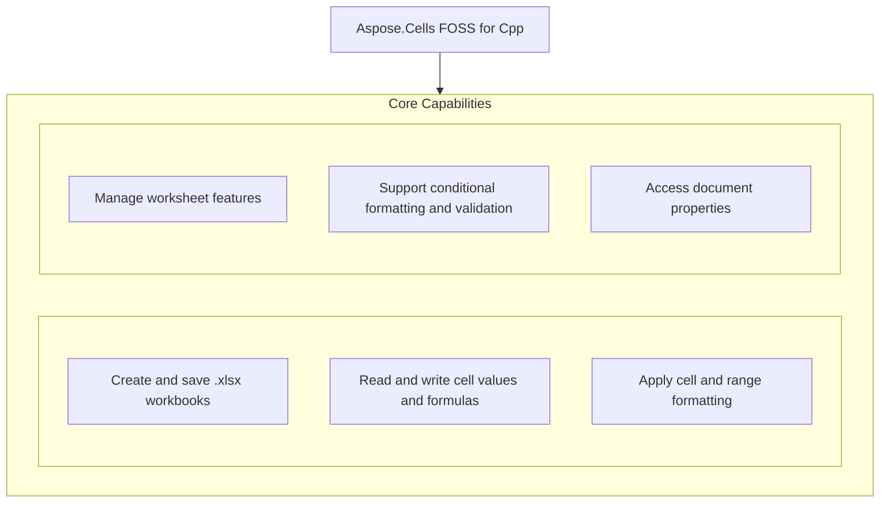

# Aspose.Cells FOSS for Cpp

[](License/LICENSE.txt) [](https://github.com/aspose-cells-foss/Aspose.Cells-FOSS-for-Cpp/graphs/contributors)

[](https://products.aspose.org/cells/cpp/)

Aspose.Cells FOSS for Cpp is a C++ library that enables developers to create, read, and convert spreadsheet files without requiring Microsoft Excel. It supports reading and writing Excel formats such as XLSX, allowing users to manipulate cells, apply styles, set formulas, and manage worksheet properties programmatically. Developers working on cross-platform applications that need spreadsheet generation or conversion capabilities use this library to automate reporting, data export, and document generation tasks. The library is built to C++17 standards and requires no external dependencies.

## Navigation

- [At a Glance](#at-a-glance)
- [Key Capabilities](#key-capabilities)
- [Installation](#installation)
- [Dependencies](#dependencies)
- [Quick Start](#quick-start)
- [API Reference](#api-reference)
- [Documentation & Resources](#documentation--resources)
- [Scope and Limitations](#scope-and-limitations)
- [License](#license)

## At a Glance


```mermaid
flowchart TD
  PRODUCT["Aspose.Cells FOSS for Cpp"]
  subgraph Capabilities["Core Capabilities"]
    direction LR
    subgraph capl[" "]
      direction TB
      c1["Create and save .xlsx workbooks"]
      c2["Read and write cell values and formulas"]
      c3["Apply cell and range formatting"]
    end
    subgraph capr[" "]
      direction TB
      c4["Manage worksheet features"]
      c5["Support conditional formatting and validation"]
      c6["Access document properties"]
    end
  end
  PRODUCT --> Capabilities
```

## Key Capabilities

- **Create and save .xlsx workbooks.** Create a blank workbook with the default constructor or load from a file path or in-memory byte vector, then save the result as an .xlsx file using the `SaveFormat` enum, as demonstrated by constructing a workbook, populating cells, applying header styles, and saving to `products.xlsx`.
- **Read and write cell values and formulas.** Insert values of multiple types—including strings, integers, doubles, and booleans—into cells using `PutValue`, retrieve the underlying variant data via `GetValue` returning a `CellValue`, and inspect or modify formulas with `SetFormula` and `GetFormula`, allowing both static and calculated content.
- **Apply cell and range formatting.** Apply comprehensive styling to cells and ranges by retrieving a `Style` with `GetStyle`, configuring its `Font` (bold, color), `FillPattern`, foreground and background `Color`, and other attributes, then persist the style back with `SetStyle`, as shown by styling header cells with a solid blue background and white bold text.
- **Manage worksheet features.** Configure worksheet-level features such as filtering with `AutoFilter`, named ranges via `DefinedNameCollection`, hyperlinks through `HyperlinkCollection`, and print layout using `PageSetup`—including paper size, orientation, margins, and print area—directly on the `Worksheet` object.
- **Support conditional formatting and validation.** Enforce data quality and visual cues by adding conditional formatting rules through `ConditionalFormattingCollection` and `FormatCondition` to highlight cells based on values, and by attaching `Validation` rules via `ValidationCollection` and `Validation` to restrict user input to specific types and ranges.
- **Access document properties.** Inspect and modify workbook metadata including core properties, extended properties, and custom settings by accessing `DocumentProperties`, `ExtendedDocumentProperties`, and `WorkbookProperties` through the `Workbook`'s `GetProperties`, `GetDocumentProperties`, and `GetSettings` methods.

## Installation

`aspose_cells_foss_cpp` is not yet published on any package registry; build it from a source checkout instead, verified against this revision:

```bash
git clone https://github.com/aspose-cells-foss/Aspose.Cells-FOSS-for-Cpp.git
cd Aspose.Cells-FOSS-for-Cpp
cmake -S . -B build
```

## Dependencies

### Required Package Dependencies

No required third-party package dependencies; in `Aspose.Cells.Foss.Cpp/CMakeLists.txt`, no dependency is on the library target's public link interface, so a consumer links nothing beyond the library itself.

### Native and System Requirements

- Requires C++ `17` (`CMAKE_CXX_STANDARD` in `Aspose.Cells.Foss.Cpp/CMakeLists.txt`).

## Quick Start

This example creates a workbook, populates a worksheet with product data and a SUM formula, applies header styling, and saves the file as `products.xlsx`. The library is dependency-free and uses a header-and-source distribution model.

```cpp
#include "aspose/cells_foss/Workbook.h"
#include "aspose/cells_foss/WorksheetCollection.h"
#include "aspose/cells_foss/Worksheet.h"
#include "aspose/cells_foss/Cell.h"
#include "aspose/cells_foss/Style.h"
#include "aspose/cells_foss/Color.h"
#include "aspose/cells_foss/Font.h"

using namespace Aspose::Cells_FOSS;

int main() {
    Workbook workbook;
    Worksheet& sheet = workbook.GetWorksheets()[0];

    sheet.SetName("Products");
    sheet.GetCells()["A1"].PutValue("Product");
    sheet.GetCells()["B1"].PutValue("Price");
    sheet.GetCells()["A2"].PutValue("Apple");
    sheet.GetCells()["B2"].PutValue(2.99);
    sheet.GetCells()["A3"].PutValue("Orange");
    sheet.GetCells()["B3"].PutValue(1.99);
    sheet.GetCells()["B4"].SetFormula("=SUM(B2:B3)");

    Style headerStyle = sheet.GetCells()["A1"].GetStyle();
    Font font;
    font.SetBold(true);
    font.SetColor(Color::FromArgb(255, 255, 255, 255));
    headerStyle.SetFont(font);
    headerStyle.SetPattern(FillPattern::Solid);
    headerStyle.SetForegroundColor(Color::FromArgb(255, 34, 120, 212));
    sheet.GetCells()["A1"].SetStyle(headerStyle);
    sheet.GetCells()["B1"].SetStyle(headerStyle);

    workbook.Save("products.xlsx");
    return 0;
}
```

## API Reference

The Aspose.Cells FOSS for Cpp library exposes the `Workbook` class as the primary entry point for working with spreadsheet files, which provides access to workbook-level settings, document properties, and the collection of worksheets.

The verified public surface has 195 types.

<details>
<summary>View the Complete Public API Surface</summary>

### Core API

| Class | Description |
| --- | --- |
| `AutoFilter` | Aspose.Cells_FOSS.AutoFilter represents an auto-filter applied to a range of cells in a worksheet, enabling filtering and sorting operations. |
| `AutoFilterColorFilter` | Aspose.Cells_FOSS.AutoFilterColorFilter represents a color-based filter condition used in an auto-filter. |
| `AutoFilterCustomFilter` | Aspose.Cells_FOSS.AutoFilterCustomFilter represents a custom filter condition defined by a comparison operator and a value. |
| `AutoFilterCustomFilterCollection` | Aspose.Cells_FOSS.AutoFilterCustomFilterCollection is a collection of custom filter conditions for an auto-filter. |
| `AutoFilterCustomFilterCollection.Iterator` | Aspose.Cells_FOSS.AutoFilterCustomFilterCollection.Iterator provides iteration over the custom filter conditions in the collection. |
| `AutoFilterDynamicFilter` | Aspose.Cells_FOSS.AutoFilterDynamicFilter represents a dynamic filter condition such as top ten or date grouping in an auto-filter. |
| `AutoFilterSortCondition` | Aspose.Cells_FOSS.AutoFilterSortCondition defines a sort criterion including the column to sort, sort order, and optional styling. |
| `AutoFilterSortConditionCollection` | Aspose.Cells_FOSS.AutoFilterSortConditionCollection is a collection of sort conditions applied to an auto-filtered range. |
| `AutoFilterSortConditionCollection.Iterator` | Aspose.Cells_FOSS.AutoFilterSortConditionCollection.Iterator enables iteration over the sort conditions in the collection. |
| `AutoFilterSortState` | Aspose.Cells_FOSS.AutoFilterSortState holds the overall sort configuration for an auto-filtered range. |
| `AutoFilterSupport` | Aspose.Cells_FOSS.AutoFilterSupport provides utility methods to manage auto-filtering capabilities in a worksheet. |
| `AutoFilterTop10` | Aspose.Cells_FOSS.AutoFilterTop10 represents a top or bottom N items or percentage filter condition in an auto-filter. |
| `Border` | Aspose.Cells_FOSS.Border represents the border properties of a cell or range, such as line style and color. |
| `Borders` | Aspose.Cells_FOSS.Borders provides access to the individual border sides of a cell or range. |
| `CalculationProperties` | Aspose.Cells_FOSS.CalculationProperties holds settings that control how formulas are calculated in a workbook. |
| `Cell` | Aspose.Cells_FOSS.Cell represents a single cell in a worksheet and provides methods to read and write its content and formatting. |
| `CellArea` | Aspose.Cells_FOSS.CellArea defines a rectangular range of cells using start and end coordinates. |
| `CellFormatValue` | Aspose.Cells_FOSS.CellFormatValue represents the formatted display string of a cell. |
| `CellValue` | Aspose.Cells_FOSS.CellValue encapsulates the raw value stored in a cell. |
| `Cells` | Aspose.Cells_FOSS.Cells provides access to all cells in a worksheet and supports operations such as inserting, copying, and clearing ranges. |
| `CellsException` | Aspose.Cells_FOSS.CellsException is raised when an error occurs during cell-related operations. |
| `Color` | Aspose.Cells_FOSS.Color represents a color value used for cell and border formatting. |
| `Column` | Aspose.Cells_FOSS.Column represents a single column in a worksheet and provides methods to manage its properties. |
| `ColumnCollection` | Aspose.Cells_FOSS.ColumnCollection is a collection of Column objects representing all columns in a worksheet. |
| `ConditionalFormattingCollection` | Aspose.Cells_FOSS.ConditionalFormattingCollection holds all conditional formatting rules applied to a worksheet. |
| `AlignmentValue` | Aspose.Cells_FOSS.Core.AlignmentValue specifies the horizontal and vertical alignment of text within a cell. |
| `AutoFilterColorFilterModel` | Aspose.Cells_FOSS.Core.AutoFilterColorFilterModel provides a model for color-based auto-filter conditions. |
| `AutoFilterCustomFilterModel` | Aspose.Cells_FOSS.Core.AutoFilterCustomFilterModel provides a model for custom auto-filter conditions. |
| `AutoFilterDynamicFilterModel` | Aspose.Cells_FOSS.Core.AutoFilterDynamicFilterModel provides a model for dynamic auto-filter conditions. |
| `AutoFilterModel` | Aspose.Cells_FOSS.Core.AutoFilterModel provides a model for the auto-filter settings of a worksheet range. |
| `AutoFilterSortConditionModel` | Aspose.Cells_FOSS.Core.AutoFilterSortConditionModel provides a model for a sort condition in an auto-filter. |
| `AutoFilterSortStateModel` | Aspose.Cells_FOSS.Core.AutoFilterSortStateModel provides a model for the overall sort state of an auto-filtered range. |
| `AutoFilterTop10Model` | Aspose.Cells_FOSS.Core.AutoFilterTop10Model provides a model for top or bottom N item auto-filter conditions. |
| `BorderSideValue` | Aspose.Cells_FOSS.Core.BorderSideValue specifies which side of a cell a border applies to. |
| `BordersValue` | Aspose.Cells_FOSS.Core.BordersValue holds the border settings for all sides of a cell. |
| `CalculationPropertiesModel` | Aspose.Cells_FOSS.Core.CalculationPropertiesModel provides a model for workbook calculation settings. |
| `CellAddress` | Aspose.Cells_FOSS.Core.CellAddress represents the row and column index of a cell. |
| `CellRecord` | Aspose.Cells_FOSS.Core.CellRecord represents a cell's value, formula, style, and metadata within a worksheet. |
| `ColorValue` | Aspose.Cells_FOSS.Core.ColorValue encapsulates a color using its red, green, blue, and alpha components. |
| `ColumnRangeModel` | Aspose.Cells_FOSS.Core.ColumnRangeModel defines a range of columns with properties like width, hidden state, and style index. |
| `ConditionalFormattingModel` | Aspose.Cells_FOSS.Core.ConditionalFormattingModel holds a collection of conditional formatting areas and their associated conditions. |
| `CoreDocumentPropertiesModel` | Aspose.Cells_FOSS.Core.CoreDocumentPropertiesModel stores core document metadata such as title, author, creation date, and description. |
| `DateSerialConverter` | Aspose.Cells_FOSS.Core.DateSerialConverter provides methods to convert between date serial numbers and date values. |
| `DefinedNameModel` | Aspose.Cells_FOSS.Core.DefinedNameModel represents a named range or formula defined within a workbook. |
| `DiagnosticBag` | Aspose.Cells_FOSS.Core.DiagnosticBag collects diagnostic entries generated during file processing. |
| `DiagnosticEntry` | Aspose.Cells_FOSS.Core.DiagnosticEntry describes a single diagnostic issue with a message, severity, and context. |
| `DocumentPropertiesModel` | Aspose.Cells_FOSS.Core.DocumentPropertiesModel combines core and extended document properties into a single interface. |
| `ExtendedDocumentPropertiesModel` | Aspose.Cells_FOSS.Core.ExtendedDocumentPropertiesModel stores extended document metadata such as company, manager, and custom properties. |
| `FilterColumnModel` | Aspose.Cells_FOSS.Core.FilterColumnModel represents a column in an AutoFilter with its filter criteria and visibility. |
| `FontValue` | Aspose.Cells_FOSS.Core.FontValue describes font attributes including name, size, color, and style. |
| `FormatConditionModel` | Aspose.Cells_FOSS.Core.FormatConditionModel defines a single conditional formatting rule with its type, operator, and style. |
| `HeaderFooterModel` | Aspose.Cells_FOSS.Core.HeaderFooterModel specifies the content and formatting of a worksheet's header and footer. |
| `HyperlinkModel` | Aspose.Cells_FOSS.Core.HyperlinkModel represents a clickable hyperlink associated with a cell range. |
| `MergeRegion` | Aspose.Cells_FOSS.Core.MergeRegion defines a rectangular area of cells that are merged into a single cell. |
| `NumberFormatValue` | Aspose.Cells_FOSS.Core.NumberFormatValue specifies the format string applied to numeric cell values. |
| `PageMarginsModel` | Aspose.Cells_FOSS.Core.PageMarginsModel sets the margin sizes for printing a worksheet. |
| `PageSetupModel` | Aspose.Cells_FOSS.Core.PageSetupModel configures page layout options including orientation, paper size, and print area. |
| `PrintOptionsModel` | Aspose.Cells_FOSS.Core.PrintOptionsModel controls how a worksheet is rendered when printed, such as gridlines and draft quality. |
| `ProtectionValue` | Aspose.Cells_FOSS.Core.ProtectionValue indicates whether a specific worksheet element is protected, such as contents or objects. |
| `RowModel` | Aspose.Cells_FOSS.Core.RowModel represents a worksheet row with properties like height, hidden state, and style. |
| `SharedStringRepository` | Aspose.Cells_FOSS.Core.SharedStringRepository manages a pool of unique string values used across a workbook to optimize storage. |
| `StyleRepository` | Aspose.Cells_FOSS.Core.StyleRepository stores and manages reusable style definitions for cells and ranges. |
| `StyleValue` | Aspose.Cells_FOSS.Core.StyleValue encapsulates all formatting attributes that can be applied to a cell. |
| `ValidationModel` | Aspose.Cells_FOSS.Core.ValidationModel defines data validation rules applied to a range of cells. |
| `WorkbookModel` | Aspose.Cells_FOSS.Core.WorkbookModel represents a complete spreadsheet workbook containing worksheets, styles, and properties. |
| `WorkbookPropertiesModel` | Aspose.Cells_FOSS.Core.WorkbookPropertiesModel stores workbook-level settings such as calculation mode and default sheet count. |
| `WorkbookProtectionModel` | Aspose.Cells_FOSS.Core.WorkbookProtectionModel controls workbook-level protection options like structure and window protection. |
| `WorkbookSettingsModel` | Aspose.Cells_FOSS.Core.WorkbookSettingsModel holds advanced workbook configuration such as precision, iteration, and reference style. |
| `WorkbookViewModel` | Aspose.Cells_FOSS.Core.WorkbookViewModel manages the visual state of the workbook, including window position and active sheet. |
| `WorksheetModel` | Represents a worksheet in a spreadsheet document and provides access to its cells, columns, rows, formatting, protection, view, and other properties. |
| `WorksheetProtectionModel` | Encapsulates the protection settings for a worksheet, including password hashing, algorithm configuration, and permissions for operations like formatting cells, inserting rows, and sorting. |
| `WorksheetViewModel` | Represents the view settings of a worksheet, such as gridlines, headers, and pane configuration. |
| `CoreDocumentProperties` | Provides access to the core document properties of a spreadsheet file, such as title, author, and keywords. |
| `DateTime` | Represents a date and time value used within spreadsheet calculations and formatting. |
| `DefinedName` | Represents a defined name in a spreadsheet, which can refer to a cell range, formula, or constant value. |
| `DefinedNameCollection` | Contains a collection of defined names for a spreadsheet document. |
| `DefinedNameUtility` | Provides utility methods for working with defined names, such as parsing and validating name references. |
| `DisplayFormatSectionInfo` | Describes formatting information for a section of displayed text in a cell. |
| `DisplayTextDateFormatSupport` | Provides support for formatting date values as display text according to locale-specific conventions. |
| `DisplayTextFormatter` | Formats cell values into their displayable string representation, respecting number and date formats. |
| `DisplayTextFormatterSupport` | Supports the formatting of cell values into display text by providing locale and date format capabilities. |
| `DisplayTextLocaleSupport` | Provides locale-specific formatting support for converting cell values into display text. |
| `DocumentProperties` | Encapsulates both core and extended document properties for a spreadsheet file. |
| `ExtendedDocumentProperties` | Provides access to extended document properties of a spreadsheet file, such as company name and manager. |
| `FillValue` | Represents the value used to fill a pattern in cell formatting. |
| `FilterColumn` | Represents a filtered column in a spreadsheet, including its filter criteria and operator. |
| `FilterColumnCollection` | Contains a collection of filter columns used for filtering data in a worksheet. |
| `FilterColumnCollection.Iterator` | Provides an iterator to traverse the collection of filter columns in a worksheet. |
| `FilterValueCollection` | Holds a collection of filter values used to filter data in a column. |
| `Font` | Represents the font settings used for text formatting in a cell. |
| `FormatCondition` | Represents a conditional formatting rule applied to a range of cells. |
| `FormatConditionCollection` | Contains a collection of conditional formatting rules for a worksheet. |
| `FormulaException` | Represents an exception thrown when a formula parsing or evaluation error occurs. |
| `Hyperlink` | Represents a hyperlink attached to a cell in a spreadsheet. |
| `HyperlinkCollection` | Contains a collection of hyperlinks associated with a worksheet. |
| `IWarningCallback` | Defines a callback interface for receiving warnings during file loading or processing. |
| `ValidationMessage` | Represents a validation message generated during workbook validation. |
| `WorkbookValidator` | Validates the structure and content of a workbook and reports issues via callback. |
| `InvalidFileFormatException` | Represents an exception thrown when a file format is not recognized or supported. |
| `LoadDiagnostics` | Provides diagnostic information about issues encountered while loading a spreadsheet file. |
| `LoadIssue` | Represents a single issue encountered during the loading of a spreadsheet file. |
| `LoadOptions` | Encapsulates options for loading a spreadsheet file, such as format detection and error handling. |
| `NumberFormat` | NumberFormat represents a number format code used to format cell values in Aspose.Cells FOSS for Cpp. |
| `CaseInsensitiveEqual` | CaseInsensitiveEqual provides a case-insensitive equality comparison for string keys in packaging operations. |
| `CaseInsensitiveHash` | CaseInsensitiveHash computes a hash value for string keys in a case-insensitive manner for packaging operations. |
| `IPackageReader` | IPackageReader defines the interface for reading parts and relationships from a package in Aspose.Cells FOSS for Cpp. |
| `IPackageWriter` | IPackageWriter defines the interface for writing parts and relationships to a package in Aspose.Cells FOSS for Cpp. |
| `MissingPartException` | MissingPartException is raised when a required part is missing from a package during loading. |
| `PackageLoadContext` | PackageLoadContext provides contextual information and access to the loaded package and workbook during package loading. |
| `PackageModel` | PackageModel represents the in-memory structure of a package, including its parts and relationships. |
| `PackagePartDescriptor` | PackagePartDescriptor describes a single part within a package, including its URI, content type, and category. |
| `PackageStructureException` | PackageStructureException is raised when the package structure does not conform to expected conventions. |
| `PackagingConventions` | PackagingConventions defines constants and rules for package structure and relationship handling. |
| `RelationshipDescriptor` | RelationshipDescriptor describes a relationship between two parts in a package, including its type, target, and identifier. |
| `RelationshipResolutionException` | RelationshipResolutionException is raised when a relationship target cannot be resolved to a part. |
| `PageSetup` | PageSetup controls page layout settings for printing a worksheet, including orientation, paper size, margins, and print area. |
| `Row` | Row represents a single row in a worksheet and provides access to its cells and formatting. |
| `RowCollection` | RowCollection is a container for all rows in a worksheet, supporting indexed access and iteration. |
| `SaveOptions` | SaveOptions provides settings that control how a workbook is saved to a specific format. |
| `Style` | Style defines the visual appearance of a cell, including font, border, fill, and alignment settings. |
| `StyleException` | StyleException is raised when an invalid style operation is attempted. |
| `StyleValueSanitizer` | StyleValueSanitizer ensures that style property values conform to supported ranges and constraints. |
| `StylesheetLoadContext` | StylesheetLoadContext provides contextual information during the loading of a workbook's stylesheet. |
| `StylesheetSaveContext` | StylesheetSaveContext provides contextual information during the saving of a workbook's stylesheet. |
| `UnsupportedFeatureException` | UnsupportedFeatureException is raised when an operation attempts to use a feature not supported by the library. |
| `Validation` | Validation defines data validation rules applied to a range of cells in a worksheet. |
| `ValidationCollection` | ValidationCollection manages all data validation rules defined for a worksheet. |
| `WarningInfo` | WarningInfo contains details about a non-fatal issue encountered during workbook processing. |
| `Workbook` | Workbook represents an entire Excel workbook and provides access to its worksheets, styles, and properties. |
| `WorkbookLoadException` | WorkbookLoadException is raised when an error occurs while loading a workbook from a file or stream. |
| `WorkbookProperties` | WorkbookProperties holds global settings for a workbook, such as calculation mode and default sheet name. |
| `WorkbookPropertySupport` | WorkbookPropertySupport indicates whether a specific workbook property is supported and modifiable. |
| `WorkbookProtection` | WorkbookProtection controls options for protecting the structure and windows of a workbook. |
| `WorkbookSaveException` | Aspose.Cells_FOSS.WorkbookSaveException represents an error that occurs when saving a workbook fails. |
| `WorkbookSettings` | Aspose.Cells_FOSS.WorkbookSettings holds global configuration options for a workbook, such as the culture and the 1904 date system. |
| `WorkbookView` | Aspose.Cells_FOSS.WorkbookView defines the visual appearance and window state of a workbook in the user interface. |
| `Worksheet` | Aspose.Cells_FOSS.Worksheet represents a single worksheet within a workbook, providing access to its cells, protection, and formatting. |
| `WorksheetCollection` | Aspose.Cells_FOSS.WorksheetCollection manages the ordered list of worksheets contained in a workbook. |
| `WorksheetDefinedNamesState` | Aspose.Cells_FOSS.WorksheetDefinedNamesState stores the defined names that are scoped to a specific worksheet. |
| `WorksheetProtection` | Aspose.Cells_FOSS.WorksheetProtection encapsulates settings that control which operations are allowed on a protected worksheet. |
| `XNamespace` | Aspose.Cells_FOSS.XNamespace represents an XML namespace used within the workbook's internal XML structures. |
| `XlsxDocumentProperties` | Aspose.Cells_FOSS.XlsxDocumentProperties holds the standard document properties for an XLSX file. |
| `XlsxWorkbookArchiveHelpers` | Aspose.Cells_FOSS.XlsxWorkbookArchiveHelpers provides utility methods for working with the ZIP archive structure of an XLSX file. |
| `XlsxWorkbookAutoFilter` | Aspose.Cells_FOSS.XlsxWorkbookAutoFilter manages the auto-filter settings applied to worksheets in a workbook. |
| `XlsxWorkbookConditionalFormatting` | Aspose.Cells_FOSS.XlsxWorkbookConditionalFormatting holds the collection of conditional formatting rules defined at the workbook level. |
| `XlsxWorkbookDefinedNames` | Aspose.Cells_FOSS.XlsxWorkbookDefinedNames stores the defined names that apply across the entire workbook. |
| `XlsxWorkbookHyperlinks` | Aspose.Cells_FOSS.XlsxWorkbookHyperlinks manages hyperlinks defined at the workbook level. |
| `XlsxWorkbookPageSetup` | Aspose.Cells_FOSS.XlsxWorkbookPageSetup defines page setup options such as orientation, paper size, and print area for the workbook. |
| `XlsxWorkbookProperties` | Aspose.Cells_FOSS.XlsxWorkbookProperties contains core metadata and settings specific to an XLSX workbook. |
| `XlsxWorkbookSerializer` | Aspose.Cells_FOSS.XlsxWorkbookSerializer handles the serialization of a workbook into the XLSX file format. |
| `XlsxWorkbookSerializerCommon` | Aspose.Cells_FOSS.XlsxWorkbookSerializerCommon provides shared functionality used during XLSX workbook serialization. |
| `XlsxWorkbookStyles` | Aspose.Cells_FOSS.XlsxWorkbookStyles manages the style definitions used throughout an XLSX workbook. |
| `XlsxWorkbookStylesValueHelpers` | Aspose.Cells_FOSS.XlsxWorkbookStylesValueHelpers offers helper methods for working with style values in an XLSX workbook. |
| `XlsxWorkbookStylesXml` | Aspose.Cells_FOSS.XlsxWorkbookStylesXml encapsulates the XML representation of styles in an XLSX workbook. |
| `XlsxWorkbookValidations` | Aspose.Cells_FOSS.XlsxWorkbookValidations holds the data validation rules defined at the workbook level. |
| `XlsxWorkbookWorksheetProtection` | Aspose.Cells_FOSS.XlsxWorkbookWorksheetProtection manages protection settings for individual worksheets within a workbook. |
| `XlsxWorkbookWorksheetViews` | Aspose.Cells_FOSS.XlsxWorkbookWorksheetViews stores view-specific settings for worksheets in an XLSX workbook. |
| `SharedStringTableXmlMapper` | Aspose.Cells_FOSS.Xml.SharedStringTableXmlMapper handles the mapping of shared string table data in an XLSX file. |
| `StylesheetXmlMapper` | Aspose.Cells_FOSS.Xml.StylesheetXmlMapper manages the mapping of stylesheet data in an XLSX file. |
| `WorkbookXmlMapper` | Aspose.Cells_FOSS.Xml.WorkbookXmlMapper handles the mapping of workbook-level XML structures in an XLSX file. |
| `WorksheetXmlMapper` | Aspose.Cells_FOSS.Xml.WorksheetXmlMapper manages the mapping of worksheet-level XML structures in an XLSX file. |
| `XmlParsingException` | Aspose.Cells_FOSS.Xml.XmlParsingException represents an error that occurs when parsing XML content within a workbook. |
| `XmlAttribute` | Aspose.Cells_FOSS.XmlAttribute represents an XML attribute within the workbook's internal XML structures. |
| `XmlDocument` | Aspose.Cells_FOSS.XmlDocument represents an XML document used in the workbook's internal XML processing. |
| `XmlElement` | Aspose.Cells_FOSS.XmlElement represents an XML element within the workbook's internal XML structures. |
| `XmlNodeData` | Aspose.Cells_FOSS.XmlNodeData provides base functionality for XML node data in the workbook's internal XML structures. |
| `ZipArchive` | Aspose.Cells_FOSS.ZipArchive represents a ZIP archive used to read or write XLSX files. |
| `ZipArchiveEntry` | Aspose.Cells_FOSS.ZipArchiveEntry represents a single entry within a ZIP archive used for XLSX file handling. |

#### Enumerations

| Enumeration | Description |
| --- | --- |
| `BorderStyleType` | Aspose.Cells_FOSS.BorderStyleType defines the available line styles for cell borders. |
| `CellValueType` | Aspose.Cells_FOSS.CellValueType indicates the data type of the value stored in a cell. |
| `BorderStyle` | Aspose.Cells_FOSS.Core.BorderStyle defines the style of a cell border such as thin, thick, or dashed. |
| `CellValueKind` | Aspose.Cells_FOSS.Core.CellValueKind indicates the data type of a cell's value, such as boolean, numeric, or string. |
| `DateSystem` | Aspose.Cells_FOSS.Core.DateSystem specifies the date system used for serial date values, such as 1900 or 1904. |
| `Core.DiagnosticSeverity` | Aspose.Cells_FOSS.Core.DiagnosticSeverity indicates the importance level of a diagnostic entry, such as warning or error. |
| `FillPatternKind` | Aspose.Cells_FOSS.Core.FillPatternKind defines the pattern used to fill a cell's background, such as solid or gradient. |
| `HorizontalAlignment` | Aspose.Cells_FOSS.Core.HorizontalAlignment indicates how text is aligned horizontally within a cell, such as left, center, or right. |
| `PageOrientation` | Aspose.Cells_FOSS.Core.PageOrientation determines whether a worksheet is printed in portrait or landscape mode. |
| `SheetVisibility` | Aspose.Cells_FOSS.Core.SheetVisibility specifies whether a worksheet is visible, hidden, or very hidden. |
| `VerticalAlignment` | Aspose.Cells_FOSS.Core.VerticalAlignment indicates how text is aligned vertically within a cell, such as top, middle, or bottom. |
| `Cells_FOSS.DiagnosticSeverity` | Indicates the severity level of a diagnostic issue encountered during file loading or processing. |
| `FillPattern` | Specifies the fill pattern used for cell background formatting. |
| `FilterOperatorType` | Defines the type of operator used in filter criteria, such as equals, greater than, or between. |
| `FormatConditionType` | Specifies the type of condition used in a conditional formatting rule, such as cell value or formula. |
| `HorizontalAlignmentType` | Defines the horizontal alignment options for text within a cell. |
| `ValidationMessageSeverity` | Indicates the severity level of a validation message, such as error or warning. |
| `LoadFormat` | Specifies the format of a file being loaded, such as Excel 97-2003 or Excel 2007+. |
| `OperatorType` | OperatorType specifies the comparison operator used in conditional formatting and validation rules. |
| `PageOrientationType` | PageOrientationType specifies the orientation of a printed page, such as portrait or landscape. |
| `PaperSizeType` | PaperSizeType specifies the standard paper size used for printing a worksheet. |
| `SaveFormat` | SaveFormat specifies the file format used when saving a workbook, such as XLSX, CSV, or PDF. |
| `TargetModeType` | TargetModeType indicates whether a relationship target is internal to the package or external. |
| `ValidationAlertType` | ValidationAlertType specifies the style of alert shown when a user enters invalid data. |
| `ValidationType` | ValidationType specifies the type of data validation applied to a cell range, such as whole number or date. |
| `VerticalAlignmentType` | VerticalAlignmentType specifies the vertical alignment of text within a cell. |
| `VisibilityType` | VisibilityType specifies whether a worksheet is visible, hidden, or very hidden. |

#### Detailed Member Reference

### Workbook

The `Aspose.Cells_FOSS.Workbook` class represents a spreadsheet file and provides methods to load, save, and manage workbook properties, document properties, settings, views, and protection, while exposing the collection of worksheets and defined names.

- `Dispose`: Defined as `void Dispose()`.
- `EnsureUniqueDefinedName`: Defined as `void EnsureUniqueDefinedName(Core::DefinedNameModel currentDefinedName, std::string_view name, std::optional<int> localSheetIndex)`.
- `EnsureUniqueSheetName`: Defined as `void EnsureUniqueSheetName(std::string_view sheetName, std::optional<std::reference_wrapper<const Core::WorksheetModel>> currentSheet)`.
- `EnsureValidDefinedNameScope`: Defined as `void EnsureValidDefinedNameScope(std::optional<int> localSheetIndex)`.
- `GetDefinedNames`: Defined as `DefinedNameCollection GetDefinedNames()`.
- `GetDefinedNamesModel`: Defined as `std::vector<Core::DefinedNameModel> GetDefinedNamesModel()`.
- `GetDocumentProperties`: Defined as `DocumentProperties GetDocumentProperties()`.
- `GetLoadDiagnostics`: Defined as `LoadDiagnostics GetLoadDiagnostics()`.
- `GetModel`: Defined as `Core::WorkbookModel GetModel()`.
- `GetProperties`: Defined as `WorkbookProperties GetProperties()`.
- `GetSettings`: Defined as `WorkbookSettings GetSettings()`.
- `GetWorksheets`: Defined as `WorksheetCollection GetWorksheets()`.
- `Save`: Defined as `void Save(std::string_view fileName)`.
- `Workbook`: Defined as `Workbook Workbook()`.

### Worksheet

The `Aspose.Cells_FOSS.Worksheet` class represents a single worksheet within a workbook and provides access to its cells, page setup, auto filter, hyperlinks, validations, conditional formatting, visibility, and protection settings.

- `GetAutoFilter`: Defined as `AutoFilter GetAutoFilter()`.
- `GetCells`: Defined as `Cells GetCells()`.
- `GetConditionalFormattings`: Defined as `ConditionalFormattingCollection GetConditionalFormattings()`.
- `GetHyperlinks`: Defined as `HyperlinkCollection GetHyperlinks()`.
- `GetModel`: Defined as `Core::WorksheetModel GetModel()`.
- `GetName`: Defined as `std::string GetName()`.
- `GetPageSetup`: Defined as `PageSetup GetPageSetup()`.
- `GetProtection`: Defined as `WorksheetProtection GetProtection()`.
- `GetRightToLeft`: Defined as `bool GetRightToLeft()`.
- `GetShowGridlines`: Defined as `bool GetShowGridlines()`.
- `GetShowRowColumnHeaders`: Defined as `bool GetShowRowColumnHeaders()`.
- `GetShowZeros`: Defined as `bool GetShowZeros()`.
- `GetTabColor`: Defined as `Color GetTabColor()`.
- `GetValidations`: Defined as `ValidationCollection GetValidations()`.
- `GetVisibilityType`: Defined as `VisibilityType GetVisibilityType()`.
- `GetWorkbook`: Defined as `Workbook GetWorkbook()`.
- `GetZoom`: Defined as `int GetZoom()`.
- `Protect`: Defined as `void Protect()`.
- `SetName`: Defined as `void SetName(std::string_view value)`.
- `SetRightToLeft`: Defined as `void SetRightToLeft(bool value)`.
- `SetShowGridlines`: Defined as `void SetShowGridlines(bool value)`.
- `SetShowRowColumnHeaders`: Defined as `void SetShowRowColumnHeaders(bool value)`.
- `SetShowZeros`: Defined as `void SetShowZeros(bool value)`.
- `SetTabColor`: Defined as `void SetTabColor(Color value)`.
- `SetVisibilityType`: Defined as `void SetVisibilityType(VisibilityType value)`.
- `SetZoom`: Defined as `void SetZoom(int value)`.
- `Unprotect`: Defined as `void Unprotect()`.
- `Worksheet`: Defined as `Worksheet Worksheet()`.

### Cell

The `Aspose.Cells_FOSS.Cell` class represents an individual cell in a worksheet and provides methods to read and write cell values, apply styles, and retrieve formatted display strings, while exposing the underlying cell value type and supporting formula evaluation.

- `GetColumn`: Defined as `int GetColumn()`.
- `GetDisplayStringValue`: Defined as `std::string GetDisplayStringValue()`.
- `GetFormula`: Defined as `std::string GetFormula()`.
- `GetRow`: Defined as `int GetRow()`.
- `GetStringValue`: Defined as `std::string GetStringValue()`.
- `GetStyle`: Defined as `Style GetStyle()`.
- `GetType`: Defined as `CellValueType GetType()`.
- `GetValue`: Defined as `CellValue GetValue()`.
- `PutValue`: Defined as `void PutValue(char value)`.
- `SetFormula`: Defined as `void SetFormula(std::string_view value)`.
- `SetStyle`: Defined as `void SetStyle(Style style)`.
- `SetValue`: Defined as `void SetValue(CellValue value)`.

### Style

The `Aspose.Cells_FOSS.Style` class defines the visual appearance of cells and supports setting font, color, fill pattern, and border properties to customize cell formatting.

- `Borders`: Defined as `Borders Borders()`.
- `Clone`: Defined as `Style Clone()`.
- `Color`: Defined as `Color Color()`.
- `FillPattern`: Defined as `FillPattern FillPattern()`.
- `Font`: Defined as `Font Font()`.
- `FromCore`: Defined as `Style FromCore(Core::StyleValue value)`.
- `GetBackgroundColor`: Defined as `Color GetBackgroundColor()`.
- `GetBorders`: Defined as `Borders GetBorders()`.
- `GetCustom`: Defined as `std::string GetCustom()`.
- `GetFont`: Defined as `Font GetFont()`.
- `GetForegroundColor`: Defined as `Color GetForegroundColor()`.
- `GetHorizontalAlignment`: Defined as `HorizontalAlignmentType GetHorizontalAlignment()`.
- `GetIndentLevel`: Defined as `int GetIndentLevel()`.
- `GetIsHidden`: Defined as `bool GetIsHidden()`.
- `GetIsLocked`: Defined as `bool GetIsLocked()`.
- `GetNumber`: Defined as `int GetNumber()`.
- `GetNumberFormat`: Defined as `std::string GetNumberFormat()`.
- `GetPattern`: Defined as `FillPattern GetPattern()`.
- `GetReadingOrder`: Defined as `int GetReadingOrder()`.
- `GetRelativeIndent`: Defined as `int GetRelativeIndent()`.
- `GetShrinkToFit`: Defined as `bool GetShrinkToFit()`.
- `GetTextRotation`: Defined as `int GetTextRotation()`.
- `GetVerticalAlignment`: Defined as `VerticalAlignmentType GetVerticalAlignment()`.
- `GetWrapText`: Defined as `bool GetWrapText()`.
- `HorizontalAlignmentType`: Defined as `HorizontalAlignmentType HorizontalAlignmentType()`.
- `SetBackgroundColor`: Defined as `void SetBackgroundColor(Color value)`.
- `SetBorders`: Defined as `void SetBorders(Borders value)`.
- `SetCustom`: Defined as `void SetCustom(std::string value)`.
- `SetFont`: Defined as `void SetFont(Font value)`.
- `SetForegroundColor`: Defined as `void SetForegroundColor(Color value)`.
- `SetHorizontalAlignment`: Defined as `void SetHorizontalAlignment(HorizontalAlignmentType value)`.
- `SetIndentLevel`: Defined as `void SetIndentLevel(int value)`.
- `SetIsHidden`: Defined as `void SetIsHidden(bool value)`.
- `SetIsLocked`: Defined as `void SetIsLocked(bool value)`.
- `SetNumber`: Defined as `void SetNumber(int value)`.
- `SetNumberFormat`: Defined as `void SetNumberFormat(std::string value)`.
- `SetPattern`: Defined as `void SetPattern(FillPattern value)`.
- `SetReadingOrder`: Defined as `void SetReadingOrder(int value)`.
- `SetRelativeIndent`: Defined as `void SetRelativeIndent(int value)`.
- `SetShrinkToFit`: Defined as `void SetShrinkToFit(bool value)`.
- `SetTextRotation`: Defined as `void SetTextRotation(int value)`.
- `SetVerticalAlignment`: Defined as `void SetVerticalAlignment(VerticalAlignmentType value)`.
- `SetWrapText`: Defined as `void SetWrapText(bool value)`.
- `ToCore`: Defined as `Core::StyleValue ToCore()`.
- `VerticalAlignmentType`: Defined as `VerticalAlignmentType VerticalAlignmentType()`.

### ConditionalFormattingCollection

The `Aspose.Cells_FOSS.ConditionalFormattingCollection` class manages conditional formatting rules applied to a worksheet and provides methods to add, remove, and configure format conditions based on cell values.

- `Add`: Defined as `int Add()`.
- `GetCount`: Defined as `int GetCount()`.
- `GetNextPriority`: Defined as `int GetNextPriority(std::vector<Core::ConditionalFormattingModel> collections)`.
- `RemoveArea`: Defined as `void RemoveArea(int startRow, int startColumn, int totalRows, int totalColumns)`.
- `RemoveAt`: Defined as `void RemoveAt(int index)`.

### ValidationCollection

The `Aspose.Cells_FOSS.ValidationCollection` class manages data validation rules applied to a worksheet and provides methods to add, remove, and configure validation types and alert behaviors.

- `Add`: Defined as `int Add(CellArea area)`.
- `AddAreaToValidation`: Defined as `void AddAreaToValidation(std::vector<Core::ValidationModel> owner, Core::ValidationModel validation, CellArea area)`.
- `AreasOverlap`: Defined as `bool AreasOverlap(CellArea left, CellArea right)`.
- `CompareAreas`: Defined as `int CompareAreas(CellArea left, CellArea right)`.
- `GetCount`: Defined as `int GetCount()`.
- `GetValidationInCell`: Defined as `std::optional<Validation> GetValidationInCell(int row, int column)`.
- `RemoveACell`: Defined as `void RemoveACell(int row, int column)`.
- `RemoveArea`: Defined as `void RemoveArea(CellArea cellArea)`.
- `RemoveAreaFromValidation`: Defined as `void RemoveAreaFromValidation(std::vector<Core::ValidationModel> owner, Core::ValidationModel validation, CellArea area)`.
- `SortAreas`: Defined as `void SortAreas(std::vector<CellArea> areas)`.

### HyperlinkCollection

The `Aspose.Cells_FOSS.HyperlinkCollection` class manages hyperlinks associated with cells in a worksheet and provides methods to add, remove, and configure hyperlink addresses and display text.

- `Add`: Defined as `int Add(int firstRow, int firstColumn, int totalRows, int totalColumns, std::string_view address)`.
- `GetCount`: Defined as `int GetCount()`.
- `RemoveAt`: Defined as `void RemoveAt(int index)`.

### DefinedNameCollection

The `Aspose.Cells_FOSS.DefinedNameCollection` class manages named ranges and formulas defined at the workbook level and provides methods to add, remove, and configure defined names with scope and comments.

- `Add`: Defined as `int Add(std::string_view name, std::string_view formula)`.
- `GetCount`: Defined as `int GetCount()`.
- `GetEnumerator`: Defined as `std::vector<DefinedName> GetEnumerator()`.
- `RemoveAt`: Defined as `void RemoveAt(int index)`.

### PageSetup

The `Aspose.Cells_FOSS.PageSetup` class controls page layout settings for a worksheet including orientation, paper size, print area, headers and footers, and scaling options.

- `AddHorizontalPageBreak`: Defined as `void AddHorizontalPageBreak(int rowIndex)`.
- `AddVerticalPageBreak`: Defined as `void AddVerticalPageBreak(int columnIndex)`.
- `ClearHorizontalPageBreaks`: Defined as `void ClearHorizontalPageBreaks()`.
- `ClearVerticalPageBreaks`: Defined as `void ClearVerticalPageBreaks()`.
- `GetBottomMargin`: Defined as `double GetBottomMargin()`.
- `GetBottomMarginInch`: Defined as `double GetBottomMarginInch()`.
- `GetCenterFooter`: Defined as `std::string GetCenterFooter()`.
- `GetCenterHeader`: Defined as `std::string GetCenterHeader()`.
- `GetCenterHorizontally`: Defined as `bool GetCenterHorizontally()`.
- `GetCenterVertically`: Defined as `bool GetCenterVertically()`.
- `GetFirstPageNumber`: Defined as `std::optional<int> GetFirstPageNumber()`.
- `GetFitToPagesTall`: Defined as `std::optional<int> GetFitToPagesTall()`.
- `GetFitToPagesWide`: Defined as `std::optional<int> GetFitToPagesWide()`.
- `GetFooterMargin`: Defined as `double GetFooterMargin()`.
- `GetFooterMarginInch`: Defined as `double GetFooterMarginInch()`.
- `GetHeaderMargin`: Defined as `double GetHeaderMargin()`.
- `GetHeaderMarginInch`: Defined as `double GetHeaderMarginInch()`.
- `GetHorizontalPageBreaks`: Defined as `std::vector<int> GetHorizontalPageBreaks()`.
- `GetLeftFooter`: Defined as `std::string GetLeftFooter()`.
- `GetLeftHeader`: Defined as `std::string GetLeftHeader()`.
- `GetLeftMargin`: Defined as `double GetLeftMargin()`.
- `GetLeftMarginInch`: Defined as `double GetLeftMarginInch()`.
- `GetOrientation`: Defined as `PageOrientationType GetOrientation()`.
- `GetPaperSize`: Defined as `PaperSizeType GetPaperSize()`.
- `GetPrintArea`: Defined as `std::string GetPrintArea()`.
- `GetPrintGridlines`: Defined as `bool GetPrintGridlines()`.
- `GetPrintHeadings`: Defined as `bool GetPrintHeadings()`.
- `GetPrintTitleColumns`: Defined as `std::string GetPrintTitleColumns()`.
- `GetPrintTitleRows`: Defined as `std::string GetPrintTitleRows()`.
- `GetRightFooter`: Defined as `std::string GetRightFooter()`.
- `GetRightHeader`: Defined as `std::string GetRightHeader()`.
- `GetRightMargin`: Defined as `double GetRightMargin()`.
- `GetRightMarginInch`: Defined as `double GetRightMarginInch()`.
- `GetScale`: Defined as `std::optional<int> GetScale()`.
- `GetTopMargin`: Defined as `double GetTopMargin()`.
- `GetTopMarginInch`: Defined as `double GetTopMarginInch()`.
- `GetVerticalPageBreaks`: Defined as `std::vector<int> GetVerticalPageBreaks()`.
- `SetBottomMargin`: Defined as `void SetBottomMargin(double value)`.
- `SetBottomMarginInch`: Defined as `void SetBottomMarginInch(double value)`.
- `SetCenterFooter`: Defined as `void SetCenterFooter(std::string_view value)`.
- `SetCenterHeader`: Defined as `void SetCenterHeader(std::string_view value)`.
- `SetCenterHorizontally`: Defined as `void SetCenterHorizontally(bool value)`.
- `SetCenterVertically`: Defined as `void SetCenterVertically(bool value)`.
- `SetFirstPageNumber`: Defined as `void SetFirstPageNumber(std::optional<int> value)`.
- `SetFitToPagesTall`: Defined as `void SetFitToPagesTall(std::optional<int> value)`.
- `SetFitToPagesWide`: Defined as `void SetFitToPagesWide(std::optional<int> value)`.
- `SetFooterMargin`: Defined as `void SetFooterMargin(double value)`.
- `SetFooterMarginInch`: Defined as `void SetFooterMarginInch(double value)`.
- `SetHeaderMargin`: Defined as `void SetHeaderMargin(double value)`.
- `SetHeaderMarginInch`: Defined as `void SetHeaderMarginInch(double value)`.
- `SetLeftFooter`: Defined as `void SetLeftFooter(std::string_view value)`.
- `SetLeftHeader`: Defined as `void SetLeftHeader(std::string_view value)`.
- `SetLeftMargin`: Defined as `void SetLeftMargin(double value)`.
- `SetLeftMarginInch`: Defined as `void SetLeftMarginInch(double value)`.
- `SetOrientation`: Defined as `void SetOrientation(PageOrientationType value)`.
- `SetPaperSize`: Defined as `void SetPaperSize(PaperSizeType value)`.
- `SetPrintArea`: Defined as `void SetPrintArea(std::string_view value)`.
- `SetPrintGridlines`: Defined as `void SetPrintGridlines(bool value)`.
- `SetPrintHeadings`: Defined as `void SetPrintHeadings(bool value)`.
- `SetPrintTitleColumns`: Defined as `void SetPrintTitleColumns(std::string_view value)`.
- `SetPrintTitleRows`: Defined as `void SetPrintTitleRows(std::string_view value)`.
- `SetRightFooter`: Defined as `void SetRightFooter(std::string_view value)`.
- `SetRightHeader`: Defined as `void SetRightHeader(std::string_view value)`.
- `SetRightMargin`: Defined as `void SetRightMargin(double value)`.
- `SetRightMarginInch`: Defined as `void SetRightMarginInch(double value)`.
- `SetScale`: Defined as `void SetScale(std::optional<int> value)`.
- `SetTopMargin`: Defined as `void SetTopMargin(double value)`.
- `SetTopMarginInch`: Defined as `void SetTopMarginInch(double value)`.

### AutoFilter

The `Aspose.Cells_FOSS.AutoFilter` class manages filtering rules applied to a range of cells in a worksheet and supports custom, dynamic, top 10, and color-based filters along with sort conditions and states.

- `Clear`: Defined as `void Clear()`.
- `GetFilterColumns`: Defined as `FilterColumnCollection GetFilterColumns()`.
- `GetRange`: Defined as `std::string GetRange()`.
- `GetSortState`: Defined as `AutoFilterSortState GetSortState()`.
- `SetRange`: Defined as `void SetRange(std::string value)`.

### Cells

The `Aspose.Cells_FOSS.Cells` class represents the collection of cells in a worksheet and provides access to rows, columns, and individual cells by index or address to read and write data.

- `GetColumns`: Defined as `ColumnCollection GetColumns()`.
- `GetMergedCells`: Defined as `std::vector<CellArea> GetMergedCells()`.
- `GetRows`: Defined as `RowCollection GetRows()`.
- `Merge`: Defined as `void Merge(int firstRow, int firstColumn, int totalRows, int totalColumns)`.

### LoadFormat

The `Aspose.Cells_FOSS.LoadFormat` enumeration specifies the format of a spreadsheet file when loading it, and the library supports multiple formats through corresponding load and save options.

</details>

## Documentation & Resources

- **[Getting started guide](https://docs.aspose.org/cells/cpp/)** — The getting started guide introduces the `aspose_cells_foss_cpp` library and demonstrates basic workbook and worksheet operations using C++17 with CMake 3.16 or later.
- **[How-to guides & FAQ](https://kb.aspose.org/cells/cpp/)** — The how-to guides and FAQ provide practical examples and answers for common tasks involving the `aspose_cells_foss_cpp` library, including formatting, validation, and page setup.
- **[Full API reference](https://reference.aspose.org/cells/cpp/)** — The full API reference documents all public classes, methods, and types available in the `aspose_cells_foss_cpp` library for C++ developers. It covers all 195 verified public types; the [API Reference](#api-reference) section above covers the essentials.
- Found a bug or have a feature request? [Open an issue](https://github.com/aspose-cells-foss/Aspose.Cells-FOSS-for-Cpp/issues).

## Scope and Limitations

Aspose.Cells FOSS for Cpp provides C++ developers with a free, open-source library to read, write, and convert spreadsheet files using the `aspose_cells_foss_cpp` package, requiring C++17 and CMake 3.16 or later.

- The library supports only the file formats and operations exposed by the `Aspose.Cells_FOSS.LoadFormat` and `Aspose.Cells_FOSS.SaveFormat` enumerations, and raises `Aspose.Cells_FOSS.UnsupportedFeatureException` when an unsupported feature is encountered.
- `DefinedName` exposes only the members `GetComment`, `GetFormula`, `GetHidden`, `GetLocalSheetIndex`, `GetName`, `SetComment`, `SetFormula`, `SetHidden`, `SetLocalSheetIndex`, and `SetName`, with no support for additional defined name properties or methods.
- `WarningInfo` exposes only the members `GetCellRef`, `GetCode`, `GetDataLossRisk`, `GetMessage`, `GetPartUri`, `GetRowIndex`, `GetSeverity`, `GetSheetName`, `SetCellRef`, `SetCode`, `SetDataLossRisk`, `SetMessage`, `SetPartUri`, `SetRowIndex`, `SetSeverity`, and `SetSheetName`, with no support for additional warning properties or methods.
- `AutoFilter` exposes only the members Clear, `GetFilterColumns`, `GetRange`, `GetSortState`, and `SetRange`, with no support for additional auto-filtering operations or state management.

These limitations don't apply to [Aspose.Cells for Cpp — Enterprise Edition](https://products.aspose.com/cells/cpp/). The commercial Aspose.Cells for C++ product extends this FOSS package with additional file formats, advanced rendering, and enterprise support.

## License

This project is licensed under the [MIT License](License/LICENSE.txt). The MIT License permits use, copying, modification, distribution, sublicensing, and commercial use, provided its copyright and permission notice are retained. The software is provided without warranty.
