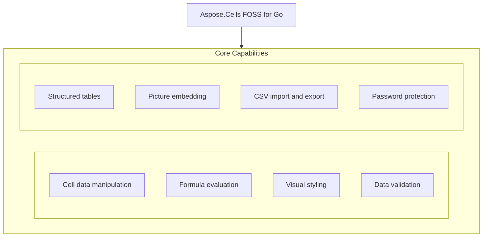

# Aspose.Cells FOSS for Go

[](https://pkg.go.dev/github.com/aspose-cells-foss/Aspose.Cells-FOSS-for-Go/v26) [](LICENSE) [](https://github.com/aspose-cells-foss/Aspose.Cells-FOSS-for-Go/graphs/contributors)

[](https://products.aspose.org/cells/go/)

Aspose.Cells FOSS for Go provides a pure Go library for reading, writing, and manipulating spreadsheet files without external dependencies, supporting operations like streaming large datasets, formula calculation, data validation, table creation, and CSV import or export. Developers use it to build applications that process Excel-compatible workbooks on servers or in command-line tools, handling tasks such as generating reports, validating user input, and converting data between formats. The library exposes a consistent API for cell access, styling, and workbook management through types like `StreamingReader`, `Workbook`, `Worksheet`, `Cells`, and `Cell`, enabling efficient and maintainable spreadsheet automation in Go.

## Navigation

- [At a Glance](#at-a-glance)
- [Key Capabilities](#key-capabilities)
- [Installation](#installation)
- [Dependencies](#dependencies)
- [Quick Start](#quick-start)
- [Additional Examples](#additional-examples)
- [API Reference](#api-reference)
- [Documentation & Resources](#documentation--resources)
- [Scope and Limitations](#scope-and-limitations)
- [Development and Testing](#development-and-testing)
- [License](#license)

## At a Glance



## Key Capabilities

- **Cell data manipulation.** Read and write cell values using `Cells.Get` and `Cells.Set`, then access or modify the underlying `Cell.Value` directly.
- **Formula evaluation.** Assign formulas to cells with `Cell.SetFormula`, retrieve them with `Cell.GetFormula`, and evaluate them using `CalculateFormula`.
- **Visual styling.** Apply visual styling to cells by constructing `Style` objects with `Font`, `Fill`, `Border`, and `Alignment` properties, then assign them via `Cell.SetStyle`.
- **Data validation.** Enforce input rules on cell ranges by creating `DataValidation` configurations and adding them to a worksheet with `Worksheet.AddDataValidation`.
- **Structured tables.** Convert a rectangular cell range into a structured `Table` with `Worksheet.AddTable`, enabling header rows and built-in table styles.
- **Picture embedding.** Embed images into a worksheet by creating `Picture` instances and adding them with `Worksheet.AddPicture`.
- **CSV import and export.** Import data from CSV files using `Workbook.ImportFromCSV` or export entire workbooks and individual worksheets via `Workbook.ExportToCSV` and `Worksheet.ToCSV`.
- **Password protection.** Protect workbooks with a password using `Workbook.SetPassword` and verify existing protection with `Workbook.VerifyPassword`.

## Installation

Install the published package from pkg.go.dev (`github.com/aspose-cells-foss/Aspose.Cells-FOSS-for-Go/v26`):

```bash
go get github.com/aspose-cells-foss/Aspose.Cells-FOSS-for-Go/v26
```

Verify the install:

```bash
go list github.com/aspose-cells-foss/Aspose.Cells-FOSS-for-Go/v26/aspose/cells_foss
```

## Dependencies

### Required Package Dependencies

No required third-party package dependencies; in `go.mod`, no `require` directive a consumer would install is declared.

### Native and System Requirements

- Requires Go `1.24.5` (`go` in `go.mod`).

## Quick Start

Create a new workbook, write values to cells A1 and B1, and save the file as `hello.xlsx`.

```go
package main

import cells_foss "github.com/aspose-cells-foss/Aspose.Cells-FOSS-for-Go/v26/aspose/cells_foss"

func main() {
	// Create.
	wb := cells_foss.NewWorkbook()
	ws := wb.Worksheets[0]

	// Write.
	ws.Cells().Set("A1", "Hello, World!")
	ws.Cells().Set("B1", 42)

	// Save.
	wb.Save("hello.xlsx")
}
```

`Load` an existing workbook, read the value in cell A1, update it, and save the changes to a new file.

```go
wb, _ := cells_foss.LoadWorkbook("input.xlsx")
ws := wb.Worksheets[0]

cell, _ := ws.Cells().Get("A1")
fmt.Println("Current value:", cell.Value)

ws.Cells().Set("A1", "Updated value")
wb.Save("output.xlsx")
```

## Additional Examples

The repository provides runnable examples for formulas, data validation, streaming, styling, tables, and CSV import.

### Create a workbook, populate sales data, add SUM and AVERAGE formulas, and evaluate them

```go
func main() {
	wb := cells_foss.NewWorkbook()
	ws := wb.Worksheets[0]

	// ---- Populate sales data ----
	data := []float64{1200, 850, 1400, 960, 1780}
	headers := []string{"Month", "Sales"}

	ws.Cells().Set("A1", headers[0])
	ws.Cells().Set("B1", headers[1])

	months := []string{"Jan", "Feb", "Mar", "Apr", "May"}
	for i, m := range months {
		row := i + 2
		ws.Cells().Set(fmt.Sprintf("A%d", row), m)
		ws.Cells().Set(fmt.Sprintf("B%d", row), data[i])
	}

	// ---- Add formula cells ----
	lastDataRow := len(data) + 1
	totalRef := fmt.Sprintf("B2:B%d", lastDataRow)

	// SUM formula.
	ws.Cells().Set("B7", nil)
	sumCell, _ := ws.Cells().Get("B7")
	sumCell.SetFormula(fmt.Sprintf("SUM(%s)", totalRef))

	// AVERAGE formula.
	ws.Cells().Set("B8", nil)
	avgCell, _ := ws.Cells().Get("B8")
	avgCell.SetFormula(fmt.Sprintf("AVERAGE(%s)", totalRef))

	// Labels.
	ws.Cells().Set("A7", "TOTAL")
	ws.Cells().Set("A8", "AVERAGE")

	// ---- Evaluate formulas with the engine ----
	for _, row := range []int{7, 8} {
		cell, _ := ws.Cells().Get(fmt.Sprintf("B%d", row))
		formula := cell.GetFormula()
		result, err := cells_foss.CalculateFormula(formula, ws)
		if err != nil {
			fmt.Printf("  %s = ERROR: %v\n", formula, err)
		} else {
			fmt.Printf("  %s = %v\n", formula, result)
		}
	}

	wb.Save("outputfiles/formula.xlsx")
}
```

<details>
<summary>View Additional Examples</summary>

### Add a dropdown list data validation to restrict cell input to predefined fruit options

```go
func main() {
	wb := cells_foss.NewWorkbook()
	ws := wb.Worksheets[0]

	ws.Cells().Set("A1", "Fruit")
	ws.Cells().Set("A2", "Apple")
	ws.Cells().Set("A3", "Banana")

	// Create a list-type data validation.
	dv := &cells_foss.DataValidation{
		Type:             cells_foss.DataValidationTypeList,
		Formula1:         `"Apple,Banana,Cherry,Dragonfruit"`,
		AllowBlank:       true,
		ShowErrorMessage: true,
		ErrorTitle:       "Invalid Fruit",
		ErrorMessage:     "Please pick a fruit from the list.",
		ErrorStyle:       cells_foss.ErrorStyleStop,
	}

	if err := ws.AddDataValidation("A2:A10", dv); err != nil {
		fmt.Printf("Error: %v\n", err)
		return
	}

	wb.Save("outputfiles/data_validation.xlsx")
}
```

### Stream a large Excel file row by row and compute the total score from column C

```go
func main() {
	sr := cells_foss.NewStreamingReader("outputfiles/streaming_data.xlsx")
	rowCount := 0
	var totalScore float64

	err := sr.ProcessRows("Sheet1", func(rowIdx int, cells map[string]string) error {
		rowCount++
		if score, ok := cells["C"+fmt.Sprint(rowIdx)]; ok {
			var s float64
			fmt.Sscanf(score, "%f", &s)
			totalScore += s
		}
		return nil
	})
	if err != nil {
		fmt.Fprintf(os.Stderr, "Error streaming: %v\n", err)
		os.Exit(1)
	}
	fmt.Printf("Streamed %d rows, total score %.0f\n", rowCount, totalScore)
}
```

### Apply bold font and solid fill styling to header cells in a new workbook

```go
func main() {
	wb := cells_foss.NewWorkbook()
	ws := wb.Worksheets[0]

	boldStyle := cells_foss.NewStyle()
	boldStyle.Font.Bold = true
	boldStyle.Font.Size = 12

	highlightStyle := cells_foss.NewStyle()
	highlightStyle.Font.Color = "FFFFFFFF"
	highlightStyle.Font.Bold = true
	highlightStyle.Fill = &cells_foss.Fill{
		Type:  cells_foss.FillTypeSolid,
		Color: "FF4472C4",
	}

	headers := []string{"Item", "Category", "Price", "In Stock"}
	for i, h := range headers {
		ref := string(rune('A'+i)) + "1"
		ws.Cells().Set(ref, h)
		cell, _ := ws.Cells().Get(ref)
		cell.SetStyle(boldStyle)
	}

	wb.Save("outputfiles/style.xlsx")
}
```

### Create a structured table with headers and apply a built-in table style

```go
func main() {
	wb := cells_foss.NewWorkbook()
	ws := wb.Worksheets[0]

	headers := []string{"Product", "Q1", "Q2", "Q3", "Q4", "Total"}
	for i, h := range headers {
		ref := string(rune('A'+i)) + "1"
		ws.Cells().Set(ref, h)
	}

	// ... populate data rows (see examples/table/main.go) ...

	tbl := ws.AddTable("A1:F6")
	tbl.HasHeaderRow = true
	tbl.StyleName = "TableStyleMedium6"

	wb.Save("outputfiles/table.xlsx")
}
```

### Import data from a CSV file into a new workbook and save it as an Excel file

```go
func main() {
	csvPath := "outputfiles/employees.csv"

	wb := cells_foss.NewWorkbook()
	if err := wb.ImportFromCSV(csvPath, "Employees", ','); err != nil {
		fmt.Fprintf(os.Stderr, "Error importing CSV: %v\n", err)
		os.Exit(1)
	}

	ws := wb.Worksheets[1] // second sheet; index 0 is the default "Sheet1"
	fmt.Printf("Imported sheet: %q\n", ws.Name)

	wb.Save("outputfiles/csv_imported.xlsx")
}
```

</details>

## API Reference

Aspose.Cells FOSS for Go provides workbook creation and manipulation through the `NewWorkbook` and `LoadWorkbook` entry points, which return a `Workbook` that exposes worksheets and cells for reading and writing data.

The verified public surface has 14 types.

<details>
<summary>View the Complete Public API Surface</summary>

### Core API

| Class | Description |
| --- | --- |
| `Alignment` | Alignment controls how cell content is positioned within the cell bounds. |
| `Border` | Border defines which sides of a cell have a visible rule and the colour of those rules. |
| `Cell` | Cell represents a single cell in a worksheet grid. |
| `Cells` | Cells is a collection of Cell values indexed by A1-style string references (e.g. |
| `DataValidation` | DataValidation represents a single data-validation rule applied to a range of cells on a worksheet. |
| `Fill` | Fill describes the background appearance of a cell. |
| `Font` | Font describes the typographic properties applied to cell text. |
| `Picture` | Picture represents an image embedded in a worksheet. |
| `RowCallback` | RowCallback is invoked by StreamingReader.ProcessRows once for every row in the worksheet. |
| `StreamingReader` | StreamingReader reads an .xlsx workbook row by row without loading the entire sheet XML into memory. |
| `Style` | Style groups font, fill, alignment, and border settings into a named formatting record. |
| `Table` | Table represents a structured range of data (a "table" in Excel terminology) with optional header row and built-in auto-filter. |
| `Workbook` | Workbook is the top-level object representing an Excel workbook. |
| `Worksheet` | Worksheet represents a single sheet within a workbook. |

#### Detailed Member Reference

### NewWorkbook

Create a new workbook with `NewWorkbook` to begin building a spreadsheet from scratch, then populate cells and save the file.

### LoadWorkbook

`Load` an existing Excel file with `LoadWorkbook` to read or modify its contents, then update cells and save the result.

### Save

Save a workbook to disk using `Workbook.Save` with a file path to persist changes in XLSX format.

### Set

Set a cell's value or formula by calling `Cells.Set` with a cell reference and the desired content.

### Get

Retrieve a cell by calling `Cells.Get` with a cell reference to access its properties and current value.

### Value

Access or update a cell's content through `Cell.Value` after retrieving the cell with `Cells.Get`.

### CalculateFormula

Evaluate a formula string in the context of a worksheet by calling `CalculateFormula` with the formula and the target worksheet.

### DataValidation

Apply data validation rules to a range by constructing a `DataValidation` object and adding it to the worksheet with `AddDataValidation`.

- `AllowBlank`: Defined as `bool`.
- `ErrorMessage`: Defined as `string`.
- `ErrorStyle`: Defined as `string`.
- `ErrorTitle`: Defined as `string`.
- `Formula1`: Defined as `string`.
- `Formula2`: Defined as `string`.
- `Ref`: Defined as `string`.
- `ShowErrorMessage`: Defined as `bool`.
- `Type`: Defined as `string`.

### StreamingReader

Process large Excel files with low memory overhead using `StreamingReader` to iterate over rows and extract data efficiently.

- `ProcessRows`: ProcessRows opens the workbook, resolves the named sheet to its XML part, loads the shared-strings table (if present), and then streams through the sheet data one row at a time, calling callback for each row.

### Style

Format cells by creating a `Style` object, configuring its font and fill properties, and applying it to a cell with `Cell.SetStyle`.

- `Alignment`: Defined as `*Alignment`.
- `Border`: Defined as `*Border`.
- `Fill`: Defined as `*Fill`.
- `Font`: Defined as `*Font`.

### Table

Convert a range of cells into a structured table by calling `Worksheet.AddTable` with a cell range and configuring `Table` properties.

- `HasHeaderRow`: Defined as `bool`.
- `Name`: Defined as `string`.
- `Range`: Defined as `string`.
- `StyleName`: Defined as `string`.

### ImportFromCSV

Import data from a CSV file into a new workbook by calling `Workbook.ImportFromCSV` with the file path, sheet name, and delimiter.

</details>

## Documentation & Resources

- **[Getting started guide](https://docs.aspose.org/cells/go/)** — The getting started guide covers loading, editing, styling, and saving spreadsheets with Aspose.Cells FOSS for Go.
- **[How-to guides & FAQ](https://kb.aspose.org/cells/go/)** — The how-to guides and FAQ provide practical examples, troubleshooting, and step-by-step instructions for common tasks in Aspose.Cells FOSS for Go.
- **[Full API reference](https://reference.aspose.org/cells/go/)** — The full API reference documents all 14 public types available in the `github.com`/aspose-cells-foss/Aspose.Cells-FOSS-for-Go/v26 package. It covers all 14 verified public types; the [API Reference](#api-reference) section above covers the essentials.
- **[docs/usage.md](docs/usage.md)** — The repository's usage documentation provides a comprehensive walkthrough beyond the README, including detailed examples and best practices.
- Found a bug or have a feature request? [Open an issue](https://github.com/aspose-cells-foss/Aspose.Cells-FOSS-for-Go/issues).

## Scope and Limitations

Aspose.Cells FOSS for Go provides a Go-native API to create, read, and convert spreadsheet workbooks in Excel-compatible formats, targeting developers who need lightweight workbook manipulation without external dependencies.

- `Cell` references must be A1-style strings such as A1 or B2, and tuple or array indices like [0, 0] are not supported.
- The `CalculateFormula` method supports only SUM, AVERAGE, MAX, and MIN; using any other formula raises an error instead of evaluating the expression.
- CSV import via `ImportFromCSV` or `FromCSV` stores every field as a Go string and does not infer numeric or boolean types, unlike `Cells()`.Set when called with typed values.
- On save, unmodified content is reused verbatim from the original XML byte-for-byte, and only content touched since load is regenerated, so round-trip fidelity depends on this split behavior rather than a full re-serialization.
- Generated XML follows ECMA-376's element ordering to preserve round-trip compatibility, and this ordering is not independently configurable.

## Development and Testing

Build and test the repository using the Go toolchain: run the full test suite with go test ./..., run only the integration tests with go test ./tests/ -v, and execute all bundled examples by changing to the examples directory and running each subdirectory with go run ./$d.

The suite covers 12 test files under `tests/`.

```bash
go test ./...
```

```bash
go test ./tests/ -v
```

Run every bundled example program:

```bash
cd examples
for d in */; do go run ./$d; done
```

`examples/` is its own Go module, with a `replace` directive already pointing it back at the
repository root — the exact version named in its `require` line never needs to resolve to a real
published release, only to satisfy Go's own version-string syntax. If building or running anything
under `examples/` reports an invalid module version, replace that line's version with any
well-formed pseudo-version for major version 26 and re-run.

Example programs under `examples/` write their output files to `examples/outputfiles/` (created
on first run) — avoid committing generated `.xlsx`/`.csv` files or that directory's contents.

## License

This project is licensed under the [MIT License](LICENSE). The MIT License permits use, copying, modification, distribution, sublicensing, and commercial use, provided its copyright and permission notice are retained. The software is provided without warranty.
