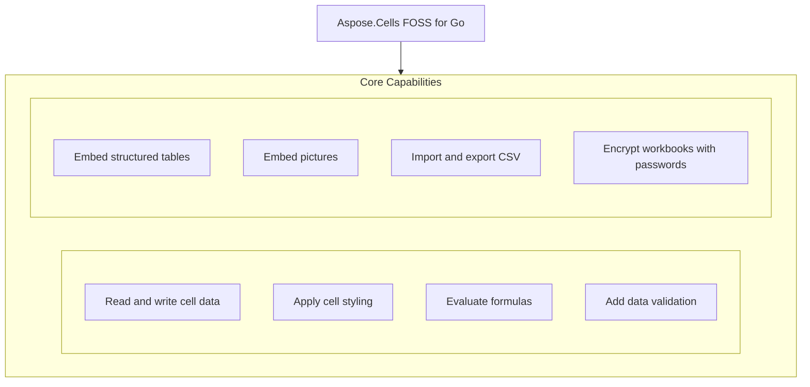

# Aspose.Cells FOSS for Go

[](https://pkg.go.dev/github.com/aspose-cells-foss/Aspose.Cells-FOSS-for-Go/v26) [](LICENSE) [](https://github.com/aspose-cells-foss/Aspose.Cells-FOSS-for-Go/graphs/contributors)

[](https://products.aspose.org/cells/go/)

Aspose.Cells FOSS for Go provides a Go library for creating, reading, and manipulating Excel workbooks without requiring Microsoft Excel. Developers use it to generate reports, process spreadsheets, and integrate spreadsheet functionality into Go applications. The library supports formula calculation, data validation, table creation, picture insertion, and streaming large datasets efficiently. It is distributed under the MIT license with no external dependencies.

## Navigation

- [At a Glance](#at-a-glance)
- [Key Capabilities](#key-capabilities)
- [Installation](#installation)
- [Dependencies](#dependencies)
- [Quick Start](#quick-start)
- [Additional Examples](#additional-examples)
- [API Reference](#api-reference)
- [Documentation & Resources](#documentation--resources)
- [Scope and Limitations](#scope-and-limitations)
- [Development and Testing](#development-and-testing)
- [License](#license)

## At a Glance



## Key Capabilities

- **Read and write cell data.** `Cell` data is read and written through `Cells.Get` and `Cells.Set` using A1-style references, supporting string, float64, int, and bool values, with `Cell.Value` exposing the stored data.
- **Apply cell styling.** `Cell` styling combines font, fill, alignment, and border properties into a `Style` created with `NewStyle` and applied to any cell via `Cell.SetStyle`, with automatic deduplication during save.
- **Evaluate formulas.** Formulas are stored on cells with `Cell.SetFormula`, retrieved with `Cell.GetFormula`, and evaluated by the built-in `CalculateFormula` engine supporting SUM, AVERAGE, MAX, and MIN over single cells or A1-style ranges.
- **Add data validation.** Data validation rules restrict cell ranges to dropdown lists or numeric ranges with custom error messages and styles, attached to a worksheet via `Worksheet.AddDataValidation`.
- **Embed structured tables.** Structured tables with header rows and auto-filters are created on a worksheet using `Worksheet.AddTable` over a cell range, supporting built-in style names like `TableStyleMedium6`.
- **Embed pictures.** Pictures in PNG or JPEG format are embedded into a worksheet using `Worksheet.AddPicture` after constructing them with `NewPicture`.
- **Import and export CSV.** CSV data is imported into a workbook with `Workbook.ImportFromCSV` using a caller-supplied delimiter, storing all fields as strings, and exported back to CSV with `Workbook.ExportToCSV` converting typed values to their string form.
- **Encrypt workbooks with passwords.** Workbooks are encrypted with passwords using `Workbook.SetPassword`, which applies ECMA-376 Agile Encryption with SHA-512 key derivation and AES-256-CBC, and verified with `Workbook.VerifyPassword`.

## Installation

Install the published package from pkg.go.dev (`github.com/aspose-cells-foss/Aspose.Cells-FOSS-for-Go/v26`):

```bash
go get github.com/aspose-cells-foss/Aspose.Cells-FOSS-for-Go/v26
```

Verify the install:

```bash
go list github.com/aspose-cells-foss/Aspose.Cells-FOSS-for-Go/v26/aspose/cells_foss
```

## Dependencies

### Required Package Dependencies

No required third-party package dependencies; in `go.mod`, no `require` directive a consumer would install is declared.

### Native and System Requirements

- Requires Go `1.24.5` (`go` in `go.mod`).

## Quick Start

Create a new workbook, write values to two cells, and save the file as `hello.xlsx`.

```go
package main

import cells_foss "github.com/aspose-cells-foss/Aspose.Cells-FOSS-for-Go/v26/aspose/cells_foss"

func main() {
	// Create.
	wb := cells_foss.NewWorkbook()
	ws := wb.Worksheets[0]

	// Write.
	ws.Cells().Set("A1", "Hello, World!")
	ws.Cells().Set("B1", 42)

	// Save.
	wb.Save("hello.xlsx")
}
```

`Load` an existing workbook, read and update a cell's value, then save the modified file as `output.xlsx`.

```go
wb, _ := cells_foss.LoadWorkbook("input.xlsx")
ws := wb.Worksheets[0]

cell, _ := ws.Cells().Get("A1")
fmt.Println("Current value:", cell.Value)

ws.Cells().Set("A1", "Updated value")
wb.Save("output.xlsx")
```

## Additional Examples

The repository includes runnable examples for formulas, data validation, streaming, styling, tables, and CSV import.

### Create a workbook, populate sales data, add SUM and AVERAGE formulas, and evaluate them

```go
func main() {
	wb := cells_foss.NewWorkbook()
	ws := wb.Worksheets[0]

	// ---- Populate sales data ----
	data := []float64{1200, 850, 1400, 960, 1780}
	headers := []string{"Month", "Sales"}

	ws.Cells().Set("A1", headers[0])
	ws.Cells().Set("B1", headers[1])

	months := []string{"Jan", "Feb", "Mar", "Apr", "May"}
	for i, m := range months {
		row := i + 2
		ws.Cells().Set(fmt.Sprintf("A%d", row), m)
		ws.Cells().Set(fmt.Sprintf("B%d", row), data[i])
	}

	// ---- Add formula cells ----
	lastDataRow := len(data) + 1
	totalRef := fmt.Sprintf("B2:B%d", lastDataRow)

	// SUM formula.
	ws.Cells().Set("B7", nil)
	sumCell, _ := ws.Cells().Get("B7")
	sumCell.SetFormula(fmt.Sprintf("SUM(%s)", totalRef))

	// AVERAGE formula.
	ws.Cells().Set("B8", nil)
	avgCell, _ := ws.Cells().Get("B8")
	avgCell.SetFormula(fmt.Sprintf("AVERAGE(%s)", totalRef))

	// Labels.
	ws.Cells().Set("A7", "TOTAL")
	ws.Cells().Set("A8", "AVERAGE")

	// ---- Evaluate formulas with the engine ----
	for _, row := range []int{7, 8} {
		cell, _ := ws.Cells().Get(fmt.Sprintf("B%d", row))
		formula := cell.GetFormula()
		result, err := cells_foss.CalculateFormula(formula, ws)
		if err != nil {
			fmt.Printf("  %s = ERROR: %v\n", formula, err)
		} else {
			fmt.Printf("  %s = %v\n", formula, result)
		}
	}

	wb.Save("outputfiles/formula.xlsx")
}
```

<details>
<summary>View Additional Examples</summary>

### Add a list-type data validation to restrict input to a predefined set of fruits

```go
func main() {
	wb := cells_foss.NewWorkbook()
	ws := wb.Worksheets[0]

	ws.Cells().Set("A1", "Fruit")
	ws.Cells().Set("A2", "Apple")
	ws.Cells().Set("A3", "Banana")

	// Create a list-type data validation.
	dv := &cells_foss.DataValidation{
		Type:             cells_foss.DataValidationTypeList,
		Formula1:         `"Apple,Banana,Cherry,Dragonfruit"`,
		AllowBlank:       true,
		ShowErrorMessage: true,
		ErrorTitle:       "Invalid Fruit",
		ErrorMessage:     "Please pick a fruit from the list.",
		ErrorStyle:       cells_foss.ErrorStyleStop,
	}

	if err := ws.AddDataValidation("A2:A10", dv); err != nil {
		fmt.Printf("Error: %v\n", err)
		return
	}

	wb.Save("outputfiles/data_validation.xlsx")
}
```

### Stream a large Excel file row by row and compute the total score from column C

```go
func main() {
	sr := cells_foss.NewStreamingReader("outputfiles/streaming_data.xlsx")
	rowCount := 0
	var totalScore float64

	err := sr.ProcessRows("Sheet1", func(rowIdx int, cells map[string]string) error {
		rowCount++
		if score, ok := cells["C"+fmt.Sprint(rowIdx)]; ok {
			var s float64
			fmt.Sscanf(score, "%f", &s)
			totalScore += s
		}
		return nil
	})
	if err != nil {
		fmt.Fprintf(os.Stderr, "Error streaming: %v\n", err)
		os.Exit(1)
	}
	fmt.Printf("Streamed %d rows, total score %.0f\n", rowCount, totalScore)
}
```

### Apply bold font and solid fill styling to header cells in a new workbook

```go
func main() {
	wb := cells_foss.NewWorkbook()
	ws := wb.Worksheets[0]

	boldStyle := cells_foss.NewStyle()
	boldStyle.Font.Bold = true
	boldStyle.Font.Size = 12

	highlightStyle := cells_foss.NewStyle()
	highlightStyle.Font.Color = "FFFFFFFF"
	highlightStyle.Font.Bold = true
	highlightStyle.Fill = &cells_foss.Fill{
		Type:  cells_foss.FillTypeSolid,
		Color: "FF4472C4",
	}

	headers := []string{"Item", "Category", "Price", "In Stock"}
	for i, h := range headers {
		ref := string(rune('A'+i)) + "1"
		ws.Cells().Set(ref, h)
		cell, _ := ws.Cells().Get(ref)
		cell.SetStyle(boldStyle)
	}

	wb.Save("outputfiles/style.xlsx")
}
```

### Create a structured table with headers and apply a built-in table style

```go
func main() {
	wb := cells_foss.NewWorkbook()
	ws := wb.Worksheets[0]

	headers := []string{"Product", "Q1", "Q2", "Q3", "Q4", "Total"}
	for i, h := range headers {
		ref := string(rune('A'+i)) + "1"
		ws.Cells().Set(ref, h)
	}

	// ... populate data rows (see examples/table/main.go) ...

	tbl := ws.AddTable("A1:F6")
	tbl.HasHeaderRow = true
	tbl.StyleName = "TableStyleMedium6"

	wb.Save("outputfiles/table.xlsx")
}
```

### Import data from a CSV file into a new workbook and save it as an Excel file

```go
func main() {
	csvPath := "outputfiles/employees.csv"

	wb := cells_foss.NewWorkbook()
	if err := wb.ImportFromCSV(csvPath, "Employees", ','); err != nil {
		fmt.Fprintf(os.Stderr, "Error importing CSV: %v\n", err)
		os.Exit(1)
	}

	ws := wb.Worksheets[1] // second sheet; index 0 is the default "Sheet1"
	fmt.Printf("Imported sheet: %q\n", ws.Name)

	wb.Save("outputfiles/csv_imported.xlsx")
}
```


Runnable programs for every capability live under `examples/` in the repository. The formula
engine example is shown directly below; the rest are collapsed for space.

</details>

## API Reference

Aspose.Cells FOSS for Go provides the `Workbook` and `Worksheet` entry points, created with `NewWorkbook` or `LoadWorkbook` and exposing cell collections via `Worksheet.Cells`. Each `Workbook` holds a Worksheets collection, and each `Worksheet` provides access to `Cells`, styling, data validation, tables, and pictures.

The verified public surface has 14 types.

<details>
<summary>View the Complete Public API Surface</summary>

### Core API

| Class | Description |
| --- | --- |
| `Alignment` | Alignment controls how cell content is positioned within the cell bounds. |
| `Border` | Border defines which sides of a cell have a visible rule and the colour of those rules. |
| `Cell` | Cell represents a single cell in a worksheet grid. |
| `Cells` | Cells is a collection of Cell values indexed by A1-style string references (e.g. |
| `DataValidation` | DataValidation represents a single data-validation rule applied to a range of cells on a worksheet. |
| `Fill` | Fill describes the background appearance of a cell. |
| `Font` | Font describes the typographic properties applied to cell text. |
| `Picture` | Picture represents an image embedded in a worksheet. |
| `RowCallback` | RowCallback is invoked by StreamingReader.ProcessRows once for every row in the worksheet. |
| `StreamingReader` | StreamingReader reads an .xlsx workbook row by row without loading the entire sheet XML into memory. |
| `Style` | Style groups font, fill, alignment, and border settings into a named formatting record. |
| `Table` | Table represents a structured range of data (a "table" in Excel terminology) with optional header row and built-in auto-filter. |
| `Workbook` | Workbook is the top-level object representing an Excel workbook. |
| `Worksheet` | Worksheet represents a single sheet within a workbook. |

#### Detailed Member Reference

### Workbook

The `Workbook` type is created with `NewWorkbook` or `LoadWorkbook`, exposes its worksheets through `Workbook.Worksheets`, supports saving with Save, password protection with `SetPassword` and `VerifyPassword`, and can import or export data using `ImportFromCSV` and `ExportToCSV`.

- `ExportToCSV`: ExportToCSV writes the worksheet at sheetIndex to a CSV file using the given delimiter (e.g.
- `FilePath`: Defined as `string`.
- `ImportFromCSV`: ImportFromCSV reads a CSV file and imports its contents into a new worksheet with the given name.
- `Modified`: Defined as `bool`.
- `Save`: Save writes the workbook to the given file path in .xlsx format.
- `SetPassword`: SetPassword configures an open password for the workbook.
- `SourceXML`: Defined as `[]byte`.
- `StylesXML`: Defined as `[]byte`.
- `VerifyPassword`: VerifyPassword reports whether pw matches the password that was used to encrypt this workbook (as set by SetPassword, or read from an encrypted file).
- `Worksheets`: Defined as `[]*Worksheet`.

### Worksheet

A `Worksheet` is obtained from a `Workbook`'s Worksheets collection and provides access to its `Cells` collection, name and index, and supports adding or removing data validation, tables, and pictures, as well as loading from or exporting to CSV with `FromCSV` and `ToCSV`.

- `AddDataValidation`: AddDataValidation appends a data-validation rule to the worksheet.
- `AddPicture`: AddPicture attaches pic to the worksheet, assigns it a unique name, and marks the workbook as modified.
- `AddTable`: AddTable creates a new Table covering the given range, assigns it a unique auto-generated name ("Table1", "Table2", …), appends it to the worksheet, and returns it for further configuration.
- `Cells`: Cells returns the Cells collection for this worksheet, enabling cell-level read and write operations via A1-style references.
- `DataValidations`: Defined as `[]*DataValidation`.
- `FromCSV`: FromCSV populates the worksheet with data from a 2D string slice.
- `GetTable`: GetTable returns the Table with the given name, or nil when no match is found.
- `Index`: Defined as `int`.
- `Name`: Defined as `string`.
- `Pictures`: Defined as `[]*Picture`.
- `RemoveDataValidation`: RemoveDataValidation removes the first data-validation rule whose Ref exactly matches the given ref string.
- `Tables`: Defined as `[]*Table`.
- `ToCSV`: ToCSV converts the worksheet's cells into a 2D string slice suitable for writing with encoding/CSV.

### Cells

The `Cells` collection provides indexed access to individual `Cell` instances through Get and Set, supports bulk operations with All, and allows removing cells with Remove.

- `All`: All returns the underlying map of all cells keyed by A1 reference.
- `Get`: Get returns the Cell at the given A1 reference.
- `Remove`: Remove deletes the cell at the given A1 reference.
- `Set`: Set stores a value at the given A1 reference.

### Cell

A `Cell` represents a single cell in a worksheet and exposes its Value and Formula, supports setting and retrieving formulas with `SetFormula` and `GetFormula`, provides its reference and XML name, and allows getting and setting its style with `StyleID`, `GetStyle`, and `SetStyle`.

- `Formula`: Defined as `xml:"f,omitempty"`.
- `GetFormula`: GetFormula returns the formula expression stored in this cell, or an empty string when the cell contains no formula.
- `GetStyle`: GetStyle returns the Style currently applied to this cell, or nil when the cell has no parent Workbook or the StyleID cannot be resolved.
- `Ref`: Defined as `xml:"r,attr"`.
- `SetFormula`: SetFormula stores a formula expression in this cell and marks the owning Workbook as modified.
- `SetStyle`: SetStyle assigns the given Style to this cell.
- `StyleID`: Defined as `xml:"s,attr,omitempty"`.
- `Value`: Defined as `xml:"v,omitempty"`.
- `XMLName`: Defined as `xml:"c"`.

### Style

The `Style` type, created with `NewStyle` or obtained via `DefaultStyle`, provides access to font, fill, alignment, and border properties through its `Font`, `Fill`, `Alignment`, and `Border` members.

- `Alignment`: Defined as `*Alignment`.
- `Border`: Defined as `*Border`.
- `Fill`: Defined as `*Fill`.
- `Font`: Defined as `*Font`.

### DataValidation

`DataValidation` defines validation rules for cell ranges, supports setting the validation Type and target Ref, specifies criteria with Formula1 and Formula2, and controls error messaging with `AllowBlank`, `ShowErrorMessage`, `ErrorTitle`, `ErrorMessage`, and `ErrorStyle`.

- `AllowBlank`: Defined as `bool`.
- `ErrorMessage`: Defined as `string`.
- `ErrorStyle`: Defined as `string`.
- `ErrorTitle`: Defined as `string`.
- `Formula1`: Defined as `string`.
- `Formula2`: Defined as `string`.
- `Ref`: Defined as `string`.
- `ShowErrorMessage`: Defined as `bool`.
- `Type`: Defined as `string`.

### Table

A `Table` is created with `NewTable` and represents a structured range with Name, Range, `HasHeaderRow`, and `StyleName`, and can be retrieved from a `Worksheet` using `GetTable`.

- `HasHeaderRow`: Defined as `bool`.
- `Name`: Defined as `string`.
- `Range`: Defined as `string`.
- `StyleName`: Defined as `string`.

### Picture

A `Picture` is created with `NewPicture`, holds its binary Data and Format, and specifies its position with Row, Col, `RowOff`, and `ColOff`, while Width and Height control its size, and `SetAnchor` finalizes its placement.

- `Col`: Defined as `int`.
- `ColOff`: Defined as `int64`.
- `Data`: Defined as `[]byte`.
- `Format`: Defined as `string`.
- `Height`: Defined as `int`.
- `Name`: Defined as `string`.
- `Row`: Defined as `int`.
- `RowOff`: Defined as `int64`.
- `SetAnchor`: SetAnchor positions the picture at the given 0-based row and column.
- `Width`: Defined as `int`.

### StreamingReader

`StreamingReader`, created with `NewStreamingReader`, processes worksheet rows efficiently using a `RowCallback` function via its `ProcessRows` method.

- `ProcessRows`: ProcessRows opens the workbook, resolves the named sheet to its XML part, loads the shared-strings table (if present), and then streams through the sheet data one row at a time, calling callback for each row.

### CalculateFormula

`CalculateFormula` computes formula results, and `CellToString` converts a `Cell`'s value to its string representation.

### Border

`Border` defines cell border styling with Top, Bottom, Left, Right, and Color properties.

- `Bottom`: Defined as `bool`.
- `Color`: Defined as `string`.
- `Left`: Defined as `bool`.
- `Right`: Defined as `bool`.
- `Top`: Defined as `bool`.

### Alignment

`Alignment` controls text alignment within a cell with Horizontal, Vertical, and `WrapText` properties.

- `Horizontal`: Defined as `string`.
- `Vertical`: Defined as `string`.
- `WrapText`: Defined as `bool`.

</details>

## Documentation & Resources

- **[Getting started guide](https://docs.aspose.org/cells/go/)** — The getting started guide covers loading, editing, styling, and saving spreadsheets with Aspose.Cells FOSS for Go.
- **[How-to guides & FAQ](https://kb.aspose.org/cells/go/)** — The how-to guides and FAQ provide practical articles, answers to common questions, and troubleshooting steps for Aspose.Cells FOSS for Go.
- **[Full API reference](https://reference.aspose.org/cells/go/)** — The full API reference offers a complete, browsable reference for all 14 public types in Aspose.Cells FOSS for Go. It covers all 14 verified public types; the [API Reference](#api-reference) section above covers the essentials.
- **[AGENTS.md](AGENTS.md)** — `AGENTS.md` outlines the repository's contribution guidelines for AI-assisted development, including source-of-truth conventions and areas requiring review before changes.
- **[docs/usage.md](docs/usage.md)** — The usage documentation provides a complete walkthrough beyond the README for Aspose.Cells FOSS for Go.
- Found a bug or have a feature request? [Open an issue](https://github.com/aspose-cells-foss/Aspose.Cells-FOSS-for-Go/issues).

## Scope and Limitations

Aspose.Cells FOSS for Go provides a lightweight, open-source wrapper around the Aspose.Cells engine for Go, enabling developers to read, write, and manipulate Excel workbooks using the ECMA-376 XML format. It supports A1-style cell references, basic formula evaluation for SUM, AVERAGE, MAX, and MIN, and CSV import with string-typed fields, while preserving round-trip fidelity by reusing original XML content where possible.

- `Cell` references must be A1-style strings such as A1 or B2, and tuple or array indices like [0, 0] are not supported.
- The `CalculateFormula` function supports only SUM, AVERAGE, MAX, and MIN formulas; any other formula causes an error instead of being evaluated.
- The `Workbook.ImportFromCSV` method stores every imported field as a Go string and does not infer numeric or boolean types, unlike direct calls to `Cells()`.Set with typed values.
- The `Workbook.SourceXML` and `Workbook.StylesXML` properties expose the underlying XML content, and the library preserves round-trip fidelity by reusing original XML byte-for-byte for unmodified content while regenerating only what has changed since load.

## Development and Testing

The toolchain requires Go version 1.24.5 and uses the standard go test and go run commands to execute the full test suite, integration tests, and bundled examples from the repository root.

The suite covers 12 test files under `tests/`.

Run the full test suite from the repository root:

```bash
go test ./...
```

Run only the integration tests (the public API surface):

```bash
go test ./tests/ -v
```

Run every bundled example program:

```bash
cd examples
for d in */; do go run ./$d; done
```

`examples/` is its own Go module, with a `replace` directive already pointing it back at the
repository root — the exact version named in its `require` line never needs to resolve to a real
published release, only to satisfy Go's own version-string syntax. If building or running anything
under `examples/` reports an invalid module version, replace that line's version with any
well-formed pseudo-version for major version 26 and re-run.

Example programs under `examples/` write their output files to `examples/outputfiles/` (created
on first run) — avoid committing generated `.xlsx`/`.csv` files or that directory's contents.

## License

This project is licensed under the [MIT License](LICENSE). The MIT License permits use, copying, modification, distribution, sublicensing, and commercial use, provided its copyright and permission notice are retained. The software is provided without warranty.
