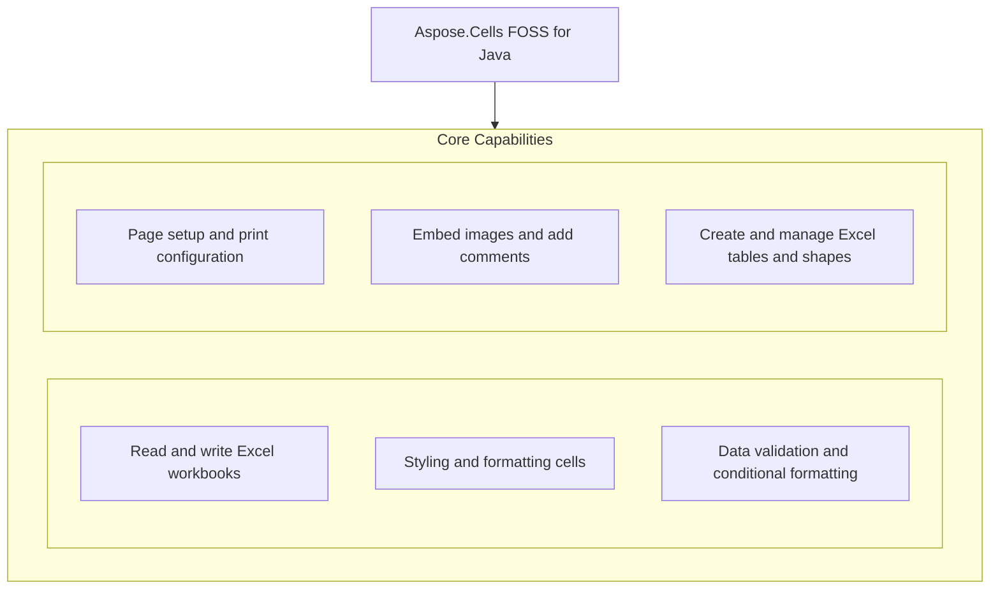

# Aspose.Cells FOSS for Java

[](License/LICENSE.txt) [](https://github.com/aspose-cells-foss/Aspose.Cells-FOSS-for-Java/graphs/contributors)

[](https://products.aspose.org/cells/java/)

Aspose.Cells FOSS for Java provides a free, open-source Java library for creating, reading, and manipulating Excel files without requiring Microsoft Excel. It supports common spreadsheet operations such as setting cell values, applying formatting, defining data validation rules, and handling conditional formatting, as demonstrated in the provided examples. Developers use it to generate reports, process spreadsheets, and integrate Excel functionality into Java applications running on Java 17 or later. The library is distributed under the MIT license and has no external dependencies.

## Navigation

- [At a Glance](#at-a-glance)
- [Key Capabilities](#key-capabilities)
- [Installation](#installation)
- [Dependencies](#dependencies)
- [Quick Start](#quick-start)
- [Additional Examples](#additional-examples)
- [API Reference](#api-reference)
- [Documentation & Resources](#documentation--resources)
- [Scope and Limitations](#scope-and-limitations)
- [Development and Testing](#development-and-testing)
- [License](#license)

## At a Glance



## Key Capabilities

- **Read and write Excel workbooks.** Create, load, and save Excel workbooks in XLSX format with support for repair options when handling corrupted files using the `Workbook` class, `LoadOptions` with strict mode disabled and try-repair flags, and `DocumentProperties` to update metadata before saving.
- **Styling and formatting cells.** Apply cell styling including font bolding and custom number formats using the `Style` class, and adjust row heights and column widths using `Cells.getRows()`.setHeight() and `Cells.getColumns()`.setWidth() to control layout and presentation in the output workbook.
- **Data validation and conditional formatting.** Define data validation rules for cell ranges using `Validation` with whole number constraints and apply conditional formatting using `FormatConditionCollection` to highlight cells whose values fall between specified thresholds with custom styling.
- **Page setup and print configuration.** Configure page setup options such as paper size, orientation, margins, and print area for worksheets using `PageSetup` to prepare documents for printing or PDF export.
- **Embed images and add comments.** Embed images into worksheets using `Picture` and attach comments to individual cells using `CommentCollection` to enrich workbook content with visual elements and annotations.
- **Create and manage Excel tables and shapes.** Create Excel tables from cell ranges using `ListObject` and insert shapes such as rectangles and arrows using `Shape` to enhance data presentation and visual structure.

## Installation

Install the published package from Maven Central (`org.aspose:aspose-cells-foss`, version 26.7.0):

```bash
mvn dependency:get -Dartifact=org.aspose:aspose-cells-foss:26.7.0
```

## Dependencies

### Required Package Dependencies

No required third-party package dependencies; in `pom.xml`, every `<dependency>` the POM declares is `test`, `provided` or optional.

### Native and System Requirements

- Requires Java `17` (`maven.compiler.target` in `pom.xml`).

### Development Dependencies

- `org.apache.poi:poi-ooxml 5.3.0`
- `org.junit.jupiter:junit-jupiter 5.10.2`

## Quick Start

Create a workbook, write values, style a cell, and save it:

```java
import org.aspose.cells_foss.Cell;
import org.aspose.cells_foss.Style;
import org.aspose.cells_foss.Workbook;
import org.aspose.cells_foss.Worksheet;

public class Main {
    public static void main(String[] args) {
        try (Workbook workbook = new Workbook()) {
            Worksheet sheet = workbook.getWorksheets().get(0);
            sheet.setName("Report");

            sheet.getCells().get("A1").putValue("Revenue");
            sheet.getCells().get("B1").putValue(12500.75);

            Cell total = sheet.getCells().get("B1");
            Style style = total.getStyle();
            style.getFont().setBold(true);
            style.setCustom("#,##0.00");
            total.setStyle(style);

            sheet.getCells().getRows().get(0).setHeight(22.0);
            sheet.getCells().getColumns().get(1).setWidth(14.5);

            workbook.save("report.xlsx");
        }
    }
}
```

Load a workbook with repair options, inspect diagnostics, update metadata, and save the repaired file:

```java
import org.aspose.cells_foss.LoadIssue;
import org.aspose.cells_foss.LoadOptions;
import org.aspose.cells_foss.Workbook;

public class LoadWorkbook {
    public static void main(String[] args) {
        LoadOptions options = new LoadOptions();
        options.setStrictMode(false);
        options.setTryRepairPackage(true);
        options.setTryRepairXml(true);

        try (Workbook workbook = new Workbook("input.xlsx", options)) {
            if (workbook.getLoadDiagnostics().hasRepairs()) {
                for (LoadIssue issue : workbook.getLoadDiagnostics().getIssues()) {
                    System.out.println(issue.getMessage());
                }
            }

            workbook.getDocumentProperties().setAuthor("cells-foss");
            workbook.save("output.xlsx");
        }
    }
}
```

## Additional Examples

Create data validation and conditional formatting rules in a new workbook, then save the result as an Excel file.

### Add data validation and conditional formatting to a range

```java
import org.aspose.cells_foss.CellArea;
import org.aspose.cells_foss.FormatCondition;
import org.aspose.cells_foss.FormatConditionCollection;
import org.aspose.cells_foss.FormatConditionType;
import org.aspose.cells_foss.OperatorType;
import org.aspose.cells_foss.Style;
import org.aspose.cells_foss.Validation;
import org.aspose.cells_foss.ValidationType;
import org.aspose.cells_foss.Workbook;
import org.aspose.cells_foss.Worksheet;

public class RulesExample {
    public static void main(String[] args) {
        try (Workbook workbook = new Workbook()) {
            Worksheet sheet = workbook.getWorksheets().get(0);

            int validationIndex = sheet.getValidations().add(new CellArea(1, 0, 10, 1));
            Validation validation = sheet.getValidations().get(validationIndex);
            validation.setType(ValidationType.WHOLE_NUMBER);
            validation.setOperator(OperatorType.BETWEEN);
            validation.setFormula1("1");
            validation.setFormula2("100");

            int cfIndex = sheet.getConditionalFormattings().add();
            FormatConditionCollection conditions = sheet.getConditionalFormattings().get(cfIndex);
            conditions.addArea(CellArea.createCellArea("B2", "B11"));
            int conditionIndex = conditions.addCondition(
                    FormatConditionType.CELL_VALUE,
                    OperatorType.BETWEEN,
                    "1",
                    "100");

            FormatCondition condition = conditions.get(conditionIndex);
            Style style = condition.getStyle();
            style.getFont().setBold(true);
            condition.setStyle(style);

            workbook.save("rules.xlsx");
        }
    }
}
```

## API Reference

Aspose.Cells FOSS for Java provides entry points through the `org.aspose.cells_foss` package, where the core functionality is exposed via classes in the `org.aspose.cells_foss.core` subpackage. The package is distributed as `org.aspose:aspose-cells-foss` version 26.7.0 for Java 17.

The verified public surface has 183 types.

<details>
<summary>View the Complete Public API Surface</summary>

### Core API

| Class | Description |
| --- | --- |
| `AutoFilter` | Represents an auto-filter in a worksheet. |
| `AutoFilterColorFilter` | Represents the AutoFilterColorFilter component. |
| `AutoFilterCriteria` | Represents auto-filter criteria for filtering data in a worksheet. |
| `AutoFilterCustomFilter` | Represents the AutoFilterCustomFilter component. |
| `AutoFilterCustomFilterCollection` | Represents the AutoFilterCustomFilterCollection component. |
| `AutoFilterDynamicFilter` | Represents the AutoFilterDynamicFilter component. |
| `AutoFilterSortCondition` | Represents the AutoFilterSortCondition component. |
| `AutoFilterSortConditionCollection` | Represents the AutoFilterSortConditionCollection component. |
| `AutoFilterSortState` | Represents the AutoFilterSortState component. |
| `AutoFilterSupport` | Provides utility methods for auto-filter support. |
| `AutoFilterTop10` | Represents the AutoFilterTop10 component. |
| `Border` | Represents a border with line style and color. |
| `Borders` | Represents the border properties for a cell or range in an Excel worksheet. |
| `CalculationProperties` | Represents workbook calculation settings. |
| `Cell` | Represents a cell in a worksheet. |
| `CellArea` | Represents a cell area with row and column bounds. |
| `CellFormatValue` | Inner class representing cell format value. |
| `Cells` | Represents a collection of cells in a worksheet. |
| `CellsException` | Represents an exception thrown by the Aspose.Cells library. |
| `Chart` | Represents an embedded chart in a worksheet (read-only; charts are round-tripped verbatim). |
| `ChartCollection` | Collection of embedded charts on a worksheet. |
| `Color` | Represents an ARGB color value. |
| `Column` | Represents a column in a worksheet. |
| `ColumnCollection` | Represents a collection of columns in a worksheet. |
| `Comment` | Represents a cell comment (note). |
| `CommentCollection` | Collection of cell comments on a worksheet. |
| `ConditionalFormattingCollection` | A collection of conditional formatting objects. |
| `DefinedName` | Represents a defined name in the workbook. |
| `DefinedNameCollection` | Represents a collection of defined names in a workbook. |
| `DisplayFormatSectionInfo` | Holds metadata about a single section of a number format code string. |
| `DisplayTextFormatterSupport` | Internal utility class for selecting and formatting display text sections. |
| `DocumentProperties` | Represents the document properties of a workbook (docProps/core.xml and docProps/app.xml). |
| `FillValue` | Inner class representing fill value. |
| `FilterColumn` | Represents the FilterColumn component. |
| `FilterColumnCollection` | Represents the FilterColumnCollection component. |
| `FilterValueCollection` | Represents the FilterValueCollection component. |
| `Font` | Represents a font with its properties. |
| `FormatCondition` | Represents a conditional formatting rule. |
| `FormatConditionCollection` | Represents a collection of format conditions in Excel. |
| `FormulaException` | Represents an exception that occurs during formula processing. |
| `Hyperlink` | Represents a hyperlink in a worksheet. |
| `HyperlinkCollection` | Represents a collection of hyperlinks in a worksheet. |
| `IWarningCallback` | Provides a callback mechanism for reporting warnings during workbook operations. |
| `InvalidFileFormatException` | Represents an exception thrown when an invalid file format is encountered. |
| `ListColumn` | Represents a column within an Excel table (ListObject). |
| `ListColumnCollection` | Ordered collection of columns in an Excel table. |
| `ListObject` | Represents an Excel table (structured reference / ListObject). |
| `ListObjectCollection` | Collection of Excel tables (ListObjects) on a worksheet. |
| `LoadDiagnostics` | Represents diagnostics information during workbook loading. |
| `LoadIssue` | Represents an issue that occurred during workbook loading. |
| `LoadOptions` | Represents options for loading a workbook. |
| `NumberFormat` | Provides built-in number format functionality. |
| `PageSetup` | Represents page setup options for a worksheet. |
| `Picture` | Represents an embedded image in a worksheet. |
| `PictureCollection` | Collection of embedded pictures on a worksheet. |
| `Row` | Represents a row in a worksheet. |
| `RowCollection` | Represents a collection of rows in a worksheet. |
| `SaveOptions` | Represents save options for workbook saving. |
| `Shape` | Represents a drawing object (auto shape) anchored to a worksheet. |
| `ShapeCollection` | Collection of drawing objects (shapes) on a worksheet. |
| `Style` | Represents the full style of a cell: font, borders, alignment, fill, number format, and protection. |
| `StyleException` | Represents an exception that occurs during style processing. |
| `StyleValueSanitizer` | Sanitizes style values to ensure they fall within valid ranges. |
| `UnsupportedFeatureException` | Thrown when an unsupported feature is encountered. |
| `Validation` | Represents a data validation rule applied to one or more cell areas. |
| `ValidationCollection` | Represents the collection of data validation rules for a worksheet. |
| `WarningInfo` | Represents information about a warning that occurred during workbook operations. |
| `Workbook` | Represents an Excel workbook. |
| `WorkbookLoadException` | Represents an exception that occurs when loading a workbook. |
| `WorkbookProperties` | Represents the properties of a workbook (workbookPr attributes). |
| `WorkbookProtection` | Represents workbook-level protection settings (structure, windows, revision). |
| `WorkbookSaveException` | Represents an exception that occurs when saving a workbook. |
| `WorkbookSettings` | Represents workbook settings for an Excel file. |
| `WorkbookView` | Represents the view / window settings stored in bookViews. |
| `Worksheet` | Represents a worksheet in a workbook. |
| `WorksheetCollection` | Represents a collection of worksheets in a workbook. |
| `WorksheetProtection` | Represents protection settings for a worksheet. |
| `XlsxDocumentProperties` | Helper class for handling XLSX document properties (core and extended). |
| `XlsxWorkbookSerializer` | Serializer for XLSX workbook files 鈥?thin coordinator that delegates to helper classes. |
| `XlsxWorkbookStylesValueHelpers` | Provides helper methods for parsing and formatting workbook style values. |
| `XlsxWorkbookStylesXml` | Provides methods for reading and writing XLSX workbook styles XML. |
| `AlignmentValue` | Represents alignment settings for a cell style. |
| `AutoFilterColorFilterModel` | Represents the AutoFilterColorFilterModel component. |
| `AutoFilterCustomFilterModel` | Represents the AutoFilterCustomFilterModel component. |
| `AutoFilterDynamicFilterModel` | Represents the AutoFilterDynamicFilterModel component. |
| `AutoFilterModel` | Represents a model for auto-filter configuration in Excel. |
| `AutoFilterSortConditionModel` | Represents the AutoFilterSortConditionModel component. |
| `AutoFilterSortStateModel` | Represents the AutoFilterSortStateModel component. |
| `AutoFilterTop10Model` | Represents the AutoFilterTop10Model component. |
| `BorderSideValue` | Represents a border side value with style and color. |
| `BordersValue` | Represents the border values for a cell style, including left, right, top, bottom, and diagonal borders, as well as diagonal direction flags. |
| `CalculationPropertiesModel` | Represents the CalculationPropertiesModel component. |
| `CellAddress` | Represents a cell address with row and column indices. |
| `CellRecord` | Represents a cell record in the Excel file. |
| `ChartModel` | Internal model for an embedded chart. |
| `ColorValue` | Represents a color value with alpha, red, green, and blue components. |
| `ColumnRangeModel` | Represents a range of columns with formatting properties. |
| `CommentModel` | Internal model for a cell comment (note). |
| `ConditionalFormattingModel` | Represents the conditional formatting model for a worksheet. |
| `CoreDocumentPropertiesModel` | Represents the CoreDocumentPropertiesModel component. |
| `DateSerialConverter` | Converts between LocalDateTime values and Excel serial date numbers. |
| `DefinedNameModel` | Represents a defined name model in the Excel file. |
| `DiagnosticBag` | Represents a bag of diagnostic entries. |
| `DiagnosticEntry` | Represents a diagnostic entry with details about a problem or warning. |
| `DocumentPropertiesModel` | Represents the document properties model for an Excel file. |
| `ExtendedDocumentPropertiesModel` | Represents the ExtendedDocumentPropertiesModel component. |
| `FilterColumnModel` | Represents the FilterColumnModel component. |
| `FontValue` | Represents a font value with its properties. |
| `FormatConditionModel` | Represents a format condition model used in Excel conditional formatting. |
| `HeaderFooterModel` | Represents the header and footer model for a worksheet. |
| `HyperlinkModel` | Represents a hyperlink model with its properties. |
| `ListColumnModel` | Internal model for a table (ListObject) column. |
| `ListObjectModel` | Internal model for a table (ListObject / structured reference). |
| `MergeRegion` | Represents a merge region in an Excel worksheet. |
| `NumberFormatValue` | Represents a number format value with its number format index and custom format string. |
| `PageMarginsModel` | Represents page margins for a worksheet in an Excel file. |
| `PageSetupModel` | Represents page setup model for an Excel worksheet. |
| `PictureModel` | Internal model for an embedded picture/image. |
| `PrintOptionsModel` | Represents print options for a worksheet. |
| `ProtectionValue` | Represents protection settings for a cell or range. |
| `RowModel` | Represents a row model in the Excel file. |
| `ShapeModel` | Internal model for a drawing object (auto shape) anchored to a worksheet. |
| `SharedStringRepository` | A repository that manages shared strings for Excel files. |
| `StyleRepository` | Represents a repository for style values. |
| `StyleValue` | Represents a style value with various formatting properties. |
| `ValidationModel` | Represents a data validation model in the Excel file. |
| `WorkbookModel` | Represents the top-level model of a workbook. |
| `WorkbookPropertiesModel` | Represents the workbook properties model. |
| `WorkbookProtectionModel` | Represents the WorkbookProtectionModel component. |
| `WorkbookSettingsModel` | Represents workbook settings model. |
| `WorkbookViewModel` | Represents the WorkbookViewModel component. |
| `WorksheetModel` | Represents the model of a worksheet in the Excel file. |
| `WorksheetProtectionModel` | Represents the protection model for a worksheet in an Excel file. |
| `WorksheetViewModel` | Represents a view model for a worksheet with display settings. |
| `IPackageReader` | Provides a reader interface for reading package models from streams. |
| `IPackageWriter` | Provides a contract for writing package models to a stream. |
| `MissingPartException` | Thrown when a required part is missing from the package structure. |
| `PackageLoadContext` | Represents the context for loading a package. |
| `PackageModel` | Represents the model of a package (e.g., XLSX file structure) with parts, relationships, and unsupported parts. |
| `PackagePartDescriptor` | Represents a descriptor for a package part in the XLSX package. |
| `PackageStructureException` | Thrown when the package structure of the Excel file is invalid. |
| `PackagingConventions` | Defines constants for Open XML package part paths and relationship types. |
| `RelationshipDescriptor` | Represents a relationship descriptor in the XLSX package. |
| `RelationshipResolutionException` | Exception thrown when a relationship cannot be resolved in the package structure. |
| `ValidationMessage` | Represents a validation message with code, severity, and message text. |
| `WorkbookValidator` | A validator for workbook models that produces validation messages. |
| `SharedStringTableXmlMapper` | Maps shared string tables to/from XML. |
| `StylesheetXmlMapper` | Maps style information to and from XML. |
| `WorkbookXmlMapper` | Maps workbook data to/from SpreadsheetML XML format. |
| `WorksheetXmlMapper` | Maps worksheet XML data. |
| `XmlParsingException` | Represents an exception that occurs during XML parsing. |

#### Enumerations

| Enumeration | Description |
| --- | --- |
| `AutoShapeType` | Specifies the type of an auto shape (preset DrawingML geometry). |
| `BorderStyleType` | Represents the style of a border. |
| `CellValueType` | Represents the type of a cell value. |
| `ChartType` | Identifies the type of an embedded chart. |
| `cells_foss.DiagnosticSeverity` | Represents the severity level of a diagnostic message. |
| `FillPattern` | Represents the fill pattern used in cell styling. |
| `FormatConditionType` | Represents the type of a format condition. |
| `HorizontalAlignmentType` | Represents the type of horizontal alignment for cell content. |
| `ImageType` | Identifies the format of an embedded image. |
| `LoadFormat` | Specifies the format of the workbook to be loaded. |
| `OperatorType` | Represents the operator type used in conditional formatting and filtering. |
| `PageOrientationType` | Represents the page orientation type for a worksheet. |
| `PaperSizeType` | Represents the paper size type for a worksheet. |
| `SaveFormat` | Specifies the format in which a workbook will be saved. |
| `TableStyleType` | Identifies a built-in Excel table style. |
| `TargetModeType` | Represents the target mode type for cell references. |
| `TotalsCalculation` | Aggregation function applied to a table's totals row. |
| `ValidationAlertType` | Represents the alert type for data validation. |
| `ValidationType` | Represents the type of cell validation. |
| `VerticalAlignmentType` | Represents vertical alignment options for cell content. |
| `VisibilityType` | Represents the visibility type of a worksheet. |
| `BorderStyle` | Represents the style of a border line in a cell. |
| `CellValueKind` | Represents the kind of a cell value. |
| `DateSystem` | Represents the date system used in Excel. |
| `core.DiagnosticSeverity` | Represents the severity of a diagnostic entry. |
| `FillPatternKind` | Represents the pattern used to fill a cell. |
| `FilterOperatorType` | Enumerates the supported FilterOperatorType values. |
| `HorizontalAlignment` | Represents horizontal alignment options for cell content in Excel. |
| `PageOrientation` | Represents the page orientation for a worksheet. |
| `SheetVisibility` | Represents the visibility state of a worksheet in an Excel workbook. |
| `VerticalAlignment` | Represents vertical alignment options for cell content. |
| `ValidationMessageSeverity` | Represents the severity level of a validation message. |

#### Detailed Member Reference

### org

The top-level namespace org serves as the root package for all Aspose.Cells FOSS for Java classes, with `org.aspose` and its subpackages forming the public API surface.

### aspose

The `org.aspose` namespace contains the primary Aspose.Cells FOSS for Java classes, including the `org.aspose.cells_foss` package that exposes the core workbook and spreadsheet processing capabilities.

### cells_foss

The `org.aspose.cells_foss` package organizes its functionality into subpackages: `org.aspose.cells_foss.core` provides the main workbook and worksheet processing classes, `org.aspose.cells_foss.packaging` handles file format packaging, `org.aspose.cells_foss.validation` offers data validation utilities, and `org.aspose.cells_foss.xml` supports XML-based operations.

</details>

## Documentation & Resources

- **[Getting started guide](https://docs.aspose.org/cells/java/)** — The getting started guide introduces core concepts and walks through initial setup and basic usage of Aspose.Cells FOSS for Java.
- **[How-to guides & FAQ](https://kb.aspose.org/cells/java/)** — The how-to guides and FAQ provide practical examples and answers to common questions for developers using Aspose.Cells FOSS for Java.
- **[Contributor guide](Agents.md)** — The contributor guide outlines how to set up the development environment, build the project, and contribute changes to Aspose.Cells FOSS for Java.
- **[Publishing guide](PUBLISHING.md)** — The publishing guide describes the steps and requirements for releasing new versions of Aspose.Cells FOSS for Java.
- Found a bug or have a feature request? [Open an issue](https://github.com/aspose-cells-foss/Aspose.Cells-FOSS-for-Java/issues).

## Scope and Limitations

Aspose.Cells FOSS for Java provides read and write access to Excel workbooks in the .xlsx format for Java 17 and later, targeting developers who need lightweight workbook manipulation without a full spreadsheet calculation engine.

- Saving workbooks is currently limited to the .xlsx file format, and the artifact can be installed using the Maven command that retrieves `org.aspose:aspose-cells-foss` version 26.7.0.
- `ChartEx` types such as Waterfall, Treemap, Sunburst, Histogram, Box and Whisker, Funnel, and Map cannot be created programmatically, though existing charts of these types are preserved when loading and saving workbooks.
- Formulas are stored and round-tripped without evaluation, and some public XML-mapper classes are unimplemented skeleton code retained from an early scaffold, with their own Javadoc disclosing this and the library's real save/load path never invoking them.

These limitations don't apply to [Aspose.Cells for Java — Enterprise Edition](https://products.aspose.com/cells/java/). Aspose.Cells FOSS for Java provides core spreadsheet processing capabilities, while the commercial Aspose.Cells for Java adds advanced features such as comprehensive charting, pivot tables, conditional formatting, and support for additional file formats including DOCX, XLSM, and ODS.

## Development and Testing

Build and test the project using JDK 17+ and Maven; run the test suite with the command mvn test, as defined in the CI workflow at .github/workflows/ and documented in docs/.

Releases run through the [maven-central-release workflow](.github/workflows/maven-central-release.yml).

Requires JDK 17+ and Maven as the build tool. Run the test suite:

## License

This project is licensed under the [MIT License](License/LICENSE.txt). The MIT License permits use, copying, modification, distribution, sublicensing, and commercial use, provided its copyright and permission notice are retained. The software is provided without warranty.
