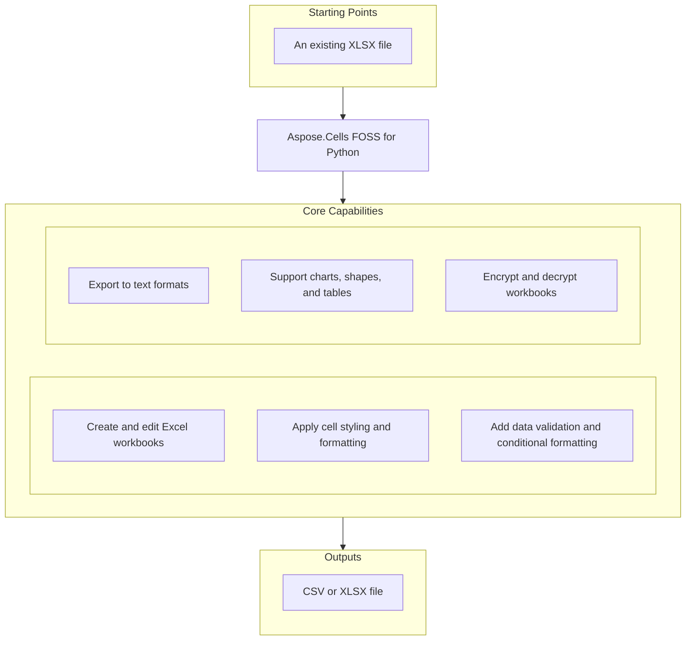

# Aspose.Cells FOSS for Python

[](https://pypi.org/project/aspose-cells-foss/)  [](License/LICENSE.txt) [](https://github.com/aspose-cells-foss/Aspose.Cells-FOSS-for-Python/graphs/contributors)

[](https://products.aspose.org/cells/python/)

Aspose.Cells FOSS for Python is a free, open-source library for Python developers to create, read, and convert Excel workbooks without requiring Microsoft Excel. It supports reading and writing `.xlsx` files, exporting to `.csv`, JSON, and Markdown, and includes features such as data validation, conditional formatting, auto-filtering, charts, shapes, tables, sparklines, and cell styling. Developers use it to automate spreadsheet workflows, enforce data entry rules, and generate reports programmatically. The library requires Python >=3.7, depends on pycryptodome>=3.15.0 for encryption, and is distributed under the MIT license.

## Navigation

- [At a Glance](#at-a-glance)
- [Key Capabilities](#key-capabilities)
- [Installation](#installation)
- [Dependencies](#dependencies)
- [Quick Start](#quick-start)
- [Additional Examples](#additional-examples)
- [API Reference](#api-reference)
- [Documentation & Resources](#documentation--resources)
- [Scope and Limitations](#scope-and-limitations)
- [Development and Testing](#development-and-testing)
- [License](#license)

## At a Glance



## Key Capabilities

- **Create and edit Excel workbooks.** Create new workbooks or load existing `.xlsx` files, then read or write cell values using the `aspose.cells_foss.Workbook`, `aspose.cells_foss.Worksheet`, and `aspose.cells_foss.Cell` classes, and save the result back to `.xlsx` format.
- **Apply cell styling and formatting.** Modify cell appearance by retrieving and applying `aspose.cells_foss.Style` objects that configure `aspose.cells_foss.Font` properties such as bold, color, and size, or set `aspose.cells_foss.NumberFormat` patterns.
- **Add data validation and conditional formatting.** Enforce data entry rules using `aspose.cells_foss.DataValidation` objects with types from `aspose.cells_foss.DataValidationType`, and apply conditional formatting rules via `aspose.cells_foss.conditional_format`.
- **Export to text formats.** Export workbook contents to plain text formats including `.csv`, JSON, and Markdown using the `aspose.cells_foss.save_workbook_as_csv`, `aspose.cells_foss.save_workbook_as_json`, and `aspose.cells_foss.save_workbook_as_markdown` methods.
- **Support charts, shapes, and tables.** Insert and manipulate visual elements such as charts, shapes, sparklines, and tables through the `aspose.cells_foss.Chart`, `aspose.cells_foss.Shape`, `aspose.cells_foss.Sparkline`, and `aspose.cells_foss.Table` classes.
- **Encrypt and decrypt workbooks.** Protect workbooks with a password using the `aspose.cells_foss.encrypt_xlsx` mechanism and open encrypted files by providing the password to the `aspose.cells_foss.decrypt_xlsx` operation via the `aspose.cells_foss.xlsx_encryptor` interface.

## Installation

Install the published package from PyPI (`aspose-cells-foss`, version 26.7.0):

```bash
pip install aspose-cells-foss
```

To work from a source checkout instead, install the clone with pip:

```bash
git clone https://github.com/aspose-cells-foss/Aspose.Cells-FOSS-for-Python.git
cd Aspose.Cells-FOSS-for-Python
pip install .
```

Verify the install:

```bash
python -c "import aspose.cells_foss"
```

The package declares `python_requires` as `>=3.7`.

## Dependencies

### Required Package Dependencies

- `olefile>=0.46`
- `pycryptodome>=3.15.0`

### Native and System Requirements

- Requires Python 3.7 or later (`python_requires=">=3.7"` in `pyproject.toml`).

### Development Dependencies

- `pytest>=7.0.0` (extra `dev`)
- `pytest-cov>=4.0.0` (extra `dev`)

## Quick Start

Create a new workbook, populate cells with text and numbers, and save the file as `output.xlsx` using the aspose-cells-foss package.

```python
from aspose.cells_foss import Workbook

workbook = Workbook()
worksheet = workbook.worksheets[0]

worksheet.cells["A1"].value = "Hello"
worksheet.cells["B1"].value = "World"
worksheet.cells["A2"].value = 42
worksheet.cells["B2"].value = 3.14

workbook.save("output.xlsx")
```

Open an existing Excel file, read the value from cell A1, and print it to the console using the aspose-cells-foss package.

```python
from aspose.cells_foss import Workbook

workbook = Workbook("input.xlsx")
worksheet = workbook.worksheets[0]

value = worksheet.cells["A1"].value
print(f"Cell A1 contains: {value}")
```

## Additional Examples

Create styled cells, add dropdown lists, export to CSV, and password-protect workbooks using aspose-cells-foss 26.7.0.

### Apply bold red font styling to a cell

```python
from aspose.cells_foss import Workbook

workbook = Workbook()
worksheet = workbook.worksheets[0]
cell = worksheet.cells["A1"]

cell.value = "Styled Text"

style = cell.get_style()
style.font.bold = True
style.font.color = "#FF0000"
style.font.size = 14
cell.apply_style(style)

workbook.save("styled.xlsx")
```

<details>
<summary>View Additional Examples</summary>

### Add a dropdown list validation to a range

```python
from aspose.cells_foss import Workbook, DataValidationType

workbook = Workbook()
worksheet = workbook.worksheets[0]

validation = worksheet.data_validations.add("A1:A10")
validation.type = DataValidationType.LIST
validation.formula1 = '"Option1,Option2,Option3"'

workbook.save("validation.xlsx")
```

### Convert an Excel file to CSV format

```python
from aspose.cells_foss import Workbook

workbook = Workbook("input.xlsx")
workbook.save_as_csv("output.csv")
```

### Save and open a password-protected workbook

```python
from aspose.cells_foss import Workbook

workbook = Workbook()
worksheet = workbook.worksheets[0]
worksheet.cells["A1"].value = "Confidential Data"

workbook.save("protected.xlsx", password="mypassword")

workbook2 = Workbook("protected.xlsx", password="mypassword")
```

</details>

## API Reference

Aspose.Cells FOSS for Python provides the `aspose.cells_foss.Workbook` class as the primary entry point for working with spreadsheet files, and the `aspose.cells_foss.Worksheet` class as the main container for tabular data within a workbook.

The verified public surface has 130 types.

<details>
<summary>View the Complete Public API Surface</summary>

### Core API

| Class | Description |
| --- | --- |
| `AgileEncryptionParameters` | Parameters for Agile Encryption (ECMA-376 Part 2, Section 4). |
| `CSVHandler` | Handles CSV import and export operations for workbooks. |
| `CSVLoadOptions` | Options for loading CSV files. |
| `CSVSaveOptions` | Options for saving CSV files. |
| `Cell` | Represents a single cell in a worksheet. |
| `Cells` | Represents a collection of cells in a worksheet. |
| `Chart` | Represents a chart in a worksheet. |
| `ChartAxis` | Represents a chart axis (category, value, or series). |
| `ChartCollection` | Collection of charts in a worksheet. |
| `ChartErrorBars` | Represents error bars attached to a chart series. |
| `ChartSeries` | Represents a single chart series. |
| `ChartView3D` | Represents chart-level 3D view settings. |
| `DataValidation` | Represents data validation settings for a range of cells. |
| `DataValidationCollection` | Represents a collection of DataValidation objects for a worksheet. |
| `Font` | Represents font settings for a cell or range of cells. |
| `HorizontalPageBreakCollection` | Collection of manual horizontal page breaks (row breaks). |
| `JsonHandler` | Handles JSON export operations for workbooks. |
| `JsonSaveOptions` | Options for saving JSON files. |
| `MarkdownHandler` | Handles Markdown export operations for workbooks. |
| `MarkdownSaveOptions` | Options for saving Markdown files. |
| `MsoFillFormat` | Fill format properties for a shape. |
| `MsoLineFormat` | Border/outline format properties for a shape. |
| `NSeries` | Collection of series for a chart. |
| `NumberFormat` | Represents number format settings for a cell or range of cells. |
| `Picture` | Represents a worksheet picture anchored to cells. |
| `PictureCollection` | Collection of pictures in a worksheet. |
| `Shape` | Represents a drawing shape (rectangle, oval, text box, arrow, etc.) on |
| `ShapeCollection` | Collection of Shape objects on a worksheet. |
| `ShapeFont` | Font properties for text inside a shape. |
| `Sparkline` | One sparkline: a data source range paired with the cell where it appears. |
| `SparklineGroup` | A group of sparklines that share the same visual style. |
| `SparklineGroupCollection` | Collection of SparklineGroup objects (ws.sparkline_groups). |
| `StandardEncryptionParameters` | Parameters for Standard Encryption (ECMA-376 Part 2, Section 3). |
| `Style` | Represents formatting settings for a cell or range of cells. |
| `Table` | Represents an Excel structured table (ECMA-376 §18.5). |
| `TableCollection` | Collection of Table objects belonging to a worksheet (ws.tables). |
| `TableColumn` | Settings for a single table column. |
| `TableStyleInfo` | Visual style settings for an Excel table. |
| `VerticalPageBreakCollection` | Collection of manual vertical page breaks (column breaks). |
| `Workbook` | Represents an Excel workbook. |
| `Worksheet` | Represents a single worksheet in an Excel workbook. |
| `AutoFilter` | Represents auto filters in a worksheet. |
| `FilterColumn` | Represents a filter column in an auto filter. |
| `CellValueHandler` | Handles cell value import and export operations according to ECMA-376 specification. |
| `CFBReader` | Reads encrypted XLSX from CFB format. |
| `cfb_handler.CFBWriter` | Writes encrypted XLSX to CFB format. |
| `cfb_writer.CFBWriter` | Writes CFB (Compound File Binary) files according to MS-CFB specification. |
| `MinimalCFBWriter` | Minimal CFB file writer for encrypted Office documents. |
| `CommentXMLReader` | Handles reading comment data from XML format. |
| `CommentXMLWriter` | Handles writing comment data to XML format. |
| `ConditionalFormat` | Represents a single conditional formatting rule applied to a cell range. |
| `ConditionalFormatCollection` | Represents a collection of conditional formats for a worksheet. |
| `CoreProperties` | Represents core document properties stored in docProps/core.xml. |
| `DocumentProperties` | Container for all document-level properties. |
| `ExtendedProperties` | Represents extended/application properties stored in docProps/app.xml. |
| `EncryptionVerifier` | Encryption verifier generation and validation. |
| `PackageEncryption` | Package data encryption and decryption. |
| `PasswordDerivation` | Password derivation helpers for Agile encryption. |
| `EncryptionParameters` | Base class for encryption parameters. |
| `FormulaEvaluator` | Basic formula evaluator for XLSX cells without cached values. |
| `Hyperlink` | Represents a hyperlink in a worksheet. |
| `Hyperlinks` | Collection of hyperlinks in a worksheet. |
| `SharedStringTable` | Manages the Shared String Table for XLSX files according to ECMA-376 specification. |
| `Alignment` | Represents alignment settings for a cell or range of cells. |
| `Border` | Represents border settings for a single side of a cell or range of cells. |
| `Borders` | Represents border settings for all sides of a cell or range of cells. |
| `Fill` | Represents fill settings for a cell or range of cells. |
| `Protection` | Represents protection settings for a cell or range of cells. |
| `CalculationProperties` | Represents calculation properties for the workbook. |
| `DefinedName` | Represents a defined name in the workbook. |
| `DefinedNameCollection` | Collection of defined names in the workbook. |
| `FileVersion` | Represents file version information for the workbook. |
| `WorkbookPr` | Represents workbook properties (workbookPr element). |
| `WorkbookProperties` | Container for all workbook-level properties. |
| `WorkbookProtection` | Represents workbook protection settings. |
| `WorkbookView` | Represents a workbook view configuration. |
| `SheetProtectionDictWrapper` | Dictionary-like wrapper around SheetProtection for backward compatibility. |
| `HeaderFooter` | Represents header and footer settings. |
| `PageMargins` | Represents page margins. |
| `PageSetup` | Represents page setup settings. |
| `Pane` | Represents pane (freeze/split) settings. |
| `PrintOptions` | Represents print options. |
| `Selection` | Represents cell selection in a sheet view. |
| `SheetFormatProperties` | Represents sheet format properties. |
| `SheetProtection` | Represents sheet protection settings. |
| `SheetView` | Represents a sheet view configuration. |
| `WorksheetProperties` | Container for all worksheet-level properties. |
| `XLSXDecryptor` | Handles decryption of XLSX files. |
| `XLSXEncryptor` | Handles encryption of XLSX files. |
| `AutoFilterXMLLoader` | Handles loading autofilter data from XML format for .xlsx files. |
| `AutoFilterXMLWriter` | Handles writing autofilter data to XML format for .xlsx files. |
| `ChartXmlLoader` | Loads worksheet chart settings from drawing/chart XML parts. |
| `ChartXmlSaver` | Handles writing chart-related XLSX parts: |
| `ConditionalFormatXMLLoader` | Handles loading conditional formatting data from XML format for .xlsx files. |
| `ConditionalFormatXMLWriter` | Handles writing conditional formatting data to XML format for .xlsx files. |
| `DataValidationXmlLoader` | Loads DataValidation objects from ECMA-376 SpreadsheetML XML format. |
| `DataValidationXmlSaver` | Saves DataValidation objects to ECMA-376 SpreadsheetML XML format. |
| `HyperlinkRelationshipWriter` | Writes hyperlink relationships to _rels files. |
| `HyperlinkXMLLoader` | Loads hyperlinks from worksheet XML and relationship files. |
| `HyperlinkXMLSaver` | Saves hyperlinks to worksheet XML and relationship files. |
| `XMLLoader` | Handles loading of Excel workbook XML files. |
| `PictureXmlLoader` | Loads pictures from worksheet drawing parts. |
| `PictureXmlSaver` | Handles writing picture-related drawing/media XML payloads. |
| `WorkbookPropertiesXMLLoader` | Handles loading workbook properties from XML format for .xlsx files. |
| `WorksheetPropertiesXMLLoader` | Handles loading worksheet properties from XML format for .xlsx files. |
| `WorkbookPropertiesXMLWriter` | Handles writing workbook properties to XML format for .xlsx files. |
| `WorksheetPropertiesXMLWriter` | Handles writing worksheet properties to XML format for .xlsx files. |
| `XMLSaver` | Handles saving workbook data to XML format for .xlsx files. |
| `ShapeXmlLoader` | Loads xdr:sp shape elements from a drawing XML part. |
| `ShapeXmlSaver` | Generates drawing XML and relationship XML for worksheet shapes. |
| `SparklineXmlLoader` | Loads sparkline group data from the <extLst> in a worksheet XML root. |
| `SparklineXmlSaver` | Serialises SparklineGroupCollection to <extLst> XML. |
| `TableXmlLoader` | Loads table definitions from an XLSX ZIP archive into a worksheet. |
| `TableXmlSaver` | Serialises Table objects to ECMA-376 table XML. |

#### Enumerations

| Enumeration | Description |
| --- | --- |
| `ChartType` | Supported chart types. |
| `CipherAlgorithm` | Cipher algorithm enumeration. |
| `DataValidationAlertStyle` | Specifies the style of the error alert displayed when invalid data is entered. |
| `DataValidationImeMode` | Specifies the Input Method Editor (IME) mode for CJK language input. |
| `DataValidationOperator` | Specifies the comparison operator for data validation. |
| `DataValidationType` | Specifies the type of data validation. |
| `FillType` | Shape fill type (ECMA-376 a:spPr fill child elements). |
| `HashAlgorithm` | Hash algorithm enumeration. |
| `MsoDrawingType` | Shape preset geometry types (maps to ECMA-376 a:prstGeom prst attributes). |
| `MsoLineDashStyle` | Shape border/line dash style (ECMA-376 a:prstDash val attribute). |
| `SaveFormat` | Specifies the format for saving a workbook. |
| `SparklineEmptyCells` | SparklineEmptyCells represents how empty cells are treated in sparkline rendering, with members defining options such as connecting data points or leaving gaps. |
| `SparklineType` | SparklineType defines the visual style of a sparkline, such as line, column, or win/loss, and is used when creating or modifying sparkline groups. |
| `TextAlignmentType` | Horizontal text alignment inside a shape (ECMA-376 a:pPr algn attribute). |
| `TextAnchorType` | Vertical text anchor inside a shape (ECMA-376 a:bodyPr anchor attribute). |
| `EncryptionType` | Encryption type enumeration. |

#### Detailed Member Reference

### Workbook

The `aspose.cells_foss.Workbook` class represents a spreadsheet file and provides methods to create, load, protect, and save workbooks, including operations like `add_worksheet`, `copy_worksheet`, `create_worksheet`, `get_worksheet`, `get_worksheet_by_index`, `get_worksheet_by_name`, `remove_worksheet`, save, `save_as_csv`, `save_as_json`, `save_as_markdown`, protect, unprotect, and access to worksheets, properties, and document properties.

- `add_worksheet`: Adds a new worksheet to the workbook.
- `copy_worksheet`: Copy a worksheet and append the copy to the workbook. Returns the new worksheet.
- `create_worksheet`: Create and add a new worksheet. Alias for add_worksheet().
- `document_properties`: Gets document properties of the workbook.
- `file_path`: Gets the file path of the workbook.
- `get_active_worksheet`: Return the currently active worksheet.
- `get_worksheet`: Gets a worksheet by index or name.
- `get_worksheet_by_index`: Return the worksheet at the given 0-based index, or None if out of range.
- `get_worksheet_by_name`: Return the worksheet with the given name, or None if not found.
- `is_protected`: Return True if the workbook has structure or window protection enabled.
- `load_csv`: Loads data from a CSV file into the workbook.
- `properties`: Gets workbook properties.
- `protect`: Protect the workbook structure/windows with an optional password.
- `protection`: Return a dict with the current workbook protection settings.
- `remove_worksheet`: Removes a worksheet from the workbook.
- `save`: Saves the workbook to a file.
- `save_as_csv`: Saves the workbook to a CSV file.
- `save_as_json`: Saves the workbook to a JSON file.
- `save_as_markdown`: Saves the workbook to a Markdown file.
- `set_active_worksheet`: Set the active worksheet by index, name, or Worksheet object.
- `unprotect`: Remove workbook structure/window protection.
- `worksheets`: Gets collection of worksheets in the workbook.

### Worksheet

The `aspose.cells_foss.Worksheet` class represents a single worksheet within a workbook and provides methods to manage its content and appearance, including operations like activate, rename, copy, delete, select, `get_range`, cells, charts, shapes, tables, sparklines, `data_validations`, hyperlinks, `conditional_formats`, `merged_cells`, `page_setup`, `print_area`, `tab_color`, visibility, protection, and properties.

- `ClearPrintArea`: Defined as `def ClearPrintArea(self)`.
- `SetPrintArea`: Defined as `def SetPrintArea(self, print_area)`.
- `activate`: Activates the worksheet (makes it the active worksheet).
- `auto_filter`: Gets the AutoFilter object for this worksheet.
- `calculate_formula`: Calculates formulas in the worksheet.
- `cells`: Gets the Cells collection for this worksheet.
- `charts`: Gets the collection of charts for this worksheet.
- `clear_print_area`: Clears the worksheet print area.
- `clear_tab_color`: Clear the worksheet tab color.
- `conditional_formats`: Gets the collection of conditional formats for this worksheet.
- `copy`: Creates a copy of the worksheet.
- `data_validations`: Gets the collection of data validations for this worksheet.
- `delete`: Deletes the worksheet from the workbook.
- `get_page_margins`: Return a copy of the page margins dict.
- `get_page_orientation`: Return the page orientation ('portrait', 'landscape', or None).
- `get_paper_size`: Return the paper size integer code.
- `get_range`: Gets a range of cells.
- `get_tab_color`: Return the worksheet tab color (8-char AARRGGBB hex) or None.
- `get_visibility`: Return current worksheet visibility (True, False, or 'veryHidden').
- `horizontal_page_breaks`: Gets manual horizontal page break collection.
- `hyperlinks`: Gets the collection of hyperlinks for this worksheet.
- `is_protected`: Checks if the worksheet is protected.
- `merged_cells`: Gets merged cell ranges in A1 notation.
- `move`: Moves the worksheet to the specified position in the workbook.
- `name`: Gets or sets the name of the worksheet.
- `page_margins`: Gets the page margins for this worksheet.
- `page_setup`: Gets the page setup settings for this worksheet.
- `pictures`: Gets the collection of pictures for this worksheet.
- `print_area`: Gets or sets print area in A1 notation.
- `properties`: Gets the worksheet properties.
- `protect`: Protects the worksheet with optional password and protection options.
- `protection`: Gets the protection settings for this worksheet.
- `rename`: Renames the worksheet.
- `select`: Selects the worksheet.
- `set_fit_to_pages`: Set fit-to-pages: width and height are page counts (0 = auto).
- `set_page_margins`: Set page margins (in inches). Only provided values are updated.
- `set_page_orientation`: Set page orientation. orientation must be 'portrait' or 'landscape'.
- `set_paper_size`: Set the paper size (integer code, e.g. 9 = A4).
- `set_print_area`: Sets the worksheet print area.
- `set_print_scale`: Set print scale percentage (10–400).
- `set_tab_color`: Set the worksheet tab color. color must be an 8-char AARRGGBB hex string.
- `set_view`: Sets view options for the worksheet.
- `set_visibility`: Set worksheet visibility. Accepts True, False, or 'veryHidden'.
- `shapes`: Gets the collection of drawing shapes for this worksheet.
- `sparkline_groups`: Gets the collection of sparkline groups for this worksheet.
- `tab_color`: Gets or sets the tab color of the worksheet.
- `tables`: Gets the collection of structured tables (ListObjects) for this worksheet.
- `unprotect`: Unprotects the worksheet.
- `vertical_page_breaks`: Gets manual vertical page break collection.
- `visible`: Gets or sets the visibility state of the worksheet.

### Cell

The `aspose.cells_foss.Cell` class represents a single cell in a worksheet and provides access to its value, formula, style, and formatting, while the `aspose.cells_foss.Cells` collection provides methods to manage groups of cells including add, `get_style`, `apply_style`, and size.

- `apply_style`: Applies a style to the cell.
- `clear`: Clears both the value and formula of the cell.
- `clear_comment`: Clears the comment from the cell.
- `clear_formula`: Clears the formula of the cell (sets it to None).
- `clear_style`: Clears the style of the cell (resets to default).
- `clear_value`: Clears the value of the cell (sets it to None).
- `comment`: Gets the comment associated with the cell.
- `data_type`: Gets the data type of the cell value.
- `formula`: Gets or sets the formula of the cell.
- `get_comment`: Gets the comment from the cell.
- `get_comment_size`: Gets the size of the comment box.
- `get_style`: Gets the style of the cell.
- `has_comment`: Checks if the cell has a comment.
- `has_formula`: Checks if the cell has a formula.
- `is_boolean_value`: Checks if the cell value is boolean.
- `is_date_time_value`: Checks if the cell value is a date/time.
- `is_empty`: Checks if the cell is empty.
- `is_numeric_value`: Checks if the cell value is numeric.
- `is_text_value`: Checks if the cell value is text.
- `put_value`: Sets the value of the cell. Alias for the value setter, provided for
- `set_comment`: Sets a comment on the cell.
- `set_comment_size`: Sets the size of the comment box.
- `style`: Gets or sets the style of the cell.
- `value`: Gets or sets the value of the cell.

### Style

The `aspose.cells_foss.Style` class defines the formatting attributes for cells, including font, number format, color, and bold settings, while the `aspose.cells_foss.Font` and `aspose.cells_foss.NumberFormat` classes provide detailed control over typography and numeric presentation.

- `copy`: Creates a deep copy of this Style object.
- `set_border`: Sets complete border properties for a specific side.
- `set_border_color`: Sets the border color for a specific side.
- `set_border_style`: Sets the border line style for a specific side.
- `set_border_weight`: Sets the border line weight for a specific side.
- `set_builtin_number_format`: Sets the number format using a built-in format ID.
- `set_diagonal_border`: Sets diagonal border properties.
- `set_fill_color`: Sets the cell fill color using a solid fill pattern.
- `set_fill_pattern`: Sets the cell fill pattern and colors.
- `set_formula_hidden`: Sets whether the cell's formula is hidden when the worksheet is protected.
- `set_horizontal_alignment`: Sets the horizontal alignment of cell content.
- `set_indent`: Sets the indent level for cell content.
- `set_locked`: Sets whether the cell is locked when the worksheet is protected.
- `set_no_fill`: Removes the cell fill (transparent background).
- `set_number_format`: Sets the number format code for the cell.
- `set_reading_order`: Sets the reading order for cell content.
- `set_shrink_to_fit`: Sets whether text shrinks to fit the cell width.
- `set_text_rotation`: Sets the text rotation angle.
- `set_text_wrap`: Sets whether text wraps within the cell.
- `set_vertical_alignment`: Sets the vertical alignment of cell content.

### DataValidation

The `aspose.cells_foss.DataValidation` class enables data validation rules on cells, with `aspose.cells_foss.DataValidationCollection` managing collections of rules, `aspose.cells_foss.DataValidationType` specifying rule types, and `aspose.cells_foss.DataValidationAlertStyle` controlling alert behavior.

- `add`: Configures the data validation with the specified parameters.
- `alert_style`: Gets or sets the style of the error alert.
- `allow_blank`: Gets or sets whether blank/empty entries are valid.
- `copy`: Creates a copy of this DataValidation.
- `delete`: Clears the validation settings (resets to no validation).
- `error`: Alias for error_message (ECMA-376 compatibility).
- `error_message`: Gets or sets the error message displayed when invalid data is entered.
- `error_title`: Gets or sets the title of the error alert dialog.
- `formula1`: Gets or sets the first formula for validation.
- `formula2`: Gets or sets the second formula for validation.
- `ignore_blank`: Alias for allow_blank (Excel VBA compatibility).
- `ime_mode`: Gets or sets the IME (Input Method Editor) mode.
- `in_cell_dropdown`: Alias for show_dropdown (Excel VBA compatibility).
- `input_message`: Gets or sets the input message displayed when the cell is selected.
- `input_title`: Gets or sets the title of the input message dialog.
- `modify`: Modifies the data validation settings.
- `operator`: Gets or sets the comparison operator.
- `prompt`: Alias for input_message (ECMA-376 compatibility).
- `prompt_title`: Alias for input_title (ECMA-376 compatibility).
- `ranges`: Gets the cell range(s) as a list.
- `show_dropdown`: Gets or sets whether to show the dropdown arrow for list validation.
- `show_error`: Alias for show_error_message (Excel VBA compatibility).
- `show_error_message`: Gets or sets whether to show the error alert when invalid data is entered.
- `show_input`: Alias for show_input_message (Excel VBA compatibility).
- `show_input_message`: Gets or sets whether to show the input message when the cell is selected.
- `sqref`: Gets or sets the cell range(s) for this validation.
- `type`: Gets or sets the validation type.

### Chart

The `aspose.cells_foss.Chart` class represents a chart object in a worksheet, with `aspose.cells_foss.ChartCollection` managing multiple charts, and `aspose.cells_foss.ChartAxis` providing control over chart axes.

- `NSeries`: PascalCase alias of n_series.
- `View3D`: PascalCase alias of view_3d.
- `add_axis`: Adds an axis to the chart and returns it.
- `add_series`: Convenience method to add a series.
- `axes`: List of ChartAxis objects defining all axes for the chart.
- `bar_direction`: Defined as `def bar_direction(self)`.
- `box_gap_width`: Defined as `def box_gap_width(self)`.
- `box_show_inner_points`: Defined as `def box_show_inner_points(self)`.
- `box_show_mean_line`: Defined as `def box_show_mean_line(self)`.
- `box_show_mean_marker`: Defined as `def box_show_mean_marker(self)`.
- `box_show_outlier_points`: Defined as `def box_show_outlier_points(self)`.
- `category_data`: Defined as `def category_data(self)`.
- `copy`: Defined as `def copy(self)`.
- `disp_blanks_as`: Defined as `def disp_blanks_as(self)`.
- `first_slice_angle`: Defined as `def first_slice_angle(self)`.
- `gap_depth`: Defined as `def gap_depth(self)`.
- `gap_width`: Defined as `def gap_width(self)`.
- `grouping`: Defined as `def grouping(self)`.
- `has_subtotals`: Defined as `def has_subtotals(self)`.
- `histogram_bin_count`: Number of bins for count-based binning (int or None for auto/size-based).
- `histogram_bin_size`: Bin width for size-based binning (float or None for auto/count-based).
- `histogram_interval_closed`: Which side of each bin interval is closed: 'r' (right) or 'l' (left).
- `histogram_overflow`: Overflow bin boundary value (float or None).
- `histogram_underflow`: Underflow bin boundary value (float or None).
- `is_3d`: Defined as `def is_3d(self)`.
- `is_of_pie`: Defined as `def is_of_pie(self)`.
- `legend_position`: Defined as `def legend_position(self)`.
- `n_series`: Defined as `def n_series(self)`.
- `of_pie_type`: Defined as `def of_pie_type(self)`.
- `overlap`: Defined as `def overlap(self)`.
- `quartile_method`: Defined as `def quartile_method(self)`.
- `radar_style`: Radar chart style: 'standard', 'marker', or 'filled'.
- `scatter_style`: Defined as `def scatter_style(self)`.
- `second_pie_size`: Defined as `def second_pie_size(self)`.
- `show_connector_lines`: Defined as `def show_connector_lines(self)`.
- `show_legend`: Defined as `def show_legend(self)`.
- `smooth`: Defined as `def smooth(self)`.
- `stock_style`: Defined as `def stock_style(self)`.
- `sub_charts`: List of sub-chart descriptors for combo charts.
- `title`: Defined as `def title(self)`.
- `type`: Defined as `def type(self)`.
- `vary_colors`: Defined as `def vary_colors(self)`.
- `view_3d`: Defined as `def view_3d(self)`.
- `wireframe`: Whether the surface chart uses wireframe display mode (<c:wireframe val='1'/>).

### Shape

The `aspose.cells_foss.Shape` class represents drawing objects such as images and OLE objects, with `aspose.cells_foss.ShapeCollection` managing shapes, and `aspose.cells_foss.MsoDrawingType` specifying the type of drawing object.

- `copy`: Defined as `def copy(self)`.
- `lower_right_column`: Defined as `def lower_right_column(self)`.
- `lower_right_column_offset`: Defined as `def lower_right_column_offset(self)`.
- `lower_right_row`: Defined as `def lower_right_row(self)`.
- `lower_right_row_offset`: Defined as `def lower_right_row_offset(self)`.
- `upper_left_column`: Defined as `def upper_left_column(self)`.
- `upper_left_column_offset`: Defined as `def upper_left_column_offset(self)`.
- `upper_left_row`: Defined as `def upper_left_row(self)`.
- `upper_left_row_offset`: Defined as `def upper_left_row_offset(self)`.

### Table

The `aspose.cells_foss.Table` class represents an Excel table object, with `aspose.cells_foss.TableCollection` managing multiple tables, and `aspose.cells_foss.TableColumn` providing access to individual table columns.

- `copy`: Defined as `def copy(self)`.

### Sparkline

The `aspose.cells_foss.Sparkline` class represents a sparkline graphic, with `aspose.cells_foss.SparklineGroup` managing groups of sparklines, and `aspose.cells_foss.SparklineGroupCollection` managing multiple sparkline groups.

- `copy`: Defined as `def copy(self)`.

### encrypt_xlsx

The `aspose.cells_foss.encrypt_xlsx` function provides XLSX encryption capabilities using `aspose.cells_foss.xlsx_encryptor` and `aspose.cells_foss.AgileEncryptionParameters`, while `aspose.cells_foss.decrypt_xlsx` handles decryption operations.

### save_workbook_as_csv

The `aspose.cells_foss.save_workbook_as_csv` function enables saving workbooks as CSV files, with `aspose.cells_foss.CSVSaveOptions` controlling save behavior, and additional support for saving as JSON and Markdown formats.

### load_csv_workbook

The `aspose.cells_foss.load_csv_workbook` function loads CSV data into a workbook using `aspose.cells_foss.CSVLoadOptions` and `aspose.cells_foss.CSVHandler`, with `aspose.cells_foss.JsonHandler` supporting JSON-based loading workflows.

</details>

## Documentation & Resources

- **[Getting started guide](https://docs.aspose.org/cells/python/)** — The getting started guide introduces core concepts and initial setup steps for using Aspose.Cells FOSS for Python.
- **[How-to guides & FAQ](https://kb.aspose.org/cells/python/)** — The how-to guides and FAQ provide practical solutions and answers to common questions encountered during development.
- **[Full API reference](https://reference.aspose.org/cells/python/)** — The full API reference documents all available classes, methods, and properties of the library. It covers all 130 verified public types; the [API Reference](#api-reference) section above covers the essentials.
- **[examples](examples)** — The examples directory contains sample code demonstrating typical usage patterns and workflows.
- **[Contributor guide](AGENTS.md)** — The contributor guide outlines procedures for setting up the development environment and submitting contributions.
- Found a bug or have a feature request? [Open an issue](https://github.com/aspose-cells-foss/Aspose.Cells-FOSS-for-Python/issues).

## Scope and Limitations

Aspose.Cells FOSS for Python provides a free, open-source Python library for creating, reading, and converting Excel workbooks in the `.xlsx` format, with additional support for exporting to `.csv`, while offering basic encryption operations and formula evaluation.

- Native load and save operations support only the `.xlsx` format, while CSV, JSON, and Markdown are limited to export targets, with CSV also permitting import, and none serving as general spreadsheet formats.
- Password-protected workbooks support only Agile encryption (ECMA-376 Part 2, Section 4) for reading and writing, and Standard encryption (Section 3) is not supported for reading.
- The `formula_evaluator` is a basic evaluator for cells without cached values and does not provide a full spreadsheet calculation engine.

## Development and Testing

The toolchain requires Python >=3.7 and uses the aspose-cells-foss package version 26.7.0 under the MIT license, with examples in the examples/ directory for building and testing.

Install the development dependencies and run the test suite:

## License

This project is licensed under the [MIT License](License/LICENSE.txt). The MIT License permits use, copying, modification, distribution, sublicensing, and commercial use, provided its copyright and permission notice are retained. The software is provided without warranty.
