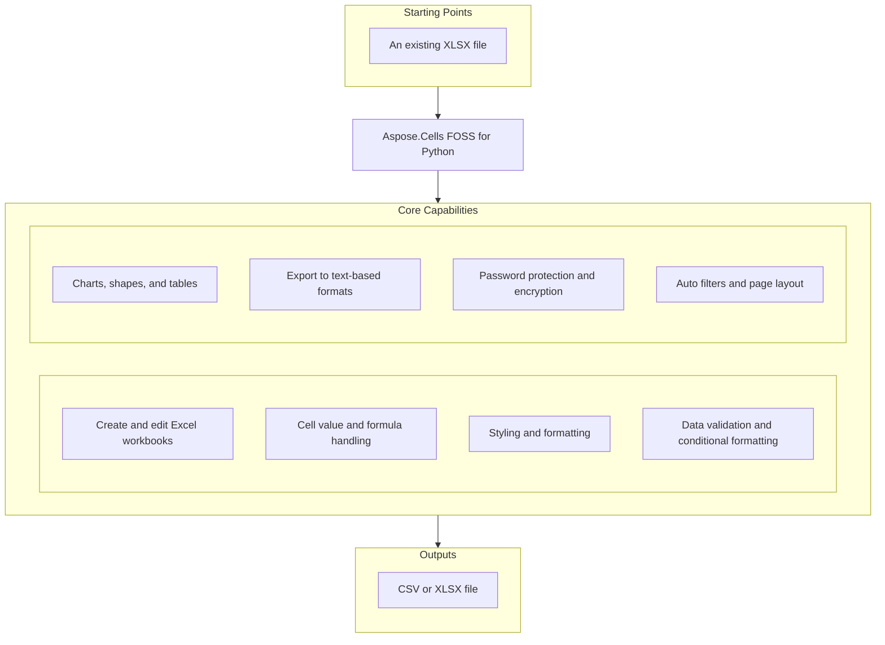

# Aspose.Cells FOSS for Python

[](https://pypi.org/project/aspose-cells-foss/)  [](License/LICENSE.txt) [](https://github.com/aspose-cells-foss/Aspose.Cells-FOSS-for-Python/graphs/contributors)

[](https://products.aspose.org/cells/python/)

Aspose.Cells FOSS for Python provides a free and open-source Python library for creating, reading, and converting Excel workbooks. It supports reading `.xlsx` files as input and writing `.xlsx` and `.csv` files as output, enabling users to process spreadsheet data without licensing restrictions. Developers use it to automate tasks such as styling cells, applying data validation, inserting charts, and protecting workbooks with encryption. The library exposes core functionality through classes like `Workbook`, `Cell`, `Style`, `Font`, `NumberFormat`, and `DataValidationCollection`, along with methods like `save_as_csv`, `save_as_json`, and `save_as_markdown`.

## Navigation

- [At a Glance](#at-a-glance)
- [Key Capabilities](#key-capabilities)
- [Installation](#installation)
- [Dependencies](#dependencies)
- [Quick Start](#quick-start)
- [Additional Examples](#additional-examples)
- [API Reference](#api-reference)
- [Documentation & Resources](#documentation--resources)
- [Scope and Limitations](#scope-and-limitations)
- [Development and Testing](#development-and-testing)
- [License](#license)

## At a Glance


```mermaid
flowchart TD
  subgraph StartingPoints["Starting Points"]
    direction LR
    i1["An existing XLSX file"]
  end
  PRODUCT["Aspose.Cells FOSS for Python"]
  subgraph Capabilities["Core Capabilities"]
    direction LR
    subgraph capl[" "]
      direction TB
      c1["Create and edit Excel workbooks"]
      c2["Cell value and formula handling"]
      c3["Styling and formatting"]
      c4["Data validation and conditional formatting"]
    end
    subgraph capr[" "]
      direction TB
      c5["Charts, shapes, and tables"]
      c6["Export to text-based formats"]
      c7["Password protection and encryption"]
      c8["Auto filters and page layout"]
    end
  end
  subgraph Outputs["Outputs"]
    direction TB
    o1["CSV or XLSX file"]
  end
  StartingPoints --> PRODUCT --> Capabilities --> Outputs
```

## Key Capabilities

- **Create and edit Excel workbooks.** Create new workbooks from scratch or load existing `.xlsx` files, edit worksheet content by adding, copying, or removing sheets, and save the result back to `.xlsx` format using the `Workbook` class.
- **Cell value and formula handling.** Read and write cell values and formulas, inspect cell data types, and evaluate formulas programmatically using the `Cell` and `formula_evaluator` components.
- **Styling and formatting.** Apply detailed styling to cells using `Style`, `Font`, and `NumberFormat` objects to control appearance such as bold text, colors, font size, and numeric formatting.
- **Data validation and conditional formatting.** Enforce data entry rules with data validation lists and apply conditional formatting rules to highlight cells based on their values using the `DataValidationCollection` and `conditional_format` APIs.
- **Charts, shapes, and tables.** Insert and configure charts, shapes, and tables within worksheets using the `ChartCollection`, `ChartType`, `ShapeCollection`, and `TableCollection` classes.
- **Export to text-based formats.** Export workbook content to text-based formats such as CSV, JSON, and Markdown using dedicated save methods on the `Workbook` class.
- **Password protection and encryption.** Protect workbooks with password encryption using `xlsx_encryptor` and decrypt protected files using `decrypt_xlsx` with `AgileEncryptionParameters` support.
- **Auto filters and page layout.** Apply auto filters to data ranges and manage horizontal and vertical page breaks for print layout using the `auto_filter`, `HorizontalPageBreakCollection`, and `VerticalPageBreakCollection` APIs.

## Installation

Install the published package from PyPI (`aspose-cells-foss`, version 26.7.0):

```bash
pip install aspose-cells-foss
```

To work from a source checkout instead, install the clone with pip:

```bash
git clone https://github.com/aspose-cells-foss/Aspose.Cells-FOSS-for-Python.git
cd Aspose.Cells-FOSS-for-Python
pip install .
```

Verify the install:

```bash
python -c "import aspose.cells_foss"
```

The package declares `python_requires` as `>=3.7`.

## Dependencies

### Required Package Dependencies

- `olefile>=0.46`
- `pycryptodome>=3.15.0`

### Native and System Requirements

- Requires Python 3.7 or later (`python_requires=">=3.7"` in `pyproject.toml`).

### Development Dependencies

- `pytest>=7.0.0` (extra `dev`)
- `pytest-cov>=4.0.0` (extra `dev`)

## Quick Start

Create a new workbook, populate cells with text and numbers, and save the file as `output.xlsx` using the aspose-cells-foss package.

```python
from aspose.cells_foss import Workbook

workbook = Workbook()
worksheet = workbook.worksheets[0]

worksheet.cells["A1"].value = "Hello"
worksheet.cells["B1"].value = "World"
worksheet.cells["A2"].value = 42
worksheet.cells["B2"].value = 3.14

workbook.save("output.xlsx")
```

Open an existing Excel file, read the value from cell A1, and print it to the console using the aspose-cells-foss package.

```python
from aspose.cells_foss import Workbook

workbook = Workbook("input.xlsx")
worksheet = workbook.worksheets[0]

value = worksheet.cells["A1"].value
print(f"Cell A1 contains: {value}")
```

## Additional Examples

Create styled cells, add dropdown lists, convert to CSV, and protect workbooks with passwords using Aspose.Cells FOSS for Python.

### Apply Bold Red Font Styling to a Cell

```python
from aspose.cells_foss import Workbook

workbook = Workbook()
worksheet = workbook.worksheets[0]
cell = worksheet.cells["A1"]

cell.value = "Styled Text"

style = cell.get_style()
style.font.bold = True
style.font.color = "#FF0000"
style.font.size = 14
cell.apply_style(style)

workbook.save("styled.xlsx")
```

<details>
<summary>View Additional Examples</summary>

### Create a Dropdown List Validation in Cells A1 to A10

```python
from aspose.cells_foss import Workbook, DataValidationType

workbook = Workbook()
worksheet = workbook.worksheets[0]

validation = worksheet.data_validations.add("A1:A10")
validation.type = DataValidationType.LIST
validation.formula1 = '"Option1,Option2,Option3"'

workbook.save("validation.xlsx")
```

### Convert an Excel File to CSV Format

```python
from aspose.cells_foss import Workbook

workbook = Workbook("input.xlsx")
workbook.save_as_csv("output.csv")
```

### Save and Open a Password-Protected Workbook

```python
from aspose.cells_foss import Workbook

workbook = Workbook()
worksheet = workbook.worksheets[0]
worksheet.cells["A1"].value = "Confidential Data"

workbook.save("protected.xlsx", password="mypassword")

workbook2 = Workbook("protected.xlsx", password="mypassword")
```

</details>

## API Reference

The public entry point is the `aspose.cells_foss` package, where `aspose.cells_foss.Workbook` serves as the primary object for creating and manipulating spreadsheets, and `aspose.cells_foss.Worksheet` represents individual sheets within a workbook.

The verified public surface has 130 types.

<details>
<summary>View the Complete Public API Surface</summary>

### Core API

| Class | Description |
| --- | --- |
| `AgileEncryptionParameters` | Parameters for Agile Encryption (ECMA-376 Part 2, Section 4). |
| `CSVHandler` | Handles CSV import and export operations for workbooks. |
| `CSVLoadOptions` | Options for loading CSV files. |
| `CSVSaveOptions` | Options for saving CSV files. |
| `Cell` | Represents a single cell in a worksheet. |
| `Cells` | Represents a collection of cells in a worksheet. |
| `Chart` | Represents a chart in a worksheet. |
| `ChartAxis` | Represents a chart axis (category, value, or series). |
| `ChartCollection` | Collection of charts in a worksheet. |
| `ChartErrorBars` | Represents error bars attached to a chart series. |
| `ChartSeries` | Represents a single chart series. |
| `ChartView3D` | Represents chart-level 3D view settings. |
| `DataValidation` | Represents data validation settings for a range of cells. |
| `DataValidationCollection` | Represents a collection of DataValidation objects for a worksheet. |
| `Font` | Represents font settings for a cell or range of cells. |
| `HorizontalPageBreakCollection` | Collection of manual horizontal page breaks (row breaks). |
| `JsonHandler` | Handles JSON export operations for workbooks. |
| `JsonSaveOptions` | Options for saving JSON files. |
| `MarkdownHandler` | Handles Markdown export operations for workbooks. |
| `MarkdownSaveOptions` | Options for saving Markdown files. |
| `MsoFillFormat` | Fill format properties for a shape. |
| `MsoLineFormat` | Border/outline format properties for a shape. |
| `NSeries` | Collection of series for a chart. |
| `NumberFormat` | Represents number format settings for a cell or range of cells. |
| `Picture` | Represents a worksheet picture anchored to cells. |
| `PictureCollection` | Collection of pictures in a worksheet. |
| `Shape` | Represents a drawing shape (rectangle, oval, text box, arrow, etc.) on |
| `ShapeCollection` | Collection of Shape objects on a worksheet. |
| `ShapeFont` | Font properties for text inside a shape. |
| `Sparkline` | One sparkline: a data source range paired with the cell where it appears. |
| `SparklineGroup` | A group of sparklines that share the same visual style. |
| `SparklineGroupCollection` | Collection of SparklineGroup objects (ws.sparkline_groups). |
| `StandardEncryptionParameters` | Parameters for Standard Encryption (ECMA-376 Part 2, Section 3). |
| `Style` | Represents formatting settings for a cell or range of cells. |
| `Table` | Represents an Excel structured table (ECMA-376 §18.5). |
| `TableCollection` | Collection of Table objects belonging to a worksheet (ws.tables). |
| `TableColumn` | Settings for a single table column. |
| `TableStyleInfo` | Visual style settings for an Excel table. |
| `VerticalPageBreakCollection` | Collection of manual vertical page breaks (column breaks). |
| `Workbook` | Represents an Excel workbook. |
| `Worksheet` | Represents a single worksheet in an Excel workbook. |
| `AutoFilter` | Represents auto filters in a worksheet. |
| `FilterColumn` | Represents a filter column in an auto filter. |
| `CellValueHandler` | Handles cell value import and export operations according to ECMA-376 specification. |
| `CFBReader` | Reads encrypted XLSX from CFB format. |
| `cfb_handler.CFBWriter` | Writes encrypted XLSX to CFB format. |
| `cfb_writer.CFBWriter` | Writes CFB (Compound File Binary) files according to MS-CFB specification. |
| `MinimalCFBWriter` | Minimal CFB file writer for encrypted Office documents. |
| `CommentXMLReader` | Handles reading comment data from XML format. |
| `CommentXMLWriter` | Handles writing comment data to XML format. |
| `ConditionalFormat` | Represents a single conditional formatting rule applied to a cell range. |
| `ConditionalFormatCollection` | Represents a collection of conditional formats for a worksheet. |
| `CoreProperties` | Represents core document properties stored in docProps/core.xml. |
| `DocumentProperties` | Container for all document-level properties. |
| `ExtendedProperties` | Represents extended/application properties stored in docProps/app.xml. |
| `EncryptionVerifier` | Encryption verifier generation and validation. |
| `PackageEncryption` | Package data encryption and decryption. |
| `PasswordDerivation` | Password derivation helpers for Agile encryption. |
| `EncryptionParameters` | Base class for encryption parameters. |
| `FormulaEvaluator` | Basic formula evaluator for XLSX cells without cached values. |
| `Hyperlink` | Represents a hyperlink in a worksheet. |
| `Hyperlinks` | Collection of hyperlinks in a worksheet. |
| `SharedStringTable` | Manages the Shared String Table for XLSX files according to ECMA-376 specification. |
| `Alignment` | Represents alignment settings for a cell or range of cells. |
| `Border` | Represents border settings for a single side of a cell or range of cells. |
| `Borders` | Represents border settings for all sides of a cell or range of cells. |
| `Fill` | Represents fill settings for a cell or range of cells. |
| `Protection` | Represents protection settings for a cell or range of cells. |
| `CalculationProperties` | Represents calculation properties for the workbook. |
| `DefinedName` | Represents a defined name in the workbook. |
| `DefinedNameCollection` | Collection of defined names in the workbook. |
| `FileVersion` | Represents file version information for the workbook. |
| `WorkbookPr` | Represents workbook properties (workbookPr element). |
| `WorkbookProperties` | Container for all workbook-level properties. |
| `WorkbookProtection` | Represents workbook protection settings. |
| `WorkbookView` | Represents a workbook view configuration. |
| `SheetProtectionDictWrapper` | Dictionary-like wrapper around SheetProtection for backward compatibility. |
| `HeaderFooter` | Represents header and footer settings. |
| `PageMargins` | Represents page margins. |
| `PageSetup` | Represents page setup settings. |
| `Pane` | Represents pane (freeze/split) settings. |
| `PrintOptions` | Represents print options. |
| `Selection` | Represents cell selection in a sheet view. |
| `SheetFormatProperties` | Represents sheet format properties. |
| `SheetProtection` | Represents sheet protection settings. |
| `SheetView` | Represents a sheet view configuration. |
| `WorksheetProperties` | Container for all worksheet-level properties. |
| `XLSXDecryptor` | Handles decryption of XLSX files. |
| `XLSXEncryptor` | Handles encryption of XLSX files. |
| `AutoFilterXMLLoader` | Handles loading autofilter data from XML format for .xlsx files. |
| `AutoFilterXMLWriter` | Handles writing autofilter data to XML format for .xlsx files. |
| `ChartXmlLoader` | Loads worksheet chart settings from drawing/chart XML parts. |
| `ChartXmlSaver` | Handles writing chart-related XLSX parts: |
| `ConditionalFormatXMLLoader` | Handles loading conditional formatting data from XML format for .xlsx files. |
| `ConditionalFormatXMLWriter` | Handles writing conditional formatting data to XML format for .xlsx files. |
| `DataValidationXmlLoader` | Loads DataValidation objects from ECMA-376 SpreadsheetML XML format. |
| `DataValidationXmlSaver` | Saves DataValidation objects to ECMA-376 SpreadsheetML XML format. |
| `HyperlinkRelationshipWriter` | Writes hyperlink relationships to _rels files. |
| `HyperlinkXMLLoader` | Loads hyperlinks from worksheet XML and relationship files. |
| `HyperlinkXMLSaver` | Saves hyperlinks to worksheet XML and relationship files. |
| `XMLLoader` | Handles loading of Excel workbook XML files. |
| `PictureXmlLoader` | Loads pictures from worksheet drawing parts. |
| `PictureXmlSaver` | Handles writing picture-related drawing/media XML payloads. |
| `WorkbookPropertiesXMLLoader` | Handles loading workbook properties from XML format for .xlsx files. |
| `WorksheetPropertiesXMLLoader` | Handles loading worksheet properties from XML format for .xlsx files. |
| `WorkbookPropertiesXMLWriter` | Handles writing workbook properties to XML format for .xlsx files. |
| `WorksheetPropertiesXMLWriter` | Handles writing worksheet properties to XML format for .xlsx files. |
| `XMLSaver` | Handles saving workbook data to XML format for .xlsx files. |
| `ShapeXmlLoader` | Loads xdr:sp shape elements from a drawing XML part. |
| `ShapeXmlSaver` | Generates drawing XML and relationship XML for worksheet shapes. |
| `SparklineXmlLoader` | Loads sparkline group data from the <extLst> in a worksheet XML root. |
| `SparklineXmlSaver` | Serialises SparklineGroupCollection to <extLst> XML. |
| `TableXmlLoader` | Loads table definitions from an XLSX ZIP archive into a worksheet. |
| `TableXmlSaver` | Serialises Table objects to ECMA-376 table XML. |

#### Enumerations

| Enumeration | Description |
| --- | --- |
| `ChartType` | Supported chart types. |
| `CipherAlgorithm` | Cipher algorithm enumeration. |
| `DataValidationAlertStyle` | Specifies the style of the error alert displayed when invalid data is entered. |
| `DataValidationImeMode` | Specifies the Input Method Editor (IME) mode for CJK language input. |
| `DataValidationOperator` | Specifies the comparison operator for data validation. |
| `DataValidationType` | Specifies the type of data validation. |
| `FillType` | Shape fill type (ECMA-376 a:spPr fill child elements). |
| `HashAlgorithm` | Hash algorithm enumeration. |
| `MsoDrawingType` | Shape preset geometry types (maps to ECMA-376 a:prstGeom prst attributes). |
| `MsoLineDashStyle` | Shape border/line dash style (ECMA-376 a:prstDash val attribute). |
| `SaveFormat` | Specifies the format for saving a workbook. |
| `SparklineEmptyCells` | SparklineEmptyCells represents how empty cells are treated in a sparkline, with members defining behaviors such as connecting data points or leaving gaps. |
| `SparklineType` | SparklineType defines the visual style of a sparkline, such as line, column, or win/loss, by specifying the chart type used for rendering. |
| `TextAlignmentType` | Horizontal text alignment inside a shape (ECMA-376 a:pPr algn attribute). |
| `TextAnchorType` | Vertical text anchor inside a shape (ECMA-376 a:bodyPr anchor attribute). |
| `EncryptionType` | Encryption type enumeration. |

#### Detailed Member Reference

### Workbook

The `aspose.cells_foss.Workbook` class provides methods to create, load, protect, and save workbooks, and exposes collections such as worksheets and document properties through its members.

- `add_worksheet`: Adds a new worksheet to the workbook.
- `copy_worksheet`: Copy a worksheet and append the copy to the workbook. Returns the new worksheet.
- `create_worksheet`: Create and add a new worksheet. Alias for add_worksheet().
- `document_properties`: Gets document properties of the workbook.
- `file_path`: Gets the file path of the workbook.
- `get_active_worksheet`: Return the currently active worksheet.
- `get_worksheet`: Gets a worksheet by index or name.
- `get_worksheet_by_index`: Return the worksheet at the given 0-based index, or None if out of range.
- `get_worksheet_by_name`: Return the worksheet with the given name, or None if not found.
- `is_protected`: Return True if the workbook has structure or window protection enabled.
- `load_csv`: Loads data from a CSV file into the workbook.
- `properties`: Gets workbook properties.
- `protect`: Protect the workbook structure/windows with an optional password.
- `protection`: Return a dict with the current workbook protection settings.
- `remove_worksheet`: Removes a worksheet from the workbook.
- `save`: Saves the workbook to a file.
- `save_as_csv`: Saves the workbook to a CSV file.
- `save_as_json`: Saves the workbook to a JSON file.
- `save_as_markdown`: Saves the workbook to a Markdown file.
- `set_active_worksheet`: Set the active worksheet by index, name, or Worksheet object.
- `unprotect`: Remove workbook structure/window protection.
- `worksheets`: Gets collection of worksheets in the workbook.

### Worksheet

The `aspose.cells_foss.Worksheet` class represents a single worksheet and offers access to cells, charts, data validations, and formatting options, along with operations like copying, renaming, and protecting the sheet.

- `ClearPrintArea`: Defined as `def ClearPrintArea(self)`.
- `SetPrintArea`: Defined as `def SetPrintArea(self, print_area)`.
- `activate`: Activates the worksheet (makes it the active worksheet).
- `auto_filter`: Gets the AutoFilter object for this worksheet.
- `calculate_formula`: Calculates formulas in the worksheet.
- `cells`: Gets the Cells collection for this worksheet.
- `charts`: Gets the collection of charts for this worksheet.
- `clear_print_area`: Clears the worksheet print area.
- `clear_tab_color`: Clear the worksheet tab color.
- `conditional_formats`: Gets the collection of conditional formats for this worksheet.
- `copy`: Creates a copy of the worksheet.
- `data_validations`: Gets the collection of data validations for this worksheet.
- `delete`: Deletes the worksheet from the workbook.
- `get_page_margins`: Return a copy of the page margins dict.
- `get_page_orientation`: Return the page orientation ('portrait', 'landscape', or None).
- `get_paper_size`: Return the paper size integer code.
- `get_range`: Gets a range of cells.
- `get_tab_color`: Return the worksheet tab color (8-char AARRGGBB hex) or None.
- `get_visibility`: Return current worksheet visibility (True, False, or 'veryHidden').
- `horizontal_page_breaks`: Gets manual horizontal page break collection.
- `hyperlinks`: Gets the collection of hyperlinks for this worksheet.
- `is_protected`: Checks if the worksheet is protected.
- `merged_cells`: Gets merged cell ranges in A1 notation.
- `move`: Moves the worksheet to the specified position in the workbook.
- `name`: Gets or sets the name of the worksheet.
- `page_margins`: Gets the page margins for this worksheet.
- `page_setup`: Gets the page setup settings for this worksheet.
- `pictures`: Gets the collection of pictures for this worksheet.
- `print_area`: Gets or sets print area in A1 notation.
- `properties`: Gets the worksheet properties.
- `protect`: Protects the worksheet with optional password and protection options.
- `protection`: Gets the protection settings for this worksheet.
- `rename`: Renames the worksheet.
- `select`: Selects the worksheet.
- `set_fit_to_pages`: Set fit-to-pages: width and height are page counts (0 = auto).
- `set_page_margins`: Set page margins (in inches). Only provided values are updated.
- `set_page_orientation`: Set page orientation. orientation must be 'portrait' or 'landscape'.
- `set_paper_size`: Set the paper size (integer code, e.g. 9 = A4).
- `set_print_area`: Sets the worksheet print area.
- `set_print_scale`: Set print scale percentage (10–400).
- `set_tab_color`: Set the worksheet tab color. color must be an 8-char AARRGGBB hex string.
- `set_view`: Sets view options for the worksheet.
- `set_visibility`: Set worksheet visibility. Accepts True, False, or 'veryHidden'.
- `shapes`: Gets the collection of drawing shapes for this worksheet.
- `sparkline_groups`: Gets the collection of sparkline groups for this worksheet.
- `tab_color`: Gets or sets the tab color of the worksheet.
- `tables`: Gets the collection of structured tables (ListObjects) for this worksheet.
- `unprotect`: Unprotects the worksheet.
- `vertical_page_breaks`: Gets manual vertical page break collection.
- `visible`: Gets or sets the visibility state of the worksheet.

### Cell

The `aspose.cells_foss.Cell` class exposes individual cell data and formatting, and is accessed through the `aspose.cells_foss.Cells` collection on a worksheet.

- `apply_style`: Applies a style to the cell.
- `clear`: Clears both the value and formula of the cell.
- `clear_comment`: Clears the comment from the cell.
- `clear_formula`: Clears the formula of the cell (sets it to None).
- `clear_style`: Clears the style of the cell (resets to default).
- `clear_value`: Clears the value of the cell (sets it to None).
- `comment`: Gets the comment associated with the cell.
- `data_type`: Gets the data type of the cell value.
- `formula`: Gets or sets the formula of the cell.
- `get_comment`: Gets the comment from the cell.
- `get_comment_size`: Gets the size of the comment box.
- `get_style`: Gets the style of the cell.
- `has_comment`: Checks if the cell has a comment.
- `has_formula`: Checks if the cell has a formula.
- `is_boolean_value`: Checks if the cell value is boolean.
- `is_date_time_value`: Checks if the cell value is a date/time.
- `is_empty`: Checks if the cell is empty.
- `is_numeric_value`: Checks if the cell value is numeric.
- `is_text_value`: Checks if the cell value is text.
- `put_value`: Sets the value of the cell. Alias for the value setter, provided for
- `set_comment`: Sets a comment on the cell.
- `set_comment_size`: Sets the size of the comment box.
- `style`: Gets or sets the style of the cell.
- `value`: Gets or sets the value of the cell.

### Style

The `aspose.cells_foss.Style` class allows setting font, number format, and other formatting attributes, and can be applied to cells or ranges via the `apply_style` method.

- `copy`: Creates a deep copy of this Style object.
- `set_border`: Sets complete border properties for a specific side.
- `set_border_color`: Sets the border color for a specific side.
- `set_border_style`: Sets the border line style for a specific side.
- `set_border_weight`: Sets the border line weight for a specific side.
- `set_builtin_number_format`: Sets the number format using a built-in format ID.
- `set_diagonal_border`: Sets diagonal border properties.
- `set_fill_color`: Sets the cell fill color using a solid fill pattern.
- `set_fill_pattern`: Sets the cell fill pattern and colors.
- `set_formula_hidden`: Sets whether the cell's formula is hidden when the worksheet is protected.
- `set_horizontal_alignment`: Sets the horizontal alignment of cell content.
- `set_indent`: Sets the indent level for cell content.
- `set_locked`: Sets whether the cell is locked when the worksheet is protected.
- `set_no_fill`: Removes the cell fill (transparent background).
- `set_number_format`: Sets the number format code for the cell.
- `set_reading_order`: Sets the reading order for cell content.
- `set_shrink_to_fit`: Sets whether text shrinks to fit the cell width.
- `set_text_rotation`: Sets the text rotation angle.
- `set_text_wrap`: Sets whether text wraps within the cell.
- `set_vertical_alignment`: Sets the vertical alignment of cell content.

### ChartCollection

The `aspose.cells_foss.ChartCollection` class manages chart objects on a worksheet and supports adding, removing, and iterating over charts of types defined by `aspose.cells_foss.ChartType`.

- `Add`: PascalCase alias of add().
- `AddArea`: PascalCase alias of add_area().
- `AddBar`: PascalCase alias of add_bar().
- `AddBoxWhisker`: PascalCase alias of add_box_whisker().
- `AddCombo`: PascalCase alias of add_combo().
- `AddFunnel`: PascalCase alias of add_funnel().
- `AddHistogram`: PascalCase alias of add_histogram().
- `AddLine`: PascalCase alias of add_line().
- `AddMap`: PascalCase alias of add_map().
- `AddPie`: PascalCase alias of add_pie().
- `AddScatter`: PascalCase alias of add_scatter().
- `AddStock`: PascalCase alias of add_stock().
- `AddSunburst`: PascalCase alias of add_sunburst().
- `AddWaterfall`: PascalCase alias of add_waterfall().
- `add`: Adds a chart to the worksheet.
- `add_area`: Adds an area chart and returns it.
- `add_bar`: Adds a bar chart and returns it.
- `add_box_whisker`: Adds a box-whisker chart and returns it.
- `add_combo`: Adds a combo chart and returns it.
- `add_funnel`: Adds a funnel chart and returns it.
- `add_histogram`: Adds a histogram chart and returns it.
- `add_line`: Adds a line chart and returns it.
- `add_map`: Adds a map (region map) chart and returns it.
- `add_pie`: Adds a pie chart and returns it.
- `add_radar`: Adds a radar chart and returns it. radar_style: 'standard', 'marker', or 'filled'.
- `add_scatter`: Adds a scatter chart and returns it.
- `add_stock`: Adds a stock chart and returns it.
- `add_sunburst`: Adds a sunburst chart and returns it.
- `add_surface`: Adds a surface chart and returns it. is_3d=True for surface3DChart, False for surfaceChart.
- `add_treemap`: Adds a treemap chart and returns it.
- `add_waterfall`: Adds a waterfall chart and returns it.
- `copy`: Defined as `def copy(self, worksheet)`.
- `count`: Defined as `def count(self)`.

### DataValidationCollection

The `aspose.cells_foss.DataValidationCollection` class provides methods to add, remove, and manage data validation rules on a worksheet, with rule types defined by `aspose.cells_foss.DataValidationType`.

- `add`: Adds a new data validation to the collection.
- `add_validation`: Adds an existing DataValidation object to the collection.
- `clear`: Removes all validations from the collection.
- `count`: Gets the number of validations in the collection.
- `disable_prompts`: Gets or sets whether all input prompts are disabled.
- `get_validation`: Gets the validation that applies to a specific cell.
- `remove`: Removes a validation from the collection.
- `remove_at`: Removes a validation at the specified index.
- `remove_by_range`: Removes validations that match the specified range.
- `x_window`: Gets or sets the X coordinate of the dropdown window.
- `y_window`: Gets or sets the Y coordinate of the dropdown window.

### save_workbook_as_csv

The `aspose.cells_foss.save_workbook_as_csv` function enables saving a workbook to CSV format using options from `aspose.cells_foss.CSVSaveOptions` and handling via `aspose.cells_foss.CSVHandler`.

### save_workbook_as_json

The `aspose.cells_foss.save_workbook_as_json` function saves a workbook to JSON format using options from `aspose.cells_foss.JsonSaveOptions` and handling via `aspose.cells_foss.JsonHandler`.

### save_workbook_as_markdown

The `aspose.cells_foss.save_workbook_as_markdown` function exports a workbook to Markdown format using options from `aspose.cells_foss.MarkdownSaveOptions` and handling via `aspose.cells_foss.MarkdownHandler`.

### encrypt_xlsx

The `aspose.cells_foss.encrypt_xlsx` function secures an XLSX file using either `aspose.cells_foss.AgileEncryptionParameters` or `aspose.cells_foss.StandardEncryptionParameters` through the `aspose.cells_foss.xlsx_encryptor` interface.

### decrypt_xlsx

The `aspose.cells_foss.decrypt_xlsx` function removes encryption from an XLSX file using the same `aspose.cells_foss.xlsx_encryptor` interface and supports parameters from `aspose.cells_foss.AgileEncryptionParameters`.

### TableCollection

The `aspose.cells_foss.TableCollection` class manages table objects on a worksheet, allowing creation, removal, and iteration over tables defined by `aspose.cells_foss.Table`.

- `Add`: Defined as `def Add(self, start_row: int, start_col: int, end_row: int, end_col: int, has_headers: bool=True, name: str=None) -> Table`.
- `AddWithRange`: Defined as `def AddWithRange(self, cell_range: str, name: str=None, has_headers: bool=True) -> Table`.
- `add`: Create a new table from 0-based row/column indices and add it to the worksheet.
- `add_with_range`: Create a new table from an A1 range string like 'A1:D10'.
- `copy`: Defined as `def copy(self, new_ws) -> 'TableCollection'`.
- `count`: Defined as `def count(self) -> int`.

The public entry point is the `aspose.cells_foss` package (import: `from aspose.cells_foss import
Workbook`). The classes below cover the full supported public API surface — 130 public types
organized into one module.

</details>

## Documentation & Resources

- **[Getting started guide](https://docs.aspose.org/cells/python/)** — The getting started guide covers Python documentation for Aspose.Cells FOSS for Python, including workbook creation, cell operations, styling, and data validation.
- **[How-to guides & FAQ](https://kb.aspose.org/cells/python/)** — The how-to guides and FAQ provide Python knowledge base articles, step-by-step instructions, and troubleshooting resources for Aspose.Cells FOSS for Python.
- **[Full API reference](https://reference.aspose.org/cells/python/)** — The full API reference offers a complete, browsable reference for all 130 public types in Aspose.Cells FOSS for Python. It covers all 130 verified public types; the [API Reference](#api-reference) section above covers the essentials.
- **[examples](examples)** — The examples directory contains additional sample code demonstrating workbook creation, cell manipulation, styling, and data validation workflows.
- **[Contributor guide](AGENTS.md)** — The contributor guide documents architecture notes and development conventions for individuals contributing to Aspose.Cells FOSS for Python.
- Found a bug or have a feature request? [Open an issue](https://github.com/aspose-cells-foss/Aspose.Cells-FOSS-for-Python/issues).

## Scope and Limitations

Aspose.Cells FOSS for Python provides a free, open-source API for reading and writing Excel files in the `.xlsx` format, with additional export support for `.csv`, JSON, and Markdown, and basic formula evaluation for cells without cached values.

- Only `.xlsx` is supported for native load and save operations; CSV, JSON, and Markdown are additional text-format export targets (CSV also supports import), not general spreadsheet formats.
- Only Agile encryption (ECMA-376 Part 2, Section 4) is supported for reading and writing password-protected workbooks; Standard encryption (Section 3) is not yet supported for reading.
- The `formula_evaluator` module provides a basic evaluator for cells without cached values and is not a full spreadsheet calculation engine.

## Development and Testing

The toolchain requires Python 3.7 or later and uses the standard Python packaging ecosystem. Development dependencies are installed via pip with the dev extra, and the test suite validates core workbook, worksheet, cell, and style operations including value assignment, formula calculation, formatting, and data validation.

Install the development dependencies and run the test suite:

```bash
pip install -e ".[dev]"
pytest
```

## License

This project is licensed under the [MIT License](License/LICENSE.txt). The MIT License permits use, copying, modification, distribution, sublicensing, and commercial use, provided its copyright and permission notice are retained. The software is provided without warranty.
