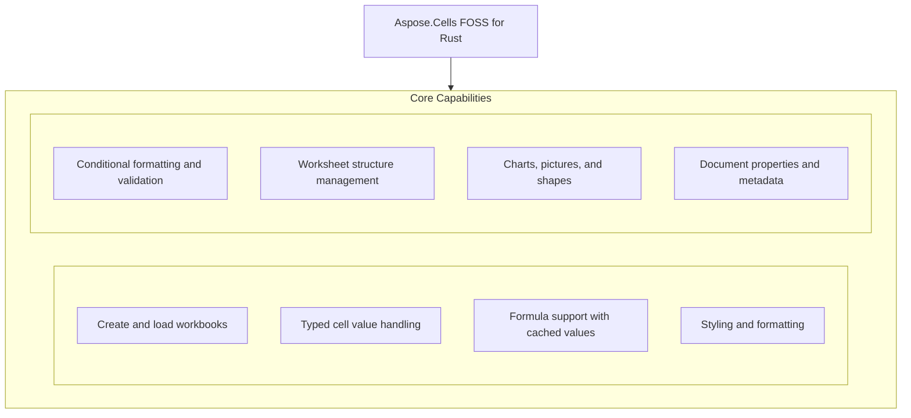

# Aspose.Cells FOSS for Rust

[](LICENSE.txt) [](https://github.com/aspose-cells-foss/Aspose.Cells-FOSS-for-Rust/graphs/contributors)

[](https://products.aspose.org/cells/rust/)

Aspose.Cells FOSS for Rust provides a native Rust API for creating, reading, converting, and manipulating Excel workbooks and worksheets without requiring Microsoft Excel. It enables developers to programmatically write cell values such as strings, integers, booleans, decimals, and dates using methods like `put_value_string` and `put_value_i32`, and to compute formulas with cached results via `put_formula_with_cached_value`. Users can load existing Excel files in XLSX format from a file path, byte array, or stream using `Workbook.new` and `load_xlsx`, `load_xlsx_from_bytes`, or `load_xlsx_from_stream`, and inspect loaded content with methods like `get_string_value`, `get_int_value`, `get_bool_value`, `get_display_string_value`, and `get_formatted_string_value`. The library supports styling, formatting, filtering, freezing panes, and adding charts, shapes, comments, hyperlinks, and data validation rules, making it suitable for server-side spreadsheet processing in Rust applications.

## Navigation

- [At a Glance](#at-a-glance)
- [Key Capabilities](#key-capabilities)
- [Installation](#installation)
- [Dependencies](#dependencies)
- [Quick Start](#quick-start)
- [API Reference](#api-reference)
- [Documentation & Resources](#documentation--resources)
- [Scope and Limitations](#scope-and-limitations)
- [Development and Testing](#development-and-testing)
- [License](#license)

## At a Glance



## Key Capabilities

- **Create and load workbooks.** Create a new workbook with `Workbook.new` or load an existing .xlsx file from a path, a stream, or in-memory bytes, with optional package repair via `LoadOptions.try_repair_package`.
- **Typed cell value handling.** Write typed cell values including strings, 32-bit integers, booleans, decimals, and date-time values using `CellMut` methods, and read them back with `Cell` methods that return the corresponding Rust types.
- **Formula support with cached values.** Enter formulas with precomputed cached values using `CellMut.put_formula_with_cached_value` and retrieve the displayed or formatted string representation of a cell with `Cell.get_display_string_value` or `Cell.get_formatted_string_value`.
- **Styling and formatting.** Apply cell styling through `CellStyle` with `Font`, `Fill`, `Border`, and `NumberFormat` settings, and apply targeted updates using `StyleFlag` to modify only specific style attributes.
- **Conditional formatting and validation.** Enforce data validation rules and apply conditional formatting including cell-value conditions, expressions, color scales, data bars, and icon sets using `Validation`, `ValidationCollection`, `FormatCondition`, and `ConditionalFormattingCollection`.
- **Worksheet structure management.** Manage worksheet structure through `Worksheets` for sheet enumeration and `Worksheet` for individual sheet properties, plus freeze panes, auto-filters, row and column sizing, and page setup via `PageSetup`.
- **Charts, pictures, and shapes.** Insert charts of multiple types including column, line, bar, pie, and scatter variants using `ChartCollection` and `ChartType`, embed pictures with `PictureCollection`, and add drawing shapes with `Shape` and preset `AutoShapeType` geometries.
- **Document properties and metadata.** Attach hyperlinks, workbook- and sheet-scoped defined names, and cell comments with author and visibility control, and read or write core and extended document properties as well as sparkline groups for in-cell trend visualization.

## Installation

`aspose-cells-foss-rust` is not yet published on crates.io; build it from a source checkout instead, verified against this revision:

```bash
git clone https://github.com/aspose-cells-foss/Aspose.Cells-FOSS-for-Rust.git
cd Aspose.Cells-FOSS-for-Rust
cargo build
```

Verify the install:

```bash
cargo check
```

## Dependencies

### Required Package Dependencies

- `base64 0.22`
- `chrono 0.4`
- `getrandom 0.3`
- `roxmltree 0.20`
- `serde_json 1`
- `sha2 0.10`
- `zip 0.6`

### Native and System Requirements

- Requires Rust edition `2021` (`edition` in `Cargo.toml`).

## Quick Start

This example creates a new workbook, writes several typed cell values and a formula with a cached result, saves the file as XLSX, and then loads it back to verify the content.

```rust
use aspose_cells_foss_rust::{CellValue, Workbook};
use std::error::Error;

fn main() -> Result<(), Box<dyn Error>> {
    // Create a new workbook (starts with one sheet, "Sheet1").
    let mut workbook = Workbook::new();
    {
        let mut worksheets = workbook.get_worksheets_mut();
        let sheet = worksheets.get(0)?;
        let mut cells = sheet.get_cells_mut();

        cells.get("A1")?.put_value_string("Hello")?;
        cells.get("B1")?.put_value_i32(123)?;
        cells.get("C1")?.put_value_bool(true)?;
        cells.get("D1")?.put_value_decimal(12.5)?;
        cells.get("F1")?.put_value_i32(10)?;
        cells.get("G1")?
            .put_formula_with_cached_value("=F1*2", CellValue::Number(20.0))?;
    }
    workbook.save("hello.xlsx")?;

    // Load it back.
    let loaded = Workbook::load_xlsx("hello.xlsx")?;
    let sheet = loaded.worksheet("Sheet1")?;
    let cells = sheet.get_cells();
    println!("A1 = {}", cells.get("A1")?.display_string_value());

    Ok(())
}
```

## API Reference

The Aspose.Cells FOSS for Rust library exposes the `Workbook` class as its primary entry point, which manages a collection of `Worksheet` objects and provides methods to load, create, and save Excel workbooks. Each `Worksheet` exposes its cells through `get_cells` and `get_cells_mut`, enabling read and write access to individual `Cell` and `CellMut` instances.

The verified public surface has 213 types.

<details>
<summary>View the Complete Public API Surface</summary>

### Core API

| Class | Description |
| --- | --- |
| `AlignmentValue` | AlignmentValue represents the horizontal and vertical alignment settings for cell content. |
| `AutoFilter` | Represents auto filter. |
| `AutoFilterColorFilter` | Represents auto filter color filter. |
| `AutoFilterColorFilterModel` | AutoFilterColorFilterModel specifies filtering criteria based on cell or font color. |
| `AutoFilterCustomFilter` | Represents auto filter custom filter. |
| `AutoFilterCustomFilterCollection` | Represents a collection of auto filter custom filter objects. |
| `AutoFilterCustomFilterModel` | AutoFilterCustomFilterModel defines custom filter conditions for column data. |
| `AutoFilterDynamicFilter` | Represents auto filter dynamic filter. |
| `AutoFilterDynamicFilterModel` | AutoFilterDynamicFilterModel applies dynamic filtering based on calculated values such as above or below average. |
| `AutoFilterModel` | AutoFilterModel encapsulates the complete auto-filter configuration for a worksheet range. |
| `AutoFilterSortCondition` | Represents auto filter sort condition. |
| `AutoFilterSortConditionCollection` | Represents a collection of auto filter sort condition objects. |
| `AutoFilterSortConditionModel` | AutoFilterSortConditionModel describes a single sort condition used in an auto-filter operation. |
| `AutoFilterSortState` | Represents auto filter sort state. |
| `AutoFilterSortStateModel` | AutoFilterSortStateModel holds the current sort state applied to an auto-filtered range. |
| `AutoFilterTop10` | Represents auto filter top10. |
| `AutoFilterTop10Model` | AutoFilterTop10Model filters data to show only the top or bottom N items based on value. |
| `Border` | Represents border. |
| `BorderSideValue` | BorderSideValue indicates which side of a cell border is being configured. |
| `Borders` | Represents borders. |
| `BordersValue` | BordersValue represents the collection of border settings applied to a cell or range. |
| `CalculationProperties` | Represents calculation properties. |
| `CalculationPropertiesModel` | CalculationPropertiesModel controls workbook calculation behavior including iteration and precision settings. |
| `Cell` | Represents a single worksheet cell and exposes value, formula, and style operations. |
| `CellArea` | Represents cell area. |
| `CellFormatValue` | CellFormatValue holds formatting attributes such as font, fill, and number format for a cell. |
| `CellMut` | Represents a single worksheet cell and exposes value, formula, and style operations. |
| `CellRange` | CellRange identifies a rectangular block of cells using start and end coordinates. |
| `CellRecord` | CellRecord stores the value, type, and formatting of a single cell for programmatic access. |
| `CellRef` | CellRef provides a reference to a specific cell using row and column indices. |
| `CellStyle` | Represents a mutable cell style facade that can be applied to one or more cells. |
| `Cells` | Provides access to worksheet cells, rows, columns, and merged ranges. |
| `CellsException` | Represents an error that occurs during cells. |
| `CellsMut` | Provides access to worksheet cells, rows, columns, and merged ranges. |
| `Chart` | Represents a chart embedded in a worksheet. |
| `ChartCollection` | Represents collection of charts on a worksheet. |
| `ChartCompanionFile` | ChartCompanionFile contains additional data or metadata associated with a chart object. |
| `ChartModel` | ChartModel provides programmatic access to chart properties and data series. |
| `ChartXmlTemplates` | ChartXmlTemplates defines reusable XML structures for chart rendering and export. |
| `Color` | Represents color. |
| `ColorValue` | ColorValue specifies a color using RGB or predefined palette values. |
| `Column` | Represents column. |
| `ColumnMut` | Represents column. |
| `ColumnProperties` | Encapsulates a single worksheet and its supported v0.1 worksheet features. |
| `ColumnRangeModel` | ColumnRangeModel describes a contiguous set of columns within a worksheet. |
| `Columns` | Represents a collection of column objects. |
| `ColumnsMut` | Represents a collection of column objects. |
| `Comment` | Represents a worksheet comment (legacy note) anchored to a single cell. |
| `CommentCollection` | Represents the collection of comments (legacy notes) on a worksheet. |
| `CommentModel` | CommentModel represents a cell comment including its text, author, and visibility settings. |
| `ConditionalFormattingCollection` | Represents a collection of conditional formatting objects. |
| `ConditionalFormattingModel` | ConditionalFormattingModel defines rules that apply formatting based on cell value conditions. |
| `CoreDocumentProperties` | Represents core document properties. |
| `CoreDocumentPropertiesModel` | CoreDocumentPropertiesModel exposes standard document metadata such as title, author, and keywords. |
| `DefinedName` | Represents defined name. |
| `DefinedNameCollection` | Represents a collection of defined name objects. |
| `DefinedNameModel` | DefinedNameModel represents a named range or formula used within the workbook. |
| `DefinedNameUtility` | DefinedNameUtility provides helper methods for working with defined names in a workbook. |
| `DiagnosticBag` | DiagnosticBag aggregates issues and warnings encountered during workbook loading or processing. |
| `DiagnosticEntry` | DiagnosticEntry records a single diagnostic issue including its severity and description. |
| `DisplayFormatSectionInfo` | DisplayFormatSectionInfo provides formatting details for specific sections of a report or table. |
| `DisplayTextDateFormatSupport` | DisplayTextDateFormatSupport enables locale-aware formatting of date values for display. |
| `DisplayTextFormatter` | DisplayTextFormatter converts cell values into their formatted string representation. |
| `DisplayTextFormatterSupport` | DisplayTextFormatterSupport provides utilities for customizing how cell values are formatted as text. |
| `DisplayTextLocaleSupport` | DisplayTextLocaleSupport ensures text formatting respects regional locale settings. |
| `DocumentProperties` | Represents document properties. |
| `DocumentPropertiesModel` | DocumentPropertiesModel exposes extended document properties beyond the core metadata set. |
| `ExtendedDocumentProperties` | Represents extended document properties. |
| `ExtendedDocumentPropertiesModel` | ExtendedDocumentPropertiesModel represents custom document properties for a workbook. |
| `ExternalLinkModel` | ExternalLinkModel represents a link to an external workbook or data source. |
| `Fill` | Represents a mutable cell style facade that can be applied to one or more cells. |
| `FillValue` | FillValue describes the fill formatting applied to a cell. |
| `FilterColumn` | Represents filter column. |
| `FilterColumnCollection` | Represents a collection of filter column objects. |
| `FilterColumnModel` | FilterColumnModel defines filtering criteria for a single column in a filtered range. |
| `FilterValueCollection` | Represents a collection of filter value objects. |
| `Font` | Represents font. |
| `FontValue` | FontValue specifies the font formatting attributes for text in a cell. |
| `FormatCondition` | Represents format condition. |
| `FormatConditionCollection` | Represents a collection of format condition objects. |
| `FormatConditionModel` | FormatConditionModel represents a conditional formatting rule applied to a cell range. |
| `FormulaException` | Represents an error that occurs during formula. |
| `FreezePane` | Encapsulates a single worksheet and its supported v0.1 worksheet features. |
| `Hyperlink` | Represents hyperlink. |
| `HyperlinkCollection` | Encapsulates the hyperlinks defined for a worksheet. |
| `HyperlinkModel` | HyperlinkModel represents a hyperlink attached to a cell. |
| `IListObjectOwner` | IListObjectOwner is an interface implemented by objects that can contain list objects. |
| `IPackageReader` | IPackageReader provides methods to read parts and relationships from a package. |
| `IPackageWriter` | IPackageWriter provides methods to write parts and relationships to a package. |
| `IWarningCallback` | Defines a callback that receives load warnings. |
| `InvalidFileFormatException` | Represents an error that occurs during invalid file format. |
| `ListColumn` | Represents a single column in an Excel table. |
| `ListColumnCollection` | Represents the ordered collection of columns in an Excel table. |
| `ListColumnModel` | ListColumnModel represents a column within a list object (table). |
| `ListObject` | Represents an Excel table (structured reference / ListObject). |
| `ListObjectCollection` | Represents the collection of Excel tables on a worksheet. |
| `ListObjectModel` | ListObjectModel represents a table object in a worksheet. |
| `ListObjectSupport` | ListObjectSupport provides functionality to manage list objects in a worksheet. |
| `LoadDiagnostics` | Represents load diagnostics. |
| `LoadIssue` | Represents load issue. |
| `LoadOptions` | Specifies how a workbook should be loaded. |
| `MergeRegion` | MergeRegion defines the area of merged cells in a worksheet. |
| `MissingPartException` | MissingPartException is raised when a required part is missing from a package. |
| `NumberFormat` | Provides number format operations. |
| `NumberFormatValue` | NumberFormatValue specifies the format used to display numeric values in a cell. |
| `PackageLoadContext` | PackageLoadContext provides context information during package loading. |
| `PackageModel` | PackageModel represents the structure and content of a package file. |
| `PackagePartDescriptor` | PackagePartDescriptor describes a single part within a package. |
| `PackageStructureException` | PackageStructureException is raised when the package structure is invalid. |
| `PackagingConventions` | PackagingConventions defines standard conventions for package organization. |
| `PageSetup` | Represents worksheet print and page-layout settings. |
| `Picture` | Represents a picture (image) anchored to a worksheet. |
| `PictureCollection` | Represents collection of pictures anchored to a worksheet. |
| `PictureModel` | PictureModel represents a picture object inserted into a worksheet. |
| `ProtectionValue` | ProtectionValue specifies the protection settings applied to a cell or range. |
| `RelationshipDescriptor` | RelationshipDescriptor describes a relationship between two parts in a package. |
| `RelationshipResolutionException` | RelationshipResolutionException is raised when a relationship cannot be resolved. |
| `Row` | Represents row. |
| `RowModel` | RowModel represents a row in a worksheet. |
| `RowMut` | Represents row. |
| `RowProperties` | Encapsulates a single worksheet and its supported v0.1 worksheet features. |
| `Rows` | Represents a collection of row objects. |
| `RowsMut` | Represents a collection of row objects. |
| `SaveOptions` | Specifies how a workbook should be saved. |
| `Shape` | Represents a drawing object (auto shape) anchored to a worksheet. |
| `ShapeCollection` | Represents collection of drawing objects (shapes) on a worksheet. |
| `ShapeImageModel` | ShapeImageModel represents the image content of a shape object. |
| `ShapeModel` | ShapeModel represents a shape object such as a rectangle or arrow in a worksheet. |
| `SharedStringRepository` | SharedStringRepository manages the shared string table used in the workbook. |
| `SharedStringTableXmlMapper` | SharedStringTableXmlMapper handles reading and writing the shared string table XML. |
| `SparklineGroup` | A sparkline group contains sparkline items that share type and settings. |
| `SparklineGroupCollection` | Represents a collection of sparkline groups on a worksheet. |
| `StyleException` | Represents an error that occurs during style. |
| `StyleFlag` | Represents flags which indicate applied formatting properties. |
| `StyleRepository` | StyleRepository stores and manages cell styles used in the workbook. |
| `StyleValue` | StyleValue defines the complete styling attributes for a cell. |
| `StyleValueSanitizer` | StyleValueSanitizer ensures style values conform to valid formatting rules. |
| `StylesheetLoadContext` | StylesheetLoadContext provides context information during stylesheet loading. |
| `StylesheetSaveContext` | StylesheetSaveContext provides context information during stylesheet saving. |
| `StylesheetXmlMapper` | StylesheetXmlMapper handles reading and writing the stylesheet XML. |
| `UnsupportedFeatureException` | Represents an error that occurs during unsupported feature. |
| `Validation` | Represents validation. |
| `ValidationCollection` | Represents a collection of validation objects. |
| `ValidationMessage` | ValidationMessage represents a single validation issue found during workbook validation, including its severity and descriptive text. |
| `ValidationModel` | ValidationModel holds the complete set of validation issues discovered when validating a workbook. |
| `WarningInfo` | Represents warning info. |
| `Workbook` | Represents the root spreadsheet object used to create, load, modify, and save an XLSX workbook. |
| `WorkbookLoadException` | Represents an error that occurs during workbook load. |
| `WorkbookModel` | WorkbookModel provides a read-only representation of a workbook's structure and content for inspection purposes. |
| `WorkbookProperties` | Represents workbook properties. |
| `WorkbookPropertiesModel` | WorkbookPropertiesModel exposes workbook-level properties such as date compatibility and calculation settings. |
| `WorkbookProtection` | Represents workbook protection. |
| `WorkbookProtectionModel` | WorkbookProtectionModel describes the protection settings applied to the workbook structure and windows. |
| `WorkbookSaveException` | Represents an error that occurs during workbook save. |
| `WorkbookSettings` | Represents workbook-level settings that affect date handling and display formatting. |
| `WorkbookSettingsModel` | WorkbookSettingsModel encapsulates workbook-wide configuration options including calculation mode and precision. |
| `WorkbookValidator` | WorkbookValidator performs validation checks on a workbook and collects any issues found. |
| `WorkbookView` | Represents workbook view. |
| `WorkbookViewModel` | WorkbookViewModel represents the view settings of a workbook, such as window state and zoom level. |
| `WorkbookXmlMapper` | WorkbookXmlMapper provides functionality to map XML data to and from structured elements in a workbook. |
| `Worksheet` | Encapsulates a single worksheet and its supported v0.1 worksheet features. |
| `WorksheetDefinedNamesState` | WorksheetDefinedNamesState tracks the defined names scoped to a specific worksheet. |
| `WorksheetModel` | WorksheetModel offers a read-only view of a worksheet's cells, rows, columns, and other structural elements. |
| `WorksheetProtection` | Represents worksheet protection. |
| `WorksheetProtectionModel` | WorksheetProtectionModel defines the protection settings applied to a worksheet, such as cell editing restrictions. |
| `WorksheetViewModel` | WorksheetViewModel holds view-specific settings for a worksheet, including gridlines and page break display. |
| `WorksheetXmlMapper` | WorksheetXmlMapper enables mapping XML data to specific ranges or elements within a worksheet. |
| `Worksheets` | Encapsulates the workbook's worksheets and active-sheet state. |
| `WorksheetsMut` | Encapsulates the workbook's worksheets and active-sheet state. |
| `XlsxWorkbookCommentsLoader` | XlsxWorkbookCommentsLoader handles loading comments embedded in an XLSX workbook file. |
| `XlsxWorkbookDefinedNames` | XlsxWorkbookDefinedNames manages the collection of defined names scoped to the entire workbook. |
| `XlsxWorkbookPicturesLoader` | XlsxWorkbookPicturesLoader is responsible for loading pictures stored within an XLSX workbook. |
| `XlsxWorkbookProperties` | XlsxWorkbookProperties reads and exposes core properties of an XLSX workbook, such as author and creation date. |
| `XlsxWorkbookStylesValueHelpers` | XlsxWorkbookStylesValueHelpers provides utility methods for interpreting style-related values in an XLSX workbook. |
| `XlsxWorkbookStylesXml` | XlsxWorkbookStylesXml encapsulates the raw XML structure of styles defined in an XLSX workbook. |
| `XlsxWorkbookWorksheetProtection` | XlsxWorkbookWorksheetProtection reads protection settings applied to individual worksheets in an XLSX file. |
| `XlsxWorkbookWorksheetViews` | XlsxWorkbookWorksheetViews manages the view configuration for each worksheet in an XLSX workbook. |
| `XmlParsingException` | XmlParsingException is raised when an error occurs while parsing XML content during workbook operations. |

#### Enumerations

| Enumeration | Description |
| --- | --- |
| `AutoShapeType` | Specifies the type of an auto shape (preset geometry). |
| `BorderLineStyle` | Represents border. |
| `BorderStyle` | BorderStyle defines the visual style of a cell border such as thin, thick, or dashed. |
| `BorderStyleType` | Specifies border style type. |
| `CellObjectValue` | CellObjectValue represents the complete content and metadata of a cell including its value and format. |
| `CellValue` | CellValue encapsulates the data stored in a cell along with its type information. |
| `CellValueKind` | CellValueKind categorizes the type of data contained in a cell such as number, string, or boolean. |
| `CellValueType` | Specifies cell value type. |
| `CellsError` | CellsError represents an error condition encountered during cell processing or data access. |
| `ChartType` | Specifies the chart type. |
| `DateSystem` | DateSystem determines whether dates are calculated using the 1900 or 1904 epoch. |
| `DiagnosticSeverity` | DiagnosticSeverity indicates the importance level of a diagnostic issue such as warning or error. |
| `FillPattern` | Specifies fill pattern. |
| `FillPatternKind` | FillPatternKind specifies the pattern used to fill a cell background. |
| `FilterOperatorType` | Represents FilterOperatorType. |
| `FontUnderlineType` | Enumerates font underline types. |
| `FormatConditionType` | Specifies format condition type. |
| `HorizontalAlignment` | HorizontalAlignment indicates how content is aligned horizontally within a cell. |
| `ImageType` | Represents the format of an image stored in a worksheet. |
| `LoadFormat` | Specifies load format. |
| `OperatorType` | Specifies operator type. |
| `PageOrientation` | PageOrientation specifies whether a page is printed in portrait or landscape mode. |
| `PageOrientationType` | Specifies page orientation type. |
| `PaperSizeType` | Specifies paper size type. |
| `SaveFormat` | Specifies save format. |
| `SheetVisibility` | SheetVisibility indicates whether a worksheet is visible, hidden, or very hidden. |
| `SparklineType` | Represents SparklineType. |
| `TableStyleType` | Represents the built-in Excel table style types. |
| `TargetModeType` | Specifies target mode type. |
| `TotalsCalculation` | Represents the aggregation function shown in a table totals row cell. |
| `ValidationAlertType` | Specifies validation alert type. |
| `ValidationMessageSeverity` | ValidationMessageSeverity indicates the seriousness level of a validation issue, such as error, warning, or info. |
| `ValidationType` | Specifies validation type. |
| `VerticalAlignment` | VerticalAlignment specifies how content is aligned vertically within a cell, such as top, center, or bottom. |
| `VisibilityType` | Specifies visibility type. |

#### Detailed Member Reference

### Workbook

The `Workbook` class provides new, `load_xlsx`, and `save_xlsx` methods to create, open, and persist Excel workbooks, serving as the central object for workbook-level operations.

- `add_worksheet`: Adds an item.
- `default`: Defined as `Self default()`.
- `defined_names`: Gets the workbook-defined names collection.
- `dispose`: Releases resources associated with the workbook instance.
- `document_properties`: Gets the document properties facade for core and extended metadata.
- `get_defined_names`: Gets the workbook-defined names collection.
- `get_document_properties`: Gets the document properties facade for core and extended metadata.
- `get_document_properties_mut`: Gets the associated value.
- `get_load_diagnostics`: Gets diagnostics collected while loading the current workbook.
- `get_properties`: Gets workbook metadata and view settings exposed by the supported public API.
- `get_properties_mut`: Gets the associated value.
- `get_protection`: Gets the associated value.
- `get_protection_mut`: Gets the associated value.
- `get_settings`: Gets workbook-level settings such as the date system and display culture.
- `get_worksheets`: Gets the worksheets in workbook order.
- `get_worksheets_mut`: Gets the associated value.
- `is_protected`: Returns whether protected.
- `load_diagnostics`: Gets diagnostics collected while loading the current workbook.
- `load_xlsx`: Loads a workbook.
- `load_xlsx_from_bytes`: Loads a workbook.
- `load_xlsx_from_bytes_or_workbook_load_exception`: Loads a workbook.
- `load_xlsx_from_bytes_with_options`: Loads a workbook.
- `load_xlsx_from_stream`: Loads an existing workbook from a stream using default load options.
- `load_xlsx_from_stream_or_workbook_load_exception`: Loads an existing workbook from a stream using default load options.
- `load_xlsx_from_stream_with_options`: Loads an existing workbook from a stream using explicit load options.
- `load_xlsx_with_options`: Loads a workbook.
- `new`: Initializes a new instance.
- `open`: Opens an existing workbook.
- `open_from_stream`: Opens an existing workbook from a stream using default load options.
- `open_from_stream_with_options`: Opens an existing workbook from a stream using explicit load options.
- `open_with_options`: Opens an existing workbook.
- `properties`: Gets workbook metadata and view settings exposed by the supported public API.
- `protect`: Protects the current object.
- `protection`: Gets the associated value.
- `protection_mut`: Gets the associated value.
- `save`: Saves the workbook to a stream using explicit save options.
- `save_to_stream_with_format`: Saves the workbook to a stream using the specified save format.
- `save_to_stream_with_options`: Saves the workbook to a stream using explicit save options.
- `save_with_format`: Saves the workbook.
- `save_with_options`: Saves the workbook.
- `save_xlsx`: Saves the workbook.
- `save_xlsx_to_bytes`: Saves the workbook.
- `save_xlsx_to_bytes_or_workbook_save_exception`: Saves the workbook.
- `save_xlsx_to_bytes_with_format`: Saves the workbook.
- `save_xlsx_to_bytes_with_options`: Saves the workbook.
- `save_xlsx_to_stream`: Saves the workbook to a stream using default save options.
- `save_xlsx_to_stream_or_workbook_save_exception`: Saves the workbook to a stream and wraps failures in WorkbookSaveException.
- `save_xlsx_to_stream_with_format`: Saves the workbook to a stream using the specified save format.
- `save_xlsx_to_stream_with_options`: Saves the workbook to a stream using explicit save options.
- `save_xlsx_with_format`: Saves the workbook.
- `save_xlsx_with_options`: Saves the workbook.
- `set_settings`: Sets workbook-level settings such as the date system and display culture.
- `settings`: Gets workbook-level settings such as the date system and display culture.
- `unprotect`: Removes protection from the current object.
- `worksheet`: Gets the worksheet with the specified name.
- `worksheet_at`: Gets the worksheet at the specified zero-based index.
- `worksheet_at_or_cells_exception`: Gets the worksheet at the specified zero-based index, returning a CellsException on failure.
- `worksheet_or_cells_exception`: Gets the worksheet with the specified name, returning a CellsException on failure.

### Worksheet

The `Worksheet` class exposes `get_cells` and `get_cells_mut` to access cell collections and supports `set_name` to rename the worksheet within its parent workbook.

- `auto_filter`: Gets auto-filter settings for the worksheet.
- `cells`: Gets the cell grid facade for the worksheet.
- `charts`: Gets the collection of charts on this worksheet.
- `clear_column_width`: Clears column width.
- `clear_row_height`: Clears row height.
- `column_properties`: Gets stored column properties for the specified column, if present.
- `columns`: Gets the associated value.
- `comments`: Gets the collection of comments (legacy notes) on this worksheet.
- `conditional_formattings`: Gets the worksheet conditional formatting collection.
- `freeze_pane`: Gets the associated value.
- `freeze_panes`: Gets the current freeze-pane settings, if any.
- `get_auto_filter`: Gets auto-filter settings for the worksheet.
- `get_cell_border`: Gets the associated value.
- `get_cell_style`: Gets the associated value.
- `get_cell_value`: Gets the associated value.
- `get_cells`: Gets the cell grid facade for the worksheet.
- `get_cells_mut`: Gets the associated value.
- `get_charts`: Gets the collection of charts on this worksheet.
- `get_columns`: Gets the associated value.
- `get_columns_mut`: Gets the associated value.
- `get_comments`: Gets the collection of comments (legacy notes) on this worksheet.
- `get_conditional_formattings`: Gets the worksheet conditional formatting collection.
- `get_formula_cached_value`: Gets the associated value.
- `get_freeze_pane`: Gets the associated value.
- `get_hyperlinks`: Gets the worksheet hyperlink collection.
- `get_list_objects`: Gets the collection of Excel tables on this worksheet.
- `get_name`: Gets the worksheet name.
- `get_page_setup`: Gets page setup settings for the worksheet.
- `get_page_setup_mut`: Gets the associated value.
- `get_pictures`: Gets the collection of pictures on this worksheet.
- `get_protection`: Gets worksheet protection settings.
- `get_protection_mut`: Gets the associated value.
- `get_right_to_left`: Gets whether the worksheet view is right-to-left.
- `get_rows`: Gets the associated value.
- `get_rows_mut`: Gets the associated value.
- `get_shapes`: Gets the collection of drawing objects (shapes) on this worksheet.
- `get_show_gridlines`: Gets whether gridlines are shown in the worksheet view.
- `get_show_row_column_headers`: Gets whether row and column headers are shown in the worksheet view.
- `get_show_zeros`: Gets whether zero values are shown in the worksheet view.
- `get_sparkline_groups`: Gets the associated value.
- `get_tab_color`: Gets the worksheet tab color.
- `get_validations`: Gets the worksheet data validation collection.
- `get_visibility_type`: Gets the worksheet visibility state.
- `get_zoom`: Gets the worksheet zoom percentage.
- `has_freeze_panes`: Returns whether freeze panes.
- `hide_column`: Hides the specified column.
- `hide_row`: Hides the specified row.
- `hyperlinks`: Gets the worksheet hyperlink collection.
- `is_protected`: Returns whether protected.
- `list_objects`: Gets the collection of Excel tables on this worksheet.
- `name`: Gets the worksheet name.
- `page_setup`: Gets page setup settings for the worksheet.
- `pictures`: Gets the collection of pictures on this worksheet.
- `protect`: Marks the worksheet as protected using the current protection settings.
- `protection`: Gets worksheet protection settings.
- `protection_mut`: Gets the associated value.
- `right_to_left`: Gets whether the worksheet view is right-to-left.
- `row_properties`: Gets stored row properties for the specified row, if present.
- `rows`: Gets the associated value.
- `set_cell_border`: Sets the associated value.
- `set_cell_datetime`: Sets the associated value.
- `set_cell_formula`: Sets the associated value.
- `set_cell_formula_with_cached_value`: Sets the associated value.
- `set_cell_string`: Sets the associated value.
- `set_cell_style`: Sets the associated value.
- `set_cell_value`: Sets the associated value.
- `set_column_hidden`: Sets the associated value.
- `set_column_width`: Sets the associated value.
- `set_name`: Sets the worksheet name.
- `set_name_or_cells_exception`: Sets the associated value.
- `set_right_to_left`: Sets whether the worksheet view is right-to-left.
- `set_row_height`: Sets the associated value.
- `set_row_hidden`: Sets the associated value.
- `set_show_gridlines`: Sets whether gridlines are shown in the worksheet view.
- `set_show_row_column_headers`: Sets whether row and column headers are shown in the worksheet view.
- `set_show_zeros`: Sets whether zero values are shown in the worksheet view.
- `set_tab_color`: Sets the worksheet tab color.
- `set_visibility_type`: Sets the worksheet visibility state.
- `set_zoom`: Sets the worksheet zoom percentage.
- `set_zoom_or_cells_exception`: Sets the associated value.
- `shapes`: Gets the collection of drawing objects (shapes) on this worksheet.
- `show_column`: Shows the specified column.
- `show_gridlines`: Gets whether gridlines are shown in the worksheet view.
- `show_row`: Shows the specified row.
- `show_row_column_headers`: Gets whether row and column headers are shown in the worksheet view.
- `show_zeros`: Gets whether zero values are shown in the worksheet view.
- `sparkline_groups`: Gets the associated value.
- `tab_color`: Gets the worksheet tab color.
- `unfreeze_panes`: Removes any frozen panes from the worksheet view.
- `unprotect`: Clears worksheet protection and resets supported protection flags.
- `validations`: Gets the worksheet data validation collection.
- `visibility_type`: Gets the worksheet visibility state.
- `zoom`: Gets the worksheet zoom percentage.

### Cell

The `Cell` class provides `get_value`, `get_string_value`, and `get_display_string_value` to read cell contents in different formats.

- `bool_value`: Gets the associated value.
- `border`: Gets the associated value.
- `column`: Gets the associated value.
- `date_time_value`: Gets the associated value.
- `display_string_value`: Gets the display text generated from the cell value, style, and workbook culture.
- `double_value`: Gets the associated value.
- `formatted_string_value`: Gets the associated value.
- `formula_cached_value`: Gets the associated value.
- `get_bool_value`: Gets the associated value.
- `get_border`: Gets the associated value.
- `get_column`: Gets the associated value.
- `get_date_time_value`: Gets the associated value.
- `get_display_string_value`: Gets the display text generated from the cell value, style, and workbook culture.
- `get_double_value`: Gets the associated value.
- `get_formatted_string_value`: Gets the associated value.
- `get_formula_cached_value`: Gets the associated value.
- `get_int_value`: Gets the associated value.
- `get_long_value`: Gets the associated value.
- `get_name`: Gets the associated value.
- `get_raw_string_value`: Gets the associated value.
- `get_row`: Gets the associated value.
- `get_string_value`: Gets a stable string representation of the cell value without applying style-based display formatting.
- `get_style`: Gets the associated value.
- `get_style_with_borders`: Gets the associated value.
- `get_type`: Gets the current logical cell value type.
- `get_value`: Gets the logical cell value.
- `int_value`: Gets the associated value.
- `long_value`: Gets the associated value.
- `name`: Gets the associated value.
- `raw_string_value`: Gets the associated value.
- `row`: Gets the associated value.
- `string_value`: Gets a stable string representation of the cell value without applying style-based display formatting.
- `style`: Gets the associated value.
- `value`: Gets the logical cell value.
- `value_type`: Gets the current logical cell value type.

### CellMut

The `CellMut` class supports `put_value_string`, `put_value_i32`, and `put_formula_with_cached_value` to write values and formulas to cells.

- `apply_bold`: Applies bold.
- `apply_border_color`: Applies border color.
- `apply_border_line_style`: Applies border line style.
- `apply_fill`: Applies fill.
- `apply_fill_color`: Applies fill color.
- `apply_font`: Applies font.
- `apply_horizontal_alignment`: Applies horizontal alignment.
- `apply_italic`: Applies italic.
- `apply_number_format`: Applies number format.
- `apply_text_wrap`: Applies text wrap.
- `apply_vertical_alignment`: Applies vertical alignment.
- `bool_value`: Gets the associated value.
- `border`: Gets the associated value.
- `clear_alignment`: Clears alignment.
- `clear_bold`: Clears bold.
- `clear_border`: Clears border.
- `clear_fill`: Clears fill.
- `clear_fill_color`: Clears fill color.
- `clear_font`: Clears font.
- `clear_horizontal_alignment`: Clears horizontal alignment.
- `clear_italic`: Clears italic.
- `clear_number_format`: Clears number format.
- `clear_style`: Clears style.
- `clear_text_wrap`: Clears text wrap.
- `clear_value`: Clears value.
- `clear_vertical_alignment`: Clears vertical alignment.
- `column`: Gets the associated value.
- `date_time_value`: Gets the associated value.
- `display_string_value`: Gets the display text generated from the cell value, style, and workbook culture.
- `double_value`: Gets the associated value.
- `formatted_string_value`: Gets the associated value.
- `formula_cached_value`: Gets the associated value.
- `get_bool_value`: Gets the associated value.
- `get_border`: Gets the associated value.
- `get_column`: Gets the associated value.
- `get_date_time_value`: Gets the associated value.
- `get_display_string_value`: Gets the display text generated from the cell value, style, and workbook culture.
- `get_double_value`: Gets the associated value.
- `get_formatted_string_value`: Gets the associated value.
- `get_formula_cached_value`: Gets the associated value.
- `get_int_value`: Gets the associated value.
- `get_long_value`: Gets the associated value.
- `get_name`: Gets the associated value.
- `get_raw_string_value`: Gets the associated value.
- `get_row`: Gets the associated value.
- `get_string_value`: Gets a stable string representation of the cell value without applying style-based display formatting.
- `get_style`: Gets the associated value.
- `get_style_with_borders`: Gets the associated value.
- `get_type`: Gets the current logical cell value type.
- `get_value`: Gets the logical cell value.
- `int_value`: Gets the associated value.
- `long_value`: Gets the associated value.
- `name`: Gets the associated value.
- `put_bool`: Sets bool.
- `put_date_time`: Sets date time.
- `put_datetime`: Sets datetime.
- `put_formula`: Sets formula.
- `put_formula_with_cached_value`: Sets formula with cached value.
- `put_number`: Sets number.
- `put_string`: Sets string.
- `put_value`: Sets value.
- `put_value_bool`: Sets value bool.
- `put_value_char`: Sets value char.
- `put_value_date_time`: Sets value date time.
- `put_value_decimal`: Sets value decimal.
- `put_value_f32`: Sets value f32.
- `put_value_f64`: Sets value f64.
- `put_value_i16`: Sets value i16.
- `put_value_i32`: Sets value i32.
- `put_value_i64`: Sets value i64.
- `put_value_object`: Sets value object.
- `put_value_string`: Sets value string.
- `put_value_string_converted`: Sets value string converted.
- `put_value_string_converted_with_style`: Sets value string converted with style.
- `put_value_u8`: Sets value u8.
- `raw_string_value`: Gets the associated value.
- `reset_style`: Resets the cell style to the workbook default style.
- `row`: Gets the associated value.
- `set_border`: Sets the associated value.
- `set_style`: Sets the associated value.
- `set_style_with_explicit_flag`: Sets the associated value.
- `set_style_with_flag`: Sets the associated value.
- `set_value`: Sets the logical cell value.
- `string_value`: Gets a stable string representation of the cell value without applying style-based display formatting.
- `style`: Gets the associated value.
- `update_style`: Updates the cell style in place using the provided callback.
- `value`: Gets the logical cell value.
- `value_type`: Gets the current logical cell value type.

### CellStyle

The `CellStyle` class offers `get_font`, `set_number_format`, and `get_borders` to inspect and modify cell appearance and formatting.

- `background_color`: Defined as `Option<String>`.
- `borders`: Gets border settings.
- `clear_horizontal_alignment`: Clears horizontal alignment.
- `clear_number_format`: Clears number format.
- `clear_vertical_alignment`: Clears vertical alignment.
- `copy`: Copies data from another style object.
- `copy_from`: Copies all style values from another style instance.
- `custom`: Defined as `Option<String>`.
- `default`: Defined as `Self default()`.
- `fill`: Gets the associated value.
- `fill_color`: Defined as `Option<String>`.
- `font`: Gets the font settings.
- `get_borders`: Gets border settings.
- `get_borders_mut`: Gets mutable border settings, so that borders can be changed in place: style.get_borders_mut().top_mut().set_color("FFFF0000").
- `get_custom`: Gets the custom number format code.
- `get_fill`: Gets the associated value.
- `get_font`: Gets the font settings.
- `get_font_mut`: Gets mutable font settings, so that font properties can be changed in place: style.get_font_mut().set_size(14.0).
- `get_horizontal_alignment`: Gets the horizontal alignment.
- `get_indent_level`: Gets the indentation level.
- `get_is_hidden`: Gets whether the cell formula is hidden when worksheet protection is enabled.
- `get_is_locked`: Gets whether the cell is locked when worksheet protection is enabled.
- `get_is_text_wrapped`: Gets the associated value.
- `get_number`: Gets the numeric format identifier.
- `get_number_format`: Gets the resolved number format string.
- `get_quote_prefix`: Gets whether the cell value starts with a single quote mark.
- `get_reading_order`: Gets the reading order.
- `get_relative_indent`: Gets the relative indent.
- `get_shrink_to_fit`: Gets whether the cell content shrinks to fit.
- `get_text_rotation`: Gets the text rotation.
- `get_vertical_alignment`: Gets the vertical alignment.
- `horizontal_alignment`: Defined as `Option<HorizontalAlignment>`.
- `indent_level`: Defined as `u8`.
- `is_hidden`: Defined as `bool`.
- `is_locked`: Defined as `bool`.
- `new`: Initializes a new instance.
- `number`: Defined as `i32`.
- `number_format`: Defined as `Option<String>`.
- `pattern`: Defined as `FillPattern`.
- `quote_prefix`: Defined as `bool`.
- `reading_order`: Defined as `u8`.
- `relative_indent`: Defined as `i32`.
- `set_borders`: Sets border settings.
- `set_custom`: Sets the custom number format code.
- `set_fill`: Sets the associated value.
- `set_font`: Sets the font settings.
- `set_horizontal_alignment`: Sets the horizontal alignment.
- `set_indent_level`: Sets the indentation level.
- `set_is_hidden`: Sets whether the cell formula is hidden when worksheet protection is enabled.
- `set_is_locked`: Sets whether the cell is locked when worksheet protection is enabled.
- `set_is_text_wrapped`: Sets the associated value.
- `set_number`: Sets the numeric format identifier.
- `set_number_format`: Sets the resolved number format string.
- `set_quote_prefix`: Sets whether the cell value starts with a single quote mark.
- `set_reading_order`: Sets the reading order.
- `set_relative_indent`: Sets the relative indent.
- `set_shrink_to_fit`: Sets whether the cell content shrinks to fit.
- `set_text_rotation`: Sets the text rotation.
- `set_vertical_alignment`: Sets the vertical alignment.
- `shrink_to_fit`: Defined as `bool`.
- `text_rotation`: Defined as `u16`.
- `vertical_alignment`: Defined as `Option<VerticalAlignment>`.
- `wrap_text`: Defined as `bool`.

### ConditionalFormattingCollection

The `ConditionalFormattingCollection` class provides add and get methods to manage conditional formatting rules, with `FormatConditionCollection.add_condition_with_details` enabling detailed rule creation.

- `add`: Adds the specified item.
- `count`: Gets the number of items.
- `get`: Gets the item from the collection.
- `remove_area`: Removes an item.
- `remove_at`: Removes an item.

### ChartCollection

The `ChartCollection` class supports add, get, and count operations to manage charts embedded in a worksheet.

- `add`: Adds a new chart of the specified type to the worksheet.
- `count`: Gets the number of charts on the worksheet.
- `get`: Gets the chart at the specified zero-based index.
- `get_count`: Gets the number of charts on the worksheet.
- `item`: Gets the chart at the specified zero-based index.
- `remove_at`: Removes the chart at the specified zero-based index.

### PictureCollection

The `PictureCollection` class provides add, get, and count methods to manage picture objects within a worksheet.

- `add`: Adds a picture to the worksheet from a file path and returns its index.
- `add_from_bytes`: Adds an item.
- `add_from_file`: Adds an item.
- `add_from_reader`: Adds a picture from a reader and returns its zero-based index.
- `clear`: Clears the current state.
- `count`: Gets the number of items.
- `get`: Gets the item from the collection.
- `get_count`: Gets the number of items.
- `item`: Gets the item from the collection.
- `remove_at`: Removes an item.

### ShapeCollection

The `ShapeCollection` class offers add, get, and count operations to manage shapes embedded in a worksheet.

- `add`: Adds a new shape to the worksheet and returns its zero-based index.
- `clear`: Clears the current state.
- `count`: Gets the number of items.
- `get`: Gets the item from the collection.
- `get_count`: Gets the number of items.
- `item`: Gets the item from the collection.
- `remove_at`: Removes an item.

### DocumentProperties

The `DocumentProperties` class exposes `get_title`, `get_author`, and `get_keywords` to inspect document metadata.

- `get_author`: Gets the author.
- `get_category`: Gets the category.
- `get_comments`: Gets the comments.
- `get_company`: Gets the company.
- `get_core`: Gets the core.
- `get_core_mut`: Gets the associated value.
- `get_extended`: Gets the extended.
- `get_extended_mut`: Gets the associated value.
- `get_keywords`: Gets the keywords.
- `get_manager`: Gets the manager.
- `get_subject`: Gets the subject.
- `get_title`: Gets the title.
- `set_author`: Sets the author.
- `set_category`: Sets the category.
- `set_comments`: Sets the comments.
- `set_company`: Sets the company.
- `set_keywords`: Sets the keywords.
- `set_manager`: Sets the manager.
- `set_subject`: Sets the subject.
- `set_title`: Sets the title.

### DefinedName

The `DefinedName` class provides `get_name`, `set_formula`, and `is_hidden` to manage named ranges within a workbook.

- `get_comment`: Gets the comment.
- `get_formula`: Gets the formula.
- `get_local_sheet_index`: Gets the local sheet index.
- `get_name`: Gets the name.
- `is_hidden`: Returns whether hidden.
- `set_comment`: Sets the comment.
- `set_formula`: Sets the formula.
- `set_hidden`: Sets a value indicating whether hidden.
- `set_local_sheet_index`: Sets the local sheet index.
- `set_name`: Sets the name.

### ValidationCollection

The `ValidationCollection` class supports add, get, and count operations to manage data validation rules applied to worksheet ranges.

- `add`: Adds the specified item.
- `count`: Gets the number of items.
- `get`: Gets the item from the collection.
- `get_validation_in_cell`: Gets the associated value.
- `remove_a_cell`: Removes an item.
- `remove_area`: Removes an item.


```
├── src/
│   ├── lib.rs                      # Crate root; re-exports the public API
│   └── Aspose.Cells_FOSS/
│       ├── api.rs                  # Wires the modules together
│       ├── Core/                   # Internal data models
│       ├── Packaging/              # OOXML package (ZIP) reading/writing
│       ├── Xml/                    # SpreadsheetML XML mappers
│       ├── Validation/             # Workbook validation
│       ├── ChartDefaults/          # Default chart XML templates
│       ├── Workbook.rs             #   Workbook entry point
│       ├── Worksheet.rs            #   Worksheet model
│       ├── Cell.rs / Cells.rs      #   Cell model and collection
│       ├── Style.rs                #   Styles (font, fill, alignment, border)
│       ├── Validation.rs           #   Data validation
│       ├── Chart.rs / ChartLive.rs #   Charts
│       └── ...                     # One module per public type (Comment, Hyperlink, ListObject, ...)
├── samples/                        # Runnable feature examples
│   ├── basic.rs
│   ├── styles.rs
│   ├── charts.rs
│   ├── ...                         # One sample per feature area
│   └── README.md                   # Sample overview
├── License/LICENSE.txt             # MIT license (also mirrored at the repository root)
├── AGENTS.md                       # AI-assisted development guide
├── Cargo.toml
└── README.md
```

</details>

## Documentation & Resources

- **[Getting started guide](https://docs.aspose.org/cells/rust/)** — The getting started guide covers installation, step-by-step walkthroughs, and feature introductions for aspose-cells-foss-rust.
- **[How-to guides & FAQ](https://kb.aspose.org/cells/rust/)** — The how-to guides and FAQ provide task-focused answers for common spreadsheet-processing questions with aspose-cells-foss-rust.
- **[Full API reference](https://reference.aspose.org/cells/rust/)** — The full API reference offers a complete, browsable reference for the public API surface of aspose-cells-foss-rust. It covers all 213 verified public types; the [API Reference](#api-reference) section above covers the essentials.
- **[samples/](samples/)** — The samples directory contains runnable examples demonstrating each feature area of aspose-cells-foss-rust.
- **[samples/README.md](samples/README.md)** — The samples README provides an overview of every runnable example included in the repository for aspose-cells-foss-rust.
- **[Contributor guide](AGENTS.md)** — The contributor guide documents architecture notes, module wiring, and conventions for developers contributing to aspose-cells-foss-rust.
- Found a bug or have a feature request? [Open an issue](https://github.com/aspose-cells-foss/Aspose.Cells-FOSS-for-Rust/issues).

## Scope and Limitations

Aspose.Cells FOSS for Rust version 26.7.0 provides a Rust API to create, read, and write Excel workbooks in the .xlsx format, targeting the Rust 2021 edition and built for the rust ecosystem.

- The library supports only the .xlsx format and does not handle legacy .xls, ODS, or CSV files.
- Removing the last worksheet from a workbook is not allowed and returns a `CellsError`::Unsupported error.
- The public API surface is broad but incomplete compared to Aspose.Cells, with some features still partial as the crate is early-stage and evolving.
- No automated test suite is included, so cargo test --all-targets reports zero tests.
- The crate is not yet published to crates.io and must be added as a Git dependency.

These limitations don't apply to [Aspose.Cells — Enterprise Edition](https://products.aspose.com/cells/). The commercial Aspose.Cells for Rust product extends this package by adding support for additional file formats, advanced rendering capabilities, and enterprise-grade features such as document protection and batch processing.

## Development and Testing

Build and verify the library with standard Cargo commands, then run the included samples to confirm read/write round-trips: cargo build, cargo check --all-targets, cargo fmt --all --check, cargo clippy --all-targets, cargo bench, and cargo doc --no-deps --open; cargo test --all-targets reports 0 tests, so verify behavior with cargo run on the sample binaries.

Releases run through the [ci workflow](.github/workflows/ci.yml).

```bash
cargo build
cargo check --all-targets
cargo fmt --all --check
cargo clippy --all-targets
cargo test --all-targets
cargo run --bin sample_basic
cargo run --bin sample_loading
cargo run --bin sample_styles
```

## License

This project is licensed under the [MIT License](LICENSE.txt). The MIT License permits use, copying, modification, distribution, sublicensing, and commercial use, provided its copyright and permission notice are retained. The software is provided without warranty.
