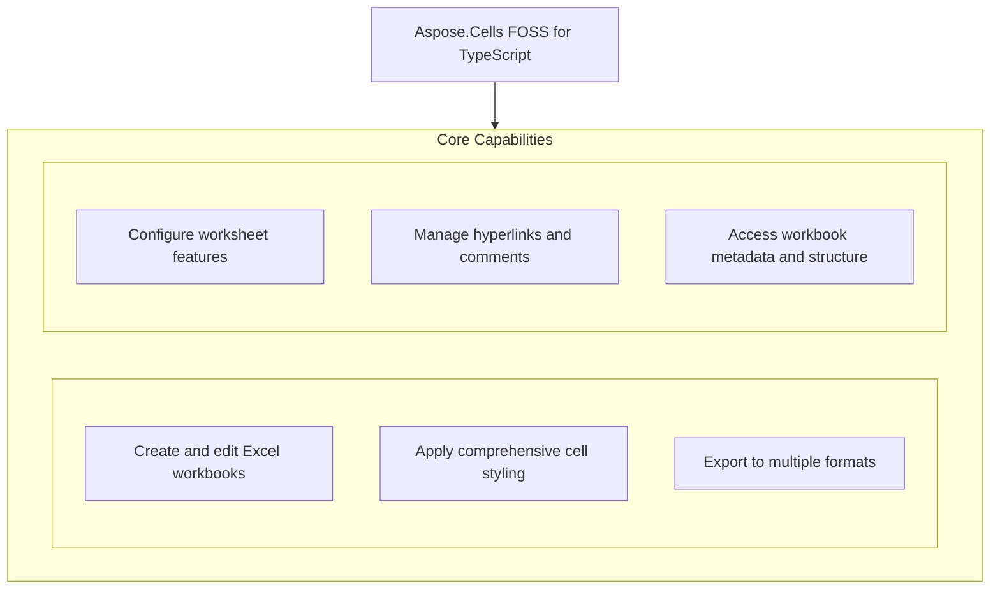

# Aspose.Cells FOSS for TypeScript

[](License/LICENSE.txt) [](https://github.com/aspose-cells-foss/Aspose.Cells-FOSS-for-TypeScript/graphs/contributors)

[](https://products.aspose.org/cells/typescript/)

Aspose.Cells FOSS for TypeScript provides a TypeScript API for creating, editing, and converting Excel workbooks without requiring Microsoft Excel. Developers use it to programmatically build spreadsheets, apply formatting, insert formulas, and export to formats like HTML, CSV, JSON, and Markdown. The library supports common spreadsheet features such as cell styling, conditional formatting, data validation, hyperlinks, comments, and chart rendering. Users include software teams building reporting tools, data export services, and spreadsheet-based applications.

## Navigation

- [At a Glance](#at-a-glance)
- [Key Capabilities](#key-capabilities)
- [Installation](#installation)
- [Dependencies](#dependencies)
- [Quick Start](#quick-start)
- [Additional Examples](#additional-examples)
- [API Reference](#api-reference)
- [Documentation & Resources](#documentation--resources)
- [Scope and Limitations](#scope-and-limitations)
- [Development and Testing](#development-and-testing)
- [License](#license)

## At a Glance



## Key Capabilities

- **Create and edit Excel workbooks.** Create new workbooks using the `Workbook` constructor or load existing Excel files with `Workbook.load`, then edit cell contents by calling `Cell.putValue` to insert text or numbers and `Cell.setFormula` to assign formulas, applying styles via `Cell.setStyle` to individual cells.
- **Apply comprehensive cell styling.** Apply comprehensive cell styling by constructing a `Style` object and configuring its appearance using `Style.setBold` for bold text, `Style.setFontColor` and `Style.setForegroundColor` for color control, `Style.setFont` for font settings, `Style.setFill` for background patterns, `Style.setBorder` for border styles, `Style.setAlignment` for horizontal and vertical alignment, and `Style.setNumberFormat` for custom numeric formatting.
- **Export to multiple formats.** Export workbooks to multiple formats by calling `Workbook.toHtml` to generate HTML documents, `Workbook.toCsv` for comma-separated values, `Workbook.toJson` for structured JSON output, and `Workbook.toMarkdown` for Markdown tables, supporting conversion of existing or newly created workbooks.
- **Configure worksheet features.** Configure worksheet features by adjusting layout with `Worksheet.setColumnWidth` and `Worksheet.setRowHeight`, hiding rows using `Worksheet.setRowHidden`, merging cells via `Worksheet.mergeCells`, enabling filtering with `Worksheet.setAutoFilter`, adding conditional formatting rules through `Worksheet.addConditionalFormat`, and defining data validation constraints using `Worksheet.addDataValidation`.
- **Manage hyperlinks and comments.** Manage hyperlinks and comments by creating `Hyperlink` and `Comment` objects, adding them to a worksheet using `Worksheet.addHyperlink` and `Worksheet.addComment` respectively, and managing collections through `HyperlinkCollection.add` and `CommentCollection.add` to organize annotations and navigational links within the workbook.
- **Access workbook metadata and structure.** Access workbook metadata and structure by retrieving collections such as `Workbook.worksheets` for worksheet management, `Workbook.sharedStrings` for shared string table inspection, `Workbook.charts` for chart objects, `Workbook.images` for embedded images, `Worksheet.cells` for cell access, and `Worksheet.shapes` for graphical elements.

## Installation

`excel-cells` is not yet published on npm; build it from a source checkout instead, verified against this revision:

```bash
git clone https://github.com/aspose-cells-foss/Aspose.Cells-FOSS-for-TypeScript.git
cd Aspose.Cells-FOSS-for-TypeScript
npm install
```

## Dependencies

### Required Package Dependencies

- `adm-zip ^0.5.16`
- `@xmldom/xmldom ^0.8.10`
- `@zip.js/zip.js ^2.8.21`

### Development Dependencies

- `ts-node ^10.9.2`
- `tsx ^4.21.0`
- `@types/node ^25.3.3`
- `typescript ^5.9.3`

## Quick Start

Create a workbook, write typed values and a formula, style a header row, and save it as XLSX.

```typescript
import { Workbook, Style } from "./aspose_cells";

const workbook = new Workbook();
const sheet = workbook.worksheets.get(0)!;

sheet.name = "Products";
sheet.putValue("A1", "Product");
sheet.putValue("B1", "Price");
sheet.putValue("A2", "Apple");
sheet.putValue("B2", 2.99);
sheet.putValue("A3", "Orange");
sheet.putValue("B3", 1.99);
const cellB4 = sheet.getCell2("B4");
cellB4.setFormula("=SUM(B2:B3)");

const headerStyle = new Style();
headerStyle.setBold(true);
headerStyle.setFontColor("FFFFFFFF");
headerStyle.setForegroundColor("FF2278D4");

sheet.getCell2("A1").setStyle(headerStyle);
sheet.getCell2("B1").setStyle(headerStyle);

await workbook.save("products.xlsx");
```

Load an existing Excel file, update a cell value, and save the changes to a new file.

```typescript
import { Workbook } from "./aspose_cells";

const workbook = await Workbook.load("input.xlsx");
const sheet = workbook.worksheets.get(0)!;

sheet.getCell2("A1").putValue("Updated");

await workbook.save("updated.xlsx");
```

## Additional Examples

The library supports loading, editing, and exporting workbooks. Example workflows include updating cell values and exporting to HTML.

### Export a workbook to HTML format

```typescript
import { Workbook } from "./aspose_cells";

const workbook = await Workbook.load("input.xlsx");
await workbook.save("output.html", { saveFormat: undefined });
```

Runnable examples for every major feature area are collected in
[`examples/`](examples/), covering the full surface below.

| Example | Shows |
|---|---|
| `examples/cell_values.ts` | Reading and writing cell values and formulas |
| `examples/styles.ts` | Font, fill, border, and alignment styling |
| `examples/data_validation.ts` | Data validation rules on a range |
| `examples/auto_filter.ts` | Auto filter setup on a worksheet |
| `examples/hyperlinks.ts` | Adding hyperlinks to cells |
| `examples/worksheet_management.ts` | Creating, naming, and iterating worksheets |
| `examples/protection.ts` | Workbook and worksheet protection |
| `examples/export.ts` | CSV, JSON, and Markdown export via `toCsv()`/`toJson()`/`toMarkdown()` |
| `examples/html_export.ts` | HTML import and export |

## API Reference

Aspose.Cells FOSS for TypeScript provides a real class surface for Excel file processing, with `Workbook` as the entry point that holds a collection of worksheets via `Workbook.worksheets`. Each `Worksheet` exposes cells for reading and writing values, formulas, and styles through its `Cells` collection.

The verified public surface has 31 types.

<details>
<summary>View the Complete Public API Surface</summary>

### Core API

| Class | Description |
| --- | --- |
| `Alignment` | The Alignment type represents the alignment settings for cell content, such as horizontal and vertical alignment options. |
| `AutoFilter` | The AutoFilter type provides functionality to apply and manage auto-filtering on a range of cells within a worksheet. |
| `Border` | The Border type defines the border style and appearance for a cell or range of cells. |
| `BorderLine` | The BorderLine type specifies the line style and color of a border edge. |
| `Cell` | The Cell type represents a single cell in a worksheet and provides access to its value, style, and formatting. |
| `CellCoordinates` | The CellCoordinates type holds the row and column indices that identify a specific cell's location. |
| `CellRange` | The CellRange type represents a rectangular range of cells defined by its top-left and bottom-right coordinates. |
| `CellValue` | The CellValue type encapsulates the data stored in a cell, supporting various data types such as numbers, strings, and dates. |
| `Cells` | The Cells type is a collection that provides access to all cells in a worksheet and supports operations like reading, writing, and formatting. |
| `ColorScaleRule` | The ColorScaleRule type defines a conditional formatting rule that applies a color gradient based on cell values. |
| `Comment` | The Comment type represents a comment attached to a cell, including its text, author, and visibility settings. |
| `CommentCollection` | The CommentCollection type is a collection of Comment objects associated with a worksheet. |
| `ConditionalFormat` | The ConditionalFormat type manages a set of conditional formatting rules applied to a range of cells. |
| `ConditionalFormatCollection` | The ConditionalFormatCollection type is a collection of ConditionalFormat objects associated with a worksheet. |
| `ConditionalFormatRule` | The ConditionalFormatRule type defines a single conditional formatting rule, such as a data bar, color scale, or icon set. |
| `DataBarRule` | The DataBarRule type specifies a conditional formatting rule that displays a bar within a cell proportional to its value. |
| `DataValidation` | The DataValidation type controls the type and range of values that can be entered into a cell or range of cells. |
| `DataValidationCollection` | The DataValidationCollection type is a collection of DataValidation objects associated with a worksheet. |
| `Fill` | The Fill type defines the background fill formatting for a cell, including solid colors and patterns. |
| `FilterColumn` | The FilterColumn type represents a filtered column in an auto-filtered range and holds its filter criteria. |
| `Font` | The Font type specifies the font properties used for cell text, such as name, size, and style. |
| `Hyperlink` | The Hyperlink type represents a hyperlink attached to a cell, including its address and display text. |
| `HyperlinkCollection` | The HyperlinkCollection type is a collection of Hyperlink objects associated with a worksheet. |
| `IconSetRule` | The IconSetRule type defines a conditional formatting rule that displays icons next to cell values based on their magnitude. |
| `Protection` | The Protection type specifies the protection settings for a cell, such as whether it is locked or hidden. |
| `Style` | The Style type encapsulates all formatting attributes that can be applied to a cell or range of cells. |
| `Workbook` | The Workbook type represents an entire spreadsheet file and provides access to its worksheets, styles, and settings. |
| `Worksheet` | The Worksheet type represents a single worksheet within a workbook and provides access to its cells, rows, columns, and formatting. |
| `WorksheetCollection` | The WorksheetCollection type is a collection of Worksheet objects contained within a workbook. |

#### Enumerations

| Enumeration | Description |
| --- | --- |
| `EncryptionType` | The EncryptionType type indicates the encryption algorithm used to protect a workbook file. |
| `SaveFormat` | The SaveFormat type indicates the file format used when saving a workbook, such as XLSX or CSV. |

#### Detailed Member Reference

### Workbook

The `Workbook` class serves as the main entry point for working with Excel files, supporting creation via its constructor, loading from files or streams with load, saving to various formats including HTML, CSV, JSON, and Markdown with toHtml, toCsv, toJson, and toMarkdown, and accessing the collection of worksheets through worksheets.

- `activeTab`: Defined as `number`.
- `borderId`: Defined as `: number`.
- `cells`: Defined as `: { [key: string]: CellValue }`.
- `charts`: Defined as `ChartInfo[]`.
- `code`: Defined as `: string`.
- `col`: Defined as `: number`.
- `colOff`: Defined as `: number`.
- `constructor`: Defined as `constructor(boolean createDefault)`.
- `fillId`: Defined as `: number`.
- `fontId`: Defined as `: number`.
- `getNumFmt`: Defined as `string getNumFmt(string / null numFmtId)`.
- `id`: Defined as `: number`.
- `images`: Defined as `ImageInfo[]`.
- `isProtected`: Defined as `boolean`.
- `load`: Defined as `Promise<Workbook> load(string filePath, string password)`.
- `numFmtId`: Defined as `: number`.
- `password`: Defined as `: string`.
- `protect`: Defined as `protect(boolean protect, string password)`.
- `row`: Defined as `: number`.
- `rowOff`: Defined as `: number`.
- `save`: Defined as `save(string filePath, { password?: string; saveFormat?: SaveFormat } options)`.
- `saveFormat`: Defined as `: SaveFormat`.
- `sharedStrings`: Defined as `string[]`.
- `sheetName`: Defined as `: string`.
- `style`: Defined as `: Style`.
- `toCsv`: Defined as `string toCsv()`.
- `toHtml`: Defined as `string toHtml()`.
- `toJson`: Defined as `string toJson()`.
- `toMarkdown`: Defined as `string toMarkdown()`.
- `worksheets`: Defined as `WorksheetCollection`.

### Worksheet

A `Worksheet` represents a single sheet in a workbook, accessible by index or name, and provides methods to manipulate its content such as putValue for setting cell values, getCell and getCellByRef for retrieving cells, setCellStyle for applying styles, setColumnWidth and setRowHeight for sizing, mergeCells for combining cells, setRowHidden for visibility control, setAutoFilter for filtering, and adding conditional formats, data validations, hyperlinks, and comments via addConditionalFormat, addDataValidation, addHyperlink, and addComment.

- `addComment`: Defined as `addComment(Comment comment)`.
- `addConditionalFormat`: Defined as `addConditionalFormat(string range, ConditionalFormatRule[] rules)`.
- `addDataValidation`: Defined as `addDataValidation(DataValidation validation, string range)`.
- `addHyperlink`: Defined as `addHyperlink(string cellRef, Hyperlink hyperlink)`.
- `addImage`: Defined as `addImage(ImageInfo image)`.
- `addShape`: Defined as `addShape(ShapeInfo shape)`.
- `autoFilter`: Public method.
- `cell`: Defined as `: string`.
- `cells`: Public method.
- `charts`: Defined as `ChartCollection`.
- `comments`: Public method.
- `conditionalFormats`: Public method.
- `constructor`: Defined as `constructor(string name, number index)`.
- `dataValidations`: Public method.
- `defaultColumnWidth`: Defined as `number / undefined`.
- `defaultRowHeight`: Defined as `number / undefined`.
- `endCol`: Defined as `: number`.
- `endRow`: Defined as `: number`.
- `getCell`: Defined as `Cell / undefined getCell(number row, number col)`.
- `getCell2`: Defined as `Cell getCell2(string key)`.
- `getCellByRef`: Defined as `Cell / undefined getCellByRef(string ref)`.
- `getColumnWidth`: Defined as `number / undefined getColumnWidth(number column)`.
- `getRowHeight`: Defined as `number / undefined getRowHeight(number row)`.
- `getXml`: Defined as `string getXml(number drawingIndex)`.
- `hyperlinks`: Public method.
- `images`: Defined as `ImageInfo[]`.
- `index`: Defined as `number`.
- `isRowHidden`: Defined as `boolean isRowHidden(number row)`.
- `link`: Defined as `: Hyperlink`.
- `mergeCells`: Defined as `mergeCells(string range)`.
- `mergedCells`: Public method.
- `name`: Defined as `string`.
- `putValue`: Defined as `Cell putValue(string key, CellValue value)`.
- `range`: Defined as `: string`.
- `removeAutoFilter`: Defined as `removeAutoFilter()`.
- `rules`: Defined as `: ConditionalFormatRule[]`.
- `setAutoFilter`: Defined as `setAutoFilter(string range)`.
- `setCellStyle`: Defined as `setCellStyle(string cellRef, any style)`.
- `setColumnWidth`: Defined as `setColumnWidth(number column, number width)`.
- `setRowHeight`: Defined as `setRowHeight(number row, number height)`.
- `setRowHidden`: Defined as `setRowHidden(number row, boolean hidden)`.
- `shapes`: Defined as `ShapeInfo[]`.
- `startCol`: Defined as `: number`.
- `startRow`: Defined as `: number`.
- `toXml`: Defined as `string toXml(number drawingIndex)`.
- `unmergeCells`: Defined as `unmergeCells(string range)`.
- `value`: Defined as `CellValue / undefined`.

### Cell

A `Cell` represents an individual cell in a worksheet, accessible by row and column indices or by reference string, and supports setting and getting values with putValue and value, formulas with setFormula and formula, styles with setStyle and style, hyperlinks with setHyperlink, and position information through row, col, and ref.

- `col`: Public method.
- `constructor`: Defined as `constructor(number row, number col, CellValue value)`.
- `formula`: Defined as `string / undefined`.
- `hyperlink`: Defined as `string / undefined`.
- `putValue`: Defined as `putValue(CellValue value)`.
- `ref`: Public method.
- `row`: Public method.
- `setFormula`: Defined as `setFormula(string formula)`.
- `setHyperlink`: Defined as `setHyperlink(string url)`.
- `setSharedStrings`: Defined as `setSharedStrings(string[] strings)`.
- `setStyle`: Defined as `setStyle(Style style)`.
- `setStyleIndex`: Defined as `setStyleIndex(number index)`.
- `sharedStringMap`: Defined as `: Map<string, number>`.
- `style`: Defined as `Style / undefined`.
- `styleIndex`: Defined as `number / undefined`.
- `toXml`: Defined as `string toXml()`.
- `value`: Defined as `CellValue`.

### Style

The `Style` class allows detailed formatting of cells through methods to get and set font properties with getFont and setFont, fill properties with getFill and setFill, border properties with getBorder and setBorder, alignment with getAlignment and setAlignment, number format with getNumberFormat and setNumberFormat, and additional attributes such as bold, font color, foreground and background colors, horizontal and vertical alignment, wrap text, locked, and hidden status.

- `alignment`: Defined as `: Alignment`.
- `border`: Defined as `: Border`.
- `constructor`: Defined as `constructor()`.
- `fill`: Defined as `: Fill`.
- `font`: Defined as `: Font`.
- `getAlignment`: Defined as `Alignment getAlignment()`.
- `getBackgroundColor`: Defined as `string / undefined getBackgroundColor()`.
- `getBorder`: Defined as `Border getBorder()`.
- `getFill`: Defined as `Fill getFill()`.
- `getFont`: Defined as `Font getFont()`.
- `getFontColor`: Defined as `string / undefined getFontColor()`.
- `getFontName`: Defined as `string getFontName()`.
- `getFontSize`: Defined as `number getFontSize()`.
- `getForegroundColor`: Defined as `string / undefined getForegroundColor()`.
- `getHorizontalAlignment`: Defined as `string getHorizontalAlignment()`.
- `getNumberFormat`: Defined as `string / undefined getNumberFormat()`.
- `getVerticalAlignment`: Defined as `string getVerticalAlignment()`.
- `isBold`: Defined as `boolean isBold()`.
- `isHidden`: Defined as `boolean isHidden()`.
- `isItalic`: Defined as `boolean isItalic()`.
- `isLocked`: Defined as `boolean isLocked()`.
- `isWrapText`: Defined as `boolean isWrapText()`.
- `numberFormat`: Defined as `: string`.
- `protection`: Defined as `: Protection`.
- `setAlignment`: Defined as `setAlignment(Alignment alignment)`.
- `setBackgroundColor`: Defined as `setBackgroundColor(string color)`.
- `setBold`: Defined as `setBold(boolean bold)`.
- `setBorder`: Defined as `setBorder(Border border)`.
- `setFill`: Defined as `setFill(Fill fill)`.
- `setFont`: Defined as `setFont(Font font)`.
- `setFontColor`: Defined as `setFontColor(string color)`.
- `setFontName`: Defined as `setFontName(string name)`.
- `setFontSize`: Defined as `setFontSize(number size)`.
- `setForegroundColor`: Defined as `setForegroundColor(string color)`.
- `setHidden`: Defined as `setHidden(boolean hidden)`.
- `setHorizontalAlignment`: Defined as `setHorizontalAlignment(Alignment["horizontal"] alignment)`.
- `setItalic`: Defined as `setItalic(boolean italic)`.
- `setLocked`: Defined as `setLocked(boolean locked)`.
- `setNumberFormat`: Defined as `setNumberFormat(string format)`.
- `setProtection`: Defined as `setProtection(Protection protection)`.
- `setVerticalAlignment`: Defined as `setVerticalAlignment(Alignment["vertical"] alignment)`.
- `setWrapText`: Defined as `setWrapText(boolean wrapText)`.
- `toXml`: Defined as `string toXml()`.

### Cells

The `Cells` collection provides access to all cells in a worksheet, supporting retrieval with get, assignment with set, creation of new cells with getOrCreate, enumeration of values via values, and counting cells with count.

- `count`: Public method.
- `get`: Defined as `Cell / undefined get(string key)`.
- `getOrCreate`: Defined as `Cell getOrCreate(number row, number col)`.
- `set`: Defined as `set(string key, Cell cell)`.
- `toXml`: Defined as `string toXml()`.
- `values`: Defined as `values()`.

### ConditionalFormat

`ConditionalFormat` enables applying conditional formatting rules to ranges of cells, supporting addition of areas with addArea, rules with addRule, retrieval of affected ranges via getRanges, retrieval of applied rules via getRules, and serialization to XML with toXml.

- `addArea`: Defined as `addArea(string range)`.
- `addRule`: Defined as `addRule(ConditionalFormatRule rule)`.
- `getRanges`: Defined as `CellRange[] getRanges()`.
- `getRules`: Defined as `ConditionalFormatRule[] getRules()`.
- `toXml`: Defined as `string toXml()`.

### DataValidation

`DataValidation` allows defining validation rules for cell ranges, supporting area assignment with addArea, type and operator configuration with type and operator, formula definitions with formula1 and formula2, blank value allowance via allowBlank, dropdown display via showDropDown, input and error messages with inputTitle, inputMessage, errorTitle, errorMessage, and errorStyle, and serialization to XML with toXml.

- `addArea`: Defined as `addArea(string range)`.
- `allowBlank`: Defined as `boolean`.
- `errorMessage`: Defined as `string / undefined`.
- `errorStyle`: Defined as `DataValidationType["errorStyle"] / undefined`.
- `errorTitle`: Defined as `string / undefined`.
- `formula1`: Defined as `string / undefined`.
- `formula2`: Defined as `string / undefined`.
- `getRanges`: Defined as `CellRange[] getRanges()`.
- `inputMessage`: Defined as `string / undefined`.
- `inputTitle`: Defined as `string / undefined`.
- `operator`: Defined as `DataValidationType["operator"] / undefined`.
- `showDropDown`: Defined as `boolean`.
- `showInputMessage`: Defined as `boolean`.
- `toXml`: Defined as `string toXml()`.
- `type`: Defined as `DataValidationType["type"]`.

### Hyperlink

A `Hyperlink` represents a clickable link in a worksheet, supporting creation via its constructor, position specification with row, col, and ref, link target and address configuration with target and address, display text via display, tooltip via tooltip, link type via type, and serialization to XML with toXml.

- `address`: Defined as `string / undefined`.
- `col`: Defined as `number`.
- `constructor`: Defined as `constructor(number row, number col, string address, string display, string tooltip)`.
- `display`: Defined as `string / undefined`.
- `ref`: Defined as `string`.
- `row`: Defined as `number`.
- `target`: Defined as `string / undefined`.
- `toXml`: Defined as `string toXml()`.
- `tooltip`: Defined as `string / undefined`.
- `type`: Defined as `HyperlinkType["type"]`.

### Comment

A `Comment` provides a text note attached to a cell, supporting creation via its constructor, position specification with row, col, and ref, content via text and author, dimensions via width and height, and serialization to XML with toXml.

- `author`: Defined as `string / undefined`.
- `col`: Defined as `number`.
- `constructor`: Defined as `constructor(number row, number col, string text, string author)`.
- `height`: Defined as `number`.
- `ref`: Defined as `string`.
- `row`: Defined as `number`.
- `text`: Defined as `string`.
- `toXml`: Defined as `string toXml()`.
- `width`: Defined as `number`.

### AutoFilter

`AutoFilter` enables filtering of data in a worksheet range, supporting initialization via its constructor, range specification with range, column filtering with addFilterColumn and removeFilterColumn, clearing filters with clear, and serialization to XML with toXml.

- `addFilterColumn`: Defined as `addFilterColumn(number col, (string / number)[] filters, boolean blank)`.
- `clear`: Defined as `clear()`.
- `columns`: Defined as `FilterColumn[]`.
- `constructor`: Defined as `constructor(string range)`.
- `range`: Defined as `string`.
- `removeFilterColumn`: Defined as `removeFilterColumn(number col)`.
- `toXml`: Defined as `string toXml()`.

### WorksheetCollection

The `WorksheetCollection` manages the collection of worksheets in a workbook, supporting retrieval by index or name with get and getByName, addition of new worksheets with addWorksheet, removal with removeWorksheet, repositioning with moveWorksheet, clearing all sheets with clear, and counting sheets via worksheetCount.

- `addWorksheet`: Defined as `Worksheet addWorksheet(string name)`.
- `clear`: Defined as `void clear()`.
- `constructor`: Defined as `constructor(boolean createDefault)`.
- `filter`: Defined as `Worksheet[] filter((value: Worksheet, index: number) => boolean callback)`.
- `find`: Defined as `Worksheet / undefined find((value: Worksheet, index: number) => boolean callback)`.
- `forEach`: Defined as `void forEach((value: Worksheet, index: number) => void callback)`.
- `get`: Defined as `Worksheet / undefined get(number index)`.
- `getByName`: Defined as `Worksheet / undefined getByName(string name)`.
- `getNumFmt`: Defined as `string getNumFmt(string / null numFmtId)`.
- `getStyle`: Defined as `Style / undefined getStyle(number index)`.
- `indexOf`: Defined as `number indexOf(Worksheet searchElement, number fromIndex)`.
- `length`: Defined as `number`.
- `map`: Defined as `T[] map((value: Worksheet, index: number) => T callback)`.
- `moveWorksheet`: Defined as `boolean moveWorksheet(number fromIndex, number toIndex)`.
- `removeWorksheet`: Defined as `boolean removeWorksheet(number index)`.
- `setStyle`: Defined as `void setStyle(number index, Style style)`.
- `styles`: Defined as `Map<number, Style>`.
- `worksheet`: Defined as `Worksheet`.
- `worksheetCount`: Defined as `number`.
- `worksheets`: Defined as `Worksheet[]`.

### worksheets

`Workbook.worksheets` exposes the `WorksheetCollection` that holds all worksheets in a workbook, allowing programmatic management of sheets through operations like adding, removing, moving, and counting worksheets using the methods provided by `WorksheetCollection`.

</details>

## Documentation & Resources

- **[Getting started guide](https://docs.aspose.org/cells/typescript/)** — The getting started guide covers installation, step-by-step walkthroughs, and feature introductions for Aspose.Cells FOSS for TypeScript.
- **[How-to guides & FAQ](https://kb.aspose.org/cells/typescript/)** — The how-to guides and FAQ provide task-focused answers for common spreadsheet-processing questions using Aspose.Cells FOSS for TypeScript.
- **[Full API reference](https://reference.aspose.org/cells/typescript/)** — The full API reference offers a complete, browsable reference for every public class in the excel-cells package version 1.0.0. It covers all 31 verified public types; the [API Reference](#api-reference) section above covers the essentials.
- Found a bug or have a feature request? [Open an issue](https://github.com/aspose-cells-foss/Aspose.Cells-FOSS-for-TypeScript/issues).

## Scope and Limitations

Aspose.Cells FOSS for TypeScript provides a lightweight, open-source API for reading and writing Excel files in the typescript ecosystem, supporting core workbook and worksheet operations through the excel-cells package at version 1.0.0.

- Text export is available as a returned string, not as a direct file-write helper — pass the result of `toCsv()`, `toJson()`, or `toMarkdown()` to your own file-writing code, and text export is one-way — there is no corresponding import path back into a `Workbook`.
- This limitation does not apply to Aspose.Cells for .NET — Enterprise Edition, which adds a full commercial spreadsheet engine, broader format coverage, and active support beyond this FOSS TypeScript edition's own scope.
- The package does not support advanced Excel features such as macros, pivot tables, or complex chart rendering, focusing instead on core data manipulation and export capabilities.

These limitations don't apply to [Aspose.Cells — Enterprise Edition](https://products.aspose.com/cells/). The commercial edition extends this package by adding support for advanced Excel features, including complex formulas, pivot tables, and chart rendering.

## Development and Testing

Run npm install to fetch dependencies and npx tsc --noEmit to perform a type-check of the excel-cells package using the repository's own examples/ directory.

Build and type-check from the repository root:

```bash
npm install
npx tsc --noEmit
```

## License

This project is licensed under the [MIT License](License/LICENSE.txt). The MIT License permits use, copying, modification, distribution, sublicensing, and commercial use, provided its copyright and permission notice are retained. The software is provided without warranty.
