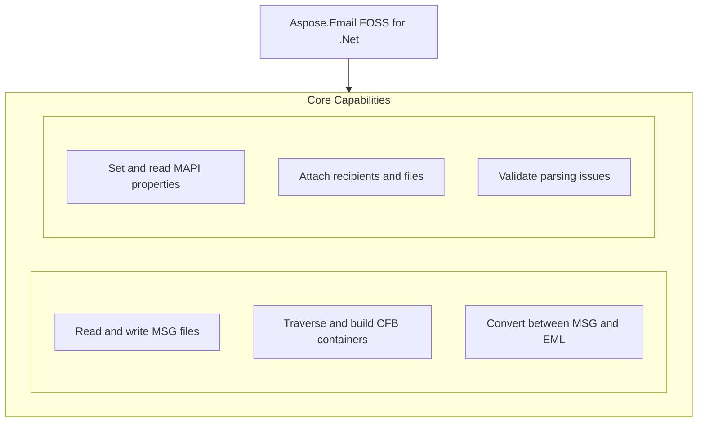

# Aspose.Email FOSS for .Net

[](https://www.nuget.org/packages/Aspose.Email.Foss/) [](LICENSE) [](https://github.com/aspose-email-foss/Aspose.Email-FOSS-for-.Net/graphs/contributors)

[](https://products.aspose.org/email/net/)

Aspose.Email FOSS for .Net is a free and open-source library for reading, writing, and converting email messages in Microsoft Outlook MSG and EML formats on the .NET platform. It enables developers to parse MSG files using `MapiMessage`, extract properties and attachments, and save messages back to MSG or EML without requiring Microsoft Outlook. The library also provides low-level access to Compound File Binary (CFB) structures through `CfbReader` for inspecting internal message storage. Users include developers building email processing tools, migration utilities, and automation workflows that handle Outlook message formats.

## Navigation

- [At a Glance](#at-a-glance)
- [Key Capabilities](#key-capabilities)
- [Installation](#installation)
- [Dependencies](#dependencies)
- [Quick Start](#quick-start)
- [Additional Examples](#additional-examples)
- [API Reference](#api-reference)
- [Documentation & Resources](#documentation--resources)
- [Scope and Limitations](#scope-and-limitations)
- [Development and Testing](#development-and-testing)
- [License](#license)

## At a Glance



## Key Capabilities

- **Read and write MSG files.** Read MSG files from streams or files using `MapiMessage.FromStream` or `MapiMessage.FromFile`, then write modified messages back with `MapiMessage.Save`, preserving the original MAPI structure and metadata.
- **Traverse and build CFB containers.** Traverse Compound File Binary containers by opening them with `CfbReader.FromFile` or `CfbReader.FromStream`, then inspect directory entries, streams, and storages using `IterTree`, `IterStorages`, and `IterStreams` to examine internal structure.
- **Convert between MSG and EML.** Convert email messages between MSG and EML formats using `MapiMessage.LoadFromEml` to parse standard MIME files and `MapiMessage.SaveToEml` to serialize messages back to RFC 5322 format without external dependencies.
- **Set and read MAPI properties.** Access and modify low-level MAPI properties on messages using `MapiMessage.SetProperty` and `MapiMessage.GetPropertyValue`, enabling custom property handling beyond the built-in strongly-typed members.
- **Attach recipients and files.** Attach recipients and files to messages using `MapiMessage.AddRecipient` with recipient type constants and `MapiMessage.AddAttachment` with stream-based content, including nested embedded messages via `MapiMessage.AddEmbeddedMessageAttachment`.
- **Validate parsing issues.** Inspect parsing problems encountered during message loading through the `MapiMessage.ValidationIssues` collection, which records structural anomalies detected when reading MSG or EML files.

## Installation

Install the published package from NuGet (`Aspose.Email.Foss`, version 0.1.0):

```bash
dotnet add package Aspose.Email.Foss
```

To work from a source checkout instead, build the clone with dotnet build:

```bash
git clone https://github.com/aspose-email-foss/Aspose.Email-FOSS-for-.Net.git
cd Aspose.Email-FOSS-for-.Net
dotnet build
```

## Dependencies

### Required Package Dependencies

No required third-party package dependencies; in `src/Aspose.Email.Foss/Aspose.Email.Foss.csproj`, no `PackageReference` a consumer would install is declared.

### Native and System Requirements

- Requires .NET `net8.0` (`TargetFramework` in `src/Aspose.Email.Foss/Aspose.Email.Foss.csproj`).

## Quick Start

Read a subject from an MSG file by loading it with `Aspose.Email.Foss` and printing its subject line.

```csharp
using System.IO;
using Aspose.Email.Foss.Msg;

using var stream = File.OpenRead("sample.msg");
var message = MapiMessage.FromStream(stream);
Console.WriteLine(message.Subject);
```

Create a new MSG file with a sender, recipient, attachment, and body, then save it to disk using `Aspose.Email.Foss`.

```csharp
using System.IO;
using Aspose.Email.Foss.Msg;

var message = MapiMessage.Create("Hello", "Body");
message.SenderName = "Alice";
message.SenderEmailAddress = "alice@example.com";
message.AddRecipient("bob@example.com", "Bob");
using var attachmentStream = new MemoryStream("abc"u8.ToArray());
message.AddAttachment("note.txt", attachmentStream, "text/plain");
using var output = File.Create("hello.msg");
message.Save(output);
```

## Additional Examples

The following examples demonstrate converting EML to MSG and inspecting a CFB container's internal structure.

### Convert an EML file to MSG and back to EML using `Aspose.Email.Foss`

```csharp
using System.IO;
using Aspose.Email.Foss.Msg;

using var input = File.OpenRead("message.eml");
var message = MapiMessage.LoadFromEml(input);
using var msgOutput = File.Create("message.msg");
message.Save(msgOutput);
using var emlOutput = File.Create("roundtrip.eml");
message.SaveToEml(emlOutput);
```

<details>
<summary>View Additional Examples</summary>

### Inspect the CFB structure of a MSG file using `Aspose.Email.Foss`

```csharp
using Aspose.Email.Foss.Cfb;

using var cfb = CfbReader.FromFile("sample.msg");
Console.WriteLine($"Sector size: {cfb.SectorSize}");
Console.WriteLine($"Directory entries: {cfb.DirectoryEntryCount}");

foreach (var (depth, entry) in cfb.IterTree())
{
    Console.WriteLine(new string(' ', depth * 2) + entry.Name);
}
```

</details>

## API Reference

`Aspose.Email.Foss` provides high-level message handling through `Aspose.Email.Foss.Msg.MapiMessage` and low-level structured storage access through `Aspose.Email.Foss.Cfb.CfbReader`. `MapiMessage` supports creating, editing, and converting email messages, while `CfbReader` enables reading Compound File Binary containers that store message and attachment data.

The verified public surface has 29 types.

<details>
<summary>View the Complete Public API Surface</summary>

### Core API

| Class | Description |
| --- | --- |
| `CfbConstants` | CfbConstants provides read-only constants used by the Compound File Binary format, such as byte order, sector sizes, and special identifier values. |
| `CfbDocument` | CfbDocument represents a Compound File Binary structure in memory, exposing its version, root storage, and metadata. |
| `CfbException` | CfbException signals errors that occur while reading or writing Compound File Binary documents. |
| `CfbNode` | CfbNode is the base class for storage and stream entries in a Compound File Binary structure, exposing common metadata such as name, class identifier, and timestamps. |
| `CfbReader` | CfbReader parses a Compound File Binary document from a file or stream and exposes its header, directory entries, and streams. |
| `CfbStorage` | CfbStorage represents a storage node in a Compound File Binary document, enabling addition and enumeration of child storages and streams. |
| `CfbStream` | CfbStream represents a stream node in a Compound File Binary document, exposing its data and metadata such as name, class identifier, and timestamps. |
| `CfbWriter` | CfbWriter creates a new Compound File Binary document and writes it to a file or stream. |
| `DirectoryEntry` | DirectoryEntry holds the raw metadata of an entry in a Compound File Binary directory, including name, type, and sector identifiers. |
| `DirectoryEntryNameComparer` | DirectoryEntryNameComparer provides a case-insensitive comparison of DirectoryEntry instances by name. |
| `Header` | Header exposes the fixed-size metadata block at the start of a Compound File Binary document, such as signature, sector size, and fat chain information. |
| `MapiAttachment` | MapiAttachment represents an attachment within a MAPI message, including its data, filename, and properties. |
| `MapiMessage` | MapiMessage represents a MAPI message in memory, exposing its headers, recipients, attachments, and properties. |
| `MapiProperty` | MapiProperty holds a single named property value from a MAPI message or attachment. |
| `MapiPropertyCollection` | MapiPropertyCollection provides access to the set of MapiProperty instances associated with a MAPI message or attachment. |
| `MapiRecipient` | MapiRecipient represents a recipient (To, Cc, or Bcc) in a MAPI message, including its address and display name. |
| `MsgConstants` | MsgConstants provides read-only constants used by the MSG format, such as file signatures and property identifiers. |
| `MsgDocument` | MsgDocument represents a MSG format document in memory, exposing its root storage and metadata. |
| `MsgException` | MsgException signals errors that occur while reading or writing MSG format documents. |
| `MsgReader` | MsgReader parses a MSG format document from a file or stream and exposes its message content and structure. |
| `MsgStorage` | MsgStorage represents a storage node in a MSG format document, enabling addition and enumeration of child storages and streams. |
| `MsgStream` | MsgStream represents a stream node in a MSG format document, exposing its data and metadata. |
| `MsgWriter` | MsgWriter creates a new MSG format document and writes it to a file or stream. |

#### Enumerations

| Enumeration | Description |
| --- | --- |
| `DirectoryColorFlag` | Stores the red-black tree color used by directory sibling links. |
| `DirectoryObjectType` | Classifies the directory entry payload as unallocated, storage, stream, or root storage. |
| `SectorMarker` | Special FAT marker values reserved for sector allocation metadata. |
| `CommonMessagePropertyId` | Common MAPI property identifiers used by the MSG reader and writer for core message semantics, body fields, transport headers, and attachments. |
| `MsgStorageRole` | MsgStorageRole indicates the functional role of a storage node within a MSG format document, such as message or attachment. |
| `PropertyTypeCode` | MAPI property type codes that appear in property tags and stream names in MSG files. |

#### Detailed Member Reference

### Foss

`Aspose.Email.Foss.Msg.MapiMessage` serves as the main entry point for working with email messages, offering methods such as Create, `FromFile`, `FromStream`, and Save to load and persist messages in various formats, while properties like Subject, Body, `HtmlBody`, Recipients, and Attachments provide access to core message components; `Aspose.Email.Foss.Cfb.CfbReader` provides low-level access to Compound File Binary structures, supporting operations like `FromFile`, `FromStream`, `FindChildByName`, and `GetStreamData` to inspect and extract data from message containers.

</details>

## Documentation & Resources

- **[Getting started guide](https://docs.aspose.org/email/net/)** — The getting started guide covers installation, basic walkthroughs, and feature introductions for `Aspose.Email.Foss` 0.1.0 targeting net8.0.
- **[How-to guides & FAQ](https://kb.aspose.org/email/net/)** — How-to guides and the FAQ provide task-focused answers for common tasks involving MSG, CFB, and EML file handling in `Aspose.Email.Foss`.
- **[Full API reference](https://reference.aspose.org/email/net/)** — The full API reference offers a complete, browsable reference for all 29 public types in `Aspose.Email.Foss`. It covers all 29 verified public types; the [API Reference](#api-reference) section above covers the essentials.
- **[Public API summary](PUBLIC_API.md)** — The public API summary lists the stable-namespace and primary-type definitions maintained in the repository.
- **[Changelog](CHANGELOG.md)** — The changelog documents the release history for `Aspose.Email.Foss`.
- Found a bug or have a feature request? [Open an issue](https://github.com/aspose-email-foss/Aspose.Email-FOSS-for-.Net/issues).

## Scope and Limitations

Aspose.Email FOSS for .Net is a .NET 8.0 library for reading and writing email-related file formats locally, including MSG, EML, MHTML, and OST files, without connecting to mail servers or providing high-level abstractions for calendar or transport-neutral formats.

- The library does not support IMAP, SMTP, or POP3 protocols and operates only on local files without connecting to mail servers.
- Transport Neutral Encapsulation Format files are not parsed or generated.
- Calendar or appointment functionality is not provided; calendar-specific MAPI properties can only be accessed generically via `SetProperty` and `GetPropertyValue`.
- The library requires .NET 8.0 or later and does not support the classic .NET Framework 4.x.

These limitations don't apply to [Aspose.Email for .Net — Enterprise Edition](https://products.aspose.com/email/net/). Aspose.Email FOSS for .Net is the open-source foundation; Aspose.Email commercial edition extends it with additional formats, advanced features, and commercial support.

## Development and Testing

Clone the repository and build the `Aspose.Email.Foss` library for net8.0, then run the xUnit test suite to verify CFB round-trips, MSG reading, and EML conversion. Run example programs such as `create_msg_and_eml` directly from the examples folder using dotnet run.

The suite covers 6 test files under `tests/`.

```bash
git clone https://github.com/aspose-email-foss/Aspose.Email-FOSS-for-.Net.git
cd Aspose.Email-FOSS-for-.Net
dotnet build src/Aspose.Email.Foss/Aspose.Email.Foss.csproj -c Release
dotnet test tests/Aspose.Email.Foss.Tests/Aspose.Email.Foss.Tests.csproj
```

```bash
dotnet run --project examples/create_msg_and_eml/create_msg_and_eml.csproj
```

## License

This project is licensed under the [MIT License](LICENSE). The MIT License permits use, copying, modification, distribution, sublicensing, and commercial use, provided its copyright and permission notice are retained. The software is provided without warranty.
