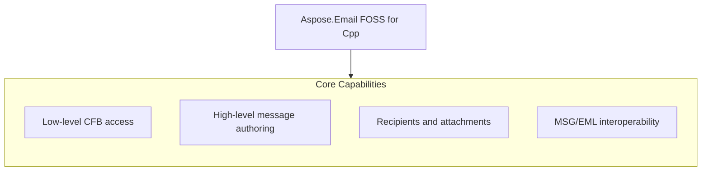

# Aspose.Email FOSS for Cpp

[](LICENSE) [](https://github.com/aspose-email-foss/Aspose.Email-FOSS-for-Cpp/graphs/contributors)

[](https://products.aspose.org/email/cpp/)

Aspose.Email FOSS for Cpp is a C++ library that enables reading and writing email messages in MSG and EML formats. It solves the problem of programmatic email handling in C++ applications by providing a straightforward API to create, inspect, and save messages without external dependencies. Developers building desktop or server applications that need to process email content, such as parsing incoming messages or generating outgoing reports, use this library. The library is version 0.1.0, targets C++17, and requires CMake 3.26 or later.

## Navigation

- [At a Glance](#at-a-glance)
- [Key Capabilities](#key-capabilities)
- [Installation](#installation)
- [Dependencies](#dependencies)
- [Quick Start](#quick-start)
- [API Reference](#api-reference)
- [Documentation & Resources](#documentation--resources)
- [Scope and Limitations](#scope-and-limitations)
- [Development and Testing](#development-and-testing)
- [License](#license)

## At a Glance



## Key Capabilities

- **Low-level CFB access.** The `aspose.email.foss.cfb` module provides direct access to Compound File Binary structures, enabling inspection and manipulation of the underlying file format used by MSG files.
- **High-level message authoring.** High-level message authoring is supported through the aspose::email::foss::msg::`mapi_message`::create factory method, which initializes a new message with subject and body content.
- **Recipients and attachments.** Recipients and attachments are added using the `add_recipient` and `add_attachment` methods on `mapi_message` instances, supporting email addresses, display names, and MIME content types.
- **MSG/EML interoperability.** The `AsposeEmailFoss` library enables bidirectional conversion between MSG and EML formats, allowing messages to be saved in either format using the save and `save_to_eml` methods.

## Installation

`AsposeEmailFoss` is not yet published on any package registry; build it from a source checkout instead, verified against this revision:

```bash
git clone https://github.com/aspose-email-foss/Aspose.Email-FOSS-for-Cpp.git
cd Aspose.Email-FOSS-for-Cpp
cmake -S . -B build
```

## Dependencies

### Required Package Dependencies

No required third-party package dependencies; in `CMakeLists.txt`, no dependency is on the library target's public link interface, so a consumer links nothing beyond the library itself.

### Native and System Requirements

- Requires C++ `17` (`CMAKE_CXX_STANDARD` in `CMakeLists.txt`).

## Quick Start

Read a subject from an MSG file opened as a binary stream using Aspose.Email FOSS for Cpp 0.1.0 with C++17 support.

```cpp
#include <fstream>
#include <iostream>

#include "aspose/email/foss/msg/mapi_message.hpp"

int main()
{
    std::ifstream input("sample.msg", std::ios::binary);
    auto message = aspose::email::foss::msg::mapi_message::from_stream(input);
    std::cout << message.subject() << '\n';
}
```

Create a message and save it as both MSG and EML using Aspose.Email FOSS for Cpp 0.1.0 with C++17 support.

```cpp
#include <fstream>

#include "aspose/email/foss/msg/mapi_message.hpp"

int main()
{
    auto message = aspose::email::foss::msg::mapi_message::create("Hello", "Body");
    message.set_sender_name("Alice");
    message.set_sender_email_address("alice@example.com");
    message.add_recipient("bob@example.com", "Bob");
    message.add_attachment("note.txt", std::vector<std::uint8_t>{'a', 'b', 'c'}, "text/plain");

    std::ofstream msg_output("hello.msg", std::ios::binary);
    message.save(msg_output);

    std::ofstream eml_output("hello.eml", std::ios::binary);
    message.save_to_eml(eml_output);
}
```

## API Reference

Aspose.Email FOSS for Cpp exposes the `mapi_message` class as the primary high-level entry point for creating, editing, and reloading messages, while `msg_reader` and `cfb_reader` provide lower-level access to MSG and CFB container structures respectively.

The verified public surface has 26 types.

<details>
<summary>View the Complete Public API Surface</summary>

### Core API

| Class | Description |
| --- | --- |
| `cfb_document` | Represents a Compound File Binary document and provides methods to load it from various sources and access its version and root storage. |
| `cfb_exception` | Represents an exception thrown during operations on Compound File Binary structures. |
| `cfb_node` | Represents a node in a Compound File Binary structure, which can be a storage or a stream, and exposes its metadata and state. |
| `cfb_reader` | Reads a Compound File Binary document and provides access to its header, directory entries, and streams. |
| `cfb_storage` | Represents a storage node in a Compound File Binary document and allows adding child storages and streams. |
| `cfb_stream` | Represents a stream node in a Compound File Binary document and holds its data. |
| `cfb_writer` | Writes a Compound File Binary document to a file or stream. |
| `directory_entry` | Represents an entry in the directory of a Compound File Binary document and exposes its metadata and type. |
| `header` | Contains the header information of a Compound File Binary document. |
| `mapi_attachment` | Represents an attachment in a MAPI message. |
| `mapi_message` | Represents a MAPI message and provides methods to create, modify, and save it. |
| `mapi_property` | Represents a single MAPI property with its identifier, type, and value. |
| `mapi_property_collection` | Holds a collection of MAPI properties associated with a message or attachment. |
| `mapi_recipient` | Represents a recipient in a MAPI message. |
| `msg_document` | Represents a parsed MSG document and provides access to its internal structure. |
| `msg_exception` | Represents an exception thrown during operations on MSG documents. |
| `msg_reader` | Reads an MSG document from a file or stream and exposes its raw data. |
| `msg_storage` | Represents a storage node in an MSG document and provides access to its children. |
| `msg_stream` | Represents a stream node in an MSG document. |
| `msg_writer` | Writes a MAPI message to an MSG file. |

#### Enumerations

| Enumeration | Description |
| --- | --- |
| `directory_color_flag` | Indicates the color of a directory entry in a Compound File Binary structure, used for tree balancing. |
| `directory_object_type` | Specifies whether a directory entry in a Compound File Binary document is a storage, a stream, or the root. |
| `sector_marker` | Represents a sector marker used in the sector allocation tables of a Compound File Binary document. |
| `common_message_property_id` | Defines common property identifiers for MAPI messages. |
| `msg_storage_role` | Indicates the role of a storage node in an MSG document. |
| `property_type_code` | Defines the data type of a MAPI property. |

#### Detailed Member Reference

### aspose

The aspose namespace serves as the top-level container for the Aspose.Email FOSS for Cpp library, with `aspose.email` providing the email-specific functionality and `aspose.email.foss` exposing the open-source MSG and CFB processing components.

### email

The `aspose.email` namespace contains the core email processing APIs, including the `aspose.email.foss` submodule that provides open-source implementations for reading and writing MSG and CFB formats.

### foss

The `aspose.email.foss` submodule provides open-source MSG and CFB processing through the `mapi_message` class for high-level message authoring, the `msg_reader` class for low-level MSG parsing, and the `cfb_reader` class for direct CFB container inspection.

</details>

## Documentation & Resources

- **[Getting started guide](https://docs.aspose.org/email/cpp/)** — The getting started guide covers installation, walkthroughs, and feature guides for `AsposeEmailFoss`.
- **[How-to guides & FAQ](https://kb.aspose.org/email/cpp/)** — The how-to guides and FAQ provide task-focused answers for common MSG, EML, and CFB processing questions.
- **[Full API reference](https://reference.aspose.org/email/cpp/)** — The full API reference offers a complete, browsable reference for all 26 public types in `AsposeEmailFoss`. It covers all 26 verified public types; the [API Reference](#api-reference) section above covers the essentials.
- **[Public API surface](PUBLIC_API.md)** — The public API surface documents the stable namespaces and headers this library commits to supporting.
- **[Changelog](CHANGELOG.md)** — The changelog records the release history for `AsposeEmailFoss`.
- Found a bug or have a feature request? [Open an issue](https://github.com/aspose-email-foss/Aspose.Email-FOSS-for-Cpp/issues).

## Scope and Limitations

Aspose.Email FOSS for Cpp version 0.1.0 provides a C++17 library for reading and writing MSG, CFB, and EML message containers and single messages stored on disk, in memory, or in a stream, using the `AsposeEmailFoss` namespace.

- The library does not support SMTP, IMAP, POP3, or any other network mail-protocol operations and cannot function as a mail client or transport library, requiring messages to be provided via file, memory buffer, or stream input.
- PST (Outlook Personal Folders) archive support is not included; only single MSG-format messages and generic CFB containers are supported, not multi-message PST stores.
- Only a curated subset of MAPI properties has a dedicated named accessor on `mapi_message`, and all other properties must be accessed through the generic `get_property_value()` and `set_property()` methods using `common_message_property_id` and `property_type_code` values.

These limitations don't apply to [Aspose.Email for Cpp — Enterprise Edition](https://products.aspose.com/email/cpp/). Aspose.Email FOSS for Cpp provides a free, open-source subset of functionality for working with email formats in C++; the commercial edition extends this with additional features and support options.

## Development and Testing

Build and test Aspose.Email FOSS for Cpp using the provided CMake presets: run cmake --preset default to configure, cmake --build --preset default to compile, and ctest --preset default to execute tests.

The suite covers 4 test files under `tests/`.

```powershell
cmake --preset default
cmake --build --preset default
ctest --preset default
```

## License

This project is licensed under the [MIT License](LICENSE). The MIT License permits use, copying, modification, distribution, sublicensing, and commercial use, provided its copyright and permission notice are retained. The software is provided without warranty.
