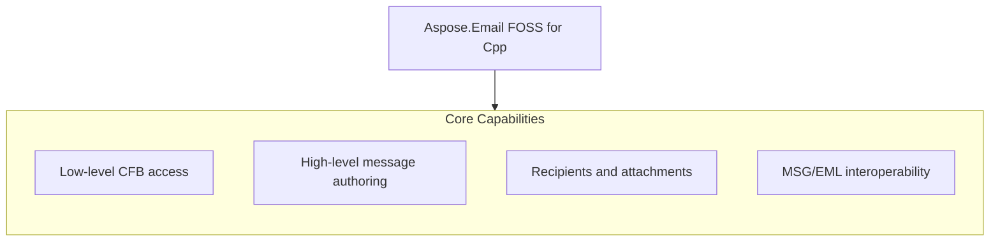

# Aspose.Email FOSS for Cpp

[](LICENSE) [](https://github.com/aspose-email-foss/Aspose.Email-FOSS-for-Cpp/graphs/contributors)

[](https://products.aspose.org/email/cpp/)

Aspose.Email FOSS for Cpp is a C++ library that enables reading and writing email messages in MSG and EML formats. It solves the problem of programmatic email handling in C++ applications by providing a straightforward API to create, inspect, and save messages without external dependencies. Developers building desktop or server applications that need to process email content, such as parsing incoming messages or generating outgoing reports, use this library. The library is version 0.1.0, targets C++17, and requires CMake 3.26 or later.

## Navigation

- [At a Glance](#at-a-glance)
- [Key Capabilities](#key-capabilities)
- [Installation](#installation)
- [Dependencies](#dependencies)
- [Quick Start](#quick-start)
- [API Reference](#api-reference)
- [Documentation & Resources](#documentation--resources)
- [Scope and Limitations](#scope-and-limitations)
- [Development and Testing](#development-and-testing)
- [License](#license)

## At a Glance



## Key Capabilities

- **Low-level CFB access.** The `aspose.email.foss.cfb` module provides direct access to Compound File Binary structures, enabling inspection and manipulation of the underlying file format used by MSG files.
- **High-level message authoring.** High-level message authoring is supported through the aspose::email::foss::msg::`mapi_message`::create factory method, which initializes a new message with subject and body content.
- **Recipients and attachments.** Recipients and attachments are added using the `add_recipient` and `add_attachment` methods on `mapi_message` instances, supporting email addresses, display names, and MIME content types.
- **MSG/EML interoperability.** The `AsposeEmailFoss` library enables bidirectional conversion between MSG and EML formats, allowing messages to be saved in either format using the save and `save_to_eml` methods.

## Installation

`AsposeEmailFoss` is not yet published on any package registry; build it from a source checkout instead, verified against this revision:

```bash
git clone https://github.com/aspose-email-foss/Aspose.Email-FOSS-for-Cpp.git
cd Aspose.Email-FOSS-for-Cpp
cmake -S . -B build
```

## Dependencies

### Required Package Dependencies

No required third-party package dependencies; in `CMakeLists.txt`, no dependency is on the library target's public link interface, so a consumer links nothing beyond the library itself.

### Native and System Requirements

- Requires C++ `17` (`CMAKE_CXX_STANDARD` in `CMakeLists.txt`).

## Quick Start

Read a subject from an MSG file opened as a binary stream.

```cpp
#include <fstream>
#include <iostream>

#include "aspose/email/foss/msg/mapi_message.hpp"

int main()
{
    std::ifstream input("sample.msg", std::ios::binary);
    auto message = aspose::email::foss::msg::mapi_message::from_stream(input);
    std::cout << message.subject() << '\n';
}
```

Create a message and save it as both MSG and EML.

```cpp
#include <fstream>

#include "aspose/email/foss/msg/mapi_message.hpp"

int main()
{
    auto message = aspose::email::foss::msg::mapi_message::create("Hello", "Body");
    message.set_sender_name("Alice");
    message.set_sender_email_address("alice@example.com");
    message.add_recipient("bob@example.com", "Bob");
    message.add_attachment("note.txt", std::vector<std::uint8_t>{'a', 'b', 'c'}, "text/plain");

    std::ofstream msg_output("hello.msg", std::ios::binary);
    message.save(msg_output);

    std::ofstream eml_output("hello.eml", std::ios::binary);
    message.save_to_eml(eml_output);
}
```

## API Reference

Aspose.Email FOSS for Cpp exposes the `mapi_message` class as the primary high-level entry point for creating, editing, and reloading messages, while lower-level classes such as `msg_reader`, `msg_document`, `msg_writer`, `cfb_reader`, `cfb_document`, and `cfb_writer` provide direct access to the underlying MSG and CFB container structures.

The verified public surface has 26 types.

<details>
<summary>View the Complete Public API Surface</summary>

### Core API

| Class | Description |
| --- | --- |
| `cfb_document` | The cfb_document class represents a Compound File Binary document and provides methods to load it from various sources such as a file, stream, buffer, or bytes, while exposing its major and minor version numbers and root storage. |
| `cfb_exception` | The cfb_exception class represents an error condition that can occur during operations on Compound File Binary documents. |
| `cfb_node` | The cfb_node class represents a node in a Compound File Binary structure, providing access to its name, class identifier, creation and modification times, state bits, and whether it is a storage or stream. |
| `cfb_reader` | The cfb_reader class provides methods to read and inspect the contents of a Compound File Binary document, including accessing directory entries, streams, storages, and metadata such as sector markers and FAT tables. |
| `cfb_storage` | The cfb_storage class represents a storage node in a Compound File Binary document and allows adding child storages or streams. |
| `cfb_stream` | The cfb_stream class represents a stream node in a Compound File Binary document and provides access to its data content. |
| `cfb_writer` | The cfb_writer class provides methods to write a Compound File Binary document to a file or stream. |
| `directory_entry` | The directory_entry class represents an entry in the directory of a Compound File Binary document, exposing properties such as name length, object type, color flag, creation and modification times, and class identifier. |
| `header` | The header class encapsulates the header information of a Compound File Binary document, including version numbers and sector sizes. |
| `mapi_attachment` | The mapi_attachment class represents an attachment in a MAPI message, providing access to its data, filename, and content type. |
| `mapi_message` | The mapi_message class represents a MAPI message and provides methods to set properties, add recipients and attachments, and save the message to a file. |
| `mapi_property` | The mapi_property class represents a single MAPI property, storing its identifier, type, and value. |
| `mapi_property_collection` | The mapi_property_collection class provides a container for MAPI properties associated with a message or attachment. |
| `mapi_recipient` | The mapi_recipient class represents a recipient in a MAPI message, including name, email address, and recipient type. |
| `msg_document` | The msg_document class represents a parsed MSG document and provides access to its internal structure and metadata. |
| `msg_exception` | The msg_exception class represents an error condition that can occur during operations on MSG documents. |
| `msg_reader` | The msg_reader class provides methods to read and inspect the contents of an MSG file, including accessing its internal CFB structure. |
| `msg_storage` | The msg_storage class represents a storage node in an MSG document and provides access to its child nodes. |
| `msg_stream` | The msg_stream class represents a stream node in an MSG document and provides access to its data. |
| `msg_writer` | The msg_writer class provides methods to write a MAPI message to a file in MSG format. |

#### Enumerations

| Enumeration | Description |
| --- | --- |
| `directory_color_flag` | The directory_color_flag enumeration indicates the color of a directory entry in a Compound File Binary document, used for red-black tree balancing. |
| `directory_object_type` | The directory_object_type enumeration specifies whether a directory entry represents a storage, a stream, or the root storage in a Compound File Binary document. |
| `sector_marker` | The sector_marker enumeration defines special values used to mark sectors in a Compound File Binary document, such as end-of-chain or free sectors. |
| `common_message_property_id` | The common_message_property_id enumeration defines standard property identifiers used in MAPI message structures. |
| `msg_storage_role` | The msg_storage_role enumeration specifies the role of a storage node within an MSG document, such as root or message storage. |
| `property_type_code` | The property_type_code enumeration defines the data types used for MAPI properties, such as strings, integers, or binary data. |

#### Detailed Member Reference

### aspose

The aspose namespace serves as the top-level container for the Aspose.Email FOSS for Cpp library, grouping the `aspose.email` and `aspose.email.foss` sub-namespaces that provide the core email processing functionality.

### email

The `aspose.email` namespace provides the main public API surface for email processing, with `aspose.email.foss` offering the free and open source subset of functionality built on top of the core library.

### foss

The `aspose.email.foss` namespace includes the `mapi_message` class for high-level message authoring and the low-level `msg_reader`, `msg_document`, `msg_writer`, `cfb_reader`, `cfb_document`, and `cfb_writer` classes for direct access to MSG and CFB container structures.

</details>

## Documentation & Resources

- **[Getting started guide](https://docs.aspose.org/email/cpp/)** — The getting started guide covers installation, walkthroughs, and feature guides for `AsposeEmailFoss`.
- **[How-to guides & FAQ](https://kb.aspose.org/email/cpp/)** — The how-to guides and FAQ provide task-focused answers for common MSG, EML, and CFB processing questions.
- **[Full API reference](https://reference.aspose.org/email/cpp/)** — The full API reference offers a complete, browsable reference for all 26 public types in `AsposeEmailFoss`. It covers all 26 verified public types; the [API Reference](#api-reference) section above covers the essentials.
- **[Public API surface](PUBLIC_API.md)** — The public API surface documents the stable namespaces and headers this library commits to supporting.
- **[Changelog](CHANGELOG.md)** — The changelog records the release history for `AsposeEmailFoss`.
- Found a bug or have a feature request? [Open an issue](https://github.com/aspose-email-foss/Aspose.Email-FOSS-for-Cpp/issues).

## Scope and Limitations

Aspose.Email FOSS for Cpp version 0.1.0 provides a C++17 library for reading and writing MSG, CFB, and EML message containers and single messages stored on disk, in memory, or in a stream, using the `AsposeEmailFoss` namespace.

- The library does not support SMTP, IMAP, POP3, or any other network mail-protocol operations and cannot function as a mail client or transport library, requiring messages to be provided via file, memory buffer, or stream input.
- PST (Outlook Personal Folders) archive support is not included; only single MSG-format messages and generic CFB containers are supported, not multi-message PST stores.
- Only a curated subset of MAPI properties has a dedicated named accessor on `mapi_message`, and all other properties must be accessed through the generic `get_property_value()` and `set_property()` methods using `common_message_property_id` and `property_type_code` values.

These limitations don't apply to [Aspose.Email for Cpp — Enterprise Edition](https://products.aspose.com/email/cpp/). Aspose.Email FOSS for Cpp provides a free, open-source subset of functionality for working with email formats in C++; the commercial edition extends this with additional features and support options.

## Development and Testing

Build and test Aspose.Email FOSS for Cpp using CMake 3.26 or later with C++17 support, following the repository's default preset configuration.

The suite covers 4 test files under `tests/`.

```powershell
cmake --preset default
cmake --build --preset default
ctest --preset default
```

## License

This project is licensed under the [MIT License](LICENSE). The MIT License permits use, copying, modification, distribution, sublicensing, and commercial use, provided its copyright and permission notice are retained. The software is provided without warranty.
