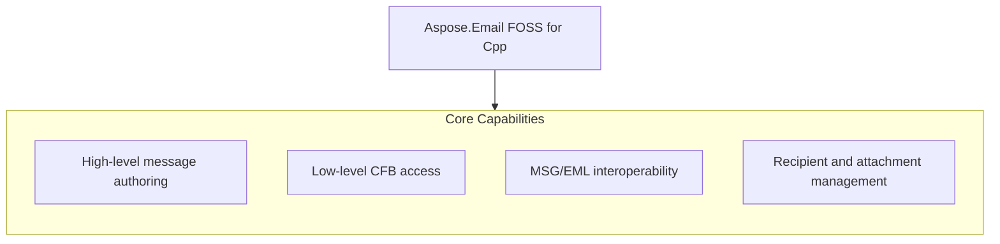

# Aspose.Email FOSS for Cpp

[](LICENSE) [](https://github.com/aspose-email-foss/Aspose.Email-FOSS-for-Cpp/graphs/contributors)

[](https://products.aspose.org/email/cpp/)

Aspose.Email FOSS for Cpp is a C++ library for reading and writing email messages in MSG and EML formats. It solves the problem of programmatic email handling in native C++ applications without requiring external dependencies or a runtime environment. Developers working with email data in enterprise or embedded C++ systems use this library to parse existing messages or construct new ones for automation, archival, or integration purposes. The library targets C++17 and requires CMake 3.26 or later, with version 0.1.0 providing core functionality for MSG and EML operations.

## Navigation

- [At a Glance](#at-a-glance)
- [Key Capabilities](#key-capabilities)
- [Installation](#installation)
- [Dependencies](#dependencies)
- [Quick Start](#quick-start)
- [Additional Examples](#additional-examples)
- [API Reference](#api-reference)
- [Documentation & Resources](#documentation--resources)
- [Scope and Limitations](#scope-and-limitations)
- [Development and Testing](#development-and-testing)
- [License](#license)

## At a Glance



## Key Capabilities

- **High-level message authoring.** Create, edit, and save Outlook-style messages using the `mapi_message` class, setting subject, plain-text and HTML bodies, and sender identity, or access arbitrary MAPI properties via `set_property` and `get_property_value` with `common_message_property_id` and `property_type_code`.
- **Low-level CFB access.** Read, build, and write generic Compound File Binary containers directly through `cfb_reader`, `cfb_storage`/`cfb_stream`, and `cfb_writer`, working with file paths, in-memory streams, or raw byte buffers.
- **MSG/EML interoperability.** Save an in-memory `mapi_message` to .eml and load .eml back into a `mapi_message` using the library's own MIME engine, with no external MIME dependency.
- **Recipient and attachment management.** Add To, Cc, and Bcc recipients with `add_recipient`, attach regular files from byte buffers or streams with `add_attachment`, and nest a full `mapi_message` as an embedded-message attachment with `add_embedded_message_attachment`.

## Installation

`AsposeEmailFoss` is not yet published on any package registry; build it from a source checkout instead, verified against this revision:

```bash
git clone https://github.com/aspose-email-foss/Aspose.Email-FOSS-for-Cpp.git
cd Aspose.Email-FOSS-for-Cpp
cmake -S . -B build
```

## Dependencies

### Required Package Dependencies

No required third-party package dependencies; in `CMakeLists.txt`, no dependency is on the library target's public link interface, so a consumer links nothing beyond the library itself.

### Native and System Requirements

- Requires C++ `17` (`CMAKE_CXX_STANDARD` in `CMakeLists.txt`).

## Quick Start

This example opens a MSG file as a binary stream and prints its subject line using `AsposeEmailFoss` 0.1.0 with C++17 support.

```cpp
#include <fstream>
#include <iostream>

#include "aspose/email/foss/msg/mapi_message.hpp"

int main()
{
    std::ifstream input("sample.msg", std::ios::binary);
    auto message = aspose::email::foss::msg::mapi_message::from_stream(input);
    std::cout << message.subject() << '\n';
}
```

## Additional Examples

Aspose.Email FOSS for Cpp supports creating and saving messages in MSG and EML formats. The example workflows demonstrate saving a message to both formats using the `AsposeEmailFoss` library.

<details>
<summary>View Additional Examples</summary>

### Create and save a message to MSG and EML formats

```cpp
#include <fstream>

#include "aspose/email/foss/msg/mapi_message.hpp"

int main()
{
    auto message = aspose::email::foss::msg::mapi_message::create("Hello", "Body");
    message.set_sender_name("Alice");
    message.set_sender_email_address("alice@example.com");
    message.add_recipient("bob@example.com", "Bob");
    message.add_attachment("note.txt", std::vector<std::uint8_t>{'a', 'b', 'c'}, "text/plain");

    std::ofstream msg_output("hello.msg", std::ios::binary);
    message.save(msg_output);

    std::ofstream eml_output("hello.eml", std::ios::binary);
    message.save_to_eml(eml_output);
}
```

</details>

## API Reference

Aspose.Email FOSS for Cpp exposes the `mapi_message` class as the primary entry point for creating, editing, and reloading email messages, while `msg_reader` and `cfb_reader` provide lower-level access to MSG and CFB container structures respectively.

The verified public surface has 26 types.

<details>
<summary>View the Complete Public API Surface</summary>

### Core API

| Class | Description |
| --- | --- |
| `cfb_document` | The cfb_document class represents a Compound File Binary document and provides methods to load it from various sources and access its version and root node. |
| `cfb_exception` | The cfb_exception class represents an error condition that occurs during processing of Compound File Binary documents. |
| `cfb_node` | The cfb_node class represents a node in a Compound File Binary document, which can be either a storage or a stream, and exposes properties such as name, CLSID, and timestamps. |
| `cfb_reader` | The cfb_reader class provides functionality to read and inspect the structure of a Compound File Binary document, including accessing its header, directory entries, and streams. |
| `cfb_storage` | The cfb_storage class represents a storage node in a Compound File Binary document and supports adding child storages and streams. |
| `cfb_stream` | The cfb_stream class represents a stream node in a Compound File Binary document and provides access to its data. |
| `cfb_writer` | The cfb_writer class provides functionality to write a Compound File Binary document to a file or stream. |
| `directory_entry` | The directory_entry class represents an entry in the directory of a Compound File Binary document and exposes properties such as name, CLSID, creation time, and object type. |
| `header` | The header class encapsulates the header information of a Compound File Binary document, including version numbers and sector sizes. |
| `mapi_attachment` | The mapi_attachment class represents an attachment in a MAPI message and provides methods to manage its data and metadata. |
| `mapi_message` | The mapi_message class represents a MAPI message and provides methods to create, modify, and save messages with properties, recipients, and attachments. |
| `mapi_property` | The mapi_property class represents a single MAPI property with its identifier, type, and value. |
| `mapi_property_collection` | The mapi_property_collection class provides a container for MAPI properties associated with a message or attachment. |
| `mapi_recipient` | The mapi_recipient class represents a recipient in a MAPI message and stores properties such as email address, display name, and recipient type. |
| `msg_document` | The msg_document class represents a parsed MSG document and provides access to its internal structure and properties. |
| `msg_exception` | The msg_exception class represents an error condition that occurs during processing of MSG documents. |
| `msg_reader` | The msg_reader class provides functionality to read and inspect the structure of an MSG file. |
| `msg_storage` | The msg_storage class represents a storage node in an MSG document and supports hierarchical organization of message components. |
| `msg_stream` | The msg_stream class represents a stream node in an MSG document and provides access to its data. |
| `msg_writer` | The msg_writer class provides functionality to write a MAPI message to an MSG file. |

#### Enumerations

| Enumeration | Description |
| --- | --- |
| `directory_color_flag` | The directory_color_flag enumeration indicates the color of a directory entry in a Compound File Binary document, used for tree balancing. |
| `directory_object_type` | The directory_object_type enumeration specifies whether a directory entry represents a storage or a stream in a Compound File Binary document. |
| `sector_marker` | The sector_marker enumeration defines special values used to mark sectors in the FAT and mini-FAT of a Compound File Binary document. |
| `common_message_property_id` | The common_message_property_id enumeration defines standard property identifiers used in MAPI messages. |
| `msg_storage_role` | The msg_storage_role enumeration specifies the role of a storage node within an MSG document, such as representing the main message or an attachment. |
| `property_type_code` | The property_type_code enumeration defines the data types used for MAPI properties. |

#### Detailed Member Reference

### aspose

The aspose namespace serves as the top-level container for the Aspose.Email FOSS for Cpp library, with `aspose.email` providing the email-specific functionality and `aspose.email.foss` exposing the open-source MSG and CFB processing components.

### email

The `aspose.email` namespace provides the email processing API surface, with `aspose.email.foss` delivering the open-source MSG and CFB container handling capabilities for reading, writing, and manipulating message structures.

### foss

The `aspose.email.foss` namespace contains the core MSG and CFB processing classes, including `mapi_message` for high-level message authoring with methods such as `add_recipient`, `add_attachment`, and save, as well as `msg_reader` and `cfb_reader` for low-level container access with methods like `from_file`, `from_stream`, and `find_child_by_name`.

</details>

## Documentation & Resources

- **[Getting started guide](https://docs.aspose.org/email/cpp/)** — The getting started guide covers installation, walkthroughs, and feature guides for `AsposeEmailFoss`.
- **[How-to guides & FAQ](https://kb.aspose.org/email/cpp/)** — The how-to guides and FAQ provide task-focused answers for common MSG, EML, and CFB processing questions.
- **[Full API reference](https://reference.aspose.org/email/cpp/)** — The full API reference offers a complete, browsable reference for all 26 public types in `AsposeEmailFoss`. It covers all 26 verified public types; the [API Reference](#api-reference) section above covers the essentials.
- **[Public API surface](PUBLIC_API.md)** — The public API surface documents the stable namespaces and headers this library commits to.
- **[Changelog](CHANGELOG.md)** — The changelog records the release history for `AsposeEmailFoss`.
- Found a bug or have a feature request? [Open an issue](https://github.com/aspose-email-foss/Aspose.Email-FOSS-for-Cpp/issues).

## Scope and Limitations

Aspose.Email FOSS for Cpp version 0.1.0 provides a C++ library for reading and writing email message formats MSG, CFB, and EML on disk, in memory, or in a stream, targeting C++17 and requiring CMake 3.26 or later.

- The library does not support SMTP, IMAP, POP3, or any other network mail-protocol operations and cannot function as a mail client or transport library, as it only processes MSG, CFB, and EML containers and messages already present on disk, in memory, or in a stream.
- PST (Outlook Personal Folders) archive support is not included; only single MSG-format messages and generic CFB containers are supported, not multi-message PST stores.
- Only a curated subset of MAPI properties—subject, plain-text and HTML body, message class, sender name/address/address type, and Internet Message-ID—has a dedicated named accessor on `mapi_message`, while all other properties must be accessed or modified through the generic `get_property_value()` and `set_property()` methods using `common_message_property_id` and `property_type_code`.

These limitations don't apply to [Aspose.Email for Cpp — Enterprise Edition](https://products.aspose.com/email/cpp/). Aspose.Email FOSS for Cpp provides a free, open-source subset of functionality for working with email formats in C++; the commercial edition extends this with additional features and support options.

## Development and Testing

Build and test the library using the provided CMake presets: run cmake --preset default to configure, cmake --build --preset default to compile, and ctest --preset default to execute the test suite defined in tests/.

The suite covers 4 test files under `tests/`.

```powershell
cmake --preset default
cmake --build --preset default
ctest --preset default
```

Runnable example programs have their own build instructions and a per-file task index in
[`examples/README.md`](examples/README.md); turn them on with
`-DASPOSE_EMAIL_FOSS_BUILD_EXAMPLES=ON -DASPOSE_EMAIL_FOSS_BUILD_TESTS=OFF` (they are off by
default in the `default` preset).

## License

This project is licensed under the [MIT License](LICENSE). The MIT License permits use, copying, modification, distribution, sublicensing, and commercial use, provided its copyright and permission notice are retained. The software is provided without warranty.
