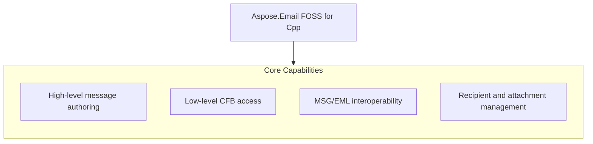

# Aspose.Email FOSS for Cpp

[](LICENSE) [](https://github.com/aspose-email-foss/Aspose.Email-FOSS-for-Cpp/graphs/contributors)

[](https://products.aspose.org/email/cpp/)

Aspose.Email FOSS for Cpp is a C++ library for reading, writing, and manipulating email messages in Microsoft Outlook MSG and standard EML formats. It enables developers to create, load, and modify message objects with recipients, attachments, and properties using a single, dependency-free API. Users can parse existing MSG files, construct new messages programmatically, and export to both MSG and EML formats for interoperability. The library supports C++17 and requires CMake 3.26 or later, with no external runtime dependencies.

## Navigation

- [At a Glance](#at-a-glance)
- [Key Capabilities](#key-capabilities)
- [Installation](#installation)
- [Dependencies](#dependencies)
- [Quick Start](#quick-start)
- [API Reference](#api-reference)
- [Documentation & Resources](#documentation--resources)
- [Scope and Limitations](#scope-and-limitations)
- [Development and Testing](#development-and-testing)
- [License](#license)

## At a Glance



## Key Capabilities

- **High-level message authoring.** Create and edit Outlook-style messages with `mapi_message`, setting the subject, plain-text and HTML bodies, and sender identity, or reaching arbitrary MAPI properties via `set_property()` and `get_property_value()` with `common_message_property_id` and `property_type_code`.
- **Low-level CFB access.** Read, build, and write generic Compound File Binary containers directly through `cfb_reader`, `cfb_storage`/`cfb_stream`, and `cfb_writer`, working with file paths, in-memory streams, or raw byte buffers.
- **MSG/EML interoperability.** Save an in-memory `mapi_message` to .eml and load .eml back into a `mapi_message`, both through the library's own MIME engine, with no external MIME dependency.
- **Recipient and attachment management.** Add To/Cc/Bcc recipients with `add_recipient()`, attach regular files from byte buffers or streams with `add_attachment()`, and nest a full `mapi_message` as an embedded-message attachment with `add_embedded_message_attachment()`.

## Installation

`AsposeEmailFoss` is not yet published on any package registry; build it from a source checkout instead, verified against this revision:

```bash
git clone https://github.com/aspose-email-foss/Aspose.Email-FOSS-for-Cpp.git
cd Aspose.Email-FOSS-for-Cpp
cmake -S . -B build
```

## Dependencies

### Required Package Dependencies

No required third-party package dependencies; in `CMakeLists.txt`, no dependency is on the library target's public link interface, so a consumer links nothing beyond the library itself.

### Native and System Requirements

- Requires C++ `17` (`CMAKE_CXX_STANDARD` in `CMakeLists.txt`).

## Quick Start

Read a subject from an MSG file opened as a binary stream using Aspose.Email FOSS for Cpp 0.1.0 with C++17 support.

```cpp
#include <fstream>
#include <iostream>

#include "aspose/email/foss/msg/mapi_message.hpp"

int main()
{
    std::ifstream input("sample.msg", std::ios::binary);
    auto message = aspose::email::foss::msg::mapi_message::from_stream(input);
    std::cout << message.subject() << '\n';
}
```

Create a message and save it as both MSG and EML using Aspose.Email FOSS for Cpp 0.1.0 with C++17 support.

```cpp
#include <fstream>

#include "aspose/email/foss/msg/mapi_message.hpp"

int main()
{
    auto message = aspose::email::foss::msg::mapi_message::create("Hello", "Body");
    message.set_sender_name("Alice");
    message.set_sender_email_address("alice@example.com");
    message.add_recipient("bob@example.com", "Bob");
    message.add_attachment("note.txt", std::vector<std::uint8_t>{'a', 'b', 'c'}, "text/plain");

    std::ofstream msg_output("hello.msg", std::ios::binary);
    message.save(msg_output);

    std::ofstream eml_output("hello.eml", std::ios::binary);
    message.save_to_eml(eml_output);
}
```

## API Reference

Aspose.Email FOSS for Cpp 0.1.0 provides the `aspose.email.foss.msg.mapi_message` class as the primary high-level entry point for creating, editing, and reloading messages, while `aspose.email.foss.msg.msg_reader` and `aspose.email.foss.cfb.cfb_reader` expose lower-level access to the underlying MSG and CFB container structures.

The verified public surface has 26 types.

<details>
<summary>View the Complete Public API Surface</summary>

### Core API

| Class | Description |
| --- | --- |
| `cfb_document` | Represents a Compound File Binary document and provides methods to load it from various sources and access its version and root storage. |
| `cfb_exception` | Represents an exception thrown during operations on Compound File Binary structures. |
| `cfb_node` | Represents a node in a Compound File Binary structure, which can be a storage or a stream with associated metadata. |
| `cfb_reader` | Reads and provides access to the internal structure of a Compound File Binary document, including its header, directory entries, and streams. |
| `cfb_storage` | Represents a storage node in a Compound File Binary document and allows adding child storages and streams. |
| `cfb_stream` | Represents a stream node in a Compound File Binary document and provides access to its data. |
| `cfb_writer` | Writes a Compound File Binary document to a file or stream. |
| `directory_entry` | Represents an entry in the directory of a Compound File Binary document, describing a storage or stream node. |
| `header` | Contains the header information of a Compound File Binary document, such as version numbers and sector sizes. |
| `mapi_attachment` | Represents an attachment in a MAPI message, including its data and metadata. |
| `mapi_message` | Represents a MAPI message and provides methods to create, modify, and save it in MSG format. |
| `mapi_property` | Represents a single MAPI property with its identifier, type, and value. |
| `mapi_property_collection` | Holds a collection of MAPI properties associated with a message, attachment, or recipient. |
| `mapi_recipient` | Represents a recipient in a MAPI message, including their address, name, and type. |
| `msg_document` | Represents a parsed MSG document and provides access to its internal structure and properties. |
| `msg_exception` | Represents an exception thrown during operations on MSG documents. |
| `msg_reader` | Reads and provides access to the internal structure of an MSG document. |
| `msg_storage` | Represents a storage node in an MSG document and allows adding child storages and streams. |
| `msg_stream` | Represents a stream node in an MSG document and provides access to its data. |
| `msg_writer` | Writes an MSG document to a file or stream. |

#### Enumerations

| Enumeration | Description |
| --- | --- |
| `directory_color_flag` | Indicates the color of a directory entry in a Compound File Binary structure, used for red-black tree balancing. |
| `directory_object_type` | Specifies whether a directory entry represents a storage or a stream in a Compound File Binary document. |
| `sector_marker` | Represents special markers used in the sector allocation tables of a Compound File Binary document. |
| `common_message_property_id` | Defines standard property identifiers used in MAPI message structures. |
| `msg_storage_role` | Specifies the role of a storage node within an MSG document, such as message or attachment storage. |
| `property_type_code` | Defines the data type codes used for MAPI properties. |

#### Detailed Member Reference

### foss

The `aspose.email.foss.msg.mapi_message` class supports message creation with `aspose.email.foss.msg.mapi_message.create`, loading from files or streams with `aspose.email.foss.msg.mapi_message.from_file`, `aspose.email.foss.msg.mapi_message.from_stream`, and `aspose.email.foss.msg.mapi_message.from_msg_document`, saving to MSG and EML formats with `aspose.email.foss.msg.mapi_message.save` and `aspose.email.foss.msg.mapi_message.save_to_eml`, and manipulation of recipients, attachments, body content, and properties through methods such as `aspose.email.foss.msg.mapi_message.add_recipient`, `aspose.email.foss.msg.mapi_message.add_attachment`, `aspose.email.foss.msg.mapi_message.set_body`, `aspose.email.foss.msg.mapi_message.set_html_body`, and `aspose.email.foss.msg.mapi_message.set_property`.

</details>

## Documentation & Resources

- **[Getting started guide](https://docs.aspose.org/email/cpp/)** — The getting started guide covers installation, walkthroughs, and feature guides for `AsposeEmailFoss`.
- **[How-to guides & FAQ](https://kb.aspose.org/email/cpp/)** — The how-to guides and FAQ provide task-focused answers for common MSG, EML, and CFB processing questions.
- **[Full API reference](https://reference.aspose.org/email/cpp/)** — The full API reference offers a complete, browsable reference for all 26 public types in `AsposeEmailFoss`. It covers all 26 verified public types; the [API Reference](#api-reference) section above covers the essentials.
- **[Public API surface](PUBLIC_API.md)** — The public API surface documents the stable namespaces and headers this library commits to supporting.
- **[Changelog](CHANGELOG.md)** — The changelog records the release history for `AsposeEmailFoss`.
- Found a bug or have a feature request? [Open an issue](https://github.com/aspose-email-foss/Aspose.Email-FOSS-for-Cpp/issues).

## Scope and Limitations

Aspose.Email FOSS for Cpp version 0.1.0 provides a C++17 library for reading and writing MSG, CFB, and EML message containers and single messages stored on disk, in memory, or in a stream, using the `AsposeEmailFoss` namespace.

- The library does not support SMTP, IMAP, POP3, or any other network mail-protocol operations and cannot function as a mail client or transport library, requiring messages to be provided via file, memory buffer, or stream input.
- PST (Outlook Personal Folders) archive support is not included; only single MSG-format messages and generic CFB containers are supported, not multi-message PST stores.
- Only a curated subset of MAPI properties has a dedicated named accessor on `mapi_message`, and all other properties must be accessed through the generic `get_property_value()` and `set_property()` methods using `common_message_property_id` and `property_type_code` values.

These limitations don't apply to [Aspose.Email for Cpp — Enterprise Edition](https://products.aspose.com/email/cpp/). Aspose.Email FOSS for Cpp provides a free, open-source subset of functionality for working with email formats in C++; the commercial edition extends this with additional features and support options.

## Development and Testing

Build and test Aspose.Email FOSS for Cpp using the provided CMake presets: run cmake --preset default to configure, cmake --build --preset default to compile, and ctest --preset default to execute tests.

The suite covers 4 test files under `tests/`.

```powershell
cmake --preset default
cmake --build --preset default
ctest --preset default
```

## License

This project is licensed under the [MIT License](LICENSE). The MIT License permits use, copying, modification, distribution, sublicensing, and commercial use, provided its copyright and permission notice are retained. The software is provided without warranty.
