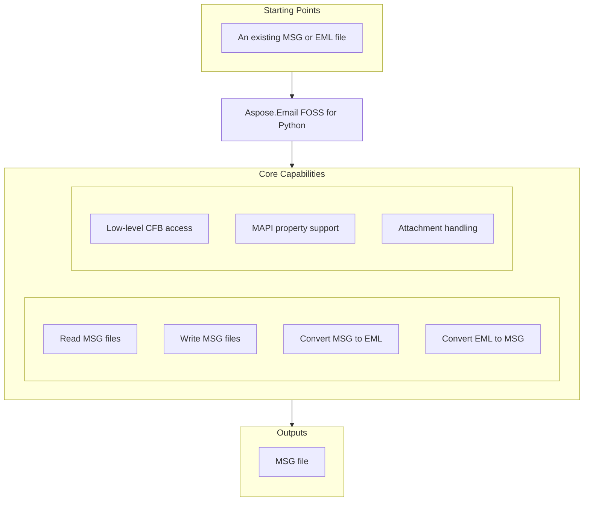

# Aspose.Email FOSS for Python

[](https://pypi.org/project/aspose-email-foss/)  [](LICENSE) [](https://github.com/aspose-email-foss/Aspose.Email-FOSS-for-Python/graphs/contributors)

[](https://products.aspose.org/email/python/)

Aspose.Email FOSS for Python reads and writes Microsoft Outlook message formats including `.msg` and `.eml`, converting between MAPI and standard email representations. It solves interoperability problems for developers who need to process email archives, attachments, and properties without relying on Microsoft Outlook or commercial libraries. Users in email migration, compliance, and automation workflows use it to inspect, transform, and store email data using the `email_foss.cfb` and `email_foss.msg` modules. The package is open source under the MIT license, requires Python 3.10 or later, and has no external dependencies.

## Navigation

- [At a Glance](#at-a-glance)
- [Key Capabilities](#key-capabilities)
- [Installation](#installation)
- [Dependencies](#dependencies)
- [Quick Start](#quick-start)
- [Additional Examples](#additional-examples)
- [API Reference](#api-reference)
- [Documentation & Resources](#documentation--resources)
- [Scope and Limitations](#scope-and-limitations)
- [Development and Testing](#development-and-testing)
- [License](#license)

## At a Glance



## Key Capabilities

- **Read MSG files.** Read MSG files by loading a `.msg` file into a `MapiMessage` instance and accessing its subject and other properties directly.
- **Write MSG files.** Write MSG files by creating a `MapiMessage` programmatically, setting sender and recipient properties, adding attachments, and saving the result to disk.
- **Convert MSG to EML.** Convert MSG to EML by loading a `.msg` file with `MapiMessage`, transforming it to an email message, and writing the resulting bytes to an `.eml` file.
- **Convert EML to MSG.** Convert EML to MSG by parsing an `.eml` file into an email message object, converting it to a `MapiMessage`, and saving it as a `.msg` file.
- **Low-level CFB access.** Inspect and construct Compound File Binary structures through `CFBReader` and `CFBWriter`, enabling direct access to internal MSG storage layouts.
- **Low-level MSG access.** Access MSG file internals such as attachment and recipient storages using `MsgReader` and `MsgWriter` without relying on higher-level abstractions.
- **MAPI property support.** Set and retrieve standard and custom MAPI properties including sender information using property identifiers and named property support.
- **Attachment handling.** Manage attachments by adding them from raw bytes or embedded messages, and inspecting their type and storage metadata.

## Installation

Install the published package from PyPI (`aspose-email-foss`, version 26.3):

```bash
pip install aspose-email-foss
```

To work from a source checkout instead, install the clone with pip:

```bash
git clone https://github.com/aspose-email-foss/Aspose.Email-FOSS-for-Python.git
cd Aspose.Email-FOSS-for-Python
pip install .
```

Verify the install:

```bash
python -c "import aspose.email_foss"
```

The package declares `python_requires` as `>=3.10`.

## Dependencies

### Required Package Dependencies

No required third-party package dependencies; in `pyproject.toml`, no `project.dependencies` is declared.

### Native and System Requirements

- Requires Python 3.10 or later (`python_requires=">=3.10"` in `pyproject.toml`).

## Quick Start

Read the subject line from an existing MSG file using the `MapiMessage` class and print it to the console.

```python
from aspose.email_foss import msg

with msg.MapiMessage.from_file("sample.msg") as message:
    print(message.subject)
```

Create a new `MapiMessage`, set sender properties, add a recipient and attachment, save it as MSG, then load and convert it to an email message for export as EML.

```python
from aspose.email_foss import msg

message = msg.MapiMessage.create("Hello", "Body")
message.set_property(msg.PropertyId.SENDER_NAME, "Alice")
message.set_property(msg.PropertyId.SENDER_EMAIL_ADDRESS, "alice@example.com")
message.add_recipient("bob@example.com", display_name="Bob")
message.add_attachment("note.txt", b"abc", mime_type="text/plain")
message.save("hello.msg")

with msg.MapiMessage.from_file("hello.msg") as loaded:
    email_message = loaded.to_email_message()
    with open("hello.eml", "wb") as target:
        target.write(email_message.as_bytes())
```

## Additional Examples

Create, convert, and inspect email messages and structured storage using Aspose.Email FOSS for Python.

### Create and read a structured storage stream using CFB APIs

```python
from aspose.email_foss.cfb import CFBDocument, CFBReader, CFBStorage, CFBStream, CFBWriter, ROOT_ENTRY_NAME

root = CFBStorage(ROOT_ENTRY_NAME)
root.add_stream(CFBStream("Summary", b"hello"))

data = CFBWriter.to_bytes(CFBDocument(root=root, major_version=3))
reader = CFBReader(data)
entry = reader.resolve_path(["Summary"])
print(reader.get_stream_data(entry.stream_id))
```

<details>
<summary>View Additional Examples</summary>

### Convert MSG to EML by reading a file and writing bytes

```python
from aspose.email_foss import msg

with msg.MapiMessage.from_file("message.msg") as message:
    email_message = message.to_email_message()

with open("message.eml", "wb") as target:
    target.write(email_message.as_bytes())
```

### Convert EML to MSG by parsing an email and saving it

```python
from email import policy
from email.parser import BytesParser

from aspose.email_foss import msg

with open("message.eml", "rb") as source:
    email_message = BytesParser(policy=policy.default).parse(source)

message = msg.MapiMessage.from_email_message(email_message)
message.save("message.msg")
```

</details>

## API Reference

Aspose.Email FOSS for Python provides the `email_foss` module for working with email formats, with `email_foss.msg.mapi_message` as the primary entry point for handling MAPI messages and `email_foss.cfb` for low-level Compound File Binary structure operations.

The verified public surface has 30 types.

<details>
<summary>View the Complete Public API Surface</summary>

### Core API

| Class | Description |
| --- | --- |
| `CFBDocument` | Mutable Compound File Binary (CFB) document description. |
| `CFBError` | Raised for malformed or unsupported Compound File Binary (CFB) content. |
| `CFBReader` | Reusable reader for Compound File Binary (CFB) containers. |
| `CFBStorage` | Mutable storage node used by the CFB writer. |
| `CFBStream` | Mutable stream node used by the CFB writer. |
| `CFBWriter` | Deterministic serializer for Compound File Binary (CFB) containers. |
| `DirectoryEntry` | Fixed-size directory record for one storage/stream object and its tree links. |
| `Header` | Header record at file offset 0 defining Compound File Binary (CFB) geometry and allocation chain entry points. |
| `MapiAttachment` | Mutable attachment object. |
| `MapiMessage` | Mutable high-level MSG object with MSG and EmailMessage conversion support. |
| `MapiNamedProperty` | Identifier for a named MAPI property. |
| `MapiProperty` | Logical MAPI property with optional named-property identity. |
| `MapiRecipient` | Mutable recipient object. |
| `MsgDocument` | Mutable MSG document model that can be serialized through the CFB writer. |
| `MsgError` | Raised for malformed or unsupported MSG structures. |
| `MsgReader` | Normative top-level MSG containment and stream requirements for container traversal. |
| `MsgStorage` | Mutable MSG storage node with role classification and parsed property-stream metadata. |
| `MsgStream` | Mutable MSG stream node with raw bytes and CFB metadata. |
| `MsgWriter` | Serializer that writes a MsgDocument into a CFB-backed .msg payload. |
| `PropertyEntryFixedLength` | Fixed-length property stream entry containing property tag, flags, and inline 8-byte value payload. |
| `PropertyStreamHeaderSubobject` | Property stream header used in recipient and attachment storages, containing only reserved bytes. |
| `PropertyStreamHeaderTopLevel` | Top-level property stream header containing next-id counters and counts for recipients and attachments. |
| `StorageLayout` | Naming and containment rules for recipient, attachment, embedded message, and nameid storages. |
| `MapiPropertyCollection` | The MapiPropertyCollection class represents a collection of properties associated with a MAPI message, providing methods to add, retrieve, update, and remove individual properties using their identifiers. |

#### Enumerations

| Enumeration | Description |
| --- | --- |
| `DirectoryColorFlag` | Stores the red-black tree color used by directory sibling links. |
| `DirectoryObjectType` | Classifies the directory entry payload as unallocated, storage, stream, or root storage. |
| `SectorMarker` | Special FAT marker values reserved for sector allocation metadata. |
| `CommonMessagePropertyId` | Common MAPI property identifiers used by the MSG reader/writer for core message semantics. |
| `PropertyId` | Common property identifiers paired with their default MAPI property types. |
| `PropertyTypeCode` | MAPI property type codes used in MSG property tags and value stream names. |

#### Detailed Member Reference

### email_foss

The `email_foss` module exposes core functionality for handling email formats, including reading and writing MAPI messages and Compound File Binary structures through its public symbols.

### msg

The `email_foss.msg` module provides the `MapiMessage` class for representing and manipulating MAPI messages, along with supporting classes `MapiAttachment`, `MapiNamedProperty`, `MapiProperty`, and `MapiRecipient` for handling message components.

### cfb

The `email_foss.cfb` module provides the `CFBReader` and `CFBWriter` classes for reading and writing Compound File Binary structures, along with supporting classes `CFBDocument`, `CFBStorage`, and `CFBStream` for navigating and manipulating the file format.

</details>

## Documentation & Resources

- **[Getting started guide](https://docs.aspose.org/email/python/)** — The getting started guide introduces the core concepts and basic usage patterns for creating and manipulating email messages with Aspose.Email FOSS for Python, including initialization, property access, and file I/O operations.
- **[How-to guides & FAQ](https://kb.aspose.org/email/python/)** — The how-to guides and FAQ provide practical examples and answers for common tasks such as parsing message files, handling attachments, and working with message properties in Aspose.Email FOSS for Python.
- **[Full API reference](https://reference.aspose.org/email/python/)** — The full API reference documents all public classes, methods, and constants available in Aspose.Email FOSS for Python, including `MapiMessage`, `PropertyId`, and related members. It covers all 30 verified public types; the [API Reference](#api-reference) section above covers the essentials.
- Found a bug or have a feature request? [Open an issue](https://github.com/aspose-email-foss/Aspose.Email-FOSS-for-Python/issues).

## Scope and Limitations

Aspose.Email FOSS for Python provides programmatic handling of local CFB and MSG files, conversion to and from EML via Python's built-in email package, and generic access to MAPI properties through the `MapiMessage` class and its members.

- The library does not support connecting to mail servers and lacks IMAP, SMTP, and POP3 functionality, as it operates solely on local files and in-memory message objects.
- TNEF (Transport Neutral Encapsulation Format, commonly encountered as `winmail.dat` attachments) is not parsed or generated by this library.
- There is no dedicated calendar or appointment API; calendar-specific MAPI properties can only be accessed generically using `set_property` and `get_property_value` methods.
- Direct parsing of `.eml` files is not implemented; EML support relies on `MapiMessage.from_email_message` and `to_email_message` in combination with Python's `email.parser` and `email.message.EmailMessage`.

These limitations don't apply to [Aspose.Email for Python — Enterprise Edition](https://products.aspose.com/email/python-net/). Aspose.Email FOSS for Python provides open-source access to core email processing capabilities, while Aspose.Email commercial edition extends this with additional formats, advanced features, and commercial support.

## Development and Testing

Build and test Aspose.Email FOSS for Python using the tests in tests/, examples in examples/, and CI workflows in .github/workflows/; the package requires Python >=3.10 and is licensed under MIT.

The suite covers 2 test files under `tests/`. Releases run through the [release workflow](.github/workflows/release.yml).

## License

This project is licensed under the [MIT License](LICENSE). The MIT License permits use, copying, modification, distribution, sublicensing, and commercial use, provided its copyright and permission notice are retained. The software is provided without warranty.
