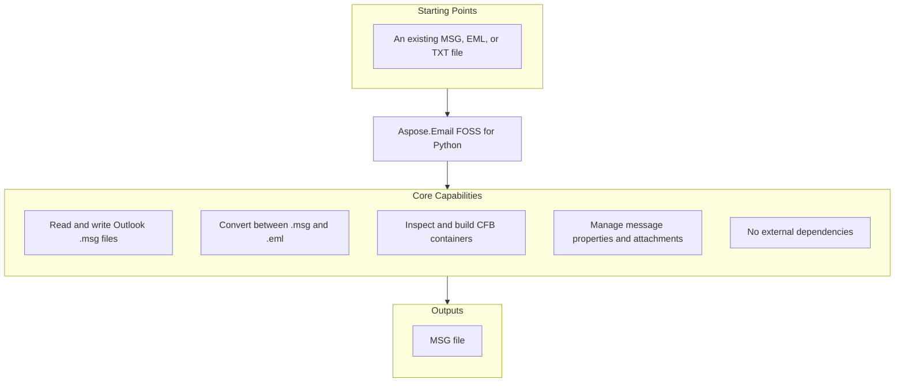

# Aspose.Email FOSS for Python

[](https://pypi.org/project/aspose-email-foss/)  [](LICENSE) [](https://github.com/aspose-email-foss/Aspose.Email-FOSS-for-Python/graphs/contributors)

[](https://products.aspose.org/email/python/)

Aspose.Email FOSS for Python provides native support for reading, writing, and converting Microsoft Outlook MSG files and EML files, enabling developers to process email data without external dependencies. It solves the problem of handling structured email formats like MSG and EML by offering a pure Python API that works with the CFB and MSG file formats directly. Users in enterprise environments, data migration workflows, and email archiving systems rely on this library to inspect, transform, and store email content programmatically. The library supports Python 3.10 and later under the MIT license, with version 26.3 as the current release.

## Navigation

- [At a Glance](#at-a-glance)
- [Key Capabilities](#key-capabilities)
- [Installation](#installation)
- [Dependencies](#dependencies)
- [Quick Start](#quick-start)
- [Additional Examples](#additional-examples)
- [API Reference](#api-reference)
- [Documentation & Resources](#documentation--resources)
- [Scope and Limitations](#scope-and-limitations)
- [Development and Testing](#development-and-testing)
- [License](#license)

## At a Glance



## Key Capabilities

- **Read and write Outlook .msg files.** Read and write Outlook `.msg` files using the `email_foss.msg.mapi_message` class for high-level message handling, and `email_foss.msg.MsgReader` and `email_foss.msg.MsgWriter` for low-level parsing and serialization.
- **Convert between .msg and .eml.** Convert between `.msg` and `.eml` by transforming `email_foss.msg.mapi_message` instances to and from Python's standard EmailMessage objects using `to_email_message` and `from_email_message` methods.
- **Inspect and build CFB containers.** Inspect and build CFB containers using `email_foss.cfb` classes such as `CFBReader`, `CFBWriter`, `CFBStorage`, and `CFBStream` to read, traverse, and serialize Compound File Binary structures.
- **Manage message properties and attachments.** Manage message properties and attachments through `MapiMessage`, `MapiAttachment`, and `MapiRecipient`, supporting property setting, recipient addition, attachment creation, and embedded-message handling.
- **No external dependencies.** No external dependencies are required beyond Python 3.10 or later, as the package depends on no external runtime libraries.

## Installation

Install the published package from PyPI (`aspose-email-foss`, version 26.3):

```bash
pip install aspose-email-foss
```

To work from a source checkout instead, install the clone with pip:

```bash
git clone https://github.com/aspose-email-foss/Aspose.Email-FOSS-for-Python.git
cd Aspose.Email-FOSS-for-Python
pip install .
```

Verify the install:

```bash
python -c "import aspose.email_foss"
```

The package declares `python_requires` as `>=3.10`.

## Dependencies

### Required Package Dependencies

No required third-party package dependencies; in `pyproject.toml`, no `project.dependencies` is declared.

### Native and System Requirements

- Requires Python 3.10 or later (`python_requires=">=3.10"` in `pyproject.toml`).

## Quick Start

Open an existing MSG file and read its subject using the `from_file` method on `MapiMessage`.

```python
from aspose.email_foss import msg

with msg.MapiMessage.from_file("sample.msg") as message:
    print(message.subject)
```

Create a new message from scratch, set sender properties, add a recipient and attachment, save it, then load and convert it to an email message for export.

```python
from aspose.email_foss import msg

message = msg.MapiMessage.create("Hello", "Body")
message.set_property(msg.PropertyId.SENDER_NAME, "Alice")
message.set_property(msg.PropertyId.SENDER_EMAIL_ADDRESS, "alice@example.com")
message.add_recipient("bob@example.com", display_name="Bob")
message.add_attachment("note.txt", b"abc", mime_type="text/plain")
message.save("hello.msg")

with msg.MapiMessage.from_file("hello.msg") as loaded:
    email_message = loaded.to_email_message()
    with open("hello.eml", "wb") as target:
        target.write(email_message.as_bytes())
```

## Additional Examples

Create, read, and convert email messages and structured storage with Aspose.Email FOSS for Python.

### Convert MSG to EML using member `from_file`, `to_email_message`, and `as_bytes`

```python
from aspose.email_foss import msg

with msg.MapiMessage.from_file("message.msg") as message:
    email_message = message.to_email_message()

with open("message.eml", "wb") as target:
    target.write(email_message.as_bytes())
```

<details>
<summary>View Additional Examples</summary>

### Convert EML to MSG using member `from_email_message` and save

```python
from email import policy
from email.parser import BytesParser

from aspose.email_foss import msg

with open("message.eml", "rb") as source:
    email_message = BytesParser(policy=policy.default).parse(source)

message = msg.MapiMessage.from_email_message(email_message)
message.save("message.msg")
```

### Create and read CFB structured storage using member `add_stream`, `resolve_path`, and `get_stream_data`

```python
from aspose.email_foss.cfb import CFBDocument, CFBReader, CFBStorage, CFBStream, CFBWriter, ROOT_ENTRY_NAME

root = CFBStorage(ROOT_ENTRY_NAME)
root.add_stream(CFBStream("Summary", b"hello"))

data = CFBWriter.to_bytes(CFBDocument(root=root, major_version=3))
reader = CFBReader(data)
entry = reader.resolve_path(["Summary"])
print(reader.get_stream_data(entry.stream_id))
```


Full runnable examples are available under [`examples/`](examples/) (see
[`examples/README.md`](examples/README.md) for a task-to-script index).

</details>

## API Reference

Aspose.Email FOSS for Python provides high-level and low-level APIs for working with MSG and CFB formats. The high-level MSG API centers on `email_foss.msg.mapi_message` for creating, editing, and converting messages, while the low-level MSG API uses `email_foss.msg.MsgReader` and `email_foss.msg.MsgWriter` for direct property-stream access, and the low-level CFB API uses `email_foss.cfb.CFBReader` and `email_foss.cfb.CFBWriter` for raw Compound File Binary container access.

The verified public surface has 30 types.

<details>
<summary>View the Complete Public API Surface</summary>

### Core API

| Class | Description |
| --- | --- |
| `CFBDocument` | Mutable Compound File Binary (CFB) document description. |
| `CFBError` | Raised for malformed or unsupported Compound File Binary (CFB) content. |
| `CFBReader` | Reusable reader for Compound File Binary (CFB) containers. |
| `CFBStorage` | Mutable storage node used by the CFB writer. |
| `CFBStream` | Mutable stream node used by the CFB writer. |
| `CFBWriter` | Deterministic serializer for Compound File Binary (CFB) containers. |
| `DirectoryEntry` | Fixed-size directory record for one storage/stream object and its tree links. |
| `Header` | Header record at file offset 0 defining Compound File Binary (CFB) geometry and allocation chain entry points. |
| `MapiAttachment` | Mutable attachment object. |
| `MapiMessage` | Mutable high-level MSG object with MSG and EmailMessage conversion support. |
| `MapiNamedProperty` | Identifier for a named MAPI property. |
| `MapiProperty` | Logical MAPI property with optional named-property identity. |
| `MapiRecipient` | Mutable recipient object. |
| `MsgDocument` | Mutable MSG document model that can be serialized through the CFB writer. |
| `MsgError` | Raised for malformed or unsupported MSG structures. |
| `MsgReader` | Normative top-level MSG containment and stream requirements for container traversal. |
| `MsgStorage` | Mutable MSG storage node with role classification and parsed property-stream metadata. |
| `MsgStream` | Mutable MSG stream node with raw bytes and CFB metadata. |
| `MsgWriter` | Serializer that writes a MsgDocument into a CFB-backed .msg payload. |
| `PropertyEntryFixedLength` | Fixed-length property stream entry containing property tag, flags, and inline 8-byte value payload. |
| `PropertyStreamHeaderSubobject` | Property stream header used in recipient and attachment storages, containing only reserved bytes. |
| `PropertyStreamHeaderTopLevel` | Top-level property stream header containing next-id counters and counts for recipients and attachments. |
| `StorageLayout` | Naming and containment rules for recipient, attachment, embedded message, and nameid storages. |
| `MapiPropertyCollection` | The MapiPropertyCollection class represents a collection of MAPI properties associated with a MapiMessage object, providing methods to add, get, set, remove, and iterate over its properties. |

#### Enumerations

| Enumeration | Description |
| --- | --- |
| `DirectoryColorFlag` | Stores the red-black tree color used by directory sibling links. |
| `DirectoryObjectType` | Classifies the directory entry payload as unallocated, storage, stream, or root storage. |
| `SectorMarker` | Special FAT marker values reserved for sector allocation metadata. |
| `CommonMessagePropertyId` | Common MAPI property identifiers used by the MSG reader/writer for core message semantics. |
| `PropertyId` | Common property identifiers paired with their default MAPI property types. |
| `PropertyTypeCode` | MAPI property type codes used in MSG property tags and value stream names. |

#### Detailed Member Reference

### mapi_message

The `email_foss.msg.mapi_message` class provides methods to create, load, and convert email messages, including `from_file`, `to_bytes`, `set_property`, `add_recipient`, and `add_attachment`, and exposes properties such as subject, body, recipients, and attachments.

### MsgReader

The `email_foss.msg.MsgReader` class enables low-level reading of MSG files by parsing property streams and iterating over storages, with methods including `from_file`, `iter_top_level_fixed_length_properties`, `iter_recipient_storages`, `iter_attachment_storages`, `parse_message_property_stream`, and properties such as `cfb_reader`, `storage_layout`, strict, and `validation_issues`.

- `cfb_reader`: Defined as `def cfb_reader(self) -> CFBReader`.
- `close`: Defined as `def close(self) -> None`.
- `from_file`: Defined as `def from_file(cls, path: Path / str, *, strict: bool=False) -> 'MsgReader'`.
- `iter_attachment_storages`: Defined as `def iter_attachment_storages(self) -> Iterator[DirectoryEntry]`.
- `iter_recipient_storages`: Defined as `def iter_recipient_storages(self) -> Iterator[DirectoryEntry]`.
- `iter_top_level_fixed_length_properties`: Defined as `def iter_top_level_fixed_length_properties(self) -> Iterator[PropertyEntryFixedLength]`.
- `parse_message_property_stream`: Read the property stream in the top level or an embedded-message storage.
- `parse_subobject_property_stream`: Read the property stream in recipient/attachment storage and decode fixed-length entries.
- `parse_subobject_property_stream_data`: Decode recipient/attachment property stream header and fixed-length entries.
- `parse_top_level_property_stream`: Decode top-level property stream header and fixed-length entries.
- `storage_layout`: Defined as `def storage_layout(self) -> StorageLayout`.
- `strict`: Defined as `def strict(self) -> bool`.
- `validation_issues`: Defined as `def validation_issues(self) -> Tuple[str, ...]`.

### MsgWriter

The `email_foss.msg.MsgWriter` class provides class methods to serialize a `MsgDocument` into bytes or a file, using `to_bytes` and `write_file`.

- `to_bytes`: Defined as `def to_bytes(cls, document: MsgDocument) -> bytes`.
- `write_file`: Defined as `def write_file(cls, document: MsgDocument, path: Path / str) -> None`.

### CFBReader

The `email_foss.cfb.CFBReader` class provides low-level reading of Compound File Binary containers, with methods including `from_file`, `get_entry`, `get_stream_data`, `iter_storages`, `iter_streams`, `iter_children`, `find_child_by_name`, `resolve_path`, and properties such as `data_size`, `directory_entry_count`, `fat_sector_count`, `file_size`, `major_version`, `mini_sector_size`, and `sector_size`.

- `close`: Defined as `def close(self) -> None`.
- `data_size`: Defined as `def data_size(self) -> int`.
- `directory_entry_count`: Defined as `def directory_entry_count(self) -> int`.
- `fat_sector_count`: Defined as `def fat_sector_count(self) -> int`.
- `file_size`: Defined as `def file_size(self) -> int`.
- `find_child_by_name`: Defined as `def find_child_by_name(self, storage_stream_id: StreamId, name: str) -> Optional[DirectoryEntry]`.
- `from_file`: Defined as `def from_file(cls, path: Path / str) -> 'CFBReader'`.
- `get_entry`: Defined as `def get_entry(self, stream_id: StreamId) -> DirectoryEntry`.
- `get_stream_data`: Defined as `def get_stream_data(self, stream_id: StreamId) -> bytes`.
- `iter_children`: Defined as `def iter_children(self, storage_stream_id: StreamId) -> Iterator[DirectoryEntry]`.
- `iter_storages`: Defined as `def iter_storages(self) -> Iterator[DirectoryEntry]`.
- `iter_streams`: Defined as `def iter_streams(self) -> Iterator[DirectoryEntry]`.
- `iter_tree`: Yield a depth-first tree traversal as (depth, entry) tuples.
- `major_version`: Defined as `def major_version(self) -> int`.
- `materialized_stream_count`: Defined as `def materialized_stream_count(self) -> int`.
- `mini_sector_size`: Defined as `def mini_sector_size(self) -> int`.
- `resolve_path`: Resolve a storage/stream path by exact directory-entry names.
- `sector_size`: Defined as `def sector_size(self) -> int`.

### CFBWriter

The `email_foss.cfb.CFBWriter` class provides class methods to serialize a `CFBDocument` into bytes or a file, using `to_bytes` and `write_file`.

- `to_bytes`: Defined as `def to_bytes(cls, document: CFBDocument) -> bytes`.
- `write_file`: Defined as `def write_file(cls, document: CFBDocument, path: Path / str) -> None`.

### MapiAttachment

The `email_foss.msg.MapiAttachment` class supports creating and inspecting attachments, with methods including `from_bytes`, `from_embedded_message`, and `set_property`, and properties such as `embedded_storage_name`, `storage_name`, `is_embedded_message`, and `is_storage_attachment`.

- `embedded_storage_name`: Defined as `def embedded_storage_name(self) -> str / None`.
- `from_bytes`: Defined as `def from_bytes(cls, filename: str, data: bytes, *, mime_type: str / None=None, content_id: str / None=None) -> 'MapiAttachment'`.
- `from_embedded_message`: Defined as `def from_embedded_message(cls, message: 'MapiMessage', *, filename: str / None=None, mime_type: str / None=None) -> 'MapiAttachment'`.
- `is_embedded_message`: Defined as `def is_embedded_message(self) -> bool`.
- `is_storage_attachment`: Defined as `def is_storage_attachment(self) -> bool`.
- `set_property`: Defined as `def set_property(self, property_id: int / CommonMessagePropertyId / PropertyId, property_type_or_value: int / PropertyTypeCode / Any, value: Any=_MISSING, *, flags: int=DEFAULT_PROPERTY_FLAGS) -> MapiProperty`.
- `storage_name`: Defined as `def storage_name(self) -> str / None`.

### MapiRecipient

The `email_foss.msg.MapiRecipient` class supports inspecting and setting recipient properties, with methods including `set_property` and properties such as `display_name` and properties.

- `set_property`: Defined as `def set_property(self, property_id: int / CommonMessagePropertyId / PropertyId, property_type_or_value: int / PropertyTypeCode / Any, value: Any=_MISSING, *, flags: int=DEFAULT_PROPERTY_FLAGS) -> MapiProperty`.

### MsgDocument

The `email_foss.msg.MsgDocument` class represents a parsed MSG structure, with methods including `from_reader`, `from_file`, and `to_cfb_document`, and properties such as root and `major_version`.

- `from_file`: Defined as `def from_file(cls, path: Path / str, *, strict: bool=False) -> 'MsgDocument'`.
- `from_reader`: Defined as `def from_reader(cls, reader: MsgReader) -> 'MsgDocument'`.
- `to_cfb_document`: Defined as `def to_cfb_document(self) -> CFBDocument`.

### CFBDocument

The `email_foss.cfb.CFBDocument` class represents a parsed Compound File Binary structure, with methods including `from_file` and `from_reader`, and properties such as root and `major_version`.

- `from_file`: Defined as `def from_file(cls, path: Path / str) -> 'CFBDocument'`.
- `from_reader`: Defined as `def from_reader(cls, reader: CFBReader) -> 'CFBDocument'`.

### property_id

The `email_foss.msg.property_id` enumeration provides common MAPI property identifiers such as SENDER_EMAIL_ADDRESS and SENDER_NAME.

### cfb

The `email_foss.cfb` module provides low-level APIs for reading and writing Compound File Binary containers, including `CFBReader`, `CFBWriter`, and `CFBDocument`.

### msg

The `email_foss.msg` module provides high-level and low-level APIs for reading and writing MSG files, including `MapiMessage`, `MsgReader`, `MsgWriter`, `MsgDocument`, `MapiAttachment`, `MapiRecipient`, and `property_id`.


- `CommonMessagePropertyId` / `PropertyId` — common MAPI property identifiers (`SUBJECT`,
  `SENDER_NAME`, `SENDER_EMAIL_ADDRESS`, `ATTACH_FILENAME`, `MESSAGE_DELIVERY_TIME`, and more)
- `PropertyTypeCode` — MAPI property type codes (`PTYP_STRING`, `PTYP_BINARY`, `PTYP_INTEGER32`,
  `PTYP_TIME`, and other MAPI property type codes, including their `PTYP_MULTIPLE_*` variants)
- `DirectoryObjectType`, `DirectoryColorFlag`, `SectorMarker`

- `CFBError`
- `MsgError`

</details>

## Documentation & Resources

- **[Getting started guide](https://docs.aspose.org/email/python/)** — The getting started guide covers installation, step-by-step walkthroughs, and feature introductions for using Aspose.Email FOSS for Python.
- **[How-to guides & FAQ](https://kb.aspose.org/email/python/)** — The how-to guides and FAQ provide task-focused answers for common CFB, MSG, and EML processing questions.
- **[Full API reference](https://reference.aspose.org/email/python/)** — The full API reference offers a complete, browsable reference for all 30 public types in Aspose.Email FOSS for Python. It covers all 30 verified public types; the [API Reference](#api-reference) section above covers the essentials.
- Found a bug or have a feature request? [Open an issue](https://github.com/aspose-email-foss/Aspose.Email-FOSS-for-Python/issues).

## Scope and Limitations

Aspose.Email FOSS for Python provides programmatic access to local Microsoft Outlook MSG and CFB files, supports conversion to and from EML via Python's built-in email package, and exposes MAPI message properties and attachments through the `MapiMessage` class.

- The library does not support connecting to mail servers and lacks IMAP, SMTP, or POP3 functionality.
- Transport Neutral Encapsulation Format files are not parsed or generated.
- There is no dedicated calendar or appointment API, although calendar-specific MAPI properties can still be accessed generically through `set_property()` and `get_property_value()`.
- Direct `.eml` file parsing is not implemented; EML support relies on `MapiMessage.from_email_message`() and `to_email_message()` combined with Python's `email.parser`.

These limitations don't apply to [Aspose.Email for Python — Enterprise Edition](https://products.aspose.com/email/python-net/). The commercial Aspose.Email for Python — commercial edition extends this open-source offering with additional capabilities for handling complex email formats and enterprise-scale processing, though the specific enhancements are not detailed in the accepted facts.

## Development and Testing

Install the package in editable mode and run the test suite using the provided test assets, then build and validate distributable packages with the standard Python packaging tools.

The suite covers 2 test files under `tests/`. Releases run through the [release workflow](.github/workflows/release.yml).

```bash
pip install -e .
python -m unittest discover -s tests -v
```

```bash
python -m build
python -m twine check --strict dist/*
```

## License

This project is licensed under the [MIT License](LICENSE). The MIT License permits use, copying, modification, distribution, sublicensing, and commercial use, provided its copyright and permission notice are retained. The software is provided without warranty.
