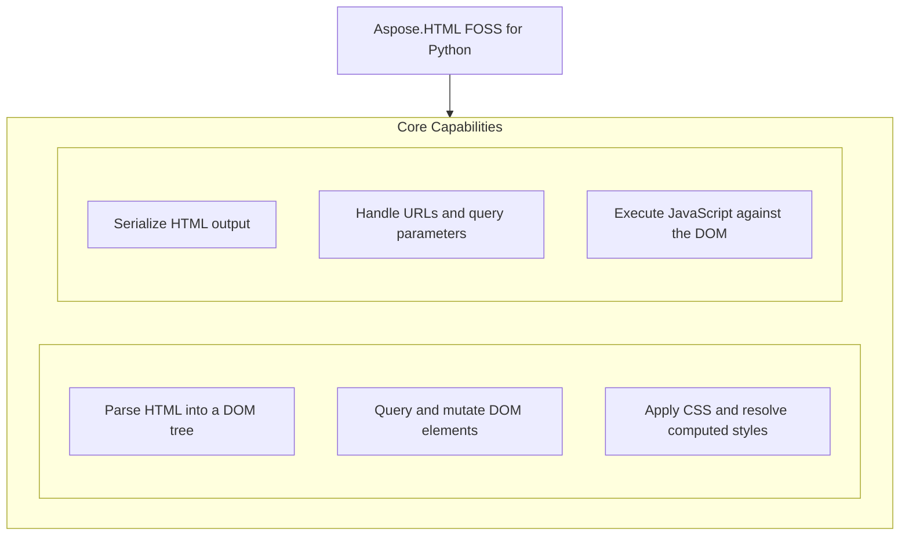

# Aspose.HTML FOSS for Python

 [](LICENSE) [](https://github.com/aspose-html-foss/Aspose.HTML-FOSS-for-Python/graphs/contributors)

[](https://products.aspose.org/html/python/)

Aspose.HTML FOSS for Python provides a Python library for parsing, manipulating, and serializing HTML documents using a DOM API that mirrors web standards. It enables developers to load HTML from strings or files, query and modify elements, apply `CSS` styles, and export content as serialized HTML. Users can inspect computed styles, match elements with `CSS` selectors, and tokenize raw HTML for low-level processing. The library supports Python 3.10 and higher, is distributed under the MIT license, and integrates with the optional QuickJS engine for JavaScript execution when needed.

## Navigation

- [At a Glance](#at-a-glance)
- [Key Capabilities](#key-capabilities)
- [Installation](#installation)
- [Dependencies](#dependencies)
- [Quick Start](#quick-start)
- [Additional Examples](#additional-examples)
- [API Reference](#api-reference)
- [Documentation & Resources](#documentation--resources)
- [Scope and Limitations](#scope-and-limitations)
- [Development and Testing](#development-and-testing)
- [License](#license)

## At a Glance



## Key Capabilities

- **Parse HTML into a DOM tree.** Parse HTML strings, bytes, fragments, and files into a DOM document with `HTMLDocument.parse()`, `HTMLDocument.parse_fragment()`, and `HTMLDocument.load()`; the lower-level `Tokenizer` and `TreeBuilder` classes implement the WHATWG tokenization and tree-construction algorithms directly, for callers who need that level of control.
- **Query and mutate DOM elements.** Build, inspect, and mutate DOM trees — create and update nodes programmatically with `Document.create_element()` and `append_child()`; read and write element attributes, classes, datasets, inline styles, and text content; and query documents by ID, tag name, class name, and selector-oriented helpers such as `get_element_by_id()`, `get_elements_by_tag_name()`, `TreeWalker`, `NodeIterator`, and `Range`.
- **Apply CSS and resolve computed styles.** Match `CSS` selectors and stylesheets against elements and resolve the cascade — specificity, inline-vs-author rules, !important, and inheritance — with `Element.get_computed_style()`; the CSSOM surface (`CSSStyleSheet`, `CSSStyleRule`, `CSSMediaRule`, and related rule types) models stylesheets structurally.
- **Serialize HTML output.** Serialize complete documents, fragments, and individual elements back to an HTML string with the `serialise()` function or `XMLSerializer`.
- **Handle URLs and query parameters.** Validate and manipulate URLs with `URL`, read and edit query strings with `URLSearchParams`, and detect byte-stream character encodings (BOM and content sniffing) with `detect_encoding()`.
- **Execute JavaScript against the DOM.** Execute JavaScript against a parsed DOM through `JSContext`, an optional QuickJS-backed bridge exposing DOM read-only proxies to script code; requires the js extra.

## Installation

`aspose-html-foss` is not yet published on PyPI, and no build or install command succeeds for this revision; work from the source checkout instead, verified against this revision:

```bash
git clone https://github.com/aspose-html-foss/Aspose.HTML-FOSS-for-Python.git
cd Aspose.HTML-FOSS-for-Python
export PYTHONPATH="src:.:$PYTHONPATH"
```

The package declares `python_requires` as `>=3.10`.

## Dependencies

### Required Package Dependencies

- `<145`
- `skia-python>=87.0`

### Optional Dependencies

- `quickjs>=1.19,<2` (extra `js`)

### Native and System Requirements

- Requires Python 3.10 or later (`python_requires=">=3.10"` in `pyproject.toml`).

### Development Dependencies

- `pytest>=8` (extra `test`)

## Quick Start

Parse an HTML string, locate an element by its identifier, create a new paragraph, append it to the container, and serialize the updated subtree.

```python
from aspose_html import HTMLDocument, serialise

document = HTMLDocument.parse("<main id='content'><h1>Hello</h1></main>")
content = document.get_element_by_id("content")

paragraph = document.create_element("p")
paragraph.text_content = "Updated through the DOM API."
content.append_child(paragraph)

print(serialise(content))
```

Build a DOM tree, attach an external `CSS` style sheet, and inspect the computed style of an element to verify the applied rule.

```python
from aspose_html.dom import Document
from aspose_html.cssom import CSSStyleSheet

document = Document()
element = document.create_element("div")
element.set_attribute("class", "foo")
element.set_attribute("id", "bar")
document.append_child(element)

sheet = CSSStyleSheet()
sheet.replace_sync(".foo { color: red } #bar { color: blue }")
document.attach_style_sheet(sheet)

style = element.get_computed_style()
print(style.get_property_value("color"))  # "blue"
```

## Additional Examples

The aspose-html-foss library supports `URL` manipulation, DOM parsing, encoding detection, and tokenization workflows.

### Modify `URL` search parameters and print the updated `URL`

```python
from aspose_html import URL

url = URL("https://example.com/articles?category=html")
url.search_params.set("page", "2")

print(str(url))
```

<details>
<summary>View Additional Examples</summary>

### Parse an HTML string and extract heading text content

```python
from aspose_html import HTMLDocument

document = HTMLDocument.parse("<article><h1>News</h1><p>Hello</p></article>")
heading = document.get_elements_by_tag_name("h1").item(0)

print(heading.text_content)
```

### Detect character encoding and text from byte input

```python
from aspose_html.encoding.detection import detect_encoding

result = detect_encoding(b"\xef\xbb\xbf<p>x</p>")
print(result.encoding)
print(result.confidence)
print(result.text)
```

### Tokenize HTML and inspect the first tag name

```python
from aspose_html.tokenizer import Tokenizer, TokenizerState

tokenizer = Tokenizer("<p>Hello</p>")
tokens = list(tokenizer.tokenize())
print(tokens[0].tag_name)  # "p"
```


Runnable scripts are available in the [`examples`](examples/) directory.

</details>

## API Reference

Aspose.HTML FOSS for Python provides the `aspose_html.HTMLDocument` class as the primary entry point for parsing and loading HTML documents, offering methods such as parse, `parse_fragment`, and load. The library organizes its functionality across modules including `aspose_html.dom` for DOM manipulation, `aspose_html.cssom` for CSSOM support, and supporting modules for `URL` handling, encoding detection, JavaScript execution, tokenization, serialization, and DOM traversal.

The verified public surface has 303 types.

<details>
<summary>View the Complete Public API Surface</summary>

### Core API

| Class | Description |
| --- | --- |
| `aspose_html.DOMParser` | The DOMParser class provides a method to parse HTML or XML strings into a document object for further manipulation. |
| `HTMLDocument` | Top-level entry point for parsing HTML into a Document tree. |
| `aspose_html.URL` | The URL class represents a uniform resource locator and provides properties and methods to work with URL components. |
| `aspose_html.URLParseError` | The URLParseError class represents an error that occurs when parsing a URL fails due to invalid syntax. |
| `aspose_html.URLSearchParams` | The URLSearchParams class provides methods to work with the query string of a URL, including adding, modifying, and deleting parameters. |
| `aspose_html.XMLSerializer` | The XMLSerializer class converts a DOM tree back into an XML or HTML string representation. |
| `CSS` | Namespace class for CSS static utilities (CSS Conditional Rules §6). |
| `CSSCounterStyleRule` | The CSSCounterStyleRule class represents a @counter-style rule in a CSS stylesheet, defining custom counter styles. |
| `CSSFontFaceRule` | The CSSFontFaceRule class represents a @font-face rule in a CSS stylesheet, used to define custom fonts. |
| `CSSImportRule` | The CSSImportRule class represents a @import rule in a CSS stylesheet, used to import external stylesheets. |
| `CSSKeyframeRule` | The CSSKeyframeRule class represents a single keyframe rule within a CSS animation, defining styles at a specific time. |
| `CSSKeyframesRule` | The CSSKeyframesRule class represents a @keyframes rule in a CSS stylesheet, grouping keyframe rules for an animation. |
| `CSSLayerBlockRule` | The CSSLayerBlockRule class represents a @layer block rule in a CSS stylesheet, used to define CSS cascade layers. |
| `CSSLayerStatementRule` | The CSSLayerStatementRule class represents a @layer statement rule in a CSS stylesheet, used to declare cascade layers. |
| `CSSMediaRule` | The CSSMediaRule class represents a @media rule in a CSS stylesheet, used to apply styles conditionally based on media features. |
| `CSSNamespaceRule` | The CSSNamespaceRule class represents a @namespace rule in a CSS stylesheet, used to define XML namespaces. |
| `CSSPageRule` | The CSSPageRule class represents a @page rule in a CSS stylesheet, used to define page-specific styles for paged media. |
| `CSSPropertyRule` | The CSSPropertyRule class represents a @property rule in a CSS stylesheet, used to register custom CSS properties. |
| `CSSRule` | The CSSRule class is the base interface for all CSS rules, providing common properties and methods shared across rule types. |
| `CSSRuleList` | The CSSRuleList class represents an ordered collection of CSSRule objects, typically returned when accessing rules in a stylesheet. |
| `CSSStyleRule` | The CSSStyleRule class represents a style rule in a CSS stylesheet, consisting of a selector and a declaration block. |
| `CSSStyleSheet` | The CSSStyleSheet class represents a CSS stylesheet, providing access to its rules and metadata. |
| `CSSSupportsRule` | The CSSSupportsRule class represents a @supports rule in a CSS stylesheet, used to apply styles conditionally based on feature support. |
| `AbortController` | The AbortController class provides a way to abort one or more asynchronous operations, such as fetch requests. |
| `AbortSignal` | The AbortSignal class represents a signal object that communicates whether an operation has been aborted. |
| `AbstractRange` | The AbstractRange class is the base interface for DOM ranges, representing a fragment of a document with a start and end point. |
| `Attr` | The Attr class represents an attribute on an HTML or XML element, providing access to its name and value. |
| `BarProp` | The BarProp class provides access to the visibility state of browser interface elements such as the address bar or status bar. |
| `BroadcastChannel` | The BroadcastChannel class enables communication between different browsing contexts, such as windows or tabs, using message passing. |
| `CDATASection` | The CDATASection class represents a CDATA section in an XML document, preserving text content without parsing. |
| `CSSStyleDeclaration` | The CSSStyleDeclaration class represents a collection of CSS properties and their values, typically associated with an element or rule. |
| `CharacterData` | The CharacterData class is the base interface for text nodes and comment nodes, providing methods to manipulate character data. |
| `Comment` | The Comment class represents an HTML or XML comment node, containing comment text without rendering. |
| `ComputedStyleDeclaration` | The ComputedStyleDeclaration class provides read-only access to the computed CSS values for an element after style resolution. |
| `Console` | The Console class provides methods for logging messages to the developer console, such as log, warn, and error. |
| `Crypto` | The Crypto class provides access to cryptographic operations, such as generating random values or signing data. |
| `CustomElementRegistry` | The CustomElementRegistry class allows registration and management of custom element definitions in the DOM. |
| `CustomEvent` | The CustomEvent class represents a user-defined event that can carry custom data and be dispatched on DOM nodes. |
| `DOMConfiguration` | The DOMConfiguration class provides a way to configure DOM features and options for document processing. |
| `DOMException` | The DOMException class represents an error that occurs during DOM operations, with a code and message describing the issue. |
| `DOMImplementation` | The DOMImplementation class provides methods to create and manage DOM documents, including support for different document types. |
| `dom.DOMParser` | The DOMParser class provides a method to parse HTML or XML strings into a document object for further manipulation. |
| `DOMRect` | DOMRect represents a rectangle defined by its top-left corner coordinates and its width and height. |
| `DOMRectList` | DOMRectList provides an ordered collection of DOMRect objects. |
| `DOMStringMap` | DOMStringMap represents a collection of name-value string pairs accessed via custom data attributes. |
| `DOMTokenList` | DOMTokenList represents a set of space-separated tokens, typically used for HTML class attributes. |
| `DataCloneError` | DataCloneError is raised when an object cannot be cloned during structured clone operations. |
| `Document` | Document represents the entire HTML or XML document and serves as the entry point to the document's content. |
| `DocumentFragment` | DocumentFragment is a lightweight container that holds a portion of the document tree for efficient manipulation. |
| `DocumentPosition` | DocumentPosition defines constants that describe the positional relationship between two nodes in a document. |
| `DocumentType` | DocumentType represents the document type declaration, including its name, public identifier, and system identifier. |
| `Element` | Element is the base class for all HTML elements, providing common properties and methods for node manipulation. |
| `ErrorEvent` | ErrorEvent represents events that occur due to errors during script execution or resource loading. |
| `Event` | Event is the base class for all DOM events, providing information about the event type and target. |
| `EventTarget` | EventTarget is the base class for objects that can receive events and have event listeners attached. |
| `FocusEvent` | FocusEvent represents events related to element focus changes, such as gaining or losing focus. |
| `FormData` | FormData provides a way to construct a set of key-value pairs representing form fields and their values. |
| `dom.HTMLAddressElement` | HTMLAddressElement represents a container for contact information related to the document or article. |
| `dom.HTMLAnchorElement` | HTMLAnchorElement represents a hyperlink element used to link to other resources. |
| `dom.HTMLAreaElement` | HTMLAreaElement represents a clickable area defined within an image map. |
| `dom.HTMLArticleElement` | HTMLArticleElement represents a self-contained piece of content that can be distributed independently. |
| `dom.HTMLAsideElement` | HTMLAsideElement represents content that is tangentially related to the main content. |
| `dom.HTMLAudioElement` | HTMLAudioElement represents an element used to embed audio content in a document. |
| `dom.HTMLBRElement` | HTMLBRElement represents an element that inserts a line break in text content. |
| `dom.HTMLBaseElement` | HTMLBaseElement represents an element that specifies the base URL for relative URLs in the document. |
| `dom.HTMLBodyElement` | HTMLBodyElement represents the element that contains the visible content of the document. |
| `dom.HTMLButtonElement` | HTMLButtonElement represents a clickable button element used in forms. |
| `dom.HTMLCanvasElement` | HTMLCanvasElement represents an element used for rendering dynamic graphics via scripting. |
| `HTMLCollection` | HTMLCollection provides a live, ordered collection of HTML elements. |
| `dom.HTMLDListElement` | HTMLDListElement represents a container for a list of terms and their associated descriptions. |
| `dom.HTMLDataElement` | HTMLDataElement represents an element that provides a machine-readable translation of its content. |
| `dom.HTMLDataListElement` | HTMLDataListElement represents a collection of pre-defined options for input elements. |
| `dom.HTMLDetailsElement` | HTMLDetailsElement represents a disclosure widget that can be expanded or collapsed. |
| `dom.HTMLDialogElement` | HTMLDialogElement represents a dialog box or subwindow that can be shown or hidden. |
| `dom.HTMLDivElement` | HTMLDivElement represents a generic container for flow content. |
| `HTMLElement` | HTMLElement is the base class for all HTML elements, providing common properties and methods. |
| `dom.HTMLEmbedElement` | HTMLEmbedElement represents an element used to embed external content such as plugins. |
| `dom.HTMLFieldSetElement` | HTMLFieldSetElement represents a container used to group related form controls. |
| `dom.HTMLFigCaptionElement` | HTMLFigCaptionElement represents a caption or legend for a figure element. |
| `dom.HTMLFigureElement` | HTMLFigureElement represents a self-contained content element such as an illustration. |
| `dom.HTMLFooterElement` | HTMLFooterElement represents the footer for a document or section. |
| `dom.HTMLFormElement` | HTMLFormElement represents a form element used to collect user input. |
| `dom.HTMLHRElement` | The HTMLHRElement class represents an HTML hr element, which defines a thematic break or horizontal rule in a document. |
| `dom.HTMLHeadElement` | The HTMLHeadElement class represents an HTML head element, which contains machine-readable document metadata such as title and links to stylesheets. |
| `dom.HTMLHeaderElement` | The HTMLHeaderElement class represents an HTML header element, which typically contains introductory or navigational content for a page or section. |
| `dom.HTMLHeadingElement` | The HTMLHeadingElement class represents an HTML heading element, such as h1 through h6, used to define section headings in a document. |
| `dom.HTMLHtmlElement` | The HTMLHtmlElement class represents the root HTML element of a document, serving as the container for all other HTML elements. |
| `dom.HTMLIFrameElement` | The HTMLIFrameElement class represents an HTML iframe element, which embeds another document within the current document as a nested browsing context. |
| `dom.HTMLImageElement` | The HTMLImageElement class represents an HTML img element, which embeds an image into the document. |
| `dom.HTMLInputElement` | The HTMLInputElement class represents an HTML input element, which creates interactive controls for web-based forms. |
| `dom.HTMLLIElement` | The HTMLLIElement class represents an HTML li element, which defines a list item within ol, ul, or menu elements. |
| `dom.HTMLLabelElement` | The HTMLLabelElement class represents an HTML label element, which defines a caption for a form control such as input or select. |
| `dom.HTMLLegendElement` | The HTMLLegendElement class represents an HTML legend element, which provides a caption for a fieldset element in a form. |
| `dom.HTMLLinkElement` | The HTMLLinkElement class represents an HTML link element, which specifies relationships between the current document and an external resource, such as a stylesheet. |
| `dom.HTMLMainElement` | The HTMLMainElement class represents an HTML main element, which contains the dominant content of the document. |
| `dom.HTMLMapElement` | The HTMLMapElement class represents an HTML map element, which defines a client-side image map with clickable areas. |
| `dom.HTMLMarkElement` | The HTMLMarkElement class represents an HTML mark element, which highlights text for reference or notation purposes. |
| `dom.HTMLMediaElement` | The HTMLMediaElement class represents an HTML media element, such as audio or video, providing controls and playback capabilities. |
| `dom.HTMLMenuElement` | The HTMLMenuElement class represents an HTML menu element, which defines a list of commands or a context menu. |
| `dom.HTMLMetaElement` | The HTMLMetaElement class represents an HTML meta element, which provides metadata about the document such as character encoding or viewport settings. |
| `dom.HTMLMeterElement` | The HTMLMeterElement class represents an HTML meter element, which displays a scalar measurement within a known range. |
| `dom.HTMLModElement` | The HTMLModElement class represents an HTML mod element, such as ins or del, indicating added or deleted text. |
| `dom.HTMLNavElement` | The HTMLNavElement class represents an HTML nav element, which defines a section of navigation links. |
| `dom.HTMLNoScriptElement` | The HTMLNoScriptElement class represents an HTML noscript element, which provides alternative content for users whose browsers do not support scripts. |
| `dom.HTMLOListElement` | The HTMLOListElement class represents an HTML ol element, which defines an ordered list of items. |
| `dom.HTMLObjectElement` | The HTMLObjectElement class represents an HTML object element, which embeds an external resource such as an image, nested browsing context, or plugin. |
| `dom.HTMLOptGroupElement` | The HTMLOptGroupElement class represents an HTML optgroup element, which groups related options within a select element. |
| `dom.HTMLOptionElement` | The HTMLOptionElement class represents an HTML option element, which defines an item in a select element or datalist. |
| `HTMLOptionsCollection` | The HTMLOptionsCollection class represents a collection of option elements, providing indexed access and manipulation methods. |
| `dom.HTMLOutputElement` | The HTMLOutputElement class represents an HTML output element, which displays the result of a calculation or user action. |
| `dom.HTMLParagraphElement` | The HTMLParagraphElement class represents an HTML p element, which defines a paragraph of text. |
| `dom.HTMLParamElement` | The HTMLParamElement class represents an HTML param element, which defines parameters for an object element. |
| `dom.HTMLPictureElement` | The HTMLPictureElement class represents an HTML picture element, which provides multiple image sources for responsive images. |
| `dom.HTMLPreElement` | The HTMLPreElement class represents an HTML pre element, which displays text in a fixed-width font while preserving whitespace. |
| `dom.HTMLProgressElement` | The HTMLProgressElement class represents an HTML progress element, which displays the completion progress of a task. |
| `dom.HTMLQuoteElement` | The HTMLQuoteElement class represents an HTML quote element, such as q or blockquote, used to denote quoted text. |
| `dom.HTMLRubyElement` | The HTMLRubyElement class represents an HTML ruby element, which defines ruby annotations for East Asian typography. |
| `dom.HTMLScriptElement` | The HTMLScriptElement class represents an HTML script element, which embeds or references executable script code. |
| `dom.HTMLSectionElement` | The HTMLSectionElement class represents an HTML section element, which defines a thematic grouping of content. |
| `dom.HTMLSelectElement` | The HTMLSelectElement class represents an HTML select element, which creates a drop-down list for user selection. |
| `dom.HTMLSmallElement` | The HTMLSmallElement class represents an HTML small element, which defines side comments or small print. |
| `dom.HTMLSourceElement` | The HTMLSourceElement class represents an HTML source element, which specifies multiple media resources for audio or video elements. |
| `dom.HTMLSpanElement` | The HTMLSpanElement class represents an HTML span element, a generic inline container for phrasing content that does not inherently represent anything. |
| `dom.HTMLStyleElement` | The HTMLStyleElement class represents an HTML style element, used to contain style information for a document or part of a document. |
| `dom.HTMLSummaryElement` | The HTMLSummaryElement class represents an HTML summary element, typically used as a caption for a details element. |
| `dom.HTMLTableCaptionElement` | The HTMLTableCaptionElement class represents an HTML table caption element, providing a title or description for a table. |
| `dom.HTMLTableCellElement` | The HTMLTableCellElement class represents an HTML table cell element, either a data cell or a header cell within a table row. |
| `dom.HTMLTableColElement` | The HTMLTableColElement class represents an HTML table column element, used to define column properties for a table. |
| `dom.HTMLTableElement` | The HTMLTableElement class represents an HTML table element, providing methods to create and manipulate table rows and cells. |
| `dom.HTMLTableRowElement` | The HTMLTableRowElement class represents an HTML table row element, containing a set of table cells. |
| `dom.HTMLTableSectionElement` | The HTMLTableSectionElement class represents an HTML table section element, such as thead, tfoot, or tbody. |
| `dom.HTMLTemplateElement` | The HTMLTemplateElement class represents an HTML template element, used to declare fragments of HTML that can be cloned and inserted into the document. |
| `dom.HTMLTextAreaElement` | The HTMLTextAreaElement class represents an HTML textarea element, providing a multi-line plain text editing control. |
| `dom.HTMLTimeElement` | The HTMLTimeElement class represents an HTML time element, used to encode dates and times in a machine-readable format. |
| `dom.HTMLTitleElement` | The HTMLTitleElement class represents an HTML title element, defining the title of the document shown in the browser's title bar or tab. |
| `dom.HTMLTrackElement` | The HTMLTrackElement class represents an HTML track element, used to specify subtitles, captions, or other text tracks for media elements. |
| `dom.HTMLUListElement` | The HTMLUListElement class represents an HTML unordered list element, used to group a set of items without a particular order. |
| `dom.HTMLUnknownElement` | The HTMLUnknownElement class represents an HTML element that is not recognized by the parser. |
| `dom.HTMLVideoElement` | The HTMLVideoElement class represents an HTML video element, used to embed video content in a document. |
| `dom.HTMLWBRElement` | The HTMLWBRElement class represents an HTML wbr element, indicating a possible line-break opportunity within text. |
| `HashChangeEvent` | The HashChangeEvent class represents an event fired when the fragment identifier of the URL has changed. |
| `HierarchyRequestError` | The HierarchyRequestError class represents an error thrown when a node is inserted in a location where it is not allowed. |
| `History` | The History class provides access to the browser session history, allowing navigation to previously visited pages. |
| `InUseAttributeError` | The InUseAttributeError class represents an error thrown when an attempt is made to insert an attribute that is already in use. |
| `IndexSizeError` | The IndexSizeError class represents an error thrown when an index or size parameter is negative or exceeds the allowed range. |
| `InputEvent` | The InputEvent class represents an event fired when the value of an input element has changed. |
| `IntersectionObserver` | The IntersectionObserver class provides a way to asynchronously observe changes in the intersection of a target element with an ancestor element or with a viewport. |
| `IntersectionObserverEntry` | The IntersectionObserverEntry class represents the intersection status of a target element at a particular timestamp. |
| `InvalidCharacterError` | The InvalidCharacterError class represents an error thrown when an invalid or illegal character is specified. |
| `InvalidStateError` | The InvalidStateError class represents an error thrown when an operation is not allowed on the current state of an object. |
| `KeyboardEvent` | The KeyboardEvent class represents events that occur due to user interaction with a keyboard. |
| `Location` | The Location class represents the URL of the document and provides methods to navigate to other URLs. |
| `MediaQueryList` | The MediaQueryList class allows you to test a media query and receive notifications when the query matches or stops matching. |
| `MessageChannel` | The MessageChannel class enables communication between different browsing contexts, such as between a document and a worker. |
| `MessagePort` | The MessagePort class represents one of the two ports of a message channel, used to send and receive messages. |
| `MouseEvent` | The MouseEvent class represents events that occur due to user interaction with a pointing device, such as a mouse. |
| `MutationObserver` | The MutationObserver class provides the ability to watch for changes being made to the DOM tree. |
| `MutationRecord` | The MutationRecord class represents a change to the DOM, providing details about the type and scope of the change. |
| `NamedNodeMap` | The NamedNodeMap class represents a collection of nodes that can be accessed by name. |
| `Navigator` | The Navigator class provides information about the browser and the environment in which the application is running. |
| `NoModificationAllowedError` | The NoModificationAllowedError class represents an error thrown when an attempt is made to modify an object that does not allow modifications. |
| `Node` | The Node class represents a node in the DOM tree, providing methods to manipulate the node and its children. |
| `NodeFilter` | NodeFilter defines a callback used to test whether a node should be included in a traversal or iteration. |
| `NodeIterator` | NodeIterator provides a way to iterate over a subset of nodes in a document tree according to a given filter. |
| `NodeList` | NodeList represents an ordered collection of nodes, typically returned by DOM queries. |
| `NodeType` | NodeType enumerates the different kinds of nodes that can appear in a document tree. |
| `NotFoundError` | NotFoundError is raised when a requested node or operation cannot be found. |
| `NotSupportedError` | NotSupportedError is raised when a requested operation or feature is not supported. |
| `ParseError` | ParseError indicates that an error occurred while parsing a document. |
| `Performance` | Performance provides access to performance-related information for the current document. |
| `PerformanceEntry` | PerformanceEntry is the base class for performance entries that record timing and resource data. |
| `PerformanceTiming` | PerformanceTiming provides high-resolution timing information about the navigation and resource loading of a document. |
| `PopStateEvent` | PopStateEvent is fired when the active history entry changes due to navigation actions. |
| `ProcessingInstruction` | ProcessingInstruction represents a processing instruction in the document, typically used for XML processing. |
| `Range` | Range represents a fragment of a document that can contain nodes and parts of text nodes. |
| `ResizeObserver` | ResizeObserver observes changes to the size of an element or the viewport. |
| `ResizeObserverEntry` | ResizeObserverEntry provides information about the size of an observed element. |
| `Screen` | Screen provides information about the user's screen, such as its dimensions and color depth. |
| `SecurityError` | SecurityError is raised when a security restriction prevents an operation from completing. |
| `Selection` | Selection represents the range of text selected by the user or the current caret position. |
| `StaticRange` | StaticRange represents a static range of nodes in a document that does not update automatically. |
| `Storage` | Storage provides access to a set of key-value pairs for persistent data storage. |
| `StyleSheetList` | StyleSheetList is a collection of stylesheets associated with a document. |
| `SubtleCrypto` | SubtleCrypto provides cryptographic operations such as encryption, decryption, signing, and verification. |
| `SyntaxError` | SyntaxError is raised when a syntax error occurs during parsing or evaluation. |
| `Text` | Text represents the textual content of an element or attribute in the document. |
| `TreeWalker` | TreeWalker provides a way to traverse the nodes of a document tree in a depth-first order. |
| `UIEvent` | UIEvent represents events that originate from the user interface, such as mouse or keyboard interactions. |
| `ValidityState` | ValidityState provides information about the validity of a form control's value. |
| `VisualViewport` | VisualViewport represents the visual viewport of a document, including its size and position. |
| `Window` | Window represents the browser window or frame in which the document is displayed. |
| `WrongDocumentError` | WrongDocumentError is raised when a node is used in a document other than the one it belongs to. |
| `dom.XMLSerializer` | XMLSerializer converts a DOM tree into an XML string representation. |
| `html.HTMLAddressElement` | HTMLAddressElement represents an element that typically contains contact information. |
| `html.HTMLAnchorElement` | HTMLAnchorElement represents an element used to create hyperlinks. |
| `html.HTMLAreaElement` | HTMLAreaElement represents an element used in image maps to define clickable regions. |
| `html.HTMLArticleElement` | HTMLArticleElement represents an element that encapsulates self-contained content. |
| `html.HTMLAsideElement` | HTMLAsideElement represents an element that contains content tangentially related to the main content. |
| `html.HTMLAudioElement` | HTMLAudioElement represents an element used to embed sound content. |
| `html.HTMLBRElement` | HTMLBRElement represents an element that inserts a line break. |
| `html.HTMLBaseElement` | HTMLBaseElement represents an element that specifies the base URL for relative links in the document. |
| `html.HTMLBodyElement` | HTMLBodyElement represents an element that contains the visible content of the document. |
| `html.HTMLButtonElement` | The HTMLButtonElement class represents an HTML button element and provides methods to interact with button controls in a document. |
| `html.HTMLCanvasElement` | The HTMLCanvasElement class represents an HTML canvas element used for rendering graphics via scripting. |
| `html.HTMLDListElement` | The HTMLDListElement class represents an HTML description list element that contains term and description pairs. |
| `html.HTMLDataElement` | The HTMLDataElement class represents an HTML data element that provides a machine-readable translation of its content. |
| `html.HTMLDataListElement` | The HTMLDataListElement class represents an HTML datalist element that provides a set of predefined options for input elements. |
| `html.HTMLDetailsElement` | The HTMLDetailsElement class represents an HTML details element that displays additional information that can be toggled open or closed. |
| `html.HTMLDialogElement` | The HTMLDialogElement class represents an HTML dialog element used to create interactive dialog boxes. |
| `html.HTMLDivElement` | The HTMLDivElement class represents an HTML division element used to group and structure content. |
| `html.HTMLEmbedElement` | The HTMLEmbedElement class represents an HTML embed element used to embed external content such as plugins or multimedia. |
| `html.HTMLFieldSetElement` | The HTMLFieldSetElement class represents an HTML fieldset element that groups related form controls. |
| `html.HTMLFigCaptionElement` | The HTMLFigCaptionElement class represents an HTML figure caption element used to describe or caption a figure element. |
| `html.HTMLFigureElement` | The HTMLFigureElement class represents an HTML figure element used to associate a caption with a self-contained piece of content. |
| `html.HTMLFooterElement` | The HTMLFooterElement class represents an HTML footer element that typically contains metadata or supplementary information for its section. |
| `html.HTMLFormElement` | The HTMLFormElement class represents an HTML form element used to collect user input and submit it to a server. |
| `html.HTMLHRElement` | The HTMLHRElement class represents an HTML horizontal rule element used to create a thematic break between paragraph-level elements. |
| `html.HTMLHeadElement` | The HTMLHeadElement class represents an HTML head element that contains metadata and other document-level elements. |
| `html.HTMLHeaderElement` | The HTMLHeaderElement class represents an HTML header element that typically contains introductory or navigational content for its section. |
| `html.HTMLHeadingElement` | The HTMLHeadingElement class represents an HTML heading element used to define section headings from level one to six. |
| `html.HTMLHtmlElement` | The HTMLHtmlElement class represents the root HTML element of a document and contains all other elements. |
| `html.HTMLIFrameElement` | The HTMLIFrameElement class represents an HTML inline frame element used to embed another document within the current document. |
| `html.HTMLImageElement` | The HTMLImageElement class represents an HTML image element used to embed images into a document. |
| `html.HTMLInputElement` | The HTMLInputElement class represents an HTML input element used to create interactive controls for web-based forms. |
| `html.HTMLLIElement` | The HTMLLIElement class represents an HTML list item element used within ordered or unordered lists. |
| `html.HTMLLabelElement` | The HTMLLabelElement class represents an HTML label element that defines a caption for a form control. |
| `html.HTMLLegendElement` | The HTMLLegendElement class represents an HTML legend element that provides a caption for a fieldset element. |
| `html.HTMLLinkElement` | The HTMLLinkElement class represents an HTML link element used to link external resources such as stylesheets. |
| `html.HTMLMainElement` | The HTMLMainElement class represents an HTML main element that contains the dominant content of a document. |
| `html.HTMLMapElement` | The HTMLMapElement class represents an HTML map element used to define a client-side image map. |
| `html.HTMLMarkElement` | The HTMLMarkElement class represents an HTML mark element used to highlight text for reference or notation purposes. |
| `html.HTMLMediaElement` | The HTMLMediaElement class represents an HTML media element used to embed audio or video content. |
| `html.HTMLMenuElement` | The HTMLMenuElement class represents an HTML menu element used to define a list of commands or menu items. |
| `html.HTMLMetaElement` | The HTMLMetaElement class represents an HTML meta element that provides metadata about the document. |
| `html.HTMLMeterElement` | The HTMLMeterElement class represents an HTML meter element used to display a scalar measurement within a known range. |
| `html.HTMLModElement` | The HTMLModElement class represents an HTML modification element used to indicate added or deleted text. |
| `html.HTMLNavElement` | The HTMLNavElement class represents an HTML navigation element that contains navigation links to other parts of the document or site. |
| `html.HTMLNoScriptElement` | The HTMLNoScriptElement class represents an HTML noscript element that provides alternative content for users who have disabled scripts. |
| `html.HTMLOListElement` | The HTMLOListElement class represents an HTML ordered list element that contains a list of items with numerical or alphabetical ordering. |
| `html.HTMLObjectElement` | The HTMLObjectElement class represents an HTML object element used to embed external resources such as images, nested browsing contexts, or plugin objects. |
| `html.HTMLOptGroupElement` | The HTMLOptGroupElement class represents an HTML option group element that groups related options within a select element. |
| `html.HTMLOptionElement` | The HTMLOptionElement class represents an HTML option element that defines an item within a select element or datalist element. |
| `html.HTMLOutputElement` | The HTMLOutputElement represents an HTML output element in the document tree and provides programmatic access to its properties and behavior. |
| `html.HTMLParagraphElement` | The HTMLParagraphElement represents an HTML paragraph element and exposes methods to manipulate its content and attributes. |
| `html.HTMLParamElement` | The HTMLParamElement represents an HTML param element used to pass parameters to an object element within the document. |
| `html.HTMLPictureElement` | The HTMLPictureElement represents an HTML picture element that enables responsive images by providing multiple image sources. |
| `html.HTMLPreElement` | The HTMLPreElement represents an HTML preformatted text element that preserves whitespace and renders text in a fixed-width font. |
| `html.HTMLProgressElement` | The HTMLProgressElement represents an HTML progress element used to display the completion progress of a task. |
| `html.HTMLQuoteElement` | The HTMLQuoteElement represents an HTML quotation element and provides access to its citation and content. |
| `html.HTMLRubyElement` | The HTMLRubyElement represents an HTML ruby element used for ruby annotations, typically for East Asian typography. |
| `html.HTMLScriptElement` | The HTMLScriptElement represents an HTML script element and allows manipulation of script content and attributes. |
| `html.HTMLSectionElement` | The HTMLSectionElement represents a generic section of a document or application and provides structural semantics. |
| `html.HTMLSelectElement` | The HTMLSelectElement represents an HTML select element that creates a drop-down list for user input. |
| `html.HTMLSmallElement` | The HTMLSmallElement represents an HTML small element used to render text in a smaller font size. |
| `html.HTMLSourceElement` | The HTMLSourceElement represents an HTML source element used to specify multiple media resources for media elements. |
| `html.HTMLSpanElement` | The HTMLSpanElement represents an HTML span element used to group inline elements for styling or scripting. |
| `html.HTMLStyleElement` | The HTMLStyleElement represents an HTML style element that contains style information for the document. |
| `html.HTMLSummaryElement` | The HTMLSummaryElement represents an HTML summary element used as a caption for a details element. |
| `html.HTMLTableCaptionElement` | The HTMLTableCaptionElement represents an HTML table caption element and provides access to its content and alignment. |
| `html.HTMLTableCellElement` | The HTMLTableCellElement represents an HTML table cell element and exposes properties for cell content and formatting. |
| `html.HTMLTableColElement` | The HTMLTableColElement represents an HTML table column element used to define column properties in a table. |
| `html.HTMLTableElement` | The HTMLTableElement represents an HTML table element and provides methods to manipulate its rows and structure. |
| `html.HTMLTableRowElement` | The HTMLTableRowElement represents an HTML table row element and offers methods to access and modify its cells. |
| `html.HTMLTableSectionElement` | The HTMLTableSectionElement represents an HTML table section element such as thead, tfoot, or tbody. |
| `html.HTMLTemplateElement` | The HTMLTemplateElement represents an HTML template element used to declare fragments of HTML that can be cloned and inserted into the document. |
| `html.HTMLTextAreaElement` | The HTMLTextAreaElement represents an HTML textarea element that allows multi-line text input from the user. |
| `html.HTMLTimeElement` | The HTMLTimeElement represents an HTML time element used to encode dates and times in a machine-readable format. |
| `html.HTMLTitleElement` | The HTMLTitleElement represents an HTML title element that defines the document's title displayed in the browser tab. |
| `html.HTMLTrackElement` | The HTMLTrackElement represents an HTML track element used to specify timed text tracks for media elements. |
| `html.HTMLUListElement` | The HTMLUListElement represents an HTML unordered list element and provides methods to manage its list items. |
| `html.HTMLUnknownElement` | The HTMLUnknownElement represents an HTML element that is not recognized by the parser and provides a fallback interface. |
| `html.HTMLVideoElement` | The HTMLVideoElement represents an HTML video element and offers controls for video playback and display. |
| `html.HTMLWBRElement` | The HTMLWBRElement represents an HTML wbr element used to indicate a line break opportunity within text. |
| `EncodingDetectionResult` | Result of encoding detection and decoding for an HTML byte stream. |
| `UnsupportedEncodingError` | The UnsupportedEncodingError is raised when an encoding is not supported during document parsing or serialization. |
| `JSContext` | The JSContext provides a JavaScript execution environment for evaluating scripts within the document context. |
| `JSEvaluationError` | The JSEvaluationError is raised when a JavaScript evaluation fails during script execution. |
| `ModuleNotFoundError` | The ModuleNotFoundError is raised when a required JavaScript module cannot be located or loaded. |
| `ModuleRegistry` | The ModuleRegistry manages registered JavaScript modules and provides access to their exports. |
| `BlockFragment` | The BlockFragment represents a block-level fragment in the layout tree with its own formatting context. |
| `BoxNode` | The BoxNode represents a node in the layout tree that corresponds to an element's visual box. |
| `BoxRoot` | The BoxRoot represents the root node of the layout tree and serves as the container for all layout boxes. |
| `ComputedStyle` | The ComputedStyle holds the final computed CSS property values for an element after style resolution. |
| `Display` | Represents a display type used in the layout engine for determining how elements are rendered. |
| `EdgeSizes` | Encapsulates the size values for the four edges of a box in the layout engine. |
| `FragmentRoot` | Serves as the root container for a fragment tree in the layout process. |
| `InlineTextFragment` | Represents a fragment of inline text within the layout structure. |
| `LineFragment` | Represents a single line of text in the layout output. |
| `PageFragment` | Represents a page-level fragment in the pagination layout process. |
| `PageMarginBoxes` | Manages margin boxes associated with a page in the layout engine. |
| `ShapedRun` | Represents a run of text that has been shaped for rendering in the layout engine. |
| `CharacterToken` | Represents a character token produced during HTML tokenization. |
| `CommentToken` | Represents an HTML comment token generated by the tokenizer. |
| `DoctypeToken` | Represents a document type declaration token produced by the tokenizer. |
| `EndTagToken` | Represents an end tag token generated during HTML tokenization. |
| `EofToken` | Represents the end-of-file token signaling the conclusion of tokenization. |
| `StartTagToken` | Represents a start tag token produced by the HTML tokenizer. |
| `Tokenizer` | Performs tokenization of HTML input into a sequence of tokens. |
| `TreeBuilder` | Constructs the DOM tree from tokens produced by the tokenizer. |
| `url.URL` | Represents a URL and provides methods for parsing and manipulating its components. |
| `url.URLParseError` | Indicates an error that occurred during URL parsing. |
| `url.URLSearchParams` | Provides methods for working with the query string parameters of a URL. |

#### Enumerations

| Enumeration | Description |
| --- | --- |
| `TokenizerState` | Defines the current state of the tokenizer during HTML parsing. |

#### Detailed Member Reference

### HTMLDocument

The `aspose_html.HTMLDocument` class enables parsing HTML strings with parse and `parse_fragment` methods, and loading documents from files with load, forming the core entry point for HTML document processing in Aspose.HTML FOSS for Python.

- `load`: Load an HTML document from a file path and return a Document tree.
- `parse`: Parse HTML and return a Document tree.
- `parse_fragment`: Parse an HTML fragment and return a DocumentFragment.

### dom

The `aspose_html.dom` module exposes core DOM types including `Document`, `Element`, and HTML, providing the foundational interfaces for representing and manipulating the DOM tree in Aspose.HTML FOSS for Python.

### cssom

The `aspose_html.cssom` module provides CSSOM support through types such as `CSSStyleSheet`, `CSSStyleRule`, `CSSMediaRule`, `CSSFontFaceRule`, `CSSKeyframesRule`, `CSSRule`, and `ComputedStyleDeclaration`, enabling programmatic access to `CSS` rules and computed styles.

### aspose_html.URL

The `aspose_html.url` module offers `URL` handling via `URL` and `URLSearchParams`, supporting parsing, construction, and manipulation of URLs and their query parameters in Aspose.HTML FOSS for Python.

### JSContext

The `aspose_html.js.JSContext` class provides JavaScript execution capabilities when the optional quickjs dependency is installed, enabling evaluation of JavaScript code in the context of a document.

### Tokenizer

The `aspose_html.tokenizer.Tokenizer` class implements a low-level HTML tokenizer that accepts text and yields tokens, supporting the parsing pipeline used by `HTMLDocument.parse` and other parsing operations.

### serialise

The `aspose_html.serialise` module provides serialization support through `XMLSerializer`, `outer_html`, and `inner_html`, enabling conversion of DOM nodes back into HTML or XML text representations.

### detect_encoding

The `aspose_html.encoding.detect_encoding` function analyzes byte sequences to detect character encoding, returning the detected encoding, confidence level, and text content.

### TreeWalker

The `aspose_html.dom` module includes DOM traversal utilities such as `TreeWalker`, `NodeIterator`, `Range`, `StaticRange`, and `Selection`, enabling navigation and manipulation of DOM subtrees and selections.

### Event

The `aspose_html.dom` module provides event types including `Event`, `CustomEvent`, `MouseEvent`, `KeyboardEvent`, `FocusEvent`, `InputEvent`, `EventTarget`, and `MutationObserver`, supporting event-driven programming in the DOM.

### Document

The `aspose_html.dom.Document` class serves as the root of the DOM tree, with supporting types including `DocumentFragment`, `NodeList`, and `HTMLCollection` for managing collections of nodes.

### Element

The `aspose_html.dom.Element` class and its subclasses including `HTMLElement`, `HTMLFormElement`, `HTMLInputElement`, `HTMLTableElement`, and `HTMLMediaElement` provide concrete implementations for HTML elements with tag-specific behavior.


- `HTMLDocument` — `parse(html, *, encoding=None, base_url=None)`, `parse_fragment(html, context_element=None, *, encoding=None)`, `load(path)`.
- `parse_html(html, *, base_url=None) -> Document` / `TreeBuilder.run()` / `Tokenizer(text).tokenize()` — the lower-level parsing pipeline `HTMLDocument.parse()` is built on.

- `Document` — the root of a DOM tree; `create_element(tag_name)`, `create_text_node(data)`, `append_child(node)`, `get_element_by_id(id)`, `get_elements_by_tag_name(name)`, `attach_style_sheet(sheet)`.

- `Element` — `get_attribute`/`set_attribute`/`remove_attribute`, `class_list` (`DOMTokenList`), `dataset` (`DOMStringMap`), `text_content`, `get_computed_style()`, `style` (`CSSStyleDeclaration`).

- `Node` — abstract base for all tree members; `NodeList`, `HTMLCollection` — live node collections; `Attr`, `NamedNodeMap` — attribute nodes and their map.

</details>

## Documentation & Resources

- **[Getting started guide](https://docs.aspose.org/html/python/)** — The getting started guide covers installation, foundational walkthroughs, and feature guides for using aspose-html-foss.
- **[How-to guides & FAQ](https://kb.aspose.org/html/python/)** — The how-to guides and FAQ provide task-focused answers for common HTML, DOM, and `CSS`-processing questions when using aspose-html-foss.
- **[Full API reference](https://reference.aspose.org/html/python/)** — The full API reference offers a complete, browsable reference for all 243 public types in aspose-html-foss. It covers all 303 verified public types; the [API Reference](#api-reference) section above covers the essentials.
- **[Public API surface](PUBLIC_API.md)** — The public API surface documents the stable top-level entry points covered by this library's compatibility guarantees.
- Found a bug or have a feature request? [Open an issue](https://github.com/aspose-html-foss/Aspose.HTML-FOSS-for-Python/issues).

## Scope and Limitations

Aspose.HTML FOSS for Python version 0.1.0 provides a Python API for parsing, querying, and manipulating HTML documents using the `Document` Object Model, supporting Python 3.10 and later under the MIT license.

- `CSS` selector matching supports only the core `CSS` Selectors Level 3 grammar, and several dynamic and legacy pseudo-classes raise `NotImplementedError` in the matcher and parser, while single-colon legacy pseudo-element forms are not parsed.
- CSSOM base-rule stubs such as `CSSRule.type` and `CSSRule.css_text` are not implemented; concrete rule subclasses like `CSSStyleRule` and `CSSMediaRule` expose their own real properties instead.
- Form constraint validation and `HTMLImageElement.decode()` are present on the API surface but not yet implemented.
- `JavaScript` execution via `JSContext` requires the optional quickjs extra and exposes a read-only DOM proxy to script code, but its dynamic `import()` bridge is not implemented, though static module registration via `ModuleRegistry` works.

These limitations don't apply to [Aspose.HTML for Python — Enterprise Edition](https://products.aspose.com/html/python-net/). Aspose.HTML FOSS for Python provides a free, open-source subset of the Aspose.HTML API for Python, and the commercial Aspose.HTML commercial edition extends it with additional features and support.

## Development and Testing

Build and test the package from the repository's own assets by installing dependencies and running the test suite in the tests/ directory with pytest, and install quickjs to also exercise the JavaScript-bridge tests and doctests.

The suite covers 218 test files under `tests/`.

Install `quickjs` to also exercise the JavaScript-bridge tests and doctests:

## License

This project is licensed under the [MIT License](LICENSE). The MIT License permits use, copying, modification, distribution, sublicensing, and commercial use, provided its copyright and permission notice are retained. The software is provided without warranty.
