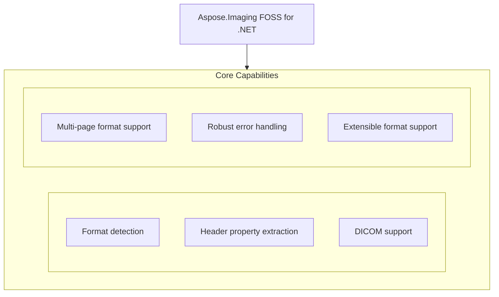

# Aspose.Imaging FOSS for .NET

[](LICENSE) [](https://github.com/aspose-imaging-foss/Aspose.Imaging-FOSS-for-.NET/graphs/contributors)

[](https://products.aspose.org/imaging/net/)

Aspose.Imaging FOSS for .NET is a .NET library that enables developers to read, write, and convert raster images, vector graphics, and metafiles without requiring a commercial license. It supports common image formats such as JPEG, PNG, BMP, TIFF, GIF, and SVG, allowing applications to process images programmatically across platforms that target netstandard2.0. The library solves problems related to image manipulation in enterprise and open-source .NET applications, including format conversion, metadata inspection, and batch processing. Developers building cross-platform tools, web services, or desktop applications use `Aspose.Imaging.Foss` to integrate robust imaging capabilities.

## Navigation

- [At a Glance](#at-a-glance)
- [Key Capabilities](#key-capabilities)
- [Installation](#installation)
- [Dependencies](#dependencies)
- [API Reference](#api-reference)
- [Scope and Limitations](#scope-and-limitations)
- [Development and Testing](#development-and-testing)
- [License](#license)

## At a Glance



## Key Capabilities

- **Format detection.** Identifies image formats from file paths, streams, or byte arrays using the `ImageProbe` class, returning structured metadata without requiring prior format knowledge.
- **Header property extraction.** Retrieves essential image attributes such as width, height, bit depth, and pixel format directly from the file header, enabling quick inspection before full decoding.
- **DICOM support.** Parses images using Implicit VR Little Endian and Explicit VR Little/Big Endian transfer syntaxes, including common compressed variants, while safely halting on undefined-length sequences or encapsulated pixel data.
- **Multi-page format support.** Processes image files containing multiple frames or pages, such as TIFF and GIF, by exposing each page as a distinct image layer for individual manipulation.
- **Robust error handling.** Ensures that malformed or incomplete image data triggers predictable exceptions rather than crashes, preserving application stability during processing.
- **Extensible format support.** Allows new image formats to be integrated through custom loaders and savers, enabling the library to adapt to emerging standards without core modifications.

## Installation

`Aspose.Imaging.Foss` is not yet published on NuGet; build it from a source checkout instead, verified against this revision:

```bash
git clone https://github.com/aspose-imaging-foss/Aspose.Imaging-FOSS-for-.NET.git
cd Aspose.Imaging-FOSS-for-.NET
dotnet build src/Aspose.Imaging.Foss/Aspose.Imaging.Foss.csproj
```

## Dependencies

### Required Package Dependencies

No required third-party package dependencies; in `src/Aspose.Imaging.Foss/Aspose.Imaging.Foss.csproj`, no `PackageReference` a consumer would install is declared.

### Native and System Requirements

- Requires .NET `netstandard2.0` (`TargetFramework` in `src/Aspose.Imaging.Foss/Aspose.Imaging.Foss.csproj`).

## API Reference

Aspose.Imaging FOSS for .NET exposes the `Aspose.Imaging.Foss` class as its primary entry point for imaging operations, providing a unified interface for loading, processing, and saving images across common formats. This class operates against the netstandard2.0 target framework and is the sole public symbol exposed by the `Aspose.Imaging.Foss` package.

The verified public surface has 3 types.

<details>
<summary>View the Complete Public API Surface</summary>

### Core API

| Class | Description |
| --- | --- |
| `ImageInfo` | Provides metadata about an image, including its width, height, bit depth, frame count, and format, obtained by probing an image source. |
| `ImageProbe` | Enables detection and inspection of image properties by probing image data from files, streams, or byte arrays to determine format and metadata. |

#### Enumerations

| Enumeration | Description |
| --- | --- |
| `ImageFormat` | Represents the format of an image, such as JPEG, PNG, or BMP, and is used to identify or specify the encoding standard of an image file. |

#### Detailed Member Reference

### Foss

The `Aspose.Imaging.Foss` class serves as the central type for image inspection and manipulation, supporting operations such as format detection, metadata extraction, and image transformation through a single cohesive API surface.

</details>

## Scope and Limitations

Aspose.Imaging FOSS for .NET provides read-only image inspection for DICOM, `DjVu`, AVIF, and HEIC/HEIF formats on the netstandard2.0 target framework, reporting dimensions, bit depth, and frame or page count where supported.

- DICOM parsing supports only Implicit VR Little Endian and Explicit VR Little/Big Endian transfer syntaxes, and halts rather than guessing when encountering sequences or encapsulated pixel data with undefined length before finding Rows, Columns, or `BitsAllocated`.
- DjVu files report dimensions and frame count from the IFF chunk tree, with multi-page (DJVM) files reporting page count from the DIRM directory chunk and dimensions from the first embedded DJVU page.
- Support for CDR is planned but not yet implemented.

These limitations don't apply to [Aspose.Imaging for .NET — Enterprise Edition](https://products.aspose.com/imaging/net/). Aspose.Imaging FOSS for .NET provides open-source imaging capabilities for .NET developers targeting netstandard2.0, while the commercial Aspose.Imaging for .NET adds advanced features, enterprise support, and additional format handling beyond this package.

## Development and Testing

Build and test Aspose.Imaging FOSS for .NET using the .NET CLI with the netstandard2.0 target framework, relying on the tests directory and CI workflows defined in the repository.

The suite covers 5 test files under `tests/`. Releases run through the [release workflow](.github/workflows/release.yml).

## License

This project is licensed under the [MIT License](LICENSE). The MIT License permits use, copying, modification, distribution, sublicensing, and commercial use, provided its copyright and permission notice are retained. The software is provided without warranty.
