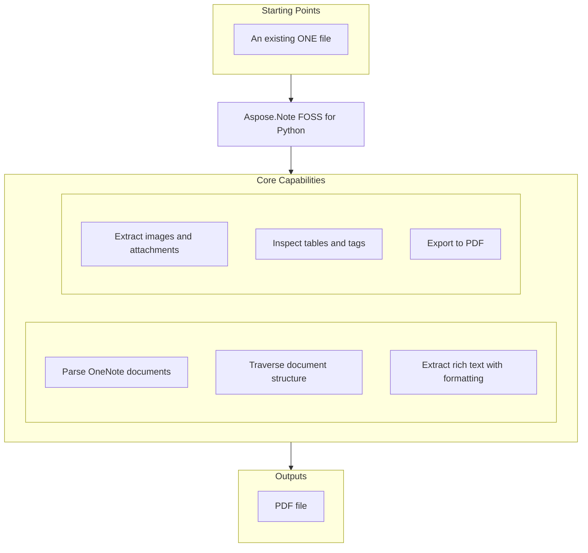

# Aspose.Note FOSS for Python

[](https://pypi.org/project/aspose-note/)  [](LICENSE) [](https://github.com/aspose-note-foss/Aspose.Note-FOSS-for-Python/graphs/contributors)

[](https://products.aspose.org/note/python/)

Aspose.Note FOSS for Python version 26.3.2 enables Python developers to read and convert Microsoft OneNote files (`.one`) to PDF without requiring Microsoft OneNote. It supports core document elements such as pages, outlines, rich text, images, tables, attached files, and note tags, allowing developers to inspect and extract content programmatically. The library exposes a `DocumentVisitor` pattern for custom traversal of the document tree and raises specific exceptions like `FileCorruptedException`, `IncorrectPasswordException`, and `UnsupportedFileFormatException` when handling malformed or protected files. Users in technical writing, knowledge management, and automation benefit from its ability to extract text, images, and metadata, and to generate structured output for reporting or archival purposes.

## Navigation

- [At a Glance](#at-a-glance)
- [Key Capabilities](#key-capabilities)
- [Installation](#installation)
- [Dependencies](#dependencies)
- [Quick Start](#quick-start)
- [Additional Examples](#additional-examples)
- [API Reference](#api-reference)
- [Documentation & Resources](#documentation--resources)
- [Scope and Limitations](#scope-and-limitations)
- [Development and Testing](#development-and-testing)
- [Third-Party Notices](#third-party-notices)
- [License](#license)

## At a Glance



## Key Capabilities

- **Parse OneNote documents.** Load `.one` files directly from disk or as binary streams and access document metadata and pages without external parsers.
- **Traverse document structure.** Traverse the document tree by subclassing `DocumentVisitor` and overriding methods such as `VisitPageStart`, `VisitRichTextStart`, and `VisitImageStart`, then invoke Accept on the root node.
- **Extract rich text with formatting.** Retrieve formatted text content by iterating `TextRun` objects within `RichText` nodes and reading `TextStyle` properties such as `IsHyperlink` and `HyperlinkAddress` alongside the plain Text value.
- **Extract images and attachments.** Extract embedded images and attached files by accessing the Bytes property of `Image` and `AttachedFile` nodes and writing them using standard file I/O operations.
- **Inspect tables and tags.** Read tabular data by descending through `Table`, `TableRow`, and `TableCell` nodes to collect cell text, and inspect tag metadata by examining `NoteTag` objects attached to `RichText`.
- **Export to PDF.** Control image compression quality and other export settings when exporting to PDF by invoking Save with `SaveFormat.Pdf` or a `PdfSaveOptions` instance.
- **Inspect numbered lists.** Detect list formatting by reading `NumberList` properties on `OutlineElement` nodes, including format patterns, numbering schemes, and restart behavior.
- **Handle exceptions.** Handle file errors by catching `FileCorruptedException` for damaged files, `IncorrectPasswordException` for protected documents, and `UnsupportedFileFormatException` for unknown formats.

## Installation

Install the published package from PyPI (`aspose-note`, version 26.3.2):

```bash
pip install aspose-note
```

To work from a source checkout instead, install the clone with pip:

```bash
git clone https://github.com/aspose-note-foss/Aspose.Note-FOSS-for-Python.git
cd Aspose.Note-FOSS-for-Python
pip install .
```

The package declares `python_requires` as `>=3.10`.

## Dependencies

### Required Package Dependencies

No required third-party package dependencies; in `pyproject.toml`, the `project.dependencies` list is empty.

### Optional Dependencies

- `reportlab>=3.6` (extra `pdf`)
- `Pillow>=10.0` (extra `test-pdf`)
- `PyMuPDF>=1.25` (extra `test-pdf`)
- `pypdf>=5.3` (extra `test-pdf`)

### Native and System Requirements

- Requires Python 3.10 or later (`python_requires=">=3.10"` in `pyproject.toml`).

### Development Dependencies

- `build>=1.2` (extra `dev`)
- `twine>=5.0` (extra `dev`)

## Quick Start

Convert a OneNote document to PDF by loading it and calling Save with Pdf format.

```python
from aspose.note import Document, SaveFormat

doc = Document("SimpleTable.one")
doc.Save("out.pdf", SaveFormat.Pdf)
```

Extract embedded images from a OneNote document and save them as PNG files by iterating over `Image` nodes and writing their Bytes to disk.

```python
from pathlib import Path
from aspose.note import Document, Image

out_dir = Path("out_images")
out_dir.mkdir(exist_ok=True)

doc = Document("3ImagesWithDifferentAlignment.one")
for i, img in enumerate(doc.GetChildNodes(Image), start=1):
    name = img.FileName or f"image_{i}.png"
    (out_dir / name).write_bytes(img.Bytes)
```

## Additional Examples

The examples demonstrate reading OneNote documents, extracting content, inspecting tags and lists, exporting to PDF, and counting document nodes.

### Inspect OneNote tags and their status on rich text elements

```python
from aspose.note import Document, RichText

doc = Document("TagSizes.one")
for rt in doc.GetChildNodes(RichText):
    for tag in rt.Tags:
        print(tag.Label, tag.Status)
```

<details>
<summary>View Additional Examples</summary>

### Read a document and print its display name and page count

```python
from aspose.note import Document

with open("SimpleTable.one", "rb") as f:
    doc = Document(f)
print(doc.DisplayName, len(list(doc)))
```

### Extract table cell text from a OneNote document

```python
from aspose.note import Document, Table, TableRow, TableCell, RichText

doc = Document("SimpleTable.one")
for table in doc.GetChildNodes(Table):
    for row in table.GetChildNodes(TableRow):
        cells = row.GetChildNodes(TableCell)
        values = [" ".join(rt.Text for rt in cell.GetChildNodes(RichText)) for cell in cells]
        print(values)
```

### Save attached files from a document to disk

```python
from pathlib import Path
from aspose.note import Document, AttachedFile

doc = Document("OnePageWithFile.one")
for i, af in enumerate(doc.GetChildNodes(AttachedFile), start=1):
    name = af.FileName or f"attachment_{i}.bin"
    Path(name).write_bytes(af.Bytes)
```

### Count pages, rich text nodes, and images using a visitor

```python
from aspose.note import Document, DocumentVisitor, Page, Image, RichText

class Counter(DocumentVisitor):
    def __init__(self):
        self.pages = 0
        self.rich_texts = 0
        self.images = 0

    def VisitPageStart(self, page: Page) -> None:
        self.pages += 1

    def VisitRichTextStart(self, rich_text: RichText) -> None:
        self.rich_texts += 1

    def VisitImageStart(self, image: Image) -> None:
        self.images += 1

doc = Document("3ImagesWithDifferentAlignment.one")
counter = Counter()
doc.Accept(counter)
print(counter.pages, counter.rich_texts, counter.images)
```

### Extract and print all text from rich text nodes

```python
from aspose.note import Document, RichText

doc = Document("FormattedRichText.one")
texts = [rt.Text for rt in doc.GetChildNodes(RichText)]
print("\n".join(texts))
```

### Export a document to PDF with custom JPEG quality

```python
from aspose.note import Document, SaveFormat
from aspose.note.saving import PdfSaveOptions

doc = Document("TagSizes.one")
opts = PdfSaveOptions(JpegQuality=90)
doc.Save("out.pdf", opts)
```

### Extract hyperlinks and their target addresses

```python
from aspose.note import Document, RichText

doc = Document("FormattedRichText.one")
for rt in doc.GetChildNodes(RichText):
    for run in rt.TextRuns:
        if run.Style.IsHyperlink and run.Style.HyperlinkAddress:
            print(run.Text, "->", run.Style.HyperlinkAddress)
```

### Inspect numbered list formatting properties

```python
from aspose.note import Document, OutlineElement

doc = Document("NumberedListWithTags.one")
for oe in doc.GetChildNodes(OutlineElement):
    nl = oe.NumberList
    if nl is None:
        continue
    print("format=", nl.Format, "number_format=", nl.NumberFormat, "restart=", nl.Restart)
```

</details>

## API Reference

The primary entry point is `aspose.note.Document`, which loads a `.one` file and exposes its pages as a tree of nodes including `RichText`, `Image`, `Table`, and `AttachedFile`. `Document.Save()` is the sole write path, currently limited to PDF via `PdfSaveOptions`. The supported public entry points are `aspose.note` and `aspose.note.saving`.

The verified public surface has 37 types.

<details>
<summary>View the Complete Public API Surface</summary>

### Core API

| Class | Description |
| --- | --- |
| `AttachedFile` | The AttachedFile class represents an embedded file attached to a document node, providing access to its name and raw bytes. |
| `Document` | The Document class represents a complete OneNote document and serves as the root node for its hierarchical structure. |
| `DocumentVisitor` | The DocumentVisitor class provides a base implementation for traversing and processing nodes in a document tree. |
| `FileCorruptedException` | The FileCorruptedException is raised when a document file is detected to be corrupted during loading. |
| `Image` | The Image class represents an image element within a document, supporting embedded or referenced image content. |
| `IncorrectDocumentStructureException` | The IncorrectDocumentStructureException is raised when a document's internal structure does not conform to expected rules. |
| `IncorrectPasswordException` | The IncorrectPasswordException is raised when an encrypted document cannot be opened due to an incorrect password. |
| `License` | The License class provides methods to apply a license for the Aspose.Note library. |
| `LoadOptions` | The LoadOptions class allows specifying options that control how a document is loaded. |
| `Metered` | The Metered class enables usage tracking through a metered key for billing purposes. |
| `Node` | The Node class serves as the base class for all elements in the document object model. |
| `NoteTag` | The NoteTag class represents a tagged note with an associated icon, label, and completion status. |
| `NumberList` | The NumberList class defines numbering rules for list items in a document. |
| `Outline` | The Outline class represents a vertical container for outline elements within a page. |
| `OutlineElement` | The OutlineElement class represents a horizontal container for text and other content within an outline. |
| `Page` | The Page class represents a single page in a OneNote document and contains its visual content. |
| `PageHistory` | The PageHistory class manages the version history of a page, allowing access to previous states. |
| `ParagraphStyle` | The ParagraphStyle class defines formatting properties applied to paragraphs. |
| `RichText` | The RichText class represents a block of formatted text content in a document. |
| `Table` | The Table class represents a table structure composed of rows and columns in a document. |
| `TableCell` | The TableCell class represents a single cell within a table row. |
| `TableColumn` | The TableColumn class defines the properties of a column in a table. |
| `TableRow` | The TableRow class represents a row in a table, containing one or more cells. |
| `TextRun` | The TextRun class represents a sequence of characters with consistent formatting within rich text. |
| `TextStyle` | The TextStyle class defines font and color properties applied to text content. |
| `Title` | The Title class represents the title section of a page, including its main text and subtitle. |
| `UnsupportedFileFormatException` | The UnsupportedFileFormatException is raised when attempting to load a file in an unsupported format. |
| `UnsupportedSaveFormatException` | The UnsupportedSaveFormatException is raised when attempting to save a document in an unsupported format. |
| `AsposeNoteError` | The AsposeNoteError class is the base exception type for errors specific to the Aspose.Note library. |
| `CompositeNode` | The CompositeNode class serves as a base for nodes that can contain child nodes in the document tree. |
| `PdfSaveOptions` | The PdfSaveOptions class provides settings that control how a document is saved to PDF format. |
| `SaveOptions` | The SaveOptions class provides base settings for controlling how a document is saved. |

#### Enumerations

| Enumeration | Description |
| --- | --- |
| `FileFormat` | The FileFormat enumeration specifies the supported file formats for OneNote documents. |
| `HorizontalAlignment` | The HorizontalAlignment enumeration defines the horizontal alignment options for content elements. |
| `NodeType` | The NodeType enumeration identifies the type of each node in the document tree. |
| `SaveFormat` | The SaveFormat enumeration specifies the output formats available when saving a document. |
| `TagStatus` | The TagStatus enumeration indicates whether a note tag is completed, in progress, or not started. |

#### Detailed Member Reference

### Document

The `aspose.note.Document` class loads a `.one` file from a path or file-like object and exposes its pages as a tree of child nodes, supporting iteration and node discovery via `GetChildNodes`, with Save writing the document to PDF and `DetectLayoutChanges` reporting layout changes.

- `DetectLayoutChanges`: Defined as `def DetectLayoutChanges(self) -> None`.
- `FileFormat`: Defined as `def FileFormat(self) -> FileFormat`.
- `GetPageHistory`: Defined as `def GetPageHistory(self, page: Page) -> PageHistory`.
- `Save`: Defined as `def Save(self, target: str / Path / BinaryIO, format_or_options: SaveFormat / SaveOptions / None=None) -> None`.

### RichText

The `aspose.note.RichText` class represents formatted text with runs, alignment, and tags, supporting text manipulation via Append, Insert, Remove, Replace, and trimming methods, and exposing `TextRuns`, `ParagraphStyle`, and Tags for detailed inspection.

- `Alignment`: Defined as `def Alignment(self) -> HorizontalAlignment / None`.
- `Append`: Defined as `def Append(self, text: str, style: TextStyle / None=None) -> RichText`.
- `AppendFront`: Defined as `def AppendFront(self, text: str, style: TextStyle / None=None) -> RichText`.
- `Clear`: Defined as `def Clear(self) -> RichText`.
- `GetEnumerator`: Defined as `def GetEnumerator(self) -> Iterator[str]`.
- `IndexOf`: Defined as `def IndexOf(self, value: str, startIndex: int=0, count: int / None=None, comparison: str / None=None) -> int`.
- `Insert`: Defined as `def Insert(self, index: int, text: str, style: TextStyle / None=None) -> RichText`.
- `IsTitleDate`: Defined as `def IsTitleDate(self) -> bool`.
- `IsTitleText`: Defined as `def IsTitleText(self) -> bool`.
- `IsTitleTime`: Defined as `def IsTitleTime(self) -> bool`.
- `Length`: Defined as `def Length(self) -> int`.
- `ParagraphStyle`: Defined as `def ParagraphStyle(self) -> ParagraphStyle`.
- `Remove`: Defined as `def Remove(self, start: int, count: int / None=None) -> RichText`.
- `Replace`: Defined as `def Replace(self, old_value: str, new_value: str, style: TextStyle / None=None) -> RichText`.
- `Tags`: Defined as `def Tags(self) -> list[NoteTag]`.
- `Text`: Defined as `def Text(self) -> str`.
- `TextRuns`: Defined as `def TextRuns(self) -> list[TextRun]`.
- `Trim`: Defined as `def Trim(self) -> RichText`.
- `TrimEnd`: Defined as `def TrimEnd(self) -> RichText`.
- `TrimStart`: Defined as `def TrimStart(self) -> RichText`.

### Image

The `aspose.note.Image` class exposes image content via Bytes and metadata such as `FileName`, Format, and dimensions, supporting extraction and replacement while preserving alignment and tags.

- `Alignment`: Defined as `def Alignment(self) -> HorizontalAlignment / None`.
- `Bytes`: Defined as `def Bytes(self) -> bytes`.
- `FileName`: Defined as `def FileName(self) -> str / None`.
- `FilePath`: Defined as `def FilePath(self) -> str / None`.
- `Format`: Defined as `def Format(self) -> str / None`.
- `OriginalHeight`: Defined as `def OriginalHeight(self) -> float / None`.
- `OriginalWidth`: Defined as `def OriginalWidth(self) -> float / None`.
- `Replace`: Defined as `def Replace(self, image: Image) -> None`.
- `Tags`: Defined as `def Tags(self) -> list[NoteTag]`.

### AttachedFile

The `aspose.note.AttachedFile` class represents an attached file with `FileName` and raw Bytes, exposing tags for metadata and supporting extraction by writing its content to disk.

- `Bytes`: Defined as `def Bytes(self) -> bytes`.
- `FileName`: Defined as `def FileName(self) -> str / None`.
- `Tags`: Defined as `def Tags(self) -> list[NoteTag]`.

### Table

The `aspose.note.Table` class represents a table with columns and tags, exposing Columns for layout and supporting iteration over rows and cells to extract `RichText` content.

- `Columns`: Defined as `def Columns(self) -> list[TableColumn]`.
- `Tags`: Defined as `def Tags(self) -> list[NoteTag]`.

### SaveFormat

The `aspose.note.SaveFormat` enumeration lists supported output formats, currently only Pdf, used when calling `Document.Save` with a format or save options.

### DocumentVisitor

The `aspose.note.DocumentVisitor` class enables custom traversal of a document tree via visitor methods such as `VisitPageStart`, `VisitRichTextStart`, and `VisitImageStart`, with `Document.Accept` initiating the visit.

- `VisitDocumentEnd`: Defined as `def VisitDocumentEnd(self, document: Document) -> None`.
- `VisitDocumentStart`: Defined as `def VisitDocumentStart(self, document: Document) -> None`.
- `VisitImageEnd`: Defined as `def VisitImageEnd(self, image: Image) -> None`.
- `VisitImageStart`: Defined as `def VisitImageStart(self, image: Image) -> None`.
- `VisitOutlineElementEnd`: Defined as `def VisitOutlineElementEnd(self, outline_element: OutlineElement) -> None`.
- `VisitOutlineElementStart`: Defined as `def VisitOutlineElementStart(self, outline_element: OutlineElement) -> None`.
- `VisitOutlineEnd`: Defined as `def VisitOutlineEnd(self, outline: Outline) -> None`.
- `VisitOutlineStart`: Defined as `def VisitOutlineStart(self, outline: Outline) -> None`.
- `VisitPageEnd`: Defined as `def VisitPageEnd(self, page: Page) -> None`.
- `VisitPageStart`: Defined as `def VisitPageStart(self, page: Page) -> None`.
- `VisitRichTextEnd`: Defined as `def VisitRichTextEnd(self, rich_text: RichText) -> None`.
- `VisitRichTextStart`: Defined as `def VisitRichTextStart(self, rich_text: RichText) -> None`.
- `VisitTitleEnd`: Defined as `def VisitTitleEnd(self, title: Title) -> None`.
- `VisitTitleStart`: Defined as `def VisitTitleStart(self, title: Title) -> None`.

### NoteTag

The `aspose.note.NoteTag` class represents a tag with an icon, label, status, and highlight, supporting creation of common tags via factory methods like `CreateYellowStar`, `CreateQuestionMark`, and `CreateMusicalNote`.

- `CompletedTime`: Defined as `def CompletedTime(self) -> datetime / None`.
- `CreateMusicalNote`: Defined as `def CreateMusicalNote(label: str / None=None) -> NoteTag`.
- `CreateQuestionMark`: Defined as `def CreateQuestionMark(label: str / None=None) -> NoteTag`.
- `CreateYellowStar`: Defined as `def CreateYellowStar(label: str / None=None) -> NoteTag`.
- `CreationTime`: Defined as `def CreationTime(self) -> datetime / None`.
- `FontColor`: Defined as `def FontColor(self) -> int / None`.
- `Highlight`: Defined as `def Highlight(self) -> int / None`.
- `Icon`: Defined as `def Icon(self) -> int / None`.
- `Label`: Defined as `def Label(self) -> str / None`.
- `Status`: Defined as `def Status(self) -> TagStatus`.

### NumberList

The `aspose.note.NumberList` class defines numbering for outline elements, exposing properties such as Format, `NumberFormat`, Restart, and Font to control list appearance.

- `GetNumberedListHeader`: Defined as `def GetNumberedListHeader(self, number: int) -> str`.

### FileCorruptedException

The `aspose.note.FileCorruptedException` is raised when a `.one` file cannot be loaded due to corruption or structural issues.

### IncorrectPasswordException

The `aspose.note.IncorrectPasswordException` is raised when a password-protected `.one` file is loaded with an incorrect password.

### UnsupportedFileFormatException

The `aspose.note.UnsupportedFileFormatException` is raised when a file format is not recognized or supported by the library.

- `FileFormat`: Defined as `def FileFormat(self) -> FileFormat`.

</details>

## Documentation & Resources

- **[Getting started guide](https://docs.aspose.org/note/python/)** — The getting started guide introduces the core concepts and basic usage patterns for loading, inspecting, and saving OneNote documents using Aspose.Note FOSS for Python.
- **[How-to guides & FAQ](https://kb.aspose.org/note/python/)** — The how-to guides and FAQ provide practical examples and answers for common tasks such as working with pages, text runs, tags, and hyperlinks in OneNote files.
- **[Full API reference](https://reference.aspose.org/note/python/)** — The full API reference documents every public class, method, and property available in the Aspose.Note FOSS for Python package, including members like Accept, Bytes, `DisplayName`, `FileName`, Format, `GetChildNodes`, `HyperlinkAddress`, `IsHyperlink`, Label, `NumberFormat`, `NumberList`, Pdf, Restart, Save, Status, Style, Tags, Text, `TextRuns`, images, join, mkdir, pages, `rich_texts`, and `write_bytes`. It covers all 37 verified public types; the [API Reference](#api-reference) section above covers the essentials.
- Found a bug or have a feature request? [Open an issue](https://github.com/aspose-note-foss/Aspose.Note-FOSS-for-Python/issues).

## Scope and Limitations

Aspose.Note FOSS for Python reads Microsoft `OneNote` `.one` files and exports them to PDF using the `aspose.note.SaveFormat.Pdf` option, supporting Python 3.10 and later.

- Writing back to `.one` files is not implemented — this library only reads `OneNote` files, and encrypted documents are not supported — supplying a password raises `IncorrectPasswordException`.
- `SaveFormat` currently declares only Pdf — `Document.Save()` raises `UnsupportedSaveFormatException` for any other format or options object.
- `License.SetLicense()` and `Metered.SetMeteredKey()` are present for API-shape compatibility with the commercial product but are no-ops in this edition — no license is required to use this library.
- `DetectLayoutChanges()` is a compatibility stub and performs no layout computation.
- Export to PDF requires the optional dependency reportlab>=3.6.
- Writing back to `.one` is not implemented — this library only reads `OneNote` files.

These limitations don't apply to [Aspose.Note — Enterprise Edition](https://products.aspose.com/note/). Aspose.Note FOSS for Python provides core document processing capabilities, while the commercial Aspose.Note for Python adds advanced features such as enhanced PDF export, batch processing, and support for additional file formats.

## Development and Testing

Run the test suite from the repository's own assets in the tests/ directory, and regenerate PDF golden baselines with the provided tools/`regenerate_pdf_goldens.py` script after intentional output changes.

The suite covers 27 test files under `tests/`. Releases run through the [publish-pypi workflow](.github/workflows/publish-pypi.yml).

## Third-Party Notices

See [Third-party notices](THIRD_PARTY_NOTICES.md).

## License

This project is licensed under the [MIT License](LICENSE). The MIT License permits use, copying, modification, distribution, sublicensing, and commercial use, provided its copyright and permission notice are retained. The software is provided without warranty.
