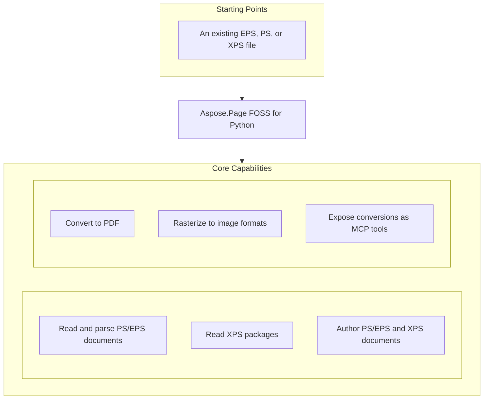

# Aspose.Page FOSS for Python

[](https://pypi.org/project/aspose-page-foss/)  [](LICENSE.txt) [](https://github.com/aspose-page-foss/Aspose.Page-FOSS-for-Python/graphs/contributors)

[](https://products.aspose.org/page/python/)

Aspose.Page FOSS for Python enables conversion and rendering of page description formats including PostScript (`.ps`), EPS, XPS (`.xps`), and PDF (`.pdf`) to raster images like PNG (`.png`) and back to PDF. It solves the problem of programmatically processing these formats without requiring proprietary dependencies, supporting tasks such as document conversion, preview generation, and metadata inspection. Developers working with document workflows, printing systems, or graphics processing use this library to integrate robust page handling into Python applications. The package requires Python >=3.10 and depends on skia-python for rendering operations.

## Navigation

- [At a Glance](#at-a-glance)
- [Key Capabilities](#key-capabilities)
- [Installation](#installation)
- [Dependencies](#dependencies)
- [Quick Start](#quick-start)
- [Additional Examples](#additional-examples)
- [API Reference](#api-reference)
- [Documentation & Resources](#documentation--resources)
- [Scope and Limitations](#scope-and-limitations)
- [Development and Testing](#development-and-testing)
- [License](#license)

## At a Glance



## Key Capabilities

- **Read and parse PS/EPS documents.** The library reads and parses PostScript and Encapsulated PostScript documents through the `aspose.page.ps` module, supporting the `.eps` format and exposing the document structure for further processing.
- **Read XPS packages.** XPS packages in the `.xps` format are read using the `aspose.page.xps` module, which parses the package structure and exposes the document for rendering or conversion operations.
- **Author PS/EPS and XPS documents.** Authors can create PS/EPS and XPS documents programmatically using the `aspose.page.ps` and `aspose.page.xps` modules, building documents page by page with rendering primitives.
- **Convert to PDF.** Documents can be converted to PDF by writing the internal document model through the `aspose.page.pdf` module, producing a complete PDF document in memory.
- **Rasterize to image formats.** Rasterization to image formats such as PNG uses the skia-python dependency and exposes methods like `to_image` and `encode_png` for outputting rendered pages.
- **Expose conversions as MCP tools.** Conversions are exposed as MCP tools through the `aspose.page.mcp` module, with handlers such as `ps_to_pdf`, `eps_metadata`, and `xps_to_pdf` accepting structured inputs and outputs.

## Installation

Install the published package from PyPI (`aspose-page-foss`):

```bash
pip install aspose-page-foss
```

To work from a source checkout instead, install the clone with pip:

```bash
git clone https://github.com/aspose-page-foss/Aspose.Page-FOSS-for-Python.git
cd Aspose.Page-FOSS-for-Python
pip install .
```

The package declares `python_requires` as `>=3.10`.

## Dependencies

### Required Package Dependencies

- `skia-python`

### Native and System Requirements

- Requires Python 3.10 or later (`python_requires=">=3.10"` in `pyproject.toml`).

### Development Dependencies

- `Pillow` (extra `test`)
- `pypdf` (extra `test`)
- `pypdfium2` (extra `test`)

## Quick Start

Convert a PostScript file to PDF by importing the `ps_to_pdf` handler and passing input and output objects to it, as shown in the example.

```python
from aspose.page.mcp.handlers import ps_to_pdf
from aspose.page.mcp.types import McpInput, McpOutput

result = ps_to_pdf(
    McpInput(input_path="input.ps", input_bytes_b64=None),
    McpOutput(output_path="output.pdf", return_bytes=False),
)
```

## Additional Examples

The aspose-page-foss package supports PostScript, EPS, XPS, and PDF workflows with Python >=3.10. Each example demonstrates a distinct conversion or rendering task.

### Build a document from scratch and export it as PDF

```python
import aspose.page.ps  # works around a module import-order issue in aspose.page.pdf.writer
from aspose.page.common.render_model import RenderModelBuilder, Matrix
from aspose.page.pdf.writer import PdfWriter, PdfMetadata

builder = RenderModelBuilder()
builder.begin_page(100, 100)
builder.add_text("Hello, Aspose.Page", "Helvetica", 12, Matrix.identity(), None)
builder.end_page()
doc = builder.document()

metadata = PdfMetadata(
    title="", creator="", producer="Aspose.Page FOSS for Python",
    creation_date="D:20260101000000", mod_date="D:20260101000000", trapped=False,
)
writer = PdfWriter(metadata)
pdf_bytes = writer.write(doc)
```

<details>
<summary>View Additional Examples</summary>

### Convert a PostScript file to a PNG image

```python
from aspose.page.ps.document import PsDocument
from aspose.page.ps.output import ImageSaveOptions

ps = PsDocument.from_file("input.ps")
data = ps.to_image(ImageSaveOptions(format="png", dpi=150))

with open("output.png", "wb") as f:
    f.write(data)
```

### Extract EPS metadata including bounding box and title

```python
from aspose.page.mcp.handlers import eps_metadata
from aspose.page.mcp.types import McpInput

meta = eps_metadata(McpInput(input_path="input.eps", input_bytes_b64=None))
print(meta["bounding_box"], meta["title"])
```

### Convert an XPS file to PDF using an MCP handler

```python
from aspose.page.mcp.handlers import xps_to_pdf
from aspose.page.mcp.types import McpInput, McpOutput

result = xps_to_pdf(
    McpInput(input_path="input.xps", input_bytes_b64=None),
    McpOutput(output_path="output.pdf", return_bytes=False),
)
```

### Render a programmatically created page to PNG

```python
import aspose.page.ps  # works around a module import-order issue in aspose.page.image.raster_renderer
from aspose.page.common.render_model import RenderDocument, RenderPage
from aspose.page.image.raster_renderer import RasterRenderer
from aspose.page.image.encoders import encode_png

doc = RenderDocument()
doc.pages.append(RenderPage(width=200, height=100))

surface = RasterRenderer(dpi=144).render(doc)
png_bytes = encode_png(surface, dpi=144)

with open("blank.png", "wb") as f:
    f.write(png_bytes)
```

### Convert an XPS file to a PNG image

```python
from aspose.page.xps.document import XpsDocument
from aspose.page.ps.output import ImageSaveOptions

doc = XpsDocument.from_file("input.xps")
data = doc.to_image(ImageSaveOptions(format="png", dpi=150))

with open("output.png", "wb") as f:
    f.write(data)
```

</details>

## API Reference

Aspose.Page FOSS for Python provides modules for reading, authoring, and converting PostScript, EPS, and XPS documents. The core entry points are the `aspose.page` module's `PsDocument` and `XpsDocument` classes, which rely on the shared `RenderModelBuilder` and `RenderDocument` types to build an internal render model before output.

The verified public surface has 139 types.

<details>
<summary>View the Complete Public API Surface</summary>

### Core API

| Class | Description |
| --- | --- |
| `AxialShading` | AxialShading represents an axial shading pattern used in vector graphics rendering. |
| `CieBasedColorSpace` | CieBasedColorSpace defines a CIE-based color space for precise color representation. |
| `ColorSpacePaint` | ColorSpacePaint provides a paint implementation using a specific color space. |
| `DeviceColorSpace` | DeviceColorSpace represents a device-dependent color space based on the output device characteristics. |
| `DeviceNColorSpace` | DeviceNColorSpace defines a device color space supporting multiple color components. |
| `ExponentialFunction` | ExponentialFunction implements a mathematical function with exponential behavior for color calculations. |
| `IndexedColorSpace` | IndexedColorSpace uses an index table to map color values to actual colors. |
| `PatternColorSpace` | PatternColorSpace defines a color space based on repeating patterns. |
| `PatternPaint` | PatternPaint renders content using a pattern as the fill or stroke style. |
| `RadialShading` | RadialShading represents a radial shading pattern that transitions colors along a radius. |
| `SampledFunction` | SampledFunction approximates a mathematical function using discrete sample points. |
| `SeparationColorSpace` | SeparationColorSpace defines a color space for individual color separation channels. |
| `ShadingPattern` | ShadingPattern creates a pattern using gradient shading effects. |
| `StitchingFunction` | StitchingFunction combines multiple functions into a single continuous function. |
| `TilingPattern` | TilingPattern defines a repeating tile-based pattern for filling areas. |
| `ClipCommand` | Set the current clipping path. |
| `ImageCommand` | Render an image resource with a transform. |
| `Matrix` | Affine transform matrix (a, b, c, d, e, f). |
| `Paint` | Fill/stroke paint descriptor. |
| `Path` | A sequence of path segments. |
| `PathCommand` | Render a path with optional stroke/fill. |
| `PathSegment` | A path segment with a kind and control points. |
| `Point` | 2D point in the render model. |
| `Rect` | Axis-aligned rectangle with min/max coordinates. |
| `RenderDocument` | A collection of render pages. |
| `RenderImageResource` | Image payload used by raster backends. |
| `RenderModelBuilder` | Build render documents incrementally. |
| `RenderPage` | A single renderable page with commands. |
| `RenderResources` | Shared render resources for a document. |
| `StateRestoreCommand` | Restore the previous graphics state. |
| `StateSaveCommand` | Save the current graphics state. |
| `StrokeStyle` | Stroke style settings for path rendering. |
| `TextCommand` | Render text using a font reference and transform. |
| `RasterRenderer` | Render a RenderDocument to a raster surface. |
| `RasterSurface` | In-memory RGBA pixel surface. |
| `DefaultRasterWriter` | DefaultRasterWriter provides a default implementation for writing raster images. |
| `RasterWriter` | RasterWriter is a protocol defining the interface for raster image output operations. |
| `RenderModelRasterWriter` | RenderModelRasterWriter handles raster output based on a rendering model. |
| `SkiaRasterWriter` | Rasterize a RenderDocument using Skia (requires skia-python). |
| `McpConversionOptions` | Conversion options for MCP operations. |
| `McpInput` | MCP input payload. |
| `McpOutput` | MCP output configuration. |
| `McpResult` | MCP output payload. |
| `ImageResource` | Image resource payload for PDF XObject embedding. |
| `PdfMetadata` | PDF metadata fields for the document info dictionary. |
| `PdfWriter` | Serialize a render document into PDF 1.4 bytes. |
| `PdfEmbeddedFont` | PdfEmbeddedFont manages embedded font resources within PDF documents. |
| `RectWrapper` | RectWrapper encapsulates rectangle coordinates for PDF writing operations. |
| `ImageSaveOptions` | ImageSaveOptions specifies settings for saving documents as image files. |
| `PdfSaveOptions` | PdfSaveOptions defines parameters for saving documents in PDF format. |
| `PsDocument` | Represents a loaded or editable PS/EPS document. |
| `ClipType` | ClipType enumerates the available clipping operations in the polygon clipping engine. |
| `Clipper` | Clipper performs polygon clipping operations using the Greiner-Hormann algorithm. |
| `ClipperBase` | ClipperBase provides core functionality and state management for the clipping engine. |
| `ClipperException` | ClipperException signals errors that occur during polygon clipping operations. |
| `Direction` | Direction specifies the orientation of edges in the clipping algorithm. |
| `DoublePoint` | DoublePoint represents a point with double-precision floating-point coordinates. |
| `EdgeSide` | EdgeSide indicates which side of an edge a point lies on during clipping. |
| `EndType` | EndType defines how polygon boundaries are terminated in the clipping process. |
| `IntPoint` | IntPoint represents a point with integer coordinates used in clipping operations. |
| `IntRect` | IntRect defines a rectangle using integer coordinates for clipping calculations. |
| `IntersectNode` | IntersectNode stores information about intersection points between polygon edges. |
| `Join` | Join represents a connection between two polygon segments during clipping. |
| `JoinType` | JoinType specifies how polygon segments are joined together in the clipping engine. |
| `LocalMinima` | LocalMinima identifies local minimum points in polygon scanlines during clipping. |
| `OutPt` | OutPt represents an output point in the polygon clipping result. |
| `OutRec` | OutRec stores information about an output polygon region generated by clipping. |
| `PolyFillType` | PolyFillType determines how polygon interiors are filled during clipping operations. |
| `PolyNode` | PolyNode represents a node in the polygon hierarchy structure used by the clipping engine. |
| `PolyOffsetBuilder` | PolyOffsetBuilder constructs offset polygons from input points using configurable join styles such as miter, round, or square. |
| `PolyTree` | PolyTree holds a hierarchical collection of polygons representing the result of clipping operations, providing access to the first node and total count. |
| `PolyType` | PolyType defines the classification of polygons used in clipping operations, such as subject or clip. |
| `Scanbeam` | Scanbeam manages a list of Y-coordinates used during the clipping algorithm's sweep-line processing. |
| `TEdge` | TEdge represents an edge segment in the clipping algorithm, storing geometric and topological information. |
| `ExecutionContext` | Holds interpreter stacks, dictionaries, and metadata for execution. |
| `GraphicsState` | Tracks current graphics state parameters. |
| `DscMetadata` | Container for DSC metadata extracted from PS/EPS comments. |
| `PsCanvas` | Canvas that appends PostScript operators to a page. |
| `PsImage` | Raster image container for embedding in PS/EPS. |
| `PsPage` | Editable PS/EPS page. |
| `PsError` | Base PostScript error. |
| `PsIOError` | PsIOError signals input or output failures encountered while processing PostScript content. |
| `PsInvalidAccess` | PsInvalidAccess indicates an attempt to access a resource or operation not permitted in the current context. |
| `PsLimitCheck` | PsLimitCheck is raised when a PostScript interpreter limit is exceeded during execution. |
| `PsQuit` | Internal non-error signal used by PostScript quit. |
| `PsRangeError` | PsRangeError occurs when a numeric value falls outside the allowed range for a PostScript operation. |
| `PsSyntaxError` | PsSyntaxError signals a syntax violation found while parsing PostScript code. |
| `PsTypeError` | PsTypeError is raised when an operand of an incorrect type is encountered in a PostScript operation. |
| `PsUndefinedError` | PsUndefinedError indicates that a required name or operator is not defined in the current PostScript environment. |
| `FilterResult` | Result of decoding a filter chain. |
| `FontCache` | FontCache stores and retrieves font metrics and outlines to accelerate repeated font handling in PostScript processing. |
| `FontMetrics` | FontMetrics holds typographic measurements for a font, such as ascender, descender, and line spacing. |
| `FontRecord` | FontRecord associates a font identifier with its cached metrics and outline data. |
| `EmbeddedType42` | EmbeddedType42 represents a Type 42 font embedded in a PostScript document, containing TrueType outline data. |
| `FontResolver` | Resolve fonts from names or PostScript dictionaries. |
| `FontResource` | Represents a resolved font resource. |
| `ImageInfo` | Decoded raster image data. |
| `PsImageResource` | Represents a decoded image resource. |
| `PsImageStore` | Store image resources by id. |
| `PsInterpreter` | Execute PostScript/EPS objects using a registry of operators. |
| `PsArray` | PsArray holds an ordered collection of PostScript objects, supporting append and iteration. |
| `PsDict` | PsDict stores key-value pairs of PostScript objects, enabling dictionary lookups and modifications. |
| `PsFile` | PsFile represents a file object used for reading or writing PostScript content. |
| `PsFontId` | PsFontId uniquely identifies a font within the PostScript interpreter's font system. |
| `PsGState` | PsGState captures the current graphics state parameters used during PostScript rendering. |
| `PsMark` | PsMark records a position in the PostScript stream for later reference or restoration. |
| `PsName` | PsName wraps a PostScript name object, used as identifiers in dictionaries and operators. |
| `PsOperator` | PsOperator represents a PostScript operator name and its associated execution logic. |
| `PsPattern` | PsPattern defines a reusable pattern used for filling or stroking in PostScript graphics. |
| `PsProcedure` | PsProcedure encapsulates a sequence of PostScript operators as a callable object. |
| `PsSave` | PsSave records the current graphics state so it can be restored later. |
| `PsString` | PsString holds a sequence of bytes representing a PostScript string literal. |
| `OperatorEntry` | Descriptor for a registered PostScript operator. |
| `OperatorRegistry` | Register and resolve PostScript operator implementations. |
| `PsParser` | Parse PostScript/EPS tokens into language objects. |
| `PsConversionPipeline` | Convert PS/EPS byte streams into render model documents. |
| `PsStack` | Simple stack implementation for PostScript execution. |
| `PsToken` | Represents a token from a PostScript/EPS input stream. |
| `PsTokenizer` | Tokenize PostScript/EPS bytes into language tokens. |
| `GlyphPoint` | GlyphPoint stores the coordinates and flag of a single point in a TrueType glyph outline. |
| `TrueTypeFont` | TrueTypeFont provides access to metrics and outlines of a TrueType font used in PostScript processing. |
| `Type1Metrics` | Type1Metrics holds typographic measurements extracted from a Type 1 font program. |
| `PsSaveState` | PsSaveState preserves the current virtual machine state for later restoration during PostScript execution. |
| `XpsDocument` | Represents a loaded or editable XPS document. |
| `XpsCanvas` | XPS canvas element for grouping content. |
| `XpsDocumentBuilder` | Builder for XPS document creation/editing. |
| `XpsFixedPage` | Editable XPS fixed page. |
| `XpsGlyphs` | XPS glyphs element. |
| `XpsImage` | XPS image element. |
| `XpsPath` | XPS path element. |
| `XpsImageResource` | Decoded image resource. |
| `XpsImageStore` | XpsImageStore manages registered XPS images, allowing retrieval by identifier. |
| `XpsPackage` | Represents an XPS package. |
| `XpsParser` | Parse XPS package relationships to locate pages. |
| `PrintTicket` | Print ticket payload descriptor. |
| `Relationship` | Represents a package relationship. |
| `XpsRenderer` | Render XPS XML to the shared render model. |
| `XpsResourceDictionary` | Resource dictionary with parent lookup. |

#### Enumerations

| Enumeration | Description |
| --- | --- |
| `PrintTicketScope` | Print ticket scopes supported by XPS. |

#### Detailed Member Reference

### page

The `aspose.page` module exposes `PsDocument` and `XpsDocument` for loading and manipulating PostScript and XPS content, with methods such as `from_file`, `add_page`, and `to_pdf` or `to_image` for conversion, and it provides `PdfWriter` and `RasterRenderer` for writing PDF and raster output respectively.

### image

The `aspose.page.image` module supports raster output through `RasterRenderer`, which renders a `RenderDocument` to images, and `DefaultRasterWriter` and `SkiaRasterWriter`, which provide platform-specific raster writing capabilities.

### mcp

The `aspose.page.mcp` module provides command-line tools for batch conversion, including `ps_to_pdf`, `ps_to_image`, `xps_to_pdf`, `xps_to_image`, and `eps_metadata`, along with `McpInput`, `McpOutput`, `McpConversionOptions`, and `McpResult` types, and a `create_server` function that registers these tools on a FastMCP server.

### pdf

The `aspose.page.pdf` module offers `PdfWriter` for writing PDF output from a `RenderDocument`, and `PdfMetadata` for inspecting PDF document properties.

### ps

The `aspose.page.ps` module includes `Clipper` and `ClipperBase` for polygon clipping operations, `FontCache` for font management, and `FontResolver` for resolving fonts during rendering.

### xps

The `aspose.page.xps` module supports XPS document handling, including loading from files or bytes, manipulating pages, and converting to PDF or raster formats.


The primary entry points are `PsDocument` and `XpsDocument`, which read, author, and convert
PS/EPS and XPS content respectively; both delegate PDF output to `PdfWriter` and raster output to
`RasterRenderer`, once page content has passed through the shared `RenderModelBuilder` /
`RenderDocument` model. The public API surface includes 139 types, organized by module below.

- `PsDocument` — `create(is_eps, page_size)` / `from_bytes(data)` / `from_file(path)`;
  `add_page(size)` / `insert_page(index, size)` / `remove_page(index)` / `get_page(index)`;
  `save(path)` / `as_bytes()`; `get_xmp()` / `set_xmp(xmp_xml)` / `remove_xmp()`;
  `to_pdf(options)` / `to_image(options)`; `pages: list[PsPage]`, `dsc: DscMetadata | None`.

- `XpsDocument` — `create(title)` / `from_bytes(data)` / `from_file(path)`;
  `add_page(width, height)` / `insert_page(index, page)` / `remove_page(index)`; `save(path)`;
  `get_print_tickets()` / `set_print_ticket(scope, xml, page_index)`; `to_pdf(options)` /
  `to_image(options)`.

- `PsCanvas` — `move_to(x, y)`, `line_to(x, y)`, `curve_to(...)`, `rect(...)`, `ellipse(...)`,
  `stroke()`, `fill()`, `fill_stroke()`, `set_stroke_color(color)`, `set_fill_color(color)`,
  `draw_text(text, x, y, font_name, size)`, `draw_image(image, x, y, w, h)`,
  `save_state()` / `restore_state()`, `clip()` / `init_clip()`.

- `DscMetadata` — `bounding_box`, `hires_bounding_box`, `crop_box`, `document_media_size`,
  `title`, `creator`, `creation_date`, `language_level`, `extensions`.

</details>

## Documentation & Resources

- **[Getting started guide](https://docs.aspose.org/page/python/)** — The getting started guide introduces the core concepts and walks through initial setup and basic usage patterns for Aspose.Page FOSS for Python.
- **[How-to guides & FAQ](https://kb.aspose.org/page/python/)** — The how-to guides and FAQ provide practical examples and answers to common questions about using Aspose.Page FOSS for Python to process documents.
- **[Full API reference](https://reference.aspose.org/page/python/)** — The full API reference documents every public class, method, and property available in the aspose-page-foss package for Python developers. It covers all 139 verified public types; the [API Reference](#api-reference) section above covers the essentials.
- Found a bug or have a feature request? [Open an issue](https://github.com/aspose-page-foss/Aspose.Page-FOSS-for-Python/issues).

## Scope and Limitations

Aspose.Page FOSS for Python provides APIs to create and convert page-description documents, supporting PS/EPS and XPS formats for output to PDF and raster images, as well as a Model-View-Presenter server for remote conversion tasks.

- The package requires Python version 3.10 or later and is distributed under the name aspose-page-foss; these limitations do not apply to Aspose.Page for Python — Enterprise Edition, which adds broader format coverage, including PDF reading, and commercial support.
- XPS-to-image conversion has no pure-Python fallback and always uses the Skia backend (skia-python, installed with the package), or it raises a runtime error.
- Importing `aspose.page.pdf.writer` or `aspose.page.image.raster_renderer` directly, or calling `XpsDocument.to_pdf()` or `to_image()` before importing `aspose.page.ps`, raises a circular-import ImportError in a fresh Python interpreter.
- The `aspose.page.pdf` module supports writing PDF documents from render models but does not provide any API to read or parse existing PDF files.
- The `aspose.page.mcp` module exposes only five conversion/metadata tools (`ps_to_pdf`, `ps_to_image`, `xps_to_pdf`, `xps_to_image`, `eps_metadata`) and does not expose document creation or authoring functions such as `PsDocument.create` or `XpsDocument.create`.

These limitations don't apply to [Aspose.Page for Python — Enterprise Edition](https://products.aspose.com/page/python-net/). Aspose.Page FOSS for Python provides open-source access to document creation and conversion capabilities, while the commercial Aspose.Page for Python — commercial edition extends this with additional formats, advanced rendering options, and production-grade support.

## Development and Testing

The aspose-page-foss package requires Python >=3.10 and is built and tested using the uv toolchain with the tests/ directory.

The suite covers 66 test files under `tests/`.

Sync dependencies and run the test suite with `uv`:

## License

This project is licensed under the [MIT License](LICENSE.txt). The MIT License permits use, copying, modification, distribution, sublicensing, and commercial use, provided its copyright and permission notice are retained. The software is provided without warranty.
