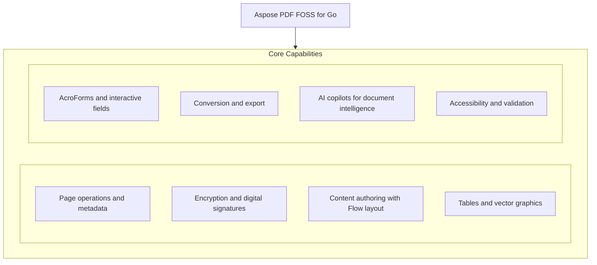

# Aspose PDF FOSS for Go

[](https://pkg.go.dev/github.com/aspose-pdf-foss/aspose-pdf-foss-for-go) [](LICENSE) [](https://github.com/aspose-pdf-foss/Aspose-PDF-FOSS-for-Go/graphs/contributors)

[](https://products.aspose.org/pdf/go/)

Aspose PDF FOSS for Go provides a Go library for creating, editing, and converting PDF documents without external dependencies. Developers use it to split, merge, reorder, and secure PDFs using `Document.Split`, `Document.Append`, `Document.Reorder`, and `Document.SetEncryption`, as shown in the core examples. It supports rich content creation with `Flow`, `Table`, and form fields like `Form.AddTextField` and `Form.AddBarcodeField`, and can export to HTML, `SVG`, DOCX, and EPUB formats. The ai package offers AI copilots such as `SummaryCopilot`, `OcrCopilot`, `ChatCopilot`, and `ImageDescriptionCopilot` for summarization, text recognition, conversational interaction, and image description tasks.

## Navigation

- [At a Glance](#at-a-glance)
- [Key Capabilities](#key-capabilities)
- [Installation](#installation)
- [Dependencies](#dependencies)
- [Quick Start](#quick-start)
- [Additional Examples](#additional-examples)
- [API Reference](#api-reference)
- [Documentation & Resources](#documentation--resources)
- [Scope and Limitations](#scope-and-limitations)
- [Development and Testing](#development-and-testing)
- [License](#license)

## At a Glance



## Key Capabilities

- **Page operations and metadata.** Split a document into individual page files, append another document to the current one, reorder pages, set custom page labels, retrieve document metadata, and access or modify XMP metadata.
- **Encryption and digital signatures.** `Encrypt` a document using AES-128 or AES-256 with user and owner passwords and specific permissions, apply a digital signature, and verify existing signatures on a document.
- **Content authoring with Flow layout.** Create structured content using `Flow` layout by adding paragraphs, lists, and tables, then render the flow into pages for the document.
- **Tables and vector graphics.** Draw vector graphics such as lines and rectangles on a page, define custom paths, and apply gradients to shapes.
- **AcroForms and interactive fields.** Add interactive text and barcode fields to a form, and export form field data as JSON.
- **Conversion and export.** Export a document to HTML, `SVG`, DOCX, or EPUB, and convert a document to PDF/A for long-term archiving.
- **AI copilots for document intelligence.** Use AI copilots to generate document summaries, recognize text from images, describe images with alt text, and interact with the document via chat.
- **Accessibility and validation.** `Validate` documents against PDF/A and PDF/UA standards, inspect tagged content, apply redaction annotations, and verify redactions.

## Installation

Install the published package from pkg.go.dev (`github.com/aspose-pdf-foss/aspose-pdf-foss-for-go`):

```bash
go get github.com/aspose-pdf-foss/aspose-pdf-foss-for-go
```

Verify the install:

```bash
go list github.com/aspose-pdf-foss/aspose-pdf-foss-for-go
```

## Dependencies

### Required Package Dependencies

No required third-party package dependencies; in `go.mod`, no `require` directive a consumer would install is declared.

### Native and System Requirements

- Requires Go `1.24` (`go` in `go.mod`).

## Quick Start

The first example opens an existing PDF, splits it into individual page documents, and merges two PDFs into one using the Aspose PDF FOSS for Go library.

```go
package main

import (
	"fmt"
	"log"

	pdf "github.com/aspose-pdf-foss/aspose-pdf-foss-for-go"
)

func main() {
	// Open a PDF and split it into per-page documents.
	doc, err := pdf.Open("input.pdf")
	if err != nil {
		log.Fatal(err)
	}
	pages, err := doc.Split()
	if err != nil {
		log.Fatal(err)
	}
	for i, p := range pages {
		p.Save(fmt.Sprintf("page%03d.pdf", i+1))
	}

	// Merge two PDFs into one — Append mutates the receiver in place.
	a, _ := pdf.Open("file1.pdf")
	b, _ := pdf.Open("file2.pdf")
	a.Append(b)
	fmt.Println("merged:", a.PageCount(), "pages")
	a.Save("merged.pdf")
}
```

The second example creates a new PDF document with a heading, paragraph, and list using the Aspose PDF FOSS for Go library.

```go
doc := pdf.NewDocumentFromFormat(pdf.PageFormatA4)
flow := doc.NewFlow(pdf.FlowOptions{})
flow.AddHeading(1, "Quarterly Report", pdf.TextStyle{})
flow.AddParagraph("Revenue grew in every region this quarter.", pdf.TextStyle{Size: 11})
flow.AddList([]string{"North: +12%", "South: +8%"}, false, pdf.TextStyle{Size: 11})

pages, err := flow.Render()
if err != nil {
	log.Fatal(err)
}
fmt.Println("pages:", pages)
```

## Additional Examples

Create encrypted documents, build tables with the `Flow` layout engine, and render pages to images.

### Build a table with custom column widths, borders, and header styling

```go
doc := pdf.NewDocument(595, 842)
page, _ := doc.Page(1)

table := pdf.NewTable().
    SetColumnWidths([]float64{120, 200, 80}).
    SetBorder(pdf.BorderInfo{Sides: pdf.BorderSideAll, Width: 1}).
    SetDefaultCellBorder(pdf.BorderInfo{Sides: pdf.BorderSideAll, Width: 0.5}).
    SetDefaultCellMargin(pdf.MarginInfo{Top: 4, Right: 6, Bottom: 4, Left: 6}).
    SetDefaultCellStyle(pdf.TextStyle{Font: pdf.FontHelvetica, Size: 10})

header := table.AddRow()
header.AddCells("Name", "Description", "Qty")
for _, c := range header.Cells() {
    c.SetBackground(&pdf.Color{R: 0.9, G: 0.9, B: 0.9, A: 1})
    c.SetHAlign(pdf.HAlignCenter)
}

row := table.AddRow()
row.AddCells("Widget", "Standard widget", "5")

pagesAdded, _ := page.AddTable(table, pdf.Rectangle{LLX: 50, LLY: 600, URX: 545, URY: 750})
fmt.Printf("table flowed to %d additional pages\n", pagesAdded)
doc.Save("table.pdf")
```

<details>
<summary>View Additional Examples</summary>

### `Encrypt` a document with AES-128 and verify it cannot be opened without a password

```go
doc := pdf.NewDocumentFromFormat(pdf.PageFormatA4)
doc.SetEncryption(pdf.EncryptionOptions{
	UserPassword:  "secret",
	OwnerPassword: "owner-secret",
	Permissions:   &pdf.Permissions{AllowPrint: true, AllowCopy: true},
	Algorithm:     pdf.EncryptionAlgAES128,
})

var buf bytes.Buffer
if _, err := doc.WriteTo(&buf); err != nil {
	log.Fatal(err)
}

// The file is now encrypted; Open returns ErrEncrypted.
if _, err := pdf.OpenStream(&buf); err != nil {
	fmt.Println("encrypted")
}
```

### Render a page with text to a 96 DPI image and confirm successful rendering

```go
doc := pdf.NewDocumentFromFormat(pdf.PageFormatA4)
page, _ := doc.Page(1)
_ = page.AddText("Preview me", pdf.TextStyle{Size: 24},
	pdf.Rectangle{LLX: 50, LLY: 700, URX: 545, URY: 780})

img, err := doc.RenderImage(1, pdf.RenderOptions{DPI: 96})
if err != nil {
	log.Fatal(err)
}
fmt.Println("rendered:", img.Bounds().Dx() > 0 && img.Bounds().Dy() > 0)
```


The most representative example beyond Quick Start is building a document from scratch with the
Flow layout engine — an additive layer over the Rectangle-based drawing API that computes the
rectangles for you — rather than editing an existing one.

</details>

## API Reference

Aspose PDF FOSS for Go provides the `Document` class as the primary entry point for working with PDF documents, supporting opening, splitting, appending, and saving operations. The ai subpackage offers AI copilots for summarization, OCR, chat, and image description tasks.

The verified public surface has 244 types.

<details>
<summary>View the Complete Public API Surface</summary>

### Core API

| Class | Description |
| --- | --- |
| `AFRelationship` | AFRelationship says how an embedded file relates to the document. |
| `AbsorbedCell` | AbsorbedCell is one logical grid position. |
| `AbsorbedRow` | AbsorbedRow is one logical table row. |
| `AbsorbedTable` | AbsorbedTable is one recognized table. |
| `Action` | Action is the common interface implemented by every concrete action type. |
| `ActionType` | ActionType identifies the kind of action attached to an annotation (typically a LinkAnnotation's /A entry). |
| `Annotation` | Annotation is the common interface implemented by every concrete annotation type. |
| `AnnotationCollection` | AnnotationCollection is the live, ordered set of annotations attached to a single page. |
| `AnnotationType` | AnnotationType identifies the kind of annotation. |
| `BarcodeField` | BarcodeField draws its value as a barcode symbol. |
| `BarcodeSymbology` | BarcodeSymbology identifies which barcode encoding a BarcodeField draws. |
| `BmpDevice` | BmpDevice renders a page to BMP. |
| `BookletBinding` | BookletBinding selects the binding edge of a booklet. |
| `BookletOptions` | BookletOptions configures Booklet imposition. |
| `BorderEffect` | BorderEffect controls the /BE/S entry per ISO 32000-1 §12.5.4 Table 167. |
| `BorderInfo` | BorderInfo describes a border drawn around a table or cell. |
| `BorderSide` | BorderSide is a bitmask selecting which sides of a rectangular border are drawn. |
| `BorderStyle` | BorderStyle controls the /BS dict for drawing annotations per ISO 32000-1 §12.5.4 Table 168. |
| `ButtonAppearance` | ButtonAppearance configures a push button's rich appearance: separate captions for the normal / rollover / down states, an optional icon image, and face/border/text colours. |
| `ButtonField` | ButtonField is a push button — action only, no value semantics. |
| `ButtonIconPosition` | ButtonIconPosition controls how a push button lays out its icon and caption — the /MK /TP entry per ISO 32000-1 §12.5.6.19 Table 189. |
| `CaretAnnotation` | CaretAnnotation marks a point of text insertion or deletion, drawn as an upward caret ("^") filled with the annotation colour. |
| `CaretSymbol` | CaretSymbol is the /Sy entry of a Caret annotation per ISO 32000-1 §12.5.6.11 Table 180 — an optional symbol drawn together with the caret to associate it with an editing action. |
| `Cell` | Cell is a single cell within a Row. |
| `CertifyPermission` | CertifyPermission is the DocMDP permission level of a certification signature (ISO 32000-1 §12.8.2.2 Table 254). |
| `CheckboxField` | CheckboxField is a checkbox with on/off state. |
| `ChoiceOption` | ChoiceOption is one option of a ComboBoxField or ListBoxField. |
| `CircleAnnotation` | CircleAnnotation draws an elliptical annotation. |
| `Collection` | Collection is the document's portfolio view over its embedded files. |
| `CollectionField` | CollectionField is one portfolio column. |
| `CollectionFieldType` | CollectionFieldType is a schema column's data type (the collection field's /Subtype). |
| `CollectionItem` | CollectionItem holds one attachment's values for the portfolio's schema fields (the file specification's /CI dictionary). |
| `CollectionSchema` | CollectionSchema is the portfolio's set of columns. |
| `CollectionView` | CollectionView selects how a viewer presents the portfolio's files (the /Collection /View entry). |
| `ComboBoxField` | ComboBoxField is a single-select dropdown choice field. |
| `ComparisonOptions` | ComparisonOptions narrows what is compared. |
| `ComparisonResult` | ComparisonResult holds the differences between two documents and can write a marked-up copy of either side. |
| `ComparisonStatistics` | ComparisonStatistics summarises a comparison. |
| `DateField` | DateField is a text field with a JavaScript date-format action and a format mask (e.g. |
| `Destination` | Destination is the common interface for all explicit destinations. |
| `DestinationFit` | DestinationFit — [page /Fit] |
| `DestinationFitB` | DestinationFitB — [page /FitB] |
| `DestinationFitBH` | DestinationFitBH — [page /FitBH top] |
| `DestinationFitBV` | DestinationFitBV — [page /FitBV left] |
| `DestinationFitH` | DestinationFitH — [page /FitH top] |
| `DestinationFitR` | DestinationFitR — [page /FitR left bottom right top] |
| `DestinationFitV` | DestinationFitV — [page /FitV left] |
| `DestinationType` | DestinationType identifies the destination flavor. |
| `DestinationXYZ` | DestinationXYZ — [page /XYZ left top zoom]. |
| `DiffMarkupOptions` | DiffMarkupOptions styles the marked-up copy. |
| `DiffMarkupSide` | DiffMarkupSide selects which document the markup is drawn on. |
| `DiffOperation` | DiffOperation is one run of adjacent words sharing an operation. |
| `DigestAlgorithm` | DigestAlgorithm is the hash a signature is computed with. |
| `DocRecognitionMode` | DocRecognitionMode selects the reconstruction algorithm — mirrors Aspose.PDF for .NET's DocSaveOptions.RecognitionMode. |
| `DocSaveOptions` | DocSaveOptions configures SaveDocx / WriteDocx. |
| `Document` | Document is a PDF document. |
| `DocumentInfo` | DocumentInfo contains document information from the PDF Info dictionary. |
| `EditOperationsOrder` | EditOperationsOrder decides how the two halves of a replacement are ordered. |
| `EmbeddedFile` | EmbeddedFile is one attachment: a /Filespec dictionary with an embedded stream. |
| `EmbeddedFiles` | EmbeddedFiles is the document's collection of attached (embedded) files — the /Catalog/Names/EmbeddedFiles name tree (ISO 32000-1 §7.11.4). |
| `EncryptionAlgorithm` | EncryptionAlgorithm selects the cipher and security-handler revision used by (*Document).SetEncryption. |
| `EncryptionOptions` | EncryptionOptions bundles every knob that controls how a document is encrypted when saved. |
| `EpubSaveOptions` | EpubSaveOptions configures SaveEpub / WriteEpub. |
| `Field` | Field is the common interface implemented by every concrete form field type (TextBoxField, CheckboxField, RadioButtonField, etc.). |
| `FieldStyle` | FieldStyle is the visual styling applied to a form field's widget(s). |
| `FigureAlt` | FigureAlt is a /Figure structure element that has no alternate text, paired with the image it brackets (when resolvable). |
| `FileAttachmentAnnotation` | FileAttachmentAnnotation embeds a file in the document and shows an icon at the annotation's /Rect. |
| `FileAttachmentIcon` | FileAttachmentIcon names per ISO 32000-1 §12.5.6.15 Table 178. |
| `FileSelectBoxField` | FileSelectBoxField is a text field whose value is a file path (FileSelect flag), used to attach a local file on submit. |
| `FlattenTransparencyOptions` | FlattenTransparencyOptions configures FlattenTransparency. |
| `FloatSide` | FloatSide selects which edge a floated box hugs while text wraps around it. |
| `FloatingBox` | FloatingBox is a positioned content container (Tier 2 of the flow model): a box with an optional border, background and padding that lays its own content (paragraphs, headings, images, lists) inside its width. |
| `Flow` | Flow is a document generator that lays content out top-to-bottom and paginates automatically — the "flow" counterpart to the Rectangle-based drawing API. |
| `FlowOptions` | FlowOptions configures a Flow. |
| `Font` | Font is implemented by standard 14 fonts and embedded TTF fonts. |
| `Form` | Form is the document's AcroForm view. |
| `FormFieldType` | FormFieldType identifies the kind of form field. |
| `FreeTextAnnotation` | FreeTextAnnotation displays text directly on the page, rendered into /AP/N using an embedded font. |
| `FreeTextIntent` | FreeTextIntent per ISO 32000-1 §12.5.6.6 /IT entry. |
| `GenericAnnotation` | GenericAnnotation is the catch-all surface for /Subtype values this release does not yet model (Stamp, FreeText, Ink, etc.). |
| `GifDevice` | GifDevice renders a page to GIF. |
| `GoToAction` | GoToAction navigates to a page within the same document. |
| `GoToURIAction` | GoToURIAction opens a URI in the user's default handler (typically a web browser). |
| `Gradient` | Gradient is a fill that varies colour across a shape: either a LinearGradient or a RadialGradient. |
| `GradientStop` | GradientStop is one colour stop in a gradient, positioned at Offset (0 at the gradient's start, 1 at its end). |
| `HAlign` | HAlign specifies horizontal text alignment within a rectangle. |
| `HTMLMode` | HTMLMode selects how SaveHTML / WriteHTML represents page text. |
| `HTMLSaveOptions` | HTMLSaveOptions configures SaveHTML / WriteHTML. |
| `HighlightAnnotation` | HighlightAnnotation marks a region with a semi-transparent highlight colour, washed over the text the quads cover. |
| `Image` | Image holds an extracted image with its encoded data and metadata. |
| `ImageColorSpace` | ImageColorSpace describes the original color space of the image in the PDF. |
| `ImageFormat` | ImageFormat describes the output format of an extracted image. |
| `ImageInfo` | ImageInfo holds metadata about an image found on a page without decoding pixel data. |
| `ImageStamp` | ImageStamp overlays a raster image (PNG or JPEG), stretched to fill Rect. |
| `ImageToDocumentOptions` | ImageToDocumentOptions controls page sizing for ImageToDocument. |
| `InkAnnotation` | InkAnnotation draws a series of free-form strokes — typically used to represent handwritten ink. |
| `Invoice` | Invoice is an e-invoice found in a document. |
| `InvoiceOptions` | InvoiceOptions configures AttachInvoice. |
| `InvoiceProfile` | InvoiceProfile is the Factur-X / ZUGFeRD conformance level of an invoice. |
| `JSONExportOptions` | JSONExportOptions controls (*Form).ExportJSON / WriteJSON. |
| `JavaScriptAction` | JavaScriptAction holds a JavaScript snippet attached to an annotation. |
| `JavaScriptCollection` | JavaScriptCollection is the document-level JavaScript store, backed by the /Catalog/Names/JavaScript name tree (ISO 32000-1 §7.7.4 / §8.5.1). |
| `JpegDevice` | JpegDevice renders a page to JPEG. |
| `Layer` | Layer is one Optional Content Group (OCG) in the document. |
| `LineAnnotation` | LineAnnotation draws a straight line between two points, with optional line endings on each end (arrows, circles, etc. |
| `LineCap` | LineCap is the /J line cap style per ISO 32000-1 §8.4.3.3 Table 54. |
| `LineEndingStyle` | LineEndingStyle is one of the 10 line-ending shapes per ISO 32000-1 §12.5.6.7 Table 176, used in /Line annotations' /LE entry. |
| `LineJoin` | LineJoin is the /j line join style per ISO 32000-1 §8.4.3.4 Table 55. |
| `LineStyle` | LineStyle describes how a stroked path is drawn. |
| `LinearGradient` | LinearGradient interpolates colour along the line from (X1, Y1) to (X2, Y2). |
| `LinkAnnotation` | LinkAnnotation is a clickable region. |
| `LinkHighlightMode` | LinkHighlightMode controls the visual feedback when the link is activated by the user (the /H entry per ISO 32000-1 §12.5.6.5). |
| `ListBoxField` | ListBoxField is a single- or multi-select list choice field. |
| `MarginInfo` | MarginInfo describes margins or padding in points: Top / Right / Bottom / Left. |
| `MarkdownOptions` | MarkdownOptions configures Markdown rendering. |
| `MarkdownSaveOptions` | MarkdownSaveOptions configures SaveMarkdown / WriteMarkdown. |
| `MarkupParagraph` | MarkupParagraph is a run of consecutive lines forming one paragraph. |
| `MarkupSection` | MarkupSection is a column of paragraphs (left-to-right across the page). |
| `NUpOptions` | NUpOptions configures NUp imposition. |
| `NUpOrder` | NUpOrder controls the order in which source pages fill the grid cells of an N-up sheet. |
| `NamedAction` | NamedAction triggers a built-in viewer command (FirstPage, Print, ...). |
| `NamedActionType` | NamedActionType identifies one of the standard viewer commands supported by /Named actions per ISO 32000-1 §12.6.4.11. |
| `NamedDestination` | NamedDestination wraps a name reference into the document's NamedDestinations collection. |
| `NamedDestinations` | NamedDestinations is a name-to-destination map per ISO 32000-1 §12.3.2.3. |
| `NumberField` | NumberField is a text field with a JavaScript number-format action, so viewers display and validate the value as a formatted number. |
| `NumberFormatOptions` | NumberFormatOptions configures a NumberField's display formatting (maps to Acrobat's AFNumber_Format). |
| `Operation` | Operation is the kind of a difference. |
| `OptimizationOptions` | OptimizationOptions selects which reductions Document.Optimize applies. |
| `OptimizationResult` | OptimizationResult reports what Document.Optimize changed. |
| `OptimizeImageOptions` | OptimizeImageOptions controls image optimization behavior. |
| `OutlineItemCollection` | OutlineItemCollection represents an outline entry and the collection of its children. |
| `PDFAFormat` | PDFAFormat identifies a PDF/A conformance level. |
| `PDFAIssue` | PDFAIssue describes a single PDF/A conformance violation. |
| `PDFAValidationReport` | PDFAValidationReport is returned by (*Document).ValidatePDFA. |
| `PDFUAIssue` | PDFUAIssue describes a single PDF/UA (accessibility) conformance violation. |
| `PDFUAValidationReport` | PDFUAValidationReport is returned by (*Document).ValidatePDFUA. |
| `Page` | Page is a live view of a single page within a Document. |
| `PageFormat` | PageFormat describes a page size in points (1/72 inch). |
| `PageLabelRange` | PageLabelRange describes a contiguous run of pages that share a numbering style. |
| `PageLabelStyle` | PageLabelStyle is the numbering style applied within a PageLabelRange. |
| `PageMarkup` | PageMarkup is the structured text of one page. |
| `PageNumberStamp` | PageNumberStamp stamps the page number (and optionally the total), formatted by Format. |
| `PageRange` | PageRange specifies an inclusive range of pages (1-based). |
| `PageSize` | PageSize holds the width and height of a PDF page in points (1/72 inch). |
| `PasswordBoxField` | PasswordBoxField is a text field whose input is masked (Password flag). |
| `Path` | Path is a sequence of MoveTo/LineTo/CurveTo/Close operations defining an arbitrary 2D path in PDF user space (origin at page bottom-left, Y up). |
| `PdfPageStamp` | PdfPageStamp overlays (or underlays) a page from another PDF document as a stamp — the source page is imported once as a Form XObject and drawn into the stamp's Rect, scaled to fit while preserving aspect ratio, positioned by HAlign/VAlign, and honoring Opacity, RotateAngle and Background. |
| `Permissions` | Permissions controls what a viewer allows on an encrypted PDF. |
| `PngDevice` | PngDevice renders a page to PNG at a fixed resolution. |
| `Point` | Point is a single point in PDF user-space coordinates. |
| `PolygonAnnotation` | PolygonAnnotation draws a closed polygon through a list of vertices, with a stroked border and optional interior fill. |
| `PolylineAnnotation` | PolylineAnnotation draws an open polyline through a list of vertices, with a stroked border, optional line endings at the first and last vertex, and optional interior fill for closed endings. |
| `QuadPoint` | QuadPoint is one quadrilateral within a markup annotation's /QuadPoints array. |
| `RadialGradient` | RadialGradient interpolates colour from the focal point (FX, FY) out to the circle centred at (CX, CY) with radius R. |
| `RadioButtonField` | RadioButtonField is a group of mutually exclusive options. |
| `RadioButtonOptionField` | RadioButtonOptionField is one of the option widgets inside a RadioButtonField. |
| `RadioItem` | RadioItem describes one widget inside a radio group. |
| `Recipient` | Recipient is one certificate that may open a public-key-encrypted document, optionally with its own permission set. |
| `Rectangle` | Rectangle represents a PDF rectangle [llx, lly, urx, ury] in points (1/72 inch). |
| `RedactAnnotation` | RedactAnnotation marks regions for redaction. |
| `RenderOptions` | RenderOptions controls page rasterization. |
| `RepairReport` | RepairReport describes what had to be reconstructed to open the document. |
| `ReplaceOptions` | ReplaceOptions tunes how ReplaceText matches the search text. |
| `ResetFormAction` | ResetFormAction resets named form fields to their /DV defaults. |
| `Resolution` | Resolution is a rendering resolution in DPI. |
| `RevocationCheck` | RevocationCheck selects how far verification goes in establishing whether a signing certificate was revoked. |
| `RevocationFetcher` | RevocationFetcher retrieves revocation material. |
| `RevocationSource` | RevocationSource records where an answer came from. |
| `RevocationState` | RevocationState is what a responder or a CRL says about a certificate. |
| `RevocationStatus` | RevocationStatus is what the issuer says about a signing certificate. |
| `RichTextBoxField` | RichTextBoxField is a text field that carries a rich-text value (RichText flag + /RV) in addition to its plain /V. |
| `RotationAngle` | RotationAngle represents a valid PDF page rotation in clockwise degrees. |
| `Row` | Row is a single row within a Table. |
| `SVG` | SVG is the pre-parsed SVG document. |
| `SVGFontResolver` | SVGFontResolver maps an SVG font-family + style to a PDF.Font. |
| `SVGSaveOptions` | SVGSaveOptions configures SaveSVG / WriteSVG. |
| `SearchOptions` | SearchOptions tunes how SearchText interprets the query. |
| `ShapeStyle` | ShapeStyle combines a stroke (LineStyle) with an optional fill color. |
| `SignOptions` | SignOptions configures a digital signature. |
| `SignatureAppearance` | SignatureAppearance controls the visible signature block's content and styling. |
| `SignatureVerification` | SignatureVerification is the result of verifying one digital signature. |
| `SquareAnnotation` | SquareAnnotation draws a rectangular annotation with stroked border and optional interior fill. |
| `SquigglyAnnotation` | SquigglyAnnotation draws a wavy underline under text (typically used for spell-check style hints). |
| `Stamp` | Stamp is content overlaid on (or behind) a page: a TextStamp, an ImageStamp, or a PageNumberStamp. |
| `StampAnnotation` | StampAnnotation is a rubber-stamp annotation. |
| `StampName` | StampName names per ISO 32000-1 §12.5.6.13 Table 184. |
| `StrikeOutAnnotation` | StrikeOutAnnotation draws a horizontal line through text. |
| `StructElement` | StructElement is a node in the logical structure tree. |
| `StructType` | StructType is a PDF standard structure type (ISO 32000-1 §14.8.4), used as the /S value of a structure element. |
| `SubmitFormAction` | SubmitFormAction submits form field values to a URL. |
| `SubmitFormFlags` | SubmitFormFlags is the /Flags bitfield for a /SubmitForm action per ISO 32000-1 Table 237. |
| `TOCEntry` | TOCEntry is one line of a table of contents: a title, an indent level (0 = top level), and the page it points at. |
| `TOCOptions` | TOCOptions controls how a table of contents is rendered. |
| `Table` | Table is a transient builder for a tabular layout drawn onto a Page. |
| `TableAbsorber` | TableAbsorber detects tables on a page and exposes their logical structure (epic pdf-go-w4ht). |
| `TaggedContent` | TaggedContent is the facade for authoring a Tagged PDF (ISO 32000-1 §14.8): it owns the document's logical structure tree and sets the catalog marks PDF/UA requires. |
| `TextAnnotation` | TextAnnotation is a sticky-note annotation. |
| `TextBoxField` | TextBoxField is a single- or multi-line text input. |
| `TextExtractOptions` | TextExtractOptions configures ExtractText. |
| `TextExtractionMode` | TextExtractionMode selects how ExtractText orders the extracted text. |
| `TextFragment` | TextFragment represents a contiguous run of text with uniform font. |
| `TextIcon` | TextIcon names per ISO 32000-1 §12.5.6.4 Table 172, used in /Subtype /Text annotations' /Name entry. |
| `TextMatch` | TextMatch is a single occurrence located by SearchText. |
| `TextStamp` | TextStamp overlays a line (or wrapped block) of text. |
| `TextStyle` | TextStyle defines reusable text formatting properties. |
| `TiffDevice` | TiffDevice renders pages to TIFF. |
| `TilingPattern` | TilingPattern is a repeating fill (PatternType 1, ISO 32000-1 §8.7.3.1): a small cell of content tiled across whatever shape it fills. |
| `Type3Font` | Type3Font is a user-defined glyph-stream font. |
| `UnderlineAnnotation` | UnderlineAnnotation draws a horizontal line under text. |
| `VAlign` | VAlign specifies vertical text alignment within a rectangle. |
| `ValidationIssue` | ValidationIssue describes a single problem found in a PDF file. |
| `ValidationOptions` | ValidationOptions configures signature verification. |
| `ValidationReport` | ValidationReport is returned by Validate and summarises the structural integrity of a PDF. |
| `WidgetAnnotation` | WidgetAnnotation is the read-only view of a form widget annotation surfaced through AnnotationCollection. |
| `XForm` | XForm is a reusable Form XObject (ISO 32000-1 §8.10) — a self-contained content stream (with its own resources) that can be placed on any number of pages and positions with a single Do invocation. |
| `XMPMetadata` | XMPMetadata is the document's XMP packet modelled as common schema fields plus a list of arbitrary Custom properties. |
| `XMPProperty` | XMPProperty is a single simple (string-valued) XMP property in an arbitrary namespace. |
| `XlsxRecognitionMode` | XlsxRecognitionMode selects what lands in the workbook. |
| `XlsxSaveOptions` | XlsxSaveOptions configures SaveXlsx / WriteXlsx. |
| `AIClient` | AIClient is the contract every copilot consumes: one call, one chat completion. |
| `APIError` | APIError is returned when the AI endpoint answers with a non-2xx status. |
| `ChatCopilot` | ChatCopilot answers questions about a document, keeping conversation history. |
| `ChatOptions` | ChatOptions configures a ChatCopilot. |
| `CompletionRequest` | CompletionRequest describes one chat-completion call. |
| `CompletionResponse` | CompletionResponse is the model's reply. |
| `ImageDescriptionCopilot` | ImageDescriptionCopilot describes images with a vision model. |
| `ImageDescriptionOptions` | ImageDescriptionOptions configures an ImageDescriptionCopilot. |
| `LLMOCREngine` | LLMOCREngine recognizes text by sending the page image to a vision-capable chat model. |
| `LLMOCROptions` | LLMOCROptions configures the vision-model OCR engine. |
| `Message` | Message is a single chat message. |
| `MessageImage` | MessageImage is an inline image attached to a message, sent as a base64 data: URL. |
| `OCRBox` | OCRBox is a rectangle in image pixel space: origin at the top-left corner, Y increasing downward (the usual raster convention — distinct from PDF user space on purpose). |
| `OCREngine` | OCREngine recognizes text on one page image. |
| `OCRLine` | OCRLine is one physical text line. |
| `OCRResult` | OCRResult is the recognized content of one page image. |
| `OCRWord` | OCRWord is word-level detail within a line, for engines that provide it. |
| `OcrCopilot` | OcrCopilot recognizes text on scanned pages. |
| `OcrOptions` | OcrOptions configures an OcrCopilot. |
| `OpenAIClient` | OpenAIClient talks to an OpenAI-compatible chat-completions endpoint using only the standard library. |
| `OpenAIClientOptions` | OpenAIClientOptions configures NewOpenAIClient. |
| `SummaryCopilot` | SummaryCopilot produces document summaries with an AI model. |
| `SummaryOptions` | SummaryOptions configures a SummaryCopilot. |
| `TextRecognitionResult` | TextRecognitionResult is the recognized text of one processed page. |
| `Usage` | Usage reports token counts when the provider returns them. |

#### Detailed Member Reference

### Document

The `Document` class provides core PDF operations including opening documents via `Open`, `OpenStream`, `OpenWithPassword`, or `OpenStreamWithPassword`, and saving via `Document.WriteTo`; it supports splitting with `Document.Split` and appending content with `Document.Append`.

- `AddBlankPage`: AddBlankPage appends a blank page to the end of the document.
- `AddBlankPageFromFormat`: AddBlankPageFromFormat appends a blank page using a predefined page format.
- `AddLayer`: AddLayer creates a new layer (OCG) named name and registers it in the document's optional-content properties.
- `AddSVGObjectWatermark`: AddSVGObjectWatermark uses a pre-parsed *SVG for the watermark content.
- `AddSVGWatermark`: AddSVGWatermark applies an SVG watermark to all pages (when pageNums is empty) or to the specified 1-based page numbers.
- `AddSVGWatermarkFromStream`: AddSVGWatermarkFromStream is the io.Reader variant of AddSVGWatermark.
- `AddStamp`: AddStamp draws a stamp onto the given 1-based pages (all pages when none are given) — convenient for watermarks, headers, footers, and page numbers.
- `AddTextWatermark`: AddTextWatermark adds a text watermark to selected pages of the document.
- `AddValidationInfo`: AddValidationInfo collects the certificates and revocation material for every signature in the document and writes them into the catalog as /DSS, appended as a new revision so signatures already in the file stay valid.
- `Append`: Append adds all pages from others to this document, merging their objects.
- `ApplyRedactions`: ApplyRedactions destructively removes content (text glyphs, image XObjects, paths) inside every /Redact annotation's /QuadPoints (or /Rect if /QuadPoints is empty).
- `AttachInvoice`: AttachInvoice turns the document into a hybrid e-invoice (Factur-X 1.0 / ZUGFeRD 2.1+): it embeds the caller's CII XML as an associated file, writes the Factur-X XMP properties with the extension schema that declares them, and converts the document to PDF/A-3.
- `Booklet`: Booklet returns a new Document that imposes this document's pages two-up, reordered for saddle-stitch binding: print double-sided, fold the stack in half, and the pages read in order.
- `ChangePassword`: ChangePassword re-encrypts the document with new passwords on the next Save, keeping the current encryption algorithm and permissions.
- `ClearInfo`: ClearInfo removes the Info dictionary entirely.
- `ClearPageLabels`: ClearPageLabels removes the document's /PageLabels entry.
- `ClearXMP`: ClearXMP removes the /Catalog/Metadata entry.
- `Collection`: Collection returns the document's portfolio facade.
- `ConvertToGrayscale`: ConvertToGrayscale converts the document to grayscale in place: every device colour set in a content stream (text, vector graphics), every raster image, shading and annotation colour is mapped to its luminance grey.
- `ConvertToPDFA`: ConvertToPDFA adjusts the document toward a PDF/A "b"-level conformance profile and returns a validation report describing any violations that remain.
- `CreateForm`: CreateForm creates an empty Form XObject of the given size (points).
- `CreateTilingPattern`: CreateTilingPattern creates an empty tiling pattern whose cell is width×height points.
- `CreateType3Font`: CreateType3Font returns an empty Type3 font bound to the document.
- `DeletePage`: DeletePage removes the page at the given 1-based number.
- `DeletePages`: DeletePages removes the pages at the given 1-based page numbers.
- `EmbeddedFiles`: EmbeddedFiles returns the document-level embedded-file collection.
- `Extract`: Extract returns a new Document containing only the pages in the specified ranges.
- `ExtractImages`: ExtractImages returns images from all pages (one slice per page).
- `ExtractText`: ExtractText returns the text content of each page (one entry per page, 0-indexed).
- `ExtractTextWithLayout`: ExtractTextWithLayout returns structured text lines for each page.
- `FiguresNeedingAltText`: FiguresNeedingAltText walks the document's logical structure tree and returns every /Figure element that lacks alternate text (/Alt or /ActualText), each paired with the image it brackets when that image can be located.
- `Flatten`: Flatten bakes the document's interactive form fields into static page content and removes the AcroForm, so the result renders identically but is no longer fillable.
- `FlattenTransparency`: FlattenTransparency rasterizes every page that uses transparency into a single opaque full-page image, leaving pages without transparency untouched.
- `Form`: Form returns the document's AcroForm.
- `GenerateTOC`: GenerateTOC builds a table of contents from the document's outline (bookmark) tree and inserts it as new page(s) at the front of the document.
- `ImageInfos`: ImageInfos returns image metadata for all pages (one slice per page) without decoding pixel data.
- `ImportForm`: ImportForm copies a Form XObject (and its whole resource graph: fonts, images, nested forms, …) from another document into this one, returning a new XForm ready to place with Page.AddForm.
- `Info`: Info returns the Info-dictionary metadata from this document.
- `InsertBlankPage`: InsertBlankPage inserts a blank page at the given 1-based position.
- `InsertBlankPageFromFormat`: InsertBlankPageFromFormat inserts a blank page at the given position using a predefined page format.
- `Invoice`: Invoice returns the e-invoice embedded in the document, or (nil, nil) when the document is not one.
- `JavaScript`: JavaScript returns the document-level JavaScript collection.
- `Layers`: Layers returns the document's layers (OCGs), in /OCProperties/OCGs order.
- `LoadFont`: LoadFont reads a TTF file, parses it, embeds it into the document, and returns a Font that can be used in TextStyle.Font.
- `LoadFontByName`: LoadFontByName resolves a font by family name (with an optional bold / italic style) through the FontRepository — the folders and files registered with AddFontFolder / AddFontFile first, then the operating system's font directories — embeds the matched face into the document, and returns a Font usable in TextStyle.Font.
- `LoadFontFromStream`: LoadFontFromStream is like LoadFont but reads from an io.Reader.
- `LoadSVG`: LoadSVG reads and parses an SVG file once, returning a *SVG that can be passed to Page.AddSVGObject or Document.AddSVGObjectWatermark multiple times without re-parsing.
- `LoadSVGFromStream`: LoadSVGFromStream is the io.Reader variant of LoadSVG.
- `NUp`: NUp returns a new Document that imposes this document's pages onto larger sheets in a Rows×Cols grid (e.g.
- `NamedDestinations`: NamedDestinations returns the document's named-destination collection.
- `NeedsRepair`: NeedsRepair reports whether the document was recovered rather than read as written.
- `NewFlow`: NewFlow creates a flow that renders into the document d.
- `OpenAction`: OpenAction returns the action the viewer runs when the document is opened (/Catalog/OpenAction per ISO 32000-1 §12.3.2 / §12.6.1), or nil when none is set.
- `Optimize`: Optimize reduces the document's size in place per opts and returns a report of what changed.
- `OptimizeImages`: OptimizeImages optimizes all images in the document to reduce file size.
- `Outlines`: Outlines returns the document's root outline collection.
- `Page`: Page returns a live view of the page at the given 1-based number.
- `PageCount`: PageCount returns the number of pages in the document.
- `Pages`: Pages returns a live view of all pages in the document.
- `Paragraphs`: Paragraphs returns the structured text of every page.
- `Permissions`: Permissions returns the viewer-permission settings currently configured on this document, plus a boolean indicating whether the document is configured for encryption at all.
- `RemoveEncryption`: RemoveEncryption clears any previously configured encryption (passwords and permissions) so the next Save produces a plaintext PDF.
- `RemoveOpenAction`: RemoveOpenAction clears any /Catalog/OpenAction.
- `RemoveUnusedObjects`: RemoveUnusedObjects removes objects from the document that are not reachable from any page or from the document catalog (/Root).
- `RenderImage`: RenderImage renders the 1-based page number to an image.
- `RenderTIFF`: RenderTIFF renders the document to a single multi-page TIFF written to w.
- `Reorder`: Reorder rearranges pages according to order, a slice of 1-based page numbers.
- `RepairReport`: RepairReport returns what had to be reconstructed to open the document.
- `ReplaceText`: ReplaceText replaces every occurrence of old with replacement across all pages, returning the total number of replacements.
- `Rotate`: Rotate rotates selected pages clockwise by angle (Rotate90, Rotate180, or Rotate270).
- `Save`: Save writes the document to outputPath.
- `SaveDocx`: SaveDocx writes the document as a Word (.docx) file.
- `SaveEpub`: SaveEpub writes the document as an EPUB file.
- `SaveHTML`: SaveHTML writes the document as an HTML file — self-contained by default; with ResourceDir/ResourceWriter the heavy parts become external files, and with SplitPages each page becomes its own <stem>_p<N>.html.
- `SaveLinearized`: SaveLinearized writes the document to outputPath as a linearized ("fast web view") PDF (ISO 32000-1 Annex F): the first page's objects and a hint table sit at the front so a viewer can render page 1 before the whole file has downloaded.
- `SaveMarkdown`: SaveMarkdown writes the document as a Markdown file.
- `SaveSVG`: SaveSVG exports the document's pages as SVG files.
- `SaveXlsx`: SaveXlsx writes the document as an Excel (.xlsx) workbook file.
- `SearchText`: SearchText finds every occurrence of query across all pages of the document, returning matches page by page in reading order.
- `SetEncryption`: SetEncryption configures every encryption-related setting at once from an EncryptionOptions struct.
- `SetInfo`: SetInfo replaces the document's Info dictionary with the given metadata.
- `SetOpenAction`: SetOpenAction sets the action run when the document opens.
- `SetPageLabels`: SetPageLabels installs the document's /PageLabels number tree so PDF viewers display labels like "i, ii, 1, 2, …" in the navigation pane and page indicators.
- `SetPassword`: SetPassword configures the document to be encrypted when saved.
- `SetPermissions`: SetPermissions configures what operations a viewer allows on the encrypted document (printing, copying, modifying, etc.).
- `SetRotation`: SetRotation sets selected pages to exactly angle (Rotate0, Rotate90, Rotate180, or Rotate270), replacing any existing rotation.
- `SetSVGFontResolver`: SetSVGFontResolver installs a custom resolver.
- `SetXMP`: SetXMP serialises meta into a standard XMP packet and stores it as the /Catalog/Metadata stream (uncompressed, /Type /Metadata /Subtype /XML per ISO 32000-1 §14.3.2).
- `SetXMPRaw`: SetXMPRaw stores data verbatim as the /Catalog/Metadata stream — an escape hatch for callers that produce their own XMP packet.
- `Sign`: Sign configures a digital signature applied on the next Save/WriteTo.
- `SignatureNames`: SignatureNames returns the field name of every signature in the document, in document order.
- `Split`: Split returns each page of the document as a separate *Document.
- `SubsetFonts`: SubsetFonts shrinks every embedded TTF (loaded via LoadFont) to only the glyphs actually drawn, replacing each /FontFile2 with a rebuilt subset program and switching the CIDFont's /CIDToGIDMap from /Identity to a stream that maps the original glyph IDs (still used verbatim as CIDs in content streams) to the compact subset glyph IDs.
- `SyncInfoToXMP`: SyncInfoToXMP builds an XMP packet from the document's current /Info dictionary and installs it, so the two metadata stores agree (ISO 32000-1 §14.3.2 recommends consistency when both are present).
- `TaggedContent`: TaggedContent returns the document's tagged-content facade, creating the structure tree and the /MarkInfo, /ViewerPreferences and /StructTreeRoot catalog entries on first call.
- `ValidatePDFA`: ValidatePDFA checks the document against a PDF/A "b"-level conformance profile and returns a report of violations.
- `ValidatePDFUA`: ValidatePDFUA checks the document against a subset of PDF/UA-1 (ISO 14289-1, universal accessibility) and returns a report of violations.
- `ValidateRedactions`: ValidateRedactions performs a pre-flight dry-run parseability check on every page that has at least one RedactAnnotation.
- `VerifySignature`: VerifySignature verifies the one signature held by the named field.
- `VerifySignatures`: VerifySignatures verifies every digital signature in the document and returns one result per signature field, in document order.
- `WriteDocx`: WriteDocx writes the document as a Word (.docx) package to w.
- `WriteEpub`: WriteEpub writes the document as an EPUB 3 package to w.
- `WriteHTML`: WriteHTML writes the document as a single self-contained HTML file to w: per page, a raster background under a text layer (transparent in HTMLModeFaithful, visible in HTMLModeText) and link-annotation overlays.
- `WriteMarkdown`: WriteMarkdown writes the document as Markdown to w.
- `WriteTo`: WriteTo writes the document to w.
- `WriteToLinearized`: WriteToLinearized writes the document as a linearized PDF to w (implements an io.WriterTo-style contract).
- `WriteXlsx`: WriteXlsx writes the document as an Excel (.xlsx) workbook to w.
- `XMP`: XMP returns the document's XMP metadata parsed from the /Catalog/Metadata stream.
- `XMPRaw`: XMPRaw returns the raw bytes of the XMP packet from /Catalog/Metadata, or nil when the document has no XMP stream.

### Flow

The `Flow` class enables building structured content by adding paragraphs with `Flow.AddParagraph`, tables with `Flow.AddTable`, and lists with `Flow.AddList`, then rendering the result with `Flow.Render`.

- `AddColumnBreak`: AddColumnBreak forces the following content to start in the next column (or, from the last column, on the next page).
- `AddFloatBox`: AddFloatBox appends a floated box pinned to the given side at width points; the paragraphs that follow wrap around it until the text passes its bottom.
- `AddFloatingBox`: AddFloatingBox appends a floating box, which takes its measured height in the flow (moving to a new page if it does not fit).
- `AddHeading`: AddHeading appends a heading of the given level (1–6).
- `AddImage`: AddImage appends an image scaled to width×height points.
- `AddImageAlt`: AddImageAlt is AddImage with alternate text (used when the flow is tagged).
- `AddList`: AddList appends a bulleted (ordered=false) or numbered list.
- `AddMarkdown`: AddMarkdown appends a Markdown fragment to the flow: its blocks become flow elements (headings, paragraphs, lists, tables, images, …) rendered with the flow's Markdown options.
- `AddParagraph`: AddParagraph appends a paragraph of flowing text (wraps and splits across pages).
- `AddSpacer`: AddSpacer appends vertical space.
- `AddTable`: AddTable appends a table (paginated when taller than a page).
- `Render`: Render lays out the queued elements into the document and returns the number of pages the flow occupies.
- `SetMarkdownOptions`: SetMarkdownOptions sets the theme/options used by subsequent AddMarkdown calls on this flow (fonts, base size, image base path).

### Form

The `Form` class supports working with AcroForm fields by adding text fields with `Form.AddTextField` and barcode fields with `Form.AddBarcodeField`, then exporting form data using `Form.ExportFDF` or `Form.ExportJSON`.

- `AddBarcodeField`: AddBarcodeField adds a barcode field: value is the text encoded into the symbol (a URL or short text for QR; printable ASCII for Code128), and symbology selects the encoding.
- `AddCheckbox`: AddCheckbox creates a checkbox widget on pageNum with the given rectangle and field name.
- `AddComboBox`: AddComboBox creates a single-select dropdown choice field.
- `AddDateField`: AddDateField adds a date field with the given format mask (e.g.
- `AddFileSelectField`: AddFileSelectField adds a file-select text field.
- `AddListBox`: AddListBox creates a single-select list field.
- `AddNumberField`: AddNumberField adds a number field formatted per opts.
- `AddPasswordField`: AddPasswordField adds a masked text field.
- `AddPushButton`: AddPushButton creates a non-toggling button.
- `AddRadioGroup`: AddRadioGroup creates a radio-button parent field plus one widget per item.
- `AddRichTextField`: AddRichTextField adds a rich-text field.
- `AddTextField`: AddTextField creates a single-line text input on pageNum with the given rectangle and field name, auto-creating /AcroForm and the default Helvetica font resource if needed.
- `ExportFDF`: ExportFDF serialises the form's field values as an FDF (Forms Data Format) document — a small PDF-syntax file (%FDF-1.2 … /FDF /Fields [ … ]) that Acrobat and other readers import.
- `ExportJSON`: ExportJSON serialises the form's field values to a typed JSON document keyed by each field's full name: {"name": {"type": "...", "value": ...}}.
- `ExportXFDF`: ExportXFDF serialises the form's field values as an XFDF document.
- `Field`: Field returns the leaf field by FullName, or nil if no such field exists.
- `Fields`: Fields returns all leaf form fields as a flat slice.
- `Flatten`: Flatten bakes every form field's current appearance into its page's content stream and then removes all fields, their widgets, and the /AcroForm dict, producing a non-interactive document that renders the same.
- `HasField`: HasField reports whether a leaf field with the given FullName exists.
- `ImportFDF`: ImportFDF applies field values from an FDF document and returns the number of fields set.
- `ImportJSON`: ImportJSON applies field values from a typed JSON document (the shape ExportJSON produces) and returns the number of fields actually set.
- `ImportXFDF`: ImportXFDF applies field values from an XFDF document and returns the number of fields set.
- `NeedAppearances`: NeedAppearances reports whether /AcroForm/NeedAppearances is true, which tells viewers to regenerate cached /AP appearance streams when displaying form fields.
- `ReadFDF`: ReadFDF reads an FDF document from r and applies it via ImportFDF.
- `ReadJSON`: ReadJSON reads a JSON document from r and applies it via ImportJSON.
- `ReadXFDF`: ReadXFDF reads an XFDF document from r and applies it via ImportXFDF.
- `RemoveField`: RemoveField removes the named field (and all its widget annotations) from /AcroForm/Fields and from each affected page's /Annots.
- `SetNeedAppearances`: SetNeedAppearances toggles /AcroForm/NeedAppearances.
- `WriteFDF`: WriteFDF writes ExportFDF output to w.
- `WriteJSON`: WriteJSON writes ExportJSON output to w.
- `WriteXFDF`: WriteXFDF writes ExportXFDF output to w.

### ai

The ai subpackage provides AI copilots including `SummaryCopilot` for document summarization, `OcrCopilot` for text recognition and searchable PDF creation, `ChatCopilot` for conversational interactions, and `ImageDescriptionCopilot` for image analysis and alt text generation.

### Table

The `Table` class enables creating tabular content with rows and cells, added to pages via `Page.AddTable`, where `Row` and `Cell` provide structured access to table elements.

- `AddRow`: AddRow appends an empty row and returns it for further configuration.
- `AddRows`: AddRows is a convenience that creates one Row per inner slice and one Cell per string in that slice.
- `Border`: Defined as `BorderInfo Border()`.
- `ColumnWidths`: ColumnWidths returns a copy of the column widths.
- `DefaultCellBorder`: Defined as `BorderInfo DefaultCellBorder()`.
- `DefaultCellMargin`: Defined as `MarginInfo DefaultCellMargin()`.
- `DefaultCellStyle`: Defined as `TextStyle DefaultCellStyle()`.
- `OverflowMargins`: OverflowMargins returns the configured overflow margins (defaults 50/50 if SetOverflowMargins has not been called).
- `RepeatingRowsCount`: RepeatingRowsCount returns the number of header rows that repeat on each continuation page (default 0).
- `RowCount`: RowCount returns the number of rows.
- `Rows`: Rows returns the rows in order.
- `SetBorder`: Defined as `*Table SetBorder(BorderInfo b)`.
- `SetColumnWidths`: SetColumnWidths sets the column widths in points.
- `SetDefaultCellBorder`: Defined as `*Table SetDefaultCellBorder(BorderInfo b)`.
- `SetDefaultCellMargin`: Defined as `*Table SetDefaultCellMargin(MarginInfo m)`.
- `SetDefaultCellStyle`: Defined as `*Table SetDefaultCellStyle(TextStyle s)`.
- `SetOverflowMargins`: SetOverflowMargins sets the top/bottom margins (in points) used to compute the continuation-page bounding rectangle when the table overflows the original rect.
- `SetRepeatingRowsCount`: SetRepeatingRowsCount marks the first n rows as headers that repeat at the top of every continuation page.

### Page

The `Page` class supports drawing vector graphics with `Page.DrawLine` and `Page.DrawRectangle`, and rendering content to images using `Page.RenderImage` or `Page.RenderTIFF`.

- `AddFloatingBox`: AddFloatingBox draws box at an absolute position inside rect: it paints the background and border, then lays out the box content within rect minus padding (content that overflows the box is clipped).
- `AddForm`: AddForm places the form on the page so its box maps onto rect, preserving the form's own scale per axis.
- `AddImage`: AddImage adds an image from a file to the page within the given rectangle.
- `AddImageFromStream`: AddImageFromStream adds an image from a reader to the page within the given rectangle.
- `AddInlineImage`: AddInlineImage draws a small image directly into the page content stream as an inline image (BI … ID … EI, ISO 32000-1 §8.9.7) rather than an Image XObject.
- `AddInlineImageFromStream`: AddInlineImageFromStream is the io.Reader variant of AddInlineImage.
- `AddMarkdown`: AddMarkdown renders a Markdown fragment inside the rectangle.
- `AddSVG`: AddSVG reads an SVG file and renders it into the given rectangle on the page.
- `AddSVGFromStream`: AddSVGFromStream renders an SVG from any io.Reader into the given rectangle on the page.
- `AddSVGObject`: AddSVGObject renders a pre-parsed SVG into the given rectangle on the page.
- `AddStamp`: AddStamp draws a stamp onto the page.
- `AddTOC`: AddTOC renders a table of contents from a supplied list of entries into rect on this page.
- `AddTable`: AddTable renders the table inside the given rectangle.
- `AddTaggedList`: AddTaggedList draws a bulleted (ordered=false) or numbered (ordered=true) list of items inside rect and builds its accessible structure: an /L element under parent (nil = the document root), with an /LI per item containing an /Lbl (the bullet/number) and an /LBody (the item text).
- `AddTaggedTable`: AddTaggedTable renders t inside rect like AddTable, and at the same time builds the table's logical structure (/Table → /TR → /TH/TD) under parent (nil = the document root), tagging each cell's content as marked content and bracketing cell backgrounds and borders as /Artifact.
- `AddText`: AddText draws text inside the rectangle using the given style.
- `Annotations`: Annotations returns the page's annotation collection.
- `ArtBox`: ArtBox returns the art box of the page as a Rectangle.
- `BeginLayer`: BeginLayer starts a marked-content section on the page assigned to layer: content drawn after this call (AddText, Draw*, AddImage, …) belongs to the layer until EndLayer.
- `BleedBox`: BleedBox returns the bleed box of the page as a Rectangle.
- `CropBox`: CropBox returns the crop box of the page as a Rectangle.
- `DrawCircle`: DrawCircle strokes and/or fills a circle.
- `DrawEllipse`: DrawEllipse strokes and/or fills an axis-aligned ellipse.
- `DrawLine`: DrawLine strokes a single line segment from→to with the given style.
- `DrawPath`: DrawPath strokes and/or fills the previously-built path.
- `DrawPolygon`: DrawPolygon strokes and/or fills a closed polygon (last point connects back to the first via h).
- `DrawPolyline`: DrawPolyline strokes an open polyline (first and last points are NOT connected).
- `DrawRectangle`: DrawRectangle strokes and/or fills an axis-aligned rectangle.
- `DrawRoundedRectangle`: DrawRoundedRectangle strokes and/or fills an axis-aligned rectangle with rounded corners of the given radius.
- `EndLayer`: EndLayer closes the marked-content section opened by BeginLayer.
- `ExtractImages`: ExtractImages returns all images found on the page.
- `ExtractText`: ExtractText returns the text content of the page.
- `ExtractTextWithLayout`: ExtractTextWithLayout returns structured text lines sorted in visual (top-to-bottom, left-to-right) reading order.
- `Forms`: Forms returns the Form XObjects referenced by the page's resources — the reusable content groups already present (e.g.
- `ImageInfos`: ImageInfos returns metadata for all images found on the page without decoding pixel data.
- `Label`: Label returns the formatted page label for this page as defined by the document's /PageLabels number tree (PDF spec §12.4.2).
- `MediaBox`: MediaBox returns the page's MediaBox as a Rectangle in PDF user space.
- `Number`: Number returns the 1-based page number within the document.
- `Paragraphs`: Paragraphs returns the page's text grouped into columns (sections) and paragraphs.
- `RenderBMP`: RenderBMP renders the page and writes it as an uncompressed BMP.
- `RenderGIF`: RenderGIF renders the page and writes it as GIF (256 colours, quantized).
- `RenderImage`: RenderImage rasterizes the page to an *image.RGBA at the requested DPI.
- `RenderJPEG`: RenderJPEG renders the page and writes it as JPEG.
- `RenderPNG`: RenderPNG renders the page and writes it as PNG.
- `RenderTIFF`: RenderTIFF renders the page and writes it as a single-page Deflate TIFF.
- `ReplaceText`: ReplaceText replaces every occurrence of old with replacement on the page and returns the number of replacements made.
- `Rotation`: Rotation returns the effective rotation of the page in degrees (0, 90, 180, 270).
- `SaveSVG`: SaveSVG writes the page as a standalone SVG file.
- `SearchText`: SearchText finds every occurrence of query on the page and returns the matches in visual reading order (top-to-bottom, left-to-right).
- `SetArtBox`: SetArtBox sets the page's ArtBox (meaningful content extent).
- `SetBleedBox`: SetBleedBox sets the page's BleedBox (production bleed region).
- `SetCropBox`: SetCropBox sets the page's CropBox (the visible region).
- `SetMediaBox`: SetMediaBox sets the page's MediaBox (the full page rectangle) in PDF user space.
- `SetPageSize`: SetPageSize resizes the page by setting its MediaBox to [0 0 width height] (points).
- `SetTrimBox`: SetTrimBox sets the page's TrimBox (intended finished dimensions).
- `Size`: Size returns the page dimensions from its MediaBox.
- `TagArtifact`: TagArtifact brackets a block of page drawing as an /Artifact marked-content sequence, so it is treated as decoration and excluded from the logical structure tree.
- `TagContent`: TagContent draws a block of page content (everything the draw callback emits) inside a marked-content sequence and adds a corresponding leaf structure element of type t as a child of parent (nil = the document root).
- `TrimBox`: TrimBox returns the trim box of the page as a Rectangle.
- `WriteSVG`: WriteSVG writes the page as one standalone SVG document to w.

### Annotation

The `Annotation` class provides annotation support, with `AnnotationCollection` managing collections of annotations, and specialized types including `StampAnnotation` and `RedactAnnotation` for specific use cases.

- `AnnotationType`: Defined as `AnnotationType AnnotationType()`.
- `Color`: Defined as `*Color Color()`.
- `Contents`: Defined as `string Contents()`.
- `Flatten`: Flatten bakes this annotation's normal appearance into the page content and removes the annotation, making it non-interactive.
- `PageIndex`: Defined as `int PageIndex()`.
- `Rect`: Defined as `Rectangle Rect()`.
- `SetColor`: Defined as `SetColor(*Color c)`.
- `SetContents`: Defined as `SetContents(string s)`.
- `SetRect`: Defined as `SetRect(Rectangle r)`.
- `SetTitle`: Defined as `SetTitle(string s)`.
- `Title`: Defined as `string Title()`.

### TaggedContent

`TaggedContent` enables working with structured PDF content, while `Document.ValidatePDFA` and `Document.ValidatePDFUA` verify compliance with PDF/A and PDF/UA accessibility standards.

- `Root`: Root returns the document-level (/Document) structure element — the default parent for top-level content.
- `SetLanguage`: SetLanguage sets the document's default natural language (/Catalog/Lang), e.g.
- `SetTitle`: SetTitle sets the document title (so PDF/UA's title requirement is met).

### SetEncryption

`Document.SetEncryption` applies encryption using `EncryptionOptions`, while `Document.Sign` and `Document.VerifySignatures` handle digital signatures for document security and verification.

### SaveHTML

`Document.SaveHTML`, `Document.SaveSVG`, `Document.SaveEpub`, and `Document.ConvertToPDFA` enable exporting PDF content to HTML, `SVG`, EPUB, and PDF/A formats respectively.

### RenderImage

`Image` extraction and rendering are supported via `Page.ExtractImages` and `Page.RenderImage`, while `Document.ExtractImages` provides document-level image extraction, and `Page.RenderTIFF` enables TIFF output.

### SummaryCopilot

`SummaryCopilot` provides document summarization capabilities through `GetSummary`, `GetSummaryDocument`, and `SaveSummary` methods for generating and saving concise document summaries.

- `GetSummary`: GetSummary extracts the documents' text and returns the model's summary.
- `GetSummaryDocument`: GetSummaryDocument returns the summary rendered as a new PDF document (A4 by default, or the given page format).
- `SaveSummary`: SaveSummary writes the summary as a PDF file at path.

</details>

## Documentation & Resources

- **[Getting started guide](https://docs.aspose.org/pdf/go/)** — The getting started guide introduces the core concepts and initial setup steps for using Aspose PDF FOSS for Go.
- **[How-to guides & FAQ](https://kb.aspose.org/pdf/go/)** — The how-to guides and FAQ provide practical examples and answers to common questions encountered while working with Aspose PDF FOSS for Go.
- **[Full API reference](https://reference.aspose.org/pdf/go/)** — The full API reference documents all exported types, functions, and methods available in the `github.com/aspose-pdf-foss/aspose-pdf-foss-for-go` package. It covers all 244 verified public types; the [API Reference](#api-reference) section above covers the essentials.
- **[Contributing guide](CONTRIBUTING.md)** — The contributing guide outlines the process for submitting code changes, reporting issues, and participating in the development of Aspose PDF FOSS for Go.
- **[Changelog](CHANGELOG.md)** — The changelog records notable changes, bug fixes, and new features introduced in each release of Aspose PDF FOSS for Go.
- **[Open an issue](https://github.com/aspose-pdf-foss/aspose-pdf-foss-for-go/issues)** — The issue tracker allows users to report bugs, request features, and engage with the maintainers of Aspose PDF FOSS for Go.
- Found a bug or have a feature request? [Open an issue](https://github.com/aspose-pdf-foss/Aspose-PDF-FOSS-for-Go/issues).

## Scope and Limitations

Aspose PDF FOSS for Go provides a Go API to create, read, convert, and inspect PDF documents, including support for PDF/A conversion, transparency flattening, text search and replace, image rendering, and Markdown import.

- The library does not enforce viewer permissions itself — the encryption bitfield is written into the file, but the library itself is not a DRM mechanism, and linearization cannot be combined with encryption or digital signing in the same document.
- Certificate-based encryption accepts RSA recipients only (PKCS#1 v1.5 key transport); elliptic curve recipients (key agreement) and the legacy RC4 sub-filters are not written.
- `SearchText` and `ReplaceText` match within a single text line only — a query that straddles a line break is not found.
- `Page.RenderImage` renders whole pages as images but does not support mesh shadings (PDF shading types 4-7); other shading types, patterns, and blend modes render normally.
- `Document.ConvertToPDFA` embeds a font only when a face is available through `AddFontFile` or `AddFontFolder` (no metric-compatible clone is bundled), does not flatten transparency itself (call `Document.FlattenTransparency` before converting to PDF/A-1), and does not draw appearances for icon annotations; `FlattenTransparency` only rasterizes whole pages and leaves text non-extractable.
- `MarkdownToDocument` has no syntax highlighting, and `MarkdownSaveOptions` does not reconstruct tables from a PDF (cell text flows as paragraphs) and caps inferred heading levels at 3.

These limitations don't apply to [Aspose PDF for Go — Enterprise Edition](https://products.aspose.com/pdf/go-cpp/). This open-source package provides core PDF processing capabilities in Go, while Aspose PDF FOSS for Go commercial edition extends functionality with advanced features such as digital signature validation, document protection, and commercial support.

## Development and Testing

Build and test the Aspose PDF FOSS for Go library by running go build ./... and go test ./... in the repository root, which uses Go version 1.24 and targets the go ecosystem.

Releases run through the [lint workflow](.github/workflows/lint.yml).

```bash
go build ./...
go test ./...
```

## License

This project is licensed under the [MIT License](LICENSE). The MIT License permits use, copying, modification, distribution, sublicensing, and commercial use, provided its copyright and permission notice are retained. The software is provided without warranty.
