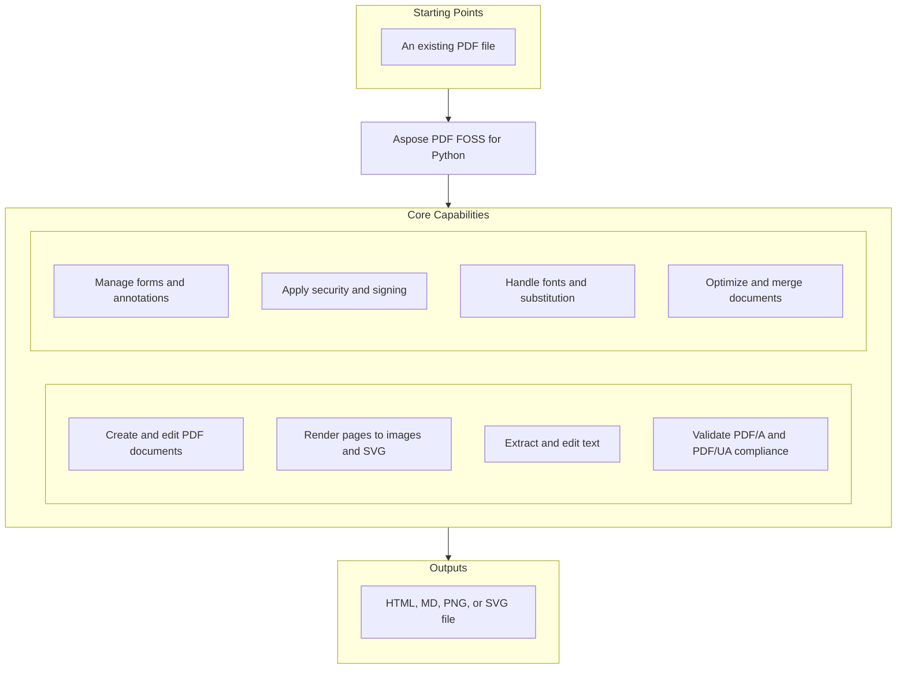

# Aspose PDF FOSS for Python

 [](LICENSE) [](https://github.com/aspose-pdf-foss/Aspose-PDF-FOSS-for-Python/graphs/contributors)

[](https://products.aspose.org/pdf/python/)

Aspose PDF FOSS for Python is a Python library for processing PDF documents, supporting operations such as loading, converting, extracting text, redacting, signing, and optimizing `.pdf` files. It enables developers to read page counts and metadata, convert pages to `.png` or `.svg`, export to `.html` or `.md`, validate compliance with PDF/A and PDF/UA standards, and add interactive elements like text fields and checkboxes. Users include developers building document automation, compliance, and content extraction workflows in Python 3.11 and later. The library is distributed under the MIT license and is version 0.1.0.

## Navigation

- [At a Glance](#at-a-glance)
- [Key Capabilities](#key-capabilities)
- [Installation](#installation)
- [Dependencies](#dependencies)
- [Quick Start](#quick-start)
- [Additional Examples](#additional-examples)
- [API Reference](#api-reference)
- [Documentation & Resources](#documentation--resources)
- [Scope and Limitations](#scope-and-limitations)
- [Development and Testing](#development-and-testing)
- [License](#license)

## At a Glance



## Key Capabilities

- **Create and edit PDF documents.** Create and edit PDF documents by loading existing files with `load_from`, adding text to pages via `add_text`, and inserting interactive form fields such as text fields using `add_text_field`, all managed through the `Document` and `AnnotationCollection` APIs.
- **Render pages to images and SVG.** Render pages to images and SVG by saving individual pages as images with `save_page_as_image` or `save_as_image` at a specified DPI, and exporting entire documents or pages as SVG using `save_as_svg` or `save_as_svg` respectively.
- **Extract and edit text.** Extract and edit text by binding a PDF to `PdfExtractor` and calling `extract_text` followed by `get_text` to retrieve content, or directly replacing text with `replace_text` and redacting sensitive content using `redact_text` on the `Document`.
- **Validate PDF/A and PDF/UA compliance.** Validate PDF/A and PDF/UA compliance by calling `validate_pdfa` or `validate_pdfua` to check conformance and `auto_tag` to add structural tags required for accessibility standards.
- **Manage forms and annotations.** Manage forms and annotations by adding interactive form fields like checkboxes and text fields with `add_checkbox` and `add_text_field`, and generating visual appearances for annotations using `generate_appearance`.
- **Apply security and signing.** Apply security and signing by encrypting and decrypting documents with encrypt and decrypt, signing documents using sign, and validating digital signatures through `PdfSignature.validate`.
- **Handle fonts and substitution.** Handle fonts and substitution by assigning system fonts via `FontSubstitutionOptions.system` to `font_substitution`, adding custom font sources with `FontRepository.add_source`, and locating fonts using `FontRepository.find_font`.
- **Optimize and merge documents.** Optimize and merge documents by combining multiple PDFs with `PdfFileEditor.concatenate`, reducing file size through `Document.optimize`, and merging content using `Document.merge`.

## Installation

`aspose-pdf-foss-for-python` is not yet published on PyPI; build it from a source checkout instead, verified against this revision:

```bash
git clone https://github.com/aspose-pdf-foss/Aspose-PDF-FOSS-for-Python.git
cd Aspose-PDF-FOSS-for-Python
pip install .
```

Verify the install:

```bash
python -c "import aspose_pdf"
```

The package declares `python_requires` as `>=3.11`.

## Dependencies

### Required Package Dependencies

- `asn1crypto>=1.5`
- `cryptography>=50`

### Optional Dependencies

- `atheris>=2.3` (extra `fuzz`)
- `Pillow>=12.3` (extra `images`)
- `fonttools>=4.60.2` (extra `text-layout`)
- `python-bidi>=0.6` (extra `text-layout`)
- `uharfbuzz>=0.37` (extra `text-layout`)
- `Brotli>=1.2` (extra `woff2`)

### Native and System Requirements

- Requires Python 3.11 or later (`python_requires=">=3.11"` in `pyproject.toml`).

### Development Dependencies

- `Brotli>=1.2` (extra `dev`)
- `build>=1.2` (extra `dev`)
- `fonttools>=4.60.2` (extra `dev`)
- `Pillow>=12.3` (extra `dev`)
- `pytest>=8` (extra `dev`)
- `python-bidi>=0.6` (extra `dev`)
- `reportlab>=4.2` (extra `dev`)
- `ruff>=0.6` (extra `dev`)
- `setuptools>=83` (extra `dev`)
- `twine>=5` (extra `dev`)
- `uharfbuzz>=0.37` (extra `dev`)
- `wheel` (extra `dev`)

## Quick Start

The first example opens an existing PDF file and prints its page count, version, and metadata using the `Document` class from `aspose_pdf`.

```python
from aspose_pdf import Document

with Document("input.pdf") as document:
    print(f"Pages: {document.page_count}")
    print(f"PDF version: {document.version}")
    print(document.info)
```

The second example loads a PDF from a file path, then renders the first page as a PNG image with 144 DPI resolution.

```python
from aspose_pdf import Document

with Document() as document:
    document.load_from("input.pdf")
    document.pages[0].save_as_image("page-1.png", dpi=144)
```

## Additional Examples

The following workflows demonstrate converting PDFs to Markdown and HTML, exporting pages as SVG, rendering pages with system fonts, extracting text, merging files, and applying resource limits for untrusted input.

### Convert a PDF to Markdown and HTML with page splitting

```python
from aspose_pdf import Document

with Document("report.pdf") as document:
    document.save_as_markdown("report.md")
    # Images as files in report_files/ rather than data: URIs; one HTML file per page.
    document.save_as_html("report.html", resources_directory="report_files", split_into_pages=True)
    print(document.to_markdown(pages=[0], markdown_format="CommonMark"))
```

<details>
<summary>View Additional Examples</summary>

### Export a PDF page and the entire document as SVG

```python
from aspose_pdf import Document

with Document("report.pdf") as document:
    document.pages[0].save_as_svg("page-1.svg")
    document.save_as_svg("report.svg")  # one file per page: report-1.svg, ...
```

### Render a page using system fonts when embedded fonts are missing

```python
from aspose_pdf import Document, FontSubstitutionOptions

with Document("report-cjk.pdf") as document:
    # Use the machine's own fonts; FontSubstitutionOptions(["/opt/fonts"]) or
    # FontSubstitutionOptions(fonts={"SimSun": data}) keep it reproducible.
    document.font_substitution = FontSubstitutionOptions.system()
    document.save_page_as_image(0, "page-1.png", dpi=144)
```

### Extract text from a PDF using `PdfExtractor`

```python
from aspose_pdf import PdfExtractor

with PdfExtractor() as extractor:
    extractor.bind_pdf("input.pdf")
    extractor.extract_text()
    print(extractor.get_text())
```

### Merge multiple PDF files into one using `PdfFileEditor`

```python
from aspose_pdf import PdfFileEditor

with PdfFileEditor() as editor:
    if not editor.concatenate(["part-1.pdf", "part-2.pdf"], "merged.pdf"):
        raise RuntimeError(editor.last_exception)
```

### Apply resource limits to reject oversized or complex PDFs

```python
from aspose_pdf import Document, PdfLoadLimits, PdfResourceLimitException

limits = PdfLoadLimits(
    max_input_bytes=64 * 1024 * 1024,
    max_decoded_stream_bytes=16 * 1024 * 1024,
    max_image_pixels=25_000_000,
)

try:
    with Document(limits=limits) as document:
        document.load_from("input.pdf")
except PdfResourceLimitException as error:
    print(f"PDF rejected: {error}")
```

</details>

## API Reference

The `aspose_pdf.Document` class serves as the primary entry point for working with PDF documents, providing access to pages, forms, outlines, and tagged content alongside encryption, merging, and optimization operations. Supporting modules include `aspose_pdf.Page` for per-page editing, `aspose_pdf.PdfExtractor` for extracting text, images, and attachments, `aspose_pdf.Form` for form field management, `aspose_pdf.AnnotationCollection` for annotation handling, `aspose_pdf.PdfSignature` for digital signature validation, `aspose_pdf.Merger` and `aspose_pdf.Splitter` for document assembly and disassembly, `aspose_pdf.Optimizer` for file size reduction, `aspose_pdf.TextExtractor` for text extraction workflows, `aspose_pdf.FontRepository` for font management, and `aspose_pdf.PdfLoadLimits` for controlling resource consumption.

The verified public surface has 284 types.

<details>
<summary>View the Complete Public API Surface</summary>

### Core API

| Class | Description |
| --- | --- |
| `Action` | Base class for an interactive action. |
| `Annotation` | Live view over a single annotation on a page. |
| `AnnotationCollection` | Mutable sequence-like wrapper over page annotations. |
| `ByteArrayDataSource` | A data source backed by in-memory bytes. |
| `DataSource` | Base class for plugin inputs and outputs. |
| `Destination` | Base class for a view destination on a document page. |
| `Document` | Pythonic wrapper for PDF document lifecycle and core operations. |
| `Field` | A field of an interactive form. |
| `FieldWidget` | Where one of a field's widgets sits: the page and the rectangle on it. |
| `FileDataSource` | A data source backed by a file on disk. |
| `FileFontSource` | Discover the font(s) contained in a single file. |
| `FileSpecification` | A document-level embedded file (/Filespec) with typed metadata. |
| `FitBDestination` | Fit the page's bounding box in the window. |
| `FitBHDestination` | Fit the bounding-box width with top at the top of the window. |
| `FitBVDestination` | Fit the bounding-box height with left at the left of the window. |
| `FitDestination` | Fit the whole page in the window. |
| `FitHDestination` | Fit the page width with top at the top of the window. |
| `FitRDestination` | Fit the rectangle (left, bottom, right, top) in the window. |
| `FitVDestination` | Fit the page height with left at the left of the window. |
| `FolderFontSource` | Collect fonts from a directory (optionally recursing into subfolders). |
| `FontDescriptor` | Represents a discoverable font. |
| `FontEmbeddingException` | Raised when there is an error embedding fonts in the PDF. |
| `FontRepository` | Aggregate font sources and resolve fonts by name. |
| `FontSource` | Base class for external font providers. |
| `FontSubstitutionOptions` | Font sources the renderer may substitute from. |
| `Form` | Represents an interactive form (AcroForm) within a PDF document. |
| `GoToAction` | Jump to a destination within this document. |
| `GoToRAction` | Jump to a destination in another (remote) PDF file. |
| `JavaScriptAction` | Run a JavaScript script (serialized verbatim, not validated). |
| `LaunchAction` | Launch an application or open a file (serialized verbatim). |
| `LinkAnnotation` | Concrete annotation type kept for compatibility with tests/API. |
| `MarkupAnnotation` | Base class for markup annotations. |
| `MemoryFontSource` | Expose a font program supplied as in-memory bytes. |
| `MergeOptions` | Options for :class:Merger: concatenate all inputs in order. |
| `Merger` | Concatenate every input PDF into a single document. |
| `NamedAction` | A predefined named action, e.g. NextPage, FirstPage, Print. |
| `NamespaceProvider` | Resolve XMP namespace prefixes and URIs. |
| `OperationResult` | A single result produced by a plugin. |
| `OptimizationOptions` | OptimizationOptions represents settings that control how a PDF document is optimized for size or quality. |
| `OptimizeOptions` | Options for :class:Optimizer. |
| `Optimizer` | Optimize each input PDF (compression + unused-object cleanup). |
| `Page` | A page of a PDF document. |
| `PageCollection` | A collection to manage PDF pages within a Document. |
| `PageLabel` | The labelling of one range of pages. |
| `PageLabelCollection` | A document's label ranges, keyed by the index of the page each starts at. |
| `PdfAValidateOptions` | Container for PDF/A validation settings. |
| `PdfAValidationResult` | Detailed result of a PDF/A validation run. |
| `PdfAValidator` | Plugin that runs PDF/A validation on one or more inputs. |
| `PdfExtractor` | Simple PDF text and image extractor. |
| `PdfFileEditor` | Facade for PDF file editing operations. |
| `PdfLoadLimits` | Immutable safety limits for untrusted PDF input and authored assets. |
| `PdfPlugin` | Base class for low-code plugins. |
| `PdfResourceLimitException` | Raised when processing a PDF would exceed a configured resource limit. |
| `PdfSignature` | Represent a PDF digital signature. |
| `PdfUaValidateOptions` | Container for batch PDF/UA validation settings. |
| `PdfUaValidationResult` | Detailed result of a PDF/UA structure check (heuristic). |
| `PdfUaValidator` | Plugin that runs heuristic PDF/UA validation on one or more inputs. |
| `PluginOptions` | Hold input/output data sources and their PDF resource-limit policy. |
| `RasterizedPage` | A rendered PDF page in packed RGB format. |
| `Recipient` | One certificate that may open the document, and what it may then do. |
| `ResetFormAction` | Reset the form's fields to their default values. |
| `ResultContainer` | Holds the ordered results of a plugin operation. |
| `SplitOptions` | Options for :class:Splitter: split every input into single pages. |
| `Splitter` | Split every input PDF into one document per page. |
| `StreamDataSource` | A data source backed by a binary stream (e.g. io.BytesIO). |
| `StructureElement` | A mutable logical-structure element in a tagged PDF. |
| `SubmitFormAction` | Send the form's field values to *URL*. |
| `SystemFontSource` | Collect fonts from common system font directories. |
| `TaggedContent` | Editable view of a document's logical structure tree. |
| `TextExtractor` | Extract plain text from each input PDF. |
| `TextExtractorOptions` | Options for :class:TextExtractor: extract text from each input. |
| `TextLayoutOptions` | Configure complex-text shaping and line layout for Page.add_text. |
| `URIAction` | Resolve a uniform resource identifier (typically a web link). |
| `UnsignedContent` | Represents a collection of unsigned content elements in a PDF document. |
| `UnsignedContentAbsorber` | Extract the pages, form fields and annotations no signature covers. |
| `UnsupportedFeatureException` | Raised when a compatibility surface names a feature this package lacks. |
| `ValidationOptions` | Configuration for signature validation. |
| `ValidationResult` | Structured result returned by signature validation. |
| `ViewerPreferences` | The document's /ViewerPreferences, read and written in place. |
| `XYZDestination` | Position (left, top) at the upper-left with an optional zoom. |
| `XmpArray` | An ordered XMP array value. |
| `XmpField` | A single XMP property. |
| `XmpPacket` | An in-memory XMP packet: an ordered collection of properties. |
| `XmpProperty` | A property carrying arbitrary qualifiers. |
| `XmpStruct` | A structured XMP value (an rdf:parseType="Resource" block). |
| `Name` | A str subclass that marks a value to be serialized as a PDF name. |
| `PDF3DAnnotation` | Minimal annotation wrapper for prerelease imports. |
| `PDF3DArtwork` | Container for 3D content and named views. |
| `PDF3DContent` | Reference to 3D content stored on disk. |
| `PDF3DView` | Lightweight description of a saved 3D view. |
| `CgmLoadOptions` | Options for loading CGM files. |
| `Cluster` | Represents a cluster of data points. |
| `ClusterCollection` | A collection of clusters. |
| `DataPoint` | Represents a data point in clustering operations. |
| `color.Color` | Represents a color in PDF documents. |
| `GradientAxialShading` | Represents axial (linear) gradient shading. |
| `Point` | Represents a point in 2D space. |
| `drawing.Rectangle` | Represents a rectangle with position and size. |
| `GeneratedAppearance` | A synthesised appearance: content bytes plus any required ExtGState entries. |
| `LayoutElement` | A positioned piece of page content (a text object or an image paint). |
| `TextObject` | A BT ... ET text object located in a content stream. |
| `ccitt.Decoder` | Decoder performs CCITT fax compression decoding on image data streams. |
| `ChainResult` | Result of building and validating a certificate path. |
| `CffOutlines` | Decode glyph outlines from a CFF (Type 2 charstring) font program. |
| `SignedDataInfo` | Everything we need from a parsed CMS SignedData. |
| `SignerVerification` | Outcome of verifying a single signer. |
| `AuthoredImage` | Prepared image data and PDF image XObject metadata. |
| `Isolation` | What to put around a page's content before appending to it. |
| `ContentStreamParser` | Parse a PDF content stream and extract plain text. |
| `PdfArray` | PdfArray holds an ordered collection of PDF objects and supports appending new elements. |
| `PdfBoolean` | PdfBoolean wraps a true or false value as a PDF boolean object. |
| `PdfDictionary` | PdfDictionary stores key-value pairs of PDF objects and provides methods to retrieve or remove entries. |
| `PdfDocument` | Container for a PDF's COS object graph. |
| `PdfIndirectReference` | PdfIndirectReference points to an object stored elsewhere in the PDF file by its object identifier. |
| `cos.PdfName` | PdfName represents a PDF name object, a short string used as a key or identifier. |
| `cos.PdfNull` | Represent PDF null object. |
| `cos.PdfNumber` | PdfNumber wraps numeric values and provides conversion to integer or double. |
| `PdfObject` | Base class for all PDF COS objects. |
| `PdfStream` | A stream object: a dictionary plus a byte payload. |
| `PdfString` | PdfString holds a sequence of bytes encoded as a PDF string object. |
| `data.Color` | Represents a color in PDF documents. |
| `Encoding` | Encoding converts Unicode text into a specific byte representation using a defined character set. |
| `data.PdfNull` | PdfNull represents the null object in the PDF object model, indicating the absence of a value. |
| `PdfObjectID` | PdfObjectID uniquely identifies an indirect object within a PDF file using an object number and generation number. |
| `PdfObjectRegistry` | PdfObjectRegistry manages the registration and lookup of indirect objects during PDF construction. |
| `PdfTrailerable` | PdfTrailerable provides access to the trailer dictionary of a PDF file, which contains metadata about the document. |
| `number.PdfNumber` | Represents a PDF number primitive (integer or real). |
| `types.PdfName` | Represents a PDF name object. |
| `XmpNamespaceProvider` | Bidirectional XMP namespace prefix <-> URI resolver. |
| `DecodedJpeg` | A decoded JPEG image. |
| `DssMaterial` | Validation material destined for (or harvested from) a /DSS. |
| `EncryptionUtils` | Utility class for PDF-compliant AES-CBC, RC4 encryption, and key derivation. |
| `StreamDecoder` | Decode PDF stream data using supported filters. |
| `StreamEncoder` | Encode raw bytes into PDF stream data, the inverse of :class:StreamDecoder. |
| `AuthoredFont` | A normalized embedded font and the mutable CID mapping for authored text. |
| `FontResolver` | Index external font sources and resolve PDF font names against them. |
| `ResolvedFace` | A font program picked for a non-embedded PDF font. |
| `FieldData` | One field's entry in an FDF or XFDF file. |
| `TrueTypeOutlines` | Decode glyph outlines from an embedded TrueType (glyf) program. |
| `AbsorbedElement` | One painted path or placed image, in page (user) space. |
| `TiffPage` | One image in a TIFF file. |
| `IncrementalUpdate` | Generate an incremental update section for an existing PDF. |
| `IncrementalWriter` | Utility that appends incremental updates to an existing PDF. |
| `InlineImage` | A BI ... ID ... EI image: its dictionary, expanded, and its samples. |
| `BitStream` | Minimal bit-oriented buffer used by compatibility code. |
| `jbig2.Decoder` | JBIG2 decoder that parses segment structure and extracts bitmap data. |
| `DecodedImage` | A decoded JPEG 2000 image as interleaved 8-bit samples. |
| `jpx.Decoder` | JPEG 2000 (JPX) Stream Decoder. |
| `OptionalContent` | The document's optional content groups and their default visibility. |
| `OptionalContentConfiguration` | One optional content configuration: /D, or an entry of /Configs. |
| `OptionalContentGroup` | One optional content group (/OCG) of the document. |
| `LabelRange` | How the pages from one range start onward are labelled. |
| `ParseWarnings` | Collects warnings during parsing. |
| `PdfCorruptedError` | Unrecoverable PDF corruption. |
| `PdfEncodingError` | Font or content stream encoding error. |
| `PdfMalformedError` | Recoverable malformed PDF structure. |
| `PdfParseError` | Base exception for PDF parsing errors. |
| `PdfParseWarning` | Non-fatal parsing issue that was recovered from. |
| `PdfSecurityError` | Encryption or permission related error. |
| `PdfValidationError` | PDF/A or general structural validation error. |
| `LazyPdfObjectStore` | Object-number → COS object map that parses from a :class:PdfCosParser on demand. |
| `PdfCosParser` | Parse a PDF file (bytes) into a :class:PdfDocument. |
| `PdfCosWriter` | Serialize a :class:PdfDocument to a PDF byte sequence. |
| `WriterEncryption` | The security handler, applied as :class:PdfCosWriter serialises. |
| `CharacterCollection` | A CIDSystemInfo registry, ordering, and supplement triple. |
| `PredefinedCMap` | A resolved predefined CMap and its semantic Unicode mapping. |
| `PredefinedCMapEncoding` | Compact code-to-CID view of a predefined CMap. |
| `Matrix` | Matrix represents a 3x3 transformation matrix used for coordinate transformations in PDF rendering. |
| `RecipientPayload` | What one opened envelope carries. |
| `RevocationResult` | RevocationResult indicates whether a digital signature's certificate chain has been revoked. |
| `DocumentFont` | The document's own font for a rich-text block, when there is one. |
| `RichRun` | RichRun holds a segment of text with consistent formatting attributes for rich text rendering. |
| `RichStyle` | The resolved style of a text run. |
| `SfntFace` | Metadata recovered from a single SFNT face. |
| `Shading` | Base class for bounded RGB sampling in a shading's target space. |
| `SignedChanges` | The objects that are new or different since the newest signed revision. |
| `SigningUtils` | Utility class for generating certificates and PKCS#7 signatures. |
| `CosExtractor` | Extract pages, streams, images and metadata from a PdfDocument. |
| `simple_pdf.ImagePlacement` | Represents an image placement on a page. |
| `simple_pdf.ImagePlacementAbsorber` | Absorber that finds image placements in a PDF. |
| `LazyImageDict` | Dictionary that decodes image streams on demand to save memory. |
| `PdfWriterV0` | Writes SimplePdf to PDF 1.7 format. |
| `SimplePdf` | Native Python PDF document representation. |
| `simple_pdf.TextFragmentAbsorber` | Absorber that extracts text fragments from a SimplePdf instance. |
| `TextFragmentCollection` | Collection of TextFragment objects. |
| `StandardFonts` | Utility class for the PDF Standard 14 fonts. |
| `CidTextCodec` | Code codec for a composite (Type0) font's show strings. |
| `Reshaper` | Policy for shaping complex-script replacements during a text edit. |
| `Block` | One piece of exported structure. |
| `GlyphPlacement` | One shaped glyph at an em-relative position within a laid-out line. |
| `LayoutLine` | One visual line with logical replacement text and shaped glyphs. |
| `LayoutResult` | Complete line layout; glyph coordinates and widths are in em units. |
| `CompositeFontMetric` | Advance metrics for a composite (Type0) font. |
| `LocatedText` | Where a match sits on the page, and what it is set in. |
| `SimpleFontMetric` | Advance metrics for a single-byte simple font, in 1000-unit glyph space. |
| `TimestampInfo` | Result of verifying an RFC 3161 timestamp token. |
| `Type1Outlines` | Decode glyph outlines from a Type 1 (/FontFile) font program. |
| `AsposePdfException` | Base class for all aspose_pdf exceptions. |
| `DeprecatedFeatureException` | Raised when a deprecated PDF feature is used that is not allowed in newer PDF versions. |
| `IncorrectCMapUsageException` | Raised when there is an incorrect usage of CMap. |
| `InvalidPasswordException` | Raised when an incorrect password is provided for an encrypted document. |
| `InvalidPdfFileFormatException` | Raised when the PDF file format is invalid or corrupted. |
| `InvalidValueFormatException` | Raised when an invalid value is encountered during parsing or conversion. |
| `PdfException` | Base class for PDF-related exceptions. |
| `PdfIOException` | Raised when there is an I/O error during PDF processing. |
| `PdfParseException` | Raised when there is an error parsing a PDF document. |
| `PdfSecurityException` | Raised when there is an encryption, signature, or permissions error. |
| `PdfValidationException` | Raised when a PDF document fails validation or compliance checks. |
| `FontRegistry` | Singleton registry for resolving well-known font names. |
| `InvalidFormTypeOperationException` | Exception thrown when an invalid form type operation is attempted. |
| `Matrix3D` | Represents a 3D transformation matrix. |
| `Point3D` | Represents a 3D point. |
| `GraphicElement` | A painted path or a placed image, read from a page's content stream. |
| `GraphicElementCollection` | An in-memory list of :class:GraphicElement objects. |
| `GraphicsAbsorber` | Absorbs graphic elements from PDF pages. |
| `InvalidOperationException` | Raised when a graphics element is attached to the wrong parent. |
| `HtmlLoadOptions` | Options for loading HTML documents. |
| `HtmlSaveOptions` | Options for saving PDF documents as HTML. |
| `images.ImagePlacement` | Represent an image placed on a PDF page. |
| `images.ImagePlacementAbsorber` | Absorber to collect image placements from PDF pages. |
| `images.Rectangle` | Rectangle representing image placement bounds on a PDF page. |
| `LatexFragment` | Small value object that stores LaTeX source text. |
| `Layer` | One optional content group, and whether it is currently shown. |
| `LayerCollection` | The document's layers, indexable by position or by name. |
| `LayerConfiguration` | A named optional content configuration a viewer can switch to. |
| `License` | License management class for Aspose.PDF. |
| `StatisticsEntry` | Entry for tracking statistics and timing information. |
| `CdrLoadOptions` | Options for loading CDR files. |
| `load_options.SvgLoadOptions` | Options for loading SVG files. |
| `WarichuWPElement` | Minimal tagged-element type for API compatibility. |
| `MarkdownSaveOptions` | Options for saving PDF documents as Markdown. |
| `OfdLoadOptions` | Options for loading OFD files. |
| `OutlineCollection` | Top-level collection of :class:OutlineItem bookmarks. |
| `OutlineItem` | A single bookmark entry in a PDF outline tree. |
| `PdfConsts` | PdfConsts provides utility methods for converting between decimal and octal representations of numbers. |
| `PdfAConversionResult` | Result of a PDF/A conversion operation. |
| `FillMode` | Fill mode enumeration for path operations. |
| `IMatrix` | Interface for matrix operations. |
| `IPath` | Path placeholder: constructible, but it cannot collect a path. |
| `ColorPrimitive` | Very small color primitive with transparency support. |
| `PrinterSettings` | PrinterSettings holds configuration options for printing a PDF document, such as page range and duplex mode. |
| `CompromiseCheckResult` | CompromiseCheckResult reports whether a digital signature's certificate has been compromised. |
| `SignaturesCompromiseDetector` | Detect possible compromise indicators around signed PDFs. |
| `Margin` | Margin defines the whitespace around an SVG element when rendering it to a PDF page. |
| `PageInfo` | PageInfo specifies the dimensions and layout of a page when converting SVG content to PDF. |
| `svg.SvgLoadOptions` | SvgLoadOptions controls how SVG files are loaded and converted into PDF content. |
| `TaggedContext` | TaggedContext provides access to the logical structure and metadata of a tagged PDF document. |
| `RegexResult` | Wraps a single regular-expression match found on a PDF page. |
| `TextAbsorber` | Absorbs text from PDF pages (legacy class, alias for TextFragmentAbsorber). |
| `TextExtractionOptions` | Options for text extraction from PDF pages. |
| `TextFormattingMode` | Text formatting mode for text extraction. |
| `TextFragment` | A text fragment found inside a PDF page. |
| `text.TextFragmentAbsorber` | Absorbs text fragments from a PDF page or document. |
| `TextSearchOptions` | Options controlling how text search is performed. |
| `PerformanceLogger` | Collects named phase timings, and free-form lines. |
| `VirtualizationPerformance` | A process-global stopwatch. Nothing in this package writes to it. |

#### Enumerations

| Enumeration | Description |
| --- | --- |
| `AnnotationFlags` | Flags that define annotation behaviour. |
| `AnnotationType` | Known annotation subtype names (PDF 32000-1:2008, Table 169). |
| `CertificationLevel` | DocMDP certification level of a signature. |
| `DuplexMode` | How the print dialogue starts out handling both sides (/Duplex). |
| `FieldType` | Type of form field. |
| `FormType` | Type of PDF form. |
| `NumberingStyle` | How the number part of a label is written (/S). |
| `PageBoundary` | A page box, for the entries that say which one to view or print. |
| `PageLayout` | How the pages are arranged (/PageLayout). |
| `PageMode` | What a viewer shows beside the page when the document opens (/PageMode). |
| `Plugin` | Identifiers for the available low-code plugins. |
| `PrintScaling` | What the print dialogue starts on (/PrintScaling). |
| `ReadingDirection` | The reading order of a two-column or two-page layout (/Direction). |
| `RevocationStatus` | Certificate revocation outcome (OCSP/CRL). |
| `TrustStatus` | Outcome of building/validating the signer's certificate chain. |
| `ValidationMethod` | Selects the signature format / validation algorithm. |
| `ValidationMode` | Controls whether certificate revocation is checked via network. |
| `ValidationStatus` | Outcome of a :class:ValidationResult. |
| `PDF3DLightingScheme` | PDF3DLightingScheme defines named lighting schemes used to render 3D annotations in a PDF document. |
| `PDF3DRenderMode` | PDF3DRenderMode specifies the rendering mode for 3D annotations, such as wireframe or solid shading. |
| `EncodingType` | EncodingType enumerates the supported text encoding schemes used within PDF content streams. |
| `FilterType` | FilterType enumerates the compression filters that can be applied to PDF streams. |
| `StructureTypeStandard` | StructureTypeStandard enumerates the standard structure types defined by the PDF specification for tagged PDF content. |
| `Duplex` | Duplex specifies the double-sided printing mode for a printer when outputting a PDF document. |
| `PrintRange` | PrintRange defines the range of pages to print when sending a PDF document to a printer. |
| `SaveFormat` | Format for saving PDF documents. |
| `DocFormat` | Target format for a save operation. |
| `PadesLevel` | PAdES baseline conformance level reached by a signature. |

#### Detailed Member Reference

### Document

The `aspose_pdf.Document` class enables loading PDFs from files or streams, accessing page collections and metadata, and performing operations such as encryption, decryption, signing, validation against PDF/A and PDF/UA standards, auto-tagging, optimization, merging, text replacement, redaction, and conversion to HTML, Markdown, and SVG formats.

- `add_attachment`: Embed *content* as a document-level file attachment named *name*.
- `add_document_timestamp`: Add a document timestamp when the document is next saved.
- `add_ltv`: Add long-term validation material (a /DSS) when the document is next saved.
- `attachments`: Get the collection of attachments in the document.
- `auto_tag`: Heuristically tag existing page content into the structure tree.
- `change_passwords`: Change the document's passwords and keep everything else.
- `check`: Check PDF integrity.
- `close`: Alias of :meth:dispose (matches .NET Close).
- `compress_streams`: Compress uncompressed document streams.
- `convert_to_pdfa`: Convert the document to PDF/A format in-place.
- `convert_to_pdfua`: Add the catalog-level PDF/UA prerequisites to the document in place.
- `decrypt`: Remove the document's password protection.
- `dispose`: Release the document and underlying engine resources (primary lifecycle API).
- `embedded_files`: The document's embedded files as typed :class:FileSpecification.
- `encrypt`: Encrypt the PDF document with the standard security handler.
- `encrypt_for_recipients`: Encrypt for certificate *recipients* with the public-key handler.
- `extract_pages`: Return an independent document containing selected pages in order.
- `extract_text`: The text of every page, in order, pages separated by a line break.
- `flatten`: Flatten annotations and forms.
- `flatten_layers`: Resolve optional content once and for all; return pages changed.
- `font_substitution`: Font sources the renderer may substitute non-embedded fonts from.
- `form`: Get the interactive form of the document.
- `free_memory`: Free memory by clearing caches.
- `generate_appearances`: Synthesise missing annotation appearance streams across all pages.
- `generate_field_appearances`: Regenerate AcroForm field appearance streams from their values.
- `get_embedded_file`: Return the embedded file named *name* as a :class:FileSpecification,
- `id`: Return the two-element file-identifier array from the PDF trailer.
- `info`: Get or set the document metadata (info dictionary).
- `is_encrypted`: Return True if document is encrypted.
- `is_pdfa_compliant`: Check if the document complies with the specified PDF/A level.
- `is_pdfua_compliant`: Heuristic PDF/UA-1 catalog structure check (tagged PDF shell).
- `iter_page_content_streams`: Yield decoded content stream bytes for each page, one at a time.
- `iter_pages`: Iterate over the pages of the document one at a time.
- `layers`: The document's optional content groups (layers).
- `load_from`: Load a PDF from a file path, raw bytes, or a binary stream.
- `load_limits`: Return limits used for loading, lazy processing, and authored assets.
- `merge`: Merge the supplied documents into this one.
- `open_action`: Where the document opens, or what it does when opened.
- `open_streaming`: Open a PDF in streaming/lazy mode for memory-efficient page processing.
- `optimize`: Process the document and remove unused resources.
- `optimize_resources`: Alias for :meth:optimize.
- `outlines`: Bookmark tree for this document.
- `page_count`: Return the current number of pages.
- `page_labels`: The page label ranges, keyed by the index of the page each starts at.
- `page_layout`: How the pages are arranged (/PageLayout, table 28).
- `page_mode`: What a viewer shows beside the page when the document opens.
- `pages`: Get the collection of pages.
- `permissions`: Access-permission flags (PDF /P value).
- `redact_text`: Remove existing text from simple page-content text-showing operands.
- `remove_attachment`: Remove the embedded file named *name*.
- `render_page`: Render a page to an RGB raster image.
- `repair`: Attempt to repair the PDF document.
- `replace_text`: Replace existing text in simple page-content text-showing operands.
- `save`: Save the document to a file path or a binary stream.
- `save_as_html`: Write the document as HTML and return the HTML files written.
- `save_as_markdown`: Write the document as one Markdown file and return its path.
- `save_as_svg`: Write pages as SVG and return the files written.
- `save_as_tiff`: Render pages into a single multi-page TIFF file.
- `save_page_as_image`: Render one page and save it as PNG, TIFF or JPEG.
- `sign`: Sign the document when it is next saved.
- `signatures`: The digital signatures in the document, in the order the file holds them.
- `sync_metadata`: Synchronise the /Info dictionary and the XMP metadata packet.
- `tagged_content`: Get an editable view of the document's tagged structure tree.
- `to_html`: Return the document's inferred structure as one HTML document.
- `to_markdown`: Return the document's inferred structure as Markdown.
- `update_attachment`: Change one embedded file, keeping everything not named here.
- `validate`: Validate the PDF document.
- `validate_pdfa`: Validate the document against PDF/A standards (heuristic checks).
- `validate_pdfua`: Validate catalog-level PDF/UA prerequisites (heuristic).
- `version`: PDF version string as it appears in the file header (e.g. '1.7').
- `viewer_preferences`: The window, the reading direction and the print dialogue.
- `xmp_metadata`: Get or set the document's XMP metadata packet (catalog /Metadata).

### Page

The `aspose_pdf.Page` class provides access to individual page properties such as index, label, rotation, media box, crop box, and content stream, along with methods for adding text, rendering to images or SVG, replacing text, redacting content, and managing annotations.

- `accept`: Dispatch this page to an object implementing visit(page).
- `add_image`: Place an image on this page and return its resource name.
- `add_link`: Add a clickable link over *rect* triggering *target*.
- `add_text`: Append positioned text to this page.
- `annotations`: Get the collection of annotations on the page.
- `content`: Get the page content stream.
- `crop_box`: The page CropBox (x0, y0, x1, y1); falls back to the MediaBox when unset.
- `draw_line`: Append a stroked line segment to this page.
- `draw_rectangle`: Append a stroked and/or filled rectangle to this page.
- `extract_text`: The text this page says, with the line breaks it was written in.
- `index`: The zero-based index of the page.
- `label`: The page's label -- "iii", "12", "A-1" -- as a viewer shows it.
- `layer`: Author content onto *layer*, as a context manager.
- `media_box`: Alias for rect.
- `rect`: Get the page rectangle (MediaBox).
- `redact_text`: Remove existing text from simple text-showing operands on this page.
- `render`: Render this page to an RGB raster image.
- `replace_text`: Replace existing text in simple text-showing operands on this page.
- `rotation`: The page rotation in degrees, clockwise (one of 0, 90, 180, 270).
- `save_as_image`: Render this page and save it as PNG, TIFF or JPEG.
- `save_as_svg`: Write this page to *path* as SVG and return the path.
- `to_html`: Return this page's inferred structure as an HTML fragment document.
- `to_markdown`: Return this page's inferred structure as Markdown (GFM).
- `to_svg`: Return this page as an SVG document.

### PdfExtractor

The `aspose_pdf.PdfExtractor` class enables binding to a PDF document and extracting text, images, and attachments using methods such as `extract_text`, `get_text`, `extract_image`, `get_next_image`, `extract_attachment`, `get_attachment`, and `get_attach_names`.

- `bind_pdf`: Bind to a PDF source for extraction.
- `close`: Close the extractor and release resources.
- `dispose`: Mark the extractor as disposed.
- `extract_attachment`: Extract attachments from bound PDF.
- `extract_image`: Collect the bound document's images, each as a real image file.
- `extract_text`: Extract text from the bound document's pages.
- `get_attach_names`: Return list of attachment names.
- `get_attachment`: Return attached file by name.
- `get_next_image`: The next image as an image file, advancing the cursor.
- `get_next_image_name`: The name of the image :meth:get_next_image will hand back next.
- `get_next_page_text`: Return text for the next page, advancing cursor.
- `get_text`: Return all extracted text concatenated.
- `has_next_image`: Return True if there is another image available.
- `has_next_page_text`: Return True if there is another page's text available.
- `password`: Optional owner/user password used when binding encrypted PDFs (maps .NET Password).

### Form

The `aspose_pdf.Form` class supports adding text fields, checkboxes, combo boxes, list boxes, push buttons, radio groups, and signature fields to a PDF, as well as removing fields, flattening the form, generating appearances, and importing or exporting form data in FDF and XFDF formats.

- `add_checkbox`: Add a check box with generated Off/on appearances.
- `add_combo_box`: Add a combo box, optionally allowing values outside its option list.
- `add_list_box`: Add a list box with string or export/display options.
- `add_push_button`: Add a push button with generated caption/rollover/down appearances.
- `add_radio_group`: Add a radio field whose option names map to widget rectangles.
- `add_signature_field`: Add an empty (unsigned) signature field and return it.
- `add_text_field`: Add an editable text field and return it.
- `export_fdf`: The form's data as FDF (ISO 32000-1 12.7.8), written to *destination* if given.
- `export_xfdf`: The form's data as XFDF (ISO 19444-1), written to *destination* if given.
- `fields`: A list of all fields in the form.
- `flatten`: Flatten all fields in the form, making them part of the page content.
- `generate_appearances`: Regenerate field appearance streams from the current field values.
- `import_fdf`: Fill the form from FDF data and return the names of the fields it named.
- `import_xfdf`: Fill the form from XFDF data; see :meth:import_fdf.
- `remove_field`: Remove a field by fully qualified name and return the removed field.

### AnnotationCollection

The `aspose_pdf.AnnotationCollection` class provides methods to add, insert, and delete annotations on a page, clear all annotations, and generate appearances for annotation visuals.

- `add`: Defined as `def add(self, subtype: str, rect: tuple[float, float, float, float], contents: str, *, title: str / None=None, appearance_normal: bytes / bytearray / None=None, properties: dict[str, Any] / None=None) -> Annotation`.
- `clear`: Defined as `def clear(self) -> None`.
- `delete`: Defined as `def delete(self, index: int) -> None`.
- `generate_appearances`: Synthesise missing appearance streams for every annotation on the page.
- `insert`: Defined as `def insert(self, index: int, subtype: str, rect: tuple[float, float, float, float], contents: str, *, title: str / None=None, appearance_normal: bytes / bytearray / None=None, properties: dict[str, Any] / None=None) -> Annotation`.

### PdfSignature

The `aspose_pdf.PdfSignature` class exposes properties and methods to validate digital signatures and check their validity status.

- `valid`: Public accessor that safely verifies the signature.
- `validate`: Validate the signature with configurable options.

### Merger

The `aspose_pdf.Merger` class provides a process method to concatenate multiple PDF documents into a single output file.

- `process`: Defined as `def process(self, options: MergeOptions) -> ResultContainer`.

### Splitter

The `aspose_pdf.Splitter` class provides a process method to split a PDF document into separate files, either by page ranges or individual pages.

- `process`: Defined as `def process(self, options: SplitOptions) -> ResultContainer`.

### Optimizer

The `aspose_pdf.Optimizer` class provides a process method to reduce PDF file size by optimizing images, fonts, and other resources within the document.

- `process`: Defined as `def process(self, options: OptimizeOptions) -> ResultContainer`.

### TextExtractor

The `aspose_pdf.TextExtractor` class provides a process method to extract text content from a PDF document for further processing or analysis.

- `process`: Defined as `def process(self, options: TextExtractorOptions) -> ResultContainer`.

### FontRepository

The `aspose_pdf.FontRepository` class allows managing font sources by adding or resetting sources, searching for fonts, finding specific fonts, opening fonts, and retrieving available fonts.

- `add_source`: Register *source*; sources are queried highest-priority first.
- `clear_sources`: Remove all registered sources (including the system source).
- `find_font`: Resolve *font_name* against registered sources, then standards.
- `get_available_fonts`: Return all discoverable fonts, de-duplicated across sources.
- `get_sources`: Return the registered sources in query order.
- `open_font`: Return embeddable font bytes for *font_name*, or None.
- `reset_sources`: Restore the default source list (system fonts only).
- `search`: Defined as `def search(cls, font_name: str) -> FontDescriptor / None`.

### PdfLoadLimits

The `aspose_pdf.PdfLoadLimits` class provides a setting to configure unlimited resource limits when loading PDF documents.

- `unlimited`: Return a configuration with every limit disabled.


The `Document` class is the central entry point — it exposes `pages`, `form`, `outlines`, and
`tagged_content` for structural editing alongside `encrypt`, `decrypt`, `merge`, `optimize`, and
`flatten` operations. `PdfExtractor` handles text, image, and attachment extraction, and
`PdfFileEditor` provides a boolean-returning facade for file-based concatenate, extract, insert,
and delete workflows. 265 public types are organized by module below.

- `Document`
  - `load_from(source, password, limits) -> Document` / `open_streaming(path, password, limits) -> Document`
  - `save(destination, save_format, overwrite) -> Document` / `merge() -> Document`
  - `optimize(options, compress_streams) -> Document` (alias `optimize_resources(options) -> Document`)
  - `encrypt(user_password, owner_password, permissions) -> Document` / `decrypt(password) -> Document` /
    `change_passwords(old_password, new_user_password, new_owner_password) -> Document`
  - `validate() -> bool` / `check() -> bool` / `repair() -> Document`
  - `validate_pdfa(level) -> PdfAValidationResult` / `convert_to_pdfa(level, font_lookup_directory) -> list[str]`
  - `validate_pdfua() -> PdfUaValidationResult` / `convert_to_pdfua(language, title, auto_tag) -> list[str]` /
    `auto_tag(image_alt) -> int`
  - `replace_text(search, replacement, page_index, case_sensitive, max_count) -> int` /
    `redact_text(search, page_index, case_sensitive, max_count, overlay, overlay_color) -> int`
  - `render_page(page_index, dpi, scale, background, antialias, shape_substitute_text, draw_annotations, font_substitution) -> RasterizedPage` /
    `save_page_as_image(page_index, destination, dpi, scale, background, antialias, mode, compression, quality, threshold) -> Path` /
    `save_as_tiff(destination, pages, dpi, scale, background, antialias, mode, compression, threshold) -> Path` /
    `save_as_svg(destination, pages, background, draw_annotations, font_substitution, precision, overwrite) -> list[Path]`
  - `to_html(pages, title, embed_images, paragraph_gap, clip_to_page) -> str` /
    `to_markdown(pages, title, embed_images, markdown_format, paragraph_gap, clip_to_page) -> str` /
    `save_as_html(destination, pages, title, embed_images, split_into_pages, resources_directory, paragraph_gap, clip_to_page, overwrite) -> list[Path]` /
    `save_as_markdown(destination, pages, title, embed_images, image_directory, markdown_format, paragraph_gap, clip_to_page, overwrite) -> Path`
  - `flatten() -> Document` / `generate_appearances(force) -> int` / `generate_field_appearances() -> int`
  - `iter_pages() -> Iterator[Page]` / `iter_page_content_streams() -> Generator[bytes, None, None]`
  - `sync_metadata(direction) -> Document` /
    `add_attachment(name, content, mime, description, creation_date, mod_date, compress) -> Document`
  - properties: `pages`, `page_labels`, `form`, `outlines`, `layers`, `tagged_content`, `load_limits`,
    `xmp_metadata`, `embedded_files`, `page_count`, `info`, `is_encrypted`, `permissions`,
    `is_pdfua_compliant`, `font_substitution`, `page_mode`, `page_layout`, `open_action`,
    `viewer_preferences`

</details>

## Documentation & Resources

- **[Getting started guide](https://docs.aspose.org/pdf/python/)** — The getting started guide introduces the core concepts and basic usage patterns for Aspose PDF FOSS for Python.
- **[How-to guides & FAQ](https://kb.aspose.org/pdf/python/)** — The how-to guides and FAQ provide practical examples and answers to common questions about using Aspose PDF FOSS for Python.
- **[Full API reference](https://reference.aspose.org/pdf/python/)** — The full API reference documents every class, method, and property available in Aspose PDF FOSS for Python. It covers all 284 verified public types; the [API Reference](#api-reference) section above covers the essentials.
- **[Full feature and limitations matrix](supported-features.md)** — The full feature and limitations matrix outlines which PDF features Aspose PDF FOSS for Python supports and which it does not.
- **[Contributor guide](AGENTS.md)** — The contributor guide explains how to set up the development environment and contribute code to Aspose PDF FOSS for Python.
- **[Security policy](SECURITY.md)** — The security policy describes how to report vulnerabilities and how the project handles security issues.
- **[Changelog](CHANGELOG.md)** — The changelog lists all notable changes between versions of Aspose PDF FOSS for Python.
- Found a bug or have a feature request? [Open an issue](https://github.com/aspose-pdf-foss/Aspose-PDF-FOSS-for-Python/issues).

## Scope and Limitations

Aspose PDF FOSS for Python provides a Pythonic API for reading, inspecting, and converting PDF documents, supporting PDF/A and PDF/UA validation, text replacement and redaction, and export to HTML and Markdown. It targets developers who need lightweight, open-source PDF processing in Python 3.11 or later under the MIT license.

- PDF/A and PDF/UA validation provided by `aspose_pdf.Document.validate_pdfa` and `aspose_pdf.Document.validate_pdfua` are heuristic checks against document structure and not certification-grade validation, and a dedicated validator such as veraPDF should be used for formal compliance.
- Text replacement and redaction via `aspose_pdf.Document.replace_text` and `aspose_pdf.Document.redact_text` rewrite matched runs in place but never reflow the surrounding layout, and OCR and layout reflow are not implemented.
- Export to HTML and Markdown via `aspose_pdf.Document.to_html` and `aspose_pdf.Document.to_markdown` carries structure, not appearance: positioning, colour, and fonts are dropped, and the structure is `auto_tag`'s, so headings come from font size alone, list nesting is flat, and a table needs a regular grid.
- Public-key encryption via `aspose_pdf.Document.encrypt_for_recipients` covers RSA recipients only; key-agreement, password, and KEK recipient types, and RC2-encrypted envelopes, are rejected explicitly, and no PDF 2.0 message authentication code (/`AuthCode`) is produced or checked.
- Rendering quality and speed depend on the optional Pillow>=12.3 dependency: the bundled JPEG 2000 decoder is pure Python and slow, roughly a second per 100k pixels, and complex-text shaping and WOFF2 decoding need the optional text-layout and woff2 extras.
- `Page` rendering is a best-effort rasterizer, not a certification-grade visual engine: its overprint support is a composite RGB preview rather than a plate-accurate separation model, and complete PDF 2.0 imaging semantics are not implemented.

## Development and Testing

Build and test the aspose-pdf-foss-for-python package by running tests from the tests/ directory using the CI workflow defined in .github/workflows/.

The suite covers 287 test files under `tests/`. Releases run through the [publish-pypi workflow](.github/workflows/publish-pypi.yml).

## License

This project is licensed under the [MIT License](LICENSE). The MIT License permits use, copying, modification, distribution, sublicensing, and commercial use, provided its copyright and permission notice are retained. The software is provided without warranty.
