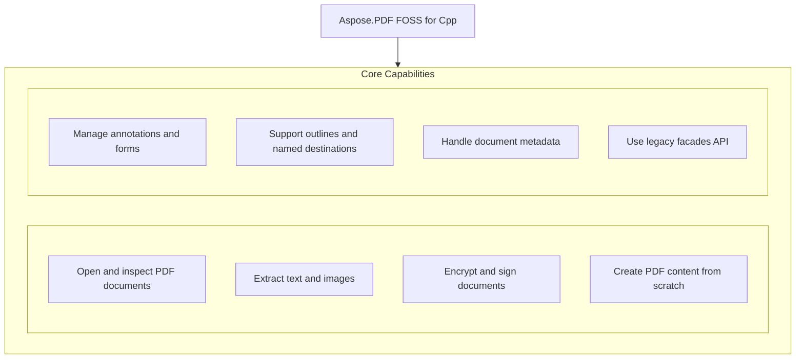

# Aspose.PDF FOSS for Cpp

[](LICENSE) [](https://github.com/aspose-pdf-foss/Aspose.PDF-FOSS-for-Cpp/graphs/contributors)

[](https://products.aspose.org/pdf/cpp/)

Aspose.PDF FOSS for Cpp is a free, open-source C++20 library for creating, reading, editing, and converting PDF documents. It solves problems such as extracting text, rasterising pages to images, encrypting files with granular permissions, and building documents from scratch with text, tables, vector graphics, and interactive forms. Developers working in modern C++ use it to integrate robust PDF capabilities into applications without commercial licensing or external runtime dependencies. The library's public API mirrors the commercial Aspose.PDF for .NET library where natural, supporting migration and consistency.

## Navigation

- [At a Glance](#at-a-glance)
- [Key Capabilities](#key-capabilities)
- [Installation](#installation)
- [Dependencies](#dependencies)
- [Quick Start](#quick-start)
- [Additional Examples](#additional-examples)
- [API Reference](#api-reference)
- [Documentation & Resources](#documentation--resources)
- [Scope and Limitations](#scope-and-limitations)
- [Development and Testing](#development-and-testing)
- [Third-Party Notices](#third-party-notices)
- [License](#license)

## At a Glance



## Key Capabilities

- **Open and inspect PDF documents.** Open existing PDF files with `Aspose.Pdf.Document`, including password-protected files by passing the user or owner password to the constructor, and inspect encryption status with `IsEncrypted()` before reading pages, extracting text, or saving changes.
- **Extract text and images.** Extract text from a `Document` or single `Page` using `Aspose.Pdf.Text.TextAbsorber`, and render individual pages or page ranges to raster images with `Aspose.Pdf.Devices.PngDevice`, `JpegDevice`, `BmpDevice`, or `TiffDevice` without external runtime dependencies.
- **Encrypt and sign documents.** Encrypt documents using `Document.Encrypt` with granular `Permissions` flags and algorithms including AES-256, and sign documents with `Aspose.Pdf.Facades.PdfFileSignature` to add a detached PKCS#7 signature with byte-exact /`ByteRange`.
- **Create PDF content from scratch.** Create PDF content from scratch using positioned text via `Aspose.Pdf.Text.TextBuilder` and `TextFragment`, tabular layout with `Table`/`Row`/`Cell`, vector shapes through `Aspose.Pdf.Drawing.Graph`, and rotated text overlays with `WatermarkArtifact`.
- **Manage annotations and forms.** Add and manage annotations such as Highlight, Underline, Squiggly, `StrikeOut`, Square, `Circle`, `Line`, Ink, Text, FreeText, Stamp, Link, and FileAttachment with pre-generated appearance streams, and add interactive AcroForm fields through `Aspose.Pdf.Forms.Form`.
- **Support outlines and named destinations.** Build hierarchical outlines with `Aspose.Pdf.OutlineCollection` and `OutlineItemCollection` using bold/italic styling and `XYZExplicitDestination` targets, define reusable named destinations via `Aspose.Pdf.NamedDestinationCollection`, and attach document-level companion files through `Document.EmbeddedFiles`.
- **Handle document metadata.** Read and write document metadata using typed `Aspose.Pdf.DocumentInfo` accessors for title, author, subject, keywords, creator, producer, and dates, plus Add, Remove, and `ClearCustomData` for arbitrary entries, and access XMP metadata through `Aspose.Pdf.Metadata`.
- **Use legacy facades API.** Use the legacy `Aspose.Pdf.Facades` API classes including `PdfConverter`, `PdfExtractor`, `PdfFileSecurity`, `PdfFileSignature`, `PdfBookmarkEditor`, `PdfFileEditor`, and `PdfFileStamp`, each binding independently to a `Document` for rasterisation, extraction, encryption, signing, bookmark editing, document splitting and concatenation, and stamping.

## Installation

`Aspose_PDF_FOSS` is not yet published on any package registry; build it from a source checkout instead, verified against this revision:

```bash
git clone https://github.com/aspose-pdf-foss/Aspose.PDF-FOSS-for-Cpp.git
cd Aspose.PDF-FOSS-for-Cpp
cmake -S . -B build
```

## Dependencies

### Required Package Dependencies

No required third-party package dependencies; in `CMakeLists.txt`, no dependency is on the library target's public link interface, so a consumer links nothing beyond the library itself.

### Native and System Requirements

- Requires C++ `20` (`CMAKE_CXX_STANDARD` in `CMakeLists.txt`).

### Development Dependencies

- `googletest`
- `Python3`

## Quick Start

This example opens a PDF, prints the page count, extracts all text, and renders the first page as a PNG image at 150 DPI using Aspose_PDF_FOSS.

```cpp
#include <aspose/pdf/document.hpp>
#include <aspose/pdf/page_collection.hpp>
#include <aspose/pdf/text_absorber.hpp>
#include <aspose/pdf/png_device.hpp>
#include <aspose/pdf/resolution.hpp>
#include <fstream>
#include <iostream>

int main() {
    Aspose::Pdf::Document doc("input.pdf");
    std::cout << "Pages: " << doc.Pages().Count() << "\n";

    Aspose::Pdf::Text::TextAbsorber absorber;
    absorber.Visit(doc);
    std::cout << absorber.Text() << "\n";

    Aspose::Pdf::Devices::PngDevice png(Aspose::Pdf::Devices::Resolution(150));
    std::ofstream out("page1.png", std::ios::binary);
    png.Process(doc.Pages()[1], out);
}
```

## Additional Examples

The Aspose.PDF FOSS for Cpp library supports opening encrypted documents, reading and updating document metadata, and applying AES-256 encryption to PDF files.

### Encrypt a document with AES-256 using Aspose_PDF_FOSS 1.0.0

```cpp
#include <aspose/pdf/document.hpp>

int main() {
    Aspose::Pdf::Document doc("input.pdf");
    doc.Encrypt("user-password", "owner-password",
                Aspose::Pdf::Permissions(),
                Aspose::Pdf::CryptoAlgorithm::AESx256);
    doc.Save("encrypted.pdf");
}
```

<details>
<summary>View Additional Examples</summary>

### Open a password-protected PDF using Aspose_PDF_FOSS 1.0.0

```cpp
#include <aspose/pdf/document.hpp>

// Encrypted files: pass the user or owner password
Aspose::Pdf::Document locked("locked.pdf", "secret");
if (locked.IsEncrypted()) {
    // proceed to read pages, extract text, etc.
}
```

### Read and update document metadata in Aspose_PDF_FOSS 1.0.0

```cpp
#include <aspose/pdf/document.hpp>
#include <aspose/pdf/document_info.hpp>
#include <iostream>

int main() {
    Aspose::Pdf::Document doc("input.pdf");
    auto& info = doc.Info();
    std::cout << "Title: " << info.Title() << "\n";
    std::cout << "Author: " << info.Author() << "\n";

    doc.SetTitle("Updated Report Title");
    doc.Save("output.pdf");
}
```


See [`tests/facades_pdf_file_signature_smoke_test.cpp`](tests/facades_pdf_file_signature_smoke_test.cpp)
for the full signing flow.

Field types: `TextBoxField`, `CheckboxField`, `RadioButtonField`, `ComboBoxField`, `ListBoxField`,
`ButtonField`.

`PdfConverter` also exposes a per-page cursor — `HasNextImage()`/`GetNextImage(outputFile)` — for
walking pages one at a time as PNGs via `Devices::PngDevice`, and `PageCount()` for the real page
count.

</details>

## API Reference

Aspose.PDF FOSS for Cpp exposes the `Aspose.Pdf.Document` class as the primary entry point for loading, creating, and manipulating PDF documents. From `Document`, developers access core capabilities such as text extraction, rendering, annotation, form handling, encryption, and metadata management through dedicated sub-namespaces.

The verified public surface has 248 types.

<details>
<summary>View the Complete Public API Surface</summary>

### Core API

| Class | Description |
| --- | --- |
| `Annotation` | Annotation represents a generic annotation object that can be added to a PDF page, providing properties for appearance, position, and behavior. |
| `AnnotationCollection` | AnnotationCollection provides a container for managing a collection of annotations on a PDF page, supporting operations such as adding, removing, and iterating. |
| `AnnotationSelector` | AnnotationSelector provides a visitor interface to traverse and process annotations based on their type. |
| `BleedMarkAnnotation` | BleedMarkAnnotation represents a bleed mark annotation used to indicate the trim area in printed output. |
| `Border` | Border defines the visual characteristics of an annotation's border, including width, style, and corner radius. |
| `CaretAnnotation` | CaretAnnotation represents a caret mark annotation used to indicate the insertion point of text. |
| `Characteristics` | Characteristics holds the visual and behavioral properties of an annotation, including rotation and opacity. |
| `CircleAnnotation` | CircleAnnotation represents a circular annotation that can be drawn on a PDF page. |
| `ColorBarAnnotation` | ColorBarAnnotation represents a color bar annotation used to display a gradient or color scale. |
| `CommonFigureAnnotation` | CommonFigureAnnotation represents a generic geometric figure annotation, such as a rectangle or ellipse. |
| `CornerPrinterMarkAnnotation` | CornerPrinterMarkAnnotation represents a printer mark placed at the corner of a page for alignment during printing. |
| `DefaultAppearance` | DefaultAppearance specifies the default font, size, and text color used for annotation text display. |
| `ExplicitDestination` | ExplicitDestination defines a specific location within a PDF document that can be targeted by a link or action. |
| `FileAttachmentAnnotation` | FileAttachmentAnnotation represents an annotation that attaches a file to a PDF page. |
| `FitBExplicitDestination` | FitBExplicitDestination defines a destination that fits the bounding box of the page content to the viewer window. |
| `FitBHExplicitDestination` | FitBHExplicitDestination defines a destination that fits the page width to the viewer window while holding the top Y coordinate. |
| `FitBVExplicitDestination` | FitBVExplicitDestination defines a destination that fits the page height to the viewer window while holding the left X coordinate. |
| `FitExplicitDestination` | FitExplicitDestination defines a destination that fits the entire page to the viewer window. |
| `FitHExplicitDestination` | FitHExplicitDestination defines a destination that fits the page width to the viewer window at a specified Y coordinate. |
| `FitRExplicitDestination` | FitRExplicitDestination defines a destination that fits a specified rectangle to the viewer window. |
| `FitVExplicitDestination` | FitVExplicitDestination defines a destination that fits the page height to the viewer window at a specified X coordinate. |
| `FreeTextAnnotation` | FreeTextAnnotation represents a text annotation that displays text directly on the page without a callout. |
| `GoToAction` | GoToAction represents an action that navigates to a specified destination within the same PDF document. |
| `GoToURIAction` | GoToURIAction represents an action that opens a Uniform Resource Identifier, such as a web URL, in the default browser. |
| `HighlightAnnotation` | HighlightAnnotation represents a text highlight annotation used to emphasize content on a PDF page. |
| `IAppointment` | IAppointment represents an appointment annotation in a PDF document. |
| `InkAnnotation` | InkAnnotation represents an ink annotation that captures freehand drawing strokes on a PDF page. |
| `JavascriptAction` | JavascriptAction represents an action that executes a JavaScript script when triggered. |
| `LineAnnotation` | LineAnnotation represents a line annotation that draws a straight line between two points on a PDF page. |
| `LinkAnnotation` | LinkAnnotation represents a hyperlink annotation that navigates to a destination or action when clicked. |
| `MarkupAnnotation` | MarkupAnnotation is a base class for annotations that mark up or highlight content in a PDF document. |
| `MovieAnnotation` | MovieAnnotation represents a movie annotation that embeds and plays a video clip in a PDF document. |
| `NamedAction` | NamedAction represents a predefined action identified by a standard name, such as printing or saving. |
| `NamedDestination` | NamedDestination represents a named destination that can be referenced by a link annotation. |
| `PageInformationAnnotation` | PageInformationAnnotation represents an annotation that stores page-level information. |
| `PdfAction` | PdfAction is a base class for actions that can be executed in response to user interaction in a PDF document. |
| `PolyAnnotation` | PolyAnnotation is a base class for polygon and polyline annotations that draw multi-segment shapes. |
| `PolygonAnnotation` | PolygonAnnotation represents a polygon annotation that draws a closed multi-segment shape on a PDF page. |
| `PolylineAnnotation` | PolylineAnnotation represents a polyline annotation that draws an open multi-segment shape on a PDF page. |
| `PopupAnnotation` | PopupAnnotation represents a popup window that can be opened to display additional information for another annotation. |
| `PrinterMarkAnnotation` | PrinterMarkAnnotation represents a printer mark annotation used for professional printing workflows. |
| `RedactionAnnotation` | RedactionAnnotation represents a redaction annotation that hides or removes content from a PDF document. |
| `RegistrationMarkAnnotation` | RegistrationMarkAnnotation represents a registration mark annotation used to align printed layers. |
| `RichMediaAnnotation` | RichMediaAnnotation represents a rich media annotation that embeds interactive content such as Flash or 3D models. |
| `ScreenAnnotation` | ScreenAnnotation represents a screen annotation that can trigger actions when clicked, often used for interactive elements. |
| `SoundAnnotation` | SoundAnnotation represents a sound annotation that embeds and plays an audio clip in a PDF document. |
| `SquareAnnotation` | SquareAnnotation represents a square annotation that draws a rectangle on a PDF page. |
| `SquigglyAnnotation` | SquigglyAnnotation represents a squiggly underline annotation used to mark text. |
| `StampAnnotation` | StampAnnotation represents a stamp annotation that applies a visual stamp to a PDF page. |
| `StrikeOutAnnotation` | StrikeOutAnnotation represents a strikeout annotation that draws a line through text to mark it for deletion. |
| `SubmitFormAction` | SubmitFormAction represents an action that submits form data to a specified URL. |
| `TextAnnotation` | TextAnnotation represents a sticky note or text note annotation that displays a pop-up with text content. |
| `TextMarkupAnnotation` | Represents a text markup annotation such as highlight, underline, or strikeout. |
| `TextStyle` | Defines the visual style for text, including alignment, font name, and font size. |
| `TrimMarkAnnotation` | Represents a trim mark annotation used to indicate裁切 lines in a PDF. |
| `UnderlineAnnotation` | Represents an underline annotation that underlines a specified region in the document. |
| `WatermarkAnnotation` | Represents a watermark annotation that overlays text or an image on a page. |
| `WidgetAnnotation` | Represents a widget annotation, typically used for interactive form fields. |
| `XYZExplicitDestination` | Represents an explicit destination that specifies a view position using X, Y, and zoom coordinates. |
| `Artifact` | Represents an artifact, such as a watermark or background image, attached to a page. |
| `ArtifactCollection` | Manages a collection of artifacts associated with a page. |
| `BaseParagraph` | Serves as the base class for paragraph-like content with alignment, margin, and positioning properties. |
| `BitmapInfo` | Describes the properties of a bitmap image, including its dimensions, format, and pixel data. |
| `BorderInfo` | Encapsulates border properties such as thickness and rounded corner radius for table cells or other elements. |
| `Cell` | Represents a single cell within a table, supporting alignment and background color settings. |
| `Cells` | Manages a collection of cells in a table row. |
| `Color` | Represents a color value used throughout the API for fill, stroke, and text rendering. |
| `BmpDevice` | Renders a PDF document or page to a BMP image file. |
| `Device` | Serves as the base class for all rendering devices that convert PDF content to images. |
| `DocumentDevice` | Renders an entire PDF document to an image format supported by the device. |
| `ImageDevice` | Serves as the base class for image-specific rendering devices. |
| `JpegDevice` | Renders a PDF document or page to a JPEG image file. |
| `Margins` | Represents the margin settings applied to the rendered output image. |
| `PageDevice` | Renders a single page of a PDF document to an image format supported by the device. |
| `PngDevice` | Renders a PDF document or page to a PNG image file. |
| `Resolution` | Specifies the resolution in dots per inch used when rendering a PDF to an image. |
| `TextDevice` | Renders a PDF document or page to a text-based output format. |
| `TiffDevice` | Renders a PDF document or page to a TIFF image file. |
| `TiffSettings` | Configures settings such as compression and color depth for TIFF output. |
| `Document` | Represents a PDF document and provides access to its pages, metadata, and structure. |
| `DocumentInfo` | Stores document-level metadata such as title, author, and subject. |
| `Circle` | Represents a circle shape in vector graphics. |
| `Ellipse` | Represents an ellipse shape in vector graphics. |
| `Graph` | Represents a container for vector graphics shapes such as circles, ellipses, and lines. |
| `Line` | Represents a straight line segment in vector graphics. |
| `Drawing.Rectangle` | Aspose.Pdf.Drawing.Rectangle represents a rectangular area defined by its lower-left and upper-right coordinates, supporting geometric operations such as intersection, containment checks, and transformations. |
| `Shape` | Aspose.Pdf.Drawing.Shape provides a base class for vector graphics shapes with bounds checking and graph information access. |
| `EmbeddedFileCollection` | Aspose.Pdf.EmbeddedFileCollection manages a collection of embedded files within a PDF document, allowing addition, deletion, and lookup by name or key. |
| `AlignmentType` | Aspose.Pdf.Facades.AlignmentType defines horizontal alignment options such as left, center, and right for text or content. |
| `Bookmark` | Aspose.Pdf.Facades.Bookmark represents a navigational outline entry in a PDF document, supporting properties like title, page reference, and display options. |
| `Bookmarks` | Aspose.Pdf.Facades.Bookmarks provides a collection interface for managing bookmark entries in a PDF document. |
| `DocumentPrivilege` | Aspose.Pdf.Facades.DocumentPrivilege defines permissions such as printing, copying, and editing that can be set on a secured PDF document. |
| `Facade` | Aspose.Pdf.Facades.Facade serves as a base class for high-level PDF manipulation operations, providing common functionality for document editing tasks. |
| `FormEditor` | Aspose.Pdf.Facades.FormEditor provides methods for editing form fields and their properties in a PDF document. |
| `FormFieldFacade` | Aspose.Pdf.Facades.FormFieldFacade offers a unified interface for inspecting and modifying individual form field attributes. |
| `IFacade` | Aspose.Pdf.Facades.IFacade defines a common interface for facade classes that perform PDF editing operations. |
| `ISaveableFacade` | Aspose.Pdf.Facades.ISaveableFacade represents a facade that can save its changes back to a PDF file. |
| `PdfAnnotationEditor` | Aspose.Pdf.Facades.PdfAnnotationEditor enables creation, modification, and deletion of annotations in a PDF document. |
| `PdfBookmarkEditor` | Aspose.Pdf.Facades.PdfBookmarkEditor provides functionality to manage bookmarks and outlines in a PDF document. |
| `PdfContentEditor` | Aspose.Pdf.Facades.PdfContentEditor allows editing of text and other content directly within PDF pages. |
| `PdfConverter` | Aspose.Pdf.Facades.PdfConverter converts PDF documents to other formats such as images or XPS. |
| `PdfExtractor` | Aspose.Pdf.Facades.PdfExtractor retrieves text, images, or other content from PDF documents. |
| `PdfFileEditor` | Aspose.Pdf.Facades.PdfFileEditor provides operations for splitting, merging, and rearranging pages in a PDF file. |
| `PdfFileInfo` | Aspose.Pdf.Facades.PdfFileInfo reads metadata and structural information from a PDF file without loading the full document. |
| `PdfFileSecurity` | Aspose.Pdf.Facades.PdfFileSecurity applies encryption and permission settings to protect a PDF document. |
| `PdfFileSignature` | Aspose.Pdf.Facades.PdfFileSignature signs PDF documents using digital certificates and manages signature fields. |
| `PdfFileStamp` | Aspose.Pdf.Facades.PdfFileStamp adds text or image stamps to pages in a PDF document. |
| `PdfPageEditor` | Aspose.Pdf.Facades.PdfPageEditor supports editing individual page properties such as size, rotation, and content. |
| `PdfXmpMetadata` | Aspose.Pdf.Facades.PdfXmpMetadata reads and writes XMP metadata embedded in a PDF document. |
| `SaveableFacade` | Aspose.Pdf.Facades.SaveableFacade provides a base implementation for facades that support saving changes to a PDF file. |
| `SignatureName` | Aspose.Pdf.Facades.SignatureName identifies the name of a digital signature field in a PDF document. |
| `VerticalAlignmentType` | VerticalAlignmentType represents vertical alignment options for content, supporting Top, Center, and Bottom alignment. |
| `FileSpecification` | FileSpecification describes an embedded file and its relationship to the PDF document, including name, description, encoding, and MIME type. |
| `FloatingBox` | FloatingBox is a container that holds paragraphs and can be positioned freely on a page with configurable width, height, background color, and border. |
| `BarcodeField` | BarcodeField represents a form field that displays a barcode with configurable symbology, dimensions, resolution, and caption. |
| `ButtonField` | ButtonField is a push-button form field that can display different captions for normal, rollover, and alternate states. |
| `CheckboxField` | CheckboxField is a form field that allows users to select or clear a single checkbox with configurable checked state and export value. |
| `ChoiceField` | ChoiceField is a form field that lets users select one or multiple options from a list, supporting multi-select and export values. |
| `ComboBoxField` | ComboBoxField is a form field that combines a drop-down list with an editable text box for user input. |
| `DateField` | DateField is a form field that captures a date value with a configurable date format and initialization. |
| `DocMDPSignature` | DocMDPSignature represents a digital signature that applies document modification detection and prevention policies to a PDF document. |
| `ExternalSignature` | ExternalSignature provides a mechanism to sign a PDF document using a signature created outside the Aspose.PDF library. |
| `Field` | Field is the base class for all form fields in a PDF document, supporting properties like alternate name and annotation index. |
| `FileSelectBoxField` | FileSelectBoxField is a form field that allows users to select a file from their system to be embedded in the PDF. |
| `Form` | Form provides access to all form fields in a PDF document and supports operations like flattening and field management. |
| `IconFit` | IconFit defines how an icon is scaled and positioned within a button field. |
| `ListBoxField` | ListBoxField is a form field that displays a list of options from which users can select one or multiple items. |
| `NumberField` | NumberField is a form field that accepts numeric input and supports formatting and validation. |
| `Option` | Option represents a single selectable item within a choice-based form field such as a list box or combo box. |
| `OptionCollection` | OptionCollection is a container that holds a collection of Option objects for use in choice-based form fields. |
| `PKCS1` | PKCS1 represents a PKCS#1 signature format used for signing PDF documents. |
| `PKCS7` | PKCS7 represents a PKCS#7 signature format used for signing PDF documents. |
| `PKCS7Detached` | PKCS7Detached represents a detached PKCS#7 signature where the signed data is not embedded in the signature itself. |
| `PasswordBoxField` | PasswordBoxField is a form field that masks user input for secure password entry. |
| `RadioButtonField` | RadioButtonField is a form field that allows users to select only one option from a group of mutually exclusive choices. |
| `RadioButtonOptionField` | RadioButtonOptionField represents an individual option within a radio button group. |
| `RichTextBoxField` | RichTextBoxField is a form field that supports multi-line text input with rich text formatting. |
| `Signature` | Signature represents a digital signature applied to a PDF document for authentication and integrity. |
| `SignatureCustomAppearance` | SignatureCustomAppearance allows customization of the visual appearance of a digital signature. |
| `SignatureField` | SignatureField is a form field that holds a digital signature and its associated metadata. |
| `TextBoxField` | TextBoxField is a form field that accepts single-line or multi-line text input from users. |
| `XFA` | Aspose.Pdf.Forms.XFA represents XFA data associated with a PDF document. |
| `GraphInfo` | Aspose.Pdf.GraphInfo holds graphical attributes such as color, line width, rotation, and scaling for vector graphics. |
| `Hyperlink` | Aspose.Pdf.Hyperlink represents a hyperlink annotation in a PDF document. |
| `IIndexBitmapConverter` | Aspose.Pdf.IIndexBitmapConverter provides methods to convert indexed bitmaps to 1-bpp, 4-bpp, and 8-bpp formats. |
| `LoadOptions` | Aspose.Pdf.LoadOptions configures how a PDF document is loaded, including options to disable font license verifications. |
| `MarginInfo` | Aspose.Pdf.MarginInfo defines margin sizes for the top, bottom, left, and right sides of a page or element. |
| `Metadata` | Aspose.Pdf.Metadata stores and manages document metadata properties and namespace registrations. |
| `NamedDestinationCollection` | Aspose.Pdf.NamedDestinationCollection holds named destinations that can be used to link to specific locations in a PDF document. |
| `OutlineCollection` | Aspose.Pdf.OutlineCollection represents the top-level collection of outlines (bookmarks) in a PDF document. |
| `OutlineItemCollection` | Aspose.Pdf.OutlineItemCollection represents a single outline item with properties such as title, bold, italic, and destination. |
| `Outlines` | Aspose.Pdf.Outlines provides access to the hierarchical outline structure of a PDF document. |
| `Page` | Aspose.Pdf.Page represents a single page in a PDF document and contains its content and properties. |
| `PageCollection` | Aspose.Pdf.PageCollection manages the ordered set of pages in a PDF document. |
| `PageLabel` | Aspose.Pdf.PageLabel specifies the label and numbering style for a range of pages in a PDF document. |
| `PageLabelCollection` | Aspose.Pdf.PageLabelCollection holds page label definitions applied to ranges of pages in a PDF document. |
| `PageSize` | Aspose.Pdf.PageSize defines the dimensions of a page in a PDF document. |
| `Paragraphs` | Aspose.Pdf.Paragraphs manages the collection of paragraph-level elements on a page. |
| `Point` | Aspose.Pdf.Point represents a coordinate pair (X, Y) used for positioning elements on a page. |
| `Pdf.Rectangle` | Aspose.Pdf.Rectangle defines a rectangular area using coordinates and is used for layout and annotation bounds. |
| `RenderingOptions` | Aspose.Pdf.RenderingOptions configures settings for rendering a PDF document to an image or other format. |
| `Resources` | Aspose.Pdf.Resources holds fonts, images, and other resources used within a PDF page or document. |
| `Row` | Aspose.Pdf.Row represents a single row in a table, containing a collection of cells. |
| `Rows` | Aspose.Pdf.Rows manages the collection of rows in a table. |
| `SvgLoadOptions` | Aspose.Pdf.SvgLoadOptions configures how an SVG document is loaded and converted into PDF content. |
| `Table` | Aspose.Pdf.Table represents a table structure that can be added to a PDF page. |
| `Font` | Aspose.Pdf.Text.Font represents a font used for rendering text in a PDF document. |
| `FontRepository` | Aspose.Pdf.Text.FontRepository provides methods to search for and manage available fonts. |
| `Position` | Aspose.Pdf.Text.Position specifies the X and Y coordinates for placing text on a page. |
| `TextAbsorber` | Aspose.Pdf.Text.TextAbsorber extracts text content from a PDF page or document. |
| `TextBuilder` | Aspose.Pdf.Text.TextBuilder appends text fragments to a page’s content. |
| `TextFragment` | Aspose.Pdf.Text.TextFragment represents a segment of text with its own formatting and position. |
| `TextFragmentAbsorber` | Aspose.Pdf.Text.TextFragmentAbsorber extracts text fragments from a PDF page with their formatting and position. |
| `TextFragmentCollection` | Aspose.Pdf.Text.TextFragmentCollection holds a collection of text fragments extracted from a page. |
| `TextFragmentState` | Aspose.Pdf.Text.TextFragmentState represents the visual formatting attributes applied to a text fragment, such as font, size, foreground and background colors, and text decorations. |
| `TextParagraph` | Aspose.Pdf.Text.TextParagraph encapsulates a block of text with layout properties including position, rectangle, horizontal and vertical alignment, margins, and indentation settings. |
| `TextState` | Aspose.Pdf.Text.TextState defines the text rendering attributes used when drawing text, including font, size, colors, spacing, and typographic effects like subscript and underline. |
| `WatermarkArtifact` | Aspose.Pdf.WatermarkArtifact represents a watermark object that can be added to a PDF page as a visual overlay. |
| `XImage` | Aspose.Pdf.XImage encapsulates an image resource with properties such as width, height, transparency, and raw image data access. |
| `XImageCollection` | Aspose.Pdf.XImageCollection manages a collection of XImage objects with operations to add, remove, replace, and enumerate images. |
| `XmpValue` | Aspose.Pdf.XmpValue provides typed access to XMP metadata values, supporting operations to determine the underlying type and convert to common data formats. |

#### Enumerations

| Enumeration | Description |
| --- | --- |
| `AFRelationship` | Aspose.Pdf.AFRelationship represents the relationship type of an embedded file within a PDF document. |
| `AnnotationFlags` | AnnotationFlags defines bit flags that control the appearance and behavior of annotations in a PDF document. |
| `AnnotationState` | AnnotationState represents the current state of an annotation, such as whether it is marked or unmarked. |
| `AnnotationStateModel` | AnnotationStateModel defines the model used to track the state changes of an annotation over time. |
| `AnnotationType` | AnnotationType specifies the type of an annotation, such as text, link, or highlight, determining its visual representation and behavior. |
| `BorderEffect` | BorderEffect specifies the visual effect applied to an annotation's border, such as cloudiness or shading. |
| `BorderStyle` | BorderStyle describes the line style used to draw an annotation's border, such as solid, dashed, or dotted. |
| `CapStyle` | CapStyle defines the shape of the endpoints of lines used in annotation borders or other graphical elements. |
| `CaptionPosition` | CaptionPosition indicates where a caption text is placed relative to an annotation's content area. |
| `CaretSymbol` | CaretSymbol specifies the symbol used to render a caret annotation, such as a checkmark or other marker. |
| `ColorsOfCMYK` | ColorsOfCMYK defines a color value using the CMYK color model for annotations and other graphical elements. |
| `ExplicitDestinationType` | ExplicitDestinationType specifies the view mode used when navigating to an explicit destination. |
| `FileIcon` | FileIcon specifies the icon used to represent a file attachment annotation in the PDF viewer. |
| `FreeTextIntent` | FreeTextIntent specifies the intended purpose of a free text annotation, such as a comment or popup. |
| `HighlightingMode` | HighlightingMode defines how the content of a highlight annotation is visually emphasized, such as by changing the background color. |
| `Justification` | Justification specifies the horizontal alignment of text within an annotation. |
| `LineEnding` | LineEnding defines the style of the endpoint of a line annotation. |
| `LineIntent` | LineIntent specifies the intended purpose of a line annotation, such as a callout or dimension line. |
| `PolyIntent` | PolyIntent specifies the intended purpose of a polygon or polyline annotation. |
| `PredefinedAction` | PredefinedAction represents an action with a predefined behavior, such as going to the first page. |
| `PrinterMarkCornerPosition` | PrinterMarkCornerPosition specifies the corner position of a printer mark annotation. |
| `PrinterMarkSidePosition` | PrinterMarkSidePosition specifies the side position of a printer mark annotation. |
| `PrinterMarksKind` | PrinterMarksKind specifies the type of printer mark, such as crop marks or registration marks. |
| `ReplyType` | ReplyType specifies the type of reply relationship between annotations. |
| `RichTextFontStyles` | RichTextFontStyles specifies the font styles for rich text content in an annotation. |
| `SoundIcon` | SoundIcon specifies the icon used to represent a sound annotation. |
| `StampIcon` | StampIcon specifies the icon used to represent a stamp annotation. |
| `TextAlignment` | TextAlignment specifies the horizontal alignment of text within an annotation. |
| `TextIcon` | Represents a text icon annotation in a PDF document. |
| `BorderSide` | Specifies which side of a border is applied, such as top, bottom, left, or right. |
| `CryptoAlgorithm` | Specifies the cryptographic algorithm used for PDF encryption and decryption. |
| `ColorDepth` | Defines the color depth setting used when rendering images from a PDF. |
| `CompressionType` | Specifies the compression algorithm applied to image output during rendering. |
| `FormPresentationMode` | Controls how form fields are presented when rendering a PDF to an image. |
| `ShapeType` | Indicates the type of shape used in vector graphics rendering. |
| `Algorithm` | Aspose.Pdf.Facades.Algorithm specifies the cryptographic algorithm used for PDF security operations. |
| `AutoRotateMode` | Aspose.Pdf.Facades.AutoRotateMode controls automatic rotation of pages during conversion or rendering operations. |
| `BlendingColorSpace` | Aspose.Pdf.Facades.BlendingColorSpace specifies the color space used for blending operations in PDF content. |
| `DataType` | Aspose.Pdf.Facades.DataType indicates the data type of a field or value within a PDF form or metadata structure. |
| `DefaultMetadataProperties` | Aspose.Pdf.Facades.DefaultMetadataProperties exposes standard metadata properties such as title, author, and subject for a PDF document. |
| `EncodingType` | Aspose.Pdf.Facades.EncodingType specifies the encoding scheme used for text within a PDF document. |
| `FieldType` | Aspose.Pdf.Facades.FieldType identifies the type of a form field in a PDF document, such as text box or checkbox. |
| `FontStyle` | Aspose.Pdf.Facades.FontStyle specifies visual styling options such as bold or italic for text in a PDF document. |
| `ImageMergeMode` | Aspose.Pdf.Facades.ImageMergeMode controls how images are merged or overlaid during PDF processing operations. |
| `KeySize` | Aspose.Pdf.Facades.KeySize specifies the length of the encryption key used to secure a PDF document. |
| `PositioningMode` | Aspose.Pdf.Facades.PositioningMode determines how content is positioned when added to a PDF page. |
| `PropertyFlag` | Aspose.Pdf.Facades.PropertyFlag specifies attributes such as read-only or required for form fields or annotations. |
| `StampType` | Aspose.Pdf.Facades.StampType specifies whether a stamp is applied as text or an image when adding it to a PDF page. |
| `SubmitFormFlag` | Aspose.Pdf.Facades.SubmitFormFlag controls how form data is submitted when a PDF form is filled out. |
| `WordWrapMode` | WordWrapMode specifies how text should wrap within a text field or container. |
| `FileEncoding` | FileEncoding defines the character encoding used for file names and metadata in PDF documents. |
| `BoxStyle` | BoxStyle defines the visual appearance options for the border and background of a form field. |
| `DocMDPAccessPermissions` | DocMDPAccessPermissions defines the permission level granted to a document when it is signed with document modification detection and prevention. |
| `FormType` | FormType indicates whether a PDF document contains AcroForm or XFA form data. |
| `IconCaptionPosition` | IconCaptionPosition specifies the relative placement of an icon and caption on a button field. |
| `ScalingMode` | ScalingMode determines how the content of a form field is scaled to fit its appearance rectangle. |
| `ScalingReason` | ScalingReason indicates why scaling was applied to a form field's content. |
| `SubjectNameElements` | SubjectNameElements specifies which components of a certificate's subject name should be displayed in a signature. |
| `Symbology` | Symbology defines the barcode encoding standard used by a barcode field. |
| `HorizontalAlignment` | Aspose.Pdf.HorizontalAlignment specifies horizontal alignment options for content on a page. |
| `NumberingStyle` | Aspose.Pdf.NumberingStyle specifies the numbering format used for list items or page labels. |
| `PageCoordinateType` | Aspose.Pdf.PageCoordinateType defines the coordinate system used for positioning elements on a page. |
| `PasswordType` | Aspose.Pdf.PasswordType indicates the type of password used to secure a PDF document. |
| `PdfFormat` | Aspose.Pdf.PdfFormat specifies the PDF standard version used for a document. |
| `Permissions` | Aspose.Pdf.Permissions controls the allowed operations on a PDF document, such as printing or editing. |
| `Rotation` | Aspose.Pdf.Rotation specifies the rotation angle applied to a page or element. |
| `VerticalAlignment` | Aspose.Pdf.VerticalAlignment specifies the vertical positioning options for content relative to a reference line or container. |

#### Detailed Member Reference

### Document

The `Aspose.Pdf.Document` class loads existing PDF files, supports opening encrypted documents with a password, and provides access to pages, outlines, named destinations, form fields, embedded files, and document information through its members such as Pages, `Outlines`, `NamedDestinations`, `Form`, Info, and `Metadata`.

- `Decrypt`: Defined as `void Decrypt()`.
- `Document`: Defined as `Document Document()`.
- `EmbeddedFiles`: Defined as `EmbeddedFileCollection EmbeddedFiles()`.
- `Encrypt`: Defined as `void Encrypt(std::string userPassword, std::string ownerPassword, Aspose::Pdf::Permissions permissions, CryptoAlgorithm cryptoAlgorithm)`.
- `Form`: Defined as `Aspose::Pdf::Forms::Form Form()`.
- `Info`: Defined as `DocumentInfo Info()`.
- `IsEncrypted`: Defined as `bool IsEncrypted()`.
- `Metadata`: Defined as `Aspose::Pdf::Metadata Metadata()`.
- `NamedDestinations`: Defined as `NamedDestinationCollection NamedDestinations()`.
- `Optimize`: Defined as `void Optimize()`.
- `OptimizeResources`: Defined as `void OptimizeResources()`.
- `Outlines`: Defined as `OutlineCollection Outlines()`.
- `PageLabels`: Defined as `PageLabelCollection PageLabels()`.
- `Pages`: Defined as `PageCollection Pages()`.
- `Permissions`: Defined as `int Permissions()`.
- `Save`: Defined as `void Save(std::string outputFileName)`.
- `SetTitle`: Defined as `void SetTitle(std::string title)`.

### Text

`Aspose.Pdf.Text` provides the `TextAbsorber` class to extract text content from PDF pages, supporting full-document or page-specific extraction and returning the result as a string.

### Devices

`Aspose.Pdf.Devices` includes rendering devices such as `PngDevice` that convert PDF pages to raster images, accepting resolution settings and writing output to streams.

### Annotations

`Aspose.Pdf.Annotations` enables adding and managing annotations on PDF pages, such as highlight annotations, through page-level annotation collections.

### Forms

`Aspose.Pdf.Forms` provides access to interactive form fields in a PDF document through the `Document.Form` member, allowing field addition, value setting, and flattening.

### CryptoAlgorithm

`Aspose.Pdf.CryptoAlgorithm` specifies encryption algorithms such as AESx256 for securing PDF documents when calling `Document.Encrypt`.

### Facades

`Aspose.Pdf.Facades` offers high-level convenience classes for common tasks such as PDF conversion and text extraction, built on top of the core `Aspose.Pdf` namespaces.

### OutlineCollection

`Aspose.Pdf.OutlineCollection` represents the document outline tree and supports adding, removing, and enumerating outline items.

### NamedDestinationCollection

`Aspose.Pdf.NamedDestinationCollection` manages named destinations in a PDF document, supporting operations such as adding, removing, and counting destinations.

- `Add`: Defined as `void Add(std::string name, Aspose::Pdf::Annotations::IAppointment appointment)`.
- `Count`: Defined as `int Count()`.
- `NamedDestinationCollection`: Defined as `NamedDestinationCollection NamedDestinationCollection()`.
- `Names`: Defined as `std::vector<std::string> Names()`.
- `Remove`: Defined as `void Remove(std::string name)`.

### DocumentInfo

`Aspose.Pdf.DocumentInfo` exposes standard document properties such as Title, Author, Subject, and Keywords, and allows modification and persistence of these values via `Document.Info`.

- `Add`: Defined as `void Add(std::string key, std::string value)`.
- `Author`: Defined as `std::string Author()`.
- `Clear`: Defined as `void Clear()`.
- `ClearCustomData`: Defined as `void ClearCustomData()`.
- `Creator`: Defined as `std::string Creator()`.
- `DocumentInfo`: Defined as `DocumentInfo DocumentInfo()`.
- `IsPredefinedKey`: Defined as `bool IsPredefinedKey(std::string key)`.
- `Keywords`: Defined as `std::string Keywords()`.
- `Producer`: Defined as `std::string Producer()`.
- `Remove`: Defined as `void Remove(std::string key)`.
- `Subject`: Defined as `std::string Subject()`.
- `Title`: Defined as `std::string Title()`.
- `Trapped`: Defined as `std::string Trapped()`.

### Metadata

`Aspose.Pdf.Metadata` provides access to XMP metadata, supporting namespace registration, key-value operations, and enumeration of metadata entries.

- `Add`: Defined as `void Add(std::string key, XmpValue value)`.
- `Clear`: Defined as `void Clear()`.
- `Contains`: Defined as `bool Contains(std::string key)`.
- `ContainsKey`: Defined as `bool ContainsKey(std::string key)`.
- `Count`: Defined as `int Count()`.
- `GetNamespaceUriByPrefix`: Defined as `std::string GetNamespaceUriByPrefix(std::string prefix)`.
- `GetPrefixByNamespaceUri`: Defined as `std::string GetPrefixByNamespaceUri(std::string namespaceUri)`.
- `IsFixedSize`: Defined as `bool IsFixedSize()`.
- `IsReadOnly`: Defined as `bool IsReadOnly()`.
- `Keys`: Defined as `std::vector<std::string> Keys()`.
- `Metadata`: Defined as `Metadata Metadata()`.
- `RegisterNamespaceUri`: Defined as `void RegisterNamespaceUri(std::string prefix, std::string namespaceUri)`.
- `Remove`: Defined as `bool Remove(std::string key)`.
- `TryGetValue`: Defined as `bool TryGetValue(std::string key, XmpValue value)`.
- `Values`: Defined as `std::vector<XmpValue> Values()`.
- `at`: Defined as `XmpValue at(std::string key)`.

### Drawing

`Aspose.Pdf.Drawing` supports adding vector graphics such as circles and graphs to PDF pages, enabling custom illustrations alongside text and other content.

</details>

## Documentation & Resources

- **[Getting started guide](https://docs.aspose.org/pdf/cpp/)** — The getting started guide introduces core concepts and walks through creating your first PDF document using Aspose_PDF_FOSS.
- **[How-to guides & FAQ](https://kb.aspose.org/pdf/cpp/)** — The how-to guides and FAQ provide practical examples and answers to common questions for working with Aspose_PDF_FOSS.
- **[Full API reference](https://reference.aspose.org/pdf/cpp/)** — The full API reference documents every class, method, and type exposed by the Aspose_PDF_FOSS library. It covers all 248 verified public types; the [API Reference](#api-reference) section above covers the essentials.
- **[Contributing guide](CONTRIBUTING.md)** — The contributing guide explains how to set up the development environment and submit changes to Aspose.PDF FOSS for Cpp.
- Found a bug or have a feature request? [Open an issue](https://github.com/aspose-pdf-foss/Aspose.PDF-FOSS-for-Cpp/issues).

## Scope and Limitations

Aspose.PDF FOSS for Cpp 1.0.0 is a C++20 library for creating and manipulating PDF documents on Linux and Windows using CMake 3.20 or later; it supports text, tables, vector graphics, annotations, form fields, outlines, and digital signatures, and can convert PDFs to TIFF images.

- Some `XmpValue` type-checking helpers — `IsDateTime`, `IsField`, `IsNamedValue`, `IsRaw`, `IsNamedValues`, and `IsStructure` — always return false and should not be used; developers must rely on `IsString`, `IsInteger`, `IsDouble`, and `IsArray` instead.
- Standard-14 font fallback includes only Helvetica, Times-Roman, and Courier in regular, bold, italic, and bold-italic variants via bundled Liberation fonts; Symbol and `ZapfDingbats` have no fallback and will not render correctly.
- Incremental-update metadata writing fails for new documents because it attempts to patch a non-existent /Info object, so setting metadata and saving a from-scratch document raises an error.
- `Permissions` configured via encryption are not enforced by the library itself; the encryption bitfield is written into the file, but the library does not act as a DRM mechanism and relies on the consuming PDF viewer to respect those permissions.

These limitations don't apply to [Aspose.PDF for Cpp — Enterprise Edition](https://products.aspose.com/pdf/cpp/). Aspose.PDF FOSS for Cpp provides a subset of capabilities from the commercial product, and Aspose.PDF commercial edition adds additional features such as advanced rendering, digital signing, and form handling not present in this open-source package.

## Development and Testing

Build Aspose.PDF FOSS for Cpp using CMake 3.20 or later with C++20 support, then run tests from the tests/ directory or examples from the examples/ directory; CI workflows in .github/workflows/ validate the build and test pipeline.

The suite covers 976 test files under `tests/`. Releases run through the [ci workflow](.github/workflows/ci.yml).

## Third-Party Notices

See [Third-party notices](THIRD_PARTY_NOTICES.md).

## License

This project is licensed under the [MIT License](LICENSE). The MIT License permits use, copying, modification, distribution, sublicensing, and commercial use, provided its copyright and permission notice are retained. The software is provided without warranty.
