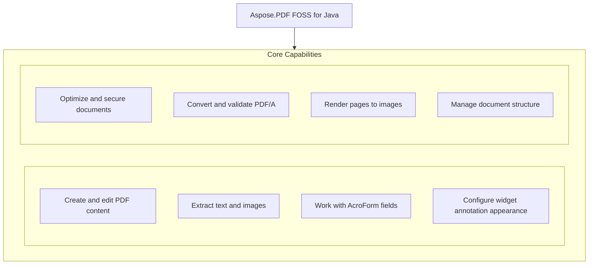

# Aspose.PDF FOSS for Java

[](LICENSE) [](https://github.com/aspose-pdf-foss/Aspose.PDF-FOSS-for-Java/graphs/contributors)

[](https://products.aspose.org/pdf/java/)

Aspose.PDF FOSS for Java is a free, open-source, pure-Java library for creating, reading, and modifying PDF documents. It targets ISO 32000-1:2008 compliance and depends only on the standard Java platform — no third-party runtime libraries. Developers use it to build, inspect, and process PDFs in Java 11 and later applications without external dependencies. The package `org.aspose`:aspose-PDF-foss version 26.8.0 provides APIs for text handling, form filling, annotations, page manipulation, and export to raster images or HTML.

## Navigation

- [At a Glance](#at-a-glance)
- [Key Capabilities](#key-capabilities)
- [Installation](#installation)
- [Dependencies](#dependencies)
- [Quick Start](#quick-start)
- [Additional Examples](#additional-examples)
- [API Reference](#api-reference)
- [Documentation & Resources](#documentation--resources)
- [Scope and Limitations](#scope-and-limitations)
- [Development and Testing](#development-and-testing)
- [License](#license)

## At a Glance



## Key Capabilities

- **Create and edit PDF content.** Create and edit PDF content by adding pages, inserting text fragments, and building tables with cells, rows, and paragraphs using the `Document`, `Page`, and `Table` APIs.
- **Extract text and images.** Extract text and images from PDF pages using `TextAbsorber` for plain text and `XImage` objects for image resources, saving images to files in formats such as PNG.
- **Work with AcroForm fields.** Work with AcroForm fields including text boxes, check boxes, combo boxes, list boxes, radio button groups, and signature fields through the `Form` API, supporting field value access and iteration.
- **Configure widget annotation appearance.** Configure widget annotation appearance by setting border color, background color, and border style using `WidgetAnnotation` characteristics and the `Border` class.
- **Optimize and secure documents.** Optimize and secure documents by reducing file size with `Document.optimizeResources` and applying encryption with AES or RC4 using `StandardSecurityHandler`.
- **Convert and validate PDF/A.** Convert and validate PDF/A documents to standards from PDF/A-1 through PDF/A-4 using `PdfAConverter` and `PdfAValidator` with detailed validation results.
- **Render pages to images.** Render pages to images using device classes such as `PngDevice`, `JpegDevice`, and `TiffDevice` for multi-page TIFF output, or extract text per page with `TextDevice`.
- **Manage document structure.** Manage document structure by building and inspecting the logical structure tree through `TaggedContent` and `StructTreeRoot`, or editing the outline tree with `OutlineCollection`.

## Installation

Install the published package from Maven Central (`org.aspose:aspose-pdf-foss`, version 26.8.0):

```bash
mvn dependency:get -Dartifact=org.aspose:aspose-pdf-foss:26.8.0
```

## Dependencies

### Required Package Dependencies

No required third-party package dependencies; in `pom.xml`, every `<dependency>` the POM declares is `test`, `provided` or optional.

### Native and System Requirements

- Requires Java `11` (`maven.compiler.target` in `pom.xml`).

### Development Dependencies

- `org.junit.jupiter:junit-jupiter 5.10.2`

## Quick Start

Create a page-level widget annotation and set its border color, then read it back:

```java
import org.aspose.pdf.Document;
import org.aspose.pdf.Page;
import org.aspose.pdf.Rectangle;
import org.aspose.pdf.Color;
import org.aspose.pdf.annotations.WidgetAnnotation;

try (Document doc = new Document()) {
    Page page = doc.getPages().add();

    WidgetAnnotation widget = new WidgetAnnotation(page, new Rectangle(0, 0, 100, 50));
    widget.getCharacteristics().setBorder(Color.fromRgb(1, 0, 0));

    Color border = widget.getCharacteristics().getBorder();
    System.out.println(border.getR() + ", " + border.getG() + ", " + border.getB());
}
```

## Additional Examples

The following workflows demonstrate common tasks with Aspose.PDF FOSS for Java, including mixing text and form fields, extracting content, and manipulating annotations.

### Read and update form fields in an existing PDF form

```java
import org.aspose.pdf.Document;
import org.aspose.pdf.forms.Form;
import org.aspose.pdf.forms.TextBoxField;

try (Document doc = new Document("form.pdf")) {
    Form form = doc.getForm();
    TextBoxField nameField = (TextBoxField) form.get("name");
    nameField.setValue("Jane Doe");

    // Iterate all fields
    for (org.aspose.pdf.forms.Field field : form.getFields()) {
        System.out.println(field.getPartialName() + " = " + field.getValue());
    }

    doc.save("form-filled.pdf");
}
```

<details>
<summary>View Additional Examples</summary>

### Mix plain text and a radio button field in a table cell

```java
import org.aspose.pdf.Document;
import org.aspose.pdf.Page;
import org.aspose.pdf.Cell;
import org.aspose.pdf.Rectangle;
import org.aspose.pdf.forms.RadioButtonOptionField;
import org.aspose.pdf.text.TextFragment;

try (Document doc = new Document()) {
    Page page = doc.getPages().add();
    Cell cell = new Cell();

    cell.add(new TextFragment("Choose:"));

    RadioButtonOptionField red = new RadioButtonOptionField(page, new Rectangle(0, 0, 10, 10));
    red.setOptionName("Red");
    cell.add(red);

    System.out.println(cell.getParagraphs().size() + " paragraphs in the cell");
}
```

### Extract all text from an existing PDF document

```java
import org.aspose.pdf.Document;
import org.aspose.pdf.text.TextAbsorber;

try (Document doc = new Document("input.pdf")) {
    TextAbsorber absorber = new TextAbsorber();
    doc.getPages().accept(absorber);
    String text = absorber.getText();
    System.out.println(text);
}
```

### Extract images from a specific page in a PDF

```java
import org.aspose.pdf.Document;
import org.aspose.pdf.XImage;

try (Document doc = new Document("input.pdf")) {
    int pageIndex = 1;
    int imageIndex = 1;
    for (XImage image : doc.getPages().get(pageIndex).getResources().getImages()) {
        try (java.io.FileOutputStream out = new java.io.FileOutputStream("image-" + imageIndex + ".png")) {
            image.save(out);
        }
        imageIndex++;
    }
}
```

### Create a new PDF and add a text fragment

```java
import org.aspose.pdf.Document;
import org.aspose.pdf.Page;
import org.aspose.pdf.text.TextFragment;

try (Document doc = new Document()) {
    Page page = doc.getPages().add();
    TextFragment fragment = new TextFragment("Hello, PDF world!");
    page.getParagraphs().add(fragment);
    doc.save("output.pdf");
}
```

### Append multiple radio button fields to a cell in order

```java
try (Document doc = new Document()) {
    Page page = doc.getPages().add();
    Cell cell = new Cell();

    RadioButtonOptionField red = new RadioButtonOptionField(page, new Rectangle(0, 0, 10, 10));
    red.setOptionName("Red");
    RadioButtonOptionField green = new RadioButtonOptionField(page, new Rectangle(0, 0, 10, 10));
    green.setOptionName("Green");

    cell.add(red);
    cell.add(green);
    // Fields keep insertion order: cell.getParagraphs().get(0) is red, get(1) is green.
}
```

### Set and read the background color of a widget annotation

```java
try (Document doc = new Document()) {
    Page page = doc.getPages().add();
    WidgetAnnotation widget = new WidgetAnnotation(page, new Rectangle(0, 0, 100, 50));

    widget.getCharacteristics().setBackground(Color.fromRgb(0, 0.5, 0.5));
    Color background = widget.getCharacteristics().getBackground();
}
```

### Set and retrieve the border style of a radio button option

```java
import org.aspose.pdf.annotations.Border;
import org.aspose.pdf.annotations.BorderStyle;
import org.aspose.pdf.forms.RadioButtonOptionField;

RadioButtonOptionField option = new RadioButtonOptionField();
Border border = new Border(option);
border.setStyle(BorderStyle.Dashed);

Border roundTrip = option.getBorder();
System.out.println(roundTrip.getWidth());
```

</details>

## API Reference

The Aspose.PDF FOSS for Java library exposes its core functionality through the `org.aspose.pdf` package, where the `Document` class serves as the primary entry point for creating, reading, and manipulating PDF documents.

The verified public surface has 1158 types.

<details>
<summary>View the Complete Public API Surface</summary>

### Core API

| Class | Description |
| --- | --- |
| `Artifact` | Represents a PDF artifact — content that is not part of the authored page content but is produced as a side effect of pagination or layout (ISO 32000-1:2008, §14.8.2.2). |
| `ArtifactCollection` | Represents a collection of Artifact objects found on a PDF page. |
| `AsposePdfLogging` | Centralised logging configuration for the org.aspose.pdf library. |
| `BackgroundArtifact` | Represents a background artifact — a convenience subclass for creating artifacts that serve as page backgrounds (ISO 32000-1:2008, §14.8.2.2). |
| `BaseParagraph` | Abstract base class for all content elements that can appear in a PDF page's paragraph collection. |
| `BorderInfo` | Represents border styling information for a content element such as a table, row, or cell. |
| `Cell` | Represents a single cell within a Row of a Table. |
| `Cells` | Represents an ordered collection of Cell instances within a Row. |
| `Collection` | Represents the /Collection entry in a PDF Catalog (ISO 32000-1:2008 §12.3.5 — "Collections", also known as PDF portfolios). |
| `pdf.Color` | Represents a color value in one of several color spaces (RGB, Grayscale, CMYK). |
| `ColorConverter` | Converts color operators in page content streams from one color space to another. |
| `ColumnReflow` | Re-flows the text and images of an existing single-column PDF into a two- or three-column layout, wrapping by words. |
| `CompactionOptions` | Options for Document.compactFlow(CompactionOptions) — the flow compaction operation (IR Stage 2): closing vertical holes left by deletion or merge, like an HTML page reflows. |
| `CompactionResult` | Result of Document.compactFlow(CompactionOptions): what was moved, closed, removed and skipped — skipped pages always carry their reason (honest reporting is part of the operation's contract). |
| `DefaultMetadataProperties` | String constants for commonly used XMP metadata property keys (ISO 16684-1). |
| `DocLoadOptions` | Options for loading (converting) an Office Open XML word-processing document (.docx) into a PDF — the load-side mirror of DocSaveOptions. |
| `DocSaveOptions` | Options for saving a document as Office Open XML word-processing (.docx). |
| `Document` | The central class for working with PDF documents (ISO 32000-1:2008). |
| `DocumentActions` | Document-level action triggers (ISO 32000-1:2008, §12.6.4.1, p.417). |
| `DocumentInfo` | Wraps the PDF document information dictionary (ISO 32000-1:2008, §14.3.3). |
| `DocumentPageImporter` | Imports pages from one Document into another by performing a full deep copy of the source page's PDF object subgraph into fresh indirect objects belonging to the target document. |
| `EmbeddedFileCollection` | Collection of embedded files (attachments) in a PDF document. |
| `ExplicitDestination` | Abstract base for explicit destinations (ISO 32000-1:2008, §12.3.2.2, Table 151). |
| `ExportFilter` | Filter for controlling which annotations are exported. |
| `ExtGState` | Extended graphics state parameter dictionary (ISO 32000-1:2008, §8.4.5, Table 58). |
| `FileHyperlink` | Hyperlink that launches an external file when the host paragraph is activated. |
| `FileParams` | Embedded file parameters (ISO 32000-1:2008, §7.11.4, Table 46). |
| `FileSpecification` | Represents an embedded file specification (ISO 32000-1:2008, §7.11.3, Table 44). |
| `FitBExplicitDestination` | FitB explicit destination — fit page bounding box within window. |
| `FitBHExplicitDestination` | FitBH explicit destination — fit bounding box width, position at top. |
| `FitBVExplicitDestination` | FitBV explicit destination — fit bounding box height, position at left. |
| `FitExplicitDestination` | Fit explicit destination — display page scaled to fit entirely within window. |
| `FitHExplicitDestination` | FitH explicit destination — fit page width, position at top coordinate. |
| `FitRExplicitDestination` | FitR explicit destination — fit specified rectangle within window. |
| `FitVExplicitDestination` | FitV explicit destination — fit page height, position at left coordinate. |
| `FloatingBox` | Represents a floating box container that can hold paragraph elements at a specific position on the page. |
| `FontEmbeddingOptions` | Controls optional font-substitution behavior used during standard-compliance conversion and validation flows. |
| `FontUtilities` | Provides utility methods for working with fonts in a PDF document. |
| `FormFieldParagraph` | BaseParagraph adapter that lets form-field widgets participate in paragraph-based collections such as Cell.getParagraphs(), Page.getParagraphs() and FloatingBox.getParagraphs(). |
| `GenericAction` | Represents a PDF action of an unknown or unsupported type. |
| `GoToAction` | Go-To action — navigate to a destination within the document (ISO 32000-1:2008, §12.6.4.2). |
| `GoToEmbeddedAction` | GoToE (Go-To-Embedded) action — navigates to a destination in an embedded PDF (ISO 32000-1:2008, §12.6.4.4). |
| `GoToRemoteAction` | Go-To Remote action — navigate to a destination in another PDF (ISO 32000-1:2008, §12.6.4.3). |
| `GoToURIAction` | GoToURI action — alias for UriAction for API compatibility with Aspose.PDF. |
| `pdf.GraphInfo` | Holds graphical properties for a single border side (color, line width, dash pattern). |
| `HeaderFooter` | Represents the header or footer area of a PDF page. |
| `pdf.Heading` | Represents a heading element that can be used in a table of contents. |
| `HideAction` | Hide action — shows or hides annotations (ISO 32000-1:2008, §12.6.4.10). |
| `HtmlFragment` | Represents an HTML content fragment that can be added to a PDF page's paragraph collection. |
| `HtmlLoadOptions` | Options for loading an HTML document into a PDF document. |
| `HtmlSaveOptions` | Options for saving a document in HTML format. |
| `Hyperlink` | Abstract base for hyperlinks attached to layout paragraphs such as TextFragment, Image and Heading. |
| `IAppointment` | Marker interface for PDF destinations — either an inline ExplicitDestination (page + coordinates) or a NamedDestination (name resolved through the document's name tree at use time, ISO 32000-1:2008 §12.3.2.3). |
| `pdf.Image` | Represents an image element that can be added to a PDF page's paragraph collection. |
| `ImagePlacement` | Describes the placement of an image on a PDF page. |
| `ImagePlacementAbsorber` | Absorbs (finds) all image placements on PDF pages. |
| `ImageStamp` | Represents an image stamp that can be overlaid on a PDF page. |
| `ImportDataAction` | ImportData action — imports form data from an FDF or XFDF file (ISO 32000-1:2008, §12.6.4.17). |
| `JavaScriptAction` | JavaScript action — stores a JavaScript script (ISO 32000-1:2008, §12.6.4.16). |
| `JavaScriptCollection` | Provides access to the JavaScript name tree of a PDF document (ISO 32000-1:2008, §12.6.4.16 and §7.9.6). |
| `LabelRange` | A labelling range starting at a page index. |
| `LaunchAction` | Launch action — launches an application or opens a document (ISO 32000-1:2008, §12.6.4.1). |
| `Layer` | Represents an Optional Content Group (layer) in a PDF document (ISO 32000-1:2008, §8.11). |
| `LevelFormat` | Represents formatting settings for a single TOC level. |
| `LoadOptions` | Base class for all document load options. |
| `LocalHyperlink` | Hyperlink to another location inside the same document — either a target BaseParagraph (set via setTarget(BaseParagraph)) or a specific 1-based page number (setTargetPageNumber(int)). |
| `MarginInfo` | Represents margin information for a content element. |
| `Matrix` | Represents a 3x3 affine transformation matrix used in PDF graphics state. |
| `MergeOptions` | Options for MergeOptions). |
| `NamedAction` | Named action — predefined action (ISO 32000-1:2008, §12.6.4.11). |
| `NamedDestination` | Represents a reference to a named destination in a PDF document (ISO 32000-1:2008, §12.3.2.3). |
| `NamedDestinations` | Provides access to named destinations in a PDF document (ISO 32000-1:2008, §12.3.2.3). |
| `Note` | Represents a footnote or endnote attached to a TextFragment (Aspose.PDF API compatibility). |
| `Operator` | Represents a PDF content stream operator (e.g., "BT", "Tf", "Td", "Tj", "q", "Q", "cm", "re"). |
| `OperatorCollection` | Represents a sequence of operators from a PDF content stream. |
| `OperatorSelector` | Selects operators of a specific runtime type from an OperatorCollection. |
| `Options` | Tunables for the column layout. |
| `OutlineCollection` | Root outline collection — the /Outlines dictionary in the document catalog (ISO 32000-1:2008, §12.3.3). |
| `OutlineItemCollection` | Represents a single bookmark (outline item) in the document outline tree (ISO 32000-1:2008, §12.3.3, Table 153). |
| `Page` | Represents a single PDF page (ISO 32000-1:2008, §7.7.3.3). |
| `PageCollection` | Represents the collection of pages in a PDF document (ISO 32000-1:2008, §7.7.3.2). |
| `PageInfo` | Holds page layout information including dimensions and margins. |
| `PageLabel` | Describes a page-label range entry used by PageLabels. |
| `PageLabels` | Page labelling for a PDF document (ISO 32000-1:2008, §12.4.2). |
| `PageNumberStamp` | Represents a page number stamp that renders the current page number and total page count on each page of the PDF document. |
| `PageSize` | Predefined page sizes and custom page dimensions for PDF documents. |
| `Paragraphs` | Represents an ordered collection of BaseParagraph elements that make up the content of a page, cell, or other container. |
| `PdfAction` | Abstract base for all PDF actions (ISO 32000-1:2008, §12.6, p.414). |
| `PdfFormatConversionOptions` | Options controlling PDF/A (and other standard) validation and conversion. |
| `PdfPageStamp` | A stamp consisting of an entire PDF page, overlaid onto another page. |
| `PdfSaveOptions` | Options for saving a PDF document. |
| `Point` | Represents a point in 2D space with double-precision coordinates. |
| `pdf.Rectangle` | Represents a rectangle defined by lower-left and upper-right corners (ISO 32000-1:2008, §7.9.5). |
| `RenditionAction` | Rendition action — controls multimedia renditions (ISO 32000-1:2008, §12.6.4.13). |
| `ResetFormAction` | ResetForm action — resets form fields to default values (ISO 32000-1:2008, §12.6.4.15). |
| `Resources` | Wraps a PDF resource dictionary (ISO 32000-1:2008, §7.8.3). |
| `RgbToDeviceGrayConversionStrategy` | Converts RGB color values in a page's content stream to DeviceGray equivalents. |
| `Row` | Represents a single row within a Table. |
| `Rows` | Represents an ordered collection of Row instances within a Table. |
| `SaveOptions` | Base class for all document save options. |
| `SetOCGStateAction` | SetOCGState action — changes the state of Optional Content Groups (ISO 32000-1:2008, §12.6.4.12). |
| `pdf.Stamp` | Abstract base class for all stamp types that can be overlaid on PDF pages. |
| `SubmitFormAction` | SubmitForm action — submits form data to a URL (ISO 32000-1:2008, §12.6.4.14). |
| `pdf.Table` | Represents a table element that can be added to a PDF page's paragraph collection. |
| `TextStamp` | Represents a text stamp that can be overlaid on a PDF page. |
| `TocInfo` | Represents Table of Contents information for a PDF document. |
| `TransitionAction` | Transition action — controls page transitions during presentations (ISO 32000-1:2008, §12.6.4.14). |
| `UriAction` | URI action — open a Uniform Resource Identifier (ISO 32000-1:2008, §12.6.4.7). |
| `ViewerPreferences` | PDF viewer preferences (ISO 32000-1:2008, §12.2, Table 150). |
| `WatermarkArtifact` | Represents a watermark artifact — a convenience subclass for creating pagination artifacts with the Watermark subtype (ISO 32000-1:2008, §14.8.2.2). |
| `WebHyperlink` | Hyperlink to an external URL. |
| `XForm` | Represents a Form XObject (ISO 32000-1:2008, §8.10). |
| `XFormCollection` | Collection of Form XObjects from a resource dictionary's /XObject entry (ISO 32000-1:2008, §8.10). |
| `XImage` | Represents an image XObject in a PDF document (ISO 32000-1:2008, §8.9, Table 89). |
| `XImageCollection` | Collection of image XObjects from a page's /XObject resource dictionary. |
| `XYZExplicitDestination` | XYZ explicit destination (ISO 32000-1:2008, Table 151). |
| `XfdfExporter` | Exports annotations and form field data from a PDF document to XFDF (XML Forms Data Format) per XFDF Specification Version 3.0 (August 2009). |
| `XfdfImporter` | Imports annotations and form field data from XFDF (XML Forms Data Format) into a PDF document, per XFDF Specification Version 3.0 (August 2009). |
| `XmpMetadata` | Provides access to XMP metadata of a PDF document (ISO 32000-1 §14.3.2, ISO 16684-1). |
| `XmpValue` | Represents a typed XMP metadata value (ISO 16684-1). |
| `Annotation` | Abstract base for all PDF annotations (ISO 32000-1:2008, §12.5). |
| `AnnotationActionCollection` | Represents a collection of actions associated with an annotation (ISO 32000-1:2008, Section 12.6.3). |
| `AnnotationCollection` | Collection of annotations on a page (ISO 32000-1:2008, §12.5). |
| `annotations.Border` | Represents the border of an annotation or form field (ISO 32000-1:2008, §12.5.4). |
| `CaretAnnotation` | Caret annotation (ISO 32000-1:2008, Section 12.5.6.11, /Subtype /Caret). |
| `CircleAnnotation` | Circle annotation (ISO 32000-1:2008, Section 12.5.6.8, /Subtype /Circle). |
| `DefaultAppearance` | Represents the default appearance string (/DA) for form fields and free text annotations (ISO 32000-1:2008, Section 12.7.3.3). |
| `FileAttachmentAnnotation` | File attachment annotation (ISO 32000-1:2008, Section 12.5.6.15, /Subtype /FileAttachment). |
| `FreeTextAnnotation` | Free text annotation (ISO 32000-1:2008, Section 12.5.6.6, /Subtype /FreeText). |
| `GenericAnnotation` | Generic annotation for unknown or unsupported annotation subtypes. |
| `HighlightAnnotation` | Highlight annotation (ISO 32000-1:2008, Section 12.5.6.10, /Subtype /Highlight). |
| `InkAnnotation` | Ink annotation (ISO 32000-1:2008, Section 12.5.6.13, /Subtype /Ink). |
| `LineAnnotation` | Line annotation (ISO 32000-1:2008, Section 12.5.6.7, /Subtype /Line). |
| `LinkAnnotation` | Link annotation (ISO 32000-1:2008, Section 12.5.6.5, /Subtype /Link). |
| `MarkupAnnotation` | Abstract base for markup annotations (ISO 32000-1:2008, §12.5.6.2). |
| `PolygonAnnotation` | Polygon annotation (ISO 32000-1:2008, Section 12.5.6.9, /Subtype /Polygon). |
| `PolylineAnnotation` | Polyline annotation (ISO 32000-1:2008, Section 12.5.6.9, /Subtype /PolyLine). |
| `PopupAnnotation` | Popup annotation (ISO 32000-1:2008, Section 12.5.6.14, /Subtype /Popup). |
| `RedactionAnnotation` | Redaction annotation (ISO 32000-1:2008, Section 12.5.6.23, /Subtype /Redact). |
| `ScreenAnnotation` | Screen annotation (ISO 32000-1:2008, Section 12.5.6.18, /Subtype /Screen). |
| `SquareAnnotation` | Square annotation (ISO 32000-1:2008, Section 12.5.6.8, /Subtype /Square). |
| `SquigglyAnnotation` | Squiggly-underline annotation (ISO 32000-1:2008, Section 12.5.6.10, /Subtype /Squiggly). |
| `StampAnnotation` | Stamp annotation (ISO 32000-1:2008, Section 12.5.6.12, /Subtype /Stamp). |
| `StrikeOutAnnotation` | Strikeout annotation (ISO 32000-1:2008, Section 12.5.6.10, /Subtype /StrikeOut). |
| `TextAnnotation` | Text (sticky note) annotation (ISO 32000-1:2008, Section 12.5.6.4, /Subtype /Text). |
| `UnderlineAnnotation` | Underline annotation (ISO 32000-1:2008, Section 12.5.6.10, /Subtype /Underline). |
| `WatermarkAnnotation` | Watermark annotation (ISO 32000-1:2008, Section 12.5.6.22, /Subtype /Watermark). |
| `WidgetAnnotation` | Widget annotation (ISO 32000-1:2008, §12.5.6.19, /Subtype /Widget). |
| `BmpDevice` | Renders a PDF page to BMP format. |
| `GifDevice` | Renders a PDF page to GIF format. |
| `JpegDevice` | Renders a PDF page to JPEG format with configurable compression quality. |
| `Margins` | Page margins in printer/device units, used by the C# printing API ( Aspose.Pdf.Devices.Margins) for PageSettings.Margins and PrinterSettings.DefaultPageSettings.Margins. |
| `PageDevice` | Abstract base class for devices that render a PDF page to a raster image. |
| `PngDevice` | Renders a PDF page to PNG format. |
| `RenderingOptions` | Options for rendering PDF pages to images. |
| `Resolution` | Represents the resolution (DPI) for rendering PDF pages to images. |
| `TextDevice` | Extracts text from a PDF page and writes it to an output stream. |
| `TiffDevice` | Renders PDF pages to multi-page TIFF format. |
| `TiffSettings` | Settings for TIFF image output when using TiffDevice. |
| `drawing.Arc` | Represents an arc drawing shape. |
| `BoundsOutOfRangeException` | Thrown when a drawing shape does not fit within the bounds of its container. |
| `Circle` | Represents a circle drawing shape. |
| `Curve` | Represents a Bezier curve drawing shape. |
| `Ellipse` | Represents an ellipse drawing shape. |
| `GradientAxialShading` | Represents an axial (linear) gradient shading pattern. |
| `Graph` | Represents a drawing canvas that can be added to a PDF page's paragraph collection. |
| `drawing.GraphInfo` | Represents graphic styling properties for drawing shapes. |
| `drawing.Line` | Represents a line (or polyline) drawing shape. |
| `Path` | Represents a composite path made up of child Shape elements. |
| `drawing.PatternColorSpace` | Represents a pattern-based color space for use in drawing operations. |
| `drawing.Rectangle` | Represents a rectangle drawing shape. |
| `Shape` | Abstract base class for all drawing shapes in the PDF drawing API. |
| `ShapeCollection` | A collection of Shape objects with optional bounds checking. |
| `QrEncoder` | A dependency-free QR Code (Model 2) encoder implementing ISO/IEC 18004. |
| `CalGrayColorSpace` | CalGray color space (ISO 32000-1:2008, §8.6.5.2). |
| `CalRGBColorSpace` | CalRGB color space (ISO 32000-1:2008, §8.6.5.3). |
| `CmykDisplay` | Display-oriented DeviceCMYK → sRGB conversion (ISO 32000-1:2008, §8.6.4.4). |
| `CmykPrintLut` | Acrobat print-path DeviceCMYK &rarr; sRGB conversion, active only under -Drender.acrobatPrintParity=true (the harness mode that compares our raster against Adobe Acrobat "print to PDF" golds). |
| `ColorSpaceBase` | Abstract base for all PDF color spaces (ISO 32000-1:2008, §8.6). |
| `DeviceCMYK` | The DeviceCMYK color space (ISO 32000-1:2008, §8.6.4.4). |
| `DeviceGray` | The DeviceGray color space (ISO 32000-1:2008, §8.6.4.2). |
| `DeviceNColorSpace` | DeviceN color space (ISO 32000-1:2008, §8.6.6.5). |
| `DeviceRGB` | The DeviceRGB color space (ISO 32000-1:2008, §8.6.4.3). |
| `ICCBasedColorSpace` | ICCBased color space (ISO 32000-1:2008, §8.6.5.5). |
| `IndexedColorSpace` | Indexed color space (ISO 32000-1:2008, §8.6.6.3). |
| `LabColorSpace` | Lab color space (ISO 32000-1:2008, §8.6.5.4). |
| `colorspace.PatternColorSpace` | Pattern color space (ISO 32000-1:2008, §8.6.6.2). |
| `RgbPrintShift` | Acrobat print-path untagged-DeviceRGB shift, active only under -Drender.acrobatPrintParity=true (the harness mode comparing our raster against Adobe Acrobat "print to PDF" golds) and only for pages that contain transparency. |
| `SeparationColorSpace` | Separation color space (ISO 32000-1:2008, §8.6.6.4). |
| `ASCII85Filter` | ASCII85Decode filter (§7.4.3, ISO 32000-1:2008). |
| `ASCIIHexFilter` | ASCIIHexDecode filter (§7.4.2, ISO 32000-1:2008). |
| `ArithmeticDecoder` | Adaptive binary arithmetic decoder for JBIG2 (MQ-coder). |
| `CCITTFaxDecodeFilter` | CCITTFaxDecode filter — CCITT Group 3 (1D) and Group 4 (2D) fax decompression. |
| `CryptFilter` | The /Crypt filter (ISO 32000-1:2008, §7.4.10). |
| `DCTDecodeFilter` | DCTDecode filter: JPEG to raw pixel samples. |
| `DecodeLimits` | Central guard against decompression bombs in stream decode filters (FlateDecode, LZWDecode, RunLengthDecode). |
| `DecodeSizeLimitException` | Thrown when a decode filter's output exceeds DecodeLimits.maxDecodedBytes(). |
| `FilterFactory` | Registry of PDF stream filters (§7.4, ISO 32000-1:2008). |
| `FlateFilter` | FlateDecode filter (§7.4.4, ISO 32000-1:2008). |
| `JBIG2DecodeFilter` | JBIG2Decode filter — decodes JBIG2-encoded monochrome images. |
| `JPXDecodeFilter` | JPXDecode filter — JPEG 2000 decompression (§7.4.9, ISO 32000-1:2008). |
| `LZWFilter` | LZWDecode filter (§7.4.4.2, ISO 32000-1:2008). |
| `PassthroughFilter` | No-op filter: returns data unchanged. |
| `PdfFilter` | Interface for PDF stream filters (§7.4, ISO 32000-1:2008). |
| `PredictorDecoder` | PNG and TIFF predictor support for Flate/LZW filters (§7.4.4.4, ISO 32000-1:2008). |
| `RunLengthFilter` | RunLengthDecode filter (§7.4.5, ISO 32000-1:2008). |
| `AdobeGlyphList` | Static mapping from Adobe glyph names to Unicode codepoints. |
| `CIDFont` | CID font (ISO 32000-1:2008, §9.7.4). |
| `FontDescriptor` | Wraps a PDF /FontDescriptor dictionary (ISO 32000-1:2008, §9.8, Table 122). |
| `FontEncoding` | Maps character codes (0-255) to glyph names and Unicode codepoints. |
| `FontMetrics` | Holds computed font metrics derived from a FontDescriptor and font-specific data. |
| `font.FontRepository` | Caches and resolves PDF fonts from resource dictionaries. |
| `PdfFont` | Abstract base class for all PDF font types (ISO 32000-1:2008, §9.5). |
| `StandardFonts` | Registry of the 14 Standard PDF Fonts (ISO 32000-1:2008, §9.6.2.2). |
| `TrueTypeFont` | TrueType font (/Subtype /TrueType) - ISO 32000-1:2008, 9.6.3. |
| `Type0Font` | Type 0 (Composite) font (ISO 32000-1:2008, §9.7). |
| `Type1Font` | Simple Type 1 font (/Subtype /Type1) — ISO 32000-1:2008, §9.6. |
| `Type3Font` | Type 3 font (/Subtype /Type3) — ISO 32000-1:2008, §9.6.5. |
| `CFFFontLoader` | Loads an AWT java.awt.Font from a PDF font that has an embedded Type1C / CIDFontType0C / OpenType-CFF font program in its /FontDescriptor /FontFile3 stream. |
| `CFFParser` | Minimal parser for the Compact Font Format (CFF) — Adobe Technical Note #5176. |
| `Inputs` | Inputs needed to build the OTF. |
| `OpenTypeBuilder` | Builds a synthetic CFF-flavored OpenType (.otf) file in memory from a parsed CFF font + a PDF /Encoding + PDF /Widths. |
| `CMapParser` | Parses CMap data into a ToUnicodeCMap (ISO 32000-1:2008, §9.10). |
| `CidOrderingUnicode` | CID &rarr; Unicode tables for STANDARD character collections (ISO 32000-1 §9.7.3 /CIDSystemInfo). |
| `ToUnicodeCMap` | A parsed ToUnicode CMap (ISO 32000-1:2008, §9.10.3). |
| `FontDiskLookup` | Resolves a logical font name (e.g. |
| `ttf.Result` | Result tuple from build: the /Type0 font dict to register under /Resources/Font, plus the TrueTypeReader the caller will need to map Unicode → glyph IDs when encoding text. |
| `TrueTypeReader` | Reads TrueType/OpenType font files (sfnt format). |
| `Type0FontBuilder` | Builds the PDF object graph required to embed a TrueType font as a /Type0 composite font with /Identity-H encoding (ISO 32000-1:2008, §9.7). |
| `ExponentialFunction` | Type 2 (Exponential Interpolation) function (ISO 32000-1:2008, §7.10.3). |
| `PdfFunction` | Abstract base for PDF functions (ISO 32000-1:2008, §7.10). |
| `PostScriptFunction` | Type 4 (PostScript Calculator) function (ISO 32000-1:2008, §7.10.5). |
| `SampledFunction` | Type 0 (Sampled) function (ISO 32000-1:2008, §7.10.2). |
| `StitchingFunction` | Type 3 (Stitching) function (ISO 32000-1:2008, §7.10.4). |
| `RandomAccessReader` | Random-access reader for PDF files. |
| `ContentStreamBuilder` | Builds a PDF content stream as a sequence of bytes. |
| `HeaderFooterOverlay` | The rendered header/footer of a page, ready to be wrapped as a Form XObject overlay. |
| `LayoutContext` | Tracks the cursor position and content area bounds during page layout. |
| `LayoutEngine` | The main layout engine that converts high-level paragraph objects into PDF content stream bytes during Document.save(). |
| `ResourceBuilder` | Builds the /Resources dictionary for a PDF page during layout. |
| `TextLayoutHelper` | Provides text measurement and word wrapping using PDF standard font metrics. |
| `BitOutputStream` | Writes bits to a byte array, MSB first, crossing byte boundaries. |
| `HintTableGenerator` | Generates hint tables for linearized PDF. |
| `LinearizationDetector` | Detects whether a PDF is linearized and validates the linearization. |
| `LinearizationParams` | Represents the linearization parameter dictionary (Table F.1, ISO 32000-1:2008). |
| `LinearizationPlan` | Holds the object ordering plan for writing a linearized PDF. |
| `LinearizedPDFWriter` | Writes a linearized PDF file conforming to ISO 32000-1:2008 Annex F. |
| `PageObjectCollector` | Walks the object graph from each page to classify objects for linearization. |
| `ResourceOptimizer` | Size-reduction passes over a parsed document's object graph, driven by OptimizationOptions. |
| `Stats` | Result counters for logging/tests. |
| `TtfGlyphStripper` | Glyph-outline stripper for TrueType font programs: rebuilds a TTF keeping only the outlines of the requested glyph ids (plus their composite components and glyph 0), emptying every other glyf entry. |
| `ContentStreamParser` | Parses PDF content streams into a list of Operator objects. |
| `PDFLexer` | PDF tokenizer: converts a byte stream into a sequence of PDF tokens. |
| `PDFParser` | Full PDF file parser implementing lazy object loading. |
| `parser.Token` | A single PDF token with its type, string value, and file position. |
| `XRefEntry` | Represents a single cross-reference entry in a PDF file. |
| `XRefParser` | Parser for PDF cross-reference tables and streams as defined in ISO 32000-1:2008, §7.5.4 (text xref tables) and §7.5.8 (xref streams). |
| `AxialShading` | Axial shading / linear gradient — ShadingType 2 (ISO 32000-1:2008, §8.7.4.5.2). |
| `CoonsPatchShading` | Coons patch mesh — ShadingType 6 (ISO 32000-1:2008, §8.7.4.5.6). |
| `FreeFormGouraudShading` | Free-form Gouraud-shaded triangle mesh — ShadingType 4 (ISO 32000-1:2008, §8.7.4.5.4). |
| `FunctionBasedShading` | Function-based shading — ShadingType 1 (ISO 32000-1:2008, §8.7.4.5.1). |
| `LatticeGouraudShading` | Lattice-form Gouraud-shaded triangle mesh — ShadingType 5 (ISO 32000-1:2008, §8.7.4.5.5). |
| `PdfPattern` | Abstract base for PDF patterns (ISO 32000-1:2008, §8.7). |
| `RadialShading` | Radial shading / radial gradient — ShadingType 3 (ISO 32000-1:2008, §8.7.4.5.3). |
| `Shading` | Abstract base for shading dictionaries (ISO 32000-1:2008, §8.7.4.3). |
| `ShadingPattern` | Shading pattern — PatternType 2 (ISO 32000-1:2008, §8.7.4). |
| `ShadingRenderer` | Renders shading fills onto a Graphics2D context. |
| `TensorPatchShading` | Tensor-product patch mesh — ShadingType 7 (ISO 32000-1:2008, §8.7.4.5.7). |
| `TilingPattern` | Tiling pattern (ISO 32000-1:2008, §8.7.3). |
| `PdfAConverter` | Orchestrator for PDF/A and PDF/X conversion. |
| `PdfARule` | A single PDF/A validation rule. |
| `PdfAValidationResult` | Collects and reports PDF/A validation violations. |
| `PdfAValidator` | PDF/A and PDF/X validation orchestrator. |
| `PdfAViolation` | Represents a single violation found during PDF/A validation. |
| `XmpMetadataHandler` | Reads and writes XMP metadata packets for PDF/A compliance. |
| `ActionFixes` | Action-related fixes for PDF/A compliance. |
| `AnnotationFixes` | Annotation-related fixes for PDF/A compliance. |
| `FileStructureFixes` | File-structure fixes for PDF/A and PDF/X compliance. |
| `FontFixes` | Font-related fixes for PDF/A compliance. |
| `FormFixes` | AcroForm-related fixes for PDF/A compliance. |
| `GraphicsFixes` | Graphics-related fixes for PDF/A compliance. |
| `MetadataFixes` | Metadata-related fixes for PDF/A compliance. |
| `PdfXFixes` | PDF/X-specific fixes (ISO 15930). |
| `StructureFixes` | Logical-structure fixes for PDF/A Level A conversion (ISO 19005-1:2005 §6.8 / ISO 19005-2:2011 §6.7). |
| `TransparencyFixes` | Transparency-related fixes for PDF/A-1 compliance. |
| `ActionRules` | Validates action requirements for PDF/A compliance. |
| `AnnotationRules` | Validates annotation requirements for PDF/A compliance. |
| `FileStructureRules` | Validates PDF file structure requirements for PDF/A compliance. |
| `FontRules` | Validates font requirements for PDF/A compliance (most critical rule set). |
| `GraphicsRules` | Validates graphics-related requirements for PDF/A compliance. |
| `InteractiveFormRules` | Validates interactive form requirements for PDF/A compliance. |
| `LogicalStructureRules` | Validates logical structure requirements for PDF/A Level A compliance. |
| `MetadataRules` | Validates metadata requirements for PDF/A compliance. |
| `PdfXRules` | Validates PDF/X compliance requirements. |
| `TransparencyRules` | Validates transparency requirements for PDF/A compliance. |
| `IPdfVisitor` | Visitor interface for type-safe traversal of PDF object graphs. |
| `NameTree` | Read/write view over a PDF name tree (ISO 32000-1:2008, §7.9.6). |
| `NumberTree` | Read/write view over a PDF number tree (ISO 32000-1:2008, §7.9.7). |
| `ObjectResolver` | Functional interface for lazy loading of indirect objects. |
| `PdfArray` | PDF array object (§7.3.6, ISO 32000-1:2008). |
| `PdfBase` | Abstract base class for all nine PDF PDF object types (§7.3, ISO 32000-1:2008). |
| `PdfBoolean` | PDF boolean object (§7.3.2, ISO 32000-1:2008). |
| `PdfDictionary` | PDF dictionary object (§7.3.7, ISO 32000-1:2008). |
| `PdfFloat` | PDF real number object (§7.3.3, ISO 32000-1:2008). |
| `PdfInteger` | PDF integer object (§7.3.3, ISO 32000-1:2008). |
| `PdfName` | PDF name object (§7.3.5, ISO 32000-1:2008). |
| `PdfNull` | PDF null object (§7.3.9, ISO 32000-1:2008). |
| `PdfObjectCloner` | Recursively clones a PDF object graph from one document so the result is independent of the source document and can be safely inserted into a target document. |
| `PdfObjectKey` | Key identifying an indirect PDF object by its object number and generation number. |
| `PdfObjectReference` | PDF indirect object reference (§7.3.10, ISO 32000-1:2008). |
| `PdfStream` | PDF stream object (§7.3.8, ISO 32000-1:2008). |
| `PdfString` | PDF string object (§7.3.4, ISO 32000-1:2008). |
| `ReferenceRegistry` | Allocates object keys in the target document. |
| `BlendComposite` | Separable blend-mode composite for PDF /BM (ISO 32000-1:2008, §11.3.5). |
| `GraphicsState` | Tracks the mutable graphics state during PDF page rendering (ISO 32000-1:2008, §8.4). |
| `PdfPageRenderer` | Core PDF page rendering engine (ISO 32000-1:2008, §8 & §9). |
| `TextRenderer` | Renders text glyphs onto a Graphics2D context (ISO 32000-1:2008, §9.4). |
| `Type3GlyphExecutor` | Executes a Type 3 glyph-description content stream (ISO 32000 §9.6.5). |
| `Engine` | Public entry point of the self-contained ECMAScript 3 engine. |
| `ArrayLit` | [a,, c] array literal; null elements are elisions. |
| `AssignExpr` | Assignment = += -=.... |
| `BinaryExpr` | Binary operator (arithmetic, relational, equality, bitwise, shift, instanceof, in). |
| `Block` | {... |
| `BoolLit` | true / false. |
| `BreakStmt` | break label?; |
| `CallExpr` | callee(args). |
| `ConditionalExpr` | test ? |
| `ContinueStmt` | continue label?; |
| `DebuggerStmt` | Debugger statement (parsed, no-op). |
| `DoWhileStmt` | do body while (test) |
| `EmptyStmt` | Lone; |
| `ExprStmt` | Expression used as a statement. |
| `ForInStmt` | for (left in right) body |
| `ForStmt` | for (init; test; update) body |
| `FunctionDecl` | function name(params) body declaration. |
| `FunctionExpr` | function name?(params) body expression. |
| `Ident` | Identifier reference. |
| `IfStmt` | if (test) consequent else alternate |
| `LabeledStmt` | label: statement |
| `LogicalExpr` | && / // short-circuit operator. |
| `MemberExpr` | object.property or object[property]. |
| `NewExpr` | new callee(args). |
| `Node` | Abstract syntax tree for ECMAScript 3 (ECMA-262 3rd ed.). |
| `NullLit` | null. |
| `NumberLit` | Numeric literal. |
| `ObjectLit` | { k: v,... |
| `Program` | A complete parsed program (list of top-level statements). |
| `ast.Property` | One key: value entry of an object literal. |
| `RegexLit` | /pat/flags literal. |
| `ReturnStmt` | return arg?; |
| `SequenceExpr` | Comma operator a, b, c. |
| `StringLit` | String literal (already decoded). |
| `SwitchCase` | One case x: or default: clause. |
| `SwitchStmt` | switch (disc) {... |
| `ThisExpr` | this. |
| `ThrowStmt` | throw arg; |
| `TryStmt` | try { } catch (p) { } finally { } |
| `UnaryExpr` | Unary prefix operator: ! |
| `UpdateExpr` | ++/--, prefix or postfix. |
| `VarDeclarator` | A single declarator inside a var statement. |
| `VarStmt` | var a = 1, b; |
| `WhileStmt` | while (test) body |
| `WithStmt` | with (object) body |
| `Builtins` | Installs the ECMAScript 3 standard library into a Realm (ECMA-262 3rd ed., sec 15). |
| `Realm` | The set of intrinsic objects for one execution environment (ECMA-262 3rd ed., sec 15): the global object plus every standard prototype and constructor. |
| `Interpreter` | Tree-walking evaluator for ECMAScript 3 (ECMA-262 3rd ed.). |
| `JSException` | Carries a value thrown by ECMAScript throw (or by a built-in raising a native error) up the Java stack until a try/catch handles it or it escapes Engine.eval. |
| `JSUnsupportedError` | Thrown when the interpreter encounters an ES3 construct it does not (yet) implement. |
| `JsExecutionLimitError` | Thrown when a script exceeds the interpreter's execution-step budget (see -Dxfa.js.maxSteps). |
| `UserFunction` | A function defined in ECMAScript source (a function declaration or expression). |
| `Lexer` | Hand-written lexer for the ECMAScript 3 lexical grammar (ECMA-262 3rd ed., sec 7). |
| `lexer.Token` | A single lexical token produced by Lexer. |
| `JSSyntaxError` | Thrown by the lexer or parser when the source text is not valid ECMAScript 3. |
| `Parser` | Recursive-descent parser for ECMAScript 3 (ECMA-262 3rd ed., sec 11-14). |
| `Constructor` | Functional interface for a native [[Construct]]. |
| `JSArray` | An ECMAScript Array exotic object (ECMA-262 3rd ed., sec 15.4). |
| `JSFunction` | Base class for all callable ECMAScript objects (ECMA-262 3rd ed., sec 13, 15.3). |
| `JSNull` | The ECMAScript null value (the sole instance of the Null type). |
| `JSNumber` | Numeric abstract operations: Number-to-String (sec 9.8.1), String-to-Number (sec 9.3.1), ToInteger/ToInt32/ToUint32 (sec 9.4-9.6) and radix conversion for Number.prototype.toString. |
| `JSObject` | A native ECMAScript object: an ordered map of named properties plus a prototype link (ECMA-262 3rd ed., sec 8.6). |
| `JSRegExp` | A RegExp object (ECMA-262 3rd ed., sec 15.10) backed by a compiled java.util.regex.Pattern. |
| `Native` | Functional interface for a native [[Call]]. |
| `NativeFunction` | A built-in function implemented in Java and backed by a lambda. |
| `runtime.Property` | A single property slot with its ES3 attributes. |
| `runtime.Scope` | A lexical environment / scope-chain node (ECMA-262 3rd ed., sec 10.1.4). |
| `Types` | Pure ECMAScript abstract operations that do not require calling user code: typeof, ToBoolean, primitive coercions and strict equality (ECMA-262 3rd ed., sec 9, 11.9.6). |
| `Undefined` | The ECMAScript undefined value (the sole instance of the Undefined type). |
| `AESCipher` | AES cipher for PDF encryption and decryption — CBC mode. |
| `PDFCryptoUtils` | Shared cryptographic utilities for PDF encryption and decryption. |
| `PDFDecryptor` | Decrypts individual PDF objects (strings and streams). |
| `PDFEncryptionDict` | Wraps the /Encrypt dictionary from the PDF trailer (ISO 32000-1:2008, §7.6.1, Tables 20-21). |
| `PDFEncryptor` | Encrypts individual PDF objects (strings and streams). |
| `PDFKeyDerivation` | PDF encryption key derivation algorithms. |
| `RC4Cipher` | RC4 (ARCFOUR) stream cipher for PDF decryption. |
| `SecurityUtils` | Small security-related utility helpers used by legacy-compatible tests. |
| `StandardSecurityHandler` | Standard security handler — validates passwords and produces encryption keys. |
| `DEREncoder` | Encodes ASN.1 DER (Distinguished Encoding Rules) structures. |
| `DERNode` | Represents a parsed ASN.1 DER (Distinguished Encoding Rules) node. |
| `OIDs` | Well-known OID constants for PKCS#7, X.509, and PDF signatures. |
| `PKCS7SignedData` | Parses and creates PKCS#7 SignedData structures (RFC 2315 §9). |
| `SignerInfo` | Per-signer information within a PKCS#7 SignedData structure (RFC 2315 §9.2). |
| `Stringprep` | Minimal SASLprep implementation used by security-related regression tests. |
| `StringprepException` | Thrown when a string fails SASLprep processing. |
| `PdfSigner` | Signs and verifies PDF documents using PKCS#7 detached signatures (ISO 32000-1:2008, §12.8). |
| `SignatureVerificationResult` | Result of verifying a PDF signature. |
| `TextExtractor` | Extracts text from PDF page content streams by processing text operators (ISO 32000-1:2008, §9.4). |
| `WeakIdentityHashMap` | A map that keys on the identity of its keys (like java.util.IdentityHashMap) but holds those keys through WeakReferences (like java.util.WeakHashMap), so an entry is evicted automatically once its key is no longer strongly reachable anywhere else. |
| `PDFWriter` | Serializes a graph of PDF objects into a valid PDF file. |
| `BindingEngine` | The XFA data-binding (merge) engine: combines the typed template with the datasets data to produce the FormDom (XFA 3.0 binding chapter). |
| `FormDom` | The Form DOM: the template structure merged with data (repeating containers expanded, fields bound), ready for layout (Stage C) and flattening (A5). |
| `binding.FormField` | A field in the merged Form DOM: its SOM path, bound value, choice items, UI hint and the binding kind that produced it. |
| `ClassStep` | A class step (#subform, #dataValue, possibly indexed). |
| `Context` | Resolution context: the accessor roots plus the current node. |
| `Index` | Index modifier on a step. |
| `NameStep` | A named child step (name, possibly indexed). |
| `ParentStep` | Parent navigation (..). |
| `Predicate` | A structural/comparison predicate relativePath OP literal (or a bare path = truthiness). |
| `PropertyStep` | A property step (.#name,.#x) — yields an attribute/property value. |
| `SomExpr` | Parsed SOM (Scripting Object Model) expression — XFA 3.0 SOM grammar. |
| `SomParser` | Parses a SOM expression string into a SomExpr. |
| `SomResolver` | Evaluates a SomExpr over the typed XFA model (template/data/form trees). |
| `Step` | One navigation step. |
| `flatten.Result` | Outcome of a flatten operation (the A5.4 acceptance numbers). |
| `XfaAcroFormConverter` | Converts an XFA form to a properly rendered, editable AcroForm document — the public XfaForm.convertToAcroForm(...) path (Aspose Form.Type=FormType.Standard). |
| `XfaFlattener` | Maps a merged XFA FormDom into ordinary AcroForm fields on a Document, so generic PDF viewers (which cannot render XFA) display the form and its data. |
| `XfaGeometry` | Resolves an XFA layout box (a Form DOM field/draw node) to an absolute PDF Rectangle on a page, for positioned layout (Stage C, sprint C1). |
| `XfaMedium` | Resolves the page dimensions an XFA form declares via its medium element (XFA 3.0 §"medium") — the form's own page size, used to size the flattened/painted page instead of a leftover placeholder MediaBox (which on dynamic XFA PDFs is often inverted or wrong). |
| `PageLayout` | One physical page of placed content (page-local coordinates). |
| `PageRegion` | The content region a page draws into: the chosen pageArea's contentArea box. |
| `PaginatedLayout` | The full paginated layout (pre-emit). |
| `flatten.layout.Result` | The outcome of laying a flowed-root form into one region. |
| `Spec` | The boundary content governing a paginating flowed form. |
| `layout.SplitPlan` | The split plan for one laid-out form (no splitting performed). |
| `SplitPoint` | A page boundary: the first unit that belongs to the next page. |
| `XfaBookends` | Resolves the XFA boundary content a flowed form inserts at page boundaries (Stage C, sprint L4): leaders / trailers at explicit breaks (§ break) and overflow leaders / trailers (§ bookends), laying each referenced subform into a XfaLayoutNode prototype of known height so XfaPaginator can insert it per page. |
| `XfaDuplex` | Applies XFA simplex/duplex page qualification to a paginated layout (Stage C, sprint L4.3): honours a pageArea oddOrEven="odd/even" restriction when the governing pageSet relation="duplexPaginated" forces content onto a physical odd/even side. |
| `XfaFlowLayout` | Builds the XFA Layout DOM for a flowed-root form by flowing its content top-to-bottom into a SINGLE content region (Stage C, sprint L1). |
| `XfaGrowableHeight` | Computes the height of a growable XFA leaf (field / draw) from its bound data (Stage C, sprint L1.2). |
| `XfaLayoutNode` | A placed object in the XFA Layout DOM (Stage C, sprint L1) — the internal tree produced when a flowed-root form is laid into a content region. |
| `XfaPageSplitter` | Finds the page split points of a laid-out flowed form (Stage C, sprint L2 PART B): walks the flow top-to-bottom against the per-page content region height and determines where each page's content ends, honouring XFA keep (keep-together) and break (forced break) rules. |
| `XfaPaginator` | Applies an L2 XfaPageSplitter.SplitPlan to produce a paginated Layout DOM and emits the resulting multi-page PDF (Stage C, sprint L3). |
| `Embedded` | A resolved, embeddable font: a unique resource key, the Type0 dict, and the reader for GIDs. |
| `paint.Result` | Outcome of a paint pass. |
| `XfaFontResolver` | Resolves the real font a piece of XFA text should be painted in, in strict priority order, and builds an embeddable /Type0 font from it (XFA-FONTEMBED sprint). |
| `XfaImageXObject` | Decodes an XFA image (the base64 payload of a draw/field logo or picture) into a PDF Image XObject stream ready to register with PdfStream) and paint via cm+Do. |
| `XfaPainter` | Paints positioned XFA content (Stage C, sprint C2) into a page content stream: box model (fill + border edges + corners), field/caption text, honouring presence. |
| `Codec` | Bidirectional string codec for an attribute value. |
| `Ctor` | Constructor functional interface for a typed node. |
| `Report` | Outcome of a resolution pass. |
| `XfaAttribute` | A typed accessor for one attribute of an XfaNode, backed by a Codec that coerces between the attribute's string form and a Java type (String, Integer, Boolean, XfaMeasurement or a generated enum). |
| `XfaMeasurement` | An XFA measurement: a numeric value plus a unit (XFA 3.0 measurement datatype). |
| `XfaModel` | The consolidated typed view over a whole XfaPacketSet: typed roots for every XFA grammar a form may carry. |
| `XfaNode` | Base of the typed XFA template model. |
| `XfaNodeFactory` | Maps an XFA element to its typed XfaNode subclass, routed by the element's namespace family. |
| `XfaProtoResolver` | Resolves XFA prototype references at the model level: use (intra-document prototype by id) and usehref (prototype by href/id), plus proto packet sources (XFA 3.0 sec on use/usehref). |
| `config.Config` | Typed XFA template element config. |
| `ConfigElements` | Registry of generated typed element constructors for this XFA grammar (element local name -> typed node). |
| `ConnectionSet` | Typed XFA template element connectionSet. |
| `ConnectionSetElements` | Registry of generated typed element constructors for this XFA grammar (element local name -> typed node). |
| `EffectiveInputPolicy` | Typed XFA template element effectiveInputPolicy. |
| `EffectiveOutputPolicy` | Typed XFA template element effectiveOutputPolicy. |
| `Operation` | Typed XFA template element operation. |
| `RootElement` | Typed XFA template element rootElement. |
| `SoapAction` | Typed XFA template element soapAction. |
| `SoapAddress` | Typed XFA template element soapAddress. |
| `Uri` | Typed XFA template element uri. |
| `WsdlAddress` | Typed XFA template element wsdlAddress. |
| `WsdlConnection` | Typed XFA template element wsdlConnection. |
| `XmlConnection` | Typed XFA template element xmlConnection. |
| `XsdConnection` | Typed XFA template element xsdConnection. |
| `DataDescription` | Typed XFA template element dataDescription. |
| `DataDescriptionElements` | Registry of generated typed element constructors for this XFA grammar (element local name -> typed node). |
| `Dd_group` | Typed XFA template element dd:group. |
| `Data` | Typed XFA template element data. |
| `Datasets` | The xfa:datasets packet wrapper. |
| `DatasetsElements` | Registry of generated typed element constructors for this XFA grammar (element local name -> typed node). |
| `CalendarSymbols` | Typed XFA template element calendarSymbols. |
| `CurrencySymbol` | Typed XFA template element currencySymbol. |
| `CurrencySymbols` | Typed XFA template element currencySymbols. |
| `DatePattern` | Typed XFA template element datePattern. |
| `DatePatterns` | Typed XFA template element datePatterns. |
| `DateTimeSymbols` | Typed XFA template element dateTimeSymbols. |
| `Day` | Typed XFA template element day. |
| `DayNames` | Typed XFA template element dayNames. |
| `Era` | Typed XFA template element era. |
| `EraNames` | Typed XFA template element eraNames. |
| `Locale` | Typed XFA template element locale. |
| `LocaleSet` | Typed XFA template element localeSet. |
| `LocaleSetElements` | Registry of generated typed element constructors for this XFA grammar (element local name -> typed node). |
| `Meridiem` | Typed XFA template element meridiem. |
| `MeridiemNames` | Typed XFA template element meridiemNames. |
| `Month` | Typed XFA template element month. |
| `MonthNames` | Typed XFA template element monthNames. |
| `NumberPattern` | Typed XFA template element numberPattern. |
| `NumberPatterns` | Typed XFA template element numberPatterns. |
| `NumberSymbol` | Typed XFA template element numberSymbol. |
| `NumberSymbols` | Typed XFA template element numberSymbols. |
| `TimePattern` | Typed XFA template element timePattern. |
| `TimePatterns` | Typed XFA template element timePatterns. |
| `sourceset.Bind` | Typed XFA template element bind. |
| `sourceset.Boolean` | Typed XFA template element boolean. |
| `Command` | Typed XFA template element command. |
| `sourceset.Connect` | Typed XFA template element connect. |
| `ConnectString` | Typed XFA template element connectString. |
| `Delete` | Typed XFA template element delete. |
| `sourceset.Extras` | Typed XFA template element extras. |
| `Insert` | Typed XFA template element insert. |
| `sourceset.Integer` | Typed XFA template element integer. |
| `Map` | Typed XFA template element map. |
| `Password` | Typed XFA template element password. |
| `Query` | Typed XFA template element query. |
| `RecordSet` | Typed XFA template element recordSet. |
| `Select` | Typed XFA template element select. |
| `sourceset.Source` | Typed XFA template element source. |
| `SourceSet` | Typed XFA template element sourceSet. |
| `SourceSetElements` | Registry of generated typed element constructors for this XFA grammar (element local name -> typed node). |
| `sourceset.Text` | Typed XFA template element text. |
| `Update` | Typed XFA template element update. |
| `User` | Typed XFA template element user. |
| `AppearanceFilter` | Typed XFA template element appearanceFilter. |
| `template.Arc` | Typed XFA template element arc. |
| `Area` | Typed XFA template element area. |
| `Assist` | Typed XFA template element assist. |
| `Barcode` | Typed XFA template element barcode. |
| `template.Bind` | Typed XFA template element bind. |
| `BindItems` | Typed XFA template element bindItems. |
| `Bookend` | Typed XFA template element bookend. |
| `template.Boolean` | Typed XFA template element boolean. |
| `template.Border` | Typed XFA template element border. |
| `Break` | Typed XFA template element break. |
| `BreakAfter` | Typed XFA template element breakAfter. |
| `BreakBefore` | Typed XFA template element breakBefore. |
| `Button` | Typed XFA template element button. |
| `CalcProperty` | Typed XFA template element calcProperty. |
| `Calculate` | Typed XFA template element calculate. |
| `Caption` | Typed XFA template element caption. |
| `Certificate` | Typed XFA template element certificate. |
| `Certificates` | Typed XFA template element certificates. |
| `CheckButton` | Typed XFA template element checkButton. |
| `ChoiceList` | Typed XFA template element choiceList. |
| `template.Color` | Typed XFA template element color. |
| `Comb` | Typed XFA template element comb. |
| `template.Connect` | Typed XFA template element connect. |
| `ContentArea` | Typed XFA template element contentArea. |
| `Corner` | Typed XFA template element corner. |
| `Date` | Typed XFA template element date. |
| `DateTime` | Typed XFA template element dateTime. |
| `DateTimeEdit` | Typed XFA template element dateTimeEdit. |
| `Decimal` | Typed XFA template element decimal. |
| `DefaultUi` | Typed XFA template element defaultUi. |
| `Desc` | Typed XFA template element desc. |
| `DigestMethod` | Typed XFA template element digestMethod. |
| `DigestMethods` | Typed XFA template element digestMethods. |
| `Draw` | Typed XFA template element draw. |
| `Edge` | Typed XFA template element edge. |
| `Encoding` | Typed XFA template element encoding. |
| `Encodings` | Typed XFA template element encodings. |
| `Encrypt` | Typed XFA template element encrypt. |
| `Event` | Typed XFA template element event. |
| `ExData` | Typed XFA template element exData. |
| `ExObject` | Typed XFA template element exObject. |
| `ExclGroup` | Typed XFA template element exclGroup. |
| `Execute` | Typed XFA template element execute. |
| `template.Extras` | Typed XFA template element extras. |
| `template.Field` | Typed XFA template element field. |
| `template.Fill` | Typed XFA template element fill. |
| `Filter` | Typed XFA template element filter. |
| `Float` | Typed XFA template element float. |
| `template.Font` | Typed XFA template element font. |
| `Format` | Typed XFA template element format. |
| `Handler` | Typed XFA template element handler. |
| `Hyphenation` | Typed XFA template element hyphenation. |
| `template.Image` | Typed XFA template element image. |
| `ImageEdit` | Typed XFA template element imageEdit. |
| `template.Integer` | Typed XFA template element integer. |
| `Issuers` | Typed XFA template element issuers. |
| `Items` | Typed XFA template element items. |
| `Keep` | Typed XFA template element keep. |
| `KeyUsage` | Typed XFA template element keyUsage. |
| `template.Line` | Typed XFA template element line. |
| `Linear` | Typed XFA template element linear. |
| `LockDocument` | Typed XFA template element lockDocument. |
| `Manifest` | Typed XFA template element manifest. |
| `Margin` | Typed XFA template element margin. |
| `Mdp` | Typed XFA template element mdp. |
| `Medium` | Typed XFA template element medium. |
| `Message` | Typed XFA template element message. |
| `NumericEdit` | Typed XFA template element numericEdit. |
| `Occur` | Typed XFA template element occur. |
| `Oid` | Typed XFA template element oid. |
| `Oids` | Typed XFA template element oids. |
| `Overflow` | Typed XFA template element overflow. |
| `PageArea` | Typed XFA template element pageArea. |
| `PageSet` | Typed XFA template element pageSet. |
| `Para` | Typed XFA template element para. |
| `PasswordEdit` | Typed XFA template element passwordEdit. |
| `Pattern` | Typed XFA template element pattern. |
| `Picture` | Typed XFA template element picture. |
| `Proto` | Typed XFA template element proto. |
| `Radial` | Typed XFA template element radial. |
| `Reason` | Typed XFA template element reason. |
| `Reasons` | Typed XFA template element reasons. |
| `template.Rectangle` | Typed XFA template element rectangle. |
| `Ref` | Typed XFA template element ref. |
| `Script` | Typed XFA template element script. |
| `SetProperty` | Typed XFA template element setProperty. |
| `SignData` | Typed XFA template element signData. |
| `template.Signature` | Typed XFA template element signature. |
| `Signing` | Typed XFA template element signing. |
| `Solid` | Typed XFA template element solid. |
| `Speak` | Typed XFA template element speak. |
| `Stipple` | Typed XFA template element stipple. |
| `Subform` | Typed XFA template element subform. |
| `SubformSet` | Typed XFA template element subformSet. |
| `SubjectDN` | Typed XFA template element subjectDN. |
| `SubjectDNs` | Typed XFA template element subjectDNs. |
| `Submit` | Typed XFA template element submit. |
| `Template` | Typed XFA template element template. |
| `template.Text` | Typed XFA template element text. |
| `TextEdit` | Typed XFA template element textEdit. |
| `Time` | Typed XFA template element time. |
| `TimeStamp` | Typed XFA template element timeStamp. |
| `ToolTip` | Typed XFA template element toolTip. |
| `Traversal` | Typed XFA template element traversal. |
| `Traverse` | Typed XFA template element traverse. |
| `Ui` | Typed XFA template element ui. |
| `Validate` | Typed XFA template element validate. |
| `Value` | Typed XFA template element value. |
| `Variables` | Typed XFA template element variables. |
| `XfaTemplateElements` | Registry of generated typed element constructors for this XFA grammar (element local name -> typed node). |
| `XfaNamespaces` | Canonicalises XFA namespace URIs to their version-independent family. |
| `XfaPacket` | One XFA packet: its name, its parsed DOM and (when available) the exact source bytes it was read from. |
| `XfaPacketReader` | Reads the AcroForm /XFA entry into a typed XfaPacketSet. |
| `XfaPacketSet` | The full set of XFA packets parsed from a PDF's /XFA entry, with typed accessors per packet plus the assembled xdp document. |
| `XfaPacketWriter` | Writes a modified XfaPacketSet back to the PDF /XFA entry, replacing the former XfaPacketParser write path. |
| `script.Result` | Outcome of a load-time scripting pass. |
| `XfaInstanceManager` | The XFA instanceManager host object (Stage B / B3.2) for a variable-occurrence container — accessed in script as _name (e.g. |
| `XfaScriptError` | Raised when an XFA script fails to parse or throws during execution. |
| `XfaScriptHost` | The XFA scripting host (Stage B / B3.1 PART A): owns one JS-0 Engine, injects the XFA host objects the corpus scripts use (xfa + host/app/util/console/ event) onto the global object, and bridges xfa.resolveNode/resolveNodes to the Stage-A SomResolver over the merged Form DOM. |
| `XfaScriptNode` | A live JavaScript view of an XFA Form-DOM node (Stage B / B3.1 A.2). |
| `XfaScripting` | Stage B / B3.1 PART B — executes the load-time XFA JavaScript over a merged Form DOM: initialize events (seed) → calculate (derive values, in SOM-dependency topological order with cycle detection) → ready events. |
| `SecureXml` | Factory for XXE-hardened XML parsers, shared by every site that parses untrusted XML (XFA packets, XFDF import, bookmark XML import). |
| `LangAltEntry` | A language-tagged value entry in a Language Alternative. |
| `XmpNamespaceRegistry` | Registry of XMP namespace prefix-to-URI mappings (ISO 16684-1). |
| `XmpParser` | Parses XMP XML (ISO 16684-1) into an internal property map. |
| `XmpProperty` | Internal representation of an XMP property value. |
| `XmpWriter` | Serializes an XMP property map to UTF-8 XMP XML with packet wrapper (ISO 16684-1). |
| `Bookmark` | Represents a bookmark (outline item) in a PDF document. |
| `Bookmarks` | Represents a typed list of Bookmark objects. |
| `ContentsResizeParameters` | Parameters for resizing page contents. |
| `ContentsResizeValue` | Represents a value used in content resizing parameters. |
| `DocumentPrivilege` | Represents the access privileges (permissions) for a PDF document (ISO 32000-1:2008, Table 22). |
| `FontColor` | An RGB color specified with 0&ndash;255 integer components, used by the FormattedText facade constructors (Aspose FontColor). |
| `facades.Form` | A convenience facade for working with PDF interactive forms (AcroForms). |
| `FormEditor` | Provides methods for editing form fields in a PDF document: listing fields, filling values, flattening, and removing fields. |
| `FormFieldFacade` | Visual-style facade applied to fields created via String, String, int, double, double, double, double). |
| `FormattedText` | Represents formatted text with font, color, and encoding properties, used primarily for stamps in the facades API. |
| `PageBreak` | Page-break descriptor used by Document, PageBreak[]). |
| `PdfAnnotationEditor` | Provides methods for managing annotations in a PDF document: flattening, deleting, and counting annotations. |
| `PdfBookmarkEditor` | Provides methods for creating, extracting, and deleting bookmarks (outlines) in a PDF document. |
| `PdfContentEditor` | Provides methods for editing PDF content, primarily text replacement operations. |
| `PdfConverter` | Converts PDF pages to raster images (JPEG, PNG). |
| `PdfExtractor` | Facade for extracting text and images from PDF documents. |
| `PdfFileEditor` | Provides methods for manipulating PDF files: concatenating, extracting pages, splitting, inserting, and deleting pages. |
| `PdfFileInfo` | Provides read-only access to PDF document metadata and properties such as title, author, page count, and encryption status. |
| `PdfFileMend` | Legacy "mend" facade for adding raster images and FormattedText annotations to existing PDFs without rebuilding the page from scratch. |
| `PdfFileSecurity` | Provides methods for managing PDF document security: encryption, decryption, passwords, and access permissions. |
| `PdfFileSignature` | Facade for working with PDF digital signatures. |
| `PdfFileStamp` | Provides methods for adding stamps (text or image) to PDF pages. |
| `PdfPageEditor` | Provides methods for editing individual page properties such as size, rotation, and retrieving page information. |
| `PdfViewer` | Facade for viewing and printing PDF documents. |
| `PdfXmpMetadata` | Thin facade over Document.getMetadata(), mirroring Aspose.Pdf.Facades.PdfXmpMetadata. |
| `ReplaceTextStrategy` | Controls how String) performs replacements. |
| `SignatureName` | Represents a signature field name returned by PdfFileSignature.getSignatureNames(boolean). |
| `facades.Stamp` | Represents a stamp in the facades API that can be applied via PdfFileStamp. |
| `StampInfo` | Lightweight information about a stamp placed on a page. |
| `AppearanceCharacteristics` | Wrapper around the widget appearance-characteristics dictionary (/MK, ISO 32000-1:2008 §12.5.6.19). |
| `AppearanceDictionary` | Typed view over a form field's /AP appearance dictionary (ISO 32000-1:2008 §12.5.5). |
| `ButtonField` | Push button field (/FT /Btn, push flag) (ISO 32000-1:2008, §12.7.4.2.2). |
| `CheckboxField` | Checkbox field (/FT /Btn) (ISO 32000-1:2008, §12.7.4.2.3). |
| `ComboBoxField` | Combo box / dropdown field (/FT /Ch, combo flag) (ISO 32000-1:2008, §12.7.4.4). |
| `forms.Field` | Abstract base for all form fields (ISO 32000-1:2008, §12.7.3). |
| `FieldAppearanceBuilder` | Builds Form-XObject /AP/N appearance streams for form fields (checkbox and radio-button options). |
| `FlattenSettings` | Settings that control how form fields are flattened into page content. |
| `forms.Form` | Represents the interactive form (AcroForm) of a PDF document (ISO 32000-1:2008, §12.7). |
| `ListBoxField` | List box field (/FT /Ch, no combo flag) (ISO 32000-1:2008, §12.7.4.4). |
| `Option` | A single option in a choice field (ComboBox/ListBox). |
| `OptionCollection` | Collection of options for choice fields (ComboBox/ListBox). |
| `PKCS1` | PKCS#1 RSA signature for PDF (ISO 32000-1:2008, §12.8.3.2). |
| `PKCS7` | PKCS#7 SHA-1 signature for PDF (ISO 32000-1:2008, §12.8.3.3.2). |
| `PKCS7Detached` | PKCS#7 detached signature for PDF (ISO 32000-1:2008, §12.8.3.3.1). |
| `RadioButtonField` | Radio button group (/FT /Btn, radio flag) (ISO 32000-1:2008, §12.7.4.2.3). |
| `RadioButtonOptionField` | A single option in a radio button group. |
| `forms.Signature` | Abstract base class for PDF digital signature types (ISO 32000-1:2008, §12.8). |
| `SignatureCustomAppearance` | Customizes the visual appearance of a digital signature field in a PDF document. |
| `SignatureField` | Signature field (/FT /Sig) (ISO 32000-1:2008, §12.7.4.5). |
| `TextBoxField` | Text input field (/FT /Tx) (ISO 32000-1:2008, §12.7.4.3). |
| `XfaForm` | Represents an XFA (XML Forms Architecture) form embedded in a PDF document. |
| `XfaNamespaceContext` | Namespace context for XFA XML documents. |
| `XfaPacketParser` | Thin backwards-compatible facade over the typed packet model (XfaPacketReader / XfaPacketSet / XfaPacketWriter). |
| `CssContext` | Cascading style context for HTML-to-PDF conversion. |
| `CssStyleParser` | Parses inline CSS style strings and applies them to a CssContext. |
| `HtmlImageEncoder` | Shared raster-to-HTML encoding for the HTML writers: caps the embedded resolution at the on-page display footprint (browsers cannot show more) and prefers JPEG for opaque images — a full-resolution PNG scan per page across hundreds of pages otherwise runs the output (and the heap) into the ground. |
| `HtmlTagParser` | Parses HTML (possibly malformed) into a DOM Document. |
| `HtmlToPdfConverter` | Converts HTML content to a PDF Document. |
| `PdfToHtmlConverter` | Converts a PDF Document to HTML markup. |
| `ElementList` | Ordered list of child StructureElements within a structure tree node. |
| `MarkedContentReference` | Marked content reference — links a structure element to marked content in a page's content stream (ISO 32000-1:2008, §14.7.4.2). |
| `ObjectReference` | Object reference — links a structure element to a PDF object such as an annotation (ISO 32000-1:2008, §14.7.4.3). |
| `RoleMap` | Maps custom structure type names to standard types (ISO 32000-1:2008, §14.7.3). |
| `StructTreeRoot` | The root of the logical structure tree (ISO 32000-1:2008, §14.7.2, Table 322). |
| `StructureElement` | Represents a structure element in the logical structure tree (ISO 32000-1:2008, §14.7.2, Table 323). |
| `StructureTextState` | Represents text state settings for a structure element in a tagged PDF (ISO 32000-1:2008, §14.8.2.4). |
| `StructureTypeStandard` | Standard structure types for Tagged PDF (ISO 32000-1:2008, §14.8.4, Tables 333–338). |
| `DivElement` | Represents a division (Div) grouping structure element in the logical structure tree (ISO 32000-1:2008, §14.8.4.2, Table 333). |
| `Element` | Abstract base class for typed structure elements in the logical structure tree (ISO 32000-1:2008, §14.7.2). |
| `FigureElement` | Represents a figure (Figure) illustration structure element in the logical structure tree (ISO 32000-1:2008, §14.8.4.5). |
| `FormElement` | Represents a form (Form) illustration structure element in the logical structure tree (ISO 32000-1:2008, §14.8.4.5). |
| `FormulaElement` | Represents a formula (Formula) illustration structure element in the logical structure tree (ISO 32000-1:2008, §14.8.4.5). |
| `HeaderElement` | Represents a header structure element (H, H1–H6) in the logical structure tree (ISO 32000-1:2008, §14.8.4.3, Table 334). |
| `LinkElement` | Represents a link (Link) inline structure element in the logical structure tree (ISO 32000-1:2008, §14.8.4.4, Table 338). |
| `ListElement` | Represents a list (L) structure element in the logical structure tree (ISO 32000-1:2008, §14.8.4.3, Table 336). |
| `ListLBodyElement` | Represents a list body (LBody) structure element in the logical structure tree (ISO 32000-1:2008, §14.8.4.3, Table 336). |
| `ListLIElement` | Represents a list item (LI) structure element in the logical structure tree (ISO 32000-1:2008, §14.8.4.3, Table 336). |
| `ListLblElement` | Represents a list label (Lbl) structure element in the logical structure tree (ISO 32000-1:2008, §14.8.4.3, Table 336). |
| `NoteElement` | Represents a note (Note) inline structure element in the logical structure tree (ISO 32000-1:2008, §14.8.4.4, Table 338). |
| `ParagraphElement` | Represents a paragraph (P) structure element in the logical structure tree (ISO 32000-1:2008, §14.8.4.3, Table 334). |
| `PartElement` | Represents a part (Part) grouping structure element in the logical structure tree (ISO 32000-1:2008, §14.8.4.2, Table 333). |
| `QuoteElement` | Represents a quote (Quote) inline structure element in the logical structure tree (ISO 32000-1:2008, §14.8.4.4, Table 338). |
| `SectElement` | Represents a section (Sect) grouping structure element in the logical structure tree (ISO 32000-1:2008, §14.8.4.2, Table 333). |
| `SpanElement` | Represents a span (Span) inline structure element in the logical structure tree (ISO 32000-1:2008, §14.8.4.4, Table 338). |
| `TOCElement` | Represents a Table of Contents (TOC) structure element in the logical structure tree (ISO 32000-1:2008, §14.8.4.2, Table 333). |
| `TOCIElement` | Represents a Table of Contents Item (TOCI) structure element in the logical structure tree (ISO 32000-1:2008, §14.8.4.2, Table 333). |
| `TableElement` | Represents a table (Table) structure element in the logical structure tree (ISO 32000-1:2008, §14.8.4.4, Table 337). |
| `TableTBodyElement` | Represents a table body (TBody) structure element in the logical structure tree (ISO 32000-1:2008, §14.8.4.3, Table 337). |
| `TableTDElement` | Represents a table data cell (TD) structure element in the logical structure tree (ISO 32000-1:2008, §14.8.4.4, Table 337). |
| `TableTFootElement` | Represents a table footer (TFoot) structure element in the logical structure tree (ISO 32000-1:2008, §14.8.4.3, Table 337). |
| `TableTHElement` | Represents a table header cell (TH) structure element in the logical structure tree (ISO 32000-1:2008, §14.8.4.4, Table 337). |
| `TableTHeadElement` | Represents a table header (THead) structure element in the logical structure tree (ISO 32000-1:2008, §14.8.4.3, Table 337). |
| `TableTRElement` | Represents a table row (TR) structure element in the logical structure tree (ISO 32000-1:2008, §14.8.4.4, Table 337). |
| `BDC` | Begin marked content with properties operator (BDC). |
| `BI` | Begin inline image operator (BI). |
| `BMC` | Begin marked content operator (BMC). |
| `BT` | Begin text object operator (BT). |
| `BX` | Begin compatibility section operator (BX). |
| `BasicSetColorAndPatternOperator` | Abstract base class for set-color operators that support pattern color spaces (ISO 32000-1:2008, §8.6.8). |
| `BasicSetColorOperator` | Abstract base class for basic set-color operators (ISO 32000-1:2008, §8.6.8). |
| `BlockTextOperator` | Abstract base class for text block operators (ISO 32000-1:2008, §9.4). |
| `Clip` | Set clipping path operator (W) using the non-zero winding number rule. |
| `ClosePath` | Close subpath operator (h). |
| `ClosePathEOFillStroke` | Close, fill (even-odd), and stroke path operator (b*). |
| `ClosePathFillStroke` | Close, fill, and stroke path operator (b). |
| `ClosePathStroke` | Close and stroke path operator (s). |
| `ConcatenateMatrix` | Concatenate matrix operator (cm). |
| `CurveTo` | Cubic Bezier curve operator (c). |
| `CurveTo1` | Cubic Bezier curve operator with initial point replicated (v). |
| `CurveTo2` | Cubic Bezier curve operator with final point replicated (y). |
| `DP` | Marked content point with properties operator (DP). |
| `Do` | Invoke named XObject operator (Do). |
| `EI` | End inline image operator (EI). |
| `EMC` | End marked content operator (EMC). |
| `EOClip` | Set clipping path operator (W*) using the even-odd rule. |
| `EOFill` | Fill path operator (f*) using the even-odd rule. |
| `EOFillStroke` | Fill and stroke path operator (B*) using the even-odd rule. |
| `ET` | End text object operator (ET). |
| `EX` | End compatibility section operator (EX). |
| `EndPath` | End path operator (n) without filling or stroking. |
| `operators.Fill` | Fill path operator (f) using the non-zero winding number rule. |
| `FillStroke` | Fill and stroke path operator (B). |
| `GRestore` | Restore graphics state operator (Q). |
| `GS` | Set graphics state dictionary operator (gs). |
| `GSave` | Save graphics state operator (q). |
| `GlyphPosition` | Represents a single element in a TJ (show text with glyph positioning) array. |
| `ID` | Begin inline image data operator (ID). |
| `IOperatorSelector` | Visitor interface for traversing an OperatorCollection. |
| `LineTo` | Line-to operator (l). |
| `MP` | Marked content point operator (MP). |
| `MoveTextPosition` | Move text position operator (Td). |
| `MoveTextPositionSetLeading` | Move text position and set leading operator (TD). |
| `MoveTo` | Move-to operator (m). |
| `MoveToNextLine` | Move to start of next text line operator (T*). |
| `MoveToNextLineShowText` | Move to next line and show text operator ('). |
| `ObsoleteFill` | Obsolete fill path operator (F). |
| `Re` | Rectangle operator (re). |
| `SelectFont` | Select font and size operator (Tf). |
| `SetAdvancedColor` | Set color for non-stroking operations with pattern support operator (scn). |
| `SetAdvancedColorStroke` | Set color for stroking operations with pattern support operator (SCN). |
| `SetCMYKColor` | Set CMYK color for non-stroking operations operator (k). |
| `SetCMYKColorStroke` | Set CMYK color for stroking operations operator (K). |
| `SetCharWidth` | Set char width operator for Type 3 fonts (d0). |
| `SetCharWidthBoundingBox` | Set char width and bounding box operator for Type 3 fonts (d1). |
| `SetCharacterSpacing` | Set character spacing operator (Tc). |
| `SetColor` | Set color for non-stroking operations operator (sc). |
| `SetColorOperator` | Abstract base class for all color-setting operators (ISO 32000-1:2008, §8.6.8). |
| `SetColorRenderingIntent` | Set color rendering intent operator (ri). |
| `SetColorSpace` | Set color space for non-stroking operations operator (cs). |
| `SetColorSpaceStroke` | Set color space for stroking operations operator (CS). |
| `SetColorStroke` | Set color for stroking operations operator (SC). |
| `SetDash` | Set dash pattern operator (d). |
| `SetFlat` | Set flatness tolerance operator (i). |
| `SetGlyphsPositionShowText` | Show text with glyph positioning operator (TJ). |
| `SetGray` | Set gray level for non-stroking operations operator (g). |
| `SetGrayStroke` | Set gray level for stroking operations operator (G). |
| `SetHorizontalTextScaling` | Set horizontal text scaling operator (Tz). |
| `SetLineCap` | Set line cap style operator (J). |
| `SetLineJoin` | Set line join style operator (j). |
| `SetLineWidth` | Set line width operator (w). |
| `SetMiterLimit` | Set miter limit operator (M). |
| `SetRGBColor` | Set RGB color for non-stroking operations operator (rg). |
| `SetRGBColorStroke` | Set RGB color for stroking operations operator (RG). |
| `SetSpacingMoveToNextLineShowText` | Set spacing, move to next line, and show text operator ("). |
| `SetTextLeading` | Set text leading operator (TL). |
| `SetTextMatrix` | Set text matrix operator (Tm). |
| `SetTextRenderingMode` | Set text rendering mode operator (Tr). |
| `SetTextRise` | Set text rise operator (Ts). |
| `SetWordSpacing` | Set word spacing operator (Tw). |
| `ShFill` | Shading fill operator (sh). |
| `ShowText` | Show text operator (Tj). |
| `Stroke` | Stroke path operator (S). |
| `TextOperator` | Abstract base class for all text-related operators (ISO 32000-1:2008, §9). |
| `TextPlaceOperator` | Abstract base class for text positioning operators (ISO 32000-1:2008, §9.4.2). |
| `TextShowOperator` | Abstract base class for text showing operators (ISO 32000-1:2008, §9.4.3). |
| `TextStateOperator` | Abstract base class for text state operators (ISO 32000-1:2008, §9.3). |
| `OptimizationOptions` | Options controlling org.aspose.pdf.Document.optimizeResources(OptimizationOptions). |
| `AnnotBoxData` | Kind-specific payload of an ANNOTATION or FIELD box (IR spec §2.2). |
| `ColumnDetector` | Column-structure detection for one page (IR spec §2.7, Stage 1 PART 6). |
| `ColumnStructure` | Column-structure classification of one page (IR spec §2.7). |
| `pgm.Config` | Tunable thresholds (defaults = probe-calibrated values). |
| `FlowClassifier` | flowClass assignment (IR Stage 1, PART 5): FIXED chrome, ANCHORED annotations/captions, ATOMIC vector clusters — everything else stays FLOW. |
| `ImageBoxData` | Kind-specific payload of an IMAGE box (IR spec §2.2): the resource reference and the placement matrix (cm) in effect at the Do operator. |
| `PgmBox` | One drawn object on one page (IR spec §2.1). |
| `PgmModel` | The whole geometry model (IR spec §2.3): pages plus the id index. |
| `PgmPage` | One page of the geometry model (IR spec §2.3): size, rotation, and boxes in z-order. |
| `PgmRect` | Immutable axis-aligned rectangle in PDF user space (points), stored as origin + extent per IR spec §2.1: (x, y) is the LOWER-LEFT corner. |
| `TextBoxData` | Kind-specific payload of a TEXT box (IR spec §2.2): baseline and font info for layout recomputation, plus the shown text. |
| `VectorBoxData` | Kind-specific payload of a VECTOR box (IR spec §2.2). |
| `PdfPrinterResolution` | Represents the resolution of a printer. |
| `PdfPrinterSettings` | Specifies information about how a document is printed, including the printer to use. |
| `PrintPageSettings` | Specifies settings that apply to a single printed page. |
| `PrintPaperSize` | Specifies the size of a piece of paper, with width and height in hundredths of an inch. |
| `PrintPaperSizes` | Standard paper sizes as pre-defined constants. |
| `PrinterMargins` | Specifies the margins of a printed page, in hundredths of an inch. |
| `BlockStyle` | Explicit computed style of a block node (IR spec §1.6). |
| `CellValue` | Typed value of a table cell (IR spec §1.7) — the XLSX perspective: recognised from text at PDF read time ("1 234,56" → NUMBER), serialised as a typed cell. |
| `CodeBlock` | Preformatted code block (IR spec §1.3). |
| `ColumnSpec` | First-class column description of a table (IR spec §1.8). |
| `Container` | Grouping container (Div/Sect; IR spec §1.3). |
| `ContentRange` | PDF locator for objects living INSIDE a page content stream: a half-open range of operator indices [opStart, opEnd] (inclusive) within the page's logically concatenated content (the operator list that Page.getContents() yields — /Contents arrays are already spliced). |
| `Figure` | Figure block (IR spec §1.3): an image with optional caption blocks and alt text. |
| `Footnote` | Footnote body (IR spec §1.3, rich model per decision §9.1); referenced from text by FootnoteRef with the same refId. |
| `FootnoteRef` | Footnote reference marker (IR spec §1.4); resolves to the Footnote with the same refId. |
| `sdm.FormField` | Interactive form field block (IR spec §1.3 extension): a first-class projection of an AcroForm widget so every converter built on the IR can see that a location is an input, not just an opaque annotation. |
| `sdm.Heading` | Heading block, level 1..6 (IR spec §1.3). |
| `InlineImage` | Inline image (IR spec §1.4). |
| `InlineOpaque` | Un-understood inline content preserved "as is" via provenance (IR spec §1.4). |
| `LineBreak` | Hard line break inside a block (IR spec §1.4). |
| `LinkInline` | Hyperlink span (IR spec §1.4). |
| `ListBlock` | Ordered or unordered list block (IR spec §1.3). |
| `ListItem` | One item of a ListBlock; children are blocks, allowing nesting (IR spec §1.3). |
| `ObjectRef` | PDF locator for objects living OUTSIDE the content stream: annotations (/Annots), form fields (AcroForm tree), standalone XObjects, outline items, metadata. |
| `Opaque` | Un-understood block content preserved "as is" (IR spec §1.0-5): carries only its provenance; serialisation replays the source range verbatim. |
| `Paragraph` | Paragraph block (IR spec §1.3): a sequence of inline nodes. |
| `Quote` | Block quotation (IR spec §1.3). |
| `Resource` | One entry of the ResourceTable: typed payload bytes plus metadata (IR spec §1.9). |
| `ResourceRef` | Reference to an entry in the ResourceTable (IR spec §1.9). |
| `ResourceTable` | Document-wide resource store (IR spec §1.9): payload bytes live here, nodes carry ResourceRefs. |
| `Run` | Styled text run (IR spec §1.4): the atom of inline formatting. |
| `SdmBlock` | Base of all block-level nodes (vertical flow, IR spec §1.3). |
| `SdmDocument` | SDM root (IR spec §1.2): metadata, block children, resource table, and the document namespace used for id minting. |
| `SdmIds` | Deterministic GUID minting for SDM/PGM nodes — RFC 4122 name-based UUIDs (version 5, SHA-1), implemented in pure Java (no external libraries). |
| `SdmInline` | Base of all inline-level nodes (horizontal flow inside a block, IR spec §1.4). |
| `SdmMetadata` | Document metadata (IR spec §1.2). |
| `SdmNode` | Base of every SDM node (IR spec §1.1): identity, type discriminator, open attribute map, and optional provenance. |
| `SourceRef` | Provenance of a model node: where in the source document the node came from. |
| `sdm.Table` | Table block (IR spec §1.3) with first-class ColumnSpec list (IR spec §1.8). |
| `TableCell` | Table cell (IR spec §1.3) with span, header/data kind, block children and an optional typed CellValue (IR spec §1.7). |
| `TableRow` | Table row (IR spec §1.3), typed by band kind. |
| `sdm.TextStyle` | Explicit computed style of an inline run (IR spec §1.5). |
| `ThematicBreak` | Horizontal rule / thematic break (IR spec §1.3). |
| `TocBlock` | Table-of-contents block (IR spec §1.3, rich model per decision §9.1); writers without native TOC support degrade it (e.g. |
| `TocEntry` | One entry of a TocBlock. |
| `DocxSdmReader` | DOCX &rarr; SDM reader: parses a WordprocessingML package into the Semantic Document Model — the DOCX mirror of HtmlSdmReader, and the missing half of DOCX&rarr;PDF (the model is then laid out by SdmPdfLayout, the same engine the HTML path uses). |
| `SdmDocxWriter` | Semantic Document Model &rarr; Office Open XML (.docx) writer. |
| `StructuralDocxPipeline` | PDF &rarr;.docx pipeline — the DOCX sibling of StructuralHtmlPipeline. |
| `FillBackgroundEnricher` | Projects filled-rectangle vector graphics onto the text they enclose — IR Stage 3 fidelity. |
| `FixedLayoutPageEnricher` | Fixed-layout page handling for FLOW targets (DOCX). |
| `HeuristicSdmEnricher` | Heuristic structural enricher for UNTAGGED documents — IR Stage 3 PART 3 (the main case: most PDFs carry no structure tree). |
| `HorizontalRuleEnricher` | Standalone horizontal rules &rarr; ThematicBreak for flow targets. |
| `ImagePlacementEnricher` | Recovers RASTER images that the shallow org.aspose.pdf.sdm.reader.PdfSdmReader misses — images nested inside Form XObjects and inline images whose pixels the reader did not attach — so they are not lost from the STRUCTURAL HTML. |
| `LinkAnnotationEnricher` | Projects PDF /Link annotations onto the reflowed flow as real hyperlinks — external URI actions and internal GoTo cross-references alike — so a DOCX (or HTML) export keeps its links. |
| `ReadingOrderNormalizer` | Restores geometric reading order of the top-level block flow — IR Stage 3 presentation clean-up for the reflowed HTML view. |
| `RedactionHighlightEnricher` | Reflects region-marking annotations (Redact / Highlight / Square) as a text highlight in the reflowed HTML — IR Stage 3 presentation clean-up. |
| `RunSpacingNormalizer` | Restores the extractor's inter-run whitespace inside SDM paragraphs before HTML serialization (IR Stage 3). |
| `RunningHeaderFooterEnricher` | Suppresses running headers and footers — IR Stage 3 clean-up. |
| `TaggedSdmEnricher` | Tagged-PDF structural enricher — IR Stage 3 PART 2. |
| `VectorGraphicsEnricher` | Rasterizes vector-graphics page regions into img figures for the STRUCTURAL HTML view — IR Stage 3 presentation fidelity. |
| `ColumnMerger` | N→1 column merge on MULTI_CLEAN pages (IR Stage 2, PART 2) — the early stress-test of the shifting machinery. |
| `CrossPageFlow` | Cross-page flow (IR Stage 2, PART 3): after in-page compaction, content is PULLED from the following page into the freed space — block-level only (a block that does not fit stays; paragraph splitting is a tracked non-goal). |
| `FlowCompactor` | Flow compaction (IR Stage 2, PART 1): closes vertical holes on a page by shifting subsequent FLOW content up, preserving natural inter-block spacing. |
| `FlowOperations` | Orchestration of the public flow-compaction operation (IR Stage 2 PART 4): optional N→1 column merge on CLEAN pages, in-page hole closing, then cross-page flow with page removal (unless keepPageBreaks). |
| `MergeResult` | Outcome of one page merge. |
| `PagePlan` | Plan of one page's compaction: per-box deltas plus bookkeeping. |
| `flow.SplitPlan` | The rewrite to apply: new source stream + ops to append to the target. |
| `TextRunSplitter` | Splits a shared BT…ET text run so a subset of its boxes (a leading flow block) can be pulled to another page while the rest stays put — the enabling step for cross-page flow on real-world PDFs, where an entire page's text is emitted inside one or two monolithic BT…ET blocks (so the raw-envelope transplant of CrossPageFlow reports "entangled"). |
| `HtmlReadOptions` | Options for HtmlSdmReader (IR Stage 4, PART 1). |
| `HtmlReadReport` | Diagnostics collected while reading HTML into SDM (IR Stage 4). |
| `HtmlSdmReader` | IR Stage 4, PART 1 — the HTML &rarr; SDM reader: the inverse of the Stage-3 SdmHtmlWriter. |
| `HtmlWriterOptions` | Options for SdmHtmlWriter — the structural (semantic) SDM &rarr; HTML5 serializer. |
| `SdmHtmlWriter` | Structural (semantic) SDM &rarr; HTML5 writer — IR Stage 3 PART 1. |
| `StructuralHtmlPipeline` | PDF &rarr; structural HTML pipeline — IR Stage 3. |
| `FurnitureLine` | One line of page furniture (a running header/footer) painted in the margin band of EVERY page — e.g. |
| `LayoutReport` | Diagnostics from an SdmPdfLayout render (IR Stage 4, PART 2). |
| `PageSetup` | Page geometry for SdmPdfLayout (IR Stage 4, PART 2): media size and margins, in PDF points. |
| `sdm.layout.Result` | The layout result: the produced document and the diagnostics report. |
| `SdmPdfLayout` | IR Stage 4, PART 2 — the SDM &rarr; PDF layout engine. |
| `PdfSdmReader` | PDF → SDM/PGM projection (IR Stage 1, PART 2). |
| `reader.Result` | Result pair of one projection. |
| `WidgetFieldInfo` | Resolves the interactive-field facts of a Widget annotation dictionary: field type, fully-qualified name, value, flags, choice options. |
| `PdfSdmWriter` | SDM/PGM → PDF serialisation (IR Stage 1, PART 3): IDENTITY mode only. |
| `UnsupportedPageOperation` | Thrown when a page's content cannot be positionally translated (e.g. |
| `EncryptionParameters` | Carries the low-level values used by a custom security handler. |
| `ICustomSecurityHandler` | Pluggable custom security handler compatible with Aspose-style document encryption extension points. |
| `ValidationOptions` | Options for controlling PDF signature validation behavior. |
| `ValidationResult` | Contains the result of a PDF signature validation operation. |
| `AutoTaggingSettings` | Settings for automatic tagging of PDF document structure. |
| `HeaderElementTextConflictException` | Exception thrown when a header element's text conflicts with the TOC page title. |
| `ITaggedContent` | Interface for accessing and modifying tagged (structured) content in a PDF document (ISO 32000-1:2008, §14.8). |
| `PositionSettings` | Position settings for tagged PDF structure elements. |
| `TOCpageHasNoTitleException` | Exception thrown when attempting to link a TOC page title to a header element, but the TOC page does not have a title set via TocInfo. |
| `TaggedContent` | Provides access to a document's tagged (structured) content (ISO 32000-1:2008, §14.8). |
| `TaggedException` | Runtime exception thrown when tagged PDF validation rules are violated. |
| `AbsorbedCell` | A cell detected in a table during absorption. |
| `AbsorbedRow` | A row detected in a table during absorption. |
| `AbsorbedTable` | A table detected on a PDF page during absorption. |
| `ArabicShaper` | Clean-room contextual Arabic shaper: maps plain Arabic letters (U+0621–U+064A) to their Unicode Arabic Presentation Forms-B (U+FE70–U+FEFC) glyph variants — isolated, final, initial, medial — according to the cursive joining rules of the script. |
| `FolderFontSource` | Represents a folder containing font files as a font source. |
| `text.Font` | Represents a font used in PDF documents. |
| `text.FontRepository` | Provides access to system fonts and font lookup. |
| `FontSource` | Base class for font sources. |
| `FontStyles` | Font style flags (ISO 32000-1:2008, Table 122). |
| `FontSubstitution` | Base class for font substitution strategies. |
| `MarkupParagraph` | A paragraph detected during markup analysis of a PDF page. |
| `MarkupSection` | A section of a page containing paragraphs detected during markup analysis. |
| `PageMarkup` | Markup analysis result for a single page. |
| `ParagraphAbsorber` | Extracts paragraph structures from PDF pages by analyzing text fragment positions and line spacing. |
| `Position` | Represents a position on a PDF page (x, y coordinates in page space). |
| `RichTextFontStyles` | Defines bitmask constants for rich text font styles used in PDF annotations and form fields. |
| `SubstitutionFontCategories` | Defines font categories for system font substitution. |
| `SystemFontsSubstitution` | Represents a font substitution strategy that uses system fonts. |
| `TableAbsorber` | Extracts table structures from PDF pages by analyzing text positions and ruling lines to identify rows, columns, and cells. |
| `TextAbsorber` | Absorbs (extracts) all text from PDF pages. |
| `TextAnalyzer` | Chooses the more reliable textual representation between two candidate strings. |
| `TextBuilder` | Builds and appends text content to a PDF page by generating content stream operators. |
| `TextEditOptions` | Represents text edit options that describe how text-editing operations (font replacement, character substitution, language transformation and underline detection) are performed by TextFragmentAbsorber, TextSegment and the content-editing facades. |
| `TextExtractionOptions` | Options for text extraction from PDF pages. |
| `TextFormattingOptions` | Options for text formatting within paragraphs. |
| `TextFragment` | Represents a fragment of text extracted from a PDF page. |
| `TextFragmentAbsorber` | Absorbs text fragments matching a search phrase or regex from PDF pages. |
| `TextFragmentCollection` | A collection of TextFragments extracted from PDF pages. |
| `TextParagraph` | Represents a multi-line text paragraph that can be appended to a page via TextBuilder. |
| `TextReplaceOptions` | Options for text replacement operations in PDF documents. |
| `TextSearchOptions` | Options for text search operations. |
| `TextSegment` | Represents a segment of text with uniform formatting (same font, size, color). |
| `TextState` | Represents the graphical state of text (ISO 32000-1:2008, §9.3). |

#### Enumerations

| Enumeration | Description |
| --- | --- |
| `AntialiasingProcessingType` | Anti-aliasing post-processing mode (Aspose AntialiasingProcessingType). |
| `ArtifactSubtype` | Defines the subtype of a pagination artifact (ISO 32000-1:2008, §14.8.2.2.1). |
| `ArtifactType` | Defines the type of an artifact (ISO 32000-1:2008, §14.8.2.2.1, Table 330). |
| `BorderCornerStyle` | Specifies the corner style for table borders. |
| `BorderSide` | Enumerates the sides of a rectangular border that should be drawn. |
| `ColorConversionStrategy` | Specifies the color conversion strategy to apply when processing PDF content. |
| `ColorSpace` | Supported PDF color spaces. |
| `ColorType` | Classification of the dominant colour content of a Page — used by Page.getColorType() to answer "is this page colour, grayscale, or black-and-white?". |
| `ConvertErrorAction` | Specifies the action to take when a PDF/A conversion encounters non-compliant elements. |
| `ConvertSoftMaskAction` | Specifies the action to take when a PDF/A conversion encounters soft masks. |
| `ConvertTransparencyAction` | Specifies the action to take when transparency is encountered during PDF/A conversion. |
| `CryptoAlgorithm` | Enumerates the cryptographic algorithms available for PDF encryption (ISO 32000-1:2008, Section 7.6). |
| `DocFormat` | Target Word format (Aspose DocSaveOptions.DocFormat). |
| `FontSavingModes` | Font storage formats for fonts referenced from the output HTML (Aspose HtmlSaveOptions.FontSavingModes). |
| `HorizontalAlignment` | Enumerates horizontal alignment options for content elements within a PDF page or container. |
| `HtmlDocumentType` | Represents the type of HTML document to generate. |
| `HtmlMarkupGenerationModes` | Overall markup shape of the generated file (Aspose HtmlSaveOptions.HtmlMarkupGenerationModes). |
| `HtmlMediaType` | CSS media type applied when converting HTML to PDF (API-compatible with Aspose.PDF HtmlMediaType). |
| `HtmlOutputMode` | Output mode for PDF &rarr; HTML conversion (HtmlSaveOptions)). |
| `HtmlPageLayoutOption` | Page-layout adjustment applied when converting HTML to PDF (API-compatible with Aspose.PDF HtmlPageLayoutOption). |
| `LettersPositioningMethods` | Strategy for positioning letters in CSS (Aspose LettersPositioningMethods). |
| `LoadFormat` | Specifies the source format a document is loaded (and converted) from. |
| `NumberingStyle` | Numbering style for headings and TOC entries. |
| `PageCoordinateType` | Specifies which page box should be used as the coordinate space for rendering-related operations. |
| `PageMode` | Document page mode — how the document should be displayed when opened. |
| `PartsEmbeddingModes` | Which parts of the output are embedded into the HTML file (Aspose HtmlSaveOptions.PartsEmbeddingModes). |
| `PdfFormat` | Enumerates PDF format standards and versions used for validation and conversion. |
| `RasterImagesSavingModes` | How raster images are materialized in the output (Aspose HtmlSaveOptions.RasterImagesSavingModes). |
| `RecognitionMode` | Recognition granularity for the produced Word document (Aspose DocSaveOptions.RecognitionMode). |
| `RemoveFontsStrategy` | Flags controlling how fonts may be removed or subsetted while optimizing conversion output size. |
| `Rotation` | Rotation angle enumeration for PDF pages (ISO 32000-1:2008, §7.7.3.3). |
| `SaveFormat` | Specifies the format for saving a document. |
| `VerticalAlignment` | Enumerates vertical alignment options for content elements within a PDF page or container. |
| `AnnotationFlags` | Annotation flag bits per ISO 32000-1:2008 §12.5.3, Table 165. |
| `AnnotationType` | Enumerates the standard PDF annotation types (ISO 32000-1:2008, §12.5.6). |
| `BorderStyle` | Border style for annotations and form fields (ISO 32000-1:2008, Table 166). |
| `FreeTextIntent` | Intent of a FreeTextAnnotation (ISO 32000-1:2008, §12.5.6.6). |
| `LineEnding` | Enumerates the line ending styles for line and polyline annotations. |
| `LineIntent` | Enumerates the intents of a line annotation. |
| `ColorDepth` | Specifies the color depth (bits per pixel) for TIFF image output. |
| `CompressionType` | Specifies the type of compression applied to TIFF images. |
| `ShapeType` | Specifies the shape (orientation) type for TIFF image output. |
| `BoundsCheckMode` | Specifies how bounds checking is performed when shapes are added to a collection. |
| `Ecc` | Error-correction level. |
| `parser.TokenType` | Enumeration of all PDF token types. |
| `parser.Type` | The type of cross-reference entry. |
| `Severity` | Severity levels for PDF/A violations. |
| `lexer.TokenType` | Lexical token categories for the ECMAScript 3 grammar (ECMA-262, 3rd ed.). |
| `CipherType` | Supported cipher types (IDENTITY = no encryption applied). |
| `BindingKind` | How a node obtained (or did not obtain) its data binding. |
| `som.Kind` | Index kinds. |
| `Op` | Comparison operators. |
| `Root` | Accessor shortcut roots (sec on SOM accessors). |
| `XfaPolicy` | Policy for the AcroForm's /XFA entry after flattening. |
| `Mode` | Pagination mode chosen for a form. |
| `paint.Source` | How a family was resolved (for reporting). |
| `Dd_modelValue` | Allowed values of the dd:model attribute. |
| `Xfd_dataNodeValue` | Allowed values of the xfd:dataNode attribute. |
| `AbbrValue` | Allowed values of the abbr attribute. |
| `NameValue` | Allowed values of the name attribute. |
| `BofActionValue` | Allowed values of the bofAction attribute. |
| `CommandTypeValue` | Allowed values of the commandType attribute. |
| `CursorLocationValue` | Allowed values of the cursorLocation attribute. |
| `CursorTypeValue` | Allowed values of the cursorType attribute. |
| `EofActionValue` | Allowed values of the eofAction attribute. |
| `LockTypeValue` | Allowed values of the lockType attribute. |
| `sourceset.TransferEncodingValue` | Allowed values of the transferEncoding attribute. |
| `AccessValue` | Allowed values of the access attribute. |
| `ActionValue` | Allowed values of the action attribute. |
| `ActivityValue` | Allowed values of the activity attribute. |
| `AfterValue` | Allowed values of the after attribute. |
| `AllowMacroValue` | Allowed values of the allowMacro attribute. |
| `AllowRichTextValue` | Allowed values of the allowRichText attribute. |
| `AnchorTypeValue` | Allowed values of the anchorType attribute. |
| `AspectValue` | Allowed values of the aspect attribute. |
| `BaseProfileValue` | Allowed values of the baseProfile attribute. |
| `BeforeValue` | Allowed values of the before attribute. |
| `BlankOrNotBlankValue` | Allowed values of the blankOrNotBlank attribute. |
| `BreakValue` | Allowed values of the break attribute. |
| `CapValue` | Allowed values of the cap attribute. |
| `ChecksumValue` | Allowed values of the checksum attribute. |
| `CircularValue` | Allowed values of the circular attribute. |
| `CommitOnValue` | Allowed values of the commitOn attribute. |
| `CredentialServerPolicyValue` | Allowed values of the credentialServerPolicy attribute. |
| `DataPrepValue` | Allowed values of the dataPrep attribute. |
| `DataValue` | Allowed values of the data attribute. |
| `DisableValue` | Allowed values of the disable attribute. |
| `EmbedPDFValue` | Allowed values of the embedPDF attribute. |
| `ExcludeAllCapsValue` | Allowed values of the excludeAllCaps attribute. |
| `ExcludeInitialCapValue` | Allowed values of the excludeInitialCap attribute. |
| `ExecuteTypeValue` | Allowed values of the executeType attribute. |
| `FormatTestValue` | Allowed values of the formatTest attribute. |
| `FormatValue` | Allowed values of the format attribute. |
| `HAlignValue` | Allowed values of the hAlign attribute. |
| `HScrollPolicyValue` | Allowed values of the hScrollPolicy attribute. |
| `HandValue` | Allowed values of the hand attribute. |
| `HighlightValue` | Allowed values of the highlight attribute. |
| `HyphenateValue` | Allowed values of the hyphenate attribute. |
| `IntactValue` | Allowed values of the intact attribute. |
| `InvertedValue` | Allowed values of the inverted attribute. |
| `JoinValue` | Allowed values of the join attribute. |
| `KerningModeValue` | Allowed values of the kerningMode attribute. |
| `LayoutValue` | Allowed values of the layout attribute. |
| `LineThroughPeriodValue` | Allowed values of the lineThroughPeriod attribute. |
| `LineThroughValue` | Allowed values of the lineThrough attribute. |
| `ListenValue` | Allowed values of the listen attribute. |
| `MarkValue` | Allowed values of the mark attribute. |
| `MatchValue` | Allowed values of the match attribute. |
| `MultiLineValue` | Allowed values of the multiLine attribute. |
| `NextValue` | Allowed values of the next attribute. |
| `NullTestValue` | Allowed values of the nullTest attribute. |
| `OddOrEvenValue` | Allowed values of the oddOrEven attribute. |
| `OpenValue` | Allowed values of the open attribute. |
| `OperationValue` | Allowed values of the operation attribute. |
| `OrientationValue` | Allowed values of the orientation attribute. |
| `OverlinePeriodValue` | Allowed values of the overlinePeriod attribute. |
| `OverlineValue` | Allowed values of the overline attribute. |
| `OverrideValue` | Allowed values of the override attribute. |
| `PagePositionValue` | Allowed values of the pagePosition attribute. |
| `PermissionsValue` | Allowed values of the permissions attribute. |
| `PickerValue` | Allowed values of the picker attribute. |
| `PlacementValue` | Allowed values of the placement attribute. |
| `PostureValue` | Allowed values of the posture attribute. |
| `PresenceValue` | Allowed values of the presence attribute. |
| `PreviousValue` | Allowed values of the previous attribute. |
| `PrintCheckDigitValue` | Allowed values of the printCheckDigit attribute. |
| `PriorityValue` | Allowed values of the priority attribute. |
| `RelationValue` | Allowed values of the relation attribute. |
| `RestoreStateValue` | Allowed values of the restoreState attribute. |
| `RunAtValue` | Allowed values of the runAt attribute. |
| `SaveValue` | Allowed values of the save attribute. |
| `ScopeValue` | Allowed values of the scope attribute. |
| `ScriptTestValue` | Allowed values of the scriptTest attribute. |
| `ShapeValue` | Allowed values of the shape attribute. |
| `SignatureTypeValue` | Allowed values of the signatureType attribute. |
| `SlopeValue` | Allowed values of the slope attribute. |
| `StartNewValue` | Allowed values of the startNew attribute. |
| `StrokeValue` | Allowed values of the stroke attribute. |
| `TargetTypeValue` | Allowed values of the targetType attribute. |
| `TextEntryValue` | Allowed values of the textEntry attribute. |
| `TextLocationValue` | Allowed values of the textLocation attribute. |
| `template.TransferEncodingValue` | Allowed values of the transferEncoding attribute. |
| `TrayInValue` | Allowed values of the trayIn attribute. |
| `TrayOutValue` | Allowed values of the trayOut attribute. |
| `TruncateValue` | Allowed values of the truncate attribute. |
| `TypeValue` | Allowed values of the type attribute. |
| `UnderlinePeriodValue` | Allowed values of the underlinePeriod attribute. |
| `UnderlineValue` | Allowed values of the underline attribute. |
| `UpsModeValue` | Allowed values of the upsMode attribute. |
| `UsageValue` | Allowed values of the usage attribute. |
| `VAlignValue` | Allowed values of the vAlign attribute. |
| `VScrollPolicyValue` | Allowed values of the vScrollPolicy attribute. |
| `WeightValue` | Allowed values of the weight attribute. |
| `ValueType` | The type of XMP property value. |
| `Algorithm` | Enumerates the high-level algorithm families used by PdfFileSecurity. |
| `EncodingType` | Enumerates the encoding types available for use with FormattedText. |
| `ExtractImageMode` | Controls how PdfExtractor.extractImage() enumerates images. |
| `FieldType` | AcroForm field types recognised by the FormEditor facade. |
| `FontStyle` | Enumerates predefined font names for use with FormattedText. |
| `ImageFormat` | Raster image formats supported by PdfConverter. |
| `KeySize` | Enumerates the legacy toolkit key-size options used by PdfFileSecurity. |
| `PasswordType` | Describes the role of a password used to open an encrypted document. |
| `facades.Scope` | Replacement scope. |
| `BoxStyle` | Represents the style of a checkbox check mark. |
| `FormType` | Form type enumeration. |
| `FlowClass` | How a PgmBox participates in reflow operations (IR spec §2.1, decision #13). |
| `PgmBoxKind` | Kind of drawn object a PgmBox represents (IR spec §2.1) — the VIEW of the object, never its semantics. |
| `Primitive` | Class of vector primitive. |
| `pgm.Type` | Page column type. |
| `DuplexKind` | Specifies the duplex setting for a printer. |
| `PdfPrintRange` | Specifies the portion of the document to print. |
| `PdfPrinterResolutionKind` | Specifies a printer resolution kind. |
| `PrinterPaperKind` | Standard paper sizes. |
| `Align` | Horizontal alignment of block content. |
| `Direction` | Text direction. |
| `sdm.Kind` | Recognised value kind. |
| `SdmNodeType` | Discriminator for SdmNode subtypes (IR spec §1.3–§1.4). |
| `VertAlign` | Vertical alignment of the run relative to the baseline. |
| `WidthType` | How the column width is expressed. |
| `ImageMode` | How image resources referenced by Figure/InlineImage nodes are materialized. |
| `ValidationMethod` | Specifies the method used for signature validation. |
| `ValidationMode` | Specifies the mode used for certificate validation during signature verification. |
| `ClippingPathsProcessingMode` | Defines how clipping paths are processed for edited text. |
| `FontReplace` | Defines font replacement behavior performed during text-editing operations. |
| `FontTypes` | Font format hints used by FontTypes). |
| `Language` | Supported analyzer languages. |
| `LanguageTransformation` | Defines the language transformation mode applied while showing/editing text. |
| `LineSpacingMode` | Line spacing mode for paragraph layout. |
| `NoCharacterAction` | Defines the action taken when the current font lacks a character required by an edit. |
| `ReplaceAdjustment` | Controls how the page content is adjusted after text replacement. |
| `text.Scope` | Controls the scope of text replacement. |
| `TextFormattingMode` | Text formatting modes for extraction. |
| `text.TextStyle` | Supported analyzer styles. |
| `WordWrapMode` | Word wrapping mode for paragraph layout. |

#### Detailed Member Reference

### org

The top-level package namespace org organizes the Aspose.PDF FOSS for Java library under the standard Java package hierarchy.

### aspose

The `org.aspose` namespace groups all Aspose product families for Java, including the Aspose.PDF FOSS for Java library.

### pdf

The `org.aspose.pdf` package contains the core classes for working with PDF documents, such as `Document`, `Page`, and `TextFragment`.

</details>

## Documentation & Resources

- **[Getting started guide](https://docs.aspose.org/pdf/java/)** — Introduces installation, step-by-step walkthroughs, and feature guides for using Aspose.PDF FOSS for Java.
- **[How-to guides & FAQ](https://kb.aspose.org/pdf/java/)** — Provides task-focused answers and frequently asked questions for common PDF-processing scenarios.
- **[Full API reference](https://reference.aspose.org/pdf/java/)** — Offers the complete, browsable reference for the public API surface of the library. It covers all 1158 verified public types; the [API Reference](#api-reference) section above covers the essentials.
- Found a bug or have a feature request? [Open an issue](https://github.com/aspose-pdf-foss/Aspose.PDF-FOSS-for-Java/issues).

## Scope and Limitations

Aspose.PDF FOSS for Java provides a Java library for creating, editing, and converting PDF documents, targeting developers who need PDF processing capabilities in Java 11 or later applications using the `org.aspose`:aspose-PDF-foss package at version 26.8.0.

- OCR functionality, conversion to non-PDF formats beyond HTML and XML, conversion from non-PDF formats beyond HTML, full XFA form rendering, and 3D annotations with PRC/U3D streams or PDF/X support are not included in this edition.
- The `PdfFileSecurity.setAllowExceptions` method throws UnsupportedOperationException, text replacement with non-Latin scripts has limited support for complex bidirectional reordering, resource optimization lacks advanced strategies, tagged PDF structure tree coverage is partial, and public-key-encrypted PDFs require custom security handlers without built-in helpers.
- Concurrency is limited because a single `Document` instance is not thread-safe, requiring one `Document` per thread for parallel processing.
- `Text` replacement with non-Latin scripts such as CJK, Arabic, and Hebrew works for basic cases but may differ from a reference renderer in complex bidirectional reordering and shaping scenarios.
- `Resource` optimization supports basic stream recompression but lacks advanced strategies including image downsampling profiles and font merging across resources.
- Tagged PDF logical structure is readable and supports programmatic construction of structure trees, but coverage for building fully well-formed structure trees remains partial.

These limitations don't apply to [Aspose.PDF for Java — Enterprise Edition](https://products.aspose.com/pdf/java/). Aspose.PDF FOSS for Java provides open-source PDF processing capabilities for Java 11 and later, and the commercial Aspose.PDF for Java extends this with additional features and support.

## Development and Testing

Build and test the project using Maven commands such as mvn clean compile to compile, mvn test to run all tests, or mvn test with a specific test class and method to run a targeted test; mvn clean install performs a full build including test jar and javadoc generation, with javadoc:javadoc output directed to target/apidocs per the project configuration.

Releases run through the [maven-central-release workflow](.github/workflows/maven-central-release.yml).

```bash
# Compile only
mvn clean compile

# Run all tests
mvn test

# Run a single test class
mvn test -Dtest=DocumentActionsTest

# Run a single test method
mvn test -Dtest=DocumentActionsTest#allFiveAAEntries_setIndependently

# Full build incl. test jar and javadoc
mvn clean install

# Generate JavaDoc only -- pom.xml's maven-javadoc-plugin overrides the output
# directory to target/apidocs/ (not Maven's default target/site/apidocs/)
mvn javadoc:javadoc
```

## License

This project is licensed under the [MIT License](LICENSE). The MIT License permits use, copying, modification, distribution, sublicensing, and commercial use, provided its copyright and permission notice are retained. The software is provided without warranty.
