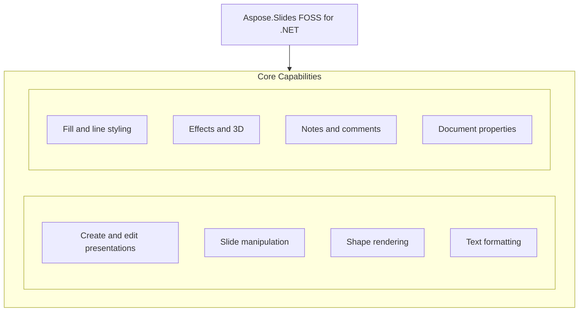

# Aspose.Slides FOSS for .NET

[](https://www.nuget.org/packages/Aspose.Slides.FOSS/) [](LICENSE) [](https://github.com/aspose-slides-foss/Aspose.Slides-FOSS-for-.NET/graphs/contributors)

[](https://products.aspose.org/slides/net/)

Aspose.Slides FOSS for .NET is a free, open-source library that enables developers to create, read, and convert PowerPoint presentations in .NET applications without requiring Microsoft PowerPoint. It supports reading and writing the PPTX format and other common slide formats, allowing users to programmatically build presentations with shapes, text, tables, images, and effects. The library is designed for .NET developers building desktop or server applications who need reliable presentation automation in a permissive MIT-licensed package. It runs on net8.0 and has no external dependencies.

## Navigation

- [At a Glance](#at-a-glance)
- [Key Capabilities](#key-capabilities)
- [Installation](#installation)
- [Dependencies](#dependencies)
- [API Reference](#api-reference)
- [Documentation & Resources](#documentation--resources)
- [Scope and Limitations](#scope-and-limitations)
- [Development and Testing](#development-and-testing)
- [License](#license)

## At a Glance



## Key Capabilities

- **Create and edit presentations.** Create and edit presentations by instantiating a new `Presentation` object, adding slides, and saving in PPTX format without requiring Microsoft PowerPoint.
- **Slide manipulation.** Add empty slides from layout templates, insert slides at specific positions, and organize slides into sections with descriptive names.
- **Shape rendering.** Add auto shapes like rectangles and ovals, picture frames from images or streams, and tables with customizable rows and columns.
- **Text formatting.** Set font height, bold style, Latin font, and paragraph alignment on text portions within shape text frames or table cells.
- **Fill and line styling.** Apply solid color, gradient, or pattern fills and customize line styles with specific colors and weights on shapes and text.
- **Effects and 3D.** Enable outer shadow, glow, soft edges, and 3D formatting on shapes to enhance visual presentation quality.
- **Notes and comments.** Add notes slides with text content and attach author comments at specific coordinates on slides.
- **Document properties.** Set built-in properties like title and author as well as custom properties for metadata storage and retrieval.

## Installation

Install the published package from NuGet (`Aspose.Slides.FOSS`):

```bash
dotnet add package Aspose.Slides.FOSS
```

## Dependencies

### Required Package Dependencies

No required third-party package dependencies; in `src/Aspose.Slides.Foss/Aspose.Slides.Foss.csproj`, no `PackageReference` a consumer would install is declared.

### Native and System Requirements

- Requires .NET `net8.0` (`TargetFramework` in `src/Aspose.Slides.Foss/Aspose.Slides.Foss.csproj`).

## API Reference

Aspose.Slides FOSS for .NET exposes the `Aspose.Slides.Foss` namespace as its primary entry point, where the `Presentation` class serves as the main object for creating, reading, and manipulating presentations. The `Aspose.Slides.Foss` namespace includes core interfaces such as `ISlide`, `IShape`, and `ITextFrame` that define the presentation model.

The verified public surface has 264 types.

<details>
<summary>View the Complete Public API Surface</summary>

### Core API

| Class | Description |
| --- | --- |
| `AdjustValue` | Represents a geometry shape adjustment value backed by an XML guide definition element. |
| `AdjustValueCollection` | Represents a collection of shape's adjustment values. |
| `AutoShape` | Represents an AutoShape — a preset or custom geometric shape that may contain text. |
| `BaseHandoutNotesSlideHeaderFooterManager` | Represents the base class for handout and notes slide header/footer managers. |
| `BasePortionFormat` | Common text-run formatting properties backed by an OOXML &lt;a:rPr&gt; element. |
| `BaseShapeLock` | Represents the base class for locks that determine which operations are disabled on a shape. |
| `BaseSlide` | Base class for Slide, LayoutSlide, and MasterSlide providing common slide functionality. |
| `BulletFormat` | Manages paragraph bullet formatting backed by OOXML bullet elements. |
| `Camera` | Represents 3D camera properties for a shape. |
| `Cell` | Represents a single cell within a table in a PowerPoint presentation. |
| `CellCollection` | Represents a read-only collection of table cells associated with a parent slide and slide part. |
| `CellFormat` | Represents the formatting properties of a table cell, providing access to fill formatting and six border line formats (left, top, right, bottom, diagonal-down, diagonal-up). |
| `ColorFormat` | Represents a color format used in presentation elements. |
| `Column` | Represents a table column as a collection of cells (one per row). |
| `ColumnCollection` | Represents a collection of columns in a table. |
| `ColumnFormat` | Represents the formatting properties of a table column. |
| `Comment` | Represents a comment on a slide. |
| `CommentAuthor` | Represents an author of comments in a presentation. |
| `CommentAuthorCollection` | Represents a collection of comment authors backed by a CommentAuthorsPart. |
| `CommentCollection` | Represents a collection of comments authored by a single author across all slides in a presentation. |
| `Connector` | Represents a connector shape that can link two shapes via connection sites. |
| `ConnectorLock` | Determines which operations are disabled on the parent connector shape. |
| `CustomData` | Represents custom data associated with a shape. |
| `DocumentProperties` | Represents the metadata properties of a presentation, wrapping OPC core, app, and custom property parts with lazy initialization. |
| `Color` | An immutable ARGB color. |
| `PointF` | Represents a 2D point with float coordinates. |
| `Size` | Represents a 2D size with integer dimensions. |
| `SizeF` | Represents a 2D size with float dimensions. |
| `EffectFormat` | Represents effect formatting properties backed by an effectLst element. |
| `Blur` | Represents a blur effect that is applied to the entire shape, including its fill. |
| `FillOverlay` | Represents a Fill Overlay effect. |
| `Glow` | Represents a glow effect, in which a color blurred outline is added outside the edges of the object. |
| `IBlur` | Represents a blur effect that is applied to the entire shape, including its fill. |
| `IFillOverlay` | Represents a Fill Overlay effect. |
| `IGlow` | Represents a glow effect, in which a color blurred outline is added outside the edges of the object. |
| `IImageTransformOperation` | Represents an image transform operation effect. |
| `IInnerShadow` | Represents an inner shadow effect. |
| `IOuterShadow` | Represents an Outer Shadow effect. |
| `IPresetShadow` | Represents a Preset Shadow effect. |
| `IReflection` | Represents a reflection effect. |
| `ISoftEdge` | Represents a Soft Edge effect. |
| `ImageTransformOperation` | Represents an image transform operation effect. |
| `InnerShadow` | Represents an inner shadow effect. |
| `OuterShadow` | Represents an outer shadow effect. |
| `PresetShadow` | Represents a preset shadow effect. |
| `Reflection` | Represents a reflection effect. |
| `SoftEdge` | Represents a soft edge effect. |
| `ISaveOptions` | Represents options that control how a presentation is saved. |
| `SaveOptions` | Represents options that control how a presentation is saved. |
| `FillFormat` | Represents fill formatting options. |
| `FontData` | Represents a font definition with a typeface name. |
| `GeometryShape` | Represents the base class for shapes that have geometric properties. |
| `GlobalLayoutSlideCollection` | Aggregates all layout slides across all master slides in a presentation. |
| `GradientFormat` | Represents a gradient format. |
| `GradientStop` | Represents a single gradient stop within a gradient fill. |
| `GradientStopCollection` | Manages a collection of &lt;a:gs&gt; child elements within an &lt;a:gsLst&gt; XML element. |
| `GraphicalObject` | Abstract base class for graphical objects on a slide. |
| `GraphicalObjectLock` | Represents a lock that determines which operations are disabled on a graphical object. |
| `GroupShape` | Represents a group shape that contains a collection of shapes. |
| `HeadingPair` | Represents a 'Heading pair' property of the document. |
| `IAdjustValue` | Represents a single adjustment value for a geometry shape. |
| `IAdjustValueCollection` | Represents a collection of shape adjustment values. |
| `IAutoShape` | Represents an AutoShape. |
| `IBaseHandoutNotesSlideHeaderFooterManager` | Represents a base interface for handout and notes slide header and footer management. |
| `IBaseHeaderFooterManager` | Represents a base interface for header and footer management. |
| `IBasePortionFormat` | Defines common text run formatting properties. |
| `IBaseSlide` | Represents a base slide. |
| `IBaseSlideHeaderFooterManager` | Represents a base interface for slide-level header and footer management. |
| `IBulkTextFormattable` | Represents an object that can apply text formatting in bulk to all contained text. |
| `IBulletFormat` | Represents paragraph bullet formatting properties. |
| `ICamera` | Represents the 3-D camera properties for a shape. |
| `ICell` | Represents a single cell in a table. |
| `ICellCollection` | Represents a collection of table cells. |
| `ICellFormat` | Represents the formatting of a table cell. |
| `IColorFormat` | Represents a color format used in presentation elements. |
| `IColumn` | Represents a single column in a table. |
| `IColumnCollection` | Represents a collection of table columns. |
| `IColumnFormat` | Represents the formatting properties of a table column. |
| `IComment` | Represents a comment on a slide. |
| `ICommentAuthor` | Represents an author of comments. |
| `ICommentAuthorCollection` | Represents a collection of comment authors. |
| `ICommentCollection` | Represents a collection of comments. |
| `IConnector` | Represents a connector shape that links two shapes. |
| `IConnectorLock` | Determines which operations are disabled on the parent connector shape. |
| `ICustomData` | Represents custom data associated with a shape. |
| `IDocumentProperties` | Represents the metadata properties of a presentation document. |
| `IEffectFormat` | Represents visual effect formatting properties for a shape. |
| `IEffectParamSource` | Represents a source of effect parameters. |
| `IFillFormat` | Represents fill formatting properties for a shape or text. |
| `IFillParamSource` | Auxiliary interface for fill parameter source. |
| `IFontData` | Represents a font definition. |
| `IGeometryShape` | Represents a shape with geometric properties. |
| `IGlobalLayoutSlideCollection` | Represents a collection of all layout slides in presentation. |
| `IGradientFormat` | Represents gradient fill formatting properties. |
| `IGradientStop` | Represents a single stop in a gradient fill. |
| `IGradientStopCollection` | Represents a collection of gradient stops. |
| `IGraphicalObject` | Represents a graphical object on a slide. |
| `IGraphicalObjectLock` | Determines which operations are disabled on the parent graphical object. |
| `IGroupShape` | Represents a group shape that contains other shapes. |
| `IHeadingPair` | Represents a heading pair entry describing a content grouping in a presentation. |
| `IHyperlinkContainer` | Represents an object that can contain hyperlinks. |
| `IImage` | Represents a raster or vector image. |
| `IImageCollection` | Represents a collection of IPPImage objects. |
| `ILayoutSlide` | Represents a layout slide. |
| `ILayoutSlideCollection` | Represents a base class for collection of layout slides. |
| `ILightRig` | Represents a light rig. |
| `ILineFillFormat` | Represents properties for lines filling. |
| `ILineFormat` | Represents format of a line. |
| `ILineParamSource` | Marker interface for objects that can serve as a source of line parameters. |
| `ILoadOptions` | Represents options that can be used to control how a presentation is loaded. |
| `IMasterLayoutSlideCollection` | Represents a collection of layout slides belonging to a master slide. |
| `IMasterSlide` | Represents a master slide in a presentation. |
| `IMasterSlideCollection` | Represents a collection of master slides. |
| `INotesSize` | Represents the size of a notes slide. |
| `INotesSlide` | Represents a notes slide in a presentation. |
| `INotesSlideHeaderFooterManager` | Represents a manager for notes slide header and footer placeholders. |
| `INotesSlideManager` | Manages notes slide operations for a slide. |
| `IPPImage` | Represents a presentation-embedded image stored in an OPC package part. |
| `IParagraph` | Represents a paragraph of text. |
| `IParagraphCollection` | Represents a collection of paragraphs. |
| `IParagraphFormat` | Contains the paragraph formatting properties. |
| `IPatternFormat` | Represents a pattern fill format. |
| `IPictureFillFormat` | Represents a picture fill style. |
| `IPictureFrame` | Represents a picture frame shape. |
| `IPictureFrameLock` | Determines which editing operations are disabled on a picture frame. |
| `IPlaceholder` | Represents a placeholder on a slide. |
| `IPortion` | Represents a portion (run) of text inside a paragraph. |
| `IPortionCollection` | Represents a collection of portions. |
| `IPortionFormat` | Defines the formatting properties for a text portion, combining base portion formatting with hyperlink container capabilities. |
| `IPresentation` | Represents a presentation document. |
| `IPresentationComponent` | Represents any component that belongs to a presentation. |
| `IRow` | Represents a row in a table. |
| `IRowCollection` | Represents a collection of table rows. |
| `IRowFormat` | Represents the formatting properties for a table row. |
| `ISection` | Represents a section of slides in a presentation. |
| `ISectionCollection` | Represents a collection of sections in a presentation. |
| `IShape` | Represents a shape on a slide. |
| `IShapeBevel` | Represents the bevel (relief) properties of a shape's face. |
| `IShapeCollection` | Represents an ordered, mutable collection of IShape objects belonging to a slide or group shape. |
| `IShapeFrame` | Represents the geometric frame properties of a shape. |
| `IShapeStyle` | Represents a shape's style reference. |
| `ISlide` | Represents a slide in a presentation. |
| `ISlideCollection` | Represents a collection of slides in a presentation. |
| `ISlideComponent` | Represents any component that belongs to a slide. |
| `ISlidesPicture` | Represents a picture reference within a slide. |
| `ITable` | Represents a table on a slide. |
| `ITableFormat` | Represents format of a table. |
| `ITextFrame` | Represents the text frame of a shape or cell. |
| `ITextFrameFormat` | Contains the TextFrame's formatting properties. |
| `IThreeDFormat` | Represents 3-D properties. |
| `IThreeDParamSource` | Marker interface for objects that provide 3D formatting parameters. |
| `Image` | Concrete image wrapper holding raw bytes and metadata. |
| `ImageCollection` | Concrete collection managing presentation images within an OPC package. |
| `Images` | Provides static factory methods for creating Image instances. |
| `BaseCollection` | Internal base class for all collection types. |
| `ContentTypesManager` | Manages the [Content_Types].xml file in an OPC package. |
| `OpcPackage` | Manages an Open Packaging Conventions (OPC) package. |
| `RelConstants` | Constants for OPC relationship namespaces and common relationship types. |
| `Relationship` | Represents a single relationship in a .rels file. |
| `RelationshipsManager` | Manages relationships (.rels) files in an OPC package. |
| `AppPropertiesPart` | Parses and serializes docProps/app.xml (extended properties) in an OPC package. |
| `HeadingPairData` | Internal representation of a heading pair entry in docProps/app.xml. |
| `AuthorData` | Raw data for a comment author parsed from XML. |
| `CommentAuthorsPart` | Manages the comment authors XML part (ppt/commentAuthors.xml). |
| `CommentData` | Raw data for a comment parsed from XML. |
| `CommentsPart` | Manages a slide comments XML part (ppt/comments/slideN.xml). |
| `DateTimeHelpers` | Helpers for converting between OOXML datetime strings and DateTime. |
| `CorePropertiesPart` | Parses and serializes docProps/core.xml (Dublin Core metadata). |
| `CustomPropertiesPart` | Parses and serializes docProps/custom.xml. |
| `LayoutSlidePart` | Manages a layout slide XML part (ppt/slideLayouts/slideLayoutN.xml). |
| `MasterSlidePart` | Manages a master slide XML part (ppt/slideMasters/slideMasterN.xml). |
| `NotesSlidePart` | Manages a notes slide XML part (ppt/notesSlides/notesSlideN.xml). |
| `MasterReference` | Reference to a master slide in the presentation, holding its unique ID and relationship ID. |
| `PresentationPart` | Manages the ppt/presentation.xml part of an OPC package. |
| `SlideReference` | Reference to a slide in the presentation, holding its unique ID and relationship ID. |
| `Template` | PPTX template loading. |
| `LayoutSlide` | Represents a layout slide in a presentation. |
| `LayoutSlideCollection` | Base class for collections of layout slides. |
| `LightRig` | Represents a light rig. |
| `LineFillFormat` | Represents properties for lines filling. |
| `LineFormat` | Represents line formatting properties. |
| `LoadOptions` | Represents options that can be used to control how a presentation is loaded. |
| `MasterLayoutSlideCollection` | Represents a collections of all layout slides of defined master slide. |
| `MasterSlide` | Represents a master slide in a presentation. |
| `MasterSlideCollection` | Represents a collection of master slides in a presentation. |
| `NotesSize` | Represents the size of a notes slide. |
| `NotesSlide` | Represents a notes slide in a presentation. |
| `NotesSlideHeaderFooterManager` | Manages visibility and text content of header, footer, date-time, and slide number placeholders on a notes slide. |
| `NotesSlideManager` | Manages notes slide operations for a slide. |
| `PPImage` | Concrete presentation-embedded image backed by an OPC package part. |
| `PVIObject` | Concrete base class providing property-value-inheritance infrastructure. |
| `Paragraph` | Represents a paragraph of text. |
| `ParagraphCollection` | Represents a collection of paragraphs. |
| `ParagraphFormat` | Represents the formatting properties for a paragraph. |
| `PatternFormat` | Represents a pattern fill format. |
| `Picture` | Concrete picture reference backed by an a:blip XML element in a slide's XML. |
| `PictureFillFormat` | Represents a picture fill style. |
| `PictureFrame` | Represents a picture frame shape. |
| `PictureFrameLock` | Determines which operations are disabled on the parent picture frame. |
| `Placeholder` | Represents a placeholder on a slide. |
| `Portion` | Represents a portion (run) of text inside a text paragraph. |
| `PortionCollection` | Represents a mutable collection of portions belonging to a slide component. |
| `PortionFormat` | This class contains the text portion formatting properties. |
| `Presentation` | Represents a Microsoft PowerPoint presentation document. |
| `Row` | Represents a table row as a collection of cells. |
| `RowCollection` | Represents a collection of rows in a table. |
| `RowFormat` | Represents the formatting properties of a table row. |
| `Section` | Represents a section of slides in a presentation. |
| `SectionCollection` | Represents a collection of sections in a presentation. |
| `Shape` | Base class for all shapes on a slide. |
| `ShapeBevel` | Represents the bevel (relief) properties of a shape's face. |
| `ShapeCollection` | Represents an ordered, mutable collection of IShape objects belonging to a slide or group shape. |
| `ShapeFrame` | Represents the geometric frame properties of a shape. |
| `ShapeStyle` | Represents a shape's style reference. |
| `Slide` | Represents a slide in a presentation. |
| `SlideCollection` | Represents a collection of slides in a presentation. |
| `Table` | Represents a table shape on a slide. |
| `TableFormat` | Represents format of a table. |
| `TextFrame` | Represents the text body of a shape. |
| `TextFrameFormat` | Contains the TextFrame's formatting properties. |
| `IThemeable` | Represents objects that can be themed. |
| `ThreeDFormat` | Represents 3-D formatting properties for a shape. |

#### Enumerations

| Enumeration | Description |
| --- | --- |
| `BevelPresetType` | Represents BevelPresetType enumeration. |
| `BulletType` | Represents BulletType enumeration. |
| `CameraPresetType` | Represents CameraPresetType enumeration. |
| `ColorType` | Represents ColorType enumeration. |
| `SaveFormat` | Defines constants representing all supported file formats for saving a presentation. |
| `FillBlendMode` | Represents FillBlendMode enumeration. |
| `FillType` | Represents FillType enumeration. |
| `FontAlignment` | Represents FontAlignment enumeration. |
| `GradientDirection` | Represents GradientDirection enumeration. |
| `GradientShape` | Represents GradientShape enumeration. |
| `LightRigPresetType` | Represents LightRigPresetType enumeration. |
| `LightingDirection` | Represents LightingDirection enumeration. |
| `LineAlignment` | Represents LineAlignment enumeration. |
| `LineArrowheadLength` | Represents LineArrowheadLength enumeration. |
| `LineArrowheadStyle` | Represents LineArrowheadStyle enumeration. |
| `LineArrowheadWidth` | Represents LineArrowheadWidth enumeration. |
| `LineCapStyle` | Represents LineCapStyle enumeration. |
| `LineDashStyle` | Represents LineDashStyle enumeration. |
| `LineJoinStyle` | Represents LineJoinStyle enumeration. |
| `LineStyle` | Represents LineStyle enumeration. |
| `MaterialPresetType` | Represents MaterialPresetType enumeration. |
| `NullableBool` | Represents NullableBool enumeration. |
| `NumberedBulletStyle` | Represents NumberedBulletStyle enumeration. |
| `PatternStyle` | Represents PatternStyle enumeration. |
| `PictureFillMode` | Represents PictureFillMode enumeration. |
| `PresetColor` | Represents PresetColor enumeration. |
| `PresetShadowType` | Represents PresetShadowType enumeration. |
| `RectangleAlignment` | Represents RectangleAlignment enumeration. |
| `SchemeColor` | Represents SchemeColor enumeration. |
| `ShapeType` | Represents preset geometry of geometry shapes. |
| `SlideLayoutType` | Represents SlideLayoutType enumeration. |
| `SourceFormat` | Represents SourceFormat enumeration. |
| `TableStylePreset` | Represents TableStylePreset enumeration. |
| `TextAlignment` | Represents TextAlignment enumeration. |
| `TextAnchorType` | Represents TextAnchorType enumeration. |
| `TextAutofitType` | Represents TextAutofitType enumeration. |
| `TextCapType` | Represents TextCapType enumeration. |
| `TextShapeType` | Represents TextShapeType enumeration. |
| `TextStrikethroughType` | Represents TextStrikethroughType enumeration. |
| `TextUnderlineType` | Represents TextUnderlineType enumeration. |
| `TextVerticalType` | Represents TextVerticalType enumeration. |
| `TileFlip` | Represents TileFlip enumeration. |

#### Detailed Member Reference

### Aspose

The Aspose namespace provides the root namespace for all Aspose products and serves as the top-level container for the Aspose.Slides and `Aspose.Slides.Foss` sub-namespaces.

### Slides

The Aspose.Slides namespace contains the commercial API surface for Aspose.Slides, including core types such as `Presentation`, `ISlide`, and `IShape` that define the presentation object model.

### Foss

The `Aspose.Slides.Foss` namespace provides the FOSS edition API surface, exposing the same core types as Aspose.Slides such as `Presentation`, `ISlide`, and `IShape`, but under a fully open-source license for .NET 8.0.

</details>

## Documentation & Resources

- **[Aspose.Slides for .NET — product page](https://products.aspose.com/slides/net/)** — The product page introduces Aspose.Slides for .NET, the commercial offering that complements this FOSS library, and describes its feature set and licensing options.
- **[Documentation](https://docs.aspose.com/slides/net/)** — The documentation provides step-by-step guides and conceptual topics for using Aspose.Slides FOSS for .NET to create, edit, and convert presentations.
- **[API reference](https://reference.aspose.com/slides/net/)** — The API reference documents every public type and member exposed by `Aspose.Slides.FOSS` for net8.0, including interfaces, enums, and classes. It covers all 264 verified public types; the [API Reference](#api-reference) section above covers the essentials.
- **[Knowledge base](https://kb.aspose.com/slides/net/)** — The knowledge base offers troubleshooting tips, frequently asked questions, and worked examples for common scenarios with Aspose.Slides FOSS for .NET.
- **[Aspose.Slides FOSS for Java](https://github.com/aspose-slides-foss/Aspose.Slides-FOSS-for-Java)** — The Aspose.Slides FOSS for Java repository hosts the Java port of the library, providing equivalent functionality for Java developers.
- **[Aspose.Slides FOSS for C++](https://github.com/aspose-slides-foss/Aspose.Slides-FOSS-for-Cpp)** — The Aspose.Slides FOSS for C++ repository hosts the C++ port of the library, providing equivalent functionality for C++ developers.
- **[Aspose.Slides FOSS for Python](https://github.com/aspose-slides-foss/Aspose.Slides-FOSS-for-Python)** — The Aspose.Slides FOSS for Python repository hosts the Python port of the library, providing equivalent functionality for Python developers.
- Found a bug or have a feature request? [Open an issue](https://github.com/aspose-slides-foss/Aspose.Slides-FOSS-for-.NET/issues).

## Scope and Limitations

Aspose.Slides FOSS for .NET supports creating, reading, modifying, and exporting PowerPoint presentations in the .NET 8.0 environment, targeting the net8.0 target framework.

- Aspose.Slides FOSS for .NET does not support advanced animation and transition effects beyond basic slide transitions.
- Aspose.Slides FOSS for .NET does not support macro or VBA project handling within presentations.
- Aspose.Slides FOSS for .NET does not support editing or rendering of 3D shapes or 3D effects in presentations.
- Aspose.Slides FOSS for .NET does not support exporting presentations to formats other than PPTX and PDF.
- Aspose.Slides FOSS for .NET does not support advanced chart editing features such as trendlines, error bars, or data labels customization beyond basic properties.
- Aspose.Slides FOSS for .NET does not support digital signing or rights management features for presentations.

These limitations don't apply to [Aspose.Slides for .NET — Enterprise Edition](https://products.aspose.com/slides/net/). `Aspose.Slides.FOSS` provides core PowerPoint processing capabilities for net8.0. When you want the commercial product instead of this one — if you need to render or convert — PDF, images, HTML, thumbnails — or need charts, SmartArt, animations, OLE objects or macro-enabled files, or need a supported product with a licence, none of that is here and none of it is planned in this repository.

## Development and Testing

Build and test Aspose.Slides FOSS for .NET using the net8.0 target framework; the repository includes tests under tests/, CI workflows in .github/workflows/, and documentation in docs/.

The suite covers 139 test files under `tests/`. Releases run through the [nuget-release workflow](.github/workflows/nuget-release.yml).

## License

This project is licensed under the [MIT License](LICENSE). The MIT License permits use, copying, modification, distribution, sublicensing, and commercial use, provided its copyright and permission notice are retained. The software is provided without warranty.
