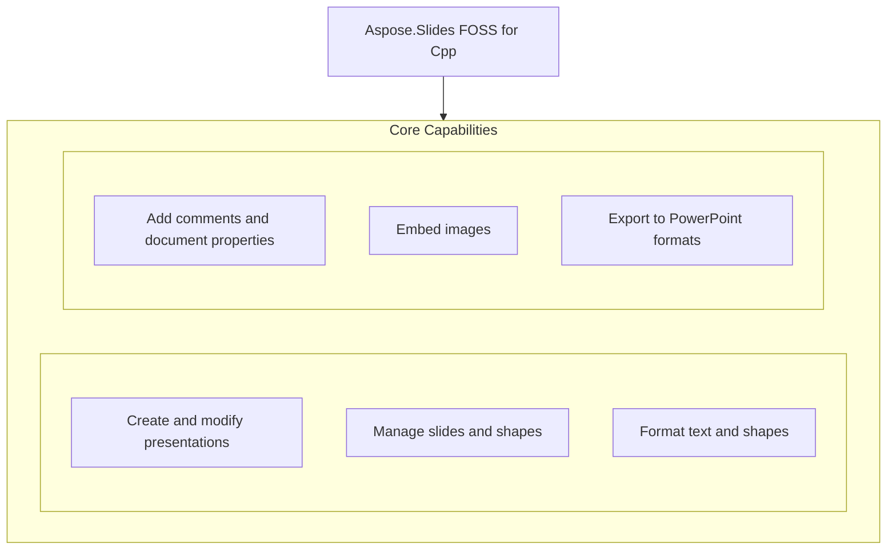

# Aspose.Slides FOSS for Cpp

[](LICENSE) [](https://github.com/aspose-slides-foss/Aspose.Slides-FOSS-for-Cpp/graphs/contributors)

[](https://products.aspose.org/slides/cpp/)

Aspose.Slides FOSS for Cpp is a C++ library that enables developers to create, read, and convert PowerPoint presentations programmatically. It solves the problem of automating slide deck generation and modification without requiring Microsoft PowerPoint, supporting formats such as PPTX as output. The library is used by C++ developers building applications that need to generate reports, presentations, or documentation dynamically. Built to C++20 standards, it requires CMake 3.20 or later and depends on pugixml for XML processing.

## Navigation

- [At a Glance](#at-a-glance)
- [Key Capabilities](#key-capabilities)
- [Installation](#installation)
- [Dependencies](#dependencies)
- [Quick Start](#quick-start)
- [API Reference](#api-reference)
- [Documentation & Resources](#documentation--resources)
- [Scope and Limitations](#scope-and-limitations)
- [Development and Testing](#development-and-testing)
- [Third-Party Notices](#third-party-notices)
- [License](#license)

## At a Glance



## Key Capabilities

- **Create and modify presentations.** Create and modify presentations using the `Aspose.Slides.Foss` API, which initializes a new presentation with one blank slide and supports saving in multiple formats.
- **Manage slides and shapes.** Access slide collections and add various shape types to slides, enabling structured content organization.
- **Format text and shapes.** Apply detailed formatting to text and shapes including font height, bold styling, and solid fill colors for visual customization.
- **Add comments and document properties.** Attach comment authors and replies to specific slides with precise positioning, and set title, author, and custom numeric document properties.
- **Embed images.** Embed images into presentations using the `Aspose.Slides.Foss` API, supporting common image formats for visual enrichment.
- **Export to PowerPoint formats.** Export presentations as PPTX files using the `SaveFormat` enumeration.

## Installation

`AsposeSlidesFoss` is not yet published on any package registry; build it from a source checkout instead, verified against this revision:

```bash
git clone https://github.com/aspose-slides-foss/Aspose.Slides-FOSS-for-Cpp.git
cd Aspose.Slides-FOSS-for-Cpp
cmake -S . -B build
```

## Dependencies

### Required Package Dependencies

- `pugixml`

### Native and System Requirements

- Requires C++ `20` (`CMAKE_CXX_STANDARD` in `CMakeLists.txt`).

### Development Dependencies

- `AsposeSlidesFoss`
- `googletest`
- `GTest`
- `miniz`

## Quick Start

This example creates a new presentation, adds a comment author and two comments with a reply relationship, then saves the file as `comments.pptx` using Aspose.Slides FOSS for Cpp 26.9.0.

```cpp
#include <Aspose/Slides/Foss/presentation.h>
#include <Aspose/Slides/Foss/comment_author_collection.h>
#include <Aspose/Slides/Foss/comment_author.h>
#include <Aspose/Slides/Foss/comment_collection.h>
#include <Aspose/Slides/Foss/comment.h>
#include <Aspose/Slides/Foss/drawing/point_f.h>
#include <Aspose/Slides/Foss/export/save_format.h>
#include <chrono>

using namespace Aspose::Slides::Foss;
using namespace Aspose::Slides::Foss::Drawing;

Presentation pres;
auto& author = pres.comment_authors().add_author("Jane Smith", "JS");
auto& slide = pres.slides()[0];

auto& comment = author.comments().add_comment(
    "Review this slide", slide, PointF(2.0f, 2.0f),
    std::chrono::system_clock::now());

auto& reply = author.comments().add_comment(
    "Agreed", slide, PointF(2.5f, 2.5f), std::chrono::system_clock::now());
reply.set_parent_comment(&comment);

pres.save("comments.pptx", SaveFormat::PPTX);
```

This example creates a new presentation, sets built-in and custom document properties, then saves the file as `deck.pptx` using Aspose.Slides FOSS for Cpp 26.9.0.

```cpp
#include <Aspose/Slides/Foss/presentation.h>
#include <Aspose/Slides/Foss/document_properties.h>
#include <Aspose/Slides/Foss/export/save_format.h>

using namespace Aspose::Slides::Foss;

Presentation pres;
pres.document_properties().set_title("Q1 Results");
pres.document_properties().set_author("Finance Team");
pres.document_properties().set_custom_property_value("Version", 3);
pres.save("deck.pptx", SaveFormat::PPTX);
```

## API Reference

Aspose.Slides FOSS for Cpp exposes the `AsposeSlidesFoss` class as its primary entry point, providing constructors to create new presentations or load existing .pptx files. The class exposes collections for slides, shapes, images, comment authors, masters, and document properties, enabling full programmatic control over presentation content and structure.

The verified public surface has 234 types.

<details>
<summary>View the Complete Public API Surface</summary>

### Core API

| Class | Description |
| --- | --- |
| `AdjustValue` | Aspose.Slides.Foss.AdjustValue represents a single adjustable parameter for a shape geometry, storing its raw value, angle, and associated geometry element name. |
| `AdjustValueCollection` | Aspose.Slides.Foss.AdjustValueCollection is a container that holds multiple AdjustValue instances and provides iteration and size operations. |
| `AutoShape` | Aspose.Slides.Foss.AutoShape represents a predefined geometric shape such as a rectangle, ellipse, or arrow that can be added to a slide. |
| `BaseHandoutNotesSlideHeaderFooterManager` | Aspose.Slides.Foss.BaseHandoutNotesSlideHeaderFooterManager provides access to header and footer settings for handout and notes slides. |
| `BasePortionFormat` | Aspose.Slides.Foss.BasePortionFormat defines common formatting properties for text portions, including font settings, color, and effects. |
| `BaseShapeLock` | Aspose.Slides.Foss.BaseShapeLock specifies which operations are restricted on a shape, such as moving, resizing, or editing its geometry. |
| `BaseSlide` | Aspose.Slides.Foss.BaseSlide is the base class for all slide types and provides access to shapes, headers, footers, and slide properties. |
| `BulletFormat` | Aspose.Slides.Foss.BulletFormat controls the appearance and behavior of bullet points in a text paragraph. |
| `Camera` | Aspose.Slides.Foss.Camera defines the viewing perspective and projection settings for three-dimensional shapes. |
| `Cell` | Aspose.Slides.Foss.Cell represents an individual cell within a table and provides access to its content and formatting. |
| `CellCollection` | Aspose.Slides.Foss.CellCollection is a container for table cells that supports indexed access and iteration. |
| `CellFormat` | Aspose.Slides.Foss.CellFormat specifies the visual appearance of a table cell, including fill, border, and text formatting. |
| `ColorFormat` | Aspose.Slides.Foss.ColorFormat encapsulates color information and supports solid, gradient, pattern, and picture fill types. |
| `Column` | Aspose.Slides.Foss.Column represents a single column in a table and provides access to its cells and formatting. |
| `ColumnCollection` | Aspose.Slides.Foss.ColumnCollection is a container for table columns that supports indexed access and iteration. |
| `ColumnFormat` | Aspose.Slides.Foss.ColumnFormat defines formatting properties that apply to an entire table column. |
| `Comment` | Aspose.Slides.Foss.Comment represents a user comment attached to a slide or shape, including author, text, and timestamp. |
| `CommentAuthor` | Aspose.Slides.Foss.CommentAuthor stores information about a comment author, such as name, initials, and associated comments. |
| `CommentAuthorCollection` | Aspose.Slides.Foss.CommentAuthorCollection is a container for comment authors that supports iteration and author lookup. |
| `CommentCollection` | Aspose.Slides.Foss.CommentCollection is a container for comments attached to a slide or shape, supporting indexed access and iteration. |
| `Connector` | Aspose.Slides.Foss.Connector is a line that automatically connects two shapes and updates its path when the shapes move. |
| `DocumentProperties` | Aspose.Slides.Foss.DocumentProperties provides access to built-in and custom metadata properties of a presentation document. |
| `Color` | Aspose.Slides.Foss.Drawing.Color represents a color value and provides static methods to create common colors. |
| `PointF` | Aspose.Slides.Foss.Drawing.PointF represents a point in two-dimensional space using floating-point coordinates. |
| `RectangleF` | Aspose.Slides.Foss.Drawing.RectangleF represents a rectangle in two-dimensional space using floating-point coordinates. |
| `Size` | Aspose.Slides.Foss.Drawing.Size represents the width and height of a rectangle using integer values. |
| `SizeF` | Aspose.Slides.Foss.Drawing.SizeF represents the width and height of a rectangle using floating-point values. |
| `EffectFormat` | Aspose.Slides.Foss.EffectFormat provides access to visual effects such as shadows, glows, blurs, and three-dimensional settings applied to a shape. |
| `Blur` | Aspose.Slides.Foss.Effects.Blur applies a blur effect to a shape, softening its edges by averaging pixel values. |
| `FillOverlay` | Aspose.Slides.Foss.Effects.FillOverlay combines a fill color with the underlying shape fill using a specified blend mode. |
| `Glow` | Aspose.Slides.Foss.Effects.Glow adds a luminous outline around a shape, simulating light emission. |
| `IBlur` | Aspose.Slides.Foss.Effects.IBlur is an interface that defines the contract for applying a blur effect to a shape. |
| `IFillOverlay` | Aspose.Slides.Foss.Effects.IFillOverlay is an interface that defines the contract for applying a fill overlay effect to a shape. |
| `IGlow` | Aspose.Slides.Foss.Effects.IGlow is an interface that defines the contract for applying a glow effect to a shape. |
| `IImageTransformOperation` | Aspose.Slides.Foss.Effects.IImageTransformOperation is an interface for image transformation operations such as blur, fill overlay, and glow. |
| `IInnerShadow` | Aspose.Slides.Foss.Effects.IInnerShadow is an interface that defines the contract for applying an inner shadow effect to a shape. |
| `IOuterShadow` | IOuterShadow represents an outer shadow effect that can be applied to a shape, with properties for blur radius, direction, distance, color, and scaling or skewing of the shadow. |
| `IPresetShadow` | IPresetShadow represents a preset shadow effect that can be applied to a shape, with properties for direction, distance, color, and a predefined shadow style. |
| `IReflection` | IReflection represents a reflection effect that can be applied to a shape, with properties for blur radius, direction, distance, opacity, and fade direction. |
| `ISoftEdge` | ISoftEdge represents a soft edge effect that can be applied to a shape to smooth its boundaries. |
| `ImageTransformOperation` | ImageTransformOperation is the base interface for image transform operations such as shadows, reflections, and soft edges. |
| `InnerShadow` | InnerShadow represents an inner shadow effect that can be applied to a shape, with properties for blur radius, direction, distance, and color. |
| `OuterShadow` | OuterShadow represents an outer shadow effect that can be applied to a shape, with properties for blur radius, direction, distance, color, and scaling or skewing of the shadow. |
| `PresetShadow` | PresetShadow represents a preset shadow effect that can be applied to a shape, with properties for direction, distance, color, and a predefined shadow style. |
| `Reflection` | Reflection represents a reflection effect that can be applied to a shape, with properties for blur radius, direction, distance, opacity, and fade direction. |
| `SoftEdge` | SoftEdge represents a soft edge effect that can be applied to a shape to smooth its boundaries. |
| `FillFormat` | FillFormat provides access to the fill properties of a shape, such as solid, gradient, pattern, or texture fills. |
| `FontData` | FontData holds information about a font used in a presentation, such as name, height, and formatting attributes. |
| `GeometryShape` | GeometryShape represents a shape with a defined geometric path and properties for its geometry. |
| `GlobalLayoutSlideCollection` | GlobalLayoutSlideCollection provides access to the global layout slides in a presentation. |
| `GradientFormat` | GradientFormat provides access to the gradient fill properties of a shape. |
| `GradientStop` | GradientStop defines a color and position within a gradient fill. |
| `GradientStopCollection` | GradientStopCollection is a collection of gradient stops that define a gradient fill. |
| `GraphicalObject` | GraphicalObject is the base class for all objects that can be drawn on a slide, such as shapes, tables, and charts. |
| `GraphicalObjectLock` | GraphicalObjectLock specifies which operations are locked for a graphical object. |
| `GroupShape` | GroupShape represents a container that holds multiple shapes as a single unit. |
| `HeadingPair` | HeadingPair represents a pair of values used in document summary information. |
| `IAdjustValue` | IAdjustValue represents a value that can be adjusted on a shape, such as a corner radius or turn amount. |
| `IAdjustValueCollection` | IAdjustValueCollection is a collection of adjust values that define the adjustable parameters of a shape. |
| `IAutoShape` | IAutoShape represents an auto shape with a predefined geometry and formatting options. |
| `IBaseHandoutNotesSlideHeaderFooterManager` | IBaseHandoutNotesSlideHeaderFooterManager provides access to header and footer settings for handout and notes slides. |
| `IBaseHeaderFooterManager` | IBaseHeaderFooterManager provides access to header and footer settings for slides. |
| `IBasePortionFormat` | IBasePortionFormat provides access to the formatting properties of a text portion. |
| `IBaseSlide` | IBaseSlide is the base interface for all slide types in a presentation. |
| `IBaseSlideHeaderFooterManager` | IBaseSlideHeaderFooterManager provides access to header and footer settings for a slide. |
| `IBulkTextFormattable` | IBulkTextFormattable allows bulk formatting of text within a text frame. |
| `IBulletFormat` | IBulletFormat provides access to the bullet formatting properties of a paragraph. |
| `ICamera` | ICamera represents a camera used to define 3D view settings for a shape. |
| `ICell` | ICell represents a cell in a table. |
| `ICellCollection` | ICellCollection is a collection of cells in a table row. |
| `ICellFormat` | ICellFormat provides access to the formatting properties of a table cell. |
| `IColorFormat` | IColorFormat represents a color definition that can be a solid color, a preset color, a scheme color, or a color defined by RGB float values. |
| `IColumn` | IColumn represents a single column in a table, providing access to its width, format, and text content. |
| `IColumnCollection` | IColumnCollection is a collection of columns in a table, supporting operations such as adding, inserting, and removing columns. |
| `IColumnFormat` | IColumnFormat defines the formatting properties that apply to a table column, such as width and fill. |
| `IComment` | IComment represents a comment attached to a slide, including its author, creation time, position, and text content. |
| `ICommentAuthor` | ICommentAuthor represents a comment author identified by name and initials, with a collection of their comments. |
| `ICommentAuthorCollection` | ICommentAuthorCollection manages a set of comment authors, allowing addition, lookup, and removal of authors. |
| `ICommentCollection` | ICommentCollection holds all comments associated with a slide, supporting enumeration and removal of individual comments. |
| `IConnector` | IConnector represents a connector shape that links two shapes and can be repositioned dynamically. |
| `IDocumentProperties` | IDocumentProperties provides access to built-in and custom document metadata properties of a presentation. |
| `IEffectFormat` | IEffectFormat exposes effects such as shadows, glows, and 3D formatting that can be applied to a shape. |
| `IEffectParamSource` | IEffectParamSource defines the source of effect parameters used in shape effect formatting. |
| `IFillFormat` | IFillFormat describes how a shape is filled, including solid, gradient, pattern, or picture fill types. |
| `IFillParamSource` | IFillParamSource specifies the origin of fill parameters used in shape fill formatting. |
| `IFontData` | IFontData holds font information such as name, height, bold, italic, and other typographic attributes. |
| `IGeometryShape` | IGeometryShape represents a shape with geometric properties such as path, vertices, and transformation. |
| `IGlobalLayoutSlideCollection` | IGlobalLayoutSlideCollection contains all global layout slides available in the presentation. |
| `IGradientFormat` | IGradientFormat defines gradient fill properties including direction, style, and stops. |
| `IGradientStop` | IGradientStop represents a single color stop in a gradient fill, with position and color information. |
| `IGradientStopCollection` | IGradientStopCollection manages a sequence of gradient stops used in gradient fill definitions. |
| `IGraphicalObject` | IGraphicalObject is the base interface for all graphical elements on a slide, such as shapes, tables, and charts. |
| `IGraphicalObjectLock` | IGraphicalObjectLock controls whether a graphical object can be selected, edited, or reordered. |
| `IGroupShape` | IGroupShape represents a container that holds multiple shapes as a single unit. |
| `IHeadingPair` | IHeadingPair represents a pair of document property values used for document summary information. |
| `IHyperlinkContainer` | IHyperlinkContainer provides access to hyperlink settings associated with a shape or text portion. |
| `IImage` | IImage represents an image embedded in a presentation, including its binary data and metadata. |
| `IImageCollection` | IImageCollection manages a set of images used in the presentation, supporting addition and removal. |
| `ILayoutSlide` | ILayoutSlide defines the layout and placeholder structure for slides based on a master slide. |
| `ILayoutSlideCollection` | ILayoutSlideCollection contains all layout slides associated with a master slide. |
| `ILightRig` | ILightRig defines a 3D lighting setup used to illuminate 3D shapes in a slide. |
| `ILineFillFormat` | ILineFillFormat specifies how the line (stroke) of a shape is filled. |
| `ILineFormat` | ILineFormat defines the visual properties of a shape's outline, such as weight, dash style, and color. |
| `ILineParamSource` | ILineParamSource specifies the origin of line parameters used in shape line formatting. |
| `ILoadOptions` | ILoadOptions controls how a presentation file is loaded, including password handling and format detection. |
| `IMasterLayoutSlideCollection` | IMasterLayoutSlideCollection holds all layout slides derived from a master slide. |
| `IMasterSlide` | IMasterSlide defines the base layout and formatting for a set of slides in a presentation. |
| `IMasterSlideCollection` | IMasterSlideCollection contains all master slides in the presentation, each defining a unique layout theme. |
| `INotesSize` | INotesSize specifies the dimensions and orientation of the notes page in a presentation. |
| `INotesSlide` | INotesSlide holds the notes content associated with a slide, including text and formatting. |
| `INotesSlideHeaderFooterManager` | INotesSlideHeaderFooterManager controls the visibility and content of header and footer elements on a notes slide. |
| `INotesSlideManager` | INotesSlideManager provides methods to add and remove notes slides and access the notes slide for a given slide. |
| `IPPImage` | IPPImage represents a picture placeholder image with properties such as width, height, and binary data. |
| `IParagraph` | IParagraph represents a paragraph within a text frame and contains portions and paragraph formatting. |
| `IParagraphCollection` | IParagraphCollection is a collection of paragraphs that supports enumeration, indexing, and modification operations. |
| `IParagraphFormat` | IParagraphFormat defines formatting properties for a paragraph such as alignment, indentation, and line break behavior. |
| `IPatternFormat` | IPatternFormat specifies pattern fill properties for shapes, text, or other elements. |
| `IPictureFillFormat` | IPictureFillFormat defines how a picture is used to fill a shape, including tiling and cropping options. |
| `IPictureFrame` | IPictureFrame represents a picture frame shape that contains an image and supports formatting and positioning. |
| `IPictureFrameLock` | IPictureFrameLock restricts editing operations on a picture frame such as cropping or aspect ratio changes. |
| `IPortion` | IPortion represents a segment of text with a uniform format within a paragraph. |
| `IPortionCollection` | IPortionCollection is a collection of text portions that supports enumeration, indexing, and modification operations. |
| `IPortionFormat` | IPortionFormat defines formatting properties for a text portion such as font height, bold, and color. |
| `IPresentation` | IPresentation represents a PowerPoint presentation and provides access to slides, sections, and presentation-wide properties. |
| `IPresentationComponent` | IPresentationComponent is a base interface for presentation elements that can be identified and managed within the document. |
| `IRow` | IRow represents a row in a table and contains cells with text and formatting. |
| `IRowCollection` | IRowCollection is a collection of table rows that supports enumeration, indexing, and modification operations. |
| `IRowFormat` | IRowFormat defines formatting properties for a table row such as height and fill style. |
| `ISection` | ISection represents a section in a presentation and contains layout slides and slide masters. |
| `IShape` | IShape is a base interface for all shapes on a slide including auto shapes, pictures, tables, and connectors. |
| `IShapeBevel` | IShapeBevel defines the bevel effect applied to a shape's edges for three-dimensional appearance. |
| `IShapeCollection` | IShapeCollection is a collection of shapes on a slide that supports enumeration, indexing, and modification operations. |
| `IShapeFrame` | IShapeFrame defines the position, size, and lock settings for a shape. |
| `IShapeStyle` | IShapeStyle provides access to the visual style properties of a shape such as line and fill formatting. |
| `ISlide` | ISlide represents a slide in a presentation and contains shapes, text frames, and slide-specific properties. |
| `ISlideCollection` | ISlideCollection is a collection of slides that supports enumeration, indexing, and modification operations. |
| `ISlideComponent` | ISlideComponent is a base interface for slide elements that can be identified and managed within a slide. |
| `ISlidesPicture` | ISlidesPicture represents a picture object embedded in a slide with properties such as image data and size. |
| `ITable` | ITable represents a table shape composed of rows and cells for structured data display. |
| `ITableFormat` | ITableFormat defines formatting properties for a table such as cell margins and border styles. |
| `ITextFrame` | ITextFrame represents a container for text within a shape and holds paragraphs and formatting. |
| `ITextFrameFormat` | ITextFrameFormat defines formatting properties for a text frame such as margins and text wrapping. |
| `IThreeDFormat` | IThreeDFormat specifies three-dimensional properties for a shape such as extrusion and perspective. |
| `IThreeDParamSource` | IThreeDParamSource defines the source of three-dimensional parameters for a shape. |
| `Image` | Image represents an image stored in the presentation's image collection with metadata such as width and height. |
| `ImageCollection` | ImageCollection is a collection of images in the presentation that supports enumeration and indexing. |
| `Images` | Images provides access to the collection of images stored in the presentation. |
| `LayoutSlide` | LayoutSlide defines the layout and placeholder structure for slides based on a master slide. |
| `LayoutSlideCollection` | LayoutSlideCollection is a collection of layout slides that supports enumeration and indexing. |
| `LightRig` | LightRig defines a lighting setup for three-dimensional shapes with preset types and direction. |
| `LineFillFormat` | LineFillFormat holds the fill properties for a line, including solid, gradient, and pattern fills. |
| `LineFormat` | LineFormat provides access to the visual properties of a line, such as style, width, and arrowheads. |
| `MasterLayoutSlideCollection` | MasterLayoutSlideCollection contains the layout slides associated with a master slide. |
| `MasterReference` | MasterReference holds a reference to a master slide used by a layout slide. |
| `MasterSlide` | MasterSlide defines the master layout and design for a presentation. |
| `MasterSlideCollection` | MasterSlideCollection contains all master slides in a presentation. |
| `NotesSize` | NotesSize specifies the dimensions and orientation of notes pages. |
| `NotesSlide` | NotesSlide holds the notes and header-footer content associated with a slide. |
| `NotesSlideHeaderFooterManager` | NotesSlideHeaderFooterManager provides access to header and footer settings on a notes slide. |
| `NotesSlideManager` | NotesSlideManager provides methods to manage notes slides for presentation slides. |
| `NotesSlidePart` | NotesSlidePart represents the underlying data structure of a notes slide. |
| `PPImage` | PPImage represents a picture object stored in a presentation. |
| `PVIObject` | PVIObject is the base class for all presentation visual items. |
| `Paragraph` | Paragraph represents a paragraph of text within a text frame. |
| `ParagraphCollection` | ParagraphCollection contains all paragraphs in a text frame. |
| `ParagraphFormat` | ParagraphFormat holds formatting properties for a paragraph, such as alignment and spacing. |
| `PatternFormat` | PatternFormat specifies the pattern used to fill an area. |
| `Picture` | Picture represents a picture object in a presentation. |
| `PictureFillFormat` | PictureFillFormat holds the fill properties for a picture, such as tile or stretch. |
| `PictureFrame` | PictureFrame represents a shape that contains a picture. |
| `PictureFrameLock` | PictureFrameLock specifies which operations are restricted on a picture frame. |
| `Portion` | Portion represents a run of text with the same formatting within a paragraph. |
| `PortionCollection` | PortionCollection contains all portions in a paragraph. |
| `PortionFormat` | PortionFormat holds formatting properties for a portion, such as font and color. |
| `Presentation` | Presentation represents a complete PowerPoint file and provides access to its slides and content. |
| `Row` | Row represents a single row in a table in Aspose.Slides FOSS for Cpp and provides access to its formatting and cell contents. |
| `RowCollection` | RowCollection is a collection of Row objects that belong to a table in Aspose.Slides FOSS for Cpp. |
| `RowFormat` | RowFormat holds the formatting properties that apply to a Row in a table in Aspose.Slides FOSS for Cpp. |
| `Shape` | Shape is the base class for all drawing objects such as auto shapes, lines, connectors, and text frames in Aspose.Slides FOSS for Cpp. |
| `ShapeBevel` | ShapeBevel defines the bevel effect applied to a shape in Aspose.Slides FOSS for Cpp. |
| `ShapeCollection` | ShapeCollection is a collection of Shape objects contained in a slide in Aspose.Slides FOSS for Cpp. |
| `ShapeFrame` | ShapeFrame holds the geometric properties such as position and size of a shape in Aspose.Slides FOSS for Cpp. |
| `SimpleColorFormat` | SimpleColorFormat provides a simple way to specify a solid color for use in formatting elements in Aspose.Slides FOSS for Cpp. |
| `Slide` | Slide represents a single slide in a presentation in Aspose.Slides FOSS for Cpp and contains its shapes and content. |
| `SlideCollection` | SlideCollection is a collection of Slide objects that make up a presentation in Aspose.Slides FOSS for Cpp. |
| `SlideReference` | SlideReference provides a lightweight reference to a slide for use in linking or navigation in Aspose.Slides FOSS for Cpp. |
| `Table` | Table represents a tabular structure composed of rows and cells in Aspose.Slides FOSS for Cpp. |
| `TableFormat` | TableFormat holds the formatting properties that apply to an entire table in Aspose.Slides FOSS for Cpp. |
| `TextFrame` | TextFrame contains text content and provides access to its formatting and layout in Aspose.Slides FOSS for Cpp. |
| `TextFrameFormat` | TextFrameFormat holds the formatting properties that apply to a TextFrame in Aspose.Slides FOSS for Cpp. |
| `IThemeable` | IThemeable is an interface implemented by objects that can participate in a presentation's theme in Aspose.Slides FOSS for Cpp. |
| `ThreeDFormat` | ThreeDFormat provides access to three-dimensional properties such as extrusion and rotation for a shape in Aspose.Slides FOSS for Cpp. |

#### Enumerations

| Enumeration | Description |
| --- | --- |
| `BevelPresetType` | Aspose.Slides.Foss.BevelPresetType enumerates predefined bevel styles that can be applied to a shape's three-dimensional appearance. |
| `BulletType` | Aspose.Slides.Foss.BulletType specifies the kind of bullet used in a paragraph, such as none, bullet, or number. |
| `CameraPresetType` | Aspose.Slides.Foss.CameraPresetType enumerates predefined camera positions and angles for three-dimensional scene rendering. |
| `ColorType` | Aspose.Slides.Foss.ColorType enumerates the categories of color representation used in Aspose.Slides.Foss, such as solid or scheme. |
| `FillBlendMode` | FillBlendMode specifies how a fill blends with content behind it. |
| `FillType` | FillType specifies the type of fill applied to a shape, such as solid, gradient, pattern, or texture. |
| `FontAlignment` | FontAlignment specifies the alignment of text within a text frame or paragraph. |
| `GradientDirection` | GradientDirection specifies the direction of a gradient fill. |
| `GradientShape` | GradientShape represents a shape with a gradient fill applied to it. |
| `LightRigPresetType` | LightRigPresetType specifies the preset lighting configuration used for three-dimensional shapes. |
| `LightingDirection` | LightingDirection represents the direction of a light source used in 3D effects. |
| `LineAlignment` | LineAlignment specifies how a line is aligned relative to its anchor point. |
| `LineArrowheadLength` | LineArrowheadLength defines the length of an arrowhead on a line. |
| `LineArrowheadStyle` | LineArrowheadStyle specifies the style of an arrowhead on a line. |
| `LineArrowheadWidth` | LineArrowheadWidth defines the width of an arrowhead on a line. |
| `LineCapStyle` | LineCapStyle specifies how the ends of a line are drawn. |
| `LineDashStyle` | LineDashStyle specifies the dash pattern used for a line. |
| `LineJoinStyle` | LineJoinStyle specifies how line segments are joined together. |
| `LineStyle` | LineStyle specifies the basic style of a line, such as single or double. |
| `MaterialPresetType` | MaterialPresetType specifies a preset material used in 3D rendering. |
| `NullableBool` | NullableBool represents a Boolean value that can be true, false, or undefined. |
| `NumberedBulletStyle` | NumberedBulletStyle specifies the style of numbered bullets in a list. |
| `PatternStyle` | PatternStyle specifies the style of a fill pattern. |
| `PictureFillMode` | PictureFillMode specifies how a picture is used to fill an area. |
| `PresetColor` | PresetColor specifies a predefined color value. |
| `PresetShadowType` | PresetShadowType represents a predefined shadow style that can be applied to shapes in Aspose.Slides FOSS for Cpp. |
| `RectangleAlignment` | RectangleAlignment specifies how a rectangle is aligned relative to its container in Aspose.Slides FOSS for Cpp. |
| `SaveFormat` | SaveFormat enumerates the file formats that Aspose.Slides FOSS for Cpp supports for saving presentations. |
| `SchemeColor` | SchemeColor represents a color that is part of a presentation's color scheme in Aspose.Slides FOSS for Cpp. |
| `ShapeType` | ShapeType identifies the geometric type of an auto shape in Aspose.Slides FOSS for Cpp. |
| `SlideLayoutType` | SlideLayoutType specifies the layout type of a slide such as title, content, or blank in Aspose.Slides FOSS for Cpp. |
| `SourceFormat` | SourceFormat enumerates the file formats that Aspose.Slides FOSS for Cpp can load as input presentations. |
| `TableStylePreset` | TableStylePreset defines a predefined style that can be applied to a table in Aspose.Slides FOSS for Cpp. |
| `TextAlignment` | TextAlignment specifies the horizontal alignment of text within a text frame in Aspose.Slides FOSS for Cpp. |
| `TextAnchorType` | TextAnchorType defines how text is anchored vertically within a text frame in Aspose.Slides FOSS for Cpp. |
| `TextAutofitType` | TextAutofitType controls how text automatically resizes or fits within a text frame in Aspose.Slides FOSS for Cpp. |
| `TextCapType` | TextCapType specifies the capitalization style applied to text in Aspose.Slides FOSS for Cpp. |
| `TextShapeType` | TextShapeType identifies the type of a text shape such as a text box or placeholder in Aspose.Slides FOSS for Cpp. |
| `TextStrikethroughType` | TextStrikethroughType specifies the style of strikethrough applied to text in Aspose.Slides FOSS for Cpp. |
| `TextUnderlineType` | TextUnderlineType specifies the style of underline applied to text in Aspose.Slides FOSS for Cpp. |
| `TextVerticalType` | TextVerticalType defines the vertical orientation of text in Aspose.Slides FOSS for Cpp. |
| `TileFlip` | TileFlip specifies how a picture or gradient fill is flipped when tiled in Aspose.Slides FOSS for Cpp. |

#### Detailed Member Reference

### Foss

The `Aspose.Slides.Foss` class supports creating new presentations with a default blank slide or loading from a file path, and provides access to slide collections, master slides, layout slides, comment authors, images, and document properties through dedicated member functions, with save operations supporting export to .pptx format.

</details>

## Documentation & Resources

- **[Getting started guide](https://docs.aspose.org/slides/cpp/)** — The getting started guide introduces Aspose.Slides FOSS for Cpp fundamentals and initial setup for version 26.9.0.
- **[How-to guides & FAQ](https://kb.aspose.org/slides/cpp/)** — The how-to guides and FAQ provide practical examples and answers for common tasks when using Aspose.Slides FOSS for Cpp.
- **[Full API reference](https://reference.aspose.org/slides/cpp/)** — The full API reference documents all classes, methods, and functionality available in Aspose.Slides FOSS for Cpp. It covers all 234 verified public types; the API Reference section above covers the essentials. It covers all 234 verified public types; the [API Reference](#api-reference) section above covers the essentials.
- **[Publishing guide](PUBLISHING.md)** — The publishing guide explains how to build and package Aspose.Slides FOSS for Cpp for distribution.
- **[GitHub repository](https://github.com/aspose-slides-foss/Aspose.Slides-FOSS-for-Cpp)** — The GitHub repository hosts the source code, release artifacts, and development history for Aspose.Slides FOSS for Cpp.
- Found a bug or have a feature request? [Open an issue](https://github.com/aspose-slides-foss/Aspose.Slides-FOSS-for-Cpp/issues).

## Scope and Limitations

Aspose.Slides FOSS for Cpp version 26.9.0 is a C++ library for creating and manipulating PowerPoint presentations, supporting C++20 and requiring CMake 3.20 or later. It is distributed under the MIT license and targets the C++ ecosystem with the repository aspose-slides-foss/Aspose.Slides-FOSS-for-Cpp at revision c41f8dddc499fb0058fc9557cb364d70fbd3cef1. The library exposes the `Aspose.Slides.Foss` public symbol and depends on pugixml and miniz.

- Installation requires cloning the repository and running CMake with a minimum version of 3.20.
- The public symbol `Aspose.Slides.Foss` defines the namespace and class names used in the library, and no other API symbols are exposed beyond those documented in the public interface.
- The library exposes only the `Aspose.Slides.Foss` public symbol and does not provide access to internal implementation details or private symbols outside that namespace.
- The library depends on the external libraries pugixml and miniz, which must be available during the build process.

These limitations don't apply to [Aspose.Slides for Cpp — Enterprise Edition](https://products.aspose.com/slides/cpp/). Aspose.Slides FOSS for Cpp provides core presentation manipulation capabilities, while the commercial edition extends functionality with advanced features such as digital signatures, watermarking, and enhanced export options.

## Development and Testing

Build and test Aspose.Slides FOSS for Cpp using CMake 3.20 or later with C++20 support, leveraging the repository's own tests, examples, and documentation assets.

The suite covers 137 test files under `tests/`. Releases run through the [nuget-release workflow](.github/workflows/nuget-release.yml).

## Third-Party Notices

See [Third-party notices](THIRD_PARTY_NOTICES).

## License

This project is licensed under the [MIT License](LICENSE). The MIT License permits use, copying, modification, distribution, sublicensing, and commercial use, provided its copyright and permission notice are retained. The software is provided without warranty.
