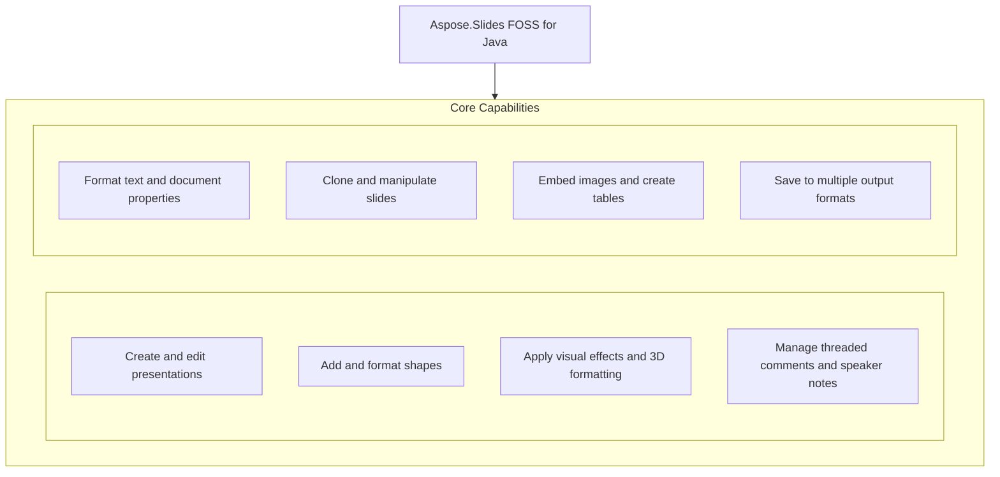

# Aspose.Slides FOSS for Java

[](LICENSE) [](https://github.com/aspose-slides-foss/Aspose.Slides-FOSS-for-Java/graphs/contributors)

[](https://products.aspose.org/slides/java/)

Aspose.Slides FOSS for Java is a free, open-source library that enables Java developers to create, read, modify, and convert PowerPoint presentations without requiring Microsoft PowerPoint. It supports common tasks such as adding shapes, tables, connectors, text formatting, comments, speaker notes, and document properties, as well as saving presentations in PPTX, PPSX, and POTX formats. Developers use it to automate slide generation, batch processing, and report creation in enterprise and educational applications. The library is published as `org.aspose:aspose-slides-foss` version 26.8.0, targets Java 21, and is licensed under the MIT license.

## Navigation

- [At a Glance](#at-a-glance)
- [Key Capabilities](#key-capabilities)
- [Installation](#installation)
- [Dependencies](#dependencies)
- [Quick Start](#quick-start)
- [Additional Examples](#additional-examples)
- [API Reference](#api-reference)
- [Documentation & Resources](#documentation--resources)
- [Scope and Limitations](#scope-and-limitations)
- [Development and Testing](#development-and-testing)
- [License](#license)

## At a Glance



## Key Capabilities

- **Create and edit presentations.** Create new presentations from scratch or open existing files, then modify slides, shapes, and content programmatically using the `org.aspose:aspose-slides-foss` library version 26.8.0 for Java 21, as demonstrated by loading a file and inspecting its slide count.
- **Add and format shapes.** Add various shape types including rectangles and connectors, connect shapes using connection sites, and apply solid fill colors to define visual appearance.
- **Apply visual effects and 3D formatting.** Apply visual effects such as outer shadows to shapes, configure blur radius, direction, distance, and shadow color, enabling professional-grade visual enhancements.
- **Manage threaded comments and speaker notes.** Add threaded comments with authors, timestamps, and positions on slides, and attach speaker notes to slides via the notes slide manager.
- **Format text and document properties.** Format text with font height, bold styling, and fill color at the portion level, while setting document properties such as title, subject, author, keywords, and category.
- **Clone and manipulate slides.** Clone existing slides to duplicate content and layout, and save specific slides by index to create custom slide decks.
- **Embed images and create tables.** Create tables with custom column widths and row heights, populate table cells with text, and leverage the `Relationship` class for structured slide content.
- **Save to multiple output formats.** Save presentations to multiple output formats including PPTX, PPSX, and POTX, and write output to streams such as `ByteArrayOutputStream` for in-memory operations.

## Installation

Install the published package from Maven Central (`org.aspose:aspose-slides-foss`, version 26.8.0):

```bash
mvn dependency:get -Dartifact=org.aspose:aspose-slides-foss:26.8.0
```

## Dependencies

### Required Package Dependencies

No required third-party package dependencies; in `pom.xml`, every `<dependency>` the POM declares is `test`, `provided` or optional.

### Native and System Requirements

- Requires Java `21` (`maven.compiler.release` in `pom.xml`).

### Development Dependencies

- `org.apache.poi:poi-ooxml 5.4.1`
- `org.assertj:assertj-core 3.27.3`
- `org.junit.jupiter:junit-jupiter-api 5.11.4`
- `org.junit.jupiter:junit-jupiter-engine 5.11.4`
- `org.junit.jupiter:junit-jupiter-params 5.11.4`

## Quick Start

Create a new presentation, add a blue rectangle shape to the first slide, and save it as a PPTX file using the Aspose.Slides FOSS for Java library (package `org.aspose:aspose-slides-foss` version 26.8.0) for Java 21.

```java
import org.aspose.slides.foss.Presentation;
import org.aspose.slides.foss.ShapeType;
import org.aspose.slides.foss.FillType;
import org.aspose.slides.foss.IAutoShape;
import org.aspose.slides.foss.ISlide;
import org.aspose.slides.foss.drawing.Color;
import org.aspose.slides.foss.export.SaveFormat;

try (Presentation pres = new Presentation()) {
    ISlide slide = pres.getSlides().get(0);
    slide.getShapes().clear();

    IAutoShape shape = slide.getShapes().addAutoShape(ShapeType.RECTANGLE, 50, 50, 200, 100);
    shape.getFillFormat().setFillType(FillType.SOLID);
    shape.getFillFormat().getSolidFillColor().setColor(Color.fromArgb(255, 0, 128, 255));

    pres.save("hello.pptx", SaveFormat.PPTX);
}
```

## Additional Examples

The following examples demonstrate common tasks with Aspose.Slides FOSS for Java, including adding connectors, comments, document properties, effects, notes, cloning slides, opening existing files, streaming output, formatting text, creating tables, and saving slide subsets.

### Add a connector between two shapes

```java
import org.aspose.slides.foss.*;
import org.aspose.slides.foss.export.SaveFormat;

try (Presentation pres = new Presentation()) {
    ISlide slide = pres.getSlides().get(0);
    slide.getShapes().clear();

    IAutoShape s1 = slide.getShapes().addAutoShape(ShapeType.RECTANGLE, 50, 50, 100, 60);
    IAutoShape s2 = slide.getShapes().addAutoShape(ShapeType.RECTANGLE, 350, 200, 100, 60);
    IConnector conn = slide.getShapes().addConnector(ShapeType.BENT_CONNECTOR3, 0, 0, 1, 1);

    conn.setStartShapeConnectedTo(s1);
    conn.setStartShapeConnectionSiteIndex(3);
    conn.setEndShapeConnectedTo(s2);
    conn.setEndShapeConnectionSiteIndex(1);

    pres.save("connector.pptx", SaveFormat.PPTX);
}
```

<details>
<summary>View Additional Examples</summary>

### Add a threaded comment to a slide

```java
import org.aspose.slides.foss.*;
import org.aspose.slides.foss.drawing.PointF;
import org.aspose.slides.foss.export.SaveFormat;

import java.time.LocalDateTime;

try (Presentation pres = new Presentation()) {
    ICommentAuthor author = pres.getCommentAuthors().addAuthor("Alice", "A");
    ISlide slide = pres.getSlides().get(0);
    LocalDateTime now = LocalDateTime.of(2026, 1, 15, 12, 0, 0);
    IComment comment = author.getComments().addComment("Review note", slide,
            new PointF(2.0f, 3.0f), now);

    pres.save("comments.pptx", SaveFormat.PPTX);
}
```

### Set document properties on a presentation

```java
import org.aspose.slides.foss.*;
import org.aspose.slides.foss.export.SaveFormat;

try (Presentation pres = new Presentation()) {
    IDocumentProperties props = pres.getDocumentProperties();
    props.setTitle("My Presentation");
    props.setSubject("Demo Subject");
    props.setAuthor("John Doe");
    props.setKeywords("demo, test");
    props.setCategory("Examples");

    pres.save("properties.pptx", SaveFormat.PPTX);
}
```

### Apply an outer shadow effect to a shape

```java
import org.aspose.slides.foss.*;
import org.aspose.slides.foss.drawing.Color;
import org.aspose.slides.foss.export.SaveFormat;

try (Presentation pres = new Presentation()) {
    ISlide slide = pres.getSlides().get(0);
    slide.getShapes().clear();
    IAutoShape shape = slide.getShapes().addAutoShape(ShapeType.RECTANGLE, 100, 100, 200, 100);

    IEffectFormat ef = shape.getEffectFormat();
    ef.enableOuterShadowEffect();
    IOuterShadow shadow = ef.getOuterShadowEffect();
    shadow.setBlurRadius(10);
    shadow.setDirection(315);
    shadow.setDistance(8);
    shadow.getShadowColor().setColor(Color.fromArgb(128, 0, 0, 0));

    pres.save("shadow.pptx", SaveFormat.PPTX);
}
```

### Add speaker notes to a slide

```java
import org.aspose.slides.foss.*;
import org.aspose.slides.foss.export.SaveFormat;

try (Presentation pres = new Presentation()) {
    ISlide slide = pres.getSlides().get(0);
    INotesSlide notes = slide.getNotesSlideManager().addNotesSlide();
    notes.getNotesTextFrame().setText("Speaker notes");

    pres.save("notes.pptx", SaveFormat.PPTX);
}
```

### Clone a slide within a presentation

```java
import org.aspose.slides.foss.*;

try (Presentation pres = new Presentation()) {
    ISlide slide = pres.getSlides().get(0);
    slide.getShapes().addAutoShape(ShapeType.RECTANGLE, 50, 50, 200, 100);
    pres.getSlides().addClone(slide);
    // pres.getSlides().size() is now 2
}
```

### Open an existing presentation file

```java
import org.aspose.slides.foss.Presentation;
import java.nio.file.Path;

try (Presentation pres = new Presentation(Path.of("Presentation.pptx").toString())) {
    // pres.getSlides().size() reflects the real slide count in the file
}
```

### Save a presentation to an in-memory stream

```java
import org.aspose.slides.foss.Presentation;
import org.aspose.slides.foss.export.SaveFormat;
import java.io.ByteArrayOutputStream;

try (Presentation pres = new Presentation()) {
    ByteArrayOutputStream buf = new ByteArrayOutputStream();
    pres.save(buf, SaveFormat.PPTX);
}
```

### Format a text portion's font size, weight, and color

```java
import org.aspose.slides.foss.*;
import org.aspose.slides.foss.drawing.Color;
import org.aspose.slides.foss.export.SaveFormat;

try (Presentation pres = new Presentation()) {
    IAutoShape shape = pres.getSlides().get(0).getShapes()
            .addAutoShape(ShapeType.RECTANGLE, 50, 50, 400, 150);
    shape.addTextFrame("Formatted text");
    IPortionFormat fmt = shape.getTextFrame().getParagraphs().get(0)
            .getPortions().get(0).getPortionFormat();
    fmt.setFontHeight(24);
    fmt.setFontBold(NullableBool.TRUE);
    fmt.getFillFormat().setFillType(FillType.SOLID);
    fmt.getFillFormat().getSolidFillColor().setColor(Color.fromArgb(255, 0, 70, 127));

    pres.save("text.pptx", SaveFormat.PPTX);
}
```

### Create a table and set cell text

```java
import org.aspose.slides.foss.*;
import org.aspose.slides.foss.export.SaveFormat;

try (Presentation pres = new Presentation()) {
    ITable table = pres.getSlides().get(0).getShapes()
            .addTable(50, 50, new double[]{120, 120, 120}, new double[]{40, 40});
    table.getRows().get(0).get(0).getTextFrame().setText("Name");
    table.getRows().get(0).get(1).getTextFrame().setText("Value");

    pres.save("table.pptx", SaveFormat.PPTX);
}
```

### Save a subset of slides to a new file

```java
import org.aspose.slides.foss.Presentation;
import org.aspose.slides.foss.export.SaveFormat;

try (Presentation pres = new Presentation("deck.pptx")) {
    pres.save("first-and-third.pptx", new int[]{0, 2}, SaveFormat.PPTX);
}
```

</details>

## API Reference

The entry point for working with presentations is the `Presentation` class, which provides access to slides, shapes, and document properties. The `org.aspose.slides.foss` package contains the concrete implementations of the interfaces defined in `org.aspose.slides`, and `org.aspose.slides.foss` provides the FOSS-specific functionality.

The verified public surface has 238 types.

<details>
<summary>View the Complete Public API Surface</summary>

### Core API

| Class | Description |
| --- | --- |
| `AdjustValue` | Represents a single geometry adjustment value backed by an OOXML element. |
| `AdjustValueCollection` | Represents a collection of shape's adjustments backed by an OOXML element. |
| `AutoShape` | Represents an AutoShape. |
| `BaseHandoutNotesSlideHeaderFooterManager` | Represents abstract base class for handout and notes slide header/footer managers. |
| `BasePortionFormat` | Common text portion formatting properties. |
| `BaseShapeLock` | Base class for shape locks. |
| `BaseSlide` | Represents common data for all slide types. |
| `BulletFormat` | Represents paragraph bullet formatting properties. |
| `Camera` | Represents 3D camera settings. |
| `Cell` | Represents a cell of a table. |
| `CellCollection` | Represents a collection of cells. |
| `CellFormat` | Represents format of a table cell. |
| `ColorFormat` | Represents a color used in a presentation. |
| `Column` | Represents a column in a table. |
| `ColumnCollection` | Represents collection of columns in a table. |
| `ColumnFormat` | Represents formatting properties of a table column. |
| `Comment` | Represents a comment on a presentation slide. |
| `CommentAuthor` | Represents an author of comments. |
| `CommentAuthorCollection` | Represents a collection of comment authors in a presentation. |
| `CommentCollection` | Represents a collection of comments of one author. |
| `Connector` | Represents a connector shape. |
| `ConnectorLock` | Represents the lock settings for a connector shape. |
| `DocumentProperties` | Represents properties of a presentation. |
| `EffectFormat` | Represents effect formatting properties of a shape. |
| `FillFormat` | Represents fill formatting properties. |
| `GeometryShape` | Base class for shapes with geometry, backed by an OOXML shape element. |
| `GlobalLayoutSlideCollection` | Represents a collection of all layout slides in presentation. |
| `GradientFormat` | Represents a gradient format. |
| `GradientStop` | Represents a single gradient stop. |
| `GradientStopCollection` | Represents a collection of gradient stops. |
| `GraphicalObject` | Abstract base class for graphical objects on a slide. |
| `GraphicalObjectLock` | Represents the lock settings for a graphical object shape. |
| `GroupShape` | Represents a group of shapes on a slide. |
| `HeadingPair` | Represents a heading pair indicating a grouping of document parts. |
| `IAdjustValue` | Represents a geometry shape adjustment value. |
| `IAdjustValueCollection` | Represents a collection of shape adjustment values. |
| `IAutoShape` | Represents an AutoShape. |
| `IBaseHandoutNotesSlideHeaderFooterManager` | Represents base interface for handout and notes slide header/footer managers. |
| `IBaseHeaderFooterManager` | Represents base interface for header/footer managers. |
| `IBasePortionFormat` | Represents common text portion formatting properties. |
| `IBaseSlide` | Represents common data for all slide types. |
| `IBaseSlideHeaderFooterManager` | Represents base interface for slide header/footer managers that manage footer, slide number, and date-time placeholders. |
| `IBulkTextFormattable` | Represents an object with the possibility of bulk setting child text elements' formats. |
| `IBulletFormat` | Represents paragraph bullet formatting properties. |
| `ICamera` | Represents Camera. |
| `ICell` | Represents a cell in a table. |
| `ICellCollection` | Represents a collection of cells. |
| `ICellFormat` | Represents format of a table cell. |
| `IColorFormat` | Represents a color used in a presentation. |
| `IColumn` | Represents a column in a table. |
| `IColumnCollection` | Represents collection of columns in a table. |
| `IColumnFormat` | Represents format of a table column. |
| `IComment` | Represents a comment on a presentation slide. |
| `ICommentAuthor` | Represents a comment author in a presentation. |
| `ICommentAuthorCollection` | Represents a collection of comment authors in a presentation. |
| `ICommentCollection` | Represents a collection of comments belonging to a single author. |
| `IConnector` | Represents a connector. |
| `IConnectorLock` | Determines which operations are disabled on the parent Connector. |
| `ICustomData` | Represents custom data associated with a shape. |
| `IDocumentProperties` | Represents properties of a presentation document. |
| `IEffectFormat` | Represents effect formatting properties. |
| `IEffectParamSource` | Marker interface for objects that serve as a source of effect parameters. |
| `IFillFormat` | Represents fill formatting options. |
| `IFillParamSource` | Marker interface for objects that serve as a source of fill parameters. |
| `IFontData` | Represents a font definition. |
| `IGeometryShape` | Represents a shape with geometry (preset or custom). |
| `IGlobalLayoutSlideCollection` | Represents a collection of all layout slides in a presentation. |
| `IGradientFormat` | Represents a gradient format. |
| `IGradientStop` | Represents a gradient stop. |
| `IGradientStopCollection` | Represents a collection of gradient stops. |
| `IGraphicalObject` | Represents abstract graphical object. |
| `IGraphicalObjectLock` | Determines which operations are disabled on the parent IGraphicalObject. |
| `IGroupShape` | Represents a group of shapes on a slide. |
| `IHeadingPair` | Represents a heading pair that indicates a grouping of document parts and the number of parts in each group. |
| `IHyperlinkContainer` | Marker interface for objects that contain hyperlinks. |
| `IImage` | Represents a raster or vector image. |
| `IImageCollection` | Represents a collection of images in a presentation. |
| `ILayoutSlide` | Represents a layout slide. |
| `ILayoutSlideCollection` | Represents a base class for collection of a layout slides. |
| `ILightRig` | Represents a light rig. |
| `ILineFillFormat` | Represents properties for lines filling. |
| `ILineFormat` | Represents format of a line. |
| `ILineParamSource` | Marker interface for objects that serve as a source of line parameters. |
| `ILoadOptions` | Represents options that can be used to configure how a presentation is loaded. |
| `IMasterLayoutSlideCollection` | Represents a collection of layout slides belonging to a master slide. |
| `IMasterSlide` | Represents a master slide in a presentation. |
| `IMasterSlideCollection` | Represents a collection of master slides. |
| `INotesSize` | Represents a size of notes slide. |
| `INotesSlide` | Represents a notes slide in a presentation. |
| `INotesSlideHeaderFooterManager` | Represents manager which holds behavior of the notes slide placeholders, including header placeholder. |
| `INotesSlideManager` | Manages the notes slide for a given slide. |
| `IPPImage` | Represents an image in a presentation. |
| `IParagraph` | Represents a text paragraph. |
| `IParagraphCollection` | Represents a collection of paragraphs. |
| `IParagraphFormat` | Represents paragraph formatting properties. |
| `IPatternFormat` | Represents a pattern fill format. |
| `IPictureFillFormat` | Represents a picture fill style. |
| `IPictureFrame` | Represents a frame with a picture inside. |
| `IPictureFrameLock` | Determines which operations are disabled on the parent IPictureFrame. |
| `IPlaceholder` | Represents a placeholder on a slide. |
| `IPortion` | Represents a portion of text inside a text paragraph. |
| `IPortionCollection` | Represents a collection of text portions. |
| `IPortionFormat` | Represents formatting properties of a text portion with no inheritance applied. |
| `IPresentation` | Represents a presentation document. |
| `IPresentationComponent` | Represents a component of a presentation. |
| `IRow` | Represents a row in a table. |
| `IRowCollection` | Represents a collection of rows in a table. |
| `IRowFormat` | Represents format of a table row. |
| `ISection` | Represents a section in a presentation. |
| `IShape` | Represents a shape on a slide. |
| `IShapeBevel` | Represents properties of shape's main face relief. |
| `IShapeCollection` | Represents a collection of shapes. |
| `IShapeFrame` | Represents shape frame's properties. |
| `IShapeStyle` | Represents a shape's style reference. |
| `ISlide` | Represents a slide in a presentation. |
| `ISlideCollection` | Represents a collection of slides in a presentation. |
| `ISlideComponent` | Represents a component of a slide. |
| `ISlidesPicture` | Represents a picture in a presentation. |
| `ITable` | Represents a table on a slide. |
| `ITableFormat` | Represents format of a table. |
| `ITextFrame` | Represents a TextFrame. |
| `ITextFrameFormat` | Represents format of a text frame. |
| `IThreeDFormat` | Represents 3-D properties. |
| `IThreeDParamSource` | Marker interface for objects that serve as a source of 3D parameters. |
| `Image` | Represents a raster or vector image. |
| `ImageCollection` | Represents a collection of images in a presentation. |
| `Images` | Methods to instantiate and work with IImage. |
| `LayoutSlide` | Represents a layout slide. |
| `LayoutSlideCollection` | Represents a collection of layout slides. |
| `LightRig` | Represents a light rig for 3D scene. |
| `LineFillFormat` | Represents the fill format of a line. |
| `LineFormat` | Represents format of a line. |
| `MasterLayoutSlideCollection` | Represents a collection of all layout slides of the defined master slide. |
| `MasterSlide` | Represents a master slide in a presentation. |
| `MasterSlideCollection` | Represents a collection of master slides in a presentation. |
| `NotesSize` | Represents the size of a notes slide. |
| `NotesSlide` | Represents a notes slide in a presentation. |
| `NotesSlideHeaderFooterManager` | Represents manager which holds behavior of the notes slide placeholders, including header placeholder. |
| `NotesSlideManager` | Manages the notes slide for a given slide. |
| `PPImage` | Represents an image in a presentation. |
| `PVIObject` | Base class for property-value-inheritance (PVI) objects that are bound to a slide and presentation. |
| `Paragraph` | Represents a text paragraph. |
| `ParagraphCollection` | Represents a collection of paragraphs. |
| `ParagraphFormat` | Represents paragraph formatting properties. |
| `PatternFormat` | Represents a pattern fill format. |
| `Picture` | Represents a picture in a presentation. |
| `PictureFillFormat` | Represents a picture fill style. |
| `PictureFrame` | Represents a frame with a picture inside. |
| `PictureFrameLock` | Represents the locks for a PictureFrame. |
| `Portion` | Represents a text portion (run) within a paragraph. |
| `PortionCollection` | Represents a collection of text portions within a paragraph. |
| `PortionFormat` | Represents text portion formatting properties. |
| `PptCorruptFileException` | Exception thrown when a PPT file is corrupt and cannot be processed. |
| `PptException` | Base exception for PPT-related errors. |
| `PptReadException` | Exception thrown when a PPT file cannot be read. |
| `Presentation` | Represents a PowerPoint presentation. |
| `Row` | Represents a row in a table. |
| `RowCollection` | Represents a collection of rows in a table. |
| `RowFormat` | Represents formatting properties of a table row. |
| `Shape` | Abstract base class for shapes on a slide. |
| `ShapeBevel` | Contains the properties of shape's main face relief (bevel). |
| `ShapeCollection` | Represents a collection of shapes on a slide. |
| `ShapeFrame` | Represents an immutable shape frame with position, size, rotation, and flip properties. |
| `ShapeStyle` | Represents a shape's style reference. |
| `Slide` | Represents a slide in a presentation. |
| `SlideCollection` | Represents a collection of slides in a presentation. |
| `Table` | Represents a table shape on a slide. |
| `TableFormat` | Represents format of a table. |
| `TextFrame` | Represents a text frame containing paragraphs. |
| `TextFrameFormat` | Contains the TextFrame's formatting properties. |
| `ThreeDFormat` | Represents 3-D formatting properties for a shape. |
| `Color` | Immutable value type representing an ARGB color. |
| `PointF` | Represents a 2D point with float coordinates. |
| `RectangleF` | Represents a rectangle defined by position and size using floating-point coordinates. |
| `Size` | Represents a 2D size with integer dimensions. |
| `SizeF` | Represents a 2D size with float dimensions. |
| `Blur` | Represents a Blur effect that is applied to the entire shape, including its fill. |
| `FillOverlay` | Represents a Fill Overlay effect. |
| `Glow` | Represents a glow effect backed by an OOXML element. |
| `IBlur` | Represents a Blur effect that is applied to the entire shape, including its fill. |
| `IFillOverlay` | Represents a Fill Overlay effect. |
| `IGlow` | Represents a glow effect applied to a shape. |
| `IImageTransformOperation` | Represents an image-transform operation effect. |
| `IInnerShadow` | Represents an inner shadow effect applied to a shape. |
| `IOuterShadow` | Represents an Outer Shadow effect. |
| `IPresetShadow` | Represents a Preset Shadow effect. |
| `IReflection` | Represents a reflection effect applied to a shape. |
| `ISoftEdge` | Represents a Soft Edge effect. |
| `ImageTransformOperation` | Represents an image-transform operation applied to an image effect. |
| `InnerShadow` | Represents an inner shadow effect backed by an OOXML element. |
| `OuterShadow` | Represents an outer shadow effect backed by an OOXML element. |
| `PresetShadow` | Represents a preset shadow effect backed by an OOXML element. |
| `Reflection` | Represents a reflection effect backed by an OOXML element. |
| `SoftEdge` | Represents a soft edge effect backed by an OOXML element. |
| `ISaveOptions` | Options that control how a presentation is saved. |
| `IThemeable` | Represents objects that can be themed. |

#### Enumerations

| Enumeration | Description |
| --- | --- |
| `BevelPresetType` | Constants which define 3D bevel of shape. |
| `BulletType` | Represents the type of the extended bullets. |
| `CameraPresetType` | Constants which define camera preset type. |
| `ColorType` | Represents different color modes. |
| `FillBlendMode` | Determines blend mode. |
| `FillType` | Specifies the interior fill type of various visual objects. |
| `FontAlignment` | Represents vertical font alignment. |
| `GradientDirection` | Represents the gradient style. |
| `GradientShape` | Represents the shape of gradient fill. |
| `LightRigPresetType` | Constants which define light preset types. |
| `LightingDirection` | Constants which define light directions. |
| `LineAlignment` | Represents the lines alignment type. |
| `LineArrowheadLength` | Represents the length of an arrowhead. |
| `LineArrowheadStyle` | Represents the style of an arrowhead. |
| `LineArrowheadWidth` | Represents the width of an arrowhead. |
| `LineCapStyle` | Represents the line cap style. |
| `LineDashStyle` | Represents the line dash style. |
| `LineJoinStyle` | Represents the lines join style. |
| `LineStyle` | Represents the style of a line. |
| `MaterialPresetType` | Constants which define material of shape. |
| `NullableBool` | Represents triple boolean values. |
| `NumberedBulletStyle` | Represents the style of the numbered bullets. |
| `PatternStyle` | Represents the pattern style. |
| `PictureFillMode` | Determines how picture will fill area. |
| `PresetColor` | Represents predefined color presets. |
| `PresetShadowType` | Represents a preset for a shadow effect. |
| `RectangleAlignment` | Defines 2-dimension alignment. |
| `SchemeColor` | Represents colors in a color scheme. |
| `ShapeType` | Represents preset geometry of geometry shapes. |
| `SlideLayoutType` | Represents the slide layout type. |
| `SourceFormat` | Represents source file format. |
| `TableStylePreset` | Represents builtin table styles. |
| `TextAlignment` | Represents different text alignment styles. |
| `TextAnchorType` | text box alignment within a text area. |
| `TextAutofitType` | Represents text autofit mode. |
| `TextCapType` | Represents the type of text capitalisation. |
| `TextShapeType` | Represents text wrapping shape. |
| `TextStrikethroughType` | Represents the type of text strikethrough. |
| `TextUnderlineType` | Represents the type of text underline. |
| `TextVerticalType` | Determines vertical writing mode for a text. |
| `TileFlip` | Defines tile flipping mode. |
| `SaveFormat` | Constants which define the format of a saved presentation. |

#### Detailed Member Reference

### org

The root package org serves as the top-level namespace for the Aspose.Slides FOSS for Java library, under which all public symbols are organized.

### aspose

The `org.aspose` package provides the core Aspose APIs, including the base interfaces and classes that define the presentation object model.

### slides

The `org.aspose.slides` package defines the main interfaces such as `ISlideCollection`, `IShapeCollection`, and `IPresentation` that form the foundation of the presentation API.

### Relationship

The `Relationship` class represents a relationship between parts in the underlying Open XML package structure.


The primary entry point is `Presentation`, which owns an `ISlideCollection` of `Slide` objects; each slide exposes an `IShapeCollection` of `Shape`-derived objects (`AutoShape`, `Connector`, `Table`, `PictureFrame`) built through `ShapeCollection`'s `addAutoShape()`, `addConnector()`, `addTable()`, and `addPictureFrame()` methods.

- `Presentation` — the root object; owns slides, images, comment authors, and document properties.
  - `Presentation()`, `Presentation(path)`, `Presentation(in) -> Presentation`
  - `getSlides() -> ISlideCollection`, `getImages() -> IImageCollection`, `getCommentAuthors() -> ICommentAuthorCollection`
  - `getDocumentProperties() -> IDocumentProperties`, `getLayoutSlides() -> IGlobalLayoutSlideCollection`, `getMasters() -> IMasterSlideCollection`
  - `save(path, format) -> void`, `save(stream, format) -> void`, `dispose() -> void`

- `SlideCollection` — the real `ISlideCollection` implementation returned by `Presentation.getSlides()`.
  - `get(index) -> ISlide`, `size() -> int`, `addClone(sourceSlide) -> ISlide`, `addEmptySlide(layout) -> ISlide`, `insertEmptySlide(index, layout) -> ISlide`, `removeAt(index) -> void`, `indexOf(slide) -> int`

- `ShapeCollection` — the real `IShapeCollection` implementation returned by `Slide.getShapes()`.
  - `addAutoShape(shapeType, x, y, width, height) -> IAutoShape`, `addConnector(shapeType, x, y, width, height) -> IConnector`
  - `addTable(x, y, colWidths, rowHeights) -> ITable`, `addPictureFrame(shapeType, x, y, width, height, image) -> IPictureFrame`
  - `get(index) -> IShape`, `size() -> int`, `remove(shape) -> void`, `removeAt(index) -> void`, `clear() -> void`, `reorder(index, shape) -> void`

- `AutoShape` — a preset-geometry shape (rectangle, ellipse, and every other `ShapeType`).
  - `getShapeType() -> ShapeType`, `addTextFrame(text) -> ITextFrame`, `getTextFrame() -> ITextFrame`, `getFillFormat() -> IFillFormat`, `getLineFormat() -> ILineFormat`, `getEffectFormat() -> IEffectFormat`, `getThreeDFormat() -> IThreeDFormat`

- `Connector` — a shape-to-shape connector line.
  - `getStartShapeConnectedTo() -> IShape`, `setStartShapeConnectedTo(value) -> void`, `getEndShapeConnectedTo() -> IShape`, `setEndShapeConnectedTo(value) -> void`
  - `getStartShapeConnectionSiteIndex() -> int`, `setStartShapeConnectionSiteIndex(value) -> void`, `reroute() -> void`

- `Table` — a table shape on a slide, written with the `<a:graphicFrameLocks>` the schema requires
  on its frame.
  - `getRows() -> IRowCollection`, `getColumns() -> IColumnCollection`, `getTableFormat() -> ITableFormat`, `mergeCells(cell1, cell2, allowSplitting) -> ICell`

</details>

## Documentation & Resources

- **[Getting started guide](https://docs.aspose.org/slides/java/)** — The getting started guide walks through installing the library and creating a basic presentation using Aspose.Slides FOSS for Java.
- **[How-to guides & FAQ](https://kb.aspose.org/slides/java/)** — The how-to guides and FAQ provide practical examples and answers to common questions about using Aspose.Slides FOSS for Java.
- **[Full API reference](https://reference.aspose.org/slides/java/)** — The full API reference documents every class and method available in the `org.aspose:aspose-slides-foss` package for version 26.8.0. It covers all 238 verified public types; the [API Reference](#api-reference) section above covers the essentials.
- **[Contributor guide](https://github.com/aspose-slides-foss/Aspose.Slides-FOSS-for-Java/blob/main/AGENTS.md)** — The contributor guide explains how to set up the development environment and contribute changes to the Aspose.Slides-FOSS-for-Java repository.
- **[Publishing guide](PUBLISHING.md)** — The publishing guide describes the steps required to build and release a new version of Aspose.Slides FOSS for Java.
- Found a bug or have a feature request? [Open an issue](https://github.com/aspose-slides-foss/Aspose.Slides-FOSS-for-Java/issues).

## Scope and Limitations

Aspose.Slides FOSS for Java provides a free, open-source subset of the Aspose.Slides API for Java, enabling creation and modification of PPTX, PPSX, and POTX presentations using the `org.aspose.slides` namespace. It targets Java 21 and is distributed as the `org.aspose:aspose-slides-foss` artifact at version 26.8.0.

- Installation requires Maven and the explicit artifact coordinate `org.aspose:aspose-slides-foss`:26.8.0; no other build tools or installation methods are provided.
- The API omits support for charts, `SmartArt`, OLE objects, video, audio, animations, slide transitions, group shapes, hyperlinks, sections, slide backgrounds, themes, slide size configuration, rendering, conversion, VBA macros, digital signatures, and encryption.
- The public API surface is limited to the `org.aspose.slides` package under the `org.aspose` namespace, and no other packages or classes are exposed.
- The `Presentation.save` method only supports saving in PPTX, PPSX, and POTX formats, and raises `UnsupportedOperationException` for all other `SaveFormat` values including PDF, XPS, TIFF, ODP, and image formats.
- The getFontName method is the only font-related API exposed, and no other font management or text language attributes are available.
- The library has no external dependencies and runs on Java 21 without requiring additional runtime components.

This section is the point of this file. Nothing here is a "coming soon"; it is what the API does
not contain today.

These limitations don't apply to [Aspose.Slides for Java — Enterprise Edition](https://products.aspose.com/slides/java/). Aspose.Slides FOSS for Java provides core presentation processing capabilities, while the commercial offering extends functionality with advanced rendering, additional export formats, and enterprise support.

## Development and Testing

Clone the repository and run the Maven verify goal to build and execute tests, skipping GPG signing with the -`Dgpg.skip`=true flag.

The suite covers 45 test files under `tests/`. Releases run through the [maven-central-release workflow](.github/workflows/maven-central-release.yml).

```bash
git clone https://github.com/aspose-slides-foss/Aspose.Slides-FOSS-for-Java.git
cd Aspose.Slides-FOSS-for-Java
mvn verify -Dgpg.skip=true
```

## License

This project is licensed under the [MIT License](LICENSE). The MIT License permits use, copying, modification, distribution, sublicensing, and commercial use, provided its copyright and permission notice are retained. The software is provided without warranty.
