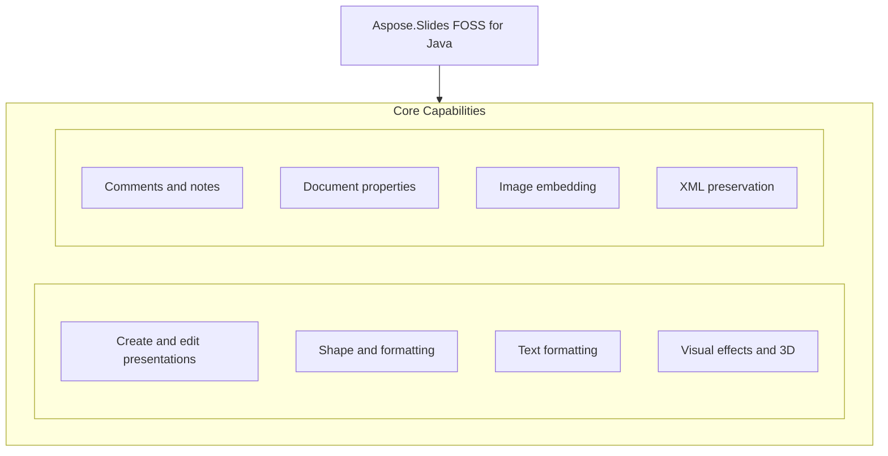

# Aspose.Slides FOSS for Java

[](LICENSE) [](https://github.com/aspose-slides-foss/Aspose.Slides-FOSS-for-Java/graphs/contributors)

[](https://products.aspose.org/slides/java/)

Aspose.Slides FOSS for Java is a Java library that enables developers to create, read, modify, and convert PowerPoint presentations without requiring Microsoft PowerPoint. It supports reading and writing common presentation formats such as PPTX and allows manipulation of slides, shapes, text, images, comments, and slide properties through the `org.aspose.slides.foss.Presentation` class and its related APIs. The library is intended for Java developers building applications that need programmatic presentation processing, including report generation, document automation, and content publishing workflows. It runs on Java 21 and is distributed as the `org.aspose:aspose-slides-foss` package at version 26.8.0.

## Navigation

- [At a Glance](#at-a-glance)
- [Key Capabilities](#key-capabilities)
- [Installation](#installation)
- [Dependencies](#dependencies)
- [API Reference](#api-reference)
- [Documentation & Resources](#documentation--resources)
- [Scope and Limitations](#scope-and-limitations)
- [Development and Testing](#development-and-testing)
- [License](#license)

## At a Glance


```mermaid
flowchart TD
  PRODUCT["Aspose.Slides FOSS for Java"]
  subgraph Capabilities["Core Capabilities"]
    direction LR
    subgraph capl[" "]
      direction TB
      c1["Create and edit presentations"]
      c2["Shape and formatting"]
      c3["Text formatting"]
      c4["Visual effects and 3D"]
    end
    subgraph capr[" "]
      direction TB
      c5["Comments and notes"]
      c6["Document properties"]
      c7["Image embedding"]
      c8["XML preservation"]
    end
  end
  PRODUCT --> Capabilities
```

## Key Capabilities

- **Create and edit presentations.** Create and edit presentations by loading existing files or instantiating new ones, adding slides with addClone or addEmptySlide, and saving to formats like PPTX using the `SaveFormat` class.
- **Shape and formatting.** Add and manipulate shapes such as `AutoShape` instances on slides, adjust their geometry and fill properties via `FillFormat`, and manage collections of shapes using `ShapeCollection` methods.
- **Text formatting.** Format text content by setting font height, bold, and color on `PortionFormat`, adjust paragraph spacing and alignment via `ParagraphFormat`, and control text frame layout with `TextFrameFormat`.
- **Visual effects and 3D.** Apply visual effects like outer shadows and three-dimensional extrusion to shapes using `EffectFormat` and `ThreeDFormat` to enhance slide appearance.
- **Comments and notes.** Manage speaker notes and comments by adding authors and comments through `CommentCollection` and creating notes slides with `NotesSlideManager`.
- **Document properties.** Set and inspect document metadata such as title, subject, author, and keywords using the `DocumentProperties` interface.
- **Image embedding.** Embed images into presentations by adding raw image bytes to the `ImageCollection` and inserting them as picture frames on slides.
- **XML preservation.** Preserve XML relationships during save operations by maintaining internal structure integrity through the `Relationship` mechanism.

## Installation

Install the published package from Maven Central (`org.aspose:aspose-slides-foss`, version 26.8.0):

```bash
mvn dependency:get -Dartifact=org.aspose:aspose-slides-foss:26.8.0
```

## Dependencies

### Required Package Dependencies

No required third-party package dependencies; in `pom.xml`, every `<dependency>` the POM declares is `test`, `provided` or optional.

### Native and System Requirements

- Requires Java `21` (`maven.compiler.release` in `pom.xml`).

### Development Dependencies

- `org.apache.poi:poi-ooxml 5.4.1`
- `org.assertj:assertj-core 3.27.3`
- `org.junit.jupiter:junit-jupiter-api 5.11.4`
- `org.junit.jupiter:junit-jupiter-engine 5.11.4`
- `org.junit.jupiter:junit-jupiter-params 5.11.4`

## API Reference

Aspose.Slides FOSS for Java exposes the `org.aspose.slides.foss.Presentation` class as the root object for working with presentations, which owns collections of slides, shapes, images, and other components through its methods such as getSlides and getImages.

The verified public surface has 238 types.

<details>
<summary>View the Complete Public API Surface</summary>

### Core API

| Class | Description |
| --- | --- |
| `AdjustValue` | Represents a single geometry adjustment value backed by an OOXML element. |
| `AdjustValueCollection` | Represents a collection of shape's adjustments backed by an OOXML element. |
| `AutoShape` | Represents an AutoShape. |
| `BaseHandoutNotesSlideHeaderFooterManager` | Represents abstract base class for handout and notes slide header/footer managers. |
| `BasePortionFormat` | Common text portion formatting properties. |
| `BaseShapeLock` | Base class for shape locks. |
| `BaseSlide` | Represents common data for all slide types. |
| `BulletFormat` | Represents paragraph bullet formatting properties. |
| `Camera` | Represents 3D camera settings. |
| `Cell` | Represents a cell of a table. |
| `CellCollection` | Represents a collection of cells. |
| `CellFormat` | Represents format of a table cell. |
| `ColorFormat` | Represents a color used in a presentation. |
| `Column` | Represents a column in a table. |
| `ColumnCollection` | Represents collection of columns in a table. |
| `ColumnFormat` | Represents formatting properties of a table column. |
| `Comment` | Represents a comment on a presentation slide. |
| `CommentAuthor` | Represents an author of comments. |
| `CommentAuthorCollection` | Represents a collection of comment authors in a presentation. |
| `CommentCollection` | Represents a collection of comments of one author. |
| `Connector` | Represents a connector shape. |
| `ConnectorLock` | Represents the lock settings for a connector shape. |
| `DocumentProperties` | Represents properties of a presentation. |
| `EffectFormat` | Represents effect formatting properties of a shape. |
| `FillFormat` | Represents fill formatting properties. |
| `GeometryShape` | Base class for shapes with geometry, backed by an OOXML shape element. |
| `GlobalLayoutSlideCollection` | Represents a collection of all layout slides in presentation. |
| `GradientFormat` | Represents a gradient format. |
| `GradientStop` | Represents a single gradient stop. |
| `GradientStopCollection` | Represents a collection of gradient stops. |
| `GraphicalObject` | Abstract base class for graphical objects on a slide. |
| `GraphicalObjectLock` | Represents the lock settings for a graphical object shape. |
| `GroupShape` | Represents a group of shapes on a slide. |
| `HeadingPair` | Represents a heading pair indicating a grouping of document parts. |
| `IAdjustValue` | Represents a geometry shape adjustment value. |
| `IAdjustValueCollection` | Represents a collection of shape adjustment values. |
| `IAutoShape` | Represents an AutoShape. |
| `IBaseHandoutNotesSlideHeaderFooterManager` | Represents base interface for handout and notes slide header/footer managers. |
| `IBaseHeaderFooterManager` | Represents base interface for header/footer managers. |
| `IBasePortionFormat` | Represents common text portion formatting properties. |
| `IBaseSlide` | Represents common data for all slide types. |
| `IBaseSlideHeaderFooterManager` | Represents base interface for slide header/footer managers that manage footer, slide number, and date-time placeholders. |
| `IBulkTextFormattable` | Represents an object with the possibility of bulk setting child text elements' formats. |
| `IBulletFormat` | Represents paragraph bullet formatting properties. |
| `ICamera` | Represents Camera. |
| `ICell` | Represents a cell in a table. |
| `ICellCollection` | Represents a collection of cells. |
| `ICellFormat` | Represents format of a table cell. |
| `IColorFormat` | Represents a color used in a presentation. |
| `IColumn` | Represents a column in a table. |
| `IColumnCollection` | Represents collection of columns in a table. |
| `IColumnFormat` | Represents format of a table column. |
| `IComment` | Represents a comment on a presentation slide. |
| `ICommentAuthor` | Represents a comment author in a presentation. |
| `ICommentAuthorCollection` | Represents a collection of comment authors in a presentation. |
| `ICommentCollection` | Represents a collection of comments belonging to a single author. |
| `IConnector` | Represents a connector. |
| `IConnectorLock` | Determines which operations are disabled on the parent Connector. |
| `ICustomData` | Represents custom data associated with a shape. |
| `IDocumentProperties` | Represents properties of a presentation document. |
| `IEffectFormat` | Represents effect formatting properties. |
| `IEffectParamSource` | Marker interface for objects that serve as a source of effect parameters. |
| `IFillFormat` | Represents fill formatting options. |
| `IFillParamSource` | Marker interface for objects that serve as a source of fill parameters. |
| `IFontData` | Represents a font definition. |
| `IGeometryShape` | Represents a shape with geometry (preset or custom). |
| `IGlobalLayoutSlideCollection` | Represents a collection of all layout slides in a presentation. |
| `IGradientFormat` | Represents a gradient format. |
| `IGradientStop` | Represents a gradient stop. |
| `IGradientStopCollection` | Represents a collection of gradient stops. |
| `IGraphicalObject` | Represents abstract graphical object. |
| `IGraphicalObjectLock` | Determines which operations are disabled on the parent IGraphicalObject. |
| `IGroupShape` | Represents a group of shapes on a slide. |
| `IHeadingPair` | Represents a heading pair that indicates a grouping of document parts and the number of parts in each group. |
| `IHyperlinkContainer` | Marker interface for objects that contain hyperlinks. |
| `IImage` | Represents a raster or vector image. |
| `IImageCollection` | Represents a collection of images in a presentation. |
| `ILayoutSlide` | Represents a layout slide. |
| `ILayoutSlideCollection` | Represents a base class for collection of a layout slides. |
| `ILightRig` | Represents a light rig. |
| `ILineFillFormat` | Represents properties for lines filling. |
| `ILineFormat` | Represents format of a line. |
| `ILineParamSource` | Marker interface for objects that serve as a source of line parameters. |
| `ILoadOptions` | Represents options that can be used to configure how a presentation is loaded. |
| `IMasterLayoutSlideCollection` | Represents a collection of layout slides belonging to a master slide. |
| `IMasterSlide` | Represents a master slide in a presentation. |
| `IMasterSlideCollection` | Represents a collection of master slides. |
| `INotesSize` | Represents a size of notes slide. |
| `INotesSlide` | Represents a notes slide in a presentation. |
| `INotesSlideHeaderFooterManager` | Represents manager which holds behavior of the notes slide placeholders, including header placeholder. |
| `INotesSlideManager` | Manages the notes slide for a given slide. |
| `IPPImage` | Represents an image in a presentation. |
| `IParagraph` | Represents a text paragraph. |
| `IParagraphCollection` | Represents a collection of paragraphs. |
| `IParagraphFormat` | Represents paragraph formatting properties. |
| `IPatternFormat` | Represents a pattern fill format. |
| `IPictureFillFormat` | Represents a picture fill style. |
| `IPictureFrame` | Represents a frame with a picture inside. |
| `IPictureFrameLock` | Determines which operations are disabled on the parent IPictureFrame. |
| `IPlaceholder` | Represents a placeholder on a slide. |
| `IPortion` | Represents a portion of text inside a text paragraph. |
| `IPortionCollection` | Represents a collection of text portions. |
| `IPortionFormat` | Represents formatting properties of a text portion with no inheritance applied. |
| `IPresentation` | Represents a presentation document. |
| `IPresentationComponent` | Represents a component of a presentation. |
| `IRow` | Represents a row in a table. |
| `IRowCollection` | Represents a collection of rows in a table. |
| `IRowFormat` | Represents format of a table row. |
| `ISection` | Represents a section in a presentation. |
| `IShape` | Represents a shape on a slide. |
| `IShapeBevel` | Represents properties of shape's main face relief. |
| `IShapeCollection` | Represents a collection of shapes. |
| `IShapeFrame` | Represents shape frame's properties. |
| `IShapeStyle` | Represents a shape's style reference. |
| `ISlide` | Represents a slide in a presentation. |
| `ISlideCollection` | Represents a collection of slides in a presentation. |
| `ISlideComponent` | Represents a component of a slide. |
| `ISlidesPicture` | Represents a picture in a presentation. |
| `ITable` | Represents a table on a slide. |
| `ITableFormat` | Represents format of a table. |
| `ITextFrame` | Represents a TextFrame. |
| `ITextFrameFormat` | Represents format of a text frame. |
| `IThreeDFormat` | Represents 3-D properties. |
| `IThreeDParamSource` | Marker interface for objects that serve as a source of 3D parameters. |
| `Image` | Represents a raster or vector image. |
| `ImageCollection` | Represents a collection of images in a presentation. |
| `Images` | Methods to instantiate and work with IImage. |
| `LayoutSlide` | Represents a layout slide. |
| `LayoutSlideCollection` | Represents a collection of layout slides. |
| `LightRig` | Represents a light rig for 3D scene. |
| `LineFillFormat` | Represents the fill format of a line. |
| `LineFormat` | Represents format of a line. |
| `MasterLayoutSlideCollection` | Represents a collection of all layout slides of the defined master slide. |
| `MasterSlide` | Represents a master slide in a presentation. |
| `MasterSlideCollection` | Represents a collection of master slides in a presentation. |
| `NotesSize` | Represents the size of a notes slide. |
| `NotesSlide` | Represents a notes slide in a presentation. |
| `NotesSlideHeaderFooterManager` | Represents manager which holds behavior of the notes slide placeholders, including header placeholder. |
| `NotesSlideManager` | Manages the notes slide for a given slide. |
| `PPImage` | Represents an image in a presentation. |
| `PVIObject` | Base class for property-value-inheritance (PVI) objects that are bound to a slide and presentation. |
| `Paragraph` | Represents a text paragraph. |
| `ParagraphCollection` | Represents a collection of paragraphs. |
| `ParagraphFormat` | Represents paragraph formatting properties. |
| `PatternFormat` | Represents a pattern fill format. |
| `Picture` | Represents a picture in a presentation. |
| `PictureFillFormat` | Represents a picture fill style. |
| `PictureFrame` | Represents a frame with a picture inside. |
| `PictureFrameLock` | Represents the locks for a PictureFrame. |
| `Portion` | Represents a text portion (run) within a paragraph. |
| `PortionCollection` | Represents a collection of text portions within a paragraph. |
| `PortionFormat` | Represents text portion formatting properties. |
| `PptCorruptFileException` | Exception thrown when a PPT file is corrupt and cannot be processed. |
| `PptException` | Base exception for PPT-related errors. |
| `PptReadException` | Exception thrown when a PPT file cannot be read. |
| `Presentation` | Represents a PowerPoint presentation. |
| `Row` | Represents a row in a table. |
| `RowCollection` | Represents a collection of rows in a table. |
| `RowFormat` | Represents formatting properties of a table row. |
| `Shape` | Abstract base class for shapes on a slide. |
| `ShapeBevel` | Contains the properties of shape's main face relief (bevel). |
| `ShapeCollection` | Represents a collection of shapes on a slide. |
| `ShapeFrame` | Represents an immutable shape frame with position, size, rotation, and flip properties. |
| `ShapeStyle` | Represents a shape's style reference. |
| `Slide` | Represents a slide in a presentation. |
| `SlideCollection` | Represents a collection of slides in a presentation. |
| `Table` | Represents a table shape on a slide. |
| `TableFormat` | Represents format of a table. |
| `TextFrame` | Represents a text frame containing paragraphs. |
| `TextFrameFormat` | Contains the TextFrame's formatting properties. |
| `ThreeDFormat` | Represents 3-D formatting properties for a shape. |
| `Color` | Immutable value type representing an ARGB color. |
| `PointF` | Represents a 2D point with float coordinates. |
| `RectangleF` | Represents a rectangle defined by position and size using floating-point coordinates. |
| `Size` | Represents a 2D size with integer dimensions. |
| `SizeF` | Represents a 2D size with float dimensions. |
| `Blur` | Represents a Blur effect that is applied to the entire shape, including its fill. |
| `FillOverlay` | Represents a Fill Overlay effect. |
| `Glow` | Represents a glow effect backed by an OOXML element. |
| `IBlur` | Represents a Blur effect that is applied to the entire shape, including its fill. |
| `IFillOverlay` | Represents a Fill Overlay effect. |
| `IGlow` | Represents a glow effect applied to a shape. |
| `IImageTransformOperation` | Represents an image-transform operation effect. |
| `IInnerShadow` | Represents an inner shadow effect applied to a shape. |
| `IOuterShadow` | Represents an Outer Shadow effect. |
| `IPresetShadow` | Represents a Preset Shadow effect. |
| `IReflection` | Represents a reflection effect applied to a shape. |
| `ISoftEdge` | Represents a Soft Edge effect. |
| `ImageTransformOperation` | Represents an image-transform operation applied to an image effect. |
| `InnerShadow` | Represents an inner shadow effect backed by an OOXML element. |
| `OuterShadow` | Represents an outer shadow effect backed by an OOXML element. |
| `PresetShadow` | Represents a preset shadow effect backed by an OOXML element. |
| `Reflection` | Represents a reflection effect backed by an OOXML element. |
| `SoftEdge` | Represents a soft edge effect backed by an OOXML element. |
| `ISaveOptions` | Options that control how a presentation is saved. |
| `IThemeable` | Represents objects that can be themed. |

#### Enumerations

| Enumeration | Description |
| --- | --- |
| `BevelPresetType` | Constants which define 3D bevel of shape. |
| `BulletType` | Represents the type of the extended bullets. |
| `CameraPresetType` | Constants which define camera preset type. |
| `ColorType` | Represents different color modes. |
| `FillBlendMode` | Determines blend mode. |
| `FillType` | Specifies the interior fill type of various visual objects. |
| `FontAlignment` | Represents vertical font alignment. |
| `GradientDirection` | Represents the gradient style. |
| `GradientShape` | Represents the shape of gradient fill. |
| `LightRigPresetType` | Constants which define light preset types. |
| `LightingDirection` | Constants which define light directions. |
| `LineAlignment` | Represents the lines alignment type. |
| `LineArrowheadLength` | Represents the length of an arrowhead. |
| `LineArrowheadStyle` | Represents the style of an arrowhead. |
| `LineArrowheadWidth` | Represents the width of an arrowhead. |
| `LineCapStyle` | Represents the line cap style. |
| `LineDashStyle` | Represents the line dash style. |
| `LineJoinStyle` | Represents the lines join style. |
| `LineStyle` | Represents the style of a line. |
| `MaterialPresetType` | Constants which define material of shape. |
| `NullableBool` | Represents triple boolean values. |
| `NumberedBulletStyle` | Represents the style of the numbered bullets. |
| `PatternStyle` | Represents the pattern style. |
| `PictureFillMode` | Determines how picture will fill area. |
| `PresetColor` | Represents predefined color presets. |
| `PresetShadowType` | Represents a preset for a shadow effect. |
| `RectangleAlignment` | Defines 2-dimension alignment. |
| `SchemeColor` | Represents colors in a color scheme. |
| `ShapeType` | Represents preset geometry of geometry shapes. |
| `SlideLayoutType` | Represents the slide layout type. |
| `SourceFormat` | Represents source file format. |
| `TableStylePreset` | Represents builtin table styles. |
| `TextAlignment` | Represents different text alignment styles. |
| `TextAnchorType` | text box alignment within a text area. |
| `TextAutofitType` | Represents text autofit mode. |
| `TextCapType` | Represents the type of text capitalisation. |
| `TextShapeType` | Represents text wrapping shape. |
| `TextStrikethroughType` | Represents the type of text strikethrough. |
| `TextUnderlineType` | Represents the type of text underline. |
| `TextVerticalType` | Determines vertical writing mode for a text. |
| `TileFlip` | Defines tile flipping mode. |
| `SaveFormat` | Constants which define the format of a saved presentation. |

#### Detailed Member Reference

### org

The org package serves as the top-level namespace for the Aspose.Slides FOSS for Java library, under which all public classes and interfaces are organized.

### aspose

The `org.aspose` namespace contains the core Aspose classes, including `org.aspose.slides`, which provides the main API surface for working with presentations.

### slides

The `org.aspose.slides.foss.Presentation` class provides access to slide and shape collections through getSlides and getImages, while `SlideCollection` and `ShapeCollection` expose methods such as addClone, addAutoShape, and get to manipulate presentation content.

### getFontName

The getFontName method on `org.aspose.slides.foss.PortionFormat` allows retrieving the font name applied to a text portion in a presentation.

### Relationship

The `Relationship` class represents a relationship between parts in a presentation package, supporting structured document relationships.

</details>

## Documentation & Resources

- **[Getting started guide](https://docs.aspose.org/slides/java/)** — The getting started guide covers setup, core concepts, and step-by-step instructions for using Aspose.Slides FOSS for Java.
- **[How-to guides & FAQ](https://kb.aspose.org/slides/java/)** — The how-to guides and FAQ provide task-focused articles for common presentation operations.
- **[Full API reference](https://reference.aspose.org/slides/java/)** — The full API reference offers a complete, browsable reference for the library's types and capabilities. It covers all 238 verified public types; the [API Reference](#api-reference) section above covers the essentials.
- **[Contributor guide](https://github.com/aspose-slides-foss/Aspose.Slides-FOSS-for-Java/blob/main/AGENTS.md)** — The contributor guide explains build commands, core concepts, and import patterns for working on the source.
- **[Publishing guide](PUBLISHING.md)** — The publishing guide describes how releases are built and published to Maven Central.
- Found a bug or have a feature request? [Open an issue](https://github.com/aspose-slides-foss/Aspose.Slides-FOSS-for-Java/issues).

This library mirrors the naming of the commercial Aspose.Slides for Java product, so that
product's own documentation is often the fastest way to understand what a shared type name means —
it describes a much larger API, so check [Scope and Limitations](#scope-and-limitations) before
relying on anything read there.

## Scope and Limitations

Aspose.Slides FOSS for Java provides a free, open-source API to create, read, and modify PowerPoint decks in the Office Open XML formats, targeting Java 21 and later.

- The public API does not expose charts, `SmartArt`, OLE objects, video, audio, animations, slide transitions, group shapes, hyperlinks, sections, slide backgrounds, themes, slide size, rendering or conversion, VBA macros, digital signatures, or encryption.
- Cloning a master slide using `getMasters()`.addClone(...) returns a clone object and reports a collection size of 2, but the saved package contains only one master part and nothing reports an error.
- The `save()` method supports only PPTX, PPSX, and POTX output formats; calling it with any other `SaveFormat` value raises `UnsupportedOperationException` and writes nothing to disk.
- The `save()` method requires an explicit output path or stream and does not infer a destination from `ISaveOptions` alone.
- `Table.mergeCells()` works only on tables backed by XML and cannot merge cells on tables built without an underlying OOXML element.
- The library requires Java 21 or later and is installed by retrieving the artifact `org.aspose:aspose-slides-foss` version 26.8.0.

This section is the point of this file. Nothing here is a "coming soon"; it is what the API does
not contain today.

These limitations don't apply to [Aspose.Slides for Java — Enterprise Edition](https://products.aspose.com/slides/java/). The commercial product adds advanced features such as rendering to PDF with high fidelity, support for more presentation formats, and additional export options beyond the open-source package's capabilities.

## Development and Testing

Build and test the repository using Java 21 and Maven; clone the repository and run the Maven verify command to execute tests and package the artifact. The build also produces a CycloneDX SBOM into target/.

The suite covers 45 test files under `tests/`. Releases run through the [maven-central-release workflow](.github/workflows/maven-central-release.yml).

```bash
git clone https://github.com/aspose-slides-foss/Aspose.Slides-FOSS-for-Java.git
cd Aspose.Slides-FOSS-for-Java
mvn verify -Dgpg.skip=true
```

## License

This project is licensed under the [MIT License](LICENSE). The MIT License permits use, copying, modification, distribution, sublicensing, and commercial use, provided its copyright and permission notice are retained. The software is provided without warranty.
